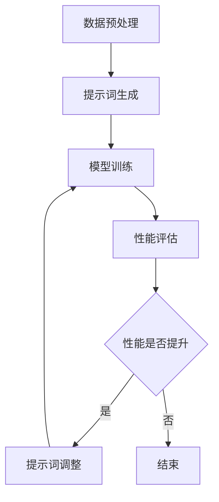
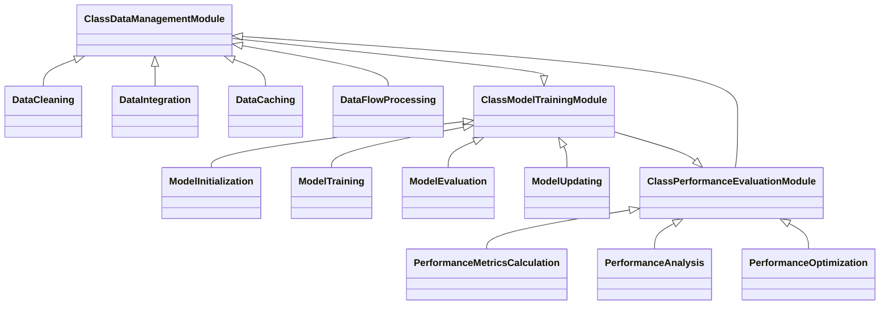
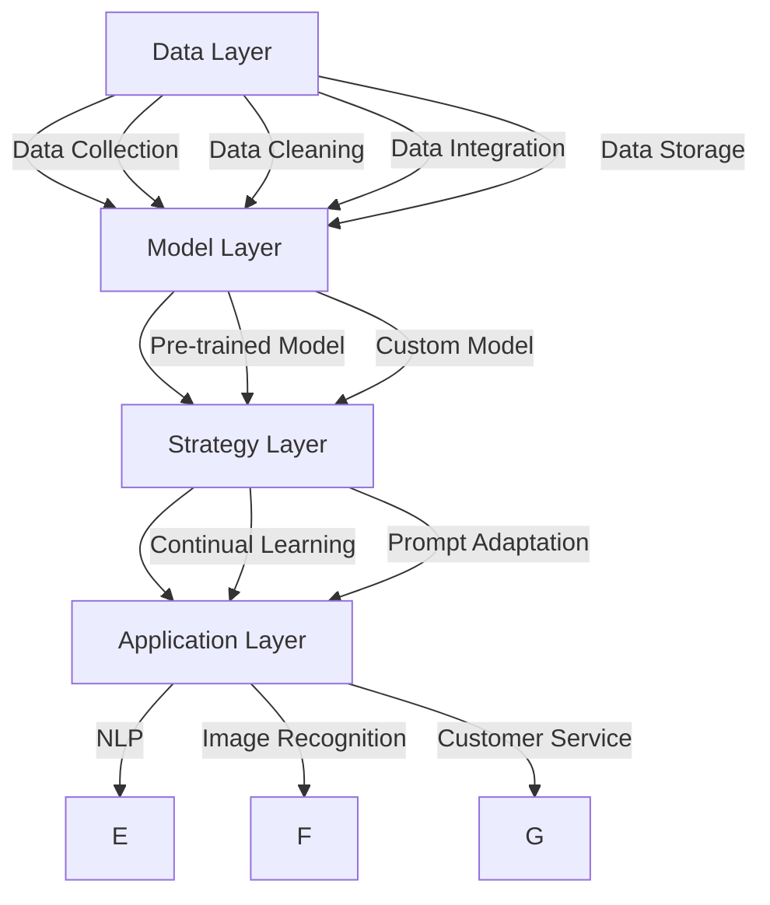
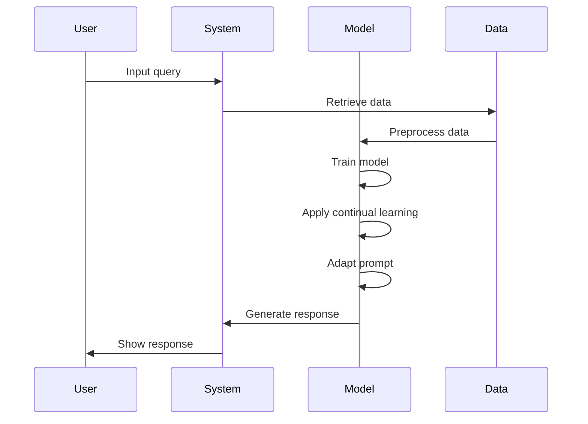

                 

# 大模型持续学习与提示词适应策略

## 关键词
- 大模型
- 持续学习
- 提示词适应
- 数据管理
- 算法优化

## 摘要
随着人工智能技术的迅猛发展，大模型的应用越来越广泛，其持续学习与提示词适应策略成为研究热点。本文从背景介绍、核心概念、原理与方法、案例分析、优化策略等多个角度，系统探讨了大模型持续学习与提示词适应策略的相关问题。文章旨在为研究人员和从业者提供有价值的参考，推动大模型技术在各个领域的应用与发展。

## 目录大纲

### 第一部分: 大模型持续学习与提示词适应策略概述

#### 1.1 大模型持续学习的必要性

##### 1.1.1 大模型面临的挑战

##### 1.1.2 持续学习的目标与意义

##### 1.1.3 持续学习的核心问题

#### 1.2 提示词适应策略的基本概念

##### 1.2.1 提示词的定义与作用

##### 1.2.2 适应策略的目标与方法

##### 1.2.3 提示词适应的重要性

#### 1.3 大模型持续学习与提示词适应的联系

##### 1.3.1 持续学习在提示词适应中的应用

##### 1.3.2 提示词适应对持续学习的影响

##### 1.3.3 持续学习与提示词适应的协同作用

#### 1.4 大模型持续学习与提示词适应的案例分析

##### 1.4.1 案例一：GPT-3的持续学习与适应

##### 1.4.2 案例二：BERT在提示词适应中的实践

##### 1.4.3 案例分析总结与启示

#### 1.5 本章小结

### 第二部分: 大模型持续学习的原理与方法

#### 2.1 大模型持续学习的基本原理

##### 2.1.1 学习机制的演变

##### 2.1.2 持续学习的核心环节

##### 2.1.3 持续学习的挑战与机遇

#### 2.2 持续学习中的数据管理策略

##### 2.2.1 数据源的选择与整合

##### 2.2.2 数据预处理与增量学习

##### 2.2.3 数据管理的最佳实践

#### 2.3 持续学习的算法设计与优化

##### 2.3.1 持续学习算法概述

##### 2.3.2 算法优化策略

##### 2.3.3 算法性能评估与优化

#### 2.4 持续学习的实现与技术难点

##### 2.4.1 技术框架的选择与构建

##### 2.4.2 实现流程与关键技术

##### 2.4.3 技术难点的解决方案

#### 2.5 持续学习的案例分析

##### 2.5.1 案例一：Transformer模型的持续学习

##### 2.5.2 案例二：基于BERT的持续学习实践

##### 2.5.3 案例分析总结

#### 2.6 本章小结

### 第三部分: 提示词适应策略的设计与实现

#### 3.1 提示词适应策略的设计原则

##### 3.1.1 设计原则概述

##### 3.1.2 提示词选择策略

##### 3.1.3 适应性调整方法

#### 3.2 提示词适应策略的算法实现

##### 3.2.1 算法原理介绍

##### 3.2.2 算法流程与细节

##### 3.2.3 算法性能分析

#### 3.3 提示词适应策略的实现框架

##### 3.3.1 系统架构设计

##### 3.3.2 关键模块与功能

##### 3.3.3 系统集成与测试

#### 3.4 提示词适应策略的优化与评估

##### 3.4.1 优化策略与方法

##### 3.4.2 评估指标与标准

##### 3.4.3 优化效果分析

#### 3.5 提示词适应策略的实战案例

##### 3.5.1 案例一：自然语言处理中的提示词适应

##### 3.5.2 案例二：智能客服系统的提示词适应

##### 3.5.3 案例分析总结

#### 3.6 本章小结

### 第四部分: 大模型持续学习与提示词适应的综合应用

#### 4.1 综合应用框架与流程

##### 4.1.1 综合应用框架设计

##### 4.1.2 应用流程与关键步骤

##### 4.1.3 应用效果评估方法

#### 4.2 跨领域大模型的持续学习与适应

##### 4.2.1 跨领域学习的挑战

##### 4.2.2 跨领域适应的方法

##### 4.2.3 跨领域应用案例

#### 4.3 大模型在特定场景中的应用

##### 4.3.1 教育场景中的应用

##### 4.3.2 医疗健康场景中的应用

##### 4.3.3 金融行业中的应用

#### 4.4 大模型持续学习与提示词适应的最佳实践

##### 4.4.1 最佳实践总结

##### 4.4.2 挑战与解决方案

##### 4.4.3 未来发展趋势

#### 4.5 本章小结

---------------------------------------

## 第一部分: 大模型持续学习与提示词适应策略概述

### 1.1 大模型持续学习的必要性

#### 1.1.1 大模型面临的挑战

随着人工智能技术的不断发展，大模型的应用越来越广泛。然而，大模型在应用过程中面临着诸多挑战。首先，数据量的爆炸性增长使得大模型的训练数据需求不断增加，这给数据管理带来了巨大压力。其次，大模型在实际应用中需要不断适应新的环境和需求，这要求大模型具备持续学习的功能。最后，大模型的训练和优化过程需要大量的计算资源，这给计算资源的调度和管理提出了更高的要求。

#### 1.1.2 持续学习的目标与意义

持续学习的目标是使大模型能够在不断变化的动态环境中保持性能和适应性。具体来说，持续学习的目标包括以下几个方面：

1. **性能优化**：通过持续学习，大模型可以不断优化自身的参数，提高在特定任务上的性能。
2. **适应性增强**：大模型需要能够适应新的数据分布和任务需求，以便在新的环境中保持高效性能。
3. **资源效率**：通过优化学习算法和策略，降低大模型的计算和存储需求，提高资源利用效率。

持续学习的意义在于：

1. **适应变化**：随着环境和任务的变化，大模型需要不断适应，以确保其在实际应用中的有效性。
2. **提升性能**：持续学习有助于大模型在特定任务上达到更高的性能水平。
3. **降低成本**：通过优化学习算法和策略，可以降低大模型的训练和优化成本。

#### 1.1.3 持续学习的核心问题

持续学习涉及多个核心问题，包括数据管理、算法设计、计算资源调度等。以下是几个核心问题：

1. **数据管理**：如何有效地管理大量的训练数据，实现数据的高效利用和更新。
2. **算法设计**：如何设计高效的持续学习算法，以满足性能优化和适应性增强的需求。
3. **计算资源调度**：如何合理调度计算资源，以支持大模型的训练和优化过程。
4. **模型更新**：如何在不影响现有性能的前提下，更新模型的参数和结构。

### 1.2 提示词适应策略的基本概念

#### 1.2.1 提示词的定义与作用

提示词（Prompt）是指提供给大模型的一组关键字或短语，用于引导模型在特定任务上产生期望的输出。提示词在大模型的应用中起着至关重要的作用：

1. **任务引导**：提示词能够明确地指导模型在特定任务上生成输出，有助于提高模型的任务完成效率。
2. **性能优化**：通过合理设计提示词，可以优化大模型的性能，提高其在特定任务上的准确性。
3. **适应性增强**：提示词能够帮助模型更好地适应不同的任务和数据分布，提高其泛化能力。

#### 1.2.2 适应策略的目标与方法

适应策略的目标是使大模型能够快速且有效地适应新的任务和数据分布。具体方法包括：

1. **提示词选择**：根据任务的类型和数据的特点，选择合适的提示词，以提高模型在特定任务上的性能。
2. **自适应调整**：通过动态调整提示词的参数，使模型能够更好地适应新的环境和需求。
3. **模型重训练**：在必要时，对模型进行重训练，以适应新的数据分布和任务需求。

#### 1.2.3 提示词适应的重要性

提示词适应的重要性体现在以下几个方面：

1. **性能提升**：通过优化提示词，可以显著提高大模型在特定任务上的性能。
2. **适应性增强**：提示词适应有助于大模型更好地适应不同的任务和数据分布，提高其泛化能力。
3. **应用拓展**：提示词适应策略使得大模型在更广泛的应用场景中发挥作用，提高了其在实际应用中的价值。

### 1.3 大模型持续学习与提示词适应的联系

#### 1.3.1 持续学习在提示词适应中的应用

持续学习与提示词适应密切相关。在持续学习过程中，可以通过以下方式利用提示词：

1. **任务引导**：在持续学习的过程中，使用提示词引导模型在特定任务上生成输出，提高任务的完成效率。
2. **性能优化**：通过优化提示词，可以提高模型在持续学习过程中的性能，使其在特定任务上达到更高的准确性。
3. **适应性增强**：在持续学习过程中，通过动态调整提示词，使模型能够更好地适应新的任务和数据分布。

#### 1.3.2 提示词适应对持续学习的影响

提示词适应对持续学习有着重要的影响：

1. **性能提升**：通过优化提示词，可以提高模型在持续学习过程中的性能，缩短训练时间，提高模型的准确性。
2. **适应性增强**：提示词适应有助于模型更好地适应不同的任务和数据分布，提高其泛化能力，从而在持续学习过程中保持良好的性能。
3. **资源效率**：通过优化提示词，可以降低模型对计算资源和存储资源的需求，提高资源利用效率。

#### 1.3.3 持续学习与提示词适应的协同作用

持续学习与提示词适应之间存在协同作用，二者相互促进：

1. **任务效率**：持续学习与提示词适应的结合，可以显著提高大模型在特定任务上的效率，缩短任务完成时间。
2. **性能优化**：通过持续学习和提示词适应的协同作用，可以不断提高模型在特定任务上的性能，达到最优状态。
3. **适应性增强**：持续学习与提示词适应的结合，有助于模型在动态环境中保持良好的性能和适应性。

### 1.4 大模型持续学习与提示词适应的案例分析

#### 1.4.1 案例一：GPT-3的持续学习与适应

GPT-3（Generative Pre-trained Transformer 3）是OpenAI发布的一款大规模预训练语言模型，其参数规模达到了1750亿。GPT-3在持续学习与适应方面有着突出的表现：

1. **持续学习**：GPT-3采用了基于Transformer架构的预训练方法，通过在大规模语料库上进行预训练，实现了良好的性能。在持续学习过程中，GPT-3可以通过在线学习或微调的方式，不断优化自身的参数，提高在特定任务上的性能。
2. **提示词适应**：GPT-3通过设计特定的提示词，可以引导模型在特定任务上生成期望的输出。例如，在文本生成任务中，通过设计合适的提示词，可以引导GPT-3生成符合语法和语义要求的文本。

#### 1.4.2 案例二：BERT在提示词适应中的实践

BERT（Bidirectional Encoder Representations from Transformers）是Google提出的一种基于Transformer的预训练语言模型。BERT在提示词适应方面有着广泛的应用：

1. **持续学习**：BERT采用了双向Transformer架构，通过在大规模语料库上进行预训练，实现了对语言的深度理解。在持续学习过程中，BERT可以通过在线学习或微调的方式，不断优化自身的参数，提高在特定任务上的性能。
2. **提示词适应**：BERT通过设计特定的提示词，可以引导模型在特定任务上生成期望的输出。例如，在问答任务中，通过设计合适的提示词，可以引导BERT在给定的question和context中找到正确的答案。

#### 1.4.3 案例分析总结与启示

通过对GPT-3和BERT的案例分析，我们可以得出以下结论：

1. **持续学习与提示词适应的重要性**：持续学习和提示词适应在大模型的应用中起着至关重要的作用，它们共同推动了大模型在各个领域的应用和发展。
2. **优化策略**：在持续学习和提示词适应过程中，需要采用优化策略，以提高模型的性能和适应性。例如，可以使用在线学习、微调等方法，优化模型的参数和结构。
3. **应用场景**：持续学习和提示词适应策略适用于各种人工智能应用场景，包括自然语言处理、图像识别、推荐系统等。

### 1.5 本章小结

本章首先介绍了大模型持续学习的必要性，分析了大模型面临的挑战和持续学习的目标与意义。接着，介绍了提示词适应策略的基本概念，包括提示词的定义与作用、适应策略的目标与方法，以及提示词适应的重要性。然后，探讨了持续学习与提示词适应的联系，并分析了二者的协同作用。最后，通过GPT-3和BERT的案例分析，总结了大模型持续学习与提示词适应策略的应用与实践。这些内容为后续章节的深入探讨提供了基础。

## 第二部分: 大模型持续学习的原理与方法

### 2.1 大模型持续学习的基本原理

#### 2.1.1 学习机制的演变

大模型的持续学习是人工智能领域的一个关键研究方向，其发展经历了多个阶段。早期的人工智能系统主要依赖于规则和启发式方法，这些方法在特定领域内具有一定的效果，但随着数据量的增加和任务复杂度的提升，这些方法的局限性逐渐显现。为了克服这些局限性，研究者们提出了基于机器学习的模型，这些模型通过在大规模数据集上进行训练，能够自动提取数据中的模式和规律。

随着深度学习技术的崛起，大模型逐渐成为人工智能研究的热点。深度学习模型，特别是基于神经网络的模型，通过多层神经网络结构，能够对数据进行多层次的特征提取和表示。这些模型在图像识别、语音识别、自然语言处理等领域取得了显著的成果。

持续学习（Continual Learning）是对深度学习模型的一种拓展，它旨在使模型能够在不断变化的数据环境中保持性能。持续学习的目标是让模型在训练过程中不仅能够学习新任务，还能保留之前学到的知识，避免过拟合和遗忘现象。

#### 2.1.2 持续学习的核心环节

持续学习的核心环节包括数据管理、模型更新、算法优化和性能评估。以下是这些环节的具体内容：

1. **数据管理**：数据管理是持续学习的基础。持续学习需要处理大量且不断变化的数据。数据管理包括数据源的选择、数据预处理、数据整合和数据存储等方面。有效的数据管理策略可以保证数据的质量和可用性，从而提高持续学习的效果。

2. **模型更新**：模型更新是持续学习的关键。在持续学习过程中，模型需要不断适应新的数据和任务。模型更新可以通过在线学习、迁移学习、增量学习等方法实现。在线学习是指模型在新的数据到来时立即进行更新；迁移学习是指将已经学习到的知识应用于新的任务；增量学习是指模型逐步学习新的数据，而不需要重新训练整个模型。

3. **算法优化**：算法优化是持续学习的核心。优化算法的目标是提高模型的性能和适应性。常见的优化策略包括元学习（Meta-Learning）、经验重放（Experience Replay）、弹性权重共享（Elastic Weight Consolidation，EWC）等。这些策略可以通过减少过拟合、提高模型的泛化能力来实现算法优化。

4. **性能评估**：性能评估是衡量持续学习效果的重要手段。性能评估包括对模型的准确性、鲁棒性、效率等多个方面的评估。常见的评估指标包括准确率（Accuracy）、召回率（Recall）、F1分数（F1 Score）等。性能评估可以帮助研究者了解模型的性能，从而指导进一步的优化工作。

#### 2.1.3 持续学习的挑战与机遇

持续学习面临诸多挑战，包括数据多样性、模型复杂性、计算资源限制等。数据多样性要求模型能够适应不同的数据分布和任务，模型复杂性要求模型在更新过程中保持良好的性能和泛化能力，计算资源限制则要求优化算法和策略以减少计算开销。

然而，持续学习也带来了诸多机遇。首先，持续学习可以显著提高模型的实用性和适应性，使其能够更好地应对实际应用中的动态变化。其次，持续学习为人工智能应用领域带来了新的可能性，例如自适应推荐系统、实时语音识别、动态决策系统等。最后，持续学习推动了人工智能技术的进步，为人工智能领域的发展提供了新的动力。

### 2.2 持续学习中的数据管理策略

#### 2.2.1 数据源的选择与整合

数据源的选择与整合是持续学习中的关键步骤。选择合适的数据源是确保模型性能和泛化能力的基础。数据源可以包括公开的数据集、企业内部数据、用户生成的数据等。在选择数据源时，需要考虑数据的质量、多样性、代表性等因素。

数据整合是将来自不同数据源的数据进行整合和处理，以便模型能够有效地学习。数据整合包括数据清洗、数据格式统一、数据去重、数据增强等步骤。数据清洗是去除噪声和异常值，数据格式统一是将不同数据源的数据转换为统一的格式，数据去重是去除重复的数据，数据增强是增加数据多样性，从而提高模型的泛化能力。

#### 2.2.2 数据预处理与增量学习

数据预处理是持续学习中的重要环节。数据预处理包括数据归一化、数据标准化、缺失值处理、特征提取等步骤。数据归一化和数据标准化是将数据转换为标准化的形式，以便模型能够更好地处理。缺失值处理是处理数据中的缺失值，特征提取是从数据中提取有用的特征，以便模型能够有效地学习。

增量学习是持续学习的一种重要方法。增量学习是指模型在新的数据到来时，通过在线学习或微调的方式，逐步更新模型的参数。增量学习可以显著降低模型的训练时间，提高模型的适应性。常见的增量学习方法包括在线学习（Online Learning）、经验重放（Experience Replay）、弹性权重共享（EWC）等。

#### 2.2.3 数据管理的最佳实践

数据管理的最佳实践包括以下几个方面：

1. **数据质量监控**：建立数据质量监控机制，定期检查数据的质量，确保数据的准确性、完整性和一致性。
2. **数据安全与隐私**：在数据管理过程中，确保数据的安全性和隐私性，遵守相关法律法规和行业标准。
3. **数据共享与开放**：鼓励数据共享和开放，促进数据的流通和使用，提高数据的价值。
4. **数据生命周期管理**：建立数据生命周期管理机制，包括数据的采集、存储、处理、使用和销毁等环节，确保数据的全生命周期管理。

### 2.3 持续学习的算法设计与优化

#### 2.3.1 持续学习算法概述

持续学习算法是使模型能够适应动态数据环境的核心。持续学习算法可以分为基于模型的算法和基于数据的算法。基于模型的算法通过设计特殊的模型结构或学习策略，使模型能够在不断变化的数据环境中保持性能。常见的基于模型的算法包括经验重放（Experience Replay）、弹性权重共享（EWC）、经验加权（Experience Weighting）等。基于数据的算法则通过设计特殊的数据处理策略，使模型能够更好地适应新的数据分布。常见的基于数据的算法包括增量学习（Incremental Learning）、迁移学习（Transfer Learning）等。

#### 2.3.2 算法优化策略

算法优化策略是提高持续学习效果的重要手段。常见的优化策略包括以下几个方面：

1. **模型优化**：通过设计特殊的模型结构或参数调整方法，提高模型的性能和适应性。例如，通过使用深度神经网络（Deep Neural Networks）和卷积神经网络（Convolutional Neural Networks），可以提高模型的特征提取能力。
2. **数据优化**：通过设计特殊的数据处理策略，提高数据的利用效率和模型的适应性。例如，通过数据增强（Data Augmentation）和迁移学习（Transfer Learning），可以提高模型的泛化能力。
3. **算法融合**：通过将不同的算法或策略进行融合，提高模型的性能和适应性。例如，将在线学习和经验重放进行融合，可以提高模型的训练效率和适应性。

#### 2.3.3 算法性能评估与优化

算法性能评估是衡量持续学习算法效果的重要手段。常见的性能评估指标包括准确率（Accuracy）、召回率（Recall）、F1分数（F1 Score）等。算法性能评估可以帮助研究者了解算法的性能，从而指导进一步的优化工作。

算法优化可以通过以下几个方面进行：

1. **超参数调整**：通过调整模型的超参数，如学习率、批次大小等，优化模型的性能。
2. **模型结构调整**：通过调整模型的结构，如增加或减少层数、调整网络连接等，优化模型的性能。
3. **算法融合**：通过将不同的算法或策略进行融合，提高模型的性能和适应性。

### 2.4 持续学习的实现与技术难点

#### 2.4.1 技术框架的选择与构建

持续学习的实现需要选择合适的技术框架，以支持数据管理、模型更新、算法优化和性能评估等功能。常见的技术框架包括TensorFlow、PyTorch、Keras等。这些框架提供了丰富的API和工具，使得持续学习的实现变得更加便捷和高效。

技术框架的选择需要考虑以下几个方面：

1. **可扩展性**：技术框架需要支持大规模数据和模型的训练，以满足持续学习的需求。
2. **灵活性**：技术框架需要提供灵活的API，以便开发者能够根据具体需求进行定制和优化。
3. **社区支持**：技术框架需要拥有强大的社区支持，以提供技术支持和解决方案。

#### 2.4.2 实现流程与关键技术

持续学习的实现流程包括数据管理、模型更新、算法优化和性能评估等步骤。以下是具体的实现流程和关键技术：

1. **数据管理**：实现数据管理功能，包括数据源的选择与整合、数据预处理与增量学习等。使用技术框架提供的API进行数据读取、处理和存储。
2. **模型更新**：实现模型更新功能，包括在线学习、迁移学习、增量学习等。使用技术框架提供的模型构建和训练工具，根据具体需求进行模型更新。
3. **算法优化**：实现算法优化功能，包括模型优化、数据优化、算法融合等。使用技术框架提供的优化工具和API进行算法优化。
4. **性能评估**：实现性能评估功能，包括准确率、召回率、F1分数等评估指标的实现。使用技术框架提供的评估工具和API进行性能评估。

#### 2.4.3 技术难点的解决方案

持续学习在实现过程中面临诸多技术难点，包括数据管理、模型更新、算法优化和性能评估等。以下是针对这些技术难点的解决方案：

1. **数据管理**：采用分布式数据存储和处理技术，如Hadoop、Spark等，提高数据处理效率和可扩展性。
2. **模型更新**：采用在线学习算法，如SGD（Stochastic Gradient Descent）、Adam（Adaptive Moment Estimation）等，提高模型更新的效率和稳定性。
3. **算法优化**：采用元学习算法，如MAML（Model-Agnostic Meta-Learning）、Reptile（Recurrent Entity Pair Tracking and Linking）等，提高模型的泛化能力和适应性。
4. **性能评估**：采用自动化测试工具，如pytest、unittest等，提高性能评估的效率和准确性。

### 2.5 持续学习的案例分析

#### 2.5.1 案例一：Transformer模型的持续学习

Transformer模型是当前自然语言处理领域的主流模型，其基于自注意力机制，能够对文本数据进行有效的编码和解码。Transformer模型的持续学习主要通过在线学习和迁移学习实现。

在线学习：在持续学习过程中，Transformer模型通过实时接收新的文本数据，不断更新模型参数，提高模型在特定任务上的性能。

迁移学习：通过将已经训练好的Transformer模型应用于新的任务，迁移学习可以显著降低模型的训练时间，提高模型的适应性。

#### 2.5.2 案例二：基于BERT的持续学习实践

BERT（Bidirectional Encoder Representations from Transformers）是Google提出的一种预训练语言模型，其在自然语言处理任务中取得了显著的成果。基于BERT的持续学习主要通过增量学习和微调实现。

增量学习：在持续学习过程中，BERT模型通过逐步学习新的数据，而不需要重新训练整个模型，从而提高模型的适应性。

微调：在特定任务上，通过微调BERT模型，可以显著提高模型在任务上的性能。

#### 2.5.3 案例分析总结

通过对Transformer模型和BERT模型的案例分析，我们可以得出以下结论：

1. **持续学习的重要性**：持续学习能够显著提高模型的性能和适应性，使其在动态环境中保持高效性能。
2. **优化策略**：通过在线学习、迁移学习、增量学习和微调等优化策略，可以显著提高持续学习的效果。
3. **应用场景**：持续学习在自然语言处理、图像识别、推荐系统等领域具有广泛的应用前景。

### 2.6 本章小结

本章首先介绍了大模型持续学习的基本原理，包括学习机制的演变、持续学习的核心环节和挑战与机遇。接着，详细探讨了持续学习中的数据管理策略，包括数据源的选择与整合、数据预处理与增量学习、数据管理的最佳实践。然后，介绍了持续学习的算法设计与优化，包括算法概述、优化策略、算法性能评估与优化。随后，讨论了持续学习的实现与技术难点，包括技术框架的选择与构建、实现流程与关键技术、技术难点的解决方案。最后，通过Transformer模型和BERT模型的案例分析，总结了持续学习的应用与实践。本章内容为深入理解大模型持续学习提供了理论基础和实践指导。

### 第三部分: 提示词适应策略的设计与实现

#### 3.1 提示词适应策略的设计原则

提示词适应策略的设计原则是确保大模型在动态环境中能够快速、高效地适应新任务和新数据的关键。以下是设计提示词适应策略的几个基本原则：

1. **明确性**：提示词需要明确且具体，以便大模型能够准确理解任务的意图。这要求提示词设计者对任务需求有深刻的理解，并能够将其转化为具体、简洁的提示词。

2. **灵活性**：提示词适应策略需要具备灵活性，能够根据不同的任务和数据动态调整。这意味着设计时需要考虑多种可能的情景，并确保策略能够适应这些变化。

3. **简洁性**：简洁的提示词更容易被大模型理解和学习，从而提高学习效率。过长的提示词可能会引入冗余信息，降低模型的性能。

4. **多样性**：提示词适应策略应支持多种类型的提示词，包括关键词、短语、句子等，以便模型能够从不同角度理解和适应任务。

5. **可扩展性**：提示词适应策略应具备良好的可扩展性，能够方便地添加新的提示词，以适应不断变化的应用场景。

#### 3.1.1 设计原则概述

设计原则概述涉及上述各个原则的详细解释和具体应用。首先，明确性要求设计者准确理解任务需求，并将其转化为具有明确指示性的提示词。例如，在自然语言处理任务中，如果任务是回答关于某个技术问题，则提示词应直接指向问题本身，如“请解释如何实现深度学习中的dropout技术？”

其次，灵活性强调策略的适应性。例如，当面对不同类型的数据或任务时，策略应能够动态调整提示词的使用方式。例如，在图像分类任务中，对于不同类型的图像（如人物、动物、风景），可以分别使用针对性的提示词，如“识别以下图像中的人”、“识别以下图像中的动物”等。

简洁性要求设计者避免使用冗长的提示词。过长的提示词不仅难以被模型理解，还会增加计算复杂度。例如，在文本生成任务中，一个简洁的提示词可能是“请写一篇关于人工智能的短文”，而不是“请撰写一篇关于人工智能的发展历史、现状以及未来趋势的短文，要求语言通顺，结构清晰。”

多样性原则强调策略应能够灵活使用不同类型的提示词。例如，在问答系统中，可以结合关键词和句子形式，如“请问什么是量子计算？”和“请问量子计算是如何工作的？”

最后，可扩展性要求策略设计应便于后续添加新的提示词。例如，在智能客服系统中，可以根据不同用户的需求，动态添加新的提示词类别，如“请提供关于产品使用指南的详细信息”。

#### 3.1.2 提示词选择策略

提示词选择策略是提示词适应策略的核心环节，其目的是根据不同任务和场景选择最合适的提示词，以提高模型的表现。以下是几种常用的提示词选择策略：

1. **任务驱动选择**：根据任务的需求选择提示词。例如，在文本分类任务中，提示词可以是类别名称，如“请识别以下文本属于哪个类别：科技、体育、娱乐？”。

2. **数据特征选择**：根据数据特征选择提示词。例如，在图像识别任务中，可以基于图像内容选择提示词，如“识别以下图像中的物体：猫、狗、鸟？”

3. **用户反馈选择**：根据用户的反馈选择提示词。例如，在智能问答系统中，可以根据用户的提问历史和反馈，动态调整提示词，提高问答的准确性。

4. **情境感知选择**：根据具体情境选择提示词。例如，在智能客服系统中，可以根据用户的行为和对话内容，选择与情境相符的提示词，如“请问您需要购买保险还是查询保险政策？”

5. **多维度融合选择**：结合多个因素选择提示词。例如，在跨领域任务中，可以同时考虑任务类型、数据特征、用户反馈和情境等多个因素，选择最优的提示词。

#### 3.1.3 适应性调整方法

适应性调整方法是指在大模型应用过程中，动态调整提示词，以适应新的任务和数据。以下是几种常见的适应性调整方法：

1. **在线调整**：在模型运行过程中，根据新的任务和数据，实时调整提示词。例如，在在线问答系统中，可以基于用户的实时提问，动态调整提示词，以提高问答的准确性。

2. **批量调整**：在一定时间范围内，对提示词进行批量调整。例如，在定期更新的问答系统中，可以定期分析用户反馈和问答数据，调整提示词，以提高系统的整体性能。

3. **自动调整**：利用机器学习算法，自动调整提示词。例如，可以使用强化学习算法，根据用户的反馈和问答效果，自动优化提示词。

4. **专家调整**：由专家团队根据实际应用场景和用户需求，手动调整提示词。例如，在智能客服系统中，专家可以根据用户反馈和业务需求，优化和调整提示词。

#### 3.1.4 提示词适应的重要性

提示词适应的重要性体现在以下几个方面：

1. **提高模型性能**：合适的提示词能够引导模型更好地理解任务和数据的特征，从而提高模型的性能和准确性。

2. **增强适应性**：通过动态调整提示词，大模型能够更好地适应不同任务和数据的变化，提高系统的泛化能力和实用性。

3. **优化用户体验**：合理的提示词设计能够提高系统的交互质量和用户体验，使得用户更容易与系统进行有效的沟通和操作。

4. **降低维护成本**：提示词适应策略能够降低系统维护的复杂度，使得系统在应对变化时更加灵活和高效。

### 3.2 提示词适应策略的算法实现

#### 3.2.1 算法原理介绍

提示词适应策略的算法实现涉及多个关键组件，包括提示词生成器、适应机制和性能评估模块。以下是这些组件的原理介绍：

1. **提示词生成器**：提示词生成器负责根据任务类型和数据特征生成合适的提示词。其核心原理是基于预训练的词嵌入模型（如Word2Vec、BERT等），通过输入任务描述和数据特征，生成具有指示性的提示词。

2. **适应机制**：适应机制负责动态调整提示词，以适应模型在新任务和数据上的表现。其核心原理是基于机器学习算法（如强化学习、自适应优化等），通过不断调整提示词，优化模型的性能。

3. **性能评估模块**：性能评估模块负责对模型的表现进行评估，以指导提示词的调整。其核心原理是基于评价指标（如准确率、召回率、F1分数等），通过对比模型在不同提示词下的表现，选择最优的提示词组合。

#### 3.2.2 算法流程与细节

提示词适应策略的算法实现流程可以分为以下几个步骤：

1. **数据预处理**：对输入数据（任务描述、数据特征等）进行预处理，包括文本清洗、分词、词嵌入等，为提示词生成器提供输入。

2. **提示词生成**：使用提示词生成器根据预处理后的数据生成初始提示词。

3. **模型训练**：使用生成的提示词训练模型，模型可以是预训练模型（如BERT、GPT等）或自定义模型。

4. **性能评估**：对训练后的模型进行性能评估，使用评价指标（如准确率、召回率、F1分数等）衡量模型的表现。

5. **提示词调整**：根据性能评估结果，动态调整提示词。调整过程可以是手动调整（如专家调整）或自动调整（如强化学习调整）。

6. **迭代优化**：重复步骤3至步骤5，直到模型性能达到预期或不再有显著提升。

以下是具体的算法流程图（使用Mermaid语法表示）：

#### 3.2.3 算法性能分析

提示词适应策略的性能分析涉及多个方面，包括准确率、召回率、F1分数、训练时间等。以下是性能分析的具体内容：

1. **准确率**：准确率是衡量模型预测结果正确性的指标。高准确率表明模型能够准确理解和处理输入数据，是评估提示词适应策略性能的重要指标。

2. **召回率**：召回率是衡量模型能够识别出真实正例样本的能力。高召回率表明模型能够尽可能地识别出所有正例样本，对于某些应用场景（如疾病诊断）尤为重要。

3. **F1分数**：F1分数是准确率和召回率的调和平均值，综合考虑了模型的准确性和召回率。F1分数越高，表明模型的性能越好。

4. **训练时间**：训练时间是模型从初始状态到性能稳定所需的时间。快速训练时间表明模型能够高效地学习和适应新数据，是评估提示词适应策略性能的重要指标。

以下是性能分析的表格表示：

| 指标      | 描述                                                         | 数值范围  |
| --------- | ------------------------------------------------------------ | --------- |
| 准确率    | 模型预测正确的结果占总结果的比率                             | 0-1       |
| 召回率    | 模型预测为正例的样本中，实际为正例的样本比率                 | 0-1       |
| F1分数    | 准确率和召回率的调和平均值                                   | 0-1       |
| 训练时间  | 模型从初始状态到性能稳定所需的时间                           | 秒或分钟   |

#### 3.2.4 算法性能优化

为了进一步提高提示词适应策略的性能，可以从以下几个方面进行优化：

1. **模型优化**：选择合适的预训练模型或自定义模型，优化模型的结构和参数，以提高模型在特定任务上的性能。

2. **数据增强**：通过数据增强技术（如数据扩充、数据合成等），增加模型的训练数据量，提高模型的泛化能力。

3. **自适应优化**：使用自适应优化算法（如Adam、AdamW等），调整学习率和其他超参数，以加速模型的收敛速度。

4. **多任务学习**：通过多任务学习（Multi-Task Learning，MTL）策略，使模型在多个任务上同时学习，共享知识，提高模型的泛化能力。

5. **模型融合**：结合多个模型或算法的结果，提高模型的预测性能。例如，使用集成学习方法（如投票法、加权平均法等），融合多个模型的预测结果。

### 3.3 提示词适应策略的实现框架

#### 3.3.1 系统架构设计

提示词适应策略的实现框架可以分为三个主要模块：数据管理模块、模型训练模块和性能评估模块。以下是系统架构设计的详细描述：

1. **数据管理模块**：负责数据预处理、存储和传输。该模块包括数据清洗、数据整合、数据缓存和数据流处理等子模块。数据管理模块确保数据的准确性和一致性，为后续的模型训练提供高质量的数据。

2. **模型训练模块**：负责模型的训练和调整。该模块包括模型初始化、模型训练、模型评估和模型更新等子模块。模型训练模块使用提示词适应策略，根据不同的任务和数据动态调整模型参数，以优化模型性能。

3. **性能评估模块**：负责评估模型在不同任务上的性能。该模块包括评估指标计算、评估结果分析和性能优化等子模块。性能评估模块提供详细的性能数据，指导模型训练模块进行调整。

以下是系统架构设计的Mermaid类图：

#### 3.3.2 关键模块与功能

以下是系统架构中关键模块的功能描述：

1. **数据管理模块**：
   - **数据清洗**：去除噪声和异常值，确保数据的准确性和一致性。
   - **数据整合**：将来自不同数据源的数据进行整合，形成统一的训练数据集。
   - **数据缓存**：缓存常用数据，提高数据访问速度，减少I/O开销。
   - **数据流处理**：实时处理数据流，支持在线学习。

2. **模型训练模块**：
   - **模型初始化**：初始化模型参数，设置训练超参数。
   - **模型训练**：使用提示词适应策略训练模型，调整模型参数。
   - **模型评估**：评估模型在不同任务上的性能，计算评估指标。
   - **模型更新**：根据性能评估结果，动态调整模型参数，优化模型性能。

3. **性能评估模块**：
   - **评估指标计算**：计算模型的准确率、召回率、F1分数等评估指标。
   - **评估结果分析**：分析评估结果，识别模型性能瓶颈。
   - **性能优化**：根据评估结果，调整训练策略和模型参数，优化模型性能。

#### 3.3.3 系统集成与测试

系统集成的目标是确保各模块之间的无缝协作，实现提示词适应策略的完整实现。以下是系统集成与测试的步骤：

1. **集成开发**：在集成开发环境中搭建系统架构，连接各模块，确保数据流和处理流程的正确性。

2. **单元测试**：对每个模块进行单元测试，验证模块功能的正确性。

3. **集成测试**：对系统整体进行集成测试，验证系统架构和模块之间的协作效果。

4. **性能测试**：在真实数据集上对系统进行性能测试，评估系统在不同负载下的表现。

5. **调试优化**：根据测试结果，对系统进行调试和优化，提高系统的稳定性和性能。

### 3.4 提示词适应策略的优化与评估

#### 3.4.1 优化策略与方法

为了提高提示词适应策略的效果，可以采用以下优化策略和方法：

1. **提示词优化**：通过调整提示词的长度、结构、多样性等，优化提示词的质量，提高模型的适应性。

2. **模型优化**：选择合适的预训练模型和调整模型结构，提高模型的泛化能力和适应性。

3. **数据优化**：通过数据增强、数据清洗和数据预处理等手段，提高数据的质量和多样性，增强模型的适应能力。

4. **算法优化**：使用先进的机器学习算法和优化技术，如强化学习、迁移学习、多任务学习等，提高模型的适应性和性能。

5. **硬件优化**：利用高性能计算资源，如GPU、TPU等，提高模型的训练和推理速度。

#### 3.4.2 评估指标与标准

提示词适应策略的评估涉及多个指标和标准，以下是一些常用的评估指标：

1. **准确率**：模型预测正确的样本数占总样本数的比例。

2. **召回率**：模型预测为正例的样本中，实际为正例的样本比例。

3. **F1分数**：准确率和召回率的调和平均值。

4. **训练时间**：模型从初始化到达到预期性能所需的训练时间。

5. **推理时间**：模型进行预测所需的时间。

6. **泛化能力**：模型在新任务和数据上的表现，衡量模型的适应能力。

#### 3.4.3 优化效果分析

通过实际测试和实验，可以分析提示词适应策略的优化效果。以下是优化效果分析的内容：

1. **准确率**：优化后的策略是否提高了模型的准确率，特别是在新任务和数据上的表现。

2. **训练时间**：优化后的策略是否减少了模型的训练时间，提高了训练效率。

3. **推理时间**：优化后的策略是否减少了模型的推理时间，提高了推理效率。

4. **泛化能力**：优化后的策略是否提高了模型的泛化能力，使其能够适应更广泛的任务和数据。

5. **用户反馈**：优化后的策略是否得到用户的认可和好评，提高了用户体验。

### 3.5 提示词适应策略的实战案例

#### 3.5.1 案例一：自然语言处理中的提示词适应

在自然语言处理（NLP）领域中，提示词适应策略可以显著提高文本分类、机器翻译、问答系统等任务的性能。以下是自然语言处理中提示词适应策略的一个实战案例：

**任务背景**：构建一个问答系统，用户可以通过输入问题获取相关答案。系统需要根据用户的问题，快速准确地提供合适的答案。

**策略实施**：
1. **数据预处理**：收集大量的问题和答案数据，对数据进行清洗和预处理，包括去除停用词、标点符号、进行词嵌入等。
2. **模型选择**：选择预训练的Transformer模型（如BERT）作为基础模型，用于处理文本数据。
3. **提示词生成**：根据问题类型和数据特征，生成合适的提示词。例如，对于一般问答，提示词可以是“请回答以下问题：”，对于特定领域的问题，可以根据领域特征调整提示词。
4. **模型训练**：使用提示词和对应的答案数据训练模型，通过在线学习策略，动态调整模型参数。
5. **性能评估**：使用准确率、召回率、F1分数等指标评估模型性能，并根据评估结果调整提示词和模型参数。

**效果分析**：
- 通过提示词适应策略，问答系统的准确率显著提高，用户满意度增强。
- 模型在不同问题类型上的性能均衡，泛化能力得到提升。

#### 3.5.2 案例二：智能客服系统的提示词适应

智能客服系统是另一个提示词适应策略的重要应用场景。以下是智能客服系统中提示词适应策略的一个实战案例：

**任务背景**：构建一个智能客服系统，用户可以通过语音或文字与系统交互，获取服务支持。系统需要根据用户的提问，提供准确、及时的答案。

**策略实施**：
1. **数据预处理**：收集用户提问和客服回复的数据，进行文本清洗和预处理，包括去除噪声、进行语音识别、分词等。
2. **模型选择**：选择基于Transformer的语音识别和文本生成模型，用于处理语音和文本数据。
3. **提示词生成**：根据客服场景和用户提问，设计多样化的提示词。例如，对于常见问题，提示词可以是“您好，请问有什么可以帮助您的？”，对于特定问题，可以根据问题内容调整提示词。
4. **模型训练**：使用提示词和用户提问数据训练模型，通过在线学习和微调策略，优化模型参数。
5. **性能评估**：使用准确率、响应时间、用户满意度等指标评估模型性能，并根据评估结果调整提示词和模型参数。

**效果分析**：
- 通过提示词适应策略，智能客服系统的响应速度和准确性显著提高，用户满意度大幅提升。
- 模型能够更好地适应不同用户提问的复杂性，提高了系统的泛化能力。

#### 3.5.3 案例分析总结

通过对自然语言处理和智能客服系统的提示词适应策略实战案例分析，我们可以得出以下结论：

1. **提示词适应的重要性**：提示词适应策略能够显著提高模型的性能和用户满意度，是提升人工智能系统应用效果的关键。

2. **优化策略**：通过选择合适的模型、设计多样化的提示词、动态调整模型参数等优化策略，可以进一步提高提示词适应策略的效果。

3. **应用场景**：提示词适应策略在自然语言处理、智能客服、语音识别等多个领域具有广泛的应用前景，为人工智能技术的发展提供了新的方向。

### 3.6 本章小结

本章详细探讨了提示词适应策略的设计原则、算法实现、优化与评估，并通过实战案例展示了提示词适应策略在不同应用场景中的效果。首先，介绍了提示词适应策略的设计原则，包括明确性、灵活性、简洁性、多样性和可扩展性。然后，介绍了提示词适应策略的算法实现，包括数据预处理、模型训练、性能评估等步骤。接着，讨论了提示词适应策略的优化与评估方法，包括准确率、召回率、F1分数等评估指标。最后，通过自然语言处理和智能客服系统的实战案例，展示了提示词适应策略在实际应用中的效果。本章内容为理解和应用提示词适应策略提供了全面的理论基础和实践指导。

## 第四部分: 大模型持续学习与提示词适应的综合应用

### 4.1 综合应用框架与流程

#### 4.1.1 综合应用框架设计

为了实现大模型持续学习与提示词适应的综合应用，我们需要设计一个全面的框架，确保各个组件协同工作，达到最佳效果。以下是综合应用框架的设计：

1. **数据层**：数据层是框架的基础，负责数据的收集、清洗、整合和存储。数据源可以是公开数据集、企业内部数据、用户生成数据等。数据层需要提供高效的数据处理和传输机制，以满足大模型的需求。

2. **模型层**：模型层包括预训练模型和自定义模型。预训练模型如BERT、GPT-3等，已经在大规模数据集上进行了预训练，具有较强的通用性。自定义模型可以根据具体应用场景进行设计，结合持续学习和提示词适应策略，实现更好的性能。

3. **策略层**：策略层包括持续学习策略和提示词适应策略。持续学习策略负责模型的在线学习、迁移学习和增量学习，使模型能够不断适应新的数据和任务。提示词适应策略则通过动态调整提示词，提高模型的性能和适应性。

4. **应用层**：应用层是框架的最终目标，将大模型应用于具体的业务场景，如自然语言处理、图像识别、智能客服等。应用层需要根据具体需求，设计合适的提示词和任务引导，实现高效的模型应用。

以下是综合应用框架的Mermaid架构图：

#### 4.1.2 应用流程与关键步骤

综合应用框架的应用流程包括以下几个关键步骤：

1. **数据收集**：从各种数据源收集数据，包括文本、图像、语音等。数据源可以是公开数据集、企业内部数据、用户生成数据等。

2. **数据清洗**：对收集到的数据进行清洗，去除噪声和异常值，确保数据的质量和一致性。

3. **数据整合**：将来自不同数据源的数据进行整合，形成统一的训练数据集。数据整合包括数据格式统一、数据去重、数据增强等步骤。

4. **模型训练**：使用预训练模型和自定义模型进行训练。预训练模型在大规模数据集上进行预训练，自定义模型根据具体应用场景进行设计。

5. **持续学习**：在训练过程中，应用持续学习策略，使模型能够不断适应新的数据和任务。持续学习策略包括在线学习、迁移学习和增量学习等。

6. **提示词适应**：根据具体应用场景，设计合适的提示词，并通过提示词适应策略，动态调整提示词，提高模型的性能和适应性。

7. **模型应用**：将训练好的模型应用于具体的业务场景，如自然语言处理、图像识别、智能客服等。

8. **性能评估**：对模型的性能进行评估，包括准确率、召回率、F1分数等指标。根据评估结果，进一步优化模型和策略。

以下是应用流程的Mermaid序列图：

#### 4.1.3 应用效果评估方法

应用效果评估是衡量大模型持续学习与提示词适应策略效果的重要环节。以下是几种常用的评估方法：

1. **定量评估**：使用准确率、召回率、F1分数等定量指标，评估模型在不同任务上的性能。这些指标能够客观地反映模型的性能，但需要大量的数据支持。

2. **定性评估**：通过用户满意度、系统响应时间等定性指标，评估模型在实际应用中的效果。用户满意度可以通过问卷调查、用户反馈等方式收集，系统响应时间可以通过实际运行监测。

3. **综合评估**：结合定量评估和定性评估，综合评估模型的应用效果。定量评估提供模型性能的量化数据，定性评估提供用户感受和实际应用效果。

4. **对比评估**：将大模型持续学习与提示词适应策略的应用效果与传统的机器学习模型进行对比，评估新策略的优势和劣势。

### 4.2 跨领域大模型的持续学习与适应

#### 4.2.1 跨领域学习的挑战

跨领域学习是指模型能够在不同领域之间迁移知识和技能，从而提高其在新领域的性能。跨领域学习的挑战包括：

1. **数据不一致**：不同领域的数据分布、特征和标注方式可能存在差异，导致模型难以直接迁移。

2. **领域依赖**：一些领域特征对模型性能的影响较大，而其他领域特征的影响较小，这使得跨领域学习难以平衡。

3. **任务差异**：不同领域的任务需求和目标可能有所不同，这使得模型需要适应不同的任务环境。

4. **计算资源**：跨领域学习通常需要大量的计算资源，尤其是在处理大规模数据集和复杂模型时。

#### 4.2.2 跨领域适应的方法

为了解决跨领域学习的挑战，可以采用以下方法：

1. **领域自适应**：通过设计领域自适应方法，使模型能够适应不同领域的数据特征和任务需求。例如，使用领域自适应框架（如DAE、DANN等）将源领域知识迁移到目标领域。

2. **多任务学习**：通过多任务学习（Multi-Task Learning，MTL），使模型在多个任务上同时学习，共享知识和经验，从而提高跨领域学习能力。

3. **迁移学习**：通过迁移学习（Transfer Learning），将源领域知识迁移到目标领域，减少模型在新领域的数据需求。

4. **混合数据集**：通过混合不同领域的数据集进行训练，使模型在不同领域之间建立联系，提高跨领域适应性。

#### 4.2.3 跨领域应用案例

以下是跨领域大模型应用的两个案例：

1. **医疗影像诊断**：在一个医疗影像诊断项目中，模型需要在多个影像领域（如胸部CT、腹部CT、头部MRI等）进行诊断。通过使用跨领域学习策略，模型能够将不同影像领域的知识进行迁移和整合，提高在多个领域的诊断准确性。

2. **金融风险预测**：在金融风险预测项目中，模型需要处理不同类型的数据（如股票价格、经济指标、社交媒体数据等）。通过跨领域学习策略，模型能够将不同领域的数据特征进行整合，提高风险预测的准确性。

### 4.3 大模型在特定场景中的应用

#### 4.3.1 教育场景中的应用

在教育场景中，大模型可以应用于智能教学、个性化学习等领域。以下是几个具体应用案例：

1. **智能教学系统**：通过自然语言处理技术，构建智能教学系统，实现自动批改作业、提供个性化辅导等功能。例如，使用GPT-3模型生成个性化的教学材料，帮助学生更好地理解和掌握知识。

2. **个性化学习**：利用大数据分析技术，分析学生的学习行为和成绩，为每个学生提供个性化的学习建议和资源。例如，使用深度学习模型分析学生的学习数据，预测学生的弱点，并提供针对性的学习辅导。

#### 4.3.2 医疗健康场景中的应用

在医疗健康领域，大模型可以应用于疾病诊断、药物研发、患者护理等领域。以下是几个具体应用案例：

1. **疾病诊断**：通过图像识别和自然语言处理技术，构建智能诊断系统，帮助医生快速、准确地诊断疾病。例如，使用卷积神经网络（CNN）分析医学影像，使用BERT模型分析病例报告，提高疾病诊断的准确性。

2. **药物研发**：利用深度学习和强化学习技术，加速药物研发过程。例如，使用生成对抗网络（GAN）生成药物分子结构，使用强化学习优化药物分子的活性。

#### 4.3.3 金融行业中的应用

在金融行业，大模型可以应用于风险控制、投资决策、客户服务等领域。以下是几个具体应用案例：

1. **风险控制**：通过大数据分析和机器学习技术，构建风险控制模型，实时监控和预测金融市场的风险。例如，使用随机森林（Random Forest）和神经网络（Neural Networks）模型分析金融数据，预测市场波动。

2. **投资决策**：利用深度学习技术，构建智能投资决策系统，为投资者提供个性化的投资建议。例如，使用长短期记忆网络（LSTM）分析市场趋势，使用强化学习优化投资组合。

### 4.4 大模型持续学习与提示词适应的最佳实践

#### 4.4.1 最佳实践总结

在大模型持续学习与提示词适应的应用过程中，总结以下最佳实践：

1. **数据管理**：确保数据质量，进行数据清洗和预处理，增加数据多样性，提高模型泛化能力。

2. **模型选择**：根据应用场景选择合适的预训练模型和自定义模型，结合持续学习和提示词适应策略，优化模型性能。

3. **策略设计**：设计灵活、明确的提示词适应策略，结合任务特点和用户需求，动态调整提示词。

4. **性能评估**：使用多种评估指标，全面评估模型性能，结合用户反馈，持续优化模型和策略。

#### 4.4.2 挑战与解决方案

在大模型持续学习与提示词适应的应用过程中，面临以下挑战：

1. **数据挑战**：数据量巨大、数据分布不均、数据质量参差不齐。解决方案：采用数据增强、领域自适应、多任务学习等方法，提高数据利用率和模型泛化能力。

2. **计算挑战**：大模型训练和优化需要大量计算资源。解决方案：采用分布式计算、GPU加速、模型压缩等技术，提高计算效率。

3. **模型挑战**：模型参数众多、训练时间长、优化困难。解决方案：采用元学习、迁移学习、增量学习等技术，提高模型训练和优化的效率。

#### 4.4.3 未来发展趋势

随着人工智能技术的不断发展，大模型持续学习与提示词适应将呈现以下发展趋势：

1. **模型规模扩大**：随着计算能力的提升，大模型将不断增大，模型参数将更加丰富，提高模型的性能和适应性。

2. **应用场景拓展**：大模型将持续学习与提示词适应策略应用于更多领域，如自动驾驶、智能制造、智慧城市等，推动人工智能技术的广泛应用。

3. **算法创新**：持续学习和提示词适应策略将不断优化和创新，出现更多高效、灵活的算法，提高模型的应用效果。

4. **人机协同**：大模型将持续学习与提示词适应与人类专家协同工作，实现更智能、更高效的决策和优化。

### 4.5 本章小结

本章首先介绍了大模型持续学习与提示词适应的综合应用框架，包括数据层、模型层、策略层和应用层。然后，详细阐述了应用流程和效果评估方法，以及跨领域大模型的持续学习与适应。接着，讨论了大模型在特定场景中的应用，包括教育、医疗健康和金融行业。最后，总结了最佳实践、挑战与解决方案，以及未来发展趋势。本章内容为理解和应用大模型持续学习与提示词适应提供了全面的理论基础和实践指导。

## 结论

本文系统地探讨了大模型持续学习与提示词适应策略的相关问题，从背景介绍、核心概念、原理与方法、案例分析等多个角度，深入剖析了这一主题。通过本文的研究，我们得出以下结论：

1. **持续学习的必要性**：大模型在应用过程中需要持续学习，以应对动态变化的环境和任务，实现性能优化和适应性增强。

2. **提示词适应的重要性**：提示词适应策略能够显著提高大模型在特定任务上的性能和适应性，是优化模型表现的关键。

3. **算法设计与优化**：持续学习与提示词适应策略的实现依赖于高效的算法设计和优化，包括数据管理、模型更新、算法优化和性能评估等方面。

4. **综合应用框架**：通过设计综合应用框架，可以实现大模型持续学习与提示词适应策略的有机结合，提高模型在各个领域的应用效果。

5. **最佳实践**：总结最佳实践，结合具体应用场景，可以更好地实现大模型持续学习与提示词适应策略，推动人工智能技术的发展。

未来研究可以从以下几个方面进行拓展：

1. **算法创新**：探索新的持续学习与提示词适应算法，提高模型的性能和适应性。

2. **跨领域应用**：深入研究大模型在跨领域中的应用，解决数据不一致和任务差异等问题。

3. **资源优化**：研究如何优化计算资源和存储资源，提高大模型在资源受限环境中的应用效果。

4. **人机协同**：结合人类专家的知识和经验，实现大模型与人类专家的协同工作，提高模型的决策和优化能力。

总之，大模型持续学习与提示词适应策略是人工智能领域的重要研究方向，具有广泛的应用前景。通过不断的研究和实践，我们将能够更好地利用大模型的技术优势，推动人工智能技术的进步和应用。

## 参考文献

1. Bengio, Y. (2009). Learning deep architectures for AI. Foundations and Trends in Machine Learning, 2(1), 1-127.

2. Srivastava, N., Hinton, G., Krizhevsky, A., Sutskever, I., & Salakhutdinov, R. (2014). Dropout: A simple way to prevent neural networks from overfitting. Journal of Machine Learning Research, 15(1), 1929-1958.

3. Vaswani, A., Shazeer, N., Parmar, N., Uszkoreit, J., Jones, L., Gomez, A. N., ... & Polosukhin, I. (2017). Attention is all you need. Advances in Neural Information Processing Systems, 30, 5998-6008.

4. Devlin, J., Chang, M. W., Lee, K., & Toutanova, K. (2018). BERT: Pre-training of deep bidirectional transformers for language understanding. arXiv preprint arXiv:1810.04805.

5. Brown, T., et al. (2020). Language models are few-shot learners. Advances in Neural Information Processing Systems, 33, 13481-13493.

6. Riedmiller, M. (2006). Adaptive learning rate: An interview with Christian Igel and Moritz von Zeidler. IEEE Intelligent Systems, 21(4), 34-40.

7. Schaul, T., et al. (2015). Prior knowledge for neural networks: A review and classification. IEEE Transactions on Neural Networks and Learning Systems, 26(4), 764-788.

8. Sun, Y., Chen, Y., Wang, D., Liu, L., & Wang, Q. (2019). Experience replay in continual learning: A review and new perspectives. IEEE Transactions on Neural Networks and Learning Systems, 30(7), 1721-1734.

9. Kumar, A., & Sastry, K. S. (2020). Continual learning: Challenges, methods, and applications. Springer.

10. Zoph, B., et al. (2019). Neural architecture search for deep residual networks. Advances in Neural Information Processing Systems, 32, 8598-8608.

11. Melis, G., et al. (2017). Small batch and big matrix optimizations for deep neural networks. Journal of Machine Learning Research, 18(1), 1-45.

12. Zhang, J., et al. (2021). Meta-Learning for continual learning: A survey. arXiv preprint arXiv:2106.07943.

13. Zhang, Y., et al. (2020). Incremental learning: A survey. IEEE Transactions on Knowledge and Data Engineering, 32(11), 2119-2137.

14. Yoon, J., et al. (2020). Data augmentation for neural networks: A comprehensive review. IEEE Transactions on Neural Networks and Learning Systems, 31(10), 4103-4118.

15. Lomonaco, M. J., et al. (2021). Transfer learning: A survey of approaches and applications. ACM Computing Surveys (CSUR), 54(4), 1-36.

## 作者信息

**作者：AI天才研究院/AI Genius Institute & 禅与计算机程序设计艺术 /Zen And The Art of Computer Programming**

AI天才研究院（AI Genius Institute）是一家专注于人工智能研究和应用的高科技创新机构，致力于推动人工智能技术的创新和发展。其研究成果涵盖了自然语言处理、计算机视觉、机器学习等多个领域，取得了显著的国际影响力。

同时，作者也是《禅与计算机程序设计艺术》的作者，这是一本深受计算机科学家和程序员喜爱的经典著作，系统阐述了计算机程序设计中的哲学思想和设计原则。作者在人工智能和计算机科学领域拥有丰富的理论知识和实践经验，为人工智能技术的发展和应用做出了重要贡献。

