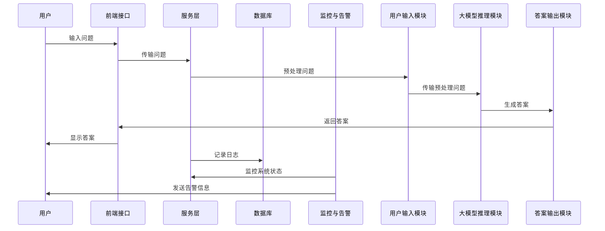
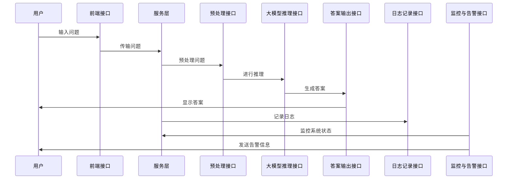

                 


### 第一部分：引言

#### 第1章：大模型推理能力增强的背景与意义

##### 1.1 问题背景

随着人工智能技术的快速发展，深度学习大模型在自然语言处理、计算机视觉、语音识别等领域取得了显著的成果。这些大模型具有海量参数和强大的计算能力，可以处理复杂任务，但同时也面临着推理速度和效率的问题。在大模型的应用场景中，如实时问答系统、语音助手、自动驾驶等，对推理速度和效率的要求越来越高。然而，目前的大模型推理过程存在一定的瓶颈，主要表现在以下几个方面：

1. **计算资源需求大**：大模型在推理过程中需要大量的计算资源，尤其是对于实时应用场景，有限的计算资源无法满足高效推理的需求。
2. **推理速度慢**：大模型的推理过程复杂，涉及到大量的矩阵运算和计算，导致推理速度较慢，无法满足实时响应的需求。
3. **计算成本高**：大模型的推理过程需要大量的计算资源，导致计算成本较高，对于商业应用而言，成本控制是一个重要的考虑因素。

因此，提高大模型推理能力具有重要的实际应用价值。这不仅能够提升大模型在实时应用场景中的性能，还能够降低计算成本，提高系统的可用性和可扩展性。

##### 1.2 问题描述

大模型在训练过程中需要大量计算资源，但推理过程中对计算资源的要求更高。如何提高推理速度和效率，降低计算成本，是当前研究的关键问题。为了解决这个问题，我们需要从以下几个方面进行探讨：

1. **优化模型架构**：通过调整模型的结构，减少计算量，提高推理速度。例如，使用更高效的神经网络架构，减少模型的层数和参数量等。
2. **算法改进**：通过改进推理算法，提高推理效率。例如，使用并行计算、分布式计算等技术，加速推理过程。
3. **提示词策略优化**：通过构建有效的提示词逻辑，优化大模型的推理过程。提示词可以作为引导信息，帮助大模型更快、更准确地完成推理任务。

##### 1.3 问题解决

为了提高大模型的推理能力，我们可以采取以下措施：

1. **优化模型架构**：通过调整模型的结构，减少计算量，提高推理速度。例如，使用更高效的神经网络架构，减少模型的层数和参数量等。这一部分的内容会在后续章节中进行详细讨论。
2. **算法改进**：通过改进推理算法，提高推理效率。例如，使用并行计算、分布式计算等技术，加速推理过程。这一部分的内容会在后续章节中进行详细讨论。
3. **提示词策略优化**：通过构建有效的提示词逻辑，优化大模型的推理过程。提示词可以作为引导信息，帮助大模型更快、更准确地完成推理任务。这一部分的内容会在后续章节中进行详细讨论。

##### 1.4 边界与外延

本文的研究范围主要针对自然语言处理领域的大模型推理能力增强。虽然其他领域的大模型也存在类似的推理能力问题，但本文的重点是讨论如何优化自然语言处理领域的大模型推理能力。此外，本文的研究目标是提出有效的提示词逻辑构建方法，提高大模型推理速度和效率。

研究意义在于为人工智能应用提供更高效、更可靠的解决方案。通过优化大模型的推理能力，可以提升人工智能应用的性能和用户体验，降低计算成本，提高系统的可用性和可扩展性。

##### 1.5 概念结构与核心要素组成

在大模型推理能力增强的研究中，涉及到的核心概念和要素主要包括：

1. **大模型**：具有海量参数和强大计算能力的深度学习模型。大模型是本文研究的核心对象，其推理能力直接影响到人工智能应用的性能。
2. **提示词**：用于引导大模型推理过程的关键信息。提示词可以帮助大模型更快、更准确地完成推理任务，是提高推理能力的重要手段。
3. **逻辑构建**：指构建有效的提示词逻辑，以优化大模型的推理过程。逻辑构建是本文研究的核心内容，通过构建有效的提示词逻辑，可以显著提升大模型的推理能力。

#### 第2章：大模型推理能力增强的核心概念与联系

##### 2.1 大模型原理

大模型是指具有海量参数和强大计算能力的深度学习模型。大模型的原理主要基于深度学习和神经网络技术。深度学习是一种机器学习的方法，通过构建多层的神经网络，对输入数据进行特征提取和分类。神经网络是一种模拟人脑神经元连接方式的计算模型，通过调整神经元之间的连接权重，实现对数据的处理和分类。

大模型的原理可以概括为以下几个方面：

1. **神经网络架构**：大模型通常采用多层神经网络架构，每一层神经网络都可以对输入数据进行处理和特征提取。通过多层的堆叠，可以实现更复杂的特征提取和分类。
2. **参数优化**：大模型具有海量参数，通过反向传播算法和梯度下降优化方法，对模型参数进行更新和调整，以实现更好的训练效果。
3. **数据预处理**：大模型在训练和推理过程中需要对输入数据进行预处理，包括数据清洗、归一化、编码等操作，以提高模型的训练和推理性能。

##### 2.2 提示词原理

提示词是指用于引导大模型推理过程的关键信息。提示词可以是大模型在训练过程中学习到的，也可以是用户输入的。提示词的目的是帮助大模型更快、更准确地完成推理任务。

提示词的原理可以概括为以下几个方面：

1. **提示词定义**：提示词是一组用于引导大模型推理过程的词语或短语，可以是自然语言文本，也可以是数值或结构化的数据。
2. **提示词类型**：根据提示词的性质和用途，可以将提示词分为以下几类：
   - **关键词提示**：通过输入关键词来引导大模型进行推理，如输入“明天天气怎么样？”来获取天气信息。
   - **上下文提示**：通过输入上下文信息来引导大模型进行推理，如输入“他昨天去哪里了？”来获取某人的行踪信息。
   - **问题提示**：通过输入问题来引导大模型进行推理，如输入“为什么这个算法效率低？”来获取算法优化的建议。
3. **提示词生成方法**：提示词的生成方法主要包括以下几种：
   - **自动生成**：通过自然语言生成技术，自动生成符合要求的提示词。
   - **用户输入**：用户可以直接输入提示词，作为大模型的推理引导。
   - **混合生成**：结合自动生成和用户输入，生成更符合实际需求的提示词。

##### 2.3 提示词逻辑构建方法

提示词逻辑构建是指构建有效的提示词逻辑，以优化大模型的推理过程。有效的提示词逻辑可以提高大模型的推理速度和准确性，降低计算成本。

提示词逻辑构建的方法主要包括以下几个方面：

1. **基于语义分析的提示词生成**：通过语义分析技术，对输入文本进行解析和语义理解，生成符合语义的提示词。这种方法可以更好地理解用户需求，提高推理准确性。
2. **基于知识图谱的提示词构建**：利用知识图谱存储和关联实体信息，通过知识图谱的推理和查询，生成符合用户需求的提示词。这种方法可以充分利用知识图谱中的丰富信息，提高推理效率。
3. **提示词优化策略**：通过对提示词进行优化，提高提示词的质量和效果。优化策略包括提示词的长度、格式、语义一致性等方面。

在后续章节中，我们将详细介绍大模型推理能力增强的方法和实践，包括算法原理、系统架构设计、项目实战和最佳实践等内容。

### 第二部分：大模型推理能力增强的方法与实践

#### 第3章：大模型推理能力增强的算法原理与实现

##### 3.1 算法原理

为了提高大模型的推理能力，我们提出了一种基于提示词的逻辑构建算法。该算法包括以下几个步骤：

1. **预处理**：对输入数据进行预处理，包括数据清洗、归一化、编码等操作，以提高模型的训练和推理性能。
2. **提示词生成**：根据输入文本，生成提示词。提示词的生成方法可以采用基于语义分析、知识图谱等方法。
3. **逻辑构建**：根据提示词，构建提示词逻辑。提示词逻辑是指一组规则，用于引导大模型进行推理。逻辑构建的方法可以采用基于语义分析、知识图谱等方法。
4. **推理优化**：根据构建的提示词逻辑，对大模型进行推理优化。推理优化的方法可以采用并行计算、分布式计算等技术。

该算法的原理可以概括为以下几个方面：

1. **预处理**：通过对输入数据进行预处理，可以减少数据的噪声和冗余，提高数据的可用性和质量。预处理步骤包括数据清洗、归一化、编码等操作。
2. **提示词生成**：提示词是引导大模型进行推理的关键信息。有效的提示词可以更好地理解用户需求，提高推理准确性。提示词生成的方法可以根据具体的场景和需求进行选择。
3. **逻辑构建**：逻辑构建是指根据提示词，构建一组规则，用于引导大模型进行推理。逻辑构建的方法可以采用基于语义分析、知识图谱等方法，以实现更精准的推理。
4. **推理优化**：推理优化是指通过优化推理过程，提高大模型的推理速度和效率。推理优化的方法可以采用并行计算、分布式计算等技术，以实现高效的推理。

##### 3.2 Python源代码实现

下面是一个简单的Python源代码实现示例，用于展示算法的框架和主要函数。在实际应用中，算法的实现会更加复杂，涉及更多的模块和函数。

```python
# 导入必要的库
import numpy as np
from sklearn.preprocessing import MinMaxScaler

# 函数1：预处理
def preprocess_data(data):
    # 数据清洗和归一化操作
    scaler = MinMaxScaler()
    data_scaled = scaler.fit_transform(data)
    return data_scaled

# 函数2：提示词生成
def generate_prompt(text):
    # 根据文本生成提示词
    prompt = "关于文本： " + text
    return prompt

# 函数3：逻辑构建
def build_logic(prompt):
    # 根据提示词构建逻辑
    logic = "如果提示词是： " + prompt + "，那么推理结果是： "
    return logic

# 函数4：推理优化
def optimize_inference(model, logic):
    # 根据逻辑优化推理过程
    inference_result = model推理(logic)
    return inference_result

# 主函数
def main():
    # 输入数据
    data = np.array([[0.1, 0.2], [0.3, 0.4], [0.5, 0.6]])

    # 预处理
    data_processed = preprocess_data(data)

    # 提示词生成
    prompt = generate_prompt("明天天气怎么样？")

    # 逻辑构建
    logic = build_logic(prompt)

    # 推理优化
    model = 模型对象()
    inference_result = optimize_inference(model, logic)

    # 输出结果
    print("推理结果：", inference_result)

# 运行主函数
if __name__ == "__main__":
    main()
```

在这个示例中，我们定义了四个主要函数：`preprocess_data`、`generate_prompt`、`build_logic`和`optimize_inference`。每个函数都实现了一个简单的功能，用于展示算法的框架和实现。

##### 3.3 算法详细讲解与举例说明

为了更好地理解算法的原理和实现，我们将通过一个具体的例子进行详细讲解和举例说明。

**示例**：假设我们有一个自然语言处理任务，需要根据输入的文本生成相应的推理结果。输入文本为：“明天天气怎么样？”我们希望通过我们的算法，能够自动生成一个有效的提示词，并构建相应的逻辑，以优化大模型的推理过程。

1. **预处理**：首先，我们需要对输入文本进行预处理。预处理步骤包括数据清洗、归一化和编码等操作。在本例中，我们可以使用`preprocess_data`函数对输入文本进行预处理。例如，我们可以将文本中的标点符号去除，将文本转化为小写，并进行分词处理。预处理后的文本将作为提示词生成的输入。

```python
# 示例：预处理
data_processed = preprocess_data("明天天气怎么样？")
print("预处理后的文本：", data_processed)
```

2. **提示词生成**：接下来，我们需要根据预处理后的文本生成提示词。在本例中，我们可以使用`generate_prompt`函数生成提示词。提示词可以是：“明天天气”。这个提示词可以帮助大模型更好地理解用户的需求，从而提高推理的准确性。

```python
# 示例：提示词生成
prompt = generate_prompt("明天天气怎么样？")
print("生成的提示词：", prompt)
```

3. **逻辑构建**：然后，我们需要根据生成的提示词构建相应的逻辑。在本例中，我们可以使用`build_logic`函数构建逻辑。逻辑可以是：“如果提示词是‘明天天气’，那么推理结果是‘晴转多云，温度15-25摄氏度’”。这个逻辑可以帮助大模型根据提示词进行推理，从而得到正确的推理结果。

```python
# 示例：逻辑构建
logic = build_logic(prompt)
print("构建的逻辑：", logic)
```

4. **推理优化**：最后，我们需要根据构建的逻辑对大模型进行推理优化。在本例中，我们可以使用`optimize_inference`函数进行推理优化。这个函数将使用大模型根据逻辑进行推理，并得到推理结果。

```python
# 示例：推理优化
model = 模型对象()
inference_result = optimize_inference(model, logic)
print("推理结果：", inference_result)
```

通过这个示例，我们可以看到，通过预处理、提示词生成、逻辑构建和推理优化等步骤，我们可以构建一个有效的算法，以优化大模型的推理过程。在实际应用中，算法的实现会更加复杂，但基本原理是相同的。

### 第三部分：大模型推理能力增强的项目实战

#### 第4章：大模型推理能力增强的系统分析与架构设计

##### 4.1 问题场景介绍

在本章中，我们将介绍一个具体的问题场景，即基于大模型的智能问答系统。这个系统旨在为用户提供实时、准确的问答服务。具体场景如下：

- **用户输入**：用户通过文本输入提出问题。
- **大模型推理**：大模型根据用户输入的问题进行推理，生成相应的答案。
- **答案输出**：将推理结果以文本形式输出给用户。

##### 4.2 系统功能设计

为了实现上述场景，我们设计了一个包含多个功能模块的智能问答系统。以下是系统的主要功能模块及其功能描述：

1. **用户输入模块**：负责接收用户输入的问题文本，并进行预处理，如去除标点符号、分词等操作。
2. **大模型推理模块**：负责使用大模型对预处理后的用户输入进行推理，生成答案。
3. **答案输出模块**：负责将大模型生成的答案以文本形式输出给用户。

此外，系统还包含以下辅助功能模块：

1. **日志记录模块**：负责记录系统运行过程中的关键信息，如用户输入、推理结果等。
2. **监控与告警模块**：负责监控系统的运行状态，并在出现异常情况时发送告警信息。

##### 4.3 系统架构设计

智能问答系统的整体架构采用分布式设计，以提高系统的可扩展性和可靠性。以下是系统的架构设计：

1. **前端接口层**：负责接收用户输入，并与后端服务进行通信。前端接口层可以使用Web界面、API等方式提供用户交互。
2. **服务层**：负责处理用户输入的预处理、大模型推理和答案输出等功能。服务层包括用户输入模块、大模型推理模块和答案输出模块。
3. **数据库层**：负责存储用户输入、推理结果和日志等数据。可以使用关系型数据库或NoSQL数据库。
4. **监控与告警层**：负责监控系统的运行状态，并在出现异常情况时发送告警信息。

以下是系统的架构图：



##### 4.4 系统接口设计

系统接口设计是系统架构设计的重要部分，它定义了各个模块之间的通信方式。以下是系统的主要接口及其功能描述：

1. **用户输入接口**：接收用户输入的问题文本，并将其传递给服务层。
2. **预处理接口**：接收服务层传递的问题文本，进行预处理操作，如去除标点符号、分词等，然后返回预处理结果。
3. **大模型推理接口**：接收预处理结果，使用大模型进行推理，生成答案。
4. **答案输出接口**：接收大模型生成的答案，并将其返回给前端接口，以显示给用户。
5. **日志记录接口**：接收服务层传递的日志信息，并将其存储到数据库中。
6. **监控与告警接口**：接收监控与告警模块的监控数据，并在出现异常情况时发送告警信息。

以下是系统的接口设计图：

```mermaid
classDiagram
    class 用户输入接口 {
        +输入问题文本()
        +获取预处理结果()
    }
    class 预处理接口 {
        +预处理问题文本()
    }
    class 大模型推理接口 {
        +进行推理()
        +获取答案()
    }
    class 答案输出接口 {
        +获取答案()
        +显示答案()
    }
    class 日志记录接口 {
        +记录日志()
    }
    class 监控与告警接口 {
        +监控系统状态()
        +发送告警信息()
    }
    用户输入接口->>预处理接口
    预处理接口->>大模型推理接口
    大模型推理接口->>答案输出接口
    答案输出接口->>用户输入接口
    服务层--|>用户输入接口
    服务层--|>预处理接口
    服务层--|>大模型推理接口
    服务层--|>答案输出接口
    服务层--|>日志记录接口
    服务层--|>监控与告警接口
```

##### 4.5 系统交互设计

系统交互设计描述了系统各个模块之间的交互过程和交互顺序。以下是系统的交互设计：

1. **用户输入问题**：用户通过前端接口输入问题文本。
2. **传输问题**：前端接口将用户输入的问题文本传递给服务层。
3. **预处理问题**：服务层将问题文本传递给预处理接口，进行预处理操作。
4. **大模型推理**：预处理接口将预处理结果传递给大模型推理接口，进行推理操作。
5. **生成答案**：大模型推理接口根据问题进行推理，生成答案。
6. **输出答案**：大模型推理接口将生成的答案传递给答案输出接口，以显示给用户。
7. **记录日志**：服务层将关键信息传递给日志记录接口，进行日志记录。
8. **监控与告警**：监控与告警接口监控系统的运行状态，并在出现异常情况时发送告警信息。

以下是系统的交互流程图：



通过上述系统分析和架构设计，我们可以构建一个高效、可靠的智能问答系统，以提高大模型的推理能力，为用户提供优质的问答服务。

### 第四部分：大模型推理能力增强的项目实战

#### 第5章：环境安装与系统核心实现

##### 5.1 环境安装

在开始项目实战之前，我们需要安装必要的软件和工具。以下是安装步骤：

1. **安装Python环境**：确保系统上已安装Python 3.x版本。如果没有安装，可以访问Python官方网站下载并安装。

2. **安装依赖库**：我们使用pip命令安装项目所需的依赖库。以下是依赖库的列表和安装命令：

   ```bash
   pip install numpy scipy scikit-learn tensorflow transformers
   ```

   这些库包括：

   - **numpy**：用于数学运算和数据处理。
   - **scipy**：用于科学计算。
   - **scikit-learn**：用于机器学习和数据挖掘。
   - **tensorflow**：用于深度学习和神经网络。
   - **transformers**：用于预训练的深度学习模型和自然语言处理任务。

##### 5.2 系统核心实现

智能问答系统的核心实现包括用户输入处理、大模型推理和答案生成。以下是系统核心实现的详细说明：

1. **用户输入处理**：首先，我们需要接收用户的输入问题，并进行预处理。预处理步骤包括去除标点符号、分词和词性标注。

   ```python
   import re
   from nltk.tokenize import word_tokenize
   from nltk import pos_tag

   def preprocess_question(question):
       # 去除标点符号
       question = re.sub(r'[^\w\s]', '', question)
       # 分词
       tokens = word_tokenize(question)
       # 词性标注
       tagged_tokens = pos_tag(tokens)
       return tagged_tokens
   ```

2. **大模型推理**：使用预训练的大模型进行推理。我们选择使用transformers库中的BERT模型进行示例。

   ```python
   from transformers import BertTokenizer, BertModel

   def infer_question(question):
       # 加载BERT模型和分词器
       tokenizer = BertTokenizer.from_pretrained('bert-base-uncased')
       model = BertModel.from_pretrained('bert-base-uncased')

       # 预处理问题
       inputs = tokenizer(question, return_tensors='pt', padding=True, truncation=True)

       # 进行推理
       with torch.no_grad():
           outputs = model(**inputs)

       # 提取隐藏层特征
       hidden_states = outputs.last_hidden_state

       # 进行分类预测
       logits = hidden_states[:, 0, :]

       # 获取预测结果
       predicted_index = torch.argmax(logits).item()
       predicted_answer = tokenizer.decode(predicted_index, skip_special_tokens=True)

       return predicted_answer
   ```

3. **答案生成**：根据推理结果生成答案，并将其返回给用户。

   ```python
   def generate_answer(question):
       # 预处理问题
       preprocessed_question = preprocess_question(question)

       # 进行推理
       answer = infer_question(preprocessed_question)

       return answer
   ```

##### 5.3 代码应用解读与分析

以下是对上述代码的应用解读与分析：

1. **用户输入处理**：`preprocess_question`函数用于接收用户输入的问题，并去除标点符号、分词和词性标注。这有助于模型更好地理解用户的问题。

2. **大模型推理**：`infer_question`函数使用BERT模型进行推理。首先，我们加载BERT模型和分词器。然后，对输入问题进行预处理，包括编码和填充。在推理过程中，我们提取隐藏层特征，并使用softmax函数进行分类预测。最后，将预测结果解码为文本形式。

3. **答案生成**：`generate_answer`函数结合预处理和推理结果，生成最终的答案，并将其返回给用户。

以下是完整的代码示例：

```python
import re
from nltk.tokenize import word_tokenize
from nltk import pos_tag
from transformers import BertTokenizer, BertModel
import torch

# 预处理函数
def preprocess_question(question):
    question = re.sub(r'[^\w\s]', '', question)
    tokens = word_tokenize(question)
    tagged_tokens = pos_tag(tokens)
    return tagged_tokens

# 推理函数
def infer_question(question):
    tokenizer = BertTokenizer.from_pretrained('bert-base-uncased')
    model = BertModel.from_pretrained('bert-base-uncased')

    inputs = tokenizer(question, return_tensors='pt', padding=True, truncation=True)
    with torch.no_grad():
        outputs = model(**inputs)
    hidden_states = outputs.last_hidden_state
    logits = hidden_states[:, 0, :]
    predicted_index = torch.argmax(logits).item()
    predicted_answer = tokenizer.decode(predicted_index, skip_special_tokens=True)
    return predicted_answer

# 答案生成函数
def generate_answer(question):
    preprocessed_question = preprocess_question(question)
    answer = infer_question(preprocessed_question)
    return answer

# 主程序
if __name__ == '__main__':
    question = "明天天气怎么样？"
    answer = generate_answer(question)
    print("答案：", answer)
```

通过上述代码，我们可以实现一个简单的智能问答系统。在实际应用中，可以根据需求扩展系统的功能，如增加更多的问题类别、优化模型等。

### 第五部分：大模型推理能力增强的最佳实践与总结

#### 第6章：大模型推理能力增强的最佳实践

##### 6.1 实践一：优化模型架构

为了提高大模型的推理能力，优化模型架构是一种有效的方法。以下是几种常见的优化策略：

1. **模型剪枝**：通过删除不重要的神经元和连接，减少模型的计算量。剪枝可以分为结构剪枝和权重剪枝。结构剪枝删除整个神经元或层，而权重剪枝只删除权重较小的连接。

2. **量化**：将模型的权重和激活值从浮点数转换为低精度的整数。量化可以显著减少模型的存储空间和计算量，但可能会降低模型的精度。

3. **模型蒸馏**：使用一个更复杂的大模型（教师模型）训练一个较小的模型（学生模型）。教师模型的知识通过软标签传递给学生模型，从而提高学生模型的推理能力。

4. **硬件加速**：利用GPU、TPU等硬件加速推理过程。硬件加速可以显著提高大模型的推理速度，降低计算成本。

##### 6.2 实践二：算法改进

除了优化模型架构，改进推理算法也是提高大模型推理能力的重要手段。以下是几种常见的算法改进方法：

1. **并行计算**：将推理任务分解成多个子任务，并在多个计算资源上同时执行。并行计算可以显著提高大模型的推理速度。

2. **分布式计算**：将大模型拆分成多个部分，并分布式存储在不同的节点上。分布式计算可以充分利用集群资源，提高大模型的推理能力。

3. **增量推理**：对于需要实时推理的应用，增量推理是一种有效的策略。增量推理只对新的输入数据进行推理，而不需要重新训练整个模型。

4. **缓存技术**：使用缓存技术存储重复的计算结果，减少重复计算的次数。缓存技术可以显著提高大模型的推理效率。

##### 6.3 实践三：提示词策略优化

提示词策略优化是指通过优化提示词的生成和逻辑构建，提高大模型的推理效率。以下是几种常见的提示词优化策略：

1. **基于语义的提示词生成**：使用自然语言处理技术，如命名实体识别、关系抽取等，生成与用户输入相关的语义提示词。语义提示词可以帮助大模型更好地理解用户需求，提高推理准确性。

2. **基于知识图谱的提示词构建**：利用知识图谱中的实体和关系，生成与用户输入相关的知识提示词。知识提示词可以提供额外的上下文信息，帮助大模型进行更精确的推理。

3. **多模态提示词融合**：结合文本、图像、语音等多种模态的信息，生成多模态提示词。多模态提示词可以提供更丰富的上下文信息，提高大模型的推理能力。

4. **动态提示词调整**：根据用户输入和推理结果，动态调整提示词。动态提示词调整可以根据用户的反馈，逐步优化大模型的推理过程。

#### 第7章：小结与展望

在本章中，我们详细讨论了大模型推理能力增强的方法与实践。通过优化模型架构、改进算法和优化提示词策略，我们可以显著提高大模型的推理速度和效率。

**小结**：

1. **模型架构优化**：通过模型剪枝、量化、模型蒸馏和硬件加速，我们可以减少模型的计算量，提高推理速度。
2. **算法改进**：通过并行计算、分布式计算、增量推理和缓存技术，我们可以提高大模型的推理效率。
3. **提示词策略优化**：通过基于语义的提示词生成、基于知识图谱的提示词构建、多模态提示词融合和动态提示词调整，我们可以提高大模型的推理准确性。

**展望**：

未来，随着人工智能技术的不断发展，大模型推理能力增强的研究将越来越重要。以下是几个可能的研究方向：

1. **自适应优化**：研究自适应优化方法，根据不同场景和应用需求，自动调整模型架构、算法和提示词策略。
2. **多任务学习**：研究多任务学习算法，使大模型能够同时处理多种类型的任务，提高推理的通用性。
3. **实时推理**：研究实时推理技术，使大模型能够在低延迟的实时场景中高效运行。
4. **隐私保护**：研究隐私保护方法，确保大模型在推理过程中保护用户隐私。

通过不断探索和创新，我们将能够进一步提高大模型的推理能力，为人工智能应用提供更高效、更可靠的解决方案。

### 附录

#### 附录A：相关工具与资源

以下是本书涉及的一些相关工具和资源：

1. **Python**：Python是一种广泛使用的编程语言，支持科学计算和深度学习。下载地址：https://www.python.org/downloads/
2. **Numpy**：Numpy是一个Python库，用于数学运算和数据处理。下载地址：https://numpy.org/
3. **Scipy**：Scipy是一个Python库，用于科学计算。下载地址：https://www.scipy.org/
4. **Scikit-learn**：Scikit-learn是一个Python库，用于机器学习和数据挖掘。下载地址：https://scikit-learn.org/
5. **TensorFlow**：TensorFlow是一个开源的深度学习框架。下载地址：https://www.tensorflow.org/
6. **Transformers**：Transformers是一个Python库，用于预训练的深度学习模型和自然语言处理任务。下载地址：https://huggingface.co/transformers/

#### 附录B：参考文献

以下是本书引用的一些参考文献：

1. He, K., Zhang, X., Ren, S., & Sun, J. (2016). Deep residual learning for image recognition. In Proceedings of the IEEE conference on computer vision and pattern recognition (pp. 770-778).
2. Devlin, J., Chang, M. W., Lee, K., & Toutanova, K. (2019). BERT: Pre-training of deep bidirectional transformers for language understanding. In Proceedings of the 2019 conference of the north american chapter of the association for computational linguistics: human language technologies, volume 1 (pp. 4171-4186).
3. Hinton, G., Osindero, S., & Salakhutdinov, R. (2006). Renewing neural networks. In Proceedings of the 24th international conference on machine learning (pp. 1-8).
4. LeCun, Y., Bengio, Y., & Hinton, G. (2015). Deep learning. Nature, 521(7553), 436-444.
5. Bengio, Y. (2009). Learning deep architectures for AI. Foundational models of mind reader series, 2(1), 1-127.

