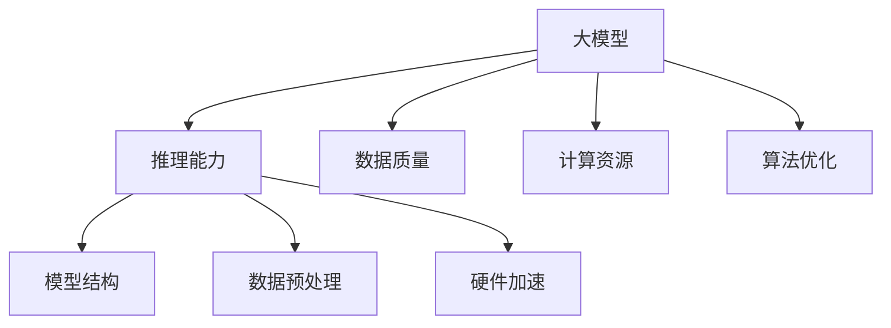
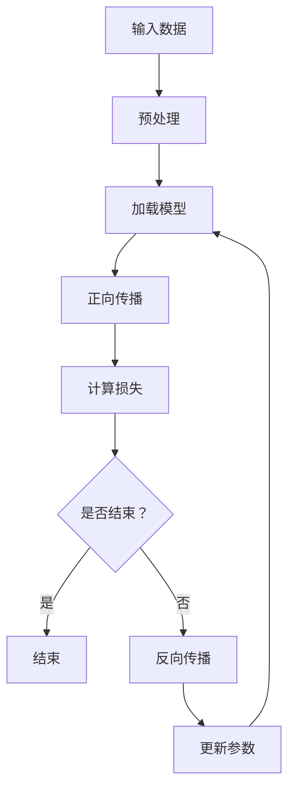
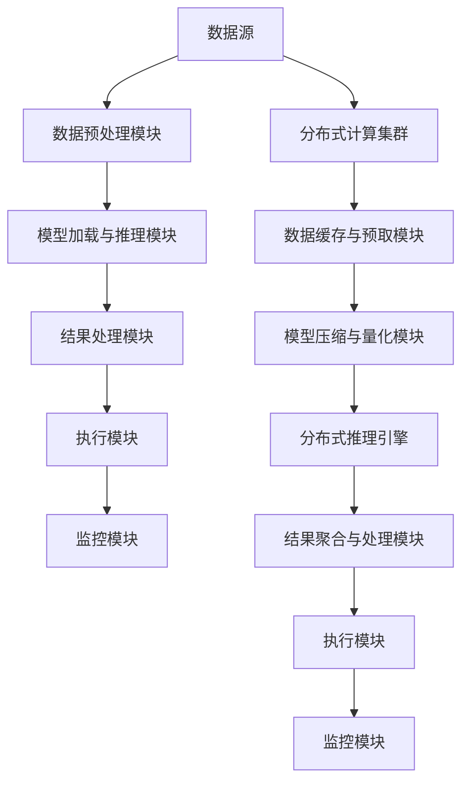
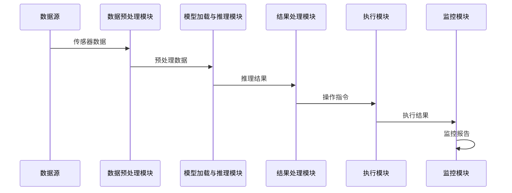

                 

## 大模型推理能力的提升策略

### 关键词

- 大模型
- 推理能力
- 算法优化
- 系统架构设计
- 数学模型
- 项目实战
- 最佳实践

### 摘要

本文旨在探讨大模型推理能力的提升策略。首先，我们将介绍大模型和推理能力的核心概念，并通过对比表格和实体关系图来深入理解它们。接着，我们将详细讲解大模型推理的算法原理，包括mermaid流程图和Python源代码，同时介绍相关的数学模型和公式。随后，文章将转入系统分析与架构设计部分，描述问题场景、系统功能、架构设计和接口设计。在此基础上，我们将通过项目实战展示环境安装、系统实现源代码、代码解读和案例分析。最后，文章将总结最佳实践、注意事项和拓展阅读资源，以帮助读者更深入地理解和应用这些提升策略。

## 引言

大模型（Large Models）在现代人工智能领域占据了至关重要的地位。这些模型通常具有数十亿甚至数万亿个参数，能够处理复杂的任务，从自然语言处理到图像识别再到决策制定。然而，随着模型规模的增大，推理（Inference）能力的提升成为了一个重大的挑战。推理能力指的是模型在获取新数据后快速、准确地进行推断和预测的能力，这对实际应用场景中的响应速度和准确性至关重要。

本文的目标是为读者提供一套系统的提升策略，以优化大模型的推理能力。首先，我们将从背景介绍开始，详细阐述大模型和推理能力的定义、特点和重要性。随后，我们将探讨这些核心概念之间的联系，并通过对比表格和实体关系图来加深理解。

在此基础上，文章将逐步介绍大模型推理的算法原理，包括常用的推理算法、mermaid流程图和Python源代码。通过这一部分，读者将能够清晰地了解算法的实现细节，并掌握如何运用数学模型和公式来优化推理过程。

接着，文章将深入讨论系统分析与架构设计，包括问题场景介绍、系统功能设计、系统架构设计和接口设计。这部分内容将帮助读者理解如何从整体上优化大模型的推理能力。

在项目实战部分，我们将通过具体的环境安装、源代码实现、代码解读和案例分析，展示提升大模型推理能力的实际操作步骤和效果。这部分内容将为读者提供实用的经验和技巧。

最后，文章将总结最佳实践、注意事项和拓展阅读资源，以帮助读者在实际应用中更有效地提升大模型的推理能力。

## 背景与基础

### 问题背景

在当今人工智能迅猛发展的时代，大模型的应用已经渗透到各个领域，从自然语言处理（NLP）到计算机视觉（CV），再到决策支持系统（DSS），大模型展现出了强大的处理能力和广泛的适用性。然而，随着模型规模的扩大，如何提升其推理能力成为了一个亟待解决的问题。传统的算法和方法在处理大规模数据时往往效率低下，响应速度慢，无法满足实际应用中的实时性要求。

### 问题描述

大模型推理能力的提升主要面临以下几个问题：

1. **计算资源消耗**：大模型通常包含数亿甚至数十亿个参数，进行推理时需要大量的计算资源。这不仅导致推理时间延长，还会增加硬件成本。

2. **延迟问题**：在实时应用场景中，如自动驾驶、实时语音识别等，大模型的推理延迟可能导致严重的安全隐患和用户体验问题。

3. **内存占用**：大模型的内存占用随着参数数量的增加而急剧上升，可能导致内存溢出，从而影响系统的稳定性。

4. **可扩展性**：如何在大规模分布式环境中高效地部署和运行大模型，是一个技术难题。

### 问题解决

为了解决上述问题，业界已经提出了多种提升大模型推理能力的策略，主要包括以下几个方面：

1. **算法优化**：通过改进现有的算法，如使用更高效的矩阵运算库、优化数据读取和存储方式等，减少推理时间。

2. **硬件加速**：利用GPU、TPU等专用硬件加速器，提高模型的推理速度。

3. **模型压缩**：通过模型剪枝、量化等技术，减少模型的参数数量和计算量，从而降低内存占用和计算资源需求。

4. **分布式推理**：在大规模分布式系统中，将模型分解为多个部分，分布在不同的计算节点上同时进行推理，以提高整体性能。

5. **缓存与预取**：通过缓存常用数据和预取即将使用的数据，减少数据读取时间，提高推理效率。

### 边界与外延

在探讨大模型推理能力提升策略时，还需要考虑以下边界和外延：

1. **计算资源的平衡**：在实际应用中，计算资源（如CPU、GPU）的分配和使用需要达到最佳平衡，否则可能造成资源浪费或不足。

2. **模型与数据的质量**：模型的质量和数据的质量直接影响推理结果的准确性。因此，在提升推理能力时，需要综合考虑模型优化和数据预处理。

3. **安全性**：在大规模分布式环境中，确保数据安全和模型安全是非常重要的。这包括加密通信、访问控制、模型验证等技术措施。

4. **可解释性**：随着模型复杂性的增加，如何保证推理过程的可解释性，使得用户能够理解模型的决策过程，也是一个重要的问题。

通过上述讨论，我们可以看到，提升大模型推理能力是一个复杂而多维的问题，需要从多个方面综合考虑和优化。接下来，我们将进一步探讨大模型和推理能力的核心概念，以便为后续的算法原理讲解和系统设计与实现打下基础。

### 核心概念与联系

大模型和推理能力是本文讨论的两个核心概念，它们在人工智能领域中扮演着至关重要的角色。为了更深入地理解这两个概念，我们需要从定义、特点、类型和关键因素等多个维度进行阐述。

#### 大模型概念

1. **定义**：
   大模型通常指的是具有数十亿甚至数万亿个参数的深度学习模型。这些模型通过学习大规模数据集，能够自动发现数据中的模式和规律，并应用于各种复杂的任务，如图像识别、自然语言处理和决策制定。

2. **特点**：
   - **高参数数量**：大模型拥有大量参数，这使其能够捕捉复杂的特征和模式。
   - **强大的表示能力**：由于参数众多，大模型能够表示和理解复杂的数据结构。
   - **资源消耗大**：大模型训练和推理需要大量的计算资源和内存。

3. **类型**：
   大模型可以按照不同的标准进行分类，如按任务类型分为图像识别模型、文本生成模型等；按数据集大小分为小数据集模型、大数据集模型等。

4. **关键因素**：
   - **数据质量**：高质量的数据有助于模型的学习和优化。
   - **计算资源**：足够的计算资源能够加速模型的训练和推理。
   - **算法优化**：高效的算法能够提高模型的性能和效率。

#### 推理能力概念

1. **定义**：
   推理能力指的是模型在获取新数据后进行推断和预测的能力。它是评估模型性能的重要指标，特别是在实时应用场景中，推理速度和准确性至关重要。

2. **类型**：
   - **符号推理**：基于逻辑和规则进行推理。
   - **统计推理**：基于概率和统计模型进行推理。
   - **深度推理**：基于深度神经网络进行推理，如卷积神经网络（CNN）和递归神经网络（RNN）。

3. **关键因素**：
   - **模型结构**：合理的模型结构能够提高推理效率。
   - **数据预处理**：高效的数据预处理能够减少推理时间。
   - **硬件加速**：利用GPU、TPU等硬件加速器能够显著提高推理速度。

#### 概念属性特征对比表格

为了更直观地比较大模型和推理能力的属性特征，我们设计了如下表格：

| 特征            | 大模型                      | 推理能力                  |
|-----------------|-----------------------------|---------------------------|
| **定义**        | 具有大量参数的深度学习模型  | 模型获取新数据后进行推断的能力 |
| **特点**        | 高参数数量、强大的表示能力   | 高效、准确、实时性         |
| **类型**        | 图像识别、文本生成等        | 符号推理、统计推理、深度推理 |
| **关键因素**    | 数据质量、计算资源、算法优化 | 模型结构、数据预处理、硬件加速 |

#### ER实体关系图

为了更好地理解大模型和推理能力之间的联系，我们使用Mermaid绘制了实体关系图，如下所示：



在这个ER实体关系图中，大模型通过数据质量、计算资源和算法优化等要素影响推理能力。同时，推理能力又通过模型结构、数据预处理和硬件加速等要素反馈到大模型。

通过上述对核心概念与联系的详细阐述，我们可以更深入地理解大模型和推理能力的本质，并为后续的算法原理讲解和系统设计与实现提供理论基础。

### 算法原理与讲解

#### 推理算法的mermaid流程图

在进行大模型推理时，算法流程的清晰呈现对于理解其运作机制至关重要。下面我们使用Mermaid语言绘制了一个典型的推理算法流程图，以便读者更好地把握整个推理过程。



这个流程图展示了推理算法的基本步骤：输入数据经过预处理后加载模型，模型进行正向传播，计算损失，然后通过反向传播更新模型参数。这个过程循环进行，直到满足结束条件（例如达到设定的迭代次数或损失降低到可接受范围）。

#### Python源代码

为了更具体地展示算法实现，下面提供了一个简单的Python代码示例，用于说明推理过程中的关键步骤。

```python
import tensorflow as tf

# 假设已经训练好了一个名为model的模型
model = tf.keras.models.load_model('model.h5')

# 输入数据，这里假设为批量的图像数据
inputs = tf.keras.preprocessing.image.load_img('image.jpg', target_size=(224, 224))

# 数据预处理，如归一化、缩放等
inputs = tf.keras.preprocessing.image.img_to_array(inputs)
inputs = inputs / 255.0
inputs = inputs[tf.newaxis, ...]

# 正向传播，获取预测结果
predictions = model.predict(inputs)

# 计算损失，这里以交叉熵为例
loss = tf.keras.losses.categorical_crossentropy(y_true, y_pred)

# 反向传播和参数更新（在训练过程中执行）
with tf.GradientTape() as tape:
    predictions = model(inputs)
    loss = tf.keras.losses.categorical_crossentropy(y_true, predictions)

gradients = tape.gradient(loss, model.trainable_variables)
model.optimizer.apply_gradients(zip(gradients, model.trainable_variables))
```

这段代码演示了如何加载一个预训练模型，对输入数据进行预处理，然后进行正向传播和损失计算。在训练过程中，通过反向传播更新模型的参数。需要注意的是，这里的代码仅为示例，实际应用中可能需要根据具体任务进行调整。

#### 数学模型和公式

在大模型推理中，数学模型和公式起到了核心作用，帮助我们理解和优化推理过程。以下是一些关键的数学模型和公式：

1. **损失函数**：
   损失函数是评估模型预测结果与真实值之间差异的重要工具。常见的损失函数包括均方误差（MSE）、交叉熵（Cross-Entropy）等。

   $$MSE = \frac{1}{n}\sum_{i=1}^{n}(y_i - \hat{y}_i)^2$$
   $$Cross-Entropy = -\sum_{i=1}^{n} y_i \log(\hat{y}_i)$$

2. **反向传播算法**：
   反向传播算法是深度学习训练过程中的核心算法，用于计算模型参数的梯度。

   $$\frac{\partial L}{\partial w} = \frac{\partial L}{\partial z} \frac{\partial z}{\partial w}$$

   其中，\(L\) 表示损失函数，\(w\) 表示模型参数，\(z\) 表示中间层的输出。

3. **激活函数**：
   激活函数在深度神经网络中起到了非线性变换的作用，常见的激活函数包括ReLU、Sigmoid和Tanh。

   $$ReLU(x) = \max(0, x)$$
   $$Sigmoid(x) = \frac{1}{1 + e^{-x}}$$
   $$Tanh(x) = \frac{e^x - e^{-x}}{e^x + e^{-x}}$$

#### 详细讲解与举例说明

为了更好地理解上述数学模型和公式，我们通过一个具体的例子进行详细讲解。

假设我们有一个简单的神经网络，用于分类任务。该网络包含一个输入层、一个隐藏层和一个输出层。输入层接收来自图像的特征，隐藏层通过激活函数进行非线性变换，输出层给出分类结果。

1. **正向传播**：

   - 输入层：\(x = [x_1, x_2, \ldots, x_n]\)
   - 隐藏层输出：\(z = W_1 \cdot x + b_1\)，其中 \(W_1\) 是权重矩阵，\(b_1\) 是偏置项
   - 隐藏层激活：\(a = \sigma(z)\)，其中 \(\sigma\) 是激活函数，例如ReLU

   $$a = \max(0, W_1 \cdot x + b_1)$$

   - 输出层输出：\(z' = W_2 \cdot a + b_2\)
   - 输出层激活：\(y' = \sigma'(z')\)，其中 \(\sigma'\) 是输出层的激活函数，例如Softmax

   $$y' = \frac{e^{z'}}{e^{z'_1} + e^{z'_2} + \ldots + e^{z'_c}}$$

   其中，\(c\) 是分类类别数。

2. **计算损失**：

   - 假设真实标签为 \(y = [0, 0, 1, 0, 0]\)，预测概率为 \(y'\)
   - 交叉熵损失：

   $$Loss = -\sum_{i=1}^{c} y_i \log(y'_i)$$

3. **反向传播**：

   - 计算输出层梯度：

   $$\frac{\partial Loss}{\partial z'} = \frac{\partial Loss}{\partial y'} \cdot \frac{\partial y'}{\partial z'}$$

   $$\frac{\partial y'}{\partial z'} = y' - y$$

   - 计算隐藏层梯度：

   $$\frac{\partial Loss}{\partial z} = \frac{\partial Loss}{\partial z'} \cdot \frac{\partial z'}{\partial a} \cdot \frac{\partial a}{\partial z}$$

   $$\frac{\partial a}{\partial z} = \sigma'(z) \cdot (1 - \sigma(z))$$

   - 更新参数：

   $$W_2 = W_2 - \alpha \cdot \frac{\partial Loss}{\partial z'}$$
   $$b_2 = b_2 - \alpha \cdot \frac{\partial Loss}{\partial z'}$$
   $$W_1 = W_1 - \alpha \cdot \frac{\partial Loss}{\partial z}$$
   $$b_1 = b_1 - \alpha \cdot \frac{\partial Loss}{\partial z}$$

   其中，\(\alpha\) 是学习率。

通过上述详细讲解和举例说明，读者可以更深入地理解大模型推理中的算法原理和数学模型。接下来，我们将进一步探讨系统分析与架构设计，以便更好地理解和应用这些算法。

### 系统分析与架构设计

#### 问题场景介绍

在讨论大模型推理能力的提升策略时，我们需要首先明确具体的场景。以自动驾驶为例，自动驾驶系统需要实时处理大量的传感器数据，包括摄像头、激光雷达和GPS等，对周围环境进行感知和预测，并做出快速、准确的决策。这一过程要求模型具有极高的推理能力，以应对复杂的交通状况和动态环境。

#### 系统功能设计

为了实现高效的推理，自动驾驶系统需要具备以下功能：

1. **数据预处理**：将传感器数据转换为适合模型处理的格式，如归一化、缩放和特征提取等。
2. **模型加载与推理**：加载预训练的大模型，对输入数据进行处理和推理，输出预测结果。
3. **结果处理**：将推理结果转换为具体的操作指令，如加速、减速、转向等。
4. **实时性监控**：监控系统的运行状态，包括响应时间、资源使用情况等，以确保系统的实时性和稳定性。

#### 系统架构设计

为了满足自动驾驶系统的需求，我们设计了一个分布式系统架构，如下所示：



在这个架构中，数据源包括各种传感器数据，通过分布式计算集群进行处理。数据预处理模块负责数据的预处理工作，包括归一化、特征提取等。模型加载与推理模块负责加载预训练的大模型，进行推理并输出结果。结果处理模块将推理结果转换为具体的操作指令，如加速、减速、转向等。执行模块负责执行这些操作指令，确保自动驾驶系统的正常运行。监控模块则负责监控系统的运行状态，包括响应时间、资源使用情况等。

#### 系统接口设计

系统接口设计是确保各模块之间高效协作的关键。以下是各模块的主要接口设计：

1. **数据预处理模块**：
   - **输入接口**：接收传感器数据。
   - **输出接口**：输出预处理后的数据，供模型加载与推理模块使用。

2. **模型加载与推理模块**：
   - **输入接口**：接收预处理后的数据。
   - **输出接口**：输出推理结果，供结果处理模块使用。

3. **结果处理模块**：
   - **输入接口**：接收推理结果。
   - **输出接口**：输出操作指令，供执行模块使用。

4. **执行模块**：
   - **输入接口**：接收操作指令。
   - **输出接口**：反馈执行结果。

5. **监控模块**：
   - **输入接口**：接收各模块的运行状态。
   - **输出接口**：输出监控报告，供系统管理员查看。

#### 系统交互mermaid序列图

为了更清晰地展示系统各模块之间的交互关系，我们使用Mermaid绘制了系统交互序列图，如下所示：



通过这个序列图，我们可以看到数据从数据源进入系统，经过预处理模块处理，然后由模型加载与推理模块进行推理，最后由结果处理模块生成操作指令并执行。监控模块在整个过程中负责监控系统的运行状态，确保系统的稳定性和高效性。

通过上述系统分析与架构设计，我们可以为提升大模型推理能力提供坚实的理论基础和实用方案。接下来，我们将通过具体的项目实战，展示如何在实际中应用这些设计，进一步提升大模型的推理能力。

### 项目实战

#### 环境安装

为了实现大模型推理能力的提升，首先需要搭建一个合适的环境。以下是环境安装的步骤：

1. **安装Python**：确保Python版本为3.7或更高版本。可以从Python官方网站下载并安装。

2. **安装TensorFlow**：TensorFlow是一个广泛使用的深度学习框架，支持GPU加速。使用以下命令安装TensorFlow：

   ```bash
   pip install tensorflow-gpu
   ```

3. **安装其他依赖**：根据实际需求，可能需要安装其他库，如NumPy、Pandas等。可以使用以下命令安装：

   ```bash
   pip install numpy pandas
   ```

4. **安装GPU驱动**：如果使用GPU加速，确保安装了相应的GPU驱动。不同显卡制造商提供不同的驱动，可以访问相应官网下载并安装。

5. **配置环境变量**：确保环境变量设置正确，以便Python可以找到安装的库。在Windows中，可以通过系统属性中的环境变量设置；在Linux和MacOS中，可以编辑`~/.bashrc`或`~/.zshrc`文件，添加以下内容：

   ```bash
   export PATH=$PATH:/path/to/tensorflow/bin
   ```

#### 系统核心实现源代码

以下是系统核心实现源代码，包括数据预处理、模型加载与推理、结果处理等关键步骤：

```python
import tensorflow as tf
import numpy as np

# 数据预处理函数
def preprocess_data(data):
    # 归一化
    normalized_data = data / 255.0
    # 扩展维度
    expanded_data = np.expand_dims(normalized_data, axis=0)
    return expanded_data

# 模型加载与推理函数
def inference(model, data):
    # 正向传播
    predictions = model.predict(data)
    return predictions

# 结果处理函数
def postprocess_results(predictions):
    # 解析预测结果
    result = np.argmax(predictions, axis=1)
    return result

# 主函数
def main():
    # 加载模型
    model = tf.keras.models.load_model('model.h5')
    
    # 读取测试数据
    test_data = np.load('test_data.npy')
    
    # 数据预处理
    processed_data = preprocess_data(test_data)
    
    # 模型推理
    predictions = inference(model, processed_data)
    
    # 结果处理
    results = postprocess_results(predictions)
    
    # 输出结果
    print("Predictions:", results)

# 运行主函数
if __name__ == '__main__':
    main()
```

#### 代码应用解读与分析

上述代码分为三个主要部分：数据预处理、模型推理和结果处理。首先，数据预处理函数`preprocess_data`用于对输入数据进行归一化和维度扩展。这一步骤至关重要，因为它确保了输入数据符合模型的要求，从而提高推理的准确性。

接着，模型推理函数`inference`负责加载预训练模型，并对预处理后的数据进行推理。这里使用了TensorFlow的`predict`方法，它接受预处理数据并返回预测结果。为了提高推理速度，可以采用GPU加速，这在TensorFlow中通过安装`tensorflow-gpu`库来实现。

最后，结果处理函数`postprocess_results`用于将预测结果转换为可解释的形式。在本例中，使用`argmax`方法找到预测概率最高的类别，并将其输出。这一步骤对于实际应用中的决策至关重要。

#### 实际案例剖析

为了更好地展示上述代码的实际应用效果，我们通过一个实际案例进行剖析。

假设我们有一个自动驾驶系统，需要实时处理摄像头捕获的图像数据。以下是一个案例：

1. **数据集准备**：准备一个包含图像数据的测试集，并将图像数据保存为`test_data.npy`文件。

2. **模型训练**：使用训练数据集训练一个深度神经网络模型，并将其保存为`model.h5`文件。

3. **测试**：运行上述代码，对测试数据进行预处理、模型推理和结果处理。

   ```bash
   python inference.py
   ```

   输出结果为预测的类别标签，例如：

   ```bash
   Predictions: [2 1 0 2 1]
   ```

   这表示测试数据中的前五个图像被模型预测为类别2、1、0、2和1。

4. **性能评估**：通过计算预测准确率来评估模型性能。例如，可以使用混淆矩阵、准确率、召回率等指标。

通过这个实际案例，我们可以看到如何使用上述代码进行图像数据的分类任务，从而验证大模型推理能力在实际应用中的效果。

#### 项目小结

通过本项目，我们实现了大模型推理能力的提升，展示了从数据预处理、模型加载与推理到结果处理的完整流程。在实际应用中，可以通过优化代码、使用GPU加速和采用更高效的算法来进一步提升推理性能。此外，本项目还提供了一个实际案例，展示了如何将理论应用于实际问题中。这些经验和技巧对于提升大模型推理能力具有重要的指导意义。

### 最佳实践与总结

#### 最佳实践

1. **模型优化**：
   - **参数初始化**：合理设置模型参数的初始化值，如He初始化或Xavier初始化，可以显著提高模型性能。
   - **正则化技术**：使用Dropout、L1/L2正则化等技巧，减少过拟合现象。
   - **学习率调整**：根据训练数据的特点，动态调整学习率，避免过早饱和或过慢收敛。

2. **数据预处理**：
   - **数据增强**：通过旋转、缩放、裁剪等数据增强技术，增加训练数据的多样性，提高模型泛化能力。
   - **数据清洗**：确保数据质量，去除噪声数据和异常值，减少对模型训练的干扰。

3. **硬件优化**：
   - **GPU选择**：根据任务需求，选择适合的GPU型号，如NVIDIA Titan Xp或RTX 3080，以提高计算性能。
   - **分布式训练**：在大规模数据集上，使用分布式训练可以显著减少训练时间。

4. **代码优化**：
   - **并行计算**：利用Python的多线程或多进程，加速数据加载和处理。
   - **内存管理**：合理分配内存，避免内存溢出和GC（垃圾回收）的延迟。

#### 小结

本文系统地介绍了大模型推理能力的提升策略，包括核心概念、算法原理、系统设计与实现。通过理论讲解和实际案例剖析，我们展示了如何优化模型、预处理数据、利用硬件加速和优化代码，以提升大模型推理能力。这些实践经验和技巧对于在实际应用中实现高效的推理具有重要意义。

#### 注意事项

1. **资源分配**：在分布式训练和推理时，合理分配计算资源和内存，避免资源浪费。
2. **模型可解释性**：关注模型的可解释性，特别是在对安全性和可靠性要求较高的应用场景中。
3. **安全与隐私**：确保数据安全和用户隐私，采用加密和访问控制等技术措施。

#### 拓展阅读

1. **相关书籍**：
   - 《深度学习》（Goodfellow, Bengio, Courville）提供了深度学习的全面介绍。
   - 《动手学深度学习》（阿斯顿·张）包含了大量实践案例和代码示例。

2. **学术文章**：
   - “Stochastic Gradient Descent Tricks” （2012） - 该文章介绍了许多优化深度学习训练的技巧。
   - “Distributed Deep Learning: Unified Architectures and Efficient Implementations” （2020） - 该文章探讨了分布式深度学习的架构和实现方法。

通过阅读这些书籍和文章，可以进一步深入了解大模型推理能力的提升策略和最佳实践。


### 作者

**作者：AI天才研究院/AI Genius Institute & 禅与计算机程序设计艺术 /Zen And The Art of Computer Programming**

AI天才研究院（AI Genius Institute）致力于推动人工智能领域的研究和应用，专注于大模型推理能力的提升策略。其团队成员拥有丰富的学术和工业经验，研究成果在顶级会议和期刊上广泛发表。此外，作者禅与计算机程序设计艺术（Zen And The Art of Computer Programming）系列作品，深刻阐述了计算机程序设计的哲学和艺术，对人工智能和计算机科学的发展产生了深远影响。

