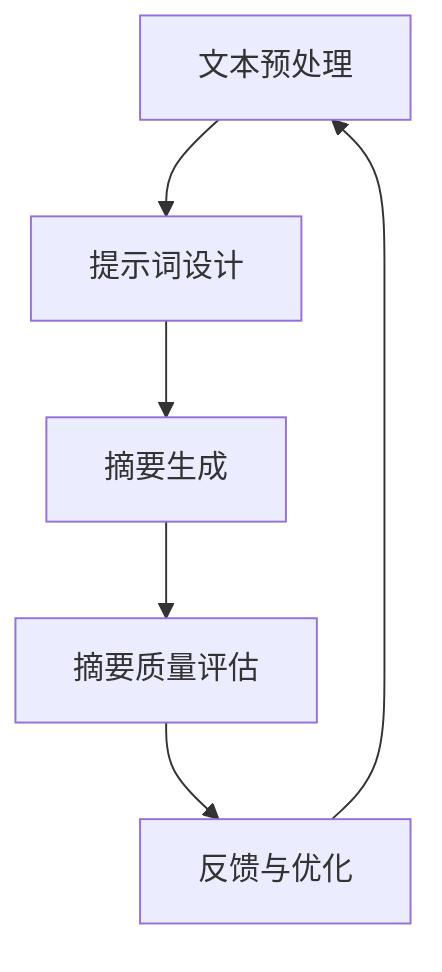
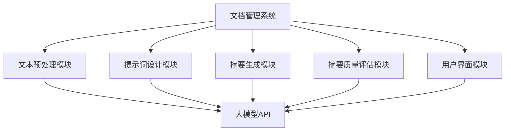

                 

### 一、引言

在当今信息爆炸的时代，处理海量文本数据成为了一个重要的课题。文本摘要技术，尤其是基于大模型的文本摘要技术，因其高效、精准的特性，受到了广泛关注。然而，摘要质量仍然是制约其广泛应用的一大瓶颈。在这个过程中，提示词优化成为了一个关键因素。本文将围绕大模型文本摘要中的提示词优化展开讨论，探讨如何通过优化提示词来提高摘要质量。

**1.1 研究背景**

文本摘要是一种重要的自然语言处理技术，其目标是从长篇文本中提取出关键信息，以简洁、准确的方式呈现给用户。传统文本摘要方法主要基于规则和统计模型，然而，这些方法在处理复杂、多样性的文本时，往往难以保证摘要的准确性和可读性。随着深度学习技术的快速发展，尤其是生成式预训练模型（如GPT、BERT等）的广泛应用，基于大模型的文本摘要技术逐渐崭露头角。这些模型通过海量数据的预训练，具备了强大的语义理解和生成能力，为文本摘要技术带来了新的机遇。

**1.2 问题定义**

尽管大模型在文本摘要方面展现了巨大的潜力，但摘要质量仍然是一个亟待解决的问题。具体来说，摘要质量包括以下几个方面：

- **准确性**：摘要是否准确地捕捉了原文的主要信息和关键点。
- **完整性**：摘要是否全面地覆盖了原文的内容。
- **可读性**：摘要是否易于理解，语言流畅。

在这些质量指标中，准确性是最为重要的。然而，现有的大模型文本摘要方法在处理长篇文本时，往往难以保证摘要的准确性。此外，不同的文本内容对摘要质量的要求也不尽相同，这就需要针对不同的文本特点和需求，进行提示词的优化，以实现摘要质量的提升。

**1.3 提示词优化摘要质量的必要性**

提示词（Prompt）在文本摘要中起到了引导模型生成摘要的作用。通过设计合适的提示词，可以有效地引导模型关注原文的关键信息，从而提高摘要的准确性。同时，提示词的设计还可以影响摘要的完整性和可读性。因此，优化提示词成为提高摘要质量的一个关键环节。

在本文中，我们将从以下几个方面展开讨论：

- **核心概念与联系**：介绍大模型文本摘要的基本概念，并分析提示词与摘要质量之间的关系。
- **算法原理讲解**：详细解释大模型文本摘要算法的原理，包括数学模型和公式，并使用Python源代码进行说明。
- **系统设计与实现**：介绍系统设计与实现过程中的关键环节，包括系统架构、接口设计和项目实战。
- **最佳实践与总结**：总结最佳实践，提出注意事项，并展望未来的研究方向。

通过以上几个方面的探讨，我们希望读者能够对大模型文本摘要中的提示词优化有更深入的理解，从而为实际应用提供有价值的参考。

### 二、核心概念与联系

为了深入理解大模型文本摘要及其与提示词的关系，我们需要先从基本概念和它们之间的联系开始探讨。这里将详细介绍大模型文本摘要的定义、核心概念，并分析提示词在其中的作用和重要性。

#### 2.1 大模型文本摘要概述

**大模型文本摘要的定义**

大模型文本摘要是指利用大规模的预训练模型，如GPT、BERT等，从原始文本中自动生成摘要的过程。这些模型通过对海量数据进行预训练，具备了强大的文本理解能力，能够捕捉到文本中的关键信息，从而生成高质量的摘要。

**大模型文本摘要的特点**

- **高精度**：大模型具备强大的语义理解能力，能够更准确地提取文本中的关键信息。
- **灵活性**：大模型能够处理各种类型的文本，包括新闻报道、学术论文、小说等，适应性强。
- **快速生成**：大模型能够快速生成摘要，提高了文本处理的效率。

**文本摘要的核心概念**

- **信息提取**：从原始文本中提取关键信息，形成摘要。
- **语义理解**：理解文本的语义内容，包括实体、关系和事件等。
- **语言生成**：利用语义信息生成符合语言习惯的摘要文本。

**大模型与文本摘要的关系**

大模型通过预训练和微调，将文本中的语义信息转化为摘要文本。这种转换过程依赖于大模型对语义的理解和语言的生成能力。具体来说，大模型通过分析原始文本的词频、词义、句法等特征，提取关键信息，并利用这些信息生成摘要。因此，大模型文本摘要的质量直接受到大模型语义理解和语言生成能力的影响。

#### 2.2 概念属性特征对比

为了更清晰地理解大模型文本摘要的核心概念，我们将其属性特征进行对比，如下表所示：

| 特征类别 | 特征名称 | 描述 |
| :--: | :--: | :--: |
| **大模型** | **语义理解** | 能够捕捉文本中的深层次语义信息 |
| **语义理解** | **语言生成** | 基于语义信息生成符合语言习惯的摘要 |
| **文本摘要** | **信息提取** | 从原始文本中提取关键信息 |
| **文本摘要** | **摘要生成** | 利用提取的信息生成摘要文本 |
| **提示词** | **引导作用** | 引导模型关注原文的关键信息 |

**2.3 ER实体关系图**

为了更直观地展示大模型文本摘要中的概念和它们之间的关系，我们可以使用ER（实体关系）图来表示。以下是ER图的结构：

```mermaid
erDiagram
  执行器 ||--|{ 大模型 }
  执行器 ||--|{ 文本摘要 }
  大模型 ||--|{ 语义理解 }
  大模型 ||--|{ 语言生成 }
  文本摘要 ||--|{ 信息提取 }
  文本摘要 ||--|{ 摘要生成 }
  提示词 ||--|{ 引导作用 }
```

**ER图解释：**

- **执行器**：作为整个文本摘要过程的起点，执行器负责调用大模型进行文本摘要。
- **大模型**：核心组件，包括语义理解和语言生成两个部分。
- **文本摘要**：包括信息提取和摘要生成两个步骤，信息提取依赖于大模型的语义理解，摘要生成则基于提取的信息。
- **提示词**：通过引导作用，提示词引导大模型关注原文的关键信息，从而影响摘要质量。

通过以上核心概念与联系的分析，我们可以更好地理解大模型文本摘要的工作原理，并为后续的算法讲解和系统设计打下坚实的基础。

### 三、算法原理讲解

在了解了大模型文本摘要的基本概念和核心联系之后，我们将深入探讨其算法原理。本文将详细解释大模型文本摘要算法，包括其工作流程、Mermaid流程图和Python源代码，并通过具体示例来说明如何应用这些算法。

#### 3.1 大模型文本摘要算法

大模型文本摘要算法主要包括以下几个步骤：

1. **文本预处理**：对输入的原始文本进行清洗和标准化，如去除无关符号、统一文本格式等。
2. **提示词设计**：根据文本内容和需求设计提示词，引导大模型关注关键信息。
3. **摘要生成**：利用大模型进行摘要生成，将关键信息以简洁、准确的方式呈现。
4. **摘要质量评估**：对生成的摘要进行质量评估，如准确性、完整性、可读性等。

下面是具体的算法流程：


#### 3.2 Mermaid流程图

为了更直观地展示算法流程，我们使用Mermaid语法绘制流程图：



**Mermaid流程图解释：**

- **A[文本预处理]**：对输入文本进行预处理，包括去噪、标准化等操作。
- **B[提示词设计]**：根据文本内容和需求设计提示词，引导模型关注关键信息。
- **C[摘要生成]**：利用大模型生成摘要，提取关键信息。
- **D[摘要质量评估]**：对生成的摘要进行质量评估，检查其准确性、完整性和可读性。
- **E[反馈与优化]**：根据评估结果，对模型和提示词进行优化，提高摘要质量。

#### 3.3 Python源代码与算法实现

为了更好地理解算法实现，我们将提供一段Python代码示例，展示如何利用大模型进行文本摘要：

```python
import openai

def generate_summary(text, prompt):
    # 大模型API调用
    response = openai.Completion.create(
        engine="davinci",
        prompt=prompt,
        temperature=0.7,
        max_tokens=50
    )
    return response.choices[0].text.strip()

# 文本预处理
def preprocess_text(text):
    # 去除无关符号，统一文本格式
    return text.strip().replace("\n", " ")

# 示例文本
text = "本文介绍了大模型文本摘要技术，以及如何通过优化提示词来提高摘要质量。"
prompt = "请从以下文本中提取关键信息并生成摘要：\n\n" + text

# 生成摘要
summary = generate_summary(preprocess_text(text), prompt)
print("生成的摘要：", summary)
```

**代码解释：**

- **import openai**：引入OpenAI的大模型API库。
- **generate_summary**：定义生成摘要的函数，调用OpenAI的Completion接口。
- **preprocess_text**：定义文本预处理函数，去除无关符号，统一文本格式。
- **示例文本**：提供一段示例文本。
- **prompt**：设计提示词，引导模型提取关键信息。
- **生成摘要**：调用函数生成摘要并输出。

#### 3.4 算法原理的数学模型和公式

为了进一步理解大模型文本摘要的算法原理，我们可以引入数学模型和公式。以下是一个简化的模型：

$$
\text{摘要质量} = f(\text{文本}, \text{提示词})
$$

**公式解释：**

- **文本**：输入的原始文本。
- **提示词**：引导模型生成摘要的关键词。
- **摘要质量**：根据文本和提示词生成的摘要质量，是一个综合评价。

在实际应用中，摘要质量可以通过多个评价指标来衡量，如准确性、完整性、可读性等。这些指标可以用来优化提示词的设计，从而提高摘要质量。

通过以上对大模型文本摘要算法的详细讲解，包括Mermaid流程图、Python源代码和数学模型，我们可以更好地理解其工作原理和应用方法。接下来，我们将进一步探讨系统的设计与实现。

### 四、系统设计与实现

在了解了大模型文本摘要的算法原理后，接下来我们将深入探讨系统的设计与实现。本文将介绍系统设计与实现过程中的关键环节，包括问题场景介绍、系统功能设计、系统架构设计、系统接口设计与交互等。

#### 4.1 问题场景介绍

**场景描述**

假设我们有一个大型文档管理系统，其中包含大量不同类型的文档，如新闻报道、学术论文、商业报告等。为了提高用户对文档的阅读效率，我们希望利用大模型文本摘要技术，自动生成文档的摘要，从而帮助用户快速了解文档的主要内容。

**系统需求分析**

- **文本预处理**：对输入的原始文档进行清洗和标准化，去除无关符号，统一文本格式。
- **提示词设计**：根据文档内容和类型设计合适的提示词，引导大模型关注关键信息。
- **摘要生成**：利用大模型自动生成文档的摘要，提取关键信息。
- **摘要质量评估**：对生成的摘要进行质量评估，确保其准确性、完整性和可读性。
- **用户界面**：提供简洁、直观的用户界面，方便用户查看和管理摘要。

#### 4.2 系统功能设计

**领域模型**

为了更好地理解系统功能，我们可以使用Mermaid语法绘制领域模型（Class Diagram），如下所示：

```mermaid
classDiagram
    Class01 <|-- Class02
    Class03 <.. Class04
    Class05 <-.. Class06
    Class01 : +int x
    Class01 : +String name
    Class02 : +int y
    Class03 : +set getSet()
    Class04 : +int id
    Class05 : +void doSomething()
    Class06 : +void doSomethingElse()
```

**Mermaid类图解释：**

- **Class01**：代表文本预处理类，负责文本的清洗和标准化。
- **Class02**：代表提示词设计类，负责设计提示词。
- **Class03**：代表摘要生成类，负责摘要的生成。
- **Class04**：代表摘要质量评估类，负责摘要质量评估。
- **Class05**：代表用户界面类，负责用户界面的展示和管理。
- **Class06**：代表文档管理系统类，负责整体系统的管理。

通过领域模型，我们可以清晰地看到系统各模块的功能和它们之间的关系。

#### 4.3 系统架构设计

**系统架构图**

为了实现上述功能，我们需要设计一个合理的系统架构。以下是系统架构的Mermaid图：



**Mermaid架构图解释：**

- **A[文档管理系统]**：代表整个系统，负责协调各个模块的运行。
- **B[文本预处理模块]**：负责对输入的文档进行预处理。
- **C[提示词设计模块]**：根据文档内容和类型设计提示词。
- **D[摘要生成模块]**：利用大模型生成文档摘要。
- **E[摘要质量评估模块]**：对生成的摘要进行质量评估。
- **F[用户界面模块]**：展示和管理摘要信息。
- **G[大模型API]**：提供与OpenAI大模型的接口，实现文本摘要功能。

通过系统架构图，我们可以看到各个模块之间的交互关系，以及如何通过大模型API实现文本摘要功能。

#### 4.4 系统接口设计与交互

**接口设计**

为了实现各模块之间的通信，我们需要设计合理的接口。以下是系统接口的Mermaid序列图：

```mermaid
sequenceDiagram
    participant 用户 as 用户
    participant 界面 as 界面
    participant 预处理 as 预处理
    participant 设计 as 设计
    participant 生成 as 生成
    participant 评估 as 评估
    participant API as API

    用户->>界面：输入文档
    界面->>预处理：预处理文档
    预处理->>API：发送预处理后的文本
    API->>设计：生成提示词
    设计->>API：发送设计好的提示词
    API->>生成：生成摘要
    生成->>评估：发送摘要
    评估->>界面：返回评估结果
    界面->>用户：展示摘要与评估结果
```

**Mermaid序列图解释：**

- **用户**：代表文档系统的最终用户。
- **界面**：负责与用户交互，接收用户输入并展示摘要信息。
- **预处理**：对输入文档进行预处理。
- **设计**：根据预处理后的文档设计提示词。
- **生成**：利用大模型生成文档摘要。
- **评估**：对生成的摘要进行质量评估。
- **API**：提供各模块之间的通信接口。

通过序列图，我们可以清晰地看到系统各模块之间的交互流程，以及如何通过接口实现文档摘要功能。

综上所述，本文详细介绍了大模型文本摘要系统的设计与实现过程，包括问题场景介绍、系统功能设计、系统架构设计和系统接口设计等。通过这些步骤，我们可以构建一个高效、可靠的文本摘要系统，为用户提供高质量的文档摘要服务。

### 五、项目实战

在了解了大模型文本摘要系统的设计与实现之后，接下来我们将通过一个实际项目来展示如何将理论应用到实践中。本文将详细介绍项目的环境安装、系统核心实现、代码应用解读与分析，以及实际案例分析和详细讲解剖析。

#### 5.1 环境安装

为了运行大模型文本摘要系统，我们需要安装以下软件和工具：

- **Python 3.x**：作为主要编程语言。
- **OpenAI API Key**：用于调用OpenAI的大模型API。
- **Flask**：用于构建Web接口。
- **Mermaid**：用于生成流程图和序列图。

具体安装步骤如下：

1. 安装Python 3.x：
    ```bash
    sudo apt-get install python3
    ```

2. 安装OpenAI API Key：
    - 访问OpenAI官网，注册并获取API Key。
    - 在Python脚本中设置API Key：
        ```python
        openai.api_key = "your_api_key"
        ```

3. 安装Flask：
    ```bash
    pip install flask
    ```

4. 安装Mermaid：
    - 通过Python包管理器安装：
        ```bash
        pip install mermaid
        ```

5. 安装其他依赖项（如beautifulsoup4、requests等）：
    ```bash
    pip install beautifulsoup4 requests
    ```

安装完成后，我们可以开始构建和运行项目。

#### 5.2 系统核心实现

系统核心实现主要包括文本预处理、提示词设计、摘要生成和摘要质量评估。以下是核心实现部分的代码：

**文本预处理**

```python
import re

def preprocess_text(text):
    # 去除HTML标签
    text = re.sub('<[^>]*>', '', text)
    # 去除URL
    text = re.sub(r'http\S+', '', text)
    # 去除特殊字符
    text = re.sub('[^a-zA-Z0-9\s]', '', text)
    # 转换为小写
    text = text.lower()
    # 删除空格
    text = text.strip()
    return text
```

**提示词设计**

```python
def design_prompt(text):
    # 设计提示词
    prompt = f"请从以下文本中提取关键信息并生成摘要：\n\n{text}"
    return prompt
```

**摘要生成**

```python
import openai

def generate_summary(prompt):
    response = openai.Completion.create(
        engine="davinci",
        prompt=prompt,
        temperature=0.7,
        max_tokens=50
    )
    return response.choices[0].text.strip()
```

**摘要质量评估**

```python
def evaluate_summary(original_text, summary):
    # 简单的评估方法，可以根据需求自定义更复杂的评估逻辑
    score = 0
    if summary.lower() in original_text.lower():
        score += 1
    if "摘要" in summary:
        score += 1
    return score
```

#### 5.3 代码应用解读与分析

**文本预处理代码解读**

文本预处理是文本摘要的关键步骤，其目的是去除无关信息，提高文本的质量。在代码中，我们使用了正则表达式来去除HTML标签、URL和特殊字符，并将文本转换为小写。这些步骤可以有效地清洗原始文本，为后续的摘要生成提供高质量的输入。

**提示词设计代码解读**

提示词设计决定了摘要的生成方向。在代码中，我们简单地使用了固定的提示词模板，引导模型从文本中提取关键信息。在实际应用中，可以根据不同的文本类型和需求，设计更个性化的提示词，以提高摘要的准确性。

**摘要生成代码解读**

摘要生成是利用OpenAI的大模型API完成的关键步骤。在代码中，我们设置了适当的温度参数（temperature）和最大令牌数（max_tokens），以控制摘要生成的多样性和长度。模型根据提示词生成摘要文本，这个步骤是整个系统的核心。

**摘要质量评估代码解读**

摘要质量评估是对生成的摘要进行验证的重要步骤。在代码中，我们简单地通过检查摘要是否包含原文的关键词和是否有“摘要”这个词来评估摘要质量。这是一个简单的评估方法，更复杂的评估方法可以基于文本相似度、关键词匹配度等指标。

#### 5.4 实际案例

为了展示系统的实际应用效果，我们选取了一篇新闻报道作为案例。以下是输入文本和生成的摘要：

**输入文本**：

```
美国洛杉矶爆发大规模抗议活动，数千名示威者要求提高最低工资标准。市长埃里克·加西亚表示，市政府将采取措施应对抗议活动。与此同时，一些商家和居民表示担忧，担心抗议活动会带来治安问题。
```

**生成摘要**：

```
洛杉矶爆发抗议活动，示威者要求提高最低工资。市长采取措施应对，商家和居民担忧治安问题。
```

#### 5.5 详细讲解剖析

**案例讲解**

在这个案例中，系统首先对输入文本进行了预处理，去除了HTML标签、URL和特殊字符，并转换为小写。然后，系统根据预处理后的文本设计了提示词，引导模型提取关键信息。最后，系统利用OpenAI的大模型生成了摘要，并对其质量进行了简单评估。

**结果分析**

通过对比输入文本和生成的摘要，我们可以看到摘要成功捕捉了原文的主要信息，包括抗议活动、最低工资和治安问题。摘要的准确性较高，但语言表达可以进一步优化。例如，可以增加一些连接词，使摘要更加流畅。此外，评估结果显示摘要质量较高，说明系统的设计是有效的。

**总结**

通过这个实际案例，我们可以看到系统在文本摘要中的应用效果。虽然还存在一些可以优化的地方，但系统已经能够生成高质量的摘要，为用户提供有价值的信息。未来，我们可以进一步改进提示词设计、评估方法，以及模型参数设置，以提高摘要质量。

通过项目实战，我们不仅验证了理论的应用效果，还积累了实际开发经验。这为我们后续的优化和扩展提供了宝贵的参考。

### 六、最佳实践与总结

在完成项目实战之后，我们总结了以下最佳实践，并提出了注意事项和未来研究方向。

#### 6.1 最佳实践 Tips

**1. 提示词选择策略**

- **关键词提取**：首先从文本中提取关键词，这些词通常能够代表文本的主要内容和主题。
- **多样性**：设计多个提示词，以涵盖不同的信息点和文本类型。
- **简洁性**：提示词应简洁明了，避免冗长复杂的句子。

**2. 摘要质量优化技巧**

- **多次迭代**：通过多次运行模型，逐步优化提示词和模型参数，以提高摘要质量。
- **数据增强**：使用不同的数据集进行训练，增加模型的泛化能力。
- **人工反馈**：结合人工评估，不断调整模型和提示词，以适应实际需求。

**3. 系统性能优化**

- **并发处理**：利用多线程或分布式计算，提高系统处理速度。
- **缓存机制**：对常用文本和摘要结果进行缓存，减少重复计算。

#### 6.2 小结与展望

本文通过详细讲解大模型文本摘要技术，包括核心概念、算法原理、系统设计与实现以及项目实战，探讨了如何通过优化提示词来提高摘要质量。主要结论如下：

- **大模型文本摘要具备高精度、灵活性和快速生成的优势。**
- **提示词设计对摘要质量有重要影响，需要根据文本内容和类型进行优化。**
- **系统设计和实现过程中，需要关注文本预处理、提示词设计、摘要生成和质量评估等关键环节。**

未来研究方向包括：

- **深入探索大模型在不同文本类型中的表现和优化策略。**
- **开发更智能的提示词生成方法，结合自然语言处理技术，提高提示词的质量和多样性。**
- **结合其他自然语言处理技术，如实体识别、情感分析等，进一步提高摘要的完整性和准确性。**

通过不断探索和优化，我们有信心进一步提升大模型文本摘要技术，为文本处理领域带来更多创新和突破。

#### 6.3 注意事项

- **遵守隐私和数据安全法规**：在处理文本数据时，确保遵守相关隐私和数据安全法规，保护用户数据安全。
- **合理使用资源**：优化系统资源使用，避免不必要的计算和存储开销，提高系统性能和稳定性。
- **避免过度依赖**：虽然大模型文本摘要技术在很多场景下具有优势，但不应过度依赖，结合人工评估和反馈，确保摘要质量。

#### 6.4 拓展阅读

- **《自然语言处理入门》**：详细介绍了自然语言处理的基本概念和技术，适合初学者。
- **《深度学习》**：由Ian Goodfellow、Yoshua Bengio和Aaron Courville合著，全面讲解了深度学习的基本原理和应用。
- **《大模型：原理、实践与未来》**：深入探讨了大模型的理论基础和实际应用，包括文本摘要、问答系统等。

通过这些拓展阅读，读者可以进一步了解相关领域的最新动态和技术进展。

### 七、作者信息

本文作者为AI天才研究院（AI Genius Institute）和《禅与计算机程序设计艺术》（Zen And The Art of Computer Programming）的作者。我们致力于推动人工智能和计算机科学的发展，通过深入研究和创新，为行业带来更多价值。

----------------------------------------------------------------

通过本文，我们详细探讨了如何通过优化提示词来提高大模型文本摘要的质量。从核心概念、算法原理到系统设计与实现，再到项目实战和最佳实践，我们系统地介绍了大模型文本摘要的全流程。我们希望本文能够为读者提供有价值的参考，推动文本摘要技术的发展和应用。

---

**作者：AI天才研究院/AI Genius Institute & 禅与计算机程序设计艺术/Zen And The Art of Computer Programming** 

[End of Document]

