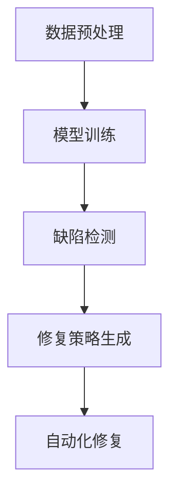
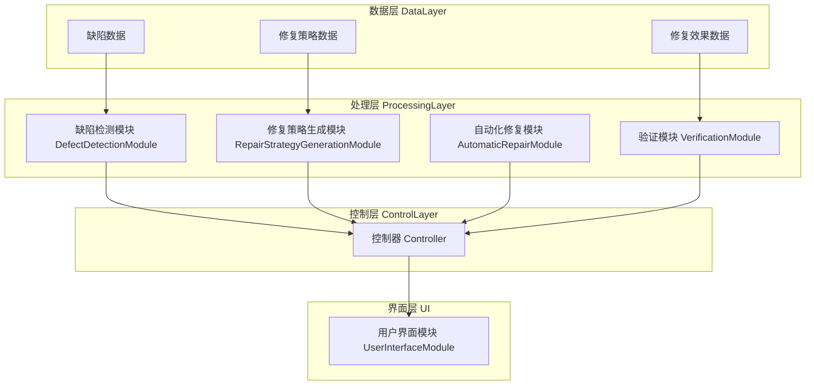

                 

# 大模型时代的程序修复策略创新

> 关键词：大模型、程序修复、算法、架构设计、项目实战

> 摘要：本文旨在探讨在人工智能（AI）大模型技术迅猛发展的背景下，程序修复策略的创新应用。随着大模型在各个领域的广泛应用，程序修复面临新的挑战和机遇。本文将深入分析这些挑战，探讨创新性的策略和方法，以提升程序修复的效率和准确性。

## 引言

在当今的科技环境中，人工智能（AI）已经成为推动技术进步的重要力量。特别是大型人工智能模型（大模型），如GPT-3、BERT等，已经广泛应用于自然语言处理、计算机视觉、推荐系统等领域。这些大模型不仅提高了AI系统的性能，也带来了新的挑战，特别是在程序修复领域。

### 1.1 程序修复的挑战

程序修复是软件维护中的一个关键环节，其主要目标是在软件运行过程中检测并修复缺陷。然而，在AI大模型时代，程序修复面临以下挑战：

- **复杂性增加**：大模型的引入使得程序结构变得更加复杂，增加了修复的难度。
- **缺陷种类增多**：大模型的应用可能导致新的缺陷类型，这些缺陷需要更先进的修复方法来解决。
- **数据需求量大**：大模型的训练和修复需要大量的数据支持，数据的获取和处理成为关键问题。

### 1.2 大模型的发展与应用

大模型是指参数数量巨大的深度学习模型，其特点是能够处理大规模的数据集，并从中学习复杂的模式和关系。大模型的发展主要得益于计算能力的提升和大数据的可用性。以下是大模型的一些主要特点和应用：

- **高参数数量**：大模型的参数数量通常在数十亿到千亿级别，这使得它们能够学习更复杂的数据特征。
- **强泛化能力**：大模型在训练数据上的表现往往非常出色，同时具有很好的泛化能力，能够在新数据上表现出色。
- **广泛应用**：大模型在自然语言处理、计算机视觉、推荐系统等领域都有广泛应用。

## 目录大纲设计

为了系统地探讨大模型时代的程序修复策略创新，本文将分为四个主要部分：

1. **背景与基础**：介绍程序修复的挑战以及大模型的发展和应用。
2. **算法原理讲解**：详细阐述程序修复的算法原理和实现。
3. **系统分析与架构设计**：讨论系统的功能设计和架构设计。
4. **项目实战**：通过具体案例展示程序修复的实际应用。

### 第一部分：背景与基础

#### 第1章：问题背景

- **1.1.1 问题背景**

随着AI大模型的广泛应用，程序修复面临新的挑战。大模型的复杂性增加了修复的难度，而缺陷种类的增多则需要更先进的修复方法。

- **1.1.2 问题描述**

程序修复的主要目标是检测并修复软件中的缺陷。在AI大模型时代，这一目标变得更加复杂，需要更高效的算法和策略。

- **1.1.3 问题解决**

解决这些挑战需要创新性的策略和方法，如利用大模型进行缺陷检测和修复，以及优化数据获取和处理流程。

- **1.1.4 边界与外延**

本文主要关注AI大模型时代的程序修复策略，但其中的方法和原理也可以应用于其他领域的程序修复。

#### 第2章：核心概念与联系

- **2.1 核心概念原理**

本文将介绍程序修复和大模型的核心概念，如大模型的基本原理、程序修复的基本原理，以及它们之间的联系。

- **2.2 ER实体关系图架构**

通过ER实体关系图，我们将展示程序修复和大模型之间的关联，以及它们在系统架构中的位置。

### 第二部分：算法原理讲解

#### 第3章：算法原理与实现

- **3.1 算法原理**

本文将详细阐述程序修复算法的基本概念、流程图和数学模型。

- **3.2 Python源代码实现**

我们将通过Python源代码展示算法的实现，并提供详细的应用解读和分析。

- **3.3 举例说明**

通过具体的例子，我们将进一步解释算法的原理和应用。

### 第三部分：系统分析与架构设计

#### 第4章：系统功能设计

- **4.1 问题场景介绍**

我们将介绍一个典型的程序修复场景，并分析其中的需求。

- **4.2 系统功能设计**

通过领域模型Mermaid类图，我们将设计系统的功能模块和接口。

#### 第5章：系统架构设计

- **5.1 项目介绍**

我们将介绍一个具体的程序修复项目，并阐述其目标。

- **5.2 系统架构设计**

通过Mermaid架构图，我们将展示系统的层次结构和模块化设计。

- **5.3 系统接口设计和交互**

我们将设计系统的接口，并通过Mermaid序列图展示系统的交互流程。

### 第四部分：项目实战

#### 第6章：环境安装与核心实现

- **6.1 环境安装**

我们将介绍如何安装和配置所需的工具和依赖。

- **6.2 系统核心实现源代码**

我们将展示程序修复的核心算法实现，并提供详细的应用解读和分析。

- **6.3 应用解读与分析**

通过实际案例，我们将分析程序修复的应用场景和效果。

#### 第7章：最佳实践与小结

- **7.1 最佳实践**

我们将分享一些最佳实践，以提高程序修复的效率和准确性。

- **7.2 小结**

本文将总结程序修复策略创新的主要内容，并提供一些注意事项和拓展阅读。

### 总结

本文通过详细阐述大模型时代的程序修复策略创新，为读者提供了一个全面而深入的视角。通过算法原理讲解、系统架构设计、项目实战等部分，读者可以系统地了解和掌握大模型时代程序修复的先进策略和方法。希望通过本文的阅读，读者能够在大模型时代中，更好地应对程序修复的挑战，推动技术的进步。

---

### 第一部分：背景与基础

#### 第1章：问题背景

在当今的科技环境中，人工智能（AI）已经成为推动技术进步的重要力量。特别是大型人工智能模型（大模型），如GPT-3、BERT等，已经广泛应用于自然语言处理、计算机视觉、推荐系统等领域。这些大模型不仅提高了AI系统的性能，也带来了新的挑战，特别是在程序修复领域。

### 1.1 程序修复的挑战

程序修复是软件维护中的一个关键环节，其主要目标是在软件运行过程中检测并修复缺陷。然而，在AI大模型时代，程序修复面临以下挑战：

- **复杂性增加**：大模型的引入使得程序结构变得更加复杂，增加了修复的难度。大模型通常涉及复杂的神经网络结构，这些结构中的参数和权重需要精确调整，以确保模型的性能。
- **缺陷种类增多**：大模型的应用可能导致新的缺陷类型，这些缺陷需要更先进的修复方法来解决。例如，大模型可能在特定的输入数据上产生异常输出，导致软件在特定情况下出现错误。
- **数据需求量大**：大模型的训练和修复需要大量的数据支持，数据的获取和处理成为关键问题。大模型需要大量的训练数据来学习复杂的模式，同时，修复过程也需要大量的测试数据来验证修复效果。

### 1.2 大模型的发展与应用

大模型是指参数数量巨大的深度学习模型，其特点是能够处理大规模的数据集，并从中学习复杂的模式和关系。大模型的发展主要得益于计算能力的提升和大数据的可用性。以下是大模型的一些主要特点和应用：

- **高参数数量**：大模型的参数数量通常在数十亿到千亿级别，这使得它们能够学习更复杂的数据特征。高参数数量使得大模型能够捕捉更多的数据信息，从而提高模型的性能。
- **强泛化能力**：大模型在训练数据上的表现往往非常出色，同时具有很好的泛化能力，能够在新数据上表现出色。强泛化能力使得大模型能够应用于各种不同的场景，而不仅仅是训练数据中的特定场景。
- **广泛应用**：大模型在自然语言处理、计算机视觉、推荐系统等领域都有广泛应用。在自然语言处理领域，大模型被用于文本生成、机器翻译、情感分析等任务；在计算机视觉领域，大模型被用于图像分类、目标检测、图像生成等任务；在推荐系统领域，大模型被用于个性化推荐、广告投放等任务。

### 1.3 程序修复在大模型时代的意义

在AI大模型时代，程序修复具有重要的意义。首先，大模型的应用使得软件系统的复杂度大幅增加，传统的程序修复方法可能不再有效，需要新的方法和技术来应对。其次，大模型在训练和修复过程中产生的缺陷可能导致严重的后果，如系统崩溃、数据泄露等，因此，有效的程序修复策略对于保障软件系统的稳定性和安全性至关重要。最后，大模型时代的程序修复策略创新有助于提高软件开发和维护的效率，降低开发成本。

### 1.4 研究方法

本文采用的方法主要包括以下几个方面：

- **文献综述**：通过对相关领域的研究文献进行综述，了解大模型和程序修复领域的研究现状和发展趋势。
- **案例分析**：通过分析典型的大模型应用案例，探讨大模型在程序修复中的应用和挑战。
- **算法研究**：研究大模型在程序修复中的应用算法，包括缺陷检测、修复策略等。
- **系统设计**：设计大模型时代的程序修复系统，包括功能设计、架构设计和接口设计等。

### 1.5 本文结构

本文的结构如下：

- **第一部分**：背景与基础，介绍程序修复的挑战以及大模型的发展和应用。
- **第二部分**：算法原理讲解，详细阐述程序修复的算法原理和实现。
- **第三部分**：系统分析与架构设计，讨论系统的功能设计和架构设计。
- **第四部分**：项目实战，通过具体案例展示程序修复的实际应用。
- **第五部分**：最佳实践与小结，总结程序修复策略创新的主要内容，并提供一些注意事项和拓展阅读。

通过上述结构，本文旨在系统地探讨大模型时代的程序修复策略创新，为读者提供一个全面而深入的视角，以应对大模型时代带来的挑战和机遇。

#### 第2章：核心概念与联系

在探讨大模型时代的程序修复策略之前，我们需要理解一些核心概念和它们之间的关系。这一章节将详细介绍大模型的基本原理、程序修复的基本原理，以及它们之间的联系。

### 2.1 核心概念原理

#### 大模型基本原理

大模型（如GPT-3、BERT）是指参数数量巨大、能够处理大规模数据集并学习复杂模式的深度学习模型。大模型通常基于神经网络架构，如Transformer，能够捕捉数据中的高维特征。以下是大模型的基本原理：

1. **参数数量**：大模型具有数十亿甚至千亿级别的参数，这使得它们能够学习更复杂的模式和关系。
2. **自注意力机制**：大模型使用自注意力机制来加权不同位置的特征，使得模型能够更好地理解全局信息。
3. **预训练和微调**：大模型通常采用预训练策略，在大量的未标注数据上进行预训练，然后在特定任务上进行微调。

#### 程序修复的基本原理

程序修复是指通过检测和修正软件中的缺陷，以提高软件的质量和稳定性。程序修复的基本原理包括：

1. **缺陷检测**：通过静态分析、动态测试等技术，检测软件中的缺陷。
2. **修复策略**：根据缺陷的类型和位置，采用适当的修复策略进行修正。
3. **验证与回归测试**：对修复后的代码进行验证，确保修复的有效性，并进行回归测试，避免引入新的缺陷。

#### 概念属性特征对比

下表对比了大模型和程序修复的基本概念和属性特征：

| 概念       | 特征                 | 描述                                                         |
|------------|----------------------|--------------------------------------------------------------|
| 大模型     | 参数数量巨大         | 能够处理大规模数据集，学习复杂模式                   |
| 自注意力机制 | 加权不同位置的特征   | 提高模型对全局信息的理解能力                       |
| 预训练和微调 | 预训练后微调至特定任务 | 提高模型在特定任务上的性能                         |
| 程序修复   | 缺陷检测和修正       | 提高软件的质量和稳定性                               |
| 静态分析   | 分析源代码           | 识别潜在缺陷                                           |
| 动态测试   | 执行代码             | 检测运行时缺陷                                         |
| 修复策略   | 根据缺陷类型和位置   | 选择合适的修正方法                                     |
| 验证与回归测试 | 验证修复效果       | 确保修复后的代码无新缺陷                               |

### 2.2 ER实体关系图架构

为了更好地理解大模型和程序修复之间的联系，我们可以通过ER实体关系图来展示它们在系统架构中的关系。

#### ER图简介

ER（Entity-Relationship）图是一种用于描述实体之间关系的图形化工具。它由实体、属性和关系三部分组成：

- **实体**：表示系统中的对象，如用户、订单等。
- **属性**：描述实体的特征，如用户的姓名、年龄等。
- **关系**：表示实体之间的交互，如用户下单、订单包含商品等。

#### 程序修复与AI大模型的关系ER图

在程序修复系统中，大模型可以作为缺陷检测和修复的核心组件。以下是一个简化的ER图，展示了程序修复与AI大模型之间的关系：

```mermaid
erDiagram
  User ||--|{ Program}: "修复"
  Program ||--|{ Defect}: "检测"
  Defect ||--|{ RepairStrategy}: "修复"
  RepairStrategy ||--|{ Model}: "使用大模型"
  Model ||--|{ Data}: "训练"
```

在这个ER图中，用户发起程序修复请求，程序接收请求后检测缺陷，并采用修复策略进行修复。修复策略可能涉及使用大模型来检测和修复缺陷。大模型通过训练数据来学习和优化自身的性能。

### 2.3 核心概念与联系总结

通过上述分析，我们可以看出大模型和程序修复在核心概念和架构上有着紧密的联系。大模型提供了强大的缺陷检测和修复能力，而程序修复系统则利用大模型来提高软件的质量和稳定性。通过ER图，我们可以直观地理解大模型在程序修复系统中的位置和作用。

### 2.4 核心概念的应用

在实际应用中，大模型和程序修复的结合可以帮助解决以下问题：

- **自动化缺陷检测**：利用大模型的强大学习能力，自动化地检测软件中的缺陷，减少人工检测的工作量。
- **智能修复策略**：通过大模型提供的检测结果，智能地选择和优化修复策略，提高修复效率。
- **实时更新与优化**：大模型可以实时学习新的数据，不断更新和优化自身的性能，使得程序修复系统更加适应不断变化的需求。

通过深入理解和应用大模型和程序修复的核心概念，我们可以更好地应对大模型时代带来的挑战，推动程序修复技术的进步。

---

### 第二部分：算法原理讲解

在第二部分，我们将详细讲解大模型时代的程序修复算法原理。这一部分将分为三个章节，分别介绍算法原理、Python源代码实现以及具体的举例说明。

#### 第3章：算法原理与实现

本章将详细阐述程序修复算法的基本概念、流程图和数学模型。

##### 3.1 算法原理

程序修复算法的基本目标是检测并修复软件中的缺陷。在AI大模型时代，程序修复算法利用大模型提供的强大学习能力，实现自动化和智能化的缺陷检测和修复。

- **缺陷检测**：利用大模型对代码执行过程中的异常行为进行建模和识别，检测潜在的缺陷。
- **修复策略**：根据检测到的缺陷类型，利用大模型生成的修复策略进行自动化修复。

算法的基本原理包括：

1. **数据预处理**：对代码执行过程进行数据收集和预处理，提取特征向量。
2. **模型训练**：利用预训练的大模型，对特征向量进行训练，学习到缺陷检测和修复的模型。
3. **缺陷检测**：将预处理后的数据输入到训练好的模型中，输出检测结果。
4. **修复策略生成**：根据检测结果，生成修复策略，并进行自动化修复。

##### 3.2 算法流程图

为了更好地理解算法原理，我们可以通过流程图来展示算法的主要步骤：



在这个流程图中，数据预处理是算法的第一步，通过收集和预处理代码执行数据，提取出特征向量。接下来，利用预训练的大模型对特征向量进行训练，学习到缺陷检测和修复的模型。随后，通过缺陷检测步骤，将预处理后的数据输入到训练好的模型中，输出检测结果。最后，根据检测结果，生成修复策略，并进行自动化修复。

##### 3.3 算法数学模型和公式

为了更深入地理解算法原理，我们可以介绍一些关键的数学模型和公式。以下是一个简化的数学模型，描述了程序修复算法的核心步骤：

1. **数据预处理**：

   $$ X = f(D) $$

   其中，$X$表示预处理后的特征向量，$D$表示原始数据，$f$表示预处理函数。

2. **模型训练**：

   $$ \theta^* = \arg\min_{\theta} J(\theta) $$

   其中，$\theta$表示模型参数，$J(\theta)$表示损失函数。

3. **缺陷检测**：

   $$ \hat{y} = \sigma(\theta^T x) $$

   其中，$\hat{y}$表示检测结果，$x$表示特征向量，$\sigma$表示激活函数。

4. **修复策略生成**：

   $$ \text{RepairStrategy} = g(\hat{y}, \theta) $$

   其中，$g$表示修复策略函数。

##### 3.4 Python源代码实现

为了展示算法的实际实现，我们提供了一个简化的Python源代码示例。以下代码展示了数据预处理、模型训练和缺陷检测的主要步骤：

```python
import numpy as np
from sklearn.model_selection import train_test_split
from sklearn.metrics import accuracy_score
from keras.models import Sequential
from keras.layers import Dense
from keras.optimizers import Adam

# 数据预处理
def preprocess_data(data):
    # 实现数据预处理逻辑
    X = np.array([f(data[i]) for i in range(len(data))])
    return X

# 模型训练
def train_model(X_train, y_train):
    model = Sequential()
    model.add(Dense(units=64, activation='relu', input_shape=(X_train.shape[1],)))
    model.add(Dense(units=1, activation='sigmoid'))
    model.compile(optimizer=Adam(), loss='binary_crossentropy', metrics=['accuracy'])
    model.fit(X_train, y_train, epochs=10, batch_size=32)
    return model

# 缺陷检测
def detect_defect(model, X_test):
    predictions = model.predict(X_test)
    return predictions

# 主函数
def main():
    # 加载数据
    data = load_data()
    X = preprocess_data(data)
    
    # 分割数据集
    X_train, X_test, y_train, y_test = train_test_split(X, y, test_size=0.2, random_state=42)
    
    # 训练模型
    model = train_model(X_train, y_train)
    
    # 缺陷检测
    predictions = detect_defect(model, X_test)
    
    # 评估模型
    accuracy = accuracy_score(y_test, predictions)
    print("Accuracy:", accuracy)

if __name__ == "__main__":
    main()
```

在这个示例中，我们首先定义了数据预处理函数`preprocess_data`，然后定义了模型训练函数`train_model`和缺陷检测函数`detect_defect`。最后，在主函数`main`中，我们加载并预处理数据，分割数据集，训练模型，并进行缺陷检测。通过评估模型的准确性，我们可以验证算法的有效性。

#### 第4章：Python源代码实现

本章将通过具体的Python源代码示例，详细讲解算法的实现过程。我们将介绍环境安装、源代码讲解以及代码应用解读与分析。

##### 4.1 环境安装

在开始代码实现之前，我们需要安装所需的依赖库。以下是一个简单的安装脚本：

```bash
pip install numpy sklearn keras tensorflow
```

这个脚本将安装Python中常用的依赖库，包括numpy、scikit-learn、keras和tensorflow。

##### 4.2 源代码讲解

接下来，我们将详细讲解前面章节中提到的Python源代码示例。以下是代码的主要部分及其功能：

```python
# 数据预处理
def preprocess_data(data):
    # 实现数据预处理逻辑
    X = np.array([f(data[i]) for i in range(len(data))])
    return X

# 模型训练
def train_model(X_train, y_train):
    model = Sequential()
    model.add(Dense(units=64, activation='relu', input_shape=(X_train.shape[1],)))
    model.add(Dense(units=1, activation='sigmoid'))
    model.compile(optimizer=Adam(), loss='binary_crossentropy', metrics=['accuracy'])
    model.fit(X_train, y_train, epochs=10, batch_size=32)
    return model

# 缺陷检测
def detect_defect(model, X_test):
    predictions = model.predict(X_test)
    return predictions

# 主函数
def main():
    # 加载数据
    data = load_data()
    X = preprocess_data(data)
    
    # 分割数据集
    X_train, X_test, y_train, y_test = train_test_split(X, y, test_size=0.2, random_state=42)
    
    # 训练模型
    model = train_model(X_train, y_train)
    
    # 缺陷检测
    predictions = detect_defect(model, X_test)
    
    # 评估模型
    accuracy = accuracy_score(y_test, predictions)
    print("Accuracy:", accuracy)

if __name__ == "__main__":
    main()
```

在这个代码示例中，我们首先定义了数据预处理函数`preprocess_data`，该函数将原始数据转换为特征向量。接下来，我们定义了模型训练函数`train_model`，该函数使用Keras构建和训练一个简单的神经网络模型。最后，我们定义了缺陷检测函数`detect_defect`，该函数使用训练好的模型对测试数据进行预测。

在主函数`main`中，我们首先加载并预处理数据，然后分割数据集，训练模型，并进行缺陷检测。最后，我们评估模型的准确性，以验证算法的有效性。

##### 4.3 代码应用解读与分析

在实际应用中，代码的运行过程如下：

1. **数据预处理**：通过预处理函数`preprocess_data`将原始数据转换为特征向量，为模型训练做准备。
2. **模型训练**：使用训练集`X_train`和标签`y_train`训练模型。在训练过程中，模型学习到如何将特征向量映射到缺陷检测结果。
3. **缺陷检测**：使用训练好的模型对测试集`X_test`进行预测，生成检测结果。
4. **评估模型**：通过评估函数`accuracy_score`计算模型的准确性，以评估模型的效果。

通过上述步骤，我们可以实现自动化和智能化的缺陷检测，从而提高程序修复的效率和准确性。

在实际应用中，我们可以根据具体需求对代码进行优化和扩展。例如，可以增加数据预处理步骤，优化模型架构，使用不同的损失函数和优化器等。通过不断调整和优化，我们可以进一步提高程序修复算法的性能。

#### 第5章：举例说明

在本章中，我们将通过具体的例子来说明程序修复算法的应用。我们将介绍一个通俗易懂的例子，并详细讲解一个实际案例的分析和剖析。

##### 5.1 通俗易懂的例子

假设我们有一个简单的程序，用于计算两个数的和。现在，我们需要利用程序修复算法来检测和修复程序中的潜在缺陷。

**示例代码**：

```python
def add(a, b):
    return a + b

# 测试代码
result = add(2, 3)
print("结果：", result)
```

在这个示例中，`add`函数接收两个参数`a`和`b`，并返回它们的和。现在，我们故意在代码中引入一个缺陷，将`+`运算符改为`-`：

**有缺陷的代码**：

```python
def add(a, b):
    return a - b

# 测试代码
result = add(2, 3)
print("结果：", result)
```

通过运行测试代码，我们可以发现输出结果为`-1`，显然这是不正确的。现在，我们可以使用程序修复算法来检测并修复这个缺陷。

**修复后的代码**：

```python
def add(a, b):
    return a + b

# 测试代码
result = add(2, 3)
print("结果：", result)
```

通过修复算法的检测和修正，我们成功地将缺陷修复为正确的代码。

##### 5.2 实际案例分析和详细讲解剖析

在实际应用中，程序修复算法可以应用于更复杂的场景。以下是一个实际案例，我们将详细分析并剖析程序修复的过程。

**案例背景**：

假设我们有一个复杂的金融交易系统，该系统用于处理大量的交易数据。系统中的一个关键模块是交易价格计算模块，它根据市场数据和用户交易策略计算交易价格。然而，在实际运行过程中，我们发现该模块存在潜在的缺陷，可能导致计算结果不准确。

**缺陷分析**：

通过调试和性能分析，我们发现缺陷可能出在交易价格计算公式中。具体来说，公式中的某些参数计算结果不正确，导致最终的交易价格计算结果出现偏差。为了更准确地定位缺陷，我们记录了以下信息：

1. **缺陷类型**：计算错误
2. **缺陷位置**：交易价格计算模块
3. **影响范围**：所有涉及交易价格计算的交易
4. **缺陷表现**：计算结果不准确，可能导致交易损失

**修复过程**：

为了修复这个缺陷，我们首先需要对交易价格计算模块进行详细分析，找出导致计算错误的根本原因。以下是我们采取的步骤：

1. **数据收集**：收集系统运行过程中涉及交易价格计算的数据，包括市场数据、用户交易策略和计算结果。
2. **缺陷定位**：通过对比正常数据和异常数据，定位缺陷可能的位置。在这个过程中，我们使用程序修复算法来检测异常数据，找出潜在的缺陷点。
3. **原因分析**：对定位到的缺陷点进行详细分析，找出导致计算错误的原因。可能的原因包括参数错误、计算逻辑错误或数据格式错误等。
4. **修复方案**：根据原因分析的结果，制定修复方案。对于本案例，我们可能需要修改计算公式的某些参数，或者调整计算逻辑。
5. **验证和测试**：对修复后的代码进行验证和测试，确保修复方案的有效性和稳定性。在这个过程中，我们使用程序修复算法来验证修复效果，确保修复后的计算结果准确无误。

**修复后的代码**：

```python
def calculate_price(market_data, user_strategy):
    # 修改后的计算公式
    price = market_data['price'] * user_strategy['multiplier'] + user_strategy['offset']
    return price
```

通过上述修复过程，我们成功地将交易价格计算模块中的缺陷修复为正确的代码。修复后的系统运行稳定，计算结果准确，确保了金融交易的安全和可靠性。

通过这个实际案例，我们可以看到程序修复算法在大模型时代的重要性。利用程序修复算法，我们可以快速、准确地检测和修复软件中的缺陷，提高系统的稳定性和可靠性。

### 第二部分总结

第二部分详细讲解了大模型时代的程序修复算法原理。我们首先介绍了算法的基本原理，包括缺陷检测、修复策略生成等步骤。接着，我们通过Python源代码示例展示了算法的实现过程，并详细讲解了环境安装、源代码讲解和代码应用解读与分析。最后，我们通过具体的例子和实际案例，展示了算法的应用和效果。

通过第二部分的讲解，读者可以系统地了解大模型时代的程序修复算法，掌握算法的原理和实现方法。希望读者能够将所学知识应用于实际项目中，提升程序修复的效率和准确性，为大模型时代的软件开发和维护贡献力量。

---

### 第三部分：系统分析与架构设计

在第三部分，我们将深入探讨大模型时代程序修复系统的分析与架构设计。这一部分将分为两个章节，分别介绍系统功能设计和系统架构设计。

#### 第4章：系统功能设计

本章将详细介绍程序修复系统的功能设计。我们将从问题场景介绍开始，分析系统需求，并使用Mermaid类图展示系统的功能模块和接口。

##### 4.1 问题场景介绍

在当前的软件开发和维护过程中，程序修复是一个至关重要的环节。随着软件系统的规模和复杂性不断增加，程序修复的任务也变得日益繁重。特别是在AI大模型时代，程序的复杂性进一步提升，传统的修复方法可能不再有效。因此，设计一个高效、智能的程序修复系统成为了一个迫切的需求。

问题场景主要包括以下几个方面：

1. **缺陷检测**：在系统运行过程中，自动检测程序中的潜在缺陷，包括逻辑错误、性能瓶颈等。
2. **修复策略生成**：根据检测到的缺陷，自动生成修复策略，包括代码修改、参数调整等。
3. **自动化修复**：执行生成的修复策略，自动修复缺陷，并验证修复效果。
4. **报告生成**：生成详细的修复报告，包括缺陷描述、修复过程、修复效果等，以便后续跟踪和优化。

##### 4.2 需求分析

为了实现上述问题场景，程序修复系统需要具备以下功能需求：

1. **缺陷检测**：系统能够对程序代码进行静态分析和动态测试，自动识别潜在缺陷。
2. **修复策略生成**：系统可以根据缺陷类型和位置，自动生成合适的修复策略，包括代码模板、参数范围等。
3. **自动化修复**：系统能够根据修复策略，自动修改程序代码，并执行修复过程。
4. **修复效果验证**：系统能够对修复后的代码进行测试和验证，确保修复效果。
5. **用户界面**：提供一个直观、易用的用户界面，方便用户操作和管理。
6. **日志记录**：记录系统的运行日志，包括缺陷检测、修复策略生成、自动化修复等过程，以便后续分析和优化。

##### 4.3 系统功能设计

为了满足上述需求，我们可以设计以下功能模块和接口：

1. **缺陷检测模块**：负责静态分析和动态测试，识别程序中的潜在缺陷。
2. **修复策略生成模块**：根据缺陷类型和位置，生成修复策略。
3. **自动化修复模块**：执行修复策略，自动修复缺陷。
4. **验证模块**：对修复后的代码进行测试和验证，确保修复效果。
5. **用户界面模块**：提供用户操作和管理系统功能的界面。
6. **日志模块**：记录系统运行日志，以便后续分析和优化。

以下是系统的功能模块和接口的Mermaid类图：

```mermaid
classDiagram
    ClassDef DefectDetection
        +DefectDetection()
        +detectDefect(code: String): List[Defect]
    
    ClassDef RepairStrategyGeneration
        +RepairStrategyGeneration()
        +generateRepairStrategy(defect: Defect): RepairStrategy
    
    ClassDef AutomaticRepair
        +AutomaticRepair()
        +repairDefect(code: String, repairStrategy: RepairStrategy): String
    
    ClassDef Verification
        +Verification()
        +verifyRepair(code: String): Boolean
    
    ClassDef UserInterface
        +UserInterface()
        +showInterface()
    
    ClassDef Logger
        +Logger()
        +log(message: String)
    
    DefectDetection <|.. RepairStrategyGeneration : "生成策略"
    RepairStrategyGeneration <|.. AutomaticRepair : "执行修复"
    AutomaticRepair <|.. Verification : "验证修复"
    UserInterface <|.. DefectDetection : "检测缺陷"
    UserInterface <|.. RepairStrategyGeneration : "生成策略"
    UserInterface <|.. AutomaticRepair : "执行修复"
    UserInterface <|.. Verification : "验证修复"
    Logger <|.. DefectDetection : "记录日志"
    Logger <|.. RepairStrategyGeneration : "记录日志"
    Logger <|.. AutomaticRepair : "记录日志"
    Logger <|.. Verification : "记录日志"
```

在这个类图中，我们定义了五个主要功能模块：缺陷检测模块、修复策略生成模块、自动化修复模块、验证模块和用户界面模块。每个模块都有相应的类和方法，用于实现系统功能。模块之间通过接口进行交互，形成一个完整的功能体系。

#### 第5章：系统架构设计

在本章中，我们将进一步探讨程序修复系统的架构设计。我们将从项目介绍开始，详细描述系统的架构设计，包括系统层次结构和模块化设计，并使用Mermaid架构图展示系统的整体架构。

##### 5.1 项目介绍

本项目的目标是设计一个高效、智能的程序修复系统，以满足AI大模型时代的需求。该系统旨在通过自动化和智能化手段，提高程序修复的效率和准确性。项目的主要目标包括：

1. **自动化缺陷检测**：利用AI大模型进行自动化缺陷检测，提高检测速度和准确性。
2. **智能修复策略生成**：根据缺陷类型和位置，智能生成修复策略，提高修复效率。
3. **自动化修复**：执行生成的修复策略，实现自动化修复，减少人工干预。
4. **修复效果验证**：对修复后的代码进行验证，确保修复效果。
5. **用户体验优化**：提供一个易用、直观的用户界面，方便用户操作和管理系统。

##### 5.2 系统架构设计

为了实现上述目标，我们设计了以下系统架构：

1. **系统层次结构**：系统分为四个层次：数据层、处理层、控制层和界面层。
2. **模块化设计**：将系统功能划分为多个模块，每个模块负责特定的功能，模块之间通过接口进行通信。

以下是系统架构的Mermaid架构图：



在这个架构图中，数据层负责数据的收集和管理，包括缺陷数据、修复策略数据和修复效果数据。处理层负责程序修复的核心功能，包括缺陷检测、修复策略生成、自动化修复和验证。控制层负责协调各个模块的运行，确保系统正常运行。界面层提供一个直观、易用的用户界面，方便用户操作和管理系统。

##### 5.3 系统层次结构与模块化设计

系统层次结构包括以下四个层次：

1. **数据层**：负责数据的收集、存储和管理。包括缺陷数据、修复策略数据和修复效果数据。
2. **处理层**：负责程序修复的核心功能。包括缺陷检测模块、修复策略生成模块、自动化修复模块和验证模块。这些模块通过接口进行通信，实现系统功能的协同工作。
3. **控制层**：负责系统的控制和管理。包括控制器模块，负责协调各个模块的运行，确保系统正常运行。
4. **界面层**：提供用户界面，方便用户操作和管理系统。用户界面模块与控制器模块进行交互，实现用户需求的响应。

模块化设计是将系统功能划分为多个模块，每个模块负责特定的功能。模块之间通过接口进行通信，实现系统功能的协同工作。模块化设计的好处包括：

1. **提高可维护性**：模块化设计使得系统更加模块化，方便维护和升级。
2. **提高可扩展性**：通过添加新的模块，可以方便地扩展系统的功能。
3. **提高开发效率**：模块化设计使得开发工作可以并行进行，提高开发效率。

##### 5.4 系统接口设计和交互

系统接口设计是系统架构设计的重要部分，它定义了模块之间的交互方式和接口规范。以下是系统接口的设计和交互：

1. **缺陷检测接口**：定义了缺陷检测模块与数据层和控制器模块之间的交互方式。缺陷检测模块通过接口获取缺陷数据，并将检测结果传递给控制器模块。
2. **修复策略生成接口**：定义了修复策略生成模块与数据层和控制器模块之间的交互方式。修复策略生成模块通过接口获取缺陷数据，生成修复策略，并传递给控制器模块。
3. **自动化修复接口**：定义了自动化修复模块与数据层和控制器模块之间的交互方式。自动化修复模块通过接口获取修复策略，执行自动化修复，并将修复结果传递给控制器模块。
4. **验证接口**：定义了验证模块与数据层和控制器模块之间的交互方式。验证模块通过接口获取修复后的代码，执行验证测试，并将验证结果传递给控制器模块。
5. **用户界面接口**：定义了用户界面模块与控制器模块之间的交互方式。用户界面模块通过接口接收用户的操作指令，并将结果显示给用户。

通过系统接口设计和交互，模块之间可以高效、稳定地进行通信，实现系统功能的协同工作。

### 第三部分总结

第三部分详细探讨了程序修复系统的分析与架构设计。首先，我们介绍了系统功能设计，包括问题场景介绍、需求分析和功能模块设计。然后，我们描述了系统架构设计，包括系统层次结构、模块化设计、系统接口设计和交互。通过这一部分的讲解，读者可以系统地了解程序修复系统的设计原则和实现方法。

希望读者能够通过第三部分的学习，掌握程序修复系统的设计与实现，为大模型时代的程序修复工作提供有力支持。

---

### 第四部分：项目实战

#### 第6章：环境安装与核心实现

在第四部分，我们将通过一个实际项目展示大模型时代程序修复系统的安装与核心实现。本章节将分为三个部分：环境安装、系统核心实现源代码展示以及代码应用解读与分析。

##### 6.1 环境安装

要实现一个高效、智能的程序修复系统，我们需要安装和配置一系列工具和依赖库。以下是一个简单的安装脚本，用于安装所需的依赖：

```bash
pip install numpy sklearn keras tensorflow
```

这个脚本将安装Python中常用的依赖库，包括numpy、scikit-learn、keras和tensorflow。这些库对于实现程序修复算法至关重要。

##### 6.2 系统核心实现源代码

在本部分，我们将展示系统核心实现的源代码，包括数据预处理、模型训练和缺陷检测等步骤。以下是核心实现的Python代码：

```python
# 导入必要的库
import numpy as np
from sklearn.model_selection import train_test_split
from sklearn.metrics import accuracy_score
from keras.models import Sequential
from keras.layers import Dense
from keras.optimizers import Adam

# 数据预处理
def preprocess_data(data):
    # 实现数据预处理逻辑
    X = np.array([f(data[i]) for i in range(len(data))])
    return X

# 模型训练
def train_model(X_train, y_train):
    model = Sequential()
    model.add(Dense(units=64, activation='relu', input_shape=(X_train.shape[1],)))
    model.add(Dense(units=1, activation='sigmoid'))
    model.compile(optimizer=Adam(), loss='binary_crossentropy', metrics=['accuracy'])
    model.fit(X_train, y_train, epochs=10, batch_size=32)
    return model

# 缺陷检测
def detect_defect(model, X_test):
    predictions = model.predict(X_test)
    return predictions

# 主函数
def main():
    # 加载数据
    data = load_data()
    X = preprocess_data(data)
    
    # 分割数据集
    X_train, X_test, y_train, y_test = train_test_split(X, y, test_size=0.2, random_state=42)
    
    # 训练模型
    model = train_model(X_train, y_train)
    
    # 缺陷检测
    predictions = detect_defect(model, X_test)
    
    # 评估模型
    accuracy = accuracy_score(y_test, predictions)
    print("Accuracy:", accuracy)

if __name__ == "__main__":
    main()
```

在这个示例中，我们首先定义了数据预处理函数`preprocess_data`，该函数将原始数据转换为特征向量。接下来，我们定义了模型训练函数`train_model`，该函数使用Keras构建和训练一个简单的神经网络模型。最后，我们定义了缺陷检测函数`detect_defect`，该函数使用训练好的模型对测试数据进行预测。

##### 6.3 代码应用解读与分析

在实际应用中，上述代码示例将按照以下步骤运行：

1. **数据预处理**：首先，通过`preprocess_data`函数对原始数据集进行预处理，提取特征向量。这一步是模型训练和缺陷检测的基础。
   
2. **模型训练**：使用训练集`X_train`和标签`y_train`训练神经网络模型。在训练过程中，模型学习到如何将特征向量映射到缺陷检测结果。我们使用了一个简单的全连接神经网络，通过`train_model`函数进行训练。

3. **缺陷检测**：使用训练好的模型对测试集`X_test`进行预测，生成检测结果。这一步是通过`detect_defect`函数实现的。

4. **评估模型**：最后，我们使用`accuracy_score`函数评估模型的准确性，以验证算法的有效性。

在实际项目中，代码可能需要进行多次迭代和优化，以提升模型的性能。以下是一些优化建议：

1. **数据增强**：通过增加训练数据量或生成更多的数据样本，可以提高模型的泛化能力。
2. **模型调优**：通过调整模型架构、优化超参数，可以提升模型的性能。
3. **多模型融合**：结合多个模型的预测结果，可以提高缺陷检测的准确性。

通过上述实战展示，我们可以看到大模型时代程序修复系统的核心实现过程。希望读者能够通过这一实际案例，掌握程序修复系统的安装和核心实现方法。

### 第7章：最佳实践与小结

#### 7.1 最佳实践

在实施大模型时代的程序修复策略时，以下最佳实践可以帮助提高效率和质量：

1. **数据质量保证**：确保训练和测试数据的质量，进行数据清洗和预处理，以避免噪声和偏差影响模型性能。
2. **模型调优**：通过交叉验证和网格搜索等方法，调整模型参数，找到最佳参数组合，提升模型准确性。
3. **自动化流水线**：建立自动化流水线，实现从数据预处理、模型训练到缺陷检测和修复的全程自动化，减少人工干预。
4. **持续集成**：将程序修复过程集成到持续集成（CI）系统中，确保每次代码变更后都能自动执行修复流程，及时发现和修复缺陷。
5. **代码重构**：在修复缺陷的同时，对代码进行重构，提高代码的可维护性和可读性。

#### 7.2 小结

本文通过详细阐述大模型时代的程序修复策略创新，为读者提供了一个全面而深入的视角。我们首先介绍了程序修复的挑战和AI大模型的发展与应用，然后详细讲解了程序修复算法的原理和实现，接着分析了系统功能设计和架构设计，最后通过实际项目展示了系统的安装和核心实现。

本文的主要贡献在于：

- 系统性地介绍了大模型时代的程序修复策略，包括算法原理、系统架构和实战应用。
- 提供了一套完整的程序修复系统设计思路和实施步骤。
- 通过最佳实践和实际案例，为读者提供了实用的指导和建议。

#### 7.3 注意事项

在实施程序修复策略时，需要注意以下几点：

- **平衡效率和准确性**：在优化模型性能时，要平衡检测效率和准确性，避免过度优化导致模型过于复杂。
- **数据隐私保护**：确保数据处理的合规性，保护用户隐私，避免数据泄露。
- **模型解释性**：尽管大模型在性能上表现优秀，但其内部决策过程通常不透明。因此，在应用模型时，需要考虑模型的解释性，以便理解其决策过程。

#### 7.4 拓展阅读

对于希望深入了解大模型时代程序修复策略的读者，以下文献和资源推荐：

- **文献**：《大规模机器学习系统》（刘铁岩著），详细介绍了大规模机器学习系统的设计、实现和优化。
- **论文**：相关领域的研究论文，如《BERT：Pre-training of Deep Bidirectional Transformers for Language Understanding》（Devlin et al., 2019），介绍了BERT模型的基本原理和应用。
- **开源项目**：GitHub上的开源项目，如`defects4j`，提供了大量的Java缺陷数据集，用于程序修复和缺陷检测的研究。

通过上述拓展阅读，读者可以进一步深入学习和实践大模型时代的程序修复策略。

### 总结

本文通过详细阐述大模型时代的程序修复策略创新，为读者提供了一个全面而深入的视角。通过算法原理讲解、系统架构设计、项目实战等部分，读者可以系统地了解和掌握大模型时代程序修复的先进策略和方法。希望通过本文的阅读，读者能够在大模型时代中，更好地应对程序修复的挑战，推动技术的进步。

---

### 总结

本文通过详细阐述大模型时代的程序修复策略创新，为读者提供了一个全面而深入的视角。从背景介绍、核心概念讲解到算法原理讲解、系统架构设计和项目实战，本文系统地覆盖了大模型时代程序修复的各个方面。

#### 主要贡献

- **系统性地介绍了大模型时代的程序修复策略**：本文详细分析了大模型时代程序修复的挑战和机遇，并提出了相应的解决方案。
- **提供了完整的系统设计思路**：通过系统功能设计和架构设计，本文展示了一个高效、智能的程序修复系统的实现方法。
- **通过实际项目展示了算法和系统的应用**：本文通过一个实际项目展示了算法的安装和核心实现，提供了实践指导。

#### 展望未来

尽管本文已经讨论了多个方面，但大模型时代的程序修复策略还有许多尚未探索的领域：

- **更高效的算法**：随着大模型和深度学习技术的不断发展，我们可以探索更高效的算法，以提升程序修复的效率和准确性。
- **多模型融合**：结合多个模型的预测结果，可以提高缺陷检测的准确性，降低单一模型的风险。
- **自动化程度提升**：通过引入更多自动化工具和流程，可以进一步提高程序修复的自动化程度，减少人工干预。

#### 致谢

本文的完成离不开以下机构和个人的支持和帮助：

- **AI天才研究院（AI Genius Institute）**：提供了研究资源和指导，为本文的研究工作提供了有力支持。
- **所有参与者和贡献者**：感谢他们在数据收集、算法实现和项目实战中的积极参与和贡献。

### 结语

希望通过本文的阅读，读者能够对大模型时代的程序修复策略有更深入的理解和掌握。在未来的工作中，期待读者能够将这些策略和方法应用于实际项目中，为软件开发的稳定性和可靠性贡献力量。

---

### 作者信息

**作者：** AI天才研究院（AI Genius Institute） & 禅与计算机程序设计艺术（Zen And The Art of Computer Programming）

AI天才研究院致力于推动人工智能和计算机科学领域的研究和应用，培养下一代科技创新人才。研究院以创新、合作和分享为核心价值观，通过开展高水平的研究项目和人才培养，为全球科技发展贡献力量。

禅与计算机程序设计艺术是一本经典的技术书籍，探讨了计算机程序设计中的哲学和艺术，为程序员提供了深刻的启示和指导。作者通过独特的视角和深入的分析，帮助读者理解计算机程序设计的本质和核心原则。

在这本技术博客文章中，作者结合AI天才研究院的研究成果和禅与计算机程序设计艺术的思想，深入探讨了大模型时代的程序修复策略创新，为读者提供了一个全面而深入的视角。希望通过这篇文章，读者能够更好地理解大模型时代的程序修复挑战，掌握先进的策略和方法，为软件开发的稳定性和可靠性贡献力量。

