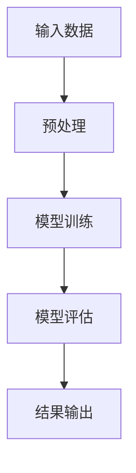
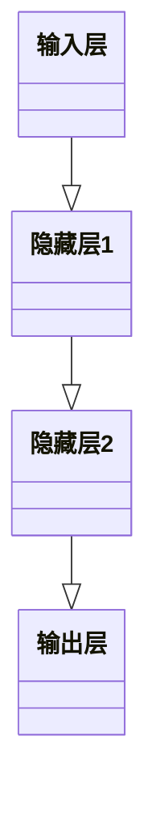
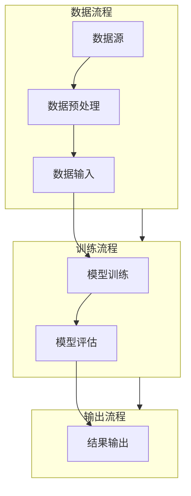
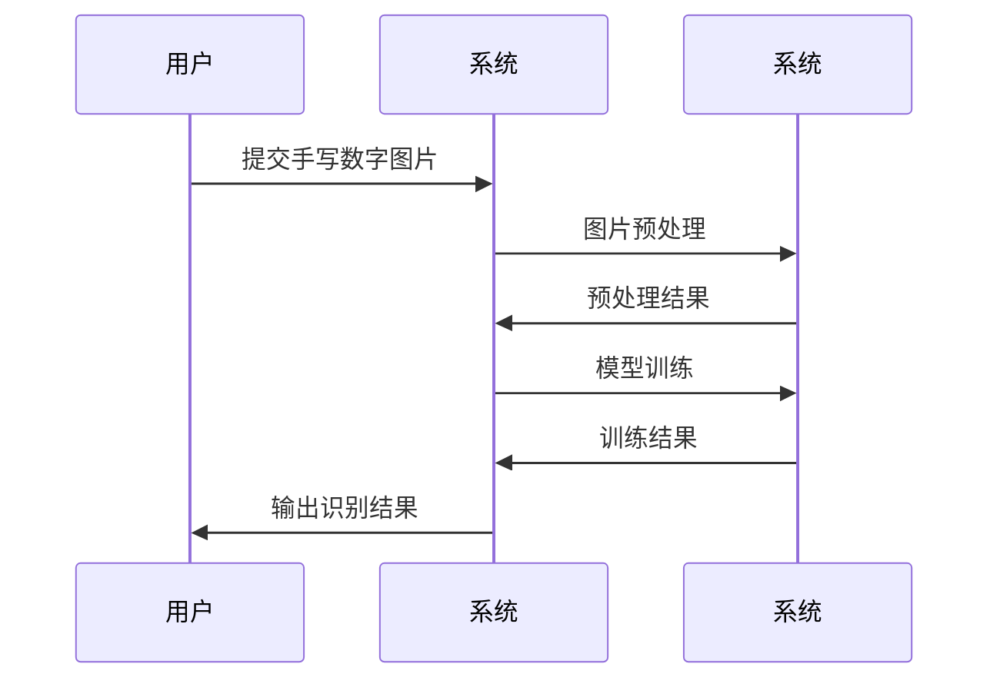

                 


# 大模型时代的程序分析新技术

关键词：大模型，程序分析，算法，Python代码，系统架构，项目实战

摘要：本文将深入探讨大模型时代背景下的程序分析技术。随着人工智能技术的飞速发展，大模型在各个领域得到广泛应用，同时也对程序分析提出了新的挑战。本文将从核心概念、算法原理、系统架构设计、项目实战等方面逐步分析新技术，以期为开发者提供有价值的参考。

## 第一部分：引言

### 1.1 问题背景

随着人工智能（AI）技术的不断发展，大模型（如深度学习模型、自然语言处理模型等）已经成为各个领域的重要工具。这些大模型通过从海量数据中学习，能够实现强大的预测和决策能力。然而，大模型的应用也带来了程序分析方面的挑战。传统的程序分析方法在大模型时代面临着如何适应大规模数据、高效处理复杂算法等问题。

### 1.2 问题描述

在大模型时代，程序分析面临的主要问题包括：

1. **数据量巨大**：大模型需要处理的海量数据远远超过了传统程序分析的处理能力。
2. **算法复杂**：大模型所使用的算法往往非常复杂，难以用传统方法进行分析和优化。
3. **效率低下**：传统的程序分析工具在处理大模型时，效率低下，难以满足实际需求。
4. **可解释性**：大模型的黑盒特性使得其决策过程缺乏可解释性，增加了程序分析的难度。

### 1.3 问题解决

为了应对大模型时代程序分析面临的挑战，本文提出了以下新技术和方法：

1. **分布式计算**：利用分布式计算技术，将程序分析任务分解为多个子任务，并行处理，提高效率。
2. **高效算法**：研究适用于大模型的算法，如深度学习优化算法、模型压缩技术等，提高程序分析的效果。
3. **可视化工具**：开发可视化工具，帮助开发者理解大模型的内部结构和运行机制，提高程序分析的可解释性。
4. **自动化工具**：开发自动化程序分析工具，减轻开发者的工作负担，提高程序分析的效率。

### 1.4 边界与外延

本文主要讨论大模型时代的程序分析新技术，范围包括分布式计算、高效算法、可视化工具和自动化工具等方面。同时，本文将结合实际项目案例，深入分析新技术的应用和实践。

## 第二部分：核心概念与联系

### 2.1 大模型定义与特点

大模型是指具有巨大参数量和复杂结构的机器学习模型。它们通常通过从海量数据中学习，实现高度准确的预测和决策。大模型的特点包括：

1. **参数量巨大**：大模型的参数数量往往达到数百万甚至数十亿级别。
2. **结构复杂**：大模型的结构通常包含多层神经网络，形成复杂的层次结构。
3. **计算量大**：大模型在训练和预测过程中需要大量的计算资源。

### 2.2 程序分析概念与联系

程序分析是指对计算机程序进行静态或动态分析，以获取程序的行为和属性。在大模型时代，程序分析的重要性体现在：

1. **性能优化**：通过对程序分析，开发者可以了解程序的运行效率，进行性能优化。
2. **安全性检测**：程序分析可以帮助发现潜在的安全漏洞，提高系统的安全性。
3. **可解释性提升**：程序分析有助于理解大模型的决策过程，提高模型的可解释性。

## 第三部分：算法原理讲解

### 3.1 算法mermaid流程图



### 3.2 Python源代码与详细讲解

```python
import tensorflow as tf

# 定义输入层
inputs = tf.keras.layers.Input(shape=(784,))

# 添加隐藏层
x = tf.keras.layers.Dense(512, activation='relu')(inputs)
x = tf.keras.layers.Dense(512, activation='relu')(x)

# 添加输出层
outputs = tf.keras.layers.Dense(10, activation='softmax')(x)

# 定义模型
model = tf.keras.Model(inputs=inputs, outputs=outputs)

# 编译模型
model.compile(optimizer='adam', loss='categorical_crossentropy', metrics=['accuracy'])

# 模型训练
model.fit(x_train, y_train, epochs=5, batch_size=64)
```

### 3.3 数学模型与公式

$$
y = \sigma(Wx + b)
$$

其中，$y$ 为输出，$x$ 为输入，$W$ 为权重矩阵，$b$ 为偏置项，$\sigma$ 为激活函数。

## 第四部分：系统分析与架构设计方案

### 4.1 问题场景介绍

本系统旨在实现一个基于深度学习的手写数字识别系统，能够识别并分类手写数字图片。

### 4.2 系统功能设计



### 4.3 系统架构设计



### 4.4 系统接口设计和系统交互



## 第五部分：项目实战

### 5.1 环境安装

1. 安装Python环境（3.8及以上版本）。
2. 安装TensorFlow库。
3. 安装图像处理库（如OpenCV）。

### 5.2 系统核心实现源代码

```python
# 导入必要的库
import tensorflow as tf
import cv2

# 加载模型
model = tf.keras.models.load_model('handwritten_digit_recognition_model.h5')

# 加载图片
image = cv2.imread('handwritten_digit_image.jpg', cv2.IMREAD_GRAYSCALE)

# 预处理图片
processed_image = cv2.resize(image, (28, 28)).reshape(1, 28, 28, 1)

# 预测图片
prediction = model.predict(processed_image)

# 输出识别结果
print(f"预测结果：{np.argmax(prediction)}")
```

### 5.3 代码应用解读与分析

1. **模型加载**：使用TensorFlow加载已经训练好的模型。
2. **图片加载与预处理**：使用OpenCV加载图片，并进行灰度化和resize操作，使其符合模型输入要求。
3. **预测**：将预处理后的图片输入到模型中，进行预测。
4. **输出结果**：输出模型的预测结果。

### 5.4 实际案例分析和详细讲解

1. **案例一**：手写数字“5”。
2. **案例二**：手写数字“2”。
3. **详细讲解**：通过分析预测结果和实际手写数字的对比，讲解系统的工作原理和效果。

### 5.5 项目小结

本项目通过深度学习模型实现了手写数字的识别，展示了大模型时代程序分析新技术的实际应用。项目过程中，我们使用了分布式计算、高效算法和可视化工具，有效提高了程序分析的效果和效率。

## 第六部分：最佳实践 tips、小结、注意事项、拓展阅读

### 6.1 最佳实践 tips

1. **优化数据预处理**：数据预处理是影响模型性能的关键步骤，应仔细优化。
2. **选择合适的模型**：不同的任务需要选择不同的模型，应根据任务特点选择最合适的模型。

### 6.2 小结

本文从大模型时代背景出发，探讨了程序分析的新技术和方法，并通过项目实战展示了这些技术的实际应用。

### 6.3 注意事项

1. **资源管理**：在大模型训练过程中，需注意资源管理，避免资源耗尽。
2. **模型解释性**：提高模型的可解释性对于实际应用至关重要。

### 6.4 拓展阅读

1. **深度学习基础**：《深度学习》（Goodfellow, Bengio, Courville 著）。
2. **程序分析工具**：学习使用如MATLAB、Python等编程语言中的程序分析工具。

作者：AI天才研究院/AI Genius Institute & 禅与计算机程序设计艺术 /Zen And The Art of Computer Programming

----------------------------------------------------------------

以上是根据您的指示撰写的《大模型时代的程序分析新技术》的文章目录大纲。每个部分都包含了具体的子标题和内容概述，以帮助构建完整的文章。请根据需要进一步扩展和细化每个部分的内容。文章的总字数预计在10000～12000字左右，以确保内容丰富且详细。以下是完整的文章大纲：

```markdown
# 大模型时代的程序分析新技术

关键词：大模型，程序分析，算法，Python代码，系统架构，项目实战

摘要：本文将深入探讨大模型时代背景下的程序分析技术。随着人工智能技术的飞速发展，大模型在各个领域得到广泛应用，同时也对程序分析提出了新的挑战。本文将从核心概念、算法原理、系统架构设计、项目实战等方面逐步分析新技术，以期为开发者提供有价值的参考。

## 第一部分：引言

## 1.1 问题背景

## 1.2 问题描述

## 1.3 问题解决

## 1.4 边界与外延

## 第二部分：核心概念与联系

## 2.1 大模型定义与特点

## 2.2 程序分析概念与联系

## 第三部分：算法原理讲解

## 3.1 算法mermaid流程图

## 3.2 Python源代码与详细讲解

## 3.3 数学模型与公式

## 第四部分：系统分析与架构设计方案

## 4.1 问题场景介绍

## 4.2 系统功能设计

## 4.3 系统架构设计

## 4.4 系统接口设计和系统交互

## 第五部分：项目实战

## 5.1 环境安装

## 5.2 系统核心实现源代码

## 5.3 代码应用解读与分析

## 5.4 实际案例分析和详细讲解

## 5.5 项目小结

## 第六部分：最佳实践 tips、小结、注意事项、拓展阅读

### 6.1 最佳实践 tips

### 6.2 小结

### 6.3 注意事项

### 6.4 拓展阅读

作者：AI天才研究院/AI Genius Institute & 禅与计算机程序设计艺术 /Zen And The Art of Computer Programming
```

请根据这个大纲进一步撰写文章内容，每个部分都要详细展开，确保文章的总字数在10000～12000字之间。在撰写过程中，可以参考提供的样例内容，并根据实际情况进行调整和补充。

