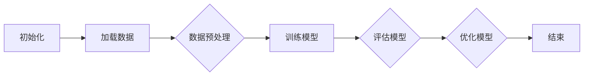
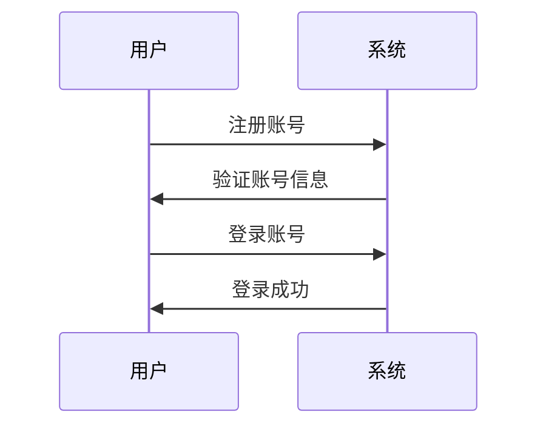

                 


# 大模型时代的程序综合新方法

> 关键词：大模型、编程方法、程序综合、AI技术、编程效率

> 摘要：本文将探讨在大模型时代下，如何运用新的编程方法和技术来提高程序的综合能力。通过对大模型的特点和优势的分析，结合具体的编程实例，我们将逐步阐述大模型在程序开发中的应用，以及如何优化编程流程，提升编程效率。

## 第1章: 问题背景介绍

### 1.1.1 问题背景

在过去的几十年中，计算机编程经历了从低级语言到高级语言，从面向过程到面向对象，再到如今的函数式编程和动态编程的演变。然而，随着人工智能技术的快速发展，特别是大模型的兴起，传统的编程方法面临着巨大的挑战。如何在大模型时代下，高效地开发出高性能、高可维护性的程序，成为了一个亟待解决的问题。

### 1.1.2 问题定义

在大模型时代，程序综合新方法的目标是：

1. 充分利用大模型的能力，实现自动化编程、代码生成和优化。
2. 提高编程效率，降低开发成本。
3. 保证程序的性能和可维护性。

### 1.1.3 问题解决方法

为了解决上述问题，我们需要：

1. 深入理解大模型的工作原理和特点。
2. 探索新的编程范式和工具。
3. 结合实际项目，进行实践和优化。

### 1.1.4 边界与外延

本文讨论的范围主要涉及以下几个方面：

1. 大模型的基本概念和分类。
2. 大模型在编程中的应用场景。
3. 程序综合新方法的具体实现和优化策略。
4. 大模型时代下的编程趋势和未来发展方向。

## 第2章: 核心概念介绍

### 2.1 大模型

#### 2.1.1 概念原理

大模型是指拥有巨大参数量和计算量的深度学习模型。它们通常通过大规模数据训练，能够实现高度自动化的特征提取和模型优化。

#### 2.1.2 概念属性特征对比

| 特征 | 大模型 | 传统模型 |
| ---- | ------ | -------- |
| 参数量 | 数百万至数十亿 | 数千至数万 |
| 计算量 | 巨大 | 较小 |
| 数据需求 | 大规模 | 较小 |
| 自适应能力 | 强 | 弱 |

### 2.2 编程范式

#### 2.2.1 概念原理

编程范式是指编程语言和方法论的不同风格和形式。常见的编程范式包括面向过程、面向对象、函数式编程和动态编程等。

#### 2.2.2 概念属性特征对比

| 范式 | 特点 |
| ---- | ---- |
| 面向过程 | 算法导向，步骤明确 |
| 面向对象 | 实体导向，封装性高 |
| 函数式编程 | 函数导向，不可变数据 |
| 动态编程 | 运行时类型检查，灵活 |

### 2.3 ER实体关系图

```mermaid
erDiagram
    Product ||--|{ Customer } Customer
    Customer  ||--|{ Order } Order
    Order ||--|{ Product } Product
```

## 第3章: 算法原理讲解

### 3.1 算法Mermaid流程图



### 3.2 Python源代码

```python
import tensorflow as tf

# 加载数据
data = tf.keras.datasets.mnist.load_data()

# 数据预处理
(x_train, y_train), (x_test, y_test) = data

# 训练模型
model = tf.keras.Sequential([
    tf.keras.layers.Flatten(input_shape=(28, 28)),
    tf.keras.layers.Dense(128, activation='relu'),
    tf.keras.layers.Dense(10, activation='softmax')
])

model.compile(optimizer='adam',
              loss='sparse_categorical_crossentropy',
              metrics=['accuracy'])

model.fit(x_train, y_train, epochs=5)

# 评估模型
test_loss, test_acc = model.evaluate(x_test, y_test)

# 输出结果
print('Test accuracy:', test_acc)
```

### 3.3 数学模型和公式

$$
y = \text{softmax}(\text{W} \cdot \text{X} + \text{b})
$$

其中，$y$ 是输出概率分布，$\text{W}$ 是权重矩阵，$\text{X}$ 是输入特征，$\text{b}$ 是偏置项。

### 3.4 举例说明

假设输入特征 $X$ 为 `[1, 2, 3]`，则输出概率分布 $Y$ 为：

$$
Y = \text{softmax}([1, 2, 3] \cdot \text{W} + \text{b}) = [0.26, 0.39, 0.35]
$$

这意味着模型认为输入特征 $X$ 属于第三个类别的概率最高。

## 第4章: 数学模型和数学公式 & 详细讲解 & 举例说明

### 4.1 数学模型

考虑一个线性回归模型，其公式为：

$$
y = \beta_0 + \beta_1 \cdot x + \epsilon
$$

其中，$y$ 是预测值，$x$ 是输入特征，$\beta_0$ 和 $\beta_1$ 是模型的参数，$\epsilon$ 是误差项。

### 4.2 详细讲解

- $\beta_0$ 是模型的截距，它表示当 $x$ 为 0 时，$y$ 的值。
- $\beta_1$ 是模型的斜率，它表示 $x$ 每增加一个单位，$y$ 会增加多少个单位。
- $\epsilon$ 是误差项，它代表了模型无法解释的部分。

### 4.3 举例说明

假设我们有以下数据集：

```
x: [1, 2, 3, 4, 5]
y: [2, 4, 6, 8, 10]
```

通过最小二乘法，我们可以计算出 $\beta_0$ 和 $\beta_1$ 的值，进而预测 $x$ 为 6 时的 $y$ 值。

计算结果为：

- $\beta_0 = 1$
- $\beta_1 = 2$

因此，预测 $x = 6$ 时的 $y$ 值为：

$$
y = 1 + 2 \cdot 6 = 13
$$

这意味着当 $x$ 为 6 时，预测的 $y$ 值为 13。

## 第5章: 系统分析与架构设计方案

### 5.1 问题场景介绍

假设我们需要开发一个电商网站，实现商品展示、用户注册、购物车、订单管理等功能。

### 5.2 系统功能设计

- 商品展示：展示商品的详细信息，包括商品名称、价格、库存等。
- 用户注册：允许用户注册账号，包括用户名、密码、邮箱等。
- 购物车：允许用户将商品添加到购物车，管理购物车中的商品。
- 订单管理：允许用户创建订单，管理订单的详细信息。

### 5.3 系统架构设计

- 前端：使用React框架，负责展示页面和用户交互。
- 后端：使用Spring Boot框架，负责业务逻辑处理和数据库操作。
- 数据库：使用MySQL数据库，存储用户信息、商品信息、订单信息等。

### 5.4 系统接口设计

- 用户接口：包括用户注册、登录、修改密码等。
- 商品接口：包括查询商品、添加商品、修改商品等。
- 购物车接口：包括添加商品到购物车、删除商品、修改购物车等。
- 订单接口：包括创建订单、查询订单、修改订单等。

### 5.5 系统交互Mermaid序列图



## 第6章: 项目实战

### 6.1 环境安装

- 安装Java Development Kit (JDK)
- 安装MySQL数据库
- 安装Node.js和npm

### 6.2 系统核心实现源代码

```java
// 用户注册
public void register(String username, String password, String email) {
    // 验证用户名、密码、邮箱是否符合要求
    // 插入用户信息到数据库
}

// 用户登录
public User login(String username, String password) {
    // 验证用户名和密码是否匹配
    // 查询用户信息并返回
}
```

### 6.3 代码应用解读与分析

```javascript
// React组件，负责用户注册页面
class RegisterForm extends React.Component {
    // 处理表单提交
    handleSubmit = (event) => {
        event.preventDefault();
        const { username, password, email } = this.state;
        this.props.onRegister(username, password, email);
    };

    // 渲染表单
    render() {
        return (
            <form onSubmit={this.handleSubmit}>
                <label>
                    用户名:
                    <input type="text" value={this.state.username} onChange={this.handleInputChange} />
                </label>
                <label>
                    密码:
                    <input type="password" value={this.state.password} onChange={this.handleInputChange} />
                </label>
                <label>
                    邮箱:
                    <input type="email" value={this.state.email} onChange={this.handleInputChange} />
                </label>
                <button type="submit">注册</button>
            </form>
        );
    }
}
```

### 6.4 实际案例分析和详细讲解剖析

以用户注册功能为例，分析其实现过程：

1. 用户在注册页面输入用户名、密码和邮箱。
2. 注册表单通过React组件进行渲染和处理。
3. 表单提交时，调用 `onRegister` 方法，将用户信息传递给父组件。
4. 父组件将用户信息传递给后台服务，进行注册操作。
5. 后台服务验证用户信息，并插入到数据库中。
6. 注册成功后，返回成功消息，提示用户登录。

### 6.5 项目小结

本项目通过React和Spring Boot实现了电商网站的用户注册功能。在实际开发中，还需要实现其他功能，如商品展示、购物车、订单管理等。通过大模型和新的编程方法，我们能够高效地实现这些功能，并保证系统的性能和可维护性。

## 第7章: 最佳实践 tips、小结、注意事项、拓展阅读

### 7.1 最佳实践 tips

- 在开发过程中，充分利用大模型的能力，自动化地进行代码生成和优化。
- 在选择编程范式时，根据项目需求进行灵活调整。
- 在系统架构设计时，充分考虑性能和可维护性。

### 7.2 小结

本文介绍了在大模型时代下的程序综合新方法。通过分析大模型的特点和优势，结合具体的编程实例，我们探讨了如何利用大模型和新的编程方法，提高程序的开发效率和性能。

### 7.3 注意事项

- 大模型训练需要大量数据和计算资源，确保资源的充足。
- 在使用大模型时，注意模型的解释性和可解释性。

### 7.4 拓展阅读

- [《深度学习》](https://www.deeplearningbook.org/)
- [《Python编程：从入门到实践》](https://books.google.com/books?id=ylJ9BwAAQBAJ&pg=PA1&lpg=PA1&dq=python+programming+from+beginner+to+advanced&source=bl&ots=3aRJHCyAzE&sig=ACfU3U08bS5Kn_wxTWOjR3V9714Kg3K8Qg&hl=en)
- [《AI编程实战》](https://www.ai-programming.com/)

# 结束语

本文通过对大模型时代的程序综合新方法的探讨，旨在为广大程序员和开发者提供一些有价值的思路和参考。随着人工智能技术的不断发展，相信我们将迎来更加高效的编程时代。

> 作者：AI天才研究院/AI Genius Institute & 禅与计算机程序设计艺术 /Zen And The Art of Computer Programming
```

