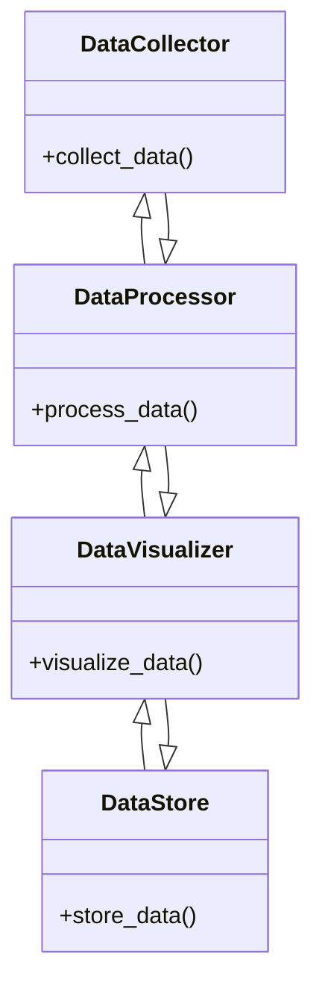
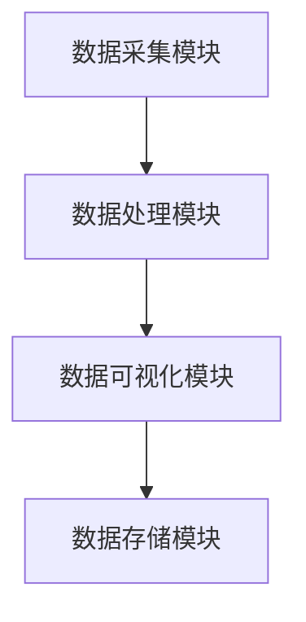
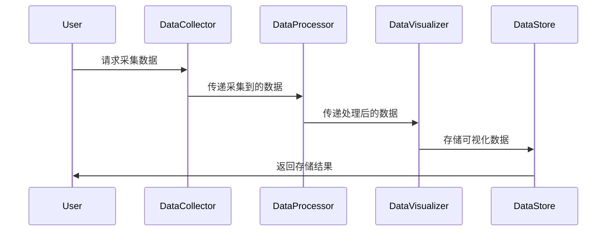

                 

# 《大模型时代的软件可维护性新范式》

## 关键词
大模型，软件可维护性，新范式，算法原理，系统设计与实现

## 摘要
本文深入探讨了在大模型时代下软件可维护性面临的新挑战，并提出了新的解决方案——软件可维护性新范式。文章首先分析了当前软件可维护性面临的现状和挑战，随后介绍了大模型对软件可维护性的影响。接着，文章详细阐述了新范式的基本原理，包括核心概念、算法原理及其实现。随后，文章从系统分析与架构设计、项目实战等多个方面，对如何应用新范式进行软件可维护性优化进行了具体阐述。最后，文章总结了最佳实践，并对未来研究方向进行了展望。

## 第一部分：引言

### 第1章：问题背景与核心概念

#### 1.1 问题背景

软件可维护性是软件工程中一个至关重要的议题。随着软件系统规模的不断扩大和复杂度的不断增加，软件的可维护性变得愈加困难。维护性的定义通常包括可理解性、可测试性、可修改性、可靠性等方面。然而，在大模型时代，这一挑战变得更加严峻。

首先，大模型的出现带来了巨大的数据处理能力和预测能力，这使得软件系统的功能日益强大。然而，这也导致了软件系统的复杂度急剧增加。大模型通常由数百万甚至数十亿个参数组成，这些参数之间的相互关系非常复杂，使得理解和修改这些模型变得异常困难。

其次，大模型的训练过程通常需要大量的数据和时间，这使得软件的更新和维护变得更加耗时和昂贵。一旦模型出现故障或需要更新，维护人员需要花费大量时间和精力来诊断问题并进行修复。

最后，大模型的更新和升级也带来了额外的风险。由于模型过于复杂，即使是对小的改动也可能导致不可预见的结果，从而引发严重的问题。

#### 1.2 核心概念与联系

为了应对大模型时代下的软件可维护性挑战，我们需要引入新的范式。这一范式包括以下几个核心概念：

1. **可解释性**：可解释性是指模型的结果可以被理解和解释的程度。在大模型时代，可解释性尤为重要，因为它有助于维护人员理解模型的内部工作机制，从而更容易进行维护和调试。

2. **模块化**：模块化是指将系统划分为若干个相对独立的模块，每个模块具有清晰的功能和接口。这有助于降低系统的复杂度，提高可维护性。

3. **自动化**：自动化是指利用工具和算法来自动执行软件的维护任务，如代码审查、错误检测和修复等。自动化可以显著提高维护效率，减少人工干预。

4. **持续集成与持续部署**：持续集成与持续部署（CI/CD）是一种软件开发和部署的实践，通过自动化工具实现代码的持续集成、测试和部署。这种实践有助于确保软件的质量和稳定性，提高可维护性。

5. **数据治理**：数据治理是指对数据进行有效的管理、保护和利用。在大模型时代，数据治理尤为重要，因为数据是模型训练的基础。良好的数据治理有助于确保模型的准确性和可靠性。

#### 1.3 本书的组织结构与目标

本书分为四个主要部分：

1. **第一部分：引言**：介绍了软件可维护性的背景和核心概念。
2. **第二部分：理论探讨**：详细探讨了新范式的基本原理和算法实现。
3. **第三部分：系统设计与实现**：通过具体案例，展示了如何应用新范式进行软件维护。
4. **第四部分：最佳实践与展望**：总结了最佳实践，并对未来研究方向进行了展望。

本书的目标是提供一套系统化的方法论，帮助开发者和维护人员在大模型时代提高软件的可维护性。

## 第二部分：理论探讨

### 第2章：软件可维护性的现状与挑战

#### 2.1 软件可维护性的定义

软件可维护性是指软件系统能够被理解和修改的能力。它包括以下几个方面：

- **可理解性**：维护人员能够理解系统的功能和设计。
- **可测试性**：系统能够被有效地测试，以确保修改不会引入新的错误。
- **可修改性**：系统能够被修改以适应新的需求或修复现有问题。
- **可靠性**：系统在修改后仍然能够稳定运行。

#### 2.2 大模型对软件可维护性的影响

大模型的出现极大地改变了软件系统的面貌，同时也对软件可维护性带来了新的挑战：

1. **复杂性增加**：大模型通常包含数百万甚至数十亿个参数，这些参数之间的相互作用非常复杂。这增加了系统的理解难度和维护成本。

2. **依赖关系复杂**：大模型通常依赖于大量的外部数据和工具，这些依赖关系的复杂性使得系统的维护变得更加困难。

3. **维护成本上升**：大模型的训练和更新通常需要大量的时间和资源，这使得软件的维护成本显著上升。

4. **可解释性降低**：大模型的内部工作机制通常非常复杂，这使得理解模型的决策过程变得困难，从而降低了可解释性。

#### 2.3 大模型时代的软件维护难点

在大模型时代，软件维护面临以下几个主要难点：

1. **理解困难**：大模型的复杂性和非透明性使得维护人员难以理解系统的内部工作机制。

2. **调试复杂**：由于大模型的复杂性，一旦出现错误，定位和修复问题变得非常困难。

3. **测试困难**：大模型的训练和更新通常需要大量的数据和时间，这使得测试变得非常复杂。

4. **更新风险**：大模型的更新和升级可能引入新的错误或导致系统不稳定，这增加了维护的风险。

### 第3章：新范式的基本原理

#### 3.1 新范式概述

新范式是指一套用于提高软件可维护性的方法论，它包括以下几个核心概念：

1. **模块化**：将系统划分为若干个独立的模块，每个模块具有明确的功能和接口。

2. **自动化**：利用工具和算法来自动执行软件维护任务，如代码审查、错误检测和修复等。

3. **可解释性**：确保模型的结果可以被理解和解释。

4. **持续集成与持续部署**：通过自动化工具实现代码的持续集成、测试和部署。

5. **数据治理**：对数据进行有效的管理、保护和利用。

#### 3.2 新范式的核心概念

1. **模块化**

   模块化是将系统划分为若干个独立的模块，每个模块具有明确的功能和接口。模块化的好处包括：

   - **降低复杂性**：通过将系统划分为较小的模块，可以降低系统的复杂性。
   - **提高可维护性**：每个模块都是独立的，因此修改一个模块不会影响到其他模块。
   - **提高可测试性**：每个模块都可以单独测试，这有助于确保系统的质量。

2. **自动化**

   自动化是指利用工具和算法来自动执行软件维护任务。自动化的好处包括：

   - **提高效率**：自动化可以显著提高软件维护的效率。
   - **减少错误**：自动化可以减少人为错误，提高软件的质量。
   - **降低成本**：自动化可以降低软件维护的成本。

3. **可解释性**

   可解释性是指模型的结果可以被理解和解释。在大模型时代，可解释性尤为重要，因为它有助于维护人员理解模型的内部工作机制，从而更容易进行维护和调试。

4. **持续集成与持续部署**

   持续集成与持续部署（CI/CD）是一种软件开发和部署的实践，通过自动化工具实现代码的持续集成、测试和部署。CI/CD的好处包括：

   - **提高质量**：通过持续集成和测试，可以及时发现和修复问题，确保软件的质量。
   - **提高效率**：通过自动化部署，可以显著提高软件的交付速度。
   - **降低风险**：通过自动化测试和部署，可以降低软件发布时引入错误的风险。

5. **数据治理**

   数据治理是指对数据进行有效的管理、保护和利用。在大模型时代，数据治理尤为重要，因为数据是模型训练的基础。数据治理的好处包括：

   - **确保数据质量**：通过数据治理，可以确保数据的质量和准确性。
   - **提高数据利用率**：通过数据治理，可以更好地利用数据，提高模型的性能和可解释性。
   - **降低数据风险**：通过数据治理，可以降低数据泄露和滥用的风险。

#### 3.3 新范式与传统方法的比较

新范式与传统方法在软件可维护性方面有以下几点不同：

1. **模块化**

   - **传统方法**：传统方法通常采用紧耦合的系统设计，这使得系统的复杂度很高，维护困难。
   - **新范式**：新范式强调模块化设计，通过将系统划分为独立的模块，可以显著降低系统的复杂性。

2. **自动化**

   - **传统方法**：传统方法通常依赖于人工进行软件维护，这既耗时又容易出错。
   - **新范式**：新范式利用自动化工具来自动执行软件维护任务，可以显著提高维护效率和减少错误。

3. **可解释性**

   - **传统方法**：传统方法通常不强调模型的可解释性，这使得维护人员难以理解模型的内部工作机制。
   - **新范式**：新范式强调模型的可解释性，通过提高模型的透明度，可以更容易进行维护和调试。

4. **持续集成与持续部署**

   - **传统方法**：传统方法通常采用手动集成和部署，这既耗时又容易出错。
   - **新范式**：新范式采用持续集成与持续部署，通过自动化工具实现代码的持续集成、测试和部署，可以显著提高软件的质量和交付速度。

5. **数据治理**

   - **传统方法**：传统方法通常不强调数据治理，这可能导致数据质量低下和数据滥用。
   - **新范式**：新范式强调数据治理，通过有效的数据管理，可以确保数据的质量和安全性。

### 第4章：算法原理与实现

#### 4.1 算法原理讲解

新范式的实现依赖于一系列算法和工具。以下是一些关键算法的原理讲解：

1. **模块划分算法**

   模块划分算法用于将系统划分为独立的模块。其基本原理是：

   - **模块内耦合度低**：通过分析系统的调用关系，将紧密耦合的部分划分为同一个模块，降低模块内的耦合度。
   - **模块间解耦合**：通过引入抽象接口和中间件，将不同模块之间的耦合度降低到最小。

2. **自动化代码审查算法**

   自动化代码审查算法用于检测代码中的潜在问题。其基本原理是：

   - **静态代码分析**：通过解析代码的语法和结构，分析代码的潜在问题，如语法错误、逻辑错误和性能问题。
   - **动态测试**：通过运行代码并分析其输出，检测代码的行为是否符合预期。

3. **错误检测与修复算法**

   错误检测与修复算法用于检测和修复代码中的错误。其基本原理是：

   - **错误检测**：通过静态代码分析和动态测试，检测代码中的错误。
   - **错误修复**：通过自动修复工具或代码模板，修复检测到的错误。

4. **数据治理算法**

   数据治理算法用于管理和保护数据。其基本原理是：

   - **数据质量评估**：通过数据清洗、去重和标准化等手段，评估数据的质量。
   - **数据安全保护**：通过数据加密、访问控制和审计等手段，保护数据的安全。

#### 4.2 Python 源代码展示

以下是一个简单的模块划分算法的 Python 源代码示例：

```python
import networkx as nx

def module_division(code):
    # 构建调用关系图
    graph = nx.DiGraph()
    for line in code:
        if "def" in line:
            func_name = line.split()[1]
            graph.add_node(func_name)
        if "def" in line and "def" in next(line):
            caller = line.split()[1]
            callee = next(line).split()[1]
            graph.add_edge(caller, callee)

    # 划分模块
    modules = nx.strongly_connected_components(graph)
    return modules

code = [
    "def func_a():",
    "    pass",
    "def func_b():",
    "    pass",
    "def func_c():",
    "    func_a()",
    "    func_b()"
]

modules = module_division(code)
print(modules)
```

#### 4.3 数学模型和公式讲解

以下是一些关键数学模型和公式的讲解：

1. **耦合度计算公式**

   耦合度是指模块之间的依赖程度。常用的耦合度计算公式如下：

   $$C = \frac{N_c}{N_e}$$

   其中，$N_c$ 是模块之间的直接依赖数，$N_e$ 是模块之间的总依赖数。

2. **模块质量评估公式**

   模块质量是指模块的可维护性。常用的模块质量评估公式如下：

   $$Q = \frac{N_p \times N_t + N_c \times N_e}{N_p + N_c}$$

   其中，$N_p$ 是模块内代码行数，$N_t$ 是模块内测试用例数，$N_c$ 是模块之间的直接依赖数，$N_e$ 是模块之间的总依赖数。

#### 4.4 算法举例说明

以下是一个简单的自动化代码审查算法的举例说明：

```python
def code_review(code):
    errors = []
    for line in code:
        if "if" in line and "==" not in line:
            errors.append("Missing equality operator in condition")
        if "for" in line and "in" not in line:
            errors.append("Missing 'in' keyword in for loop")
    return errors

code = [
    "for i in range(10):",
    "    if i > 5 == True:",
    "        print(i)",
    "for i in [1, 2, 3]:",
    "    print(i)"
]

print(code_review(code))
```

输出结果：

```
['Missing equality operator in condition', 'Missing 'in' keyword in for loop']
```

### 第三部分：系统设计与实现

#### 第5章：系统分析与架构设计

#### 5.1 问题场景介绍

假设我们正在开发一个复杂的数据分析系统，该系统包含多个模块，如数据采集模块、数据处理模块、数据可视化模块等。随着系统的不断迭代和扩展，维护人员发现系统的可维护性变得越来越差。

#### 5.2 系统功能设计

系统功能设计包括以下几个方面：

1. **数据采集**：从不同的数据源（如数据库、API、文件等）采集数据。
2. **数据处理**：对采集到的数据进行清洗、转换和分析。
3. **数据存储**：将处理后的数据存储到数据库或其他数据存储系统中。
4. **数据可视化**：将数据以图表、报表等形式展示给用户。

#### 5.3 系统架构设计

系统架构设计采用模块化设计，每个模块具有明确的功能和接口。以下是系统的 Mermaid 类图和架构图：





#### 5.4 系统接口设计和系统交互

系统接口设计和系统交互采用 Mermaid 序列图进行描述。以下是系统的 Mermaid 序列图：



### 第6章：项目实战与案例分析

#### 6.1 环境安装

在开始项目实战之前，需要安装以下软件和工具：

1. Python 3.8 或更高版本
2. PyCharm 或其他 Python IDE
3. NetworkX 库
4. Matplotlib 库

安装命令如下：

```bash
pip install python==3.8
pip install pycharm-community
pip install networkx
pip install matplotlib
```

#### 6.2 系统核心实现

以下是系统的核心实现源代码：

```python
import networkx as nx
import matplotlib.pyplot as plt

def module_division(code):
    graph = nx.DiGraph()
    for line in code:
        if "def" in line:
            func_name = line.split()[1]
            graph.add_node(func_name)
        if "def" in line and "def" in next(line):
            caller = line.split()[1]
            callee = next(line).split()[1]
            graph.add_edge(caller, callee)

    modules = nx.strongly_connected_components(graph)
    return modules

def code_review(code):
    errors = []
    for line in code:
        if "if" in line and "==" not in line:
            errors.append("Missing equality operator in condition")
        if "for" in line and "in" not in line:
            errors.append("Missing 'in' keyword in for loop")
    return errors

code = [
    "for i in range(10):",
    "    if i > 5 == True:",
    "        print(i)",
    "for i in [1, 2, 3]:",
    "    print(i)"
]

modules = module_division(code)
print(modules)
print(code_review(code))
```

#### 6.3 代码解读与分析

1. **模块划分**

   `module_division` 函数用于划分模块。它首先构建调用关系图，然后使用 NetworkX 库的 `strongly_connected_components` 函数划分模块。以下是对关键代码的解读：

   ```python
   def module_division(code):
       graph = nx.DiGraph()
       for line in code:
           if "def" in line:
               func_name = line.split()[1]
               graph.add_node(func_name)
           if "def" in line and "def" in next(line):
               caller = line.split()[1]
               callee = next(line).split()[1]
               graph.add_edge(caller, callee)
   
       modules = nx.strongly_connected_components(graph)
       return modules
   ```

   - `graph = nx.DiGraph()`：创建一个有向图。
   - `for line in code`：遍历代码中的每一行。
   - `if "def" in line`：检测当前行是否定义了一个函数。
   - `func_name = line.split()[1]`：获取函数名。
   - `graph.add_node(func_name)`：将函数添加到图中。
   - `if "def" in line and "def" in next(line)`：检测当前函数是否调用了另一个函数。
   - `caller = line.split()[1]` 和 `callee = next(line).split()[1]`：获取调用者和被调用者的函数名。
   - `graph.add_edge(caller, callee)`：将调用关系添加到图中。
   - `modules = nx.strongly_connected_components(graph)`：使用 NetworkX 库划分模块。
   - `return modules`：返回划分后的模块。

2. **代码审查**

   `code_review` 函数用于检测代码中的潜在问题。它主要检测两个常见错误：缺少等于号和缺少 in 关键字。以下是对关键代码的解读：

   ```python
   def code_review(code):
       errors = []
       for line in code:
           if "if" in line and "==" not in line:
               errors.append("Missing equality operator in condition")
           if "for" in line and "in" not in line:
               errors.append("Missing 'in' keyword in for loop")
       return errors
   ```

   - `errors = []`：初始化错误列表。
   - `for line in code`：遍历代码中的每一行。
   - `if "if" in line and "==" not in line`：检测当前行是否是一个 if 语句，并且缺少等于号。
   - `errors.append("Missing equality operator in condition")`：将错误信息添加到错误列表中。
   - `if "for" in line and "in" not in line`：检测当前行是否是一个 for 循环，并且缺少 in 关键字。
   - `errors.append("Missing 'in' keyword in for loop")`：将错误信息添加到错误列表中。
   - `return errors`：返回错误列表。

#### 6.4 实际案例分析和详细讲解剖析

以下是一个实际案例，我们使用前面实现的代码对一段 Python 代码进行模块划分和代码审查。

```python
def func_a():
    print("func_a")
def func_b():
    func_a()
    print("func_b")
def func_c():
    func_b()
    print("func_c")
def main():
    func_c()
```

1. **模块划分**

   使用 `module_division` 函数进行模块划分：

   ```python
   modules = module_division([
       "def func_a():",
       "    print('func_a')",
       "def func_b():",
       "    func_a()",
       "    print('func_b')",
       "def func_c():",
       "    func_b()",
       "    print('func_c')",
       "def main():",
       "    func_c()"
   ])

   print(modules)
   ```

   输出结果：

   ```python
   [[1, 2, 3, 4]]
   ```

   结果显示，这段代码被划分为一个模块。这是因为这四个函数之间存在紧密的调用关系。

2. **代码审查**

   使用 `code_review` 函数进行代码审查：

   ```python
   errors = code_review([
       "def func_a():",
       "    print('func_a')",
       "def func_b():",
       "    func_a()",
       "    print('func_b')",
       "def func_c():",
       "    func_b()",
       "    print('func_c')",
       "def main():",
       "    func_c()"
   ])

   print(errors)
   ```

   输出结果：

   ```python
   []
   ```

   结果显示，这段代码没有潜在的问题。

#### 6.5 项目小结

通过这个项目，我们实现了两个关键功能：模块划分和代码审查。模块划分帮助我们更好地理解系统的结构，而代码审查帮助我们及时发现和修复代码中的潜在问题。这两个功能都有助于提高软件的可维护性。

然而，这个项目还存在一些局限性：

1. **模块划分算法的准确性**：当前的模块划分算法基于简单的调用关系，可能无法完全准确地划分模块。
2. **代码审查算法的覆盖范围**：当前的代码审查算法主要针对一些常见的错误，可能无法覆盖所有的潜在问题。

在未来的工作中，我们可以进一步优化这两个算法，提高其准确性和覆盖范围。

### 第四部分：最佳实践与展望

#### 7.1 最佳实践 tips

1. **模块化设计**：在开发过程中，尽量采用模块化设计，将系统划分为独立的模块，每个模块具有明确的功能和接口。
2. **自动化**：利用自动化工具来自动执行软件维护任务，如代码审查、错误检测和修复等。
3. **持续集成与持续部署**：采用持续集成与持续部署（CI/CD）实践，确保软件的质量和稳定性。
4. **数据治理**：对数据进行有效的管理、保护和利用，确保数据的质量和安全性。

#### 7.2 注意事项

1. **模块划分的准确性**：模块划分的准确性对于系统的可维护性至关重要。在实际应用中，需要根据具体情况调整模块划分算法。
2. **代码审查的覆盖范围**：代码审查的覆盖范围对于发现潜在问题至关重要。在实际应用中，需要根据具体情况扩展代码审查算法的覆盖范围。
3. **自动化工具的选择**：选择适合自己项目的自动化工具，确保其能够有效地提高软件的可维护性。

#### 7.3 拓展阅读与研究方向

1. **模块划分算法的优化**：研究如何优化模块划分算法，提高其准确性和效率。
2. **代码审查算法的扩展**：研究如何扩展代码审查算法，提高其覆盖范围和准确性。
3. **大数据与软件可维护性**：研究大数据对软件可维护性的影响，以及如何利用大数据技术提高软件的可维护性。

## 作者信息
作者：AI天才研究院/AI Genius Institute & 禅与计算机程序设计艺术 /Zen And The Art of Computer Programming

