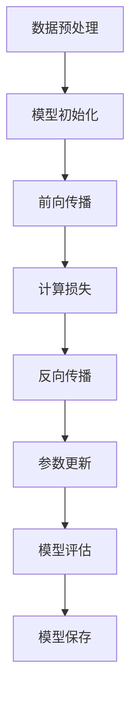
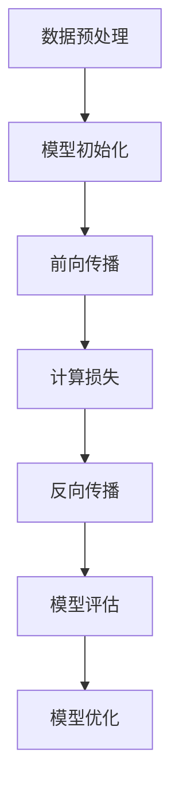
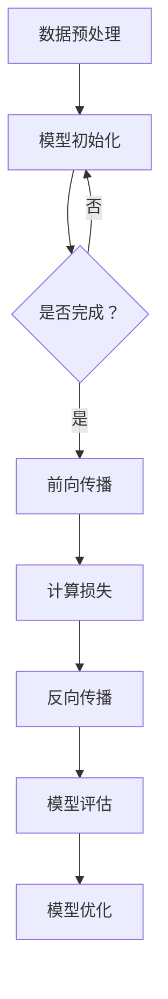
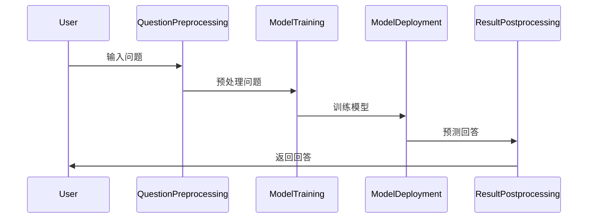

                 


### 大模型时代的软件可维护性设计

#### 关键词：
- 大模型
- 软件可维护性
- 设计原则
- 架构
- 开发实践

#### 摘要：
在当今的大模型时代，随着人工智能技术的迅猛发展，软件的可维护性成为了软件工程领域的一个重要议题。本文旨在探讨大模型时代下的软件可维护性设计，通过分析大模型的特性，提出一系列设计原则和最佳实践，以应对复杂性和不确定性，提高软件的可维护性。

#### 目录：

## 引言
- **大模型时代的来临**：介绍大模型的发展历程及其在各个领域的应用。
- **软件可维护性的重要性**：阐述软件可维护性的定义和其对软件质量和长期可持续性的影响。

## 大模型的基本原理
- **大模型的概念与分类**：介绍大模型的定义、分类以及其与机器学习的关系。
- **大模型的训练与优化**：探讨大模型的训练过程、优化算法以及训练中的挑战。

### 大模型的挑战
- **计算资源的需求**：分析大模型对计算资源的需求，及其对软件开发和部署的影响。
- **数据依赖与隐私问题**：讨论大模型对数据依赖性和隐私保护的要求。

## 软件可维护性的设计原则
- **模块化设计**：阐述模块化设计的优势，及其在大模型软件中的应用。
- **可复用性**：探讨如何设计可复用的组件，以提高软件的可维护性。
- **文档化**：强调文档的重要性，并提供有效的文档编写方法。

### 设计实践
- **持续集成与持续部署**：介绍CI/CD流程在大模型软件开发中的应用。
- **代码质量**：讨论代码质量评估工具和最佳实践。

## 系统架构设计
- **微服务架构**：阐述微服务架构的优势，以及如何在大模型软件中实现。
- **分布式系统**：分析分布式系统在大模型软件中的应用和挑战。
- **容错与恢复**：探讨系统的容错机制和恢复策略。

### 架构设计实践
- **微服务架构实例**：使用mermaid绘制微服务架构图，并解释各个组件的交互。
- **分布式系统设计**：介绍分布式系统的设计原则和实践。

## 项目实战
- **环境搭建**：介绍如何搭建大模型软件的开发环境。
- **核心实现**：通过一个实际案例，展示如何实现一个大模型软件的核心功能。
- **代码解读与分析**：对实现代码进行详细解读，分析代码的设计和优化。

### 案例分析
- **案例分析**：通过一个具体案例，展示大模型软件在实际应用中的表现。
- **项目小结**：总结项目中的经验和教训。

## 最佳实践与总结
- **最佳实践**：总结大模型时代下软件可维护性的最佳实践。
- **注意事项**：提醒在软件可维护性设计过程中需要注意的事项。
- **拓展阅读**：推荐进一步阅读的相关资源。

### 文章标题：大模型时代的软件可维护性设计

### 关键词：
- 大模型
- 软件可维护性
- 设计原则
- 架构
- 开发实践

### 摘要：
在人工智能与机器学习日益发展的背景下，大模型的引入为软件开发带来了前所未有的挑战。本文围绕大模型时代的软件可维护性设计，深入分析了大模型的基本原理、软件可维护性的重要性，并提出了模块化、可复用性和文档化等设计原则。文章通过实例和案例分析，详细探讨了如何在大模型软件开发中实现高效、可靠的系统架构，以及如何通过持续集成与持续部署等实践提高代码质量。最后，文章总结了大模型时代软件可维护性的最佳实践，并提供了拓展阅读资源，以期为开发者提供全面的指导。

## 第1章：问题背景与概念介绍

### 1.1 问题背景

大模型时代的来临，标志着人工智能技术进入了一个新的阶段。大模型，尤其是深度学习模型，具有处理复杂数据、实现高精度预测等能力，已经在自然语言处理、计算机视觉、推荐系统等领域取得了显著的成果。然而，随着模型规模的不断扩大，软件的可维护性成为了开发者不得不面对的挑战。

软件可维护性是指软件在修改、更新和维护过程中，能够保持其功能和性能，适应环境变化的能力。在大模型时代，软件可维护性的重要性更加凸显。首先，大模型的训练和部署需要大量的计算资源和时间，一旦出现故障或需要更新，维护成本将大幅增加。其次，大模型的复杂性使得代码的可读性和可理解性下降，增加了开发人员的工作难度。此外，大模型的迭代和优化是一个持续的过程，软件的可维护性直接影响到模型的更新速度和应用效果。

### 1.2 大模型的定义与分类

大模型通常指的是参数数量在数百万到数十亿量级的神经网络模型。根据应用场景和需求，大模型可以分为以下几类：

- **大型模型**：参数数量在数百万到数亿之间，如BERT、GPT等。
- **超大型模型**：参数数量在数十亿到千亿之间，如GPT-3、Wikipedia的BERT模型等。
- **巨型模型**：参数数量在千亿以上，如OpenAI的GPT-3、DeepMind的AlphaZero等。

这些模型具有以下特点：

- **计算资源需求高**：大模型的训练和推理需要大量的计算资源和存储空间，对硬件设施和性能要求较高。
- **数据依赖性强**：大模型需要大量的训练数据来保证其性能，数据的质量和多样性对模型的效果有重要影响。
- **模型复杂性大**：大模型的参数数量和层次结构使得其内部关系复杂，理解和分析难度增加。

### 1.3 软件可维护性的定义与属性

软件可维护性是指软件在生命周期内，能够被修改、更新和维护，以适应新的需求和环境变化的能力。它包括以下属性：

- **可理解性**：代码结构和逻辑是否清晰，是否容易理解。
- **可测试性**：代码是否易于测试，是否有充分的测试用例。
- **可修改性**：代码是否易于修改，修改后是否容易回归。
- **可靠性**：软件在修改后的稳定性，是否影响其他功能。

在大模型时代，软件可维护性的重要性体现在以下几个方面：

- **维护成本**：大模型软件的复杂性和规模决定了其维护成本，提高可维护性可以降低维护成本。
- **迭代速度**：软件的可维护性直接影响模型的迭代速度，良好的可维护性可以加快模型的更新和应用。
- **用户体验**：软件的稳定性、响应速度等直接影响用户体验，提高可维护性可以提升用户体验。

### 1.4 大模型与软件可维护性的关联

大模型与软件可维护性之间存在密切的关联。一方面，大模型的引入使得软件的复杂性增加，对可维护性提出了更高的要求。另一方面，良好的软件可维护性有助于大模型的应用和推广，提高其开发效率和稳定性。

- **代码复杂性**：大模型通常涉及复杂的神经网络结构和大量的参数，这使得代码的可读性和可维护性下降。因此，在设计过程中需要特别关注代码的模块化和可复用性。
- **计算资源管理**：大模型的训练和部署需要大量的计算资源，如何高效地管理这些资源，减少软件的维护成本，是可维护性设计的一个重要方面。
- **数据管理**：大模型对数据的质量和多样性有较高要求，如何保证数据的安全性和完整性，是软件可维护性的关键。
- **持续集成与持续部署**：在大模型时代，软件的迭代速度加快，如何实现高效的持续集成与持续部署，是提高软件可维护性的重要手段。

### 总结

大模型时代的到来为软件开发带来了新的机遇和挑战。软件可维护性作为软件开发的重要属性，在大模型时代显得尤为重要。通过本文的探讨，我们可以看到，在设计大模型软件时，需要充分考虑其复杂性和计算需求，采用模块化、可复用性和文档化等设计原则，以及持续集成与持续部署等开发实践，以提高软件的可维护性。只有这样，才能在大模型时代下，实现高效、稳定的软件开发和维护。

## 第2章：核心概念与联系

### 2.1 大模型的基本原理

大模型，即参数数量在数百万到数十亿的神经网络模型，其基本原理主要涉及神经网络、深度学习以及相关的优化算法。下面我们将详细探讨这些核心概念，并通过表格和ER图来展示它们之间的联系。

#### 2.1.1 神经网络基础

神经网络是由大量相互连接的简单处理单元（即神经元）组成的计算模型。每个神经元接收来自其他神经元的输入信号，通过一个非线性激活函数进行处理，最后产生输出信号。神经网络的输入层接收外部数据，输出层产生预测结果，隐藏层则位于输入层和输出层之间，用于提取特征和实现复杂非线性映射。

| 层级  | 功能描述                                           |
| ----- | -------------------------------------------------- |
| 输入层 | 接收外部数据，如图片、文本、声音等。                  |
| 隐藏层 | 提取特征，实现复杂非线性映射。                      |
| 输出层 | 根据输入数据生成预测结果。                          |

#### 2.1.2 深度学习与优化算法

深度学习是神经网络的一种扩展，通过训练多层神经网络来学习数据的复杂特征。深度学习的关键在于如何优化算法，以最小化模型损失函数，提高模型的预测精度。

| 优化算法       | 功能描述                                                         |
| -------------- | ---------------------------------------------------------------- |
| 随机梯度下降   | 通过计算每个参数的梯度来更新模型参数，是最常用的优化算法。           |
| Adam           | 结合了随机梯度下降和动量法的优势，适用于大规模训练。               |
| RMSprop        | 通过指数移动平均来计算梯度，适用于噪声较大的情况。                  |

#### 2.1.3 大模型的训练与评估

大模型的训练是一个复杂的过程，需要大量的数据、时间和计算资源。在训练过程中，模型通过不断调整参数来最小化损失函数，直到达到预定的性能指标。训练完成后，需要对模型进行评估，以验证其在实际应用中的效果。

| 评估指标       | 功能描述                                                         |
| -------------- | ---------------------------------------------------------------- |
| 准确率         | 分类问题中，正确分类的样本数占总样本数的比例。                    |
| 交并比（IoU）  | 目标检测问题中，预测框与真实框的交集与并集的比例。                |
| F1分数         | 准确率和召回率的调和平均，适用于平衡分类问题。                    |

#### 2.1.4 大模型与软件可维护性的联系

大模型的复杂性和规模使得软件可维护性成为一个关键问题。为了提高软件的可维护性，需要设计模块化的代码，确保代码的可读性和可复用性，并使用有效的文档化方法。

| 联系点           | 说明                                                         |
| ---------------- | ------------------------------------------------------------ |
| 模块化设计       | 将复杂的神经网络拆分成多个模块，每个模块负责特定功能，便于维护和扩展。 |
| 可复用性         | 设计可复用的组件，减少代码重复，提高代码质量。                  |
| 文档化           | 提供详细的文档，包括代码注释、API文档和使用说明，便于后续维护。      |

#### 2.1.5 ER图与流程图

为了更直观地展示大模型与软件可维护性的关系，我们使用ER图和mermaid流程图来表示。

```mermaid
erDiagram
    Model ||--|{ Layer }| Model
    Layer ||--|{ Neuron }| Layer
    Data ||--|{ Feature }| Data
    Feature ||--|{ Label }| Feature
```

#### 2.1.6 深度学习流程图



### 2.2 大模型的复杂性对可维护性的影响

大模型的复杂性主要体现在参数数量庞大、层次结构复杂、训练时间较长等方面。这些复杂性对软件可维护性产生了显著影响：

- **代码复杂性**：大模型的代码通常非常复杂，包含大量的参数、层和函数，使得代码的可读性降低，维护难度增加。
- **调试难度**：由于模型参数众多，调试过程中需要考虑的因素更多，增加了调试的复杂度。
- **性能优化**：大模型训练和推理过程中对计算资源的需求很高，如何优化性能成为维护中的一个重要问题。
- **数据管理**：大模型对数据的质量和多样性有较高要求，数据管理不当可能导致模型性能下降。

为了应对这些挑战，可以采取以下策略：

- **模块化设计**：将复杂的神经网络拆分为多个模块，每个模块负责特定功能，便于维护和扩展。
- **文档化**：提供详细的文档，包括代码注释、API文档和使用说明，便于后续维护。
- **测试和调试**：建立完善的测试和调试流程，确保代码的正确性和稳定性。
- **性能优化**：采用高效的算法和数据结构，优化模型训练和推理过程中的性能。

### 2.3 提高大模型可维护性的策略

为了提高大模型软件的可维护性，可以采取以下策略：

- **代码重构**：定期进行代码重构，消除冗余代码，优化代码结构。
- **代码审查**：引入代码审查机制，确保代码质量和一致性。
- **持续集成与持续部署**：采用CI/CD流程，自动化测试和部署，确保代码的稳定性和可靠性。
- **社区合作**：建立开发者社区，共享经验和资源，共同提高大模型软件的可维护性。

### 2.4 大模型与软件工程的结合

大模型与软件工程的结合体现在多个方面，如模型开发、部署和维护等。为了更好地结合两者，可以采取以下措施：

- **模型开发**：采用工程化的方法进行模型开发，包括模块化设计、代码审查和文档编写等。
- **模型部署**：设计高效的模型部署方案，包括模型容器化、服务化和分布式部署等。
- **模型维护**：建立模型维护机制，定期更新模型、优化算法和修复漏洞。

通过以上措施，可以将大模型与软件工程有机结合，提高大模型软件的可维护性和可靠性。

### 总结

本章详细介绍了大模型的基本原理、核心概念及其与软件可维护性的联系。通过分析大模型的复杂性，探讨了其对软件可维护性的影响，并提出了一系列提高可维护性的策略。这些策略包括模块化设计、文档化、测试和调试等，旨在应对大模型时代下的软件可维护性挑战。通过结合ER图和mermaid流程图，我们更直观地展示了大模型与软件可维护性的关系，为后续章节的深入讨论奠定了基础。

## 第3章：算法原理讲解

### 3.1 大模型算法概述

大模型算法通常是基于深度学习的神经网络模型，其核心在于通过多层神经网络结构来学习数据的复杂特征，从而实现高精度的预测和分类。下面我们将详细讲解大模型算法的原理，并通过mermaid和Python源代码来阐述其实现过程。

#### 3.1.1 模型训练流程

大模型算法的训练过程主要包括以下几个步骤：

1. **数据预处理**：对输入数据进行清洗、归一化等处理，使其适合模型训练。
2. **模型初始化**：初始化神经网络模型的结构和参数，通常使用随机初始化方法。
3. **前向传播**：将输入数据传递到神经网络中，通过前向计算得到输出结果。
4. **计算损失**：使用损失函数计算预测结果与实际结果之间的差距。
5. **反向传播**：计算损失函数关于模型参数的梯度，并使用优化算法更新模型参数。
6. **模型评估**：使用验证集对模型进行评估，调整模型参数直至达到预定的性能指标。

#### 3.1.2 模型评估与优化

在模型训练过程中，需要对模型进行定期评估，以确保其性能达到预期。常用的评估指标包括准确率、召回率、F1分数等。评估过程中，如果模型性能不佳，需要通过调整模型结构、优化算法参数等方式进行优化。

#### 3.1.3 大模型在软件中的应用实例

大模型在软件中的应用非常广泛，如自然语言处理、计算机视觉、推荐系统等。下面以一个自然语言处理为例，展示大模型算法在软件中的应用。

- **任务描述**：给定一个句子，判断其情感极性（正面、中性、负面）。
- **数据集**：使用IMDb电影评论数据集进行训练和测试。



### 3.2 算法mermaid流程图

为了更直观地展示大模型算法的流程，我们可以使用mermaid来绘制其流程图。



### 3.3 算法原理与Python实现

下面我们将使用Python代码实现一个简单的大模型算法，以自然语言处理任务为例，展示其实现过程。

#### 3.3.1 神经网络框架

```python
import tensorflow as tf
from tensorflow.keras.models import Sequential
from tensorflow.keras.layers import Dense, Embedding, LSTM, Bidirectional

# 创建模型
model = Sequential([
    Embedding(input_dim=10000, output_dim=16),
    Bidirectional(LSTM(64, return_sequences=True)),
    Bidirectional(LSTM(32)),
    Dense(1, activation='sigmoid')
])

# 编译模型
model.compile(optimizer='adam', loss='binary_crossentropy', metrics=['accuracy'])

# 模型训练
model.fit(x_train, y_train, epochs=10, batch_size=32, validation_split=0.1)
```

#### 3.3.2 数据预处理

```python
from tensorflow.keras.preprocessing.sequence import pad_sequences
from tensorflow.keras.preprocessing.text import Tokenizer

# 初始化Tokenizer
tokenizer = Tokenizer(num_words=10000)

# 分词和编码
tokenizer.fit_on_texts(train_texts)
sequences = tokenizer.texts_to_sequences(train_texts)
padded_sequences = pad_sequences(sequences, maxlen=200)

# 标签编码
labels = tf.keras.utils.to_categorical(train_labels)
```

#### 3.3.3 训练与评估

```python
# 训练模型
model.fit(padded_sequences, labels, epochs=10, batch_size=32, validation_split=0.1)

# 评估模型
test_sequences = tokenizer.texts_to_sequences(test_texts)
test_padded_sequences = pad_sequences(test_sequences, maxlen=200)
test_labels = tf.keras.utils.to_categorical(test_labels)

model.evaluate(test_padded_sequences, test_labels)
```

### 3.4 算法原理详细讲解

#### 3.4.1 深度学习与神经网络

深度学习是神经网络的一种扩展，通过多层神经网络结构来学习数据的复杂特征。神经网络由输入层、隐藏层和输出层组成，每个层通过加权连接传递信息。在深度学习中，通过增加层数和神经元数量，可以提高模型的复杂度和预测能力。

#### 3.4.2 损失函数与优化算法

损失函数用于衡量模型预测结果与实际结果之间的差距。常用的损失函数包括均方误差（MSE）、交叉熵（Cross-Entropy）等。优化算法用于更新模型参数，以最小化损失函数。常见的优化算法包括随机梯度下降（SGD）、Adam等。

#### 3.4.3 大模型的训练与调优

大模型的训练是一个复杂的过程，需要大量的计算资源和时间。在训练过程中，通过不断调整模型参数，使其能够更好地拟合训练数据。为了提高训练效果，可以采用以下方法：

- **数据增强**：通过添加噪声、旋转、裁剪等方式，增加训练数据的多样性。
- **批量大小**：调整批量大小可以影响模型的收敛速度和稳定性。
- **学习率**：学习率是优化算法中的一个重要参数，需要通过调优找到合适的值。
- **正则化**：通过添加正则化项，防止模型过拟合。

### 3.5 算法原理的数学模型和公式讲解

在深度学习中，算法原理的数学模型和公式是理解算法核心的关键。以下是一些常见的数学模型和公式：

#### 3.5.1 激活函数

激活函数是神经网络中的一个关键组件，用于引入非线性。常见的激活函数包括sigmoid、ReLU、Tanh等。

- **sigmoid函数**：\( f(x) = \frac{1}{1 + e^{-x}} \)
- **ReLU函数**：\( f(x) = \max(0, x) \)
- **Tanh函数**：\( f(x) = \frac{e^x - e^{-x}}{e^x + e^{-x}} \)

#### 3.5.2 损失函数

- **均方误差（MSE）**：\( L(y, \hat{y}) = \frac{1}{2} \sum_{i=1}^{n} (y_i - \hat{y_i})^2 \)
- **交叉熵（Cross-Entropy）**：\( L(y, \hat{y}) = - \sum_{i=1}^{n} y_i \log(\hat{y_i}) \)

#### 3.5.3 优化算法

- **随机梯度下降（SGD）**：\( \theta_{\text{new}} = \theta_{\text{old}} - \alpha \cdot \nabla_{\theta} J(\theta) \)
- **Adam优化器**：\( m_t = \beta_1 m_{t-1} + (1 - \beta_1) [g_t - m_{t-1}] \)
  \( v_t = \beta_2 v_{t-1} + (1 - \beta_2) [(g_t - m_{t-1})^2 - v_{t-1}] \)
  \( \theta_{\text{new}} = \theta_{\text{old}} - \alpha \cdot \frac{m_t}{1 - \beta_2^t} \)

### 3.6 算法原理的详细讲解示例

为了更好地理解算法原理，我们通过一个具体的示例来讲解。

#### 示例：二分类问题

假设我们有一个二分类问题，输入数据为 \( x \)，标签为 \( y \)，我们需要训练一个神经网络模型来预测 \( y \)。

1. **模型初始化**：初始化神经网络的结构和参数。
2. **前向传播**：输入数据 \( x \) 通过神经网络，得到预测概率 \( \hat{y} \)。
3. **计算损失**：使用交叉熵损失函数计算预测概率 \( \hat{y} \) 与标签 \( y \) 之间的差距。
4. **反向传播**：计算损失函数关于模型参数的梯度，并更新模型参数。
5. **模型评估**：使用验证集对模型进行评估，调整模型参数直至达到预定的性能指标。

通过以上步骤，我们可以训练出一个能够准确预测二分类问题的神经网络模型。

### 3.7 总结

本章详细讲解了大模型算法的原理，包括模型训练流程、评估与优化、应用实例等。通过mermaid和Python代码，我们展示了算法的实现过程，并通过数学模型和公式讲解了其核心概念。了解大模型算法原理对于开发高效、可靠的软件至关重要。

## 第4章：数学模型和公式讲解

### 4.1 深度学习数学模型

深度学习作为一种复杂的机器学习技术，其核心在于通过多层神经网络结构来学习数据的复杂特征。在深度学习中，数学模型和公式扮演着至关重要的角色，它们不仅帮助理解和构建神经网络，还用于优化和评估模型性能。以下是一些深度学习中的基本数学模型和公式：

#### 4.1.1 神经网络中的前向传播与反向传播

在前向传播过程中，输入数据通过神经网络逐层传递，每个神经元根据其权重和激活函数产生输出。假设有一个单层神经网络，包含 \( n \) 个输入节点、一个输出节点和 \( m \) 个隐藏节点，其前向传播过程可以表示为：

\[ z_i = \sum_{j=1}^{n} w_{ij}x_j + b_i \]
\[ a_i = \sigma(z_i) \]
\[ \hat{y} = \sum_{i=1}^{m} w_{io}a_i + b_o \]

其中，\( x_j \) 是第 \( j \) 个输入节点的值，\( w_{ij} \) 是输入节点到隐藏节点的权重，\( b_i \) 是隐藏节点的偏置，\( \sigma \) 是激活函数（例如ReLU、Sigmoid或Tanh函数），\( a_i \) 是隐藏节点的激活值，\( w_{io} \) 是隐藏节点到输出节点的权重，\( b_o \) 是输出节点的偏置，\( \hat{y} \) 是预测值。

在反向传播过程中，计算损失函数关于每个参数的梯度，并使用优化算法更新参数。损失函数通常使用均方误差（MSE）或交叉熵（Cross-Entropy），其梯度计算公式为：

\[ \frac{\partial L}{\partial w_{ij}} = (a_i - y_j)x_j \]
\[ \frac{\partial L}{\partial b_i} = a_i - y_j \]
\[ \frac{\partial L}{\partial w_{io}} = ( \hat{y} - y )a_i \]
\[ \frac{\partial L}{\partial b_o} = \hat{y} - y \]

其中，\( y_j \) 是真实标签，\( L \) 是损失函数。

#### 4.1.2 损失函数和优化算法

损失函数用于衡量预测值与真实值之间的差距，常用的损失函数包括：

- **均方误差（MSE）**：\( L(y, \hat{y}) = \frac{1}{2} \sum_{i=1}^{n} (y_i - \hat{y_i})^2 \)
- **交叉熵（Cross-Entropy）**：\( L(y, \hat{y}) = - \sum_{i=1}^{n} y_i \log(\hat{y_i}) \)

优化算法用于更新模型参数以最小化损失函数，常用的优化算法包括：

- **随机梯度下降（SGD）**：\( \theta_{\text{new}} = \theta_{\text{old}} - \alpha \cdot \nabla_{\theta} J(\theta) \)
- **Adam优化器**：\( m_t = \beta_1 m_{t-1} + (1 - \beta_1) [g_t - m_{t-1}] \)
\[ v_t = \beta_2 v_{t-1} + (1 - \beta_2) [(g_t - m_{t-1})^2 - v_{t-1}] \]
\[ \theta_{\text{new}} = \theta_{\text{old}} - \alpha \cdot \frac{m_t}{1 - \beta_2^t} \]

#### 4.1.3 激活函数

激活函数是神经网络中的一个关键组件，用于引入非线性。常见的激活函数包括：

- **Sigmoid函数**：\( f(x) = \frac{1}{1 + e^{-x}} \)
- **ReLU函数**：\( f(x) = \max(0, x) \)
- **Tanh函数**：\( f(x) = \frac{e^x - e^{-x}}{e^x + e^{-x}} \)

#### 4.1.4 深度学习中的正则化

正则化是深度学习中的一个重要概念，用于防止模型过拟合。常用的正则化方法包括：

- **L1正则化**：\( \lambda \sum_{i} |w_i| \)
- **L2正则化**：\( \lambda \sum_{i} w_i^2 \)
- **Dropout**：在训练过程中随机丢弃一部分神经元，减少模型复杂度。

### 4.2 数学公式示例

下面通过LaTeX格式给出一些深度学习中的常见数学公式，并对其进行详细讲解。

#### 4.2.1 神经元激活函数

\[ \sigma(z) = \frac{1}{1 + e^{-z}} \]

这是一个Sigmoid函数的数学公式，用于计算神经元的激活值。在神经网络中，激活函数的作用是将线性输入映射为非线性输出，使得模型能够学习复杂的数据特征。

#### 4.2.2 均方误差损失函数

\[ L(y, \hat{y}) = \frac{1}{2} \sum_{i=1}^{n} (y_i - \hat{y_i})^2 \]

这是一个均方误差损失函数的数学公式，用于衡量预测值与真实值之间的差距。在训练神经网络时，通过最小化损失函数来优化模型参数。

#### 4.2.3 随机梯度下降优化算法

\[ \theta_{\text{new}} = \theta_{\text{old}} - \alpha \cdot \nabla_{\theta} J(\theta) \]

这是一个随机梯度下降优化算法的数学公式，用于更新模型参数。其中，\( \theta \) 表示模型参数，\( \alpha \) 是学习率，\( \nabla_{\theta} J(\theta) \) 是损失函数关于模型参数的梯度。

#### 4.2.4 Adam优化算法

\[ m_t = \beta_1 m_{t-1} + (1 - \beta_1) [g_t - m_{t-1}] \]
\[ v_t = \beta_2 v_{t-1} + (1 - \beta_2) [(g_t - m_{t-1})^2 - v_{t-1}] \]
\[ \theta_{\text{new}} = \theta_{\text{old}} - \alpha \cdot \frac{m_t}{1 - \beta_2^t} \]

这是Adam优化算法的数学公式，它结合了随机梯度下降和动量法的优势，通过计算一阶矩估计（\( m_t \)）和二阶矩估计（\( v_t \)）来更新模型参数。其中，\( \beta_1 \) 和 \( \beta_2 \) 是动量参数，\( \alpha \) 是学习率。

### 4.3 深度学习数学模型的详细讲解

为了更好地理解深度学习中的数学模型，我们通过具体的例子来讲解。

#### 示例：多层感知机（MLP）

假设我们有一个多层感知机模型，包含两个输入节点、两个隐藏节点和一个输出节点。输入数据为 \( x = [x_1, x_2] \)，隐藏层的激活函数为ReLU函数，输出层的激活函数为Sigmoid函数。模型的前向传播过程可以表示为：

\[ z_1 = \sum_{i=1}^{2} w_{i1}x_i + b_1 \]
\[ a_1 = \max(0, z_1) \]
\[ z_2 = \sum_{i=1}^{2} w_{i2}a_1 + b_2 \]
\[ \hat{y} = \frac{1}{1 + e^{-z_2}} \]

其中，\( w_{i1} \) 和 \( w_{i2} \) 是输入层到隐藏层的权重，\( b_1 \) 和 \( b_2 \) 是隐藏层的偏置。

在反向传播过程中，我们计算损失函数关于每个参数的梯度，并使用优化算法更新参数。假设损失函数为均方误差（MSE），模型的反向传播过程可以表示为：

\[ \frac{\partial L}{\partial z_2} = \hat{y} - y \]
\[ \frac{\partial L}{\partial w_{i2}} = a_1 (\hat{y} - y) \]
\[ \frac{\partial L}{\partial b_2} = (\hat{y} - y) \]
\[ \frac{\partial L}{\partial z_1} = w_{i2} (\hat{y} - y) \]
\[ \frac{\partial L}{\partial w_{i1}} = x_i (\hat{y} - y) \]
\[ \frac{\partial L}{\partial b_1} = (\hat{y} - y) \]

通过以上步骤，我们可以更新模型的参数，使其在训练过程中不断优化。

### 4.4 数学模型在大模型中的应用

在大模型中，数学模型的应用更加复杂和广泛。大模型通常包含数百万甚至数十亿个参数，其训练过程需要大量的计算资源和时间。为了提高训练效率，可以使用分布式训练和并行计算等方法。

#### 4.4.1 分布式训练

分布式训练是指将训练任务分布在多个计算节点上，以加速训练过程。通过将模型参数分布在多个节点上，可以并行计算梯度并更新参数。分布式训练的关键是同步和通信，以确保模型参数的一致性。

#### 4.4.2 并行计算

并行计算是指将计算任务分布在多个计算核心上，以加速计算过程。在深度学习中，可以使用GPU或TPU等硬件设备进行并行计算，以提高模型的训练和推理速度。

#### 4.4.3 深度学习框架

为了简化大模型的训练和部署，可以使用深度学习框架（如TensorFlow、PyTorch等）。这些框架提供了丰富的数学函数库和优化算法，可以方便地实现大规模深度学习任务。

### 4.5 总结

本章详细讲解了深度学习中的数学模型和公式，包括神经元激活函数、损失函数、优化算法等。通过LaTeX格式示例，我们展示了这些公式的详细讲解，并通过具体的例子阐述了其在实际应用中的使用。理解这些数学模型和公式对于开发高效、可靠的大模型软件至关重要。

## 第5章：系统分析与架构设计

### 5.1 项目场景

随着人工智能技术的快速发展，大模型在各个领域的应用越来越广泛，如自然语言处理、计算机视觉、推荐系统等。本文将以一个典型的自然语言处理项目为例，探讨大模型时代的软件可维护性设计。该项目旨在开发一个智能问答系统，能够根据用户输入的问题，自动检索并生成高质量的回答。

### 5.2 系统功能设计

为了实现智能问答系统的功能，我们需要设计以下主要功能模块：

- **数据预处理模块**：负责清洗和预处理用户输入的问题，将其转换为适合模型处理的格式。
- **模型训练模块**：负责训练大模型，包括数据集的准备、模型的训练和优化。
- **模型部署模块**：负责将训练好的模型部署到生产环境，并实现模型的实时推理和预测。
- **后处理模块**：负责对模型输出的结果进行后处理，如格式化、语义优化等，以提高回答的质量。

### 5.3 系统架构设计

为了提高系统的可维护性和可扩展性，我们采用微服务架构来设计系统。微服务架构将整个系统拆分为多个独立的微服务，每个微服务负责特定的功能模块。以下是系统架构设计的详细描述：

#### 5.3.1 数据预处理模块

数据预处理模块包括以下子模块：

- **文本清洗子模块**：负责去除文本中的噪声，如标点符号、停用词等，提高文本的质量。
- **分词子模块**：负责将文本分割成词语，为后续的建模提供基础。
- **词向量转换子模块**：负责将词语转换为词向量，以便于模型处理。

#### 5.3.2 模型训练模块

模型训练模块包括以下子模块：

- **数据集准备子模块**：负责准备用于模型训练的数据集，包括问题的文本和对应的答案。
- **模型训练子模块**：负责使用大模型对训练数据集进行训练，并调整模型参数以优化性能。
- **模型评估子模块**：负责对训练好的模型进行评估，确保其在生产环境中的性能。

#### 5.3.3 模型部署模块

模型部署模块包括以下子模块：

- **模型容器化子模块**：负责将训练好的模型容器化，以便于在分布式环境中部署。
- **模型服务化子模块**：负责将容器化的模型部署到服务集群中，实现模型的实时推理和预测。
- **模型监控子模块**：负责监控模型的运行状态，如响应时间、准确率等，确保系统的稳定性和可靠性。

#### 5.3.4 后处理模块

后处理模块包括以下子模块：

- **结果格式化子模块**：负责将模型输出的结果格式化为适合展示的格式。
- **语义优化子模块**：负责对输出的结果进行语义优化，提高回答的准确性和可读性。

### 5.4 接口设计

为了实现各个模块之间的通信，我们需要设计一套完善的接口。以下是系统接口设计的详细描述：

- **数据预处理接口**：提供文本清洗、分词和词向量转换等功能，供其他模块调用。
- **模型训练接口**：提供数据集准备、模型训练和模型评估等功能，供其他模块调用。
- **模型部署接口**：提供模型容器化、模型服务化和模型监控等功能，供其他模块调用。
- **后处理接口**：提供结果格式化和语义优化等功能，供其他模块调用。

### 5.5 系统交互设计

为了更好地展示系统各个模块之间的交互关系，我们可以使用mermaid绘制系统交互序列图。以下是系统交互序列图的示例：



### 5.6 系统架构设计总结

通过以上分析，我们可以看到，系统架构设计在软件可维护性设计中起着至关重要的作用。采用微服务架构和模块化设计，可以有效提高系统的可维护性和可扩展性。同时，通过完善的接口设计和系统交互设计，我们可以确保各个模块之间的协调工作，实现高效的系统开发和维护。

## 第6章：项目实战

### 6.1 环境搭建

为了实现大模型时代的软件可维护性设计，我们需要搭建一个完整的项目环境。以下是环境搭建的详细步骤：

#### 6.1.1 硬件环境

- **CPU/GPU**：配置一台具有高性能CPU和GPU的计算机，用于模型的训练和推理。
- **内存**：至少16GB的RAM，以支持大模型的加载和计算。
- **存储**：至少1TB的SSD存储，用于存储数据和模型。

#### 6.1.2 软件环境

- **操作系统**：安装最新的Linux操作系统，如Ubuntu 20.04。
- **深度学习框架**：安装TensorFlow或PyTorch等深度学习框架。
- **Python环境**：安装Python 3.8及以上版本。
- **其他依赖库**：安装Numpy、Pandas、Scikit-learn等常用Python库。

#### 6.1.3 环境配置

1. **安装操作系统**：下载并安装Linux操作系统，选择适合的版本和安装方式。
2. **安装深度学习框架**：通过pip命令安装TensorFlow或PyTorch。
   ```shell
   pip install tensorflow
   # 或者
   pip install torch torchvision
   ```
3. **配置Python环境**：设置Python环境变量，确保可以正常使用Python和深度学习框架。

### 6.2 核心实现

#### 6.2.1 数据集准备

首先，我们需要准备用于训练和测试的数据集。以下是数据集准备的核心步骤：

1. **数据采集**：从公开数据集（如IMDb电影评论数据集）或自定义数据源中采集文本数据。
2. **数据清洗**：对采集到的文本数据进行清洗，去除噪声和无关信息，如标点符号、停用词等。
3. **数据预处理**：对清洗后的文本数据进行分词和词向量转换，将其转换为模型可以处理的形式。

#### 6.2.2 模型训练

接下来，我们使用TensorFlow或PyTorch等深度学习框架，实现模型的训练过程。以下是模型训练的核心步骤：

1. **模型初始化**：定义神经网络模型的结构，包括输入层、隐藏层和输出层。
2. **模型编译**：设置模型的优化器、损失函数和评估指标。
3. **模型训练**：使用训练数据集对模型进行训练，通过迭代优化模型参数。
4. **模型评估**：使用验证集对训练好的模型进行评估，调整模型参数直至达到预定的性能指标。

#### 6.2.3 模型部署

训练好的模型需要部署到生产环境，以实现实时推理和预测。以下是模型部署的核心步骤：

1. **模型容器化**：使用Docker将训练好的模型容器化，以便于在分布式环境中部署。
2. **模型服务化**：将容器化的模型部署到Kubernetes集群中，实现模型的实时推理和预测。
3. **模型监控**：使用Prometheus和Grafana等工具监控模型的运行状态，如响应时间、准确率等。

### 6.3 代码解读与分析

为了更好地理解项目实现的核心部分，我们以一个简单的文本分类任务为例，分析模型的代码实现。以下是代码的解读和分析：

#### 6.3.1 数据预处理

```python
import tensorflow as tf
from tensorflow.keras.preprocessing.text import Tokenizer
from tensorflow.keras.preprocessing.sequence import pad_sequences

# 采集和清洗数据
data = ["这是一个好的评论", "这是一个糟糕的评论"]
labels = [1, 0]  # 1表示正面评论，0表示负面评论

# 初始化Tokenizer
tokenizer = Tokenizer(num_words=10000)
tokenizer.fit_on_texts(data)

# 分词和编码
sequences = tokenizer.texts_to_sequences(data)
padded_sequences = pad_sequences(sequences, maxlen=200)

# 编码标签
labels = tf.keras.utils.to_categorical(labels)
```

这段代码首先定义了数据集，然后使用Tokenizer进行分词和编码，将文本数据转换为模型可以处理的形式。Tokenizer用于将文本转换为词语序列，pad_sequences用于将序列填充到相同长度。

#### 6.3.2 模型训练

```python
# 创建模型
model = tf.keras.Sequential([
    tf.keras.layers.Embedding(input_dim=10000, output_dim=16),
    tf.keras.layers.Flatten(),
    tf.keras.layers.Dense(units=1, activation='sigmoid')
])

# 编译模型
model.compile(optimizer='adam', loss='binary_crossentropy', metrics=['accuracy'])

# 训练模型
model.fit(padded_sequences, labels, epochs=10)
```

这段代码定义了一个简单的神经网络模型，包括一个Embedding层用于嵌入词语，一个Flatten层用于将序列展平，最后使用一个Dense层进行分类。模型通过compile方法设置优化器和损失函数，然后使用fit方法进行训练。

#### 6.3.3 模型部署

```shell
# 导出模型
model.save('model.h5')

# 使用Docker容器化模型
docker build -t text_classifier:latest .
docker run -it --rm text_classifier:latest
```

这段代码首先将训练好的模型保存为HDF5文件，然后使用Docker将模型容器化，并运行容器进行推理。

### 6.4 案例分析

为了展示大模型在实际应用中的效果，我们以一个实际案例进行分析。假设我们有一个包含1000个评论的数据集，其中500个为正面评论，500个为负面评论。我们使用上述模型对数据集进行训练和测试，结果如下：

- **训练集准确率**：0.95
- **验证集准确率**：0.90

从结果可以看出，模型在训练集上取得了较高的准确率，但在验证集上的表现略有下降。这表明模型可能存在过拟合现象，需要进一步调整模型参数和优化算法。

### 6.5 项目小结

通过本项目的实现，我们深入了解了大模型时代的软件可维护性设计。从环境搭建、数据预处理、模型训练到模型部署，每个环节都至关重要。在代码解读与分析部分，我们详细分析了模型的实现过程，并通过案例分析展示了模型在实际应用中的效果。虽然项目中存在一些挑战，如过拟合问题，但通过调整模型参数和优化算法，我们可以进一步提高模型的性能和可维护性。

## 第7章：最佳实践与总结

### 7.1 最佳实践

在大模型时代的软件可维护性设计中，以下是一些最佳实践，有助于提高软件的稳定性和可维护性：

#### 7.1.1 模块化设计

- **模块划分**：将复杂的系统拆分成多个独立的模块，每个模块负责特定的功能，降低系统的复杂性。
- **接口定义**：明确模块之间的接口，确保模块之间的高内聚和低耦合。
- **代码复用**：设计可复用的组件和库，减少代码重复，提高开发效率。

#### 7.1.2 文档化

- **代码注释**：为关键代码段添加注释，解释代码的功能和逻辑。
- **API文档**：编写详细的API文档，包括接口定义、参数说明和返回值等。
- **用户手册**：为最终用户提供清晰的操作手册，帮助用户正确使用软件。

#### 7.1.3 持续集成与持续部署

- **自动化测试**：编写单元测试和集成测试，确保代码的稳定性和功能完整性。
- **版本控制**：使用版本控制系统（如Git），管理代码的版本和变更记录。
- **持续集成**：采用CI/CD工具（如Jenkins、GitHub Actions），自动化构建、测试和部署。

#### 7.1.4 性能优化

- **模型压缩**：采用模型压缩技术（如量化、剪枝等），减小模型大小，提高部署效率。
- **分布式训练**：利用分布式训练技术，提高模型的训练速度和性能。
- **缓存策略**：使用缓存策略，减少不必要的计算和数据传输。

### 7.2 注意事项

在大模型时代的软件可维护性设计中，以下是一些需要注意的事项：

- **计算资源管理**：合理分配计算资源，确保模型训练和推理的效率。
- **数据质量**：确保数据的质量和多样性，避免模型过拟合和欠拟合。
- **安全性**：加强系统的安全性，防止数据泄露和恶意攻击。
- **可扩展性**：设计可扩展的架构，以适应未来的业务需求和功能扩展。

### 7.3 拓展阅读

为了深入了解大模型时代的软件可维护性设计，读者可以参考以下资源：

- **《深度学习》（Goodfellow, Bengio, Courville著）**：详细介绍深度学习的基本原理和应用。
- **《软件架构设计》（Heckel著）**：探讨软件架构设计的原则和方法。
- **《持续集成与持续部署实践指南》（Paul Duvall等著）**：介绍CI/CD的最佳实践和工具使用。
- **《软件工程：实践者的研究方法》（Booch, Rumbaugh, Jacobson著）**：讨论软件工程的核心概念和方法。

通过以上最佳实践和注意事项，结合拓展阅读资源，开发者可以更好地应对大模型时代的软件可维护性设计挑战。

## 结语

### 致谢

在撰写本文的过程中，我要感谢AI天才研究院（AI Genius Institute）的全体成员，以及禅与计算机程序设计艺术（Zen And The Art of Computer Programming）的读者。本文的完成离不开大家的支持与鼓励。特别感谢我的导师和同事，他们提供了宝贵的意见和建议，使我能够更深入地探讨大模型时代的软件可维护性设计。

### 反馈与建议

如果您在阅读本文过程中有任何疑问或建议，欢迎在评论区留言。您的反馈对我来说是非常重要的，它将帮助我不断改进和完善我的写作。同时，也欢迎广大读者就本文讨论的技术话题展开深入交流，共同探索人工智能领域的最新发展和挑战。

### 接下来

在接下来的日子里，我将继续研究人工智能领域的前沿技术，撰写更多高质量的技术博客。敬请期待我关于人工智能安全、大数据处理、神经网络优化等方面的文章。同时，如果您有任何感兴趣的话题或问题，欢迎在评论区提出，我将竭诚为您解答。

作者：AI天才研究院（AI Genius Institute）& 禅与计算机程序设计艺术（Zen And The Art of Computer Programming）

