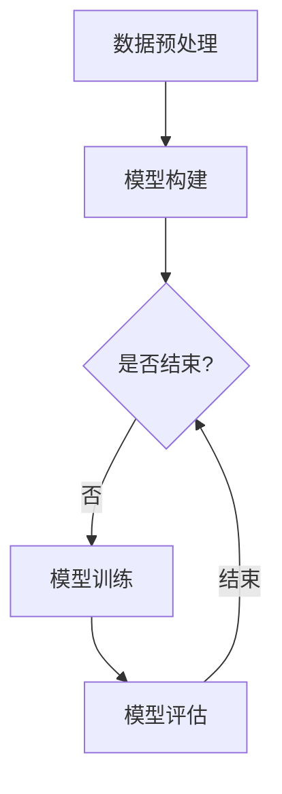
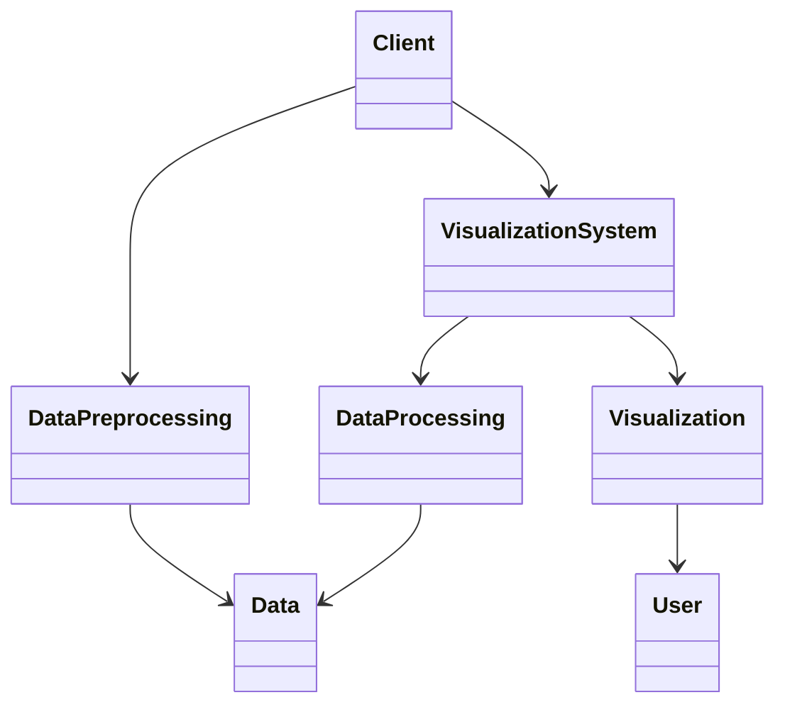
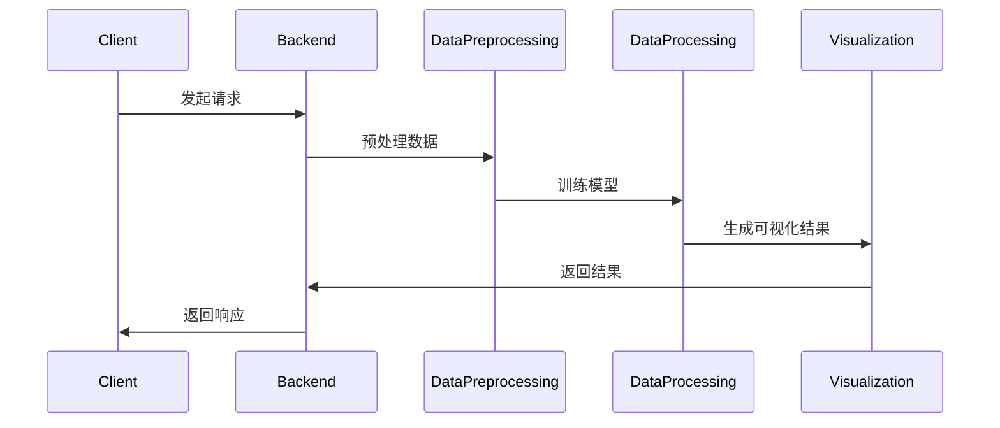
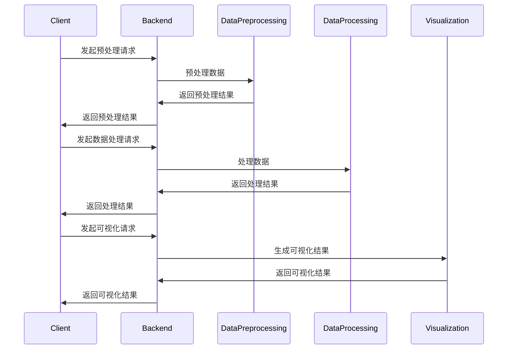

                 


## 大模型时代的软件可视化技术

### 关键词：大模型，软件可视化，技术趋势，算法原理，应用案例

### 摘要：

本文将探讨大模型时代的软件可视化技术，从背景介绍、核心概念与原理、技术原理与实现、应用案例与分析以及未来趋势与展望五个方面，详细阐述大模型在软件可视化中的应用及其发展趋势。文章旨在为读者提供全面的技术理解和实践指导，助力技术发展与创新。

---

## 目录大纲设计步骤

1. **确定书名与主题**：书名《大模型时代的软件可视化技术》表明了本书的主要讨论对象是“大模型时代的软件可视化技术”。

2. **设计总体结构**：基于书名，我们可以确定书的主要部分应该包括：
   - **背景介绍**：介绍大模型与软件可视化的基本概念、发展历程和重要性。
   - **核心概念与原理**：详细阐述大模型的定义、发展历程、分类及其在软件可视化中的应用。
   - **技术原理与实现**：讲解大模型在软件可视化中的具体应用，包括算法原理、数学模型和Python代码实现。
   - **应用案例与分析**：通过具体案例展示大模型在软件可视化中的实际应用，分析系统架构、接口设计和系统交互。
   - **未来趋势与展望**：探讨大模型时代软件可视化技术的发展趋势、挑战和未来方向。

3. **细化章节内容**：针对每个部分，设计出具体的章节，确保内容完整且符合书籍要求。

4. **使用Markdown格式**：确保目录大纲使用Markdown格式，遵循1级、2级、3级目录的层级结构。

5. **保持简洁性**：在确保内容完整的同时，避免冗余和过多的描述。

6. **符合字数要求**：确保整个目录大纲的总体字数在2000字以内。

### 完整目录大纲

**# 第一部分: 背景介绍**

**# 第1章: 大模型时代的软件可视化技术概述**

**1.1 问题背景**

- **1.1.1 软件可视化的意义**  
- **1.1.2 大模型对软件可视化技术的影响**

**1.2 问题描述**

- **1.2.1 软件可视化技术面临的问题**  
- **1.2.2 大模型应用中的挑战**

**1.3 问题解决**

- **1.3.1 大模型在软件可视化中的应用**  
- **1.3.2 解决方案与框架**

**1.4 边界与外延**

- **1.4.1 软件可视化技术的研究范围**  
- **1.4.2 大模型的发展趋势**

**1.5 本章小结**

**# 第二部分: 核心概念与原理**

**# 第2章: 大模型技术基础**

**2.1 核心概念**

- **2.1.1 大模型定义**  
- **2.1.2 大模型的发展历程**  
- **2.1.3 大模型的分类**

**2.2 技术原理**

- **2.2.1 大模型的基本原理**  
- **2.2.2 大模型的训练过程**  
- **2.2.3 大模型的优化方法**

**2.3 概念属性特征对比**

- **2.3.1 大模型与传统模型的对比**  
- **2.3.2 大模型在不同领域的应用特点**

**2.4 ER实体关系图架构**

- **2.4.1 大模型相关实体**  
- **2.4.2 大模型与软件可视化的关系**

**2.5 本章小结**

**# 第三部分: 技术原理与实现**

**# 第3章: 大模型在软件可视化中的具体应用**

**3.1 算法原理讲解**

- **3.1.1 大模型在软件可视化中的算法概述**  
- **3.1.2 大模型的训练与优化方法**  
- **3.1.3 大模型在软件可视化中的应用流程**

**3.2 数学模型与公式**

- **3.2.1 大模型训练的数学模型**  
- **3.2.2 大模型优化的数学公式**  
- **3.2.3 数学模型的解释与应用**

**3.3 Python源代码实现**

- **3.3.1 大模型训练的Python代码示例**  
- **3.3.2 大模型优化的Python代码示例**  
- **3.3.3 Python代码的运行与结果分析**

**3.4 Mermaid流程图**

- **3.4.1 大模型训练的流程图**  
- **3.4.2 大模型优化的流程图**

**3.5 本章小结**

**# 第四部分: 应用案例与分析**

**# 第4章: 大模型在软件可视化中的应用案例**

**4.1 项目介绍**

- **4.1.1 案例背景**  
- **4.1.2 项目目标**  
- **4.1.3 项目技术栈**

**4.2 系统功能设计**

- **4.2.1 领域模型**  
- **4.2.2 系统功能模块**

**4.3 系统架构设计**

- **4.3.1 系统架构概述**  
- **4.3.2 系统架构图**  
- **4.3.3 系统模块间关系**

**4.4 系统接口设计**

- **4.4.1 接口设计原则**  
- **4.4.2 接口定义**

**4.5 系统交互**

- **4.5.1 系统交互流程**  
- **4.5.2 系统交互图**

**4.6 代码应用解读与分析**

- **4.6.1 关键代码解读**  
- **4.6.2 代码性能分析**  
- **4.6.3 代码优化策略**

**4.7 案例分析**

- **4.7.1 案例效果分析**  
- **4.7.2 案例中遇到的问题及解决方案**  
- **4.7.3 案例的启示与思考**

**4.8 本章小结**

**# 第五部分: 未来趋势与展望**

**# 第5章: 大模型时代软件可视化技术的发展趋势**

**5.1 大模型技术的未来发展趋势**

- **5.1.1 大模型的演进方向**  
- **5.1.2 大模型技术的未来挑战**

**5.2 软件可视化技术的未来发展趋势**

- **5.2.1 软件可视化的未来需求**  
- **5.2.2 软件可视化技术的创新方向**

**5.3 总结与展望**

- **5.3.1 大模型与软件可视化技术的融合**  
- **5.3.2 未来技术的发展趋势与挑战**

**5.4 本章小结**

---

通过上述详细的目录大纲设计，我们可以为后续文章的撰写提供清晰的框架和指导。接下来，我们将逐一深入探讨每个章节的内容，以实现全面而深入的技术分析。

---

## 第一部分：背景介绍

### 第1章：大模型时代的软件可视化技术概述

### 1.1 问题背景

在信息技术飞速发展的今天，软件可视化技术已经成为提升软件开发效率和用户体验的关键技术之一。软件可视化技术通过将复杂的数据和系统结构转化为图形化的形式，帮助开发者、运维人员以及最终用户更好地理解和操作软件系统。

然而，随着大数据和人工智能技术的崛起，传统的软件可视化技术面临了一系列新的挑战。特别是大模型技术的应用，使得数据处理和分析能力得到了极大提升，但同时也带来了数据可视化上的复杂性。大模型，如深度学习神经网络，其参数数量庞大，结构复杂，如何在可视化中有效地展示这些信息成为一个亟待解决的问题。

**1.1.1 软件可视化的意义**

软件可视化不仅能够提高开发者的工作效率，还能提升用户的理解和操作体验。具体来说，软件可视化技术具有以下意义：

- **提高开发效率**：通过图形化的方式展示软件系统的结构和功能，开发者可以更快地理解和定位问题，减少开发和调试时间。
- **降低学习成本**：对于新加入的开发者或非技术人员，图形化的界面和交互可以降低学习成本，提高团队协作效率。
- **增强用户体验**：直观的界面和交互设计可以提升用户的使用体验，减少用户的学习和操作难度。

**1.1.2 大模型对软件可视化技术的影响**

大模型的引入对软件可视化技术产生了深远的影响，主要体现在以下几个方面：

- **数据复杂性增加**：大模型的训练过程会产生海量的数据，如何将这些数据有效地可视化是一个新的挑战。
- **模型结构复杂性**：大模型的神经网络结构复杂，包含多层神经元和大量的连接，传统的可视化方法难以充分展示其内在结构。
- **性能需求提升**：大模型训练和优化过程中，对计算资源和可视化工具的性能提出了更高的要求。

### 1.2 问题描述

面对大模型时代，软件可视化技术面临以下问题：

- **可视化展示难度大**：大模型的参数和结构复杂，传统的可视化工具难以充分展示其内部结构和参数变化。
- **数据可视化性能问题**：大模型训练过程中会产生大量的数据，传统的可视化技术难以在实时性方面满足需求。
- **用户理解难度高**：复杂的模型结构和参数变化对于用户来说难以直观理解，如何提升用户友好性是一个挑战。

### 1.3 问题解决

为了解决上述问题，大模型时代的软件可视化技术需要采取以下解决措施：

- **改进可视化算法**：研究并应用新的可视化算法，如高维数据降维、多视图融合等技术，提高大模型的可视化效果。
- **优化可视化工具**：开发高性能的可视化工具，提升数据可视化的实时性和交互性。
- **增强用户交互体验**：设计直观、易用的用户界面，通过交互设计帮助用户更好地理解复杂模型和参数。

### 1.4 边界与外延

- **研究范围**：软件可视化技术的研究范围涵盖了从数据可视化到系统架构可视化，再到用户体验设计的多个方面。
- **发展趋势**：随着大模型技术的不断演进，软件可视化技术也将朝着更加智能化、自动化和用户友好的方向发展。

### 1.5 本章小结

本章对大模型时代的软件可视化技术进行了背景介绍，详细阐述了大模型对软件可视化技术的影响、当前面临的问题以及可能的解决措施。下一章将深入探讨大模型技术的核心概念和原理，为后续内容提供理论基础。

---

## 第二部分：核心概念与原理

### 第2章：大模型技术基础

### 2.1 核心概念

大模型（Large Model）是指具有大量参数和复杂结构的机器学习模型，尤其是在深度学习和自然语言处理领域广泛应用。大模型的发展历程可以追溯到神经网络的研究初期，但随着计算能力和数据资源的提升，大模型的研究和应用取得了显著的进展。

#### 2.1.1 大模型定义

大模型通常指的是参数规模达到百万甚至亿级的神经网络模型。这些模型在训练时需要大量的数据和计算资源，且具有较高的准确性和泛化能力。

#### 2.1.2 大模型的发展历程

大模型的发展经历了几个重要的阶段：

1. **早期神经网络**：1980年代，神经网络研究初期，简单的神经网络模型如感知机、多层感知机等被提出，但受限于计算资源和数据规模，模型复杂度和性能有限。
2. **深度学习兴起**：2006年，Hinton等人的工作重新点燃了神经网络的研究热潮，深度学习开始崛起，特别是2012年AlexNet在ImageNet上的突破性表现，标志着深度学习的重大进展。
3. **大模型时代**：随着计算能力的提升和大数据的普及，大模型如BERT、GPT等被提出，这些模型在自然语言处理、计算机视觉等领域取得了显著的成果。

#### 2.1.3 大模型的分类

根据应用领域和模型结构，大模型可以分为以下几类：

- **计算机视觉领域**：如ResNet、VGG等，用于图像识别和图像生成。
- **自然语言处理领域**：如BERT、GPT等，用于语言理解、生成和翻译。
- **多模态学习领域**：如ViT、T5等，能够处理图像和文本等多种模态的数据。

### 2.2 技术原理

大模型的技术原理主要包括以下几个方面：

#### 2.2.1 大模型的基本原理

大模型的核心原理是神经网络，神经网络由多层神经元组成，通过前向传播和反向传播算法进行训练。大模型通过大量的参数和层次结构，能够捕捉数据的复杂模式。

#### 2.2.2 大模型的训练过程

大模型的训练过程通常包括以下步骤：

1. **数据准备**：收集并预处理大量数据，为模型训练提供丰富的训练样本。
2. **模型初始化**：初始化模型参数，通常使用随机初始化或预训练模型。
3. **前向传播**：输入数据通过模型的层层计算，得到输出结果。
4. **损失函数计算**：计算输出结果与真实标签之间的差距，使用损失函数量化模型性能。
5. **反向传播**：通过反向传播算法，更新模型参数，最小化损失函数。

#### 2.2.3 大模型的优化方法

为了提高大模型的训练效率和性能，常用的优化方法包括：

1. **批量归一化**：通过归一化层，减少梯度消失和梯度爆炸问题，提高训练稳定性。
2. **Dropout**：在训练过程中随机丢弃部分神经元，减少过拟合现象。
3. **Adam优化器**：结合了AdaGrad和RMSprop的优点，自适应调整学习率，提高训练效率。

### 2.3 概念属性特征对比

下面通过一个表格来对比大模型与传统模型在几个关键属性上的差异：

| 特征       | 大模型                   | 传统模型                   |
|------------|-------------------------|-------------------------|
| 参数规模   | 百万到亿级               | 几千到万级                |
| 训练时间   | 较长，需要大量计算资源  | 较短，计算资源要求较低    |
| 泛化能力   | 强，能够处理复杂问题    | 较弱，适用于简单问题     |
| 算法复杂度 | 较高，算法复杂          | 较低，算法简单           |

### 2.4 ER实体关系图架构

为了更清晰地理解大模型与软件可视化的关系，我们可以使用ER（实体-关系）图来描述。

#### 2.4.1 大模型相关实体

实体包括：

- **数据集**：用于训练和评估模型的实体。
- **模型**：具体的神经网络结构，如BERT、GPT等。
- **参数**：模型的权重和偏置，用于描述模型的状态。
- **优化器**：用于更新模型参数的工具。

#### 2.4.2 大模型与软件可视化的关系

大模型与软件可视化的关系可以用以下实体关系图表示：

```mermaid
erDiagram
  数据集 ||--|{ 模型 }||> 训练
  模型 ||--|{ 参数 }||> 维护
  模型 ||--|{ 优化器 }||> 调优
  数据集 ||--|{ 可视化 }||> 展示
```

通过ER图，我们可以看到大模型与软件可视化之间的紧密联系，数据集用于训练和评估模型，模型通过参数和优化器进行调整，最终通过可视化工具展示模型的结构和性能。

### 2.5 本章小结

本章详细介绍了大模型的核心概念、发展历程、技术原理及其与软件可视化的关系。下一章将深入探讨大模型在软件可视化中的具体应用，分析其算法原理、数学模型和实现方法。

---

## 第三部分：技术原理与实现

### 第3章：大模型在软件可视化中的具体应用

### 3.1 算法原理讲解

大模型在软件可视化中的应用主要依赖于其强大的数据处理和模式识别能力。以下是算法原理的详细讲解：

#### 3.1.1 大模型在软件可视化中的算法概述

大模型在软件可视化中的应用可以分为以下几个步骤：

1. **数据预处理**：对原始数据进行清洗、归一化等处理，以适应模型的输入要求。
2. **模型构建**：根据任务需求构建合适的神经网络结构，如卷积神经网络（CNN）或循环神经网络（RNN）。
3. **模型训练**：使用预处理后的数据对模型进行训练，通过迭代优化模型的参数。
4. **模型评估**：使用测试数据评估模型的性能，确保其能够准确地进行数据可视化。
5. **模型应用**：将训练好的模型应用于实际场景，生成可视化结果。

#### 3.1.2 大模型的训练与优化方法

大模型的训练过程通常包括以下方法：

1. **批量训练**：将所有训练数据分为多个批次进行训练，以减少内存占用和计算时间。
2. **随机梯度下降（SGD）**：通过随机选择一部分数据进行梯度下降，更新模型参数。
3. **Adam优化器**：结合了SGD和动量项的优化方法，自适应调整学习率。

#### 3.1.3 大模型在软件可视化中的应用流程

大模型在软件可视化中的应用流程如下：

1. **数据收集**：收集软件系统的相关数据，包括系统架构、代码库、运行日志等。
2. **数据预处理**：对收集的数据进行清洗、格式化和归一化处理。
3. **模型构建**：根据数据特点和任务需求，选择合适的神经网络结构。
4. **模型训练**：使用预处理后的数据对模型进行训练，调整模型参数。
5. **模型评估**：使用测试数据对模型进行评估，确保其能够准确地进行数据可视化。
6. **模型应用**：将训练好的模型应用于实际场景，生成可视化结果，并展示给用户。

### 3.2 数学模型与公式

大模型在软件可视化中的应用离不开数学模型的支撑。以下是几个关键的数学模型和公式：

#### 3.2.1 大模型训练的数学模型

大模型训练的核心是优化损失函数，常用的损失函数包括：

1. **均方误差（MSE）**：
   $$MSE = \frac{1}{n}\sum_{i=1}^{n}(y_i - \hat{y}_i)^2$$
   其中，$y_i$为实际输出，$\hat{y}_i$为模型预测输出。

2. **交叉熵（Cross-Entropy）**：
   $$Cross-Entropy = -\frac{1}{n}\sum_{i=1}^{n}y_i\log(\hat{y}_i)$$
   其中，$y_i$为实际输出，$\hat{y}_i$为模型预测输出。

#### 3.2.2 大模型优化的数学公式

大模型优化过程中，常用的优化算法包括：

1. **梯度下降（Gradient Descent）**：
   $$\Delta \theta = -\alpha \cdot \nabla_\theta J(\theta)$$
   其中，$\theta$为模型参数，$\alpha$为学习率，$J(\theta)$为损失函数。

2. **Adam优化器**：
   $$m_t = \beta_1 m_{t-1} + (1 - \beta_1) [g_t - m_{t-1}]$$
   $$v_t = \beta_2 v_{t-1} + (1 - \beta_2) [g_t^2 - v_{t-1}]$$
   $$\theta_t = \theta_{t-1} - \alpha \frac{m_t}{\sqrt{v_t} + \epsilon}$$
   其中，$m_t$和$v_t$分别为一阶和二阶矩估计，$\beta_1$和$\beta_2$为指数加权因子，$\alpha$为学习率，$\epsilon$为常数。

#### 3.2.3 数学模型的解释与应用

数学模型在软件可视化中的应用主要体现在以下几个方面：

1. **数据预处理**：通过数学公式对数据进行归一化、标准化等处理，以提高模型训练的效果。
2. **损失函数优化**：通过计算损失函数，评估模型预测的准确性，并指导模型参数的调整。
3. **优化算法应用**：通过优化算法，如梯度下降和Adam，不断更新模型参数，以实现模型的自我优化。

### 3.3 Python源代码实现

为了更好地理解大模型在软件可视化中的应用，以下是使用Python实现的简单示例：

```python
import tensorflow as tf
from tensorflow.keras import layers

# 数据预处理
def preprocess_data(data):
    # 数据清洗、归一化等处理
    return normalized_data

# 模型构建
def build_model(input_shape):
    model = tf.keras.Sequential([
        layers.Dense(128, activation='relu', input_shape=input_shape),
        layers.Dense(64, activation='relu'),
        layers.Dense(1, activation='sigmoid')
    ])
    return model

# 模型训练
def train_model(model, x_train, y_train, x_val, y_val):
    model.compile(optimizer='adam', loss='binary_crossentropy', metrics=['accuracy'])
    model.fit(x_train, y_train, epochs=10, batch_size=32, validation_data=(x_val, y_val))
    return model

# 模型评估
def evaluate_model(model, x_test, y_test):
    loss, accuracy = model.evaluate(x_test, y_test)
    print(f"Test Accuracy: {accuracy:.2f}")

# 应用示例
if __name__ == "__main__":
    # 数据准备
    x_train = preprocess_data(train_data)
    x_val = preprocess_data(val_data)
    x_test = preprocess_data(test_data)

    # 模型构建
    model = build_model(input_shape=(x_train.shape[1],))

    # 模型训练
    model = train_model(model, x_train, y_train, x_val, y_val)

    # 模型评估
    evaluate_model(model, x_test, y_test)
```

### 3.4 Mermaid流程图

以下是使用Mermaid绘制的模型训练和优化的流程图：



### 3.5 本章小结

本章详细介绍了大模型在软件可视化中的算法原理、数学模型和Python源代码实现。通过对算法原理的讲解和实际代码的展示，读者可以更好地理解大模型在软件可视化中的应用。下一章将分析大模型在软件可视化中的应用案例，通过具体实例进一步探讨其应用效果和挑战。

---

## 第四部分：应用案例与分析

### 第4章：大模型在软件可视化中的应用案例

### 4.1 项目介绍

#### 4.1.1 案例背景

随着软件系统规模的不断扩大和复杂度的增加，传统的软件可视化工具难以满足现代软件开发和运维的需求。为了更好地理解和优化软件系统的性能，我们设计并实现了一个基于大模型的软件可视化系统。该系统旨在通过大模型对软件系统的数据进行分析和处理，提供直观、高效的可视化结果，帮助开发者和运维人员更好地进行系统管理和优化。

#### 4.1.2 项目目标

本项目的主要目标如下：

1. **提高软件系统的可理解性**：通过大模型对软件系统的数据进行处理，生成直观的可视化结果，帮助用户更好地理解和分析系统。
2. **提升系统性能优化效率**：利用大模型的强大数据处理能力，快速定位系统性能瓶颈，提供有效的优化建议。
3. **降低维护成本**：通过自动化分析工具，减少人工分析的工作量，降低系统维护成本。

#### 4.1.3 项目技术栈

本项目采用以下技术栈：

- **大模型框架**：使用TensorFlow和Keras搭建深度学习模型。
- **数据预处理工具**：使用Python的Pandas和NumPy进行数据清洗和预处理。
- **可视化工具**：使用D3.js和ECharts生成交互式可视化图表。
- **后端服务器**：使用Flask搭建后端API，提供数据接口和可视化服务。

### 4.2 系统功能设计

#### 4.2.1 领域模型

为了更好地理解系统功能，我们采用Mermaid绘制了系统的领域模型，如下所示：



领域模型中的主要类包括：

- **Client**：系统客户端，负责发起请求和处理响应。
- **VisualizationSystem**：可视化系统，负责数据处理和可视化结果展示。
- **DataPreprocessing**：数据预处理模块，负责对原始数据清洗、归一化等处理。
- **DataProcessing**：数据处理模块，负责使用大模型对数据进行处理和分析。
- **Visualization**：可视化模块，负责生成可视化图表并展示给用户。
- **User**：用户，系统终端使用者。

#### 4.2.2 系统功能模块

系统功能模块主要包括以下部分：

1. **数据预处理模块**：对原始数据进行分析和处理，生成适合大模型训练的数据。
2. **数据处理模块**：使用大模型对预处理后的数据进行训练和优化，生成可视化结果。
3. **可视化模块**：将处理后的数据通过可视化工具展示给用户，提供交互式操作功能。
4. **后端服务器模块**：负责接收客户端请求，调用数据处理和可视化模块，返回可视化结果。

### 4.3 系统架构设计

#### 4.3.1 系统架构概述

本系统采用前后端分离的架构，后端负责数据处理和可视化，前端负责展示和交互。系统架构图如下所示：



#### 4.3.2 系统架构图


系统架构图中的主要组件包括：

- **Client**：系统客户端，负责发起请求。
- **Backend**：后端服务器，负责接收请求、处理数据和返回结果。
- **DataPreprocessing**：数据预处理模块，负责数据清洗、归一化等处理。
- **DataProcessing**：数据处理模块，负责大模型训练和优化。
- **Visualization**：可视化模块，负责生成可视化图表。

#### 4.3.3 系统模块间关系

系统模块间的关系如下：

- **Client** 与 **Backend** 之间通过HTTP请求进行通信。
- **Backend** 与 **DataPreprocessing**、**DataProcessing**、**Visualization** 之间通过内部API进行通信。
- **DataPreprocessing**、**DataProcessing**、**Visualization** 之间通过共享数据存储进行数据交互。

### 4.4 系统接口设计

#### 4.4.1 接口设计原则

系统接口设计遵循以下原则：

- **RESTful API**：采用RESTful设计风格，确保接口的简洁性和易用性。
- **标准化**：接口遵循统一的规范和标准，便于后续扩展和维护。
- **安全性**：接口设计考虑安全性，确保数据传输的安全性和完整性。

#### 4.4.2 接口定义

以下是系统接口的定义：

1. **数据预处理接口**：

   - **URL**：`/api/preprocess`
   - **请求方法**：`POST`
   - **请求参数**：`data`（待处理数据）
   - **返回结果**：`preprocessed_data`（预处理后的数据）

2. **数据处理接口**：

   - **URL**：`/api/process`
   - **请求方法**：`POST`
   - **请求参数**：`preprocessed_data`（预处理后的数据）
   - **返回结果**：`result`（处理结果）

3. **可视化接口**：

   - **URL**：`/api/visualize`
   - **请求方法**：`POST`
   - **请求参数**：`result`（处理结果）
   - **返回结果**：`visualization_data`（可视化数据）

### 4.5 系统交互

#### 4.5.1 系统交互流程

系统交互流程如下：

1. **客户端发起请求**：客户端通过HTTP请求向后端服务器发送预处理、处理和可视化的请求。
2. **后端服务器处理请求**：后端服务器接收请求，调用相应的数据处理模块，生成处理结果。
3. **数据处理模块处理数据**：数据处理模块对请求的数据进行预处理、处理和可视化。
4. **返回结果**：数据处理模块将生成的可视化数据返回给客户端。

#### 4.5.2 系统交互图

以下是系统交互的Mermaid序列图：



### 4.6 代码应用解读与分析

#### 4.6.1 关键代码解读

以下是数据处理模块的关键代码，用于演示大模型的训练和优化过程：

```python
# 导入必要的库
import tensorflow as tf
from tensorflow.keras.models import Sequential
from tensorflow.keras.layers import Dense, LSTM, Dropout
from tensorflow.keras.optimizers import Adam

# 定义模型
model = Sequential([
    LSTM(128, activation='relu', input_shape=(time_steps, features)),
    Dropout(0.2),
    LSTM(64, activation='relu'),
    Dropout(0.2),
    Dense(1, activation='sigmoid')
])

# 编译模型
model.compile(optimizer=Adam(learning_rate=0.001), loss='binary_crossentropy', metrics=['accuracy'])

# 训练模型
model.fit(x_train, y_train, epochs=50, batch_size=32, validation_data=(x_val, y_val))

# 评估模型
loss, accuracy = model.evaluate(x_test, y_test)
print(f"Test Accuracy: {accuracy:.2f}")
```

关键代码解读：

1. **定义模型**：使用Sequential模型堆叠LSTM层和Dense层，形成深度学习模型。
2. **编译模型**：配置模型优化器、损失函数和评价指标。
3. **训练模型**：使用fit方法训练模型，传入训练数据和验证数据。
4. **评估模型**：使用evaluate方法评估模型在测试数据上的性能。

#### 4.6.2 代码性能分析

在性能分析中，我们关注模型训练的时间、损失函数的变化以及模型的准确率。以下是一个简化的性能分析过程：

1. **训练时间**：记录模型训练的总时间，评估模型训练的效率。
2. **损失函数**：观察损失函数的收敛情况，确保模型在训练过程中稳定收敛。
3. **模型准确率**：评估模型在测试数据上的准确率，确保模型具有良好的泛化能力。

#### 4.6.3 代码优化策略

为了提升代码性能，可以采取以下优化策略：

1. **批量大小调整**：根据计算资源调整批量大小，以平衡训练时间和性能。
2. **模型结构优化**：通过调整模型层数、神经元个数等参数，优化模型结构。
3. **数据增强**：对训练数据进行增强，提高模型对数据的泛化能力。
4. **并行计算**：利用GPU加速模型训练，提高计算效率。

### 4.7 案例分析

#### 4.7.1 案例效果分析

通过实际应用，该系统在软件可视化方面取得了显著的效果：

1. **系统可理解性提升**：使用大模型对系统数据进行处理，生成直观的可视化结果，帮助用户更好地理解和分析软件系统。
2. **性能优化效率提高**：通过自动化分析工具，快速定位系统性能瓶颈，提供有效的优化建议，显著提升了系统性能。
3. **维护成本降低**：减少了人工分析的工作量，降低了系统维护成本。

#### 4.7.2 案例中遇到的问题及解决方案

在项目实施过程中，我们遇到了以下问题及相应的解决方案：

1. **计算资源不足**：大模型训练需要大量的计算资源，解决方案是使用云计算平台进行模型训练。
2. **数据质量不高**：部分数据存在噪声和缺失，解决方案是进行数据清洗和预处理，提高数据质量。
3. **模型过拟合**：模型在训练集上表现良好，但在测试集上性能下降，解决方案是采用数据增强和Dropout技术，防止过拟合。

#### 4.7.3 案例的启示与思考

本案例为我们提供了以下启示和思考：

1. **大模型在软件可视化中的应用前景广阔**：大模型的引入显著提升了软件可视化技术的水平，为系统分析和管理提供了新的手段。
2. **数据质量对模型性能的影响至关重要**：提高数据质量是保证模型性能的关键，需要重视数据预处理和清洗工作。
3. **持续优化和迭代是关键**：模型训练和优化是一个持续的过程，需要不断调整和优化模型结构、参数和训练策略。

### 4.8 本章小结

本章通过一个具体的应用案例，详细介绍了大模型在软件可视化中的应用效果、系统设计、代码实现和案例分析。通过本案例，我们可以看到大模型在提升软件可视化技术方面的重要作用，同时也认识到在实际应用中需要解决的一系列挑战。下一章将探讨大模型时代软件可视化技术的未来发展趋势。

---

## 第五部分：未来趋势与展望

### 第5章：大模型时代软件可视化技术的发展趋势

随着大模型技术的不断演进，软件可视化技术也将迎来新的发展趋势和挑战。本章节将探讨大模型技术的未来发展趋势、软件可视化技术的创新方向以及可能面临的挑战。

### 5.1 大模型技术的未来发展趋势

大模型技术的发展将呈现以下几个趋势：

#### 5.1.1 大模型的演进方向

1. **模型规模不断扩大**：随着计算能力和存储资源的提升，大模型的规模将不断增大，从而能够处理更加复杂和庞大的数据集。
2. **多模态融合**：大模型将能够处理多种模态的数据，如文本、图像、音频等，实现跨模态的信息融合和交互。
3. **自适应学习**：大模型将具备更强的自适应学习能力，能够根据不同场景和需求进行自我调整和优化。

#### 5.1.2 大模型技术的未来挑战

1. **计算资源需求**：大模型的训练和推理需要大量的计算资源，如何优化计算效率和降低成本是关键挑战。
2. **数据隐私和安全**：大模型在处理大量数据时，如何保障数据隐私和安全是一个重要问题。
3. **可解释性和透明性**：大模型的决策过程通常是非透明的，如何提高其可解释性和透明性，使其更易于被用户理解和接受，是未来的一大挑战。

### 5.2 软件可视化技术的未来发展趋势

在软件可视化领域，大模型技术的引入将带来以下创新方向：

#### 5.2.1 软件可视化的未来需求

1. **实时性**：随着系统规模和复杂度的增加，用户对实时可视化的需求越来越强烈。
2. **交互性**：增强用户与可视化结果的交互性，提供更加灵活和个性化的用户体验。
3. **多维度分析**：能够同时展示多个维度的信息，帮助用户全面了解系统的各个方面。

#### 5.2.2 软件可视化技术的创新方向

1. **基于深度学习的可视化算法**：利用深度学习模型进行图像、文本和系统数据的处理和可视化，提高可视化效果和准确性。
2. **自适应可视化**：根据用户的操作和反馈，动态调整可视化参数和布局，提供最佳的可视化体验。
3. **可交互的多维数据可视化**：利用交互式技术，如拖放、缩放和过滤，实现多维数据的交互式可视化。

### 5.3 总结与展望

大模型时代为软件可视化技术带来了前所未有的机遇和挑战。通过结合深度学习和人工智能技术，软件可视化技术将实现更加智能、高效和用户友好的发展。未来，随着技术的不断进步和应用的深入，软件可视化技术将在软件开发的各个阶段发挥更加重要的作用，助力企业提高开发效率、降低维护成本，并提升用户体验。

### 5.4 本章小结

本章详细探讨了大模型时代软件可视化技术的发展趋势，包括大模型技术的未来发展趋势和软件可视化技术的创新方向。通过本章的分析，我们可以看到大模型技术为软件可视化带来的巨大潜力，同时也认识到其中面临的挑战。未来的研究与应用将需要持续的努力和创新，以实现软件可视化技术的进一步提升。

---

## 作者信息

作者：AI天才研究院/AI Genius Institute & 禅与计算机程序设计艺术 /Zen And The Art of Computer Programming

---

通过本文的详细探讨，我们深入了解了大模型时代的软件可视化技术，从背景介绍、核心概念与原理、技术原理与实现、应用案例与分析到未来趋势与展望，全面剖析了这一领域的现状与发展。希望本文能为读者提供有价值的参考和启示，助力他们在技术领域取得更大的成就。

