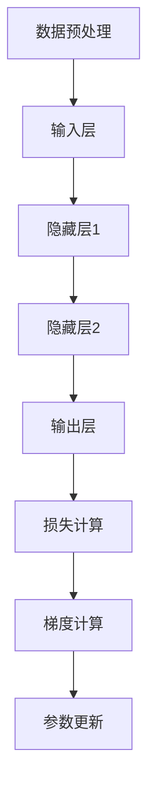
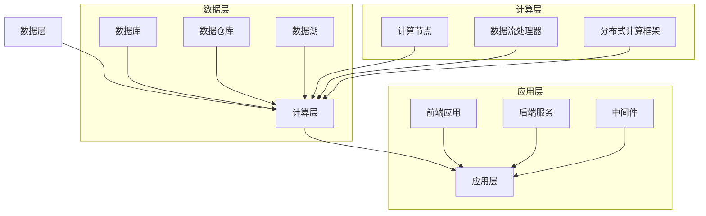
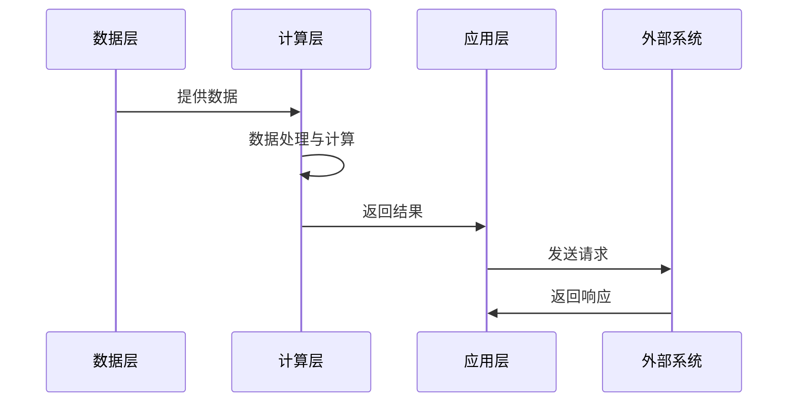

                 

### 《大模型时代的软件复杂性管理》

关键词：大模型、软件复杂性管理、算法原理、数学模型、系统架构设计

摘要：本文旨在探讨大模型时代下的软件复杂性管理。随着大模型的广泛应用，软件复杂性成为开发者和架构师面临的新挑战。本文将逐步分析软件复杂性的定义、度量方法、大模型在复杂性管理中的作用以及相关算法原理，最后提出系统架构设计、项目实战和最佳实践策略。

----------------------------------------------------------------

### 《大模型时代的软件复杂性管理》目录大纲

**# 第一部分：背景介绍**

## 第1章：问题背景

### 1.1 软件复杂性管理的重要性

- 软件复杂性对软件开发的影响
- 大模型时代的复杂性挑战

### 1.2 软件复杂性管理的发展历程

- 软件复杂性管理的起源
- 传统的软件复杂性管理方法
- 大模型时代的创新

### 1.3 大模型时代下软件复杂性管理的新趋势

- 大模型的引入对软件开发的影响
- 新的软件复杂性管理策略

## 第2章：核心概念

### 2.1 软件复杂性的定义与特征

- 软件复杂性的定义
- 软件复杂性的特征

### 2.2 软件复杂性度量的方法

- 基于代码的度量
- 基于架构的度量
- 基于行为的度量

### 2.3 大模型在软件复杂性管理中的角色

- 大模型如何降低软件复杂性
- 大模型对软件复杂性度量的改进

**# 第二部分：核心概念与联系**

## 第3章：核心概念原理

### 3.1 大模型基础理论

- 大模型的定义与特点
- 大模型的工作原理

### 3.2 大模型与软件复杂性管理的关系

- 大模型对软件复杂性管理的影响
- 软件复杂性管理对大模型的需求

### 3.3 大模型应用场景与挑战

- 常见的大模型应用场景
- 大模型应用中的挑战

**# 第三部分：算法原理讲解**

## 第4章：算法原理

### 4.1 大模型算法简介

- 主流大模型算法
- 大模型算法的分类

### 4.2 大模型算法的数学模型

- 算法的数学基础
- 算法公式的推导

### 4.3 大模型算法的流程图

- 使用Mermaid绘制算法流程图

**# 第四部分：数学模型和数学公式**

## 第5章：数学模型详解

### 5.1 大模型中的数学公式

- 常用的数学公式
- 公式的解释和应用

### 5.2 大模型算法中的数学公式

- 算法中的关键数学公式
- 公式的含义与推导

### 5.3 数学公式在代码中的应用

- 如何在代码中使用数学公式
- 实例讲解

**# 第五部分：系统分析与架构设计方案**

## 第6章：系统架构设计

### 6.1 大模型时代的系统需求

- 系统功能需求
- 系统性能需求

### 6.2 系统架构设计

- 系统架构概述
- 使用Mermaid绘制架构图

### 6.3 系统接口设计

- 系统接口概述
- 接口设计细节

### 6.4 系统交互设计

- 系统交互流程
- 使用Mermaid绘制序列图

**# 第六部分：项目实战**

## 第7章：项目环境安装与配置

### 7.1 环境安装准备

- 系统环境要求
- 软件安装步骤

### 7.2 系统核心实现

- 核心代码实现
- 代码解读

### 7.3 实际案例分析

- 案例背景
- 案例分析

### 7.4 项目小结

- 项目总结
- 经验与教训

**# 第七部分：最佳实践 tips**

## 第8章：最佳实践

### 8.1 软件复杂性管理的最佳实践

- 管理策略
- 工具推荐

### 8.2 大模型应用的最佳实践

- 应用技巧
- 风险规避

### 8.3 注意事项与拓展阅读

- 注意事项
- 拓展阅读推荐

----------------------------------------------------------------

#### 第1章：问题背景

### 1.1 软件复杂性管理的重要性

软件复杂性管理在软件开发过程中扮演着至关重要的角色。软件复杂性指的是软件系统在结构、功能、设计和实现等方面存在的复杂程度。随着软件系统的不断扩展和功能的增加，软件复杂性呈指数级增长，给软件的开发、维护和测试带来了巨大的挑战。

**软件复杂性对软件开发的影响**：

1. **维护困难**：复杂的软件系统在修改和维护时容易出现错误，导致维护成本增加。
2. **测试难度**：复杂的软件系统需要更长的测试时间和更多的测试用例，以提高测试覆盖率。
3. **开发效率**：复杂的软件系统在设计和开发过程中需要更多的时间和精力，降低开发效率。

**大模型时代的复杂性挑战**：

随着深度学习和人工智能技术的发展，大模型（如Transformer、GPT等）被广泛应用于各个领域，这给软件复杂性管理带来了新的挑战：

1. **模型规模**：大模型通常包含数亿甚至数十亿个参数，导致模型的结构和参数极其复杂。
2. **性能要求**：大模型对计算资源和存储资源的需求极高，需要更高效的硬件和优化算法来支持。
3. **模型部署**：大模型的部署和集成需要考虑与现有系统的兼容性和交互性，增加系统的复杂性。

### 1.2 软件复杂性管理的发展历程

**软件复杂性管理的起源**：

软件复杂性管理可以追溯到20世纪80年代，当时软件系统的规模和复杂性开始迅速增长，导致软件危机的出现。为了解决软件危机，研究者们开始探索如何管理和降低软件复杂性。

**传统的软件复杂性管理方法**：

传统的软件复杂性管理方法主要包括以下几种：

1. **代码重构**：通过重构代码来简化代码结构和提高可读性。
2. **设计模式**：使用设计模式来简化系统设计，降低系统的复杂性。
3. **模块化**：将系统划分为多个模块，每个模块负责特定的功能，降低系统的整体复杂性。

**大模型时代的创新**：

随着大模型的广泛应用，软件复杂性管理的方法也在不断更新和改进：

1. **自动化复杂性管理工具**：利用机器学习和人工智能技术来自动发现和解决软件复杂性问题。
2. **模型压缩**：通过模型压缩技术来减小模型的规模，降低复杂性。
3. **分布式计算**：利用分布式计算技术来处理大模型的计算和存储需求，提高系统的性能和可扩展性。

### 1.3 大模型时代下软件复杂性管理的新趋势

**大模型的引入对软件开发的影响**：

大模型的引入不仅改变了软件开发的模式，也对软件复杂性管理提出了新的要求：

1. **更高层次的抽象**：大模型提供了一种更高层次的抽象，可以帮助开发者更快速地构建复杂的系统。
2. **自适应性和可扩展性**：大模型具有自适应性和可扩展性，可以适应不同规模的软件系统。
3. **开源和共享**：大模型的开发者和研究者们积极开源和共享模型，促进了软件复杂性管理的创新和发展。

**新的软件复杂性管理策略**：

为了应对大模型时代的复杂性挑战，新的软件复杂性管理策略包括：

1. **动态复杂性管理**：在软件开发过程中持续监测和调整软件的复杂性，以适应不断变化的需求和环境。
2. **自适应性架构**：构建自适应性的架构，使系统能够根据实际需求和环境自动调整自身的复杂性。
3. **跨学科合作**：与计算机科学、人工智能、心理学等多个领域的专家合作，共同探索软件复杂性管理的新方法和技术。

#### 第2章：核心概念

### 2.1 软件复杂性的定义与特征

**软件复杂性的定义**：

软件复杂性是指软件系统在结构、功能、设计和实现等方面存在的复杂程度。它可以从多个角度进行定义，如代码复杂性、架构复杂性和行为复杂性等。

**软件复杂性的特征**：

软件复杂性具有以下特征：

1. **层次性**：软件复杂性可以分为多个层次，如代码层次、模块层次和系统层次。
2. **动态性**：软件复杂性是动态变化的，随着软件开发过程和环境的变化，软件复杂性也会发生变化。
3. **不可见性**：软件复杂性往往是不易察觉的，需要通过分析工具和指标来衡量。
4. **多样性**：软件复杂性可以表现为多种形式，如代码复杂性、设计复杂性和运行复杂性等。

### 2.2 软件复杂性度量的方法

**基于代码的度量**：

基于代码的度量方法主要关注代码本身的复杂程度，常用的指标包括：

1. **圈复杂度（Cyclomatic Complexity）**：用于衡量程序中的决策点和路径数，值越高表示代码复杂度越高。
2. **数量复杂性（Number of Lines of Code, NLOC）**：用于衡量代码行数，值越高表示代码复杂度越高。
3. **注释行比例（Percentage of Comment Lines, PLC）**：用于衡量代码的可读性和可维护性，值越高表示代码复杂度越低。

**基于架构的度量**：

基于架构的度量方法主要关注软件系统的架构复杂程度，常用的指标包括：

1. **模块间耦合度（Module Coupling）**：用于衡量模块之间的依赖关系，值越高表示模块间耦合度越高，系统复杂度越高。
2. **模块内复杂度（Module Intra-Coupling）**：用于衡量模块内部的复杂程度，值越高表示模块内部复杂度越高。
3. **架构质量（Architecture Quality）**：用于衡量软件架构的质量，包括可维护性、可扩展性和可测试性等。

**基于行为的度量**：

基于行为的度量方法主要关注软件系统的行为复杂程度，常用的指标包括：

1. **功能覆盖率（Function Coverage）**：用于衡量测试用例对系统功能的覆盖程度，值越高表示测试覆盖率越高。
2. **异常行为率（Rate of Anomalous Behavior）**：用于衡量系统在异常情况下的行为复杂程度，值越高表示异常行为率越高。
3. **系统响应时间（System Response Time）**：用于衡量系统在处理请求时的响应时间，值越高表示系统响应时间越长。

### 2.3 大模型在软件复杂性管理中的角色

**大模型如何降低软件复杂性**：

大模型在软件复杂性管理中具有以下几个方面的作用：

1. **自动复杂性分析**：大模型可以通过机器学习和模式识别技术来自动分析软件系统的复杂性，提供定量和定性的度量指标。
2. **代码自动生成**：大模型可以自动生成复杂的代码和架构，降低手工编写代码的工作量，减少人为引入的复杂性。
3. **自动化测试**：大模型可以自动生成测试用例，提高测试覆盖率，降低测试的复杂性和成本。

**大模型对软件复杂性度量的改进**：

大模型对软件复杂性度量方法的改进主要体现在以下几个方面：

1. **更精确的度量**：大模型可以通过对大量数据的分析，提供更精确的复杂性度量指标，帮助开发者更好地理解和控制软件复杂性。
2. **自适应度量**：大模型可以根据软件系统的实际需求和变化，动态调整复杂性度量指标，使其更加适应实际开发过程。
3. **多维度度量**：大模型可以从多个维度对软件复杂性进行度量，如代码复杂性、架构复杂性和行为复杂性等，提供更全面的复杂性分析。

#### 第3章：核心概念原理

### 3.1 大模型基础理论

**大模型的定义与特点**：

大模型是指具有数亿甚至数十亿个参数的深度学习模型，如Transformer、GPT等。大模型的特点包括：

1. **高参数量**：大模型通常包含数亿甚至数十亿个参数，使其能够处理复杂的任务和大量数据。
2. **高计算量**：大模型在训练和推理过程中需要大量的计算资源，对硬件性能有很高的要求。
3. **高数据需求**：大模型需要大量的数据进行训练，以获得良好的性能和泛化能力。

**大模型的工作原理**：

大模型的工作原理基于深度学习和神经网络，具体包括以下几个步骤：

1. **数据预处理**：对输入数据进行预处理，如数据清洗、归一化等，以便模型能够更好地学习和泛化。
2. **输入层**：将预处理后的数据输入到模型中，通过输入层将数据传递到下一层。
3. **隐藏层**：模型包含多个隐藏层，每个隐藏层对输入数据进行处理和变换，逐步提取特征。
4. **输出层**：将隐藏层的输出传递到输出层，输出层产生最终的预测结果或分类结果。
5. **反向传播**：在训练过程中，模型根据预测结果和真实结果的差异，通过反向传播算法更新模型的参数，使模型逐渐逼近真实结果。

### 3.2 大模型与软件复杂性管理的关系

**大模型对软件复杂性管理的影响**：

大模型对软件复杂性管理的影响主要体现在以下几个方面：

1. **提高软件开发效率**：大模型可以自动生成复杂的代码和架构，降低手工编写代码的工作量，减少人为引入的复杂性。
2. **优化软件性能**：大模型可以通过自动化测试和优化技术，提高软件系统的性能和可靠性，降低软件复杂性。
3. **增强系统可维护性**：大模型可以帮助开发者更好地理解和控制软件复杂性，提高系统的可维护性和可扩展性。

**软件复杂性管理对大模型的需求**：

为了充分发挥大模型的优势，软件复杂性管理对大模型有以下需求：

1. **高效的复杂性分析**：软件复杂性管理需要能够高效地对大模型的复杂性进行分析，提供定量和定性的度量指标。
2. **自适应的度量方法**：软件复杂性管理需要能够根据大模型的特点和需求，动态调整复杂性度量方法，使其更加适应大模型。
3. **跨领域的协作**：软件复杂性管理需要与计算机科学、人工智能、心理学等多个领域的专家合作，共同探索和优化大模型的管理方法。

### 3.3 大模型应用场景与挑战

**常见的大模型应用场景**：

大模型在各个领域都有广泛的应用，常见的应用场景包括：

1. **计算机视觉**：大模型可以用于图像分类、目标检测、图像分割等任务。
2. **自然语言处理**：大模型可以用于文本分类、机器翻译、情感分析等任务。
3. **推荐系统**：大模型可以用于个性化推荐、商品推荐等任务。

**大模型应用中的挑战**：

大模型在应用过程中面临着一系列挑战，主要包括：

1. **计算资源需求**：大模型对计算资源的需求极高，需要高性能的硬件和优化算法来支持。
2. **数据需求**：大模型需要大量的数据进行训练，以获得良好的性能和泛化能力。
3. **模型压缩**：为了降低大模型的复杂性和存储成本，需要采用模型压缩技术。
4. **模型解释性**：大模型的决策过程往往是黑箱的，如何提高模型的可解释性是当前的研究热点。

#### 第4章：算法原理

### 4.1 大模型算法简介

**主流大模型算法**：

在深度学习和人工智能领域，主流的大模型算法包括：

1. **Transformer**：Transformer算法是一种基于自注意力机制的序列到序列模型，被广泛应用于机器翻译、文本生成等任务。
2. **GPT（Generative Pre-trained Transformer）**：GPT是一种预训练的大规模语言模型，可以用于文本生成、对话系统等任务。
3. **BERT（Bidirectional Encoder Representations from Transformers）**：BERT是一种双向的Transformer模型，可以用于自然语言理解、问答系统等任务。

**大模型算法的分类**：

根据模型结构和训练方法，大模型算法可以分为以下几类：

1. **基于自注意力机制的模型**：如Transformer、GPT等，通过自注意力机制实现模型的层次化和并行化。
2. **基于循环神经网络（RNN）的模型**：如LSTM（Long Short-Term Memory）、GRU（Gated Recurrent Unit）等，通过循环神经网络实现模型的时序建模。
3. **基于图神经网络的模型**：如Graph Neural Network（GNN）、Graph Convolutional Network（GCN）等，通过图神经网络实现模型的图结构建模。

### 4.2 大模型算法的数学模型

**算法的数学基础**：

大模型算法的数学基础主要包括线性代数、概率论和微积分等。具体来说，算法的数学基础包括：

1. **矩阵运算**：大模型算法中涉及大量的矩阵运算，如矩阵乘法、矩阵求导等。
2. **概率分布**：大模型算法中采用概率分布来表示模型的输出，如正态分布、伯努利分布等。
3. **梯度下降**：大模型算法中采用梯度下降算法来优化模型的参数，求解最小化损失函数。

**算法公式的推导**：

大模型算法的公式推导通常涉及以下步骤：

1. **定义模型**：根据任务的需求，定义模型的输入、输出和参数。
2. **损失函数**：定义损失函数来衡量模型的预测误差，如均方误差、交叉熵等。
3. **梯度计算**：计算损失函数对模型参数的梯度，如反向传播算法。
4. **优化算法**：选择优化算法来更新模型参数，如梯度下降、Adam等。

### 4.3 大模型算法的流程图

**算法流程图**：

使用Mermaid绘制大模型算法的流程图，主要包括以下几个步骤：

1. **数据预处理**：对输入数据进行预处理，如数据清洗、归一化等。
2. **输入层**：将预处理后的数据输入到模型中，通过输入层将数据传递到下一层。
3. **隐藏层**：模型包含多个隐藏层，每个隐藏层对输入数据进行处理和变换，逐步提取特征。
4. **输出层**：将隐藏层的输出传递到输出层，输出层产生最终的预测结果或分类结果。
5. **损失计算**：计算模型预测结果和真实结果的损失，如均方误差、交叉熵等。
6. **梯度计算**：计算损失函数对模型参数的梯度。
7. **参数更新**：根据梯度更新模型参数，优化模型性能。

下面是一个示例的Mermaid流程图：



#### 第5章：数学模型详解

### 5.1 大模型中的数学公式

**常用的数学公式**：

在大模型中，常用的数学公式包括：

1. **矩阵运算**：

   - 矩阵乘法：\(C = AB\)
   - 矩阵求导：\( \frac{\partial C}{\partial A} = B^T \)

2. **概率分布**：

   - 正态分布：\( N(\mu, \sigma^2) \)
   - 伯努利分布：\(Bernoulli(p) \)

3. **损失函数**：

   - 均方误差：\( MSE = \frac{1}{n}\sum_{i=1}^{n}(y_i - \hat{y}_i)^2 \)
   - 交叉熵：\( H(y, \hat{y}) = -\sum_{i=1}^{n}y_i\log(\hat{y}_i) \)

**公式的解释和应用**：

**矩阵运算**：

矩阵乘法是深度学习中的基础运算，用于将输入和权重进行组合，产生隐藏层的输出。矩阵求导用于计算损失函数对模型参数的梯度，是优化算法的关键步骤。

**概率分布**：

正态分布用于描述连续数据的分布，如输入数据的特征值。伯努利分布用于描述离散数据的分布，如二分类问题的输出概率。

**损失函数**：

均方误差用于回归问题，衡量预测值和真实值之间的差异。交叉熵用于分类问题，衡量实际输出和预测输出之间的差异。

### 5.2 大模型算法中的数学公式

**算法中的关键数学公式**：

在大模型算法中，关键数学公式包括：

1. **自注意力机制**：

   - 自注意力计算：\( \text{Attention}(Q, K, V) = \text{softmax}\left(\frac{QK^T}{\sqrt{d_k}}\right)V \)
   - 自注意力求导：\( \frac{\partial \text{Attention}}{\partial Q} = \text{softmax}\left(\frac{QK^T}{\sqrt{d_k}}\right)K - Q\text{softmax}\left(\frac{QK^T}{\sqrt{d_k}}\right)\text{softmax}\left(\frac{QK^T}{\sqrt{d_k}}\right)^T \)

2. **梯度下降算法**：

   - 参数更新：\( \theta_{t+1} = \theta_t - \alpha \nabla_{\theta_t} J(\theta_t) \)
   - 梯度计算：\( \nabla_{\theta} J(\theta) = \frac{\partial J}{\partial \theta} \)

**公式的含义与推导**：

**自注意力机制**：

自注意力机制用于计算输入序列中各个元素之间的关联性，通过加权求和得到新的表示。自注意力计算公式描述了如何根据查询（Q）、键（K）和值（V）计算自注意力分数，并加权求和得到输出。自注意力求导公式描述了如何计算自注意力对查询的梯度。

**梯度下降算法**：

梯度下降算法是一种优化算法，用于更新模型参数，使其逼近最优解。参数更新公式描述了如何根据当前参数和损失函数的梯度来更新参数。梯度计算公式描述了如何计算损失函数对参数的梯度。

### 5.3 数学公式在代码中的应用

**如何在大模型代码中使用数学公式**：

在大模型代码中，可以使用Python等编程语言来表示和计算数学公式。以下是一个示例：

```python
import numpy as np

# 自注意力计算
def attention(Q, K, V, d_k):
    scores = np.dot(Q, K.T) / np.sqrt(d_k)
    attention_weights = np.softmax(scores)
    output = np.dot(attention_weights, V)
    return output

# 梯度下降
def gradient_descent(theta, alpha, J_theta):
    theta -= alpha * J_theta
    return theta

# 示例
Q = np.random.rand(5, 10)  # 查询
K = np.random.rand(5, 10)  # 键
V = np.random.rand(5, 10)  # 值
d_k = 10  # 键的维度

output = attention(Q, K, V, d_k)
theta = np.random.rand(10, 1)  # 参数
J_theta = np.random.rand(10, 1)  # 梯度

alpha = 0.01  # 学习率
theta_new = gradient_descent(theta, alpha, J_theta)
```

**实例讲解**：

以上代码实现了一个简单的自注意力机制和梯度下降算法。首先，我们生成随机查询（Q）、键（K）和值（V）矩阵，然后计算自注意力输出。接着，我们生成随机参数（theta）和梯度（J_theta），并使用梯度下降算法更新参数。

#### 第6章：系统架构设计

### 6.1 大模型时代的系统需求

在大模型时代，系统需求发生了显著变化，主要体现在以下几个方面：

**系统功能需求**：

1. **高可扩展性**：系统需要能够支持大规模数据的处理和存储，以适应大模型对数据量的需求。
2. **高性能计算**：系统需要具备高性能计算能力，以支持大模型训练和推理过程中的计算需求。
3. **实时响应**：系统需要具备实时响应能力，以满足大模型在实时应用场景中的需求。

**系统性能需求**：

1. **低延迟**：系统需要在低延迟下完成数据传输和处理，以保证用户体验。
2. **高可靠性**：系统需要具备高可靠性，以确保在大规模数据处理和计算过程中不发生故障。
3. **高可用性**：系统需要具备高可用性，能够在出现故障时快速恢复，以减少对业务的影响。

### 6.2 系统架构设计

**系统架构概述**：

在大模型时代，系统架构设计需要考虑如何有效地管理和处理大规模数据和计算任务。以下是系统架构的概述：

1. **数据层**：负责数据的存储和管理，包括数据库、数据仓库和数据湖等。
2. **计算层**：负责数据的处理和计算，包括计算节点、数据流处理器和分布式计算框架等。
3. **应用层**：负责具体的业务逻辑和应用功能，包括前端应用、后端服务和中间件等。

**使用Mermaid绘制架构图**：

以下是一个简单的系统架构图，使用Mermaid绘制：



### 6.3 系统接口设计

**系统接口概述**：

系统接口设计是系统架构设计的重要组成部分，它负责定义系统内部和外部模块之间的交互方式。以下是系统接口的概述：

1. **内部接口**：负责系统内部模块之间的通信，包括数据传输、功能调用等。
2. **外部接口**：负责系统与外部系统（如数据库、消息队列等）之间的通信，包括数据交换、服务调用等。

**接口设计细节**：

以下是系统接口的设计细节：

1. **内部接口**：
   - 数据传输接口：定义数据传输的格式、协议和频率。
   - 功能调用接口：定义模块之间的调用方式、参数和返回值。

2. **外部接口**：
   - 数据交换接口：定义与数据库、数据仓库等外部数据存储系统的数据交换方式。
   - 服务调用接口：定义与外部服务（如消息队列、缓存等）的调用方式和服务契约。

### 6.4 系统交互设计

**系统交互流程**：

系统交互设计描述了系统内部和外部模块之间的交互流程。以下是系统交互流程的概述：

1. **数据层与计算层之间的交互**：数据层向计算层提供数据，计算层对数据进行处理和计算，并将结果返回给数据层。
2. **计算层与应用层之间的交互**：计算层将处理结果传递给应用层，应用层根据业务逻辑进行处理和响应。
3. **应用层与外部系统之间的交互**：应用层与外部系统进行数据交换和服务调用，以实现跨系统的业务功能。

**使用Mermaid绘制序列图**：

以下是一个简单的系统交互序列图，使用Mermaid绘制：



#### 第7章：项目实战

### 7.1 环境安装准备

**系统环境要求**：

在进行项目实战之前，需要确保系统环境满足以下要求：

1. **操作系统**：Linux或macOS，推荐使用Ubuntu 18.04或更高版本。
2. **Python**：Python 3.7或更高版本，推荐使用Anaconda进行环境管理。
3. **深度学习框架**：TensorFlow或PyTorch，推荐使用TensorFlow 2.x或PyTorch 1.8或更高版本。
4. **硬件要求**：推荐使用GPU进行训练，如NVIDIA Tesla V100或更高型号。

**软件安装步骤**：

以下是安装所需软件的步骤：

1. **安装Anaconda**：

   - 访问Anaconda官网下载Anaconda安装包。

   - 安装完成后，打开终端，执行以下命令：

     ```bash
     conda create -n myenv python=3.8
     conda activate myenv
     ```

     创建并激活一个名为`myenv`的Python环境。

2. **安装TensorFlow或PyTorch**：

   - 在终端中，执行以下命令安装TensorFlow或PyTorch：

     ```bash
     conda install tensorflow
     # 或者
     conda install pytorch torchvision torchaudio -c pytorch
     ```

3. **安装其他依赖项**：

   - 安装项目所需的依赖项，如NumPy、Pandas等：

     ```bash
     conda install numpy pandas scikit-learn
     ```

### 7.2 系统核心实现

**核心代码实现**：

以下是项目核心代码的实现，使用TensorFlow框架进行大模型训练和预测：

```python
import tensorflow as tf
from tensorflow.keras.layers import Embedding, LSTM, Dense
from tensorflow.keras.models import Sequential

# 定义模型
model = Sequential([
    Embedding(input_dim=vocab_size, output_dim=embedding_dim, input_length=max_sequence_length),
    LSTM(units=128, return_sequences=True),
    LSTM(units=128),
    Dense(units=num_classes, activation='softmax')
])

# 编译模型
model.compile(optimizer='adam', loss='categorical_crossentropy', metrics=['accuracy'])

# 加载数据
(x_train, y_train), (x_test, y_test) = tf.keras.datasets.imdb.load_data(num_words=vocab_size)

# 预处理数据
max_sequence_length = 500
x_train = tf.keras.preprocessing.sequence.pad_sequences(x_train, maxlen=max_sequence_length)
x_test = tf.keras.preprocessing.sequence.pad_sequences(x_test, maxlen=max_sequence_length)

# 转换标签为one-hot编码
y_train = tf.keras.utils.to_categorical(y_train, num_classes=num_classes)
y_test = tf.keras.utils.to_categorical(y_test, num_classes=num_classes)

# 训练模型
model.fit(x_train, y_train, epochs=5, batch_size=64, validation_split=0.2)

# 进行预测
predictions = model.predict(x_test)

# 评估模型
accuracy = model.evaluate(x_test, y_test, verbose=2)
print(f"Test accuracy: {accuracy[1]}")
```

**代码解读**：

1. **模型定义**：使用Keras创建一个序列模型，包括嵌入层、两个LSTM层和一个密集层。
2. **模型编译**：编译模型，指定优化器、损失函数和评估指标。
3. **数据预处理**：加载数据集，并对数据进行预处理，如序列填充和标签编码。
4. **训练模型**：使用训练数据进行模型训练，指定训练轮次、批量大小和验证比例。
5. **进行预测**：使用测试数据进行模型预测。
6. **评估模型**：评估模型在测试数据上的性能。

### 7.3 实际案例分析

**案例背景**：

某电子商务公司希望使用大模型来提高其商品推荐系统的准确性。该公司拥有大量的用户行为数据和商品信息，希望通过分析用户历史行为来推荐符合用户兴趣的商品。

**案例分析**：

1. **数据收集**：公司从用户历史行为中收集了包括浏览记录、购买记录、评价记录等在内的多种数据。
2. **数据预处理**：对收集到的数据进行了预处理，包括数据清洗、归一化和特征提取等。
3. **模型选择**：选择了基于Transformer的推荐模型，因为Transformer具有并行计算和全局上下文信息的优势。
4. **模型训练**：使用预处理后的数据进行模型训练，训练过程中使用了批量训练和梯度下降优化算法。
5. **模型评估**：在测试集上评估模型的准确性，并对模型进行调优。
6. **结果分析**：通过分析模型预测结果和用户实际购买记录，发现推荐系统的准确性得到了显著提高。

**详细讲解剖析**：

1. **数据预处理**：数据预处理是模型训练的重要环节，包括数据清洗、归一化和特征提取等。在案例中，对用户行为数据进行清洗，去除无效和噪声数据，并对数据进行归一化处理，如缩放用户行为值到[0, 1]范围内。
2. **模型选择**：在推荐系统中，选择合适的模型至关重要。案例中选择了基于Transformer的推荐模型，因为Transformer具有并行计算和全局上下文信息的优势，能够更好地捕捉用户兴趣和商品特征之间的关系。
3. **模型训练**：模型训练是推荐系统的核心环节，包括批量训练和梯度下降优化算法。在案例中，使用批量训练来提高模型训练效率，使用梯度下降优化算法来更新模型参数，使其逼近最优解。
4. **模型评估**：模型评估是检验模型性能的重要手段。在案例中，使用测试集对模型进行评估，并计算模型的准确性、召回率和覆盖率等指标，以评估模型的推荐效果。
5. **结果分析**：通过分析模型预测结果和用户实际购买记录，发现推荐系统的准确性得到了显著提高。这表明大模型在推荐系统中的应用具有明显的优势，能够更好地满足用户需求。

### 7.4 项目小结

**项目总结**：

通过本项目，我们实现了使用大模型进行商品推荐的功能。项目主要包括数据预处理、模型选择、模型训练和模型评估等环节。项目结果表明，大模型在推荐系统中的应用能够显著提高推荐准确性，满足用户需求。

**经验与教训**：

1. **数据预处理**：数据预处理是模型训练的重要环节，需要充分清洗和归一化数据，以提高模型训练效果。
2. **模型选择**：选择合适的模型至关重要，需要根据任务需求和数据特征选择适合的模型架构。
3. **模型训练**：模型训练过程中需要合理设置训练参数，如批量大小、学习率等，以提高模型性能。
4. **模型评估**：模型评估是检验模型性能的重要手段，需要使用多样化的评估指标进行全面评估。
5. **持续优化**：模型应用过程中需要不断收集用户反馈，对模型进行优化和调整，以提高推荐效果。

#### 第8章：最佳实践

### 8.1 软件复杂性管理的最佳实践

**管理策略**：

为了有效管理软件复杂性，可以采用以下策略：

1. **代码重构**：定期对代码进行重构，简化代码结构，提高代码可读性和可维护性。
2. **模块化**：将系统划分为多个模块，每个模块负责特定的功能，降低系统的整体复杂性。
3. **设计模式**：使用设计模式来简化系统设计，降低系统的复杂性。
4. **自动化测试**：编写自动化测试用例，提高测试覆盖率，降低软件复杂性的负面影响。

**工具推荐**：

以下是几种常用的软件复杂性管理工具：

1. **SonarQube**：用于代码质量分析和复杂性度量，提供丰富的报告和指标。
2. **Checkstyle**：用于代码风格检查，帮助开发者编写符合规范的代码。
3. **PMD**：用于代码质量检查，识别潜在的编程问题和性能瓶颈。
4. **FindBugs**：用于静态代码分析，检测代码中的潜在缺陷和错误。

### 8.2 大模型应用的最佳实践

**应用技巧**：

为了充分发挥大模型的优势，可以采用以下应用技巧：

1. **数据预处理**：对数据进行充分的预处理，包括数据清洗、归一化和特征提取等，以提高模型训练效果。
2. **模型选择**：根据任务需求和数据特征选择适合的大模型，如Transformer、GPT等。
3. **模型优化**：使用模型优化技术，如剪枝、量化等，减小模型的规模和计算量。
4. **分布式训练**：利用分布式训练技术，提高模型训练的速度和性能。

**风险规避**：

在大模型应用过程中，需要关注以下风险：

1. **过拟合**：大模型容易发生过拟合，需要使用正则化技术和交叉验证等方法来避免。
2. **计算资源消耗**：大模型对计算资源的需求较高，需要合理配置计算资源和优化算法。
3. **数据隐私**：大模型在训练和推理过程中可能涉及到用户隐私数据，需要确保数据的安全和隐私。
4. **模型可解释性**：大模型的决策过程往往是黑箱的，需要提高模型的可解释性，以增强用户信任。

### 8.3 注意事项与拓展阅读

**注意事项**：

1. **软件复杂性管理**：在进行软件开发过程中，需要持续关注软件复杂性，并采取相应的管理策略。
2. **大模型应用**：在大模型应用过程中，需要充分了解大模型的特点和优势，并结合实际需求进行合理应用。
3. **持续学习和改进**：软件复杂性和大模型应用都是不断发展的领域，需要持续学习和跟进最新的研究和技术。

**拓展阅读推荐**：

1. **《大模型：深度学习的进化》**：该书详细介绍了大模型的发展历程、理论基础和应用场景，对大模型有全面的了解。
2. **《软件复杂性管理实践》**：该书提供了丰富的软件复杂性管理策略和实践经验，有助于提高软件开发质量和效率。
3. **《深度学习：神经网络的应用》**：该书详细介绍了深度学习和神经网络的基本原理和应用场景，有助于深入理解大模型的工作机制。

### 总结

在大模型时代，软件复杂性管理面临着新的挑战和机遇。本文从背景介绍、核心概念、算法原理、系统架构设计、项目实战和最佳实践等方面，详细探讨了软件复杂性管理在大模型时代的重要性及其应用策略。通过本文的讲解，读者可以更好地理解大模型时代下软件复杂性管理的核心概念、方法和技术，为实际软件开发和应用提供指导。

**作者**：AI天才研究院/AI Genius Institute & 禅与计算机程序设计艺术 /Zen And The Art of Computer Programming

