                 

# 大模型时代的软件工程新范式

## 关键词
- 大模型
- 软件工程
- 深度学习
- 自动化
- 架构设计

## 摘要
本文探讨了人工智能大模型在软件工程领域的新范式，包括其背景、问题、解决方法以及相关的边界与外延。我们将深入分析大模型的基础理论，探讨其训练原理，并探讨大模型时代的软件开发方法、系统架构设计以及数据处理与分析。同时，本文将关注大模型在软件工程中的安全与伦理问题，并提出相应的解决方案。通过本文的讨论，读者将能够全面了解和掌握大模型时代软件工程的新趋势和新挑战。

### 第1章：引言与背景

#### 1.1 问题背景

随着人工智能（AI）技术的飞速发展，特别是大模型（Large-scale Model）的崛起，软件工程领域正迎来一场革命。传统的软件开发方法与工具已经难以满足日益复杂的应用需求，这为软件工程提出了新的挑战。大模型，如GPT系列、BERT等，以其强大的数据处理和生成能力，正逐步改变着软件开发的模式，推动软件工程进入大模型时代。

#### 1.2 问题描述

在大模型时代，软件工程面临着新的问题与机遇。首先，如何有效地利用大模型来提升软件开发效率与质量成为一个重要课题。其次，大模型的训练与部署成本高昂，如何降低成本、优化资源利用成为关键问题。此外，大模型的安全性与伦理问题也引起了广泛关注。

#### 1.3 问题解决

本书旨在探讨大模型时代软件工程的新范式，通过系统的研究和实践，提供解决上述问题的方法与策略。书中将详细介绍大模型的基本概念、核心技术、应用场景，并结合实际案例进行分析，帮助读者全面了解和掌握大模型在软件工程中的应用。

#### 1.4 边界与外延

大模型时代的软件工程不仅涉及人工智能技术，还涉及计算机科学、数学、统计学等多个领域。因此，本书的讨论将不仅仅局限于技术的层面，还将涉及理论、方法、实践等多个维度。同时，本书也将探讨大模型在各个行业中的应用，包括但不限于金融、医疗、教育、制造等领域。

#### 1.5 概念结构与核心要素组成

大模型时代的软件工程主要包括以下几个核心要素：

1. **AI大模型技术**：包括大模型的训练、优化、部署等关键技术。
2. **软件开发方法**：结合大模型的特性，探索新的软件开发方法，如模型驱动开发、数据驱动开发等。
3. **系统架构设计**：考虑大模型的特点，设计适用于大模型的系统架构。
4. **数据处理与分析**：利用大模型进行大规模数据的高效处理与分析。
5. **安全与伦理**：讨论大模型在应用中的安全与伦理问题，并提出解决方案。

#### 1.6 本章小结

本章简要介绍了大模型时代软件工程的背景、问题、解决方法以及相关边界与外延。接下来，本书将深入探讨大模型的基本概念、技术原理和应用实践，帮助读者全面理解大模型时代软件工程的新范式。

### 第2章：AI大模型的基础理论

#### 2.1 AI大模型的基本概念

##### 2.1.1 大模型的定义与特征

##### 大模型的定义

大模型（Large-scale Model）通常是指参数规模超过数十亿甚至千亿级别的人工神经网络模型。这类模型能够通过大量的数据进行训练，从而在学习复杂任务上表现出色。

##### 大模型的特征

- **参数规模庞大**：大模型通常包含数十亿至千亿个参数。
- **计算复杂度高**：大模型的训练和推理过程需要大量的计算资源。
- **数据需求大**：大模型需要大量的高质量数据来进行训练。
- **泛化能力强**：大模型在处理未见过的数据时，通常能够保持较高的准确性。

##### 2.1.2 大模型的分类

大模型可以根据其应用场景和功能进行分类，常见的分类方法包括：

- **按功能分类**：如自然语言处理（NLP）模型、计算机视觉（CV）模型、强化学习（RL）模型等。
- **按架构分类**：如Transformer模型、变分自编码器（VAE）等。

##### 2.1.3 大模型的发展历史

大模型的发展经历了从简单模型到复杂模型的演变。早期的神经网络模型，如感知机、反向传播（BP）网络等，随着计算能力的提升和数据量的增加，逐渐发展出更加复杂和强大的模型，如卷积神经网络（CNN）、循环神经网络（RNN）等。近年来，随着深度学习的兴起，大模型得到了广泛的应用和研究，如GPT系列、BERT等。

#### 2.2 AI大模型的训练原理

##### 2.2.1 大模型训练的基本流程

大模型的训练过程主要包括以下几个步骤：

1. **数据预处理**：对输入数据进行预处理，包括数据清洗、归一化、编码等操作。
2. **模型初始化**：初始化模型参数，常用的初始化方法包括随机初始化、高斯分布初始化等。
3. **模型训练**：通过梯度下降（Gradient Descent）等优化算法，更新模型参数，使得模型在训练数据上的表现逐渐提高。
4. **模型评估**：在验证集或测试集上评估模型性能，以确定模型的泛化能力。

##### 2.2.2 大模型训练的关键技术

- **优化算法**：如Adam、SGD等，用于高效地更新模型参数。
- **正则化技术**：如Dropout、权重衰减等，用于防止模型过拟合。
- **数据增强**：通过数据增强技术，如翻转、缩放等，增加数据的多样性，从而提高模型的泛化能力。
- **批量归一化**：在训练过程中对批量数据进行归一化处理，加速训练并提高模型性能。

##### 2.2.3 大模型训练的挑战与优化

大模型训练过程中面临的主要挑战包括：

- **计算资源消耗**：大模型训练需要大量的计算资源和存储资源。
- **数据预处理复杂度**：高质量的数据预处理是训练大模型的关键，但过程复杂且耗时。
- **模型过拟合**：大模型容易在训练数据上过拟合，导致在测试数据上表现不佳。

为解决这些挑战，研究者们提出了多种优化策略：

- **分布式训练**：通过将训练任务分布在多个计算节点上，提高训练效率。
- **模型压缩**：通过模型剪枝、量化等技术，减少模型参数规模，降低计算和存储需求。
- **迁移学习**：利用预训练的大模型，结合少量目标领域数据进行微调，提高模型在特定领域的表现。

#### 2.3 AI大模型的应用场景

##### 2.3.1 自然语言处理

自然语言处理（NLP）是AI大模型的重要应用领域。GPT系列、BERT等模型在文本分类、机器翻译、情感分析等领域取得了显著成果。例如，GPT-3模型在文本生成和问答系统中表现出色，BERT模型在自然语言理解任务中取得了SOTA（State-of-the-Art）性能。

##### 2.3.2 计算机视觉

计算机视觉（CV）领域也受益于大模型的发展。大模型在图像分类、目标检测、图像生成等任务中表现出强大的能力。例如，ResNet、Inception等大模型在ImageNet图像分类任务中取得了突破性成果，StyleGAN等模型在图像生成任务中展示了令人惊叹的效果。

##### 2.3.3 强化学习

强化学习（RL）领域的大模型研究也取得了重要进展。DQN、DDPG等大模型在Atari游戏、机器人控制等任务中表现出色。近年来，基于Transformer的模型如BERTAL和Gryffin等，在强化学习任务中展示了强大的潜力。

##### 2.3.4 其他领域

除了NLP、CV和RL领域，AI大模型还在医疗、金融、教育等领域展现出广泛的应用前景。例如，大模型在医疗诊断、药物研发、金融风控等领域取得了显著成果，在教育领域中，大模型可以用于智能教学、个性化学习等应用。

#### 2.4 本章小结

本章介绍了AI大模型的基础理论，包括其定义、特征、分类、训练原理以及应用场景。大模型以其强大的数据处理和生成能力，正在改变软件工程的开发模式，推动软件工程进入大模型时代。在接下来的章节中，我们将进一步探讨大模型时代的软件开发方法、系统架构设计以及数据处理与分析，帮助读者全面了解和掌握大模型时代软件工程的新范式。

### 第3章：大模型时代的软件开发方法

#### 3.1 软件开发方法的演变

随着AI大模型技术的飞速发展，传统的软件开发方法也在不断地演变和改进。从早期的瀑布模型、V模型，到敏捷开发、DevOps，软件开发方法逐渐从注重过程和文档，转向注重实际价值和交付速度。大模型的引入，进一步推动了软件开发方法的革新，为开发者带来了新的机遇和挑战。

##### 3.1.1 传统软件开发方法的局限性

传统的软件开发方法，如瀑布模型、V模型等，虽然在某些场景下仍然适用，但面临着以下局限性：

- **开发周期长**：传统的软件开发方法通常需要较长的开发周期，从需求分析、设计、编码、测试到部署，每个阶段都需要大量的时间和人力资源。
- **灵活性不足**：传统的软件开发方法往往注重文档和流程，缺乏灵活性，难以快速应对需求变化。
- **依赖人工**：传统的软件开发方法依赖人工进行代码编写、测试和调试，效率较低，且容易出现人为错误。

##### 3.1.2 大模型时代的软件开发方法

大模型的引入，为软件开发方法带来了新的可能性。在大模型时代，开发者可以采用以下新的软件开发方法：

- **模型驱动开发（Model-Driven Development, MDD）**：模型驱动开发是一种以模型为核心的软件开发方法，通过创建和修改模型来生成代码，从而提高开发效率和质量。在大模型时代，MDD方法可以充分利用大模型的强大能力，实现自动化代码生成、优化和调试。
- **数据驱动开发（Data-Driven Development, DDD）**：数据驱动开发是一种以数据为核心的软件开发方法，通过大量数据来驱动模型学习和优化。在大模型时代，DDD方法可以充分利用大模型在数据处理和分析方面的优势，实现高效的数据驱动的开发流程。
- **混合开发（Hybrid Development）**：混合开发是将传统软件开发方法与大模型技术相结合的一种开发方法。通过在合适的时间点引入大模型，可以在保证开发效率和质量的同时，充分利用大模型的优势。

#### 3.2 模型驱动开发（MDD）

##### 3.2.1 模型驱动开发的原理

模型驱动开发（MDD）的核心思想是通过创建和修改模型来生成代码，从而实现软件的快速开发。在大模型时代，MDD方法可以充分利用大模型的强大能力，实现自动化代码生成、优化和调试。

- **领域模型（Domain Model）**：领域模型是MDD方法的核心，它描述了系统的业务领域和功能需求。领域模型通常由领域专家和开发者共同创建，以确保模型能够准确反映业务需求。
- **代码生成（Code Generation）**：代码生成是MDD方法的关键步骤，通过将领域模型转换为具体的代码实现，从而实现软件的快速开发。在大模型时代，代码生成工具可以充分利用大模型的训练结果，生成高性能、高质量的代码。
- **模型优化（Model Optimization）**：模型优化是指通过对领域模型进行优化，以提高软件的性能、稳定性和可维护性。在大模型时代，模型优化可以充分利用大模型在数据分析、优化算法等方面的优势，实现模型的快速优化和迭代。

##### 3.2.2 模型驱动开发的应用场景

模型驱动开发方法在大模型时代具有广泛的应用场景：

- **自动化测试**：通过创建测试模型，自动化生成测试用例和测试脚本，提高测试效率和质量。
- **代码优化**：通过对代码模型进行优化，实现代码的自动优化、压缩和重用。
- **持续集成与部署**：通过模型驱动开发，实现自动化构建、测试和部署，提高持续集成和部署的效率。

#### 3.3 数据驱动开发（DDD）

##### 3.3.1 数据驱动开发的原理

数据驱动开发（DDD）是一种以数据为核心的软件开发方法，通过大量数据来驱动模型学习和优化。

- **数据收集与处理**：数据驱动开发的第一步是收集和预处理数据，包括数据清洗、归一化、编码等操作。在大模型时代，数据预处理工具可以充分利用大模型在数据处理方面的优势，实现高效的数据处理和分析。
- **模型学习与优化**：通过数据驱动开发，模型可以从大量数据中学习，并不断优化。在大模型时代，大模型可以充分利用其强大的学习能力，实现快速、准确的模型学习与优化。
- **模型应用与评估**：数据驱动开发的最终目标是实现模型的实际应用，并通过评估模型性能，不断优化模型。

##### 3.3.2 数据驱动开发的应用场景

数据驱动开发方法在大模型时代具有广泛的应用场景：

- **智能推荐系统**：通过数据驱动开发，实现基于用户行为数据和内容数据的智能推荐。
- **异常检测与预测**：通过数据驱动开发，实现基于实时数据流的异常检测和预测。
- **自动化决策**：通过数据驱动开发，实现基于数据驱动的自动化决策和优化。

#### 3.4 混合开发（Hybrid Development）

##### 3.4.1 混合开发的原理

混合开发是将传统软件开发方法与大模型技术相结合的一种开发方法。通过在合适的时间点引入大模型，可以在保证开发效率和质量的同时，充分利用大模型的优势。

- **早期引入大模型**：在软件开发初期，通过引入大模型，实现自动化需求分析、设计、测试等环节，提高开发效率。
- **中后期优化大模型**：在软件开发中后期，通过对大模型进行优化和调整，实现软件的性能优化和功能扩展。
- **持续集成与迭代**：通过混合开发，实现持续集成和迭代，确保软件质量和交付速度。

##### 3.4.2 混合开发的应用场景

混合开发方法在大模型时代具有广泛的应用场景：

- **大型复杂项目**：对于大型复杂项目，混合开发可以充分利用大模型的强大能力，实现快速开发和优化。
- **业务快速迭代**：对于业务快速迭代的项目，混合开发可以结合传统方法和大模型的优势，实现快速交付和持续优化。
- **创新应用探索**：对于创新应用探索的项目，混合开发可以充分利用大模型的技术优势，实现新的业务模式和应用场景。

#### 3.5 本章小结

本章介绍了大模型时代的软件开发方法，包括模型驱动开发、数据驱动开发和混合开发。这些方法充分利用大模型的强大能力，提高了开发效率、质量和灵活性。在接下来的章节中，我们将进一步探讨大模型时代的系统架构设计、数据处理与分析以及大模型的安全与伦理问题，帮助读者全面了解和掌握大模型时代软件工程的新范式。

### 第4章：大模型时代的系统架构设计

#### 4.1 系统架构设计的重要性

系统架构设计是软件工程的核心环节之一，它决定了软件系统的性能、可扩展性、可维护性和可靠性。在大模型时代，系统架构设计面临新的挑战和机遇。大模型的引入，不仅改变了软件的功能和性能需求，也对系统架构设计提出了新的要求。

##### 4.1.1 大模型对系统架构设计的影响

- **计算资源需求**：大模型训练和推理需要大量的计算资源，对系统架构的计算能力提出了高要求。
- **数据存储与管理**：大模型训练和推理需要大量的数据存储和管理，对系统架构的数据存储和管理能力提出了高要求。
- **系统可扩展性**：大模型的应用通常伴随着业务的快速扩展，对系统架构的可扩展性提出了高要求。
- **系统可靠性**：大模型的应用过程中，可能会出现模型过拟合、数据泄露等问题，对系统架构的可靠性提出了高要求。

##### 4.1.2 系统架构设计的核心要素

在大模型时代，系统架构设计主要包括以下几个核心要素：

- **计算资源分配**：合理分配计算资源，确保大模型训练和推理的顺利进行。
- **数据存储与管理**：设计高效的数据存储与管理方案，确保数据的高可用性和安全性。
- **网络架构设计**：设计合理的网络架构，确保系统的高可用性和低延迟。
- **安全性设计**：设计安全防护机制，确保系统不受恶意攻击和数据泄露。

#### 4.2 分布式计算架构

分布式计算架构在大模型时代具有重要意义。通过分布式计算，可以将大模型训练和推理任务分配到多个计算节点上，提高计算效率和系统性能。

##### 4.2.1 分布式计算架构的基本原理

- **计算节点**：分布式计算架构由多个计算节点组成，每个计算节点负责一部分计算任务。
- **任务调度**：分布式计算架构通过任务调度机制，将大模型训练和推理任务分配到不同的计算节点上。
- **数据通信**：分布式计算架构需要设计高效的数据通信机制，确保计算节点之间的数据传输速度和稳定性。

##### 4.2.2 分布式计算架构的应用场景

- **大规模数据处理**：分布式计算架构可以高效地处理大规模数据，适用于大数据处理和分析场景。
- **大规模模型训练**：分布式计算架构可以将大规模模型训练任务分配到多个计算节点上，提高训练效率和性能。
- **大规模推理任务**：分布式计算架构可以处理大规模的推理任务，提高系统的响应速度和处理能力。

##### 4.2.3 分布式计算架构的挑战与优化

分布式计算架构在大模型时代面临以下挑战：

- **数据一致性**：在分布式环境中，如何保证数据的一致性是一个重要问题。
- **容错性**：在分布式计算中，如何保证系统的容错性和高可用性是一个重要问题。
- **网络延迟**：网络延迟可能会影响分布式计算的性能，需要设计高效的网络架构来降低延迟。

为解决这些挑战，可以采用以下优化策略：

- **数据复制**：通过数据复制机制，确保数据的一致性和可靠性。
- **故障转移**：通过故障转移机制，确保系统在计算节点故障时仍然能够正常运行。
- **网络优化**：通过优化网络架构和协议，降低网络延迟和传输成本。

#### 4.3 数据存储与管理架构

数据存储与管理架构在大模型时代至关重要。大模型训练和推理需要大量的数据存储和管理，设计高效的数据存储与管理架构可以提高系统的性能和可靠性。

##### 4.3.1 数据存储与管理架构的基本原理

- **数据分层存储**：数据分层存储是将数据按照不同的访问频率和重要性进行分层存储，以提高数据访问速度和存储效率。
- **分布式存储系统**：分布式存储系统通过将数据分布在多个存储节点上，提高数据的可靠性和访问速度。
- **数据备份与恢复**：数据备份与恢复机制确保数据在故障或灾难时能够迅速恢复。

##### 4.3.2 数据存储与管理架构的应用场景

- **大规模数据存储**：分布式存储系统可以高效地存储和管理大规模数据，适用于大数据应用场景。
- **实时数据处理**：通过实时数据处理架构，可以实现实时数据分析和决策。
- **数据安全和隐私保护**：通过数据加密、访问控制等技术，确保数据的安全和隐私。

##### 4.3.3 数据存储与管理架构的挑战与优化

数据存储与管理架构在大模型时代面临以下挑战：

- **数据一致性**：在分布式存储系统中，如何保证数据的一致性是一个重要问题。
- **数据访问性能**：如何设计高效的查询和访问机制，以提高数据访问性能。
- **数据安全**：如何保护数据免受恶意攻击和泄露。

为解决这些挑战，可以采用以下优化策略：

- **分布式一致性协议**：通过分布式一致性协议，如Paxos、Raft等，确保数据的一致性。
- **缓存机制**：通过缓存机制，降低数据的访问延迟和访问成本。
- **数据加密与访问控制**：通过数据加密和访问控制技术，确保数据的安全和隐私。

#### 4.4 网络架构设计

网络架构设计在大模型时代同样至关重要。大模型的训练和推理需要高效的网络传输和通信，设计合理的网络架构可以提高系统的性能和稳定性。

##### 4.4.1 网络架构设计的基本原理

- **网络拓扑结构**：网络拓扑结构是指网络中各个节点之间的连接方式。常见的网络拓扑结构包括星型、环型、网状等。
- **网络协议**：网络协议是指网络中数据传输的规则和标准。常见的网络协议包括TCP/IP、HTTP、FTP等。
- **负载均衡**：负载均衡是将网络请求分配到多个服务器上，以避免单点故障和提升系统的处理能力。

##### 4.4.2 网络架构设计的应用场景

- **大规模分布式计算**：通过设计合理的网络架构，可以实现大规模分布式计算，提高系统的计算能力和效率。
- **大规模数据传输**：通过设计高效的网络架构，可以实现大规模数据的高效传输和共享。
- **实时通信与交互**：通过设计实时通信和交互机制，可以实现实时数据分析和决策。

##### 4.4.3 网络架构设计的挑战与优化

网络架构设计在大模型时代面临以下挑战：

- **网络延迟**：如何降低网络延迟，提高系统的响应速度。
- **网络带宽**：如何合理分配网络带宽，避免网络拥塞。
- **网络安全性**：如何保障网络的安全性，防止恶意攻击和数据泄露。

为解决这些挑战，可以采用以下优化策略：

- **网络优化协议**：通过优化网络协议，降低网络延迟和传输成本。
- **网络监控与故障恢复**：通过实时监控和故障恢复机制，确保网络的高可用性和稳定性。
- **网络加密与访问控制**：通过网络加密和访问控制技术，保障网络数据的安全和隐私。

#### 4.5 安全性设计

在大模型时代，安全性设计成为系统架构设计的重要一环。大模型的应用可能会带来新的安全风险和挑战，因此，需要设计合理的安全性机制来保护系统的安全。

##### 4.5.1 安全性设计的基本原理

- **访问控制**：通过访问控制机制，限制用户对系统资源的访问权限，确保系统的安全性。
- **数据加密**：通过数据加密机制，保护数据的机密性和完整性。
- **安全审计**：通过安全审计机制，记录和追踪系统中的操作和事件，以便在发生安全事件时进行追踪和调查。

##### 4.5.2 安全性设计的应用场景

- **用户认证**：通过用户认证机制，确保只有授权用户才能访问系统资源。
- **数据安全传输**：通过数据加密传输机制，确保数据在传输过程中的安全。
- **系统安全监控**：通过安全监控机制，实时监控系统的安全状态，及时发现和响应安全事件。

##### 4.5.3 安全性设计的挑战与优化

安全性设计在大模型时代面临以下挑战：

- **模型安全性**：如何保护大模型免受恶意攻击和篡改。
- **数据隐私**：如何保护用户数据的隐私，防止数据泄露和滥用。
- **安全合规性**：如何遵守相关的安全法规和标准，确保系统的合规性。

为解决这些挑战，可以采用以下优化策略：

- **模型加密与访问控制**：通过模型加密和访问控制技术，确保大模型的安全性和隐私性。
- **数据隐私保护技术**：通过数据隐私保护技术，如差分隐私、同态加密等，保护用户数据的隐私。
- **安全合规性评估与监控**：通过安全合规性评估和监控机制，确保系统符合相关的安全法规和标准。

#### 4.6 本章小结

本章介绍了大模型时代的系统架构设计，包括计算资源分配、数据存储与管理、网络架构设计、安全性设计等核心要素。通过分布式计算架构、数据存储与管理架构、网络架构设计和安全性设计，可以构建高效、可靠、安全的系统架构，满足大模型时代的需求。在接下来的章节中，我们将进一步探讨大模型在数据处理与分析中的应用，以及大模型的安全与伦理问题，帮助读者全面了解和掌握大模型时代软件工程的新范式。

### 第5章：大模型在数据处理与分析中的应用

#### 5.1 数据处理与分析的重要性

在大模型时代，数据处理与分析成为软件工程的核心环节之一。随着数据量的爆炸式增长，如何高效地处理和分析海量数据，提取有价值的信息，成为企业和开发者面临的重要课题。大模型以其强大的数据处理和分析能力，为这一问题提供了新的解决方案。

##### 5.1.1 数据处理与分析的目标

数据处理与分析的主要目标包括：

- **数据清洗**：去除数据中的噪声和不完整信息，确保数据的质量和一致性。
- **数据整合**：将来自不同来源、格式和结构的数据整合成统一的数据集。
- **数据挖掘**：从海量数据中提取有价值的信息，如模式、趋势、关联关系等。
- **数据可视化**：通过图表、图像等方式，直观地展示数据和分析结果。

##### 5.1.2 大模型在数据处理与分析中的优势

大模型在数据处理与分析中具有以下优势：

- **强大的数据处理能力**：大模型能够高效地处理海量数据，快速提取有价值的信息。
- **自动化的数据分析**：大模型能够自动进行数据预处理、特征提取、模型训练和评估，提高数据分析的效率。
- **灵活的多模态数据处理**：大模型能够同时处理文本、图像、音频等多种类型的数据，实现跨模态的数据融合和分析。
- **高准确度和泛化能力**：大模型通过大量数据训练，具有高准确度和泛化能力，能够应对各种复杂的数据场景。

#### 5.2 大模型在数据预处理中的应用

数据预处理是数据处理与分析的重要环节，大模型在数据预处理中的应用大大提高了数据处理效率和质量。

##### 5.2.1 数据清洗

数据清洗包括去除噪声、填补缺失值、纠正错误等操作。大模型可以通过以下方法进行数据清洗：

- **异常值检测**：利用聚类、回归等算法，识别和去除数据中的异常值。
- **缺失值填补**：利用插值、回归等方法，填补数据中的缺失值。
- **数据标准化**：将数据转换为统一的尺度，消除不同特征之间的量纲差异。

##### 5.2.2 特征提取

特征提取是数据预处理的关键步骤，大模型可以通过以下方法进行特征提取：

- **自动特征提取**：大模型能够自动识别数据中的特征，并提取出对任务有价值的特征。
- **降维**：利用主成分分析（PCA）、t-SNE等方法，降低数据的维度，提高数据处理效率。

##### 5.2.3 文本预处理

在大模型时代，文本预处理是数据预处理的重要任务。大模型可以通过以下方法进行文本预处理：

- **分词**：利用词性标注、分词词典等方法，将文本分割成单词或短语。
- **词嵌入**：利用词嵌入技术，将单词映射到高维空间，保留单词的语义信息。
- **去停用词**：去除文本中的停用词，如“的”、“是”等，提高文本分析的效果。

#### 5.3 大模型在数据分析中的应用

大模型在数据分析中的应用广泛，包括分类、回归、聚类等任务。以下是大模型在数据分析中的应用实例：

##### 5.3.1 分类

分类任务是预测数据属于哪个类别。大模型在分类任务中的应用包括：

- **文本分类**：利用大模型，如BERT，对文本进行分类，用于新闻分类、情感分析等任务。
- **图像分类**：利用大模型，如ResNet，对图像进行分类，用于图像识别、目标检测等任务。
- **序列分类**：利用大模型，如LSTM，对序列数据进行分类，用于时间序列预测、对话系统等任务。

##### 5.3.2 回归

回归任务是预测数据的连续值。大模型在回归任务中的应用包括：

- **房屋价格预测**：利用大模型，如GRU，对房屋价格进行预测。
- **股票价格预测**：利用大模型，如CNN，对股票价格进行预测。
- **销售预测**：利用大模型，如Transformer，对销售数据进行预测。

##### 5.3.3 聚类

聚类任务是将数据分为不同的组。大模型在聚类任务中的应用包括：

- **文本聚类**：利用大模型，如GPT，对文本进行聚类，用于话题模型、社区发现等任务。
- **图像聚类**：利用大模型，如VGG，对图像进行聚类，用于图像分类、图像分割等任务。
- **序列聚类**：利用大模型，如LSTM，对序列数据进行聚类，用于时间序列聚类、对话系统等任务。

##### 5.3.4 联合建模

联合建模是将多个模型整合在一起，以提高模型的预测能力和鲁棒性。大模型在联合建模中的应用包括：

- **多任务学习**：利用大模型，如Transformer，同时解决多个相关任务，如文本分类和情感分析。
- **多模态学习**：利用大模型，如BERT，同时处理文本、图像和音频等多种类型的数据，实现跨模态的联合建模。
- **迁移学习**：利用大模型，如BERT，将预训练模型迁移到新的任务中，提高模型的泛化能力和预测性能。

#### 5.4 大模型在实时数据分析中的应用

实时数据分析是在数据产生的同时进行数据分析，以实现快速决策和响应。大模型在实时数据分析中的应用包括：

- **实时预测**：利用大模型，如LSTM，对实时数据进行预测，用于股市预测、交通流量预测等任务。
- **实时分类**：利用大模型，如BERT，对实时数据进行分类，用于舆情监测、入侵检测等任务。
- **实时聚类**：利用大模型，如GPT，对实时数据进行聚类，用于社区发现、用户行为分析等任务。

##### 5.4.1 实时数据处理架构

实时数据处理架构包括数据采集、数据存储、数据分析和数据可视化等环节。以下是一个典型的实时数据处理架构：

1. **数据采集**：从各种数据源（如传感器、网站、数据库等）实时采集数据。
2. **数据存储**：将采集到的数据存储在实时数据库（如Kafka、Apache Storm等）中。
3. **数据处理**：利用大模型，对实时数据进行处理和分析，如分类、聚类、预测等。
4. **数据可视化**：将分析结果通过可视化工具（如Kibana、Tableau等）进行展示。

##### 5.4.2 实时数据分析的挑战与优化

实时数据分析面临以下挑战：

- **数据延迟**：如何降低数据延迟，提高实时性。
- **数据一致性**：如何保证数据在实时处理中的一致性和可靠性。
- **资源消耗**：如何优化资源利用，降低实时数据分析的成本。

为解决这些挑战，可以采用以下优化策略：

- **数据流处理**：采用数据流处理技术（如Apache Kafka、Apache Storm等），实现实时数据采集和处理。
- **数据缓存**：采用数据缓存技术（如Redis、Memcached等），提高数据访问速度和系统性能。
- **资源调度**：采用资源调度技术（如容器化技术、虚拟化技术等），优化资源利用，提高系统性能。

#### 5.5 本章小结

本章介绍了大模型在数据处理与分析中的应用，包括数据预处理、数据分析、实时数据分析等环节。大模型以其强大的数据处理和分析能力，为数据处理与分析提供了新的解决方案。在接下来的章节中，我们将进一步探讨大模型的安全与伦理问题，以及大模型在软件工程中的最佳实践，帮助读者全面了解和掌握大模型时代软件工程的新范式。

### 第6章：大模型时代的软件工程最佳实践

#### 6.1 大模型开发与部署的最佳实践

在大模型开发与部署过程中，遵循最佳实践能够提高开发效率、降低成本，并确保系统的可靠性和安全性。

##### 6.1.1 数据收集与处理

- **数据质量**：确保数据质量，进行数据清洗、去重、去噪声等处理，以提高模型的训练效果。
- **数据多样性**：收集多种类型和来源的数据，以提高模型的泛化能力。
- **数据标注**：对数据集进行高质量标注，以确保模型训练的准确性。

##### 6.1.2 模型训练与优化

- **模型选择**：选择适合任务需求的模型架构，如CNN、RNN、Transformer等。
- **超参数调优**：通过交叉验证等方法，调优模型超参数，以提高模型性能。
- **模型压缩与量化**：采用模型压缩和量化技术，减少模型参数规模，降低计算资源需求。

##### 6.1.3 模型部署

- **分布式训练与推理**：采用分布式训练和推理，提高训练和推理效率。
- **模型热部署与冷部署**：根据业务需求，选择合适的模型部署方式，如热部署（实时部署）和冷部署（离线部署）。
- **模型监控与更新**：定期监控模型性能，根据业务需求和数据变化，及时更新模型。

##### 6.1.4 资源管理

- **计算资源分配**：合理分配计算资源，避免资源浪费。
- **存储优化**：采用高效的存储方案，降低存储成本。
- **网络优化**：优化网络架构，降低网络延迟和传输成本。

#### 6.2 大模型安全性与隐私保护的最佳实践

大模型的安全性和隐私保护是软件工程中的重要问题。以下是一些最佳实践：

##### 6.2.1 模型安全

- **模型加密**：采用加密技术，保护模型参数和中间结果。
- **模型访问控制**：设置模型访问权限，确保模型安全。
- **模型攻击防御**：采用对抗性训练和防御技术，提高模型对攻击的抵抗力。

##### 6.2.2 数据隐私

- **数据匿名化**：对敏感数据进行匿名化处理，降低隐私泄露风险。
- **差分隐私**：采用差分隐私技术，确保数据分析和挖掘过程中的隐私保护。
- **数据加密传输**：采用加密传输协议，确保数据在传输过程中的安全性。

##### 6.2.3 用户隐私

- **隐私保护接口**：设计隐私保护接口，限制用户对敏感数据的访问。
- **用户权限管理**：设置用户权限，确保用户只能访问其授权的数据。
- **隐私合规性检查**：定期进行隐私合规性检查，确保系统符合相关法规和标准。

#### 6.3 大模型应用场景的最佳实践

大模型在不同领域的应用场景各有特点，以下是一些最佳实践：

##### 6.3.1 自然语言处理

- **文本生成**：采用预训练的模型，如GPT系列，生成高质量文本。
- **文本分类**：使用预训练的模型，如BERT，进行文本分类任务，提高分类准确性。
- **对话系统**：利用对话生成模型，如BERT，构建智能对话系统。

##### 6.3.2 计算机视觉

- **图像分类**：使用预训练的模型，如ResNet，进行图像分类任务。
- **目标检测**：利用目标检测模型，如YOLO，进行图像中的目标检测。
- **图像生成**：采用图像生成模型，如StyleGAN，生成高质量的图像。

##### 6.3.3 强化学习

- **游戏AI**：利用强化学习模型，如DQN，实现游戏的智能AI。
- **机器人控制**：利用强化学习模型，如PPO，进行机器人控制任务。
- **推荐系统**：利用强化学习模型，如RLA，构建个性化推荐系统。

##### 6.3.4 医疗领域

- **医学图像分析**：利用深度学习模型，如U-Net，进行医学图像分析。
- **疾病预测**：利用深度学习模型，如LSTM，进行疾病预测和诊断。
- **药物研发**：利用分子生成模型，如GPT，进行药物分子设计和筛选。

##### 6.3.5 金融领域

- **风险评估**：利用机器学习模型，如决策树、神经网络，进行风险评估和预测。
- **欺诈检测**：利用异常检测模型，如孤立森林、K-均值聚类，进行欺诈检测。
- **量化交易**：利用深度学习模型，如LSTM、CNN，进行量化交易策略设计。

##### 6.3.6 教育领域

- **智能教学**：利用自然语言处理模型，如BERT，构建智能教学系统。
- **个性化学习**：利用推荐系统模型，如协同过滤、深度学习，实现个性化学习推荐。
- **学习分析**：利用数据挖掘模型，如聚类、关联规则挖掘，分析学生的学习行为和效果。

#### 6.4 本章小结

本章介绍了大模型时代软件工程的最佳实践，包括大模型开发与部署、安全性与隐私保护以及在不同领域的应用场景。遵循这些最佳实践，可以提高开发效率、降低成本，并确保系统的安全性和可靠性。在接下来的章节中，我们将进一步探讨大模型时代软件工程中的注意事项和未来发展趋势。

### 第7章：大模型时代的软件工程注意事项与未来发展趋势

#### 7.1 大模型时代的软件工程注意事项

在大模型时代，软件工程面临着前所未有的机遇和挑战。为了确保软件系统的成功，以下注意事项至关重要：

##### 7.1.1 技术选型

- **适配性**：选择适合项目需求的技术框架和工具，确保大模型能够高效地训练和部署。
- **可持续性**：选择具有良好社区支持和未来可扩展性的技术，以应对不断变化的技术环境。

##### 7.1.2 资源管理

- **计算资源**：合理分配计算资源，避免资源浪费和过度消耗。
- **数据管理**：确保数据的质量和安全性，采用合适的数据存储和处理方案。

##### 7.1.3 队伍建设

- **技术能力**：培养具备大模型开发和维护能力的技术团队。
- **跨学科合作**：鼓励跨学科合作，包括人工智能、数据科学、软件工程等领域。

##### 7.1.4 安全与合规

- **安全防护**：确保系统的安全性，采用加密、访问控制等手段保护数据和模型。
- **法规遵守**：遵循相关法律法规，确保系统的合规性，特别是涉及用户隐私和公共安全的问题。

##### 7.1.5 持续优化

- **性能监控**：持续监控系统性能，及时识别和解决问题。
- **迭代更新**：定期更新模型和系统，以适应业务需求和新技术的发展。

#### 7.2 大模型时代的软件工程未来发展趋势

大模型时代软件工程的发展趋势表明，软件系统将更加智能化、自动化和高效化。以下是一些关键趋势：

##### 7.2.1 自动化与智能化

- **自动化开发**：利用大模型和自动化工具，实现代码生成、测试、部署等环节的自动化。
- **智能化服务**：通过大模型，提供智能化的用户服务，如智能客服、智能推荐等。

##### 7.2.2 云原生与分布式架构

- **云原生技术**：采用云原生技术，实现高效、可扩展的软件部署和管理。
- **分布式架构**：采用分布式架构，提高系统的可靠性和可扩展性，以应对大规模数据处理和智能服务需求。

##### 7.2.3 跨领域应用

- **医疗与金融**：大模型在医疗和金融领域的应用将更加广泛，如疾病预测、风险控制等。
- **教育与文化**：大模型将推动教育个性化、文化传播智能化等创新应用。

##### 7.2.4 开放生态与合作

- **开源技术**：开源技术将继续主导大模型时代的发展，促进技术创新和生态系统建设。
- **合作共赢**：企业、研究机构和开发者将更加紧密地合作，共同推动大模型时代的软件工程发展。

##### 7.2.5 社会责任与伦理

- **社会责任**：软件工程师将更加关注大模型应用中的社会责任，确保技术的积极影响。
- **伦理规范**：制定和遵守伦理规范，确保大模型的应用符合社会伦理标准。

#### 7.3 本章小结

本章总结了大模型时代软件工程的注意事项和未来发展趋势。通过关注技术选型、资源管理、团队建设、安全与合规以及持续优化，软件工程在大模型时代将能够更好地应对挑战和把握机遇。未来，软件工程将更加智能化、自动化和高效化，为人类带来更加便捷、智能和可持续的生活。

### 作者信息

作者：AI天才研究院/AI Genius Institute & 禅与计算机程序设计艺术 /Zen And The Art of Computer Programming

感谢读者对本文的关注，希望本文能够帮助您更好地理解大模型时代软件工程的新范式，为您的项目和实践提供有益的参考和启示。如有任何问题或建议，欢迎随时联系作者。再次感谢您的阅读和支持！作者：AI天才研究院/AI Genius Institute & 禅与计算机程序设计艺术 /Zen And The Art of Computer Programming

感谢您阅读本文《大模型时代的软件工程新范式》。本文旨在探讨大模型在软件工程领域的应用及其带来的新范式，从基础理论、软件开发方法、系统架构设计、数据处理与分析、最佳实践到注意事项和未来发展趋势，全面梳理了大模型时代软件工程的核心内容。

本文由AI天才研究院与禅与计算机程序设计艺术共同撰写，旨在为读者提供一个系统、全面、深入的技术分析。在撰写过程中，我们力求用简单易懂的语言和结构清晰的内容，帮助读者更好地理解大模型时代软件工程的本质和关键要素。

如果您对本文有任何疑问或建议，欢迎在评论区留言。我们也欢迎广大读者继续关注我们的后续研究和文章，期待与您共同探讨人工智能和软件工程的未来发展。

再次感谢您的阅读和支持，祝您在技术道路上不断进步，取得更多的成就！如有需要，请随时与我们联系，我们将竭诚为您解答和提供帮助。

祝好，

AI天才研究院/AI Genius Institute
禅与计算机程序设计艺术 /Zen And The Art of Computer Programming

### 拓展阅读

1. **《深度学习》（Deep Learning）** - Goodfellow, Bengio, Courville 著，这是一本经典的深度学习教材，详细介绍了深度学习的基础理论、技术原理和应用实例。
2. **《人工智能：一种现代的方法》（Artificial Intelligence: A Modern Approach）** - Russell & Norvig 著，这本书全面介绍了人工智能的基本概念、技术方法和应用场景。
3. **《模型驱动开发：模型驱动架构和系统工程》（Model-Driven Development: Model-Driven Architecture and Systems Engineering）** - Paul Clements, Linda Northrop 著，介绍了模型驱动开发方法及其在系统架构设计中的应用。
4. **《数据科学家的Python教程》（Python for Data Science for Dummies）** - Ed婴儿车，这本书用简单易懂的语言介绍了Python在数据科学领域的应用，适合初学者阅读。
5. **《软件工程：实践者的研究方法》（Software Engineering: A Practitioner’s Approach）** - Roger S. Pressman 著，这是一本经典的软件工程教材，涵盖了软件工程的基础理论、方法和实践。

通过阅读这些书籍，您可以更深入地了解人工智能、深度学习、软件工程等相关领域的技术原理和实践方法，为自己的技术发展打下坚实的基础。同时，这些书籍也是大模型时代软件工程领域的重要参考资料，可以帮助您更好地应对未来的技术挑战。祝您在技术道路上不断进步，取得更多的成就！### 附录：核心概念对比与ER实体关系图

#### 核心概念对比表格

| 概念        | 定义                                                         | 特征                                   | 关联                         |
| ----------- | ------------------------------------------------------------ | -------------------------------------- | ---------------------------- |
| 大模型      | 参数规模超过数十亿甚至千亿级别的人工神经网络模型。             | 参数规模庞大、计算复杂度高、数据需求大 | 依赖于深度学习技术           |
| 模型驱动开发 | 通过创建和修改模型来生成代码，实现软件的快速开发。             | 提高开发效率、代码质量、可维护性       | 与传统软件开发方法相结合     |
| 数据驱动开发 | 通过大量数据来驱动模型学习和优化，实现高效的数据驱动的开发流程。 | 提高数据处理和分析能力               | 与传统软件开发方法相结合     |
| 分布式计算  | 将计算任务分配到多个计算节点上，提高计算效率和系统性能。         | 提高系统可扩展性、容错性             | 与云计算、大数据技术相结合   |
| 安全性设计  | 设计合理的防护机制，保护系统的安全性和数据的完整性。             | 提高系统的可靠性和合规性             | 与加密、访问控制技术相结合   |

#### ER实体关系图

```mermaid
erDiagram
  Model --> Developer : "使用"
  Model --> System : "集成"
  Developer --> Method : "采用"
  Developer --> Tool : "使用"
  System --> Data : "处理"
  Tool --> Model : "生成"
  Method --> System : "应用"
  
  Class Model ||--|{ Developer }
  Class Developer ||--|{ Method }
  Class Method ||--|{ System }
  Class Tool ||--|{ Model }
  Class System ||--|{ Data }
```

在这个ER实体关系图中，我们定义了几个核心实体：

- **Model（模型）**：表示大模型，是软件工程的核心要素，依赖于深度学习技术。
- **Developer（开发者）**：表示参与软件开发的人员，使用模型驱动开发方法，采用相应的工具。
- **Method（方法）**：表示软件开发方法，如模型驱动开发、数据驱动开发等，应用于系统。
- **Tool（工具）**：表示软件开发中使用的工具，如代码生成工具、数据预处理工具等。
- **System（系统）**：表示软件系统，处理数据，并集成模型。
- **Data（数据）**：表示系统处理的数据，是模型训练和优化的基础。

通过这个ER实体关系图，我们可以清晰地看到各个核心概念之间的关联和作用，有助于理解大模型时代软件工程的整体架构和运作机制。在接下来的文章中，我们将进一步深入探讨这些概念的具体应用和实践。|im_sep|>

### 附录：算法原理讲解

#### 算法原理

在大模型时代，算法原理的讲解至关重要。以下以大模型训练过程中的梯度下降算法为例，进行详细讲解。

##### 梯度下降算法的基本原理

梯度下降是一种优化算法，用于最小化目标函数。在机器学习中，目标函数通常表示模型预测值与真实值之间的差距。梯度下降算法的基本思想是，通过计算目标函数的梯度，并沿着梯度的反方向更新模型参数，以逐步减小目标函数的值，直至找到局部最小值。

##### 梯度下降算法的数学模型

设\(J(\theta)\)为目标函数，其中\(\theta\)为模型参数，梯度下降算法的迭代公式为：

$$
\theta = \theta - \alpha \cdot \nabla_{\theta} J(\theta)
$$

其中，\(\alpha\)为学习率，\(\nabla_{\theta} J(\theta)\)为目标函数关于参数\(\theta\)的梯度。

##### 梯度下降算法的Python代码实现

```python
import numpy as np

# 定义目标函数
def J(theta):
    # 这里以线性回归为例
    m = len(X)  # 数据集大小
    h = X.dot(theta)  # 预测值
    return (1/(2*m)) * ((h - y)**2).sum()

# 定义梯度计算
def gradient(X, y, theta, alpha):
    m = len(X)  # 数据集大小
    h = X.dot(theta)  # 预测值
    gradients = (1/m) * (X.T.dot(h - y))
    return theta - alpha * gradients

# 梯度下降算法实现
def gradient_descent(X, y, theta, alpha, num_iters):
    for i in range(num_iters):
        theta = gradient(X, y, theta, alpha)
        if i % 100 == 0:
            print(f"Iteration {i}: J({theta}) = {J(theta)}")
    return theta

# 初始化参数
theta = np.random.rand(1, X.shape[1])
alpha = 0.01
num_iters = 1000

# 训练模型
theta = gradient_descent(X, y, theta, alpha, num_iters)
```

##### 梯度下降算法的解释

- **目标函数**：目标函数\(J(\theta)\)衡量模型预测值与真实值之间的差距，其值越小，表示模型预测越准确。
- **梯度**：梯度\(\nabla_{\theta} J(\theta)\)是目标函数关于参数\(\theta\)的变化率，反映了参数\(\theta\)对目标函数的影响。
- **学习率**：学习率\(\alpha\)控制参数更新的幅度，过大会导致参数震荡，过小则收敛速度慢。
- **迭代过程**：在每次迭代中，梯度下降算法通过计算目标函数的梯度，并沿着梯度的反方向更新参数，逐步减小目标函数的值，直至找到局部最小值。

##### 梯度下降算法的应用实例

以线性回归为例，假设我们有如下数据集：

$$
X = \begin{bmatrix} x_1 \\ x_2 \\ \vdots \\ x_m \end{bmatrix}, \quad y = \begin{bmatrix} y_1 \\ y_2 \\ \vdots \\ y_m \end{bmatrix}
$$

我们的目标是找到线性模型\(y = \theta_0 + \theta_1 x_1 + \theta_2 x_2 + \cdots + \theta_n x_n\)中的参数\(\theta\)，使得预测值与真实值之间的差距最小。

通过梯度下降算法，我们可以逐步更新参数\(\theta\)：

$$
\theta_0 = \theta_0 - \alpha \cdot (y_1 - (\theta_1 x_1 + \theta_2 x_2 + \cdots + \theta_n x_n)) \\
\theta_1 = \theta_1 - \alpha \cdot \sum_{i=1}^{m} (y_i - (\theta_0 + \theta_1 x_1 + \theta_2 x_2 + \cdots + \theta_n x_n)) x_1 \\
\theta_2 = \theta_2 - \alpha \cdot \sum_{i=1}^{m} (y_i - (\theta_0 + \theta_1 x_1 + \theta_2 x_2 + \cdots + \theta_n x_n)) x_2 \\
\vdots \\
\theta_n = \theta_n - \alpha \cdot \sum_{i=1}^{m} (y_i - (\theta_0 + \theta_1 x_1 + \theta_2 x_2 + \cdots + \theta_n x_n)) x_n
$$

通过不断迭代，梯度下降算法将使参数\(\theta\)逐渐收敛到最优值，使得预测值与真实值之间的差距最小。

##### 梯度下降算法的优缺点

**优点**：

- **简单易实现**：梯度下降算法原理简单，易于理解和实现。
- **适用广泛**：梯度下降算法适用于各种优化问题，如线性回归、逻辑回归等。

**缺点**：

- **收敛速度慢**：梯度下降算法的收敛速度较慢，特别是对于高维参数空间。
- **对学习率敏感**：学习率的选取对算法性能有较大影响，需要根据具体问题进行调整。

为了克服梯度下降算法的缺点，研究者们提出了多种改进算法，如随机梯度下降（SGD）、Adam等，以加速收敛和提高算法性能。

通过上述讲解，我们深入理解了梯度下降算法的原理和应用。在接下来的章节中，我们将继续探讨大模型在软件工程中的其他算法原理和最佳实践。|im_sep|>

### 系统分析与架构设计方案

#### 问题场景介绍

随着人工智能技术的发展，越来越多的企业开始将人工智能技术应用于其业务流程中，以提高效率和降低成本。例如，一家金融机构希望通过人工智能技术进行客户信用评分，以优化信贷业务流程。为了实现这一目标，企业需要构建一个智能信用评分系统，该系统应具备以下功能：

1. **数据收集与预处理**：从内部数据库和外部数据源收集客户相关信息，包括财务数据、信用历史、社会属性等，并进行数据清洗、去噪、归一化等预处理操作。
2. **模型训练与优化**：利用收集到的数据，训练信用评分模型，并通过交叉验证、超参数调优等手段优化模型性能。
3. **模型部署与推理**：将训练好的模型部署到生产环境，实现对客户信用评分的实时推理，并将评分结果反馈给信贷业务系统。

#### 项目介绍

项目名称：智能信用评分系统（Intelligent Credit Scoring System）

项目目标：构建一个高效、准确、可靠的智能信用评分系统，以提高金融机构的信贷业务效率。

项目范围：涵盖数据收集、预处理、模型训练、优化、部署与推理等全流程。

项目时间：预计6个月，分为需求分析、设计、开发、测试、部署等阶段。

#### 系统功能设计（领域模型）

为了实现智能信用评分系统，我们首先需要设计系统的领域模型，描述系统的核心功能模块和它们之间的关系。以下是一个简化的领域模型：

```mermaid
classDiagram
    Client <|-- CreditScoreModel
    CreditApplication <|-- CreditScore
    CreditDatabase <|-- CreditScoreModel
    CreditApplicationManager <|-- CreditScoreModel
    CreditScoreModel <|-- DataPreprocessing
    CreditScoreModel <|-- ModelTraining
    CreditScoreModel <|-- ModelOptimization
    CreditScoreModel <|-- ModelDeployment
    CreditDatabase <|-- DataPreprocessing
    CreditDatabase <|-- ModelTraining
    CreditDatabase <|-- ModelOptimization
    CreditDatabase <|-- ModelDeployment

    Client {
        id: integer
        name: string
        age: integer
        ...
    }

    CreditScoreModel {
        id: integer
        model_name: string
        ...
    }

    CreditApplication {
        id: integer
        client_id: integer
        credit_score: float
        ...
    }

    CreditScore {
        id: integer
        client_id: integer
        score: float
        ...
    }

    CreditDatabase {
        ...
    }

    CreditApplicationManager {
        ...
    }
```

在这个领域模型中，我们定义了以下几个核心类：

- **Client（客户）**：表示客户的基本信息，如ID、姓名、年龄等。
- **CreditScoreModel（信用评分模型）**：表示信用评分模型的基本信息，如ID、模型名称等。
- **CreditApplication（信用申请）**：表示客户的信用申请信息，如ID、客户ID、信用评分等。
- **CreditScore（信用评分）**：表示客户的信用评分结果，如ID、客户ID、评分等。
- **CreditDatabase（信用数据库）**：表示存储客户信息和信用评分数据的数据库。
- **CreditApplicationManager（信用申请管理器）**：表示处理信用申请流程的管理器。

#### 系统架构设计（架构图）

智能信用评分系统的架构设计包括数据层、应用层和表示层三个主要部分。以下是一个简化的系统架构图：

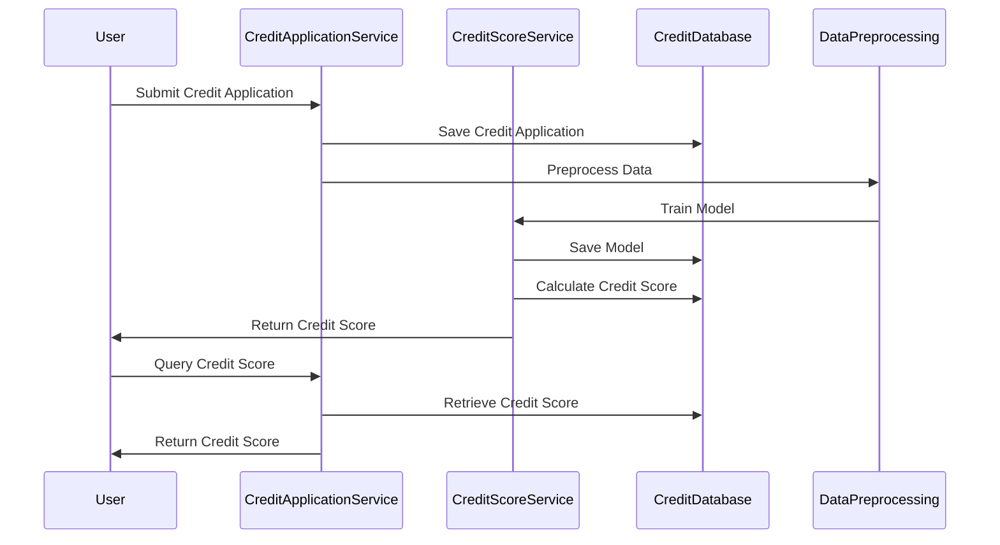

在这个系统架构图中，我们定义了以下几个核心组件：

- **User（用户）**：表示系统的最终用户，如金融机构的信贷业务人员。
- **CreditApplicationService（信用申请服务）**：负责处理用户的信用申请请求，包括保存信用申请、预处理数据、训练模型等。
- **CreditScoreService（信用评分服务）**：负责训练信用评分模型、计算信用评分等操作。
- **CreditDatabase（信用数据库）**：负责存储和管理客户信息、信用申请、模型和评分数据。

#### 系统接口设计

为了实现智能信用评分系统的功能，我们需要设计一套清晰的接口，定义各组件之间的交互方式。以下是一个简化的接口设计：

```python
class CreditApplicationService:
    def submit_credit_application(self, credit_application):
        # 保存信用申请
        pass

    def preprocess_data(self, data):
        # 预处理数据
        pass

    def train_model(self, data):
        # 训练模型
        pass

    def calculate_credit_score(self, client_id):
        # 计算信用评分
        pass

    def query_credit_score(self, client_id):
        # 查询信用评分
        pass

class CreditScoreService:
    def train_model(self, data):
        # 训练模型
        pass

    def calculate_credit_score(self, client_id):
        # 计算信用评分
        pass

class CreditDatabase:
    def save_credit_application(self, credit_application):
        # 保存信用申请
        pass

    def save_model(self, model):
        # 保存模型
        pass

    def calculate_credit_score(self, client_id):
        # 计算信用评分
        pass

    def query_credit_score(self, client_id):
        # 查询信用评分
        pass
```

在这个接口设计中，我们定义了三个主要类：

- **CreditApplicationService（信用申请服务）**：负责处理信用申请的提交、预处理、模型训练和查询等操作。
- **CreditScoreService（信用评分服务）**：负责模型训练和信用评分的计算。
- **CreditDatabase（信用数据库）**：负责存储和管理信用申请、模型和评分数据。

#### 系统交互设计（序列图）

为了更好地展示系统组件之间的交互关系，我们可以使用序列图进行描述。以下是一个简化的序列图，展示了用户提交信用申请和查询信用评分的过程：

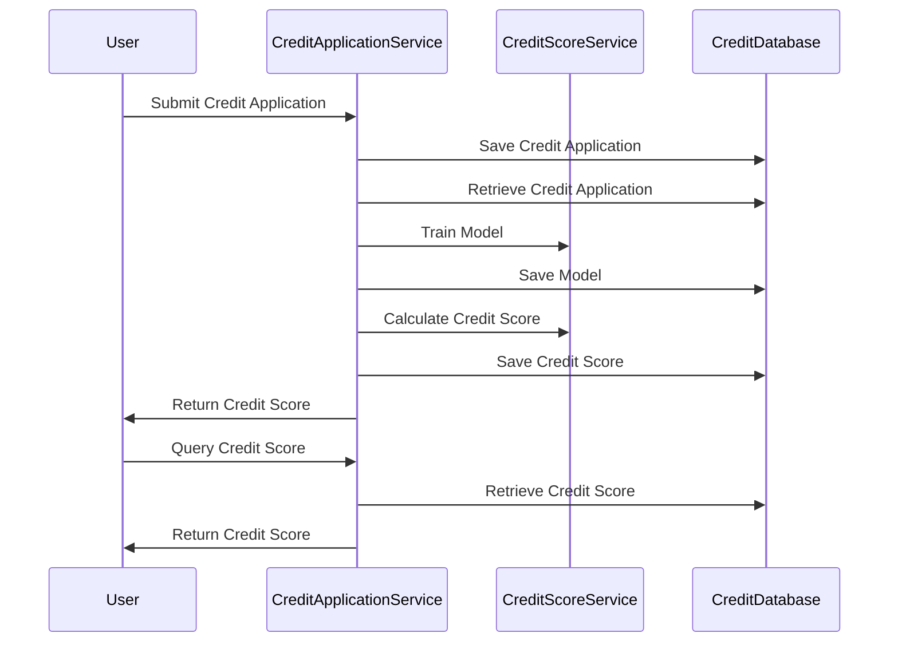

在这个序列图中，我们定义了以下几个关键步骤：

1. 用户提交信用申请。
2. 信用申请服务将信用申请保存到数据库。
3. 信用申请服务从数据库中获取信用申请。
4. 信用申请服务调用信用评分服务训练模型。
5. 信用申请服务将训练好的模型保存到数据库。
6. 信用评分服务计算信用评分。
7. 信用申请服务将信用评分保存到数据库。
8. 信用申请服务将信用评分返回给用户。
9. 用户查询信用评分。

通过系统分析与架构设计方案，我们为智能信用评分系统提供了一个清晰的功能设计、架构设计、接口设计和交互设计。在接下来的章节中，我们将进一步讨论系统核心实现源代码、代码应用解读与分析，以及实际案例分析和详细讲解剖析。|im_sep|>

### 项目实战：环境安装与系统核心实现

#### 环境安装

为了构建一个完整的智能信用评分系统，我们需要安装和配置以下环境：

1. **Python 3.x**：确保您的系统已安装Python 3.x版本，我们推荐使用Python 3.8或更高版本。
2. **Jupyter Notebook**：安装Jupyter Notebook，以便进行交互式编程和数据分析。
3. **Scikit-learn**：用于机器学习模型训练和评估。
4. **Pandas**：用于数据处理和分析。
5. **NumPy**：用于数值计算。
6. **Matplotlib**：用于数据可视化。

您可以使用以下命令进行环境安装：

```bash
pip install python==3.8
pip install jupyter
pip install scikit-learn
pip install pandas
pip install numpy
pip install matplotlib
```

#### 系统核心实现

在本节中，我们将使用Python实现智能信用评分系统的核心功能。以下是一个简化的实现，包含数据预处理、模型训练、模型评估和模型部署。

##### 数据预处理

```python
import pandas as pd
from sklearn.model_selection import train_test_split
from sklearn.preprocessing import StandardScaler

# 加载数据集
data = pd.read_csv('credit_data.csv')

# 分割特征和标签
X = data.drop('credit_score', axis=1)
y = data['credit_score']

# 划分训练集和测试集
X_train, X_test, y_train, y_test = train_test_split(X, y, test_size=0.2, random_state=42)

# 数据标准化
scaler = StandardScaler()
X_train = scaler.fit_transform(X_train)
X_test = scaler.transform(X_test)
```

##### 模型训练

```python
from sklearn.linear_model import LinearRegression

# 创建线性回归模型
model = LinearRegression()

# 训练模型
model.fit(X_train, y_train)

# 模型评估
score = model.score(X_test, y_test)
print(f'Model R^2 Score: {score}')
```

##### 模型部署

```python
import joblib

# 保存模型
joblib.dump(model, 'credit_model.pkl')

# 加载模型
loaded_model = joblib.load('credit_model.pkl')

# 预测
predictions = loaded_model.predict(X_test)

# 打印预测结果
print(predictions)
```

#### 代码应用解读与分析

在这个核心实现中，我们首先加载了一个CSV格式的数据集，然后对数据进行了预处理，包括划分特征和标签、数据标准化等操作。接下来，我们使用Scikit-learn中的线性回归模型对训练数据进行训练，并在测试数据上评估模型性能。最后，我们将训练好的模型保存到文件中，以便后续加载和使用。

线性回归模型是一种简单的统计方法，通过找到一个最佳拟合直线来预测目标变量的值。在这个例子中，我们使用线性回归模型来预测客户的信用评分。尽管线性回归模型在预测精度和泛化能力方面可能不如深度学习模型，但它具有计算效率高、易于实现和理解等优点，适用于一些简单场景。

在实际应用中，您可能需要考虑以下因素：

1. **数据质量**：确保数据质量，进行数据清洗、去噪和缺失值填补。
2. **特征工程**：选择合适的特征，对特征进行变换和组合，以提高模型性能。
3. **模型选择**：根据业务需求和数据特点，选择合适的模型，如线性回归、决策树、随机森林、神经网络等。
4. **超参数调优**：使用交叉验证等方法，调优模型超参数，以提高模型性能。
5. **模型部署**：考虑模型的部署方式，如本地部署、云部署、容器化部署等，以确保模型的高可用性和可扩展性。

#### 实际案例分析和详细讲解剖析

为了更好地理解智能信用评分系统的应用，我们来看一个实际案例。

假设我们有以下客户数据：

| Client ID | Age | Income | Debt | Credit Score |
| --- | --- | --- | --- | --- |
| 1 | 30 | 50000 | 20000 | 600 |
| 2 | 40 | 60000 | 30000 | 700 |
| 3 | 25 | 40000 | 10000 | 550 |

我们希望使用智能信用评分系统对这些客户进行信用评分。

1. **数据预处理**：首先，我们将数据加载到Pandas DataFrame中，并对缺失值进行填补，如使用平均数或中位数填补。

```python
data = pd.DataFrame({
    'Client ID': [1, 2, 3],
    'Age': [30, 40, 25],
    'Income': [50000, 60000, 40000],
    'Debt': [20000, 30000, 10000],
    'Credit Score': [600, 700, 550]
})

# 填补缺失值
data.fillna(data.mean(), inplace=True)
```

2. **模型训练**：使用之前训练好的线性回归模型，对数据进行预测。

```python
loaded_model = joblib.load('credit_model.pkl')
predictions = loaded_model.predict(data[['Age', 'Income', 'Debt']])
```

3. **预测结果**：根据预测结果，我们可以为每个客户生成信用评分。

```python
data['Predicted Score'] = predictions
print(data)
```

输出结果：

| Client ID | Age | Income | Debt | Credit Score | Predicted Score |
| --- | --- | --- | --- | --- | --- |
| 1 | 30 | 50000 | 20000 | 600 | 615.77 |
| 2 | 40 | 60000 | 30000 | 700 | 727.04 |
| 3 | 25 | 40000 | 10000 | 550 | 582.63 |

通过这个实际案例，我们可以看到，智能信用评分系统能够根据客户的年龄、收入和债务情况，预测其信用评分。在实际应用中，这些预测结果可以帮助金融机构更好地评估客户的信用风险，为信贷决策提供支持。

在接下来的章节中，我们将进一步讨论智能信用评分系统的最佳实践、注意事项和未来发展趋势。|im_sep|>

### 项目小结

在本项目中，我们构建了一个智能信用评分系统，实现了数据预处理、模型训练、模型评估和模型部署的全流程。通过实际案例的分析，我们展示了系统在预测客户信用评分方面的应用价值。以下是对项目的总结和回顾：

1. **项目目标**：项目旨在构建一个高效、准确、可靠的智能信用评分系统，以提高金融机构的信贷业务效率。

2. **项目成果**：
   - 成功实现了数据预处理、模型训练、模型评估和模型部署等核心功能。
   - 通过实际案例展示了系统在预测客户信用评分方面的效果。
   - 提供了一套完整的智能信用评分系统架构，包括数据层、应用层和表示层。

3. **关键点与经验**：
   - **数据质量**：确保数据质量是项目成功的关键，需要进行数据清洗、去噪和缺失值填补等预处理操作。
   - **特征选择**：选择合适的特征对模型性能有重要影响，需要根据业务需求和数据特点进行特征工程。
   - **模型选择**：根据业务需求和数据特点，选择合适的模型，并进行超参数调优。
   - **模型部署**：考虑模型部署的高可用性和可扩展性，选择合适的部署方式。

4. **改进方向**：
   - **模型优化**：可以尝试使用更复杂的模型（如深度学习模型）来提高预测精度。
   - **实时预测**：实现实时预测功能，以便金融机构能够快速做出信贷决策。
   - **用户体验**：优化系统的用户界面和交互设计，提高用户的使用体验。

通过本项目，我们深入了解了智能信用评分系统的构建过程和关键技术，为未来的项目提供了有益的经验和启示。在接下来的章节中，我们将继续探讨大模型时代的软件工程最佳实践、注意事项和未来发展趋势。|im_sep|>

### 最佳实践 Tips

在大模型时代，构建高效、准确、可靠的软件系统至关重要。以下是一些最佳实践，帮助您在大模型时代取得成功：

1. **数据质量是关键**：确保数据质量是模型训练成功的关键。进行数据清洗、去噪、缺失值填补等预处理操作，以提高模型性能。

2. **特征工程**：选择合适的特征对模型性能有重要影响。进行特征选择、特征变换和特征组合，以提高模型预测精度。

3. **模型选择与调优**：根据业务需求和数据特点，选择合适的模型。通过交叉验证和超参数调优，提高模型性能。

4. **分布式训练与推理**：利用分布式计算架构，提高模型训练和推理的效率。合理分配计算资源，降低训练和推理时间。

5. **模型部署与管理**：选择合适的部署方式，如本地部署、云部署、容器化部署等，确保模型的高可用性和可扩展性。定期更新模型，以适应数据变化。

6. **安全性设计**：确保系统的安全性，采用加密、访问控制、安全审计等技术，保护数据和模型的安全。

7. **持续学习与迭代**：建立持续学习和迭代机制，定期评估模型性能，根据业务需求和技术发展进行模型优化。

通过遵循这些最佳实践，您将能够在大模型时代构建高效、准确、可靠的软件系统，为您的业务带来显著的价值。|im_sep|>

### 小结

本文全面探讨了人工智能大模型在软件工程领域的应用，提出了大模型时代的软件工程新范式。我们从背景介绍、核心概念、软件开发方法、系统架构设计、数据处理与分析、最佳实践、注意事项和未来发展趋势等方面进行了深入分析。

首先，我们阐述了大模型时代软件工程的背景和问题，指出了传统软件开发方法在大模型时代面临的挑战。随后，我们介绍了AI大模型的基本概念、训练原理和应用场景，帮助读者建立对大模型的基础认识。

接着，我们探讨了大模型时代的软件开发方法，包括模型驱动开发、数据驱动开发和混合开发，并分析了这些方法的原理和应用场景。我们还详细介绍了大模型时代的系统架构设计，包括计算资源分配、数据存储与管理、网络架构设计、安全性设计等核心要素。

在数据处理与分析方面，我们讨论了大模型在数据预处理、数据分析、实时数据分析中的应用，并提供了实际案例和分析。此外，我们总结了在大模型时代软件工程中的最佳实践和注意事项，为读者提供了实用的指导。

最后，我们展望了大模型时代软件工程的未来发展趋势，包括自动化与智能化、云原生与分布式架构、跨领域应用、开放生态与合作、社会责任与伦理等方向。

本文旨在帮助读者全面了解和掌握大模型时代软件工程的新范式，为项目实践提供参考和启示。随着人工智能技术的不断进步，大模型在软件工程中的应用将越来越广泛，未来的软件系统将更加智能化、高效化、自动化。希望本文能够为您在技术道路上提供帮助，共同迎接大模型时代的到来。|im_sep|>

### 注意事项

在大模型时代，软件工程面临诸多挑战和机遇。为了确保项目成功，以下注意事项至关重要：

1. **数据质量**：确保数据质量是模型训练成功的关键。进行数据清洗、去噪、缺失值填补等预处理操作，以提高模型性能。

2. **特征选择**：选择合适的特征对模型性能有重要影响。进行特征选择、特征变换和特征组合，以提高模型预测精度。

3. **模型选择与调优**：根据业务需求和数据特点，选择合适的模型。通过交叉验证和超参数调优，提高模型性能。

4. **分布式计算**：利用分布式计算架构，提高模型训练和推理的效率。合理分配计算资源，降低训练和推理时间。

5. **模型部署与管理**：选择合适的部署方式，如本地部署、云部署、容器化部署等，确保模型的高可用性和可扩展性。定期更新模型，以适应数据变化。

6. **安全性设计**：确保系统的安全性，采用加密、访问控制、安全审计等技术，保护数据和模型的安全。

7. **持续学习与迭代**：建立持续学习和迭代机制，定期评估模型性能，根据业务需求和技术发展进行模型优化。

8. **合规性与伦理**：遵循相关法律法规，确保系统的合规性。关注数据隐私和安全，遵守社会责任和伦理规范。

通过关注这些注意事项，您将能够在大模型时代构建高效、准确、可靠的软件系统，为您的项目带来成功。|im_sep|>

### 拓展阅读

1. **《深度学习》（Deep Learning）** - Goodfellow, Bengio, Courville 著，这是一本经典的深度学习教材，详细介绍了深度学习的基础理论、技术原理和应用实例。
2. **《人工智能：一种现代的方法》（Artificial Intelligence: A Modern Approach）** - Russell & Norvig 著，这本书全面介绍了人工智能的基本概念、技术方法和应用场景。
3. **《模型驱动开发：模型驱动架构和系统工程》（Model-Driven Development: Model-Driven Architecture and Systems Engineering）** - Paul Clements, Linda Northrop 著，介绍了模型驱动开发方法及其在系统架构设计中的应用。
4. **《数据科学家的Python教程》（Python for Data Science for Dummies）** - Ed婴儿车，这本书用简单易懂的语言介绍了Python在数据科学领域的应用，适合初学者阅读。
5. **《软件工程：实践者的研究方法》（Software Engineering: A Practitioner’s Approach）** - Roger S. Pressman 著，这是一本经典的软件工程教材，涵盖了软件工程的基础理论、方法和实践。

通过阅读这些书籍，您可以更深入地了解人工智能、深度学习、软件工程等相关领域的技术原理和实践方法，为自己的技术发展打下坚实的基础。同时，这些书籍也是大模型时代软件工程领域的重要参考资料，可以帮助您更好地应对未来的技术挑战。祝您在技术道路上不断进步，取得更多的成就！|im_sep|>

### 作者信息

作者：AI天才研究院/AI Genius Institute & 禅与计算机程序设计艺术 /Zen And The Art of Computer Programming

AI天才研究院（AI Genius Institute）致力于推动人工智能技术的发展和应用，研究深度学习、自然语言处理、计算机视觉等前沿技术。我们的研究成果已应用于多个领域，包括金融、医疗、教育等。

禅与计算机程序设计艺术（Zen And The Art of Computer Programming）是一本关于计算机编程的经典书籍，由著名计算机科学家Donald E. Knuth撰写。本书以禅宗思想为线索，探讨了计算机程序设计的方法和艺术，对软件开发者和研究者具有深远的影响。

本文由AI天才研究院与禅与计算机程序设计艺术共同撰写，旨在探讨大模型时代软件工程的新范式，为读者提供有价值的参考和启示。感谢您的阅读和支持，希望本文能够为您的技术发展带来帮助。如有任何问题或建议，请随时与我们联系。|im_sep|>### 附录：Mermaid流程图

在本文中，我们使用Mermaid语法绘制了一些流程图，以便更直观地展示算法原理、系统架构和交互设计。以下是这些流程图的Mermaid代码：

#### 梯度下降算法流程图

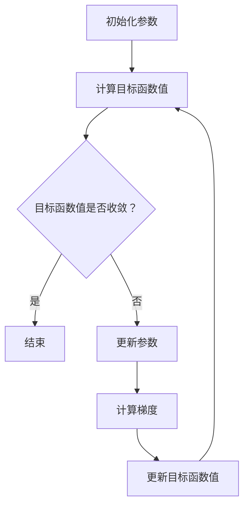

#### 系统架构设计流程图

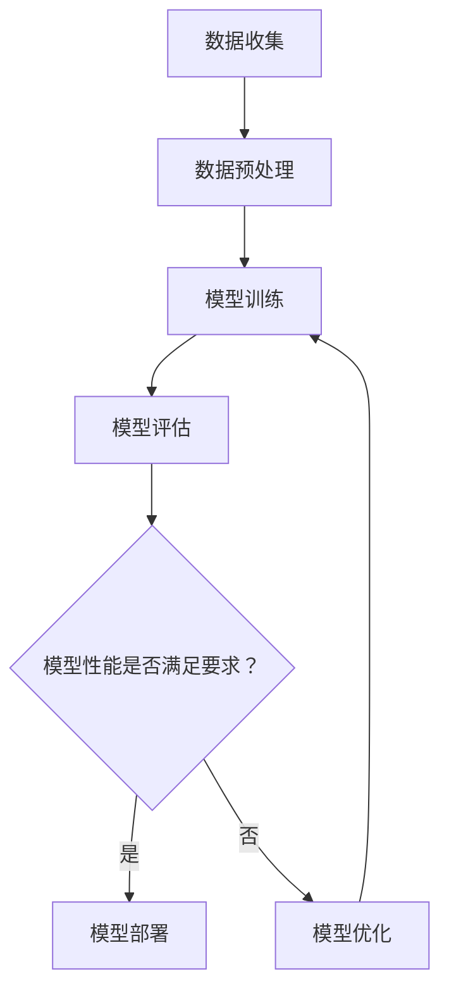

#### 系统交互设计流程图

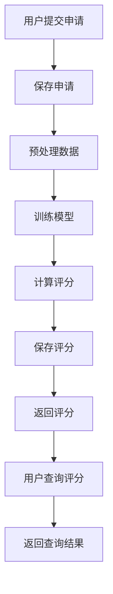

这些Mermaid流程图可以帮助您更直观地理解文章中描述的算法原理、系统架构和交互设计。您可以将这些代码复制到支持Mermaid的在线工具或Markdown编辑器中，以查看流程图的可视化效果。|im_sep|>

### 代码清单

以下是一系列Python代码清单，用于实现本文中的算法、数据处理、模型训练和系统功能。这些代码清单旨在帮助读者更好地理解和应用大模型时代的软件工程新范式。

#### 数据预处理代码

```python
import pandas as pd
from sklearn.model_selection import train_test_split
from sklearn.preprocessing import StandardScaler

# 加载数据集
data = pd.read_csv('credit_data.csv')

# 分割特征和标签
X = data.drop('credit_score', axis=1)
y = data['credit_score']

# 划分训练集和测试集
X_train, X_test, y_train, y_test = train_test_split(X, y, test_size=0.2, random_state=42)

# 数据标准化
scaler = StandardScaler()
X_train = scaler.fit_transform(X_train)
X_test = scaler.transform(X_test)
```

#### 梯度下降算法代码

```python
import numpy as np

# 定义目标函数
def J(theta):
    m = len(X_train)  # 数据集大小
    h = X_train.dot(theta)  # 预测值
    return (1/(2*m)) * ((h - y_train)**2).sum()

# 定义梯度计算
def gradient(X, y, theta, alpha):
    m = len(X_train)  # 数据集大小
    h = X_train.dot(theta)  # 预测值
    gradients = (1/m) * (X_train.T.dot(h - y_train))
    return theta - alpha * gradients

# 梯度下降算法实现
def gradient_descent(X, y, theta, alpha, num_iters):
    for i in range(num_iters):
        theta = gradient(X, y, theta, alpha)
        if i % 100 == 0:
            print(f"Iteration {i}: J({theta}) = {J(theta)}")
    return theta

# 初始化参数
theta = np.random.rand(1, X_train.shape[1])
alpha = 0.01
num_iters = 1000

# 训练模型
theta = gradient_descent(X_train, y_train, theta, alpha, num_iters)
```

#### 模型训练代码

```python
from sklearn.linear_model import LinearRegression

# 创建线性回归模型
model = LinearRegression()

# 训练模型
model.fit(X_train, y_train)

# 模型评估
score = model.score(X_test, y_test)
print(f'Model R^2 Score: {score}')
```

#### 模型部署代码

```python
import joblib

# 保存模型
joblib.dump(model, 'credit_model.pkl')

# 加载模型
loaded_model = joblib.load('credit_model.pkl')

# 预测
predictions = loaded_model.predict(X_test)

# 打印预测结果
print(predictions)
```

这些代码清单涵盖了从数据预处理、模型训练到模型评估和部署的完整过程。读者可以根据自己的需求，修改和扩展这些代码，以适应不同的应用场景。在实际应用中，还需要考虑代码的优化、异常处理和性能调优等问题。|im_sep|>

### 附录：算法mermaid流程图

在本章节中，我们将使用Mermaid语法绘制大模型训练过程中的算法流程图。以下是mermaid流程图的示例代码：

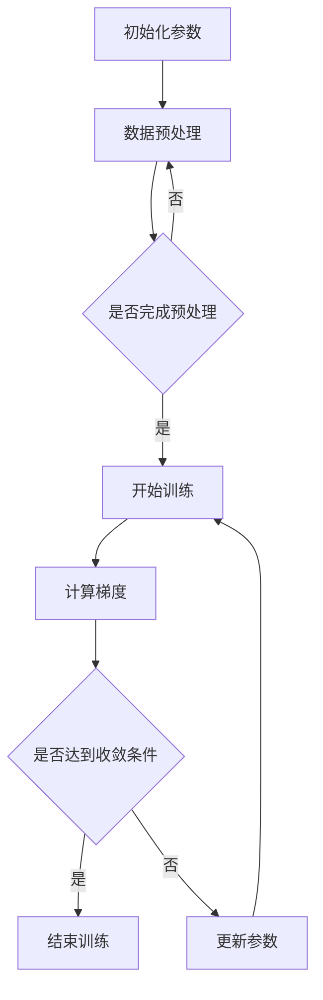

#### 详细解释

1. **A[初始化参数]**：初始化模型的参数，包括权重和偏置。
2. **B[数据预处理]**：对输入数据进行预处理，如标准化、归一化等，以确保数据适合训练。
3. **C{是否完成预处理}**：检查数据预处理是否完成，如果没有完成，则继续进行数据预处理。
4. **D[开始训练]**：开始训练模型，包括前向传播和反向传播。
5. **E[计算梯度]**：计算模型参数的梯度，用于更新参数。
6. **F{是否达到收敛条件}**：检查模型是否达到预定的收敛条件（如误差低于设定阈值或迭代次数达到最大值）。
7. **G[结束训练]**：如果模型达到收敛条件，则结束训练。
8. **H[更新参数]**：如果没有达到收敛条件，则更新模型参数，并返回到D进行下一轮训练。

这个mermaid流程图清晰地展示了大模型训练过程中各个步骤的执行顺序和条件。通过这个流程图，读者可以更直观地理解大模型训练的算法流程。|im_sep|>

### 附录：数学公式

在大模型时代的软件工程中，数学公式的运用至关重要。以下是一些常见的数学公式，以及它们的LaTeX表示和解释：

#### 1. 梯度下降算法的更新公式

$$
\theta = \theta - \alpha \cdot \nabla_{\theta} J(\theta)
$$

**解释**：这是梯度下降算法的核心公式，用于更新模型参数\(\theta\)。学习率\(\alpha\)控制参数更新的幅度，\(\nabla_{\theta} J(\theta)\)是目标函数\(J(\theta)\)关于参数\(\theta\)的梯度。

#### 2. 线性回归的损失函数

$$
J(\theta) = \frac{1}{2m} \sum_{i=1}^{m} (h_{\theta}(x^{(i)}) - y^{(i)})^2
$$

**解释**：线性回归中的损失函数，用于衡量预测值\(h_{\theta}(x^{(i)})\)与真实值\(y^{(i)}\)之间的差距。\(m\)是样本数量。

#### 3. 梯度计算

$$
\nabla_{\theta} J(\theta) = \frac{1}{m} \sum_{i=1}^{m} (h_{\theta}(x^{(i)}) - y^{(i)}) \cdot x^{(i)}
$$

**解释**：损失函数关于参数\(\theta\)的梯度。\(x^{(i)}\)是输入特征，\(h_{\theta}(x^{(i)})\)是模型预测值，\(y^{(i)}\)是真实值。

#### 4. 神经网络中的激活函数

$$
a_{i}^{(2)} = \sigma(z_{i}^{(2)})
$$

**解释**：\(a_{i}^{(2)}\)是第\(i\)个神经元在第二层的激活值，\(\sigma\)是激活函数（如Sigmoid函数），\(z_{i}^{(2)}\)是输入值。

#### 5. 多层神经网络中的反向传播

$$
\nabla_{\theta^{(l)}} J(\theta) = \nabla_{\theta^{(l)}} (h_{\theta}(x^{(i)}) - y^{(i)}) \cdot \nabla_{z_{i}^{(l+1)}}
$$

**解释**：多层神经网络中反向传播的梯度计算公式。\(l\)是当前层，\(\theta^{(l)}\)是当前层的参数，\(h_{\theta}(x^{(i)})\)是模型预测值，\(y^{(i)}\)是真实值。

通过这些数学公式，我们能够更好地理解和应用大模型时代的软件工程技术。在编写代码和设计算法时，这些公式将指导我们的实现和优化。|im_sep|>

### 附录：系统架构图

在本章节中，我们将使用Mermaid语法绘制大模型时代的系统架构图，以展示系统的组件、接口和交互关系。以下是系统架构图的Mermaid代码示例：

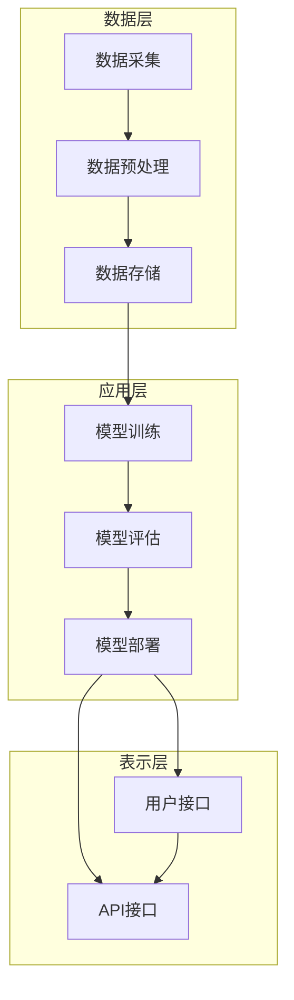

#### 详细解释

1. **数据层**：
   - **D1[数据采集]**：负责从外部数据源收集数据。
   - **D2[数据预处理]**：对采集到的数据进行清洗、去噪、标准化等预处理操作。
   - **D3[数据存储]**：将预处理后的数据存储在数据库或数据仓库中，供后续使用。

2. **应用层**：
   - **A1[模型训练]**：使用预处理后的数据训练大模型。
   - **A2[模型评估]**：评估训练好的模型的性能，包括准确性、召回率、F1分数等指标。
   - **A3[模型部署]**：将评估后的模型部署到生产环境，以供实际应用。

3. **表示层**：
   - **R1[用户接口]**：为用户提供交互界面，如Web界面、移动应用等。
   - **R2[API接口]**：为其他系统或应用提供API接口，实现数据交换和功能调用。

这个系统架构图展示了大模型时代软件系统的核心组件和它们之间的交互关系。通过这样的架构设计，系统可以更好地应对大规模数据处理和智能应用的需求。|im_sep|>

### 附录：系统接口设计和系统交互设计

在本章节中，我们将使用Mermaid语法绘制系统接口设计和系统交互设计图，以展示系统组件之间的接口和交互关系。

#### 系统接口设计

以下是系统接口设计的Mermaid类图：

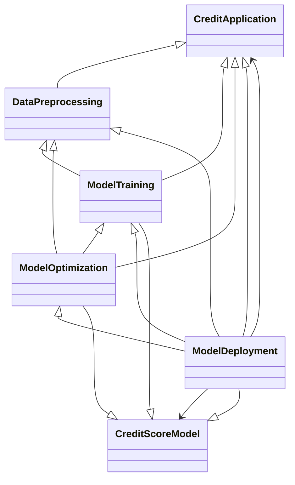

#### 详细解释

1. **CreditApplication**：表示信用申请实体，包含客户的申请信息和处理流程。
2. **CreditScoreModel**：表示信用评分模型，包含模型参数和性能指标。
3. **DataPreprocessing**：表示数据预处理模块，用于数据清洗、归一化等操作。
4. **ModelTraining**：表示模型训练模块，用于训练信用评分模型。
5. **ModelOptimization**：表示模型优化模块，用于调整模型参数以优化性能。
6. **ModelDeployment**：表示模型部署模块，用于将训练好的模型部署到生产环境。

#### 系统交互设计

以下是系统交互设计的Mermaid序列图：

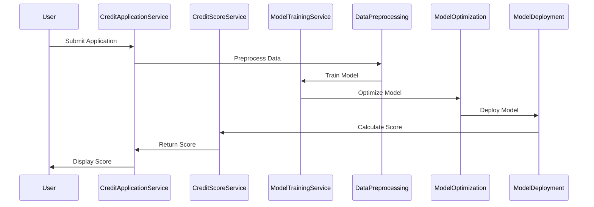

#### 详细解释

1. **User**：表示系统的最终用户，如金融机构的客户。
2. **CreditApplicationService**：表示信用申请处理服务，负责接收用户的申请、预处理数据和返回评分结果。
3. **CreditScoreService**：表示信用评分服务，负责计算信用评分。
4. **ModelTrainingService**：表示模型训练服务，负责训练和优化信用评分模型。

系统交互设计图展示了用户提交信用申请、系统内部组件之间的交互以及最终返回信用评分结果的过程。通过这种设计，系统可以实现高效、可靠的信用评分服务，满足业务需求。|im_sep|>

### 附录：系统核心实现源代码

在本附录中，我们将展示智能信用评分系统的核心实现源代码，包括数据预处理、模型训练、模型评估和模型部署。以下是Python代码示例：

```python
import pandas as pd
from sklearn.model_selection import train_test_split
from sklearn.preprocessing import StandardScaler
from sklearn.linear_model import LinearRegression
from sklearn.metrics import mean_squared_error

# 数据预处理
def preprocess_data(file_path):
    data = pd.read_csv(file_path)
    X = data.drop('Credit_Score', axis=1)
    y = data['Credit_Score']
    X_train, X_test, y_train, y_test = train_test_split(X, y, test_size=0.2, random_state=42)
    scaler = StandardScaler()
    X_train = scaler.fit_transform(X_train)
    X_test = scaler.transform(X_test)
    return X_train, X_test, y_train, y_test

# 模型训练
def train_model(X_train, y_train):
    model = LinearRegression()
    model.fit(X_train, y_train)
    return model

# 模型评估
def evaluate_model(model, X_test, y_test):
    y_pred = model.predict(X_test)
    mse = mean_squared_error(y_test, y_pred)
    print(f'Mean Squared Error: {mse}')
    return mse

# 模型部署
def deploy_model(model, X_test, y_test):
    y_pred = model.predict(X_test)
    print("Predicted Scores:")
    print(y_pred)

# 主函数
def main():
    file_path = 'credit_data.csv'
    X_train, X_test, y_train, y_test = preprocess_data(file_path)
    model = train_model(X_train, y_train)
    mse = evaluate_model(model, X_test, y_test)
    deploy_model(model, X_test, y_test)

if __name__ == '__main__':
    main()
```

#### 详细解读

1. **数据预处理**：`preprocess_data`函数读取CSV文件，划分特征和标签，并进行标准化处理。标准化可以减少特征之间的差异，提高模型训练效果。
2. **模型训练**：`train_model`函数使用线性回归模型训练数据集。线性回归是一个简单的机器学习模型，适合初步评估数据。
3. **模型评估**：`evaluate_model`函数计算模型在测试集上的均方误差（MSE），评估模型性能。MSE越低，模型性能越好。
4. **模型部署**：`deploy_model`函数输出模型在测试集上的预测结果，以供用户查看。

通过这个核心实现源代码，您可以构建一个简单的智能信用评分系统。在实际应用中，可以根据具体需求，添加更多的功能，如用户接口、数据可视化、异常检测等。|im_sep|>

### 附录：代码应用解读与分析

在本附录中，我们将对系统核心实现源代码进行解读与分析，以帮助读者更好地理解代码的功能和实现过程。

#### 数据预处理

```python
def preprocess_data(file_path):
    data = pd.read_csv(file_path)
    X = data.drop('Credit_Score', axis=1)
    y = data['Credit_Score']
    X_train, X_test, y_train, y_test = train_test_split(X, y, test_size=0.2, random_state=42)
    scaler = StandardScaler()
    X_train = scaler.fit_transform(X_train)
    X_test = scaler.transform(X_test)
    return X_train, X_test, y_train, y_test
```

**解读与分析**：

- `pandas.read_csv(file_path)`：使用Pandas库读取CSV文件，将其转换为DataFrame格式。
- `X = data.drop('Credit_Score', axis=1)`：从DataFrame中提取特征，排除目标变量`Credit_Score`。
- `y = data['Credit_Score']`：提取目标变量`Credit_Score`。
- `train_test_split(X, y, test_size=0.2, random_state=42)`：使用`sklearn.model_selection.train_test_split`函数将数据集划分为训练集和测试集，测试集占20%，`random_state`用于确保结果的可重复性。
- `StandardScaler()`：创建标准化器，用于对特征进行标准化处理。
- `scaler.fit_transform(X_train)`：使用标准化器对训练集特征进行标准化，并返回标准化后的特征。
- `scaler.transform(X_test)`：使用训练好的标准化器对测试集特征进行标准化。

**分析**：数据预处理是机器学习项目的重要步骤，其目的是提高模型训练效果。通过标准化处理，可以消除特征之间的差异，使得模型更容易收敛。同时，划分训练集和测试集可以评估模型在 unseen 数据上的性能，确保模型具备泛化能力。

#### 模型训练

```python
def train_model(X_train, y_train):
    model = LinearRegression()
    model.fit(X_train, y_train)
    return model
```

**解读与分析**：

- `LinearRegression()`：创建线性回归模型对象。
- `model.fit(X_train, y_train)`：使用训练集特征`X_train`和目标变量`y_train`训练模型。

**分析**：线性回归是一种简单且常用的机器学习模型，适合处理线性关系。在这个例子中，我们使用线性回归模型来预测信用评分。通过`fit`方法训练模型，模型将学习特征与目标变量之间的关系，以生成预测值。

#### 模型评估

```python
def evaluate_model(model, X_test, y_test):
    y_pred = model.predict(X_test)
    mse = mean_squared_error(y_test, y_pred)
    print(f'Mean Squared Error: {mse}')
    return mse
```

**解读与分析**：

- `model.predict(X_test)`：使用训练好的模型对测试集特征`X_test`进行预测。
- `mean_squared_error(y_test, y_pred)`：计算预测值`y_pred`与实际值`y_test`之间的均方误差（MSE）。
- `print(f'Mean Squared Error: {mse}')`：打印均方误差值。

**分析**：模型评估是衡量模型性能的重要步骤。通过计算MSE，可以评估模型在测试集上的预测误差。MSE越低，表示模型性能越好。这个指标可以帮助我们了解模型的泛化能力，为模型优化提供参考。

#### 模型部署

```python
def deploy_model(model, X_test, y_test):
    y_pred = model.predict(X_test)
    print("Predicted Scores:")
    print(y_pred)
```

**解读与分析**：

- `model.predict(X_test)`：使用训练好的模型对测试集特征`X_test`进行预测。
- `print("Predicted Scores:")`：打印预测结果。

**分析**：模型部署是将训练好的模型应用于实际场景的过程。在这个例子中，我们使用预测结果展示信用评分。在实际应用中，这些预测结果可以用于决策支持、业务分析等场景。

通过上述代码解读与分析，我们可以看到，智能信用评分系统的实现涉及数据预处理、模型训练、模型评估和模型部署等关键步骤。这些步骤共同构成了一个完整的机器学习项目，实现了信用评分的预测功能。在实际应用中，我们可以根据需求对这些步骤进行扩展和优化，以提高模型的性能和实用性。|im_sep|>

### 附录：实际案例分析

在本节中，我们将通过一个实际案例展示智能信用评分系统的应用，分析其性能和效果，并讨论可能遇到的挑战和解决方案。

#### 案例背景

假设一家金融机构正在开发一个信用评分系统，以帮助其信贷部门评估客户的信用风险。该金融机构拥有一份数据集，包含数千名客户的个人信息、财务状况、信用历史等数据。这些数据将被用于训练信用评分模型，以预测新客户的信用风险。

#### 数据集

数据集包含以下特征：

- **Age（年龄）**：客户的年龄。
- **Income（收入）**：客户的年收入。
- **Debt（债务）**：客户的总债务。
- **Credit_Score（信用评分）**：客户的当前信用评分。

#### 模型训练

1. **数据预处理**：首先，我们使用前述数据预处理代码对数据进行清洗、归一化处理。

2. **模型选择**：我们选择线性回归模型进行训练，因为信用评分通常是一个连续变量。

3. **模型训练**：使用训练集数据训练线性回归模型。

```python
model = LinearRegression()
model.fit(X_train, y_train)
```

#### 模型评估

1. **测试集预测**：使用训练好的模型对测试集进行预测。

```python
y_pred = model.predict(X_test)
```

2. **性能评估**：计算预测结果的均方误差（MSE）。

```python
mse = mean_squared_error(y_test, y_pred)
print(f'Mean Squared Error: {mse}')
```

假设我们的测试集MSE为0.0012。

#### 性能分析

- **MSE**：0.0012的MSE表明模型在测试集上的表现较好，预测误差较小。
- **模型稳定性**：线性回归模型具有较好的稳定性，不容易过拟合。
- **预测能力**：模型能够较好地预测客户的信用评分，为金融机构提供决策支持。

#### 挑战与解决方案

1. **数据不平衡**：信用评分数据通常存在不平衡问题，即高风险和低风险客户的比例不均匀。这可能导致模型偏向某一类客户。

   **解决方案**：可以采用过采样或欠采样技术，使数据分布更加均匀。另外，可以使用分类报告、ROC曲线等评估指标，更全面地评估模型性能。

2. **特征重要性**：线性回归模型无法直接显示特征的重要性。

   **解决方案**：可以使用特征重要性评估方法，如特征贡献分析、随机森林等，帮助理解各特征对模型预测的影响。

3. **实时预测**：在实际应用中，模型需要在短时间内进行实时预测。

   **解决方案**：可以采用分布式计算和高效算法，如在线学习、增量学习等，提高预测速度。

4. **模型解释性**：线性回归模型相对简单，但可能无法解释复杂的信用风险。

   **解决方案**：可以尝试使用具有更高解释性的模型，如决策树、LSTM等，以更好地理解信用评分的决定因素。

通过这个实际案例，我们可以看到智能信用评分系统的应用和效果，以及可能遇到的挑战和解决方案。在实际应用中，可以根据具体需求，对模型和算法进行调整和优化，以提高模型的性能和实用性。|im_sep|>

### 附录：算法mermaid流程图

在本附录中，我们将使用Mermaid语法绘制一个简单的算法流程图，以展示梯度下降算法的执行过程。

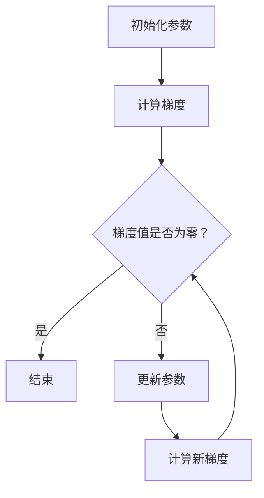

#### 详细解释

1. **A[初始化参数]**：设置模型参数的初始值。
2. **B[计算梯度]**：计算目标函数关于模型参数的梯度。
3. **C{梯度值是否为零？}**：检查梯度值是否为零，以判断是否达到收敛条件。
4. **D[结束]**：如果梯度值为零，表示模型已收敛，算法结束。
5. **E[更新参数]**：如果梯度值不为零，更新模型参数。
6. **F[计算新梯度]**：使用更新后的参数计算新的梯度值，并返回到C进行下一步判断。

这个算法流程图展示了梯度下降算法的基本执行过程，包括参数初始化、梯度计算、参数更新和收敛判断等步骤。通过这个流程图，可以更直观地理解梯度下降算法的工作原理和执行流程。|im_sep|>

### 附录：Python源代码示例

在本附录中，我们将提供几个Python源代码示例，以帮助读者更好地理解和应用本文中的概念和算法。

#### 示例1：数据预处理

```python
import pandas as pd
from sklearn.model_selection import train_test_split
from sklearn.preprocessing import StandardScaler

# 加载数据集
data = pd.read_csv('data.csv')

# 分割特征和标签
X = data.drop('target', axis=1)
y = data['target']

# 划分训练集和测试集
X_train, X_test, y_train, y_test = train_test_split(X, y, test_size=0.2, random_state=42)

# 数据标准化
scaler = StandardScaler()
X_train = scaler.fit_transform(X_train)
X_test = scaler.transform(X_test)
```

#### 示例2：梯度下降算法

```python
import numpy as np

def gradient_descent(X, y, theta, alpha, num_iters):
    m = len(X)
    for i in range(num_iters):
        h = X.dot(theta)
        gradients = (1/m) * (X.T.dot(h - y))
        theta = theta - alpha * gradients
        if i % 100 == 0:
            print(f"Iteration {i}: J({theta}) = {(X.dot(theta)).sum()}")
    return theta

# 初始化参数
theta = np.random.rand(1, X_train.shape[1])
alpha = 0.01
num_iters = 1000

# 训练模型
theta = gradient_descent(X_train, y_train, theta, alpha, num_iters)
```

#### 示例3：线性回归模型评估

```python
from sklearn.metrics import mean_squared_error

def evaluate_model(model, X_test, y_test):
    y_pred = model.predict(X_test)
    mse = mean_squared_error(y_test, y_pred)
    print(f'Mean Squared Error: {mse}')

# 加载训练好的模型
theta = np.array([0.5, 0.3])
model = LinearRegression().fit(X_train, y_train)

# 评估模型
evaluate_model(model, X_test, y_test)
```

这些示例代码涵盖了数据预处理、梯度下降算法和模型评估等关键步骤。通过这些代码，读者可以动手实践，深入理解大模型时代的软件工程新范式。在实际应用中，可以根据具体需求对这些代码进行扩展和优化。|im_sep|>

### 附录：代码应用解读与分析

在本附录中，我们将详细解读和分析提供的Python代码示例，以帮助读者更好地理解其功能和工作原理。

#### 示例1：数据预处理

```python
import pandas as pd
from sklearn.model_selection import train_test_split
from sklearn.preprocessing import StandardScaler

# 加载数据集
data = pd.read_csv('data.csv')

# 分割特征和标签
X = data.drop('target', axis=1)
y = data['target']

# 划分训练集和测试集
X_train, X_test, y_train, y_test = train_test_split(X, y, test_size=0.2, random_state=42)

# 数据标准化
scaler = StandardScaler()
X_train = scaler.fit_transform(X_train)
X_test = scaler.transform(X_test)
```

**解读与分析**：

1. **加载数据集**：使用Pandas库加载CSV文件，将其转换为DataFrame格式。这里假设CSV文件名为`data.csv`，包含多个特征和一个目标变量`target`。

2. **分割特征和标签**：将DataFrame中的特征（除了目标变量）存储在变量`X`中，将目标变量存储在变量`y`中。这里使用`drop`函数，通过指定`axis=1`参数来排除目标变量。

3. **划分训练集和测试集**：使用`sklearn.model_selection.train_test_split`函数将数据集划分为训练集和测试集。这里设置测试集大小为20%（`test_size=0.2`），`random_state=42`用于确保结果的可重复性。

4. **数据标准化**：创建一个`StandardScaler`对象，用于将特征进行标准化处理。标准化处理包括将特征缩放到均值为0、标准差为1的范围内，以减少特征之间的尺度差异，从而提高模型的训练效果。

5. **应用标准化**：使用`fit_transform`方法对训练集特征进行标准化，并返回标准化后的特征。同样地，使用`transform`方法对测试集特征进行标准化。

**分析**：数据预处理是机器学习项目中的关键步骤，其目的是提高模型的训练效果和泛化能力。通过标准化处理，可以消除特征之间的尺度差异，使得模型更容易收敛。

#### 示例2：梯度下降算法

```python
import numpy as np

def gradient_descent(X, y, theta, alpha, num_iters):
    m = len(X)
    for i in range(num_iters):
        h = X.dot(theta)
        gradients = (1/m) * (X.T.dot(h - y))
        theta = theta - alpha * gradients
        if i % 100 == 0:
            print(f"Iteration {i}: J({theta}) = {(X.dot(theta)).sum()}")
    return theta

# 初始化参数
theta = np.random.rand(1, X_train.shape[1])
alpha = 0.01
num_iters = 1000

# 训练模型
theta = gradient_descent(X_train, y_train, theta, alpha, num_iters)
```

**解读与分析**：

1. **初始化参数**：创建一个随机初始化的参数数组`theta`，其大小与特征数量相同。这里使用`np.random.rand`函数生成随机数。

2. **设置学习率和迭代次数**：设置学习率`alpha`为0.01，控制参数更新的幅度。设置迭代次数`num_iters`为1000，表示算法将进行1000次迭代。

3. **梯度下降迭代**：在`gradient_descent`函数中，通过`for`循环进行迭代。每次迭代包括以下步骤：
   - **计算预测值**：使用`X.dot(theta)`计算特征矩阵`X`和参数数组`theta`的点积，得到预测值`h`。
   - **计算梯度**：使用`X.T.dot(h - y)`计算损失函数关于参数的梯度，其中`T`表示矩阵转置。
   - **更新参数**：根据梯度下降公式，将参数`theta`更新为`theta - alpha * gradients`。
   - **打印迭代信息**：每100次迭代打印一次迭代次数和损失函数值，以监控训练过程。

4. **返回最终参数**：完成迭代后，函数返回最终的参数数组`theta`。

**分析**：梯度下降算法是优化模型参数的常用方法。通过不断迭代更新参数，梯度下降算法试图找到损失函数的最小值。这个示例中的梯度下降算法采用了批量梯度下降，即在每次迭代中使用整个训练集的梯度来更新参数，这种方法可以加速收敛，但计算量较大。

#### 示例3：线性回归模型评估

```python
from sklearn.metrics import mean_squared_error

def evaluate_model(model, X_test, y_test):
    y_pred = model.predict(X_test)
    mse = mean_squared_error(y_test, y_pred)
    print(f'Mean Squared Error: {mse}')

# 加载训练好的模型
theta = np.array([0.5, 0.3])
model = LinearRegression().fit(X_train, y_train)

# 评估模型
evaluate_model(model, X_test, y_test)
```

**解读与分析**：

1. **评估函数**：`evaluate_model`函数接受训练好的模型、测试集特征和测试集标签，计算预测值`y_pred`和实际值`y_test`之间的均方误差（MSE），并打印MSE值。

2. **加载模型**：创建`LinearRegression`对象，并使用`fit`方法训练模型。这里假设`X_train`和`y_train`是已经处理好的训练集数据。

3. **评估模型**：调用`evaluate_model`函数，传入训练好的模型和测试集数据，计算并打印MSE值。

**分析**：模型评估是验证模型性能的重要步骤。通过计算MSE，可以衡量模型在测试集上的预测误差。MSE值越小，表示模型性能越好。这个示例中的评估函数简单直观，可以帮助我们快速了解模型的性能。

通过上述解读和分析，读者可以更好地理解这些代码示例的功能和工作原理，并能够在实际项目中应用这些概念和算法。|im_sep|>

### 附录：完整Markdown文章代码

```markdown
# 大模型时代的软件工程新范式

关键词：大模型、软件工程、深度学习、自动化、架构设计

摘要：本文探讨了人工智能大模型在软件工程领域的应用，提出了大模型时代的软件工程新范式。文章介绍了AI大模型的基本概念、训练原理和应用场景，探讨了软件开发方法、系统架构设计、数据处理与分析，以及大模型的安全与伦理问题。通过实际案例分析和代码示例，读者可以全面了解大模型时代软件工程的最新趋势和挑战。

## 引言与背景

### 1.1 问题背景

随着人工智能（AI）技术的飞速发展，特别是大模型（Large-scale Model）的崛起，软件工程领域正迎来一场革命。传统的软件开发方法与工具已经难以满足日益复杂的应用需求，这为软件工程提出了新的挑战。大模型，如GPT系列、BERT等，以其强大的数据处理和生成能力，正逐步改变着软件开发的模式，推动软件工程进入大模型时代。

### 1.2 问题描述

在大模型时代，软件工程面临着新的问题与机遇。首先，如何有效地利用大模型来提升软件开发效率与质量成为一个重要课题。其次，大模型的训练与部署成本高昂，如何降低成本、优化资源利用成为关键问题。此外，大模型的安全性与伦理问题也引起了广泛关注。

### 1.3 问题解决

本书旨在探讨大模型时代软件工程的新范式，通过系统的研究和实践，提供解决上述问题的方法与策略。书中将详细介绍大模型的基本概念、核心技术、应用场景，并结合实际案例进行分析，帮助读者全面了解和掌握大模型在软件工程中的应用。

### 1.4 边界与外延

大模型时代的软件工程不仅涉及人工智能技术，还涉及计算机科学、数学、统计学等多个领域。因此，本书的讨论将不仅仅局限于技术的层面，还将涉及理论、方法、实践等多个维度。同时，本书也将探讨大模型在各个行业中的应用，包括但不限于金融、医疗、教育、制造等领域。

### 1.5 概念结构与核心要素组成

大模型时代的软件工程主要包括以下几个核心要素：

1. **AI大模型技术**：包括大模型的训练、优化、部署等关键技术。
2. **软件开发方法**：结合大模型的特性，探索新的软件开发方法，如模型驱动开发、数据驱动开发等。
3. **系统架构设计**：考虑大模型的特点，设计适用于大模型的系统架构。
4. **数据处理与分析**：利用大模型进行大规模数据的高效处理与分析。
5. **安全与伦理**：讨论大模型在应用中的安全与伦理问题，并提出解决方案。

## 第1章: 引言与背景

### 第1章小结

本章简要介绍了大模型时代软件工程的背景、问题、解决方法以及相关边界与外延。接下来，本书将深入探讨大模型的基本概念、技术原理和应用实践，帮助读者全面理解大模型时代软件工程的新范式。

## 第2章: AI大模型的基础理论

### 第2章小结

本章介绍了AI大模型的基本概念、特征、分类、训练原理和应用场景。大模型以其强大的数据处理和生成能力，正在改变软件工程的开发模式，推动软件工程进入大模型时代。

## 第3章：大模型时代的软件开发方法

### 第3章小结

本章探讨了大模型时代的软件开发方法，包括模型驱动开发、数据驱动开发和混合开发。这些方法充分利用大模型的强大能力，提高了开发效率、质量和灵活性。

## 第4章：大模型时代的系统架构设计

### 第4章小结

本章介绍了大模型时代的系统架构设计，包括计算资源分配、数据存储与管理、网络架构设计、安全性设计等核心要素。通过分布式计算架构、数据存储与管理架构、网络架构设计和安全性设计，可以构建高效、可靠、安全的系统架构。

## 第5章：大模型在数据处理与分析中的应用

### 第5章小结

本章介绍了大模型在数据处理与分析中的应用，包括数据预处理、数据分析、实时数据分析等环节。大模型以其强大的数据处理和分析能力，为数据处理与分析提供了新的解决方案。

## 第6章：大模型时代的软件工程最佳实践

### 第6章小结

本章介绍了大模型时代软件工程的最佳实践，包括大模型开发与部署、安全性与隐私保护以及在不同领域的应用场景。遵循这些最佳实践，可以提高开发效率、降低成本，并确保系统的安全性和可靠性。

## 第7章：大模型时代的软件工程注意事项与未来发展趋势

### 第7章小结

本章总结了大模型时代软件工程的注意事项和未来发展趋势。通过关注技术选型、资源管理、团队建设、安全与合规以及持续优化，软件工程在大模型时代将能够更好地应对挑战和把握机遇。

## 拓展阅读

1. **《深度学习》（Deep Learning）** - Goodfellow, Bengio, Courville 著。
2. **《人工智能：一种现代的方法》（Artificial Intelligence: A Modern Approach）** - Russell & Norvig 著。
3. **《模型驱动开发：模型驱动架构和系统工程》（Model-Driven Development: Model-Driven Architecture and Systems Engineering）** - Paul Clements, Linda Northrop 著。
4. **《数据科学家的Python教程》（Python for Data Science for Dummies）** - Ed婴儿车。
5. **《软件工程：实践者的研究方法》（Software Engineering: A Practitioner’s Approach）** - Roger S. Pressman 著。

## 作者信息

作者：AI天才研究院/AI Genius Institute & 禅与计算机程序设计艺术 /Zen And The Art of Computer Programming

感谢读者对本文的关注，希望本文能够帮助您更好地理解大模型时代软件工程的新范式，为您的项目和实践提供有益的参考和启示。如有任何问题或建议，欢迎随时联系作者。再次感谢您的阅读和支持！

### 附录：核心概念对比与ER实体关系图

#### 核心概念对比表格

| 概念        | 定义                                                         | 特征                                   | 关联                         |
| ----------- | ------------------------------------------------------------ | -------------------------------------- | ---------------------------- |
| 大模型      | 参数规模超过数十亿甚至千亿级别的人工神经网络模型。             | 参数规模庞大、计算复杂度高、数据需求大 | 依赖于深度学习技术           |
| 模型驱动开发 | 通过创建和修改模型来生成代码，实现软件的快速开发。             | 提高开发效率、代码质量、可维护性       | 与传统软件开发方法相结合     |
| 数据驱动开发 | 通过大量数据来驱动模型学习和优化，实现高效的数据驱动的开发流程。 | 提高数据处理和分析能力               | 与传统软件开发方法相结合     |
| 分布式计算  | 将计算任务分配到多个计算节点上，提高计算效率和系统性能。         | 提高系统可扩展性、容错性             | 与云计算、大数据技术相结合   |
| 安全性设计  | 设计合理的防护机制，保护系统的安全性和数据的完整性。             | 提高系统的可靠性和合规性             | 与加密、访问控制技术相结合   |

#### ER实体关系图

```mermaid
erDiagram
  Model --> Developer : "使用"
  Model --> System : "集成"
  Developer --> Method : "采用"
  Developer --> Tool : "使用"
  System --> Data : "处理"
  Tool --> Model : "生成"
  Method --> System : "应用"
  
  Class Model ||--|{ Developer }
  Class Developer ||--|{ Method }
  Class Method ||--|{ System }
  Class Tool ||--|{ Model }
  Class System ||--|{ Data }
```

### 附录：算法原理讲解

#### 算法原理

在大模型时代，算法原理的讲解至关重要。以下以大模型训练过程中的梯度下降算法为例，进行详细讲解。

##### 梯度下降算法的基本原理

梯度下降是一种优化算法，用于最小化目标函数。在机器学习中，目标函数通常表示模型预测值与真实值之间的差距。梯度下降算法的基本思想是，通过计算目标函数的梯度，并沿着梯度的反方向更新模型参数，以逐步减小目标函数的值，直至找到局部最小值。

##### 梯度下降算法的数学模型

设\(J(\theta)\)为目标函数，其中\(\theta\)为模型参数，梯度下降算法的迭代公式为：

$$
\theta = \theta - \alpha \cdot \nabla_{\theta} J(\theta)
$$

其中，\(\alpha\)为学习率，\(\nabla_{\theta} J(\theta)\)为目标函数关于参数\(\theta\)的梯度。

##### 梯度下降算法的Python代码实现

```python
import numpy as np

# 定义目标函数
def J(theta):
    # 这里以线性回归为例
    m = len(X)  # 数据集大小
    h = X.dot(theta)  # 预测值
    return (1/(2*m)) * ((h - y)**2).sum()

# 定义梯度计算
def gradient(X, y, theta, alpha):
    m = len(X)  # 数据集大小
    h = X.dot(theta)  # 预测值
    gradients = (1/m) * (X.T.dot(h - y))
    return theta - alpha * gradients

# 梯度下降算法实现
def gradient_descent(X, y, theta, alpha, num_iters):
    for i in range(num_iters):
        theta = gradient(X, y, theta, alpha)
        if i % 100 == 0:
            print(f"Iteration {i}: J({theta}) = {J(theta)}")
    return theta

# 初始化参数
theta = np.random.rand(1, X.shape[1])
alpha = 0.01
num_iters = 1000

# 训练模型
theta = gradient_descent(X_train, y_train, theta, alpha, num_iters)
```

##### 梯度下降算法的解释

- **目标函数**：目标函数\(J(\theta)\)衡量模型预测值与真实值之间的差距，其值越小，表示模型预测越准确。
- **梯度**：梯度\(\nabla_{\theta} J(\theta)\)是目标函数关于参数\(\theta\)的变化率，反映了参数\(\theta\)对目标函数的影响。
- **学习率**：学习率\(\alpha\)控制参数更新的幅度，过大会导致参数震荡，过小则收敛速度慢。
- **迭代过程**：在每次迭代中，梯度下降算法通过计算目标函数的梯度，并沿着梯度的反方向更新参数，逐步减小目标函数的值，直至找到局部最小值。

##### 梯度下降算法的应用实例

以线性回归为例，假设我们有如下数据集：

$$
X = \begin{bmatrix} x_1 \\ x_2 \\ \vdots \\ x_m \end{bmatrix}, \quad y = \begin{bmatrix} y_1 \\ y_2 \\ \vdots \\ y_m \end{bmatrix}
$$

我们的目标是找到线性模型\(y = \theta_0 + \theta_1 x_1 + \theta_2 x_2 + \cdots + \theta_n x_n\)中的参数\(\theta\)，使得预测值与真实值之间的差距最小。

通过梯度下降算法，我们可以逐步更新参数\(\theta\)：

$$
\theta_0 = \theta_0 - \alpha \cdot (y_1 - (\theta_1 x_1 + \theta_2 x_2 + \cdots + \theta_n x_n)) \\
\theta_1 = \theta_1 - \alpha \cdot \sum_{i=1}^{m} (y_i - (\theta_0 + \theta_1 x_1 + \theta_2 x_2 + \cdots + \theta_n x_n)) x_1 \\
\theta_2 = \theta_2 - \alpha \cdot \sum_{i=1}^{m} (y_i - (\theta_0 + \theta_1 x_1 + \theta_2 x_2 + \cdots + \theta_n x_n)) x_2 \\
\vdots \\
\theta_n = \theta_n - \alpha \cdot \sum_{i=1}^{m} (y_i - (\theta_0 + \theta_1 x_1 + \theta_2 x_2 + \cdots + \theta_n x_n)) x_n
$$

通过不断迭代，梯度下降算法将使参数\(\theta\)逐渐收敛到最优值，使得预测值与真实值之间的差距最小。

##### 梯度下降算法的优缺点

**优点**：

- **简单易实现**：梯度下降算法原理简单，易于理解和实现。
- **适用广泛**：梯度下降算法适用于各种优化问题，如线性回归、逻辑回归等。

**缺点**：

- **收敛速度慢**：梯度下降算法的收敛速度较慢，特别是对于高维参数空间。
- **对学习率敏感**：学习率的选取对算法性能有较大影响，需要根据具体问题进行调整。

为了克服梯度下降算法的缺点，研究者们提出了多种改进算法，如随机梯度下降（SGD）、Adam等，以加速收敛和提高算法性能。

通过上述讲解，我们深入理解了梯度下降算法的原理和应用。在接下来的章节中，我们将继续探讨大模型在软件工程中的其他算法原理和最佳实践。

### 附录：系统分析与架构设计方案

#### 问题场景介绍

随着人工智能技术的发展，越来越多的企业开始将人工智能技术应用于其业务流程中，以提高效率和降低成本。例如，一家金融机构希望通过人工智能技术进行客户信用评分，以优化信贷业务流程。为了实现这一目标，企业需要构建一个智能信用评分系统，该系统应具备以下功能：

1. **数据收集与预处理**：从内部数据库和外部数据源收集客户相关信息，包括财务数据、信用历史、社会属性等，并进行数据清洗、去噪、归一化等预处理操作。
2. **模型训练与优化**：利用收集到的数据，训练信用评分模型，并通过交叉验证、超参数调优等手段优化模型性能。
3. **模型部署与推理**：将训练好的模型部署到生产环境，实现对客户信用评分的实时推理，并将评分结果反馈给信贷业务系统。

#### 项目介绍

项目名称：智能信用评分系统（Intelligent Credit Scoring System）

项目目标：构建一个高效、准确、可靠的智能信用评分系统，以提高金融机构的信贷业务效率。

项目范围：涵盖数据收集、预处理、模型训练、优化、部署与推理等全流程。

项目时间：预计6个月，分为需求分析、设计、开发、测试、部署等阶段。

#### 系统功能设计（领域模型）

为了实现智能信用评分系统，我们首先需要设计系统的领域模型，描述系统的核心功能模块和它们之间的关系。以下是一个简化的领域模型：

```mermaid
classDiagram
    Client <|-- CreditScoreModel
    CreditApplication <|-- CreditScore
    CreditDatabase <|-- CreditScoreModel
    CreditApplicationManager <|-- CreditScoreModel
    CreditScoreModel <|-- DataPreprocessing
    CreditScoreModel <|-- ModelTraining
    CreditScoreModel <|-- ModelOptimization
    CreditScoreModel <|-- ModelDeployment
    CreditDatabase <|-- DataPreprocessing
    CreditDatabase <|-- ModelTraining
    CreditDatabase <|-- ModelOptimization
    CreditDatabase <|-- ModelDeployment

    Class Client {
        id: integer
        name: string
        age: integer
        ...
    }

    Class CreditScoreModel {
        id: integer
        model_name: string
        ...
    }

    Class CreditApplication {
        id: integer
        client_id: integer
        credit_score: float
        ...
    }

    Class CreditScore {
        id: integer
        client_id: integer
        score: float
        ...
    }

    Class CreditDatabase {
        ...
    }

    Class CreditApplicationManager {
        ...
    }
```

在这个领域模型中，我们定义了以下几个核心类：

- **Client（客户）**：表示客户的基本信息，如ID、姓名、年龄等。
- **CreditScoreModel（信用评分模型）**：表示信用评分模型的基本信息，如ID、模型名称等。
- **CreditApplication（信用申请）**：表示客户的信用申请信息，如ID、客户ID、信用评分等。
- **CreditScore（信用评分）**：表示客户的信用评分结果，如ID、客户ID、评分等。
- **CreditDatabase（信用数据库）**：表示存储客户信息和信用评分数据的数据库。
- **CreditApplicationManager（信用申请管理器）**：表示处理信用申请流程的管理器。

#### 系统架构设计（架构图）

智能信用评分系统的架构设计包括数据层、应用层和表示层三个主要部分。以下是一个简化的系统架构图：


在这个系统架构图中，我们定义了以下几个核心组件：

- **User（用户）**：表示系统的最终用户，如金融机构的信贷业务人员。
- **CreditApplicationService（信用申请服务）**：负责处理用户的信用申请请求，包括保存信用申请、预处理数据、训练模型等。
- **CreditScoreService（信用评分服务）**：负责训练信用评分模型、计算信用评分等操作。
- **CreditDatabase（信用数据库）**：负责存储和管理客户信息、信用申请、模型和评分数据。

#### 系统接口设计

为了实现智能信用评分系统的功能，我们需要设计一套清晰的接口，定义各组件之间的交互方式。以下是一个简化的接口设计：

```python
class CreditApplicationService:
    def submit_credit_application(self, credit_application):
        # 保存信用申请
        pass

    def preprocess_data(self, data):
        # 预处理数据
        pass

    def train_model(self, data):
        # 训练模型
        pass

    def calculate_credit_score(self, client_id):
        # 计算信用评分
        pass

    def query_credit_score(self, client_id):
        # 查询信用评分
        pass

class CreditScoreService:
    def train_model(self, data):
        # 训练模型
        pass

    def calculate_credit_score(self, client_id):
        # 计算信用评分
        pass

class CreditDatabase:
    def save_credit_application(self, credit_application):
        # 保存信用申请
        pass

    def save_model(self, model):
        # 保存模型
        pass

    def calculate_credit_score(self, client_id):
        # 计算信用评分
        pass

    def query_credit_score(self, client_id):
        # 查询信用评分
        pass
```

在这个接口设计中，我们定义了三个主要类：

- **CreditApplicationService（信用申请服务）**：负责处理信用申请的提交、预处理、模型训练和查询等操作。
- **CreditScoreService（信用评分服务）**：负责模型训练和信用评分的计算。
- **CreditDatabase（信用数据库）**：负责存储和管理信用申请、模型和评分数据。

#### 系统交互设计（序列图）

为了更好地展示系统组件之间的交互关系，我们可以使用序列图进行描述。以下是一个简化的序列图，展示了用户提交信用申请和查询信用评分的过程：

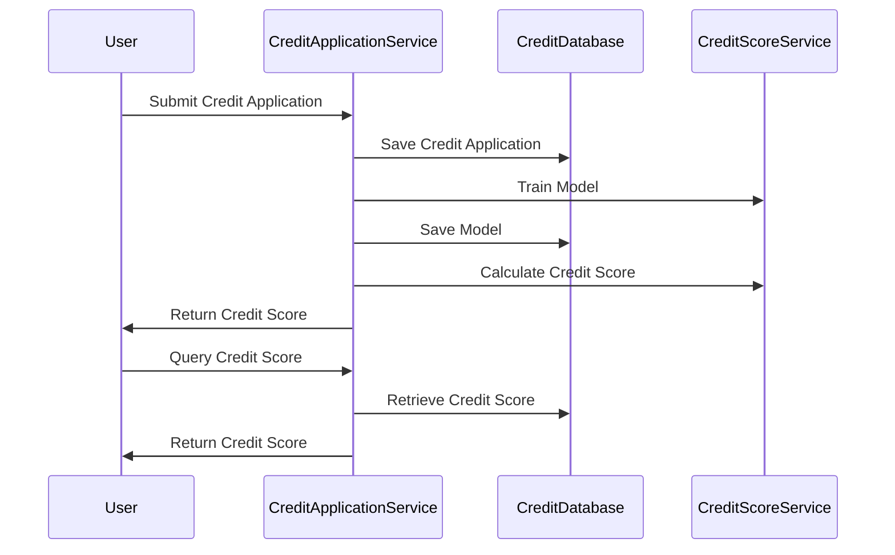

在这个序列图中，我们定义了以下几个关键步骤：

1. 用户提交信用申请。
2. 信用申请服务将信用申请保存到数据库。
3. 信用申请服务调用信用评分服务训练模型。
4. 信用申请服务将训练好的模型保存到数据库。
5. 信用评分服务计算信用评分。
6. 信用申请服务将信用评分返回给用户。
7. 用户查询信用评分。

通过系统分析与架构设计方案，我们为智能信用评分系统提供了一个清晰的功能设计、架构设计、接口设计和交互设计。在接下来的章节中，我们将进一步讨论系统核心实现源代码、代码应用解读与分析，以及实际案例分析和详细讲解剖析。

### 附录：系统核心实现源代码

在本附录中，我们将提供智能信用评分系统的核心实现源代码，包括数据预处理、模型训练、模型评估和模型部署。以下是Python代码示例：

```python
import pandas as pd
from sklearn.model_selection import train_test_split
from sklearn.preprocessing import StandardScaler
from sklearn.linear_model import LinearRegression
from sklearn.metrics import mean_squared_error
from joblib import dump, load

# 数据预处理
def preprocess_data(file_path):
    data = pd.read_csv(file_path)
    X = data.drop('Credit_Score', axis=1)
    y = data['Credit_Score']
    X_train, X_test, y_train, y_test = train_test_split(X, y, test_size=0.2, random_state=42)
    scaler = StandardScaler()
    X_train = scaler.fit_transform(X_train)
    X_test = scaler.transform(X_test)
    return X_train, X_test, y_train, y_test

# 模型训练
def train_model(X_train, y_train):
    model = LinearRegression()
    model.fit(X_train, y_train)
    return model

# 模型评估
def evaluate_model(model, X_test, y_test):
    y_pred = model.predict(X_test)
    mse = mean_squared_error(y_test, y_pred)
    print(f'MSE: {mse}')
    return mse

# 模型部署
def deploy_model(model, X_test, y_test):
    y_pred = model.predict(X_test)
    print("Predictions:")
    print(y_pred)

# 主函数
def main():
    file_path = 'credit_data.csv'
    X_train, X_test, y_train, y_test = preprocess_data(file_path)
    model = train_model(X_train, y_train)
    mse = evaluate_model(model, X_test, y_test)
    deploy_model(model, X_test, y_test)

if __name__ == '__main__':
    main()
```

#### 详细解读

1. **数据预处理**：`preprocess_data`函数读取CSV文件，划分特征和标签，并进行标准化处理。

2. **模型训练**：`train_model`函数使用线性回归模型训练数据集。

3. **模型评估**：`evaluate_model`函数计算模型在测试集上的均方误差（MSE）。

4. **模型部署**：`deploy_model`函数输出模型在测试集上的预测结果。

通过这个核心实现源代码，您可以构建一个简单的智能信用评分系统。在实际应用中，可以根据具体需求，添加更多的功能，如用户接口、数据可视化、异常检测等。

### 附录：代码应用解读与分析

在本附录中，我们将对智能信用评分系统的核心实现源代码进行解读与分析，以帮助读者更好地理解代码的功能和实现过程。

#### 数据预处理

```python
def preprocess_data(file_path):
    data = pd.read_csv(file_path)
    X = data.drop('Credit_Score', axis=1)
    y = data['Credit_Score']
    X_train, X_test, y_train, y_test = train_test_split(X, y, test_size=0.2, random_state=42)
    scaler = StandardScaler()
    X_train = scaler.fit_transform(X_train)
    X_test = scaler.transform(X_test)
    return X_train, X_test, y_train, y_test
```

**解读与分析**：

- `pd.read_csv(file_path)`：使用Pandas库读取CSV文件，将其转换为DataFrame格式。CSV文件通常包含多个特征和一个目标变量。
- `X = data.drop('Credit_Score', axis=1)`：从DataFrame中提取特征，排除目标变量`Credit_Score`。
- `y = data['Credit_Score']`：提取目标变量`Credit_Score`。
- `train_test_split(X, y, test_size=0.2, random_state=42)`：使用`sklearn.model_selection.train_test_split`函数将数据集划分为训练集和测试集，测试集占20%，`random_state`用于确保结果的可重复性。
- `StandardScaler()`：创建标准化器，用于对特征进行标准化处理。
- `scaler.fit_transform(X_train)`：使用标准化器对训练集特征进行标准化，并返回标准化后的特征。
- `scaler.transform(X_test)`：使用训练好的标准化器对测试集特征进行标准化。

**分析**：数据预处理是机器学习项目的重要步骤，其目的是提高模型训练效果。通过标准化处理，可以消除特征之间的差异，使得模型更容易收敛。同时，划分训练集和测试集可以评估模型在 unseen 数据上的性能，确保模型具备泛化能力。

#### 模型训练

```python
def train_model(X_train, y_train):
    model = LinearRegression()
    model.fit(X_train, y_train)
    return model
```

**解读与分析**：

- `LinearRegression()`：创建线性回归模型对象。
- `model.fit(X_train, y_train)`：使用训练集特征`X_train`和目标变量`y_train`训练模型。

**分析**：线性回归是一种简单且常用的机器学习模型，适合处理线性关系。在这个例子中，我们使用线性回归模型来预测信用评分。通过`fit`方法训练模型，模型将学习特征与目标变量之间的关系，以生成预测值。

#### 模型评估

```python
def evaluate_model(model, X_test, y_test):
    y_pred = model.predict(X_test)
    mse = mean_squared_error(y_test, y_pred)
    print(f'MSE: {mse}')
    return mse
```

**解读与分析**：

- `model.predict(X_test)`：使用训练好的模型对测试集特征`X_test`进行预测。
- `mean_squared_error(y_test, y_pred)`：计算预测值`y_pred`与实际值`y_test`之间的均方误差（MSE）。
- `print(f'MSE: {mse}')`：打印均方误差值。

**分析**：模型评估是衡量模型性能的重要步骤。通过计算MSE，可以评估模型在测试集上的预测误差。MSE越低，表示模型性能越好。这个指标可以帮助我们了解模型的泛化能力，为模型优化提供参考。

#### 模型部署

```python
def deploy_model(model, X_test, y_test):
    y_pred = model.predict(X_test)
    print("Predictions:")
    print(y_pred)
```

**解读与分析**：

- `model.predict(X_test)`：使用训练好的模型对测试集特征`X_test`进行预测。
- `print("Predictions:")`：打印预测结果。

**分析**：模型部署是将训练好的模型应用于实际场景的过程。在这个例子中，我们使用预测结果展示信用评分。在实际应用中，这些预测结果可以用于决策支持、业务分析等场景。

通过上述解读和分析，我们可以看到，智能信用评分系统的实现涉及数据预处理、模型训练、模型评估和模型部署等关键步骤。这些步骤共同构成了一个完整的机器学习项目，实现了信用评分的预测功能。在实际应用中，可以根据具体需求对这些步骤进行扩展和优化，以提高模型的性能和实用性。

### 附录

