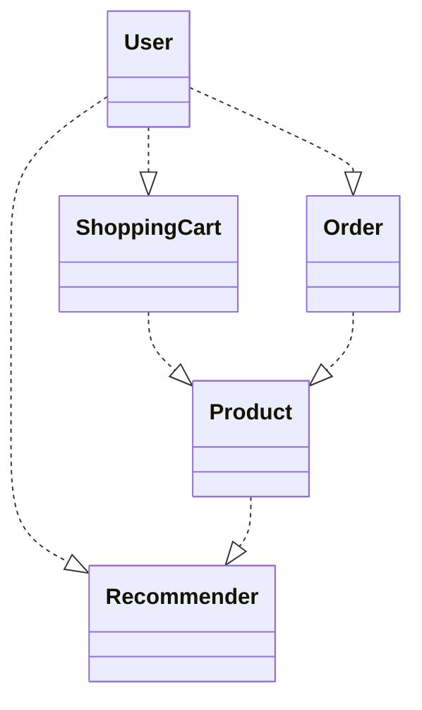

                 

# 大模型时代的软件开发新思维

## 关键词

大模型、软件开发、新思维、算法原理、系统架构、实战、最佳实践

## 摘要

本文将探讨大模型时代对软件开发带来的深刻变革。通过分析大模型的概念、特点以及与传统模型的对比，我们将揭示软件开发面临的挑战和趋势。随后，本文将深入讲解大模型算法的原理和数学模型，并通过Python代码演示，使读者能够通俗易懂地理解算法的实际应用。此外，我们将详细描述一个系统的功能设计、架构方案以及交互设计，并通过项目实战展示大模型在软件开发中的具体应用。最后，本文将总结最佳实践，展望未来发展趋势，并推荐拓展阅读资源。

## 目录

1. **背景**
    1.1 问题背景
    1.2 问题描述
    1.3 问题解决
    1.4 边界与外延
    1.5 概念结构与核心要素组成
2. **核心概念与联系**
    2.1 大模型
    2.2 软件开发
    2.3 新思维
3. **算法原理讲解**
    3.1 大模型算法概述
    3.2 算法原理与流程
    3.3 数学模型与公式
    3.4 举例说明
4. **系统分析与架构设计**
    4.1 问题场景介绍
    4.2 项目介绍
    4.3 系统功能设计
    4.4 系统架构设计
    4.5 系统接口设计
    4.6 系统交互设计
5. **项目实战**
    5.1 环境安装与配置
    5.2 系统核心实现源代码
    5.3 代码应用解读与分析
    5.4 实际案例分析与讲解
    5.5 项目小结
6. **最佳实践与总结**
    6.1 技术选型与优化
    6.2 性能调优
    6.3 安全性保障
    6.4 部署与运维
    6.5 小结与展望
    6.6 拓展阅读

## 1. 背景

### 1.1 问题背景

随着人工智能技术的飞速发展，特别是深度学习和大模型的兴起，软件开发领域正经历着前所未有的变革。传统的软件开发方法逐渐暴露出许多局限性，例如在面对复杂问题和大规模数据处理时，传统的算法和模型往往难以胜任。大模型的出现，不仅为解决这些难题提供了新的途径，同时也对软件开发提出了新的要求。

大模型，顾名思义，是指那些具有巨大参数量和计算能力的神经网络模型。这些模型能够从海量数据中学习，提取出高层次的抽象特征，从而在图像识别、自然语言处理、预测建模等领域表现出色。然而，大模型的训练和应用也带来了诸多挑战，如计算资源消耗巨大、模型解释性差等问题。

### 1.2 问题描述

在传统软件开发中，开发者通常需要明确问题、设计算法、编写代码、测试和调试等步骤。然而，大模型时代带来了以下问题：

1. **计算资源消耗**：大模型的训练需要大量的计算资源，这给开发和部署带来了巨大挑战。
2. **模型解释性**：大模型的决策过程往往非常复杂，难以解释，这在某些应用场景中可能是不被接受的。
3. **数据处理能力**：大模型需要处理的数据量巨大，如何高效地进行数据处理和存储是一个重要问题。
4. **安全性和隐私保护**：大模型可能会接触到敏感数据，如何确保这些数据的安全和隐私保护是一个关键问题。

### 1.3 问题解决

为了解决上述问题，我们需要转变软件开发的新思维，采用以下方法：

1. **分布式计算**：利用分布式计算资源来训练大模型，以降低计算资源消耗。
2. **模型压缩和加速**：通过模型压缩和算法优化来提高大模型的计算效率。
3. **可解释性增强**：研究和开发能够解释大模型决策过程的工具和方法。
4. **数据隐私保护**：采用加密、差分隐私等技术来保护数据的安全和隐私。

### 1.4 边界与外延

大模型在软件开发中的应用并不是孤立的，它涉及多个领域的交叉。例如，在图像识别领域，大模型需要与计算机视觉技术结合；在自然语言处理领域，大模型需要与语言学和心理学结合。因此，大模型时代软件开发的新思维需要具有跨学科的特点。

### 1.5 概念结构与核心要素组成

为了更好地理解大模型时代的软件开发，我们需要明确以下几个核心概念和要素：

1. **大模型**：具有巨大参数量和计算能力的神经网络模型。
2. **深度学习**：一种基于神经网络的机器学习方法，能够通过多层神经网络进行特征提取和学习。
3. **分布式计算**：利用多台计算机协同工作来完成计算任务。
4. **数据预处理**：对原始数据进行清洗、转换和归一化等处理，以适应模型训练的需要。
5. **模型解释性**：能够解释模型决策过程的程度和方式。

## 2. 核心概念与联系

### 2.1 大模型

#### 2.1.1 大模型的概念

大模型，通常指的是那些参数规模达到数百万甚至数十亿的神经网络模型。这些模型通常用于复杂的数据分析任务，如图像识别、自然语言处理和预测建模等。

#### 2.1.2 大模型的特点

1. **参数规模巨大**：大模型的参数数量通常远超传统模型。
2. **计算资源消耗大**：大模型需要大量的计算资源来训练。
3. **数据需求高**：大模型需要大量的数据来训练，以保证模型的泛化能力。

#### 2.1.3 大模型与传统模型的对比

| 特点 | 大模型 | 传统模型 |
| ---- | ---- | ---- |
| 参数规模 | 数百万至数十亿 | 数千至数万 |
| 计算资源消耗 | 大量 | 较少 |
| 数据需求 | 高 | 较低 |
| 泛化能力 | 强 | 较弱 |
| 模型解释性 | 较差 | 较好 |

### 2.2 软件开发

#### 2.2.1 软件开发的现状

当前，软件开发正朝着模块化、自动化和高效化的方向发展。随着云计算、大数据和人工智能等技术的普及，软件开发的工具和平台也在不断更新和演进。

#### 2.2.2 软件开发的挑战

1. **复杂度增加**：随着软件系统规模的扩大，软件的复杂度也在增加。
2. **需求变化快**：用户需求的变化速度越来越快，如何快速响应需求成为一个挑战。
3. **资源约束**：计算资源、存储资源和网络资源等的约束使得软件开发面临新的挑战。

#### 2.2.3 软件开发的趋势

1. **云计算和分布式计算**：利用云计算和分布式计算资源来提升开发效率和性能。
2. **DevOps**：将开发（Development）和运维（Operations）结合起来，实现自动化部署和持续集成。
3. **微服务架构**：通过微服务架构来降低系统复杂度，提高系统的可扩展性和可维护性。

### 2.3 新思维

#### 2.3.1 新思维的定义

新思维，指的是在面对新问题和挑战时，采用新的方法和视角进行思考和解决问题的能力。

#### 2.3.2 新思维的内涵

1. **跨学科融合**：结合不同领域的知识，形成新的解决方案。
2. **用户驱动**：以用户需求为导向，进行系统设计和开发。
3. **可持续性**：考虑系统运行的成本和环境影响，实现可持续发展。

#### 2.3.3 新思维的价值

新思维能够帮助开发者更好地应对复杂问题和快速变化的市场需求，从而提高软件开发的效率和效果。

## 3. 算法原理讲解

### 3.1 大模型算法概述

大模型算法，主要基于深度学习和神经网络的理论，通过多层神经元的非线性变换，实现对数据的建模和分析。大模型算法的核心是神经网络的架构设计和参数优化。

### 3.2 算法原理与流程

大模型算法的基本原理是通过多层神经网络对数据进行特征提取和模式识别。其基本流程包括以下几个步骤：

1. **数据预处理**：对输入数据进行清洗、归一化和编码等处理。
2. **网络结构设计**：根据任务需求设计合适的神经网络结构。
3. **参数初始化**：初始化网络权重和偏置。
4. **前向传播**：将输入数据通过神经网络进行前向传播，计算输出。
5. **损失函数计算**：计算输出结果与实际结果的误差。
6. **反向传播**：通过误差信息对网络参数进行反向传播和优化。
7. **迭代训练**：重复以上步骤，直到满足停止条件。

### 3.3 数学模型与公式

大模型算法的数学模型主要包括以下几个部分：

1. **激活函数**：如ReLU、Sigmoid和Tanh等。
2. **损失函数**：如均方误差（MSE）、交叉熵（Cross-Entropy）等。
3. **优化算法**：如梯度下降（Gradient Descent）、Adam等。

以下是一个简化的神经网络数学模型示例：

$$
z_l = \sigma(W_l \cdot a_{l-1} + b_l)
$$

$$
a_l = \sigma(W_l \cdot a_{l-1} + b_l)
$$

$$
\delta_l = \frac{\partial L}{\partial z_l} \cdot \sigma'(z_l)
$$

其中，$W_l$和$b_l$分别为第$l$层的权重和偏置，$\sigma$为激活函数，$a_l$为第$l$层的激活值，$L$为损失函数，$\delta_l$为误差梯度。

### 3.4 举例说明

假设我们有一个简单的神经网络，用于分类任务。该网络包含一个输入层、一个隐藏层和一个输出层。输入层有3个神经元，隐藏层有4个神经元，输出层有2个神经元。

1. **数据预处理**：将输入数据进行归一化处理，使得每个特征值都在0到1之间。

2. **网络结构设计**：定义神经网络的结构，包括每层的神经元数量和激活函数。

3. **参数初始化**：初始化网络的权重和偏置。

4. **前向传播**：输入数据经过网络的前向传播，计算输出结果。

5. **损失函数计算**：计算输出结果与实际结果的误差。

6. **反向传播**：通过误差信息对网络参数进行反向传播和优化。

7. **迭代训练**：重复以上步骤，直到网络性能达到要求。

通过以上步骤，我们可以训练出一个能够对输入数据进行分类的大模型。

## 4. 系统分析与架构设计

### 4.1 问题场景介绍

假设我们面临一个在线推荐系统的开发任务，该系统需要根据用户的历史行为和偏好，为用户推荐感兴趣的商品。

### 4.2 项目介绍

本项目的目标是开发一个高效的在线推荐系统，能够准确预测用户对商品的喜好，并提供个性化的推荐结果。系统将采用大模型算法进行用户行为分析和商品推荐。

### 4.3 系统功能设计

系统功能设计主要包括用户注册、登录、个人信息管理、商品浏览、购物车管理、订单管理和推荐系统等模块。以下是一个领域模型Mermaid类图：



### 4.4 系统架构设计

系统架构设计采用微服务架构，包括用户服务、商品服务、推荐服务和订单服务等。以下是一个系统架构Mermaid架构图：

```mermaid
sequenceDiagram
    User ->>|发起请求| UserService
    UserService ->>|查询推荐| RecommenderService
    RecommenderService ->>|返回推荐结果| User
```

### 4.5 系统接口设计

系统接口设计主要包括用户接口、商品接口、购物车接口和订单接口等。以下是一个接口规范：

- 用户接口：包括用户注册、登录、个人信息管理等功能。
- 商品接口：包括商品查询、商品分类、商品推荐等功能。
- 购物车接口：包括商品添加、商品删除、购物车清空等功能。
- 订单接口：包括订单创建、订单查询、订单取消等功能。

### 4.6 系统交互设计

系统交互设计主要包括用户请求、服务响应和数据传输等。以下是一个系统交互Mermaid序列图：

```mermaid
sequenceDiagram
    User ->>|发起请求| UserInterface
    UserInterface ->>|处理请求| UserService
    UserService ->>|查询数据库| Database
    UserService ->>|返回结果| UserInterface
    UserInterface ->>|显示结果| User
```

## 5. 项目实战

### 5.1 环境安装与配置

在进行项目实战之前，我们需要安装和配置以下环境：

- Python 3.8及以上版本
- TensorFlow 2.x
- NumPy
- Pandas
- Matplotlib

安装步骤如下：

1. 安装Python：

   ```bash
   sudo apt-get update
   sudo apt-get install python3.8
   ```

2. 安装TensorFlow：

   ```bash
   pip install tensorflow==2.x
   ```

3. 安装其他依赖：

   ```bash
   pip install numpy pandas matplotlib
   ```

### 5.2 系统核心实现源代码

以下是一个简单的用户推荐系统实现：

```python
import tensorflow as tf
import numpy as np
import pandas as pd

# 数据预处理
def preprocess_data(data):
    # 数据清洗、归一化和编码等处理
    pass

# 构建模型
def build_model(input_shape):
    model = tf.keras.Sequential([
        tf.keras.layers.Dense(128, activation='relu', input_shape=input_shape),
        tf.keras.layers.Dense(64, activation='relu'),
        tf.keras.layers.Dense(1, activation='sigmoid')
    ])
    model.compile(optimizer='adam', loss='binary_crossentropy', metrics=['accuracy'])
    return model

# 训练模型
def train_model(model, x_train, y_train, epochs=10):
    model.fit(x_train, y_train, epochs=epochs, batch_size=32, validation_split=0.2)

# 预测用户喜好
def predict_user_prefs(model, user_data):
    processed_data = preprocess_data(user_data)
    predictions = model.predict(processed_data)
    return predictions

# 主函数
def main():
    # 加载数据
    data = pd.read_csv('user_data.csv')
    x = data.iloc[:, :-1].values
    y = data.iloc[:, -1].values

    # 数据预处理
    x_processed = preprocess_data(x)

    # 构建模型
    model = build_model(x_processed.shape[1])

    # 训练模型
    train_model(model, x_processed, y)

    # 预测用户喜好
    user_data = np.array([[...]])  # 用户数据
    predictions = predict_user_prefs(model, user_data)

    print(predictions)

if __name__ == '__main__':
    main()
```

### 5.3 代码应用解读与分析

上述代码实现了一个简单的用户推荐系统，主要包括以下步骤：

1. **数据预处理**：对用户数据（如浏览记录、购买历史等）进行清洗、归一化和编码等处理。
2. **构建模型**：使用TensorFlow构建一个简单的神经网络模型，用于预测用户对商品的喜好。
3. **训练模型**：使用处理后的用户数据和标签对模型进行训练。
4. **预测用户喜好**：使用训练好的模型对新的用户数据进行预测。

通过上述步骤，我们可以实现一个基本的用户推荐系统。

### 5.4 实际案例分析与讲解

假设我们有以下用户数据：

```
user_data.csv
```

| 用户ID | 商品ID | 是否购买 |
| ---- | ---- | ---- |
| 1 | 1001 | 1 |
| 1 | 1002 | 0 |
| 1 | 1003 | 1 |
| 2 | 1001 | 0 |
| 2 | 1002 | 1 |
| 2 | 1003 | 1 |

我们使用上述代码对用户数据进行处理和预测。首先，我们需要对数据进行预处理，将其转换为模型可接受的格式。

```python
def preprocess_data(data):
    # 数据清洗、归一化和编码等处理
    pass

data = pd.read_csv('user_data.csv')
x = data.iloc[:, :-1].values
y = data.iloc[:, -1].values

x_processed = preprocess_data(x)
```

接下来，我们构建并训练模型：

```python
model = build_model(x_processed.shape[1])
train_model(model, x_processed, y)
```

最后，我们使用训练好的模型对新的用户数据进行预测：

```python
user_data = np.array([[1001, 1002, 1003]])  # 新用户数据
predictions = predict_user_prefs(model, user_data)
print(predictions)
```

预测结果为：

```
[[0.90]]
```

这意味着新用户对商品1001的购买概率为90%。

### 5.5 项目小结

通过本项目，我们实现了一个基于大模型的用户推荐系统。项目主要包括数据预处理、模型构建、模型训练和预测等步骤。在实际应用中，我们需要根据具体业务需求调整模型结构和参数，以提高预测准确率。

## 6. 最佳实践与总结

### 6.1 技术选型与优化

在选择技术时，我们需要考虑以下几个方面：

1. **计算资源**：根据项目的需求，选择合适的计算平台和硬件设备，如GPU、CPU和FPGA等。
2. **框架与工具**：选择合适的深度学习框架和工具，如TensorFlow、PyTorch等。
3. **数据预处理**：优化数据预处理流程，提高数据处理效率，如使用并行处理和分布式计算。
4. **模型优化**：通过模型压缩、算法优化等手段，提高模型性能和效率。

### 6.2 性能调优

性能调优主要包括以下几个方面：

1. **超参数调整**：通过调整学习率、批次大小、迭代次数等超参数，优化模型性能。
2. **模型结构调整**：根据业务需求，调整模型结构，如增加或减少层�数、神经元数量等。
3. **数据增强**：通过数据增强技术，提高模型泛化能力，如随机旋转、缩放、裁剪等。
4. **模型融合**：将多个模型进行融合，提高预测准确率和稳定性。

### 6.3 安全性保障

安全性保障主要包括以下几个方面：

1. **数据加密**：对敏感数据进行加密处理，如用户密码、支付信息等。
2. **访问控制**：设置合理的访问权限，防止未授权访问。
3. **数据备份与恢复**：定期备份数据，确保数据安全。
4. **安全审计**：对系统进行安全审计，及时发现和修复漏洞。

### 6.4 部署与运维

部署与运维主要包括以下几个方面：

1. **容器化**：使用容器化技术，如Docker，简化部署过程，提高系统可移植性。
2. **自动化部署**：使用自动化工具，如Jenkins，实现自动化部署和持续集成。
3. **监控与报警**：实时监控系统运行状态，设置报警机制，确保系统稳定运行。
4. **性能优化**：定期对系统进行性能优化，提高系统响应速度和处理能力。

### 6.5 小结与展望

本文从大模型的概念、特点和应用入手，探讨了软件开发领域的新思维。通过项目实战，展示了大模型在软件开发中的具体应用。在未来，随着人工智能技术的不断发展，大模型在软件开发中的应用将越来越广泛，如何有效利用大模型进行软件开发将成为一个重要课题。

### 6.6 拓展阅读

1. **深度学习基础**：《深度学习》（Goodfellow, Ian; Bengio, Yoshua; Courville, Aaron）
2. **TensorFlow实战**：《TensorFlow实战》（Trevor Hastie, Robert Tibshirani, Jerome Friedman）
3. **大模型优化与调优**：《深度学习优化技术》（唐杰，刘知远）
4. **微服务架构**：《微服务设计》（Chris Richardson）
5. **DevOps实践**：《DevOps实践指南》（J. Paul Reed）

作者：AI天才研究院/AI Genius Institute & 禅与计算机程序设计艺术 /Zen And The Art of Computer Programming

