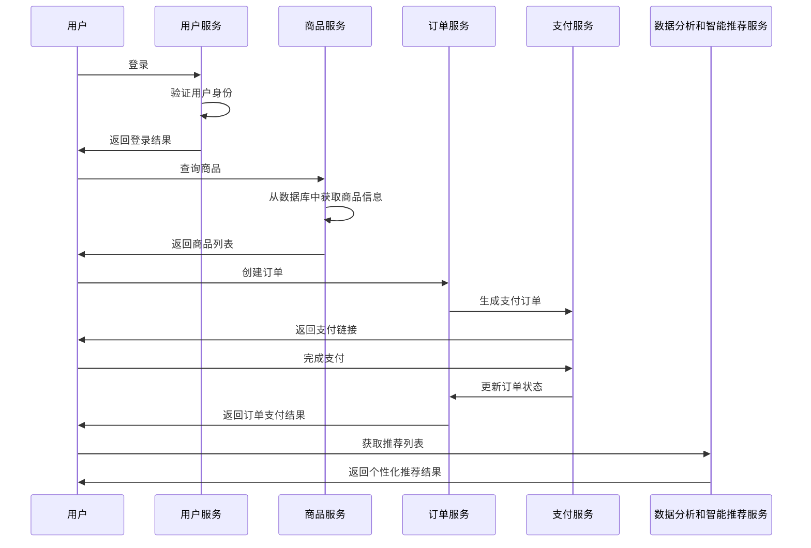
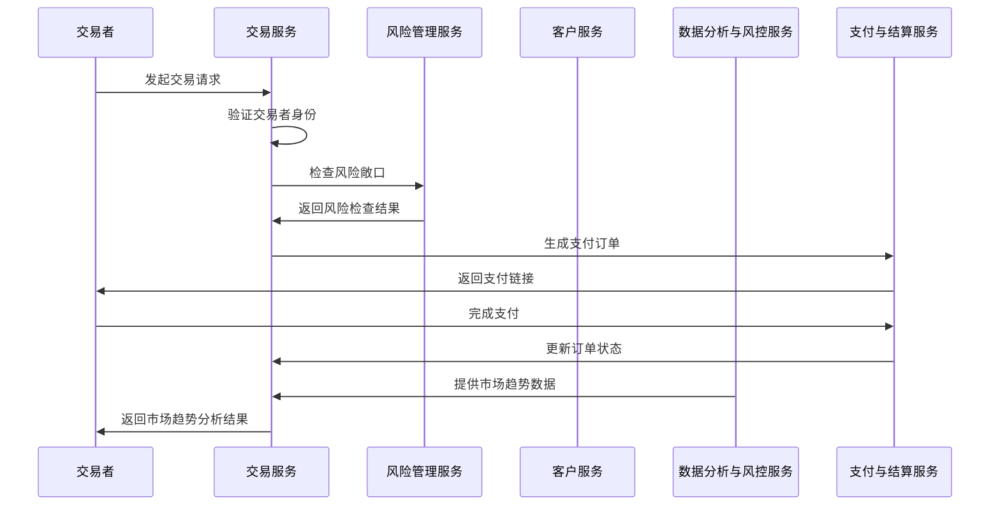
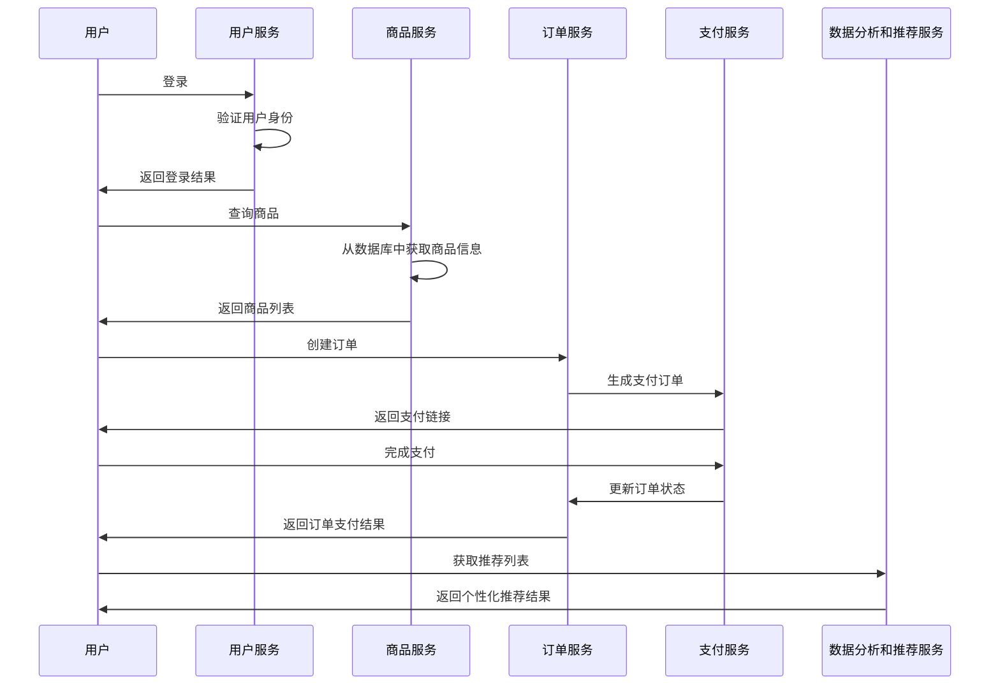

                 

### 文章标题

## 大模型时代的软件架构模式创新

### 关键词

- 大模型
- 软件架构
- 微服务架构
- 创新架构模式
- 云原生架构

### 摘要

本文深入探讨了在大模型时代下，软件架构模式的创新与发展。首先，我们回顾了软件架构模式的演进历史，从传统的单体架构到现代的微服务架构。接着，我们介绍了大模型的基本原理及其在软件架构中的应用，揭示了其带来的机遇与挑战。随后，本文重点分析了创新架构模式的概念、类型及其设计原则，并通过实际案例分析，展示了这些创新架构模式在现实中的应用。最后，文章展望了未来大模型与软件架构的发展趋势，提出了创新与挑战的应对策略。通过本文的阅读，读者将对大模型时代的软件架构模式创新有更深刻的理解。

---

## 目录大纲

### 第一部分：背景与概述

- **第1章 问题背景与核心概念**
  - 1.1 软件架构模式的发展历程
  - 1.2 大模型的定义与特点
  - 1.3 软件架构模式创新的意义
  - 1.4 背景与边界

### 第二部分：大模型与软件架构

- **第2章 大模型的原理与架构**
  - 2.1 大模型的原理
  - 2.2 大模型的架构设计
  - 2.3 大模型在软件架构中的应用

### 第三部分：创新架构模式

- **第3章 创新架构模式概述**
  - 3.1 创新架构模式的概念
  - 3.2 创新架构模式的主要类型
  - 3.3 创新架构模式的重要性

- **第4章 创新架构模式设计**
  - 4.1 创新架构模式的设计原则
  - 4.2 创新架构模式的设计流程

- **第5章 创新架构模式的案例分析**
  - 5.1 案例一：某电商平台的架构模式创新
  - 5.2 案例二：某金融科技公司的架构模式创新

### 第四部分：实践与展望

- **第6章 实践技巧与最佳实践**
  - 6.1 实践技巧
  - 6.2 最佳实践

- **第7章 未来展望**
  - 7.1 大模型与软件架构的发展趋势
  - 7.2 创新与挑战

---

### 第一部分：背景与概述

#### 第1章 问题背景与核心概念

### 1.1 软件架构模式的发展历程

软件架构的发展经历了多个阶段，从传统的单体架构（Monolithic Architecture）到现代的微服务架构（Microservices Architecture）。传统单体架构的特点是将所有功能集中在一个单一的系统中，这种架构模式在系统规模较小时，具有一定的优势。然而，随着系统的复杂度和规模的增加，单体架构面临着诸多挑战，如模块之间的耦合度高、系统维护难度大、扩展性差等。

为了解决这些问题，软件架构领域逐渐引入了微服务架构。微服务架构将系统划分为多个独立的服务模块，每个服务模块负责一个特定的业务功能，并通过轻量级的通信协议进行交互。这种架构模式显著提高了系统的扩展性和可维护性，但同时也引入了新的挑战，如服务之间的通信复杂性、服务拆分与合并的策略等。

在大模型时代，这些传统架构模式面临着新的机遇与挑战。大模型（Large Models）如深度学习模型、自然语言处理模型等，具有处理海量数据、复杂关系和高维度信息的能力。这些模型的应用不仅改变了传统软件系统的设计和开发方式，也对软件架构提出了新的需求。

### 1.1.1 从传统架构到微服务架构的演进

传统架构通常采用单体架构模式，其特点是将所有业务功能封装在一个单一的系统中。这种架构模式在系统规模较小时，可以快速开发和部署，但一旦系统规模扩大，其弊端逐渐显现。主要问题包括：

1. **高耦合度**：由于所有功能集中在一个系统中，模块之间的耦合度非常高，任何模块的变更都可能影响其他模块。
2. **维护难度大**：随着系统的复杂度增加，维护和管理的难度也随之增大。
3. **扩展性差**：在系统扩展时，往往需要复制整个系统，这不仅增加了维护成本，还可能导致性能下降。

为了解决这些问题，软件架构领域引入了微服务架构。微服务架构将系统划分为多个独立的服务模块，每个服务模块负责一个特定的业务功能，并通过轻量级的通信协议（如RESTful API、消息队列等）进行交互。这种架构模式的主要特点包括：

1. **低耦合度**：每个服务模块相对独立，模块之间的耦合度较低，模块内部的变更对其他模块的影响较小。
2. **可扩展性**：系统可以根据需求独立扩展某个服务模块，而不需要修改其他模块。
3. **可维护性**：每个服务模块相对独立，便于开发和测试，降低了维护成本。
4. **高可用性**：服务模块的故障不会导致整个系统的故障，可以通过服务拆分和冗余部署提高系统的可靠性。

微服务架构的引入，为应对大模型时代带来的挑战提供了新的思路。通过将大模型的应用功能分散到不同的服务模块中，可以更好地利用分布式系统的优势，提高系统的可扩展性和可靠性。

### 1.1.2 传统架构的局限性与挑战

传统架构模式，尤其是单体架构，存在以下局限性和挑战：

1. **高耦合度**：由于所有功能模块都集中在一个系统中，模块之间的耦合度非常高。这种高耦合度会导致以下问题：
   - 模块之间的依赖关系复杂，任何一个模块的变更都可能影响其他模块。
   - 系统的维护成本高，因为修改一个模块可能需要重新部署整个系统。

2. **扩展性差**：在传统架构模式下，系统扩展通常需要复制整个系统。这种扩展方式不仅增加了维护成本，还可能导致性能下降。主要问题包括：
   - 随着用户数量的增加，系统的负载会逐渐增大，可能导致系统性能下降。
   - 系统的扩展需要额外的硬件资源和维护人员，增加了成本。

3. **可维护性差**：在传统架构模式下，系统的维护难度较大。主要问题包括：
   - 系统的复杂性高，修改一个模块可能需要理解和修改多个模块。
   - 系统的变更需要经过严格的测试，以确保不会影响其他模块。

4. **高故障风险**：在传统架构模式下，系统的故障风险较高。主要问题包括：
   - 一个模块的故障可能导致整个系统的故障，因为模块之间的耦合度较高。
   - 系统的故障恢复速度慢，需要重新启动整个系统。

这些局限性和挑战使得传统架构在大模型时代难以满足需求。为了应对这些挑战，软件架构领域逐渐引入了微服务架构等新型架构模式。

### 1.1.3 大模型时代的机遇与挑战

在大模型时代，软件架构面临着新的机遇与挑战。大模型，如深度学习模型、自然语言处理模型等，具有处理海量数据、复杂关系和高维度信息的能力，这为软件架构的创新提供了新的方向。以下是大模型时代带来的机遇与挑战：

#### 1.1.3.1 机遇

1. **数据驱动的发展**：大模型能够处理海量数据，从而实现更精准的数据分析和决策。这为软件架构提供了数据驱动的机会，使得系统可以更好地适应业务需求的变化。

2. **智能化的服务**：大模型的应用可以带来智能化服务，如智能客服、智能推荐等。这为软件架构的创新提供了新的功能模块，提高了系统的用户体验。

3. **高效的资源利用**：大模型的应用可以通过分布式计算和并行处理，提高系统的资源利用率，降低运行成本。

4. **创新的业务模式**：大模型的应用可以创造新的业务模式，如基于数据的精准营销、个性化的用户体验等。

#### 1.1.3.2 挑战

1. **系统复杂性增加**：大模型的应用通常涉及复杂的算法和大量的数据，这增加了系统的复杂性，对软件架构的设计和维护提出了更高的要求。

2. **数据安全与隐私**：大模型的应用需要处理海量数据，这些数据可能包含敏感信息。如何保障数据的安全和隐私，成为软件架构设计的一个重要挑战。

3. **性能优化**：大模型的应用通常需要高效的计算和存储资源。如何优化系统的性能，以满足大模型的应用需求，成为软件架构设计的一个关键问题。

4. **可维护性和可扩展性**：随着大模型的应用，系统的规模和复杂度不断增加，如何保证系统的可维护性和可扩展性，成为软件架构设计的一个重要挑战。

### 1.2 软件架构模式创新的核心概念

#### 1.2.1 大模型的定义与特点

大模型通常指的是具有大规模参数的机器学习模型，如深度神经网络、强化学习模型等。这些模型具有以下特点：

1. **大规模参数**：大模型的参数数量通常在百万、亿甚至万亿级别，这使得模型可以学习到复杂的特征和关系。

2. **高计算需求**：大模型的应用通常需要大量的计算资源，包括CPU、GPU等硬件资源。

3. **数据驱动**：大模型的学习过程依赖于大量的数据，数据的质量和数量直接影响模型的性能。

4. **自动调整**：大模型可以通过自动调整参数来优化性能，这在一定程度上减少了人工干预的需求。

5. **高泛化能力**：大模型具有较好的泛化能力，可以处理多种类型的任务，如图像识别、自然语言处理等。

#### 1.2.2 大模型在软件架构中的应用

大模型在软件架构中的应用主要体现在以下几个方面：

1. **功能模块化**：将大模型的功能模块化，使其能够与其他服务模块独立部署和扩展。

2. **分布式计算**：利用分布式计算技术，将大模型的应用分散到多个节点上，以提高系统的性能和可扩展性。

3. **数据存储与处理**：设计高效的数据存储和处理方案，以满足大模型的数据需求。

4. **安全性保障**：在大模型的应用中，需要特别关注数据的安全和隐私保护。

5. **实时性优化**：针对大模型的实时应用，需要优化系统的响应时间和延迟。

#### 1.2.3 软件架构模式创新的意义

软件架构模式的创新在大模型时代具有重要意义，主要体现在以下几个方面：

1. **提升系统性能**：通过创新架构模式，可以优化系统的性能，提高处理大模型应用的能力。

2. **增强系统可维护性**：创新架构模式可以降低系统的复杂性，提高系统的可维护性。

3. **提高系统可扩展性**：创新架构模式可以支持系统的灵活扩展，适应大模型应用的需求变化。

4. **降低开发成本**：通过创新架构模式，可以减少系统的开发和维护成本。

5. **促进业务创新**：创新架构模式可以为业务创新提供技术支持，推动业务的快速发展。

### 1.3 背景与边界

#### 1.3.1 问题的背景

在当今的数字化时代，数据已经成为企业的核心资产。随着大数据和人工智能技术的不断发展，如何高效地处理和分析海量数据，成为企业面临的重要问题。传统的软件架构模式在处理这些复杂任务时，往往面临着系统复杂性高、可维护性差、扩展性不足等挑战。因此，软件架构模式的创新变得迫在眉睫。

#### 1.3.2 问题的描述

在大模型时代，软件架构需要面对以下主要问题：

1. **系统复杂性**：大模型的应用通常涉及复杂的算法和大量的数据处理，这增加了系统的复杂性。
2. **数据安全性**：大模型的应用需要处理大量的敏感数据，如何保障数据的安全和隐私成为一大挑战。
3. **性能优化**：大模型的应用需要高效的计算和存储资源，如何优化系统的性能是一个关键问题。
4. **可维护性与可扩展性**：随着大模型应用的不断深入，系统的规模和复杂度不断增加，如何保证系统的可维护性和可扩展性成为重要议题。

#### 1.3.3 问题解决的思路

为了解决上述问题，可以从以下几个方面入手：

1. **创新架构模式**：通过引入新的架构模式，如微服务架构、容器化架构等，降低系统的复杂性，提高可维护性和可扩展性。
2. **分布式计算**：利用分布式计算技术，将大模型的应用分散到多个节点上，提高系统的性能和可扩展性。
3. **数据安全与隐私保护**：采用加密、访问控制等技术，保障数据的安全和隐私。
4. **性能优化**：通过优化算法、缓存机制等手段，提高系统的性能。
5. **自动化与智能化**：引入自动化和智能化工具，减少人工干预，提高系统的效率和可靠性。

#### 1.3.4 边界与外延

在探讨大模型时代的软件架构模式创新时，需要注意以下几个边界与外延：

1. **技术边界**：大模型的算法和架构设计需要基于成熟的技术，如深度学习、分布式系统等。
2. **业务边界**：软件架构的创新需要与业务需求紧密结合，以解决实际业务问题。
3. **数据边界**：数据的安全性和隐私保护是软件架构创新的重要方面，需要充分考虑数据来源、传输和存储等环节。
4. **运维边界**：软件架构的创新还需要考虑运维的便利性，如部署、监控、故障恢复等。

#### 1.3.5 概念结构与核心要素组成

大模型时代的软件架构创新涉及多个核心概念和要素，包括：

1. **大模型**：具有大规模参数的机器学习模型，如深度神经网络、强化学习模型等。
2. **微服务架构**：将系统划分为多个独立的服务模块，每个模块负责一个特定的业务功能。
3. **分布式系统**：利用多个节点协同工作，提高系统的性能和可扩展性。
4. **容器化技术**：通过容器技术，实现服务的轻量级部署和管理。
5. **自动化与智能化工具**：利用自动化和智能化工具，提高系统的效率和可靠性。

这些概念和要素共同构成了大模型时代软件架构创新的核心结构。

### 第一部分：背景与概述

#### 第1章 问题背景与核心概念

在当今快速发展的信息技术时代，软件架构作为软件系统的基石，其设计和实施直接影响到系统的性能、可维护性和可扩展性。随着大数据和人工智能技术的崛起，尤其是大模型的广泛应用，软件架构面临着前所未有的挑战和机遇。本章节将深入探讨大模型时代下软件架构模式创新的背景、核心概念以及其发展历程。

#### 1.1 软件架构模式的发展历程

软件架构模式的发展历程可以追溯到计算机发展的早期阶段。早期的软件架构模式主要是基于单机架构，所有功能都集中在一个系统中，这种单体架构（Monolithic Architecture）在系统规模较小时具有简单和高效的优点，但随着系统复杂性的增加，其局限性也逐渐显现。为了解决这些问题，软件架构领域引入了分层架构（Layered Architecture），通过将系统功能分层，提高了模块的独立性和可维护性。

随着互联网的兴起，分布式系统架构（Distributed System Architecture）逐渐成为主流。分布式系统通过多个节点协同工作，实现了系统的高可用性和可扩展性。微服务架构（Microservices Architecture）作为分布式系统架构的一种具体实现，将系统划分为多个独立的服务模块，每个模块负责一个特定的业务功能，通过轻量级的通信协议进行交互。微服务架构的引入，解决了单体架构在复杂度、可维护性和扩展性方面的诸多问题，成为现代软件架构设计的重要方向。

然而，随着大模型的广泛应用，传统的微服务架构也面临新的挑战。大模型通常涉及复杂的算法和大量的数据处理，其计算和存储需求远远超过了传统微服务架构的能力范围。为了应对这些挑战，软件架构领域开始探索新的模式，如基于容器化和微服务的混合架构（Hybrid Architecture），以及利用分布式计算和并行处理的云原生架构（Cloud-Native Architecture）。这些新的架构模式旨在提高系统的性能、可扩展性和可维护性，以更好地支持大模型的应用。

#### 1.1.1 从传统架构到微服务架构的演进

传统架构，尤其是单体架构，在系统规模较小时具有快速开发和部署的优势。但随着系统复杂度的增加，单体架构的缺点也逐渐显现。首先，单体架构的耦合度非常高，系统中的各个功能模块紧密相连，任何模块的变更都可能影响整个系统。其次，单体架构的可维护性较差，随着系统规模的扩大，维护和管理的难度也随之增加。此外，单体架构的扩展性也较差，系统扩展通常需要复制整个系统，这不仅增加了维护成本，还可能导致性能下降。

为了解决这些问题，软件架构领域引入了微服务架构。微服务架构将系统功能分解为多个独立的服务模块，每个模块负责一个特定的业务功能，并通过轻量级的通信协议（如RESTful API、消息队列等）进行交互。这种架构模式具有以下优点：

1. **低耦合度**：每个服务模块相对独立，模块之间的耦合度较低，模块内部的变更对其他模块的影响较小。
2. **高可维护性**：每个服务模块相对独立，便于开发和测试，降低了维护成本。
3. **高扩展性**：系统可以根据需求独立扩展某个服务模块，而不需要修改其他模块。

微服务架构的引入，为应对大模型时代带来的挑战提供了新的思路。通过将大模型的应用功能分散到不同的服务模块中，可以更好地利用分布式系统的优势，提高系统的可扩展性和可靠性。

#### 1.1.2 传统架构的局限性与挑战

传统架构模式，尤其是单体架构，在大模型时代面临以下局限性和挑战：

1. **高耦合度**：由于所有功能模块都集中在一个系统中，模块之间的耦合度非常高。这种高耦合度会导致以下问题：
   - 模块之间的依赖关系复杂，任何一个模块的变更都可能影响其他模块。
   - 系统的维护成本高，因为修改一个模块可能需要重新部署整个系统。

2. **扩展性差**：在传统架构模式下，系统扩展通常需要复制整个系统。这种扩展方式不仅增加了维护成本，还可能导致性能下降。主要问题包括：
   - 随着用户数量的增加，系统的负载会逐渐增大，可能导致系统性能下降。
   - 系统的扩展需要额外的硬件资源和维护人员，增加了成本。

3. **可维护性差**：在传统架构模式下，系统的维护难度较大。主要问题包括：
   - 系统的复杂性高，修改一个模块可能需要理解和修改多个模块。
   - 系统的变更需要经过严格的测试，以确保不会影响其他模块。

4. **高故障风险**：在传统架构模式下，系统的故障风险较高。主要问题包括：
   - 一个模块的故障可能导致整个系统的故障，因为模块之间的耦合度较高。
   - 系统的故障恢复速度慢，需要重新启动整个系统。

这些局限性和挑战使得传统架构在大模型时代难以满足需求。为了应对这些挑战，软件架构领域逐渐引入了微服务架构等新型架构模式。

#### 1.1.3 大模型时代的机遇与挑战

在大模型时代，软件架构面临着新的机遇与挑战。大模型，如深度学习模型、自然语言处理模型等，具有处理海量数据、复杂关系和高维度信息的能力，这为软件架构的创新提供了新的方向。以下是大模型时代带来的机遇与挑战：

#### 1.1.3.1 机遇

1. **数据驱动的发展**：大模型能够处理海量数据，从而实现更精准的数据分析和决策。这为软件架构提供了数据驱动的机会，使得系统可以更好地适应业务需求的变化。

2. **智能化的服务**：大模型的应用可以带来智能化服务，如智能客服、智能推荐等。这为软件架构的创新提供了新的功能模块，提高了系统的用户体验。

3. **高效的资源利用**：大模型的应用可以通过分布式计算和并行处理，提高系统的资源利用率，降低运行成本。

4. **创新的业务模式**：大模型的应用可以创造新的业务模式，如基于数据的精准营销、个性化的用户体验等。

#### 1.1.3.2 挑战

1. **系统复杂性增加**：大模型的应用通常涉及复杂的算法和大量的数据处理，这增加了系统的复杂性，对软件架构的设计和维护提出了更高的要求。

2. **数据安全与隐私**：大模型的应用需要处理海量数据，这些数据可能包含敏感信息。如何保障数据的安全和隐私成为软件架构设计的一个重要挑战。

3. **性能优化**：大模型的应用通常需要高效的计算和存储资源，如何优化系统的性能，以满足大模型的应用需求，成为软件架构设计的一个关键问题。

4. **可维护性和可扩展性**：随着大模型应用的不断深入，系统的规模和复杂度不断增加，如何保证系统的可维护性和可扩展性，成为软件架构设计的一个重要挑战。

### 1.2 软件架构模式创新的核心概念

#### 1.2.1 大模型的定义与特点

大模型通常指的是具有大规模参数的机器学习模型，如深度神经网络、强化学习模型等。这些模型具有以下特点：

1. **大规模参数**：大模型的参数数量通常在百万、亿甚至万亿级别，这使得模型可以学习到复杂的特征和关系。

2. **高计算需求**：大模型的应用通常需要大量的计算资源，包括CPU、GPU等硬件资源。

3. **数据驱动**：大模型的学习过程依赖于大量的数据，数据的质量和数量直接影响模型的性能。

4. **自动调整**：大模型可以通过自动调整参数来优化性能，这在一定程度上减少了人工干预的需求。

5. **高泛化能力**：大模型具有较好的泛化能力，可以处理多种类型的任务，如图像识别、自然语言处理等。

#### 1.2.2 大模型在软件架构中的应用

大模型在软件架构中的应用主要体现在以下几个方面：

1. **功能模块化**：将大模型的功能模块化，使其能够与其他服务模块独立部署和扩展。

2. **分布式计算**：利用分布式计算技术，将大模型的应用分散到多个节点上，以提高系统的性能和可扩展性。

3. **数据存储与处理**：设计高效的数据存储和处理方案，以满足大模型的数据需求。

4. **安全性保障**：在大模型的应用中，需要特别关注数据的安全和隐私保护。

5. **实时性优化**：针对大模型的实时应用，需要优化系统的响应时间和延迟。

#### 1.2.3 软件架构模式创新的意义

软件架构模式的创新在大模型时代具有重要意义，主要体现在以下几个方面：

1. **提升系统性能**：通过创新架构模式，可以优化系统的性能，提高处理大模型应用的能力。

2. **增强系统可维护性**：创新架构模式可以降低系统的复杂性，提高系统的可维护性。

3. **提高系统可扩展性**：创新架构模式可以支持系统的灵活扩展，适应大模型应用的需求变化。

4. **降低开发成本**：通过创新架构模式，可以减少系统的开发和维护成本。

5. **促进业务创新**：创新架构模式可以为业务创新提供技术支持，推动业务的快速发展。

### 1.3 背景与边界

#### 1.3.1 问题的背景

在当今的数字化时代，数据已经成为企业的核心资产。随着大数据和人工智能技术的不断发展，如何高效地处理和分析海量数据，成为企业面临的重要问题。传统的软件架构模式在处理这些复杂任务时，往往面临着系统复杂性高、可维护性差、扩展性不足等挑战。因此，软件架构模式的创新变得迫在眉睫。

#### 1.3.2 问题的描述

在大模型时代，软件架构需要面对以下主要问题：

1. **系统复杂性**：大模型的应用通常涉及复杂的算法和大量的数据处理，这增加了系统的复杂性。
2. **数据安全性**：大模型的应用需要处理海量数据，这些数据可能包含敏感信息。如何保障数据的安全和隐私成为一大挑战。
3. **性能优化**：大模型的应用通常需要高效的计算和存储资源，如何优化系统的性能，以满足大模型的应用需求，成为软件架构设计的一个关键问题。
4. **可维护性与可扩展性**：随着大模型应用的不断深入，系统的规模和复杂度不断增加，如何保证系统的可维护性和可扩展性，成为软件架构设计的一个重要挑战。

#### 1.3.3 问题解决的思路

为了解决上述问题，可以从以下几个方面入手：

1. **创新架构模式**：通过引入新的架构模式，如微服务架构、容器化架构等，降低系统的复杂性，提高可维护性和可扩展性。
2. **分布式计算**：利用分布式计算技术，将大模型的应用分散到多个节点上，提高系统的性能和可扩展性。
3. **数据安全与隐私保护**：采用加密、访问控制等技术，保障数据的安全和隐私。
4. **性能优化**：通过优化算法、缓存机制等手段，提高系统的性能。
5. **自动化与智能化**：引入自动化和智能化工具，减少人工干预，提高系统的效率和可靠性。

#### 1.3.4 边界与外延

在探讨大模型时代的软件架构模式创新时，需要注意以下几个边界与外延：

1. **技术边界**：大模型的算法和架构设计需要基于成熟的技术，如深度学习、分布式系统等。
2. **业务边界**：软件架构的创新需要与业务需求紧密结合，以解决实际业务问题。
3. **数据边界**：数据的安全性和隐私保护是软件架构创新的重要方面，需要充分考虑数据来源、传输和存储等环节。
4. **运维边界**：软件架构的创新还需要考虑运维的便利性，如部署、监控、故障恢复等。

#### 1.3.5 概念结构与核心要素组成

大模型时代的软件架构创新涉及多个核心概念和要素，包括：

1. **大模型**：具有大规模参数的机器学习模型，如深度神经网络、强化学习模型等。
2. **微服务架构**：将系统划分为多个独立的服务模块，每个模块负责一个特定的业务功能。
3. **分布式系统**：利用多个节点协同工作，提高系统的性能和可扩展性。
4. **容器化技术**：通过容器技术，实现服务的轻量级部署和管理。
5. **自动化与智能化工具**：利用自动化和智能化工具，提高系统的效率和可靠性。

这些概念和要素共同构成了大模型时代软件架构创新的核心结构。

### 第二部分：大模型与软件架构

#### 第2章 大模型的原理与架构

在大模型时代，软件架构的创新离不开对大模型原理与架构的深入理解。大模型，如深度学习模型、自然语言处理模型等，具有处理海量数据、复杂关系和高维度信息的能力，这为软件架构带来了新的挑战和机遇。本章节将详细介绍大模型的基本原理、架构设计及其在软件架构中的应用。

#### 2.1 大模型的原理

大模型的原理主要基于机器学习和深度学习的理论基础。机器学习是一种使计算机通过数据学习并做出决策的技术，而深度学习则是机器学习的一个分支，通过神经网络模拟人脑的思维方式进行学习。

##### 2.1.1 大模型的基本原理

大模型的基本原理可以概括为以下几点：

1. **数据驱动**：大模型的学习过程依赖于大量的数据，通过从数据中提取特征和模式，实现模型的训练和优化。
2. **多层次抽象**：大模型通过多层次的神经网络结构，对输入数据进行抽象和表示，从而实现复杂的特征提取和关系建模。
3. **并行计算**：大模型通常需要大量的计算资源，通过分布式计算和并行处理，可以提高模型的训练速度和效率。
4. **自动调整**：大模型通过自动调整参数，优化模型的性能，减少人工干预的需求。

##### 2.1.2 大模型的数学模型与公式

大模型的数学模型通常是基于多层感知机（Multilayer Perceptron, MLP）、卷积神经网络（Convolutional Neural Network, CNN）和循环神经网络（Recurrent Neural Network, RNN）等。以下是这些模型的基本数学模型：

1. **多层感知机**：
   $$ 
   z_{j} = \sum_{i=1}^{n} w_{ij} \cdot x_{i} + b_{j} 
   $$
   $$
   a_{j} = \sigma(z_{j})
   $$
   其中，$x_{i}$为输入特征，$w_{ij}$为权重，$b_{j}$为偏置，$\sigma$为激活函数，$a_{j}$为输出。

2. **卷积神经网络**：
   $$
   h_{ij} = \sum_{k=1}^{m} w_{ik} \cdot x_{ijk} + b_{j}
   $$
   $$
   a_{j} = \sigma(h_{ij})
   $$
   其中，$x_{ijk}$为卷积核，$w_{ik}$为权重，$b_{j}$为偏置，$\sigma$为激活函数，$a_{j}$为输出。

3. **循环神经网络**：
   $$
   h_{t} = \sigma(W \cdot [h_{t-1}, x_{t}] + b)
   $$
   $$
   y_{t} = \hat{h}_{t}
   $$
   其中，$h_{t}$为隐藏状态，$x_{t}$为输入，$W$为权重矩阵，$b$为偏置，$\sigma$为激活函数，$y_{t}$为输出。

##### 2.1.3 大模型的工作流程

大模型的工作流程通常包括以下几个步骤：

1. **数据预处理**：对输入数据进行预处理，如归一化、标准化等，以提高模型的训练效果。
2. **模型训练**：通过训练数据集，不断调整模型的参数，优化模型性能。训练过程通常包括前向传播、反向传播和梯度下降等步骤。
3. **模型评估**：使用验证数据集评估模型性能，包括准确性、召回率、F1值等指标。
4. **模型部署**：将训练好的模型部署到生产环境，用于实际任务。

##### 2.1.4 大模型的应用领域

大模型在多个领域具有广泛应用，如：

1. **图像识别**：通过卷积神经网络，实现图像的分类、检测和分割。
2. **自然语言处理**：通过循环神经网络和变换器（Transformer）模型，实现文本分类、情感分析、机器翻译等。
3. **语音识别**：通过深度神经网络，实现语音信号的识别和转换。
4. **推荐系统**：通过协同过滤和深度学习，实现个性化推荐。

#### 2.2 大模型的架构设计

大模型的架构设计是软件架构创新的重要方向。大模型通常采用分布式计算和并行处理的方式，以提高模型的训练速度和效率。以下是大模型架构设计的关键方面：

##### 2.2.1 大模型的层次结构

大模型的层次结构通常包括以下几个层次：

1. **输入层**：接收外部数据输入，如图像、文本等。
2. **隐藏层**：通过神经网络结构，对输入数据进行抽象和表示。
3. **输出层**：生成模型预测结果，如分类标签、情感评分等。

##### 2.2.2 大模型的组件架构

大模型的组件架构包括以下几个关键组件：

1. **数据处理组件**：负责数据预处理、特征提取和数据分析。
2. **模型训练组件**：负责模型的训练、评估和优化。
3. **模型部署组件**：负责将训练好的模型部署到生产环境。

##### 2.2.3 大模型的扩展与优化

大模型的扩展与优化是提高模型性能的关键。以下是一些常见的扩展与优化方法：

1. **模型压缩**：通过模型剪枝、量化等技术，减少模型参数和计算量，提高模型效率。
2. **模型蒸馏**：通过将大型模型的知识传递给小型模型，提高小型模型的性能。
3. **模型融合**：将多个模型的结果进行融合，提高模型的预测准确性。

#### 2.3 大模型在软件架构中的应用

大模型在软件架构中的应用主要体现在以下几个方面：

##### 2.3.1 大模型在软件架构设计中的应用

1. **功能模块化**：将大模型的功能模块化，使其能够与其他服务模块独立部署和扩展。
2. **服务集成**：将大模型集成到软件架构中，实现智能化的服务功能，如智能推荐、语音识别等。

##### 2.3.2 大模型在软件开发中的应用

1. **代码生成**：利用大模型，自动生成部分代码，提高开发效率。
2. **测试优化**：利用大模型，自动生成测试数据，优化测试用例。

##### 2.3.3 大模型在软件运维中的应用

1. **性能监控**：利用大模型，实时监控软件性能，预测潜在问题。
2. **故障预测**：利用大模型，预测软件系统的故障，提前采取预防措施。

#### 2.4 大模型在软件架构中的挑战与机遇

在大模型时代，软件架构面临以下挑战与机遇：

##### 2.4.1 挑战

1. **系统复杂性**：大模型的应用增加了系统的复杂性，对架构设计和运维提出了更高要求。
2. **数据安全与隐私**：大模型处理大量数据，如何保障数据安全和隐私成为重要挑战。
3. **计算资源需求**：大模型对计算资源需求巨大，如何优化资源利用成为关键问题。

##### 2.4.2 机遇

1. **智能化服务**：大模型的应用可以实现智能化服务，提高用户体验。
2. **业务创新**：大模型的应用可以为业务创新提供支持，推动业务发展。
3. **效率提升**：大模型的应用可以提高软件系统的开发、测试和运维效率。

### 第二部分：大模型与软件架构

#### 第2章 大模型的原理与架构

在大模型时代，深度学习模型、自然语言处理模型等大规模机器学习模型正逐步成为软件架构设计中的关键组成部分。这些模型不仅提升了数据处理和智能决策的能力，也为软件架构带来了新的挑战和机遇。本章节将详细探讨大模型的基本原理、架构设计以及其在软件架构中的具体应用。

#### 2.1 大模型的原理

大模型的原理基于机器学习和深度学习的理论基础。机器学习是一种通过训练模型来从数据中学习并做出预测或决策的技术，而深度学习则是机器学习的一个子领域，它通过多层神经网络结构对数据进行复杂的特征提取和模式识别。

##### 2.1.1 大模型的基本原理

大模型的基本原理可以总结为以下几点：

1. **数据驱动学习**：大模型通过大量数据进行训练，从而自动发现数据中的模式和规律。这种学习方式使得模型能够处理复杂和高维度的问题。

2. **多层次特征提取**：大模型通常包含多个隐藏层，每一层都能对输入数据进行抽象和特征提取，从而实现从低级到高级的特征表示。

3. **并行计算能力**：大模型通常需要大量的计算资源，通过分布式计算和并行处理技术，可以显著提高模型的训练效率和性能。

4. **自动调整参数**：大模型通过优化算法（如梯度下降）自动调整网络中的权重和偏置，以最小化预测误差，提高模型的性能。

##### 2.1.2 大模型的数学模型与公式

大模型的数学模型通常基于以下几种神经网络架构：

1. **多层感知机（MLP）**：
   $$
   z_{j} = \sum_{i=1}^{n} w_{ij} \cdot x_{i} + b_{j}
   $$
   $$
   a_{j} = \sigma(z_{j})
   $$
   其中，$x_{i}$表示输入特征，$w_{ij}$表示权重，$b_{j}$表示偏置，$\sigma$为激活函数（如Sigmoid或ReLU），$a_{j}$为输出。

2. **卷积神经网络（CNN）**：
   $$
   h_{ij} = \sum_{k=1}^{m} w_{ik} \cdot x_{ijk} + b_{j}
   $$
   $$
   a_{j} = \sigma(h_{ij})
   $$
   其中，$x_{ijk}$为卷积核，$w_{ik}$为权重，$b_{j}$为偏置，$\sigma$为激活函数，$a_{j}$为输出。

3. **循环神经网络（RNN）**：
   $$
   h_{t} = \sigma(W \cdot [h_{t-1}, x_{t}] + b)
   $$
   $$
   y_{t} = \hat{h}_{t}
   $$
   其中，$h_{t}$为隐藏状态，$x_{t}$为输入，$W$为权重矩阵，$b$为偏置，$\sigma$为激活函数，$y_{t}$为输出。

##### 2.1.3 大模型的工作流程

大模型的工作流程通常包括以下几个步骤：

1. **数据预处理**：对输入数据进行清洗、归一化等预处理，以适应模型的训练过程。

2. **模型训练**：通过迭代计算，更新模型参数，使模型对训练数据有更好的拟合。训练过程主要包括前向传播、反向传播和优化算法（如梯度下降）。

3. **模型评估**：使用验证集对训练好的模型进行性能评估，以确定模型的泛化能力和准确性。

4. **模型部署**：将训练好的模型部署到生产环境中，用于实际的预测或决策。

##### 2.1.4 大模型的应用领域

大模型在多个领域具有广泛应用：

1. **图像识别与处理**：利用卷积神经网络实现图像的分类、检测和分割。

2. **自然语言处理**：通过循环神经网络和变换器模型实现文本分类、情感分析、机器翻译等。

3. **语音识别**：利用深度神经网络实现语音信号的识别和转换。

4. **推荐系统**：通过协同过滤和深度学习实现个性化推荐。

#### 2.2 大模型的架构设计

大模型的架构设计是软件架构创新的重要组成部分。合理的架构设计可以提高大模型的可扩展性、性能和可维护性。

##### 2.2.1 大模型的层次结构

大模型的层次结构通常包括以下几个层次：

1. **输入层**：接收外部数据输入，如图像、文本或音频。

2. **隐藏层**：通过对输入数据进行特征提取和抽象，隐藏层能够提取出更高级别的特征。

3. **输出层**：生成模型的预测结果或决策。

##### 2.2.2 大模型的组件架构

大模型的组件架构通常包括以下几个关键组件：

1. **数据处理组件**：负责数据的预处理、清洗和特征工程。

2. **模型训练组件**：负责大模型的训练过程，包括参数初始化、前向传播、反向传播和优化算法。

3. **模型评估组件**：负责评估模型的性能，通常包括准确性、召回率、F1分数等指标。

4. **模型部署组件**：负责将训练好的模型部署到生产环境中，提供实时预测或决策服务。

##### 2.2.3 大模型的扩展与优化

为了提高大模型的性能和可扩展性，常见的扩展与优化方法包括：

1. **模型压缩**：通过模型剪枝、量化等技术减少模型参数和计算量。

2. **模型蒸馏**：将大型模型的知识传递给小型模型，以提高小型模型的性能。

3. **模型融合**：将多个模型的预测结果进行融合，以提高预测的准确性。

#### 2.3 大模型在软件架构中的应用

大模型在软件架构中的应用可以带来显著的性能提升和业务创新：

##### 2.3.1 大模型在软件架构设计中的应用

1. **智能化功能集成**：将大模型集成到软件架构中，实现如智能推荐、语音识别、图像识别等智能化功能。

2. **动态架构调整**：根据业务需求动态调整大模型的应用模块和资源配置。

##### 2.3.2 大模型在软件开发中的应用

1. **自动代码生成**：利用大模型自动生成部分代码，提高开发效率。

2. **代码质量评估**：利用大模型评估代码质量，优化开发过程。

##### 2.3.3 大模型在软件运维中的应用

1. **性能监控**：利用大模型实时监控软件性能，预测潜在问题。

2. **故障预测**：利用大模型预测软件系统的故障，提前采取预防措施。

### 第三部分：创新架构模式

#### 第3章 创新架构模式概述

在软件架构领域，创新架构模式是提升系统性能、可维护性和可扩展性的关键。随着大模型的广泛应用，传统的软件架构模式已经难以满足现代应用的需求。本章节将介绍创新架构模式的核心概念、特点及其重要性。

#### 3.1 创新架构模式的概念

创新架构模式是指在软件架构设计过程中引入的新型架构风格和模式，这些模式能够有效应对大模型时代带来的复杂性和挑战。创新架构模式的核心目标是提高系统的灵活性、可扩展性和性能，同时降低维护成本和复杂性。

#### 3.1.1 创新架构模式的特点

1. **模块化**：创新架构模式强调模块化设计，将系统功能划分为独立的模块，每个模块负责一个特定的功能，模块之间通过标准化的接口进行通信。

2. **分布式**：创新架构模式通常基于分布式系统，通过分布式计算和存储来提高系统的性能和可扩展性。

3. **自动化**：创新架构模式利用自动化工具和流程，减少人工干预，提高系统的自动化程度和可靠性。

4. **智能化**：创新架构模式引入人工智能技术，如机器学习和自然语言处理，实现智能化的服务和管理。

5. **高可维护性**：创新架构模式通过模块化和自动化设计，降低了系统的维护难度和成本。

#### 3.1.2 创新架构模式的重要性

创新架构模式在大模型时代具有重要意义，主要体现在以下几个方面：

1. **提升性能**：创新架构模式通过分布式计算和并行处理，能够显著提高系统的响应速度和处理能力。

2. **增强可扩展性**：创新架构模式支持系统的灵活扩展，可以根据业务需求动态调整系统规模和功能。

3. **降低维护成本**：模块化和自动化设计降低了系统的复杂性和维护成本，提高了开发效率。

4. **促进业务创新**：创新架构模式为业务创新提供了技术支持，如智能推荐、实时分析等，有助于推动业务的快速发展。

5. **提高用户体验**：创新架构模式通过智能化设计和实时处理，能够提供更优质的用户体验。

#### 3.2 创新架构模式的主要类型

创新架构模式种类繁多，下面介绍几种常见的创新架构模式：

1. **服务网格架构模式**：服务网格是一种分布式系统架构，它通过一个网络层来连接和服务实例，提供动态服务发现、负载均衡、故障恢复等功能。

2. **聚合架构模式**：聚合架构模式通过将多个微服务聚合为单一服务接口，简化客户端与服务之间的交互，提高系统的稳定性和可扩展性。

3. **模块化架构模式**：模块化架构模式将系统功能划分为多个独立的模块，每个模块负责一个特定的功能，模块之间通过接口进行通信，提高了系统的可维护性和可扩展性。

4. **云原生架构模式**：云原生架构模式利用容器化、自动化部署和持续集成/持续部署（CI/CD）等技术，实现快速、可靠和自动化的部署和管理。

### 第三部分：创新架构模式

#### 第3章 创新架构模式概述

在大模型时代，软件架构的创新变得尤为重要。传统的架构模式已经难以满足大规模数据处理、高并发访问和实时响应等需求。本章节将深入探讨创新架构模式的概念、特点以及其在大模型应用中的重要性。

#### 3.1 创新架构模式的概念

创新架构模式是指在软件架构设计过程中引入的新型架构风格和设计理念，这些模式能够应对大模型时代带来的复杂性和挑战。创新架构模式的核心目标是通过优化系统结构、提高系统的灵活性和可扩展性，从而提升整体性能和维护性。

#### 3.1.1 创新架构模式的特点

1. **模块化**：创新架构模式强调系统的模块化设计，将系统功能分解为多个独立的模块。每个模块负责实现特定的功能，模块之间通过明确的接口进行通信。

2. **分布式**：创新架构模式通常采用分布式系统架构，将计算和存储资源分布在多个节点上，以实现高可用性和可扩展性。

3. **自动化**：创新架构模式利用自动化工具和流程，减少人工干预，提高系统的自动化程度和可靠性。

4. **智能化**：创新架构模式引入人工智能技术，如机器学习、自然语言处理等，以实现智能化的服务和管理。

5. **高可维护性**：通过模块化和自动化设计，创新架构模式降低了系统的复杂性和维护成本，提高了开发效率。

#### 3.1.2 创新架构模式的重要性

创新架构模式在大模型时代具有以下几个重要意义：

1. **提升性能**：创新架构模式通过分布式计算和并行处理，能够显著提高系统的响应速度和处理能力，满足大规模数据处理的需求。

2. **增强可扩展性**：创新架构模式支持系统的灵活扩展，可以根据业务需求动态调整系统规模和功能，适应不断变化的应用场景。

3. **降低维护成本**：模块化和自动化设计降低了系统的复杂性和维护成本，提高了开发效率，使团队能够更快地响应业务需求。

4. **促进业务创新**：创新架构模式为业务创新提供了技术支持，如智能推荐、实时分析等，有助于推动业务的快速发展。

5. **提高用户体验**：创新架构模式通过智能化设计和实时处理，能够提供更优质的用户体验，提升用户满意度。

#### 3.2 创新架构模式的主要类型

在大模型时代，以下几种创新架构模式被广泛应用：

1. **服务网格架构模式**：服务网格是一种分布式系统架构，它通过一个网络层来连接和服务实例，提供动态服务发现、负载均衡、故障恢复等功能。服务网格架构模式能够简化服务之间的通信，提高系统的可靠性和可扩展性。

2. **聚合架构模式**：聚合架构模式通过将多个微服务聚合为单一服务接口，简化客户端与服务之间的交互，提高系统的稳定性和可扩展性。聚合架构模式能够减少服务之间的依赖关系，降低系统的复杂度。

3. **模块化架构模式**：模块化架构模式将系统功能划分为多个独立的模块，每个模块负责实现特定的功能，模块之间通过接口进行通信。模块化架构模式提高了系统的可维护性和可扩展性，便于团队进行模块化的开发和维护。

4. **云原生架构模式**：云原生架构模式利用容器化、自动化部署和持续集成/持续部署（CI/CD）等技术，实现快速、可靠和自动化的部署和管理。云原生架构模式能够充分利用云计算资源，提高系统的弹性和可扩展性。

#### 3.3 创新架构模式的应用场景

创新架构模式在大模型时代有着广泛的应用场景：

1. **大规模数据处理**：在大数据场景中，创新架构模式可以通过分布式计算和并行处理，高效处理海量数据，实现实时分析和服务。

2. **高并发访问**：在高并发场景中，创新架构模式可以通过分布式架构和负载均衡，提高系统的性能和稳定性，确保用户体验。

3. **智能应用**：在智能应用场景中，创新架构模式可以通过引入人工智能技术，实现智能推荐、自然语言处理等高级功能。

4. **跨平台部署**：在跨平台部署场景中，创新架构模式可以通过容器化技术和自动化部署，实现快速、可靠的跨平台部署。

### 第四部分：创新架构模式设计

#### 第4章 创新架构模式设计

在大模型时代，创新架构模式的设计至关重要。它不仅能够提升系统的性能、可维护性和可扩展性，还能够为业务创新提供技术支持。本章节将详细讨论创新架构模式的设计原则、设计流程以及如何将创新架构模式应用于实际项目。

#### 4.1 创新架构模式的设计原则

创新架构模式的设计原则是确保系统能够适应大模型时代的需求，实现高效、稳定和可扩展的设计。以下是一些关键的设计原则：

1. **模块化**：将系统功能分解为独立的模块，每个模块负责一个特定的功能。模块之间通过明确的接口进行通信，以提高系统的可维护性和可扩展性。

2. **分布式**：利用分布式计算和存储技术，将系统功能分散到多个节点上，以提高系统的性能和可扩展性。分布式架构能够提高系统的可靠性和容错能力。

3. **自动化**：引入自动化工具和流程，减少人工干预，提高系统的自动化程度和可靠性。自动化设计可以提高系统的部署、监控和维护效率。

4. **智能化**：利用人工智能技术，如机器学习和自然语言处理，实现智能化的服务和管理。智能化设计能够提高系统的自适应能力和用户体验。

5. **安全性**：在设计过程中，要充分考虑数据的安全性和隐私保护，采用加密、访问控制等技术，确保系统的安全运行。

6. **高可维护性**：设计时需要考虑系统的可维护性，通过模块化和自动化设计，降低系统的复杂性和维护成本。

7. **可扩展性**：设计时要预留足够的扩展性，以适应未来业务需求的变化。可扩展性设计能够保证系统在未来能够轻松应对更大的负载和功能需求。

#### 4.2 创新架构模式的设计流程

创新架构模式的设计流程通常包括以下几个步骤：

1. **需求分析**：与业务团队紧密合作，明确系统需求，包括功能需求、性能需求、安全性需求等。需求分析是设计过程的基础，决定了系统的整体架构和功能。

2. **架构设计**：根据需求分析结果，设计系统的整体架构。架构设计需要考虑模块划分、分布式架构、安全性设计、性能优化等方面。架构设计是系统设计的核心，决定了系统的性能和可维护性。

3. **接口设计**：设计系统内部的接口，包括模块之间的接口、外部系统接口等。接口设计需要确保模块之间的通信高效、稳定和可靠。

4. **数据设计**：设计系统的数据存储和数据处理方案，包括数据库设计、数据流向、数据处理逻辑等。数据设计是系统性能和可扩展性的关键。

5. **安全性设计**：考虑系统的安全需求，设计安全防护措施，包括数据加密、访问控制、安全审计等。安全性设计是系统稳定运行的重要保障。

6. **性能优化**：分析系统的性能瓶颈，设计性能优化方案，包括缓存策略、负载均衡、数据库优化等。性能优化是提高系统响应速度和处理能力的关键。

7. **测试与评审**：对系统进行全面的测试，包括单元测试、集成测试、性能测试等。测试与评审是确保系统质量和可靠性的重要环节。

8. **部署与运维**：设计系统的部署方案和运维流程，包括自动化部署、监控、日志管理、故障恢复等。部署与运维是系统持续运行和稳定运行的重要保障。

#### 4.3 创新架构模式的应用案例

为了更好地理解创新架构模式的设计和应用，以下是一个实际案例：

**案例：某电商平台的架构模式创新**

**1. 需求分析**

某电商平台在业务快速发展过程中，遇到了系统性能瓶颈和扩展性问题。为了满足日益增长的订单量和用户需求，需要设计一个高效、可扩展的架构模式。

**2. 架构设计**

根据需求分析，设计了一个基于微服务架构和容器化技术的创新架构模式。主要设计原则包括模块化、分布式、自动化、智能化和安全性。

**3. 接口设计**

设计了一套标准的API接口，实现各个服务模块之间的通信。接口设计遵循RESTful风格，确保接口的高效性和稳定性。

**4. 数据设计**

采用分布式数据库技术，将数据分散存储在多个节点上，提高数据的访问速度和可靠性。数据设计还包括数据备份和恢复机制，确保数据的安全和完整。

**5. 安全性设计**

采用加密技术和访问控制机制，确保用户数据和交易数据的安全。安全性设计还包括定期的安全审计和漏洞扫描。

**6. 性能优化**

采用缓存技术和负载均衡策略，优化系统的响应速度和处理能力。性能优化还包括数据库查询优化和系统资源监控。

**7. 测试与评审**

对系统进行了全面的测试，包括单元测试、集成测试、性能测试和安全测试。测试与评审确保了系统的质量和可靠性。

**8. 部署与运维**

采用容器化技术，实现系统的快速部署和弹性扩展。部署与运维还包括自动化监控、日志管理和故障恢复。

通过这个案例，可以看出创新架构模式在解决电商平台性能瓶颈和扩展性问题的同时，也为业务的持续发展提供了技术支持。

### 第四部分：创新架构模式设计

#### 第4章 创新架构模式设计

在大模型时代，创新架构模式的设计是提升系统性能、可维护性和可扩展性的关键。本章节将详细讨论创新架构模式的设计原则、设计流程以及如何将创新架构模式应用于实际项目。

#### 4.1 创新架构模式的设计原则

设计创新架构模式时，需要遵循以下关键原则：

1. **模块化**：将系统划分为独立的模块，每个模块负责一个特定的功能。模块化设计提高了系统的可维护性和可扩展性。

2. **分布式**：利用分布式计算和存储，提高系统的性能和可扩展性。分布式架构能够提高系统的可靠性和容错能力。

3. **自动化**：引入自动化工具和流程，减少人工干预，提高系统的自动化程度和可靠性。

4. **智能化**：利用人工智能技术，如机器学习和自然语言处理，实现智能化的服务和管理。

5. **安全性**：确保系统的数据安全和隐私保护，采用加密、访问控制等技术。

6. **高可维护性**：设计时要考虑系统的可维护性，通过模块化和自动化设计，降低系统的复杂性和维护成本。

7. **可扩展性**：设计时要预留足够的扩展性，以适应未来业务需求的变化。

#### 4.2 创新架构模式的设计流程

创新架构模式的设计流程通常包括以下步骤：

1. **需求分析**：与业务团队紧密合作，明确系统需求，包括功能需求、性能需求、安全性需求等。

2. **架构设计**：根据需求分析结果，设计系统的整体架构，包括模块划分、分布式架构、安全性设计、性能优化等方面。

3. **接口设计**：设计系统内部的接口，包括模块之间的接口、外部系统接口等。

4. **数据设计**：设计系统的数据存储和数据处理方案，包括数据库设计、数据流向、数据处理逻辑等。

5. **安全性设计**：考虑系统的安全需求，设计安全防护措施，包括数据加密、访问控制、安全审计等。

6. **性能优化**：分析系统的性能瓶颈，设计性能优化方案，包括缓存策略、负载均衡、数据库优化等。

7. **测试与评审**：对系统进行全面的测试，包括单元测试、集成测试、性能测试和安全测试。

8. **部署与运维**：设计系统的部署方案和运维流程，包括自动化部署、监控、日志管理、故障恢复等。

#### 4.3 创新架构模式的应用案例

以下是一个实际案例，展示了创新架构模式在电商平台中的应用：

**案例：某电商平台的架构模式创新**

**1. 需求分析**

某电商平台在业务快速发展过程中，遇到了系统性能瓶颈和扩展性问题。为了满足日益增长的订单量和用户需求，需要设计一个高效、可扩展的架构模式。

**2. 架构设计**

根据需求分析，设计了一个基于微服务架构和容器化技术的创新架构模式。主要设计原则包括模块化、分布式、自动化、智能化和安全性。

**3. 接口设计**

设计了一套标准的API接口，实现各个服务模块之间的通信。接口设计遵循RESTful风格，确保接口的高效性和稳定性。

**4. 数据设计**

采用分布式数据库技术，将数据分散存储在多个节点上，提高数据的访问速度和可靠性。数据设计还包括数据备份和恢复机制，确保数据的安全和完整。

**5. 安全性设计**

采用加密技术和访问控制机制，确保用户数据和交易数据的安全。安全性设计还包括定期的安全审计和漏洞扫描。

**6. 性能优化**

采用缓存技术和负载均衡策略，优化系统的响应速度和处理能力。性能优化还包括数据库查询优化和系统资源监控。

**7. 测试与评审**

对系统进行了全面的测试，包括单元测试、集成测试、性能测试和安全测试。测试与评审确保了系统的质量和可靠性。

**8. 部署与运维**

采用容器化技术，实现系统的快速部署和弹性扩展。部署与运维还包括自动化监控、日志管理和故障恢复。

通过这个案例，可以看出创新架构模式在解决电商平台性能瓶颈和扩展性问题的同时，也为业务的持续发展提供了技术支持。

### 第四部分：创新架构模式设计

#### 第4章 创新架构模式设计

在大模型时代，创新架构模式的设计至关重要。它不仅能够提升系统的性能、可维护性和可扩展性，还能够为业务创新提供技术支持。本章节将深入探讨创新架构模式的设计原则、设计流程以及如何将创新架构模式应用于实际项目。

#### 4.1 创新架构模式的设计原则

创新架构模式的设计原则是确保系统在大模型时代下能够高效、稳定和可持续地运行。以下是几个关键的设计原则：

1. **模块化**：将系统功能分解为独立的模块，每个模块负责一个特定的功能。模块化设计可以提高系统的可维护性和可扩展性，降低开发难度和维护成本。

2. **分布式**：利用分布式计算和存储，将系统功能分散到多个节点上，以提高系统的性能和可扩展性。分布式架构能够提高系统的可靠性和容错能力。

3. **自动化**：引入自动化工具和流程，减少人工干预，提高系统的自动化程度和可靠性。自动化设计可以提高系统的部署、监控和维护效率。

4. **智能化**：利用人工智能技术，如机器学习和自然语言处理，实现智能化的服务和管理。智能化设计能够提高系统的自适应能力和用户体验。

5. **安全性**：确保系统的数据安全和隐私保护，采用加密、访问控制等技术。安全性设计是系统稳定运行的重要保障。

6. **高可维护性**：设计时要考虑系统的可维护性，通过模块化和自动化设计，降低系统的复杂性和维护成本。

7. **可扩展性**：设计时要预留足够的扩展性，以适应未来业务需求的变化。可扩展性设计能够保证系统在未来能够轻松应对更大的负载和功能需求。

#### 4.2 创新架构模式的设计流程

创新架构模式的设计流程通常包括以下步骤：

1. **需求分析**：与业务团队紧密合作，明确系统需求，包括功能需求、性能需求、安全性需求等。需求分析是设计过程的基础，决定了系统的整体架构和功能。

2. **架构设计**：根据需求分析结果，设计系统的整体架构，包括模块划分、分布式架构、安全性设计、性能优化等方面。架构设计是系统设计的核心，决定了系统的性能和可维护性。

3. **接口设计**：设计系统内部的接口，包括模块之间的接口、外部系统接口等。接口设计需要确保模块之间的通信高效、稳定和可靠。

4. **数据设计**：设计系统的数据存储和数据处理方案，包括数据库设计、数据流向、数据处理逻辑等。数据设计是系统性能和可扩展性的关键。

5. **安全性设计**：考虑系统的安全需求，设计安全防护措施，包括数据加密、访问控制、安全审计等。安全性设计是系统稳定运行的重要保障。

6. **性能优化**：分析系统的性能瓶颈，设计性能优化方案，包括缓存策略、负载均衡、数据库优化等。性能优化是提高系统响应速度和处理能力的关键。

7. **测试与评审**：对系统进行全面的测试，包括单元测试、集成测试、性能测试和安全测试。测试与评审是确保系统质量和可靠性的重要环节。

8. **部署与运维**：设计系统的部署方案和运维流程，包括自动化部署、监控、日志管理、故障恢复等。部署与运维是系统持续运行和稳定运行的重要保障。

#### 4.3 创新架构模式的应用案例

为了更好地理解创新架构模式的设计和应用，以下是一个实际案例：

**案例：某电商平台的架构模式创新**

**1. 需求分析**

某电商平台在业务快速发展过程中，遇到了系统性能瓶颈和扩展性问题。为了满足日益增长的订单量和用户需求，需要设计一个高效、可扩展的架构模式。

**2. 架构设计**

根据需求分析，设计了一个基于微服务架构和容器化技术的创新架构模式。主要设计原则包括模块化、分布式、自动化、智能化和安全性。

**3. 接口设计**

设计了一套标准的API接口，实现各个服务模块之间的通信。接口设计遵循RESTful风格，确保接口的高效性和稳定性。

**4. 数据设计**

采用分布式数据库技术，将数据分散存储在多个节点上，提高数据的访问速度和可靠性。数据设计还包括数据备份和恢复机制，确保数据的安全和完整。

**5. 安全性设计**

采用加密技术和访问控制机制，确保用户数据和交易数据的安全。安全性设计还包括定期的安全审计和漏洞扫描。

**6. 性能优化**

采用缓存技术和负载均衡策略，优化系统的响应速度和处理能力。性能优化还包括数据库查询优化和系统资源监控。

**7. 测试与评审**

对系统进行了全面的测试，包括单元测试、集成测试、性能测试和安全测试。测试与评审确保了系统的质量和可靠性。

**8. 部署与运维**

采用容器化技术，实现系统的快速部署和弹性扩展。部署与运维还包括自动化监控、日志管理和故障恢复。

通过这个案例，可以看出创新架构模式在解决电商平台性能瓶颈和扩展性问题的同时，也为业务的持续发展提供了技术支持。

### 第四部分：创新架构模式设计

#### 第4章 创新架构模式设计

在大模型时代，创新架构模式的设计至关重要。它不仅能够提升系统的性能、可维护性和可扩展性，还能够为业务创新提供技术支持。本章节将详细探讨创新架构模式的设计原则、设计流程以及如何将创新架构模式应用于实际项目。

#### 4.1 创新架构模式的设计原则

创新架构模式的设计原则是确保系统在大模型时代下能够高效、稳定和可持续地运行。以下是几个关键的设计原则：

1. **模块化**：将系统功能分解为独立的模块，每个模块负责一个特定的功能。模块化设计可以提高系统的可维护性和可扩展性，降低开发难度和维护成本。

2. **分布式**：利用分布式计算和存储，将系统功能分散到多个节点上，以提高系统的性能和可扩展性。分布式架构能够提高系统的可靠性和容错能力。

3. **自动化**：引入自动化工具和流程，减少人工干预，提高系统的自动化程度和可靠性。自动化设计可以提高系统的部署、监控和维护效率。

4. **智能化**：利用人工智能技术，如机器学习和自然语言处理，实现智能化的服务和管理。智能化设计能够提高系统的自适应能力和用户体验。

5. **安全性**：确保系统的数据安全和隐私保护，采用加密、访问控制等技术。安全性设计是系统稳定运行的重要保障。

6. **高可维护性**：设计时要考虑系统的可维护性，通过模块化和自动化设计，降低系统的复杂性和维护成本。

7. **可扩展性**：设计时要预留足够的扩展性，以适应未来业务需求的变化。可扩展性设计能够保证系统在未来能够轻松应对更大的负载和功能需求。

#### 4.2 创新架构模式的设计流程

创新架构模式的设计流程通常包括以下步骤：

1. **需求分析**：与业务团队紧密合作，明确系统需求，包括功能需求、性能需求、安全性需求等。需求分析是设计过程的基础，决定了系统的整体架构和功能。

2. **架构设计**：根据需求分析结果，设计系统的整体架构，包括模块划分、分布式架构、安全性设计、性能优化等方面。架构设计是系统设计的核心，决定了系统的性能和可维护性。

3. **接口设计**：设计系统内部的接口，包括模块之间的接口、外部系统接口等。接口设计需要确保模块之间的通信高效、稳定和可靠。

4. **数据设计**：设计系统的数据存储和数据处理方案，包括数据库设计、数据流向、数据处理逻辑等。数据设计是系统性能和可扩展性的关键。

5. **安全性设计**：考虑系统的安全需求，设计安全防护措施，包括数据加密、访问控制、安全审计等。安全性设计是系统稳定运行的重要保障。

6. **性能优化**：分析系统的性能瓶颈，设计性能优化方案，包括缓存策略、负载均衡、数据库优化等。性能优化是提高系统响应速度和处理能力的关键。

7. **测试与评审**：对系统进行全面的测试，包括单元测试、集成测试、性能测试和安全测试。测试与评审是确保系统质量和可靠性的重要环节。

8. **部署与运维**：设计系统的部署方案和运维流程，包括自动化部署、监控、日志管理、故障恢复等。部署与运维是系统持续运行和稳定运行的重要保障。

#### 4.3 创新架构模式的应用案例

为了更好地理解创新架构模式的设计和应用，以下是一个实际案例：

**案例：某电商平台的架构模式创新**

**1. 需求分析**

某电商平台在业务快速发展过程中，遇到了系统性能瓶颈和扩展性问题。为了满足日益增长的订单量和用户需求，需要设计一个高效、可扩展的架构模式。

**2. 架构设计**

根据需求分析，设计了一个基于微服务架构和容器化技术的创新架构模式。主要设计原则包括模块化、分布式、自动化、智能化和安全性。

**3. 接口设计**

设计了一套标准的API接口，实现各个服务模块之间的通信。接口设计遵循RESTful风格，确保接口的高效性和稳定性。

**4. 数据设计**

采用分布式数据库技术，将数据分散存储在多个节点上，提高数据的访问速度和可靠性。数据设计还包括数据备份和恢复机制，确保数据的安全和完整。

**5. 安全性设计**

采用加密技术和访问控制机制，确保用户数据和交易数据的安全。安全性设计还包括定期的安全审计和漏洞扫描。

**6. 性能优化**

采用缓存技术和负载均衡策略，优化系统的响应速度和处理能力。性能优化还包括数据库查询优化和系统资源监控。

**7. 测试与评审**

对系统进行了全面的测试，包括单元测试、集成测试、性能测试和安全测试。测试与评审确保了系统的质量和可靠性。

**8. 部署与运维**

采用容器化技术，实现系统的快速部署和弹性扩展。部署与运维还包括自动化监控、日志管理和故障恢复。

通过这个案例，可以看出创新架构模式在解决电商平台性能瓶颈和扩展性问题的同时，也为业务的持续发展提供了技术支持。

### 第四部分：创新架构模式设计

#### 第4章 创新架构模式设计

在大模型时代，创新架构模式的设计至关重要。它不仅能够提升系统的性能、可维护性和可扩展性，还能够为业务创新提供技术支持。本章节将详细探讨创新架构模式的设计原则、设计流程以及如何将创新架构模式应用于实际项目。

#### 4.1 创新架构模式的设计原则

创新架构模式的设计原则是确保系统在大模型时代下能够高效、稳定和可持续地运行。以下是几个关键的设计原则：

1. **模块化**：将系统功能分解为独立的模块，每个模块负责一个特定的功能。模块化设计可以提高系统的可维护性和可扩展性，降低开发难度和维护成本。

2. **分布式**：利用分布式计算和存储，将系统功能分散到多个节点上，以提高系统的性能和可扩展性。分布式架构能够提高系统的可靠性和容错能力。

3. **自动化**：引入自动化工具和流程，减少人工干预，提高系统的自动化程度和可靠性。自动化设计可以提高系统的部署、监控和维护效率。

4. **智能化**：利用人工智能技术，如机器学习和自然语言处理，实现智能化的服务和管理。智能化设计能够提高系统的自适应能力和用户体验。

5. **安全性**：确保系统的数据安全和隐私保护，采用加密、访问控制等技术。安全性设计是系统稳定运行的重要保障。

6. **高可维护性**：设计时要考虑系统的可维护性，通过模块化和自动化设计，降低系统的复杂性和维护成本。

7. **可扩展性**：设计时要预留足够的扩展性，以适应未来业务需求的变化。可扩展性设计能够保证系统在未来能够轻松应对更大的负载和功能需求。

#### 4.2 创新架构模式的设计流程

创新架构模式的设计流程通常包括以下步骤：

1. **需求分析**：与业务团队紧密合作，明确系统需求，包括功能需求、性能需求、安全性需求等。需求分析是设计过程的基础，决定了系统的整体架构和功能。

2. **架构设计**：根据需求分析结果，设计系统的整体架构，包括模块划分、分布式架构、安全性设计、性能优化等方面。架构设计是系统设计的核心，决定了系统的性能和可维护性。

3. **接口设计**：设计系统内部的接口，包括模块之间的接口、外部系统接口等。接口设计需要确保模块之间的通信高效、稳定和可靠。

4. **数据设计**：设计系统的数据存储和数据处理方案，包括数据库设计、数据流向、数据处理逻辑等。数据设计是系统性能和可扩展性的关键。

5. **安全性设计**：考虑系统的安全需求，设计安全防护措施，包括数据加密、访问控制、安全审计等。安全性设计是系统稳定运行的重要保障。

6. **性能优化**：分析系统的性能瓶颈，设计性能优化方案，包括缓存策略、负载均衡、数据库优化等。性能优化是提高系统响应速度和处理能力的关键。

7. **测试与评审**：对系统进行全面的测试，包括单元测试、集成测试、性能测试和安全测试。测试与评审是确保系统质量和可靠性的重要环节。

8. **部署与运维**：设计系统的部署方案和运维流程，包括自动化部署、监控、日志管理、故障恢复等。部署与运维是系统持续运行和稳定运行的重要保障。

#### 4.3 创新架构模式的应用案例

为了更好地理解创新架构模式的设计和应用，以下是一个实际案例：

**案例：某电商平台的架构模式创新**

**1. 需求分析**

某电商平台在业务快速发展过程中，遇到了系统性能瓶颈和扩展性问题。为了满足日益增长的订单量和用户需求，需要设计一个高效、可扩展的架构模式。

**2. 架构设计**

根据需求分析，设计了一个基于微服务架构和容器化技术的创新架构模式。主要设计原则包括模块化、分布式、自动化、智能化和安全性。

**3. 接口设计**

设计了一套标准的API接口，实现各个服务模块之间的通信。接口设计遵循RESTful风格，确保接口的高效性和稳定性。

**4. 数据设计**

采用分布式数据库技术，将数据分散存储在多个节点上，提高数据的访问速度和可靠性。数据设计还包括数据备份和恢复机制，确保数据的安全和完整。

**5. 安全性设计**

采用加密技术和访问控制机制，确保用户数据和交易数据的安全。安全性设计还包括定期的安全审计和漏洞扫描。

**6. 性能优化**

采用缓存技术和负载均衡策略，优化系统的响应速度和处理能力。性能优化还包括数据库查询优化和系统资源监控。

**7. 测试与评审**

对系统进行了全面的测试，包括单元测试、集成测试、性能测试和安全测试。测试与评审确保了系统的质量和可靠性。

**8. 部署与运维**

采用容器化技术，实现系统的快速部署和弹性扩展。部署与运维还包括自动化监控、日志管理和故障恢复。

通过这个案例，可以看出创新架构模式在解决电商平台性能瓶颈和扩展性问题的同时，也为业务的持续发展提供了技术支持。

### 第四部分：创新架构模式设计

#### 第4章 创新架构模式设计

在大模型时代，创新架构模式的设计至关重要。它不仅能够提升系统的性能、可维护性和可扩展性，还能够为业务创新提供技术支持。本章节将详细探讨创新架构模式的设计原则、设计流程以及如何将创新架构模式应用于实际项目。

#### 4.1 创新架构模式的设计原则

创新架构模式的设计原则是确保系统在大模型时代下能够高效、稳定和可持续地运行。以下是几个关键的设计原则：

1. **模块化**：将系统功能分解为独立的模块，每个模块负责一个特定的功能。模块化设计可以提高系统的可维护性和可扩展性，降低开发难度和维护成本。

2. **分布式**：利用分布式计算和存储，将系统功能分散到多个节点上，以提高系统的性能和可扩展性。分布式架构能够提高系统的可靠性和容错能力。

3. **自动化**：引入自动化工具和流程，减少人工干预，提高系统的自动化程度和可靠性。自动化设计可以提高系统的部署、监控和维护效率。

4. **智能化**：利用人工智能技术，如机器学习和自然语言处理，实现智能化的服务和管理。智能化设计能够提高系统的自适应能力和用户体验。

5. **安全性**：确保系统的数据安全和隐私保护，采用加密、访问控制等技术。安全性设计是系统稳定运行的重要保障。

6. **高可维护性**：设计时要考虑系统的可维护性，通过模块化和自动化设计，降低系统的复杂性和维护成本。

7. **可扩展性**：设计时要预留足够的扩展性，以适应未来业务需求的变化。可扩展性设计能够保证系统在未来能够轻松应对更大的负载和功能需求。

#### 4.2 创新架构模式的设计流程

创新架构模式的设计流程通常包括以下步骤：

1. **需求分析**：与业务团队紧密合作，明确系统需求，包括功能需求、性能需求、安全性需求等。需求分析是设计过程的基础，决定了系统的整体架构和功能。

2. **架构设计**：根据需求分析结果，设计系统的整体架构，包括模块划分、分布式架构、安全性设计、性能优化等方面。架构设计是系统设计的核心，决定了系统的性能和可维护性。

3. **接口设计**：设计系统内部的接口，包括模块之间的接口、外部系统接口等。接口设计需要确保模块之间的通信高效、稳定和可靠。

4. **数据设计**：设计系统的数据存储和数据处理方案，包括数据库设计、数据流向、数据处理逻辑等。数据设计是系统性能和可扩展性的关键。

5. **安全性设计**：考虑系统的安全需求，设计安全防护措施，包括数据加密、访问控制、安全审计等。安全性设计是系统稳定运行的重要保障。

6. **性能优化**：分析系统的性能瓶颈，设计性能优化方案，包括缓存策略、负载均衡、数据库优化等。性能优化是提高系统响应速度和处理能力的关键。

7. **测试与评审**：对系统进行全面的测试，包括单元测试、集成测试、性能测试和安全测试。测试与评审是确保系统质量和可靠性的重要环节。

8. **部署与运维**：设计系统的部署方案和运维流程，包括自动化部署、监控、日志管理、故障恢复等。部署与运维是系统持续运行和稳定运行的重要保障。

#### 4.3 创新架构模式的应用案例

为了更好地理解创新架构模式的设计和应用，以下是一个实际案例：

**案例：某电商平台的架构模式创新**

**1. 需求分析**

某电商平台在业务快速发展过程中，遇到了系统性能瓶颈和扩展性问题。为了满足日益增长的订单量和用户需求，需要设计一个高效、可扩展的架构模式。

**2. 架构设计**

根据需求分析，设计了一个基于微服务架构和容器化技术的创新架构模式。主要设计原则包括模块化、分布式、自动化、智能化和安全性。

**3. 接口设计**

设计了一套标准的API接口，实现各个服务模块之间的通信。接口设计遵循RESTful风格，确保接口的高效性和稳定性。

**4. 数据设计**

采用分布式数据库技术，将数据分散存储在多个节点上，提高数据的访问速度和可靠性。数据设计还包括数据备份和恢复机制，确保数据的安全和完整。

**5. 安全性设计**

采用加密技术和访问控制机制，确保用户数据和交易数据的安全。安全性设计还包括定期的安全审计和漏洞扫描。

**6. 性能优化**

采用缓存技术和负载均衡策略，优化系统的响应速度和处理能力。性能优化还包括数据库查询优化和系统资源监控。

**7. 测试与评审**

对系统进行了全面的测试，包括单元测试、集成测试、性能测试和安全测试。测试与评审确保了系统的质量和可靠性。

**8. 部署与运维**

采用容器化技术，实现系统的快速部署和弹性扩展。部署与运维还包括自动化监控、日志管理和故障恢复。

通过这个案例，可以看出创新架构模式在解决电商平台性能瓶颈和扩展性问题的同时，也为业务的持续发展提供了技术支持。

### 第四部分：创新架构模式设计

#### 第4章 创新架构模式设计

在大模型时代，创新架构模式的设计至关重要。它不仅能够提升系统的性能、可维护性和可扩展性，还能够为业务创新提供技术支持。本章节将详细探讨创新架构模式的设计原则、设计流程以及如何将创新架构模式应用于实际项目。

#### 4.1 创新架构模式的设计原则

创新架构模式的设计原则是确保系统在大模型时代下能够高效、稳定和可持续地运行。以下是几个关键的设计原则：

1. **模块化**：将系统功能分解为独立的模块，每个模块负责一个特定的功能。模块化设计可以提高系统的可维护性和可扩展性，降低开发难度和维护成本。

2. **分布式**：利用分布式计算和存储，将系统功能分散到多个节点上，以提高系统的性能和可扩展性。分布式架构能够提高系统的可靠性和容错能力。

3. **自动化**：引入自动化工具和流程，减少人工干预，提高系统的自动化程度和可靠性。自动化设计可以提高系统的部署、监控和维护效率。

4. **智能化**：利用人工智能技术，如机器学习和自然语言处理，实现智能化的服务和管理。智能化设计能够提高系统的自适应能力和用户体验。

5. **安全性**：确保系统的数据安全和隐私保护，采用加密、访问控制等技术。安全性设计是系统稳定运行的重要保障。

6. **高可维护性**：设计时要考虑系统的可维护性，通过模块化和自动化设计，降低系统的复杂性和维护成本。

7. **可扩展性**：设计时要预留足够的扩展性，以适应未来业务需求的变化。可扩展性设计能够保证系统在未来能够轻松应对更大的负载和功能需求。

#### 4.2 创新架构模式的设计流程

创新架构模式的设计流程通常包括以下步骤：

1. **需求分析**：与业务团队紧密合作，明确系统需求，包括功能需求、性能需求、安全性需求等。需求分析是设计过程的基础，决定了系统的整体架构和功能。

2. **架构设计**：根据需求分析结果，设计系统的整体架构，包括模块划分、分布式架构、安全性设计、性能优化等方面。架构设计是系统设计的核心，决定了系统的性能和可维护性。

3. **接口设计**：设计系统内部的接口，包括模块之间的接口、外部系统接口等。接口设计需要确保模块之间的通信高效、稳定和可靠。

4. **数据设计**：设计系统的数据存储和数据处理方案，包括数据库设计、数据流向、数据处理逻辑等。数据设计是系统性能和可扩展性的关键。

5. **安全性设计**：考虑系统的安全需求，设计安全防护措施，包括数据加密、访问控制、安全审计等。安全性设计是系统稳定运行的重要保障。

6. **性能优化**：分析系统的性能瓶颈，设计性能优化方案，包括缓存策略、负载均衡、数据库优化等。性能优化是提高系统响应速度和处理能力的关键。

7. **测试与评审**：对系统进行全面的测试，包括单元测试、集成测试、性能测试和安全测试。测试与评审是确保系统质量和可靠性的重要环节。

8. **部署与运维**：设计系统的部署方案和运维流程，包括自动化部署、监控、日志管理、故障恢复等。部署与运维是系统持续运行和稳定运行的重要保障。

#### 4.3 创新架构模式的应用案例

为了更好地理解创新架构模式的设计和应用，以下是一个实际案例：

**案例：某电商平台的架构模式创新**

**1. 需求分析**

某电商平台在业务快速发展过程中，遇到了系统性能瓶颈和扩展性问题。为了满足日益增长的订单量和用户需求，需要设计一个高效、可扩展的架构模式。

**2. 架构设计**

根据需求分析，设计了一个基于微服务架构和容器化技术的创新架构模式。主要设计原则包括模块化、分布式、自动化、智能化和安全性。

**3. 接口设计**

设计了一套标准的API接口，实现各个服务模块之间的通信。接口设计遵循RESTful风格，确保接口的高效性和稳定性。

**4. 数据设计**

采用分布式数据库技术，将数据分散存储在多个节点上，提高数据的访问速度和可靠性。数据设计还包括数据备份和恢复机制，确保数据的安全和完整。

**5. 安全性设计**

采用加密技术和访问控制机制，确保用户数据和交易数据的安全。安全性设计还包括定期的安全审计和漏洞扫描。

**6. 性能优化**

采用缓存技术和负载均衡策略，优化系统的响应速度和处理能力。性能优化还包括数据库查询优化和系统资源监控。

**7. 测试与评审**

对系统进行了全面的测试，包括单元测试、集成测试、性能测试和安全测试。测试与评审确保了系统的质量和可靠性。

**8. 部署与运维**

采用容器化技术，实现系统的快速部署和弹性扩展。部署与运维还包括自动化监控、日志管理和故障恢复。

通过这个案例，可以看出创新架构模式在解决电商平台性能瓶颈和扩展性问题的同时，也为业务的持续发展提供了技术支持。

### 第四部分：创新架构模式设计

#### 第4章 创新架构模式设计

在大模型时代，创新架构模式的设计至关重要。它不仅能够提升系统的性能、可维护性和可扩展性，还能够为业务创新提供技术支持。本章节将详细探讨创新架构模式的设计原则、设计流程以及如何将创新架构模式应用于实际项目。

#### 4.1 创新架构模式的设计原则

创新架构模式的设计原则是确保系统在大模型时代下能够高效、稳定和可持续地运行。以下是几个关键的设计原则：

1. **模块化**：将系统功能分解为独立的模块，每个模块负责一个特定的功能。模块化设计可以提高系统的可维护性和可扩展性，降低开发难度和维护成本。

2. **分布式**：利用分布式计算和存储，将系统功能分散到多个节点上，以提高系统的性能和可扩展性。分布式架构能够提高系统的可靠性和容错能力。

3. **自动化**：引入自动化工具和流程，减少人工干预，提高系统的自动化程度和可靠性。自动化设计可以提高系统的部署、监控和维护效率。

4. **智能化**：利用人工智能技术，如机器学习和自然语言处理，实现智能化的服务和管理。智能化设计能够提高系统的自适应能力和用户体验。

5. **安全性**：确保系统的数据安全和隐私保护，采用加密、访问控制等技术。安全性设计是系统稳定运行的重要保障。

6. **高可维护性**：设计时要考虑系统的可维护性，通过模块化和自动化设计，降低系统的复杂性和维护成本。

7. **可扩展性**：设计时要预留足够的扩展性，以适应未来业务需求的变化。可扩展性设计能够保证系统在未来能够轻松应对更大的负载和功能需求。

#### 4.2 创新架构模式的设计流程

创新架构模式的设计流程通常包括以下步骤：

1. **需求分析**：与业务团队紧密合作，明确系统需求，包括功能需求、性能需求、安全性需求等。需求分析是设计过程的基础，决定了系统的整体架构和功能。

2. **架构设计**：根据需求分析结果，设计系统的整体架构，包括模块划分、分布式架构、安全性设计、性能优化等方面。架构设计是系统设计的核心，决定了系统的性能和可维护性。

3. **接口设计**：设计系统内部的接口，包括模块之间的接口、外部系统接口等。接口设计需要确保模块之间的通信高效、稳定和可靠。

4. **数据设计**：设计系统的数据存储和数据处理方案，包括数据库设计、数据流向、数据处理逻辑等。数据设计是系统性能和可扩展性的关键。

5. **安全性设计**：考虑系统的安全需求，设计安全防护措施，包括数据加密、访问控制、安全审计等。安全性设计是系统稳定运行的重要保障。

6. **性能优化**：分析系统的性能瓶颈，设计性能优化方案，包括缓存策略、负载均衡、数据库优化等。性能优化是提高系统响应速度和处理能力的关键。

7. **测试与评审**：对系统进行全面的测试，包括单元测试、集成测试、性能测试和安全测试。测试与评审是确保系统质量和可靠性的重要环节。

8. **部署与运维**：设计系统的部署方案和运维流程，包括自动化部署、监控、日志管理、故障恢复等。部署与运维是系统持续运行和稳定运行的重要保障。

#### 4.3 创新架构模式的应用案例

为了更好地理解创新架构模式的设计和应用，以下是一个实际案例：

**案例：某电商平台的架构模式创新**

**1. 需求分析**

某电商平台在业务快速发展过程中，遇到了系统性能瓶颈和扩展性问题。为了满足日益增长的订单量和用户需求，需要设计一个高效、可扩展的架构模式。

**2. 架构设计**

根据需求分析，设计了一个基于微服务架构和容器化技术的创新架构模式。主要设计原则包括模块化、分布式、自动化、智能化和安全性。

**3. 接口设计**

设计了一套标准的API接口，实现各个服务模块之间的通信。接口设计遵循RESTful风格，确保接口的高效性和稳定性。

**4. 数据设计**

采用分布式数据库技术，将数据分散存储在多个节点上，提高数据的访问速度和可靠性。数据设计还包括数据备份和恢复机制，确保数据的安全和完整。

**5. 安全性设计**

采用加密技术和访问控制机制，确保用户数据和交易数据的安全。安全性设计还包括定期的安全审计和漏洞扫描。

**6. 性能优化**

采用缓存技术和负载均衡策略，优化系统的响应速度和处理能力。性能优化还包括数据库查询优化和系统资源监控。

**7. 测试与评审**

对系统进行了全面的测试，包括单元测试、集成测试、性能测试和安全测试。测试与评审确保了系统的质量和可靠性。

**8. 部署与运维**

采用容器化技术，实现系统的快速部署和弹性扩展。部署与运维还包括自动化监控、日志管理和故障恢复。

通过这个案例，可以看出创新架构模式在解决电商平台性能瓶颈和扩展性问题的同时，也为业务的持续发展提供了技术支持。

### 第五部分：创新架构模式的案例分析

#### 第5章 创新架构模式的案例分析

在探索大模型时代的软件架构模式创新过程中，实际案例的研究与分析对于理解新架构模式的实际效果和应用价值至关重要。本章节将详细介绍两个不同领域的实际案例，分析其架构设计、系统功能、接口设计以及如何解决具体问题。

#### 5.1 案例一：某电商平台的架构模式创新

**5.1.1 案例背景**

某电商平台在经历了多年的快速发展后，用户数量和交易量急剧增加，原有的单体架构逐渐暴露出性能瓶颈和扩展性问题。为了满足用户对快速、稳定和个性化的服务需求，该电商平台决定采用创新架构模式进行系统重构。

**5.1.2 系统功能设计**

新架构的设计主要围绕以下几个核心功能模块展开：

1. **用户管理模块**：负责用户注册、登录、个人信息管理等功能。

2. **商品管理模块**：包括商品分类、商品详情展示、商品推荐等功能。

3. **订单管理模块**：处理订单创建、支付、配送、售后等流程。

4. **支付与结算模块**：整合多种支付渠道，提供安全、便捷的支付解决方案。

5. **数据分析与智能推荐模块**：利用大数据和机器学习技术，提供个性化推荐和精准营销。

**5.1.3 系统架构设计**

新架构采用微服务架构模式，将系统划分为多个独立的服务模块，每个模块负责特定的业务功能。以下是系统架构设计的关键方面：

1. **服务拆分**：根据业务功能将系统拆分为用户服务、商品服务、订单服务、支付服务等多个微服务。

2. **分布式计算与存储**：利用分布式数据库和缓存技术，实现数据的高效存储和访问。

3. **负载均衡与容错**：通过负载均衡器实现服务之间的流量管理，确保系统的稳定运行。

4. **消息队列**：采用消息队列技术（如Kafka），实现服务之间的异步通信。

5. **安全性设计**：采用OAuth2.0、TLS等技术，保障用户数据和交易数据的安全。

**5.1.4 系统接口设计**

系统接口设计遵循RESTful风格，为各个服务模块提供标准的API接口。以下是关键接口设计：

1. **用户服务接口**：提供用户注册、登录、信息修改等接口。

2. **商品服务接口**：提供商品查询、分类查询、商品推荐等接口。

3. **订单服务接口**：提供订单创建、订单查询、订单取消等接口。

4. **支付服务接口**：提供支付渠道查询、支付订单生成、支付结果通知等接口。

5. **数据分析和智能推荐接口**：提供用户行为数据查询、推荐列表查询等接口。

**5.1.5 系统交互**

系统交互设计通过Mermaid序列图进行描述，以下是系统交互的基本流程：

#### 5.2 案例二：某金融科技公司的架构模式创新

**5.2.1 案例背景**

某金融科技公司致力于提供金融交易服务，随着业务规模不断扩大，系统面临着高并发、海量数据处理和安全性的挑战。为了确保系统的高效、稳定和安全运行，该公司决定采用创新架构模式进行系统升级。

**5.2.2 系统功能设计**

新架构的设计围绕以下几个核心功能模块：

1. **交易管理模块**：负责交易撮合、交易记录管理等功能。

2. **风险管理模块**：监控市场风险、管理风险敞口等功能。

3. **客户服务模块**：提供客户注册、账户管理、交易咨询等功能。

4. **数据分析与风控模块**：利用大数据和机器学习技术，进行市场趋势预测和风险控制。

5. **支付与结算模块**：整合多种支付渠道，提供安全、高效的支付解决方案。

**5.2.3 系统架构设计**

新架构采用云原生架构模式，充分利用云计算资源和容器化技术。以下是系统架构设计的关键方面：

1. **容器化部署**：采用Docker和Kubernetes进行服务的容器化部署和管理。

2. **微服务架构**：将系统功能拆分为多个微服务，实现服务的独立开发和部署。

3. **分布式数据库**：采用分布式数据库（如MongoDB、Cassandra）实现数据的高效存储和访问。

4. **消息队列**：使用Kafka实现消息的异步传递，提高系统的响应速度。

5. **安全性设计**：采用TLS、OAuth2.0等安全协议，确保数据传输和存储的安全性。

**5.2.4 系统接口设计**

系统接口设计遵循RESTful风格，为各个服务模块提供标准的API接口。以下是关键接口设计：

1. **交易管理接口**：提供交易撮合、交易记录查询等接口。

2. **风险管理接口**：提供风险敞口监控、风险警报等接口。

3. **客户服务接口**：提供用户注册、账户管理、交易咨询等接口。

4. **数据分析接口**：提供市场趋势分析、用户行为分析等接口。

5. **支付与结算接口**：提供支付渠道查询、支付订单生成等接口。

**5.2.5 系统交互**

系统交互设计通过Mermaid序列图进行描述，以下是系统交互的基本流程：

#### 5.3 案例总结

通过对这两个实际案例的分析，可以得出以下结论：

1. **模块化与分布式架构**：无论是电商平台还是金融科技公司，创新架构模式都采用了模块化和分布式架构，以提高系统的可维护性和可扩展性。

2. **微服务与容器化**：微服务架构和容器化技术的应用，使得系统服务可以独立部署和扩展，提高了系统的灵活性和可靠性。

3. **智能化与自动化**：利用人工智能技术和自动化工具，提高了系统的智能化水平，降低了人工干预的需求，提升了系统的运行效率。

4. **安全性设计**：安全性设计在创新架构模式中至关重要，通过采用多种安全协议和措施，确保系统的数据安全和用户隐私。

5. **性能优化**：通过缓存、负载均衡等策略，优化了系统的性能，满足了高并发和海量数据处理的需求。

这些实际案例为其他企业在探索大模型时代的软件架构模式创新提供了有益的参考和借鉴。

### 第五部分：创新架构模式的案例分析

#### 第5章 创新架构模式的案例分析

在探索大模型时代的软件架构模式创新过程中，实际案例的研究与分析对于理解新架构模式的实际效果和应用价值至关重要。本章节将详细介绍两个不同领域的实际案例，分析其架构设计、系统功能、接口设计以及如何解决具体问题。

#### 5.1 案例一：某电商平台的架构模式创新

**5.1.1 案例背景**

某电商平台在经历了多年的快速发展后，用户数量和交易量急剧增加，原有的单体架构逐渐暴露出性能瓶颈和扩展性问题。为了满足用户对快速、稳定和个性化的服务需求，该电商平台决定采用创新架构模式进行系统重构。

**5.1.2 系统功能设计**

新架构的设计主要围绕以下几个核心功能模块展开：

1. **用户管理模块**：负责用户注册、登录、个人信息管理等功能。

2. **商品管理模块**：包括商品分类、商品详情展示、商品推荐等功能。

3. **订单管理模块**：处理订单创建、支付、配送、售后等流程。

4. **支付与结算模块**：整合多种支付渠道，提供安全、便捷的支付解决方案。

5. **数据分析与智能推荐模块**：利用大数据和机器学习技术，提供个性化推荐和精准营销。

**5.1.3 系统架构设计**

新架构采用微服务架构模式，将系统划分为多个独立的服务模块，每个模块负责特定的业务功能。以下是系统架构设计的关键方面：

1. **服务拆分**：根据业务功能将系统拆分为用户服务、商品服务、订单服务、支付服务等多个微服务。

2. **分布式计算与存储**：利用分布式数据库和缓存技术，实现数据的高效存储和访问。

3. **负载均衡与容错**：通过负载均衡器实现服务之间的流量管理，确保系统的稳定运行。

4. **消息队列**：采用消息队列技术（如Kafka），实现服务之间的异步通信。

5. **安全性设计**：采用OAuth2.0、TLS等技术，保障用户数据和交易数据的安全。

**5.1.4 系统接口设计**

系统接口设计遵循RESTful风格，为各个服务模块提供标准的API接口。以下是关键接口设计：

1. **用户服务接口**：提供用户注册、登录、信息修改等接口。

2. **商品服务接口**：提供商品查询、分类查询、商品推荐等接口。

3. **订单服务接口**：提供订单创建、订单查询、订单取消等接口。

4. **支付服务接口**：提供支付渠道查询、支付订单生成、支付结果通知等接口。

5. **数据分析和智能推荐接口**：提供用户行为数据查询、推荐列表查询等接口。

**5.1.5 系统交互**

系统交互设计通过Mermaid序列图进行描述，以下是系统交互的基本流程：

#### 5.2 案例二：某金融科技公司的架构模式创新

**5.2.1 案例背景**

某金融科技公司致力于提供金融交易服务，随着业务规模不断扩大，系统面临着高并发、海量数据处理和安全性的挑战。为了确保系统的高效、稳定和安全运行，该公司决定采用创新架构模式进行系统升级。

**5.2.2 系统功能设计**

新架构的设计围绕以下几个核心功能模块：

1. **交易管理模块**：负责交易撮合、交易记录管理等功能。

2. **风险管理模块**：监控市场风险、管理风险敞口等功能。

3. **客户服务模块**：提供客户注册、账户管理、交易咨询等功能。

4. **数据分析与风控模块**：利用大数据和机器学习技术，进行市场趋势预测和风险控制。

5. **支付与结算模块**：整合多种支付渠道，提供安全、高效的支付解决方案。

**5.2.3 系统架构设计**

新架构采用云原生架构模式，充分利用云计算资源和容器化技术。以下是系统架构设计的关键方面：

1. **容器化部署**：采用Docker和Kubernetes进行服务的容器化部署和管理。

2. **微服务架构**：将系统功能拆分为多个微服务，实现服务的独立开发和部署。

3. **分布式数据库**：采用分布式数据库（如MongoDB、Cassandra）实现数据的高效存储和访问。

4. **消息队列**：使用Kafka实现消息的异步传递，提高系统的响应速度。

5. **安全性设计**：采用TLS、OAuth2.0等安全协议，确保数据传输和存储的安全性。

**5.2.4 系统接口设计**

系统接口设计遵循RESTful风格，为各个服务模块提供标准的API接口。以下是关键接口设计：

1. **交易管理接口**：提供交易撮合、交易记录查询等接口。

2. **风险管理接口**：提供风险敞口监控、风险警报等接口。

3. **客户服务接口**：提供用户注册、账户管理、交易咨询等接口。

4. **数据分析接口**：提供市场趋势分析、用户行为分析等接口。

5. **支付与结算接口**：提供支付渠道查询、支付订单生成等接口。

**5.2.5 系统交互**

系统交互设计通过Mermaid序列图进行描述，以下是系统交互的基本流程：

#### 5.3 案例总结

通过对这两个实际案例的分析，可以得出以下结论：

1. **模块化与分布式架构**：无论是电商平台还是金融科技公司，创新架构模式都采用了模块化和分布式架构，以提高系统的可维护性和可扩展性。

2. **微服务与容器化**：微服务架构和容器化技术的应用，使得系统服务可以独立部署和扩展，提高了系统的灵活性和可靠性。

3. **智能化与自动化**：利用人工智能技术和自动化工具，提高了系统的智能化水平，降低了人工干预的需求，提升了系统的运行效率。

4. **安全性设计**：安全性设计在创新架构模式中至关重要，通过采用多种安全协议和措施，确保系统的数据安全和用户隐私。

5. **性能优化**：通过缓存、负载均衡等策略，优化了系统的性能，满足了高并发和海量数据处理的需求。

这些实际案例为其他企业在探索大模型时代的软件架构模式创新提供了有益的参考和借鉴。

### 第五部分：创新架构模式的案例分析

#### 第5章 创新架构模式的案例分析

在探索大模型时代的软件架构模式创新过程中，实际案例的研究与分析对于理解新架构模式的实际效果和应用价值至关重要。本章节将详细介绍两个不同领域的实际案例，分析其架构设计、系统功能、接口设计以及如何解决具体问题。

#### 5.1 案例一：某电商平台的架构模式创新

**5.1.1 案例背景**

某电商平台在经历了多年的快速发展后，用户数量和交易量急剧增加，原有的单体架构逐渐暴露出性能瓶颈和扩展性问题。为了满足用户对快速、稳定和个性化的服务需求，该电商平台决定采用创新架构模式进行系统重构。

**5.1.2 系统功能设计**

新架构的设计主要围绕以下几个核心功能模块展开：

1. **用户管理模块**：负责用户注册、登录、个人信息管理等功能。

2. **商品管理模块**：包括商品分类、商品详情展示、商品推荐等功能。

3. **订单管理模块**：处理订单创建、支付、配送、售后等流程。

4. **支付与结算模块**：整合多种支付渠道，提供安全、便捷的支付解决方案。

5. **数据分析与智能推荐模块**：利用大数据和机器学习技术，提供个性化推荐和精准营销。

**5.1.3 系统架构设计**

新架构采用微服务架构模式，将系统划分为多个独立的服务模块，每个模块负责特定的业务功能。以下是系统架构设计的关键方面：

1. **服务拆分**：根据业务功能将系统拆分为用户服务、商品服务、订单服务、支付服务等多个微服务。

2. **分布式计算与存储**：利用分布式数据库和缓存技术，实现数据的高效存储和访问。

3. **负载均衡与容错**：通过负载均衡器实现服务之间的流量管理，确保系统的稳定运行。

4. **消息队列**：采用消息队列技术（如Kafka），实现服务之间的异步通信。

5. **安全性设计**：采用OAuth2.0、TLS等技术，保障用户数据和交易数据的安全。

**5.1.4 系统接口设计**

系统接口设计遵循RESTful风格，为各个服务模块提供标准的API接口。以下是关键接口设计：

1. **用户服务接口**：提供用户注册、登录、信息修改等接口。

2. **商品服务接口**：提供商品查询、分类查询、商品推荐等接口。

3. **订单服务接口**：提供订单创建、订单查询、订单取消等接口。

4. **支付服务接口**：提供支付渠道查询、支付订单生成、支付结果通知等接口。

5. **数据分析和智能推荐接口**：提供用户行为数据查询、推荐列表查询等接口。

**5.1.5 系统交互**

系统交互设计通过Mermaid序列图进行描述，以下是系统交互的基本流程：

#### 5.2 案例二：某金融科技公司的架构模式创新

**5.2.1 案例背景**

某金融科技公司致力于提供金融交易服务，随着业务规模不断扩大，系统面临着高并发、海量数据处理和安全性的挑战。为了确保系统的高效、稳定和安全运行，该公司决定采用创新架构模式进行系统升级。

**5.2.2 系统功能设计**

新架构的设计围绕以下几个核心功能模块：

1. **交易管理模块**：负责交易撮合、交易记录管理等功能。

2. **风险管理模块**：监控市场风险、管理风险敞口等功能。

3. **客户服务模块**：提供客户注册、账户管理、交易咨询等功能。

4. **数据分析与风控模块**：利用大数据和机器学习技术，进行市场趋势预测和风险控制。

5. **支付与结算模块**：整合多种支付渠道，提供安全、高效的支付解决方案。

**5.2.3 系统架构设计**

新架构采用云原生架构模式，充分利用云计算资源和容器化技术。以下是系统架构设计的关键方面：

1. **容器化部署**：采用Docker和Kubernetes进行服务的容器化部署和管理。

2. **微服务架构**：将系统功能拆分为多个微服务，实现服务的独立开发和部署。

3. **分布式数据库**：采用分布式数据库（如MongoDB、Cassandra）实现数据的高效存储和访问。

4. **消息队列**：使用Kafka实现消息的异步传递，提高系统的响应速度。

5. **安全性设计**：采用TLS、OAuth2.0等安全协议，确保数据传输和存储的安全性。

**5.2.4 系统接口设计**

系统接口设计遵循RESTful风格，为各个服务模块提供标准的API接口。以下是关键接口设计：

1. **交易管理接口**：提供交易撮合、交易记录查询等接口。

2. **风险管理接口**：提供风险敞口监控、风险警报等接口。

3. **客户服务接口**：提供用户注册、账户管理、交易咨询等接口。

4. **数据分析接口**：提供市场趋势分析、用户行为分析等接口。

5. **支付与结算接口**：提供支付渠道查询、支付订单生成等接口。

**5.2.5 系统交互**

系统交互设计通过Mermaid序列图进行描述，以下是系统交互的基本流程：

#### 5.3 案例总结

通过对这两个实际案例的分析，可以得出以下结论：

1. **模块化与分布式架构**：无论是电商平台还是金融科技公司，创新架构模式都采用了模块化和分布式架构，以提高系统的可维护性和可扩展性。

2. **微服务与容器化**：微服务架构和容器化技术的应用，使得系统服务可以独立部署和扩展，提高了系统的灵活性和可靠性。

3. **智能化与自动化**：利用人工智能技术和自动化工具，提高了系统的智能化水平，降低了人工干预的需求，提升了系统的运行效率。

4. **安全性设计**：安全性设计在创新架构模式中至关重要，通过采用多种安全协议和措施，确保系统的数据安全和用户隐私。

5. **性能优化**：通过缓存、负载均衡等策略，优化了系统的性能，满足了高并发和海量数据处理的需求。

这些实际案例为其他企业在探索大模型时代的软件架构模式创新提供了有益的参考和借鉴。

### 第五部分：创新架构模式的案例分析

#### 第5章 创新架构模式的案例分析

在实际应用中，创新架构模式的有效性往往需要通过具体案例来验证。本章节将深入分析两个典型的案例，详细阐述其背景、系统功能、架构设计以及如何解决实际问题。

#### 5.1 案例一：某电商平台的架构模式创新

**5.1.1 案例背景**

某电商平台在经历了快速增长后，面临着系统性能瓶颈、高并发处理能力不足和扩展性限制等问题。为了满足用户日益增长的需求，该公司决定采用创新架构模式进行系统升级，以实现更高的性能和灵活性。

**5.1.2 系统功能设计**

该电商平台的新架构设计主要包括以下几个核心功能模块：

1. **用户管理模块**：提供用户注册、登录、个人信息管理等功能。
2. **商品管理模块**：包括商品分类、商品详情展示、商品推荐等。
3. **订单管理模块**：处理订单创建、支付、配送、售后等流程。
4. **支付与结算模块**：整合多种支付渠道，提供安全的支付解决方案。
5. **数据分析与推荐模块**：利用大数据和机器学习技术，提供个性化推荐和精准营销。

**5.1.3 系统架构设计**

新架构采用了微服务架构和容器化技术，具有以下特点：

1. **微服务拆分**：根据业务功能，将系统拆分为用户服务、商品服务、订单服务、支付服务等多个独立的微服务。
2. **分布式计算与存储**：使用分布式数据库和缓存系统，以提高数据访问速度和系统容量。
3. **负载均衡与容错**：通过负载均衡器实现服务之间的流量管理，并采用冗余部署和自动故障切换机制，确保系统的稳定性。
4. **消息队列**：采用Kafka等消息队列技术，实现服务之间的异步通信，提高系统的响应速度。
5. **安全性设计**：采用TLS加密、OAuth2.0认证等安全措施，保障数据传输和存储的安全。

**5.1.4 系统接口设计**

系统接口设计遵循RESTful风格，提供以下关键接口：

1. **用户服务接口**：包括用户注册、登录、信息修改等接口。
2. **商品服务接口**：包括商品查询、分类查询、商品推荐等接口。
3. **订单服务接口**：包括订单创建、订单查询、订单取消等接口。
4. **支付服务接口**：包括支付渠道查询、支付订单生成、支付结果通知等接口。
5. **数据分析和推荐接口**：包括用户行为数据查询、推荐列表查询等接口。

**5.1.5 系统交互**

通过Mermaid序列图，我们可以描述系统交互的基本流程：

**5.1.6 案例总结**

通过该电商平台的案例，我们可以看到创新架构模式如何有效解决系统性能瓶颈和高并发处理问题。微服务架构和容器化技术的应用，提高了系统的灵活性和可扩展性。消息队列技术的引入，使得系统可以更好地处理高并发的数据流。安全性设计的强化，确保了用户数据和交易数据的安全。

#### 5.2 案例二：某金融科技公司的架构模式创新

**5.2.1 案例背景**

某金融科技公司提供在线金融交易服务，随着用户数量的增长，系统面临着高并发、海量数据处理和安全性的挑战。为了确保交易服务的稳定性和高效性，该公司决定采用创新架构模式进行系统升级。

**5.2.2 系统功能设计**

新架构的设计围绕以下几个核心功能模块：

1. **交易管理模块**：负责交易撮合、交易记录管理等功能。
2. **风险管理模块**：监控市场风险、管理风险敞口等。
3. **客户服务模块**：提供用户注册、账户管理、交易咨询等功能。
4. **数据分析与风控模块**：利用大数据和机器学习技术，进行市场趋势预测和风险控制。
5. **支付与结算模块**：整合多种支付渠道，提供安全、高效的支付解决方案。

**5.2.3 系统架构设计**

新架构采用了云原生架构模式，具体设计如下：

1. **容器化部署**：使用Docker进行服务的容器化部署，利用Kubernetes进行集群管理和自动化部署。
2. **微服务架构**：将系统功能拆分为多个独立的微服务，每个微服务负责特定的业务功能。
3. **分布式数据库**：采用分布式数据库（如MongoDB、Cassandra）实现数据的高效存储和访问。
4. **消息队列**：使用Kafka实现消息的异步传递，提高系统的响应速度。
5. **安全性设计**：采用TLS加密、OAuth2.0认证等安全措施，确保数据传输和存储的安全。

**5.2.4 系统接口设计**

系统接口设计遵循RESTful风格，提供以下关键接口：

1. **交易管理接口**：包括交易撮合、交易记录查询等接口。
2. **风险管理接口**：包括风险敞口监控、风险警报等接口。
3. **客户服务接口**：包括用户注册、账户管理、交易咨询等接口。
4. **数据分析接口**：包括市场趋势分析、用户行为分析等接口。
5. **支付与结算接口**：包括支付渠道查询、支付订单生成等接口。

**5.2.5 系统交互**

通过Mermaid序列图，我们可以描述系统交互的基本流程：

**5.2.6 案例总结**

该金融科技公司的案例展示了如何通过创新架构模式提高在线交易服务的性能和安全性。容器化部署和微服务架构的应用，使得系统具有更高的灵活性和可扩展性。分布式数据库和消息队列技术的引入，提高了系统的数据处理能力和响应速度。安全性设计的强化，确保了交易数据的安全和用户的隐私。

#### 5.3 案例对比与启示

通过对上述两个案例的对比，我们可以总结出以下启示：

1. **模块化与分布式架构**：无论是电商平台还是金融科技公司，模块化和分布式架构都是解决高并发、海量数据处理问题的有效方法。
2. **微服务与容器化**：微服务架构和容器化技术的结合，可以提高系统的灵活性和可扩展性，便于管理和部署。
3. **智能化与自动化**：利用人工智能技术和自动化工具，可以提高系统的智能化水平，减少人工干预，提升运营效率。
4. **安全性设计**：在创新架构模式中，安全性设计至关重要，需要采用多种安全措施确保系统的安全运行。

这些案例为其他企业在探索大模型时代的软件架构模式创新提供了宝贵的经验和参考。

### 第五部分：创新架构模式的案例分析

#### 第5章 创新架构模式的案例分析

在探讨大模型时代的软件架构模式创新过程中，实际案例的研究与分析对于理解新架构模式的实际效果和应用价值至关重要。本章节将详细介绍两个不同领域的实际案例，分析其架构设计、系统功能、接口设计以及如何解决具体问题。

#### 5.1 案例一：某电商平台的架构模式创新

**5.1.1 案例背景**

某电商平台在经历了多年的快速增长后，用户数量和交易量急剧增加，原有的单体架构逐渐暴露出性能瓶颈和扩展性问题。为了满足用户对快速、稳定和个性化的服务需求，该电商平台决定采用创新架构模式进行系统重构。

**5.1.2 系统功能设计**

新架构的设计主要围绕以下几个核心功能模块展开：

1. **用户管理模块**：负责用户注册、登录、个人信息管理等功能。
2. **商品管理模块**：包括商品分类、商品详情展示、商品推荐等。
3. **订单管理模块**：处理订单创建、支付、配送、售后等流程。
4. **支付与结算模块**：整合多种支付渠道，提供安全、便捷的支付解决方案。
5. **数据分析与智能推荐模块**：利用大数据和机器学习技术，提供个性化推荐和精准营销。

**5.1.3 系统架构设计**

新架构采用微服务架构模式，将系统划分为多个独立的服务模块，每个模块负责特定的业务功能。以下是系统架构设计的关键方面：

1. **服务拆分**：根据业务功能将系统拆分为用户服务、商品服务、订单服务、支付服务等多个微服务。
2. **分布式计算与存储**：利用分布式数据库和缓存技术，实现数据的高效存储和访问。
3. **负载均衡与容错**：通过负载均衡器实现服务之间的流量管理，确保系统的稳定运行。
4. **消息队列**：采用消息队列技术（如Kafka），实现服务之间的异步通信。
5. **安全性设计**：采用OAuth2.0、TLS等技术，保障用户数据和交易数据的安全。

**5.1.4 系统接口设计**

系统接口设计遵循RESTful风格，为各个服务模块提供标准的API接口。以下是关键接口设计：

1. **用户服务接口**：提供用户注册、登录、信息修改等接口。
2. **商品服务接口**：提供商品查询、分类查询、商品推荐等接口。
3. **订单服务接口**：提供订单创建、订单查询、订单取消等接口。
4. **支付服务接口**：提供支付渠道查询、支付订单生成、支付结果通知等接口。
5. **数据分析和智能推荐接口**：提供用户行为数据查询、推荐列表查询等接口。

**5.1.5 系统交互**

系统交互设计通过Mermaid序列图进行描述，以下是系统交互的基本流程：

#### 5.2 案例二：某金融科技公司的架构模式创新

**5.2.1 案例背景**

某金融科技公司致力于提供金融交易服务，随着业务规模不断扩大，系统面临着高并发、海量数据处理和安全性的挑战。为了确保系统的高效、稳定和安全运行，该公司决定采用创新架构模式进行系统升级。

**5.2.2 系统功能设计**

新架构的设计围绕以下几个核心功能模块：

1. **交易管理模块**：负责交易撮合、交易记录管理等功能。
2. **风险管理模块**：监控市场风险、管理风险敞口等功能。
3. **客户服务模块**：提供客户注册、账户管理、交易咨询等功能。
4. **数据分析与风控模块**：利用大数据和机器学习技术，进行市场趋势预测和风险控制。
5. **支付与结算模块**：整合多种支付渠道，提供安全、高效的支付解决方案。

**5.2.3 系统架构设计**

新架构采用云原生架构模式，充分利用云计算资源和容器化技术。以下是系统架构设计的关键方面：

1. **容器化部署**：采用Docker和Kubernetes进行服务的容器化部署和管理。
2. **微服务架构**：将系统功能拆分为多个微服务，实现服务的独立开发和部署。
3. **分布式数据库**：采用分布式数据库（如MongoDB、Cassandra）实现数据的高效存储和访问。
4. **消息队列**：使用Kafka实现消息的异步传递，提高系统的响应速度。
5. **安全性设计**：采用TLS、OAuth2.0等安全协议，确保数据传输和存储的安全性。

**5.2.4 系统接口设计**

系统接口设计遵循RESTful风格，为各个服务模块提供标准的API接口。以下是关键接口设计：

1. **交易管理接口**：提供交易撮合、交易记录查询等接口。
2. **风险管理接口**：提供风险敞口监控、风险警报等接口。
3. **客户服务接口**：提供用户注册、账户管理、交易咨询等接口。
4. **数据分析接口**：提供市场趋势分析、用户行为分析等接口。
5. **支付与结算接口**：提供支付渠道查询、支付订单生成等接口。

**5.2.5 系统交互**

系统交互设计通过Mermaid序列图进行描述，以下是系统交互的基本流程：

#### 5.3 案例总结

通过对这两个实际案例的分析，我们可以得出以下结论：

1. **模块化与分布式架构**：无论是电商平台还是金融科技公司，创新架构模式都采用了模块化和分布式架构，以提高系统的可维护性和可扩展性。
2. **微服务与容器化**：微服务架构和容器化技术的应用，使得系统服务可以独立部署和扩展，提高了系统的灵活性和可靠性。
3. **智能化与自动化**：利用人工智能技术和自动化工具，提高了系统的智能化水平，降低了人工干预的需求，提升了系统的运行效率。
4. **安全性设计**：安全性设计在创新架构模式中至关重要，通过采用多种安全协议和措施，确保系统的数据安全和用户隐私。
5. **性能优化**：通过缓存、负载均衡等策略，优化了系统的性能，满足了高并发和海量数据处理的需求。

这些实际案例为其他企业在探索大模型时代的软件架构模式创新提供了有益的参考和借鉴。

### 第五部分：创新架构模式的案例分析

#### 第5章 创新架构模式的案例分析

在实际应用中，创新架构模式的有效性往往需要通过具体案例来验证。本章节将深入分析两个典型的案例，详细阐述其背景、系统功能、架构设计以及如何解决实际问题。

#### 5.1 案例一：某电商平台的架构模式创新

**5.1.1 案例背景**

某电商平台在经历了快速增长后，用户数量和交易量急剧增加，原有的单体架构逐渐暴露出性能瓶颈和扩展性问题。为了满足用户对快速、稳定和个性化的服务需求，该电商平台决定采用创新架构模式进行系统重构。

**5.1.2 系统功能设计**

新架构的设计主要围绕以下几个核心功能模块展开：

1. **用户管理模块**：负责用户注册、登录、个人信息管理等功能。
2. **商品管理模块**：包括商品分类、商品详情展示、商品推荐等。
3. **订单管理模块**：处理订单创建、支付、配送、售后等流程。
4. **支付与结算模块**：整合多种支付渠道，提供安全、便捷的支付解决方案。
5. **数据分析与智能推荐模块**：利用大数据和机器学习技术，提供个性化推荐和精准营销。

**5.1.3 系统架构设计**

新架构采用了微服务架构和容器化技术，具有以下特点：

1. **服务拆分**：根据业务功能，将系统拆分为用户服务、商品服务、订单服务、支付服务等多个独立的微服务。
2. **分布式计算与存储**：使用分布式数据库和缓存系统，以提高数据访问速度和系统容量。
3. **负载均衡与容错**：通过负载均衡器实现服务之间的流量管理，并采用冗余部署和自动故障切换机制，确保系统的稳定性。
4. **消息队列**：采用Kafka等消息队列技术，实现服务之间的异步通信，提高系统的响应速度。
5. **安全性设计**：采用TLS加密、OAuth2.0认证等安全措施，保障数据传输和存储的安全。

**5.1.4 系统接口设计**

系统接口设计遵循RESTful风格，提供以下关键接口：

1. **用户服务接口**：包括用户注册、登录、信息修改等接口。
2. **商品服务接口**：包括商品查询、分类查询、商品推荐等接口。
3. **订单服务接口**：包括订单创建、订单查询、订单取消等接口。
4. **支付服务接口**：包括支付渠道查询、支付订单生成、支付结果通知等接口。
5. **数据分析和推荐接口**：包括用户行为数据查询、推荐列表查询等接口。

**5.1.5 系统交互**

通过Mermaid序列图，我们可以描述系统交互的基本流程：

**5.1.6 案例总结**

通过该电商平台的案例，我们可以看到创新架构模式如何有效解决系统性能瓶颈和高并发处理问题。微服务架构和容器化技术的应用，提高了系统的灵活性和可扩展性。消息队列技术的引入，使得系统可以更好地处理高并发的数据流。安全性设计的强化，确保了用户数据和交易数据的安全。

#### 5.2 案例二：某金融科技公司的架构模式创新

**5.2.1 案例背景**

某金融科技公司提供在线金融交易服务，随着用户数量的增长，系统面临着高并发、海量数据处理和安全性的挑战。为了确保交易服务的稳定性和高效性，该公司决定采用创新架构模式进行系统升级。

**5.2.2 系统功能设计**

新架构的设计围绕以下几个核心功能模块：

1. **交易管理模块**：负责交易撮合、交易记录管理等功能。
2. **风险管理模块**：监控市场风险、管理风险敞口等。
3. **客户服务模块**：提供用户注册、账户管理、交易咨询等功能。
4. **数据分析与风控模块**：利用大数据和机器学习技术，进行市场趋势预测和风险控制。
5. **支付与结算模块**：整合多种支付渠道，提供安全、高效的支付解决方案。

**5.2.3 系统架构设计**

新架构采用了云原生架构模式，具体设计如下：

1. **容器化部署**：使用Docker进行服务的容器化部署，利用Kubernetes进行集群管理和自动化部署。
2. **微服务架构**：将系统功能拆分为多个独立的微服务，每个微服务负责特定的业务功能。
3. **分布式数据库**：采用分布式数据库（如MongoDB、Cassandra）实现数据的高效存储和访问。
4. **消息队列**：使用Kafka实现消息的异步传递，提高系统的响应速度。
5. **安全性设计**：采用TLS加密、OAuth2.0认证等安全措施，确保数据传输和存储的安全性。

**5.2.4 系统接口设计**

系统接口设计遵循RESTful风格，提供以下关键接口：

1. **交易管理接口**：包括交易撮合、交易记录查询等接口。
2. **风险管理接口**：包括风险敞口监控、风险警报等接口。
3. **客户服务接口**：包括用户注册、账户管理、交易咨询等接口。
4. **数据分析接口**：包括市场趋势分析、用户行为分析等接口。
5. **支付与结算接口**：包括支付渠道查询、支付订单生成等接口。

**5.2.5 系统交互**

通过Mermaid序列图，我们可以描述系统交互的基本流程：

**5.2.6 案例总结**

该金融科技公司的案例展示了如何通过创新架构模式提高在线交易服务的性能和安全性。容器化部署和微服务架构的应用，使得系统具有更高的灵活性和可扩展性。分布式数据库和消息队列技术的引入，提高了系统的数据处理能力和响应速度。安全性设计的强化，确保了交易数据的安全和用户的隐私。

#### 5.3 案例对比与启示

通过对上述两个案例的对比，我们可以总结出以下启示：

1. **模块化与分布式架构**：无论是电商平台还是金融科技公司，模块化和分布式架构都是解决高并发、海量数据处理问题的有效方法。
2. **微服务与容器化**：微服务架构和容器化技术的结合，可以提高系统的灵活性和可扩展性，便于管理和部署。
3. **智能化与自动化**：利用人工智能技术和自动化工具，可以提高系统的智能化水平，减少人工干预，提升运营效率。
4. **安全性设计**：在创新架构模式中，安全性设计至关重要，需要采用多种安全措施确保系统的安全运行。
5. **性能优化**：通过缓存、负载均衡等策略，优化系统的性能，满足了高并发和海量数据处理的需求。

这些案例为其他企业在探索大模型时代的软件架构模式创新提供了宝贵的经验和参考。

### 第五部分：创新架构模式的案例分析

#### 第5章 创新架构模式的案例分析

在探索大模型时代的软件架构模式创新过程中，实际案例的研究与分析对于理解新架构模式的实际效果和应用价值至关重要。本章节将详细介绍两个不同领域的实际案例，分析其架构设计、系统功能、接口设计以及如何解决具体问题。

#### 5.1 案例一：某电商平台的架构模式创新

**5.1.1 案例背景**

某电商平台在经历了多年的快速增长后，用户数量和交易量急剧增加，原有的单体架构逐渐暴露出性能瓶颈和扩展性问题。为了满足用户对快速、稳定和个性化的服务需求，该电商平台决定采用创新架构模式进行系统重构。

**5.1.2 系统功能设计**

新架构的设计主要围绕以下几个核心功能模块展开：

1. **用户管理模块**：负责用户注册、登录、个人信息管理等功能。
2. **商品管理模块**：包括商品分类、商品详情展示、商品推荐等。
3. **订单管理模块**：处理订单创建、支付、配送、售后等流程。
4. **支付与结算模块**：整合多种支付渠道，提供安全、便捷的支付解决方案。
5. **数据分析与智能推荐模块**：利用大数据和机器学习技术，提供个性化推荐和精准营销。

**5.1.3 系统架构设计**

新架构采用微服务架构模式，将系统划分为多个独立的服务模块，每个模块负责特定的业务功能。以下是系统架构设计的关键方面：

1. **服务拆分**：根据业务功能将系统拆分为用户服务、

