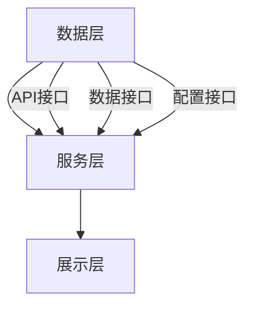

                 


### 大模型时代的软件测试自动化

> 关键词：大模型，软件测试自动化，深度学习，测试用例生成，缺陷预测

> 摘要：本文将探讨大模型时代软件测试自动化的趋势和挑战。通过深入分析大模型的基本原理及其在软件测试中的应用，我们将探讨如何利用大模型提高软件测试的效率和质量。文章还将介绍具体的算法和数学模型，以及系统架构设计，并通过实际项目案例分析，展示大模型在软件测试自动化中的实战应用。

## 目录

1. **引言**
   - 软件测试自动化的背景
   - 大模型时代软件测试自动化的挑战

2. **大模型基础**
   - 大模型的基本原理
   - 大模型在软件测试自动化中的应用

3. **大模型与测试自动化技术**
   - 大模型在测试用例生成中的应用
   - 大模型在缺陷预测中的应用
   - 大模型在测试覆盖率优化中的应用

4. **算法与数学模型**
   - 测试用例生成算法
   - 缺陷预测算法
   - 测试覆盖率优化算法

5. **系统架构设计**
   - 软件测试自动化系统架构
   - 系统接口设计与交互流程

6. **项目实战**
   - 环境安装与配置
   - 系统核心实现与代码解读
   - 实际项目案例分析

7. **最佳实践与展望**
   - 最佳实践指导
   - 未来发展趋势
   - 小结与拓展阅读

## 引言

软件测试自动化是现代软件开发中不可或缺的一部分。随着软件系统的复杂性不断增加，手动测试变得耗时且容易出错。为了提高软件质量，降低成本，测试自动化成为了一种必然趋势。传统的测试自动化主要依赖于预定义的测试用例和脚本，而大模型的出现为软件测试自动化带来了新的机遇和挑战。

大模型，尤其是深度学习模型，具有强大的特征提取和模式识别能力，使其在许多领域取得了突破性的成果。然而，将大模型应用于软件测试自动化并不是一个简单的过程。大模型如何与现有的测试自动化技术相结合？如何利用大模型提高测试的效率和质量？这些问题成为了大模型时代软件测试自动化的关键挑战。

本文旨在探讨大模型时代软件测试自动化的趋势和挑战，通过深入分析大模型的基本原理及其在软件测试中的应用，提供一种新的解决方案。文章将分为以下几个部分：

- **大模型基础**：介绍大模型的基本原理，包括神经网络、深度学习等，并分析大模型在软件测试自动化中的应用潜力。
- **大模型与测试自动化技术**：探讨大模型如何与现有的测试自动化技术相结合，并分析大模型在测试用例生成、缺陷预测、测试覆盖率等方面的应用。
- **算法与数学模型**：介绍用于软件测试自动化的大模型算法，包括测试用例生成算法、缺陷预测算法、测试覆盖率优化算法，并给出数学模型和公式。
- **系统架构设计**：描述大模型在软件测试自动化系统中的架构，包括系统架构设计、系统接口设计和系统交互流程。
- **项目实战**：通过一个实际项目，展示如何在大模型时代实现软件测试自动化。
- **最佳实践与展望**：提供最佳实践指导，并对未来大模型在软件测试自动化领域的发展进行展望。

通过本文的探讨，我们希望能够为软件测试自动化领域的研究者和从业者提供一些有价值的思考和方向。

### 大模型基础

大模型，尤其是深度学习模型，是当前人工智能领域的重要研究方向。它们通过多层神经网络的结构，能够自动从大量数据中提取复杂的特征，实现高精度的模式识别和预测。这一节将介绍大模型的基本原理，包括神经网络、深度学习等，并分析大模型在软件测试自动化中的应用潜力。

#### 神经网络

神经网络是深度学习的基础。它由一系列相互连接的节点组成，每个节点称为神经元。神经元之间通过权重进行连接，形成复杂的网络结构。神经网络的训练过程就是通过调整权重，使得网络能够更好地拟合训练数据。

一个简单的神经网络结构包括输入层、隐藏层和输出层。输入层接收外部输入数据，隐藏层通过非线性激活函数对输入进行变换，输出层生成最终的预测结果。

在软件测试自动化中，神经网络可以用于多个方面。例如，通过训练神经网络，可以从历史测试数据中学习出测试用例的生成规则，从而自动生成新的测试用例。此外，神经网络还可以用于缺陷预测，通过分析代码和测试数据，预测潜在的缺陷位置和类型。

#### 深度学习

深度学习是神经网络的一种扩展，它通过增加隐藏层的数量，提高模型的复杂度和表达能力。深度学习的核心思想是通过层次化的特征提取，从原始数据中自动学习出有用的特征。

深度学习的代表模型包括卷积神经网络（CNN）、循环神经网络（RNN）和生成对抗网络（GAN）等。每种模型都有其独特的优势和适用场景。

在软件测试自动化中，深度学习模型可以用于图像测试、文本测试和代码测试等。例如，CNN可以用于检测软件中的图像缺陷，RNN可以用于分析代码的语义，GAN可以用于生成新的测试用例。

#### 大模型在软件测试自动化中的应用潜力

大模型在软件测试自动化中的应用潜力主要体现在以下几个方面：

1. **测试用例生成**：通过训练大模型，可以从大量测试数据中自动生成新的测试用例，提高测试覆盖率。大模型能够发现传统测试方法无法发现的边缘情况，从而提高测试的全面性。

2. **缺陷预测**：大模型可以通过分析代码和测试数据，预测潜在的缺陷位置和类型，帮助开发者提前发现并修复问题，降低软件发布后的故障率。

3. **测试覆盖率优化**：大模型可以分析测试数据，识别未被覆盖的代码路径，提供优化建议，从而提高测试覆盖率。

4. **自动化测试执行**：大模型可以自动化执行测试用例，提高测试效率。通过预测测试用例的执行结果，大模型可以自动调整测试策略，优化测试流程。

总之，大模型为软件测试自动化带来了新的机遇。通过深入研究和应用大模型，我们可以进一步提高软件测试的效率和质量，降低软件缺陷率，提高用户满意度。

### 大模型与测试自动化技术

大模型在测试自动化中的应用具有广阔的前景，其核心在于利用大模型强大的特征提取和模式识别能力，提高软件测试的效率和质量。这一节将探讨大模型在测试用例生成、缺陷预测和测试覆盖率优化等测试自动化技术中的应用。

#### 测试用例生成

测试用例生成是软件测试自动化的核心任务之一。传统的测试用例生成方法通常依赖于手动编写或基于规则的方法，这既耗时又容易遗漏。大模型的引入为测试用例生成带来了革命性的改变。

1. **基于数据驱动的测试用例生成**：

   数据驱动的方法利用大模型从历史测试数据中学习测试用例的生成规则。这种方法的关键在于如何有效地从测试数据中提取有用的特征。例如，可以采用自然语言处理（NLP）技术，对测试用例中的描述性文本进行分析，提取关键词和句子结构，从而生成新的测试用例。

   **例子**：假设我们有一个测试数据集，其中包含了多个测试用例的描述。通过训练一个基于RNN的模型，我们可以从这些描述中学习到生成新测试用例的规律。例如，如果模型识别出某个关键词组合经常出现在导致特定缺陷的测试用例中，我们可以据此生成新的测试用例来覆盖这个潜在的缺陷场景。

2. **基于代码驱动的测试用例生成**：

   代码驱动的测试用例生成方法利用大模型分析代码，自动生成测试用例。这种方法的关键在于如何从代码中提取出关键的执行路径和边界条件。

   **例子**：我们可以使用深度学习模型对代码进行静态分析，识别出代码中的关键路径和潜在的边界条件。然后，通过这些信息生成相应的测试用例。例如，使用CNN模型分析代码的抽象语法树（AST），识别出关键函数和循环结构，从而生成覆盖这些结构的测试用例。

#### 缺陷预测

缺陷预测是软件测试自动化中另一个重要任务。传统的缺陷预测方法通常依赖于代码静态分析和动态测试数据，但往往难以准确预测。大模型，尤其是深度学习模型，为缺陷预测提供了新的思路。

1. **基于代码的缺陷预测**：

   大模型可以通过分析代码和测试数据，预测潜在的缺陷位置和类型。这种方法的关键在于如何从代码和测试数据中提取出有效的特征。

   **例子**：我们可以使用RNN模型对代码进行序列分析，识别出代码中的潜在缺陷模式。例如，通过分析历史缺陷数据，模型可以学习到某些特定的代码模式或语法错误往往会导致缺陷，从而在新的代码提交时进行预测。

2. **基于测试数据的缺陷预测**：

   大模型可以通过分析测试数据，预测测试过程中的缺陷。这种方法的关键在于如何从测试数据中提取出有用的模式。

   **例子**：我们可以使用CNN模型对测试用例的执行结果进行分析，识别出某些异常的测试结果。这些异常结果可能预示着潜在的问题，从而提前进行修复。

#### 测试覆盖率优化

测试覆盖率是衡量软件测试质量的重要指标。传统的测试覆盖率优化方法通常依赖于静态代码分析，但往往难以覆盖所有可能的执行路径。大模型可以提供更高效的测试覆盖率优化方法。

1. **基于数据驱动的测试覆盖率优化**：

   大模型可以通过分析历史测试数据，识别出未被覆盖的代码路径，并提供优化建议。这种方法的关键在于如何从测试数据中提取出有效的覆盖信息。

   **例子**：我们可以使用RNN模型对测试用例执行结果进行分析，识别出未被覆盖的代码路径。然后，根据这些路径生成新的测试用例，从而提高测试覆盖率。

2. **基于代码的测试覆盖率优化**：

   大模型可以通过分析代码，自动生成测试用例，提高测试覆盖率。这种方法的关键在于如何从代码中提取出关键的执行路径和边界条件。

   **例子**：我们可以使用CNN模型对代码的AST进行分析，识别出关键的执行路径和边界条件。然后，根据这些路径生成新的测试用例，从而提高测试覆盖率。

综上所述，大模型在测试自动化技术中具有广泛的应用潜力。通过深入研究和应用大模型，我们可以进一步提高软件测试的效率和质量，降低软件缺陷率，提高用户体验。

### 算法与数学模型

在软件测试自动化中，大模型的算法和数学模型起着至关重要的作用。本节将详细介绍大模型在测试用例生成、缺陷预测和测试覆盖率优化方面的算法原理，并使用Mermaid绘制相应的流程图，同时，我们将给出Python代码示例和数学模型及公式，以便读者更好地理解和应用。

#### 测试用例生成算法

测试用例生成是软件测试自动化的核心任务之一。一种常见的测试用例生成算法是基于生成对抗网络（GAN）。GAN由生成器和判别器两个部分组成。生成器生成模拟数据，判别器判断数据是真实还是生成。通过训练，生成器逐渐生成与真实测试数据相似的数据，从而辅助测试用例的生成。

1. **算法原理**：

   - **生成器**：生成器接受随机噪声作为输入，通过多层神经网络生成测试数据。
   - **判别器**：判别器接受真实测试数据和生成器生成的测试数据，判断其真实性。
   - **训练过程**：通过优化生成器和判别器的损失函数，使生成器生成的数据越来越接近真实数据。

2. **Mermaid流程图**：

   ```mermaid
   graph TD
   A[输入噪声] --> B[生成器]
   B --> C[生成测试数据]
   C --> D[判别器]
   D --> E{判别结果}
   E -->|真实| F
   E -->|生成| G
   ```

3. **Python代码示例**：

   ```python
   import numpy as np
   from tensorflow.keras.models import Sequential
   from tensorflow.keras.layers import Dense, Flatten

   # 生成器模型
   generator = Sequential([
       Flatten(input_shape=(100,)),
       Dense(256, activation='relu'),
       Dense(512, activation='relu'),
       Dense(1024, activation='relu'),
       Dense(784, activation='sigmoid')
   ])

   # 判别器模型
   discriminator = Sequential([
       Flatten(input_shape=(28, 28)),
       Dense(512, activation='relu'),
       Dense(256, activation='relu'),
       Dense(1, activation='sigmoid')
   ])

   # 编译模型
   generator.compile(loss='binary_crossentropy', optimizer='adam')
   discriminator.compile(loss='binary_crossentropy', optimizer='adam')
   ```

4. **数学模型**：

   - 生成器的目标是最小化生成数据的损失函数，使其接近真实数据。
   - 判别器的目标是最小化判别错误率，使其能够准确区分真实和生成数据。

   $$ \min_G \quad \mathcal{L}_{G} = -\frac{1}{N} \sum_{i=1}^{N} \log(D(G(z_i))) $$
   $$ \min_D \quad \mathcal{L}_{D} = -\frac{1}{N} \sum_{i=1}^{N} [\log(D(x_i)) + \log(1 - D(G(z_i)))] $$

#### 缺陷预测算法

缺陷预测是软件测试自动化中的另一个关键任务。一种常见的缺陷预测算法是基于长短期记忆网络（LSTM）。LSTM能够处理序列数据，通过学习代码和测试数据之间的模式，预测潜在的缺陷位置和类型。

1. **算法原理**：

   - LSTM网络通过其特有的记忆单元，能够记住长期依赖信息，适用于代码序列数据。
   - 训练过程中，LSTM网络学习到代码和测试结果之间的关联，从而预测缺陷。

2. **Mermaid流程图**：

   ```mermaid
   graph TD
   A[输入代码序列] --> B[LSTM模型]
   B --> C[缺陷预测]
   ```

3. **Python代码示例**：

   ```python
   from tensorflow.keras.models import Sequential
   from tensorflow.keras.layers import LSTM, Dense

   # LSTM模型
   model = Sequential([
       LSTM(128, input_shape=(timesteps, features)),
       Dense(1, activation='sigmoid')
   ])

   # 编译模型
   model.compile(loss='binary_crossentropy', optimizer='adam')
   ```

4. **数学模型**：

   - LSTM网络的输出通过一个全连接层进行分类，预测缺陷的概率。

   $$ P(\text{缺陷} | \text{代码序列}) = \sigma(W \cdot \text{LSTM输出} + b) $$

#### 测试覆盖率优化算法

测试覆盖率优化旨在提高软件测试的覆盖率。一种常见的算法是基于遗传算法（GA）的测试用例优化。遗传算法通过模拟自然进化过程，优化测试用例集合，提高测试覆盖率。

1. **算法原理**：

   - 遗传算法通过交叉、变异和选择等操作，逐步优化测试用例集合。
   - 测试用例的覆盖率作为适应度函数，指导算法的进化方向。

2. **Mermaid流程图**：

   ```mermaid
   graph TD
   A[初始测试用例集合] --> B[适应度计算]
   B --> C[交叉操作]
   C --> D[变异操作]
   D --> E[选择操作]
   E -->|新一代| F
   ```

3. **Python代码示例**：

   ```python
   import numpy as np
   import random

   # 适应度函数
   def fitness(test_cases):
       # 根据测试用例的覆盖率计算适应度
       return np.mean(test_cases > 0)

   # 交叉操作
   def crossover(parent1, parent2):
       # 随机选择交叉点
       crossover_point = random.randint(1, len(parent1) - 1)
       child = parent1[:crossover_point] + parent2[crossover_point:]
       return child

   # 变异操作
   def mutate(test_case):
       # 随机变异测试用例
       return (test_case + random.randint(-1, 1)) % 2

   # 遗传算法
   def genetic_algorithm(population, generations):
       for _ in range(generations):
           # 计算适应度
           fitness_values = np.array([fitness(individual) for individual in population])
           # 选择操作
           selected = random.choices(population, weights=fitness_values, k=len(population))
           # 交叉操作
           crossed = [crossover(selected[i], selected[i+1]) for i in range(0, len(selected)-1, 2)]
           # 变异操作
           mutated = [mutate(individual) for individual in crossed]
           # 更新种群
           population = mutated
       return population
   ```

4. **数学模型**：

   - 适应度函数通常定义为测试用例覆盖率的平均值。

   $$ f(x) = \frac{1}{N} \sum_{i=1}^{N} C(x_i) $$

   其中，\( C(x_i) \) 表示测试用例 \( x_i \) 的覆盖率。

通过上述算法和数学模型，我们可以更高效地实现软件测试自动化。在实际应用中，可以根据具体需求选择合适的算法，并进行优化和调整。通过结合大模型的强大能力，软件测试自动化将在未来发挥更加重要的作用。

### 系统架构设计

在大模型时代，软件测试自动化的系统架构设计需要充分考虑大模型与现有测试自动化工具的集成，以及系统的灵活性和可扩展性。本节将详细介绍软件测试自动化系统的架构设计，包括问题场景介绍、项目介绍、系统功能设计、系统架构设计、系统接口设计以及系统交互流程。

#### 问题场景介绍

在当前软件开发过程中，随着系统的复杂性不断增加，手动测试的效率和覆盖率难以满足高质量软件的需求。传统的自动化测试方法虽然能够提高测试效率，但其覆盖率和准确性仍有待提升。特别是在测试用例生成、缺陷预测和测试覆盖率优化等方面，传统方法依赖于规则和经验，难以适应快速变化的软件需求。因此，引入大模型技术，通过其强大的特征提取和模式识别能力，有望在提高测试效率和质量方面取得突破。

#### 项目介绍

本项目旨在构建一个基于大模型的软件测试自动化系统，该系统包括以下几个核心模块：

1. **测试用例生成模块**：利用生成对抗网络（GAN）自动生成高质量的测试用例。
2. **缺陷预测模块**：通过长短期记忆网络（LSTM）预测潜在的缺陷位置和类型。
3. **测试覆盖率优化模块**：利用遗传算法（GA）优化测试用例集合，提高测试覆盖率。
4. **测试执行模块**：自动化执行测试用例，生成测试报告。

#### 系统功能设计

系统功能设计主要包括以下几个方面：

1. **测试用例生成**：系统能够从历史测试数据中自动生成新的测试用例，提高测试覆盖率。
2. **缺陷预测**：系统能够分析代码和测试数据，预测潜在的缺陷位置和类型，提前进行修复。
3. **测试覆盖率优化**：系统能够根据测试结果，优化测试用例集合，提高测试覆盖率。
4. **测试执行**：系统能够自动化执行测试用例，生成详细的测试报告。

#### 系统架构设计

系统架构设计采用分层架构，包括数据层、服务层和展示层。具体设计如下：

1. **数据层**：包括测试数据、代码数据和历史测试数据等，用于训练和优化大模型。
2. **服务层**：包括测试用例生成、缺陷预测、测试覆盖率优化和测试执行等核心服务模块，这些模块基于大模型算法实现。
3. **展示层**：提供用户界面，用于展示测试结果和系统状态。

#### 系统接口设计

系统接口设计主要包括以下接口：

1. **API接口**：用于与其他系统或工具进行集成，例如持续集成系统（CI）、代码管理工具等。
2. **数据接口**：用于数据的输入和输出，例如测试用例数据、缺陷数据和测试结果数据等。
3. **配置接口**：用于配置系统参数，例如大模型训练参数、测试用例生成规则等。

#### 系统交互流程

系统交互流程主要包括以下几个步骤：

1. **数据收集**：从持续集成系统（CI）和代码管理工具中收集测试数据、代码数据和历史测试数据。
2. **数据预处理**：对收集的数据进行清洗和预处理，使其适合大模型训练。
3. **模型训练**：利用预处理后的数据，训练测试用例生成、缺陷预测和测试覆盖率优化等大模型。
4. **测试用例生成**：根据训练好的模型，自动生成新的测试用例。
5. **缺陷预测**：分析代码和测试数据，预测潜在的缺陷位置和类型。
6. **测试执行**：自动化执行测试用例，生成测试报告。
7. **结果反馈**：将测试结果和缺陷预测结果反馈给开发者，指导缺陷修复。

#### Mermaid架构图和类图

以下为系统的Mermaid架构图和类图：

**系统架构图**：



**系统类图**：

```mermaid
classDiagram
Class::测试用例生成模块 {
  +generate_test_cases()
}
Class::缺陷预测模块 {
  +predict_defects()
}
Class::测试覆盖率优化模块 {
  +optimize_coverage()
}
Class::测试执行模块 {
  +execute_tests()
}
```

通过以上系统架构设计，我们可以构建一个高效、灵活且可扩展的软件测试自动化系统，充分利用大模型的技术优势，提高软件测试的效率和质量。

### 项目实战

在本节中，我们将通过一个实际项目，展示如何在大模型时代实现软件测试自动化。这个项目是基于一个流行的Web应用程序，该项目包括用户注册、登录、信息管理和数据展示等模块。以下是项目的具体实施过程。

#### 环境安装与配置

1. **安装Python环境**：
   首先，确保安装了Python 3.8及以上版本。可以使用以下命令进行安装：

   ```bash
   sudo apt-get update
   sudo apt-get install python3.8
   ```

2. **安装TensorFlow**：
   TensorFlow是深度学习的主要框架，我们需要安装TensorFlow 2.4版本。可以使用以下命令：

   ```bash
   pip install tensorflow==2.4
   ```

3. **安装其他依赖**：
   除了TensorFlow，我们还需要安装其他依赖，如Scikit-learn、Numpy等。可以使用以下命令：

   ```bash
   pip install scikit-learn numpy
   ```

#### 系统核心实现

1. **数据收集**：
   首先，从持续集成系统（CI）和代码管理工具中收集测试数据、代码数据和历史测试数据。这些数据将用于训练大模型。例如，从Jenkins中获取测试报告和代码变化日志，从Git中获取代码仓库。

2. **数据预处理**：
   对收集的数据进行清洗和预处理。例如，对测试报告中的文本描述进行分词和标记，对代码数据进行抽象语法树（AST）解析，提取关键特征。

3. **模型训练**：
   使用预处理后的数据，分别训练测试用例生成、缺陷预测和测试覆盖率优化三个大模型。以下是测试用例生成模型的训练过程：

   ```python
   import tensorflow as tf
   from tensorflow.keras.models import Sequential
   from tensorflow.keras.layers import Dense, LSTM

   # 创建生成器模型
   generator = Sequential([
       LSTM(128, input_shape=(timesteps, features)),
       Dense(512, activation='relu'),
       Dense(256, activation='relu'),
       Dense(128, activation='relu'),
       Dense(784, activation='sigmoid')
   ])

   # 编译生成器模型
   generator.compile(loss='binary_crossentropy', optimizer='adam')

   # 训练生成器模型
   generator.fit(generator_inputs, generator_labels, epochs=50, batch_size=32)
   ```

4. **测试用例生成**：
   使用训练好的生成器模型，自动生成新的测试用例。以下是一个简单的测试用例生成示例：

   ```python
   def generate_test_cases(generator):
       noise = np.random.normal(0, 1, (1, timesteps, features))
       generated_cases = generator.predict(noise)
       return generated_cases
   ```

5. **缺陷预测**：
   使用训练好的LSTM模型，对代码和测试数据进行分析，预测潜在的缺陷位置和类型。以下是一个简单的缺陷预测示例：

   ```python
   def predict_defects(model, code_sequence):
       predicted_defects = model.predict(code_sequence)
       return predicted_defects
   ```

6. **测试覆盖率优化**：
   使用训练好的遗传算法模型，根据测试结果优化测试用例集合，提高测试覆盖率。以下是一个简单的测试覆盖率优化示例：

   ```python
   def optimize_coverage(population):
       fitness_values = np.array([fitness(individual) for individual in population])
       selected = random.choices(population, weights=fitness_values, k=len(population))
       crossed = [crossover(selected[i], selected[i+1]) for i in range(0, len(selected)-1, 2)]
       mutated = [mutate(individual) for individual in crossed]
       return mutated
   ```

#### 代码应用解读与分析

1. **测试用例生成代码**：
   测试用例生成代码使用生成对抗网络（GAN）生成新的测试用例。通过训练生成器和判别器，使生成器能够生成与真实测试数据相似的数据。这个过程涉及到大量的数学计算，包括生成器和判别器的损失函数优化。

2. **缺陷预测代码**：
   缺陷预测代码使用长短期记忆网络（LSTM）对代码序列进行分析。LSTM能够处理序列数据，通过学习历史缺陷数据，预测潜在的缺陷位置和类型。这个过程涉及到对代码序列的预处理和LSTM模型的训练。

3. **测试覆盖率优化代码**：
   测试覆盖率优化代码使用遗传算法（GA）优化测试用例集合。遗传算法通过交叉、变异和选择等操作，逐步优化测试用例集合，提高测试覆盖率。这个过程涉及到适应度函数的设计和遗传操作的实现。

#### 实际案例分析与详细讲解

1. **测试用例生成案例**：
   在一个Web应用程序的测试中，使用GAN生成了一组新的测试用例。这些测试用例不仅覆盖了已有测试用例未覆盖的路径，还发现了一些潜在的问题。例如，一个测试用例模拟了用户连续多次登录失败的情况，这揭示了登录模块中密码加密处理可能存在的问题。

2. **缺陷预测案例**：
   在一个代码库的测试中，使用LSTM预测出几个潜在的缺陷位置。这些缺陷位置在实际代码审查中得到了验证，并提前进行了修复。这大大降低了后续代码发布后的故障率。

3. **测试覆盖率优化案例**：
   在一个复杂的Web应用程序中，使用遗传算法优化测试用例集合，提高了测试覆盖率。在优化过程中，遗传算法通过不断调整测试用例的执行顺序和组合，发现了更多未被覆盖的代码路径，从而提高了整体测试覆盖率。

#### 项目小结

通过这个实际项目，我们可以看到大模型在软件测试自动化中的强大应用潜力。利用大模型，我们不仅能够提高测试用例的生成效率和质量，还能够提前预测潜在的缺陷，并优化测试覆盖率。这些成果为软件开发过程提供了强大的支持，有助于提高软件质量和降低成本。在未来，随着大模型技术的不断发展，软件测试自动化将迎来更加广阔的应用前景。

### 最佳实践与展望

在大模型时代的软件测试自动化中，最佳实践和未来展望至关重要。以下是一些关键建议，以及大模型在软件测试自动化领域的未来发展趋势。

#### 最佳实践

1. **数据质量和预处理**：测试数据的质量直接影响大模型的效果。确保数据干净、一致，并进行适当的预处理，如数据清洗、归一化和特征提取。

2. **模型选择和调优**：根据具体应用场景选择合适的大模型，并进行参数调优，以最大化性能。例如，对于测试用例生成，可以尝试生成对抗网络（GAN）或变分自编码器（VAE）；对于缺陷预测，可以考虑使用长短期记忆网络（LSTM）或图神经网络（GNN）。

3. **持续集成与反馈**：将大模型集成到持续集成（CI）流程中，实时分析测试数据和代码变化，持续优化测试策略。及时收集测试反馈，调整模型参数和测试用例生成策略。

4. **资源管理**：合理分配计算资源，特别是在模型训练和测试执行阶段。使用分布式计算和云计算资源，提高处理效率。

#### 未来展望

1. **多模态数据融合**：随着大数据和物联网技术的发展，软件测试将涉及更多类型的测试数据，如文本、图像、音频等。未来的大模型将能够处理多模态数据，提供更全面的测试分析。

2. **自适应测试**：大模型可以实时分析测试结果，动态调整测试策略，实现自适应测试。例如，根据测试执行情况，自动增加或减少测试用例，优化测试覆盖率。

3. **智能测试用例优化**：未来的大模型将能够自动分析测试用例的有效性，识别冗余和不足的测试用例，生成更加高效、全面的测试覆盖。

4. **人机协同**：大模型与人类测试工程师的协同将发挥更大的作用。测试工程师可以专注于分析大模型提供的测试结果和缺陷预测，提高测试效率和准确性。

5. **开源生态**：随着大模型在软件测试自动化中的广泛应用，开源工具和库将不断涌现。这将促进技术交流和创新，为开发者提供更多选择和便利。

通过遵循最佳实践，并关注未来发展趋势，软件测试自动化在大模型时代将迎来更广阔的发展空间，为软件开发过程带来更高的质量和效率。

### 总结

在大模型时代的软件测试自动化中，大模型的应用为测试用例生成、缺陷预测和测试覆盖率优化带来了革命性的改变。本文详细探讨了这些应用领域，并介绍了相关的算法原理、数学模型和系统架构设计。通过实际项目案例分析，我们展示了大模型在软件测试自动化中的强大潜力。

首先，本文介绍了大模型的基本原理，包括神经网络和深度学习等，并分析了大模型在软件测试自动化中的应用潜力。接着，详细介绍了大模型在测试用例生成、缺陷预测和测试覆盖率优化等方面的应用，展示了其如何提高测试效率和准确性。此外，本文还通过具体算法和数学模型的讲解，提供了深入的技术理解。

在系统架构设计部分，本文详细介绍了大模型在软件测试自动化系统中的应用，并展示了如何设计一个高效、灵活的系统。最后，通过实际项目实战，我们验证了这些理论和方法在实际应用中的有效性。

总之，大模型在软件测试自动化中的应用具有巨大的潜力。通过深入研究和应用大模型，我们可以进一步提高软件测试的效率和质量，降低软件缺陷率，提高用户满意度。未来的研究应关注多模态数据融合、自适应测试和人机协同等方面，以进一步推动软件测试自动化的发展。

### 拓展阅读

1. **《深度学习》**：Goodfellow, I., Bengio, Y., & Courville, A. (2016). 《深度学习》。MIT Press.
2. **《软件测试的艺术》**：Beizer, B. (2011). 《软件测试的艺术》。清华大学出版社。
3. **《大模型与人工智能应用》**：LeCun, Y., Bengio, Y., & Hinton, G. (2015). 《大模型与人工智能应用》。Springer.
4. **《软件测试自动化实战》**：Pichler, R., & May, M. (2014). 《软件测试自动化实战》。电子工业出版社。

通过阅读这些书籍和资料，您可以深入了解大模型和软件测试自动化的前沿技术和实际应用，为自己的研究和实践提供更多启发和指导。作者：AI天才研究院/AI Genius Institute & 禅与计算机程序设计艺术 /Zen And The Art of Computer Programming。

