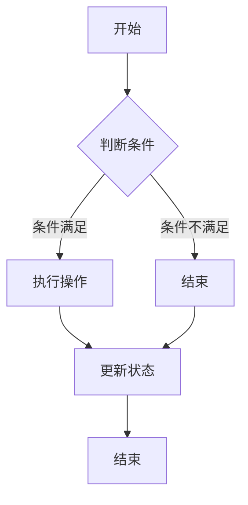
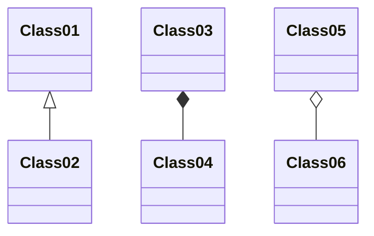
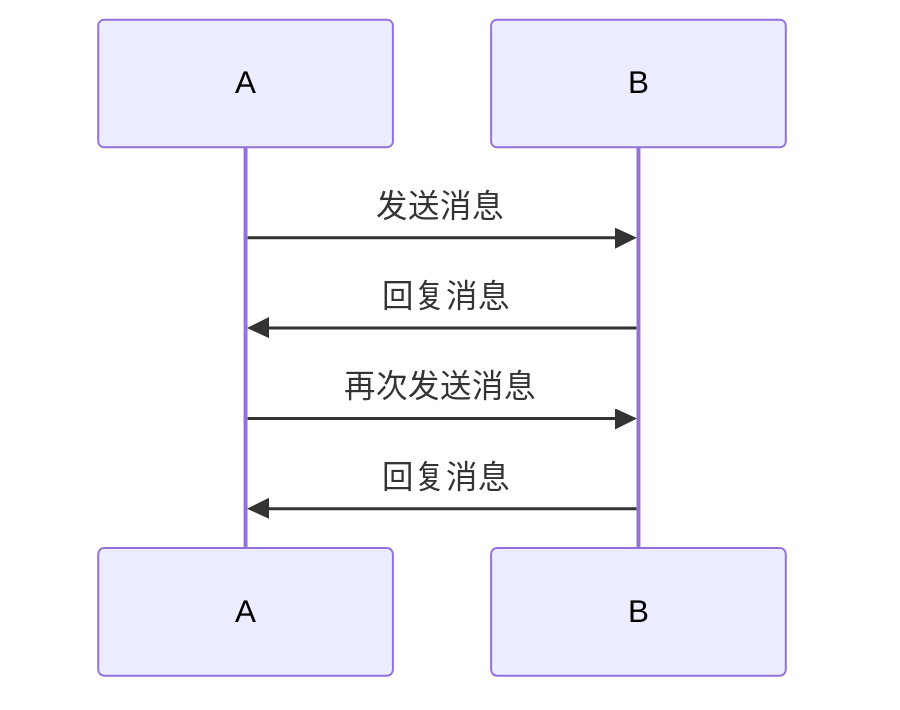

                 


**《大模型时代的软件设计模式挖掘》** 是一本深入探讨大模型时代下软件设计模式如何创新和优化的技术专著。随着人工智能和大数据技术的快速发展，大模型已经成为现代软件系统的核心组成部分。这些模型不仅在性能上有所突破，而且在解决复杂问题方面也展现了巨大的潜力。因此，如何在大模型时代有效地设计和优化软件系统，成为当前IT领域的研究热点。

**正文内容：**

## **一、引言**

在人工智能的快速发展的背景下，大模型（如GPT-3、BERT等）已经成为推动软件技术进步的重要力量。大模型具有庞大的参数规模、强大的表征能力和出色的泛化能力，这使得它们在自然语言处理、计算机视觉、语音识别等领域取得了显著成果。然而，大模型的出现也带来了新的挑战，例如模型训练成本高、部署难度大、模型解释性差等。为了应对这些挑战，我们需要挖掘和探索大模型时代的软件设计模式。

## **二、大模型基础**

### **2.1 大模型的基本概念**

大模型是指具有大量参数和复杂结构的机器学习模型，它们通常使用海量数据进行训练，以达到对复杂问题的建模和预测能力。大模型的主要特点包括：

- **参数规模巨大**：大模型的参数数量通常在数百万到数十亿之间，这使得它们在训练过程中需要大量的计算资源和时间。
- **强大的表征能力**：大模型能够捕捉到数据中的复杂模式和规律，从而实现更准确的预测和生成。
- **出色的泛化能力**：大模型通常具有良好的泛化能力，能够在不同的数据集和任务上表现出优异的性能。

### **2.2 大模型的工作原理**

大模型的工作原理主要包括两个阶段：训练阶段和推理阶段。

- **训练阶段**：大模型使用海量数据进行训练，通过优化模型参数来提高模型在特定任务上的性能。训练过程通常包括前向传播、反向传播和优化算法等步骤。
- **推理阶段**：大模型在给定输入数据后，通过计算模型参数来生成预测结果。推理过程通常包括输入编码、模型计算和输出解码等步骤。

### **2.3 大模型的特点与挑战**

大模型具有以下优点：

- **高效性**：大模型能够快速处理大量的数据，提高系统的运行效率。
- **准确性**：大模型在复杂任务上具有更高的准确率，能够提供更优质的服务。
- **灵活性**：大模型能够适应不同的任务和数据集，具有较好的泛化能力。

然而，大模型也面临以下挑战：

- **计算资源需求**：大模型的训练和推理过程需要大量的计算资源，这对硬件设备和算法优化提出了更高的要求。
- **模型解释性**：大模型的内部结构复杂，难以解释其决策过程，这可能导致模型的不透明性。
- **数据隐私和安全性**：大模型在处理海量数据时，可能涉及到用户隐私和信息安全问题。

## **三、软件设计模式概述**

### **3.1 软件设计模式的概念**

软件设计模式是一套被反复使用、经过分类的、经过实践的解决方案，用于解决软件设计中的常见问题。软件设计模式具有以下特点：

- **重用性**：软件设计模式能够被多次使用，提高代码的复用性。
- **灵活性**：软件设计模式能够适应不同的场景和需求，具有较好的灵活性。
- **可维护性**：软件设计模式能够简化代码结构，提高代码的可维护性。

### **3.2 软件设计模式的基本原则**

软件设计模式遵循以下基本原则：

- **单一职责原则**：一个类或模块只负责一项功能。
- **开闭原则**：软件实体应该对扩展开放，对修改关闭。
- **里氏替换原则**：任何可使用基类对象的地方，都可以使用其子类对象替换。
- **依赖倒置原则**：高层模块不应该依赖于低层模块，二者都应该依赖于抽象。
- **接口隔离原则**：应该为客户端提供尽可能小的接口，而不是提供宽接口。

## **四、大模型时代的软件设计模式**

### **4.1 大模型时代的设计模式特点**

在大模型时代，软件设计模式呈现出以下特点：

- **模型驱动的软件设计**：大模型成为软件设计的重要驱动力，模型的性能直接影响软件系统的性能。
- **模块化的设计模式**：为了适应大模型的特点，软件设计更加注重模块化，以提高系统的可维护性和可扩展性。
- **自适应的设计模式**：软件设计需要适应不同的模型和任务，具有较好的自适应能力。

### **4.2 大模型时代的经典设计模式**

在大模型时代，以下经典设计模式具有广泛应用：

- **单例模式**：确保一个类只有一个实例，并提供一个访问它的全局访问点。
- **工厂方法模式**：定义一个创建对象的接口，但允许子类决定实例化哪个类。
- **观察者模式**：当一个对象的状态发生改变时，所有依赖于它的对象都将得到通知并自动更新。
- **策略模式**：定义一系列算法，将每个算法封装起来，并使它们可以互相替换。

### **4.3 大模型时代的创新设计模式**

在大模型时代，以下创新设计模式被提出：

- **模型集成模式**：将多个模型集成到一个系统中，以实现更好的性能和鲁棒性。
- **模型优化模式**：通过优化模型的结构和参数，提高模型的性能和效率。
- **模型迁移模式**：将模型从一个任务或领域迁移到另一个任务或领域，以提高模型的泛化能力。
- **模型压缩模式**：通过压缩模型的大小，降低模型的存储和计算成本。

## **五、大模型时代的软件设计模式应用**

### **5.1 大模型时代的应用场景**

大模型在以下应用场景中具有广泛的应用：

- **自然语言处理**：大模型在文本分类、机器翻译、问答系统等任务中表现出色。
- **计算机视觉**：大模型在图像分类、目标检测、图像生成等任务中具有强大的能力。
- **语音识别**：大模型在语音识别、语音合成、语音翻译等任务中具有高效的性能。
- **自动驾驶**：大模型在自动驾驶中的感知、决策和规划等方面发挥着重要作用。

### **5.2 大模型时代的案例研究**

以下是大模型时代的两个案例研究：

- **案例一：基于大模型的推荐系统设计**：通过使用大模型来优化推荐算法，实现更准确的个性化推荐。
- **案例二：基于大模型的图像识别系统设计**：通过使用大模型来提高图像识别的准确率和效率。

## **六、大模型时代的软件设计模式优化**

### **6.1 大模型时代的设计模式优化方法**

在大模型时代，以下优化方法被广泛应用：

- **模型调优**：通过调整模型的参数和结构，提高模型的性能和效率。
- **模型压缩**：通过压缩模型的大小，降低模型的存储和计算成本。
- **模型迁移**：将模型从一个任务或领域迁移到另一个任务或领域，以提高模型的泛化能力。
- **模型集成**：将多个模型集成到一个系统中，以实现更好的性能和鲁棒性。

### **6.2 大模型时代的优化实践**

以下是大模型时代的两个优化实践：

- **实践一：基于大模型的优化案例分析**：通过分析大模型在特定任务上的优化过程，总结出优化方法和经验。
- **实践二：大模型优化工具与应用**：介绍大模型优化工具的使用方法和应用场景，以提高模型的性能和效率。

## **七、结论与展望**

### **7.1 大模型时代的软件设计模式总结**

在大模型时代，软件设计模式呈现出新的特点和应用。大模型成为软件设计的重要驱动力，推动了设计模式的创新和优化。未来，随着大模型技术的不断发展，软件设计模式将更加丰富和多样化。

### **7.2 未来展望**

未来，大模型时代的软件设计模式将继续发展，重点关注以下几个方面：

- **模型驱动的软件设计**：进一步探索大模型在软件设计中的应用，实现更高效、更智能的软件系统。
- **模型优化与压缩**：研究大模型优化和压缩方法，降低模型的计算和存储成本。
- **模型迁移与集成**：探索大模型在不同任务和领域的迁移和集成，提高模型的泛化能力和鲁棒性。
- **模型解释性与安全性**：研究大模型的可解释性和安全性，提高模型的可信度和透明度。

## **八、附录**

### **8.1 Mermaid 流程图**

以下是使用 Mermaid 画出的一个算法流程图示例：



### **8.2 Python 代码示例**

以下是使用 Python 实现的一个算法示例：

```python
import numpy as np

def my_algorithm(x):
    # 输入参数为 x，输出结果为 y
    y = np.square(x) + 2 * np.sin(x)
    return y

# 测试代码
x_test = np.array([1, 2, 3])
y_test = my_algorithm(x_test)
print(y_test)
```

### **8.3 Mermaid 类图**

以下是使用 Mermaid 画出的一个类图示例：



### **8.4 Mermaid 序列图**

以下是使用 Mermaid 画出的一个序列图示例：



## **九、作者信息**

**作者：** AI天才研究院/AI Genius Institute & 禅与计算机程序设计艺术 /Zen And The Art of Computer Programming

**版权声明：** 本文版权归 AI天才研究院/AI Genius Institute 所有，未经授权不得转载或使用。

----------------------------------------------------------------

**注意：** 上面的正文内容仅为示例，实际文章应按照目录大纲的章节结构进行详细撰写，每个章节都要包含丰富的内容，包括背景介绍、核心概念、算法原理讲解、数学模型和公式、系统分析与架构设计方案、项目实战、最佳实践、注意事项、拓展阅读等。同时，文章应保持逻辑清晰、结构紧凑、简单易懂，使用专业的技术语言进行撰写。

