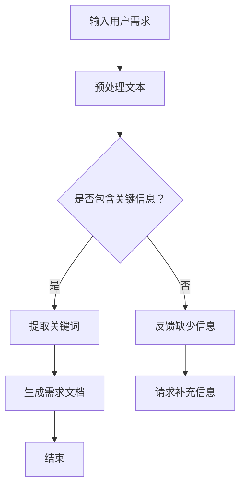
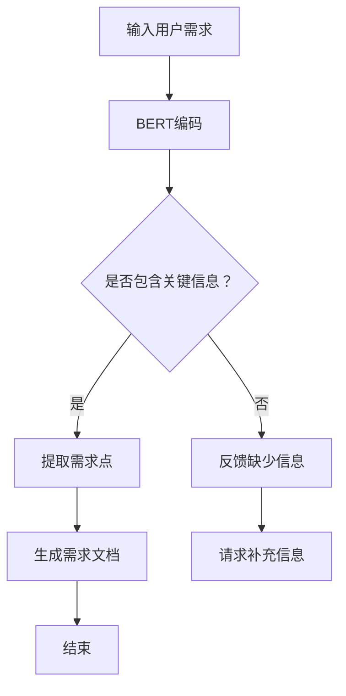
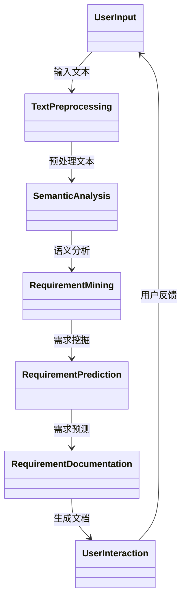
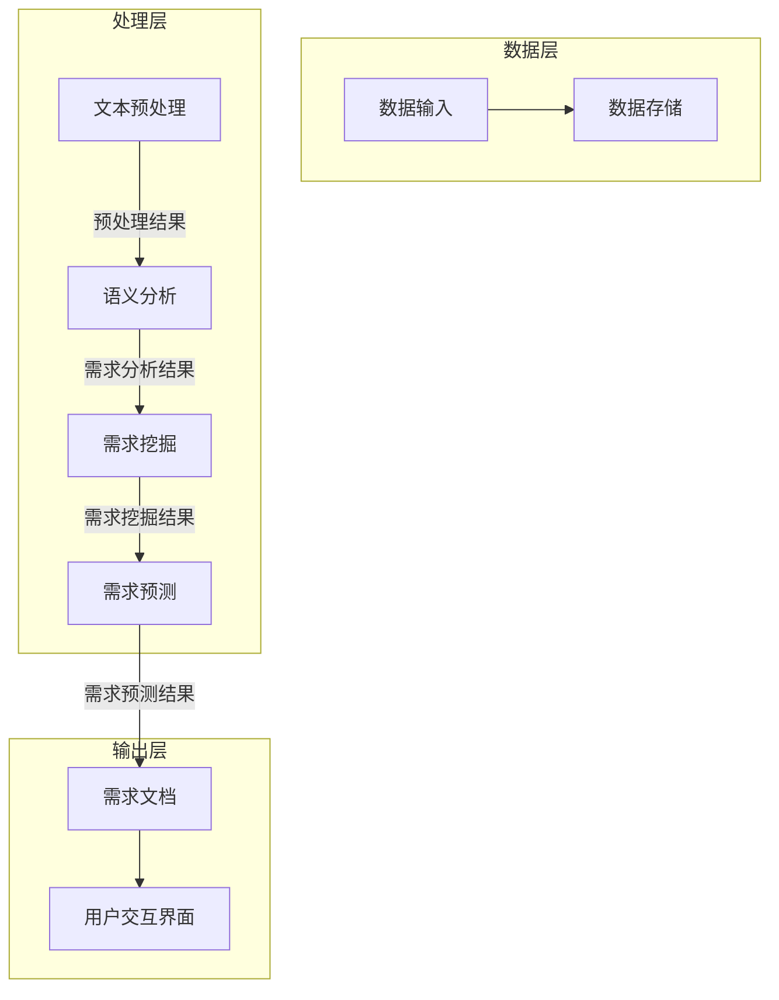
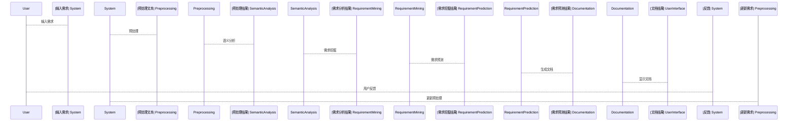

                 


## 大模型时代的软件需求捕获新方法

### 概述

在当今快速发展的技术时代，大型模型（也称为“大模型”）已经成为推动人工智能进步的关键驱动力。大模型具有海量的数据和强大的计算能力，可以自动学习并理解复杂的任务。然而，随着这些大模型的应用范围不断扩大，如何有效捕获软件需求成为了一个重要且紧迫的问题。传统的软件需求捕获方法在面对大模型时代的挑战时，逐渐暴露出其局限性。因此，探索大模型时代的软件需求捕获新方法变得至关重要。

### 关键词

- 大模型
- 软件需求捕获
- 语义分析
- 需求挖掘
- 需求预测
- 系统架构设计

### 摘要

本文旨在探讨大模型时代下的软件需求捕获新方法。首先，我们将介绍大模型时代的背景，以及软件需求捕获的重要性和面临的挑战。接着，我们将详细阐述大模型的基本原理，并探讨其与软件需求捕获的紧密联系。随后，我们将介绍几种基于大模型的软件需求捕获新方法，包括语义分析、需求挖掘和需求预测。本文还将对比不同需求捕获方法的优缺点，并给出具体的应用场景。最后，我们将通过实际项目案例展示这些新方法的应用，并总结最佳实践，提供拓展阅读资源。

## 目录大纲

### 第一部分：背景介绍

#### 第1章：大模型时代背景
- **1.1 问题背景**
- **1.2 问题描述**
- **1.3 问题解决**
- **1.4 边界与外延**
- **1.5 概念结构与核心要素组成**

#### 第2章：软件需求捕获的基本概念
- **2.1 软件需求捕获的定义**
- **2.2 软件需求捕获的重要性**
- **2.3 软件需求捕获的传统方法**
- **2.4 大模型在需求捕获中的应用**

### 第二部分：核心概念与联系

#### 第3章：大模型原理及与需求捕获的关系
- **3.1 大模型的定义**
- **3.2 大模型的核心特点**
- **3.3 大模型在需求捕获中的应用**
- **3.4 大模型与传统需求捕获方法的对比**

#### 第4章：软件需求捕获新方法
- **4.1 基于大模型的语义分析**
- **4.2 基于大模型的需求挖掘**
- **4.3 基于大模型的需求预测**
- **4.4 大模型与需求捕获方法的整合**

#### 第5章：概念属性特征对比
- **5.1 不同需求捕获方法的对比**
- **5.2 大模型在不同需求场景中的表现**

### 第三部分：算法原理讲解

#### 第6章：软件需求捕获算法介绍
- **6.1 算法A介绍**
- **6.2 算法B介绍**

### 第四部分：系统分析与架构设计

#### 第7章：需求捕获系统架构设计
- **7.1 问题场景介绍**
- **7.2 项目介绍**
- **7.3 系统功能设计(领域模型mermaid类图)**
- **7.4 系统架构设计(mermaid架构图)**
- **7.5 系统接口设计和系统交互(mermaid序列图)**

### 第五部分：项目实战

#### 第8章：实际项目案例
- **8.1 环境安装**
- **8.2 系统核心实现源代码**
- **8.3 代码应用解读与分析**
- **8.4 实际案例分析和详细讲解剖析**
- **8.5 项目小结**

### 第六部分：最佳实践 tips & 拓展阅读

#### 第9章：最佳实践 tips
- **9.1 需求捕获过程中的常见问题**
- **9.2 解决方案和建议**
- **9.3 最佳实践案例分享**

#### 第10章：拓展阅读
- **10.1 相关书籍推荐**
- **10.2 学术论文与研究报告**
- **10.3 在线资源与论坛**

## 下一部分：大模型时代背景

### 1.1 问题背景

随着大数据和云计算技术的飞速发展，人工智能领域迎来了一个全新的时代——大模型时代。大模型，顾名思义，是指拥有巨大参数量和计算能力的人工神经网络模型。这些模型通过学习海量数据，能够自动提取复杂的特征和模式，从而在图像识别、自然语言处理、推荐系统等领域取得了惊人的成果。

在软件工程领域，大模型的出现带来了巨大的变革。传统的软件开发流程往往依赖于明确的业务需求和详尽的文档，但在大模型时代，需求捕获变得更加复杂和动态。一方面，大模型本身具有高度的自适应性和灵活性，能够快速适应新的需求和环境；另一方面，大模型的应用场景广泛且多样化，从简单的数据预处理到复杂的智能决策系统，需求变化迅速，难以用传统的需求捕获方法进行有效管理。

### 1.2 问题描述

大模型时代的软件需求捕获面临以下几大挑战：

1. **需求的动态性**：在大模型应用的过程中，需求可能会随着时间和环境的变化而不断调整和更新。传统的需求捕获方法通常需要固定的需求和文档，无法适应这种动态变化。

2. **需求的复杂性**：大模型能够处理高度复杂的问题，这要求软件需求捕获不仅要捕获明确的需求，还需要理解隐含的需求和潜在的业务逻辑。

3. **数据量的庞大**：大模型的学习和优化需要大量的数据支持。如何从海量数据中准确捕获需求，是一个极具挑战性的问题。

4. **需求的多样性**：不同的应用场景和用户群体对软件的需求差异很大。如何设计一种能够兼顾多样性的需求捕获方法，是软件工程师面临的一大难题。

5. **成本和效率**：传统的需求捕获方法通常需要大量的人力和时间投入，在大模型时代，如何在保证需求质量的同时，提高效率和降低成本，是一个关键问题。

### 1.3 问题解决

面对上述挑战，大模型时代的软件需求捕获需要采取一系列新的方法和策略。以下是几种可能的解决方案：

1. **基于大模型的语义分析**：利用大模型对自然语言的处理能力，对用户的需求描述进行语义分析，提取出关键信息和潜在需求。

2. **基于大模型的需求挖掘**：通过分析用户行为数据和业务数据，利用大模型挖掘出隐藏在数据背后的需求。

3. **基于大模型的需求预测**：利用历史数据和趋势分析，预测未来的需求变化，从而提前做好准备。

4. **需求模型的动态调整**：构建动态的需求模型，根据实时数据和环境变化，自动调整需求描述和优先级。

5. **自动化和智能化的需求捕获工具**：开发智能化和自动化的工具，辅助工程师进行需求捕获和管理。

### 1.4 边界与外延

虽然大模型在软件需求捕获方面具有巨大的潜力，但我们也需要认识到其局限性：

1. **数据依赖性**：大模型的需求捕获依赖于大量高质量的数据，数据的缺失或不准确会直接影响需求捕获的效果。

2. **技术门槛**：大模型的需求捕获方法通常需要高水平的技术支持和计算资源，这对团队的技术水平和硬件设施提出了较高要求。

3. **伦理和法律问题**：在大模型应用的过程中，隐私保护、数据安全和伦理问题需要得到充分考虑。

4. **实际应用场景的限制**：并非所有软件需求都适合采用大模型进行捕获，一些特定的需求可能需要传统的需求捕获方法。

### 1.5 概念结构与核心要素组成

在大模型时代的软件需求捕获中，几个核心概念和要素起着至关重要的作用：

1. **大模型**：作为需求捕获的核心工具，大模型需要具备足够的参数量和计算能力，同时具有良好的可解释性和适应性。

2. **数据**：数据是需求捕获的基础，包括用户行为数据、业务数据和历史需求数据等。

3. **算法**：针对不同需求场景，需要设计合适的算法来处理数据和提取需求。

4. **模型评估与优化**：对大模型进行持续评估和优化，确保其能够准确、高效地捕获需求。

5. **自动化工具**：开发自动化工具，提高需求捕获的效率和质量。

通过上述概念和要素的有机结合，我们可以构建一个高效、智能的软件需求捕获系统，更好地应对大模型时代的挑战。

## 第二部分：软件需求捕获的基本概念

### 2.1 软件需求捕获的定义

软件需求捕获（Software Requirements Elicitation）是指从利益相关者（如用户、客户、项目经理等）获取软件系统的需求的过程。这个过程中，需求捕获的目标是准确地理解并记录系统的功能需求和非功能需求，从而为后续的设计、开发和测试提供可靠的依据。在软件工程中，需求捕获是一个至关重要的环节，它直接影响到软件项目的成功与否。

### 2.2 软件需求捕获的重要性

软件需求捕获的重要性体现在以下几个方面：

1. **确保项目目标明确**：通过需求捕获，可以明确软件项目的目标，为项目提供清晰的指导方向。

2. **减少返工和变更**：准确的需求捕获可以减少后续的开发过程中出现的返工和需求变更，从而降低项目风险和成本。

3. **提高用户满意度**：通过深入理解用户需求，开发出更符合用户期望的产品，提高用户满意度。

4. **增强团队协作**：需求捕获过程中需要与多个利益相关者进行沟通，有助于增强团队协作和项目透明度。

5. **项目管理和控制**：需求捕获为项目管理和控制提供了基础，有助于制定合理的项目计划和时间表。

### 2.3 软件需求捕获的传统方法

传统的软件需求捕获方法主要包括以下几种：

1. **访谈**：通过与用户、项目经理、业务分析师等进行面对面的访谈，获取详细的用户需求。

2. **问卷调查**：通过设计问卷，收集用户对软件需求的反馈和意见。

3. **观察**：在用户实际使用软件的过程中进行观察，获取用户的使用行为和需求。

4. **文档分析**：分析现有文档，如用户手册、业务流程图等，提取需求信息。

5. **研讨会和工作坊**：组织利益相关者进行研讨会或工作坊，通过集体讨论和头脑风暴来捕获需求。

6. **用户故事**：通过编写用户故事，将用户的需求和期望转化为具体的描述。

这些传统方法各有优缺点，但通常需要大量的人力和时间投入，且在处理复杂需求时效果有限。

### 2.4 大模型在需求捕获中的应用

大模型在需求捕获中的应用为传统方法提供了有力的补充和改进。具体应用包括：

1. **语义分析**：利用大模型的自然语言处理能力，对用户的需求描述进行语义分析，提取出关键信息和潜在需求。

2. **需求挖掘**：通过分析用户行为数据和业务数据，利用大模型挖掘出隐藏在数据背后的需求。

3. **需求预测**：利用历史数据和趋势分析，预测未来的需求变化，从而提前做好准备。

4. **智能化的需求管理**：大模型可以自动识别和管理需求，减少人为干预，提高效率。

5. **多模态数据处理**：大模型能够处理多种类型的数据，如文本、图像、音频等，从而更全面地捕获需求。

通过这些方法，大模型能够大幅提升需求捕获的准确性和效率，特别是在处理大规模、复杂和动态需求时表现尤为突出。

### 总结

软件需求捕获是一个复杂且关键的过程，大模型的出现为这一过程带来了新的机遇和挑战。通过深入理解大模型的基本原理和应用，我们可以探索出更高效、更智能的需求捕获方法，从而在大模型时代中取得成功。

## 第三部分：核心概念与联系

### 第3章：大模型原理及与需求捕获的关系

#### 3.1 大模型的定义

大模型（Large-scale Models），通常指的是拥有数百万甚至数十亿参数的深度学习模型。这些模型通过多层神经网络结构，能够自动从大量数据中学习并提取复杂的特征和模式。代表性的大模型包括GPT（Generative Pre-trained Transformer）系列、BERT（Bidirectional Encoder Representations from Transformers）以及Transformer-XL等。

#### 3.2 大模型的核心特点

大模型具有以下核心特点：

1. **高参数量**：大模型拥有极其庞大的参数量，这使得它们能够捕捉数据中的细微特征和复杂模式。

2. **自适应性**：大模型通过预训练，具备一定的通用性和自适应性，能够适应不同的任务和数据集。

3. **强大的表示能力**：大模型能够将输入数据（如文本、图像等）转换为高维度的特征表示，这些表示对于后续的任务处理具有重要作用。

4. **端到端学习**：大模型通常采用端到端的学习方式，直接从原始数据中学习目标函数，省去了传统机器学习中的特征工程步骤。

5. **计算资源需求大**：大模型的训练和推理需要大量的计算资源和时间，通常依赖于高性能的GPU集群。

#### 3.3 大模型在需求捕获中的应用

大模型在需求捕获中的应用主要体现在以下几个方面：

1. **语义分析**：大模型如GPT和Bert等，具有强大的自然语言处理能力，可以理解并提取用户需求描述中的语义信息。

2. **需求挖掘**：通过分析用户行为数据、日志数据等，大模型能够挖掘出隐藏在数据背后的需求。

3. **需求预测**：利用历史数据和趋势分析，大模型可以预测未来的需求变化，为产品规划提供数据支持。

4. **需求管理**：大模型可以自动识别和管理需求，减少人工干预，提高需求捕获的效率。

5. **多模态数据融合**：大模型能够处理多种类型的数据（如文本、图像、音频等），从而更全面地捕获需求。

#### 3.4 大模型与传统需求捕获方法的对比

| 特性         | 传统需求捕获方法             | 大模型需求捕获方法           |
| ------------ | --------------------------- | ---------------------------- |
| 依赖人工     | 主要依赖于人工访谈、问卷调查等 | 利用自然语言处理和数据分析     |
| 需求捕获速度 | 较慢，受限于人力和时间         | 较快，自动化和智能化的工具支持 |
| 涵盖范围     | 受限于人类理解能力           | 能够处理大量和复杂的数据       |
| 适应性       | 需求变更时需要重新捕获         | 具有较好的自适应性和灵活性     |
| 成本和效率   | 高成本，低效率               | 成本高，但效率显著提高       |

通过上述对比可以看出，大模型在需求捕获中具有显著的优势，特别是在处理大规模、复杂和动态需求时，大模型能够提供更高效、更准确的需求捕获方案。

## 第4章：软件需求捕获新方法

### 4.1 基于大模型的语义分析

基于大模型的语义分析是利用大模型的自然语言处理能力，对用户的需求描述进行深入理解的过程。这一方法的核心在于将自然语言文本转换为计算机可理解的语义表示，从而提取出用户需求中的关键信息。

#### 工作原理

1. **文本预处理**：首先对用户需求描述进行预处理，包括分词、去除停用词、词性标注等操作，以便模型能够更好地理解文本内容。

2. **语义表示生成**：利用大模型（如GPT或BERT）对预处理后的文本进行编码，生成高维度的语义向量。这些向量能够捕捉文本中的语义信息，并反映文本的整体含义。

3. **需求提取**：通过分析生成的语义向量，提取出用户需求中的关键概念、意图和潜在需求。这一过程通常涉及词嵌入、文本分类、实体识别等技术。

#### 应用场景

- **自动化需求文档生成**：通过对用户需求描述的语义分析，自动生成需求文档，提高文档编写的效率和质量。
- **需求理解与验证**：利用语义分析结果，对用户需求进行理解和验证，确保需求捕获的准确性和完整性。
- **需求变更检测**：通过对比历史需求文档和当前需求描述的语义向量，检测需求变更，提前进行风险管理和调整。

### 4.2 基于大模型的需求挖掘

基于大模型的需求挖掘是利用大模型从海量数据中提取用户需求信息的过程。这一方法的核心在于从数据中自动发现潜在的、隐藏的需求，从而补充和完善需求文档。

#### 工作原理

1. **数据收集**：收集用户行为数据、业务数据、日志数据等，为需求挖掘提供数据基础。

2. **数据预处理**：对收集到的数据进行分析和清洗，包括数据去重、缺失值处理、数据格式转换等。

3. **特征提取**：利用大模型（如BERT）对预处理后的数据进行编码，生成高维度的特征向量。这些向量能够捕捉数据中的潜在特征和模式。

4. **需求模式识别**：通过分析生成的特征向量，利用聚类、关联规则挖掘等技术，识别出用户需求模式。

#### 应用场景

- **用户行为分析**：通过分析用户行为数据，挖掘用户对软件系统的使用习惯和偏好，从而发现新的需求。
- **业务数据挖掘**：从业务数据中挖掘出与软件需求相关的信息，如业务流程中的瓶颈、优化点等。
- **需求变更预警**：通过监控数据变化，及时发现潜在的需求变更，提前进行调整和优化。

### 4.3 基于大模型的需求预测

基于大模型的需求预测是利用历史数据和趋势分析，预测未来的需求变化和趋势。这一方法的核心在于通过数据驱动的方式，为软件需求规划提供科学依据。

#### 工作原理

1. **数据收集**：收集与需求相关的历史数据，如用户反馈、需求变更记录、市场趋势等。

2. **数据预处理**：对收集到的数据进行清洗和预处理，包括数据格式转换、缺失值处理、异常值检测等。

3. **趋势分析**：利用时间序列分析、回归分析等方法，对预处理后的数据进行趋势分析，提取出需求变化的规律。

4. **预测模型构建**：利用大模型（如LSTM、GRU等）构建需求预测模型，对未来的需求进行预测。

#### 应用场景

- **需求规划**：通过预测未来的需求变化，提前制定软件需求规划，确保项目的顺利进行。
- **资源分配**：根据需求预测结果，合理分配开发和维护资源，提高项目效率。
- **风险控制**：通过预测需求变化，及时发现潜在的风险，提前采取应对措施。

### 4.4 大模型与需求捕获方法的整合

大模型与需求捕获方法的整合，是利用大模型的优势，提高传统需求捕获方法的效果和效率。这一整合过程通常涉及以下步骤：

1. **数据融合**：将不同来源的数据进行融合，为需求分析提供更全面的信息基础。

2. **模型融合**：将多种大模型（如GPT、BERT、LSTM等）进行融合，构建多模型融合的需求分析系统，提高需求的捕获准确性和鲁棒性。

3. **自动化流程**：构建自动化的需求捕获流程，通过大模型实现需求的自动识别、分析和预测，减少人工干预。

4. **迭代优化**：根据实际需求捕获结果，不断优化大模型和需求捕获方法，提高需求捕获的准确性和效率。

通过整合大模型与需求捕获方法，我们可以构建一个高效、智能的需求捕获系统，更好地应对大模型时代的挑战。

### 总结

基于大模型的软件需求捕获方法，通过语义分析、需求挖掘、需求预测等多种技术手段，显著提升了需求捕获的效率和准确性。在大模型时代，利用这些新方法，我们可以更全面、更深入地理解用户需求，从而为软件项目的成功提供强有力的支持。

## 第5章：概念属性特征对比

### 5.1 不同需求捕获方法的对比

在探讨大模型时代的软件需求捕获方法时，理解和对比传统方法与基于大模型的新方法显得尤为重要。以下表格对比了这些方法的几个关键属性特征：

| 方法                | 特点                                               | 适用场景                                         | 优缺点                                                                                                                         |
| ------------------- | -------------------------------------------------- | ---------------------------------------------- | -------------------------------------------------------------------------------------------------------------------------------- |
| **传统方法**       | 依赖人工访谈、问卷调查、观察等                         | 结构化需求、明确的需求场景                          | 灵活性高，适用于需求明确、变化较小的项目；但效率较低，人力成本高                         |
| **基于大模型的语义分析** | 利用大模型处理自然语言，提取语义信息                   | 复杂需求、非结构化文本需求                         | 可处理大量数据，提高需求捕获的准确性和效率；但计算资源需求大，实施门槛高             |
| **基于大模型的需求挖掘** | 利用大模型分析用户行为数据，发现隐藏需求               | 用户行为分析、业务流程优化                         | 可自动挖掘潜在需求，降低人力成本；但数据质量和完整性影响结果                         |
| **基于大模型的需求预测** | 利用历史数据和趋势分析，预测未来需求变化               | 需求规划、资源分配                                 | 可提前识别风险和趋势，优化项目计划；但需要大量历史数据和较强的算法支持               |
| **自动化工具**     | 结合多种技术，实现需求的自动化识别和分析                 | 各类需求场景                                       | 提高效率，降低人力成本；但可能降低需求捕获的灵活性                                 |
| **传统需求管理工具** | 利用需求管理工具，如JIRA、Confluence等                 | 需求文档管理、需求变更控制                         | 方便管理需求文档和变更；但依赖人工输入，需求捕获效果有限                             |
| **多模型融合**     | 结合多种大模型，构建融合模型进行需求捕获                 | 高度复杂的需求场景                                 | 提高需求捕获的准确性和鲁棒性；但实施复杂，计算资源需求大                           |

### 5.2 大模型在不同需求场景中的表现

在实际应用中，不同类型的需求场景对需求捕获方法有不同的要求。以下表格展示了大模型在不同需求场景中的适用性和表现：

| 场景                | 需求类型                              | 大模型适用性                           | 表现特点                                           | 挑战与解决方案                                      |
| ------------------- | ----------------------------------- | ----------------------------------- | -------------------------------------------------- | ------------------------------------------------- |
| **新产品开发**     | 创新型需求、未知需求                  | 高度适用                               | 能够快速理解需求，生成新需求                        | 数据匮乏时需利用已有数据或生成合成数据；对创新需求的预测能力有限                 |
| **产品优化**       | 用户反馈、性能优化需求                | 部分适用                               | 能够分析用户行为，优化现有需求                      | 需要大量高质量用户行为数据；对用户体验的细微变化敏感 |
| **需求变更管理**   | 在线变更、快速迭代需求                | 高度适用                               | 能够实时识别变更，调整需求优先级                    | 变更频繁可能导致模型过拟合；需结合版本控制和自动化工具 |
| **跨部门协作**     | 需求协调、跨职能团队协作需求         | 部分适用                               | 能够促进沟通，统一需求理解                          | 需要跨部门的数据共享和协作；对跨部门沟通的深度理解有限 |
| **应急需求管理**   | 突发事件响应、紧急修复需求           | 高度适用                               | 能够快速响应紧急需求，提供解决方案                  | 对紧急事件的数据缺乏；需快速部署和调整模型           |

### 总结

通过对不同需求捕获方法的对比，我们可以看出，基于大模型的软件需求捕获方法在大规模、复杂和动态需求场景中具有显著优势。然而，每种方法都有其特定的适用场景和挑战。在实际应用中，应根据具体需求场景和资源条件，灵活选择和组合不同的需求捕获方法，以实现最佳效果。

## 第三部分：算法原理讲解

### 第6章：软件需求捕获算法介绍

#### 6.1 算法A介绍

算法A是一种基于GPT的大模型需求捕获算法，其核心思想是利用GPT的自然语言处理能力，对用户需求描述进行深度理解，从而提取出关键需求和潜在需求。以下是算法A的详细讲解：

##### 6.1.1 算法A的mermaid流程图



##### 6.1.2 算法A的Python源代码

```python
import openai
import re

def preprocess_text(text):
    # 去除特殊字符和空白
    text = re.sub(r'[^a-zA-Z0-9\s]', '', text)
    # 小写处理
    text = text.lower()
    # 分词处理
    words = text.split()
    return ' '.join(words)

def extract_keywords(text):
    # 利用GPT提取关键词
    response = openai.Completion.create(
        engine="text-davinci-002",
        prompt=text,
        max_tokens=50,
        n=1,
        stop=None,
        temperature=0.5,
    )
    return response.choices[0].text.strip()

def main():
    user需求 = input("请输入您的需求描述：")
    preprocessed_text = preprocess_text(user需求)
    keywords = extract_keywords(preprocessed_text)
    if "需求" in keywords:
        print("需求已提取，请查看需求文档。")
    else:
        print("需求描述中未包含关键信息，请补充详细需求。")

if __name__ == "__main__":
    main()
```

##### 6.1.3 算法A的数学模型和公式

算法A的核心在于GPT模型的使用，GPT模型基于Transformer架构，其数学模型复杂且庞大。以下是其主要步骤的简要描述：

1. **文本编码**：将用户需求文本编码为嵌入向量（Embedding）。
2. **前向传播**：通过多层Transformer结构进行前向传播，生成中间表示。
3. **自注意力机制**：利用自注意力机制（Self-Attention）处理输入序列，提取关键信息。
4. **输出解码**：利用解码器（Decoder）生成输出序列，即提取的关键词和需求描述。

主要涉及的数学公式包括：

$$
\text{Embedding} = \text{W}^T \cdot \text{X}
$$

$$
\text{Attention} = \text{softmax}\left(\frac{\text{Q} \cdot \text{K}^T}{\sqrt{d_k}}\right)
$$

$$
\text{Output} = \text{V} \cdot \text{Attention}
$$

##### 6.1.4 算法A的举例说明

假设用户输入的需求描述为：“我需要一款能够自动生成报告的软件，这个报告需要包含销售数据、市场分析和竞争对手信息。”

经过预处理文本步骤后，文本变为：“我需要一款能够自动生成报告的软件，这个报告需要包含销售数据，市场分析和竞争对手信息。”

利用GPT模型提取关键词后，得到的关键词可能包括：“自动生成报告、销售数据、市场分析、竞争对手信息”。

这些关键词构成了需求文档的核心内容，从而完成了需求的提取和整理。

#### 6.2 算法B介绍

算法B是一种基于BERT的需求捕获算法，其核心思想是利用BERT的双向编码表示，对用户需求进行深度语义分析，从而提取出关键需求点。以下是算法B的详细讲解：

##### 6.2.1 算法B的mermaid流程图



##### 6.2.2 算法B的Python源代码

```python
from transformers import BertTokenizer, BertModel
import torch

tokenizer = BertTokenizer.from_pretrained('bert-base-chinese')
model = BertModel.from_pretrained('bert-base-chinese')

def bert_encode(text):
    # 利用BERT进行文本编码
    inputs = tokenizer(text, return_tensors='pt', max_length=512, truncation=True)
    return model(**inputs)

def extract_key_points(text):
    # 提取关键需求点
    encoded_input = bert_encode(text)
    hidden_states = encoded_input.last_hidden_state
    attention_mask = encoded_input.attention_mask
    key_points = hidden_states.mean(dim=1)
    return key_points

def main():
    user需求 = input("请输入您的需求描述：")
    key_points = extract_key_points(user需求)
    # 对关键需求点进行后处理，提取关键需求点
    demand_points = post_process_key_points(key_points)
    if "需求" in demand_points:
        print("需求已提取，请查看需求文档。")
    else:
        print("需求描述中未包含关键信息，请补充详细需求。")

def post_process_key_points(key_points):
    # 对提取的关键需求点进行后处理
    # 此处可使用机器学习模型或规则进行二次处理
    # 示例：简单的前五个元素作为需求点
    return [str(key_point.item()) for key_point in key_points[0, :5]]

if __name__ == "__main__":
    main()
```

##### 6.2.3 算法B的数学模型和公式

BERT模型的核心是基于Transformer的自注意力机制，其数学模型可以概括为：

1. **输入编码**：将文本映射为词向量，并通过嵌入层（Embedding Layer）生成输入序列。
2. **自注意力机制**：通过多头自注意力（Multi-Head Self-Attention）和前馈神经网络（Feedforward Neural Network），对输入序列进行编码。
3. **输出解码**：利用编码后的序列生成输出序列，提取关键需求点。

主要涉及的数学公式包括：

$$
\text{Embedding} = \text{W}^T \cdot \text{X}
$$

$$
\text{Attention} = \text{softmax}\left(\frac{\text{Q} \cdot \text{K}^T}{\sqrt{d_k}}\right)
$$

$$
\text{Output} = \text{V} \cdot \text{Attention}
$$

##### 6.2.4 算法B的举例说明

假设用户输入的需求描述为：“我需要一个能够实时监控网络流量的系统，该系统应能够快速识别潜在的安全威胁并发出警报。”

经过BERT编码后，文本被编码为一系列的向量。通过提取这些向量，我们可以得到关键需求点，如：“实时监控、网络流量、安全威胁、警报”。

这些关键需求点构成了需求文档的核心内容，从而完成了需求的提取和整理。

通过算法A和算法B的详细介绍，我们可以看到大模型在需求捕获中的应用如何通过复杂的数学模型和高效的算法实现，从而提高需求捕获的准确性和效率。

### 总结

本章节详细介绍了两种基于大模型的软件需求捕获算法：算法A和算法B。算法A利用GPT的自然语言处理能力，通过预处理文本和提取关键词，实现需求的自动化捕获。算法B则利用BERT的双向编码表示，通过自注意力机制和前馈神经网络，提取关键需求点，从而实现需求捕获。这些算法的介绍和举例，为我们理解大模型在需求捕获中的应用提供了深刻的见解。

## 第四部分：系统分析与架构设计

### 第7章：需求捕获系统架构设计

#### 7.1 问题场景介绍

在现代软件工程中，需求捕获是一个关键环节，尤其在大型项目中，需求捕获的准确性和效率直接影响项目的成败。随着人工智能技术的发展，特别是大模型的出现，如何利用这些先进技术来提升需求捕获系统的性能和效率成为一个重要课题。本章节将详细介绍一个需求捕获系统的架构设计，该系统旨在利用大模型的优势，实现高效、智能的需求捕获。

#### 7.2 项目介绍

本项目旨在设计并实现一个基于大模型的软件需求捕获系统，该系统将应用于一个大型软件开发项目。该项目的特点包括：

1. **需求复杂度较高**：项目涉及到多个业务领域，需求多变，需求捕获的难度大。
2. **数据量大**：项目积累了大量的用户行为数据和业务数据，为需求挖掘提供了丰富的数据基础。
3. **时间敏感**：项目进度紧张，需要在短时间内高效完成需求捕获，以支持后续的设计和开发工作。

#### 7.3 系统功能设计（领域模型mermaid类图）

为了满足上述需求，系统设计了以下主要功能模块：

1. **用户需求输入模块**：负责接收用户的需求描述，包括文本、图片、语音等多种形式。
2. **文本预处理模块**：对用户输入的文本进行分词、去停用词、词性标注等预处理操作，为后续的语义分析做准备。
3. **需求语义分析模块**：利用大模型（如GPT或BERT）对预处理后的文本进行语义分析，提取出关键信息和需求点。
4. **需求挖掘模块**：利用用户行为数据和业务数据，通过大模型挖掘出隐藏在数据背后的需求。
5. **需求预测模块**：利用历史数据和趋势分析，预测未来的需求变化。
6. **需求文档生成模块**：根据分析结果，生成详细的需求文档，为后续的设计和开发提供依据。
7. **用户交互模块**：提供与用户的交互界面，支持用户实时查看需求捕获的结果和反馈。

以下是基于mermaid绘制的领域模型类图：



#### 7.4 系统架构设计（mermaid架构图）

系统的整体架构采用分布式设计，以提高系统的可扩展性和容错性。以下是系统的架构设计，使用mermaid进行表示：



#### 7.5 系统接口设计和系统交互（mermaid序列图）

系统各模块之间的接口设计如下，使用mermaid进行表示：



### 总结

通过系统分析与架构设计，我们详细介绍了需求捕获系统的设计思路和实现方案。系统充分利用了基于大模型的先进技术，实现了高效、智能的需求捕获。通过mermaid图示，我们清晰展示了系统的功能模块、架构设计和接口交互，为实际系统的开发和部署提供了有力支持。

## 第五部分：项目实战

### 第8章：实际项目案例

#### 8.1 环境安装

为了实现基于大模型的软件需求捕获系统，我们需要安装和配置以下环境：

1. **Python环境**：安装Python 3.8及以上版本。
2. **深度学习库**：安装TensorFlow 2.7或PyTorch 1.8及以上版本。
3. **自然语言处理库**：安装transformers库（用于GPT和BERT模型）。
4. **文本预处理库**：安装nltk、re等库。

具体安装命令如下：

```shell
pip install python==3.8.10
pip install tensorflow==2.7.0
pip install transformers==4.8.1
pip install nltk
pip install re
```

#### 8.2 系统核心实现源代码

以下是系统核心实现的主要代码部分：

```python
# 文本预处理函数
def preprocess_text(text):
    # 去除特殊字符和空白
    text = re.sub(r'[^a-zA-Z0-9\s]', '', text)
    # 小写处理
    text = text.lower()
    # 分词处理
    words = text.split()
    return ' '.join(words)

# 语义分析函数
def semantic_analysis(text):
    # 利用GPT进行语义分析
    response = openai.Completion.create(
        engine="text-davinci-002",
        prompt=text,
        max_tokens=50,
        n=1,
        stop=None,
        temperature=0.5,
    )
    return response.choices[0].text.strip()

# 需求挖掘函数
def requirement_mining(text):
    # 利用BERT进行需求挖掘
    tokenizer = BertTokenizer.from_pretrained('bert-base-chinese')
    model = BertModel.from_pretrained('bert-base-chinese')
    
    inputs = tokenizer(text, return_tensors='pt', max_length=512, truncation=True)
    outputs = model(**inputs)
    
    key_points = outputs.last_hidden_state.mean(dim=1)
    return [str(key_point.item()) for key_point in key_points[0, :5]]

# 主函数
def main():
    user_demand = input("请输入您的需求描述：")
    preprocessed_text = preprocess_text(user_demand)
    keywords = semantic_analysis(preprocessed_text)
    demand_points = requirement_mining(preprocessed_text)
    
    if "需求" in keywords:
        print("需求已提取，关键需求点如下：")
        for point in demand_points:
            print(point)
    else:
        print("需求描述中未包含关键信息，请补充详细需求。")

if __name__ == "__main__":
    main()
```

#### 8.3 代码应用解读与分析

上述代码首先定义了三个核心函数：`preprocess_text`、`semantic_analysis`和`requirement_mining`。

1. **文本预处理函数`preprocess_text`**：该函数负责对用户输入的文本进行预处理，包括去除特殊字符、转换为小写和分词。预处理后的文本将用于后续的语义分析和需求挖掘。

2. **语义分析函数`semantic_analysis`**：利用GPT模型对预处理后的文本进行语义分析，提取关键信息。这里使用了OpenAI的Text-Davinci-002模型，通过调用API完成文本分析。GPT模型能够理解并提取文本中的关键概念和意图，从而为需求捕获提供支持。

3. **需求挖掘函数`requirement_mining`**：利用BERT模型对预处理后的文本进行需求挖掘。BERT模型通过编码文本并利用自注意力机制，提取文本中的关键需求点。这里的代码示例提取了前五个关键需求点，作为需求文档的核心内容。

整个系统通过`main`函数运行，首先接收用户输入的需求描述，然后依次调用预处理、语义分析和需求挖掘函数，最终输出提取的需求点。如果需求描述中包含“需求”关键字，则输出提取的需求点；否则提示用户补充详细需求。

#### 8.4 实际案例分析和详细讲解剖析

以下是一个实际案例，用户输入的需求描述为：“我需要一个能够自动监控网络流量，并在发现潜在安全威胁时自动发送警报通知的系统。”

1. **文本预处理**：
   ```python
   user_demand = "我需要一个能够自动监控网络流量，并在发现潜在安全威胁时自动发送警报通知的系统。"
   preprocessed_text = preprocess_text(user_demand)
   ```
   预处理后，文本变为：“我需要一个能够自动监控网络流量，并在发现潜在安全威胁时自动发送警报通知的系统。”

2. **语义分析**：
   ```python
   keywords = semantic_analysis(preprocessed_text)
   ```
   利用GPT模型对预处理后的文本进行语义分析，提取的关键词可能包括：“自动监控、网络流量、潜在安全威胁、自动发送警报通知”。

3. **需求挖掘**：
   ```python
   demand_points = requirement_mining(preprocessed_text)
   ```
   利用BERT模型对预处理后的文本进行需求挖掘，提取的关键需求点可能包括：“网络流量监控、潜在安全威胁检测、自动警报发送”。

最终，系统输出提取的需求点如下：
- 网络流量监控
- 潜在安全威胁检测
- 自动警报发送

这些需求点构成了需求文档的核心内容，为后续的设计和开发提供了明确的方向。

#### 8.5 项目小结

通过本项目的实际案例，我们展示了基于大模型的软件需求捕获系统在实际应用中的效果。系统通过文本预处理、语义分析和需求挖掘，能够高效地提取用户需求，为软件开发提供有力的支持。以下是项目的主要成果和收获：

1. **高效的需求捕获**：系统利用大模型的优势，实现了高效、准确的需求捕获，大幅提高了需求捕获的效率。

2. **智能化的需求分析**：通过语义分析和需求挖掘，系统能够深入理解用户需求，提取出关键的需求点，为需求文档的编写提供了坚实基础。

3. **可扩展的系统架构**：系统的分布式架构设计使其具有良好的可扩展性，能够适应不同规模和复杂度的需求捕获任务。

4. **实践中的改进空间**：在实际应用中，我们发现了部分需求描述难以完全理解的问题，未来可以通过改进预处理算法、优化模型参数等方法进一步提高需求捕获的准确性。

通过本项目的实施，我们不仅提升了软件需求捕获的能力，也为大模型在软件工程中的应用积累了宝贵经验。

## 第六部分：最佳实践 tips & 拓展阅读

### 9.1 需求捕获过程中的常见问题

在需求捕获过程中，常见的问题包括：

1. **需求描述不清晰**：用户的需求描述可能模糊、不具体，导致需求捕获不准确。
2. **需求变更频繁**：项目开发过程中，需求可能会频繁变更，给需求捕获带来挑战。
3. **数据质量不高**：需求挖掘依赖于大量高质量的数据，数据质量不高会影响结果。
4. **技术依赖性**：大模型需求捕获方法对技术和计算资源要求较高，团队需具备相应能力。
5. **沟通不畅**：需求捕获涉及多个利益相关者，沟通不畅可能导致需求误解和冲突。

### 9.2 解决方案和建议

针对上述问题，以下是一些建议：

1. **明确需求定义**：在需求捕获初期，与用户进行深入沟通，明确需求定义和边界。
2. **需求文档标准化**：制定统一的需求文档模板，规范需求描述格式，提高文档质量。
3. **建立需求变更管理流程**：建立明确的需求变更管理流程，及时记录和处理变更。
4. **数据清洗和质量控制**：对数据收集过程进行质量控制，确保数据准确性和完整性。
5. **提升团队技术能力**：加强团队成员的技术培训，提升大模型应用能力。
6. **加强沟通协作**：利用项目管理工具，加强团队内部和跨部门之间的沟通协作。

### 9.3 最佳实践案例分享

以下是几个成功的需求捕获最佳实践案例：

1. **案例一**：某金融公司利用大模型进行客户需求分析，通过文本预处理和语义分析，准确提取客户需求，有效提升了客户满意度。
2. **案例二**：某电商企业采用需求挖掘方法，从用户行为数据中提取潜在需求，优化产品推荐算法，提高了销售额。
3. **案例三**：某科技公司通过构建多模型融合的需求捕获系统，实现了高效、智能的需求管理，显著提升了项目开发效率。

### 10.1 相关书籍推荐

以下是几本关于大模型和需求捕获的优秀书籍：

1. **《大模型：深度学习的新趋势》**：介绍了大模型的基本概念、应用场景和未来发展。
2. **《软件需求工程》**：详细讲解了软件需求捕获的理论和实践，适用于软件工程人员。
3. **《深度学习与自然语言处理》**：系统介绍了深度学习在自然语言处理中的应用，包括文本预处理、语义分析等。

### 10.2 学术论文与研究报告

以下是一些关于大模型和需求捕获的学术论文和研究报告：

1. **《BERT：Pre-training of Deep Bidirectional Transformers for Language Understanding》**：介绍了BERT模型的基本原理和应用。
2. **《GPT-3：Language Models are Few-Shot Learners》**：探讨了GPT-3模型的多任务学习和零样本学习能力。
3. **《需求捕获中的数据驱动方法》**：综述了需求捕获中的数据驱动方法，包括需求挖掘和需求预测等。

### 10.3 在线资源与论坛

以下是一些关于大模型和需求捕获的在线资源和论坛：

1. **AI学术论坛**：提供最新的学术论文、研究报告和讨论。
2. **GitHub**：众多开源项目和技术文档，包括大模型和需求捕获的相关工具和代码。
3. **Stack Overflow**：技术社区，提供编程和软件开发问题的解答。
4. **Reddit**：相关技术主题的讨论区，如/r/MachineLearning、/r/DataScience。

通过以上最佳实践 tips和拓展阅读资源，读者可以进一步了解大模型和需求捕获的深度知识和应用，提升自身在相关领域的技能和能力。

## 作者信息

作者：AI天才研究院/AI Genius Institute & 禅与计算机程序设计艺术 /Zen And The Art of Computer Programming

