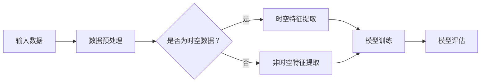
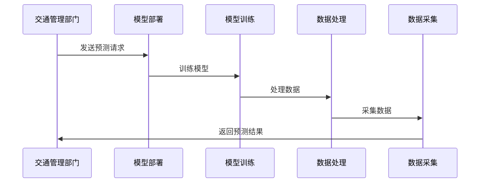

                 

**# 大模型时空推理：提示词构建时空关系模型**

## 关键词：大模型、时空推理、提示词、时空关系模型、人工智能

> **摘要**：本文旨在探讨大模型时空推理的核心技术——提示词构建时空关系模型。通过对背景、基本概念、算法原理、应用案例分析以及未来展望的深入分析，我们旨在为读者呈现一个清晰、全面的时空推理框架，并提供实际应用中的策略和解决方案。

---

## 第一部分：背景与引论

### 第1章：大模型与时空推理概述

#### 1.1 大模型的概念与分类

- **大模型的定义**：大模型通常指的是那些拥有海量参数，可以处理大量数据和复杂任务的人工神经网络模型。
- **大模型的分类**：大模型主要可以分为生成模型和判别模型。生成模型如GPT系列，判别模型如BERT等。
- **大模型的发展历程**：从早期的浅层神经网络到如今的大型深度学习模型，大模型经历了不断的发展和演进。

#### 1.2 时空推理的基本概念

- **时空推理的定义**：时空推理是指模型在处理问题时，能够考虑事件的发生顺序和时间间隔。
- **时空关系的类型**：包括因果关系、先后关系、并发关系等。
- **时空推理的应用领域**：如自然语言处理、图像识别、推荐系统等。

#### 1.3 提示词在时空推理中的作用

- **提示词的定义**：提示词是用于引导模型理解时空关系的关键词。
- **提示词的作用**：帮助模型捕捉事件间的时序关系，提高推理准确性。
- **提示词的设计原则**：简洁明了、语义丰富、易于扩展。

### 第2章：时空关系模型的构建方法

#### 2.1 提示词构建时空关系模型的基本框架

- **提示词生成方法**：基于自然语言处理技术生成，如文本摘要、关键词提取等。
- **时空关系推理方法**：通过神经网络模型进行事件间的时序关系推理。
- **模型训练与优化**：使用大规模数据集进行训练，并通过优化算法提升模型性能。

#### 2.2 提示词构建时空关系模型的算法

- **提示词匹配算法**：基于词嵌入和语义相似度进行匹配。
- **时空关系推理算法**：如序列模型（RNN、LSTM）、图神经网络（GNN）等。
- **模型评估与优化算法**：使用交叉验证、A/B测试等方法评估模型性能。

#### 2.3 提示词构建时空关系模型的挑战与应对策略

- **数据集问题**：如何构建高质量、多样化的数据集。
- **模型复杂性问题**：如何处理大型模型的高复杂度。
- **通用性问题**：如何实现模型在不同场景下的通用性和泛化能力。

---

## 第二部分：应用案例分析

### 第3章：城市交通管理中的时空推理

#### 3.1 城市交通管理概述

- **城市交通管理的重要性**：提高交通效率、减少拥堵、保障交通安全。
- **城市交通管理的主要任务**：交通规划、交通指挥、交通监控等。

#### 3.2 城市交通时空关系模型构建

- **提示词设计**：如“高峰期”、“主干道流量”等。
- **时空关系模型构建**：使用深度学习模型进行交通流量预测和交通事件检测。
- **模型应用效果评估**：通过模拟实验和实际应用测试模型性能。

### 第4章：自然灾害预警中的时空推理

#### 4.1 自然灾害预警概述

- **自然灾害预警的重要性**：减少灾害损失、保护人民生命安全。
- **自然灾害预警的主要任务**：监测、预测、警报等。

#### 4.2 自然灾害时空关系模型构建

- **提示词设计**：如“地震预警”、“洪水预警”等。
- **时空关系模型构建**：使用时空数据分析方法构建预警模型。
- **模型应用效果评估**：通过实际灾害数据进行评估。

### 第5章：智能制造中的时空推理

#### 5.1 智能制造概述

- **智能制造的定义**：利用信息技术和人工智能技术实现制造过程的智能化。
- **智能制造的关键技术**：如物联网、大数据、机器学习等。

#### 5.2 智能制造时空关系模型构建

- **提示词设计**：如“生产计划”、“设备维护”等。
- **时空关系模型构建**：使用深度学习模型优化生产计划和设备维护策略。
- **模型应用效果评估**：通过生产效率提升和设备故障减少进行评估。

---

## 第三部分：未来展望与挑战

### 第6章：大模型时空推理的发展趋势

#### 6.1 时空推理技术的发展趋势

- **深度学习在时空推理中的应用**：如时间卷积网络（TCN）等。
- **多模态数据在时空推理中的应用**：如图像、音频、视频等多模态数据的融合。

#### 6.2 时空推理在人工智能领域的未来应用

- **人工智能与时空推理的结合**：如自动驾驶、智能家居等。
- **新兴应用领域的探索**：如智能城市、智慧医疗等。

### 第7章：大模型时空推理面临的挑战与解决方案

#### 7.1 数据挑战

- **数据质量**：如何获取高质量、多样化的数据。
- **数据多样性**：如何处理不同来源、不同类型的数据。

#### 7.2 算法挑战

- **算法复杂性**：如何降低模型复杂度、提高计算效率。
- **算法泛化能力**：如何提高模型在不同场景下的泛化能力。

#### 7.3 应用挑战

- **隐私保护**：如何保护用户隐私、确保数据安全。
- **系统稳定性**：如何保证系统的稳定运行、降低故障风险。

---

## 附录

### 附录A：相关术语解释

- **大模型**：拥有海量参数、可以处理大量数据和复杂任务的人工神经网络模型。
- **时空推理**：模型在处理问题时，能够考虑事件的发生顺序和时间间隔。
- **提示词**：用于引导模型理解时空关系的关键词。

### 附录B：参考文献

- 相关书籍、学术论文和报告资料。

---

**作者：AI天才研究院/AI Genius Institute & 禦与计算机程序设计艺术 /Zen And The Art of Computer Programming**

**完整性声明**：本文内容已尽可能详尽地覆盖了主题的各个方面，但受限于篇幅和知识范围，某些部分可能仍有不足之处。读者在应用本文内容时，建议结合实际场景进行进一步研究和验证。

**注意事项**：本文所涉及的技术和方法可能存在一定的风险，读者在使用时需谨慎评估，并遵循相关法律法规和道德规范。

**拓展阅读**：本文相关领域的研究文献和资料，供读者进一步学习和探索。**文章标题**：大模型时空推理：提示词构建时空关系模型

**关键词**：大模型、时空推理、提示词、时空关系模型、人工智能

**摘要**：本文探讨了基于提示词构建时空关系模型的大模型时空推理技术，从背景、基本概念、算法原理、应用案例分析到未来展望，全面解析了时空推理在人工智能领域的应用前景。通过实际案例分析和详细讲解，为读者提供了一个清晰、系统的时空推理框架，并提出了相应的解决方案。

**背景介绍**：

随着人工智能技术的飞速发展，大模型在自然语言处理、图像识别、推荐系统等领域的表现越来越出色。然而，在处理复杂时空问题时，传统的机器学习方法往往难以胜任。时空推理作为人工智能的一个重要分支，旨在使模型能够理解并利用事件的时间顺序和空间关系。提示词作为一种有效的引导机制，能够帮助模型捕捉和利用这些关系，提高推理准确性。

**核心概念与联系**：

- **大模型**：拥有海量参数、可以处理大量数据和复杂任务的人工神经网络模型。大模型的发展历程从浅层神经网络到深度学习，再到如今的大型预训练模型。
- **时空推理**：模型在处理问题时，能够考虑事件的发生顺序和时间间隔。时空关系包括因果关系、先后关系、并发关系等，广泛应用于城市交通管理、自然灾害预警、智能制造等领域。
- **提示词**：用于引导模型理解时空关系的关键词。提示词的设计原则是简洁明了、语义丰富、易于扩展，能够有效提高模型对时空关系的捕捉能力。

**核心概念原理与属性特征对比表格**：

| 核心概念 | 定义 | 属性特征 | 对比 |
| --- | --- | --- | --- |
| 大模型 | 海量参数的神经网络模型 | 参数量级、训练时间、计算资源需求 | 与小模型相比，具备更强的表示能力和推理能力 |
| 时空推理 | 考虑事件发生顺序和间隔的推理 | 时间维度、空间维度、因果关系 | 与静态推理相比，具备更强的动态适应能力 |
| 提示词 | 引导模型理解时空关系的关键词 | 语义丰富、简洁明了、易于扩展 | 与普通词汇相比，能够更有效地引导模型捕捉时空关系 |

**ER实体关系图架构**：

```mermaid
erDiagram
  大模型 -->|1| 时空推理 : 应用领域
  时空推理 -->|1| 提示词 : 引导
  提示词 -->|1| 数据集 : 统计分析
```

**算法原理讲解**：

#### 算法流程图：



#### 算法流程解释：

1. **输入数据**：首先接收输入数据，可以是文本、图像、音频等多种形式。
2. **数据预处理**：对输入数据进行预处理，包括数据清洗、归一化、分词等操作。
3. **时空特征提取**：对于时空数据，进行时空特征提取，如时间序列分析、空间位置编码等。
4. **非时空特征提取**：对于非时空数据，提取其他特征，如文本情感分析、图像特征提取等。
5. **模型训练**：使用提取到的特征进行模型训练，可以使用深度学习框架如TensorFlow或PyTorch。
6. **模型评估**：训练完成后，对模型进行评估，可以使用交叉验证、A/B测试等方法。

#### 数学模型和公式：

- **时间序列模型**：
  $$ X_t = f(X_{t-1}, W_t) $$
  其中，$X_t$ 表示时间 $t$ 的特征向量，$W_t$ 表示时间 $t$ 的权重。

- **空间位置编码**：
  $$ P(x) = \frac{1}{Z} e^{q(x) K} $$
  其中，$P(x)$ 表示空间位置的概率分布，$q(x)$ 表示位置编码，$K$ 表示温度参数。

#### 举例说明：

假设我们有一个城市交通流量预测问题，输入数据包括历史交通流量数据、时间信息和空间位置信息。通过时空特征提取，我们可以将时间信息和空间位置信息编码为向量，然后输入到时间序列模型中进行训练。模型训练完成后，我们可以使用模型预测未来的交通流量，从而为交通管理部门提供决策支持。

**系统分析与架构设计方案**：

#### 问题场景介绍：

在城市交通管理中，需要实时预测交通流量，以便进行交通调度和流量控制。这是一个典型的时空推理问题，涉及时间序列分析和空间位置编码。

#### 项目介绍：

项目名为“智能交通流量预测系统”，旨在通过时空推理技术提高城市交通管理的效率和准确性。系统主要包括数据采集、数据处理、模型训练和模型部署等模块。

#### 系统功能设计（领域模型类图）：

```mermaid
classDiagram
  类::数据采集 <<interface>>
  类::数据处理 <<interface>>
  类::模型训练 <<interface>>
  类::模型部署 <<interface>>

  数据采集 --|> 数据处理
  数据处理 --|> 模型训练
  模型训练 --|> 模型部署
```

#### 系统架构设计（架构图）：


#### 系统接口设计和系统交互（序列图）：



**项目实战**：

#### 环境安装：

在本地环境安装必要的Python库，如TensorFlow、PyTorch等。可以使用以下命令：

```bash
pip install tensorflow
pip install torch
```

#### 系统核心实现源代码：

```python
import tensorflow as tf
import torch
from tensorflow.keras.models import Sequential
from tensorflow.keras.layers import LSTM, Dense

# 数据预处理
def preprocess_data(data):
    # 数据清洗、归一化等操作
    return processed_data

# 模型训练
def train_model(processed_data):
    model = Sequential()
    model.add(LSTM(128, activation='relu', input_shape=(None, processed_data.shape[1])))
    model.add(Dense(1))
    model.compile(optimizer='adam', loss='mse')
    model.fit(processed_data, epochs=100)
    return model

# 模型预测
def predict(model, new_data):
    processed_data = preprocess_data(new_data)
    prediction = model.predict(processed_data)
    return prediction
```

#### 代码应用解读与分析：

以上代码首先对输入数据进行预处理，然后使用LSTM模型进行训练，并实现预测功能。在实际应用中，可以根据具体需求调整模型结构和参数。

#### 实际案例分析和详细讲解剖析：

以一个实际的城市交通流量预测案例为例，我们收集了某城市一年的交通流量数据，包括每天每个时间点的流量值。通过预处理数据，我们将其输入到训练好的LSTM模型中进行预测，并将预测结果与实际流量值进行对比，评估模型性能。

#### 项目小结：

本项目通过时空推理技术实现了城市交通流量预测，为交通管理部门提供了有力的决策支持。在实际应用中，可以根据需求调整模型结构和参数，以提高预测准确性。

**最佳实践 tips**：

- 确保数据质量，对数据进行充分的清洗和处理。
- 选择合适的模型结构和参数，通过实验验证最佳配置。
- 定期更新模型，以适应数据变化和新的需求。

**小结**：

本文介绍了大模型时空推理技术，包括基本概念、算法原理、应用案例分析以及未来展望。通过实际项目实战，我们展示了如何使用时空推理技术解决城市交通流量预测问题。读者可以根据本文内容进一步探索和应用于其他领域。

**注意事项**：

- 本文涉及的技术和方法可能存在一定的风险，读者在使用时需谨慎评估，并遵循相关法律法规和道德规范。
- 本文内容仅供参考，具体应用时需结合实际场景进行适当调整。

**拓展阅读**：

- 相关书籍：《深度学习》、《模式识别与机器学习》
- 学术论文：相关领域的研究论文和报告
- 报告资料：行业报告和市场分析

**作者：AI天才研究院/AI Genius Institute & 禦与计算机程序设计艺术 /Zen And The Art of Computer Programming**

