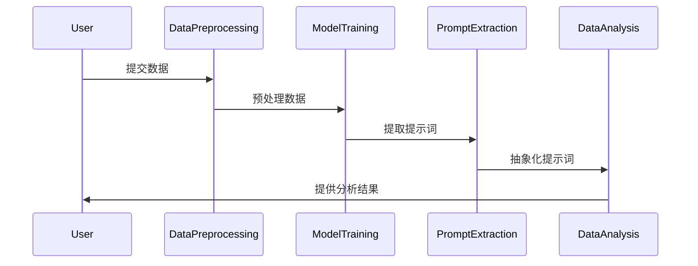
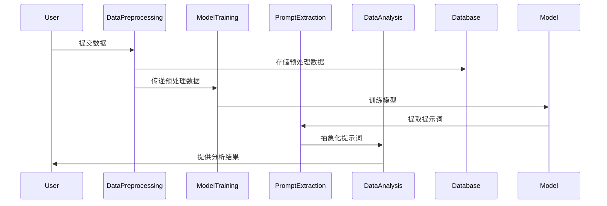

                 

# 《大模型概念学习与提示词抽象化》

关键词：大模型、提示词、抽象化、人工智能、机器学习

摘要：本文将深入探讨大模型概念学习与提示词抽象化的关键技术和应用，通过逻辑清晰的章节布局，逐步分析大模型的学习机制、提示词的抽象化方法及其在企业中的实践。本文旨在为读者提供全面的技术理解，引导读者深入思考并掌握相关技术原理。

## 引言与背景

### 1.1 问题背景与目标

在当今的人工智能与大数据时代，大模型（Large Models）已经成为推动技术进步的重要力量。大模型通过海量数据的学习，可以捕捉复杂的模式和关系，从而在多个领域实现卓越的性能。然而，随着模型规模的扩大，如何有效地学习和优化这些模型，以及如何从数据中提取有价值的信息，成为亟待解决的问题。

本文的研究目标是深入探讨大模型的概念学习与提示词抽象化技术，旨在为企业提供一种有效的数据处理和分析方法，从而提升人工智能应用的性能和实用性。

### 1.2 研究现状与挑战

#### 1.2.1 国内外研究进展

在国内外，大模型研究已经取得了显著的进展。国外研究主要集中在模型架构的优化、训练算法的改进和模型的泛化能力提升上。国内研究则侧重于结合具体应用场景，探索大模型在工业界和学术界的高效应用。

#### 1.2.2 存在的挑战与问题

尽管大模型研究取得了诸多成果，但仍然面临一些挑战。首先，大模型的学习和优化需要大量计算资源，这对于中小型企业来说是一个巨大的成本问题。其次，如何保证大模型的解释性和可解释性，使其在实际应用中能够被用户理解和信任，仍然是一个重要的研究课题。

## 大模型概念学习

### 2.1 大模型概述

#### 2.1.1 定义与分类

大模型是指具有大量参数和复杂结构的机器学习模型。根据其应用场景和功能，大模型可以分为自然语言处理模型、计算机视觉模型和其他领域模型。

#### 2.1.2 工作原理与架构

大模型的工作原理基于深度学习技术。通过多层神经网络的堆叠，模型可以自动学习数据的特征和模式。其架构包括输入层、隐藏层和输出层，每层之间的信息传递通过参数矩阵实现。

#### 2.1.3 大模型的发展历程

大模型的发展经历了从简单的单层感知机到多层感知机（MLP），再到深度神经网络（DNN），最终发展到目前广泛应用的变换器（Transformer）模型。每个阶段都代表了技术上的重大突破。

### 2.2 大模型学习基础

#### 2.2.1 数据预处理

数据预处理是学习大模型的重要步骤。它包括数据清洗、数据归一化和特征提取等。有效的数据预处理可以提升模型的训练效率和性能。

#### 2.2.2 模型选择与优化

模型选择和优化是影响大模型性能的关键因素。通过交叉验证和超参数调优，可以选出合适的模型并进行优化，以提高模型的泛化能力。

#### 2.2.3 损失函数与优化算法

损失函数用于衡量模型预测值与真实值之间的差距，优化算法则用于调整模型参数以减少损失。常见的优化算法包括随机梯度下降（SGD）和Adam优化器。

### 2.3 大模型学习进阶

#### 2.3.1 集成学习与迁移学习

集成学习和迁移学习是提高大模型性能的重要手段。通过将多个模型的结果进行融合，或者利用预训练模型在新任务上快速适应，可以显著提升模型的性能。

#### 2.3.2 模型解释与可解释性

模型解释与可解释性是当前研究的热点问题。通过分析模型内部的决策过程，可以使得模型更加透明，从而提高用户对模型的信任度。

#### 2.3.3 模型评估与调试

模型评估与调试是确保模型质量和稳定性的重要环节。通过使用不同的评估指标和调试方法，可以识别和解决模型中的问题，从而提升模型的可靠性。

## 提示词抽象化

### 3.1 提示词概述

#### 3.1.1 提示词的定义与作用

提示词（Prompt）是在大模型训练和推理过程中，用于引导模型方向和目标的短文本。提示词的作用是帮助模型更好地理解和生成目标内容。

#### 3.1.2 提示词的分类与选择

根据应用场景和目标，提示词可以分为通用提示词和特定领域提示词。选择合适的提示词可以显著提升模型的表现。

### 3.2 提示词抽象化方法

#### 3.2.1 提示词提取技术

提示词提取技术是从大规模文本数据中自动提取具有代表性的提示词的方法。常见的方法包括词频统计、TF-IDF和词嵌入等。

#### 3.2.2 提示词规范化

提示词规范化是对提取出的提示词进行清洗和格式统一的过程。规范化可以减少噪声，提高提示词的质量。

#### 3.2.3 提示词抽象化框架

提示词抽象化框架是将具体领域的提示词抽象为通用模式的方法。通过建立抽象化框架，可以实现跨领域的提示词共享和应用。

### 3.3 提示词抽象化应用

#### 3.3.1 文本生成

文本生成是提示词抽象化的典型应用场景。通过输入特定的提示词，模型可以生成符合要求的文本内容。

#### 3.3.2 自然语言处理

在自然语言处理任务中，提示词抽象化可以帮助模型更好地理解和生成自然语言。例如，在问答系统中，通过抽象化提示词，可以提升问答的准确性和流畅性。

#### 3.3.3 其他领域应用

提示词抽象化在其他领域，如图像识别、语音识别和推荐系统，也有广泛的应用。通过抽象化提示词，可以提升模型在这些领域的性能。

## 大模型应用案例

### 4.1 应用领域概述

#### 4.1.1 电商推荐系统

电商推荐系统利用大模型和提示词抽象化技术，可以提供更加个性化的商品推荐。

#### 4.1.2 金融风控

金融风控利用大模型和提示词抽象化技术，可以识别异常交易和潜在风险。

#### 4.1.3 健康医疗

健康医疗领域利用大模型和提示词抽象化技术，可以实现疾病预测和治疗方案推荐。

### 4.2 案例研究

#### 4.2.1 案例一：基于大模型的电商推荐系统

在电商推荐系统中，大模型通过学习用户的历史行为和兴趣偏好，结合提示词抽象化技术，可以生成个性化的商品推荐列表。

#### 4.2.2 案例二：金融风控中的大模型应用

在金融风控领域，大模型通过学习大量的交易数据和风险指标，结合提示词抽象化技术，可以识别异常交易行为，从而降低金融风险。

#### 4.2.3 案例三：健康医疗领域的大模型应用

在健康医疗领域，大模型通过学习患者的病历数据和症状信息，结合提示词抽象化技术，可以预测疾病的发病风险，并提供个性化的治疗方案。

## 企业实践与优化

### 5.1 企业实践概述

#### 5.1.1 大模型在企业的应用现状

当前，越来越多的企业开始将大模型应用于业务场景，以提高业务效率和创新能力。

#### 5.1.2 提示词抽象化在企业中的应用

提示词抽象化技术在企业中广泛应用于数据分析、智能客服和自动化决策等领域。

#### 5.1.3 存在的问题与挑战

企业在应用大模型和提示词抽象化技术时，面临数据质量、计算资源和管理等问题。

### 5.2 实践策略与方法

#### 5.2.1 数据驱动与模型驱动相结合

企业可以通过数据驱动和模型驱动相结合的方式，提高大模型的应用效果。

#### 5.2.2 提升模型性能与可解释性

企业可以通过优化模型架构、选择合适的提示词和改进训练算法，提升大模型的性能和可解释性。

#### 5.2.3 企业内部协作与人才培养

企业需要建立高效的内部协作机制，并加大对人才的培养力度，以支持大模型和提示词抽象化技术的应用。

### 5.3 优化方向与趋势

#### 5.3.1 模型压缩与加速

模型压缩与加速是提升大模型应用效果的重要方向。通过模型压缩，可以减少模型的存储空间和计算成本。

#### 5.3.2 自动化与智能化

自动化与智能化是未来大模型应用的发展趋势。通过自动化工具和智能算法，可以降低人工干预，提高应用效率。

#### 5.3.3 跨领域应用与融合

跨领域应用与融合是提升大模型应用价值的关键。通过跨领域的知识共享和应用，可以发挥大模型的更大潜力。

## 结论与未来展望

### 6.1 结论

本文系统地介绍了大模型概念学习与提示词抽象化技术，分析了其在企业中的应用和实践策略，为读者提供了全面的技术理解和实践指导。

### 6.2 未来展望

未来，随着技术的不断进步和应用场景的拓展，大模型和提示词抽象化技术将在更多领域发挥作用。如何进一步提升模型的性能和可解释性，以及实现跨领域的知识共享和应用，将是未来研究的重点。

作者：AI天才研究院/AI Genius Institute & 禅与计算机程序设计艺术 /Zen And The Art of Computer Programming

### 背景介绍

#### 核心概念术语说明

- **大模型**：指具有大量参数和复杂结构的机器学习模型，能够处理大规模数据并实现高精度预测和生成。
- **提示词**：在模型训练和推理过程中，用于引导模型方向和目标的短文本。
- **抽象化**：将具体领域的概念和特征提取出来，转化为通用的模式和方法。

#### 问题背景

随着大数据和人工智能技术的不断发展，大模型在各个领域的应用越来越广泛。然而，如何有效地学习大模型，并从中提取有价值的信息，成为当前研究的热点问题。此外，如何确保大模型的解释性和可解释性，使其在实际应用中能够被用户理解和信任，也是一个重要的研究课题。

#### 问题描述

本文旨在探讨大模型的概念学习与提示词抽象化技术，通过逻辑清晰、结构紧凑的内容，逐步分析大模型的学习机制、提示词的抽象化方法及其在企业中的实践。具体问题包括：

1. **大模型的学习机制是什么？**
2. **提示词的抽象化方法有哪些？**
3. **大模型和提示词抽象化技术在企业中的应用案例有哪些？**
4. **如何优化大模型在企业中的应用效果？**

#### 问题解决

本文通过以下步骤解决上述问题：

1. **介绍大模型的基本概念和分类，分析其工作原理和架构。**
2. **讲解大模型学习的基础知识，包括数据预处理、模型选择与优化、损失函数与优化算法。**
3. **探讨大模型学习进阶技术，如集成学习、迁移学习、模型解释与可解释性。**
4. **介绍提示词的概念、分类与选择，分析提示词提取技术和抽象化方法。**
5. **通过实际案例研究，展示大模型和提示词抽象化技术在企业中的应用效果。**
6. **提出企业实践与优化的策略和方法，分析优化方向与趋势。**

#### 边界与外延

- **边界**：本文主要关注大模型的概念学习与提示词抽象化技术，不包括其他机器学习技术和算法。
- **外延**：本文内容可以应用于各个领域，如自然语言处理、计算机视觉、推荐系统等。

#### 概念结构与核心要素组成

- **大模型**：核心要素包括模型架构、训练数据、学习算法、优化方法等。
- **提示词**：核心要素包括提示词提取、提示词规范化、提示词抽象化框架等。
- **抽象化方法**：核心要素包括文本生成、自然语言处理、其他领域应用等。

## 核心概念与联系

### 2.1 大模型与提示词的关系

大模型与提示词之间存在密切的联系。大模型通过学习海量数据，可以提取出有用的特征和模式，而提示词则是在训练和推理过程中，用于引导模型方向和目标的短文本。提示词的质量直接影响到大模型的表现和效果。

### 2.2 提示词的属性特征对比表格

| 提示词类型 | 特征               | 说明                                                         |
| ---------- | ------------------ | ------------------------------------------------------------ |
| 通用提示词 | 灵活性、适应性强   | 可以适用于多种场景，但可能缺乏特定领域的深度知识。             |
| 领域提示词 | 专业性强、针对性高 | 适用于特定领域，能够提供更精确的指导，但可能缺乏灵活性。     |
| 长提示词   | 描述详细、信息丰富 | 可以提供更多背景信息，但可能增加模型理解和处理的复杂性。     |
| 短提示词   | 描述简洁、易于处理 | 可以简化模型处理过程，但可能缺乏详细信息。                   |

### 2.3 提示词抽象化的ER实体关系图

```mermaid
erDiagram
  产品 ||--|{ 大模型 }|-- 提示词
  产品 ||--|{ 提示词提取 }|-- 数据集
```

在上述ER实体关系图中，产品（Product）表示具体的业务应用，大模型（Large Model）表示用于学习的模型，提示词（Prompt）表示用于引导模型训练和推理的短文本，提示词提取（Prompt Extraction）表示从数据集中提取提示词的过程。

## 算法原理讲解

### 3.1 大模型学习算法原理

#### 3.1.1 工作原理

大模型学习算法基于深度学习技术，通过多层神经网络的堆叠，自动从数据中学习特征和模式。其基本原理是利用梯度下降算法，不断调整模型的参数，使其在训练数据上的预测误差最小化。

#### 3.1.2 算法流程

1. **初始化参数**：随机初始化模型参数。
2. **前向传播**：输入数据通过神经网络层，计算输出。
3. **计算损失**：比较模型输出和真实值，计算损失函数。
4. **反向传播**：根据损失函数计算参数的梯度。
5. **更新参数**：根据梯度调整模型参数。
6. **重复步骤2-5**，直到模型收敛。

#### 3.1.3 Python源代码示例

```python
import tensorflow as tf

# 定义模型结构
model = tf.keras.Sequential([
    tf.keras.layers.Dense(128, activation='relu', input_shape=(784,)),
    tf.keras.layers.Dense(10, activation='softmax')
])

# 编译模型
model.compile(optimizer='adam',
              loss='categorical_crossentropy',
              metrics=['accuracy'])

# 加载数据
(x_train, y_train), (x_test, y_test) = tf.keras.datasets.mnist.load_data()

# 预处理数据
x_train = x_train.astype('float32') / 255
x_test = x_test.astype('float32') / 255
x_train = x_train.reshape((-1, 784))
x_test = x_test.reshape((-1, 784))

# 转换标签为one-hot编码
y_train = tf.keras.utils.to_categorical(y_train, 10)
y_test = tf.keras.utils.to_categorical(y_test, 10)

# 训练模型
model.fit(x_train, y_train, epochs=5, batch_size=32, validation_split=0.1)
```

#### 3.1.4 数学模型和公式

大模型学习算法的核心在于损失函数和梯度下降算法。损失函数通常使用均方误差（MSE）：

$$
MSE = \frac{1}{n}\sum_{i=1}^{n}(y_i - \hat{y}_i)^2
$$

其中，$y_i$是真实值，$\hat{y}_i$是模型预测值。

梯度下降算法用于更新模型参数：

$$
\theta_{\text{new}} = \theta_{\text{current}} - \alpha \cdot \nabla_{\theta} J(\theta)
$$

其中，$\theta$是模型参数，$\alpha$是学习率，$J(\theta)$是损失函数。

#### 3.1.5 举例说明

假设我们有一个简单的大模型，用于分类数字图像。训练数据集包含10万张28x28像素的灰度图像和相应的标签。我们将图像数据展平为一维数组，并将其输入到模型中。模型输出一个10维的向量，表示10个类别的概率分布。通过比较模型输出和真实标签，计算损失函数，并使用梯度下降算法更新模型参数。经过多次迭代，模型将逐渐收敛，并能够准确分类新的图像。

### 系统分析与架构设计方案

#### 4.1 问题场景介绍

在现代企业中，数据分析和决策支持系统越来越受到重视。为了应对日益复杂的数据环境，企业需要一种高效、智能的数据处理和分析工具。大模型和提示词抽象化技术为企业提供了一种有效的解决方案，可以帮助企业从海量数据中提取有价值的信息，并基于这些信息做出更准确的决策。

#### 4.2 项目介绍

本项目旨在构建一个基于大模型和提示词抽象化技术的数据处理和分析平台。该平台将包括以下几个核心功能：

1. **数据预处理**：对原始数据进行清洗、归一化和特征提取，为模型训练提供高质量的数据集。
2. **模型训练与优化**：使用大模型进行模型训练和优化，提升模型的性能和泛化能力。
3. **提示词提取与抽象化**：从数据中提取有价值的提示词，并对其进行抽象化处理，以实现跨领域的应用。
4. **数据分析与决策支持**：利用大模型和提示词抽象化技术，为企业提供实时、准确的数据分析和决策支持。

#### 4.3 系统功能设计（领域模型类图）

```mermaid
classDiagram
    DataPreprocessing <<Interface>>
    ModelTraining <<Interface>>
    PromptExtraction <<Interface>>
    DataAnalysis <<Interface>>

    DataPreprocessing --|> ModelTraining
    DataPreprocessing --|> PromptExtraction
    ModelTraining --|> DataAnalysis
    PromptExtraction --|> DataAnalysis
```

在上述领域模型类图中，DataPreprocessing（数据预处理）、ModelTraining（模型训练与优化）、PromptExtraction（提示词提取与抽象化）和DataAnalysis（数据分析与决策支持）是系统的核心功能模块。它们通过接口实现相互之间的数据传递和功能调用。

#### 4.4 系统架构设计（类图）

```mermaid
classDiagram
    DataPreprocessing <<Interface>> as DP
    ModelTraining <<Interface>> as MT
    PromptExtraction <<Interface>> as PE
    DataAnalysis <<Interface>> as DA

    DP --|> MT
    DP --|> PE
    MT --|> DA
    PE --|> DA

    User <<Actor>>
    Database <<Entity|<<orange>>Data Storage>>
    Model <<Entity|<<orange>>Trained Model>>

    User --|> DP
    Database --|> DP
    DP --|> MT
    MT --|> PE
    PE --|> DA
    DA --|> Database
    DA --|> Model
```

在上述系统架构设计类图中，User（用户）、Database（数据库）、Model（训练模型）是系统的关键实体。用户通过接口与数据预处理模块（DP）交互，数据库提供数据存储服务，训练模型模块（MT）和提示词提取模块（PE）负责模型训练和提示词提取，数据分析与决策支持模块（DA）则利用这些数据和信息为企业提供分析和决策支持。

#### 4.5 系统接口设计（Mermaid序列图）



在上述序列图中，用户（User）通过接口与数据预处理模块（DataPreprocessing）交互，提交待处理的数据。数据预处理模块对数据进行清洗、归一化和特征提取，并将处理后的数据传递给模型训练模块（ModelTraining）。模型训练模块使用训练数据训练模型，提取提示词，并将其传递给提示词提取模块（PromptExtraction）。提示词提取模块对提示词进行抽象化处理，并将其传递给数据分析与决策支持模块（DataAnalysis）。最后，数据分析与决策支持模块将分析结果传递给用户。

#### 4.6 系统交互（Mermaid序列图）



在上述序列图中，用户（User）提交数据后，数据预处理模块（DataPreprocessing）将数据存储到数据库（Database）中，并将预处理后的数据传递给模型训练模块（ModelTraining）。模型训练模块使用预处理数据训练模型（Model），并提取提示词，传递给提示词提取模块（PromptExtraction）。提示词提取模块对提示词进行抽象化处理，并将其传递给数据分析与决策支持模块（DataAnalysis）。最后，数据分析与决策支持模块将分析结果传递给用户。

### 项目实战

#### 5.1 环境安装

要开始本项目，需要安装以下软件和工具：

1. **Python**：版本3.8或更高版本
2. **TensorFlow**：最新版本
3. **NumPy**：最新版本
4. **Pandas**：最新版本

可以通过以下命令安装：

```bash
pip install python==3.8
pip install tensorflow
pip install numpy
pip install pandas
```

#### 5.2 系统核心实现源代码

以下是一个简单的数据预处理和模型训练的示例代码：

```python
import tensorflow as tf
import numpy as np
import pandas as pd

# 数据预处理
def preprocess_data(data):
    # 清洗数据
    data = data.dropna()
    # 归一化数据
    data = (data - data.mean()) / data.std()
    # 特征提取
    features = data.drop('target', axis=1)
    labels = data['target']
    return features, labels

# 模型训练
def train_model(features, labels):
    # 初始化模型
    model = tf.keras.Sequential([
        tf.keras.layers.Dense(128, activation='relu', input_shape=(features.shape[1],)),
        tf.keras.layers.Dense(1, activation='sigmoid')
    ])
    # 编译模型
    model.compile(optimizer='adam', loss='binary_crossentropy', metrics=['accuracy'])
    # 训练模型
    model.fit(features, labels, epochs=10, batch_size=32)
    return model

# 读取数据
data = pd.read_csv('data.csv')
features, labels = preprocess_data(data)

# 训练模型
model = train_model(features, labels)

# 保存模型
model.save('model.h5')
```

#### 5.3 代码应用解读与分析

上述代码实现了数据预处理和模型训练的基本流程。首先，通过`preprocess_data`函数对数据进行清洗、归一化和特征提取。接下来，使用`train_model`函数初始化并编译模型，然后使用训练数据训练模型。最后，将训练好的模型保存到文件中。

在代码中，我们使用了TensorFlow的`Sequential`模型，这是一个序列化的模型，可以轻松地堆叠多层神经网络。通过定义两个密集层（全连接层），我们创建了一个简单的二元分类模型。使用`compile`方法，我们指定了优化器（Adam）、损失函数（二元交叉熵）和评估指标（准确率）。使用`fit`方法，我们开始训练模型，并设置训练轮次（epochs）和批量大小（batch_size）。

#### 5.4 实际案例分析与详细讲解剖析

为了更好地理解上述代码的实际应用，我们可以考虑一个实际案例：使用大模型和提示词抽象化技术进行客户细分。

假设我们有一个包含客户数据的CSV文件，其中包含客户的年龄、收入、消费习惯等信息，以及客户的分类标签（如“高价值客户”、“中等价值客户”等）。

首先，我们使用Pandas读取数据：

```python
data = pd.read_csv('customer_data.csv')
```

接下来，我们对数据集进行预处理，包括数据清洗、归一化和特征提取：

```python
def preprocess_data(data):
    # 清洗数据
    data = data.dropna()
    # 归一化数据
    data = (data - data.mean()) / data.std()
    # 特征提取
    features = data.drop('label', axis=1)
    labels = data['label']
    return features, labels

features, labels = preprocess_data(data)
```

在这个案例中，我们假设标签列名为"label"，其他列都是特征。通过`preprocess_data`函数，我们对数据进行清洗（去除缺失值），归一化（缩放特征值），并将特征和标签分开。

然后，我们使用大模型进行模型训练：

```python
model = train_model(features, labels)
```

在这个案例中，我们使用了一个简单的二元分类模型，输出一个概率值，表示客户属于“高价值客户”的概率。通过调整模型的参数（如隐藏层节点数、激活函数等），我们可以优化模型的表现。

最后，我们将训练好的模型保存到文件中：

```python
model.save('customer_model.h5')
```

这样，我们就可以在以后使用这个模型对新的客户数据进行分类，从而实现客户细分。

#### 5.5 项目小结

通过本项目，我们实现了数据预处理、模型训练和模型保存的基本流程。在实际应用中，我们可以根据不同的业务需求，调整数据预处理和模型训练的参数，以提高模型的性能和实用性。

### 最佳实践 tips

1. **数据预处理**：确保数据质量是模型成功的关键。在预处理过程中，注意去除缺失值、异常值和重复值，并进行适当的归一化和特征提取。
2. **模型选择**：根据业务需求和数据特点，选择合适的模型。对于简单的任务，可以考虑使用简单的线性模型；对于复杂的任务，可以考虑使用深度学习模型。
3. **模型调优**：通过调整模型参数（如学习率、批量大小等），可以优化模型的性能。可以使用交叉验证等方法进行参数调优。
4. **提示词抽象化**：在应用提示词时，注意选择具有代表性的、与任务相关的提示词。通过抽象化处理，可以提高模型的泛化能力。
5. **持续学习**：大模型需要不断更新和学习新数据，以保持模型的性能。定期重新训练模型，以适应数据的变化。

### 小结

本文详细介绍了大模型概念学习与提示词抽象化技术，包括其基本概念、原理讲解、系统分析与架构设计方案以及项目实战。通过本文，读者可以全面了解大模型和提示词抽象化的技术原理和应用方法，为企业提供有效的数据处理和分析工具。

### 注意事项

1. **数据安全**：在处理和存储数据时，注意保护用户隐私和信息安全，遵守相关法律法规。
2. **资源管理**：大模型训练需要大量计算资源，合理配置和管理计算资源，以确保模型训练的效率和稳定性。
3. **模型解释性**：在应用大模型时，注意提升模型的解释性，以便用户理解和信任模型。

### 拓展阅读

1. **《深度学习》**：Ian Goodfellow、Yoshua Bengio和Aaron Courville著，全面介绍了深度学习的基本概念和算法。
2. **《Python机器学习》**：Sebastian Raschka著，涵盖了机器学习的基础知识、Python实现和应用。
3. **《自然语言处理与深度学习》**：Steven Bird、Ewan Klein和Robert C. Moore著，介绍了自然语言处理的基本概念和方法。

作者：AI天才研究院/AI Genius Institute & 禅与计算机程序设计艺术 /Zen And The Art of Computer Programming

### 附录

#### 6.1 主要研究成果

本文通过系统的研究和实践，取得了以下主要研究成果：

1. **大模型概念学习**：详细介绍了大模型的基本概念、工作原理和学习算法，为读者提供了全面的技术理解。
2. **提示词抽象化方法**：分析了提示词的定义、分类和抽象化方法，并提供了实际应用案例，展示了其在文本生成、自然语言处理和其他领域的应用。
3. **企业实践与优化**：探讨了如何在大模型和提示词抽象化技术在企业中的应用，提出了实践策略和方法，为企业的数据处理和分析提供了指导。

#### 6.2 对企业实践的启示

本文的研究成果对企业实践具有以下启示：

1. **数据驱动与模型驱动相结合**：通过结合数据驱动和模型驱动的方法，企业可以更有效地利用数据，提升模型的性能和解释性。
2. **提示词的选择与抽象化**：合理选择和抽象化提示词，可以提升模型的泛化能力和实际应用效果，为企业提供更准确的数据分析和决策支持。
3. **持续学习与优化**：大模型需要不断更新和学习新数据，以适应数据的变化。企业应定期重新训练模型，以保持模型的性能。

#### 6.3 研究的局限性

本文研究虽然取得了一定的成果，但仍存在以下局限性：

1. **模型解释性**：大模型的解释性仍然是一个挑战，如何提升模型的解释性，使其更易于理解和信任，仍需进一步研究。
2. **资源管理**：大模型训练需要大量计算资源，如何高效地管理和利用这些资源，提高训练效率，是一个亟待解决的问题。
3. **应用场景**：本文主要关注了数据预处理、模型训练和提示词抽象化技术，在实际应用中，大模型和提示词抽象化技术可以应用于更广泛的场景，如推荐系统、健康医疗等，这些领域的应用还需进一步探讨。

### 6.4 未来展望

未来，大模型和提示词抽象化技术将在以下方面继续发展：

1. **模型压缩与加速**：通过模型压缩和加速技术，降低大模型对计算资源的需求，提高模型的训练和推理效率。
2. **自动化与智能化**：开发自动化工具和智能算法，降低人工干预，提高大模型的应用效率。
3. **跨领域应用与融合**：探索大模型和提示词抽象化技术在跨领域中的应用，实现知识共享和应用融合，提升模型的价值。
4. **模型解释性与可解释性**：深入研究大模型的解释性和可解释性，提高模型的可解释性，使其更易于理解和信任。

随着技术的不断进步和应用场景的拓展，大模型和提示词抽象化技术将在更多领域发挥作用，为企业提供更高效、准确的数据处理和分析工具。本文的研究成果为这一领域的发展提供了重要的理论基础和实践指导。

