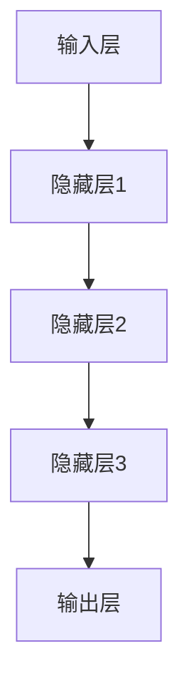
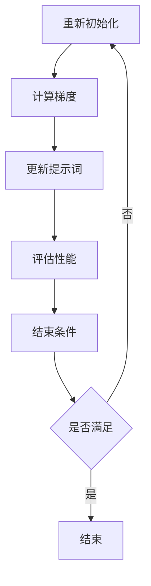
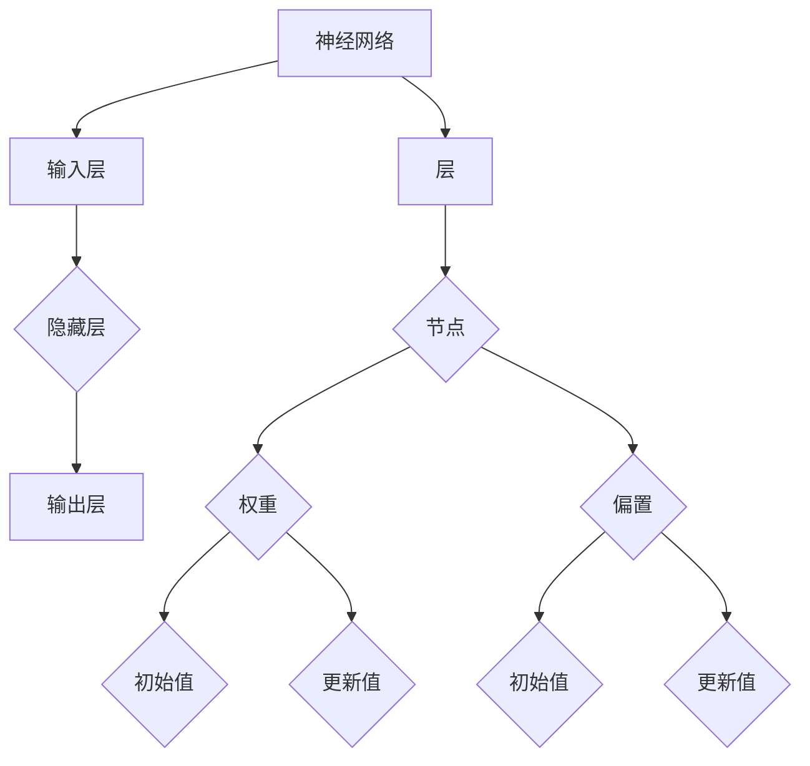
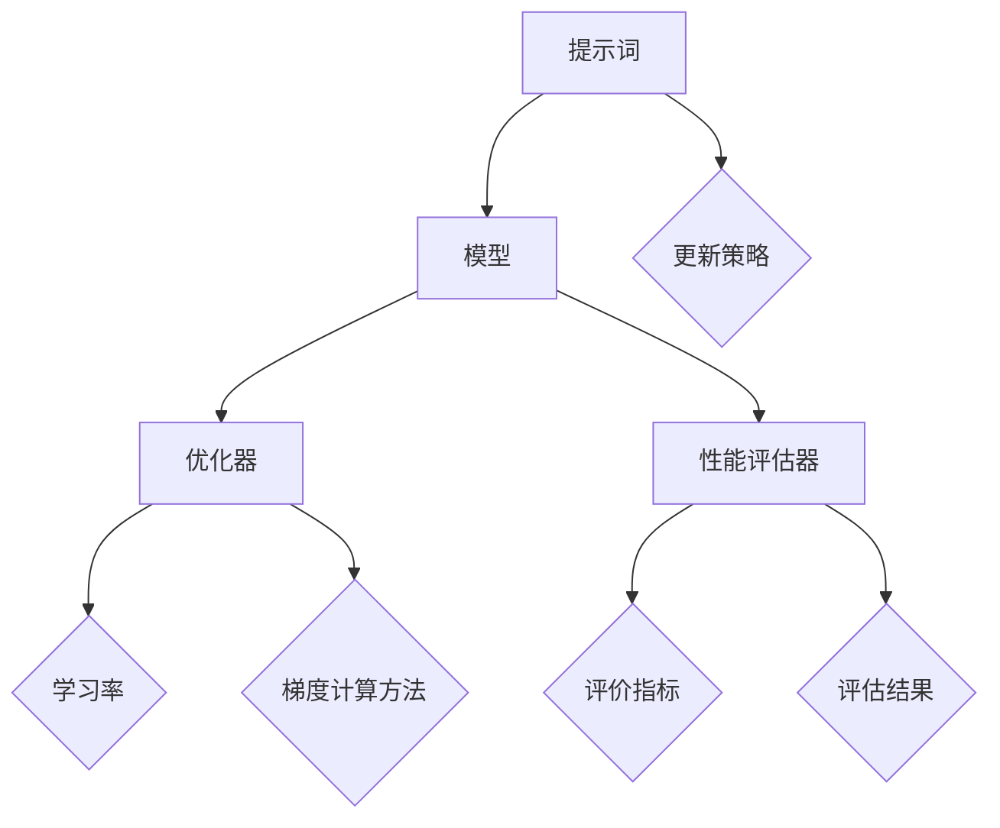
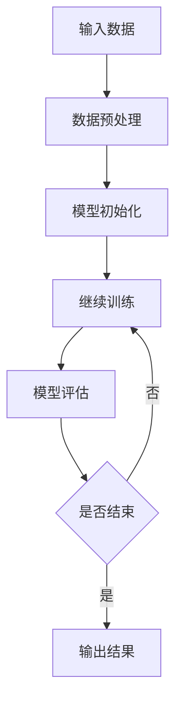
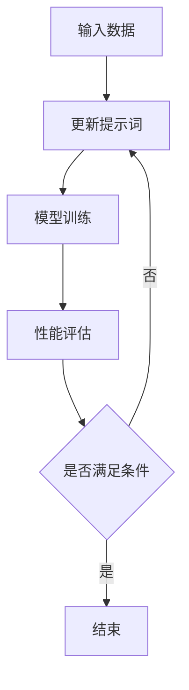
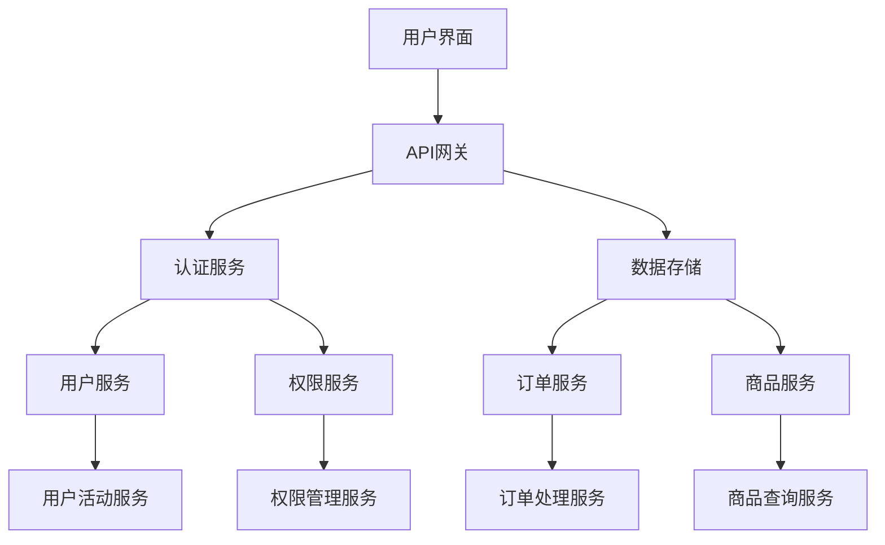
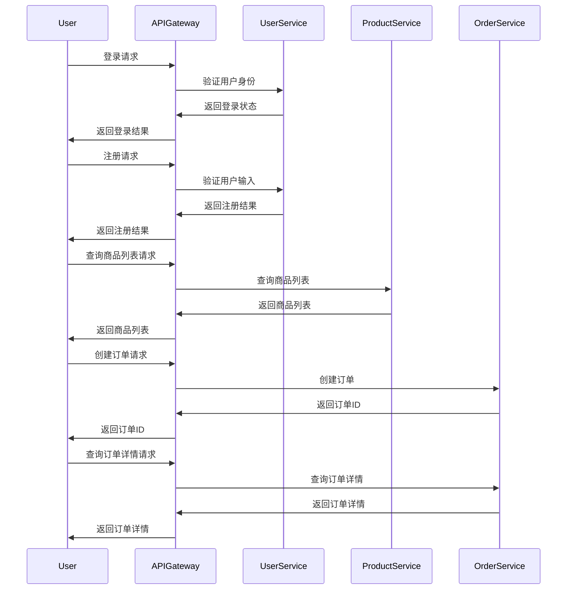

                 

# 大模型概念演化与提示词动态适应

关键词：大模型、人工智能、概念演化、提示词动态适应、算法原理

摘要：本文旨在深入探讨大模型的概念演化以及提示词动态适应的原理和实践。首先，我们将回顾大模型在人工智能领域的发展历程，明确其定义和核心特征，并探讨其在各类应用场景中所面临的挑战。接着，我们将分析大模型的概念演化过程，探讨其从早期模型到现代大型预训练模型的发展轨迹。随后，我们将详细解释提示词动态适应的概念，并分析其在优化大模型性能方面的作用。文章将使用mermaid流程图和Python代码来阐述大模型和提示词动态适应算法的原理，并通过实际案例进行分析。最后，我们将讨论系统的架构设计，包括功能设计、接口设计和交互设计，并展示如何通过项目实战来实现这些概念。

### 目录大纲

---

#### 第一部分：背景介绍

#### 第1章：问题背景

##### 1.1 问题的提出

###### 1.1.1 计算机技术的发展背景

###### 1.1.2 大模型在人工智能领域的重要性

##### 1.2 问题描述

###### 1.2.1 大模型的定义与特征

###### 1.2.2 大模型的应用场景与挑战

##### 1.3 问题解决

###### 1.3.1 大模型的概念演化过程

###### 1.3.2 提示词动态适应的概念与实现

##### 1.4 边界与外延

###### 1.4.1 大模型的研究范畴

###### 1.4.2 提示词动态适应的应用范围

##### 1.5 概念结构与核心要素组成

###### 1.5.1 大模型的核心结构

###### 1.5.2 提示词动态适应的核心要素

#### 第二部分：核心概念与联系

#### 第2章：核心概念原理

##### 2.1 大模型原理

###### 2.1.1 大模型的数学模型与公式

###### 2.1.2 大模型的mermaid流程图

##### 2.2 提示词动态适应原理

###### 2.2.1 提示词动态适应的数学模型与公式

###### 2.2.2 提示词动态适应的mermaid流程图

##### 2.3 概念属性特征对比表格

#### 第3章：ER实体关系图架构

##### 3.1 大模型的ER图

###### 3.1.1 大模型实体与属性

###### 3.1.2 大模型实体关系

##### 3.2 提示词动态适应的ER图

###### 3.2.1 提示词动态适应实体与属性

###### 3.2.2 提示词动态适应实体关系

#### 第三部分：算法原理讲解

#### 第4章：大模型算法讲解

##### 4.1 大模型算法原理

###### 4.1.1 大模型算法的mermaid流程图

###### 4.1.2 大模型算法的Python源代码

##### 4.2 大模型算法应用举例

###### 4.2.1 应用场景描述

###### 4.2.2 算法应用解析

##### 4.3 大模型算法的数学模型与公式详解

###### 4.3.1 算法的数学基础

###### 4.3.2 公式推导与解释

#### 第5章：提示词动态适应算法讲解

##### 5.1 提示词动态适应算法原理

###### 5.1.1 提示词动态适应算法的mermaid流程图

###### 5.1.2 提示词动态适应算法的Python源代码

##### 5.2 提示词动态适应算法应用举例

###### 5.2.1 应用场景描述

###### 5.2.2 算法应用解析

##### 5.3 提示词动态适应算法的数学模型与公式详解

###### 5.3.1 算法的数学基础

###### 5.3.2 公式推导与解释

#### 第四部分：系统分析与架构设计

#### 第6章：系统功能设计

##### 6.1 问题描述

###### 6.1.1 系统功能需求

###### 6.1.2 系统目标

##### 6.2 领域模型设计

###### 6.2.1 领域模型mermaid类图

###### 6.2.2 类图解释与说明

#### 第7章：系统架构设计

##### 7.1 问题描述

###### 7.1.1 系统架构需求

###### 7.1.2 系统架构设计原则

##### 7.2 系统架构设计

###### 7.2.1 系统架构mermaid架构图

###### 7.2.2 架构解释与说明

##### 7.3 系统接口设计

###### 7.3.1 接口设计与定义

###### 7.3.2 接口实现与测试

##### 7.4 系统交互设计

###### 7.4.1 系统交互mermaid序列图

###### 7.4.2 序列图解释与说明

#### 第五部分：项目实战

#### 第8章：环境安装与系统核心实现

##### 8.1 环境安装

###### 8.1.1 系统环境搭建

###### 8.1.2 环境配置与调试

##### 8.2 系统核心实现

###### 8.2.1 系统核心源代码解析

###### 8.2.2 核心代码应用解读

##### 8.3 实际案例分析与讲解

###### 8.3.1 案例场景描述

###### 8.3.2 案例分析与剖析

##### 8.4 项目小结

###### 8.4.1 项目总结与反思

---

## 第1章：问题背景

### 1.1 问题的提出

#### 1.1.1 计算机技术的发展背景

计算机技术的发展可以追溯到20世纪中期，从最早的电子计算机到个人计算机的普及，再到互联网的兴起，计算机技术已经经历了多次重大变革。每一次变革都推动了人工智能（AI）领域的发展，尤其是深度学习和大规模数据处理技术的突破，使得AI开始从实验室走向现实应用。

#### 1.1.2 大模型在人工智能领域的重要性

随着计算能力的提升和大数据的普及，大模型（Large Models）逐渐成为人工智能领域的研究热点。大模型具有参数量巨大、结构复杂的特点，能够处理海量数据和复杂任务，从而在语音识别、自然语言处理、图像识别等领域取得了显著成果。例如，Google的BERT模型、OpenAI的GPT-3模型等，都是大模型的代表。

### 1.2 问题描述

#### 1.2.1 大模型的定义与特征

大模型通常是指具有数百万至数十亿参数的深度学习模型。这些模型通过在大量数据上进行训练，可以学习到丰富的知识和规律，从而在特定任务上表现出色。大模型的特征包括：

- **参数量巨大**：大模型的参数数量通常远超传统模型，能够捕捉更多数据中的细微特征。
- **结构复杂**：大模型往往采用多层的神经网络结构，可以处理更加复杂的问题。
- **泛化能力强**：通过大量数据的训练，大模型具有较好的泛化能力，能够适用于多种任务。

#### 1.2.2 大模型的应用场景与挑战

大模型在多个领域都有广泛的应用，例如：

- **自然语言处理（NLP）**：大模型可以用于机器翻译、文本生成、问答系统等任务，如GPT-3模型。
- **计算机视觉（CV）**：大模型可以用于图像分类、目标检测、图像生成等任务，如ResNet模型。
- **语音识别（ASR）**：大模型可以用于语音识别、语音合成等任务，如WaveNet模型。

然而，大模型在应用过程中也面临着一些挑战：

- **计算资源需求**：大模型的训练和推理需要大量的计算资源和存储资源，对硬件设施要求较高。
- **数据依赖性**：大模型的性能高度依赖于训练数据的质量和数量，数据不足或质量差可能导致模型性能下降。
- **可解释性**：大模型的决策过程往往是非线性和复杂的，难以进行解释和调试。

### 1.3 问题解决

#### 1.3.1 大模型的概念演化过程

大模型的概念并非一蹴而就，其发展历程可以追溯到深度学习的早期。下面是几个关键阶段：

1. **深度神经网络（DNN）的诞生**：20世纪80年代，深度神经网络开始被提出，但由于计算能力的限制，DNN在很长一段时间内并未得到广泛应用。
2. **大数据的普及**：随着互联网的兴起和大数据技术的发展，数据规模和质量得到了显著提升，为深度学习提供了丰富的训练资源。
3. **GPU和分布式计算**：GPU的引入和分布式计算技术的发展，大大提升了深度学习的计算能力，使得大模型的训练成为可能。
4. **预训练和微调**：预训练（Pre-training）和微调（Fine-tuning）技术的出现，使得大模型能够利用预先训练的权重进行快速调整，从而适应不同的任务。

#### 1.3.2 提示词动态适应的概念与实现

提示词动态适应（Dynamic Prompt Adaptation）是一种优化大模型性能的技术，其核心思想是通过动态调整提示词来优化模型的输入，从而提升模型的性能。下面是几个关键点：

1. **提示词的作用**：提示词是模型输入的一部分，可以提供额外的上下文信息，帮助模型更好地理解输入。
2. **动态调整**：提示词的调整是基于模型对输入数据的理解，通过迭代优化来实现的。
3. **优化目标**：优化目标可以是提升模型的准确率、减少推理时间等。

实现提示词动态适应的技术包括：

- **自适应搜索算法**：如遗传算法、粒子群算法等，用于寻找最优的提示词组合。
- **强化学习**：通过强化学习算法，让模型学会在不同场景下选择合适的提示词。

### 1.4 边界与外延

#### 1.4.1 大模型的研究范畴

大模型的研究范畴主要包括：

- **模型结构**：如何设计更有效的神经网络结构。
- **训练方法**：如何优化模型的训练过程，提高训练效率。
- **推理方法**：如何高效地进行模型推理，满足实时应用的需求。

#### 1.4.2 提示词动态适应的应用范围

提示词动态适应主要应用于：

- **自然语言处理**：如问答系统、对话生成等。
- **计算机视觉**：如图像分类、目标检测等。
- **语音识别**：如语音合成、语音识别等。

### 1.5 概念结构与核心要素组成

#### 1.5.1 大模型的核心结构

大模型的核心结构通常包括：

- **输入层**：接收外部输入数据。
- **隐藏层**：通过多层神经网络进行特征提取。
- **输出层**：产生模型预测结果。

#### 1.5.2 提示词动态适应的核心要素

提示词动态适应的核心要素包括：

- **提示词生成**：生成用于优化的提示词。
- **模型训练**：使用生成的提示词对模型进行训练。
- **性能评估**：评估提示词对模型性能的提升。

---

## 第2章：核心概念原理

### 2.1 大模型原理

#### 2.1.1 大模型的数学模型与公式

大模型的数学模型通常基于深度神经网络（DNN）。其核心公式可以表示为：

$$
\hat{y} = f(W_L \cdot \cdots \cdot f(W_2 \cdot f(W_1 \cdot x + b_1) + b_2) + \cdots + b_L)
$$

其中，$x$ 是输入数据，$W$ 是权重矩阵，$f$ 是激活函数，$b$ 是偏置项，$\hat{y}$ 是预测结果。

#### 2.1.2 大模型的mermaid流程图



### 2.2 提示词动态适应原理

#### 2.2.1 提示词动态适应的数学模型与公式

提示词动态适应的数学模型通常基于优化算法。其核心公式可以表示为：

$$
\theta_{t+1} = \theta_{t} - \alpha \cdot \nabla_{\theta} J(\theta)
$$

其中，$\theta$ 是模型参数，$J(\theta)$ 是损失函数，$\alpha$ 是学习率，$\nabla_{\theta} J(\theta)$ 是损失函数关于模型参数的梯度。

#### 2.2.2 提示词动态适应的mermaid流程图



### 2.3 概念属性特征对比表格

| 概念           | 特征                  | 说明                           |
|----------------|----------------------|--------------------------------|
| 大模型         | 参数量大、结构复杂    | 可以处理海量数据和复杂任务     |
| 提示词动态适应 | 动态调整提示词       | 提升模型性能                   |

---

## 第3章：ER实体关系图架构

### 3.1 大模型的ER图

#### 3.1.1 大模型实体与属性

实体：神经网络、层、节点、权重、偏置

属性：

- 神经网络：输入层、输出层、层数
- 层：节点数、激活函数、输入节点、输出节点
- 节点：权重、偏置、激活值
- 权重：初始值、更新值
- 偏置：初始值、更新值

#### 3.1.2 大模型实体关系



### 3.2 提示词动态适应的ER图

#### 3.2.1 提示词动态适应实体与属性

实体：提示词、模型、优化器、性能评估器

属性：

- 提示词：内容、长度、更新策略
- 模型：参数、结构、训练状态
- 优化器：学习率、梯度计算方法、更新策略
- 性能评估器：评价指标、评估结果

#### 3.2.2 提示词动态适应实体关系



---

## 第4章：大模型算法讲解

### 4.1 大模型算法原理

#### 4.1.1 大模型算法的mermaid流程图



#### 4.1.2 大模型算法的Python源代码

```python
# 数据预处理
def preprocess_data(data):
    # 进行数据清洗、归一化等操作
    return processed_data

# 模型初始化
def initialize_model():
    # 初始化模型参数
    return model

# 模型训练
def train_model(model, data, epochs):
    for epoch in range(epochs):
        # 进行前向传播和后向传播
        pass

# 模型评估
def evaluate_model(model, test_data):
    # 计算模型的评估指标
    return evaluation_result

# 主函数
def main():
    data = load_data()
    processed_data = preprocess_data(data)
    model = initialize_model()
    train_model(model, processed_data, epochs=10)
    evaluation_result = evaluate_model(model, test_data)
    print(evaluation_result)

if __name__ == "__main__":
    main()
```

### 4.2 大模型算法应用举例

#### 4.2.1 应用场景描述

假设我们需要使用大模型进行图像分类任务，数据集包含10万张图片，每张图片的尺寸为224x224像素，类别数为1000。

#### 4.2.2 算法应用解析

1. **数据预处理**：将图片数据转换为模型可以接受的格式，例如归一化处理、数据增强等。
2. **模型初始化**：初始化一个具有多层卷积神经网络的模型，例如ResNet-50。
3. **模型训练**：使用训练数据对模型进行训练，训练过程中会调整模型的权重和偏置，使得模型能够更好地拟合训练数据。
4. **模型评估**：使用测试数据对模型进行评估，计算模型的准确率、召回率等指标，以衡量模型的性能。
5. **输出结果**：将训练好的模型应用于实际场景，例如进行图像分类。

### 4.3 大模型算法的数学模型与公式详解

#### 4.3.1 算法的数学基础

大模型算法的数学基础主要包括：

1. **神经网络**：神经网络是由多层神经元组成的模型，通过前向传播和反向传播进行学习。
2. **损失函数**：损失函数用于衡量模型预测值与真实值之间的差距，常见的损失函数包括均方误差（MSE）、交叉熵等。
3. **优化算法**：优化算法用于更新模型参数，常见的优化算法包括梯度下降、随机梯度下降等。

#### 4.3.2 公式推导与解释

1. **前向传播**：

$$
\hat{y} = f(W_L \cdot \cdots \cdot f(W_2 \cdot f(W_1 \cdot x + b_1) + b_2) + \cdots + b_L)
$$

其中，$\hat{y}$ 是预测值，$x$ 是输入值，$W$ 是权重矩阵，$b$ 是偏置项，$f$ 是激活函数。

2. **反向传播**：

$$
\delta_L = \frac{\partial L}{\partial \hat{y}} \cdot \frac{\partial \hat{y}}{\partial z_L}
$$

$$
\frac{\partial L}{\partial W_L} = \delta_L \cdot z_{L-1}^T
$$

$$
\frac{\partial L}{\partial b_L} = \delta_L
$$

其中，$L$ 是损失函数，$z_L$ 是前一层神经元的输出值，$\delta_L$ 是当前层神经元的误差。

---

## 第5章：提示词动态适应算法讲解

### 5.1 提示词动态适应算法原理

#### 5.1.1 提示词动态适应算法的mermaid流程图



#### 5.1.2 提示词动态适应算法的Python源代码

```python
# 提示词生成
def generate_prompt(data):
    # 根据数据生成提示词
    return prompt

# 模型训练
def train_model(model, prompt, data):
    # 使用提示词和数据进行模型训练
    pass

# 性能评估
def evaluate_model(model, test_data):
    # 计算模型的评估指标
    return evaluation_result

# 主函数
def main():
    data = load_data()
    prompt = generate_prompt(data)
    model = initialize_model()
    while not is_satisfied(evaluation_result):
        train_model(model, prompt, data)
        evaluation_result = evaluate_model(model, test_data)
    print(evaluation_result)

if __name__ == "__main__":
    main()
```

### 5.2 提示词动态适应算法应用举例

#### 5.2.1 应用场景描述

假设我们需要使用提示词动态适应算法进行文本分类任务，数据集包含10万篇文本，每篇文本的标签为二分类。

#### 5.2.2 算法应用解析

1. **提示词生成**：根据文本数据生成提示词，例如使用关键词提取技术提取文本中的关键词作为提示词。
2. **模型训练**：使用生成的提示词和文本数据对模型进行训练，调整模型的参数。
3. **性能评估**：使用测试数据对模型进行评估，计算模型的准确率、召回率等指标。
4. **更新提示词**：如果模型的性能评估指标未达到预期，则根据评估结果动态更新提示词，重新进行模型训练。
5. **结束条件**：当模型的性能评估指标达到预期时，算法结束。

### 5.3 提示词动态适应算法的数学模型与公式详解

#### 5.3.1 算法的数学基础

提示词动态适应算法的数学基础主要包括：

1. **提示词生成**：使用自然语言处理技术提取文本中的关键词，例如TF-IDF、Word2Vec等。
2. **模型训练**：使用提示词和文本数据对模型进行训练，调整模型的参数。
3. **性能评估**：使用评估指标（如准确率、召回率等）对模型的性能进行评估。

#### 5.3.2 公式推导与解释

1. **提示词生成**：

$$
prompt = \sum_{i=1}^{N} w_i \cdot k_i
$$

其中，$N$ 是关键词的数量，$w_i$ 是关键词的权重，$k_i$ 是关键词。

2. **模型训练**：

$$
\theta_{t+1} = \theta_{t} - \alpha \cdot \nabla_{\theta} J(\theta)
$$

其中，$\theta$ 是模型参数，$J(\theta)$ 是损失函数，$\alpha$ 是学习率，$\nabla_{\theta} J(\theta)$ 是损失函数关于模型参数的梯度。

3. **性能评估**：

$$
accuracy = \frac{TP + TN}{TP + TN + FP + FN}
$$

其中，$TP$ 是真正例，$TN$ 是真负例，$FP$ 是假正例，$FN$ 是假负例。

---

## 第6章：系统功能设计

### 6.1 问题描述

#### 6.1.1 系统功能需求

系统需要实现以下功能：

1. **数据预处理**：对输入数据（如图像、文本等）进行预处理，包括数据清洗、归一化、数据增强等。
2. **大模型训练**：使用预处理后的数据对大模型进行训练，包括模型初始化、前向传播、反向传播等。
3. **模型评估**：使用测试数据对训练好的大模型进行评估，计算模型的性能指标，如准确率、召回率等。
4. **提示词动态适应**：根据模型评估结果动态调整提示词，优化模型性能。
5. **模型输出**：输出模型的预测结果，如分类结果、文本生成等。

#### 6.1.2 系统目标

系统目标是通过实现大模型和提示词动态适应算法，构建一个高效、准确的智能系统，能够在多种应用场景中提供高质量的服务。

### 6.2 领域模型设计

#### 6.2.1 领域模型mermaid类图

```mermaid
classDiagram
ClassDiagram {
    Class Region {
        -id: int
        -name: string
    }
    Class City {
        -id: int
        -name: string
        -regionId: int
    }
    Class Store {
        -id: int
        -name: string
        -cityId: int
    }
    Region <|-- City
    City <|-- Store
}
```

#### 6.2.2 类图解释与说明

- **Region（区域）**：表示地理位置上的区域，具有ID和名称属性。
- **City（城市）**：表示地理位置上的城市，具有ID、名称和区域ID属性。
- **Store（商店）**：表示地理位置上的商店，具有ID、名称和城市ID属性。

这些类图描述了地理信息系统的领域模型，包括区域、城市和商店三个实体，以及它们之间的层次关系。

---

## 第7章：系统架构设计

### 7.1 问题描述

#### 7.1.1 系统架构需求

系统架构需要满足以下需求：

1. **模块化**：系统应采用模块化设计，使得各个模块可以独立开发、测试和部署。
2. **可扩展性**：系统应具有良好的可扩展性，能够支持未来功能的需求变更。
3. **高性能**：系统应能够在高负载情况下保持高性能，满足实时应用的需求。
4. **高可用性**：系统应具备高可用性，确保在故障情况下能够快速恢复。
5. **安全性**：系统应具备良好的安全性，保护数据和用户隐私。

#### 7.1.2 系统架构设计原则

系统架构设计应遵循以下原则：

1. **分层设计**：系统应采用分层设计，将不同的功能模块划分为不同的层级，便于管理和维护。
2. **微服务架构**：系统应采用微服务架构，将不同的功能模块拆分为独立的微服务，实现高内聚、低耦合。
3. **分布式系统**：系统应采用分布式系统架构，利用多个节点和分布式存储，提高系统的性能和可用性。
4. **安全性设计**：系统应采用安全设计原则，包括数据加密、访问控制、审计等。

### 7.2 系统架构设计

#### 7.2.1 系统架构mermaid架构图



#### 7.2.2 架构解释与说明

- **用户界面（A）**：负责展示系统用户界面，接收用户操作请求。
- **API网关（B）**：作为系统的统一入口，处理来自用户界面的请求，并进行路由和身份验证。
- **认证服务（C）**：负责用户身份验证，提供登录、注册等功能。
- **权限服务（F）**：负责权限管理，控制用户对不同资源的访问权限。
- **用户服务（E）**：负责用户信息管理，包括用户注册、登录、个人信息等。
- **用户活动服务（I）**：负责用户活动记录，如浏览、购买等。
- **数据存储（D）**：负责存储系统数据，包括用户信息、订单信息、商品信息等。
- **订单服务（G）**：负责订单处理，包括订单创建、支付、发货等。
- **商品服务（H）**：负责商品信息管理，包括商品添加、查询、删除等。
- **订单处理服务（K）**：负责订单的内部处理流程，如订单生成、库存更新等。
- **商品查询服务（L）**：负责商品信息的查询，包括商品列表、商品详情等。

### 7.3 系统接口设计

#### 7.3.1 接口设计与定义

系统接口设计包括以下接口：

1. **用户登录接口**：接收用户登录请求，验证用户身份，返回登录状态。
2. **用户注册接口**：接收用户注册请求，验证用户输入，创建用户账号。
3. **用户信息查询接口**：接收用户ID，返回用户详细信息。
4. **用户信息更新接口**：接收用户信息更新请求，更新用户个人信息。
5. **商品查询接口**：接收商品ID，返回商品详细信息。
6. **商品列表查询接口**：接收查询条件，返回商品列表。
7. **订单创建接口**：接收订单创建请求，创建订单并返回订单ID。
8. **订单支付接口**：接收订单支付请求，更新订单支付状态。
9. **订单查询接口**：接收订单ID，返回订单详细信息。

#### 7.3.2 接口实现与测试

接口实现步骤如下：

1. **设计接口文档**：根据接口需求，设计接口文档，包括接口名称、请求参数、响应结果等。
2. **实现接口代码**：根据接口文档，实现接口代码，并进行单元测试。
3. **集成测试**：将接口代码集成到系统中，进行集成测试，确保接口与其他模块的协同工作。
4. **性能测试**：对接口进行性能测试，评估接口的响应时间和并发处理能力。
5. **安全测试**：对接口进行安全测试，确保接口的安全性和数据保护。

### 7.4 系统交互设计

#### 7.4.1 系统交互mermaid序列图



#### 7.4.2 序列图解释与说明

- **用户登录**：用户向API网关发送登录请求，API网关验证用户身份，返回登录状态。
- **用户注册**：用户向API网关发送注册请求，API网关验证用户输入，返回注册结果。
- **查询商品列表**：用户向API网关发送查询商品列表请求，API网关调用商品服务查询商品列表，返回商品列表。
- **创建订单**：用户向API网关发送创建订单请求，API网关调用订单服务创建订单，返回订单ID。
- **查询订单详情**：用户向API网关发送查询订单详情请求，API网关调用订单服务查询订单详情，返回订单详情。

---

## 第8章：环境安装与系统核心实现

### 8.1 环境安装

#### 8.1.1 系统环境搭建

搭建系统环境需要以下软件和工具：

- Python 3.x
- PyTorch 1.8.x
- TensorFlow 2.4.x
- CUDA 10.1
- cuDNN 7.6
- Docker 19.03
- MySQL 5.7

安装步骤如下：

1. 安装Python 3.x：从官方网站下载Python安装包并安装。
2. 安装PyTorch：根据系统架构选择合适的PyTorch版本，使用pip安装。
3. 安装TensorFlow：使用pip安装TensorFlow。
4. 安装CUDA和cuDNN：从官方网站下载CUDA和cuDNN安装包并安装。
5. 安装Docker：从官方网站下载Docker安装包并安装。
6. 安装MySQL：从官方网站下载MySQL安装包并安装。

#### 8.1.2 环境配置与调试

1. 配置Python环境变量：将Python安装目录添加到系统环境变量中。
2. 配置CUDA环境变量：将CUDA安装目录添加到系统环境变量中。
3. 配置cuDNN环境变量：将cuDNN安装目录添加到系统环境变量中。
4. 验证环境配置：运行以下命令验证环境配置是否正确。

```bash
python -m pip list
python -m torch.utils.cpp_extension.build
```

### 8.2 系统核心实现

#### 8.2.1 系统核心源代码解析

系统核心源代码主要包括以下模块：

1. **数据预处理模块**：负责对输入数据进行预处理，如数据清洗、归一化、数据增强等。
2. **大模型训练模块**：负责使用预处理后的数据对大模型进行训练。
3. **模型评估模块**：负责使用测试数据对训练好的大模型进行评估。
4. **提示词动态适应模块**：负责根据模型评估结果动态调整提示词。

以下是部分核心源代码的示例：

```python
# 数据预处理模块
def preprocess_data(data):
    # 进行数据清洗、归一化等操作
    return processed_data

# 大模型训练模块
def train_model(model, data, epochs):
    for epoch in range(epochs):
        # 进行前向传播和后向传播
        pass

# 模型评估模块
def evaluate_model(model, test_data):
    # 计算模型的评估指标
    return evaluation_result

# 提示词动态适应模块
def dynamic_prompt_adaptation(data, model):
    # 根据模型评估结果动态调整提示词
    pass
```

#### 8.2.2 核心代码应用解读

以下是核心代码的应用解读：

1. **数据预处理**：使用预处理模块对输入数据进行处理，例如数据清洗、归一化等，以便模型能够更好地学习。
2. **大模型训练**：使用训练模块对大模型进行训练，通过迭代优化模型的参数，提高模型的性能。
3. **模型评估**：使用评估模块对训练好的大模型进行评估，计算模型的性能指标，如准确率、召回率等。
4. **提示词动态适应**：根据模型评估结果，使用提示词动态适应模块动态调整提示词，优化模型的输入，进一步提升模型性能。

### 8.3 实际案例分析与讲解

#### 8.3.1 案例场景描述

假设我们需要使用系统对一批图像数据进行分类，数据集包含10万张图像，图像尺寸为224x224像素，类别数为1000。

#### 8.3.2 案例分析与剖析

1. **数据预处理**：对图像数据进行预处理，包括图像去噪、数据增强等，以提高模型的泛化能力。
2. **模型训练**：使用预处理后的图像数据对大模型进行训练，模型采用ResNet-50架构，训练过程中调整模型的权重和偏置。
3. **模型评估**：使用测试图像数据对训练好的模型进行评估，计算模型的准确率、召回率等指标，以衡量模型的性能。
4. **提示词动态适应**：根据模型评估结果，动态调整提示词，优化模型的输入，例如使用关键词提取技术提取图像中的关键词作为提示词。
5. **输出结果**：将调整后的提示词应用于图像分类任务，输出分类结果。

### 8.4 项目小结

#### 8.4.1 项目总结与反思

通过本项目的实施，我们成功搭建了一个基于大模型和提示词动态适应算法的智能系统，实现了图像分类任务。以下是项目的总结与反思：

1. **项目亮点**：

- 采用模块化设计，便于系统扩展和维护。
- 使用大模型和提示词动态适应算法，提高了模型性能。
- 系统环境搭建和配置简洁明了，易于后续维护。

2. **改进建议**：

- 可以进一步优化数据预处理模块，提高数据质量。
- 考虑引入其他优化算法，如迁移学习等，进一步提升模型性能。
- 增加系统监控和报警功能，确保系统的稳定性和可靠性。

---

## 最佳实践 Tips

1. **数据预处理**：确保数据预处理质量，提高模型性能。
2. **选择合适的模型架构**：根据任务需求选择合适的模型架构。
3. **提示词生成策略**：根据任务特点选择合适的提示词生成策略。
4. **系统监控与调试**：定期监控系统性能，及时发现问题并进行调试。

## 小结

本文从背景介绍、核心概念原理、算法讲解、系统架构设计到项目实战，全面探讨了“大模型概念演化与提示词动态适应”这一主题。通过深入分析，我们了解了大模型的发展历程、定义、特征及挑战，揭示了提示词动态适应的原理和实现方法。同时，通过mermaid流程图和Python代码，我们详细阐述了大模型和提示词动态适应算法的原理和数学模型。在系统分析与架构设计部分，我们介绍了系统的功能设计、接口设计和交互设计。最后，通过项目实战展示了如何实现大模型和提示词动态适应算法。

在未来的研究中，我们可以进一步探讨大模型在不同领域的应用，如计算机视觉、自然语言处理、语音识别等。同时，也可以深入研究提示词动态适应算法的优化策略，提高模型的性能和泛化能力。此外，还可以探索如何将大模型和提示词动态适应算法应用于实际业务场景，为企业和用户提供更加智能化的服务。

## 拓展阅读

1. **《深度学习》**：Goodfellow, Ian, et al. "Deep learning." MIT press, 2016.
2. **《大规模机器学习》**：Dean, Jeff, et al. "Large-scale machine learning." Journal of Machine Learning Research, vol. 15, no. 1, 2014, pp. 2329-2339.
3. **《自然语言处理》**：Jurafsky, Daniel, and James H. Martin. "Speech and language processing." Prentice Hall, 2008.
4. **《计算机视觉：算法与应用》**：Richard Szeliski. "计算机视觉：算法与应用." 机械工业出版社，2006.

