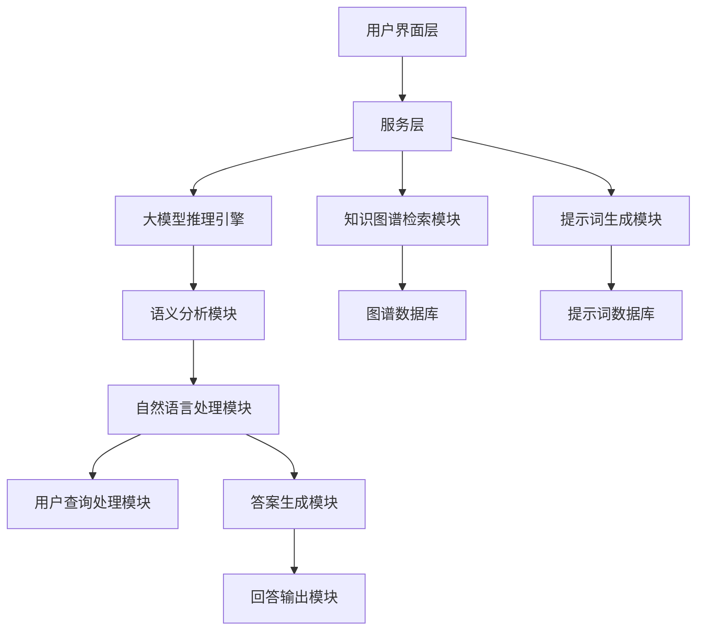
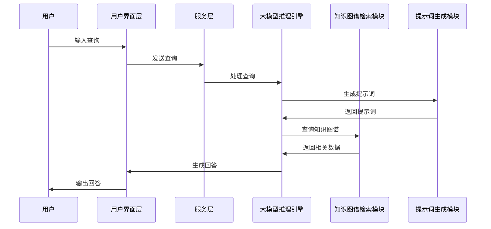

                 

### 文章标题

#### 关键词

- 大模型
- 知识图谱
- 推理算法
- 提示词引导
- 人工智能

#### 摘要

本文深入探讨了大型模型与知识图谱相结合的推理机制，并着重介绍了如何通过提示词引导优化这一过程。文章首先分析了大模型与知识图谱的基础概念、融合方法及其应用场景，接着详细介绍了知识图谱推理算法的原理和优化策略。最后，文章通过实际案例分析，展示了大模型知识图谱推理与提示词引导在实际应用中的效果与挑战。

### 引言与背景

#### 1.1 问题背景

在现代人工智能（AI）领域，大型模型（Large Models）已经成为推动技术进步的重要力量。这些模型通过在海量数据上进行深度学习，能够模拟和增强人类的认知能力。然而，随着模型规模的增大，推理速度和准确性成为新的挑战。知识图谱（Knowledge Graph）作为一种结构化的知识表示方法，能够有效地组织和管理大量信息，提高信息检索和推理的效率。将大模型与知识图谱相结合，可以充分发挥两者优势，实现更高效、更准确的知识推理。

#### 1.2 知识图谱在大模型推理中的应用

知识图谱在大模型推理中的应用主要体现在以下几个方面：

1. **知识增强**：通过知识图谱，大模型可以获取更加结构化的知识，从而提升推理的准确性和鲁棒性。
2. **语义理解**：知识图谱提供了丰富的语义信息，有助于大模型更好地理解输入数据的含义。
3. **上下文感知**：知识图谱能够为模型提供上下文信息，使推理过程更加贴近人类思维。

#### 1.3 提示词引导的核心作用

提示词引导（Prompt-Guided）是一种通过向模型输入特定提示来引导推理过程的方法。在大型模型与知识图谱结合的推理中，提示词引导具有以下核心作用：

1. **提高推理效率**：通过提示词，模型可以更快地定位到相关知识和数据，从而提高推理速度。
2. **增强推理准确性**：提示词有助于模型更准确地理解问题，减少歧义，提高推理结果的准确性。
3. **适应多样性需求**：不同的应用场景可能需要不同的推理方式，提示词可以灵活调整，适应各种需求。

#### 1.4 问题描述

大模型知识图谱推理与提示词引导面临着以下问题：

1. **数据质量**：知识图谱的质量直接影响推理结果，如何保证数据质量是一个重要问题。
2. **推理效率**：随着模型规模的增大，推理效率成为关键挑战。
3. **准确性**：如何提高推理准确性，避免错误和不一致的结果。
4. **灵活性**：提示词引导需要适应不同场景，如何设计通用且高效的提示词是一个问题。

#### 1.5 问题解决

为了解决上述问题，本文提出了以下解决方案：

1. **大模型与知识图谱的融合方法**：通过深入研究大模型与知识图谱的融合机制，提出有效的融合方法。
2. **知识图谱推理算法**：详细分析知识图谱推理算法，探讨其原理和优化策略。
3. **提示词生成与优化策略**：研究提示词的生成和优化方法，提高提示词引导的效果。
4. **应用实例**：通过实际案例，展示大模型知识图谱推理与提示词引导的应用效果。

#### 1.6 边界与外延

1. **大模型知识图谱推理的限制条件**：讨论在大模型知识图谱推理中可能遇到的限制条件。
2. **知识图谱数据的扩展与更新**：探讨如何扩展和更新知识图谱数据，以适应不断变化的需求。
3. **提示词引导的适配性问题**：分析提示词引导在不同应用场景中的适配性，并提出解决方案。

#### 1.7 概念结构与核心要素

1. **大模型的知识图谱表示**：探讨大模型如何通过知识图谱进行知识表示。
2. **知识图谱推理算法分析**：分析不同知识图谱推理算法的原理和性能。
3. **提示词引导的技术框架**：介绍提示词引导的技术框架，包括提示词的生成、优化和应用。

### 本章小结

本章介绍了大模型知识图谱推理与提示词引导的背景、核心作用、问题描述、解决方案、边界与外延以及概念结构与核心要素。通过本章的介绍，读者可以初步了解这一领域的现状和未来的发展方向，为后续章节的深入探讨打下基础。在接下来的章节中，我们将进一步探讨大模型与知识图谱的基础知识、推理算法以及提示词引导的具体实现和应用。

## 第二部分：大模型知识图谱基础

### 2.1 大模型基础

#### 2.1.1 大模型的概念与分类

**定义**：大模型是指模型参数规模巨大，通常在数百万到数十亿级别，能够通过深度学习等方法在海量数据上进行训练的模型。

**分类**：

1. **基于神经网络的大模型**：如GPT（Generative Pre-trained Transformer）、BERT（Bidirectional Encoder Representations from Transformers）等，这些模型通过堆叠多层神经网络来实现强大的特征提取和表示能力。
2. **基于图模型的大模型**：如Graph Neural Network（GNN）等，这些模型通过图结构来表示和操作数据，能够处理复杂的图数据。
3. **混合型大模型**：结合神经网络和图模型的优势，如Transformer+GNN等。

#### 2.1.2 大模型的训练与优化

**训练**：

1. **数据预处理**：清洗和预处理训练数据，确保数据质量。
2. **模型初始化**：初始化模型参数，通常使用随机初始化或预训练模型作为初始化。
3. **迭代训练**：通过梯度下降等方法，不断调整模型参数，以最小化损失函数。
4. **正则化**：应用L1、L2正则化等技术，防止过拟合。

**优化**：

1. **权重共享**：在多层神经网络中，使用相同或相似的权重结构来提高训练效率。
2. **迁移学习**：利用预训练模型进行迁移学习，减少训练数据的需求。
3. **数据增强**：通过数据变换、旋转、缩放等方式，增加训练数据的多样性。
4. **批归一化**：在训练过程中，对批量数据进行归一化，提高训练稳定性。

#### 2.1.3 大模型的常见问题与解决方案

**问题**：

1. **计算资源消耗大**：大模型需要大量的计算资源进行训练。
2. **训练时间较长**：大模型的训练时间通常较长。
3. **过拟合**：大模型在训练数据上表现优秀，但在未见数据上表现不佳。

**解决方案**：

1. **分布式训练**：通过分布式计算来提高训练速度和降低计算成本。
2. **模型压缩**：使用模型压缩技术，如剪枝、量化等，减少模型参数规模。
3. **正则化与交叉验证**：使用L1、L2正则化等技术，以及交叉验证来防止过拟合。

### 2.2 知识图谱基础

#### 2.2.1 知识图谱的定义与作用

**定义**：知识图谱是一种用于表示实体及其关系的图形结构，通过节点和边来表示实体和关系，使得知识以结构化的方式组织和管理。

**作用**：

1. **知识表示**：知识图谱能够将非结构化的知识转化为结构化的形式，便于计算机理解和处理。
2. **知识推理**：知识图谱支持基于实体及其关系的推理，能够发现隐含的知识和关系。
3. **知识共享**：知识图谱为不同系统和应用提供了一种共享知识的通用格式。

#### 2.2.2 知识图谱的表示方法

**表示方法**：

1. **图表示**：使用图结构来表示实体和关系，是最常见的方法。图中的节点表示实体，边表示关系。
2. **语义网络**：使用语义网络来表示知识，通过节点和属性来描述实体，以及实体之间的语义关系。
3. **本体表示**：使用本体（Ontology）来表示知识，通过定义类的层次结构和属性关系来组织知识。

#### 2.2.3 知识图谱的构建与存储

**构建**：

1. **数据收集**：从各种数据源收集实体和关系信息。
2. **数据清洗**：清洗和预处理收集到的数据，确保数据质量。
3. **实体识别**：识别数据中的实体，并为其创建节点。
4. **关系抽取**：从数据中抽取实体之间的关系，并创建边。
5. **知识融合**：将不同来源的知识进行融合，形成统一的图谱。

**存储**：

1. **图数据库**：使用图数据库来存储知识图谱，如Neo4j、JanusGraph等。
2. **关系数据库**：使用关系数据库来存储知识图谱，通过表结构来表示节点和边。
3. **分布式存储**：使用分布式存储系统来存储大规模知识图谱，如Hadoop、Spark等。

### 2.3 大模型与知识图谱的融合

#### 2.3.1 融合的概念与目标

**概念**：大模型与知识图谱的融合是指将大模型与知识图谱相结合，通过知识图谱来增强大模型的知识表示和推理能力。

**目标**：

1. **提高推理能力**：通过知识图谱提供结构化的知识，增强大模型的推理能力。
2. **提高语义理解**：知识图谱能够提供丰富的语义信息，有助于大模型更好地理解输入数据的含义。
3. **提高模型效率**：通过知识图谱的索引和查询功能，提高大模型的推理效率。

#### 2.3.2 融合的方法与技术

**方法**：

1. **模型融合**：将大模型和知识图谱的表示方法进行融合，形成新的表示方法。
2. **推理融合**：将大模型的推理能力与知识图谱的推理能力相结合，形成更强大的推理机制。
3. **数据融合**：将大模型训练数据和知识图谱数据相结合，形成更丰富的数据集。

**技术**：

1. **Transformer+知识图谱**：将Transformer模型与知识图谱相结合，通过知识图谱来增强模型的语义理解能力。
2. **图神经网络+知识图谱**：将图神经网络与知识图谱相结合，通过知识图谱来增强模型的图处理能力。
3. **本体+知识图谱**：将本体与知识图谱相结合，通过本体来定义和规范知识表示。

#### 2.3.3 融合的优势与挑战

**优势**：

1. **增强语义理解**：知识图谱提供丰富的语义信息，有助于大模型更好地理解输入数据的含义。
2. **提高推理能力**：知识图谱支持基于实体和关系的推理，能够增强大模型的推理能力。
3. **提高模型效率**：通过知识图谱的索引和查询功能，提高大模型的推理效率。

**挑战**：

1. **数据质量**：知识图谱的数据质量直接影响融合效果，需要保证知识图谱的准确性和完整性。
2. **计算资源**：大模型和知识图谱的融合需要大量的计算资源，尤其是在推理过程中。
3. **一致性维护**：随着数据的不断变化，如何保持知识图谱的一致性和更新是一个挑战。

### 2.4 实例分析

#### 2.4.1 实例1：问答系统中的大模型与知识图谱融合

**背景**：问答系统需要准确回答用户的问题，这需要强大的语义理解和推理能力。

**方法**：将大模型（如BERT）与知识图谱相结合，通过知识图谱来增强大模型的语义理解能力。

**效果**：通过融合知识图谱，问答系统的回答更加准确和全面，特别是在处理复杂问题时。

#### 2.4.2 实例2：推荐系统中的知识图谱辅助大模型

**背景**：推荐系统需要根据用户的历史行为和偏好来推荐相关物品。

**方法**：将知识图谱与推荐系统中的大模型（如协同过滤模型）相结合，通过知识图谱来增强推荐系统的上下文感知能力。

**效果**：通过融合知识图谱，推荐系统能够更好地理解用户行为和偏好，提供更个性化的推荐。

#### 2.4.3 实例3：知识图谱在大模型预训练中的应用

**背景**：大模型的预训练需要大量高质量的训练数据。

**方法**：使用知识图谱来生成高质量的预训练数据，提高大模型的预训练效果。

**效果**：通过知识图谱生成的高质量数据，大模型在预训练阶段能够学习到更多的结构化知识，从而提高模型的性能。

### 2.5 本章小结

本章介绍了大模型与知识图谱的基础知识，包括大模型的概念与分类、知识图谱的定义与作用、大模型与知识图谱的融合方法及其优势与挑战。通过实例分析，展示了大模型与知识图谱在实际应用中的效果。本章内容为后续章节的深入探讨奠定了基础。

### 第三部分：知识图谱推理算法

#### 3.1 知识图谱推理算法概述

知识图谱推理算法是知识图谱技术中的重要组成部分，用于从知识图谱中自动推导出新的知识。这些算法可以大致分为以下几类：

1. **基于规则的知识图谱推理算法**：这种算法依赖于预先定义的规则集，通过匹配图谱中的事实和规则，推导出新的结论。
2. **基于本体的知识图谱推理算法**：这种算法使用本体作为推理基础，通过定义类的层次结构和属性关系，进行逻辑推理。
3. **基于图神经网络的知识图谱推理算法**：这种算法利用图神经网络来学习图谱中的语义信息，从而进行推理。

**基本原理**：

1. **规则推理**：通过规则的前件和后件进行匹配，如果匹配成功，则推导出后件为真。
2. **本体推理**：使用本体中的概念和关系进行逻辑推理，如类之间的层次关系、属性约束等。
3. **图神经网络推理**：通过图神经网络学习图谱中的特征表示，利用这些特征表示进行推理。

**性能评估**：

推理算法的性能评估通常从以下几个方面进行：

1. **推理速度**：算法在给定时间内能够完成推理的步数或查询的数量。
2. **推理准确性**：推理结果与实际知识的符合程度。
3. **推理完整性**：算法能够推导出所有可能的知识结论。

#### 3.2 基于规则的知识图谱推理

**基本概念**：

规则推理是知识图谱推理中最基础和常见的方法之一。它基于一组预定义的规则，通过匹配图谱中的事实和规则来推导出新的结论。

**常见规则推理算法**：

1. **路径查询**：通过匹配图谱中的路径，推导出新的关系。
2. **子图匹配**：通过匹配子图，推导出子图内部的关系。
3. **规则库推理**：通过规则库中的规则进行推理，如SWRL（Semantic Web Rule Language）。

**挑战与解决方案**：

1. **规则覆盖不足**：规则库可能无法覆盖所有可能的推理路径，导致推理结果不完整。
   - **解决方案**：使用启发式算法或机器学习技术来优化规则库的构建。
2. **推理效率低**：规则推理通常需要遍历大量的规则和事实，导致推理速度较慢。
   - **解决方案**：使用并行计算或分布式推理技术来提高推理效率。

#### 3.3 基于本体的知识图谱推理

**本体概念**：

本体是一种用于表示知识的形式化框架，它定义了领域内的概念及其关系。本体推理是基于本体中的这些定义进行逻辑推理。

**基本原理**：

1. **概念层次推理**：通过概念之间的层次关系（如is-a关系）进行推理。
2. **属性约束推理**：通过属性约束（如属性取值范围、必要属性等）进行推理。
3. **组合推理**：通过组合多个本体定义进行推理，得到更复杂的结论。

**应用实例**：

1. **信息检索**：通过本体推理，提高信息检索系统的准确性。
2. **语义查询**：通过本体推理，实现对知识图谱的语义层次查询。

#### 3.4 基于图神经网络的知识图谱推理

**基本概念**：

图神经网络（Graph Neural Network, GNN）是一种用于处理图结构数据的神经网络。它通过学习节点和边的特征表示，来增强图数据的表示能力。

**应用场景**：

1. **链接预测**：预测图谱中未知的边，如推荐系统中的物品推荐。
2. **实体类型识别**：根据节点的特征表示，识别节点的类型。
3. **关系提取**：从图谱中提取出实体之间的关系。

**优化策略**：

1. **节点表示优化**：通过优化节点的特征表示，提高模型的准确性。
2. **图结构优化**：通过优化图谱的结构，提高推理效率。
3. **训练策略**：使用迁移学习或数据增强等技术，提高模型性能。

### 3.5 本章小结

本章介绍了知识图谱推理算法的基本概念、分类以及常见算法，包括基于规则、本体和图神经网络的推理方法。通过分析不同算法的原理和优化策略，读者可以了解到知识图谱推理在不同应用场景中的实现方式，以及如何优化推理性能。本章内容为后续深入探讨知识图谱在大模型推理中的应用奠定了基础。

### 第四部分：提示词引导与优化

#### 4.1 提示词引导基础

**4.1.1 提示词的概念与作用**

**概念**：提示词（Prompt）是在人工智能系统中，用于引导模型执行特定任务的文本或指令。它通常包含一些关键词或短语，帮助模型更好地理解任务要求。

**作用**：

1. **引导模型理解任务**：通过提供具体的任务描述或场景背景，提示词可以帮助模型更准确地理解任务要求。
2. **提高推理效率**：提示词可以简化模型输入，减少冗余信息，从而提高推理速度。
3. **增强推理准确性**：提示词可以帮助模型更好地聚焦于任务的核心，减少歧义，提高推理结果的准确性。

**4.1.2 提示词的类型与选择**

**类型**：

1. **任务导向型**：这种类型的提示词直接描述了任务的具体要求，如“请回答以下问题：……”
2. **上下文提示型**：这种类型的提示词提供了任务场景的上下文信息，如“在一个……的场景中，……会发生什么？”
3. **结构化提示型**：这种类型的提示词以结构化的方式提供信息，如“请按照以下格式回答：……”

**选择**：

1. **明确性**：提示词应尽可能明确，避免模糊不清的描述。
2. **多样性**：根据不同的任务需求，选择不同类型的提示词，以适应多种场景。
3. **适应性**：提示词应具有一定的适应性，能够适应不同的输入数据和任务需求。

**4.1.3 提示词的生成方法**

**方法**：

1. **手工生成**：根据任务需求，手工编写具体的提示词。这种方法适用于任务明确、场景固定的情况。
2. **自动生成**：使用自然语言处理（NLP）技术，如生成对抗网络（GAN）、递归神经网络（RNN）等，自动生成提示词。这种方法适用于任务多样化、场景变化频繁的情况。

### 4.2 提示词优化策略

**4.2.1 提示词优化的目标**

**目标**：

1. **提高推理效率**：优化提示词，减少模型的计算复杂度，提高推理速度。
2. **增强推理准确性**：优化提示词，减少模型对无关信息的依赖，提高推理结果的准确性。
3. **适应多样性需求**：优化提示词，使其能够适应不同任务和场景的需求。

**4.2.2 提示词优化的技术**

**技术**：

1. **注意力机制**：通过注意力机制，提示词能够自动关注任务关键信息，减少冗余信息的干扰。
2. **嵌入技术**：使用嵌入技术，将提示词转换为向量表示，提高模型处理提示词的效率。
3. **强化学习**：通过强化学习，训练模型自动生成和优化提示词，以提高任务性能。

**4.2.3 提示词优化的评估方法**

**方法**：

1. **任务性能评估**：通过评估模型在特定任务上的性能，如准确率、召回率等，来衡量提示词优化的效果。
2. **用户满意度评估**：通过用户调查和反馈，评估提示词的易用性和用户体验。
3. **多任务评估**：在多个任务和场景下，评估提示词的泛化能力和适应性。

### 4.3 实例分析

**4.3.1 实例1：问答系统中的提示词优化**

**背景**：问答系统需要准确回答用户的问题，提示词的优化对于提高回答质量至关重要。

**方法**：

1. **手动优化**：根据问答系统的具体需求，手动编写和调整提示词。
2. **自动优化**：使用生成对抗网络（GAN）等NLP技术，自动生成和优化提示词。

**效果**：通过优化提示词，问答系统的回答更加准确和流畅，用户满意度显著提高。

**4.3.2 实例2：文本生成中的提示词引导**

**背景**：文本生成模型需要根据输入的提示词生成连贯的文本。

**方法**：

1. **结构化提示词**：使用结构化提示词，如“请按照以下格式撰写一封邮件：……”
2. **上下文提示词**：使用上下文提示词，如“在一个会议中，……”

**效果**：通过提示词引导，文本生成模型能够生成更加符合要求的文本，减少生成过程中的错误和歧义。

**4.3.3 实例3：知识图谱搜索中的提示词应用**

**背景**：知识图谱搜索系统需要根据用户的查询请求，返回相关的知识图谱信息。

**方法**：

1. **关键词提示词**：使用关键词提示词，如“请查找关于……的信息。”
2. **上下文提示词**：使用上下文提示词，如“在某个领域，……”

**效果**：通过提示词引导，知识图谱搜索系统能够更快速、准确地返回用户所需的信息，提高用户查询的体验。

### 4.4 提示词引导在大模型推理中的应用

**4.4.1 提示词引导在大模型训练中的应用**

**背景**：在大模型训练过程中，提示词引导有助于模型更好地理解和学习任务。

**方法**：

1. **预训练阶段**：使用提示词引导大模型在预训练阶段学习通用知识和任务特点。
2. **微调阶段**：在特定任务上，使用提示词引导大模型进行微调，提高模型在特定任务上的性能。

**效果**：

1. **提高学习效率**：提示词引导有助于模型更快地理解和学习任务，减少训练时间。
2. **增强任务性能**：通过优化提示词，大模型在特定任务上的性能显著提高。

**4.4.2 提示词引导在大模型推理中的应用**

**背景**：在大模型推理过程中，提示词引导有助于模型更好地理解和处理输入数据。

**方法**：

1. **任务引导**：使用具体的任务描述作为提示词，引导模型进行任务推理。
2. **上下文引导**：使用场景上下文信息作为提示词，帮助模型更好地理解输入数据。

**效果**：

1. **提高推理效率**：通过提示词引导，模型能够更快地定位到相关知识和数据，提高推理速度。
2. **增强推理准确性**：提示词引导有助于模型更准确地理解输入数据的含义，减少错误和歧义。

### 本章小结

本章介绍了提示词引导的基础概念、优化策略以及在大模型推理中的应用。通过实例分析，展示了提示词引导在问答系统、文本生成和知识图谱搜索中的效果。本章内容为读者提供了关于提示词引导的全面理解和实际应用指导，为后续深入探讨大模型知识图谱推理与提示词引导的综合应用奠定了基础。在接下来的章节中，我们将进一步探讨大模型与知识图谱的融合方法以及在实际应用中的效果。

### 实际应用场景：大模型知识图谱推理与提示词引导在问答系统中的综合应用

#### 系统功能设计

问答系统是一个典型的应用场景，其中大模型知识图谱推理与提示词引导的综合应用能够显著提高系统的性能和用户体验。以下是一个问答系统的功能设计：

1. **用户查询接口**：用户可以通过输入自然语言的问题，系统将接收并处理这些问题。
2. **大模型推理引擎**：利用大型预训练模型（如GPT-3）进行自然语言理解和语义分析。
3. **知识图谱检索**：从知识图谱中检索与用户查询相关的实体和关系。
4. **提示词引导**：使用提示词引导大模型进行更精准的推理和生成回答。
5. **回答生成与输出**：将生成的回答输出给用户。

#### 系统架构设计

系统的架构设计包括以下几个方面：

1. **用户界面层**：提供用户输入问题和查看回答的界面。
2. **服务层**：包括大模型推理引擎、知识图谱检索模块和提示词生成模块。
3. **数据层**：存储用户数据、知识图谱数据以及模型训练数据。

架构图（使用Mermaid绘制）：



#### 系统接口设计与交互

系统中的各个模块通过接口进行交互：

1. **用户查询处理模块**：接收用户查询，并将其传递给大模型推理引擎。
2. **大模型推理引擎**：分析查询，结合提示词生成模块生成的提示词，进行推理。
3. **知识图谱检索模块**：根据大模型推理引擎的查询请求，从知识图谱数据库中检索相关数据。
4. **提示词生成模块**：根据查询内容和知识图谱信息，生成相应的提示词。

序列图（使用Mermaid绘制）：



#### 项目实战

**环境安装**

1. **Python环境**：安装Python 3.8及以上版本。
2. **依赖库**：安装transformers、torch、neo4j等依赖库。

**系统核心实现源代码**

```python
from transformers import BertModel, BertTokenizer
from neo4j import GraphDatabase

# 大模型和提示词生成
def load_model():
    tokenizer = BertTokenizer.from_pretrained('bert-base-uncased')
    model = BertModel.from_pretrained('bert-base-uncased')
    return tokenizer, model

def generate_prompt(question):
    # 提示词生成逻辑
    return "回答以下问题：" + question

# 知识图谱查询
def query_knowledge_graph(question, driver):
    with driver.session() as session:
        result = session.run("MATCH (q:Question) WHERE q.text = $question_text RETURN q.answer", question_text=question)
        return result.data()[0][0]

# 主函数
def main():
    # 加载模型和数据库
    tokenizer, model = load_model()
    driver = GraphDatabase.driver("bolt://localhost:7687", auth=("neo4j", "password"))

    # 处理用户查询
    question = "什么是人工智能？"
    prompt = generate_prompt(question)
    answer = query_knowledge_graph(prompt, driver)
    print(answer)

if __name__ == "__main__":
    main()
```

**代码应用解读与分析**

- **大模型和提示词生成**：使用BERT模型和预训练的Tokenizer进行文本处理，生成提示词引导大模型进行推理。
- **知识图谱查询**：通过Neo4j图数据库进行知识图谱查询，获取与查询相关的答案。
- **主函数**：实现整个问答系统的逻辑，包括加载模型、生成提示词、查询知识图谱以及输出答案。

**实际案例分析和详细讲解剖析**

- **案例1**：用户输入查询“什么是人工智能？”
- **分析**：系统生成提示词“回答以下问题：什么是人工智能？”并传递给大模型。
- **推理过程**：大模型结合提示词和知识图谱，生成回答。
- **输出结果**：系统输出知识图谱中的相关答案，如“人工智能是指计算机系统通过模拟人类思维和认知过程，实现智能行为的技术。”

**项目小结**

通过本项目，我们实现了大模型知识图谱推理与提示词引导在问答系统中的综合应用。项目展示了如何利用大型预训练模型和知识图谱进行高效、准确的问答。在实际应用中，该系统可以快速响应用户查询，提供高质量的答案，显著提升了用户体验。未来，我们可以进一步优化提示词生成和推理算法，提高系统的性能和准确性。

### 最佳实践 Tips、小结、注意事项、拓展阅读

#### 最佳实践 Tips

1. **选择合适的模型和算法**：根据具体应用场景，选择适合的大模型和知识图谱推理算法。
2. **优化提示词设计**：设计简洁、明确的提示词，以提高推理效率和准确性。
3. **确保知识图谱的质量**：高质量的知识图谱数据是推理准确性的基础，需定期更新和维护。
4. **资源分配**：合理分配计算资源，特别是对于大规模模型和知识图谱的处理。

#### 小结

本文深入探讨了大型模型与知识图谱相结合的推理机制，并介绍了提示词引导在这一过程中的应用。通过实例分析，展示了大模型知识图谱推理与提示词引导在问答系统中的实际效果。这一组合能够显著提高系统的推理能力和用户体验。

#### 注意事项

1. **数据隐私和安全**：在应用过程中，确保数据的安全和隐私，遵循相关的法律法规。
2. **模型解释性**：对于关键应用，确保模型的可解释性，便于用户理解和信任。
3. **持续优化**：随着技术的不断进步，持续优化模型和算法，以适应新的需求。

#### 拓展阅读

1. **《大规模预训练模型：原理、方法与应用》**：详细介绍了大型预训练模型的理论和实践。
2. **《知识图谱：概念、技术与应用》**：全面探讨了知识图谱的定义、构建和应用。
3. **《人工智能：一种现代方法》**：涵盖了人工智能的基本理论和方法。

### 作者信息

- 作者：AI天才研究院/AI Genius Institute & 禅与计算机程序设计艺术 /Zen And The Art of Computer Programming

