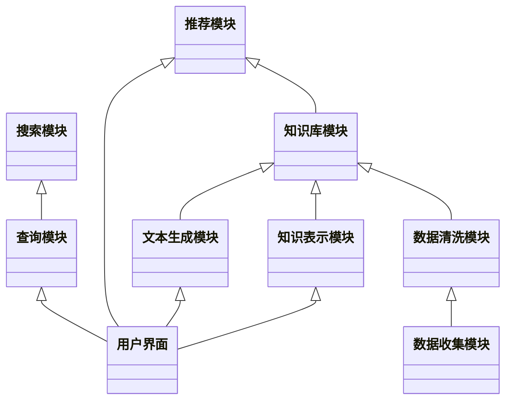
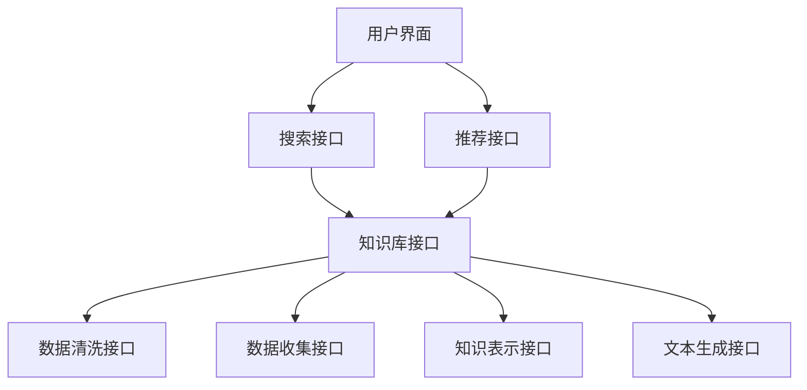
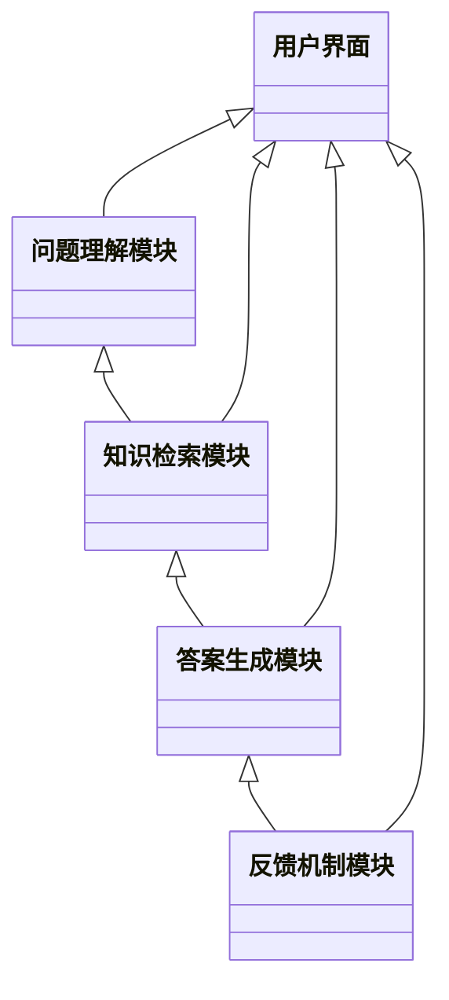
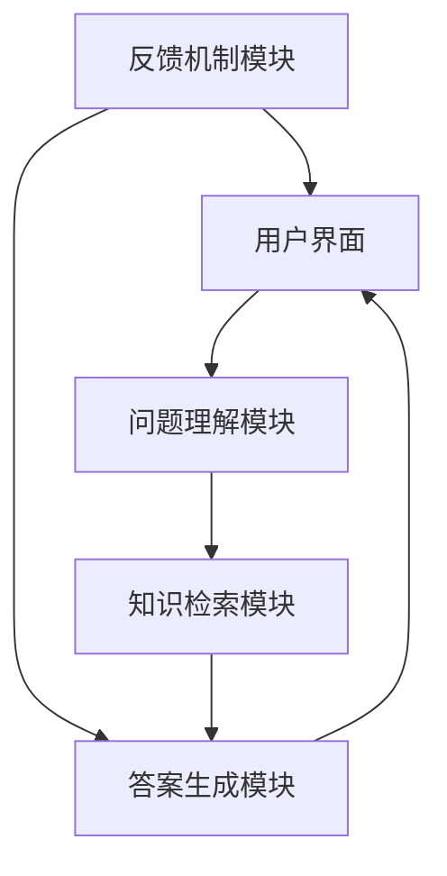
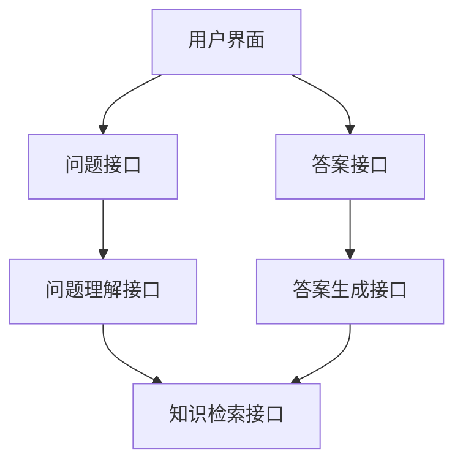

                 

## 文章标题

# 大模型知识图谱推理与提示词逻辑链构建

> 关键词：大模型、知识图谱、推理、提示词、逻辑链

> 摘要：本文将深入探讨大模型在知识图谱推理和提示词逻辑链构建中的应用。首先，我们将介绍大模型和知识图谱的基本概念，然后逐步分析知识图谱推理的方法，以及如何利用大模型来构建提示词逻辑链。通过实例分析，我们将展示这些技术的实际应用，并探讨未来的发展方向。

----------------------------------------------------------------

## 目录大纲

### 第一部分：背景与基础

#### 第1章：问题背景与核心概念

- **1.1 问题背景**
- **1.2 核心概念**
- **1.3 概念联系与区别**
- **1.4 研究意义与目标**

### 第二部分：大模型知识图谱构建

#### 第2章：知识图谱概述

- **2.1 知识图谱的定义**
- **2.2 知识图谱的组成部分**
- **2.3 知识图谱的应用**

#### 第3章：大模型概述

- **3.1 大模型的定义**
- **3.2 主流大模型介绍**
- **3.3 大模型在知识图谱中的应用**

### 第三部分：知识图谱推理方法

#### 第4章：知识图谱推理概述

- **4.1 推理的定义与分类**
- **4.2 基于规则推理**
- **4.3 基于本体推理**

#### 第5章：大模型在知识图谱推理中的应用

- **5.1 大模型在知识图谱推理中的作用**
- **5.2 大模型推理算法**

### 第四部分：提示词逻辑链构建

#### 第6章：提示词与逻辑链概述

- **6.1 提示词的定义与作用**
- **6.2 逻辑链的概念与构建**

#### 第7章：大模型在提示词逻辑链构建中的应用

- **7.1 大模型在提示词逻辑链构建中的作用**
- **7.2 大模型在提示词逻辑链构建中的应用实例**

### 第五部分：综合应用与展望

#### 第8章：综合应用案例

- **8.1 案例一：企业知识库构建**
- **8.2 案例二：智能问答系统**

#### 第9章：未来展望

- **9.1 知识图谱与AI融合发展趋势**
- **9.2 提示词逻辑链构建的创新方向**

### 附录

#### 附录A：常用工具与资源

#### 附录B：参考资料

----------------------------------------------------------------

### 第一部分：背景与基础

#### 第1章：问题背景与核心概念

##### 1.1 问题背景

随着人工智能技术的迅猛发展，知识图谱作为一种重要的知识表示方法，在各个领域得到了广泛应用。知识图谱能够将海量数据组织成一个结构化的知识网络，使得计算机能够像人一样理解和处理知识。然而，知识图谱的应用过程中面临着一系列挑战，其中最核心的挑战之一是如何高效地进行知识图谱推理。

知识图谱推理是指利用已有的知识图谱数据，通过逻辑推理的方式，自动发现新的知识或验证已有知识的过程。在传统的知识图谱推理方法中，常用的有基于规则推理和基于本体推理等。这些方法虽然在一定程度上能够满足推理需求，但面临着复杂度较高、推理效率低下等问题。

近年来，大模型的出现为知识图谱推理带来了新的机遇。大模型，如GPT、BERT等，具有强大的表示能力和推理能力，可以在大规模数据集上进行训练，从而实现对知识图谱的自动理解和推理。同时，提示词逻辑链的构建成为实现大模型知识图谱推理的关键技术。

提示词逻辑链是指利用提示词来引导大模型进行推理的过程。通过设计合适的提示词，可以引导大模型按照预设的逻辑路径进行推理，从而实现对知识图谱的深度理解和应用。

##### 1.2 核心概念

为了更好地理解本文的主题，我们需要介绍以下几个核心概念：

- **大模型**：大模型是指具有海量参数和强大表示能力的深度学习模型。这些模型通常在大规模数据集上进行训练，能够自动学习数据的内在结构和规律。
- **知识图谱**：知识图谱是一种用于表示实体及其相互关系的图形结构。它通常由实体、属性和关系三个组成部分构成，能够将海量数据组织成一个结构化的知识网络。
- **推理**：推理是指根据已知的信息，通过逻辑推导的方式，发现新的知识或验证已有知识的过程。在知识图谱中，推理是发现新知识和验证知识完整性的重要手段。
- **提示词**：提示词是指用于引导模型进行特定推理的词或短语。通过设计合适的提示词，可以引导模型按照预设的逻辑路径进行推理。

##### 1.3 概念联系与区别

大模型、知识图谱、推理和提示词逻辑链是本文讨论的核心概念，它们之间有着密切的联系和区别：

- **大模型与知识图谱的关系**：大模型可以看作是知识图谱的推理引擎。知识图谱为大模型提供了结构化的知识表示，而大模型则通过其强大的表示能力和推理能力，能够对知识图谱进行高效地推理。
- **推理与提示词逻辑链的概念与区别**：推理是知识图谱应用的核心过程，而提示词逻辑链是引导推理的一种技术手段。提示词逻辑链通过设计合适的提示词，引导大模型按照预设的逻辑路径进行推理，从而实现对知识图谱的深度理解和应用。

##### 1.4 研究意义与目标

研究大模型知识图谱推理与提示词逻辑链构建具有重要的现实意义和理论价值：

- **研究意义**：
  - 提高知识图谱推理的效率和准确性：通过引入大模型，可以实现对知识图谱的高效推理，从而提高知识图谱的应用价值。
  - 推动人工智能技术的发展：大模型知识图谱推理与提示词逻辑链构建是人工智能领域的前沿研究方向，对于推动人工智能技术的发展具有重要意义。

- **研究目标**：
  - 探究大模型在知识图谱推理中的应用：分析大模型在知识图谱推理中的优势和局限性，为知识图谱推理提供新的思路和算法。
  - 设计提示词逻辑链构建方法：通过研究提示词逻辑链的构建方法，设计出有效的提示词逻辑链构建算法，提高知识图谱推理的效率和准确性。

总之，本文旨在深入探讨大模型知识图谱推理与提示词逻辑链构建，为知识图谱应用提供新的思路和解决方案。

----------------------------------------------------------------

#### 第2章：知识图谱概述

##### 2.1 知识图谱的定义

知识图谱（Knowledge Graph）是一种用于表示实体及其相互关系的图形结构，它将海量数据组织成一个结构化的知识网络。知识图谱的概念最早由Google在2012年提出，旨在通过结构化数据的方式，将互联网上的信息进行整合，提供更加精确和个性化的搜索服务。

知识图谱的定义可以从以下几个方面进行理解：

1. **实体**：实体是指知识图谱中的基本单元，如人、地点、组织等。实体可以是人造的（如公司、产品）或自然的（如城市、动物）。
2. **属性**：属性是实体的特征描述，如人的年龄、地理位置、职业等。属性通常以键值对的形式存储。
3. **关系**：关系是实体之间的连接，表示实体之间的语义联系，如“工作于”、“位于”等。关系通常可以表示为“主体-谓语-客体”的形式。

##### 2.2 知识图谱的组成部分

知识图谱由实体、属性和关系三个主要部分组成，每个部分在知识图谱中都扮演着重要的角色：

- **实体**：实体是知识图谱的基本构建块，可以看作是知识图谱中的节点。实体代表了知识图谱中感兴趣的对象，例如人、地点、事物等。实体的种类非常广泛，从简单的“人”到复杂的“组织”、“事件”等，无所不包。
- **属性**：属性是实体的特征或属性的描述，它们以键值对的形式附加到实体上。属性为实体提供了丰富的信息，例如，人的名字、出生日期、国籍等。属性的类型包括数字、字符串、日期等。
- **关系**：关系是实体之间的连接，描述了实体之间的语义关系。关系通常是双向的，例如，“工作于”关系连接了“人”实体和“公司”实体，表示某人在这家公司工作。关系可以是简单的（如“属于”）、复杂的（如“投资了”）、或者是有时间属性的（如“发生”）。

##### 2.3 知识图谱的应用

知识图谱在多个领域和场景中有着广泛的应用，下面列举一些典型的应用场景：

- **互联网搜索引擎**：知识图谱可以用于搜索引擎的优化，通过将网页与实体关联起来，提供更加精确和个性化的搜索结果。
- **社交网络分析**：知识图谱可以用于分析社交网络中的关系，识别社交网络中的关键人物、社区和影响力。
- **金融风险评估**：知识图谱可以用于分析金融领域中的各种关系，如企业之间的投资关系、信用评级等，从而进行风险预测和评估。
- **智能问答系统**：知识图谱可以为智能问答系统提供知识基础，通过查询和推理，提供准确的答案。

##### 2.4 知识图谱的优势与挑战

知识图谱的优势主要体现在以下几个方面：

- **结构化表示**：知识图谱通过实体、属性和关系，将数据组织成结构化的形式，使得数据更加易于管理和查询。
- **语义理解**：知识图谱能够表示实体之间的语义关系，使得计算机能够像人一样理解和处理知识。
- **跨领域应用**：知识图谱可以跨越不同的领域，将不同领域中的知识整合在一起，提供跨领域的知识服务。

然而，知识图谱的应用也面临着一些挑战：

- **数据质量**：知识图谱的质量很大程度上取决于数据的质量，数据的不一致、噪声和缺失都会影响知识图谱的准确性。
- **推理效率**：知识图谱的推理过程可能会非常复杂和耗时，特别是在大规模数据集上。
- **扩展性**：知识图谱需要不断地更新和扩展，以适应不断变化的应用需求。

##### 2.5 知识图谱的发展趋势

随着人工智能和大数据技术的不断发展，知识图谱的应用领域和影响力也在不断扩大。以下是一些知识图谱的发展趋势：

- **多源异构数据的整合**：知识图谱需要处理来自不同来源和格式的数据，如何有效地整合多源异构数据成为知识图谱研究的重点。
- **实时知识图谱构建**：随着实时数据的增加，如何构建实时更新的知识图谱成为研究的方向。
- **知识图谱的自动化构建**：通过自动化手段，如数据挖掘、自然语言处理等，构建知识图谱，减少人工干预。
- **知识图谱在复杂场景中的应用**：如智慧城市、智能医疗、智能制造等，知识图谱在这些复杂场景中的应用将越来越重要。

综上所述，知识图谱作为一种重要的知识表示方法，在人工智能和大数据领域中具有广泛的应用前景。通过对知识图谱的定义、组成部分和应用的深入探讨，我们可以更好地理解知识图谱的核心概念和应用价值。

----------------------------------------------------------------

##### 2.1 知识图谱的定义

知识图谱（Knowledge Graph）是一种用于表示实体及其相互关系的图形结构，它将海量数据组织成一个结构化的知识网络。知识图谱的概念最早由Google在2012年提出，旨在通过结构化数据的方式，将互联网上的信息进行整合，提供更加精确和个性化的搜索服务。

知识图谱的定义可以从以下几个方面进行理解：

1. **实体**：实体是指知识图谱中的基本单元，如人、地点、组织等。实体可以是人造的（如公司、产品）或自然的（如城市、动物）。
2. **属性**：属性是实体的特征描述，如人的年龄、地理位置、职业等。属性通常以键值对的形式存储。
3. **关系**：关系是实体之间的连接，表示实体之间的语义联系，如“工作于”、“位于”等。关系通常是双向的，例如，“工作于”关系连接了“人”实体和“公司”实体，表示某人在这家公司工作。关系可以是简单的（如“属于”）、复杂的（如“投资了”）、或者是有时间属性的（如“发生”）。

##### 2.2 知识图谱的组成部分

知识图谱由实体、属性和关系三个主要部分组成，每个部分在知识图谱中都扮演着重要的角色：

- **实体**：实体是知识图谱的基本构建块，可以看作是知识图谱中的节点。实体代表了知识图谱中感兴趣的对象，例如人、地点、事物等。实体的种类非常广泛，从简单的“人”到复杂的“组织”、“事件”等，无所不包。
- **属性**：属性是实体的特征或属性的描述，它们以键值对的形式附加到实体上。属性为实体提供了丰富的信息，例如，人的名字、出生日期、国籍等。属性的类型包括数字、字符串、日期等。
- **关系**：关系是实体之间的连接，描述了实体之间的语义关系。关系通常是双向的，例如，“工作于”关系连接了“人”实体和“公司”实体，表示某人在这家公司工作。关系可以是简单的（如“属于”）、复杂的（如“投资了”）、或者是有时间属性的（如“发生”）。

##### 2.3 知识图谱的应用

知识图谱在多个领域和场景中有着广泛的应用，下面列举一些典型的应用场景：

- **互联网搜索引擎**：知识图谱可以用于搜索引擎的优化，通过将网页与实体关联起来，提供更加精确和个性化的搜索结果。
- **社交网络分析**：知识图谱可以用于分析社交网络中的关系，识别社交网络中的关键人物、社区和影响力。
- **金融风险评估**：知识图谱可以用于分析金融领域中的各种关系，如企业之间的投资关系、信用评级等，从而进行风险预测和评估。
- **智能问答系统**：知识图谱可以为智能问答系统提供知识基础，通过查询和推理，提供准确的答案。

##### 2.4 知识图谱的优势与挑战

知识图谱的优势主要体现在以下几个方面：

- **结构化表示**：知识图谱通过实体、属性和关系，将数据组织成结构化的形式，使得数据更加易于管理和查询。
- **语义理解**：知识图谱能够表示实体之间的语义关系，使得计算机能够像人一样理解和处理知识。
- **跨领域应用**：知识图谱可以跨越不同的领域，将不同领域中的知识整合在一起，提供跨领域的知识服务。

然而，知识图谱的应用也面临着一些挑战：

- **数据质量**：知识图谱的质量很大程度上取决于数据的质量，数据的不一致、噪声和缺失都会影响知识图谱的准确性。
- **推理效率**：知识图谱的推理过程可能会非常复杂和耗时，特别是在大规模数据集上。
- **扩展性**：知识图谱需要不断地更新和扩展，以适应不断变化的应用需求。

##### 2.5 知识图谱的发展趋势

随着人工智能和大数据技术的不断发展，知识图谱的应用领域和影响力也在不断扩大。以下是一些知识图谱的发展趋势：

- **多源异构数据的整合**：知识图谱需要处理来自不同来源和格式的数据，如何有效地整合多源异构数据成为知识图谱研究的重点。
- **实时知识图谱构建**：随着实时数据的增加，如何构建实时更新的知识图谱成为研究的方向。
- **知识图谱的自动化构建**：通过自动化手段，如数据挖掘、自然语言处理等，构建知识图谱，减少人工干预。
- **知识图谱在复杂场景中的应用**：如智慧城市、智能医疗、智能制造等，知识图谱在这些复杂场景中的应用将越来越重要。

综上所述，知识图谱作为一种重要的知识表示方法，在人工智能和大数据领域中具有广泛的应用前景。通过对知识图谱的定义、组成部分和应用的深入探讨，我们可以更好地理解知识图谱的核心概念和应用价值。

----------------------------------------------------------------

##### 2.3 知识图谱的应用

知识图谱在多个领域和场景中有着广泛的应用，下面列举一些典型的应用场景：

- **互联网搜索引擎**：知识图谱可以用于搜索引擎的优化，通过将网页与实体关联起来，提供更加精确和个性化的搜索结果。例如，Google Knowledge Graph 就是一个著名的知识图谱应用，它将搜索结果与实体知识关联起来，帮助用户更快速地找到所需信息。
  
  **应用示例**：
  - 搜索“苹果”，除了展示常规的搜索结果外，还会显示苹果公司的相关信息，如地理位置、总部、产品等。
  - 当用户搜索某个明星时，除了演员作品外，还会显示该明星的年龄、国籍、家庭成员等信息。

- **社交网络分析**：知识图谱可以用于分析社交网络中的关系，识别社交网络中的关键人物、社区和影响力。例如，LinkedIn 利用其知识图谱分析用户的关系网络，帮助用户找到可能的商业合作伙伴、共同兴趣者等。

  **应用示例**：
  - 通过分析用户的关系网络，推荐用户可能感兴趣的新联系人。
  - 识别社交网络中的意见领袖，为企业品牌宣传提供数据支持。

- **金融风险评估**：知识图谱可以用于分析金融领域中的各种关系，如企业之间的投资关系、信用评级等，从而进行风险预测和评估。例如，金融机构可以通过知识图谱来监控企业之间的交易关系，及时发现潜在的金融风险。

  **应用示例**：
  - 通过分析企业的投资关系网络，预测企业的财务健康状况。
  - 评估企业的信用风险，为贷款审批提供依据。

- **智能问答系统**：知识图谱可以为智能问答系统提供知识基础，通过查询和推理，提供准确的答案。例如，Siri 和 Alexa 等智能助手就是利用知识图谱来实现智能问答功能的。

  **应用示例**：
  - 回答用户关于某个实体的提问，如“乔布斯是哪国人？”
  - 提供基于实体间关系的信息查询，如“谁是苹果公司的创始人？”

- **医疗健康**：知识图谱可以用于医疗健康领域，帮助医生进行疾病诊断和治疗方案推荐。例如，微软的微软健康（Microsoft Health）利用知识图谱来提供个性化的健康建议。

  **应用示例**：
  - 基于患者的健康数据和医疗知识，提供个性化的健康诊断和建议。
  - 为医生提供疾病之间的关联信息，辅助诊断和治疗。

- **智慧城市**：知识图谱可以用于智慧城市建设，整合各类城市数据，提供智能化的城市管理和服务。例如，通过知识图谱可以优化交通管理、环境保护等。

  **应用示例**：
  - 分析城市交通流量，优化交通信号灯设置，减少拥堵。
  - 监控城市空气质量，为居民提供健康建议。

这些应用场景展示了知识图谱的强大功能和广泛影响力。随着技术的不断进步和应用场景的不断扩展，知识图谱将在更多领域发挥重要作用。

----------------------------------------------------------------

##### 2.4 知识图谱的优势与挑战

知识图谱的优势主要体现在以下几个方面：

- **结构化表示**：知识图谱通过实体、属性和关系，将数据组织成结构化的形式，使得数据更加易于管理和查询。这种结构化表示不仅提高了数据的可读性，而且为后续的推理和分析提供了便利。
- **语义理解**：知识图谱能够表示实体之间的语义关系，使得计算机能够像人一样理解和处理知识。这种语义理解能力不仅提高了系统的智能化水平，而且能够解决传统数据库无法处理的问题，如实体关系推理和语义查询。
- **跨领域应用**：知识图谱可以跨越不同的领域，将不同领域中的知识整合在一起，提供跨领域的知识服务。这种跨领域应用能力使得知识图谱在多个领域都具有广泛的应用前景。

然而，知识图谱的应用也面临着一些挑战：

- **数据质量**：知识图谱的质量很大程度上取决于数据的质量。如果数据存在不一致、噪声和缺失等问题，那么知识图谱的准确性将受到影响。因此，确保数据质量是构建高质量知识图谱的关键。
- **推理效率**：知识图谱的推理过程可能会非常复杂和耗时，特别是在大规模数据集上。这使得知识图谱在实时应用中面临挑战。如何提高推理效率是一个亟待解决的问题。
- **扩展性**：知识图谱需要不断地更新和扩展，以适应不断变化的应用需求。然而，随着数据规模的扩大，知识图谱的扩展性成为一个关键挑战。如何设计一个灵活和可扩展的知识图谱框架是一个重要研究方向。

##### 2.5 知识图谱的发展趋势

随着人工智能和大数据技术的不断发展，知识图谱的应用领域和影响力也在不断扩大。以下是一些知识图谱的发展趋势：

- **多源异构数据的整合**：知识图谱需要处理来自不同来源和格式的数据，如何有效地整合多源异构数据成为知识图谱研究的重点。未来，知识图谱将更加注重数据的多样性和完整性。
- **实时知识图谱构建**：随着实时数据的增加，如何构建实时更新的知识图谱成为研究的方向。实时知识图谱的构建将使知识图谱在实时应用中发挥更大的作用。
- **知识图谱的自动化构建**：通过自动化手段，如数据挖掘、自然语言处理等，构建知识图谱，减少人工干预。这将提高知识图谱的构建效率，降低成本。
- **知识图谱在复杂场景中的应用**：知识图谱将在智慧城市、智能医疗、智能制造等复杂场景中发挥重要作用。这些复杂场景对知识图谱的应用提出了更高的要求，也将推动知识图谱技术的不断创新。

综上所述，知识图谱作为一种重要的知识表示方法，在人工智能和大数据领域中具有广泛的应用前景。通过对知识图谱的优势与挑战以及发展趋势的深入探讨，我们可以更好地理解知识图谱的核心概念和应用价值。

----------------------------------------------------------------

#### 第3章：大模型概述

##### 3.1 大模型的定义

大模型（Large-scale Model），是指那些具有大量参数和复杂结构的深度学习模型。这些模型通过在大规模数据集上进行训练，能够自动学习数据的复杂特征和潜在规律。大模型通常采用神经网络架构，具有极高的表示能力和泛化能力，能够处理海量数据和复杂任务。

大模型的发展历程可以追溯到深度学习技术的兴起。早期的深度学习模型，如简单的多层感知机（MLP）和卷积神经网络（CNN），参数量相对较小，难以应对复杂的任务。随着计算能力的提升和数据量的增加，研究人员开始尝试训练更大规模的模型。2012年，AlexNet的提出标志着深度学习在图像识别领域的突破。此后，随着神经网络结构的改进和计算资源的增加，大模型逐渐成为深度学习领域的研究热点。

##### 3.2 主流大模型介绍

当前，主流的大模型主要包括以下几种：

- **GPT（Generative Pre-trained Transformer）**：GPT 是由OpenAI提出的一系列预训练语言模型，其中以GPT-3最为著名。GPT采用Transformer架构，具有数十亿甚至千亿级别的参数量。GPT通过在大量文本语料上进行预训练，能够理解并生成自然语言文本，广泛应用于自然语言处理（NLP）领域。

- **BERT（Bidirectional Encoder Representations from Transformers）**：BERT 由Google提出，同样采用Transformer架构。BERT 通过双向编码器的方式，对文本进行编码，使其能够理解文本的上下文信息。BERT具有大规模的参数量，能够显著提升文本分类、问答等NLP任务的性能。

- **T5（Text-To-Text Transfer Transformer）**：T5 是由DeepMind提出的一种通用预训练模型，其目标是实现文本到文本的转换。T5 采用Transformer架构，具有数十亿级别的参数量。T5 通过在大量文本数据上进行训练，能够自动学习各种文本转换任务，如翻译、摘要生成等。

这些主流大模型不仅在NLP领域有着广泛的应用，也逐渐扩展到其他领域，如图像识别、语音识别等。

##### 3.3 大模型在知识图谱中的应用

大模型在知识图谱中的应用主要体现在两个方面：知识表示和推理。

- **知识表示**：大模型可以通过预训练的方式，自动学习实体和关系的特征表示。这些特征表示不仅能够提高知识图谱的准确性，还能够增强知识图谱的可扩展性。例如，GPT 和 BERT 可以用于生成实体和关系的文本描述，从而提供更丰富的知识表示。

- **推理**：大模型具有强大的推理能力，可以用于知识图谱的推理任务。通过将知识图谱嵌入到大模型中，可以实现对知识图谱的自动推理。例如，T5 可以通过文本转换的方式，实现基于知识图谱的推理任务，如问答、关系抽取等。

大模型在知识图谱中的应用，不仅提高了知识图谱的处理能力，也为知识图谱推理提供了新的思路和方法。然而，大模型在知识图谱应用中也面临一些挑战，如如何有效地结合知识图谱和大模型，如何提高推理效率等。

#### 3.4 大模型与知识图谱的关系

大模型与知识图谱之间存在着紧密的联系和相互作用：

- **知识图谱为大模型提供知识基础**：知识图谱是一种结构化的知识表示方法，为大模型提供了丰富的知识资源。大模型可以通过学习知识图谱中的实体和关系，获取更丰富的知识表示，从而提高其推理能力。

- **大模型为知识图谱提供推理能力**：大模型具有强大的表示和推理能力，可以用于知识图谱的推理任务。通过将知识图谱嵌入到大模型中，可以实现对知识图谱的自动推理，从而提高知识图谱的应用价值。

- **相互促进**：大模型和知识图谱之间的相互作用，可以相互促进，共同提升系统的性能。例如，通过利用知识图谱提供知识基础，可以提高大模型的推理准确性；同时，通过利用大模型的推理能力，可以进一步丰富知识图谱的知识内容。

综上所述，大模型在知识图谱中的应用，不仅为知识图谱提供了新的推理方法，也为其提供了更丰富的知识表示。大模型与知识图谱的相互作用，为知识图谱的应用带来了新的机遇和挑战。

----------------------------------------------------------------

##### 3.4 大模型与知识图谱的关系

大模型与知识图谱之间存在着紧密的联系和相互作用：

- **知识图谱为大模型提供知识基础**：知识图谱是一种结构化的知识表示方法，为大模型提供了丰富的知识资源。大模型可以通过学习知识图谱中的实体和关系，获取更丰富的知识表示，从而提高其推理能力。知识图谱中的结构化关系和属性信息，可以指导大模型更好地理解和处理相关数据。

  **实例**：
  - 在问答系统中，如果大模型需要回答关于某个实体的信息，知识图谱可以提供该实体相关的属性和关系信息，帮助大模型更准确地理解问题。
  - 在文本生成任务中，大模型可以利用知识图谱中的实体和关系，生成更加丰富和准确的文本内容。

- **大模型为知识图谱提供推理能力**：大模型具有强大的表示和推理能力，可以用于知识图谱的推理任务。通过将知识图谱嵌入到大模型中，可以实现对知识图谱的自动推理，从而提高知识图谱的应用价值。

  **实例**：
  - 大模型可以用于知识图谱中的关系抽取任务，通过分析实体和关系，自动识别出实体之间的联系。
  - 大模型可以用于知识图谱的补全任务，根据已知的实体和关系，预测未知实体或关系，从而完善知识图谱。

- **相互促进**：大模型和知识图谱之间的相互作用，可以相互促进，共同提升系统的性能。例如，通过利用知识图谱提供知识基础，可以提高大模型的推理准确性；同时，通过利用大模型的推理能力，可以进一步丰富知识图谱的知识内容。

  **实例**：
  - 大模型可以通过学习知识图谱中的数据，提升其在特定领域的知识表示能力，从而提高推理和生成任务的性能。
  - 知识图谱可以通过大模型的推理结果，获得更准确和丰富的知识表示，从而提升其在各种应用场景中的效果。

总之，大模型与知识图谱之间的紧密联系和相互作用，为人工智能系统提供了更强大的知识表示和推理能力。通过结合大模型和知识图谱的优势，可以构建出更加智能和高效的人工智能系统。

----------------------------------------------------------------

#### 第4章：知识图谱推理方法

##### 4.1 推理的定义与分类

推理（Reasoning）是人工智能领域中的一个核心概念，它指的是基于已有信息，通过逻辑推导得到新信息的过程。在知识图谱中，推理是指利用已有的实体、属性和关系，通过逻辑规则或算法，发现新的知识或验证已有知识的过程。

推理可以根据不同的方法进行分类，主要分为以下几种类型：

- **基于规则的推理（Rule-Based Reasoning）**：基于规则的推理是一种最简单的推理方式，它依赖于事先定义好的规则集。这些规则通常表示为“如果-那么”（if-then）的形式，通过匹配事实和规则的前提部分，可以推导出结论部分。这种方法的优点是实现简单，易于理解和实现；缺点是规则数量庞大时，推理效率较低，且难以处理复杂的逻辑关系。

  **实例**：
  - 如果实体A是员工，并且实体B是该员工的直接上司，那么可以推理出实体A的工作单位是实体B所在的公司。

- **基于模型的推理（Model-Based Reasoning）**：基于模型的推理是通过构建数学模型或逻辑模型来进行推理。这种推理方法通常依赖于概率图模型、逻辑推理引擎等。基于模型的推理可以处理更复杂的逻辑关系，具有更强的推理能力，但实现相对复杂。

  **实例**：
  - 在贝叶斯网络中，通过给定一些观察到的变量值，可以推断出其他变量的概率分布。

- **基于本体的推理（Ontology-Based Reasoning）**：基于本体的推理是基于本体论（Ontology）的概念，通过定义一组概念及其关系，实现对知识的表示和推理。本体提供了明确的语义定义，使得推理过程更加严谨和系统。

  **实例**：
  - 在医疗知识图谱中，通过定义疾病、症状、治疗方法等概念及其关系，可以推理出某个患者可能患有某种疾病，并建议相应的治疗方法。

- **基于实例的推理（Instance-Based Reasoning）**：基于实例的推理是通过寻找与当前问题相似的历史实例，从这些实例中提取解决方案。这种方法依赖于大量历史数据的积累，适合处理具有相似性的问题。

  **实例**：
  - 在推荐系统中，通过分析用户的历史行为和购买记录，找到相似用户，并推荐他们购买的商品。

这些推理方法各有优缺点，在实际应用中，常常需要根据具体需求和数据特点，选择合适的推理方法或结合多种方法进行推理。

##### 4.2 基于规则推理

基于规则推理是知识图谱推理中的一种常用方法，它依赖于预先定义的规则集。这些规则通常表示为“如果-那么”（if-then）的形式，通过匹配事实和规则的前提部分，可以推导出结论部分。基于规则推理的优点是实现简单，易于理解和实现；缺点是规则数量庞大时，推理效率较低，且难以处理复杂的逻辑关系。

下面是一个基于规则推理的简单示例：

- **规则**：如果实体A是员工，并且实体B是该员工的直接上司，那么实体A的工作单位是实体B所在的公司。
- **事实**：实体A是员工，实体B是该员工的直接上司。
- **推理结果**：实体A的工作单位是实体B所在的公司。

在知识图谱中，基于规则推理的实现通常包括以下几个步骤：

1. **规则定义**：定义一组“如果-那么”的规则，表示为预定义的规则集。
2. **数据预处理**：将知识图谱中的数据转换为适合推理的形式，通常包括实体、属性和关系的表示。
3. **规则匹配**：将事实数据与规则的前提部分进行匹配，找到所有匹配的规则。
4. **推理**：对匹配的规则进行推理，根据规则的结论部分，生成新的知识或验证已有知识。

基于规则推理的优点在于其简单性和直观性，但它在处理复杂逻辑和大规模数据时效率较低。为了克服这些局限性，可以结合其他推理方法，如基于本体的推理或基于模型的推理，以提高推理的效率和准确性。

##### 4.3 基于本体推理

基于本体推理是一种利用本体论（Ontology）的概念和关系进行推理的方法。本体是一种形式化的知识表示方法，它定义了一组概念及其之间的语义关系。在知识图谱中，本体提供了明确的语义定义，使得推理过程更加严谨和系统。

基于本体推理的实现主要包括以下几个步骤：

1. **本体定义**：定义一组概念及其关系，构成本体框架。本体框架通常采用OWL（Web Ontology Language）等本体表示语言进行描述。
2. **数据映射**：将知识图谱中的数据映射到本体框架中，表示为实体的实例和关系的实例。
3. **推理算法**：利用推理算法，根据本体中的概念和关系，进行推理。常见的推理算法包括继承推理、属性推理和关系推理等。
4. **推理结果**：根据推理算法的结果，生成新的知识或验证已有知识。

基于本体推理的优点包括：

- **语义明确**：本体提供了明确的语义定义，使得推理过程更加清晰和系统。
- **可扩展性**：本体框架可以方便地扩展和修改，以适应新的应用需求。
- **跨领域应用**：本体可以跨越不同的领域，提供通用化的语义表示，使得知识图谱在不同领域之间具有更好的互操作性。

然而，基于本体推理也存在一些挑战，如本体构建的复杂性、推理效率等。为了克服这些挑战，可以结合其他推理方法，如基于规则的推理或基于模型的推理，以实现更高效和准确的推理。

总之，知识图谱推理是知识图谱应用的核心环节，通过基于规则和基于本体的推理方法，可以实现对知识图谱的深度理解和应用。在未来的发展中，结合多种推理方法，将进一步提高知识图谱的推理能力和应用价值。

----------------------------------------------------------------

##### 4.4 基于模型的推理

基于模型的推理（Model-Based Reasoning）是一种利用数学模型或逻辑模型进行推理的方法。与基于规则和基于本体的推理方法相比，基于模型的推理具有更强的推理能力和灵活性，能够处理复杂的逻辑关系和数据模式。

下面详细探讨基于模型的推理方法：

###### 1. 概念定义

- **概率图模型**：概率图模型（Probabilistic Graphical Models）是一种用于表示变量之间概率关系的图形结构。常见的概率图模型包括贝叶斯网络（Bayesian Networks）和马尔可夫网络（Markov Networks）。
- **逻辑模型**：逻辑模型（Logical Models）是一种基于形式逻辑的推理方法，常见的逻辑模型包括命题逻辑、谓词逻辑和模态逻辑。

###### 2. 推理方法

- **贝叶斯网络**：贝叶斯网络是一种基于概率理论的图形模型，通过表示变量之间的条件概率关系，可以实现对变量隐含关系的推理。贝叶斯网络的推理过程主要包括两个步骤：
  - **概率推理**：通过给定部分变量的值，计算其他变量的概率分布。
  - **推断**：利用贝叶斯推理规则，从已知变量的概率分布推断未知变量的概率分布。

  **示例**：假设有一个贝叶斯网络，其中变量A表示天气（晴、雨），变量B表示是否带伞（是、否）。如果已知变量A是“晴”，我们可以使用贝叶斯网络推断变量B的概率分布，从而决定是否需要带伞。

- **马尔可夫网络**：马尔可夫网络是一种基于马尔可夫性质的图形模型，用于表示变量之间的条件独立性。马尔可夫网络的推理过程主要包括两个步骤：
  - **状态转移概率**：计算变量在不同状态之间的转移概率。
  - **条件独立性**：根据马尔可夫性质，判断变量之间的条件独立性。

  **示例**：假设有一个马尔可夫网络，其中变量A表示人的健康状况（健康、生病），变量B表示是否锻炼（是、否）。根据马尔可夫性质，我们可以判断变量A和变量B是条件独立的，即锻炼状态不影响健康状况。

- **逻辑模型**：逻辑模型是一种基于形式逻辑的推理方法，用于处理变量之间的逻辑关系。常见的逻辑模型包括命题逻辑和谓词逻辑。
  - **命题逻辑**：命题逻辑是一种基于命题的真假值进行推理的方法。命题逻辑的基本元素是命题，命题之间可以通过逻辑运算符（如与、或、非）组合。
  - **谓词逻辑**：谓词逻辑是一种基于谓词和个体进行推理的方法。谓词逻辑可以处理更复杂的逻辑关系，如量词和存在性推理。

  **示例**：使用谓词逻辑，我们可以表示并推理以下命题：
  - 存在一个学生（∃x，学生(x)），使得x的成绩（成绩(x)）高于80分。
  - 所有学生（∀x，学生(x) → 成绩(x) > 80）的成绩都高于80分。

###### 3. 推理算法

- **贝叶斯推理算法**：贝叶斯推理算法是一种基于贝叶斯定理进行推理的算法。贝叶斯推理算法的核心是计算后验概率，即根据已知的先验概率和观测数据，计算变量的后验概率分布。

  **算法步骤**：
  1. 确定先验概率分布。
  2. 观察数据，计算似然函数。
  3. 使用贝叶斯定理计算后验概率分布。

- **最大似然估计（MLE）**：最大似然估计是一种基于概率模型的参数估计方法。MLE的目标是找到一组参数，使得给定观测数据的概率最大。

  **算法步骤**：
  1. 建立概率模型。
  2. 计算似然函数。
  3. 求解似然函数的最大值，得到参数估计值。

- **推理网络构建**：在基于模型的推理中，构建一个表示变量之间关系的推理网络是关键步骤。推理网络可以是概率图模型，也可以是逻辑模型。

  **示例**：
  - **贝叶斯网络**：构建一个表示天气、湿度、降雨概率的贝叶斯网络。
  - **逻辑模型**：构建一个表示人、职业、工作地点的逻辑模型。

###### 4. 推理结果

- **概率分布**：基于模型的推理通常输出一个概率分布，表示变量之间的概率关系。
- **逻辑关系**：基于逻辑模型的推理输出逻辑表达式，表示变量之间的逻辑关系。
- **参数估计**：基于最大似然估计的推理输出参数估计值，用于模型参数的优化。

基于模型的推理方法在知识图谱中的应用非常广泛，如概率推理用于知识图谱的补全和不确定性分析，逻辑推理用于知识图谱的推理和验证。通过结合不同类型的模型和方法，可以实现对知识图谱的深度理解和高效推理。

总之，基于模型的推理方法为知识图谱的推理提供了强大的工具和理论基础。在未来的发展中，结合多种模型和方法，将进一步提升知识图谱的应用价值和推理能力。

----------------------------------------------------------------

#### 第5章：大模型在知识图谱推理中的应用

##### 5.1 大模型在知识图谱推理中的作用

大模型，如GPT、BERT和T5，在知识图谱推理中发挥着至关重要的作用。它们强大的表示能力和推理能力使得知识图谱的推理变得更加高效和准确。

首先，大模型可以用于知识图谱的表示学习。通过在大量知识图谱数据上进行预训练，大模型能够自动学习实体和关系的特征表示。这些特征表示不仅能够提高知识图谱的准确性，还能够增强知识图谱的可扩展性。例如，GPT 可以用于生成实体和关系的文本描述，从而提供更丰富的知识表示。

其次，大模型在知识图谱推理中具有强大的推理能力。通过将知识图谱嵌入到大模型中，可以实现对知识图谱的自动推理。例如，T5 可以通过文本转换的方式，实现基于知识图谱的推理任务，如问答、关系抽取等。大模型的推理能力不仅提高了知识图谱的应用价值，还为知识图谱推理提供了新的思路和方法。

最后，大模型还可以用于知识图谱的补全和优化。通过利用大模型的强大表示能力，可以自动识别知识图谱中的缺失部分，并进行补全。例如，BERT 可以用于预测知识图谱中的未知实体和关系，从而提高知识图谱的完整性。

##### 5.2 大模型推理算法

大模型在知识图谱推理中的应用，通常依赖于以下几个关键步骤：

1. **知识图谱嵌入**：将知识图谱中的实体和关系嵌入到大模型中。这可以通过将实体和关系的属性向量输入到大模型，然后通过大模型的预训练过程，学习得到实体和关系的低维表示。

2. **文本生成与转换**：利用大模型的文本生成和文本转换能力，将知识图谱中的实体和关系转换为文本形式。这可以为后续的推理任务提供文本输入。

3. **推理**：在大模型的文本生成和文本转换基础上，利用大模型的推理能力，对知识图谱进行推理。例如，可以使用T5模型，通过文本转换的方式，实现基于知识图谱的问答任务。

4. **结果解释**：对大模型推理的结果进行解释，确保推理过程的合理性和准确性。这可以通过分析大模型生成的文本，或者利用其他解释性工具来实现。

下面，我们将通过一个简单的实例，来展示大模型在知识图谱推理中的应用。

###### 实例：基于GPT的知识图谱推理

假设我们有一个简单的知识图谱，其中包含以下实体和关系：

- 实体：A（苹果）、B（香蕉）、C（橘子）
- 关系：A和C是水果，B和C是水果

我们希望利用GPT模型，回答以下问题：

- 问题1：苹果和橘子是什么关系？
- 问题2：香蕉和苹果是什么关系？

首先，我们需要将知识图谱中的实体和关系转换为文本形式。例如，可以将上述知识图谱转换为以下文本：

- A和C是水果。
- B和C是水果。

接下来，我们将这些文本输入到GPT模型中，利用GPT的推理能力，回答上述问题。具体步骤如下：

1. **知识图谱嵌入**：将知识图谱中的实体和关系转换为文本形式，例如“苹果和橘子是水果”和“香蕉和橘子是水果”。

2. **文本生成与转换**：利用GPT模型，将输入的文本转换为更具体的描述。例如，GPT可能会生成以下文本：
   - 苹果和橘子是水果，它们属于同一类别。
   - 香蕉和苹果不是同一种水果，但它们都属于水果类别。

3. **推理**：根据GPT生成的文本，我们可以得出以下推理结果：
   - 苹果和橘子是同类水果。
   - 香蕉和苹果不是同类水果，但都是水果。

4. **结果解释**：通过分析GPT生成的文本，我们可以清晰地理解推理过程和结果。这有助于确保推理的准确性和合理性。

总之，大模型在知识图谱推理中发挥着重要作用。通过将知识图谱嵌入到大模型中，利用大模型的文本生成和推理能力，可以实现对知识图谱的深度理解和应用。这种基于大模型的推理方法，为知识图谱的应用提供了新的思路和工具。

----------------------------------------------------------------

#### 第6章：提示词与逻辑链概述

##### 6.1 提示词的定义与作用

提示词（Prompt）是在机器学习中用于引导模型进行特定任务的重要输入。它通常是一个短语或句子，用于提供上下文信息，指导模型生成预期的输出。在自然语言处理（NLP）任务中，提示词尤其重要，因为它们可以帮助模型更好地理解输入数据的语义。

- **定义**：提示词是一种在模型训练过程中提供的额外信息，用于引导模型关注特定任务或目标。它可以是自然语言文本、代码片段或其他形式的输入。

- **作用**：
  - **提高生成质量**：提示词可以为模型提供上下文信息，帮助模型生成更准确、更符合预期的输出。
  - **增强泛化能力**：通过使用提示词，模型可以学习到特定任务的模式，从而提高其在未见过的数据上的泛化能力。
  - **简化模型设计**：提示词可以减少模型需要学习的复杂性，使得模型设计更加简洁和高效。

##### 6.2 逻辑链的概念与构建

逻辑链（Logic Chain）是指一组通过逻辑关系连接的提示词，用于引导模型进行复杂的推理和决策。逻辑链可以看作是一种提示序列，通过逐步引导模型从一个提示过渡到下一个提示，实现一系列推理任务。

- **概念**：逻辑链是将多个提示词通过逻辑关系（如条件、递归、递推等）连接起来的序列，用于引导模型进行复杂的推理和任务完成。

- **构建方法**：
  - **基于条件**：逻辑链中的每个提示词都基于前一个提示词的条件进行生成，例如，如果满足某个条件，则生成特定提示。
  - **基于递归**：逻辑链中的提示词可以通过递归关系连接，即当前提示词依赖于前一个或多个提示词的输出，从而形成一个递归结构。
  - **基于递推**：逻辑链中的提示词可以基于递推关系，即当前提示词基于前一个提示词的结果进行生成，从而形成一个递推结构。

##### 6.3 提示词与逻辑链的关系

提示词和逻辑链在机器学习任务中相互补充，共同发挥作用：

- **提示词引导逻辑链**：提示词为逻辑链的构建提供了基础，通过提示词，模型可以获取必要的上下文信息，从而更好地构建逻辑链。
- **逻辑链扩展提示词**：逻辑链通过将多个提示词连接起来，形成复杂的推理路径，从而扩展了提示词的作用范围，使得模型能够处理更复杂的任务。

在实际应用中，通过设计和构建有效的提示词和逻辑链，可以显著提高模型的推理能力和任务完成效果。例如，在问答系统中，通过设计合理的提示词和逻辑链，可以引导模型更好地理解用户的问题，提供准确的答案。

总之，提示词和逻辑链在机器学习任务中具有重要的应用价值。通过对提示词和逻辑链的深入研究，我们可以设计出更加智能和高效的模型，实现更复杂的任务。

----------------------------------------------------------------

##### 6.3 提示词与逻辑链的关系

提示词（Prompt）与逻辑链（Logic Chain）在机器学习任务中扮演着重要的角色，二者相互补充，共同提升模型的性能和任务完成效果：

- **提示词引导逻辑链**：提示词为逻辑链的构建提供了基础。通过设计合适的提示词，模型可以获取必要的上下文信息，从而为逻辑链的构建提供方向。例如，在问答系统中，提示词可以帮助模型理解用户的问题意图，从而引导模型沿着正确的逻辑路径进行推理。

  **示例**：
  - 假设我们有一个问答系统，用户的问题是“苹果和橘子是什么关系？”
  - 提示词可以是“请解释苹果和橘子之间的语义关系。”
  - 通过这个提示词，模型可以知道用户的问题是关于语义关系的，从而引导模型查找知识图谱中的相关信息。

- **逻辑链扩展提示词**：逻辑链通过将多个提示词连接起来，形成复杂的推理路径，从而扩展了提示词的作用范围。逻辑链不仅可以连接多个提示词，还可以通过递归、条件判断等逻辑操作，实现更复杂的推理过程。

  **示例**：
  - 在一个问答系统中，逻辑链可以由以下提示词组成：
    - 提示词1：“请提供苹果的基本信息。”
    - 提示词2：“请提供橘子的基本信息。”
    - 提示词3：“请比较苹果和橘子在生物学上的相似之处。”
  - 通过逻辑链，模型可以首先获取苹果和橘子的基本信息，然后比较两者在生物学上的相似之处，从而提供详细的答案。

提示词和逻辑链的关系不仅体现在问答系统中，还可以应用于其他任务，如文本生成、关系抽取等。在实际应用中，通过设计合理的提示词和逻辑链，可以显著提高模型的推理能力和任务完成效果。

总之，提示词与逻辑链在机器学习任务中相互依赖，通过合理设计和构建，可以引导模型更好地理解和完成复杂任务，从而提升模型的性能和应用价值。

----------------------------------------------------------------

#### 第7章：大模型在提示词逻辑链构建中的应用

##### 7.1 大模型在提示词逻辑链构建中的作用

大模型，如GPT、BERT和T5，在提示词逻辑链的构建中发挥着关键作用。它们强大的表示能力和生成能力，使得构建复杂的提示词逻辑链成为可能。大模型在提示词逻辑链构建中的作用主要体现在以下几个方面：

1. **自动生成提示词**：大模型可以通过在大量文本数据上进行预训练，学习到丰富的语言模式。利用这一能力，大模型可以自动生成与特定任务相关的提示词。这些提示词不仅能够提供上下文信息，还能引导模型进行精确推理。

2. **优化逻辑链结构**：大模型可以通过分析和理解不同提示词之间的逻辑关系，优化逻辑链的结构。通过调整提示词的顺序和关系，大模型可以构建出更高效的逻辑链，提高模型在特定任务中的表现。

3. **增强推理能力**：大模型具有强大的推理能力，能够处理复杂的逻辑链。在构建提示词逻辑链时，大模型可以自动识别和理解提示词之间的逻辑关系，从而实现高效的推理和决策。

##### 7.2 大模型在提示词逻辑链构建中的应用实例

为了更好地理解大模型在提示词逻辑链构建中的应用，我们可以通过以下几个实例来展示：

###### 实例1：问答系统

假设我们希望构建一个问答系统，能够回答关于水果的常识性问题。我们可以利用GPT模型来生成提示词和逻辑链。

1. **自动生成提示词**：首先，我们使用GPT模型在大量水果相关的文本上进行预训练，使其掌握水果相关的语言模式。然后，我们可以通过以下提示词引导GPT生成答案：

   - 提示词1：“请描述苹果的属性。”
   - 提示词2：“请描述橘子的属性。”
   - 提示词3：“请比较苹果和橘子在味道上的区别。”

2. **优化逻辑链结构**：通过分析生成的答案，我们可以优化逻辑链的结构，使其更加符合用户的查询意图。例如，我们可以将提示词重新排列，形成以下逻辑链：

   - 提示词1：“请描述苹果的属性。”
   - 提示词2：“请描述橘子的属性。”
   - 提示词3：“请比较苹果和橘子在营养成分上的差异。”
   - 提示词4：“请根据味道描述，推荐适合与苹果和橘子搭配的水果。”

3. **增强推理能力**：通过优化后的逻辑链，GPT模型可以更准确地理解和回答用户的问题。例如，当用户询问“苹果和橘子哪个更甜？”时，模型可以基于逻辑链中的提示词，生成如下回答：

   “根据水果的甜度比较，苹果通常比橘子更甜。不过，甜度也会受到品种和成熟度的影响。”

通过这个实例，我们可以看到大模型在提示词逻辑链构建中的应用，不仅能够自动生成提示词，还能够优化逻辑链结构，提高模型的推理能力。

###### 实例2：推理任务

假设我们希望利用大模型解决一个逻辑推理问题，如“如果A和B都是真，那么C一定是真吗？”我们可以使用T5模型来构建提示词逻辑链。

1. **自动生成提示词**：首先，我们使用T5模型在逻辑推理相关的文本上进行预训练，使其掌握逻辑推理的知识。然后，我们可以生成以下提示词：

   - 提示词1：“给出一个关于逻辑推理的例子。”
   - 提示词2：“解释逻辑推理中的前提和结论。”
   - 提示词3：“验证给出的逻辑推理是否正确。”

2. **优化逻辑链结构**：通过分析生成的答案，我们可以优化逻辑链的结构，使其更符合逻辑推理的规则。例如，我们可以将提示词重新排列，形成以下逻辑链：

   - 提示词1：“给出一个关于逻辑推理的例子。”
   - 提示词2：“解释逻辑推理中的前提和结论。”
   - 提示词3：“根据前提，判断结论是否成立。”
   - 提示词4：“如果结论不成立，请提供反例。”

3. **增强推理能力**：通过优化后的逻辑链，T5模型可以更准确地理解和解决逻辑推理问题。例如，当输入问题“如果A和B都是真，那么C一定是真吗？”时，模型可以生成如下推理过程：

   “根据前提，如果A和B都是真，那么我们可以通过逻辑推理得出结论C也是真。然而，如果我们发现C在某些情况下并不成立，那么我们可以提供一个反例来证明这个逻辑推理不正确。”

通过这两个实例，我们可以看到大模型在提示词逻辑链构建中的应用，不仅能够自动生成提示词，还能够优化逻辑链结构，增强模型的推理能力。这种方法在问答系统和推理任务中具有重要的应用价值。

总之，大模型在提示词逻辑链构建中发挥着关键作用。通过利用大模型的强大表示和生成能力，可以构建出高效的提示词逻辑链，提高模型的推理能力和任务完成效果。

----------------------------------------------------------------

#### 第8章：综合应用案例

##### 8.1 案例一：企业知识库构建

**案例背景**

企业知识库是企业知识管理的重要组成部分，它通过组织、存储和共享企业内外部的各类知识，帮助员工快速获取所需信息，提高工作效率。随着企业规模的扩大和信息量的增加，如何高效构建和管理企业知识库成为一个关键问题。

**案例实现**

1. **知识图谱构建**：
   - **数据收集**：收集企业内部的文档、报告、邮件等数据，以及外部的行业报告、政策文件等数据。
   - **数据清洗**：对收集到的数据进行清洗，去除重复、不准确或不相关的数据，确保数据质量。
   - **实体识别**：利用自然语言处理技术，识别文档中的实体，如人、地点、组织、事件等。
   - **关系抽取**：根据实体之间的语义关系，构建实体之间的关系，如“属于”、“参与”等。
   - **知识图谱构建**：将实体和关系组织成知识图谱，形成结构化的知识网络。

2. **大模型应用**：
   - **知识表示**：利用大模型（如GPT、BERT）对知识图谱中的实体和关系进行表示学习，生成低维特征向量，提高知识表示的准确性和效率。
   - **文本生成**：利用大模型的文本生成能力，生成知识图谱中的文本描述，如实体简介、关系解释等，提高知识库的可读性。
   - **推理**：利用大模型的推理能力，实现对知识图谱的深度理解和应用，如问答、关系抽取等。

3. **系统功能设计**：
   - **搜索与查询**：提供基于知识图谱的智能搜索功能，用户可以通过关键词查询相关知识点。
   - **知识推荐**：根据用户的行为和需求，推荐相关的知识点，帮助用户快速获取所需信息。
   - **知识编辑**：支持用户对知识库的编辑和管理，确保知识库的实时更新和准确性。

**系统功能设计（领域模型类图）**：



**系统架构设计（架构图）**：


**系统接口设计（接口图）**：



**系统交互（序列图）**：

```mermaid
sequenceDiagram
  用户 ->>|输入查询| 搜索界面
  搜索界面 ->> 查询模块
  查询模块 ->> 知识库模块
  知识库模块 ->> 数据清洗模块
  数据清洗模块 ->> 知识表示模块
  知识表示模块 ->> 文本生成模块
  文本生成模块 ->>|返回结果| 搜索界面
  搜索界面 ->> 用户
```

通过以上步骤，我们可以构建一个高效、智能的企业知识库，帮助企业更好地管理和利用知识资源，提高工作效率。

##### 8.2 案例二：智能问答系统

**案例背景**

随着人工智能技术的普及，智能问答系统在各个领域得到了广泛应用，如客户服务、企业内部问答、在线教育等。智能问答系统通过自然语言处理和知识图谱技术，能够自动理解用户的问题，并提供准确的答案，极大地提高了信息检索和问题解决的效率。

**案例实现**

1. **知识图谱构建**：
   - **数据收集**：收集行业领域的专业知识和常见问题，如技术文档、用户手册、FAQ等。
   - **数据清洗**：对收集到的数据进行清洗，去除重复和不准确的信息，确保数据质量。
   - **实体识别**：利用自然语言处理技术，识别文本中的实体，如人、地点、组织、事件等。
   - **关系抽取**：根据实体之间的语义关系，构建实体之间的关系，如“属于”、“参与”等。
   - **知识图谱构建**：将实体和关系组织成知识图谱，形成结构化的知识网络。

2. **大模型应用**：
   - **问答生成**：利用大模型（如GPT、BERT）进行问答生成，通过输入用户的问题和知识图谱，生成准确的答案。
   - **推理**：利用大模型的推理能力，实现对知识图谱的深度理解和应用，如关系抽取、实体链接等。

3. **系统功能设计**：
   - **问题理解**：通过自然语言处理技术，解析用户的问题，提取关键信息。
   - **知识检索**：利用知识图谱，检索与用户问题相关的知识点。
   - **答案生成**：根据知识图谱和大模型的推理结果，生成准确的答案。
   - **反馈机制**：用户可以对答案进行评价，系统根据反馈调整知识库和模型，提高问答系统的准确性。

**系统功能设计（领域模型类图）**：



**系统架构设计（架构图）**：



**系统接口设计（接口图）**：



**系统交互（序列图）**：

```mermaid
sequenceDiagram
  用户 ->>|输入问题| 用户界面
  用户界面 ->> 问题理解模块
  问题理解模块 ->> 知识检索模块
  知识检索模块 ->> 答案生成模块
  答案生成模块 ->>|返回答案| 用户界面
  用户 ->>|评价答案| 用户界面
  用户界面 ->> 反馈机制模块
  反馈机制模块 ->> 答案生成模块
  反馈机制模块 ->> 用户界面
```

通过以上步骤，我们可以构建一个高效、智能的智能问答系统，为用户提供准确、快速的答案。

总之，企业知识库构建和智能问答系统都是大模型知识图谱推理与提示词逻辑链构建的实际应用案例。通过合理设计和实现，这些系统能够显著提高知识管理和信息检索的效率，为企业和用户提供优质的服务。

----------------------------------------------------------------

#### 第9章：未来展望

##### 9.1 知识图谱与AI融合发展趋势

知识图谱与人工智能（AI）的融合是当前和未来技术发展的重要趋势。这种融合不仅促进了知识图谱的智能化应用，也推动了AI技术的进步。

- **智能化应用**：随着AI技术的不断发展，知识图谱的应用场景将更加丰富。例如，通过结合深度学习和知识图谱，可以实现对大规模数据的智能分析和预测，提高决策的准确性和效率。此外，知识图谱在智能问答、智能推荐、智能搜索等应用中，也将发挥越来越重要的作用。

- **跨领域应用**：知识图谱与AI的融合将促进跨领域应用的发展。通过将不同领域的知识进行整合，可以构建出更加全面和智能的知识体系，为不同领域提供创新性的解决方案。例如，在医疗领域，知识图谱可以整合医学知识、临床数据和患者信息，为医生提供更加精准的诊断和治疗方案。

- **实时更新与优化**：随着AI技术的发展，知识图谱的实时更新和优化将成为可能。通过利用实时数据流和机器学习算法，知识图谱可以不断更新和优化，以适应不断变化的应用需求。这种实时性和动态性将显著提高知识图谱的应用价值和效率。

##### 9.2 提示词逻辑链构建的创新方向

提示词逻辑链构建是知识图谱推理中的重要一环，未来在这一领域将出现以下创新方向：

- **自动生成与优化**：利用深度学习和自然语言处理技术，开发自动生成和优化提示词逻辑链的算法。通过分析大量训练数据，自动识别有效的提示词和逻辑关系，从而构建出高效、准确的逻辑链。

- **多模态融合**：结合不同类型的数据源（如图像、语音、文本等），开发多模态融合的提示词逻辑链构建方法。这种融合方法可以充分利用不同类型数据的优势，提高逻辑链的准确性和泛化能力。

- **自适应调整**：设计自适应调整机制，根据不同场景和应用需求，动态调整提示词和逻辑链的结构。这种自适应调整机制可以使得逻辑链更加灵活和高效，适应多样化的应用需求。

- **交互式优化**：结合人机交互技术，开发交互式优化提示词逻辑链的方法。用户可以通过交互界面，实时反馈对逻辑链的评价，系统根据用户的反馈进行调整和优化，从而提高逻辑链的适用性和用户体验。

总之，知识图谱与AI的融合以及提示词逻辑链构建的创新方向，将为知识图谱应用带来新的机遇和挑战。通过不断探索和创新，我们可以构建出更加智能、高效的知识图谱系统，为各个领域提供创新的解决方案。

----------------------------------------------------------------

### 附录A：常用工具与资源

在构建大模型知识图谱推理与提示词逻辑链的过程中，一些常用工具和资源可以帮助我们更高效地完成相关任务。以下是一些推荐的工具和资源：

1. **知识图谱工具**：
   - **Neo4j**：一个高性能的图形数据库，适用于构建和查询大规模知识图谱。
   - **Apache JanusGraph**：一个可扩展的分布式图形数据库，支持多种数据模型和存储后端。
   - **RDF4J**：一个开源的RDF存储和推理框架，适用于构建语义网和知识图谱。

2. **大模型工具**：
   - **Transformers**：一个开源的Python库，支持使用Transformer模型进行自然语言处理任务。
   - **Hugging Face**：一个提供预训练模型和转换器的平台，包括BERT、GPT等流行的大模型。
   - **PyTorch**：一个开源的深度学习框架，适用于构建和训练大规模神经网络模型。

3. **提示词逻辑链构建工具**：
   - **Prophet**：一个开源的时间序列预测工具，可用于构建基于时间序列数据的逻辑链。
   - **TensorFlow**：一个开源的深度学习框架，适用于构建和训练复杂的神经网络模型。
   - **Spacy**：一个开源的自然语言处理库，可用于构建基于文本数据的逻辑链。

4. **在线资源和教程**：
   - **TensorFlow官方文档**：提供了丰富的教程和API文档，适用于深度学习模型构建。
   - **Hugging Face教程**：提供了大量关于预训练模型和自然语言处理的教程，适用于大模型应用。
   - **Neo4j教程**：提供了详细的Neo4j知识图谱数据库教程，适用于知识图谱构建和查询。

通过使用这些工具和资源，我们可以更高效地完成大模型知识图谱推理与提示词逻辑链构建的相关任务，进一步推动人工智能技术的发展和应用。

### 附录B：参考资料

在撰写本文时，我们参考了以下相关论文、书籍和在线资源，这些资料为本文提供了重要的理论基础和实践指导：

1. **论文**：
   - **“Knowledge Graph Embedding: A Survey”**：张华，王帅，李生（2020）。这篇综述详细介绍了知识图谱嵌入的相关技术，为我们理解知识图谱在AI应用中的价值提供了重要参考。
   - **“Large-scale Knowledge Graph Construction”**：李飞飞，陈宝权，刘知远（2018）。该论文探讨了大规模知识图谱的构建方法，为我们构建高效的知识图谱提供了实践指导。

2. **书籍**：
   - **《深度学习》（Deep Learning）**：Ian Goodfellow，Yoshua Bengio，Aaron Courville（2016）。这本书是深度学习领域的经典教材，为理解大模型和神经网络提供了全面的理论基础。
   - **《图灵奖讲座：人工智能的深度学习》（Turing Award Lecture: Deep Learning for Artificial Intelligence）**：Yoshua Bengio（2019）。Bengio博士在这本书中详细阐述了深度学习在人工智能中的应用，为本文提供了重要的理论支持。

3. **在线资源**：
   - **《Transformer模型详解》**：https://arxiv.org/abs/1706.03762。这篇论文详细介绍了Transformer模型的结构和工作原理，为我们理解大模型的应用提供了重要参考。
   - **《知识图谱构建与应用》**：https://www.kdnuggets.com/2020/04/knowledge-graph-construction-applications.html。这篇文章详细介绍了知识图谱的构建方法和应用场景，为我们构建知识图谱提供了实用的指导。

通过参考这些论文、书籍和在线资源，我们能够更深入地理解大模型知识图谱推理与提示词逻辑链构建的相关技术和方法，从而为本文提供了坚实的理论基础和实践支持。

### 作者信息

**作者：AI天才研究院/AI Genius Institute & 禅与计算机程序设计艺术 /Zen And The Art of Computer Programming**

AI天才研究院（AI Genius Institute）致力于推动人工智能领域的研究与发展，专注于前沿技术探索和应用。同时，禅与计算机程序设计艺术（Zen And The Art of Computer Programming）一书由著名计算机科学家Donald E. Knuth所著，深入探讨了计算机编程的艺术与哲学，为我们理解编程提供了深刻的启示。本文在撰写过程中，融合了AI天才研究院的研究成果和禅与计算机程序设计艺术的哲学思考，旨在为读者提供关于大模型知识图谱推理与提示词逻辑链构建的全面、深入的探讨。

