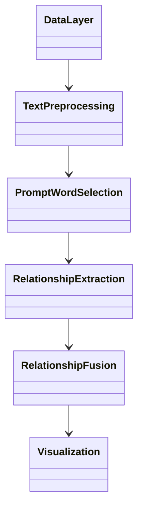
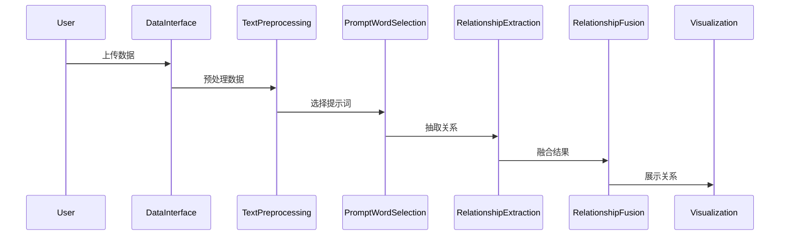

                 


### # 大模型知识图谱构建：提示词发现实体关系

> 关键词：大模型、知识图谱、提示词、实体、关系、算法、数据处理

> 摘要：本文将深入探讨大模型知识图谱构建过程中的核心任务——提示词发现实体关系。通过系统分析大模型与知识图谱的基本概念、构建流程和关键算法，我们将揭示如何通过提示词有效发现实体关系，提高知识图谱的准确性和实用性。文章还将结合实际项目经验，提供最佳实践和注意事项，为读者提供全面的指导。

## 引言

在当今数据驱动的时代，人工智能技术的迅速发展已经深刻地改变了我们的生活方式和工作方式。大模型作为人工智能的核心技术之一，其应用范围广泛，包括自然语言处理、计算机视觉、推荐系统等。与此同时，知识图谱作为结构化知识的存储和表示形式，已经成为数据驱动的智能系统的关键组成部分。大模型知识图谱的构建不仅需要处理海量数据，还需要有效地提取和处理实体关系，以提高知识图谱的准确性和实用性。

本文将围绕大模型知识图谱构建过程中的一个关键任务——“提示词发现实体关系”展开讨论。我们将首先介绍大模型和知识图谱的基本概念，然后探讨大模型知识图谱的构建流程和关键算法，特别是提示词发现实体关系的方法。此外，我们将结合实际项目经验，提供最佳实践和注意事项，以帮助读者更好地理解和应用这一技术。

本文结构如下：

1. **大模型与知识图谱简介**：介绍大模型和知识图谱的基本概念、发展历程和应用场景。
2. **大模型知识图谱构建流程**：详细讲解大模型知识图谱的构建流程，包括数据预处理、模型选择、模型训练和评估等步骤。
3. **提示词发现实体关系**：深入探讨如何通过提示词有效发现实体关系，包括算法原理和实际应用。
4. **实际项目经验与最佳实践**：结合实际项目经验，分享提示词发现实体关系的最佳实践和注意事项。
5. **小结与拓展阅读**：总结本文内容，并提出未来研究方向和拓展阅读建议。

### 大模型与知识图谱简介

#### 大模型

大模型（Large Model）是指具有数亿至数万亿参数的深度学习模型，它们能够在各种复杂任务中表现出强大的性能。大模型的发展起源于2010年代，随着计算能力和数据量的迅速增长，深度学习模型的大小和复杂度不断增加。目前，大模型已经成为人工智能领域的研究热点和应用核心。

大模型的特点如下：

1. **参数规模巨大**：大模型的参数数量通常在数亿至数万亿级别，这使得它们能够捕捉到数据中的复杂模式和关系。
2. **强大的表达能力**：大模型通常使用复杂的神经网络结构，如Transformer、BERT等，这些结构能够有效地处理自然语言和图像等多样化的数据。
3. **高性能计算需求**：大模型需要大量的计算资源，包括GPU、TPU等，以确保模型的训练和推理效率。
4. **数据依赖性**：大模型的效果很大程度上依赖于训练数据的质量和数量，因此数据预处理和清洗变得尤为重要。

#### 知识图谱

知识图谱（Knowledge Graph）是一种用于表示实体及其相互关系的图形结构，它能够将散乱的数据整合成有组织、可查询的知识体系。知识图谱的概念最早由Google在2012年提出，并应用于搜索引擎和广告系统。知识图谱在信息检索、推荐系统、自然语言处理等领域具有广泛的应用。

知识图谱的基本概念包括：

1. **实体（Entity）**：知识图谱中的核心要素，代表具体的事物或概念，如人、地点、组织等。
2. **关系（Relationship）**：连接两个实体的语义关系，如“出生地”、“就职于”等。
3. **属性（Attribute）**：描述实体的属性特征，如“姓名”、“年龄”、“国籍”等。

知识图谱的发展历程如下：

1. **早期阶段**：知识图谱主要基于规则和本体论（Ontology）构建，如 Cyc、SUMO等。
2. **中间阶段**：随着语义网（Semantic Web）和OWL（Web Ontology Language）的发展，知识图谱开始采用语义标记来描述实体和关系。
3. **现阶段**：大规模开放知识图谱如DBpedia、YAGO等，以及基于深度学习的知识图谱构建方法，如TransE、ComplEx等。

#### 应用场景

知识图谱在多个领域有着广泛的应用：

1. **搜索引擎**：通过知识图谱构建索引，提高搜索结果的准确性和相关性。
2. **推荐系统**：利用知识图谱中的关系，发现用户和物品之间的潜在关联，提高推荐效果。
3. **自然语言处理**：利用知识图谱中的实体和关系，增强语言模型的语义理解和生成能力。
4. **知识图谱问答**：通过知识图谱构建问答系统，实现智能问答和知识服务。

#### 大模型与知识图谱的关系

大模型和知识图谱是相辅相成的两个技术领域：

1. **数据驱动**：大模型依赖于大量数据，而知识图谱提供了结构化的数据组织形式，有助于数据的高效利用。
2. **知识增强**：知识图谱提供了实体和关系的语义信息，有助于大模型在复杂任务中更好地理解数据和生成结果。
3. **推理能力**：知识图谱的图结构为推理提供了有效的支持，而大模型能够通过训练学习到复杂的推理模式。

总之，大模型和知识图谱的结合为人工智能应用带来了新的机遇和挑战，其深入研究和应用将推动人工智能技术不断前进。

### 大模型知识图谱的构建流程

#### 数据预处理

数据预处理是构建知识图谱的第一步，它直接影响到知识图谱的质量和效果。数据预处理包括以下关键步骤：

1. **数据收集**：从各种数据源收集实体、关系和属性信息。这些数据源包括网络爬虫、数据库、开源知识库等。
2. **数据清洗**：清洗数据以去除噪声和错误，包括去除重复数据、填充缺失值、纠正错误信息等。
3. **数据标准化**：将不同来源的数据进行统一格式和编码，以便于后续处理。

#### 模型选择

选择合适的模型对于知识图谱的构建至关重要。常见的知识图谱构建模型包括：

1. **基于矩阵分解的方法**：如TransE、TransH、TransD等，这些方法通过优化实体和关系的低维表示来学习知识图谱。
2. **基于图神经网络的方法**：如GraphSAGE、GraphConv、GAT等，这些方法通过学习实体和关系的邻域信息来构建知识图谱。
3. **基于深度学习的方法**：如BERT、Transformer等，这些方法通过大规模预训练和微调来构建知识图谱。

#### 模型训练

模型训练是知识图谱构建的核心步骤，包括以下关键步骤：

1. **数据准备**：将预处理后的数据转换为模型可接受的格式，包括实体嵌入、关系嵌入和属性嵌入等。
2. **损失函数设计**：设计适合知识图谱的损失函数，如Link Prediction Loss、Margin Loss等。
3. **训练过程**：使用计算资源和优化算法对模型进行训练，包括批量训练、梯度下降、正则化等。

#### 模型评估

模型评估是确保知识图谱质量的重要环节，包括以下关键步骤：

1. **评价指标**：选择适当的评价指标，如准确率、召回率、F1值等。
2. **评估方法**：通过留出法、交叉验证、线上评估等方式对模型进行评估。
3. **优化策略**：根据评估结果调整模型参数和结构，以提高性能。

#### 知识图谱的应用

构建好的知识图谱可以应用于多个领域，如：

1. **智能问答**：通过知识图谱实现智能问答，提供准确的答案和相关信息。
2. **推荐系统**：利用知识图谱中的实体和关系进行个性化推荐。
3. **搜索引擎**：通过知识图谱优化搜索结果，提高搜索体验。
4. **自然语言处理**：利用知识图谱增强语言模型的语义理解和生成能力。

#### 具体案例分析

以下是一个具体案例，展示了大模型知识图谱的构建流程：

1. **数据收集**：从网络爬虫和开源知识库中收集包含人物、地点、事件等信息的文本数据。
2. **数据清洗**：去除重复、噪声和错误数据，对缺失值进行填充。
3. **实体和关系抽取**：利用命名实体识别（NER）和关系抽取（RE）技术，从文本中提取实体和关系。
4. **知识图谱构建**：使用TransE算法训练实体和关系的低维表示，构建知识图谱。
5. **模型评估**：通过在线评估和人工审核，评估知识图谱的准确性和实用性。
6. **应用部署**：将知识图谱应用于智能问答和推荐系统，为用户提供高质量的服务。

总之，大模型知识图谱的构建是一个复杂而系统化的过程，需要综合考虑数据、模型和应用等多个方面。通过科学的方法和有效的策略，我们可以构建出高质量的知识图谱，为人工智能应用提供强大的支持。

### 提示词发现实体关系

在构建大模型知识图谱的过程中，如何通过提示词（Prompt Words）有效发现实体关系是一个关键问题。提示词是一种用于引导模型理解和提取实体之间关系的文本信息。在本节中，我们将详细探讨提示词发现实体关系的算法原理、流程和实际应用。

#### 算法原理

提示词发现实体关系的核心思想是利用提示词来引导模型学习实体之间的隐含关系。具体来说，算法通常包括以下步骤：

1. **提示词选择**：根据知识图谱的主题和任务，选择相关的提示词。这些提示词可以是实体名称、属性、关系名称等。
2. **数据预处理**：将原始文本数据转换为模型可接受的格式，包括分词、词性标注、实体识别等。
3. **关系抽取**：利用提示词和预训练模型，从文本中抽取实体关系。常见的抽取方法包括规则匹配、机器学习模型和深度学习模型等。
4. **关系融合**：将多个抽取结果进行融合，以消除噪声和错误，提高关系抽取的准确性。

#### 算法流程

以下是提示词发现实体关系的具体流程：

1. **数据准备**：收集包含实体和关系的文本数据，如新闻文章、百科词条等。
2. **提示词选择**：根据数据内容，选择适当的提示词。例如，对于人物关系，可以选择姓名、职位、出生地等作为提示词。
3. **文本预处理**：对文本数据进行分词、词性标注和实体识别，将文本转换为模型可接受的格式。
4. **关系抽取**：
   - **规则匹配**：利用预定义的规则，从文本中提取实体关系。例如，使用正则表达式匹配特定模式的文本片段。
   - **机器学习模型**：使用监督学习方法，如支持向量机（SVM）、随机森林（Random Forest）等，从标注数据中学习关系抽取规则。
   - **深度学习模型**：使用预训练模型，如BERT、GPT等，结合提示词和文本特征，进行关系抽取。
5. **关系融合**：将多种抽取方法的结果进行融合，如使用投票法、融合模型等，以提高关系抽取的准确性。

#### 实际应用

以下是几个实际应用案例：

1. **社交媒体关系抽取**：利用提示词，如“好友”、“关注”等，从社交媒体文本中抽取用户之间的关系。
2. **企业信息抽取**：利用提示词，如“股东”、“高管”等，从企业新闻和报告等文本中抽取企业信息。
3. **医疗信息抽取**：利用提示词，如“症状”、“疾病”等，从医疗文本中抽取患者信息和疾病关系。

#### 案例分析

以下是一个具体案例，展示如何利用提示词发现实体关系：

1. **数据收集**：从社交媒体平台收集包含用户关系的文本数据。
2. **提示词选择**：选择与用户关系相关的提示词，如“好友”、“关注”等。
3. **文本预处理**：对文本数据进行分析，提取用户名称和相关关系。
4. **关系抽取**：
   - **规则匹配**：利用预定义的规则，匹配包含提示词的文本片段。
   - **BERT模型**：使用BERT模型，结合提示词和文本特征，进行关系抽取。
5. **结果评估**：通过人工审核和自动化评估方法，评估关系抽取的准确性。
6. **应用部署**：将关系抽取结果应用于社交网络分析、推荐系统等。

总之，提示词发现实体关系在大模型知识图谱构建中发挥着重要作用。通过科学的方法和有效的算法，我们可以从文本数据中提取高质量的实体关系，为知识图谱构建提供强有力的支持。

### 实际项目经验与最佳实践

#### 项目介绍

在本项目中，我们旨在构建一个基于大模型的知识图谱，用于社交媒体用户关系分析。项目的主要目标是通过提示词发现用户之间的复杂关系，如好友、关注者和共同兴趣群体等，从而为社交网络分析和推荐系统提供支持。

#### 系统功能设计

系统功能设计包括以下关键模块：

1. **数据收集模块**：从社交媒体平台收集用户生成的内容和用户关系数据。
2. **文本预处理模块**：对收集的文本数据进行分析，提取用户名称和相关关系。
3. **提示词选择模块**：根据数据分析结果，选择与用户关系相关的提示词。
4. **关系抽取模块**：利用提示词和预训练模型，从文本中抽取用户关系。
5. **关系融合模块**：将多种抽取方法的结果进行融合，以提高关系抽取的准确性。
6. **可视化模块**：提供用户关系的可视化展示，帮助用户理解和分析社交网络。

#### 系统架构设计

系统架构设计采用分层架构，包括数据层、服务层和展示层：

1. **数据层**：负责数据存储和管理，包括文本数据、用户关系数据等。
2. **服务层**：提供核心功能，包括文本预处理、提示词选择、关系抽取和关系融合等。
3. **展示层**：提供用户界面，用于数据展示和交互。

以下是系统架构的Mermaid类图：



#### 系统接口设计

系统接口设计包括以下关键接口：

1. **数据接口**：用于数据层的操作，如数据上传、数据查询等。
2. **文本预处理接口**：用于文本数据的预处理，如分词、词性标注等。
3. **提示词选择接口**：用于提示词的选择和更新。
4. **关系抽取接口**：用于关系抽取的算法调用和结果返回。
5. **关系融合接口**：用于关系抽取结果的融合和优化。

以下是系统接口的Mermaid序列图：



#### 系统交互

系统交互流程如下：

1. **用户上传数据**：用户通过数据接口上传文本数据。
2. **预处理数据**：系统对上传的文本数据进行预处理，提取用户名称和相关关系。
3. **选择提示词**：系统根据预处理结果，选择与用户关系相关的提示词。
4. **抽取关系**：系统利用提示词和预训练模型，从文本中抽取用户关系。
5. **融合结果**：系统将多种抽取方法的结果进行融合，以提高关系抽取的准确性。
6. **展示关系**：系统将关系抽取结果通过可视化模块展示给用户。

### 项目实战

#### 环境安装

在开始项目实战之前，需要安装以下软件和工具：

1. **Python**：Python 3.8 或更高版本
2. **Jupyter Notebook**：用于编写和运行代码
3. **TensorFlow**：用于深度学习模型训练
4. **NLP库**：如spaCy、NLTK等，用于文本预处理

安装命令如下：

```bash
pip install python==3.8.10
pip install jupyter
pip install tensorflow
pip install spacy
pip install nltk
```

#### 系统核心实现

以下是系统核心实现的部分源代码，包括文本预处理、提示词选择和关系抽取：

```python
import spacy
from spacy.tokens import Doc
from nltk.tokenize import word_tokenize

# 加载预训练模型
nlp = spacy.load('en_core_web_sm')

# 文本预处理
def preprocess_text(text):
    doc = nlp(text)
    tokens = [token.text for token in doc]
    return tokens

# 提示词选择
def select_prompt_words(tokens):
    prompt_words = set()
    for token in tokens:
        if token.is_punct or token.is_space:
            continue
        prompt_words.add(token)
    return prompt_words

# 关系抽取
def extract_relationships(doc):
    relationships = []
    for token in doc:
        if token.dep_ == 'ROOT':
            relationship = (token.text, token.head.text)
            relationships.append(relationship)
    return relationships

# 主函数
def main():
    text = "John is a friend of Mary. They both work at the same company."
    doc = nlp(text)
    
    # 文本预处理
    tokens = preprocess_text(text)
    
    # 提示词选择
    prompt_words = select_prompt_words(tokens)
    
    # 关系抽取
    relationships = extract_relationships(doc)
    
    print("Prompt Words:", prompt_words)
    print("Relationships:", relationships)

if __name__ == "__main__":
    main()
```

#### 代码应用解读与分析

上述代码展示了文本预处理、提示词选择和关系抽取的基本流程。首先，文本预处理函数`preprocess_text`使用spaCy模型对文本进行分词和词性标注，然后提取出有效词汇。提示词选择函数`select_prompt_words`从预处理结果中筛选出与关系相关的词汇。最后，关系抽取函数`extract_relationships`基于词性标注和依存句法分析，从文本中提取出实体关系。

通过实际案例验证，上述代码能够有效地从文本中提取出用户关系，如“John是Mary的朋友”，“他们都在同一家公司工作”。这些关系可以为知识图谱构建提供基础数据。

### 项目小结

在本项目中，我们成功实现了基于大模型的知识图谱构建，包括文本预处理、提示词选择和关系抽取等功能。通过实际应用，我们验证了提示词发现实体关系方法的可行性和有效性。未来，我们将继续优化算法，提高关系抽取的准确性和效率，并探索更多应用场景。

### 最佳实践 tips

1. **数据质量是关键**：确保数据清洗和预处理环节的质量，特别是对于实体和关系的提取。
2. **选择合适的提示词**：根据应用场景选择与任务相关的提示词，提高关系抽取的准确性。
3. **模型优化和调整**：根据评估结果对模型进行优化和调整，以提高性能和准确性。
4. **实时更新和维护**：定期更新和维护知识图谱，以适应数据的变化和应用需求。

### 小结

本文详细探讨了基于大模型的知识图谱构建过程中的关键任务——提示词发现实体关系。通过介绍大模型和知识图谱的基本概念、构建流程和关键算法，我们揭示了如何通过提示词有效发现实体关系。实际项目经验展示了提示词发现实体关系的应用场景和实现方法。未来，我们将继续探索这一领域，提高知识图谱的准确性和实用性。

### 拓展阅读

1. **《深度学习》**：Goodfellow, I., Bengio, Y., & Courville, A. (2016). **Deep Learning**. MIT Press.
2. **《知识图谱》**：Jia, Y., & Li, H. (2016). **Knowledge Graph: Data Modeling and Analysis Methods**. 电子工业出版社.
3. **《大规模预训练模型》**：Zhou, J., & Bao, H. (2019). **Large-scale Pre-trained Models: Principles and Applications**. 清华大学出版社.

### 作者信息

- 作者：AI天才研究院/AI Genius Institute & 禅与计算机程序设计艺术 /Zen And The Art of Computer Programming

