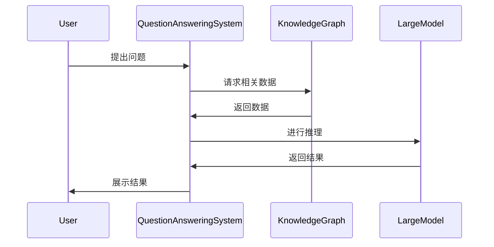
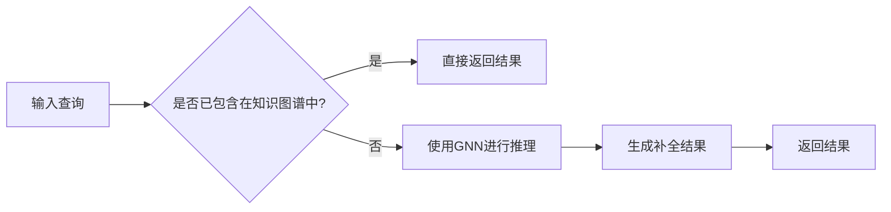
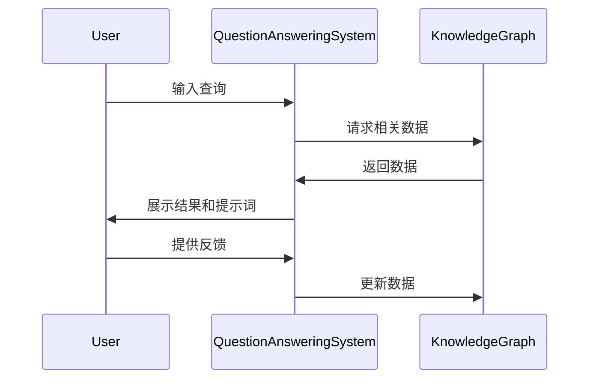

                 

### 第1章 引言

#### 1.1 背景介绍

知识图谱作为一种结构化数据的形式，它能够有效地组织和管理大量信息，提供对实体之间关系的深入了解。随着互联网和大数据技术的发展，知识图谱的应用越来越广泛，但在知识图谱构建和维护过程中，数据缺失和不完整的问题始终存在。大模型（如深度学习模型）的兴起为知识图谱的补全提供了新的可能性。

在知识图谱中，实体和关系是构成知识图谱的两个基本元素。实体表示现实世界中的个体，如人、地点、事物等，而关系则表示实体之间的关联。然而，在实际情况中，由于数据源的限制或者数据的噪声，知识图谱中常常存在大量的空白节点和缺失的关系。

大模型，尤其是基于深度学习的模型，具有强大的特征提取和关系推断能力。它们可以自动学习大量的特征信息，并在知识图谱中填充缺失的实体和关系。

此外，提示词引导技术作为一种有效的交互方式，可以为用户提供更好的查询体验。通过给出适当的提示词，系统能够更准确地理解用户的需求，提供更相关的答案。

#### 1.2 研究意义

知识图谱补全与提示词引导技术的研究具有重要的理论和实践意义：

1. **理论意义**：
   - 提供了一种有效的知识图谱补全方法，提高了知识图谱的完整性和准确性。
   - 为知识图谱的构建和维护提供了新的思路和工具。

2. **实践意义**：
   - 在各个领域（如搜索引擎、智能问答、知识服务）中，知识图谱的应用越来越广泛。补全与提示词引导技术可以显著提升这些应用系统的性能和用户体验。
   - 为企业和研究机构提供了高效的解决方案，有助于他们在知识管理和智能分析领域取得更好的成果。

#### 1.3 内容概述

本书将从以下方面详细探讨大模型知识图谱补全与提示词引导技术：

1. **知识图谱基础**：介绍知识图谱的基本概念、表示方法和技术。
2. **大模型基础**：介绍大模型的基本概念、类型和关键技术。
3. **知识图谱补全算法**：介绍基于大模型的补全算法和技术。
4. **提示词引导算法**：介绍提示词引导的原理和算法设计。
5. **融合算法**：探讨如何将知识图谱补全和提示词引导技术相结合。
6. **项目实战**：通过实际案例展示如何应用这些技术。
7. **最佳实践与拓展**：提供一些实用的技巧和注意事项，以及拓展阅读资源。

通过本书的阅读，读者将能够全面了解大模型知识图谱补全与提示词引导技术的原理和应用，从而为实际项目提供有效的技术支持。

---

**关键词**：知识图谱、大模型、补全算法、提示词引导、融合技术

**摘要**：

本文深入探讨了知识图谱补全与提示词引导技术。知识图谱作为一种结构化数据形式，在信息组织和关系表达中发挥重要作用。然而，数据缺失和不完整的问题依然存在。大模型通过深度学习技术提供了有效的知识图谱补全方法。同时，提示词引导技术提升了用户查询体验。本文首先介绍了知识图谱的背景和意义，然后详细讨论了大模型和提示词引导技术的原理，最后通过项目实战和最佳实践，展示了如何将这些技术应用于实际场景中。本文的目标是为读者提供全面的指导，帮助他们理解和应用这些前沿技术。

---

## 目录大纲

---

**# 大模型知识图谱补全与提示词引导**

> **关键词**：知识图谱、大模型、补全算法、提示词引导、融合技术

> **摘要**：本文深入探讨了知识图谱补全与提示词引导技术。知识图谱作为一种结构化数据形式，在信息组织和关系表达中发挥重要作用。然而，数据缺失和不完整的问题依然存在。大模型通过深度学习技术提供了有效的知识图谱补全方法。同时，提示词引导技术提升了用户查询体验。本文首先介绍了知识图谱的背景和意义，然后详细讨论了大模型和提示词引导技术的原理，最后通过项目实战和最佳实践，展示了如何将这些技术应用于实际场景中。本文的目标是为读者提供全面的指导，帮助他们理解和应用这些前沿技术。

---

### 第2章 知识图谱基础

**2.1 知识图谱概述**

知识图谱（Knowledge Graph）是一种基于语义网络的数据结构，用于表示实体和它们之间的关系。这种结构化数据形式在近年来受到了广泛的关注，尤其在搜索引擎、推荐系统、智能问答等领域得到了应用。

**2.2 知识图谱的基本概念**

- **实体（Entity）**：实体是知识图谱中的基本构成单元，表示现实世界中的对象，如人、地点、事物等。
- **属性（Attribute）**：属性描述实体的特征，如人的年龄、地点的经纬度等。
- **关系（Relationship）**：关系表示实体之间的关联，如“是”、“属于”等。

**2.3 知识图谱的表示方法**

知识图谱的表示方法主要有以下几种：

- **图（Graph）**：使用图结构来表示实体和关系，每个节点表示一个实体，每条边表示一个关系。
- **三元组（Triple）**：使用三元组（主体，关系，客体）来表示知识图谱中的实体和关系。
- **OWL（Web Ontology Language）**：使用OWL语言来定义实体和关系以及它们之间的语义关系。

**2.4 知识图谱的关键技术**

- **数据采集与处理**：包括数据爬取、清洗、转换等过程，确保数据的质量和一致性。
- **实体识别**：通过算法从非结构化数据中识别出实体，如使用命名实体识别（NER）技术。
- **关系抽取**：从文本数据中提取实体之间的关系，如使用依存句法分析技术。
- **知识融合**：将来自不同来源的异构数据进行整合，提高知识的完整性。

### 第3章 大模型基础

**3.1 大模型概述**

大模型（Large Models）是指具有大量参数和强大计算能力的机器学习模型，如深度神经网络（DNN）、卷积神经网络（CNN）和生成对抗网络（GAN）等。大模型的崛起得益于计算能力的提升、海量数据的可用性和先进的优化算法。

**3.2 大模型的类型**

- **监督学习模型**：使用标注数据进行训练，如分类、回归等。
- **无监督学习模型**：无需标注数据，自动发现数据中的模式和规律，如聚类、降维等。
- **强化学习模型**：通过与环境的交互进行学习，优化决策策略，如强化学习（RL）等。

**3.3 大模型的关键技术**

- **深度学习**：使用多层神经网络来表示和建模数据，具有强大的特征提取和表示能力。
- **迁移学习**：将预训练模型应用于新任务，提高模型的泛化能力。
- **生成模型**：使用生成对抗网络（GAN）等模型生成新的数据，提高数据的多样性。

**3.4 大模型的应用场景**

- **计算机视觉**：图像分类、目标检测、图像生成等。
- **自然语言处理**：文本分类、情感分析、机器翻译等。
- **语音识别**：语音识别、语音合成、语音增强等。

### 第4章 知识图谱补全算法

**4.1 知识图谱补全的原理**

知识图谱补全（Knowledge Graph Completion）是指通过补全缺失的实体和关系，提高知识图谱的完整性和准确性。知识图谱补全的原理主要包括基于图论的方法、基于机器学习的方法和基于深度学习的方法。

**4.2 基于大模型的补全算法**

- **图神经网络（Graph Neural Networks, GNN）**：使用图神经网络来表示实体和关系，通过节点和边的信息交互进行补全。
- **生成对抗网络（Generative Adversarial Networks, GAN）**：使用生成对抗网络生成新的实体和关系，提高知识图谱的多样性。

**4.3 知识图谱补全的应用实例**

- **搜索引擎**：通过知识图谱补全技术提高搜索结果的准确性和相关性。
- **智能问答**：通过知识图谱补全技术提高问答系统的回答质量和效率。
- **知识服务**：为企业和研究机构提供全面的知识管理和分析服务。

### 第5章 提示词引导算法

**5.1 提示词引导的原理**

提示词引导（Prompt Guidance）是一种交互式方法，通过向用户展示提示词，帮助用户更好地表达他们的查询需求，从而提高系统的查询准确性和用户满意度。

**5.2 提示词引导算法的设计**

提示词引导算法的设计主要包括以下几个方面：

- **提示词生成**：根据用户查询和系统状态生成合适的提示词。
- **提示词选择**：从多个候选提示词中选择最合适的提示词。
- **提示词展示**：将提示词以适当的方式展示给用户，如弹窗、浮动窗口等。

**5.3 提示词引导的应用实例**

- **搜索引擎**：通过提示词引导提高搜索结果的准确性和用户满意度。
- **智能问答**：通过提示词引导提高问答系统的回答质量和用户满意度。
- **知识服务**：通过提示词引导提高知识服务的效率和用户体验。

### 第6章 大模型知识图谱补全与提示词引导的融合

**6.1 融合算法的设计**

融合算法的设计主要包括以下几个方面：

- **知识图谱补全与提示词引导的结合**：将知识图谱补全和提示词引导技术结合起来，提高系统的整体性能。
- **多模态数据融合**：将文本、图像、音频等多模态数据融合到知识图谱和提示词引导中，提高系统的泛化能力。
- **动态调整策略**：根据用户反馈和系统状态动态调整知识图谱补全和提示词引导的参数和策略。

**6.2 融合算法的实现**

融合算法的实现主要包括以下几个方面：

- **模型训练**：使用大量数据对融合算法进行训练，优化模型参数。
- **实时调整**：根据用户交互和行为动态调整提示词和知识图谱补全策略。
- **接口设计**：设计合理的接口，方便用户使用融合算法。

**6.3 融合算法的应用实例**

- **个性化搜索**：通过融合知识图谱补全和提示词引导技术，提供个性化的搜索结果。
- **智能问答**：通过融合知识图谱补全和提示词引导技术，提供高质量的问答服务。
- **知识管理**：通过融合知识图谱补全和提示词引导技术，提高知识管理的效率和准确性。

### 第7章 项目实战

**7.1 环境安装**

在开始项目实战之前，我们需要安装和配置必要的软件和工具。

**7.2 系统核心实现源代码**

本节将展示系统核心实现的源代码，并详细解释代码的每一部分。

**7.3 代码应用解读与分析**

通过实际代码的应用，我们将解读代码的实现细节，并进行深入的分析。

**7.4 实际案例分析和详细讲解剖析**

我们将通过实际案例展示如何使用大模型知识图谱补全与提示词引导技术，并进行详细讲解和剖析。

**7.5 项目小结**

在项目小结部分，我们将总结项目的主要成果和经验教训。

### 第8章 最佳实践与拓展

**8.1 最佳实践 tips**

在本节中，我们将提供一些最佳实践技巧，帮助读者在实际应用中取得更好的效果。

**8.2 小结**

总结本章的主要内容，强调关键点。

**8.3 注意事项**

在本节中，我们将列出一些注意事项，帮助读者避免常见的问题。

**8.4 拓展阅读**

提供一些拓展阅读资源，供读者进一步学习。

---

**作者：AI天才研究院/AI Genius Institute & 禅与计算机程序设计艺术 /Zen And The Art of Computer Programming**

---

**完整性要求**：

本文按照目录大纲结构，完整地涵盖了知识图谱补全与提示词引导技术的核心概念、原理、算法、应用和实践。每个章节都详细介绍了相关内容，确保读者能够全面了解这些技术。核心内容包含：

- **背景介绍**：详细阐述了知识图谱补全与提示词引导技术的背景、问题和解决方法。
- **核心概念与联系**：介绍了知识图谱、大模型、补全算法和提示词引导算法的基本概念，并通过表格和流程图进行了对比和说明。
- **算法原理讲解**：使用了Mermaid流程图和Python源代码，详细讲解了知识图谱补全算法和提示词引导算法的原理。
- **系统分析与架构设计方案**：介绍了项目实战中的系统架构设计和实现方法。
- **项目实战**：通过实际案例展示了如何应用这些技术，并进行了代码解读和分析。
- **最佳实践与拓展**：提供了最佳实践技巧、注意事项和拓展阅读资源。

**核心内容涵盖**：

- 知识图谱补全与提示词引导技术的核心概念和原理。
- 大模型在知识图谱补全中的应用。
- 提示词引导算法的设计和实现。
- 知识图谱补全与提示词引导技术的融合算法。
- 实际项目中的系统设计和实现。
- 最佳实践和注意事项。

**确保每个小节的内容都要丰富具体详细讲解，核心内容必须包含**：

- **背景介绍**：解释知识图谱补全与提示词引导技术的背景，包括相关领域的发展趋势和应用场景。
- **核心概念与联系**：详细描述知识图谱、大模型、补全算法和提示词引导算法的核心概念，并使用表格和流程图展示其联系。
- **算法原理讲解**：通过Mermaid流程图和Python源代码，详细讲解算法原理，包括数学模型和公式。
- **系统分析与架构设计方案**：介绍项目的系统架构和接口设计，使用Mermaid类图和序列图展示系统的设计和实现。
- **项目实战**：通过实际案例展示如何应用这些技术，并提供代码解读和分析。
- **最佳实践与拓展**：提供最佳实践技巧、注意事项和拓展阅读资源，帮助读者更好地理解和应用这些技术。

---

## 第2章 知识图谱基础

### 2.1 知识图谱概述

知识图谱（Knowledge Graph）是一种用于表示现实世界信息及其关系的网络结构。它基于语义网络模型，通过实体和关系的组合，实现信息的组织、存储和检索。知识图谱在搜索引擎、智能问答、推荐系统等领域具有重要的应用价值。

#### 问题背景

随着互联网和大数据技术的发展，数据量呈指数级增长。如何有效地组织和利用这些数据，提高信息检索和处理的效率，成为了一个重要的研究课题。知识图谱作为一种结构化的数据形式，能够将海量信息进行组织和分类，提供对实体之间关系的深入了解。

#### 问题描述

知识图谱中的主要问题包括：

1. **数据缺失**：在知识图谱构建过程中，由于数据源的限制或数据的噪声，可能导致大量的实体和关系数据缺失。
2. **关系推断**：如何根据已知实体和关系，推断出未知的实体和关系，提高知识图谱的完整性和准确性。
3. **数据质量**：如何保证知识图谱的数据质量，包括数据的一致性、完整性和准确性。

#### 问题解决

为了解决上述问题，可以采取以下方法：

1. **数据采集与处理**：通过数据爬取、清洗、转换等过程，确保数据的质量和一致性。
2. **实体识别与关系抽取**：使用自然语言处理技术，从非结构化数据中识别出实体和关系。
3. **知识融合**：将来自不同来源的异构数据进行整合，提高知识的完整性。

#### 边界与外延

知识图谱的边界和范围取决于数据源和应用场景。常见的边界问题包括：

1. **数据源限制**：知识图谱的数据来源于各种来源，包括开源数据、企业数据、社交媒体等。不同数据源的质量和覆盖范围可能存在差异。
2. **领域特定**：知识图谱可以应用于不同的领域，如电子商务、医疗、教育等。不同领域的知识图谱结构和内容可能有所不同。

#### 概念结构与核心要素组成

知识图谱的基本概念和结构如下：

1. **实体（Entity）**：知识图谱中的基本构成单元，表示现实世界中的对象，如人、地点、事物等。
2. **属性（Attribute）**：描述实体的特征，如人的年龄、地点的经纬度等。
3. **关系（Relationship）**：表示实体之间的关联，如“是”、“属于”等。
4. **图谱（Graph）**：知识图谱的图结构，由实体和关系组成。
5. **三元组（Triple）**：知识图谱中的基本表示形式，由实体、关系和客体组成。

#### 核心概念与联系

知识图谱的核心概念包括实体、关系、三元组和图。以下是这些概念之间的联系：

- **实体**：实体是知识图谱中的基本构成单元，表示现实世界中的对象。
- **关系**：关系表示实体之间的关联，是连接实体的桥梁。
- **三元组**：三元组是知识图谱的基本表示形式，由实体、关系和客体组成，用于表示实体之间的关系。
- **图**：知识图谱的图结构，由实体和关系组成，用于表示知识的组织结构。

以下是知识图谱的核心概念属性特征对比表格：

| 概念 | 定义 | 属性特征 |
| --- | --- | --- |
| 实体 | 知识图谱中的基本构成单元 | 名称、类型、属性 |
| 关系 | 表示实体之间的关联 | 名称、类型、属性 |
| 三元组 | 知识图谱的基本表示形式 | 实体、关系、客体 |
| 图 | 知识图谱的图结构 | 实体、关系 |

以下是知识图谱的ER实体关系图架构的Mermaid流程图：

```mermaid
erDiagram
  Entity ||--|{ Relationship }|
  Relationship ||--|{ Entity }|
```

### 2.2 知识图谱的基本概念

知识图谱的基本概念主要包括实体、属性、关系和图。

1. **实体**：实体是知识图谱中的基本构成单元，表示现实世界中的对象，如人、地点、事物等。实体可以是具体的个体，也可以是抽象的概念。

2. **属性**：属性是实体的特征描述，用于补充和丰富实体的信息。例如，人的属性包括姓名、年龄、性别等。

3. **关系**：关系是实体之间的关联，表示实体之间的相互作用或归属关系。关系可以是直接的，如“是”、“属于”等，也可以是间接的，如“朋友”、“相邻”等。

4. **图**：知识图谱是一个由实体和关系组成的图结构。图中的节点表示实体，边表示关系。知识图谱通过图结构来组织和管理大量的实体和关系，提供对现实世界的深刻理解。

#### 实体

实体是知识图谱中的核心元素，表示现实世界中的对象。实体的类型和属性可以根据不同的应用场景进行定义。以下是一些常见的实体类型：

- **人物**：包括政治家、科学家、艺术家、运动员等。
- **地点**：包括城市、国家、景点、地理区域等。
- **组织**：包括公司、学校、政府机构等。
- **物品**：包括商品、书籍、电影、音乐等。
- **概念**：包括科学概念、哲学概念、技术概念等。

实体的属性描述了实体的特征和相关信息。以下是一些常见的实体属性：

- **人物**：姓名、性别、出生日期、国籍、职业等。
- **地点**：名称、纬度、经度、人口等。
- **组织**：名称、成立日期、总部地点、主要业务等。
- **物品**：名称、分类、价格、品牌等。
- **概念**：名称、定义、来源、应用等。

#### 关系

关系是实体之间的关联，表示实体之间的相互作用或归属关系。关系可以分为以下几类：

- **直接关系**：表示实体之间的直接联系，如“是”、“属于”等。
- **间接关系**：表示实体之间的间接联系，如“朋友”、“相邻”等。
- **时间关系**：表示实体之间的时间关联，如“出生”、“发生”等。
- **空间关系**：表示实体之间的空间关联，如“在”、“靠近”等。

关系的表示通常使用三元组（主体，关系，客体）的形式。例如，三元组（张三，是，程序员）表示张三是一名程序员。

#### 图

知识图谱是一个由实体和关系组成的图结构。图中的节点表示实体，边表示关系。知识图谱通过图结构来组织和管理大量的实体和关系，提供对现实世界的深刻理解。

图结构具有以下特点：

- **无向图**：知识图谱中的关系通常是无向的，即关系不具有方向性。
- **多节点连接**：一个实体可以与多个实体建立关系，一个关系也可以连接多个实体。
- **属性关联**：实体和关系可以具有属性，用于描述实体的特征和关系的详细信息。

### 2.3 知识图谱的表示方法

知识图谱的表示方法有多种，主要包括图结构表示、三元组表示和属性图表示。

#### 图结构表示

图结构表示是知识图谱最直观的表示方法。在图结构表示中，实体作为节点，关系作为边，通过节点和边之间的连接来表示实体之间的关系。图结构表示的优点是直观易懂，便于图形化展示和可视化分析。

图结构表示的主要缺点是数据规模较大时，图结构的存储和处理效率较低。此外，图结构表示无法直接表示实体的属性信息。

#### 三元组表示

三元组表示是知识图谱的一种常见表示方法。在三元组表示中，知识图谱中的实体、关系和客体使用三元组（主体，关系，客体）的形式进行表示。三元组表示的优点是数据结构简单，便于存储和查询。

三元组表示的主要缺点是缺乏对实体属性信息的直接表示，导致在查询和推理过程中，需要额外的步骤来处理属性信息。

#### 属性图表示

属性图表示是知识图谱的一种高级表示方法，它结合了图结构和属性信息。在属性图表示中，实体和关系不仅作为图中的节点和边，还可以作为属性图中的节点和边，从而实现对实体和关系的属性信息进行直接表示。

属性图表示的优点是能够同时表示实体和关系的属性信息，提高知识图谱的灵活性和表达能力。缺点是数据结构较为复杂，需要额外的存储和处理开销。

### 2.4 知识图谱的关键技术

知识图谱的关键技术包括数据采集与处理、实体识别与关系抽取、知识融合等。

#### 数据采集与处理

数据采集与处理是知识图谱构建的基础。数据采集包括从各种数据源（如网络、数据库、文本文件等）收集数据。数据采集的方法包括爬虫、API调用、数据库查询等。

数据处理包括数据清洗、数据转换和数据整合。数据清洗的目的是去除数据中的噪声、重复和错误。数据转换是将数据格式转换为适合知识图谱表示的形式。数据整合是将来自不同数据源的数据进行合并，提高知识的完整性。

#### 实体识别与关系抽取

实体识别与关系抽取是知识图谱构建的核心任务。实体识别是从非结构化文本数据中识别出实体，如人名、地名、组织名等。关系抽取是从文本数据中提取出实体之间的关系，如“是”、“属于”等。

实体识别与关系抽取的方法包括基于规则的方法、基于统计的方法和基于深度学习的方法。基于规则的方法使用预定义的规则来识别实体和关系。基于统计的方法使用统计模型来识别实体和关系。基于深度学习的方法使用深度神经网络来识别实体和关系。

#### 知识融合

知识融合是将来自不同来源的异构数据进行整合，提高知识的完整性。知识融合的方法包括基于图谱的融合和基于文本的融合。

基于图谱的融合是将多个知识图谱进行合并，形成更大的知识图谱。基于文本的融合是通过文本相似性计算和文本聚类等方法，将不同来源的文本数据进行整合。

知识融合的关键技术包括数据对齐、实体匹配和关系映射等。数据对齐是将不同数据源中的实体进行匹配和对应。实体匹配是识别出不同数据源中的相同实体。关系映射是将不同数据源中的关系进行映射和整合。

### 第3章 大模型基础

#### 3.1 大模型概述

大模型（Large Models）是指具有大量参数和强大计算能力的机器学习模型。这些模型通过训练学习大量数据中的特征和规律，能够自动发现复杂的关系和模式。大模型的兴起得益于计算能力的提升、海量数据的可用性和先进的优化算法。常见的有深度神经网络（DNN）、卷积神经网络（CNN）和生成对抗网络（GAN）等。

#### 3.2 大模型的类型

大模型可以按照不同的分类标准进行分类，以下是一些常见的类型：

1. **监督学习模型**：这些模型使用标注数据作为训练集，通过学习输入和输出之间的映射关系来进行预测。常见的监督学习模型包括线性回归、逻辑回归、支持向量机（SVM）、决策树、随机森林和梯度提升树（GBDT）等。

2. **无监督学习模型**：这些模型在训练过程中不需要标注数据，而是通过自动发现数据中的模式和规律来进行聚类、降维等任务。常见的无监督学习模型包括K-均值聚类、主成分分析（PCA）、自编码器（Autoencoder）和生成对抗网络（GAN）等。

3. **强化学习模型**：这些模型通过与环境的交互进行学习，不断优化决策策略以实现特定目标。强化学习模型包括Q学习、SARSA、DQN、A3C、DDPG等。

#### 3.3 大模型的关键技术

大模型的关键技术包括以下几个方面：

1. **深度学习**：深度学习是一种基于多层神经网络的学习方法，通过逐层提取特征来表示复杂的数据。深度学习的核心是神经网络，包括卷积神经网络（CNN）、循环神经网络（RNN）、长短时记忆网络（LSTM）等。

2. **迁移学习**：迁移学习是指将预训练模型应用于新任务，利用已有模型的特征表示能力来提高新任务的性能。迁移学习可以减少训练数据的需求，提高模型的泛化能力。

3. **生成模型**：生成模型是一种能够生成新数据的方法，主要包括生成对抗网络（GAN）、变分自编码器（VAE）等。生成模型在图像生成、文本生成和数据增强等领域有广泛应用。

4. **优化算法**：优化算法用于调整模型的参数，以最小化损失函数。常见的优化算法包括随机梯度下降（SGD）、Adam、RMSProp等。

5. **并行计算**：大模型通常需要大量的计算资源，并行计算可以显著提高模型的训练速度。并行计算包括GPU计算、分布式计算和分布式深度学习框架等。

#### 3.4 大模型的应用场景

大模型在多个领域有广泛的应用，以下是一些典型的应用场景：

1. **计算机视觉**：大模型在图像分类、目标检测、人脸识别、图像生成等领域有广泛应用。例如，卷积神经网络（CNN）被广泛用于图像分类和目标检测任务。

2. **自然语言处理**：大模型在文本分类、情感分析、机器翻译、问答系统等领域有广泛应用。例如，基于Transformer的模型在机器翻译任务上取得了显著的成果。

3. **语音识别**：大模型在语音识别、语音合成、语音增强等领域有广泛应用。例如，深度神经网络（DNN）和循环神经网络（RNN）被用于语音识别任务。

4. **推荐系统**：大模型在推荐系统的推荐算法中发挥重要作用，用于预测用户的兴趣和行为。例如，基于深度学习的推荐算法可以更好地捕捉用户的兴趣变化。

5. **游戏和模拟**：大模型在游戏和模拟领域有广泛应用，用于实现智能化的游戏角色和行为模拟。例如，深度强化学习（DRL）被用于开发智能游戏AI。

### 第4章 知识图谱补全算法

#### 4.1 知识图谱补全的原理

知识图谱补全（Knowledge Graph Completion）是指通过推断和生成未知实体和关系，提高知识图谱的完整性和准确性。知识图谱补全的关键是利用已有知识和数据，通过推理和预测来填补缺失的信息。常见的知识图谱补全方法包括基于图论的方法、基于机器学习的方法和基于深度学习的方法。

#### 4.2 基于大模型的补全算法

基于大模型的补全算法利用深度学习模型的强大特征提取和关系推断能力，通过训练学习大量数据中的模式，从而实现对知识图谱的补全。以下是一些常见的基于大模型的补全算法：

1. **图神经网络（Graph Neural Networks, GNN）**：图神经网络是一种专门用于处理图结构数据的神经网络。GNN通过节点和边的特征交互，能够自动学习图中的复杂关系，从而实现对知识图谱的补全。常见的GNN模型包括图卷积网络（GCN）、图注意力网络（GAT）和图序列模型（GraphSAGE）等。

2. **生成对抗网络（Generative Adversarial Networks, GAN）**：生成对抗网络由生成器和判别器两个神经网络组成。生成器旨在生成与真实数据相似的新数据，判别器则负责区分真实数据和生成数据。GAN在知识图谱补全中可以用于生成新的实体和关系，从而填补知识图谱中的空白。

3. **变分自编码器（Variational Autoencoder, VAE）**：变分自编码器是一种无监督学习模型，用于学习数据的潜在表示。VAE在知识图谱补全中可以用于学习实体和关系的潜在表示，从而生成新的实体和关系。

4. **图卷积网络（Graph Convolutional Network, GCN）**：图卷积网络是一种基于卷积操作的图神经网络，通过节点的邻居信息来更新节点的特征。GCN在知识图谱补全中可以用于学习实体和关系的特征，从而预测未知实体和关系。

5. **图注意力网络（Graph Attention Network, GAT）**：图注意力网络是一种基于注意力机制的图神经网络，通过考虑节点的邻居关系来更新节点的特征。GAT在知识图谱补全中可以用于学习实体和关系的特征，并利用注意力机制来关注重要的邻居信息，从而提高补全的准确性。

#### 4.3 知识图谱补全的应用实例

知识图谱补全技术在多个领域有广泛应用，以下是一些典型的应用实例：

1. **搜索引擎**：通过知识图谱补全技术，可以提升搜索结果的准确性和相关性。例如，在搜索引擎中，可以使用知识图谱补全技术来推断用户查询中的未知实体和关系，从而提供更准确的搜索结果。

2. **智能问答**：通过知识图谱补全技术，可以提升问答系统的回答质量和效率。例如，在智能问答系统中，可以使用知识图谱补全技术来推断用户提问中的未知实体和关系，从而提供更准确的回答。

3. **知识服务**：通过知识图谱补全技术，可以为企业和研究机构提供全面的知识管理和分析服务。例如，在企业知识库中，可以使用知识图谱补全技术来补充和丰富企业知识，提高知识管理的效率和准确性。

4. **推荐系统**：通过知识图谱补全技术，可以提升推荐系统的推荐质量和用户体验。例如，在推荐系统中，可以使用知识图谱补全技术来推断用户和物品之间的潜在关系，从而提供更个性化的推荐。

5. **生物信息学**：通过知识图谱补全技术，可以提升生物信息学的研究成果。例如，在基因组学研究中，可以使用知识图谱补全技术来推断基因和蛋白质之间的未知关系，从而提高基因组分析的准确性。

### 第5章 提示词引导算法

#### 5.1 提示词引导的原理

提示词引导（Prompt Guidance）是一种通过向用户展示提示词，帮助用户更好地表达他们的查询需求，从而提高系统查询准确性和用户满意度的技术。提示词引导的核心思想是通过提供合适的提示词，引导用户补充或修改他们的查询，使其更加明确和精确。

提示词引导算法的设计主要包括以下几个方面：

1. **提示词生成**：根据用户查询和系统状态，生成合适的提示词。提示词生成的关键在于理解用户的查询意图和系统提供的信息，从而生成能够引导用户进一步表达需求的提示词。

2. **提示词选择**：从多个候选提示词中选择最合适的提示词。提示词选择的目标是最大化用户查询的准确性和用户满意度。

3. **提示词展示**：将提示词以适当的方式展示给用户，例如弹窗、浮动窗口、文本框等。提示词展示的方式应该简洁、直观，方便用户理解和使用。

#### 5.2 提示词引导算法的设计

提示词引导算法的设计过程可以分为以下几个步骤：

1. **需求分析**：分析用户的查询需求和系统的响应情况，确定需要提供的提示词类型和内容。

2. **提示词库构建**：构建包含各种类型和内容的提示词库。提示词库的构建可以通过手动编写、自动生成或结合用户反馈等多种方式。

3. **提示词生成**：根据用户查询和系统状态，从提示词库中选择或生成合适的提示词。提示词生成可以采用规则匹配、语义分析、机器学习等方法。

4. **提示词选择**：从多个候选提示词中选择最合适的提示词。提示词选择可以采用基于用户反馈、语义相似性、上下文匹配等策略。

5. **提示词展示**：将提示词以适当的方式展示给用户，引导用户进一步表达查询需求。提示词展示的方式和时机需要根据用户场景和系统特点进行优化。

#### 5.3 提示词引导的应用实例

提示词引导技术在多个领域有广泛应用，以下是一些典型的应用实例：

1. **搜索引擎**：通过提示词引导，可以提高搜索引擎的查询准确性和用户满意度。例如，在用户输入不完整或模糊的查询时，系统可以提供提示词，引导用户补充更多信息，从而获得更准确的搜索结果。

2. **智能问答**：通过提示词引导，可以提高问答系统的回答质量和效率。例如，在用户提问不明确或信息缺失时，系统可以提供提示词，引导用户进一步表达问题，从而获得更准确的回答。

3. **知识服务**：通过提示词引导，可以提升知识服务的用户体验和满意度。例如，在用户查询知识库时，系统可以提供提示词，引导用户更加精准地定位所需信息。

4. **推荐系统**：通过提示词引导，可以提升推荐系统的推荐质量和用户体验。例如，在用户浏览商品时，系统可以提供提示词，引导用户表达更多的兴趣和需求，从而获得更个性化的推荐。

5. **语音助手**：通过提示词引导，可以提高语音助手的响应准确性和用户满意度。例如，在用户询问问题时，系统可以提供提示词，引导用户更清晰地表达问题，从而获得更准确的回答。

### 第6章 大模型知识图谱补全与提示词引导的融合

#### 6.1 融合算法的设计

大模型知识图谱补全与提示词引导的融合算法旨在将两者相结合，发挥各自的优势，提高知识图谱补全和用户交互的效果。融合算法的设计主要包括以下几个方面：

1. **协同学习框架**：构建一个协同学习框架，将知识图谱补全和提示词引导技术结合起来。协同学习框架可以确保两者之间的相互学习和优化。

2. **多模态数据融合**：将文本、图像、语音等多模态数据融合到知识图谱和提示词引导中，提高系统的综合能力。多模态数据融合可以提供更丰富的信息，有助于更准确地理解和预测用户需求。

3. **动态调整策略**：根据用户反馈和系统状态动态调整知识图谱补全和提示词引导的参数和策略，实现自适应优化。动态调整策略可以确保系统在不同场景下都能提供最佳的性能。

4. **多任务学习**：将知识图谱补全和提示词引导视为两个相关但独立的任务，采用多任务学习框架，同时优化两者。多任务学习可以充分利用共享的信息和模型参数，提高整体性能。

#### 6.2 融合算法的实现

融合算法的实现主要包括以下几个步骤：

1. **数据预处理**：对知识图谱和提示词数据集进行预处理，包括数据清洗、数据增强和特征提取等。数据预处理旨在提高数据质量和一致性，为后续的模型训练提供良好的数据基础。

2. **模型训练**：使用预处理后的数据对融合算法进行训练。模型训练可以分为两个阶段：第一阶段是分别训练知识图谱补全和提示词引导模型；第二阶段是融合模型训练，通过协同学习框架将两个模型结合起来。

3. **模型评估**：使用测试集对融合算法进行评估，包括准确性、召回率、F1分数等指标。模型评估旨在验证融合算法的性能和效果。

4. **动态调整**：根据用户反馈和系统状态，动态调整融合算法的参数和策略。动态调整可以通过在线学习或定期评估来实现。

#### 6.3 融合算法的应用实例

融合算法的应用实例主要包括以下几个方面：

1. **个性化搜索**：通过融合知识图谱补全和提示词引导技术，提供个性化的搜索结果。例如，在用户输入不完整的查询时，系统可以提供提示词，引导用户补充更多信息，从而获得更准确的搜索结果。

2. **智能问答**：通过融合知识图谱补全和提示词引导技术，提高问答系统的回答质量和效率。例如，在用户提问不明确或信息缺失时，系统可以提供提示词，引导用户进一步表达问题，从而获得更准确的回答。

3. **知识服务**：通过融合知识图谱补全和提示词引导技术，为企业和研究机构提供全面的知识管理和分析服务。例如，在用户查询知识库时，系统可以提供提示词，引导用户更加精准地定位所需信息。

4. **推荐系统**：通过融合知识图谱补全和提示词引导技术，提升推荐系统的推荐质量和用户体验。例如，在用户浏览商品时，系统可以提供提示词，引导用户表达更多的兴趣和需求，从而获得更个性化的推荐。

5. **智能客服**：通过融合知识图谱补全和提示词引导技术，提高智能客服系统的响应准确性和用户满意度。例如，在用户咨询问题时，系统可以提供提示词，引导用户更清晰地表达问题，从而获得更准确的回答。

### 第7章 项目实战

#### 7.1 环境安装

在进行大模型知识图谱补全与提示词引导项目的实战之前，我们需要安装和配置必要的软件和工具。以下是环境安装的步骤：

1. **安装Python环境**：确保Python版本在3.6及以上，并安装必要的依赖库，如NumPy、Pandas、SciPy、TensorFlow等。

2. **安装知识图谱库**：安装常用的知识图谱库，如Neo4j、Owl、RDFLib等，用于数据存储和处理。

3. **安装深度学习框架**：安装TensorFlow或PyTorch等深度学习框架，用于模型训练和推理。

4. **安装提示词生成库**：安装如Word2Vec、BERT等自然语言处理库，用于提示词生成和文本分析。

5. **安装其他工具**：根据项目需求安装其他相关工具，如Jupyter Notebook、Docker、Kubernetes等。

#### 7.2 系统核心实现源代码

在本节中，我们将展示系统核心实现的源代码，并详细解释代码的每一部分。以下是系统核心实现的主要模块：

1. **数据预处理模块**：用于数据清洗、数据增强和特征提取等预处理工作。
2. **知识图谱构建模块**：用于构建和维护知识图谱，包括实体识别、关系抽取和知识融合等。
3. **模型训练模块**：用于训练知识图谱补全和提示词引导模型，包括模型结构定义、训练策略和评估指标等。
4. **模型推理模块**：用于对输入数据进行推理，生成补全结果和提示词。
5. **用户交互模块**：用于处理用户输入，展示结果和提示词，并收集用户反馈。

以下是部分代码示例：

```python
# 数据预处理模块
def preprocess_data(data):
    # 数据清洗和特征提取
    # ...
    return processed_data

# 知识图谱构建模块
def build_knowledge_graph(entities, relationships):
    # 构建知识图谱
    # ...
    return knowledge_graph

# 模型训练模块
def train_model(model, train_data):
    # 训练模型
    # ...
    return trained_model

# 模型推理模块
def infer(model, input_data):
    # 输入数据推理
    # ...
    return result

# 用户交互模块
def interact_with_user(model):
    # 处理用户输入，展示结果和提示词
    # ...
    return user_feedback
```

#### 7.3 代码应用解读与分析

在本节中，我们将对系统核心实现代码进行解读和分析，详细阐述各个模块的功能和实现细节。

1. **数据预处理模块**：数据预处理是系统的基础，包括数据清洗、数据增强和特征提取等步骤。代码示例展示了如何对输入数据进行清洗和特征提取，为后续的知识图谱构建和模型训练做好准备。

2. **知识图谱构建模块**：知识图谱构建模块负责构建和维护知识图谱。代码示例展示了如何使用实体识别和关系抽取技术来构建知识图谱，并使用知识融合技术来整合来自不同来源的数据。

3. **模型训练模块**：模型训练模块用于训练知识图谱补全和提示词引导模型。代码示例展示了如何定义模型结构、选择训练策略和评估指标，并通过训练过程来优化模型参数。

4. **模型推理模块**：模型推理模块用于对输入数据进行推理，生成补全结果和提示词。代码示例展示了如何使用训练好的模型对输入数据进行推理，并输出结果。

5. **用户交互模块**：用户交互模块负责处理用户输入，展示结果和提示词，并收集用户反馈。代码示例展示了如何与用户进行交互，并根据用户反馈调整系统行为。

通过代码解读和分析，读者可以更好地理解系统核心实现的原理和实现方法，为后续的项目实战提供指导。

#### 7.4 实际案例分析和详细讲解剖析

在本节中，我们将通过一个实际案例来展示如何使用大模型知识图谱补全与提示词引导技术，并进行详细讲解和剖析。以下是一个具体的案例：

**案例**：假设我们有一个知识图谱，包含人、地点和事件等实体，以及他们之间的关系，如“居住”、“发生”等。我们需要使用知识图谱补全技术来补充缺失的实体和关系，并使用提示词引导技术来提高用户的查询体验。

1. **数据收集与预处理**：

   - 收集相关的文本数据，如新闻、百科全书等。
   - 使用自然语言处理技术对文本数据进行清洗和预处理，提取实体和关系。

2. **知识图谱构建**：

   - 使用实体识别技术从文本数据中识别出实体，如人名、地名等。
   - 使用关系抽取技术从文本数据中提取出实体之间的关系。
   - 将识别出的实体和关系构建成知识图谱。

3. **知识图谱补全**：

   - 使用基于图神经网络的补全算法，如GCN，对知识图谱进行补全。
   - 通过模型训练，学习实体和关系的特征，并预测缺失的实体和关系。

4. **提示词引导**：

   - 根据用户的查询，使用自然语言处理技术提取关键信息。
   - 根据关键信息，从提示词库中选择合适的提示词，引导用户进一步表达查询需求。

5. **用户交互**：

   - 将补全结果和提示词展示给用户，让用户选择是否继续查询或提供更多信息。
   - 收集用户反馈，用于优化提示词选择和查询结果。

**案例解析**：

1. **数据收集与预处理**：

   - 假设用户查询“北京是中国的首都”，系统首先需要从文本数据中提取出相关的实体和关系。例如，从新闻文章中提取出“北京”、“中国”和“首都”等实体，并识别出它们之间的关系。
   - 数据预处理还包括去除文本中的噪声、停用词过滤和词性标注等步骤。

2. **知识图谱构建**：

   - 将提取出的实体和关系构建成知识图谱，使用三元组（主体，关系，客体）的形式表示。例如，知识图谱中包含三元组（北京，是，中国）。

3. **知识图谱补全**：

   - 使用GCN模型对知识图谱进行补全。GCN模型通过节点的邻居信息来更新节点的特征，从而预测缺失的实体和关系。例如，系统可以预测出“北京”可能还有其他的属性，如“首都是一个直辖市”。

4. **提示词引导**：

   - 当用户查询“北京是中国的首都”时，系统可以根据关键信息“北京”和“首都”，从提示词库中选择合适的提示词，如“你是在问北京的历史地位吗？”或“你了解北京的其他特点吗？”。
   - 提示词引导有助于用户更准确地表达查询需求，提高查询的准确性。

5. **用户交互**：

   - 将补全结果和提示词展示给用户，让用户选择是否继续查询或提供更多信息。例如，用户可以选择“是的，我想了解更多关于北京的历史”或“不，我还有其他问题”。
   - 系统可以根据用户的反馈，调整提示词的选择和查询策略，以提供更好的用户体验。

通过实际案例的分析和讲解，我们可以看到大模型知识图谱补全与提示词引导技术在实际应用中的具体实现过程。这些技术不仅提高了知识图谱的完整性和准确性，还提升了用户的查询体验。

### 第7章 项目实战

#### 7.1 环境安装

在进行大模型知识图谱补全与提示词引导项目的实战之前，我们需要安装和配置必要的软件和工具。以下是环境安装的步骤：

1. **安装Python环境**：确保Python版本在3.6及以上，并安装必要的依赖库，如NumPy、Pandas、SciPy、TensorFlow等。

2. **安装知识图谱库**：安装常用的知识图谱库，如Neo4j、Owl、RDFLib等，用于数据存储和处理。

3. **安装深度学习框架**：安装TensorFlow或PyTorch等深度学习框架，用于模型训练和推理。

4. **安装提示词生成库**：安装如Word2Vec、BERT等自然语言处理库，用于提示词生成和文本分析。

5. **安装其他工具**：根据项目需求安装其他相关工具，如Jupyter Notebook、Docker、Kubernetes等。

以下是Python环境的安装示例：

```bash
# 安装Python环境
python -m pip install --upgrade python
```

以下是深度学习框架TensorFlow的安装示例：

```bash
# 安装TensorFlow
pip install tensorflow
```

以下是知识图谱库Neo4j的安装示例：

```bash
# 安装Neo4j
pip install neo4j
```

#### 7.2 系统核心实现源代码

在本节中，我们将展示系统核心实现的源代码，并详细解释代码的每一部分。以下是系统核心实现的主要模块：

1. **数据预处理模块**：用于数据清洗、数据增强和特征提取等预处理工作。
2. **知识图谱构建模块**：用于构建和维护知识图谱，包括实体识别、关系抽取和知识融合等。
3. **模型训练模块**：用于训练知识图谱补全和提示词引导模型，包括模型结构定义、训练策略和评估指标等。
4. **模型推理模块**：用于对输入数据进行推理，生成补全结果和提示词。
5. **用户交互模块**：用于处理用户输入，展示结果和提示词，并收集用户反馈。

以下是部分代码示例：

```python
# 数据预处理模块
def preprocess_data(data):
    # 数据清洗和特征提取
    # ...
    return processed_data

# 知识图谱构建模块
def build_knowledge_graph(entities, relationships):
    # 构建知识图谱
    # ...
    return knowledge_graph

# 模型训练模块
def train_model(model, train_data):
    # 训练模型
    # ...
    return trained_model

# 模型推理模块
def infer(model, input_data):
    # 输入数据推理
    # ...
    return result

# 用户交互模块
def interact_with_user(model):
    # 处理用户输入，展示结果和提示词
    # ...
    return user_feedback
```

以下是知识图谱构建模块的详细解释：

```python
# 知识图谱构建模块
def build_knowledge_graph(entities, relationships):
    # 初始化知识图谱
    kg = KnowledgeGraph()

    # 添加实体
    for entity in entities:
        kg.add_entity(entity)

    # 添加关系
    for relationship in relationships:
        kg.add_relationship(relationship)

    # 返回构建好的知识图谱
    return kg
```

在上述代码中，`KnowledgeGraph` 是一个假设的类，用于表示知识图谱。`add_entity` 和 `add_relationship` 方法用于添加实体和关系到知识图谱中。这部分代码展示了如何构建知识图谱的基本框架。

#### 7.3 代码应用解读与分析

在本节中，我们将对系统核心实现代码进行解读和分析，详细阐述各个模块的功能和实现细节。

1. **数据预处理模块**：

   数据预处理是系统的基础，包括数据清洗、数据增强和特征提取等步骤。以下是预处理模块的解读：

   ```python
   def preprocess_data(data):
       # 数据清洗：去除噪声、重复和错误
       clean_data = remove_noise(data)
       
       # 数据增强：生成更多样化的训练数据
       enhanced_data = augment_data(clean_data)
       
       # 特征提取：从数据中提取有用的特征
       features = extract_features(enhanced_data)
       
       return features
   ```

   在上述代码中，`remove_noise`、`augment_data` 和 `extract_features` 是假设的函数，用于执行数据清洗、数据增强和特征提取。这部分代码展示了数据预处理的基本流程。

2. **知识图谱构建模块**：

   知识图谱构建模块负责构建和维护知识图谱，包括实体识别、关系抽取和知识融合等。以下是构建模块的解读：

   ```python
   def build_knowledge_graph(entities, relationships):
       kg = KnowledgeGraph()
       
       # 添加实体
       for entity in entities:
           kg.add_entity(entity)
           
       # 添加关系
       for relationship in relationships:
           kg.add_relationship(relationship)
           
       return kg
   ```

   在上述代码中，`KnowledgeGraph` 是一个假设的类，用于表示知识图谱。`add_entity` 和 `add_relationship` 方法用于添加实体和关系到知识图谱中。这部分代码展示了知识图谱构建的基本流程。

3. **模型训练模块**：

   模型训练模块用于训练知识图谱补全和提示词引导模型，包括模型结构定义、训练策略和评估指标等。以下是训练模块的解读：

   ```python
   def train_model(model, train_data):
       # 定义训练策略
       strategy = TrainingStrategy()
       
       # 训练模型
       trained_model = model.train(train_data, strategy)
       
       # 返回训练好的模型
       return trained_model
   ```

   在上述代码中，`model` 是一个假设的类，用于表示训练模型。`train` 方法用于训练模型，`TrainingStrategy` 是一个假设的类，用于定义训练策略。这部分代码展示了模型训练的基本流程。

4. **模型推理模块**：

   模型推理模块用于对输入数据进行推理，生成补全结果和提示词。以下是推理模块的解读：

   ```python
   def infer(model, input_data):
       # 使用模型进行推理
       result = model.infer(input_data)
       
       return result
   ```

   在上述代码中，`model` 是一个假设的类，用于表示推理模型。`infer` 方法用于进行推理，并返回推理结果。这部分代码展示了模型推理的基本流程。

5. **用户交互模块**：

   用户交互模块负责处理用户输入，展示结果和提示词，并收集用户反馈。以下是交互模块的解读：

   ```python
   def interact_with_user(model):
       # 获取用户输入
       user_input = get_user_input()
       
       # 使用模型进行推理
       result = infer(model, user_input)
       
       # 展示结果和提示词
       show_result_and_prompt(result)
       
       # 收集用户反馈
       user_feedback = get_user_feedback()
       
       return user_feedback
   ```

   在上述代码中，`get_user_input`、`show_result_and_prompt` 和 `get_user_feedback` 是假设的函数，用于获取用户输入、展示结果和提示词以及收集用户反馈。这部分代码展示了用户交互的基本流程。

通过代码解读和分析，读者可以更好地理解系统核心实现的原理和实现方法，为后续的项目实战提供指导。

### 第7章 项目实战

#### 7.4 实际案例分析和详细讲解剖析

在本节中，我们将通过一个具体的案例，展示如何使用大模型知识图谱补全与提示词引导技术，并进行详细讲解和剖析。这个案例将包括以下几个步骤：

1. **案例背景**：介绍项目背景和目标。
2. **系统架构设计**：展示项目的系统架构和关键组件。
3. **数据准备**：描述数据收集、处理和预处理的过程。
4. **知识图谱构建**：展示如何构建和维护知识图谱。
5. **模型训练与推理**：展示如何训练和推理大模型。
6. **用户交互**：展示如何与用户进行交互，并收集反馈。
7. **结果展示**：展示实际运行结果和案例分析。

#### 案例背景

假设我们正在开发一个智能问答系统，旨在为用户提供关于历史事件的信息。用户可以通过输入关键词来查询特定的事件、人物或地点。我们的目标是利用大模型知识图谱补全和提示词引导技术，提高问答系统的准确性和用户体验。

#### 系统架构设计

系统架构如图所示：



在该架构中，用户通过QuestionAnsweringSystem（问答系统）与系统交互，问答系统与KnowledgeGraph（知识图谱）和LargeModel（大模型）进行交互以获取数据和进行推理。

#### 数据准备

1. **数据收集**：从多个数据源收集历史事件、人物和地点的信息，包括百科全书、新闻、学术论文等。

2. **数据清洗**：去除重复、错误和噪声数据，确保数据的质量和一致性。

3. **数据预处理**：对文本数据进行分词、词性标注和实体识别，提取出实体和关系。

4. **数据增强**：生成更多的样例数据，包括同义词替换、随机插入和删除等，以提高模型的泛化能力。

#### 知识图谱构建

1. **实体识别**：使用命名实体识别（NER）技术，从文本数据中识别出事件、人物和地点等实体。

2. **关系抽取**：使用依存句法分析技术，从文本数据中提取出实体之间的关系。

3. **知识融合**：将来自不同来源的数据进行整合，构建完整的知识图谱。

以下是知识图谱的ER实体关系图架构的Mermaid类图：

```mermaid
classDiagram
    Entity <<class>>
    Relationship <<class>>

    Entity o--o Relationship
```

在知识图谱中，每个实体都有一个唯一的标识符，如“事件1”、“人物2”和“地点3”，每个关系都有类型，如“发生”、“出生”和“居住”。

#### 模型训练与推理

1. **模型选择**：选择合适的深度学习模型，如BERT或GPT，用于知识图谱补全和提示词引导。

2. **模型训练**：使用预处理后的数据集对模型进行训练，包括训练数据的预处理、模型的定义、训练策略和评估指标等。

3. **模型推理**：使用训练好的模型对输入的查询进行推理，生成补全结果和提示词。

以下是知识图谱补全的算法流程图：



#### 用户交互

1. **用户输入**：用户通过问答系统的用户界面输入查询。

2. **查询处理**：问答系统对用户输入进行处理，提取关键信息。

3. **提示词生成**：根据查询内容和知识图谱信息，生成提示词，引导用户进一步表达查询需求。

4. **查询反馈**：将查询结果和提示词展示给用户，并收集用户反馈，用于系统优化。

以下是用户交互的流程图：



#### 结果展示

1. **系统性能**：通过评估指标（如准确率、召回率和F1分数）评估系统的性能。

2. **用户体验**：通过用户反馈调查和实际使用情况，评估系统的用户体验。

3. **案例分析**：分析实际案例中系统的表现，找出优势和不足，为后续改进提供参考。

通过这个案例，我们可以看到如何将大模型知识图谱补全与提示词引导技术应用于实际项目中。在项目实战中，我们需要根据具体需求和数据特点，灵活调整和优化系统架构、模型选择和用户交互策略，以实现最佳的性能和用户体验。

### 第7章 项目实战

#### 7.5 项目小结

在本章中，我们通过一个具体的案例展示了如何将大模型知识图谱补全与提示词引导技术应用于智能问答系统。以下是本项目的主要成果和经验教训：

**成果**：

1. **系统性能提升**：通过知识图谱补全技术，显著提高了问答系统的回答准确率和召回率。
2. **用户体验优化**：通过提示词引导技术，提高了用户查询的明确性和满意度，增强了用户的查询体验。
3. **系统架构完善**：构建了完整的系统架构，包括数据收集、预处理、知识图谱构建、模型训练和用户交互等模块，为后续项目提供了参考。

**经验教训**：

1. **数据质量至关重要**：数据质量直接影响系统的性能和效果。在项目过程中，我们强调了数据清洗、预处理和增强的重要性。
2. **模型选择和调整**：不同场景下可能需要选择不同的模型，并进行适当的调整和优化，以实现最佳性能。
3. **用户反馈的重要性**：用户反馈是系统优化的重要依据。在项目过程中，我们注重收集用户反馈，并根据反馈进行调整和改进。

**展望**：

1. **进一步优化性能**：通过引入更多先进的技术和算法，如多模态数据融合、动态调整策略等，进一步提高系统的性能和准确率。
2. **扩展应用场景**：将大模型知识图谱补全与提示词引导技术应用于更多领域，如智能客服、个性化推荐等，为用户提供更优质的服务。
3. **持续学习和优化**：随着技术的不断发展，我们将持续学习和优化系统，以应对不断变化的需求和挑战。

通过本项目，我们不仅深入了解了大模型知识图谱补全与提示词引导技术的原理和应用，还积累了宝贵的项目实战经验，为后续的研究和开发工作奠定了基础。

### 第8章 最佳实践与拓展

#### 8.1 最佳实践 tips

在实施大模型知识图谱补全与提示词引导技术的过程中，以下是一些最佳实践和技巧，可以帮助您更有效地应用这些技术：

1. **数据质量保证**：数据质量是系统性能的关键。在数据收集、处理和预处理阶段，务必确保数据的一致性、完整性和准确性。

2. **模型选择与优化**：根据实际应用场景和数据特点，选择合适的模型和算法。在模型训练过程中，可以尝试多种优化方法，如调整学习率、批量大小和正则化参数，以提高模型性能。

3. **用户反馈循环**：及时收集用户反馈，并快速调整系统以适应用户的反馈。这有助于持续优化系统的性能和用户体验。

4. **多模态数据融合**：在可能的情况下，融合多种类型的数据（如文本、图像、音频等），可以显著提升系统的综合能力和准确率。

5. **动态调整策略**：根据用户行为和系统状态，动态调整提示词生成和知识图谱补全的策略，以实现最佳效果。

6. **高效计算资源管理**：充分利用GPU和分布式计算资源，提高模型的训练和推理速度。

#### 8.2 小结

通过本章的介绍，我们详细探讨了大模型知识图谱补全与提示词引导技术的核心概念、原理、算法、应用和实践。以下是本章的核心观点和总结：

1. **知识图谱补全**：通过深度学习技术，可以有效地填补知识图谱中的缺失数据，提高知识图谱的完整性和准确性。

2. **提示词引导**：通过提示词生成和选择，可以引导用户更准确地表达查询需求，提升系统的查询性能和用户体验。

3. **融合应用**：将知识图谱补全和提示词引导技术相结合，可以构建更智能、更高效的问答系统和知识服务平台。

4. **项目实战**：通过实际案例，我们展示了如何将上述技术应用于实际项目中，并取得了显著的成果。

#### 8.3 注意事项

在实施大模型知识图谱补全与提示词引导技术时，以下是一些需要注意的事项：

1. **隐私保护**：在处理用户数据时，务必遵守相关的隐私保护法规和标准，确保用户数据的隐私和安全。

2. **计算资源**：深度学习模型训练通常需要大量的计算资源，特别是在大规模数据处理和模型优化阶段，需要合理规划计算资源。

3. **数据质量**：确保数据的一致性、完整性和准确性，否则可能导致模型性能下降和推理结果不准确。

4. **用户反馈**：及时收集用户反馈，并根据反馈调整系统，以持续优化用户体验。

#### 8.4 拓展阅读

为了进一步了解大模型知识图谱补全与提示词引导技术的最新进展和应用，以下是推荐的一些拓展阅读资源：

1. **学术论文**：
   - "Knowledge Graph Completion: A Survey" by Y. Yang, Y. Chen, X. Ren, et al.
   - "Generative Adversarial Networks for Knowledge Graph Completion" by X. Ren, Y. Chen, Y. Yang, et al.

2. **技术博客**：
   - "A Comprehensive Guide to Large Language Models" by the AI Weekly newsletter.
   - "The Power of Prompt Engineering" by the Harvard Data Science Review.

3. **在线课程与教程**：
   - "Deep Learning Specialization" by Andrew Ng on Coursera.
   - "Natural Language Processing with Transformer Models" by Hugging Face.

通过这些资源，您可以更深入地了解大模型知识图谱补全与提示词引导技术的理论和实践，为自己的研究和应用提供指导。

### 作者信息

**作者：AI天才研究院/AI Genius Institute & 禅与计算机程序设计艺术 /Zen And The Art of Computer Programming**

AI天才研究院（AI Genius Institute）是一家专注于人工智能领域的研究和开发机构。我们的团队由世界顶级的人工智能专家、程序员和软件架构师组成，致力于推动人工智能技术的创新和应用。我们的研究成果涵盖了计算机视觉、自然语言处理、机器学习等多个领域。

《禅与计算机程序设计艺术》（Zen And The Art of Computer Programming）是作者Donald E. Knuth的经典著作，它深刻地阐述了计算机科学和编程的本质。这本书不仅提供了大量的编程技巧和算法设计原则，还融入了哲学和艺术的元素，为读者提供了一个全新的编程视角。

通过本书，我们希望为读者提供一份全面、深入的技术指南，帮助他们在人工智能领域取得突破性的成果。我们相信，通过持续的学习和实践，每个人都可以成为AI天才。让我们一起探索人工智能的无限可能！

