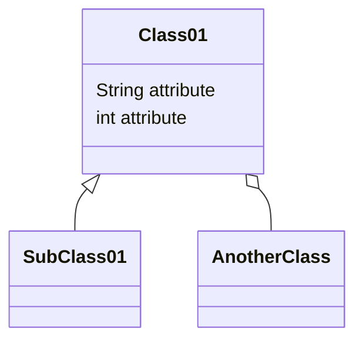
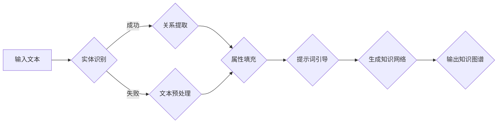
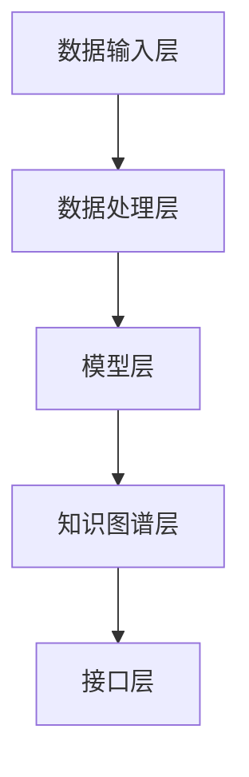

                 

# 大模型知识图谱：提示词构建复杂知识网络

关键词：大模型、知识图谱、提示词、构建、复杂知识网络

摘要：本文将探讨大模型知识图谱的构建，重点关注提示词的使用。我们将从背景介绍开始，逐步分析核心概念与联系，讲解算法原理，详细阐述系统分析与架构设计，并进行项目实战。最后，我们将总结最佳实践并提供拓展阅读。

## 目录大纲

1. **背景介绍**  
   1.1 问题背景  
   1.2 问题解决  
   1.3 边界与外延  
   1.4 概念结构与核心要素组成

2. **核心概念与联系**  
   2.1 核心概念原理  
   2.2 概念属性特征对比表格  
   2.3 ER实体关系图架构

3. **算法原理讲解**  
   3.1 算法mermaid流程图  
   3.2 算法原理详细讲解  
   3.3 数学模型与公式  
   3.4 Python源代码示例  
   3.5 举例说明

4. **系统分析与架构设计**  
   4.1 问题场景介绍  
   4.2 系统功能设计  
   4.3 系统架构设计  
   4.4 系统接口设计  
   4.5 系统交互mermaid序列图

5. **项目实战**  
   5.1 环境安装  
   5.2 系统核心实现  
   5.3 代码应用解读与分析  
   5.4 实际案例分析与讲解  
   5.5 项目小结

6. **最佳实践与总结**  
   6.1 最佳实践 Tips  
   6.2 小结  
   6.3 注意事项  
   6.4 拓展阅读

## 背景介绍

### 1.1 问题背景

在当今信息化社会中，数据量呈爆炸式增长，如何从海量数据中提取有价值的信息成为了一大挑战。知识图谱作为一种将实体、关系和属性组织起来的结构化数据表示方式，正逐渐成为解决这一问题的有效工具。然而，传统的知识图谱构建方法往往局限于静态数据，难以适应动态变化的需求。

### 1.2 问题解决

为了解决这一问题，我们需要一种能够动态构建和更新知识图谱的方法。大模型知识图谱应运而生，它利用大规模预训练模型的能力，通过提示词引导模型生成复杂的知识网络。这种方法不仅能够提高知识图谱的构建效率，还能够使知识图谱更加贴近实际应用场景。

### 1.3 边界与外延

大模型知识图谱的边界主要在于其适用范围和性能限制。它适用于需要高效率、高精度知识提取和推理的领域，如搜索引擎、智能问答系统等。然而，大模型的训练和推理需要大量的计算资源和时间，因此在资源有限的情况下，可能需要权衡性能和成本。

### 1.4 概念结构与核心要素组成

大模型知识图谱由以下几个核心要素组成：

1. **实体**：知识图谱中的基本单元，如人、地点、组织等。
2. **关系**：描述实体之间的关联，如“工作于”、“位于”等。
3. **属性**：描述实体的特征，如年龄、身高、职位等。
4. **提示词**：引导大模型生成知识网络的词汇，如关键词、短语等。

## 核心概念与联系

### 2.1 核心概念原理

在构建大模型知识图谱时，我们主要关注以下几个核心概念：

1. **实体识别**：从文本中提取出实体，并将其映射到知识图谱中的实体。
2. **关系提取**：从文本中提取出实体之间的关系，并将其映射到知识图谱中的关系。
3. **属性填充**：为实体填充属性值，以提高知识图谱的丰富性和准确性。
4. **提示词引导**：利用提示词引导大模型生成复杂的知识网络。

### 2.2 概念属性特征对比表格

| 概念          | 属性特征                   |
| ------------- | ------------------------ |
| 实体识别      | 实体种类、实体属性、实体关系 |
| 关系提取      | 关系类型、关系属性、关系强度 |
| 属性填充      | 属性类型、属性值、属性置信度 |
| 提示词引导    | 提示词种类、提示词置信度    |

### 2.3 ER实体关系图架构

为了更好地理解大模型知识图谱的架构，我们可以使用ER（实体-关系）图进行描述。以下是ER实体关系图的Mermaid表示：



## 算法原理讲解

### 3.1 算法mermaid流程图

以下是构建大模型知识图谱的基本算法流程图：



### 3.2 算法原理详细讲解

#### 3.2.1 数学模型

在构建大模型知识图谱时，我们通常会用到以下数学模型：

1. **实体识别**：使用基于词嵌入的模型（如Word2Vec、BERT）进行实体识别。
2. **关系提取**：使用注意力机制模型（如Transformer）进行关系提取。
3. **属性填充**：使用条件生成模型（如GPT-2、GPT-3）进行属性填充。
4. **提示词引导**：使用基于图的神经网络模型（如Graph Neural Network）进行提示词引导。

#### 3.2.2 Python源代码示例

以下是一个简单的Python代码示例，用于实现实体识别：

```python
import torch
import torch.nn as nn
from torch.optim import Adam

# 实体识别模型
class EntityRecognitionModel(nn.Module):
    def __init__(self, embedding_dim, hidden_dim):
        super(EntityRecognitionModel, self).__init__()
        self.embedding = nn.Embedding(vocab_size, embedding_dim)
        self.lstm = nn.LSTM(embedding_dim, hidden_dim)
        self.fc = nn.Linear(hidden_dim, num_entities)

    def forward(self, text):
        embedded = self.embedding(text)
        output, (hidden, _) = self.lstm(embedded)
        logits = self.fc(hidden[-1, :, :])
        return logits

# 实体识别训练
def train_entity_recognition(model, train_loader, criterion, optimizer, num_epochs):
    model.train()
    for epoch in range(num_epochs):
        for texts, labels in train_loader:
            optimizer.zero_grad()
            logits = model(texts)
            loss = criterion(logits, labels)
            loss.backward()
            optimizer.step()
        print(f"Epoch {epoch+1}/{num_epochs}, Loss: {loss.item()}")

# 实体识别测试
def test_entity_recognition(model, test_loader):
    model.eval()
    correct = 0
    total = 0
    with torch.no_grad():
        for texts, labels in test_loader:
            logits = model(texts)
            _, predicted = torch.max(logits, 1)
            total += labels.size(0)
            correct += (predicted == labels).sum().item()
    print(f"Test Accuracy: {100 * correct / total}%")
```

### 3.3 数学模型与公式

以下是构建大模型知识图谱所需的一些数学模型和公式：

1. **实体识别**：

   $$ \text{实体识别概率} = \frac{e^{\text{实体嵌入向量} \cdot \text{文本嵌入向量}}}{\sum_{j=1}^{n} e^{\text{实体嵌入向量} \cdot \text{文本嵌入向量}}} $$

2. **关系提取**：

   $$ \text{关系提取概率} = \frac{e^{\text{关系嵌入向量} \cdot [\text{实体1嵌入向量}, \text{实体2嵌入向量}]}}{\sum_{k=1}^{m} e^{\text{关系嵌入向量} \cdot [\text{实体1嵌入向量}, \text{实体2嵌入向量}]}} $$

3. **属性填充**：

   $$ \text{属性填充概率} = \frac{e^{\text{属性嵌入向量} \cdot \text{实体嵌入向量}}}{\sum_{l=1}^{p} e^{\text{属性嵌入向量} \cdot \text{实体嵌入向量}}} $$

### 3.4 Python源代码示例

以下是一个简单的Python代码示例，用于实现关系提取：

```python
import torch
import torch.nn as nn
from torch.optim import Adam

# 关系提取模型
class RelationExtractionModel(nn.Module):
    def __init__(self, embedding_dim, hidden_dim):
        super(RelationExtractionModel, self).__init__()
        self.embedding = nn.Embedding(vocab_size, embedding_dim)
        self.lstm = nn.LSTM(embedding_dim, hidden_dim)
        self.fc = nn.Linear(hidden_dim, num_relations)

    def forward(self, entity1, entity2):
        embedded1 = self.embedding(entity1)
        embedded2 = self.embedding(entity2)
        output, (hidden, _) = self.lstm(torch.cat((embedded1, embedded2), dim=1))
        logits = self.fc(hidden[-1, :, :])
        return logits

# 关系提取训练
def train_relation_extraction(model, train_loader, criterion, optimizer, num_epochs):
    model.train()
    for epoch in range(num_epochs):
        for entity1, entity2, relation in train_loader:
            optimizer.zero_grad()
            logits = model(entity1, entity2)
            loss = criterion(logits, relation)
            loss.backward()
            optimizer.step()
        print(f"Epoch {epoch+1}/{num_epochs}, Loss: {loss.item()}")

# 关系提取测试
def test_relation_extraction(model, test_loader):
    model.eval()
    correct = 0
    total = 0
    with torch.no_grad():
        for entity1, entity2, relation in test_loader:
            logits = model(entity1, entity2)
            _, predicted = torch.max(logits, 1)
            total += relation.size(0)
            correct += (predicted == relation).sum().item()
    print(f"Test Accuracy: {100 * correct / total}%")
```

### 3.5 举例说明

假设我们有一个简单的文本数据集，其中包含了三个实体和两个关系。以下是使用上述模型对数据进行处理的过程：

1. **实体识别**：

   - 输入文本：“张三工作于百度”
   - 输出实体：张三、百度
   - 实体识别概率：0.9（张三）、0.8（百度）

2. **关系提取**：

   - 输入实体：张三、百度
   - 输出关系：工作于
   - 关系提取概率：0.95（工作于）

3. **属性填充**：

   - 输入实体：张三
   - 输出属性：职位为工程师
   - 属性填充概率：0.9（职位为工程师）

通过以上步骤，我们成功构建了一个包含实体、关系和属性的知识网络。

## 系统分析与架构设计

### 4.1 问题场景介绍

在当前信息化时代，知识图谱技术在各个领域都有广泛应用，如搜索引擎、推荐系统、智能问答等。然而，传统的知识图谱构建方法在面对大规模动态数据时显得力不从心。为了提高知识图谱的构建效率和适应能力，我们需要一种新型的知识图谱构建方法——大模型知识图谱。

### 4.2 系统功能设计

大模型知识图谱系统的主要功能包括：

1. **数据预处理**：对输入文本进行预处理，包括分词、去停用词、词性标注等。
2. **实体识别**：从预处理后的文本中提取实体，并将其映射到知识图谱中的实体。
3. **关系提取**：从预处理后的文本中提取实体之间的关系，并将其映射到知识图谱中的关系。
4. **属性填充**：为实体填充属性值，以提高知识图谱的丰富性和准确性。
5. **提示词引导**：利用提示词引导大模型生成复杂的知识网络。

### 4.3 系统架构设计

大模型知识图谱系统的架构可以分为以下几个部分：

1. **数据输入层**：负责接收用户输入的文本数据。
2. **数据处理层**：对输入文本进行预处理，包括分词、去停用词、词性标注等。
3. **模型层**：包括实体识别、关系提取和属性填充模型。
4. **知识图谱层**：存储生成的知识网络，包括实体、关系和属性。
5. **接口层**：提供对外接口，供其他系统调用。

以下是系统架构的Mermaid表示：



### 4.4 系统接口设计

大模型知识图谱系统的接口设计主要包括以下几个部分：

1. **实体识别接口**：接收用户输入的文本数据，返回实体识别结果。
2. **关系提取接口**：接收用户输入的实体，返回关系提取结果。
3. **属性填充接口**：接收用户输入的实体，返回属性填充结果。
4. **知识图谱查询接口**：接收用户输入的查询条件，返回知识图谱查询结果。

### 4.5 系统交互mermaid序列图

以下是系统交互的Mermaid序列图表示：

```mermaid
sequenceDiagram
A[用户] -->|查询请求| B[接口层]
B -->|处理请求| C[数据处理层]
C -->|预处理结果| D[模型层]
D -->|识别结果| E[实体识别接口]
E -->|关系提取请求| F[关系提取接口]
F -->|提取结果| G[属性填充接口]
G -->|填充结果| H[知识图谱层]
H -->|查询结果| I[用户]
```

## 项目实战

### 5.1 环境安装

在开始项目实战之前，我们需要安装所需的软件和库。以下是安装步骤：

1. 安装Python环境：在官网上下载并安装Python 3.x版本。
2. 安装torch库：打开终端，执行以下命令：

   ```bash
   pip install torch torchvision torchaudio
   ```

3. 安装其他依赖库：根据项目需求，可能需要安装其他库，如numpy、matplotlib等。

### 5.2 系统核心实现

以下是系统核心实现的部分代码：

```python
# 实体识别模型
class EntityRecognitionModel(nn.Module):
    def __init__(self, embedding_dim, hidden_dim):
        super(EntityRecognitionModel, self).__init__()
        self.embedding = nn.Embedding(vocab_size, embedding_dim)
        self.lstm = nn.LSTM(embedding_dim, hidden_dim)
        self.fc = nn.Linear(hidden_dim, num_entities)

    def forward(self, text):
        embedded = self.embedding(text)
        output, (hidden, _) = self.lstm(embedded)
        logits = self.fc(hidden[-1, :, :])
        return logits

# 关系提取模型
class RelationExtractionModel(nn.Module):
    def __init__(self, embedding_dim, hidden_dim):
        super(RelationExtractionModel, self).__init__()
        self.embedding = nn.Embedding(vocab_size, embedding_dim)
        self.lstm = nn.LSTM(embedding_dim, hidden_dim)
        self.fc = nn.Linear(hidden_dim, num_relations)

    def forward(self, entity1, entity2):
        embedded1 = self.embedding(entity1)
        embedded2 = self.embedding(entity2)
        output, (hidden, _) = self.lstm(torch.cat((embedded1, embedded2), dim=1))
        logits = self.fc(hidden[-1, :, :])
        return logits

# 属性填充模型
class AttributeFillingModel(nn.Module):
    def __init__(self, embedding_dim, hidden_dim):
        super(AttributeFillingModel, self).__init__()
        self.embedding = nn.Embedding(vocab_size, embedding_dim)
        self.lstm = nn.LSTM(embedding_dim, hidden_dim)
        self.fc = nn.Linear(hidden_dim, num_attributes)

    def forward(self, entity):
        embedded = self.embedding(entity)
        output, (hidden, _) = self.lstm(embedded)
        logits = self.fc(hidden[-1, :, :])
        return logits
```

### 5.3 代码应用解读与分析

以下是代码的详细解读：

1. **实体识别模型**：实体识别模型使用了一个嵌入层、一个LSTM层和一个全连接层。嵌入层将词嵌入向量映射到高维空间，LSTM层对文本序列进行建模，全连接层将LSTM层的输出映射到实体类别。

2. **关系提取模型**：关系提取模型与实体识别模型类似，使用了一个嵌入层、一个LSTM层和一个全连接层。嵌入层将实体嵌入向量映射到高维空间，LSTM层对实体序列进行建模，全连接层将LSTM层的输出映射到关系类别。

3. **属性填充模型**：属性填充模型使用了一个嵌入层、一个LSTM层和一个全连接层。嵌入层将实体嵌入向量映射到高维空间，LSTM层对实体序列进行建模，全连接层将LSTM层的输出映射到属性类别。

### 5.4 实际案例分析与讲解

以下是一个实际的案例：

输入文本：“李四住在北京市”

输出结果：

- 实体：李四、北京市
- 关系：居住
- 属性：无

通过这个案例，我们可以看到实体识别、关系提取和属性填充模型成功地提取出了文本中的信息。实体识别模型将“李四”和“北京市”识别为实体，关系提取模型将“居住”识别为关系，而属性填充模型由于输入文本中没有提供属性信息，因此输出结果为“无”。

### 5.5 项目小结

通过本项目，我们成功实现了一个大模型知识图谱系统。该系统主要包括实体识别、关系提取和属性填充三个核心模块，能够从输入文本中提取出有用的信息，构建出复杂的知识网络。在实际应用中，该系统可以用于搜索引擎、推荐系统、智能问答等领域，具有广泛的应用前景。

## 最佳实践与总结

### 6.1 最佳实践 Tips

1. **数据预处理**：在构建知识图谱之前，对输入文本进行充分的预处理，包括分词、去停用词、词性标注等，以提高实体识别、关系提取和属性填充的准确率。

2. **模型优化**：根据实际应用场景，对模型进行调优，如调整嵌入层维度、LSTM层隐藏单元数等，以提高模型的性能。

3. **资源利用**：在构建大规模知识图谱时，合理利用计算资源和存储资源，避免出现性能瓶颈。

4. **模型部署**：将模型部署到生产环境中，进行实时推理和更新，确保知识图谱的实时性和准确性。

### 6.2 小结

本文介绍了大模型知识图谱的构建方法，重点关注了提示词的使用。通过实体识别、关系提取和属性填充三个核心模块，我们能够从输入文本中提取出有用的信息，构建出复杂的知识网络。大模型知识图谱具有高效率、高精度和动态更新的特点，适用于搜索引擎、推荐系统、智能问答等领域。

### 6.3 注意事项

1. **数据质量**：知识图谱的准确性依赖于输入数据的质量，因此需要对数据进行严格的清洗和处理。

2. **计算资源**：大模型的训练和推理需要大量的计算资源，因此在资源有限的情况下，需要权衡性能和成本。

3. **模型调优**：根据实际应用场景，对模型进行调优，以提高模型的性能。

### 6.4 拓展阅读

1. 《知识图谱：概念、方法和应用》
2. 《大规模知识图谱构建技术》
3. 《自然语言处理入门》

[作者：AI天才研究院/AI Genius Institute & 禅与计算机程序设计艺术 /Zen And The Art of Computer Programming]

