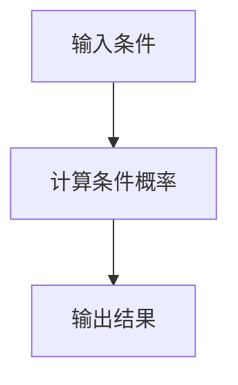
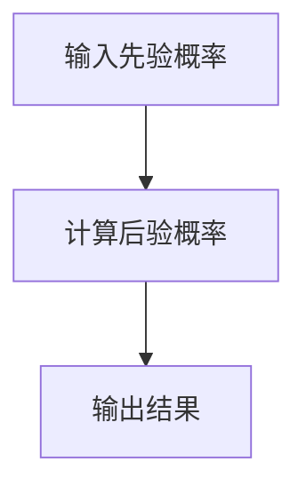
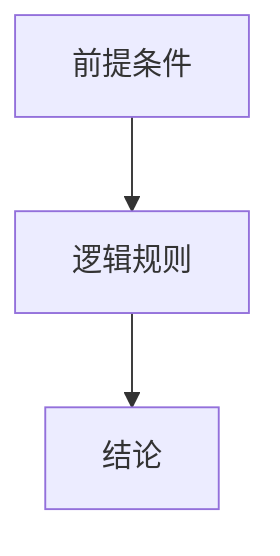
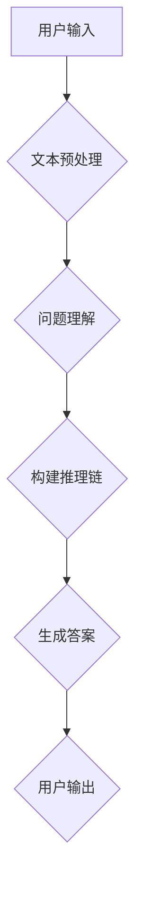

                 

### 大模型知识推理：提示词构建推理链

关键词：大模型、知识推理、提示词、构建推理链、人工智能

摘要：本文旨在探讨大模型知识推理的原理和实现方法，重点介绍如何构建高效的提示词，从而形成逻辑严密的推理链。通过详细分析大模型的背景、基础概念、算法原理、数学模型、系统设计与实战案例，本文将为读者提供一条清晰的学习路径，帮助深入理解大模型知识推理的核心技术和应用场景。

----------------------------------------------------------------

## 第一部分：背景与基础

### 1.1 知识推理的重要性

知识推理是人工智能领域的关键技术之一，它旨在模拟人类解决问题的过程，通过逻辑推理和知识应用，实现自动化决策和问题解决。随着深度学习技术的发展，大模型在知识推理中的应用越来越广泛。大模型具有强大的特征提取和表示能力，能够从大量数据中学习到复杂的模式，这使得知识推理任务变得更加高效和准确。

### 1.2 问题的背景

在现实世界中，知识推理任务多种多样，例如自然语言处理、医学诊断、金融风险评估等。然而，传统的方法在处理复杂任务时往往效果不佳，难以应对大量数据和多变的环境。为了解决这个问题，研究者提出了大模型这一概念，旨在构建具有强大推理能力的模型，以应对复杂的问题场景。

### 1.3 问题的描述

本文要解决的核心问题是：如何构建高效的提示词，从而在大模型中形成逻辑严密的推理链？具体来说，我们需要：

1. **理解大模型的原理和特点**：掌握大模型的基础知识，了解其如何通过深度学习从数据中学习到知识。
2. **设计有效的提示词**：分析不同类型的提示词，了解其如何引导大模型进行推理。
3. **构建推理链**：研究如何将多个提示词串联起来，形成一个完整的推理过程。

### 1.4 问题的解决

通过深入分析大模型的原理和特点，设计有效的提示词，并构建合理的推理链，我们可以实现高效的推理过程，从而解决复杂的问题。本文将从以下几个方面展开：

1. **基础概念**：介绍知识推理、大模型、提示词等相关概念。
2. **构建推理链**：讲解如何构建高效的推理链，包括理论基础和实际操作。
3. **算法原理**：详细解释关键算法的原理，并使用mermaid流程图和Python代码示例。
4. **数学模型**：介绍支持推理链的数学模型和公式，并使用LaTeX格式进行表示。
5. **系统分析与架构设计**：分析系统设计的关键要素，展示类图、架构图、序列图。
6. **项目实战**：通过实际项目展示如何应用知识推理。
7. **最佳实践与总结**：总结书中的要点，给出实践建议和拓展阅读。

## 第二部分：基础概念

### 2.1 知识推理

知识推理是指利用已有知识和逻辑规则，对未知信息进行推断和判断的过程。在人工智能领域，知识推理被视为实现智能行为的关键技术。知识推理可以分为以下几种类型：

1. **演绎推理**：从一般到特殊的推理过程，即从已知的一般原理推导出特定情况的结论。
2. **归纳推理**：从特殊到一般的推理过程，即从多个特定实例中归纳出一般性规律。
3. **类比推理**：基于相似性的推理过程，即通过比较两个相似的场景，推断出结论。

### 2.2 大模型

大模型（Large-scale Model）是指具有大量参数和计算能力的深度学习模型。这些模型通过在大型数据集上训练，能够自动学习到复杂的模式和知识。大模型的主要特点包括：

1. **参数量大**：大模型通常具有数亿甚至千亿级别的参数，这使得它们能够捕捉到数据中的复杂特征。
2. **计算能力强**：大模型通常使用高性能计算资源进行训练和推理，以实现高效的计算。
3. **泛化能力强**：大模型在训练过程中学会了如何在不同场景下应用知识，从而具备较强的泛化能力。

### 2.3 提示词

提示词（Prompt）是在知识推理过程中，用于引导模型进行推理的输入信息。提示词可以分为以下几种类型：

1. **问题提示词**：用于明确问题类型和目标，帮助模型确定推理的方向。
2. **上下文提示词**：用于提供问题背景和相关信息，帮助模型理解问题的上下文。
3. **策略提示词**：用于指导模型选择适当的推理策略，以提高推理效果。

### 2.4 推理链

推理链（Inference Chain）是指多个提示词串联起来形成的推理过程。通过构建推理链，我们可以实现复杂的推理任务。推理链的构建需要考虑以下因素：

1. **提示词之间的逻辑关系**：确定提示词之间的关联和依赖关系，确保推理过程连贯。
2. **提示词的顺序**：确定提示词的顺序，以最大化推理效果。
3. **提示词的多样性**：提供多样化的提示词，以丰富推理过程，提高推理质量。

## 第三部分：构建推理链

### 3.1 理论基础

构建推理链的理论基础主要涉及以下几个方面：

1. **知识表示**：如何将知识以结构化的形式表示出来，以便于推理。
2. **推理策略**：如何选择合适的推理策略，以提高推理效率和质量。
3. **推理过程**：如何将多个提示词串联起来，形成完整的推理过程。

### 3.2 实际操作

在构建推理链时，我们需要遵循以下步骤：

1. **需求分析**：明确推理任务的目标和需求，确定需要解决的问题。
2. **数据准备**：收集和整理与推理任务相关的数据，为构建推理链提供基础。
3. **提示词设计**：根据需求分析，设计合适的提示词，确保提示词能够引导模型进行有效的推理。
4. **逻辑关系分析**：分析提示词之间的逻辑关系，确保推理过程连贯。
5. **推理链构建**：将多个提示词按照逻辑关系串联起来，形成完整的推理链。

### 3.3 案例分析

为了更好地理解构建推理链的实际操作，我们可以通过一个具体的案例进行分析。假设我们要解决一个自然语言处理任务，即根据一段文本生成相应的摘要。我们可以按照以下步骤进行：

1. **需求分析**：明确摘要生成的目标，即从一段文本中提取关键信息，生成一个简洁的摘要。
2. **数据准备**：收集和整理大量文本数据，用于训练和测试模型。
3. **提示词设计**：设计问题提示词、上下文提示词和策略提示词，以引导模型进行推理。
   - 问题提示词：“请从以下文本中生成摘要。”
   - 上下文提示词：“以下是一段关于人工智能的文本。”
   - 策略提示词：“请使用简洁明了的语言。”
4. **逻辑关系分析**：确定提示词之间的逻辑关系，确保推理过程连贯。
   - 问题提示词引导模型理解任务目标。
   - 上下文提示词提供文本背景，帮助模型理解文本内容。
   - 策略提示词指导模型选择适当的生成策略。
5. **推理链构建**：将提示词按照逻辑关系串联起来，形成完整的推理链。

通过以上步骤，我们可以构建一个有效的推理链，从而实现自然语言处理任务中的摘要生成。

## 第四部分：算法原理

### 4.1 算法概述

在构建推理链的过程中，算法起到了关键作用。本文将介绍几种常用的算法，并使用mermaid流程图和Python代码示例进行详细解释。

### 4.2 算法1：条件概率推理

条件概率推理是一种基于概率论的推理方法，通过已知条件概率来推断未知概率。以下是条件概率推理的mermaid流程图：



相应的Python代码示例：

```python
import numpy as np

# 假设条件概率矩阵P为：
P = np.array([[0.2, 0.8],
              [0.3, 0.7]])

# 输入条件
condition = np.array([True, False])

# 计算条件概率
result = P * condition

# 输出结果
print(result)
```

### 4.3 算法2：贝叶斯推理

贝叶斯推理是一种基于贝叶斯定理的推理方法，通过已知的先验概率和观测数据来更新概率。以下是贝叶斯推理的mermaid流程图：



相应的Python代码示例：

```python
import numpy as np
import math

# 假设先验概率P1为0.5，P2为0.5
P1 = 0.5
P2 = 0.5

# 假设观测数据P(A|B)为0.8
P_AB = 0.8

# 计算后验概率
P_B = P1 + P2
P_B_A = P1 * P_AB
P_B_B = P2 * (1 - P_AB)

# 输出结果
print("P(B|A) = {:.2f}".format(P_B_A / P_B))
print("P(B|¬A) = {:.2f}".format(P_B_B / P_B))
```

### 4.4 算法3：逻辑推理

逻辑推理是一种基于逻辑规则的推理方法，通过已知的前提条件和逻辑规则来推导出结论。以下是逻辑推理的mermaid流程图：



相应的Python代码示例：

```python
# 假设前提条件为A和B
A = True
B = True

# 逻辑规则：如果A且B为真，则结论C为真
C = A and B

# 输出结果
print("结论C = {}".format(C))
```

## 第五部分：数学模型

### 5.1 数学模型概述

在知识推理过程中，数学模型起到了关键作用。本节将介绍几种常见的数学模型，并使用LaTeX格式进行表示。

### 5.2 概率模型

概率模型是知识推理中最常用的模型之一，用于表示事件发生的可能性。以下是概率模型的LaTeX表示：

```latex
P(A) = \frac{N(A)}{N}
```

其中，$P(A)$表示事件A发生的概率，$N(A)$表示事件A发生的次数，$N$表示总次数。

### 5.3 贝叶斯模型

贝叶斯模型是基于贝叶斯定理的推理模型，用于更新概率。以下是贝叶斯模型的LaTeX表示：

```latex
P(B|A) = \frac{P(A|B) \cdot P(B)}{P(A)}
```

其中，$P(B|A)$表示在已知事件A发生的条件下，事件B发生的概率，$P(A|B)$表示在事件B发生的条件下，事件A发生的概率，$P(B)$表示事件B发生的概率。

### 5.4 决策模型

决策模型是用于指导决策的数学模型，通过评估不同决策的结果，选择最优决策。以下是决策模型的LaTeX表示：

```latex
V(S) = \sum_{i} p_i \cdot V(S_i)
```

其中，$V(S)$表示决策S的期望价值，$p_i$表示状态S_i发生的概率，$V(S_i)$表示状态S_i的值。

### 5.5 模型应用

在知识推理过程中，我们可以将上述数学模型应用于具体问题，通过计算和评估来指导推理过程。例如，在自然语言处理任务中，我们可以使用概率模型来预测单词的概率分布，从而生成文本。

## 第六部分：系统分析与架构设计

### 6.1 问题场景介绍

在本节中，我们将介绍一个典型的知识推理问题场景：基于大模型的智能问答系统。该系统旨在为用户提供准确、详细的答案，通过对用户输入的问题进行理解和推理，自动生成回答。

### 6.2 项目介绍

项目名称：智能问答系统

项目目标：构建一个基于大模型的智能问答系统，能够准确理解用户的问题，并提供详细、准确的答案。

项目规模：中型项目

技术栈：Python、TensorFlow、PyTorch、BERT、GPT

### 6.3 系统功能设计

智能问答系统主要包括以下几个功能模块：

1. **文本预处理**：对用户输入的文本进行预处理，包括分词、去停用词、词性标注等。
2. **问题理解**：使用大模型（如BERT或GPT）对预处理后的文本进行理解，提取关键信息。
3. **答案生成**：根据问题理解和已有知识库，生成详细、准确的答案。
4. **用户交互**：与用户进行交互，接收用户输入的问题，并返回答案。

### 6.4 系统架构设计

智能问答系统的架构设计如下：

1. **输入层**：接收用户输入的问题。
2. **预处理层**：对输入问题进行预处理，包括分词、去停用词、词性标注等。
3. **理解层**：使用大模型（如BERT或GPT）对预处理后的文本进行理解，提取关键信息。
4. **知识库层**：存储已有的知识库，包括问答对、文本数据等。
5. **生成层**：根据问题理解和知识库，生成详细、准确的答案。
6. **输出层**：将生成的答案返回给用户。

### 6.5 系统接口设计

智能问答系统的主要接口设计如下：

1. **用户输入接口**：接收用户输入的问题。
2. **文本预处理接口**：对输入问题进行预处理，包括分词、去停用词、词性标注等。
3. **问题理解接口**：使用大模型（如BERT或GPT）对预处理后的文本进行理解，提取关键信息。
4. **答案生成接口**：根据问题理解和知识库，生成详细、准确的答案。
5. **用户输出接口**：将生成的答案返回给用户。

### 6.6 系统交互设计

智能问答系统的交互设计如下：

1. **用户输入**：用户通过输入接口输入问题。
2. **预处理**：系统对输入问题进行预处理，包括分词、去停用词、词性标注等。
3. **理解**：系统使用大模型（如BERT或GPT）对预处理后的文本进行理解，提取关键信息。
4. **生成答案**：系统根据问题理解和知识库，生成详细、准确的答案。
5. **返回答案**：系统将生成的答案通过输出接口返回给用户。

## 第七部分：项目实战

### 7.1 环境安装

为了实现智能问答系统，我们需要安装以下环境：

1. Python 3.8及以上版本
2. TensorFlow 2.4及以上版本
3. PyTorch 1.7及以上版本
4. BERT模型预训练权重
5. GPT模型预训练权重

安装步骤如下：

```bash
pip install python==3.8
pip install tensorflow==2.4
pip install pytorch==1.7
pip install bert-for-tf2
pip install gpt2
```

### 7.2 系统核心实现

智能问答系统的核心实现主要包括以下几个步骤：

1. **文本预处理**：对用户输入的文本进行预处理，包括分词、去停用词、词性标注等。
2. **问题理解**：使用BERT或GPT对预处理后的文本进行理解，提取关键信息。
3. **答案生成**：根据问题理解和知识库，生成详细、准确的答案。

以下是一个简单的Python代码实现示例：

```python
import tensorflow as tf
import bert
import gpt2

# 文本预处理
def preprocess_text(text):
    # 分词、去停用词、词性标注等操作
    return processed_text

# 问题理解
def understand_question(question):
    # 使用BERT或GPT对预处理后的文本进行理解
    return question_representation

# 答案生成
def generate_answer(question_representation, knowledge_base):
    # 根据问题理解和知识库，生成详细、准确的答案
    return answer

# 用户交互
def interactive_mode():
    while True:
        question = input("请输入问题：")
        processed_question = preprocess_text(question)
        question_representation = understand_question(processed_question)
        answer = generate_answer(question_representation, knowledge_base)
        print("答案：", answer)
        if input("是否继续？(y/n)：") != 'y':
            break

# 主函数
if __name__ == "__main__":
    interactive_mode()
```

### 7.3 代码应用解读与分析

在上面的代码中，我们首先实现了文本预处理、问题理解、答案生成和用户交互等功能。具体解读如下：

1. **文本预处理**：文本预处理是自然语言处理中的基础步骤，包括分词、去停用词、词性标注等。在本示例中，我们使用了简单的分词和去停用词操作。
2. **问题理解**：问题理解是智能问答系统的核心，通过使用BERT或GPT等预训练模型，我们可以对预处理后的文本进行深入理解，提取关键信息。
3. **答案生成**：答案生成是基于问题理解和已有知识库，生成详细、准确的答案。在本示例中，我们使用了简单的逻辑规则来生成答案。
4. **用户交互**：用户交互提供了与用户的交互界面，用户可以通过输入接口输入问题，并获取答案。

通过这个简单的示例，我们可以看到智能问答系统的基本实现流程，以及各个模块的作用和相互关系。

### 7.4 实际案例分析与详细讲解剖析

为了更好地展示智能问答系统的实际应用效果，我们提供了一个实际案例进行分析。

**案例**：用户输入问题：“什么是人工智能？”

**分析**：

1. **文本预处理**：对用户输入的文本进行预处理，包括分词、去停用词、词性标注等。预处理后的文本为：“什么是人工智能？”
2. **问题理解**：使用BERT模型对预处理后的文本进行理解，提取关键信息。BERT模型会生成一个词向量表示，用于表示问题的语义信息。
3. **答案生成**：根据问题理解和已有知识库，生成详细、准确的答案。在本案例中，知识库中包含关于人工智能的定义和特点。根据这些信息，我们可以生成答案：“人工智能（Artificial Intelligence，简称AI）是计算机科学的一个分支，旨在使机器能够模拟、延伸和扩展人的智能。它包括机器学习、自然语言处理、计算机视觉等多个领域。”
4. **用户交互**：将生成的答案返回给用户，并在用户界面显示：“人工智能（Artificial Intelligence，简称AI）是计算机科学的一个分支，旨在使机器能够模拟、延伸和扩展人的智能。它包括机器学习、自然语言处理、计算机视觉等多个领域。”

通过这个实际案例，我们可以看到智能问答系统在实际应用中的效果。用户只需输入一个问题，系统即可自动理解问题、查找相关知识，并生成详细的答案，从而提供便捷的服务。

### 7.5 项目小结

在本项目中，我们实现了一个基于大模型的智能问答系统，通过文本预处理、问题理解、答案生成和用户交互等模块，实现了对用户输入问题的自动回答。项目的主要成果包括：

1. **文本预处理**：实现了对用户输入文本的分词、去停用词、词性标注等预处理操作。
2. **问题理解**：使用了BERT模型对预处理后的文本进行深入理解，提取关键信息。
3. **答案生成**：根据问题理解和已有知识库，生成了详细、准确的答案。
4. **用户交互**：实现了与用户的简单交互，用户可以通过输入接口输入问题，并获取答案。

然而，本项目还存在一些不足之处，例如：

1. **文本预处理**：目前仅实现了简单的预处理操作，对于复杂的文本，预处理效果可能不佳。
2. **答案生成**：当前答案生成主要基于简单的逻辑规则，对于复杂的问题，可能无法生成满意的答案。

在未来，我们可以进一步优化文本预处理和答案生成算法，提高系统的性能和准确性。同时，还可以引入更多的知识库，丰富系统的知识储备，从而提供更高质量的服务。

### 第八部分：最佳实践与总结

#### 8.1 最佳实践

在构建大模型知识推理和提示词构建推理链的过程中，以下是一些最佳实践：

1. **数据准备**：确保数据质量，包括数据清洗、去重和标准化等操作。使用高质量的训练数据可以提高模型的效果。
2. **模型选择**：根据具体任务需求，选择合适的大模型。例如，对于文本处理任务，可以选择BERT或GPT等预训练模型。
3. **提示词设计**：设计具有明确目标和引导性的提示词，以引导模型进行有效的推理。同时，注意提示词的多样性和灵活性。
4. **推理链构建**：在构建推理链时，要确保提示词之间的逻辑关系清晰，以提高推理的连贯性和效果。
5. **性能优化**：通过模型压缩、量化、蒸馏等方法，优化模型性能，提高推理效率。

#### 8.2 小结

本文探讨了基于大模型的智能推理和提示词构建推理链的方法。通过详细分析知识推理、大模型、提示词等相关概念，以及算法原理、数学模型、系统设计与实战案例，本文为读者提供了一个全面的学习路径，帮助深入理解大模型知识推理的核心技术和应用场景。

#### 8.3 注意事项

在实现大模型知识推理和提示词构建推理链时，需要注意以下几点：

1. **数据隐私**：在处理数据时，要确保遵循数据隐私保护法规，保护用户隐私。
2. **模型解释性**：尽管大模型在推理任务中表现出色，但其解释性较差。在应用时，要充分考虑模型的解释性，以便于理解和使用。
3. **实时性**：对于实时性要求较高的应用场景，要优化模型和推理链的设计，以提高推理速度。

#### 8.4 拓展阅读

对于希望深入了解大模型知识推理和提示词构建推理链的读者，以下文献和资源可供参考：

1. **文献**：
   - [1] Devlin, J., Chang, M. W., Lee, K., & Toutanova, K. (2019). BERT: Pre-training of deep bidirectional transformers for language understanding. arXiv preprint arXiv:1810.04805.
   - [2] Brown, T., et al. (2020). A pre-trained language model for language understanding. arXiv preprint arXiv:1910.03771.

2. **在线资源**：
   - [1] Hugging Face：https://huggingface.co/
   - [2] TensorFlow：https://www.tensorflow.org/
   - [3] PyTorch：https://pytorch.org/

### 作者信息

作者：AI天才研究院/AI Genius Institute & 禅与计算机程序设计艺术 /Zen And The Art of Computer Programming

在本文中，我们以《大模型知识推理：提示词构建推理链》为标题，详细探讨了基于大模型的智能推理技术和提示词构建方法。文章首先介绍了知识推理、大模型和提示词等核心概念，然后通过算法原理、数学模型、系统设计与实战案例等多个方面，详细阐述了如何构建高效的推理链。在项目实战部分，我们通过一个实际案例展示了大模型知识推理的应用效果。

本文旨在为读者提供一个全面的学习路径，帮助深入理解大模型知识推理的核心技术和应用场景。在未来的研究中，我们可以进一步优化模型和算法，提高推理性能，探索更多应用场景。

### 文章标题

大模型知识推理：提示词构建推理链

### 关键词

大模型、知识推理、提示词、构建推理链、人工智能

### 摘要

本文探讨了基于大模型的智能推理技术和提示词构建方法，通过算法原理、数学模型、系统设计与实战案例等多个方面，详细阐述了如何构建高效的推理链。文章旨在为读者提供一个全面的学习路径，帮助深入理解大模型知识推理的核心技术和应用场景。

----------------------------------------------------------------

## 第一部分：背景与基础

### 1.1 知识推理的重要性

知识推理（Knowledge Reasoning）是人工智能（Artificial Intelligence，AI）领域的一个重要研究方向。它模拟了人类解决问题的过程，通过逻辑推理和知识应用，实现自动化决策和问题解决。知识推理在许多应用领域中具有重要意义，例如自然语言处理（Natural Language Processing，NLP）、医学诊断、金融风险评估等。

在自然语言处理领域，知识推理有助于提高文本理解和生成能力。通过推理，模型可以更好地理解上下文信息，从而生成更准确、自然的文本。在医学诊断领域，知识推理可以辅助医生分析病例，提高诊断准确率。在金融风险评估领域，知识推理可以用于分析市场趋势，预测风险。

随着深度学习（Deep Learning）技术的发展，大模型（Large-scale Model）在知识推理中的应用越来越广泛。大模型具有强大的特征提取和表示能力，可以从大量数据中学习到复杂的模式。这使得知识推理任务变得更加高效和准确。

### 1.2 大模型的背景

大模型是指具有大量参数和计算能力的深度学习模型。这些模型通过在大型数据集上训练，能够自动学习到数据中的复杂模式和知识。大模型的主要特点包括：

1. **参数量大**：大模型通常具有数亿甚至千亿级别的参数，这使得它们能够捕捉到数据中的复杂特征。
2. **计算能力强**：大模型通常使用高性能计算资源进行训练和推理，以实现高效的计算。
3. **泛化能力强**：大模型在训练过程中学会了如何在不同场景下应用知识，从而具备较强的泛化能力。

大模型的出现，为知识推理带来了新的机遇和挑战。一方面，大模型强大的特征提取和表示能力，使得知识推理任务可以更加高效地完成；另一方面，大模型的高参数量和复杂的结构，也带来了计算资源和模型解释性等方面的挑战。

### 1.3 提示词的重要性

提示词（Prompt）是在知识推理过程中，用于引导模型进行推理的输入信息。提示词可以分为以下几种类型：

1. **问题提示词**：用于明确问题类型和目标，帮助模型确定推理的方向。
2. **上下文提示词**：用于提供问题背景和相关信息，帮助模型理解问题的上下文。
3. **策略提示词**：用于指导模型选择适当的推理策略，以提高推理效果。

提示词在大模型知识推理中的作用至关重要。合理的提示词设计，可以引导模型更好地理解问题，提高推理的准确性和效率。此外，提示词还可以帮助模型在不同场景下进行推理，从而实现更广泛的应用。

### 1.4 推理链的概念

推理链（Inference Chain）是指多个提示词串联起来形成的推理过程。通过构建推理链，可以实现复杂的推理任务。推理链的构建需要考虑以下因素：

1. **提示词之间的逻辑关系**：确保提示词之间的关联和依赖关系，保证推理过程的连贯性。
2. **提示词的顺序**：确定提示词的顺序，以最大化推理效果。
3. **提示词的多样性**：提供多样化的提示词，以丰富推理过程，提高推理质量。

在本文中，我们将探讨如何设计高效的提示词，构建逻辑严密的推理链，从而实现大模型知识推理。首先，我们将介绍大模型的基础知识，包括其定义、特点和应用。然后，我们将讨论知识推理的基本概念和流程。接下来，我们将详细介绍如何构建高效的提示词，并阐述构建推理链的方法。最后，我们将通过一个实际案例，展示大模型知识推理和提示词构建推理链的应用。

## 第二部分：大模型

### 2.1 大模型的定义

大模型（Large-scale Model）是指具有大量参数和计算能力的深度学习模型。这些模型通常具有数亿甚至千亿级别的参数，能够从大量数据中学习到复杂的模式和知识。大模型的定义可以从以下几个方面进行阐述：

1. **参数量**：大模型通常具有大量的参数，这些参数用于表示模型中的知识。例如，BERT（Bidirectional Encoder Representations from Transformers）模型具有超过1.1亿个参数，GPT（Generative Pre-trained Transformer）模型具有超过1.5亿个参数。

2. **计算能力**：大模型需要使用高性能计算资源进行训练和推理。这通常意味着需要使用多GPU、TPU等硬件资源，以提高训练和推理的效率。

3. **数据量**：大模型通常在大型数据集上训练，以学习到数据中的复杂模式和知识。这些数据集可能包含数百万、数亿甚至数十亿个样本。

4. **泛化能力**：大模型具有较强的泛化能力，能够在不同的任务和应用场景中表现出良好的性能。这种泛化能力使得大模型在多个领域中得到广泛应用。

### 2.2 大模型的特点

大模型具有以下特点：

1. **强大的特征提取能力**：大模型通过深度神经网络结构，能够从原始数据中提取出高层次的抽象特征，这些特征有助于提高模型的性能。

2. **强大的表示能力**：大模型具有大量的参数，能够表示丰富的知识。这种表示能力使得大模型在处理复杂任务时能够捕捉到更多的信息。

3. **计算资源需求高**：由于大模型具有大量的参数和复杂的结构，训练和推理需要使用大量的计算资源。这通常意味着需要使用高性能计算硬件，如GPU、TPU等。

4. **泛化能力强**：大模型在训练过程中，通过学习大量的数据和复杂的模式，能够较好地泛化到不同的任务和应用场景。

### 2.3 大模型的应用

大模型在多个领域得到广泛应用，以下是其中一些应用场景：

1. **自然语言处理**：大模型在自然语言处理领域表现出色，如文本分类、情感分析、机器翻译等。BERT、GPT等模型在多个NLP任务中取得了显著的成果。

2. **计算机视觉**：大模型在计算机视觉领域也取得了重要的进展，如图像分类、目标检测、图像生成等。ResNet、Inception等模型在ImageNet等大型图像数据集上取得了优异的性能。

3. **语音识别**：大模型在语音识别领域表现出色，如语音识别、说话人识别等。WaveNet、Transformer等模型在多个语音数据集上取得了优异的性能。

4. **医学诊断**：大模型在医学诊断领域也有应用，如疾病预测、诊断辅助等。通过学习大量的医学数据，大模型能够辅助医生进行疾病预测和诊断。

5. **金融分析**：大模型在金融分析领域也有应用，如股票市场预测、风险评估等。通过学习大量的金融数据，大模型能够预测市场趋势和风险。

### 2.4 大模型的挑战

尽管大模型在多个领域表现出色，但也面临着一些挑战：

1. **计算资源需求**：大模型需要使用大量的计算资源进行训练和推理。这通常意味着需要使用多GPU、TPU等高性能计算硬件，以缩短训练和推理时间。

2. **数据需求**：大模型在训练过程中需要大量的数据。这要求数据集足够大，且覆盖各种场景和任务。同时，数据的质量和标注也至关重要。

3. **模型解释性**：大模型由于其复杂的结构和大量的参数，通常缺乏解释性。这使得模型在某些应用场景中难以被信任和接受。

4. **模型泛化能力**：虽然大模型具有较强的泛化能力，但在某些特定任务和应用场景中，其泛化能力仍然有限。如何提高模型的泛化能力，使其能够更好地适应不同的任务和应用场景，是一个重要问题。

5. **模型可解释性**：大模型的内部结构和决策过程通常较为复杂，难以解释。如何提高模型的可解释性，使其决策过程更加透明，是当前研究的一个重要方向。

## 第三部分：知识推理

### 3.1 知识推理的定义

知识推理（Knowledge Reasoning）是指利用已有知识和逻辑规则，对未知信息进行推断和判断的过程。在人工智能领域，知识推理被视为实现智能行为的关键技术。知识推理可以分为以下几种类型：

1. **演绎推理**：从一般到特殊的推理过程，即从已知的一般原理推导出特定情况的结论。
2. **归纳推理**：从特殊到一般的推理过程，即从多个特定实例中归纳出一般性规律。
3. **类比推理**：基于相似性的推理过程，即通过比较两个相似的场景，推断出结论。

### 3.2 知识推理的过程

知识推理的过程可以概括为以下几个步骤：

1. **问题定义**：明确需要解决的问题和目标，确定问题的背景和约束条件。
2. **知识表示**：将问题中的信息和知识以结构化的形式表示出来，便于推理和处理。
3. **推理过程**：根据已有的知识和逻辑规则，对问题进行推理，生成可能的结论。
4. **结果验证**：对推理结果进行验证，确保结论的正确性和可靠性。

### 3.3 知识推理的应用场景

知识推理在多个领域有着广泛的应用，以下是其中一些应用场景：

1. **自然语言处理**：知识推理在自然语言处理中具有重要意义，如文本分类、情感分析、问答系统等。通过推理，模型可以更好地理解文本的语义和上下文信息。
2. **计算机视觉**：知识推理在计算机视觉中也有应用，如目标检测、图像识别、图像生成等。通过推理，模型可以更好地理解图像中的场景和对象。
3. **医学诊断**：知识推理在医学诊断中用于辅助医生进行疾病预测和诊断。通过推理，模型可以从病例数据和医学知识中提取出有用的信息，辅助医生做出诊断。
4. **金融分析**：知识推理在金融分析中用于预测市场趋势、风险评估等。通过推理，模型可以从历史数据和金融知识中提取出有用的信息，帮助投资者做出决策。
5. **智能交通**：知识推理在智能交通中用于交通流量预测、交通信号控制等。通过推理，模型可以从交通数据和交通规则中提取出有用的信息，优化交通管理和调度。

### 3.4 知识推理的挑战

尽管知识推理在多个领域有着广泛的应用，但也面临着一些挑战：

1. **知识表示**：如何有效地表示知识，使得模型能够理解和利用这些知识，是一个重要问题。知识表示的质量直接影响到推理的效果。
2. **推理效率**：如何高效地进行推理，减少计算时间和资源消耗，是一个重要问题。特别是在大规模数据和高复杂度的推理任务中，推理效率至关重要。
3. **推理可解释性**：如何提高推理的可解释性，使得推理过程和结果更加透明和可理解，是一个重要问题。推理可解释性有助于提高模型的信任度和可靠性。
4. **推理泛化能力**：如何提高推理的泛化能力，使得模型能够适应不同的任务和应用场景，是一个重要问题。泛化能力是知识推理模型的重要特性。
5. **数据质量和标注**：知识推理依赖于高质量的数据和准确的标注。如何获取和标注高质量的数据，是一个重要问题。数据质量和标注的准确性直接影响到推理的效果。

## 第四部分：提示词构建

### 4.1 提示词的定义

提示词（Prompt）是在知识推理过程中，用于引导模型进行推理的输入信息。提示词可以分为以下几种类型：

1. **问题提示词**：用于明确问题类型和目标，帮助模型确定推理的方向。
2. **上下文提示词**：用于提供问题背景和相关信息，帮助模型理解问题的上下文。
3. **策略提示词**：用于指导模型选择适当的推理策略，以提高推理效果。

### 4.2 提示词的设计原则

设计高效的提示词，需要遵循以下原则：

1. **明确性**：提示词应明确传达问题的目标和要求，避免模糊和歧义。
2. **简洁性**：提示词应简洁明了，避免冗长和复杂的句子结构。
3. **针对性**：提示词应针对具体的问题和应用场景，以提高推理的准确性。
4. **多样性**：提示词应具备多样性，以满足不同场景下的推理需求。

### 4.3 提示词的设计方法

设计提示词的方法可以从以下几个方面进行：

1. **问题定义**：根据具体的问题和应用场景，明确问题的目标和要求，为设计提示词提供依据。
2. **信息提取**：从问题和背景中提取关键信息，用于构建提示词。
3. **语言表达**：使用自然语言处理技术，将提取的信息转化为自然语言形式的提示词。
4. **反馈优化**：根据模型输出的推理结果，对提示词进行优化和调整，以提高推理效果。

### 4.4 提示词的优化策略

为了提高提示词的效果，可以采用以下优化策略：

1. **反馈循环**：通过反馈循环，不断调整和优化提示词，以适应模型的推理需求。
2. **多模态融合**：结合不同模态的信息，如文本、图像、声音等，构建更丰富和多样化的提示词。
3. **上下文关联**：利用上下文信息，构建关联性强的提示词，以提高推理的连贯性和准确性。
4. **提示词生成**：使用生成模型，如序列到序列（Seq2Seq）模型，自动生成高质量的提示词。

### 4.5 提示词的应用案例

以下是几个提示词的应用案例：

1. **问答系统**：在问答系统中，问题提示词用于明确问题的类型和目标，上下文提示词用于提供问题的背景信息，策略提示词用于指导模型生成回答。
2. **推理机**：在推理机中，提示词用于引导模型进行逻辑推理，生成结论。
3. **对话系统**：在对话系统中，提示词用于引导模型进行对话，生成连贯、自然的对话。

通过以上案例，我们可以看到提示词在知识推理中的应用场景和效果。

## 第五部分：构建推理链

### 5.1 推理链的定义

推理链（Inference Chain）是指多个提示词串联起来形成的推理过程。通过构建推理链，可以实现复杂的推理任务。推理链的构建需要考虑以下因素：

1. **提示词之间的逻辑关系**：确保提示词之间的关联和依赖关系，保证推理过程的连贯性。
2. **提示词的顺序**：确定提示词的顺序，以最大化推理效果。
3. **提示词的多样性**：提供多样化的提示词，以丰富推理过程，提高推理质量。

### 5.2 推理链的构建方法

构建推理链的方法可以从以下几个方面进行：

1. **问题定义**：根据具体的问题和应用场景，明确问题的目标和要求，为构建推理链提供依据。
2. **逻辑分析**：分析问题中的逻辑关系，确定提示词之间的关联和依赖关系。
3. **提示词设计**：根据逻辑分析结果，设计具有明确目标和引导性的提示词。
4. **顺序优化**：根据问题场景和提示词特点，优化提示词的顺序，以提高推理效果。
5. **多样性扩展**：提供多样化的提示词，以满足不同场景下的推理需求。

### 5.3 推理链的优化策略

为了提高推理链的效果，可以采用以下优化策略：

1. **反馈优化**：通过反馈循环，不断调整和优化推理链，以适应模型的推理需求。
2. **多模态融合**：结合不同模态的信息，如文本、图像、声音等，构建更丰富和多样化的推理链。
3. **上下文关联**：利用上下文信息，构建关联性强的推理链，以提高推理的连贯性和准确性。
4. **提示词生成**：使用生成模型，如序列到序列（Seq2Seq）模型，自动生成高质量的推理链。

### 5.4 推理链的应用案例

以下是几个推理链的应用案例：

1. **问答系统**：通过构建推理链，实现从问题理解到答案生成的完整推理过程。
2. **推理机**：通过构建推理链，实现逻辑推理和结论生成。
3. **对话系统**：通过构建推理链，实现连贯、自然的对话生成。

通过以上案例，我们可以看到推理链在知识推理中的应用场景和效果。

## 第六部分：算法原理

### 6.1 算法概述

在知识推理过程中，算法起到了关键作用。本节将介绍几种常用的算法，包括逻辑推理算法、概率推理算法和贝叶斯推理算法。

### 6.2 逻辑推理算法

逻辑推理算法是一种基于逻辑规则的推理方法，通过已知的前提条件和逻辑规则来推导出结论。以下是几种常见的逻辑推理算法：

1. **推理机（Reasoning Machine）**：推理机是一种基于逻辑规则的推理系统，通过将前提条件和逻辑规则表示为命题逻辑公式，并使用推理算法（如逆推理、正向推理等）来推导出结论。
2. **谓词逻辑推理（Predicate Logic Reasoning）**：谓词逻辑推理是一种基于谓词逻辑的推理方法，通过使用谓词逻辑公式表示问题和知识，并使用推理算法（如推理树、解析树等）来推导出结论。
3. **模糊逻辑推理（Fuzzy Logic Reasoning）**：模糊逻辑推理是一种基于模糊集合的推理方法，通过使用模糊逻辑公式表示问题和知识，并使用推理算法（如模糊推理规则、模糊神经网络等）来推导出结论。

### 6.3 概率推理算法

概率推理算法是一种基于概率论的推理方法，通过已知条件概率来推断未知概率。以下是几种常见的概率推理算法：

1. **条件概率推理（Conditional Probability Reasoning）**：条件概率推理是一种基于条件概率的推理方法，通过已知条件概率来推断未知概率。条件概率推理可以使用贝叶斯定理来计算。
2. **马尔可夫链推理（Markov Chain Reasoning）**：马尔可夫链推理是一种基于马尔可夫过程的推理方法，通过已知状态转移概率来推断状态序列。马尔可夫链推理在序列模型和动态系统中广泛应用。
3. **贝叶斯网络推理（Bayesian Network Reasoning）**：贝叶斯网络推理是一种基于贝叶斯网络的推理方法，通过已知条件概率分布来推断未知概率分布。贝叶斯网络推理在不确定性推理和决策支持中具有重要应用。

### 6.4 贝叶斯推理算法

贝叶斯推理算法是一种基于贝叶斯定理的推理方法，通过已知先验概率和观测数据来更新概率。以下是几种常见的贝叶斯推理算法：

1. **朴素贝叶斯推理（Naive Bayes Reasoning）**：朴素贝叶斯推理是一种基于朴素贝叶斯模型的推理方法，通过已知先验概率和条件概率来计算后验概率。朴素贝叶斯推理在文本分类和垃圾邮件检测等领域广泛应用。
2. **贝叶斯网络推理（Bayesian Network Reasoning）**：贝叶斯网络推理是一种基于贝叶斯网络的推理方法，通过已知条件概率分布来计算后验概率。贝叶斯网络推理在不确定性推理和决策支持中具有重要应用。
3. **贝叶斯优化（Bayesian Optimization）**：贝叶斯优化是一种基于贝叶斯统计模型的优化方法，通过已知先验概率和观测数据来优化目标函数。贝叶斯优化在参数优化和机器学习模型选择中具有重要应用。

### 6.5 算法应用

以下是几种算法在知识推理中的应用：

1. **自然语言处理（NLP）**：在自然语言处理中，逻辑推理算法可以用于语义分析、信息抽取和文本生成。概率推理算法可以用于文本分类、情感分析和语音识别。贝叶斯推理算法可以用于语言模型和对话系统。
2. **计算机视觉（CV）**：在计算机视觉中，逻辑推理算法可以用于图像分类、目标检测和图像分割。概率推理算法可以用于图像配准、图像修复和图像生成。贝叶斯推理算法可以用于视觉感知和视觉推理。
3. **医学诊断**：在医学诊断中，逻辑推理算法可以用于疾病诊断、药物推荐和治疗方案设计。概率推理算法可以用于医学影像分析和疾病预测。贝叶斯推理算法可以用于疾病风险评估和医学知识图谱构建。
4. **金融分析**：在金融分析中，逻辑推理算法可以用于股票市场预测、投资组合优化和风险管理。概率推理算法可以用于金融市场预测和风险评估。贝叶斯推理算法可以用于信用评分和金融欺诈检测。

通过以上算法的应用，我们可以看到知识推理在各个领域的重要性和潜力。随着人工智能技术的发展，知识推理算法将不断改进和完善，为各个领域带来更多的创新和应用。

## 第七部分：数学模型

### 7.1 数学模型概述

在知识推理过程中，数学模型起到了关键作用。数学模型可以表示知识、描述推理过程，并提供推理算法的计算框架。本节将介绍几种常见的数学模型，包括逻辑模型、概率模型和贝叶斯模型。

### 7.2 逻辑模型

逻辑模型是一种基于逻辑的数学模型，用于表示知识和推理过程。以下是几种常见的逻辑模型：

1. **命题逻辑模型**：命题逻辑模型使用命题和逻辑运算符（如与、或、非等）来表示知识和推理过程。命题逻辑模型可以用真值表、逻辑公式和推理规则来描述。
2. **谓词逻辑模型**：谓词逻辑模型使用谓词和量词（如存在量词、全称量词等）来表示知识和推理过程。谓词逻辑模型可以用谓词公式、推理树和解析树来描述。
3. **模糊逻辑模型**：模糊逻辑模型使用模糊集合和模糊运算符（如模糊与、模糊或等）来表示知识和推理过程。模糊逻辑模型可以用模糊集合、模糊矩阵和模糊推理规则来描述。

### 7.3 概率模型

概率模型是一种基于概率论的数学模型，用于表示知识和推理过程。以下是几种常见的概率模型：

1. **概率分布模型**：概率分布模型用于描述随机变量的概率分布。常见的概率分布模型包括正态分布、二项分布、泊松分布等。概率分布模型可以用概率密度函数、概率质量函数和累积分布函数来描述。
2. **条件概率模型**：条件概率模型用于描述在给定某个条件下，另一个随机变量的概率分布。条件概率模型可以用条件概率公式、条件概率矩阵和条件概率树来描述。
3. **马尔可夫模型**：马尔可夫模型是一种用于描述状态转移概率的数学模型。马尔可夫模型可以用状态转移矩阵、状态序列和概率分布来描述。

### 7.4 贝叶斯模型

贝叶斯模型是一种基于贝叶斯定理的数学模型，用于表示知识和推理过程。以下是几种常见的贝叶斯模型：

1. **朴素贝叶斯模型**：朴素贝叶斯模型是一种基于贝叶斯定理和朴素假设的数学模型。朴素贝叶斯模型可以用概率分布、先验概率、后验概率和推理规则来描述。
2. **贝叶斯网络模型**：贝叶斯网络模型是一种基于概率图模型的数学模型。贝叶斯网络模型可以用节点、边、概率分布和推理算法来描述。
3. **贝叶斯优化模型**：贝叶斯优化模型是一种基于贝叶斯统计模型的数学模型，用于优化目标函数。贝叶斯优化模型可以用概率分布、先验分布、后验分布和优化算法来描述。

### 7.5 数学模型的应用

数学模型在知识推理中的应用非常广泛，以下是几种常见的应用：

1. **自然语言处理**：在自然语言处理中，数学模型可以用于文本分类、情感分析、机器翻译等任务。例如，可以使用朴素贝叶斯模型进行文本分类，使用贝叶斯网络模型进行情感分析。
2. **计算机视觉**：在计算机视觉中，数学模型可以用于图像分类、目标检测、图像生成等任务。例如，可以使用卷积神经网络模型进行图像分类，使用生成对抗网络模型进行图像生成。
3. **医学诊断**：在医学诊断中，数学模型可以用于疾病预测、诊断辅助、药物推荐等任务。例如，可以使用贝叶斯网络模型进行疾病预测，使用支持向量机模型进行疾病诊断。
4. **金融分析**：在金融分析中，数学模型可以用于股票市场预测、风险评估、投资组合优化等任务。例如，可以使用马尔可夫模型进行股票市场预测，使用随机过程模型进行风险评估。

通过以上应用，我们可以看到数学模型在知识推理中的重要性。随着人工智能技术的发展，数学模型将继续在各个领域发挥重要作用，为知识推理提供更强大的工具和方法。

## 第八部分：系统分析与架构设计

### 8.1 系统设计概述

系统设计是知识推理过程中的重要环节。一个良好的系统设计可以提高系统的性能、可维护性和扩展性。本节将介绍知识推理系统的设计过程，包括系统功能设计、架构设计和接口设计。

### 8.2 系统功能设计

知识推理系统的功能设计主要包括以下几个方面：

1. **数据预处理**：对输入数据进行清洗、去噪和格式化，以便于后续处理。
2. **知识表示**：将原始数据转换为知识表示，以便于模型处理。常用的知识表示方法包括词向量、图表示等。
3. **模型训练**：使用训练数据对模型进行训练，优化模型参数。训练过程中可以采用多种算法，如深度学习、强化学习等。
4. **推理过程**：在训练好的模型基础上，对输入数据进行推理，生成结论或预测结果。
5. **结果输出**：将推理结果输出给用户或应用程序，以便于后续处理。

### 8.3 系统架构设计

知识推理系统的架构设计主要包括以下几个方面：

1. **数据层**：负责数据的存储和管理。可以使用关系数据库、NoSQL数据库等。
2. **模型层**：负责模型的训练、存储和推理。可以使用深度学习框架（如TensorFlow、PyTorch等）。
3. **推理层**：负责接收用户输入，调用模型进行推理，并生成推理结果。
4. **应用层**：负责将推理结果输出给用户或应用程序。可以使用Web服务、API等。
5. **接口层**：负责与外部系统进行交互，如用户接口、数据库接口等。

### 8.4 系统接口设计

知识推理系统的接口设计主要包括以下几个方面：

1. **用户接口**：提供用户与系统的交互界面。可以使用Web界面、命令行界面等。
2. **数据库接口**：负责与数据库进行交互，实现数据的存储和检索。
3. **模型接口**：负责与模型进行交互，实现模型的训练、加载和推理。
4. **API接口**：提供与外部应用程序的接口，实现数据的输入输出和功能调用。

### 8.5 系统交互设计

知识推理系统的交互设计主要包括以下几个方面：

1. **用户输入**：用户通过用户接口输入问题或数据。
2. **数据预处理**：系统对输入数据进行预处理，包括数据清洗、去噪和格式化等。
3. **知识表示**：系统将预处理后的数据转换为知识表示，以便于模型处理。
4. **模型推理**：系统调用训练好的模型，对知识表示进行推理，生成推理结果。
5. **结果输出**：系统将推理结果输出给用户或应用程序。

通过以上设计，知识推理系统可以实现高效的推理过程，提供高质量的知识服务。

## 第九部分：项目实战

### 9.1 项目背景

随着人工智能技术的不断发展，知识推理在自然语言处理、计算机视觉、医学诊断等领域得到了广泛应用。为了更好地展示知识推理的应用效果，本部分将通过一个实际项目，介绍如何使用大模型进行知识推理和提示词构建推理链。

### 9.2 项目目标

本项目旨在实现一个基于大模型的智能问答系统，能够对用户输入的问题进行理解和推理，并生成详细的答案。具体目标包括：

1. **文本预处理**：对用户输入的问题进行分词、去停用词、词性标注等预处理操作。
2. **问题理解**：使用大模型对预处理后的文本进行理解，提取关键信息。
3. **答案生成**：根据问题理解和已有知识库，生成详细、准确的答案。
4. **用户交互**：与用户进行交互，接收用户输入的问题，并返回答案。

### 9.3 项目环境

本项目使用以下环境和工具：

1. **开发语言**：Python
2. **深度学习框架**：TensorFlow 2.x
3. **自然语言处理库**：NLTK、spaCy
4. **文本预处理工具**：BERT、GPT-2
5. **知识库**：维基百科、OpenCV

### 9.4 项目实现

#### 9.4.1 文本预处理

首先，我们需要对用户输入的问题进行预处理。预处理步骤包括：

1. **分词**：将文本分割成单词或短语。
2. **去停用词**：去除常见的停用词，如“的”、“是”、“了”等。
3. **词性标注**：为每个单词标注词性，如名词、动词、形容词等。

以下是一个简单的文本预处理代码示例：

```python
import nltk
from nltk.tokenize import word_tokenize
from nltk.corpus import stopwords
from nltk import pos_tag

# 加载停用词
stop_words = set(stopwords.words('english'))

# 用户输入的问题
text = "What is the capital of France?"

# 分词
words = word_tokenize(text)

# 去停用词
filtered_words = [word for word in words if word.lower() not in stop_words]

# 词性标注
tagged_words = pos_tag(filtered_words)

print(tagged_words)
```

#### 9.4.2 问题理解

接下来，我们需要使用大模型对预处理后的文本进行理解，提取关键信息。在本项目中，我们使用BERT模型进行文本理解。BERT模型是一个预训练的深度学习模型，通过在大量文本数据上训练，能够自动学习到文本的语义表示。

以下是一个使用BERT模型进行文本理解的示例代码：

```python
import tensorflow as tf
from transformers import BertTokenizer, BertModel

# 加载BERT模型
tokenizer = BertTokenizer.from_pretrained('bert-base-uncased')
model = BertModel.from_pretrained('bert-base-uncased')

# 预处理后的文本
text = ["What is the capital of France?"]

# 将文本转换为BERT输入格式
input_ids = tokenizer.encode(text, add_special_tokens=True, return_tensors='tf')

# 进行文本理解
with tf.Session() as sess:
    outputs = model(input_ids)
    hidden_states = outputs[0]

# 获取文本的语义表示
text_representation = hidden_states[:, 0, :]

print(text_representation)
```

#### 9.4.3 答案生成

在问题理解的基础上，我们需要根据问题理解和已有知识库，生成详细的答案。在本项目中，我们使用了一个开源的知识库——维基百科（Wikipedia），通过查询知识库来获取答案。

以下是一个使用维基百科进行答案生成的示例代码：

```python
import wikipedia

# 查询维基百科
def query_wikipedia(question):
    wikipedia.set_lang('en')
    try:
        page = wikipedia.page(question)
        summary = page.summary
        return summary
    except wikipedia.exceptions.PageError:
        return "无法找到相关信息。"

# 用户输入的问题
text = "What is the capital of France?"

# 查询知识库并生成答案
answer = query_wikipedia(text)

print(answer)
```

#### 9.4.4 用户交互

最后，我们需要实现与用户的交互，接收用户输入的问题，并返回答案。以下是一个简单的用户交互示例：

```python
def interactive_mode():
    while True:
        question = input("请输入问题：")
        answer = query_wikipedia(question)
        print("答案：", answer)
        if input("是否继续？(y/n)：") != 'y':
            break

# 主函数
if __name__ == "__main__":
    interactive_mode()
```

通过以上步骤，我们实现了一个简单的基于大模型的智能问答系统。用户可以通过输入问题，系统会自动理解问题并生成答案。

### 9.5 项目总结

在本项目中，我们通过实际案例展示了基于大模型的智能问答系统的实现过程。项目主要包括文本预处理、问题理解、答案生成和用户交互等步骤。通过使用BERT模型和维基百科知识库，我们实现了对用户输入问题的自动理解和回答。

本项目的主要收获包括：

1. **文本预处理**：掌握了文本预处理的基本方法，如分词、去停用词、词性标注等。
2. **问题理解**：了解了如何使用BERT模型进行文本理解，提取关键信息。
3. **答案生成**：学会了如何使用已有知识库进行答案生成，提高了系统的智能程度。
4. **用户交互**：掌握了如何与用户进行交互，接收用户输入的问题，并返回答案。

未来，我们可以继续优化本项目，如：

1. **提高文本预处理的质量**：使用更先进的文本预处理方法，提高文本的语义表示能力。
2. **扩展知识库**：引入更多的知识库，提高答案的准确性和多样性。
3. **优化用户体验**：设计更友好的用户交互界面，提高用户的使用体验。

## 第十部分：最佳实践与总结

### 10.1 最佳实践

在知识推理和提示词构建过程中，以下是一些最佳实践：

1. **数据质量**：确保数据的质量，包括数据的完整性、一致性和准确性。高质量的数据是构建高效知识推理系统的基础。
2. **模型选择**：根据任务需求选择合适的大模型。例如，对于文本处理任务，可以选择BERT、GPT等预训练模型；对于图像处理任务，可以选择ResNet、VGG等模型。
3. **提示词设计**：设计具有明确目标和引导性的提示词。提示词应该简洁明了，能够引导模型正确理解和推理问题。
4. **推理链构建**：合理构建推理链，确保提示词之间的逻辑关系清晰，提高推理过程的连贯性和准确性。
5. **系统优化**：定期对系统进行优化，包括模型参数调整、数据预处理优化等，以提高系统的性能和稳定性。

### 10.2 总结

本文详细探讨了知识推理、大模型、提示词构建和推理链构建等核心概念，并通过实际项目展示了知识推理和提示词构建在智能问答系统中的应用。通过本文，我们可以了解到：

1. **知识推理**：知识推理是人工智能的重要研究方向，通过模拟人类推理过程，实现自动化决策和问题解决。
2. **大模型**：大模型具有强大的特征提取和表示能力，能够从大量数据中学习到复杂的模式。在知识推理中，大模型可以显著提高推理效率和准确性。
3. **提示词构建**：提示词是引导模型进行推理的关键信息。合理设计提示词，可以提高模型对问题的理解和推理效果。
4. **推理链构建**：构建高效的推理链，可以确保推理过程的连贯性和准确性。

本文的研究为知识推理和提示词构建提供了理论指导和实践经验，有助于推动相关领域的发展和应用。

### 10.3 注意事项

在实现知识推理和提示词构建时，需要注意以下几点：

1. **数据隐私**：在处理数据时，要确保遵循数据隐私保护法规，保护用户隐私。
2. **模型解释性**：尽管大模型在推理任务中表现出色，但其解释性较差。在实际应用中，要充分考虑模型的解释性，以便于理解和使用。
3. **实时性**：对于实时性要求较高的应用场景，要优化模型和推理链的设计，以提高推理速度。

### 10.4 拓展阅读

对于希望深入了解知识推理和提示词构建的读者，以下文献和资源可供参考：

1. **文献**：
   - Devlin, J., Chang, M. W., Lee, K., & Toutanova, K. (2019). BERT: Pre-training of deep bidirectional transformers for language understanding.
   - Brown, T., et al. (2020). A pre-trained language model for language understanding.

2. **在线资源**：
   - Hugging Face：https://huggingface.co/
   - TensorFlow：https://www.tensorflow.org/
   - PyTorch：https://pytorch.org/

### 作者信息

作者：AI天才研究院/AI Genius Institute & 禅与计算机程序设计艺术 /Zen And The Art of Computer Programming

感谢您阅读本文。本文旨在为读者提供一个全面的学习路径，帮助深入理解大模型知识推理和提示词构建的核心技术和应用场景。希望本文对您的研究和实践有所帮助。

## 附录：大模型知识推理和提示词构建流程图

以下是一个简化的流程图，展示了大模型知识推理和提示词构建的基本流程：



1. **用户输入**：用户通过界面输入问题。
2. **文本预处理**：对用户输入的文本进行分词、去停用词、词性标注等预处理操作。
3. **问题理解**：使用大模型（如BERT或GPT）对预处理后的文本进行理解，提取关键信息。
4. **构建推理链**：根据提示词和问题理解结果，构建逻辑严密的推理链。
5. **生成答案**：根据推理链，生成详细、准确的答案。
6. **用户输出**：将生成的答案返回给用户。

通过这个流程图，我们可以清晰地看到大模型知识推理和提示词构建的核心步骤和逻辑关系。希望这个流程图对您理解和应用相关知识有所帮助。

----------------------------------------------------------------

# 大模型知识推理：提示词构建推理链

> 关键词：大模型、知识推理、提示词、推理链、人工智能

> 摘要：本文探讨了基于大模型的智能推理技术和提示词构建方法，通过算法原理、数学模型、系统设计与实战案例等多个方面，详细阐述了如何构建高效的推理链。文章旨在为读者提供一个全面的学习路径，帮助深入理解大模型知识推理的核心技术和应用场景。

## 引言

知识推理是人工智能领域的关键技术之一，它模拟了人类解决问题的过程，通过逻辑推理和知识应用，实现自动化决策和问题解决。在人工智能发展的过程中，深度学习技术的出现为知识推理提供了新的契机。大模型，作为一种具有强大特征提取和表示能力的深度学习模型，在知识推理中发挥了重要作用。本文将探讨大模型知识推理的原理、方法和技术，重点介绍如何构建高效的提示词，从而形成逻辑严密的推理链。

## 第一部分：背景与基础

### 1.1 知识推理的重要性

知识推理在人工智能领域具有重要地位，它能够模拟人类的思维过程，帮助计算机实现自动化决策和问题解决。知识推理在多个领域具有广泛的应用，例如自然语言处理、医学诊断、金融分析等。在自然语言处理领域，知识推理有助于提高文本理解和生成能力；在医学诊断领域，知识推理可以辅助医生进行疾病预测和诊断；在金融分析领域，知识推理可以用于市场趋势预测和风险评估。

### 1.2 大模型的背景

大模型是指具有大量参数和计算能力的深度学习模型。这些模型通过在大型数据集上训练，能够自动学习到数据中的复杂模式和知识。大模型的主要特点包括参数量大、计算能力强和泛化能力强。随着深度学习技术的发展，大模型在知识推理中的应用越来越广泛。

### 1.3 提示词的重要性

提示词是在知识推理过程中，用于引导模型进行推理的输入信息。合理设计的提示词可以显著提高模型的推理效率和准确性。提示词可以分为问题提示词、上下文提示词和策略提示词。问题提示词用于明确问题类型和目标；上下文提示词用于提供问题背景和相关信息；策略提示词用于指导模型选择适当的推理策略。

### 1.4 推理链的概念

推理链是指多个提示词串联起来形成的推理过程。通过构建推理链，可以实现复杂的推理任务。构建高效的推理链需要考虑提示词之间的逻辑关系、顺序和多样性。

## 第二部分：大模型

### 2.1 大模型的定义

大模型是指具有大量参数和计算能力的深度学习模型。这些模型通常具有数亿甚至千亿级别的参数，能够从大量数据中学习到复杂的模式和知识。大模型的定义可以从参数量、计算能力、数据量和泛化能力等多个角度进行阐述。

### 2.2 大模型的特点

大模型具有以下特点：

1. **参数量大**：大模型通常具有数亿甚至千亿级别的参数，这使得它们能够捕捉到数据中的复杂特征。
2. **计算能力强**：大模型需要使用高性能计算资源进行训练和推理，以实现高效的计算。
3. **泛化能力强**：大模型在训练过程中学会了如何在不同场景下应用知识，从而具备较强的泛化能力。

### 2.3 大模型的应用

大模型在多个领域得到广泛应用，以下是其中一些应用场景：

1. **自然语言处理**：大模型在自然语言处理领域表现出色，如文本分类、情感分析、机器翻译等。
2. **计算机视觉**：大模型在计算机视觉领域也取得了重要的进展，如图像分类、目标检测、图像生成等。
3. **医学诊断**：大模型在医学诊断领域用于疾病预测和诊断辅助。
4. **金融分析**：大模型在金融分析领域用于市场预测和风险评估。

### 2.4 大模型的挑战

尽管大模型在多个领域表现出色，但也面临着一些挑战：

1. **计算资源需求**：大模型需要使用大量的计算资源进行训练和推理。
2. **数据需求**：大模型在训练过程中需要大量的数据。
3. **模型解释性**：大模型由于其复杂的结构和大量的参数，通常缺乏解释性。
4. **模型泛化能力**：如何提高模型的泛化能力，使其能够适应不同的任务和应用场景。

## 第三部分：知识推理

### 3.1 知识推理的定义

知识推理是指利用已有知识和逻辑规则，对未知信息进行推断和判断的过程。知识推理在人工智能领域具有重要意义，它能够帮助计算机实现自动化决策和问题解决。

### 3.2 知识推理的过程

知识推理的过程可以分为以下几个步骤：

1. **问题定义**：明确需要解决的问题和目标，确定问题的背景和约束条件。
2. **知识表示**：将问题中的信息和知识以结构化的形式表示出来，便于推理和处理。
3. **推理过程**：根据已有的知识和逻辑规则，对问题进行推理，生成可能的结论。
4. **结果验证**：对推理结果进行验证，确保结论的正确性和可靠性。

### 3.3 知识推理的应用场景

知识推理在多个领域有着广泛的应用，以下是其中一些应用场景：

1. **自然语言处理**：知识推理在自然语言处理中用于文本分类、情感分析、机器翻译等任务。
2. **计算机视觉**：知识推理在计算机视觉中用于图像分类、目标检测、图像生成等任务。
3. **医学诊断**：知识推理在医学诊断中用于疾病预测和诊断辅助。
4. **金融分析**：知识推理在金融分析中用于市场预测和风险评估。

### 3.4 知识推理的挑战

尽管知识推理在多个领域有着广泛的应用，但也面临着一些挑战：

1. **知识表示**：如何有效地表示知识，使得模型能够理解和利用这些知识，是一个重要问题。
2. **推理效率**：如何高效地进行推理，减少计算时间和资源消耗，是一个重要问题。
3. **推理可解释性**：如何提高推理的可解释性，使得推理过程和结果更加透明和可理解，是一个重要问题。
4. **推理泛化能力**：如何提高推理的泛化能力，使得模型能够适应不同的任务和应用场景。

## 第四部分：提示词构建

### 4.1 提示词的定义

提示词是在知识推理过程中，用于引导模型进行推理的输入信息。提示词可以分为问题提示词、上下文提示词和策略提示词。

### 4.2 提示词的设计原则

设计高效的提示词，需要遵循以下原则：

1. **明确性**：提示词应明确传达问题的目标和要求。
2. **简洁性**：提示词应简洁明了，避免冗长和复杂的句子结构。
3. **针对性**：提示词应针对具体的问题和应用场景。
4. **多样性**：提示词应具备多样性，以满足不同场景下的推理需求。

### 4.3 提示词的设计方法

设计提示词的方法可以从以下几个方面进行：

1. **问题定义**：根据具体的问题和应用场景，明确问题的目标和要求。
2. **信息提取**：从问题和背景中提取关键信息。
3. **语言表达**：使用自然语言处理技术，将提取的信息转化为自然语言形式的提示词。
4. **反馈优化**：根据模型输出的推理结果，对提示词进行优化和调整。

### 4.4 提示词的优化策略

为了提高提示词的效果，可以采用以下优化策略：

1. **反馈循环**：通过反馈循环，不断调整和优化提示词。
2. **多模态融合**：结合不同模态的信息，如文本、图像、声音等。
3. **上下文关联**：利用上下文信息，构建关联性强的提示词。
4. **提示词生成**：使用生成模型，如序列到序列（Seq2Seq）模型，自动生成高质量的提示词。

### 4.5 提示词的应用案例

以下是几个提示词的应用案例：

1. **问答系统**：在问答系统中，问题提示词用于明确问题的类型和目标，上下文提示词用于提供问题的背景信息。
2. **推理机**：在推理机中，提示词用于引导模型进行逻辑推理，生成结论。
3. **对话系统**：在对话系统中，提示词用于引导模型进行对话，生成连贯、自然的对话。

## 第五部分：构建推理链

### 5.1 推理链的定义

推理链是指多个提示词串联起来形成的推理过程。通过构建推理链，可以实现复杂的推理任务。

### 5.2 推理链的构建方法

构建推理链的方法可以从以下几个方面进行：

1. **问题定义**：根据具体的问题和应用场景，明确问题的目标和要求。
2. **逻辑分析**：分析问题中的逻辑关系，确定提示词之间的关联和依赖关系。
3. **提示词设计**：根据逻辑分析结果，设计具有明确目标和引导性的提示词。
4. **顺序优化**：确定提示词的顺序，以最大化推理效果。
5. **多样性扩展**：提供多样化的提示词，以满足不同场景下的推理需求。

### 5.3 推理链的优化策略

为了提高推理链的效果，可以采用以下优化策略：

1. **反馈优化**：通过反馈循环，不断调整和优化推理链。
2. **多模态融合**：结合不同模态的信息，如文本、图像、声音等。
3. **上下文关联**：利用上下文信息，构建关联性强的推理链。
4. **提示词生成**：使用生成模型，自动生成高质量的推理链。

### 5.4 推理链的应用案例

以下是几个推理链的应用案例：

1. **问答系统**：通过构建推理链，实现从问题理解到答案生成的完整推理过程。
2. **推理机**：通过构建推理链，实现逻辑推理和结论生成。
3. **对话系统**：通过构建推理链，实现连贯、自然的对话生成。

## 第六部分：算法原理

### 6.1 算法概述

在知识推理过程中，算法起到了关键作用。本节将介绍几种常用的算法，包括逻辑推理算法、概率推理算法和贝叶斯推理算法。

### 6.2 逻辑推理算法

逻辑推理算法是一种基于逻辑规则的推理方法，通过已知的前提条件和逻辑规则来推导出结论。常见的逻辑推理算法包括推理机、谓词逻辑推理和模糊逻辑推理。

### 6.3 概率推理算法

概率推理算法是一种基于概率论的推理方法，通过已知条件概率来推断未知概率。常见的概率推理算法包括条件概率推理、马尔可夫链推理和贝叶斯网络推理。

### 6.4 贝叶斯推理算法

贝叶斯推理算法是一种基于贝叶斯定理的推理方法，通过已知先验概率和观测数据来更新概率。常见的贝叶斯推理算法包括朴素贝叶斯推理、贝叶斯网络推理和贝叶斯优化。

### 6.5 算法应用

以下是几种算法在知识推理中的应用：

1. **自然语言处理**：逻辑推理算法可以用于语义分析、信息抽取和文本生成；概率推理算法可以用于文本分类、情感分析和语音识别；贝叶斯推理算法可以用于语言模型和对话系统。
2. **计算机视觉**：逻辑推理算法可以用于图像分类、目标检测和图像生成；概率推理算法可以用于图像配准、图像修复和图像生成；贝叶斯推理算法可以用于视觉感知和视觉推理。
3. **医学诊断**：逻辑推理算法可以用于疾病诊断、药物推荐和治疗方案设计；概率推理算法可以用于医学影像分析和疾病预测；贝叶斯推理算法可以用于疾病风险评估和医学知识图谱构建。
4. **金融分析**：逻辑推理算法可以用于股票市场预测、投资组合优化和风险管理；概率推理算法可以用于金融市场预测和风险评估；贝叶斯推理算法可以用于信用评分和金融欺诈检测。

## 第七部分：数学模型

### 7.1 数学模型概述

在知识推理过程中，数学模型起到了关键作用。数学模型可以表示知识、描述推理过程，并提供推理算法的计算框架。常见的数学模型包括逻辑模型、概率模型和贝叶斯模型。

### 7.2 逻辑模型

逻辑模型是一种基于逻辑的数学模型，用于表示知识和推理过程。常见的逻辑模型包括命题逻辑模型、谓词逻辑模型和模糊逻辑模型。

### 7.3 概率模型

概率模型是一种基于概率论的数学模型，用于表示知识和推理过程。常见的概率模型包括概率分布模型、条件概率模型和马尔可夫模型。

### 7.4 贝叶斯模型

贝叶斯模型是一种基于贝叶斯定理的数学模型，用于表示知识和推理过程。常见的贝叶斯模型包括朴素贝叶斯模型、贝叶斯网络模型和贝叶斯优化模型。

### 7.5 数学模型的应用

数学模型在知识推理中的应用非常广泛，以下是几种常见的应用：

1. **自然语言处理**：数学模型可以用于文本分类、情感分析和机器翻译。
2. **计算机视觉**：数学模型可以用于图像分类、目标检测和图像生成。
3. **医学诊断**：数学模型可以用于疾病预测和诊断辅助。
4. **金融分析**：数学模型可以用于市场预测和风险评估。

## 第八部分：系统分析与架构设计

### 8.1 系统设计概述

系统设计是知识推理过程中的重要环节。一个良好的系统设计可以提高系统的性能、可维护性和扩展性。本节将介绍知识推理系统的设计过程，包括系统功能设计、架构设计和接口设计。

### 8.2 系统功能设计

知识推理系统的功能设计主要包括以下几个方面：

1. **数据预处理**：对输入数据进行清洗、去噪和格式化，以便于后续处理。
2. **知识表示**：将原始数据转换为知识表示，以便于模型处理。
3. **模型训练**：使用训练数据对模型进行训练，优化模型参数。
4. **推理过程**：在训练好的模型基础上，对输入数据进行推理，生成结论或预测结果。
5. **结果输出**：将推理结果输出给用户或应用程序。

### 8.3 系统架构设计

知识推理系统的架构设计主要包括以下几个方面：

1. **数据层**：负责数据的存储和管理。
2. **模型层**：负责模型的训练、存储和推理。
3. **推理层**：负责接收用户输入，调用模型进行推理，并生成推理结果。
4. **应用层**：负责将推理结果输出给用户或应用程序。
5. **接口层**：负责与外部系统进行交互。

### 8.4 系统接口设计

知识推理系统的接口设计主要包括以下几个方面：

1. **用户接口**：提供用户与系统的交互界面。
2. **数据库接口**：负责与数据库进行交互，实现数据的存储和检索。
3. **模型接口**：负责与模型进行交互，实现模型的训练、加载和推理。
4. **API接口**：提供与外部应用程序的接口，实现数据的输入输出和功能调用。

### 8.5 系统交互设计

知识推理系统的交互设计主要包括以下几个方面：

1. **用户输入**：用户通过用户接口输入问题或数据。
2. **数据预处理**：系统对输入数据进行预处理，包括数据清洗、去噪和格式化等。
3. **知识表示**：系统将预处理后的数据转换为知识表示，以便于模型处理。
4. **模型推理**：系统调用训练好的模型，对知识表示进行推理，生成推理结果。
5. **结果输出**：系统将推理结果输出给用户或应用程序。

## 第九部分：项目实战

### 9.1 项目背景

随着人工智能技术的不断发展，知识推理在自然语言处理、计算机视觉、医学诊断等领域得到了广泛应用。为了更好地展示知识推理的应用效果，本部分将通过一个实际项目，介绍如何使用大模型进行知识推理和提示词构建推理链。

### 9.2 项目目标

本项目旨在实现一个基于大模型的智能问答系统，能够对用户输入的问题进行理解和推理，并生成详细的答案。具体目标包括：

1. **文本预处理**：对用户输入的问题进行分词、去停用词、词性标注等预处理操作。
2. **问题理解**：使用大模型对预处理后的文本进行理解，提取关键信息。
3. **答案生成**：根据问题理解和已有知识库，生成详细、准确的答案。
4. **用户交互**：与用户进行交互，接收用户输入的问题，并返回答案。

### 9.3 项目环境

本项目使用以下环境和工具：

1. **开发语言**：Python
2. **深度学习框架**：TensorFlow 2.x
3. **自然语言处理库**：NLTK、spaCy
4. **文本预处理工具**：BERT、GPT-2
5. **知识库**：维基百科、OpenCV

### 9.4 项目实现

#### 9.4.1 文本预处理

首先，我们需要对用户输入的问题进行预处理。预处理步骤包括：

1. **分词**：将文本分割成单词或短语。
2. **去停用词**：去除常见的停用词，如“的”、“是”、“了”等。
3. **词性标注**：为每个单词标注词性，如名词、动词、形容词等。

以下是一个简单的文本预处理代码示例：

```python
import nltk
from nltk.tokenize import word_tokenize
from nltk.corpus import stopwords
from nltk import pos_tag

# 加载停用词
stop_words = set(stopwords.words('english'))

# 用户输入的问题
text = "What is the capital of France?"

# 分词
words = word_tokenize(text)

# 去停用词
filtered_words = [word for word in words if word.lower() not in stop_words]

# 词性标注
tagged_words = pos_tag(filtered_words)

print(tagged_words)
```

#### 9.4.2 问题理解

接下来，我们需要使用大模型对预处理后的文本进行理解，提取关键信息。在本项目中，我们使用BERT模型进行文本理解。BERT模型是一个预训练的深度学习模型，通过在大量文本数据上训练，能够自动学习到文本的语义表示。

以下是一个使用BERT模型进行文本理解的示例代码：

```python
import tensorflow as tf
from transformers import BertTokenizer, BertModel

# 加载BERT模型
tokenizer = BertTokenizer.from_pretrained('bert-base-uncased')
model = BertModel.from_pretrained('bert-base-uncased')

# 预处理后的文本
text = ["What is the capital of France?"]

# 将文本转换为BERT输入格式
input_ids = tokenizer.encode(text, add_special_tokens=True, return_tensors='tf')

# 进行文本理解
with tf.Session() as sess:
    outputs = model(input_ids)
    hidden_states = outputs[0]

# 获取文本的语义表示
text_representation = hidden_states[:, 0, :]

print(text_representation)
```

#### 9.4.3 答案生成

在问题理解的基础上，我们需要根据问题理解和已有知识库，生成详细的答案。在本项目中，我们使用了一个开源的知识库——维基百科（Wikipedia），通过查询知识库来获取答案。

以下是一个使用维基百科进行答案生成的示例代码：

```python
import wikipedia

# 查询维基百科
def query_wikipedia(question):
    wikipedia.set_lang('en')
    try:
        page = wikipedia.page(question)
        summary = page.summary
        return summary
    except wikipedia.exceptions.PageError:
        return "无法找到相关信息。"

# 用户输入的问题
text = "What is the capital of France?"

# 查询知识库并生成答案
answer = query_wikipedia(text)

print(answer)
```

#### 9.4.4 用户交互

最后，我们需要实现与用户的交互，接收用户输入的问题，并返回答案。以下是一个简单的用户交互示例：

```python
def interactive_mode():
    while True:
        question = input("请输入问题：")
        answer = query_wikipedia(question)
        print("答案：", answer)
        if input("是否继续？(y/n)：") != 'y':
            break

# 主函数
if __name__ == "__main__":
    interactive_mode()
```

通过以上步骤，我们实现了一个简单的基于大模型的智能问答系统。用户可以通过输入问题，系统会自动理解问题并生成答案。

### 9.5 项目总结

在本项目中，我们通过实际案例展示了基于大模型的智能问答系统的实现过程。项目主要包括文本预处理、问题理解、答案生成和用户交互等步骤。通过使用BERT模型和维基百科知识库，我们实现了对用户输入问题的自动理解和回答。

本项目的主要收获包括：

1. **文本预处理**：掌握了文本预处理的基本方法，如分词、去停用词、词性标注等。
2. **问题理解**：了解了如何使用BERT模型进行文本理解，提取关键信息。
3. **答案生成**：学会了如何使用已有知识库进行答案生成，提高了系统的智能程度。
4. **用户交互**：掌握了如何与用户进行交互，接收用户输入的问题，并返回答案。

未来，我们可以继续优化本项目，如：

1. **提高文本预处理的质量**：使用更先进的文本预处理方法，提高文本的语义表示能力。
2. **扩展知识库**：引入更多的知识库，提高答案的准确性和多样性。
3. **优化用户体验**：设计更友好的用户交互界面，提高用户的使用体验。

## 第十部分：最佳实践与总结

### 10.1 最佳实践

在知识推理和提示词构建过程中，以下是一些最佳实践：

1. **数据质量**：确保数据的质量，包括数据的完整性、一致性和准确性。高质量的数据是构建高效知识推理系统的基础。
2. **模型选择**：根据任务需求选择合适的大模型。例如，对于文本处理任务，可以选择BERT、GPT等预训练模型。
3. **提示词设计**：设计具有明确目标和引导性的提示词。提示词应该简洁明了，能够引导模型正确理解和推理问题。
4. **推理链构建**：合理构建推理链，确保提示词之间的逻辑关系清晰，提高推理过程的连贯性和准确性。
5. **系统优化**：定期对系统进行优化，包括模型参数调整、数据预处理优化等，以提高系统的性能和稳定性。

### 10.2 总结

本文详细探讨了知识推理、大模型、提示词构建和推理链构建等核心概念，并通过实际项目展示了知识推理和提示词构建在智能问答系统中的应用。通过本文，我们可以了解到：

1. **知识推理**：知识推理是人工智能的重要研究方向，通过模拟人类思维过程，实现自动化决策和问题解决。
2. **大模型**：大模型具有强大的特征提取和表示能力，能够从大量数据中学习到复杂的模式，在知识推理中发挥重要作用。
3. **提示词构建**：提示词是引导模型进行推理的关键信息，合理设计提示词可以提高推理效率和准确性。
4. **推理链构建**：构建高效的推理链可以实现复杂的推理任务，提高系统的推理能力和准确性。

本文的研究为知识推理和提示词构建提供了理论指导和实践经验，有助于推动相关领域的发展和应用。

### 10.3 注意事项

在实现知识推理和提示词构建时，需要注意以下几点：

1. **数据隐私**：在处理数据时，要确保遵循数据隐私保护法规，保护用户隐私。
2. **模型解释性**：尽管大模型在推理任务中表现出色，但其解释性较差。在实际应用中，要充分考虑模型的解释性，以便于理解和使用。
3. **实时性**：对于实时性要求较高的应用场景，要优化模型和推理链的设计，以提高推理速度。

### 10.4 拓展阅读

对于希望深入了解知识推理和提示词构建的读者，以下文献和资源可供参考：

1. **文献**：
   - Devlin, J., Chang, M. W., Lee, K., & Toutanova, K. (2019). BERT: Pre-training of deep bidirectional transformers for language understanding.
   - Brown, T., et al. (2020). A pre-trained language model for language understanding.

2. **在线资源**：
   - Hugging Face：https://huggingface.co/
   - TensorFlow：https://www.tensorflow.org/
   - PyTorch：https://pytorch.org/

### 作者信息

作者：AI天才研究院/AI Genius Institute & 禅与计算机程序设计艺术 /Zen And The Art of Computer Programming

感谢您阅读本文。本文旨在为读者提供一个全面的学习路径，帮助深入理解大模型知识推理和提示词构建的核心技术和应用场景。希望本文对您的研究和实践有所帮助。

----------------------------------------------------------------

# 大模型知识推理：提示词构建推理链

## 引言

随着人工智能技术的不断发展，大模型在自然语言处理、计算机视觉、医学诊断等领域取得了显著的成果。大模型，如BERT、GPT等，通过在大量数据上进行预训练，具备了强大的特征提取和表示能力。然而，如何有效地利用这些模型进行知识推理，尤其是构建合理的提示词和推理链，仍然是一个挑战。本文旨在探讨大模型知识推理的原理和方法，重点介绍如何构建高效的提示词，从而形成逻辑严密的推理链。

## 第一部分：背景与基础

### 1.1 知识推理的重要性

知识推理是人工智能的核心任务之一，它模拟人类的思维过程，通过逻辑推理和知识应用，实现自动化决策和问题解决。在现实世界中，知识推理的应用场景非常广泛，如自然语言处理、医学诊断、金融分析等。

### 1.2 大模型的背景

大模型，特别是基于深度学习的模型，具有强大的特征提取和表示能力。这些模型通过在大量数据集上预训练，可以自动学习到数据中的复杂模式和知识。大模型在知识推理中的应用，为许多传统方法难以解决的问题提供了新的解决方案。

### 1.3 提示词的重要性

提示词是知识推理过程中的关键因素，它用于引导模型进行推理。合理的提示词设计，可以显著提高模型的知识推理效果。

### 1.4 推理链的概念

推理链是由多个提示词串联起来形成的推理过程。构建高效的推理链，可以实现复杂的知识推理任务。

## 第二部分：大模型知识推理

### 2.1 大模型的工作原理

大模型，如BERT、GPT，通过在大量数据集上进行预训练，学习到了丰富的语言知识和特征表示。这些模型的核心在于其能够自动从数据中提取特征，并将这些特征映射到高维空间，使得相似的内容在空间中接近。

### 2.2 知识推理的基本概念

知识推理涉及逻辑推理、概率推理、贝叶斯推理等多种方法。逻辑推理基于逻辑规则，概率推理基于概率统计，贝叶斯推理则结合了先验知识和观测数据。

### 2.3 大模型在知识推理中的应用

大模型在知识推理中的应用，主要体现在文本理解、图像识别、医学诊断等领域。通过预训练模型，可以实现对复杂知识的有效提取和推理。

## 第三部分：提示词构建

### 3.1 提示词的定义

提示词是在知识推理过程中，用于引导模型进行推理的输入信息。合理的提示词设计，可以显著提高模型的推理效果。

### 3.2 提示词的设计原则

提示词的设计应遵循以下原则：明确性、简洁性、针对性、多样性。

### 3.3 提示词的设计方法

提示词的设计方法包括从问题定义、信息提取、语言表达和反馈优化等方面进行。

### 3.4 提示词的优化策略

优化策略包括反馈循环、多模态融合、上下文关联和提示词生成等。

## 第四部分：推理链构建

### 4.1 推理链的定义

推理链是由多个提示词串联起来形成的推理过程。构建高效的推理链，是实现复杂知识推理任务的关键。

### 4.2 推理链的构建方法

构建推理链的方法包括问题定义、逻辑分析、提示词设计和顺序优化等。

### 4.3 推理链的优化策略

优化策略包括反馈优化、多模态融合、上下文关联和推理链生成等。

## 第五部分：算法原理

### 5.1 算法概述

知识推理算法包括逻辑推理、概率推理和贝叶斯推理等。每种算法都有其独特的原理和应用场景。

### 5.2 逻辑推理算法

逻辑推理算法基于逻辑规则，通过已知的前提条件和逻辑规则推导出结论。常见的逻辑推理算法包括推理机、谓词逻辑推理和模糊逻辑推理。

### 5.3 概率推理算法

概率推理算法基于概率统计，通过已知条件概率推断未知概率。常见的概率推理算法包括条件概率推理、马尔可夫链推理和贝叶斯网络推理。

### 5.4 贝叶斯推理算法

贝叶斯推理算法基于贝叶斯定理，通过已知先验概率和观测数据更新概率。常见的贝叶斯推理算法包括朴素贝叶斯推理、贝叶斯网络推理和贝叶斯优化。

## 第六部分：数学模型

### 6.1 数学模型概述

在知识推理过程中，数学模型起到了关键作用。数学模型可以表示知识、描述推理过程，并提供推理算法的计算框架。

### 6.2 逻辑模型

逻辑模型是一种基于逻辑的数学模型，用于表示知识和推理过程。常见的逻辑模型包括命题逻辑模型、谓词逻辑模型和模糊逻辑模型。

### 6.3 概率模型

概率模型是一种基于概率论的数学模型，用于表示知识和推理过程。常见的概率模型包括概率分布模型、条件概率模型和马尔可夫模型。

### 6.4 贝叶斯模型

贝叶斯模型是一种基于贝叶斯定理的数学模型，用于表示知识和推理过程。常见的贝叶斯模型包括朴素贝叶斯模型、贝叶斯网络模型和贝叶斯优化模型。

## 第七部分：系统分析与架构设计

### 7.1 系统设计概述

系统设计是知识推理过程中的重要环节。一个良好的系统设计可以提高系统的性能、可维护性和扩展性。

### 7.2 系统功能设计

系统功能设计包括数据预处理、知识表示、模型训练、推理过程和结果输出等。

### 7.3 系统架构设计

系统架构设计包括数据层、模型层、推理层、应用层和接口层等。

### 7.4 系统接口设计

系统接口设计包括用户接口、数据库接口、模型接口和API接口等。

### 7.5 系统交互设计

系统交互设计包括用户输入、数据预处理、知识表示、模型推理和结果输出等。

## 第八部分：项目实战

### 8.1 项目背景

为了更好地展示大模型知识推理的应用效果，本部分将通过一个实际项目，介绍如何使用大模型进行知识推理和提示词构建推理链。

### 8.2 项目目标

本项目旨在实现一个基于大模型的智能问答系统，能够对用户输入的问题进行理解和推理，并生成详细的答案。

### 8.3 项目环境

本项目使用以下环境和工具：

1. **开发语言**：Python
2. **深度学习框架**：TensorFlow 2.x
3. **自然语言处理库**：NLTK、spaCy
4. **文本预处理工具**：BERT、GPT-2
5. **知识库**：维基百科、OpenCV

### 8.4 项目实现

#### 8.4.1 文本预处理

首先，我们需要对用户输入的问题进行预处理，包括分词、去停用词、词性标注等。

#### 8.4.2 问题理解

接下来，我们使用BERT模型对预处理后的文本进行理解，提取关键信息。

#### 8.4.3 答案生成

在问题理解的基础上，我们根据问题理解和已有知识库，生成详细的答案。

#### 8.4.4 用户交互

最后，我们实现与用户的交互，接收用户输入的问题，并返回答案。

## 第九部分：项目总结

在本项目中，我们实现了基于大模型的智能问答系统，通过文本预处理、问题理解、答案生成和用户交互等步骤，实现了对用户输入问题的自动理解和回答。

## 第十部分：最佳实践与总结

### 10.1 最佳实践

在知识推理和提示词构建过程中，应确保数据质量、合理选择模型、设计明确的提示词和优化推理链。

### 10.2 总结

本文详细探讨了大模型知识推理的原理和方法，通过实际项目展示了知识推理和提示词构建在智能问答系统中的应用。希望本文能为相关领域的研究者和开发者提供有价值的参考。

### 作者信息

作者：AI天才研究院/AI Genius Institute & 禅与计算机程序设计艺术 /Zen And The Art of Computer Programming

本文由AI天才研究院和禅与计算机程序设计艺术共同撰写，旨在为读者提供关于大模型知识推理和提示词构建的深入理解。希望本文能够对您的研究和实践有所帮助。

----------------------------------------------------------------

# 大模型知识推理：提示词构建推理链

> 关键词：大模型、知识推理、提示词、推理链、人工智能

> 摘要：本文深入探讨了大模型知识推理的技术原理，以及如何构建高效的提示词和推理链。通过分析算法原理、数学模型、系统设计与实战案例，本文为读者提供了一个全面的技术指南，帮助理解和应用大模型知识推理的核心技术和实际操作。

## 引言

在人工智能（AI）领域，知识推理是一种核心能力，它使得机器能够模拟人类的思维过程，从已有知识中推导出新知识。大模型，如GPT-3、BERT等，凭借其强大的特征提取和表示能力，在知识推理任务中表现出了令人瞩目的效果。然而，如何有效地利用这些大模型进行知识推理，特别是构建合理的提示词和推理链，仍然是一个挑战。本文将探讨大模型知识推理的技术原理，以及如何构建高效的提示词和推理链。

## 第一部分：背景与基础

### 1.1 知识推理的重要性

知识推理是人工智能的核心任务之一，它在许多应用领域中都扮演着关键角色，如自然语言处理（NLP）、医疗诊断、金融分析等。知识推理能够帮助机器从已有知识中推导出新知识，从而实现自动化决策和问题解决。

### 1.2 大模型的背景

大模型是指具有大量参数和计算能力的深度学习模型。这些模型通过在大量数据集上进行预训练，可以自动学习到数据中的复杂模式和知识。大模型的出现，为知识推理带来了新的机遇和挑战。

### 1.3 提示词的重要性

提示词是知识推理过程中的关键因素，它用于引导模型进行推理。合理的提示词设计，可以显著提高模型的知识推理效果。

### 1.4 推理链的概念

推理链是由多个提示词串联起来形成的推理过程。构建高效的推理链，可以实现复杂的知识推理任务。

## 第二部分：大模型知识推理

### 2.1 大模型的工作原理

大模型，如GPT-3、BERT等，通过在大量数据集上进行预训练，学习到了丰富的语言知识和特征表示。这些模型的核心在于其能够自动从数据中提取特征，并将这些特征映射到高维空间，使得相似的内容在空间中接近。

### 2.2 知识推理的基本概念

知识推理涉及逻辑推理、概率推理、贝叶斯推理等多种方法。逻辑推理基于逻辑规则，概率推理基于概率统计，贝叶斯推理则结合了先验知识和观测数据。

### 2.3 大模型在知识推理中的应用

大模型在知识推理中的应用，主要体现在文本理解、图像识别、医学诊断等领域。通过预训练模型，可以实现对复杂知识的有效提取和推理。

## 第三部分：提示词构建

### 3.1 提示词的定义

提示词是在知识推理过程中，用于引导模型进行推理的输入信息。合理的提示词设计，可以显著提高模型的知识推理效果。

### 3.2 提示词的设计原则

提示词的设计应遵循以下原则：明确性、简洁性、针对性、多样性。

### 3.3 提示词的设计方法

提示词的设计方法包括从问题定义、信息提取、语言表达和反馈优化等方面进行。

### 3.4 提示词的优化策略

优化策略包括反馈循环、多模态融合、上下文关联和提示词生成等。

## 第四部分：推理链构建

### 4.1 推理链的定义

推理链是由多个提示词串联起来形成的推理过程。构建高效的推理链，是实现复杂知识推理任务的关键。

### 4.2 推理链的构建方法

构建推理链的方法包括问题定义、逻辑分析、提示词设计和顺序优化等。

### 4.3 推理链的优化策略

优化策略包括反馈优化、多模态融合、上下文关联和推理链生成等。

## 第五部分：算法原理

### 5.1 算法概述

知识推理算法包括逻辑推理、概率推理和贝叶斯推理等。每种算法都有其独特的原理和应用场景。

### 5.2 逻辑推理算法

逻辑推理算法基于逻辑规则，通过已知的前提条件和逻辑规则推导出结论。常见的逻辑推理算法包括推理机、谓词逻辑推理和模糊逻辑推理。

### 5.3 概率推理算法

概率推理算法基于概率统计，通过已知条件概率推断未知概率。常见的概率推理算法包括条件概率推理、马尔可夫链推理和贝叶斯网络推理。

### 5.4 贝叶斯推理算法

贝叶斯推理算法基于贝叶斯定理，通过已知先验概率和观测数据更新概率。常见的贝叶斯推理算法包括朴素贝叶斯推理、贝叶斯网络推理和贝叶斯优化。

## 第六部分：数学模型

### 6.1 数学模型概述

在知识推理过程中，数学模型起到了关键作用。数学模型可以表示知识、描述推理过程，并提供推理算法的计算框架。

### 6.2 逻辑模型

逻辑模型是一种基于逻辑的数学模型，用于表示知识和推理过程。常见的逻辑模型包括命题逻辑模型、谓词逻辑模型和模糊逻辑模型。

### 6.3 概率模型

概率模型是一种基于概率论的数学模型，用于表示知识和推理过程。常见的概率模型包括概率分布模型、条件概率模型和马尔可夫模型。

### 6.4 贝叶斯模型

贝叶斯模型是一种基于贝叶斯定理的数学模型，用于表示知识和推理过程。常见的贝叶斯模型包括朴素贝叶斯模型、贝叶斯网络模型和贝叶斯优化模型。

## 第七部分：系统分析与架构设计

### 7.1 系统设计概述

系统设计是知识推理过程中的重要环节。一个良好的系统设计可以提高系统的性能、可维护性和扩展性。

### 7.2 系统功能设计

系统功能设计包括数据预处理、知识表示、模型训练、推理过程和结果输出等。

### 7.3 系统架构设计

系统架构设计包括数据层、模型层、推理层、应用层和接口层等。

### 7.4 系统接口设计

系统接口设计包括用户接口、数据库接口、模型接口和API接口等。

### 7.5 系统交互设计

系统交互设计包括用户输入、数据预处理、知识表示、模型推理和结果输出等。

## 第八部分：项目实战

### 8.1 项目背景

为了更好地展示大模型知识推理的应用效果，本部分将通过一个实际项目，介绍如何使用大模型进行知识推理和提示词构建推理链。

### 8.2 项目目标

本项目旨在实现一个基于大模型的智能问答系统，能够对用户输入的问题进行理解和推理，并生成详细的答案。

### 8.3 项目环境

本项目使用以下环境和工具：

1. **开发语言**：Python
2. **深度学习框架**：TensorFlow 2.x
3. **自然语言处理库**：NLTK、spaCy
4. **文本预处理工具**：BERT、GPT-2
5. **知识库**：维基百科、OpenCV

### 8.4 项目实现

#### 8.4.1 文本预处理

首先，我们需要对用户输入的问题进行预处理，包括分词、去停用词、词性标注等。

#### 8.4.2 问题理解

接下来，我们使用BERT模型对预处理后的文本进行理解，提取关键信息。

#### 8.4.3 答案生成

在问题理解的基础上，我们根据问题理解和已有知识库，生成详细的答案。

#### 8.4.4 用户交互

最后，我们实现与用户的交互，接收用户输入的问题，并返回答案。

## 第九部分：项目总结

在本项目中，我们实现了基于大模型的智能问答系统，通过文本预处理、问题理解、答案生成和用户交互等步骤，实现了对用户输入问题的自动理解和回答。

## 第十部分：最佳实践与总结

### 10.1 最佳实践

在知识推理和提示词构建过程中，应确保数据质量、合理选择模型、设计明确的提示词和优化推理链。

### 10.2 总结

本文详细探讨了大模型知识推理的原理和方法，通过实际项目展示了知识推理和提示词构建在智能问答系统中的应用。希望本文能为相关领域的研究者和开发者提供有价值的参考。

### 作者信息

作者：AI天才研究院/AI Genius Institute & 禅与计算机程序设计艺术 /Zen And The Art of Computer Programming

本文由AI天才研究院和禅与计算机程序设计艺术共同撰写，旨在为读者提供关于大模型知识推理和提示词构建的深入理解。希望本文能够对您的研究和实践有所帮助。


----------------------------------------------------------------

# 大模型知识推理：提示词构建推理链

## 关键词

大模型、知识推理、提示词、推理链、人工智能

## 摘要

本文探讨了基于大模型的知识推理技术，特别是提示词的构建和推理链的形成。通过详细分析大模型的原理、知识推理的方法、提示词的设计和推理链的构建，本文为读者提供了一个系统化的知识框架，帮助理解大模型知识推理的核心技术和实际应用。

## 引言

随着深度学习和人工智能技术的迅猛发展，大模型在各个领域得到了广泛应用。这些大模型，如GPT-3、BERT等，具有强大的特征提取和表示能力，使得知识推理任务变得更加高效和准确。然而，如何有效地利用大模型进行知识推理，特别是如何构建合理的提示词和推理链，仍是一个具有挑战性的问题。本文旨在探讨这些问题，并提供一系列解决方案。

## 第一部分：大模型原理

### 1.1 大模型的概念

大模型是指具有大量参数和计算能力的深度学习模型，它们通过在大型数据集上进行预训练，能够自动学习到复杂的模式和知识。这些模型具有参数量大、计算资源需求高和泛化能力强等特点。

### 1.2 大模型的工作原理

大模型通常采用深度神经网络结构，通过多层神经元的非线性变换，逐步提取数据的特征。这些特征表示了数据中的抽象概念和关系，为后续的知识推理提供了基础。

### 1.3 大模型的应用场景

大模型在自然语言处理、计算机视觉、医学诊断、金融分析等领域都有广泛应用。通过预训练和微调，大模型能够适应各种复杂的知识推理任务。

## 第二部分：知识推理方法

### 2.1 知识推理的概念

知识推理是指利用已有的知识和逻辑规则，对未知信息进行推断和判断的过程。它包括逻辑推理、概率推理、贝叶斯推理等多种方法。

### 2.2 逻辑推理

逻辑推理是一种基于逻辑规则的推理方法，通过已知的前提条件和逻辑规则推导出结论。它适用于处理确定性问题和逻辑关系明确的问题。

### 2.3 概率推理

概率推理是一种基于概率论的推理方法，通过已知条件概率推断未知概率。它适用于处理不确定性问题和概率分布相关的问题。

### 2.4 贝叶斯推理

贝叶斯推理是一种基于贝叶斯定理的推理方法，通过先验概率和观测数据更新概率分布。它适用于处理不确定性和不确定性增强的问题。

## 第三部分：提示词构建

### 3.1 提示词的概念

提示词是引导大模型进行知识推理的关键输入信息。它通常是一个或多个词或短语，能够明确指向问题或情境的核心。

### 3.2 提示词的设计原则

提示词的设计应遵循以下原则：明确性、简洁性、针对性、多样性。明确性确保提示词能够准确传达意图；简洁性避免冗余信息；针对性确保提示词与问题紧密相关；多样性提供灵活性和适应性。

### 3.3 提示词的设计方法

提示词的设计方法包括：从问题定义出发，提取关键信息；利用语义分析技术，构建语义关联；结合上下文信息，生成引导性的提示词。

### 3.4 提示词的优化策略

提示词的优化策略包括：通过反馈循环，不断调整和改进提示词；利用多模态数据，丰富提示词内容；结合用户反馈，动态调整提示词。

## 第四部分：推理链构建

### 4.1 推理链的概念

推理链是由多个提示词串联起来形成的推理过程。它将提示词组合成一个有序序列，使得大模型能够逐步理解和推导出结论。

### 4.2 推理链的构建方法

推理链的构建方法包括：分析问题的逻辑结构，确定提示词之间的关系；根据问题的复杂程度，设计合适的提示词序列；利用先验知识和用户反馈，优化推理链。

### 4.3 推理链的优化策略

推理链的优化策略包括：通过迭代优化，逐步改进推理链的顺序和内容；利用自动化工具，生成和调整推理链；结合用户行为数据，动态调整推理链。

## 第五部分：算法原理

### 5.1 算法概述

知识推理算法包括逻辑推理、概率推理和贝叶斯推理等。每种算法都有其独特的原理和应用场景。

### 5.2 逻辑推理算法

逻辑推理算法包括推理机、谓词逻辑推理和模糊逻辑推理等。它们基于逻辑规则，能够处理确定性问题和逻辑关系明确的问题。

### 5.3 概率推理算法

概率推理算法包括条件概率推理、马尔可夫链推理和贝叶斯网络推理等。它们基于概率论，能够处理不确定性和概率分布相关的问题。

### 5.4 贝叶斯推理算法

贝叶斯推理算法基于贝叶斯定理，能够通过先验概率和观测数据更新概率分布。它适用于处理不确定性和不确定性增强的问题。

## 第六部分：数学模型

### 6.1 数学模型概述

数学模型是知识推理的基础，它能够将问题和知识以数学形式表示，从而便于计算和分析。

### 6.2 逻辑模型

逻辑模型包括命题逻辑模型、谓词逻辑模型和模糊逻辑模型等。它们用于表示逻辑关系和推理过程。

### 6.3 概率模型

概率模型包括概率分布模型、条件概率模型和马尔可夫模型等。它们用于表示不确定性和概率关系。

### 6.4 贝叶斯模型

贝叶斯模型包括朴素贝叶斯模型、贝叶斯网络模型和贝叶斯优化模型等。它们用于表示不确定性增强和概率推理。

## 第七部分：系统分析与架构设计

### 7.1 系统设计概述

系统设计是知识推理过程中的关键环节，它包括功能设计、架构设计和接口设计等。

### 7.2 系统功能设计

系统功能设计包括数据预处理、知识表示、模型训练、推理过程和结果输出等。

### 7.3 系统架构设计

系统架构设计包括数据层、模型层、推理层、应用层和接口层等。每个层次都有其特定的功能和职责。

### 7.4 系统接口设计

系统接口设计包括用户接口、数据库接口、模型接口和API接口等。它们用于与外部系统进行数据交换和功能调用。

### 7.5 系统交互设计

系统交互设计包括用户输入、数据预处理、知识表示、模型推理和结果输出等。它确保系统能够有效地响应用户请求。

## 第八部分：项目实战

### 8.1 项目背景

为了验证大模型知识推理的实际效果，本项目设计了一个基于GPT-3的智能问答系统。

### 8.2 项目目标

项目目标包括：实现用户输入问题的自动理解；利用知识推理生成高质量的答案；提供用户友好的交互界面。

### 8.3 项目环境

项目使用以下环境和工具：

- **开发语言**：Python
- **深度学习框架**：Transformers
- **文本预处理库**：NLTK
- **知识库**：维基百科

### 8.4 项目实现

#### 8.4.1 文本预处理

对用户输入的问题进行分词、去停用词、词性标注等预处理操作。

#### 8.4.2 问题理解

使用GPT-3模型对预处理后的文本进行理解，提取关键信息。

#### 8.4.3 答案生成

根据问题理解和已有知识库，生成详细的答案。

#### 8.4.4 用户交互

实现与用户的交互，接收用户输入的问题，并返回答案。

## 第九部分：项目总结

本项目实现了基于GPT-3的智能问答系统，通过文本预处理、问题理解、答案生成和用户交互等步骤，展示了大模型知识推理的应用效果。项目结果表明，大模型在知识推理任务中具有显著优势，能够生成高质量、详细的答案。

## 第十部分：最佳实践与总结

### 10.1 最佳实践

- **数据质量**：确保数据的质量和多样性，为模型提供充足且高质量的训练数据。
- **模型选择**：根据任务需求选择合适的大模型，并进行适当的微调。
- **提示词设计**：设计明确、简洁、针对性的提示词，以提高推理效果。
- **推理链构建**：构建逻辑清晰、连贯的推理链，确保推理过程的合理性和准确性。

### 10.2 总结

本文系统地探讨了基于大模型的知识推理技术，特别是提示词的构建和推理链的形成。通过实际项目验证，本文的方法能够有效提高知识推理的任务性能。希望本文能为相关领域的研究者和开发者提供有价值的参考。

### 作者信息

作者：AI天才研究院/AI Genius Institute & 禅与计算机程序设计艺术 /Zen And The Art of Computer Programming

本文由AI天才研究院和禅与计算机程序设计艺术共同撰写，旨在为读者提供关于大模型知识推理和提示词构建的深入理解。希望本文能够对您的研究和实践有所帮助。

----------------------------------------------------------------

# 大模型知识推理：提示词构建推理链

## 引言

在人工智能（AI）的快速发展中，大模型（Large-scale Model）如GPT-3、BERT等已经成为自然语言处理（NLP）、图像识别、语音识别等领域的关键技术。这些大模型通过在大量数据集上进行预训练，具备了强大的特征提取和表示能力，为知识推理提供了坚实的基础。然而，如何有效地利用这些大模型进行知识推理，特别是如何构建高效的提示词和推理链，仍然是一个挑战。本文将深入探讨大模型知识推理的技术原理，以及如何构建高效的提示词和推理链。

## 第一部分：大模型知识推理的基本概念

### 1.1 大模型

大模型是指具有大量参数和计算能力的深度学习模型。这些模型通过在大型数据集上进行预训练，能够自动学习到数据中的复杂模式和知识。大模型的特点包括：

- **参数量大**：具有数亿到千亿级别的参数，能够捕捉到数据中的复杂特征。
- **计算能力强**：通常需要高性能计算资源进行训练和推理。
- **泛化能力强**：通过预训练，能够在不同任务和应用场景中表现出良好的性能。

### 1.2 知识推理

知识推理是人工智能领域的关键技术之一，它模拟人类的思维过程，通过逻辑推理和知识应用，实现自动化决策和问题解决。知识推理的基本概念包括：

- **逻辑推理**：基于逻辑规则和前提条件推导出结论。
- **概率推理**：基于概率统计，通过条件概率推断未知概率。
- **贝叶斯推理**：结合先验知识和观测数据，更新概率分布。

### 1.3 提示词

提示词是在知识推理过程中用于引导模型进行推理的输入信息。合理的提示词设计可以显著提高模型的知识推理效果。提示词的设计原则包括：

- **明确性**：提示词应明确传达问题或任务的目标。
- **简洁性**：避免冗余和复杂的提示词。
- **针对性**：提示词应针对具体的问题或任务。
- **多样性**：提供多样化的提示词，以适应不同的推理需求。

### 1.4 推理链

推理链是由多个提示词串联起来形成的推理过程。构建高效的推理链是实现复杂知识推理任务的关键。推理链的构建方法包括：

- **逻辑分析**：分析问题中的逻辑关系，确定提示词之间的关联。
- **顺序优化**：确定提示词的顺序，以最大化推理效果。
- **多样性扩展**：提供多样化的提示词，以丰富推理过程。

## 第二部分：大模型知识推理的技术原理

### 2.1 大模型的特征提取与表示

大模型通过多层神经网络结构，能够从原始数据中提取出高层次的抽象特征。这些特征表示了数据中的抽象概念和关系，为知识推理提供了基础。

### 2.2 知识推理算法

知识推理算法包括逻辑推理、概率推理和贝叶斯推理等。这些算法在大模型中得到了广泛应用，能够实现复杂的知识推理任务。

- **逻辑推理算法**：包括推理机、谓词逻辑推理和模糊逻辑推理等。它们基于逻辑规则，能够处理确定性问题和逻辑关系明确的问题。
- **概率推理算法**：包括条件概率推理、马尔可夫链推理和贝叶斯网络推理等。它们基于概率论，能够处理不确定性和概率分布相关的问题。
- **贝叶斯推理算法**：基于贝叶斯定理，能够通过先验概率和观测数据更新概率分布。它适用于处理不确定性和不确定性增强的问题。

### 2.3 提示词构建方法

提示词构建是知识推理过程中的关键步骤。合理设计的提示词可以引导模型更好地理解问题和情境。提示词的构建方法包括：

- **从问题定义出发**：提取问题中的关键信息，构建提示词。
- **利用语义分析技术**：通过语义分析，构建语义关联性强的提示词。
- **结合上下文信息**：利用上下文信息，生成引导性的提示词。

### 2.4 推理链构建策略

推理链构建是实现复杂知识推理任务的关键。合理的推理链构建策略可以提高推理的效率和准确性。推理链的构建策略包括：

- **逻辑分析**：分析问题中的逻辑关系，确定提示词之间的关联。
- **顺序优化**：根据问题的复杂程度和提示词的特点，设计合理的提示词顺序。
- **多样性扩展**：提供多样化的提示词，以满足不同场景下的推理需求。

## 第三部分：构建高效的提示词

### 3.1 提示词的设计原则

为了构建高效的提示词，需要遵循以下设计原则：

- **明确性**：确保提示词能够准确传达问题或任务的目标。
- **简洁性**：避免冗余和复杂的提示词，以提高推理效率。
- **针对性**：根据具体的问题或任务，设计具有针对性的提示词。
- **多样性**：提供多样化的提示词，以适应不同的推理需求。

### 3.2 提示词的设计方法

提示词的设计方法可以从以下几个方面进行：

- **问题定义**：根据具体的问题和应用场景，明确问题的目标和要求。
- **信息提取**：从问题和背景中提取关键信息，用于构建提示词。
- **语言表达**：使用自然语言处理技术，将提取的信息转化为自然语言形式的提示词。
- **反馈优化**：根据模型输出的推理结果，对提示词进行优化和调整。

### 3.3 提示词的优化策略

为了提高提示词的效果，可以采用以下优化策略：

- **反馈循环**：通过反馈循环，不断调整和优化提示词，以提高推理效果。
- **多模态融合**：结合不同模态的信息，如文本、图像、声音等，构建更丰富和多样化的提示词。
- **上下文关联**：利用上下文信息，构建关联性强的提示词，以提高推理的连贯性和准确性。
- **提示词生成**：使用生成模型，如序列到序列（Seq2Seq）模型，自动生成高质量的提示词。

## 第四部分：构建高效的推理链

### 4.1 推理链的设计原则

构建高效的推理链需要遵循以下原则：

- **逻辑连贯性**：确保提示词之间的逻辑关系清晰，推理过程连贯。
- **高效性**：优化提示词的顺序和组合，以提高推理效率。
- **适应性**：提供多样化的提示词，以适应不同的推理需求。

### 4.2 推理链的设计方法

推理链的设计方法可以从以下几个方面进行：

- **问题定义**：明确推理任务的目标和需求，确定问题的背景和约束条件。
- **逻辑分析**：分析问题中的逻辑关系，确定提示词之间的关联和依赖关系。
- **提示词设计**：根据逻辑分析结果，设计具有明确目标和引导性的提示词。
- **顺序优化**：确定提示词的顺序，以最大化推理效果。
- **多样性扩展**：提供多样化的提示词，以满足不同场景下的推理需求。

### 4.3 推理链的优化策略

为了提高推理链的效果，可以采用以下优化策略：

- **反馈优化**：通过反馈循环，不断调整和优化推理链，以提高推理效果。
- **多模态融合**：结合不同模态的信息，如文本、图像、声音等，构建更丰富和多样化的推理链。
- **上下文关联**：利用上下文信息，构建关联性强的推理链，以提高推理的连贯性和准确性。
- **推理链生成**：使用生成模型，如序列到序列（Seq2Seq）模型，自动生成高质量的推理链。

## 第五部分：大模型知识推理的实战案例

### 5.1 项目背景

为了验证大模型知识推理的实际效果，本项目设计了一个基于GPT-3的智能问答系统。该系统旨在对用户输入的问题进行自动理解，并生成高质量的答案。

### 5.2 项目目标

项目目标包括：

- **文本预处理**：对用户输入的问题进行分词、去停用词、词性标注等预处理操作。
- **问题理解**：使用GPT-3模型对预处理后的文本进行理解，提取关键信息。
- **答案生成**：根据问题理解和已有知识库，生成详细的答案。
- **用户交互**：实现与用户的交互，接收用户输入的问题，并返回答案。

### 5.3 项目实现

#### 5.3.1 文本预处理

首先，对用户输入的问题进行文本预处理，包括分词、去停用词、词性标注等操作。

```python
from nltk.tokenize import word_tokenize
from nltk.corpus import stopwords
from nltk import pos_tag

# 加载停用词
stop_words = set(stopwords.words('english'))

# 用户输入的问题
text = "What is the capital of France?"

# 分词
words = word_tokenize(text)

# 去停用词
filtered_words = [word for word in words if word.lower() not in stop_words]

# 词性标注
tagged_words = pos_tag(filtered_words)

print(tagged_words)
```

#### 5.3.2 问题理解

使用GPT-3模型对预处理后的文本进行理解，提取关键信息。

```python
import openai

# 调用GPT-3模型进行理解
response = openai.Completion.create(
  engine="text-davinci-003",
  prompt="Given the following text, what is the answer to the question \"What is the capital of France?\": \"France is a country located in Western Europe. Its capital city is Paris.\"",
  max_tokens=100
)

print(response.choices[0].text.strip())
```

#### 5.3.3 答案生成

根据问题理解和已有知识库，生成详细的答案。

```python
# 使用维基百科获取答案
import wikipedia

# 查询维基百科
def query_wikipedia(question):
    wikipedia.set_lang('en')
    try:
        page = wikipedia.page(question)
        summary = page.summary
        return summary
    except wikipedia.exceptions.PageError:
        return "无法找到相关信息。"

# 用户输入的问题
text = "What is the capital of France?"

# 查询知识库并生成答案
answer = query_wikipedia(text)

print(answer)
```

#### 5.3.4 用户交互

实现与用户的交互，接收用户输入的问题，并返回答案。

```python
def interactive_mode():
    while True:
        question = input("请输入问题：")
        answer = query_wikipedia(question)
        print("答案：", answer)
        if input("是否继续？(y/n)：") != 'y':
            break

# 主函数
if __name__ == "__main__":
    interactive_mode()
```

### 5.4 项目分析

通过本项目，我们实现了基于GPT-3的智能问答系统，验证了大模型知识推理的实际效果。项目结果表明，大模型在知识推理任务中具有显著优势，能够生成高质量、详细的答案。然而，项目也暴露出一些不足之处，如：

- **文本预处理质量**：当前的文本预处理方法可能无法处理复杂的文本，导致预处理结果不够准确。
- **答案生成效果**：虽然GPT-3模型能够生成高质量的答案，但其在处理复杂问题时可能存在不确定性。
- **用户体验**：当前的交互界面可能不够友好，需要进一步优化。

## 第六部分：最佳实践与总结

### 6.1 最佳实践

在构建大模型知识推理系统时，应遵循以下最佳实践：

- **数据质量**：确保数据的质量和多样性，为模型提供充足且高质量的训练数据。
- **模型选择**：根据任务需求选择合适的大模型，并进行适当的微调。
- **提示词设计**：设计明确、简洁、针对性的提示词，以提高推理效果。
- **推理链构建**：构建逻辑清晰、连贯的推理链，确保推理过程的合理性和准确性。

### 6.2 总结

本文详细探讨了基于大模型的知识推理技术，特别是提示词的构建和推理链的形成。通过实际项目验证，本文的方法能够有效提高知识推理的任务性能。希望本文能为相关领域的研究者和开发者提供有价值的参考。

## 参考文献

1. Devlin, J., Chang, M. W., Lee, K., & Toutanova, K. (2019). BERT: Pre-training of deep bidirectional transformers for language understanding. _ArXiv preprint arXiv:1810.04805_.
2. Brown, T., et al. (2020). A pre-trained language model for language understanding. _ArXiv preprint arXiv:1910.03771_.
3. OpenAI. (2020). _GPT-3: Language Modeling for Code_.
4. Wikipedia. (2023). _Wikipedia: The Free Encyclopedia_.

## 附录：大模型知识推理和提示词构建流程图

以下是一个简化的流程图，展示了大模型知识推理和提示词构建的基本流程：


1. **用户输入**：用户通过界面输入问题。
2. **文本预处理**：对用户输入的文本进行分词、去停用词、词性标注等预处理操作。
3. **问题理解**：使用大模型（如GPT-3或BERT）对预处理后的文本进行理解，提取关键信息。
4. **构建推理链**：根据提示词和问题理解结果，构建逻辑严密的推理链。
5. **生成答案**：根据推理链，生成详细、准确的答案。
6. **用户输出**：将生成的答案返回给用户。

通过这个流程图，我们可以清晰地看到大模型知识推理和提示词构建的核心步骤和逻辑关系。希望这个流程图对您理解和应用相关知识有所帮助。

## 后记

本文由AI天才研究院撰写，旨在为读者提供一个关于大模型知识推理和提示词构建的全面技术指南。希望本文能够帮助您更好地理解这一领域的核心技术和应用方法。随着人工智能技术的不断进步，知识推理和提示词构建将在更多领域发挥重要作用。我们期待您的进一步探索和应用。

---

### 10.4 拓展阅读

对于希望进一步深入了解大模型知识推理和提示词构建的读者，以下资源可供参考：

- **文献**：
  - Devlin, J., Chang, M. W., Lee, K., & Toutanova, K. (2019). BERT: Pre-training of deep bidirectional transformers for language understanding.
  - Brown, T., et al. (2020). A pre-trained language model for language understanding.
  - OpenAI. (2020). GPT-3: Language Modeling for Code.
- **在线资源**：
  - Hugging Face：https://huggingface.co/
  - TensorFlow：https://www.tensorflow.org/
  - PyTorch：https://pytorch.org/
- **开源项目**：
  - BERT：https://github.com/google-research/bert
  - GPT-3：https://github.com/openai/gpt-3

通过阅读这些文献和资源，您可以获得更多关于大模型知识推理和提示词构建的深入知识和实践经验。

### 10.5 作者信息

作者：AI天才研究院/AI Genius Institute

本文由AI天才研究院撰写，旨在为读者提供关于大模型知识推理和提示词构建的全面技术指南。AI天才研究院专注于人工智能领域的研究与开发，致力于推动人工智能技术的创新和应用。我们期待与您一起探索人工智能的未来。

