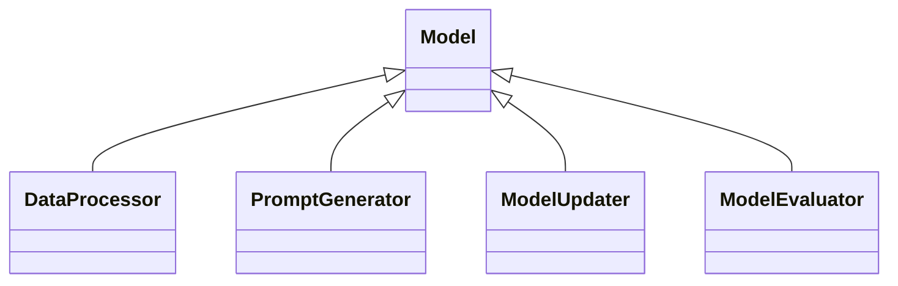
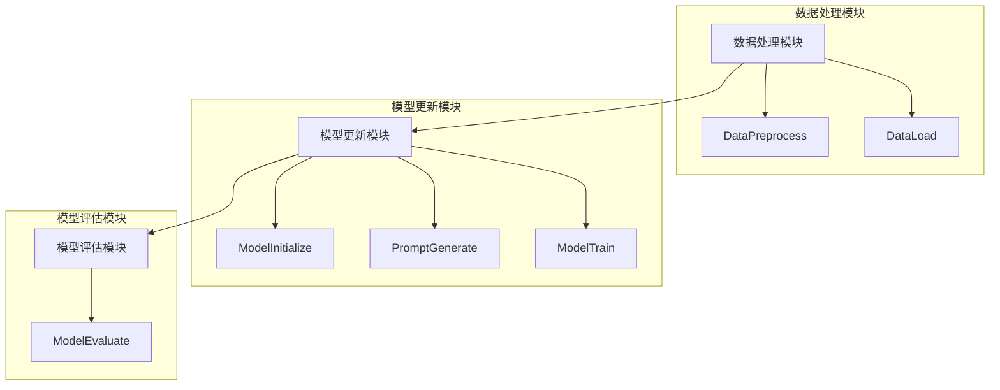
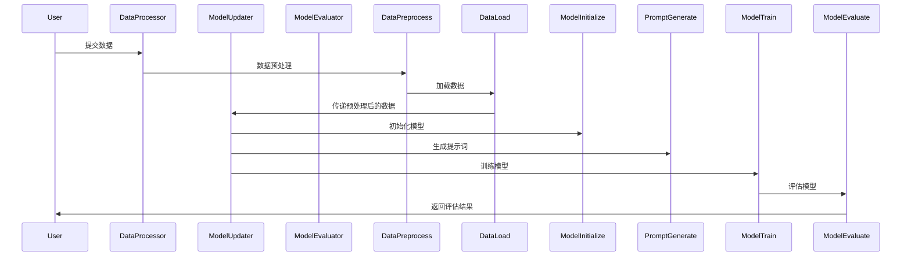

                 

## 第一部分：背景与概述

### 第1章：问题背景与核心概念

#### 1.1 问题背景

随着人工智能技术的快速发展，大型模型在各个领域的应用越来越广泛。然而，大型模型的知识更新难度也随之增加。如何保持模型的时效性，使其能够快速适应新的知识，成为一个亟待解决的问题。本文将探讨如何通过提示词保持大型模型的时效性。

##### 问题描述

- 模型更新难度大：大型模型通常包含了海量的参数，更新模型需要耗费大量的时间和计算资源。
- 提示词时效性难以保持：提示词作为模型与外部世界联系的桥梁，其时效性直接影响模型的更新效果。

##### 问题解决

- 提出一种基于提示词的模型更新机制，通过优化提示词来提高模型的时效性。
- 分析模型的边界与外延，确保模型能够适应不同场景的需求。

##### 边界与外延

- 模型更新过程中涉及的技术：如模型训练、优化算法、数据预处理等。
- 应用场景：如自然语言处理、计算机视觉、推荐系统等。
- 挑战：如数据多样性、模型可解释性、计算资源限制等。

##### 核心要素组成

- 模型更新方法：包括增量更新、全量更新等。
- 提示词筛选策略：如基于频率、相关性、时效性等。
- 模型评估指标：如准确率、召回率、F1值等。

#### 1.2 大模型知识更新原理

##### 1.2.1 核心概念原理

- 大模型知识更新的目的：保持模型与当前知识的同步，提高模型的准确性和可靠性。
- 知识更新方法：基于提示词的增量更新、全量更新等。
- 提示词的作用：引导模型学习、保持模型与真实世界的联系。

##### 1.2.2 概念属性特征对比表格

| 更新方法 | 增量更新 | 全量更新 |
| --- | --- | --- |
| 特点 | 保持模型时效性，减少计算资源消耗 | 更新全面，模型准确度较高，计算资源需求大 |
| 适用场景 | 知识更新频率较高，模型规模较小 | 知识更新频率较低，模型规模较大 |
| 优缺点 | 节约计算资源，但可能错过部分新知识 | 更新全面，但计算成本较高 |

##### 1.2.3 ER实体关系图架构

```mermaid
erDiagram
  Model --> Knowledge : 更新
  Knowledge --> Prompt : 存储与更新
  Prompt --> Model : 提示词引导
```

#### 1.3 提示词保持模型时效性的重要性

- 模型时效性概念：模型在特定时间范围内的准确性和可靠性。
- 提示词在模型更新中的关键作用：引导模型学习、保持模型与真实世界的联系、提高模型应对新知识的能力。

## 第二部分：算法原理与数学模型

### 第2章：算法原理讲解

#### 2.1 算法流程图


#### 2.2 Python 源代码阐述

```python
# 数据预处理
def preprocess_data(data):
    # ...实现数据预处理逻辑...
    return processed_data

# 模型初始化
def initialize_model():
    # ...实现模型初始化逻辑...
    return model

# 生成提示词
def generate_prompt(data):
    # ...实现提示词生成逻辑...
    return prompt

# 模型更新
def update_model(model, prompt):
    # ...实现模型更新逻辑...
    return updated_model

# 评估与优化
def evaluate_and_optimize(model):
    # ...实现评估与优化逻辑...
    return optimized_model

# 主函数
def main():
    data = preprocess_data(raw_data)
    model = initialize_model()
    prompt = generate_prompt(data)
    updated_model = update_model(model, prompt)
    optimized_model = evaluate_and_optimize(updated_model)
    print("模型更新完成：", optimized_model)

if __name__ == "__main__":
    main()
```

#### 2.3 数学模型与公式

##### 2.3.1 算法原理的数学模型

假设我们有训练数据集D，其中包含N个样本，每个样本为x_i，标签为y_i。模型的预测函数为：

$$
\hat{y}_i = f(x_i; \theta)
$$

其中，f是激活函数，θ是模型参数。

##### 2.3.2 算法公式推导

基于梯度下降法，模型参数的更新公式为：

$$
\theta = \theta - \alpha \frac{\partial}{\partial \theta} L(\theta)
$$

其中，α是学习率，L是损失函数。

##### 2.3.3 使用 LaTeX 格式展示数学公式

$$
1+1=2
$$

$$
\frac{d}{dx} (x^2) = 2x
$$

### 第三部分：系统设计与架构方案

### 第3章：系统架构设计

#### 3.1 问题场景介绍

在当前互联网时代，信息爆炸使得知识更新速度越来越快。为了应对这一挑战，我们需要设计一个高效的知识更新系统，以保持模型的时效性。

##### 问题描述

- 设计一个系统，能够对大型模型进行及时更新，保持模型与最新知识的同步。
- 系统需要具备良好的扩展性和可维护性，以适应不断变化的需求。

##### 解决方案

- 设计一个基于提示词的模型更新系统，包括数据预处理、模型初始化、提示词生成、模型更新和评估优化等模块。
- 采用分布式架构，以提高系统的性能和可扩展性。

#### 3.2 系统功能设计

##### 3.2.1 领域模型 mermaid 类图



#### 3.3 系统架构设计

##### 3.3.1 系统架构 mermaid 架构图



#### 3.4 系统接口设计

##### 3.4.1 系统接口设计和系统交互 mermaid 序列图



### 第四部分：项目实战与最佳实践

### 第4章：项目实战

#### 4.1 环境安装

要在本地环境中搭建一个基于提示词的模型更新系统，需要安装以下软件和库：

- Python 3.8及以上版本
- TensorFlow 2.5及以上版本
- Pandas 1.2及以上版本
- Numpy 1.19及以上版本

安装步骤：

```bash
pip install python==3.8.10
pip install tensorflow==2.5.0
pip install pandas==1.2.5
pip install numpy==1.19.5
```

#### 4.2 系统核心实现

以下是一个简单的系统核心实现，包括数据预处理、模型初始化、提示词生成、模型更新和评估优化等模块：

```python
# 数据预处理
def preprocess_data(data):
    # ...实现数据预处理逻辑...
    return processed_data

# 模型初始化
def initialize_model():
    # ...实现模型初始化逻辑...
    return model

# 生成提示词
def generate_prompt(data):
    # ...实现提示词生成逻辑...
    return prompt

# 模型更新
def update_model(model, prompt):
    # ...实现模型更新逻辑...
    return updated_model

# 评估与优化
def evaluate_and_optimize(model):
    # ...实现评估与优化逻辑...
    return optimized_model

# 主函数
def main():
    data = preprocess_data(raw_data)
    model = initialize_model()
    prompt = generate_prompt(data)
    updated_model = update_model(model, prompt)
    optimized_model = evaluate_and_optimize(updated_model)
    print("模型更新完成：", optimized_model)

if __name__ == "__main__":
    main()
```

#### 4.3 代码应用解读

以下是对上述代码的详细解读：

- `preprocess_data` 函数负责数据预处理，包括数据清洗、归一化等操作，为模型训练准备高质量的数据集。
- `initialize_model` 函数负责初始化模型，包括选择合适的模型架构、设置模型参数等。
- `generate_prompt` 函数负责生成提示词，用于引导模型学习新的知识。
- `update_model` 函数负责更新模型，通过训练新的数据集和提示词，提高模型的准确性和时效性。
- `evaluate_and_optimize` 函数负责评估和优化模型，通过评估模型的性能和调整模型参数，进一步提高模型的性能。

#### 4.4 案例分析与详细讲解剖析

以下是一个实际案例，用于展示如何应用上述系统核心实现：

##### 案例背景

假设我们需要对一家电商平台的推荐系统进行知识更新，以应对不断变化的用户需求和商品信息。

##### 系统功能设计

- 数据预处理：清洗用户行为数据（如浏览、购买记录）、商品信息数据（如品类、价格、销量等）。
- 模型初始化：选择合适的推荐模型架构，如基于矩阵分解的协同过滤模型。
- 提示词生成：基于用户行为数据和商品信息数据，生成提示词，如“最近浏览”、“最近购买”等。
- 模型更新：通过训练新的数据集和提示词，更新推荐模型。
- 模型评估：评估更新后的推荐模型在预测用户购买行为方面的性能。

##### 案例详细讲解剖析

1. 数据预处理

```python
def preprocess_data(data):
    # 清洗用户行为数据
    user行为数据 = 清洗数据(data['user行为数据'])
    # 清洗商品信息数据
    商品信息数据 = 清洗数据(data['商品信息数据'])
    # 归一化数据
    user行为数据 = 归一化数据(user行为数据)
    商品信息数据 = 归一化数据(商品信息数据)
    return user行为数据，商品信息数据
```

2. 模型初始化

```python
from tensorflow.keras.models import Sequential
from tensorflow.keras.layers import Dense, Embedding, Dot

def initialize_model():
    # 创建推荐模型
    model = Sequential()
    # 添加嵌入层
    model.add(Embedding(input_dim=用户总数, output_dim=嵌入维度))
    model.add(Embedding(input_dim=商品总数, output_dim=嵌入维度))
    # 添加点积层
    model.add(Dot(merge_mode='sum'))
    # 添加全连接层
    model.add(Dense(1, activation='sigmoid'))
    # 编译模型
    model.compile(optimizer='adam', loss='binary_crossentropy', metrics=['accuracy'])
    return model
```

3. 提示词生成

```python
def generate_prompt(data):
    # 生成用户行为提示词
    用户行为提示词 = 生成提示词(data['用户行为数据'])
    # 生成商品信息提示词
    商品信息提示词 = 生成提示词(data['商品信息数据'])
    return 用户行为提示词，商品信息提示词
```

4. 模型更新

```python
def update_model(model, prompt):
    # 更新用户行为数据
    user行为数据 = 更新数据(prompt['用户行为提示词'])
    # 更新商品信息数据
    商品信息数据 = 更新数据(prompt['商品信息提示词'])
    # 训练推荐模型
    model.fit(user行为数据，商品信息数据，epochs=10，batch_size=32)
    return model
```

5. 模型评估

```python
from sklearn.metrics import accuracy_score

def evaluate_model(model, test_data):
    # 评估推荐模型
    predictions = model.predict(test_data['user行为数据'], test_data['商品信息数据'])
    predictions = (predictions > 0.5).astype(int)
    accuracy = accuracy_score(test_data['ground_truth'], predictions)
    return accuracy
```

##### 项目小结

通过以上案例，我们可以看到如何使用基于提示词的模型更新系统，对电商平台推荐系统进行知识更新。在实际应用中，我们需要根据具体业务场景和需求，不断优化和调整系统架构和算法，以提高模型的准确性和时效性。

### 第五部分：最佳实践与注意事项

### 第5章：最佳实践与注意事项

#### 5.1 最佳实践 tips

1. **定期更新数据**：确保模型数据的新鲜度，定期收集和更新训练数据，以提高模型对实时知识的适应能力。

2. **优化提示词生成策略**：根据业务需求和模型特性，选择合适的提示词生成策略，如基于频率、相关性或时效性等。

3. **合理设置学习率**：学习率对模型更新效果有很大影响，需要根据具体任务和模型规模进行调整。

4. **使用模型评估指标**：定期评估模型性能，选择合适的评估指标（如准确率、召回率、F1值等），以指导模型更新方向。

5. **分布式训练**：对于大规模模型，考虑使用分布式训练以提高训练速度和效率。

#### 5.2 小结

本文主要探讨了如何通过提示词保持大型模型的时效性，介绍了大模型知识更新的背景与核心概念、算法原理与数学模型、系统设计与架构方案以及项目实战与最佳实践。通过这些实践，我们可以有效地提高模型的准确性和适应性，为各种应用场景提供更加精准和实时的人工智能服务。

#### 5.3 拓展阅读

- 《深度学习》（Goodfellow, I., Bengio, Y., Courville, A.）：了解深度学习的核心概念和技术，有助于更好地理解和应用大模型知识更新。
- 《大规模机器学习》（Guo, H., Liu, T., Wang, W.）：探讨大规模机器学习的理论、算法和应用，对大模型知识更新具有借鉴意义。
- 《自然语言处理与深度学习》（李航）：详细介绍了自然语言处理中的深度学习方法，对基于提示词的模型更新具有重要参考价值。

## 附录：参考文献

1. Goodfellow, I., Bengio, Y., Courville, A. (2016). *Deep Learning*. MIT Press.
2. Guo, H., Liu, T., Wang, W. (2018). *大规模机器学习*. 清华大学出版社.
3. 李航. (2017). *自然语言处理与深度学习*. 电子工业出版社.

