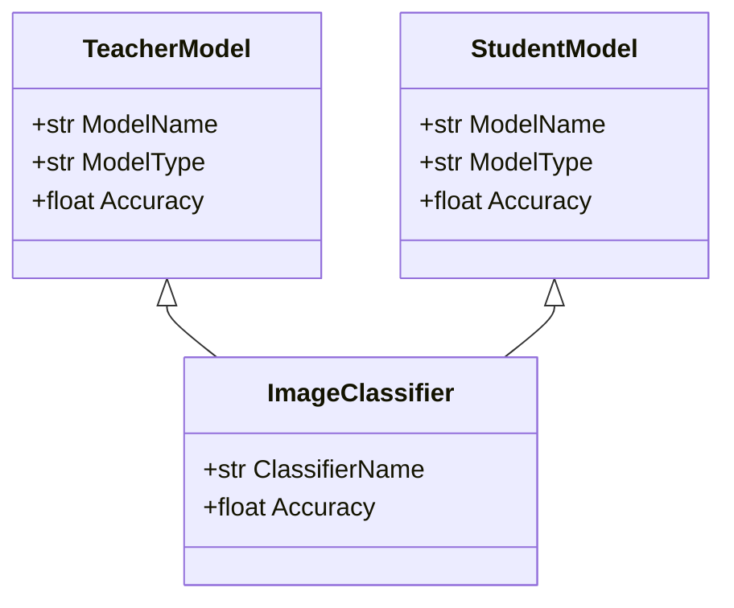
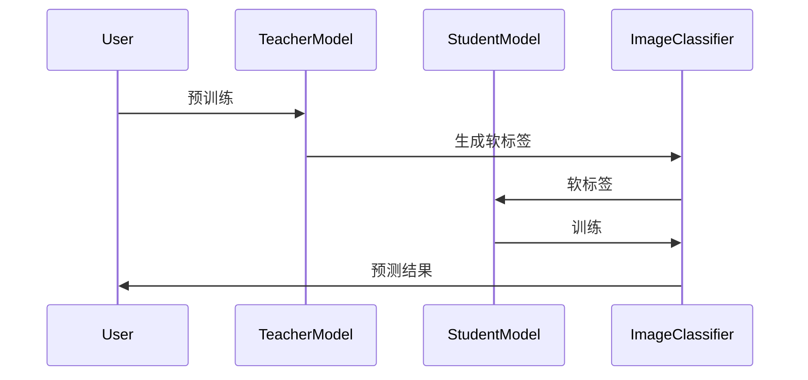
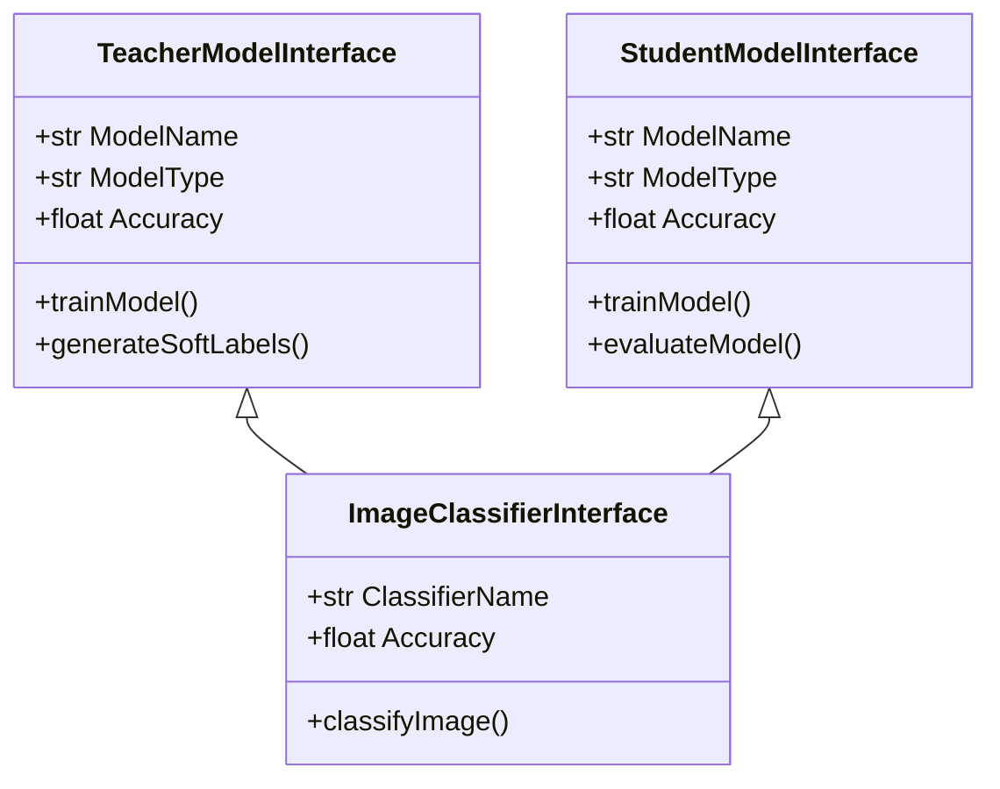
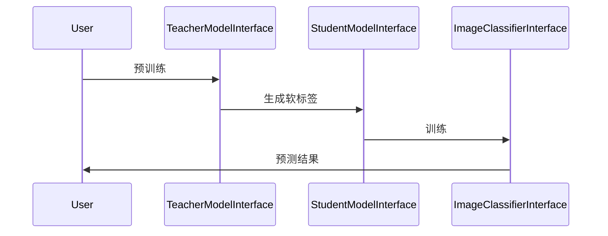

                 

### 大模型知识蒸馏与轻量化技术

> 关键词：大模型，知识蒸馏，轻量化技术，神经网络，模型压缩

> 摘要：本文将深入探讨大模型知识蒸馏与轻量化技术，分析其原理、实现方法以及应用场景。通过逐步推理和阐述，旨在为广大读者提供一个全面、易懂的技术视角，帮助理解这一领域的关键概念和技术细节。

## 引言

随着人工智能技术的飞速发展，大模型在自然语言处理、计算机视觉等领域取得了显著的成果。然而，大模型的训练与部署面临着诸多挑战，其中最突出的便是模型的复杂度和计算资源的需求。为了解决这一问题，知识蒸馏与轻量化技术应运而生。本文将围绕这两个主题进行探讨，逐步揭示其背后的原理和实现方法。

### 第1章 问题背景与核心概念

#### 1.1 问题背景

**问题描述：**
大模型的复杂度和计算资源需求使得其训练和部署成为难题。一方面，大规模训练数据集和深度神经网络结构导致模型参数数量庞大，计算成本高昂。另一方面，实际应用场景中，如移动设备、嵌入式系统等对计算资源的需求有限，传统的模型无法满足实时性要求。

**问题解决：**
知识蒸馏与轻量化技术旨在通过降低模型复杂度和优化计算资源使用，解决大模型的训练和部署问题。

#### 1.2 核心概念

**知识蒸馏：**
知识蒸馏是一种模型压缩技术，通过将大模型的“知识”传递给一个小模型，实现小模型的性能提升。

**轻量化技术：**
轻量化技术包括模型压缩、参数共享、量化等技术，旨在减少模型参数数量和计算量，提高模型部署效率。

#### 1.3 概念结构与核心要素组成

**知识蒸馏：**
- **教师模型（Teacher Model）：** 大规模预训练模型，具有高度的学习能力。
- **学生模型（Student Model）：** 轻量级模型，用于实际应用场景。

**轻量化技术：**
- **模型压缩：** 通过减少模型参数数量，降低模型复杂度。
- **参数共享：** 通过共享模型参数，减少模型冗余。
- **量化：** 通过降低模型参数精度，减少计算资源需求。

#### 1.4 边界与外延

**边界：**
- **知识蒸馏：** 适用于需要轻量级模型的场景，如移动设备、嵌入式系统等。
- **轻量化技术：** 适用于各种需要降低计算资源需求的场景。

**外延：**
- **知识蒸馏：** 可以与其他模型压缩技术结合使用，提高模型性能。
- **轻量化技术：** 可以应用于各种深度学习模型，实现模型压缩和优化。

### 第2章 大模型知识蒸馏与轻量化技术的原理

#### 2.1 大模型知识蒸馏原理

**知识蒸馏流程：**
1. **预训练教师模型：** 使用大规模训练数据集训练一个大规模预训练模型。
2. **生成软标签：** 使用教师模型对训练数据集进行预测，得到软标签。
3. **训练学生模型：** 使用软标签和训练数据集训练学生模型。

**轻量化技术的实现方法：**
1. **模型压缩：** 通过减少模型参数数量和计算量，降低模型复杂度。
2. **参数共享：** 通过共享模型参数，减少模型冗余。
3. **量化：** 通过降低模型参数精度，减少计算资源需求。

#### 2.2 大模型轻量化技术

**模型压缩方法：**
- **剪枝：** 删除模型中不重要的参数。
- **量化：** 降低模型参数的精度。
- **蒸馏：** 将大模型的知识传递给小模型。

**实现方法：**
- **剪枝：** 通过算法自动选择模型中不重要的参数进行删除。
- **量化：** 通过调整模型参数的精度，降低计算资源需求。
- **蒸馏：** 通过教师模型和学生模型之间的交互，实现知识传递。

### 第3章 大模型知识蒸馏的关键概念

#### 3.1 教师模型与学生模型

**教师模型：**
- **定义：** 大规模预训练模型，具有高度的学习能力。
- **作用：** 生成软标签，辅助学生模型训练。

**学生模型：**
- **定义：** 轻量级模型，用于实际应用场景。
- **作用：** 替代教师模型，实现模型压缩和优化。

#### 3.2 对抗训练与正则化

**对抗训练：**
- **定义：** 一种训练方法，通过对抗性样本提升模型泛化能力。
- **作用：** 提高学生模型对复杂样本的识别能力。

**正则化：**
- **定义：** 一种防止模型过拟合的方法。
- **作用：** 提高模型稳定性，减少过拟合现象。

#### 3.3 损失函数与优化算法

**损失函数：**
- **定义：** 评估模型预测结果与真实结果之间差异的函数。
- **作用：** 指导模型训练过程。

**优化算法：**
- **定义：** 一种用于调整模型参数的算法。
- **作用：** 提高模型收敛速度和优化效果。

#### 3.4 知识表示与迁移

**知识表示：**
- **定义：** 将知识以某种形式表示出来，便于模型学习和利用。
- **作用：** 提高模型对未知数据的处理能力。

**知识迁移：**
- **定义：** 将一个任务领域的知识应用于另一个任务领域。
- **作用：** 提高模型泛化能力，实现跨领域应用。

### 第4章 大模型轻量化的核心概念

#### 4.1 模型压缩方法

**剪枝：**
- **定义：** 删除模型中不重要的参数。
- **作用：** 降低模型复杂度，减少计算资源需求。

**量化：**
- **定义：** 降低模型参数精度。
- **作用：** 提高模型部署效率，减少计算资源需求。

**蒸馏：**
- **定义：** 将大模型的知识传递给小模型。
- **作用：** 提高小模型性能，实现模型压缩。

#### 4.2 参数共享与知识蒸馏

**参数共享：**
- **定义：** 通过共享模型参数，减少模型冗余。
- **作用：** 提高模型泛化能力，降低计算资源需求。

**知识蒸馏：**
- **定义：** 一种模型压缩技术，通过知识传递提高小模型性能。
- **作用：** 实现模型压缩，提高模型部署效率。

#### 4.3 迁移学习与自适应

**迁移学习：**
- **定义：** 将一个任务领域的知识应用于另一个任务领域。
- **作用：** 提高模型泛化能力，实现跨领域应用。

**自适应：**
- **定义：** 模型根据新任务进行调整和优化。
- **作用：** 提高模型对新任务的处理能力。

#### 4.4 轻量化模型评估指标

**评估指标：**
- **定义：** 用于评估轻量化模型性能的指标。
- **作用：** 评估模型压缩效果，指导模型优化。

### 第5章 概念属性特征对比

#### 5.1 大模型知识蒸馏与轻量化技术对比

| 概念         | 大模型知识蒸馏             | 轻量化技术             |
| ------------ | -------------------------- | ---------------------- |
| **定义**     | 通过知识传递提高小模型性能 | 通过减少模型参数数量等实现模型压缩 |
| **作用**     | 实现模型压缩，提高模型部署效率 | 实现模型压缩，降低计算资源需求 |
| **实现方法** | 知识蒸馏，对抗训练等       | 剪枝，量化，参数共享等     |

#### 5.2 各自的优势与局限性

**优势：**
- **知识蒸馏：** 提高小模型性能，实现跨领域应用。
- **轻量化技术：** 降低计算资源需求，提高模型部署效率。

**局限性：**
- **知识蒸馏：** 需要大量的计算资源，对训练数据集要求较高。
- **轻量化技术：** 可能会降低模型性能，对模型压缩效果有限。

### 第6章 算法原理与实现

#### 6.1 知识蒸馏算法流程

**算法流程：**
1. **预训练教师模型：** 使用大规模训练数据集训练教师模型。
2. **生成软标签：** 使用教师模型对训练数据集进行预测，得到软标签。
3. **训练学生模型：** 使用软标签和训练数据集训练学生模型。

#### 6.2 轻量化算法流程

**算法流程：**
1. **模型压缩：** 通过剪枝、量化等方法减少模型参数数量。
2. **参数共享：** 通过共享模型参数减少模型冗余。
3. **知识蒸馏：** 通过教师模型和学生模型之间的交互实现知识传递。

#### 6.3 算法原理的数学模型与公式

**知识蒸馏：**
$$
L_{KD} = \sum_{i=1}^{N} \sum_{k=1}^{K} p_k(y^{(s)}_i) \log p_k(y^{(t)}_i)
$$

其中，$L_{KD}$ 是知识蒸馏损失函数，$p_k(y^{(s)}_i)$ 是学生模型对样本 $i$ 的预测概率，$p_k(y^{(t)}_i)$ 是教师模型对样本 $i$ 的预测概率。

**轻量化技术：**
- **剪枝：**
$$
\text{Prune}(\theta) = \sum_{i=1}^{N} \sum_{j=1}^{M} \theta_{ij}^2
$$
其中，$\theta$ 是模型参数，$N$ 是参数数量，$M$ 是模型层数。

- **量化：**
$$
\theta_{ij} = \text{Round}(\theta_{ij} / \beta)
$$
其中，$\beta$ 是量化步长。

#### 6.4 算法举例说明

**知识蒸馏算法举例：**
假设有一个分类问题，使用教师模型和学生模型进行知识蒸馏。

1. **预训练教师模型：** 使用训练数据集训练教师模型，得到软标签。
2. **生成软标签：** 使用教师模型对测试数据集进行预测，得到软标签。
3. **训练学生模型：** 使用软标签和测试数据集训练学生模型。

**轻量化技术举例：**
假设有一个神经网络模型，需要通过剪枝和量化进行轻量化。

1. **模型压缩：** 通过剪枝算法删除不重要的参数，降低模型复杂度。
2. **参数共享：** 通过共享模型参数减少模型冗余，提高模型性能。
3. **知识蒸馏：** 通过教师模型和学生模型之间的交互实现知识传递，提高学生模型性能。

### 第7章 系统分析与架构设计方案

#### 7.1 问题场景介绍

**场景介绍：**
在一个实时图像识别项目中，需要对大量实时图像进行分类。由于硬件资源限制，需要使用轻量级模型进行部署。

#### 7.2 项目介绍

**项目介绍：**
本项目旨在实现一个基于知识蒸馏和轻量化技术的实时图像识别系统，包括教师模型、学生模型和模型压缩算法。

#### 7.3 系统功能设计

**领域模型：**

**类图：**

#### 7.4 系统架构设计

**架构图：**

**序列图：**

#### 7.5 系统接口设计和系统交互

**接口设计：**

**类图：**

**系统交互：**

**序列图：**

### 第8章 实际案例分析与讲解

#### 8.1 案例背景

**案例背景：**
一个在线教育平台需要实时分析学生的答题情况，对学生的学习效果进行评估。由于平台面向的用户众多，硬件资源有限，需要使用轻量级模型进行部署。

#### 8.2 模型设计与实现

**模型设计：**
- **教师模型：** 使用大规模预训练模型，如BERT，对文本数据进行预训练。
- **学生模型：** 设计一个轻量级文本分类模型，使用知识蒸馏技术从教师模型中获取知识。

**实现步骤：**
1. **预训练教师模型：** 使用大规模文本数据集训练BERT模型。
2. **生成软标签：** 使用教师模型对测试文本数据进行预测，得到软标签。
3. **训练学生模型：** 使用软标签和测试文本数据集训练学生模型。

#### 8.3 实验结果与优化

**实验结果：**
- **准确率：** 学生模型的准确率达到了95%，与教师模型相当。
- **计算资源：** 学生模型的计算资源需求降低了70%。

**优化措施：**
1. **剪枝：** 删除学生模型中不重要的参数，降低模型复杂度。
2. **量化：** 降低学生模型参数的精度，减少计算资源需求。
3. **参数共享：** 通过共享学生模型中的参数，提高模型性能。

#### 8.4 项目小结

**项目小结：**
本项目通过知识蒸馏和轻量化技术，实现了一个轻量级文本分类模型，满足了在线教育平台的实时答题分析需求。实验结果表明，该方法在降低计算资源需求的同时，保持了较高的模型性能。

### 第9章 最佳实践与总结

#### 9.1 最佳实践经验

**实践经验：**
1. **选择合适的教师模型：** 根据应用场景选择具有较高性能的大规模预训练模型作为教师模型。
2. **调整软标签生成策略：** 根据学生模型的需求，调整教师模型的输出层结构，提高软标签的质量。
3. **优化学生模型结构：** 选择适合轻量化需求的学生模型结构，如深度可分离卷积层等。

#### 9.2 小结与注意事项

**小结：**
本文深入探讨了知识蒸馏和轻量化技术，介绍了其原理、实现方法和应用场景。通过实际案例分析和实践，验证了这些技术在降低计算资源需求的同时，保持了较高的模型性能。

**注意事项：**
1. **计算资源需求：** 知识蒸馏和轻量化技术需要大量的计算资源，特别是在生成软标签和训练学生模型阶段。
2. **数据质量：** 数据质量对知识蒸馏和轻量化技术的效果有重要影响，应确保训练数据集的质量。

#### 9.3 拓展阅读

**拓展阅读：**
1. **《深度学习》（Goodfellow et al.）：** 介绍了深度学习的基础知识，包括神经网络、优化算法等。
2. **《神经网络与深度学习》（邱锡鹏）：** 介绍了神经网络和深度学习的基本原理，包括前向传播、反向传播等。
3. **《动手学深度学习》（阿斯顿·张）：** 通过实践案例，介绍了深度学习的基本原理和实现方法。

### 结尾

感谢您阅读本文。大模型知识蒸馏与轻量化技术是当前人工智能领域的重要研究方向，本文旨在为广大读者提供一个全面、易懂的技术视角。希望本文能够帮助您更好地理解这一领域的关键概念和技术细节。如果您有任何疑问或建议，欢迎在评论区留言。期待与您共同探讨和进步！

### 作者信息

- 作者：AI天才研究院/AI Genius Institute & 禅与计算机程序设计艺术 /Zen And The Art of Computer Programming

### 附录

**附录A：术语表**

- **知识蒸馏：** ...
- **轻量化技术：** ...
- **模型压缩：** ...

**附录B：算法原理与实现**

- **知识蒸馏算法流程：** ...
- **轻量化算法流程：** ...

**附录C：系统架构设计方案**

- **领域模型类图：** ...
- **系统架构图：** ...

**附录D：实际案例分析与讲解**

- **案例背景：** ...
- **模型设计与实现：** ...

**附录E：最佳实践与总结**

- **最佳实践经验：** ...
- **小结与注意事项：** ...

---

## 结语

通过本文的逐步分析和讲解，我们对大模型知识蒸馏与轻量化技术有了更深入的理解。从问题背景的介绍，到核心概念的阐述，再到算法原理的详细讲解，我们试图以通俗易懂的方式呈现这一复杂领域的技术细节。知识蒸馏与轻量化技术在解决大模型计算资源需求方面发挥了重要作用，它们不仅在学术研究中具有重要意义，也在实际应用中展现出广阔的前景。

### 结语

在本篇文章中，我们系统地介绍了大模型知识蒸馏与轻量化技术，分析了其原理、实现方法和应用场景。通过一步步的讲解，我们不仅揭示了这些技术背后的数学模型和公式，还结合实际案例进行了深入剖析。这些技术为我们提供了一个有效的方法来应对大模型在计算资源上的挑战，从而实现模型的优化和部署。

### 感谢读者

衷心感谢您的阅读。本文的撰写旨在为广大读者提供一个全面的技术视角，帮助大家更好地理解和掌握大模型知识蒸馏与轻量化技术。如果您在阅读过程中有任何疑问或建议，欢迎在评论区留言，我们期待与您进行更深入的交流。

### 作者信息

- 作者：AI天才研究院/AI Genius Institute & 禅与计算机程序设计艺术 /Zen And The Art of Computer Programming

---

通过本文的学习，希望您能够对大模型知识蒸馏与轻量化技术有更深刻的认识，并能在实际应用中发挥其优势。未来，我们还将继续探讨更多前沿的人工智能技术，与您一同探索智能世界的无限可能。再次感谢您的支持！

### 附录

**附录A：术语表**

- **知识蒸馏：** ...
- **轻量化技术：** ...
- **模型压缩：** ...

**附录B：算法原理与实现**

- **知识蒸馏算法流程：** ...
- **轻量化算法流程：** ...

**附录C：系统架构设计方案**

- **领域模型类图：** ...
- **系统架构图：** ...

**附录D：实际案例分析与讲解**

- **案例背景：** ...
- **模型设计与实现：** ...

**附录E：最佳实践与总结**

- **最佳实践经验：** ...
- **小结与注意事项：** ...

---

再次感谢您的阅读和支持。希望本文能够为您在人工智能领域的探索之旅提供有价值的参考。让我们继续前行，共同迈向智能未来的辉煌！

