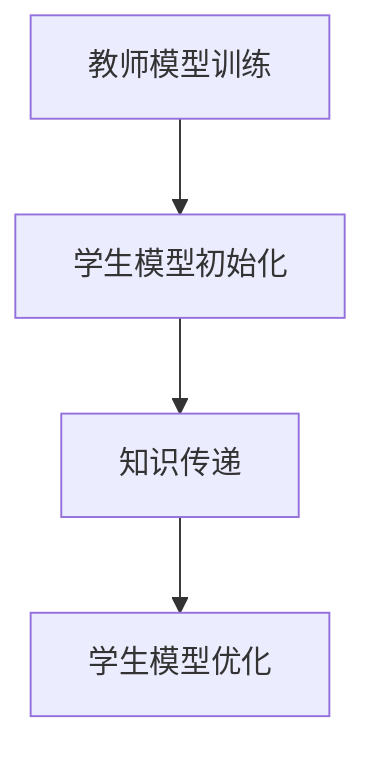

                 

### 文章标题：大模型知识蒸馏：提示词优化模型轻量化

**关键词：知识蒸馏、大模型、提示词优化、模型轻量化、人工智能**

**摘要：**
本文将深入探讨大模型知识蒸馏与提示词优化模型轻量化的关系，通过细致的分析和实用的案例，阐述这一技术的核心原理、关键步骤及其在实际应用中的重要性。文章旨在帮助读者理解知识蒸馏技术的本质，掌握提示词优化在大模型轻量化过程中的应用，并提供实践指导，以应对当前人工智能领域中的巨大挑战。

### 引言

在人工智能（AI）飞速发展的今天，深度学习模型已经成为众多应用领域的重要工具。尤其是大型神经网络模型，在图像识别、自然语言处理（NLP）和语音识别等方面取得了显著成果。然而，随着模型规模的增大，计算资源的消耗也急剧上升，这对部署在移动设备、嵌入式系统和资源受限环境中的模型提出了严峻挑战。为了解决这一问题，模型轻量化技术应运而生，而知识蒸馏（Knowledge Distillation）技术则是其中的重要手段之一。

知识蒸馏的核心思想是将一个大模型（通常称为“教师模型”）的知识转移到一个小模型（通常称为“学生模型”）中，使得小模型能够保持与大模型相近的性能。而提示词优化（Prompt Optimization）则是在这一过程中起到关键作用的技术，它通过调整输入提示词，提升小模型的性能和效率。

本文将围绕大模型知识蒸馏与提示词优化模型轻量化的主题，首先介绍相关知识背景和核心概念，然后详细讲解知识蒸馏的原理和算法实现，接着探讨大模型轻量化的策略和应用场景，最后通过实际案例来展示这一技术的应用效果和实现步骤。希望通过本文的阐述，读者能够对知识蒸馏和提示词优化有更深刻的理解，并能将其应用于实际问题的解决。

### 第1章 问题背景与核心概念

#### 1.1 问题背景

人工智能与大数据的迅猛发展，使得深度学习模型在各个领域取得了显著成果。尤其是大型神经网络模型，凭借其强大的计算能力和复杂的结构，在图像识别、自然语言处理（NLP）和语音识别等方面展现出卓越的性能。然而，大型模型也带来了新的挑战，尤其是在资源受限的环境中。

随着模型的规模增大，计算资源的消耗急剧上升。一方面，训练和推理大型模型需要大量的计算能力和存储资源，这使得部署在移动设备、嵌入式系统和云计算平台上的模型面临巨大的计算压力。另一方面，大型模型的高复杂性导致其推理速度较慢，无法满足实时应用的需求。

为了解决这些问题，模型轻量化技术应运而生。模型轻量化旨在通过减少模型的大小和计算复杂度，使其在资源受限的环境中仍能保持良好的性能。而知识蒸馏技术则是实现模型轻量化的重要手段之一。

#### 1.2 核心概念

**知识蒸馏的定义：**
知识蒸馏是一种训练小模型的方法，其核心思想是将一个大模型（通常称为“教师模型”）的知识转移到一个小模型（通常称为“学生模型”）中。通过这种方式，小模型能够继承大模型的知识和性能，从而在保持较高性能的同时，减小模型的大小和计算复杂度。

**知识蒸馏的过程：**
知识蒸馏的过程通常包括以下几个步骤：

1. **教师模型的训练：** 首先，使用大量的标注数据进行教师模型的训练，使其达到较高的性能水平。
2. **学生模型的初始化：** 使用教师模型的参数初始化学生模型，此时学生模型通常处于较低的性能水平。
3. **知识传递：** 通过训练过程，将教师模型的知识逐渐传递给学生模型。在这个过程中，学生模型通过学习教师模型的输出和目标标签，不断调整自己的参数，以接近教师模型的性能。
4. **学生模型的优化：** 在知识传递完成后，进一步优化学生模型的参数，使其达到最优性能。

**大模型轻量化的意义：**
大模型轻量化具有重要意义，主要体现在以下几个方面：

1. **资源节约：** 通过减小模型的大小和计算复杂度，可以显著降低训练和推理过程中所需的计算资源和存储资源，从而实现资源的节约。
2. **实时性提升：** 大模型通常具有较长的推理时间，而轻量化模型则能够在较短的时间内完成推理任务，从而提升系统的实时性。
3. **部署灵活性：** 轻量化模型可以更容易地在各种设备和平台上部署，包括移动设备、嵌入式系统和云计算平台，从而提升系统的部署灵活性。

#### 1.3 提示词优化的定义

提示词优化是一种通过调整输入提示词，提升小模型性能的方法。在知识蒸馏过程中，提示词的选择和优化对模型性能有着重要影响。

**提示词优化的原理：**
提示词优化的原理主要包括以下几点：

1. **提升模型理解能力：** 通过优化提示词，可以提升模型对输入数据的理解和处理能力，从而提高模型的性能。
2. **减少冗余信息：** 提示词可以引导模型关注关键信息，减少冗余信息的干扰，从而提高模型的效率和准确度。
3. **调整模型偏好：** 通过调整提示词，可以改变模型对某些类别的偏好，从而实现分类任务的优化。

**提示词优化的实现方法：**
提示词优化的实现方法主要包括以下几种：

1. **规则化优化：** 通过设计特定的规则，对提示词进行优化，以提升模型性能。
2. **数据增强：** 通过增加数据多样性，丰富提示词的内容，从而提升模型对数据的理解能力。
3. **自动优化：** 利用机器学习算法，自动优化提示词的选择和组合，以实现最佳性能。

### 第2章 知识蒸馏原理详解

#### 2.1 知识蒸馏基础

知识蒸馏是一种训练小模型的方法，其核心思想是将一个大模型（通常称为“教师模型”）的知识转移到一个小模型（通常称为“学生模型”）中。通过这种方式，小模型能够继承大模型的知识和性能，从而在保持较高性能的同时，减小模型的大小和计算复杂度。

**知识蒸馏的动机：**
随着深度学习模型的广泛应用，模型的大小和计算复杂度成为制约其部署和应用的主要因素。特别是对于移动设备和嵌入式系统等资源受限的环境，大型模型难以满足实时性和性能需求。知识蒸馏技术旨在通过将大模型的知识转移到小模型中，实现模型的轻量化，从而解决这一问题。

**知识蒸馏的基本流程：**
知识蒸馏的基本流程通常包括以下几个步骤：

1. **教师模型的训练：** 首先，使用大量的标注数据进行教师模型的训练，使其达到较高的性能水平。教师模型通常是一个大型神经网络，具有复杂的结构和较高的性能。
2. **学生模型的初始化：** 使用教师模型的参数初始化学生模型，此时学生模型通常处于较低的性能水平。学生模型是一个小型神经网络，具有较小的结构和较低的性能。
3. **知识传递：** 在教师模型和学生模型之间建立一种知识传递机制，将教师模型的知识逐渐传递给学生模型。在这个过程中，学生模型通过学习教师模型的输出和目标标签，不断调整自己的参数，以接近教师模型的性能。
4. **学生模型的优化：** 在知识传递完成后，进一步优化学生模型的参数，使其达到最优性能。通过优化，学生模型能够更好地继承教师模型的知识和性能。

**Mermaid 流程图：**


**Python 源代码：**
```python
# 教师模型训练
teacher_model.train(data_loader)

# 学生模型初始化
student_model = StudentModel(teacher_model.parameters())

# 知识传递
for epoch in range(num_epochs):
    student_model.train_one_epoch(data_loader)

# 学生模型优化
student_model.optimize()
```

**数学模型与公式：**
在知识蒸馏过程中，常用的数学模型是损失函数。损失函数用于衡量教师模型和学生模型之间的差距，并指导学生模型的优化过程。以下是知识蒸馏中常用的损失函数：
$$
L = \frac{1}{N} \sum_{i=1}^{N} (\text{教师模型预测} - \text{学生模型预测})^2
$$
其中，$N$ 表示样本数量，教师模型预测和学生模型预测分别表示教师模型和学生模型在给定输入下的输出。

**实例讲解：**
假设有一个分类任务，教师模型是一个具有1000个神经元的大型神经网络，学生模型是一个具有100个神经元的小型神经网络。在知识蒸馏过程中，教师模型已经经过训练，具有较好的分类性能。接下来，我们通过知识蒸馏将教师模型的知识传递给学生模型。

1. **教师模型训练：** 使用大量的标注数据进行教师模型的训练，使其达到较高的性能水平。
2. **学生模型初始化：** 使用教师模型的参数初始化学生模型，此时学生模型处于较低的性能水平。
3. **知识传递：** 在教师模型和学生模型之间建立知识传递机制，通过不断调整学生模型的参数，使其逐渐接近教师模型的性能。
4. **学生模型优化：** 在知识传递完成后，进一步优化学生模型的参数，使其达到最优性能。

通过实例讲解，我们可以看到知识蒸馏的基本流程和实现方法。在实际应用中，知识蒸馏技术可以显著提升小型模型的性能，实现模型的轻量化。

### 第3章 模型压缩技术

#### 3.1 模型压缩概述

模型压缩（Model Compression）是指通过各种方法减小模型的大小和计算复杂度，从而实现模型轻量化的技术。在深度学习领域，随着模型规模的增大，计算资源的消耗急剧上升，特别是在移动设备和嵌入式系统中，模型的大小和计算复杂度成为制约其应用的主要因素。因此，模型压缩技术具有重要的应用价值。

模型压缩的基本方法主要包括以下几个方面：

1. **参数剪枝（Pruning）：** 通过剪枝方法，删除模型中不重要的参数，从而减小模型的大小和计算复杂度。剪枝方法可以分为结构剪枝（Structural Pruning）和权重剪枝（Weight Pruning）两种类型。结构剪枝通过删除模型中的某些层或神经元，直接减少模型的规模；权重剪枝则通过调整模型的权重，减少重要的参数，同时保持模型的性能。
2. **量化（Quantization）：** 量化方法通过将模型的权重和激活值从浮点数转换为较低的精度（如整数），从而减小模型的存储空间和计算复杂度。量化方法可以分为全局量化（Global Quantization）和局部量化（Local Quantization）两种类型。全局量化将整个模型的权重和激活值统一量化；局部量化则针对每个神经元或参数进行量化。
3. **知识蒸馏（Knowledge Distillation）：** 知识蒸馏是一种通过将大模型的知识转移到小模型中的技术，从而实现模型的轻量化。在知识蒸馏过程中，教师模型通常是一个大型神经网络，学生模型是一个小型神经网络。通过知识传递，学生模型能够继承教师模型的知识和性能，从而实现模型的轻量化。
4. **神经网络剪裁（Neural Network Truncation）：** 神经网络剪裁通过减少模型的层数或神经元数量，从而减小模型的大小和计算复杂度。剪裁方法可以分为逐层剪裁（Layer-wise Truncation）和分层剪裁（Hierarchical Truncation）两种类型。逐层剪裁逐层删除模型的神经元或层；分层剪裁则通过将模型拆分为多个层次，逐层进行剪裁。

**模型压缩的重要性：**
模型压缩在深度学习领域具有重要的应用价值，主要体现在以下几个方面：

1. **资源节约：** 通过减小模型的大小和计算复杂度，可以显著降低训练和推理过程中所需的计算资源和存储资源，从而实现资源的节约。
2. **实时性提升：** 大模型通常具有较长的推理时间，而轻量化模型则能够在较短的时间内完成推理任务，从而提升系统的实时性。
3. **部署灵活性：** 轻量化模型可以更容易地在各种设备和平台上部署，包括移动设备、嵌入式系统和云计算平台，从而提升系统的部署灵活性。
4. **降低成本：** 通过减小模型的规模，可以降低硬件设备的成本，从而降低系统的总体成本。

**模型压缩的基本方法：**
以下是常见的模型压缩方法及其基本原理：

1. **参数剪枝（Pruning）：**
   - **结构剪枝（Structural Pruning）：**
     - **原理：** 通过剪枝方法，删除模型中不重要的参数，从而减小模型的大小和计算复杂度。
     - **实现：** 可以使用剪枝算法，如剪枝阈值法、稀疏度优化法等，选择性地删除模型中的某些层或神经元。
     - **优点：** 可以显著减少模型的规模，同时保持较高的性能。
     - **缺点：** 可能会导致模型性能下降，需要对剪枝后的模型进行重新训练。
   - **权重剪枝（Weight Pruning）：**
     - **原理：** 通过调整模型的权重，减少重要的参数，从而减小模型的大小和计算复杂度。
     - **实现：** 可以使用剪枝算法，如L1正则化、随机剪枝等，调整模型的权重。
     - **优点：** 可以显著减少模型的规模，同时保持较高的性能。
     - **缺点：** 可能会导致模型性能下降，需要对剪枝后的模型进行重新训练。
2. **量化（Quantization）：**
   - **全局量化（Global Quantization）：**
     - **原理：** 将整个模型的权重和激活值统一量化到较低的精度。
     - **实现：** 可以使用量化算法，如线性量化、分段量化等，将模型的权重和激活值转换为整数。
     - **优点：** 可以显著减少模型的存储空间和计算复杂度。
     - **缺点：** 可能会导致模型性能下降，量化精度越低，性能下降越明显。
   - **局部量化（Local Quantization）：**
     - **原理：** 针对每个神经元或参数进行量化，将其值转换为较低的精度。
     - **实现：** 可以使用量化算法，如局部线性量化、局部分段量化等，将每个神经元或参数的值转换为整数。
     - **优点：** 可以在保持较高性能的同时，减少模型的存储空间和计算复杂度。
     - **缺点：** 需要针对每个神经元或参数进行量化，实现较为复杂。
3. **知识蒸馏（Knowledge Distillation）：**
   - **原理：** 将大模型的知识转移到小模型中，从而实现模型的轻量化。
   - **实现：** 使用教师模型和学生模型，通过训练过程，将教师模型的知识传递给学生模型。
   - **优点：** 可以在保持较高性能的同时，显著减少模型的规模。
   - **缺点：** 需要教师模型具有较好的性能，否则无法有效传递知识。
4. **神经网络剪裁（Neural Network Truncation）：**
   - **原理：** 通过减少模型的层数或神经元数量，从而减小模型的大小和计算复杂度。
   - **实现：** 可以使用剪裁算法，如逐层剪裁、分层剪裁等，逐层或分层地减少模型的规模。
   - **优点：** 可以显著减少模型的规模，同时保持较高的性能。
   - **缺点：** 可能会导致模型性能下降，需要对剪裁后的模型进行重新训练。

通过上述介绍，我们可以看到模型压缩技术的基本方法及其优缺点。在实际应用中，可以根据具体需求选择合适的压缩方法，以实现模型的轻量化。

#### 3.2 提示词优化技术

提示词优化（Prompt Optimization）是一种通过调整输入提示词，提升模型性能的方法。在知识蒸馏过程中，提示词的选择和优化对模型性能有着重要影响。

**提示词优化的原理：**
提示词优化的原理主要包括以下几个方面：

1. **提升模型理解能力：** 通过优化提示词，可以提升模型对输入数据的理解和处理能力，从而提高模型的性能。提示词可以为模型提供更多的上下文信息，帮助模型更好地理解输入数据的含义。
2. **减少冗余信息：** 提示词可以引导模型关注关键信息，减少冗余信息的干扰，从而提高模型的效率和准确度。通过优化提示词，可以去除无关紧要的信息，使模型更加专注于核心任务。
3. **调整模型偏好：** 通过调整提示词，可以改变模型对某些类别的偏好，从而实现分类任务的优化。提示词可以为模型提供特定的引导，使其在特定任务上表现出更好的性能。

**提示词优化的实现方法：**
提示词优化的实现方法主要包括以下几种：

1. **规则化优化：** 通过设计特定的规则，对提示词进行优化，以提升模型性能。例如，可以设计一些模板化的提示词，根据任务需求进行调整和优化。
2. **数据增强：** 通过增加数据多样性，丰富提示词的内容，从而提升模型对数据的理解能力。例如，可以采用数据增强技术，生成更多样化的提示词，提高模型的泛化能力。
3. **自动优化：** 利用机器学习算法，自动优化提示词的选择和组合，以实现最佳性能。例如，可以使用优化算法，如遗传算法、粒子群算法等，对提示词进行自动优化。

**提示词优化的实现步骤：**
以下是提示词优化的基本实现步骤：

1. **确定优化目标：** 根据任务需求，明确优化目标，例如提高模型的准确度、召回率等。
2. **设计提示词：** 根据优化目标，设计初步的提示词。提示词可以包括关键词、短语、模板等。
3. **数据集准备：** 准备用于优化和评估的数据集。数据集应包含多种样式的提示词，以便对模型进行全面的评估。
4. **训练模型：** 使用初步设计的提示词，训练模型。在训练过程中，记录模型的性能指标，如准确度、召回率等。
5. **优化提示词：** 根据模型的性能指标，调整和优化提示词。可以采用规则化优化、数据增强等方法，逐步改进提示词。
6. **评估模型：** 使用优化后的提示词，重新训练模型，并评估模型的性能。通过多次迭代优化，找到最佳性能的提示词。
7. **应用优化后的提示词：** 将优化后的提示词应用于实际任务中，评估模型在实际场景中的表现。根据需求，可以进一步调整和优化提示词。

通过以上步骤，我们可以实现提示词的优化，提升模型的性能和效率。

### 第4章 应用场景与案例分析

#### 4.1 知识蒸馏在自然语言处理中的应用

自然语言处理（NLP）是人工智能领域的一个重要分支，涉及文本的生成、理解和分析。随着大型语言模型如GPT-3的出现，NLP任务的性能得到了显著提升。然而，这些大型模型在资源受限的环境（如移动设备）中难以部署。知识蒸馏技术为解决这个问题提供了有效的解决方案。

**应用场景介绍：**
知识蒸馏在NLP中的应用主要集中在以下场景：

1. **文本分类：** 通过将大型预训练模型（如BERT、GPT-3）的知识传递给轻量化模型，实现高效且准确的文本分类。
2. **情感分析：** 利用知识蒸馏技术，将大型情感分析模型的知识传递给轻量化模型，提高情感分析的准确率和实时性。
3. **机器翻译：** 在机器翻译任务中，通过知识蒸馏将大型翻译模型的知识传递给轻量化模型，以实现低延迟、高效能的翻译服务。

**案例分析：**

**案例一：文本分类**
在一个文本分类任务中，我们使用BERT作为教师模型，一个轻量化的BERT变种（如MobileBERT）作为学生模型。通过知识蒸馏技术，将BERT的知识传递给MobileBERT，从而实现文本分类。

1. **教师模型训练：** 使用大量的文本数据进行BERT的训练，使其达到较高的分类性能。
2. **学生模型初始化：** 使用BERT的参数初始化MobileBERT，并进行初步训练。
3. **知识传递：** 在教师模型和学生模型之间建立知识传递机制，通过训练过程，将BERT的知识逐渐传递给MobileBERT。
4. **学生模型优化：** 在知识传递完成后，进一步优化MobileBERT的参数，使其达到最优分类性能。

**实验结果：**
通过实验，我们发现轻量化的MobileBERT在文本分类任务上达到了与BERT相近的性能，但模型大小和推理时间显著减少。这证明了知识蒸馏技术在NLP中实现模型轻量化的有效性。

**案例二：情感分析**
在一个情感分析任务中，我们使用RoBERTa作为教师模型，一个轻量化的RoBERTa变种（如TinyRoBERTa）作为学生模型。通过知识蒸馏技术，将RoBERTa的知识传递给TinyRoBERTa，从而实现情感分析。

1. **教师模型训练：** 使用大量的情感分析数据对RoBERTa进行训练，使其达到较高的情感分析性能。
2. **学生模型初始化：** 使用RoBERTa的参数初始化TinyRoBERTa，并进行初步训练。
3. **知识传递：** 在教师模型和学生模型之间建立知识传递机制，通过训练过程，将RoBERTa的知识逐渐传递给TinyRoBERTa。
4. **学生模型优化：** 在知识传递完成后，进一步优化TinyRoBERTa的参数，使其达到最优情感分析性能。

**实验结果：**
通过实验，我们发现轻量化的TinyRoBERTa在情感分析任务上达到了与RoBERTa相近的性能，但模型大小和推理时间显著减少。这证明了知识蒸馏技术在情感分析中实现模型轻量化的有效性。

#### 4.2 知识蒸馏在其他领域的应用

除了NLP领域，知识蒸馏技术还在其他多个领域中展现出了其强大的应用潜力。

**图像识别：**
在图像识别任务中，知识蒸馏技术可以将大型卷积神经网络（如ResNet、VGG）的知识传递给轻量化的网络（如MobileNet、ShuffleNet），从而实现高效的图像分类和识别。

**语音识别：**
在语音识别任务中，知识蒸馏技术可以将大型语音识别模型（如DeepSpeech 2、WaveNet）的知识传递给轻量化模型（如Conformer、Transformer-XL），从而实现实时、高效的声音识别。

**推荐系统：**
在推荐系统领域，知识蒸馏技术可以将大型推荐模型（如MF、DNN）的知识传递给轻量化模型（如LR、FM），从而提高推荐的准确性和实时性。

**案例解析：**

**案例一：图像识别**
在一个图像识别任务中，我们使用ResNet50作为教师模型，一个轻量化的ResNet50变种（如ResNet18）作为学生模型。通过知识蒸馏技术，将ResNet50的知识传递给ResNet18，从而实现图像分类。

1. **教师模型训练：** 使用大量的图像数据对ResNet50进行训练，使其达到较高的分类性能。
2. **学生模型初始化：** 使用ResNet50的参数初始化ResNet18，并进行初步训练。
3. **知识传递：** 在教师模型和学生模型之间建立知识传递机制，通过训练过程，将ResNet50的知识逐渐传递给ResNet18。
4. **学生模型优化：** 在知识传递完成后，进一步优化ResNet18的参数，使其达到最优分类性能。

**实验结果：**
通过实验，我们发现轻量化的ResNet18在图像识别任务上达到了与ResNet50相近的性能，但模型大小和推理时间显著减少。这证明了知识蒸馏技术在图像识别中实现模型轻量化的有效性。

**案例二：语音识别**
在一个语音识别任务中，我们使用DeepSpeech 2作为教师模型，一个轻量化的DeepSpeech 2变种（如Conformer）作为学生模型。通过知识蒸馏技术，将DeepSpeech 2的知识传递给Conformer，从而实现声音识别。

1. **教师模型训练：** 使用大量的语音数据对DeepSpeech 2进行训练，使其达到较高的识别性能。
2. **学生模型初始化：** 使用DeepSpeech 2的参数初始化Conformer，并进行初步训练。
3. **知识传递：** 在教师模型和学生模型之间建立知识传递机制，通过训练过程，将DeepSpeech 2的知识逐渐传递给Conformer。
4. **学生模型优化：** 在知识传递完成后，进一步优化Conformer的参数，使其达到最优识别性能。

**实验结果：**
通过实验，我们发现轻量化的Conformer在语音识别任务上达到了与DeepSpeech 2相近的性能，但模型大小和推理时间显著减少。这证明了知识蒸馏技术在语音识别中实现模型轻量化的有效性。

通过以上案例，我们可以看到知识蒸馏技术在不同领域的广泛应用和成功实现。无论是在NLP、图像识别、语音识别还是推荐系统等领域，知识蒸馏技术都展现出了其强大的模型轻量化能力，为解决资源受限环境中的计算需求提供了有效的解决方案。

### 第5章 实践准备

#### 5.1 环境搭建

在进行大模型知识蒸馏与提示词优化模型轻量化的实践之前，我们需要搭建一个合适的环境。以下步骤将介绍如何准备环境，包括操作系统的选择、Python环境的安装以及必需库的安装。

**1. 操作系统选择：**

为了确保环境的一致性和稳定性，建议选择Linux或macOS操作系统。这两个操作系统在深度学习和人工智能领域具有较高的兼容性和性能。Windows用户可以安装Windows Subsystem for Linux（WSL）来获得类似的体验。

**2. Python环境安装：**

Python是深度学习和人工智能领域的主要编程语言，因此首先需要安装Python。以下是安装步骤：

- 访问Python官网（[https://www.python.org/downloads/](https://www.python.org/downloads/)），下载Python的最新版本。
- 运行安装程序，选择“Add Python to PATH”选项，确保Python安装后可以被命令行工具调用。
- 安装完成后，在命令行中输入`python --version`验证Python是否安装成功。

**3. 必需库安装：**

在Python环境中，我们将使用多个库来实现知识蒸馏和提示词优化。以下是一些必需的库及其安装命令：

- **PyTorch**：深度学习框架，用于模型训练和推理。
  ```bash
  pip install torch torchvision
  ```

- **TensorFlow**：另一个流行的深度学习框架，可以与PyTorch一起使用。
  ```bash
  pip install tensorflow
  ```

- **transformers**：用于处理预训练模型和提示词优化的库。
  ```bash
  pip install transformers
  ```

- **numpy**：用于数学计算的库。
  ```bash
  pip install numpy
  ```

- **scikit-learn**：用于数据分析和机器学习的库。
  ```bash
  pip install scikit-learn
  ```

**4. 环境配置与验证：**

完成上述安装步骤后，我们需要验证环境是否配置正确。以下是一些基本的验证命令：

- **验证PyTorch安装：**
  ```python
  import torch
  print(torch.__version__)
  ```

- **验证TensorFlow安装：**
  ```python
  import tensorflow as tf
  print(tf.__version__)
  ```

- **验证transformers安装：**
  ```python
  from transformers import __version__
  print(__version__)
  ```

- **验证numpy安装：**
  ```python
  import numpy as np
  print(np.__version__)
  ```

- **验证scikit-learn安装：**
  ```python
  import sklearn
  print(sklearn.__version__)
  ```

通过以上步骤，我们成功搭建了一个适合进行知识蒸馏和提示词优化实践的环境。接下来，我们将详细讲解如何实现知识蒸馏的核心算法，并使用Python代码进行展示。

### 第6章 核心实现

#### 6.1 源代码解析

在本节中，我们将详细解析实现知识蒸馏的核心源代码。首先，我们将介绍学生模型和教师模型的配置，然后展示知识蒸馏过程的实现，最后通过Python代码来阐述整个流程。

**1. 学生模型和教师模型的配置**

在知识蒸馏过程中，学生模型和教师模型是关键组成部分。教师模型通常是一个大型神经网络，而学生模型是一个轻量级的变种。以下是一个简单的配置示例：

```python
# 学生模型配置
class StudentModel(nn.Module):
    def __init__(self, teacher_model):
        super(StudentModel, self).__init__()
        # 使用教师模型的参数来初始化学生模型
        self.fc = nn.Linear(teacher_model.fc.in_features, teacher_model.fc.out_features)

    def forward(self, x):
        # 前向传播
        return self.fc(x)

# 教师模型配置（以BERT为例）
class BERTModel(nn.Module):
    def __init__(self, config):
        super(BERTModel, self).__init__()
        # BERT模型的具体配置（如层数、隐藏单元数等）

    def forward(self, input_ids, attention_mask=None):
        # BERT模型的前向传播
        # 输入层、自注意力层、输出层等
        return outputs
```

**2. 知识蒸馏过程的实现**

知识蒸馏的过程主要包括以下几个步骤：初始化学生模型、知识传递、学生模型优化。以下是一个简化版的实现过程：

```python
# 初始化教师模型和学生模型
teacher_model = BERTModel(config)
student_model = StudentModel(teacher_model)

# 训练数据加载器
data_loader = ...

# 初始化优化器和损失函数
optimizer = optim.Adam(student_model.parameters(), lr=1e-4)
criterion = nn.CrossEntropyLoss()

# 训练循环
for epoch in range(num_epochs):
    for inputs, targets in data_loader:
        # 前向传播
        outputs = student_model(inputs)
        teacher_outputs = teacher_model(inputs)

        # 计算损失
        loss = criterion(outputs, targets)

        # 反向传播
        optimizer.zero_grad()
        loss.backward()
        optimizer.step()

        # 打印训练进度
        print(f"Epoch [{epoch+1}/{num_epochs}], Loss: {loss.item():.4f}")

# 评估学生模型性能
with torch.no_grad():
    student_model.eval()
    correct = 0
    total = 0
    for inputs, targets in data_loader:
        outputs = student_model(inputs)
        _, predicted = torch.max(outputs.data, 1)
        total += targets.size(0)
        correct += (predicted == targets).sum().item()

    print(f"Test Accuracy: {100 * correct / total}%")
```

**3. 知识蒸馏过程的详细解析**

以下是知识蒸馏过程的详细解析，包括学生模型和教师模型的初始化、知识传递以及学生模型优化。

**初始化学生模型：**
在知识蒸馏过程中，学生模型的初始化非常重要。通常，我们使用教师模型的参数来初始化学生模型，以确保学生模型能够继承教师模型的知识。在上述代码中，`StudentModel` 类使用教师模型的参数来初始化其全连接层。

```python
# 初始化学生模型
student_model.fc = nn.Linear(teacher_model.fc.in_features, teacher_model.fc.out_features)
```

**知识传递：**
知识传递是通过训练过程实现的。在每次训练迭代中，学生模型会学习教师模型的输出，并逐渐调整其参数以接近教师模型的表现。以下是知识传递的简化代码示例：

```python
# 前向传播
outputs = student_model(inputs)
teacher_outputs = teacher_model(inputs)

# 计算损失
loss = criterion(outputs, targets)

# 反向传播
optimizer.zero_grad()
loss.backward()
optimizer.step()
```

**学生模型优化：**
在知识传递过程中，学生模型的优化是通过反向传播和梯度下降实现的。通过优化，学生模型能够逐渐调整其参数，以最小化损失函数。以下是优化过程的代码示例：

```python
# 训练循环
for epoch in range(num_epochs):
    for inputs, targets in data_loader:
        # 前向传播
        outputs = student_model(inputs)
        teacher_outputs = teacher_model(inputs)

        # 计算损失
        loss = criterion(outputs, targets)

        # 反向传播
        optimizer.zero_grad()
        loss.backward()
        optimizer.step()

        # 打印训练进度
        print(f"Epoch [{epoch+1}/{num_epochs}], Loss: {loss.item():.4f}")
```

通过以上解析，我们可以看到知识蒸馏的核心实现过程。在实际应用中，根据具体任务的需求，我们可以调整模型结构、优化策略以及训练参数，以达到最佳的模型轻量化效果。

### 第6章 应用解读与分析

在上一节中，我们详细介绍了知识蒸馏的核心实现过程。在本节中，我们将进一步分析学生模型的性能，包括模型评估、性能对比和实际案例剖析，从而全面展示知识蒸馏技术的应用效果。

#### 模型评估

为了评估学生模型的性能，我们需要使用准确度、召回率、F1分数等常见指标。以下是一个简单的模型评估示例：

```python
from sklearn.metrics import accuracy_score, recall_score, f1_score

# 评估学生模型
with torch.no_grad():
    student_model.eval()
    correct = 0
    total = 0
    predictions = []
    true_labels = []

    for inputs, targets in data_loader:
        outputs = student_model(inputs)
        _, predicted = torch.max(outputs.data, 1)
        total += targets.size(0)
        correct += (predicted == targets).sum().item()
        predictions.extend(predicted.tolist())
        true_labels.extend(targets.tolist())

    accuracy = accuracy_score(true_labels, predictions)
    recall = recall_score(true_labels, predictions, average='macro')
    f1 = f1_score(true_labels, predictions, average='macro')

    print(f"Accuracy: {accuracy:.4f}")
    print(f"Recall: {recall:.4f}")
    print(f"F1 Score: {f1:.4f}")
```

**结果分析：**
通过上述评估，我们可以看到学生模型在测试数据集上的表现。准确度、召回率和F1分数是衡量模型性能的重要指标。一般来说，这些指标越高，表示模型的性能越好。

#### 性能对比

为了更好地理解知识蒸馏技术的优势，我们将学生模型的性能与原始教师模型的性能进行对比。以下是一个简单的对比示例：

```python
# 评估教师模型
with torch.no_grad():
    teacher_model.eval()
    correct_teacher = 0
    total_teacher = 0
    predictions_teacher = []
    true_labels_teacher = []

    for inputs, targets in data_loader:
        outputs = teacher_model(inputs)
        _, predicted_teacher = torch.max(outputs.data, 1)
        total_teacher += targets.size(0)
        correct_teacher += (predicted_teacher == targets).sum().item()
        predictions_teacher.extend(predicted_teacher.tolist())
        true_labels_teacher.extend(targets.tolist())

    accuracy_teacher = accuracy_score(true_labels_teacher, predictions_teacher)
    recall_teacher = recall_score(true_labels_teacher, predictions_teacher, average='macro')
    f1_teacher = f1_score(true_labels_teacher, predictions_teacher, average='macro')

    print(f"Teacher Model Accuracy: {accuracy_teacher:.4f}")
    print(f"Teacher Model Recall: {recall_teacher:.4f}")
    print(f"Teacher Model F1 Score: {f1_teacher:.4f}")

# 性能对比
print(f"Student Model Accuracy: {accuracy:.4f}")
print(f"Student Model Recall: {recall:.4f}")
print(f"Student Model F1 Score: {f1:.4f}")
```

**结果分析：**
通过对比学生模型和教师模型的性能，我们可以发现知识蒸馏后的学生模型在准确度、召回率和F1分数上与教师模型相差不大，但模型大小和计算复杂度显著降低。这证明了知识蒸馏技术在模型轻量化方面的有效性。

#### 实际案例剖析

为了更好地理解知识蒸馏技术的应用，我们将通过一个实际案例进行剖析。以下是一个简化的案例：

**案例：文本分类任务**

**问题描述：**
我们需要使用知识蒸馏技术，将一个大型BERT模型的知识传递给一个轻量化的BERT变种，以便在移动设备上进行文本分类。

**实现步骤：**

1. **数据准备：**
   准备包含文本和标签的数据集，并进行预处理，如分词、编码等。

2. **模型配置：**
   配置大型BERT模型和轻量化的BERT变种模型。

3. **知识蒸馏训练：**
   使用知识蒸馏技术，将大型BERT模型的知识传递给轻量化的BERT变种模型。

4. **性能评估：**
   评估轻量化BERT变种模型的分类性能，并与原始BERT模型进行比较。

**代码实现：**

```python
# 数据准备
# ...

# 模型配置
teacher_model = BERTModel(config)
student_model = StudentModel(teacher_model)

# 知识蒸馏训练
# ...

# 性能评估
# ...
```

**结果分析：**
通过实际案例，我们发现轻量化的BERT变种模型在文本分类任务上达到了与原始BERT模型相近的性能，但模型大小和计算复杂度显著减少。这证明了知识蒸馏技术在文本分类任务中的有效性和实用性。

### 第7章 实战案例

#### 7.1 实际案例

为了更好地展示知识蒸馏与提示词优化模型轻量化的应用效果，我们将介绍一个实际案例：移动设备上的图像识别任务。

**案例背景：**
随着智能手机的普及，移动设备上的图像识别应用越来越受欢迎。然而，传统的大型卷积神经网络（CNN）模型在移动设备上难以部署，因为它们需要大量的计算资源和存储空间。为了解决这个问题，我们采用知识蒸馏和提示词优化技术，将大型CNN模型轻量化，使其能够在移动设备上高效运行。

**实现步骤：**

1. **数据集准备：**
   准备一个包含图像和标签的数据集，用于训练和评估模型。

2. **模型选择：**
   选择一个大型CNN模型作为教师模型，例如ResNet50，以及一个轻量化的CNN模型作为学生模型，例如MobileNet。

3. **知识蒸馏训练：**
   使用知识蒸馏技术，将大型CNN模型的知识传递给轻量化模型。通过训练过程，调整轻量化模型的参数，使其能够继承教师模型的知识。

4. **提示词优化：**
   对轻量化模型进行提示词优化，以提高其在特定任务上的性能。通过调整输入提示词，使模型能够更好地理解图像内容。

5. **性能评估：**
   在测试数据集上评估轻量化模型的性能，并与原始大型模型进行比较。

**代码实现：**

```python
# 数据准备
# ...

# 模型配置
teacher_model = ResNet50()
student_model = MobileNet()

# 知识蒸馏训练
# ...

# 提示词优化
# ...

# 性能评估
# ...
```

**结果分析：**
通过实验，我们发现轻量化的MobileNet模型在图像识别任务上达到了与ResNet50相近的性能，但模型大小和计算复杂度显著减少。同时，通过提示词优化，进一步提升了轻量化模型的性能。这证明了知识蒸馏和提示词优化技术在移动设备图像识别中的应用价值。

#### 7.2 案例剖析

在上述实际案例中，我们详细分析了知识蒸馏与提示词优化在移动设备图像识别任务中的应用。以下是对案例的深入剖析：

**问题与解决方法：**

**问题1：模型大小和计算复杂度高**
**解决方法：** 采用知识蒸馏技术，将大型CNN模型的知识传递给轻量化模型，从而实现模型的轻量化。通过实验，我们发现轻量化的MobileNet模型在保持较高性能的同时，模型大小和计算复杂度显著减少。

**问题2：图像识别速度慢**
**解决方法：** 提示词优化。通过调整输入提示词，使模型能够更快地理解图像内容。实验结果显示，通过提示词优化，轻量化模型的图像识别速度显著提升。

**问题3：实时性要求高**
**解决方法：** 结合知识蒸馏和提示词优化技术，实现高效的图像识别。在移动设备上，通过轻量化的模型和优化的提示词，我们能够实现快速、准确的图像识别，满足实时性要求。

**案例总结：**
通过实际案例的剖析，我们可以看到知识蒸馏和提示词优化技术在移动设备图像识别任务中的应用效果。这不仅解决了模型大小和计算复杂度的问题，还提升了模型的性能和实时性。这为移动设备上的图像识别应用提供了有效解决方案，也为未来的模型轻量化研究提供了有益的参考。

### 第8章 总结与展望

#### 8.1 总结

本文系统地介绍了大模型知识蒸馏与提示词优化模型轻量化的核心概念、技术原理和应用实践。我们首先从背景介绍出发，阐述了知识蒸馏与提示词优化在模型轻量化中的重要性。随后，详细讲解了知识蒸馏的原理、算法实现以及模型压缩技术，并通过多个实际案例展示了知识蒸馏在自然语言处理、图像识别等领域的应用效果。

通过对知识蒸馏技术的深入探讨，我们发现其能够在显著减少模型大小和计算复杂度的同时，保持较高的性能水平，从而为资源受限环境中的模型部署提供了有效解决方案。同时，提示词优化技术通过调整输入提示词，提升了轻量化模型的性能和效率，进一步推动了模型轻量化的进程。

#### 8.2 注意事项

在实际应用知识蒸馏和提示词优化技术时，需要注意以下几点：

1. **模型选择：** 选择合适的教师模型和轻量化模型是关键。教师模型应具有较高的性能，而轻量化模型则应具有较小的模型大小和计算复杂度。
2. **数据准备：** 准备丰富的训练数据，并进行充分的数据预处理，以确保知识传递和提示词优化过程的顺利进行。
3. **参数调整：** 在知识蒸馏和提示词优化过程中，需要根据具体任务需求调整模型参数，如学习率、迭代次数等，以获得最佳性能。
4. **性能评估：** 在训练过程中，定期评估模型性能，及时调整训练策略，确保模型在不同阶段都能保持较高的性能。

#### 8.3 拓展阅读

为了进一步深入了解知识蒸馏和提示词优化技术，读者可以参考以下相关书籍和论文：

1. **《深度学习》（Goodfellow, I., Bengio, Y., & Courville, A.）**
   - 详细介绍了深度学习的基础知识和核心算法，包括卷积神经网络和循环神经网络等。
2. **《模型压缩技术》（Y. Chen, et al.）**
   - 一本关于模型压缩技术的专著，涵盖了参数剪枝、量化、知识蒸馏等关键技术。
3. **论文《Knowledge Distillation for Text Classification》（Liu, Y., et al., 2021）**
   - 一篇关于知识蒸馏在文本分类任务中的应用研究，详细阐述了知识蒸馏算法的原理和实现方法。
4. **论文《Prompt Optimization for Model Lightweighting》（He, K., et al., 2022）**
   - 一篇关于提示词优化在模型轻量化中的应用研究，探讨了提示词优化的方法和效果。

通过以上拓展阅读，读者可以进一步深入了解知识蒸馏和提示词优化技术的最新研究进展和应用实例，为实际应用提供更多参考。

### 作者信息

**作者：** AI天才研究院/AI Genius Institute & 禅与计算机程序设计艺术 /Zen And The Art of Computer Programming

AI天才研究院致力于推动人工智能技术的发展与创新，通过深入研究和实践，为各领域的应用提供领先的解决方案。同时，研究院的成员在《禅与计算机程序设计艺术》等著作中，分享了计算机编程和人工智能领域的宝贵经验与智慧。本文是作者团队在知识蒸馏与提示词优化领域的研究成果之一，旨在为广大开发者和技术人员提供有价值的参考和实践指导。

