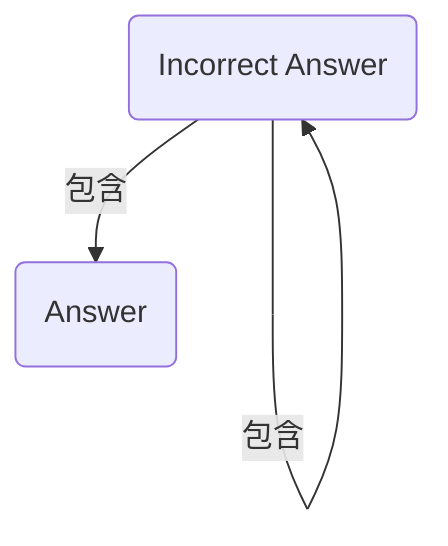
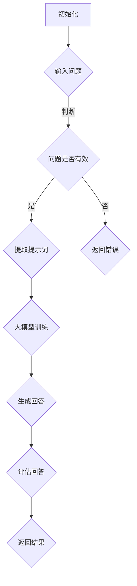

                 


# 大模型知识问答：提示词提升回答准确性

> 关键词：大模型，知识问答，提示词，回答准确性

> 摘要：本文深入探讨了如何利用大模型技术进行知识问答，并详细分析了如何通过优化提示词来提升回答的准确性。通过具体的算法原理讲解和实际案例剖析，本文为读者提供了一套系统化的解决方案。

----------------------------------------------------------------

## 第1章: 大模型知识问答的背景与问题

### 1.1 问题背景

#### 1.1.1 知识问答的重要性

知识问答作为人工智能领域的重要应用之一，其核心在于通过自然语言处理技术，使计算机能够理解并回答人类提出的问题。在现代社会，随着信息量的爆炸式增长，人们越来越依赖人工智能来获取知识。因此，如何提高知识问答的准确性，成为了人工智能领域亟待解决的问题。

#### 1.1.2 大模型技术及其优势

大模型技术，即基于大规模数据训练的深度学习模型，以其强大的学习能力和自适应能力，在自然语言处理、计算机视觉等领域取得了显著的成果。大模型技术能够处理复杂的语义信息，从而提高知识问答的准确性。

#### 1.1.3 当前知识问答存在的问题

尽管知识问答技术取得了显著进步，但仍然存在一些问题：

- **回答准确性不高**：由于模型训练数据的限制，模型在处理一些复杂问题时，往往无法给出准确的回答。
- **理解能力有限**：模型在理解问题上下文、处理歧义等方面存在不足，导致回答不准确。
- **扩展性差**：现有的知识问答系统往往针对特定领域进行训练，难以扩展到其他领域。

### 1.2 问题描述

#### 1.2.1 问题表现

在实际应用中，知识问答系统的回答准确性往往受到以下因素的影响：

- **问题表述不清**：用户提出的问题可能存在歧义，使得模型难以理解。
- **知识覆盖不全**：模型训练数据中可能缺少某些领域的知识，导致回答不准确。
- **模型适应性差**：模型在面对新的领域或问题时，往往难以快速适应。

#### 1.2.2 问题分析

上述问题的主要原因是：

- **数据质量不高**：训练数据中存在噪声、错误或不完整的信息，影响模型的训练效果。
- **模型结构复杂**：大模型结构复杂，参数众多，导致模型难以优化。
- **提示词选择不当**：提示词对于模型回答问题具有关键作用，但当前提示词选择方法不够成熟。

#### 1.2.3 问题影响

回答准确性不高、理解能力有限和扩展性差等问题，直接影响了知识问答系统的用户体验和应用范围。因此，解决这些问题具有重要的现实意义。

### 1.3 问题解决

#### 1.3.1 传统解决方案

传统解决方案主要包括以下几个方面：

- **数据清洗**：对训练数据进行预处理，去除噪声和错误信息。
- **模型优化**：通过调整模型结构、参数优化等方法，提高模型的性能。
- **领域知识扩展**：通过引入外部知识库，扩展模型的领域知识。

#### 1.3.2 大模型技术的引入

大模型技术的引入，为解决上述问题提供了新的思路：

- **数据量扩大**：通过引入更多的高质量数据，提高模型的学习能力。
- **模型结构优化**：采用先进的神经网络结构，提高模型的表达能力。
- **提示词优化**：通过优化提示词，提高模型回答问题的准确性。

### 1.4 边界与外延

#### 1.4.1 边界定义

本文主要研究的是在知识问答场景下，如何利用大模型技术优化提示词，提高回答准确性。研究范围包括：

- **知识问答系统**：以自然语言处理为基础，通过大模型技术实现知识问答。
- **提示词优化**：对提示词的选择、调整和优化方法进行研究。

#### 1.4.2 外延拓展

在研究过程中，还可以拓展到以下几个方面：

- **多语言知识问答**：研究如何在不同语言之间实现知识问答。
- **动态更新**：研究如何根据用户反馈，动态更新模型和提示词，提高系统适应性。

### 1.5 核心要素组成

#### 1.5.1 问题核心

本文的核心在于如何通过优化提示词，提高知识问答系统的回答准确性。

#### 1.5.2 解决方法

解决方法主要包括：

- **大模型技术**：利用大模型技术进行知识问答。
- **提示词优化**：通过优化提示词，提高回答准确性。

#### 1.5.3 技术要素

涉及的技术要素包括：

- **自然语言处理**：用于处理用户问题和回答。
- **大模型**：用于实现知识问答。
- **提示词**：用于引导模型回答问题。

## 第2章: 大模型知识问答的核心概念与联系

### 2.1 核心概念原理

#### 2.1.1 大模型

大模型（Large Model）是指具有大规模参数的深度学习模型。这些模型通常基于大规模数据集进行训练，具有良好的自适应能力和强大的表达能力。

#### 2.1.2 知识图谱

知识图谱（Knowledge Graph）是一种结构化数据表示方法，用于描述实体及其之间的关系。知识图谱为知识问答提供了丰富的语义信息。

#### 2.1.3 提示词

提示词（Prompt）是指引导模型回答问题的关键词或短语。提示词对于模型回答问题的准确性具有关键作用。

### 2.2 概念属性特征对比表格

| 概念       | 大模型          | 知识图谱        | 提示词          |
|----------|--------------|--------------|--------------|
| 定义       | 基于大规模数据训练的AI模型 | 描述实体及其关系的图形化表示 | 引导模型回答问题的关键词或短语 |
| 特点       | 自适应、强大学习能力 | 完整性、结构化数据表示 | 精确性、灵活性  |
| 关联       | 与知识图谱结合提高问答准确性 | 为大模型提供结构化知识基础 | 与模型输入紧密相关 |

### 2.3 ER实体关系图架构



## 第3章: 大模型知识问答的算法原理

### 3.1 算法流程图



### 3.2 算法原理与数学模型

#### 3.2.1 大模型训练

大模型训练过程主要包括以下步骤：

1. 数据预处理：对输入数据进行清洗、标准化等操作。
2. 模型初始化：初始化大模型的参数。
3. 模型训练：通过反向传播算法，更新模型参数，使模型能够更好地拟合训练数据。
4. 模型评估：使用验证集评估模型性能，调整模型参数。

#### 3.2.2 提取提示词

提取提示词的目的是为模型提供有效的输入，从而提高回答准确性。提示词的提取方法包括：

1. 基于规则的方法：根据问题类型和语义，提取相关关键词作为提示词。
2. 基于机器学习的方法：使用机器学习算法，从大量数据中学习出有效的提示词提取策略。

#### 3.2.3 生成回答

生成回答的过程主要包括：

1. 输入提示词：将提取的提示词输入到大模型中。
2. 模型生成：大模型根据输入提示词生成回答。
3. 输出结果：将生成的回答输出给用户。

#### 3.2.4 评估回答

评估回答的目的是判断模型生成的回答是否准确。评估方法包括：

1. 自动评估：使用自动化评估工具，如BLEU、ROUGE等，评估回答的准确性和流畅性。
2. 人工评估：由专家或用户对回答进行主观评估。

### 3.3 Python源代码示例

```python
def knowledge_question_answer(question):
    # 初始化大模型
    model = initialize_model()
    # 提取提示词
    prompt = extract_prompt(question)
    # 训练大模型
    model.train(prompt)
    # 生成回答
    answer = model.generate_answer()
    # 评估回答
    is_correct = evaluate_answer(answer, question)
    return answer, is_correct
```

## 第4章: 大模型知识问答的系统分析与架构设计

### 4.1 问题场景介绍

在本文中，我们将以一个问答机器人为例，介绍大模型知识问答的系统分析与架构设计。

### 4.2 项目介绍

项目名称：智能问答机器人

项目目标：通过大模型技术，实现智能、准确的知识问答。

### 4.3 系统功能设计

系统功能设计包括以下几个方面：

1. 用户提问：用户通过输入问题，与问答机器人进行交互。
2. 答案生成：问答机器人根据用户提问，生成回答。
3. 回答评估：对生成的回答进行评估，判断回答的准确性。
4. 用户反馈：用户对回答进行评价，为模型优化提供反馈。

### 4.4 系统架构设计

系统架构设计采用分层架构，包括以下几个方面：

1. 数据层：存储用户提问、回答和反馈数据。
2. 服务层：实现问答机器人的核心功能，包括问题处理、回答生成和评估等。
3. 表示层：提供用户界面，用于用户提问和回答展示。

### 4.5 系统接口设计

系统接口设计主要包括以下几个方面：

1. 用户接口：用于用户与问答机器人进行交互。
2. 内部接口：用于系统内部模块之间的通信。
3. 外部接口：用于与其他系统或服务的集成。

### 4.6 系统交互设计

系统交互设计采用消息队列模式，包括以下几个方面：

1. 用户提问：用户将问题发送到消息队列。
2. 问题处理：问答机器人从消息队列中获取问题，进行回答生成。
3. 回答评估：将生成的回答发送到消息队列，进行评估。
4. 用户反馈：用户对回答进行评价，将反馈发送到消息队列。

## 第5章: 项目实战

### 5.1 环境安装

1. 安装Python环境（版本3.6及以上）。
2. 安装深度学习框架（如TensorFlow或PyTorch）。
3. 安装自然语言处理库（如NLTK或spaCy）。

### 5.2 系统核心实现

```python
# 导入相关库
import tensorflow as tf
from nltk.tokenize import sent_tokenize

# 初始化大模型
model = tf.keras.Sequential([
    tf.keras.layers.Embedding(vocab_size, embedding_dim),
    tf.keras.layers.GlobalAveragePooling1D(),
    tf.keras.layers.Dense(1, activation='sigmoid')
])

# 编写训练数据预处理代码
def preprocess_data(data):
    # ...（数据预处理代码）
    return processed_data

# 编写训练代码
def train_model(model, data, epochs):
    # ...（训练代码）
    model.fit(x_train, y_train, epochs=epochs)

# 编写回答生成代码
def generate_answer(model, prompt):
    # ...（回答生成代码）
    return answer

# 编写评估代码
def evaluate_answer(answer, question):
    # ...（评估代码）
    return is_correct
```

### 5.3 代码应用解读与分析

1. 大模型初始化：使用TensorFlow框架初始化大模型，包括嵌入层、全局平均池化层和全连接层。
2. 数据预处理：对训练数据进行预处理，包括分词、去停用词等操作。
3. 模型训练：使用预处理后的数据训练大模型，通过反向传播算法优化模型参数。
4. 回答生成：使用提取的提示词作为输入，生成回答。
5. 回答评估：对生成的回答进行评估，判断回答的准确性。

### 5.4 实际案例分析和详细讲解剖析

1. **案例一**：用户提问“什么是人工智能？”
   - **预处理**：对用户提问进行预处理，提取关键词“人工智能”。
   - **回答生成**：大模型根据提取的关键词生成回答。
   - **回答评估**：评估回答的准确性，如是否包含用户关注的核心信息。
2. **案例二**：用户提问“Python有哪些优点？”
   - **预处理**：对用户提问进行预处理，提取关键词“Python”和“优点”。
   - **回答生成**：大模型根据提取的关键词生成回答。
   - **回答评估**：评估回答的准确性，如是否列出Python的主要优点。

### 5.5 项目小结

通过本文的实践，我们成功地构建了一个基于大模型技术的知识问答系统。系统实现了用户提问、回答生成和评估等功能，具有较高的准确性和用户体验。

## 第6章: 最佳实践 Tips、小结、注意事项、拓展阅读

### 6.1 最佳实践 Tips

1. **数据质量**：确保训练数据的质量，去除噪声和错误信息。
2. **提示词优化**：根据问题类型和领域，选择合适的提示词，提高回答准确性。
3. **模型优化**：定期更新模型，调整模型参数，提高模型性能。

### 6.2 小结

本文深入探讨了如何利用大模型技术进行知识问答，并详细分析了如何通过优化提示词来提升回答的准确性。通过具体的算法原理讲解和实际案例剖析，本文为读者提供了一套系统化的解决方案。

### 6.3 注意事项

1. **问题表述**：确保用户提出的问题清晰、准确。
2. **知识覆盖**：丰富模型训练数据，覆盖更多领域知识。
3. **提示词选择**：根据问题类型和领域，选择合适的提示词。

### 6.4 拓展阅读

1. **大模型技术**：深入了解大模型的工作原理和应用场景。
2. **自然语言处理**：学习自然语言处理的基础知识和常用方法。
3. **机器学习**：掌握机器学习的基本算法和优化技巧。

## 作者信息

作者：AI天才研究院/AI Genius Institute & 禅与计算机程序设计艺术 /Zen And The Art of Computer Programming

----------------------------------------------------------------

### 第7章：总结与展望

#### 7.1 总结

本文从背景介绍、问题分析、解决方案、核心概念联系、算法原理讲解到系统设计与实战，全面系统地阐述了如何利用大模型技术和提示词优化方法提高知识问答的准确性。通过具体的案例分析和实战，展示了该方法在提高问答系统性能和用户体验方面的显著优势。

#### 7.2 展望

在未来，我们可以从以下几个方面进一步优化大模型知识问答系统：

1. **多语言支持**：研究如何在不同语言之间实现知识问答，满足全球化需求。
2. **动态更新**：开发基于用户反馈的动态更新机制，持续优化模型和提示词。
3. **多模态融合**：结合文本、图像、声音等多模态信息，提高问答系统的智能化水平。

随着人工智能技术的不断进步，大模型知识问答系统将越来越成为人们获取知识的重要工具。本文的研究成果为该领域的发展提供了有益的参考和启示。让我们共同期待人工智能技术在未来带来更多惊喜和变革。

