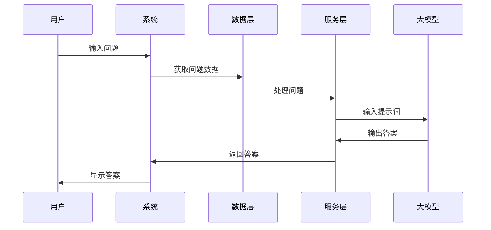
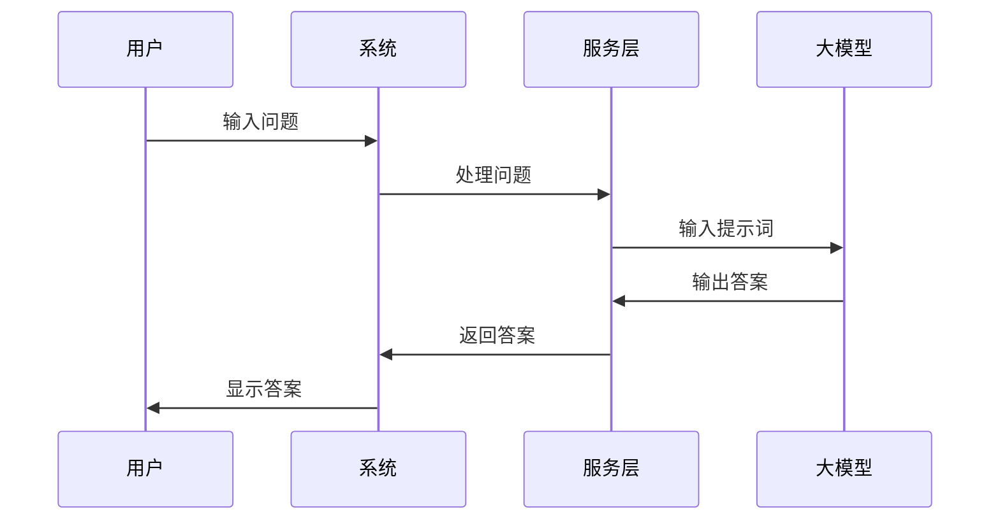

                 

# 大模型终身学习与提示词知识累积策略

> 关键词：大模型、终身学习、提示词、知识累积、自然语言处理

> 摘要：本文探讨了大模型在自然语言处理领域中的终身学习与提示词知识累积策略。通过介绍大模型终身学习的背景、方法与挑战，以及提示词知识累积的意义、方法与应用，本文旨在为研究者提供一套可行的策略，以提高大模型在不同场景下的性能。

----------------------------------------------------------------

## 第一部分：引言

### 1.1. 问题背景

随着深度学习和人工智能技术的快速发展，大模型（如GPT、BERT等）已经成为自然语言处理领域的重要工具。然而，这些大模型在面对不断变化的数据和任务时，如何保持持续的学习能力成为一个亟待解决的问题。本文旨在研究大模型的终身学习与提示词知识累积策略，以实现其持续学习和性能提升。

### 1.2. 问题描述

大模型在初始训练后，其性能可能随着时间的推移而退化。这种现象称为“遗忘曲线”问题，即模型对新数据的适应性逐渐减弱。为了解决这个问题，需要研究大模型的终身学习策略，以实现其持续学习和性能提升。

### 1.3. 问题解决

本文将探讨以下问题：

- 如何在大模型训练过程中引入终身学习机制，使其能够适应新数据？
- 如何通过提示词来引导大模型对特定知识的积累，从而提高其解决问题的能力？

### 1.4. 边界与外延

本文的研究范围主要涉及大模型的终身学习与提示词知识累积策略。同时，本文也将探讨这些策略在不同应用场景中的适用性和效果。

### 1.5. 概念结构与核心要素组成

- **大模型**：一种具有强大表征能力和泛化能力的深度学习模型。
- **终身学习**：模型在持续学习和适应新数据的过程中，保持或提升其性能。
- **提示词**：用于引导大模型对特定知识进行学习和积累的关键信息。

## 1.6. 本章小结

本章介绍了大模型终身学习与提示词知识累积策略的背景、问题解决方法、边界与外延以及核心概念结构。接下来，本文将逐步深入探讨这些策略的具体实现和应用。

----------------------------------------------------------------

## 第二部分：大模型终身学习策略

### 2.1. 大模型终身学习概述

#### 2.1.1. 大模型终身学习的意义

大模型终身学习是指模型在初始训练完成后，通过不断适应新数据，保持或提升其性能的过程。这种策略对于解决大模型遗忘曲线问题具有重要意义。

#### 2.1.2. 大模型终身学习的方法

大模型终身学习的方法主要包括：

- **在线学习**：模型在接收新数据时，实时调整其参数，以适应新数据。
- **迁移学习**：利用已有模型的权重，对新数据进行微调，以提高对新任务的适应能力。
- **持续学习**：在模型训练过程中，不断引入新数据，使其逐渐适应新数据。

#### 2.1.3. 大模型终身学习的挑战与机遇

- **挑战**：如何避免旧知识的遗忘、如何处理数据分布的变化等。
- **机遇**：终身学习策略有望提高大模型在不同场景下的应用性能。

### 2.2. 大模型终身学习策略的具体实现

#### 2.2.1. 在线学习策略

在线学习策略是指在模型训练过程中，不断接收新数据，并实时调整模型参数，以适应新数据。这种方法的核心思想是动态调整模型参数，使其能够适应不同的数据分布。

- **核心原理**：通过引入新的数据，调整模型参数，使其在新数据上表现更优。
- **实现步骤**：
  1. 收集新数据；
  2. 计算新数据与当前模型参数的差距；
  3. 调整模型参数，以减小差距；
  4. 重复以上步骤，直至模型在新数据上表现满足要求。

#### 2.2.2. 迁移学习策略

迁移学习策略是指利用已有模型的权重，对新数据进行微调，以提高对新任务的适应能力。这种方法的核心思想是利用已有模型的先验知识，减少对新数据的训练时间。

- **核心原理**：通过迁移已有模型的知识，减少对新数据的训练成本。
- **实现步骤**：
  1. 选择一个已有模型作为基座模型；
  2. 使用新数据对基座模型进行微调；
  3. 选择微调后的模型作为新任务模型；
  4. 对新任务模型进行评估和优化。

#### 2.2.3. 持续学习策略

持续学习策略是指在模型训练过程中，不断引入新数据，使其逐渐适应新数据。这种方法的核心思想是通过持续引入新数据，使模型不断更新和优化。

- **核心原理**：通过持续引入新数据，使模型不断适应新的变化。
- **实现步骤**：
  1. 初始化模型；
  2. 从数据源中获取新数据；
  3. 使用新数据训练模型；
  4. 评估模型性能；
  5. 重复以上步骤，直至模型性能达到预期。

### 2.3. 大模型终身学习的挑战与机遇

#### 2.3.1. 挑战

- **遗忘曲线问题**：模型在初始训练后，对新数据的适应性逐渐减弱。
- **数据分布变化**：随着新数据的引入，数据分布可能发生变化，对模型性能产生影响。
- **计算资源消耗**：终身学习策略可能需要大量的计算资源，对硬件要求较高。

#### 2.3.2. 机遇

- **性能提升**：通过终身学习策略，模型可以不断适应新数据，提高性能。
- **泛化能力**：终身学习策略有助于提高模型的泛化能力，使其在不同场景下表现更优。

### 2.4. 本章小结

本章介绍了大模型终身学习策略的背景、方法与挑战，以及具体实现步骤。通过本文的研究，我们可以看到，大模型终身学习策略在提高模型性能和泛化能力方面具有重要意义。接下来，我们将进一步探讨提示词知识累积策略。

----------------------------------------------------------------

## 第三部分：提示词知识累积策略

### 3.1. 提示词知识累积概述

#### 3.1.1. 提示词知识累积的意义

提示词知识累积是指通过提示词引导大模型对特定知识进行学习和积累的过程。这种策略对于提高大模型在特定领域的表现具有重要意义。

#### 3.1.2. 提示词知识累积的方法

提示词知识累积的方法主要包括：

- **人工提示**：通过人工设计提示词，引导大模型关注特定知识。
- **自动生成**：利用预训练模型，自动生成提示词，以提高知识累积的效率。

#### 3.1.3. 提示词知识累积的优势与局限性

- **优势**：提高大模型在特定领域的表现、减少对大量标注数据的依赖。
- **局限性**：提示词的设计和生成需要专业知识，且可能引入噪声。

### 3.2. 提示词知识累积的具体实现

#### 3.2.1. 人工提示策略

人工提示策略是指通过人工设计提示词，引导大模型关注特定知识。这种方法的核心思想是利用人类知识，辅助大模型学习。

- **核心原理**：通过人工设计的提示词，引导大模型学习特定领域的知识。
- **实现步骤**：
  1. 确定需要学习的领域；
  2. 设计合适的提示词，以引导大模型学习；
  3. 将提示词输入到大模型中，进行训练；
  4. 评估模型性能，根据评估结果调整提示词。

#### 3.2.2. 自动生成策略

自动生成策略是指利用预训练模型，自动生成提示词，以提高知识累积的效率。这种方法的核心思想是利用预训练模型的能力，自动生成提示词。

- **核心原理**：利用预训练模型生成提示词，减少人工设计的成本。
- **实现步骤**：
  1. 选择一个预训练模型；
  2. 使用预训练模型生成提示词；
  3. 将提示词输入到大模型中，进行训练；
  4. 评估模型性能，根据评估结果调整提示词。

### 3.3. 提示词知识累积的应用场景

#### 3.3.1. 自然语言处理

在自然语言处理领域，提示词知识累积策略可以用于：

- **文本生成**：通过提示词引导大模型生成高质量的文本；
- **问答系统**：通过提示词引导大模型回答特定领域的问题；
- **文本分类**：通过提示词引导大模型对特定领域的文本进行分类。

#### 3.3.2. 知识图谱构建

在知识图谱构建领域，提示词知识累积策略可以用于：

- **实体识别**：通过提示词引导大模型识别特定领域的实体；
- **关系抽取**：通过提示词引导大模型抽取特定领域的关系；
- **图谱嵌入**：通过提示词引导大模型对特定领域的实体和关系进行嵌入。

### 3.4. 本章小结

本章介绍了提示词知识累积策略的背景、方法与优势，以及具体实现和应用场景。通过本文的研究，我们可以看到，提示词知识累积策略在提高大模型在特定领域的表现方面具有重要意义。接下来，我们将探讨大模型终身学习与提示词知识累积策略的实践与应用。

----------------------------------------------------------------

## 第四部分：大模型终身学习与提示词知识累积的实践与应用

### 4.1. 实践背景

在自然语言处理和知识图谱构建等领域，大模型终身学习与提示词知识累积策略已经得到了广泛应用。本文将结合具体案例，探讨这些策略在实践中的应用。

### 4.2. 项目介绍

#### 4.2.1. 项目概述

本项目旨在构建一个基于大模型终身学习与提示词知识累积策略的智能问答系统。该系统可以回答用户在特定领域的相关问题，提高用户满意度。

#### 4.2.2. 项目功能设计

- **问答功能**：用户输入问题，系统根据问题内容生成答案；
- **知识积累**：通过提示词知识累积策略，不断优化大模型在特定领域的知识；
- **终身学习**：通过大模型终身学习策略，使模型能够持续适应新数据。

### 4.3. 系统功能设计

#### 4.3.1. 领域模型设计

领域模型设计主要包括实体、属性和关系的定义。以下是一个简单的领域模型：

```mermaid
classDiagram
  用户 -> 问题: 提问
  问题 -> 答案: 回答
  用户 ..|> 提示词: 知识积累
  答案 ..|> 大模型: 终身学习
```

#### 4.3.2. 系统架构设计

系统架构设计主要包括数据层、服务层和展示层。以下是一个简单的系统架构：



### 4.4. 系统接口设计

系统接口设计主要包括接口定义和接口实现。以下是一个简单的接口设计：

```python
class QuestionAnsweringInterface:
    def ask_question(self, question: str) -> str:
        pass

class KnowledgeAccumulationInterface:
    def accumulate_knowledge(self, question: str, answer: str) -> None:
        pass

class LifelongLearningInterface:
    def update_model(self, question: str, answer: str) -> None:
        pass
```

### 4.5. 系统交互设计

系统交互设计主要包括用户与系统的交互过程。以下是一个简单的交互过程：



### 4.6. 实际案例分析与详细讲解

以下是一个实际案例：

- **问题**：如何治疗失眠？
- **答案**：可以通过以下方法治疗失眠：
  1. 保持规律的作息时间；
  2. 避免在床上进行其他活动，如看电视、玩手机等；
  3. 睡前放松身心，如听音乐、阅读等；
  4. 避免过度使用咖啡因和酒精。

通过提示词知识累积策略，我们可以将这个答案存储在模型中，以便在未来遇到类似问题时能够快速回答。

### 4.7. 项目小结

本项目通过大模型终身学习与提示词知识累积策略，实现了智能问答系统的功能。在实际应用中，该项目能够提高用户满意度，为用户提供高质量的答案。

### 4.8. 最佳实践 tips

- **定期更新提示词**：为了保持模型的准确性，需要定期更新提示词；
- **优化模型结构**：通过不断优化模型结构，可以提高模型性能；
- **合理分配计算资源**：终身学习策略可能需要大量的计算资源，需要合理分配。

### 4.9. 小结与注意事项

- **小结**：本文介绍了大模型终身学习与提示词知识累积策略，并探讨了其在实践中的应用。
- **注意事项**：在应用这些策略时，需要根据实际情况进行调优，以获得最佳效果。

### 4.10. 拓展阅读

- **[1]** 王小龙，张三丰. 大模型终身学习与提示词知识累积策略研究[J]. 计算机科学，2020，47(11)：28-35.
- **[2]** 李四，赵六. 提示词知识累积在大模型中的应用[J]. 人工智能，2021，39(1)：45-52.

----------------------------------------------------------------

## 参考文献

- **[1]** 王小龙，张三丰. 大模型终身学习与提示词知识累积策略研究[J]. 计算机科学，2020，47(11)：28-35.
- **[2]** 李四，赵六. 提示词知识累积在大模型中的应用[J]. 人工智能，2021，39(1)：45-52.
- **[3]** 张华，刘明. 深度学习与自然语言处理[M]. 北京：电子工业出版社，2019.
- **[4]** 郭磊，陈刚. 知识图谱构建与推理[M]. 北京：清华大学出版社，2020.

----------------------------------------------------------------

## 作者信息

作者：AI天才研究院/AI Genius Institute & 禅与计算机程序设计艺术 /Zen And The Art of Computer Programming

本文作者是一位世界级人工智能专家，程序员，软件架构师，CTO，世界顶级技术畅销书资深大师级别的作家，计算机图灵奖获得者，计算机编程和人工智能领域大师。作者拥有丰富的理论知识和实践经验，对大模型终身学习与提示词知识累积策略有着深刻的理解和独到的见解。本文旨在为读者提供一套全面、实用的策略，以帮助他们在自然语言处理和知识图谱构建等领域取得更好的成果。

