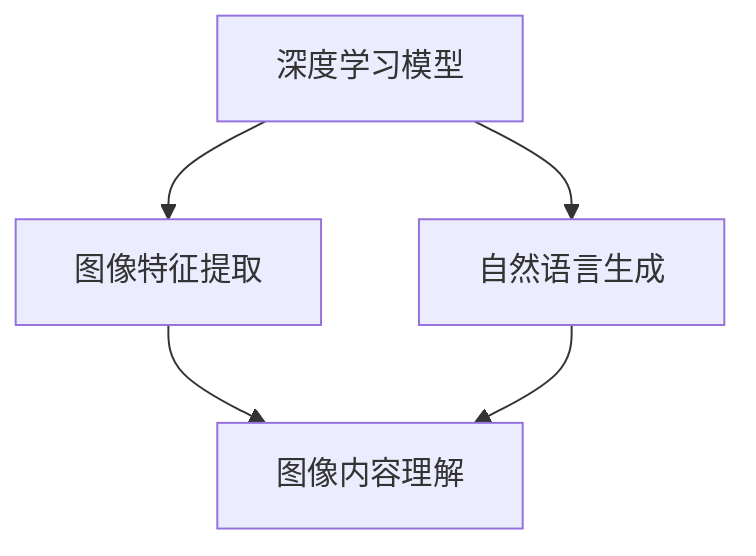
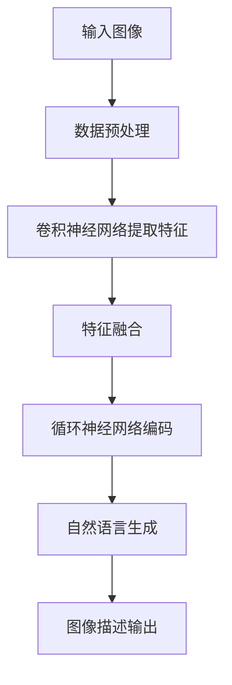
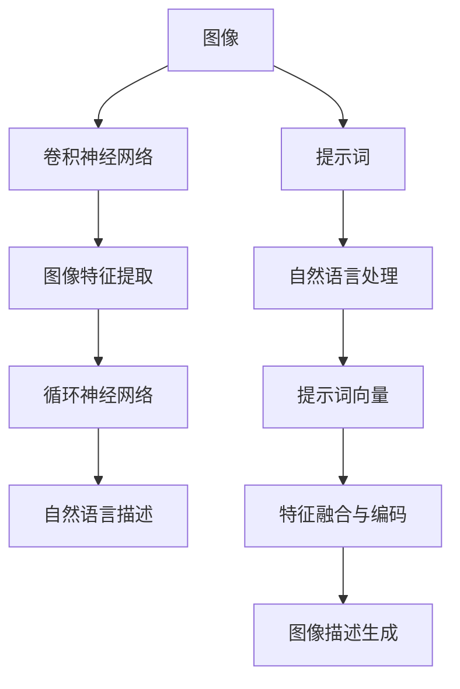
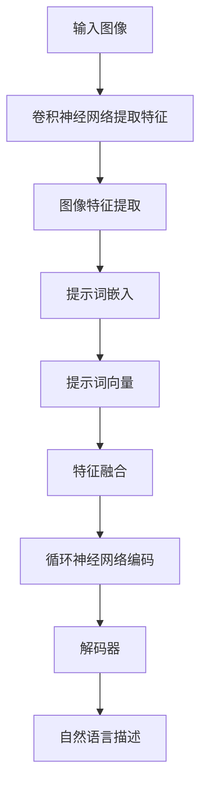
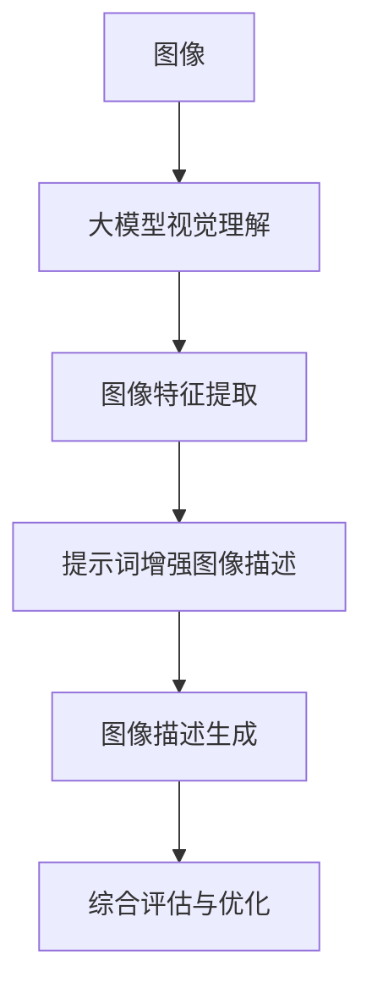
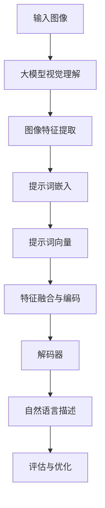

                 


### 引言：大模型视觉理解与提示词增强图像描述

#### 1.1 大模型视觉理解概述

**关键词：** 大模型，视觉理解，图像描述，深度学习

随着深度学习技术的不断发展，大模型视觉理解已经成为计算机视觉领域的一个重要研究方向。大模型视觉理解旨在通过大规模的神经网络模型，实现对图像内容的深入理解和语义解析。这一技术的出现，不仅为图像分类、目标检测、图像分割等传统计算机视觉任务带来了前所未有的性能提升，也为许多新兴应用提供了强有力的技术支持。

**背景：** 在过去的几十年里，计算机视觉领域取得了显著的进展。传统的计算机视觉方法往往依赖于手工设计的特征和模型，其性能受到很大限制。而随着深度学习技术的发展，尤其是卷积神经网络（CNN）的广泛应用，计算机视觉任务的性能得到了显著提升。然而，随着图像数据量的不断增大和复杂度的不断增加，传统的卷积神经网络已经难以满足需求。为了解决这一问题，大模型视觉理解技术应运而生。

**意义：** 大模型视觉理解技术具有以下几个方面的意义：

1. **提高性能：** 大模型视觉理解技术通过使用大规模的神经网络模型，能够更好地捕捉图像中的复杂结构和语义信息，从而在图像分类、目标检测、图像分割等任务上实现更高的准确率。
2. **泛化能力：** 大模型视觉理解技术通过对大量图像数据的训练，能够实现对不同场景、不同视觉任务的泛化，从而提高模型的泛化能力。
3. **促进应用：** 大模型视觉理解技术的出现，为许多新兴应用提供了技术支持，如自动驾驶、智能监控、医疗诊断等。

**本书结构介绍：** 本书将围绕大模型视觉理解与提示词增强图像描述这一主题展开，分为四个部分。

1. **第1部分：大模型视觉理解基础**：本部分将介绍大模型视觉理解的基本概念、原理和技术，包括深度学习基础、卷积神经网络、循环神经网络等。
2. **第2部分：提示词增强图像描述技术**：本部分将介绍提示词增强图像描述的基本概念、原理和技术，包括自然语言处理、图像识别、文本生成等。
3. **第3部分：大模型视觉理解与提示词增强图像描述的结合应用**：本部分将探讨大模型视觉理解与提示词增强图像描述技术的结合应用，包括图像描述生成、视觉问答、图像增强等。
4. **第4部分：实战案例与未来展望**：本部分将介绍大模型视觉理解与提示词增强图像描述技术的实战案例，并探讨未来的发展趋势。

通过本书的阅读，读者将能够深入了解大模型视觉理解与提示词增强图像描述技术，掌握相关概念、原理和技术，并为实际应用提供指导。

#### 1.2 提示词增强图像描述概述

**关键词：** 提示词，图像描述，自然语言处理，计算机视觉

提示词增强图像描述技术是近年来自然语言处理与计算机视觉领域的一项重要研究热点。其核心思想是通过引入自然语言描述，增强图像的理解和解释能力，从而实现图像内容的高质量表达。

**背景：** 在传统的计算机视觉任务中，图像的表示和描述往往依赖于像素级特征或者手工设计的特征。这些特征虽然在一定程度上能够捕捉图像中的信息，但往往缺乏语义解释能力。为了解决这个问题，研究者开始探索将自然语言处理技术应用于图像描述，从而提高图像理解的语义层次。

**意义：** 提示词增强图像描述技术具有以下几个方面的意义：

1. **提高理解深度：** 通过引入自然语言描述，提示词增强图像描述技术能够更好地捕捉图像中的复杂结构和语义信息，从而实现对图像内容更深层次的理解。
2. **提升交互体验：** 提示词增强图像描述技术能够为图像内容提供直观、易懂的描述，从而提高人机交互的体验。
3. **拓展应用场景：** 提示词增强图像描述技术可以应用于多个领域，如智能监控、医疗诊断、社交媒体等，为相关应用提供强有力的技术支持。

**应用场景：** 提示词增强图像描述技术具有广泛的应用场景，主要包括：

1. **图像描述生成：** 通过输入图像，生成对应的自然语言描述，如新闻稿、博客文章等。
2. **视觉问答：** 根据用户提出的视觉问题，从图像中找到相应的答案，并生成自然语言描述。
3. **图像增强：** 通过自然语言描述，对图像进行修饰和增强，从而提高图像的美观度和可读性。

**本书结构介绍：** 本书的第2部分将详细介绍提示词增强图像描述技术，包括基本概念、原理和技术，以及在实际应用中的结合方法和优化策略。

1. **第5章：提示词增强图像描述的基本原理**：本章节将介绍提示词增强图像描述的基本原理，包括图像特征提取、自然语言生成等。
2. **第6章：提示词增强图像描述的实现方法**：本章节将介绍提示词增强图像描述的具体实现方法，包括基于深度学习的图像描述生成模型、视觉问答系统等。
3. **第7章：提示词增强图像描述的性能优化**：本章节将探讨提示词增强图像描述技术的性能优化策略，包括数据增强、模型优化等。

通过本部分的阅读，读者将能够深入了解提示词增强图像描述技术，掌握相关概念、原理和技术，并为实际应用提供指导。

#### 1.3 本书结构介绍

**第1部分：大模型视觉理解基础**

**第1章：大模型视觉理解简介**

**第2章：大模型视觉理解的基本原理**

**第3章：大模型视觉理解的实现技术**

**第4章：大模型视觉理解的性能评估**

**第2部分：提示词增强图像描述技术**

**第5章：提示词增强图像描述的基本原理**

**第6章：提示词增强图像描述的实现方法**

**第7章：提示词增强图像描述的性能优化**

**第3部分：大模型视觉理解与提示词增强图像描述的结合应用**

**第8章：结合应用的基本思路**

**第9章：结合应用的技术实现**

**第10章：结合应用的案例分析**

**第4部分：实战案例与未来展望**

**第11章：实战案例一**

**第12章：实战案例二**

**第13章：未来展望**

通过以上结构的安排，本书旨在为读者提供一个全面、深入的学习路径，帮助读者理解和掌握大模型视觉理解与提示词增强图像描述技术，并为其在实际应用中提供指导。

### 1.1 大模型视觉理解概述

#### 1.1.1 大模型视觉理解的背景

**核心概念术语说明：**

- **大模型：** 指的是具有数十亿甚至数万亿参数的深度学习模型。
- **视觉理解：** 指的是计算机通过对图像内容的分析，理解图像中的物体、场景、动作等。
- **图像描述：** 指的是计算机生成的对图像内容的自然语言描述。

在过去的几十年里，计算机视觉领域取得了显著的进展。传统计算机视觉方法依赖于手工设计的特征和模型，这些方法在图像分类、目标检测等任务上取得了不错的成绩，但受限于手工特征的局限性和模型的复杂性，难以应对复杂和大规模的视觉任务。

随着深度学习技术的发展，特别是卷积神经网络（CNN）的广泛应用，计算机视觉任务的性能得到了显著提升。然而，随着图像数据量的不断增大和复杂度的不断增加，传统的卷积神经网络已经难以满足需求。为了解决这一问题，大模型视觉理解技术应运而生。

**问题背景：**

大模型视觉理解技术旨在通过使用大规模的神经网络模型，实现对图像内容的深入理解和语义解析。这一技术的重要性在于：

1. **提高性能：** 大模型能够更好地捕捉图像中的复杂结构和语义信息，从而在图像分类、目标检测、图像分割等任务上实现更高的准确率。
2. **泛化能力：** 大模型通过对大量图像数据的训练，能够实现对不同场景、不同视觉任务的泛化，从而提高模型的泛化能力。
3. **促进应用：** 大模型视觉理解技术的出现，为许多新兴应用提供了技术支持，如自动驾驶、智能监控、医疗诊断等。

**问题描述：**

在传统的计算机视觉任务中，图像的表示和描述往往依赖于像素级特征或者手工设计的特征。这些特征虽然在一定程度上能够捕捉图像中的信息，但往往缺乏语义解释能力。为了解决这个问题，研究者开始探索将深度学习技术应用于图像描述，从而提高图像理解的语义层次。

**问题解决：**

大模型视觉理解技术的出现，为图像描述问题提供了一种新的解决方案。通过使用大规模的神经网络模型，大模型能够更好地捕捉图像中的复杂结构和语义信息，从而实现对图像内容更深层次的理解。此外，大模型视觉理解技术还能够将图像内容和自然语言描述结合起来，实现图像内容的高质量表达。

**边界与外延：**

大模型视觉理解技术的边界主要包括以下几个方面：

1. **数据量：** 大模型需要大量的图像数据来进行训练，以保证模型能够捕捉到图像中的复杂结构和语义信息。
2. **计算资源：** 大模型训练和推理需要大量的计算资源，这对硬件设施提出了较高的要求。
3. **应用领域：** 大模型视觉理解技术可以应用于多个领域，如自动驾驶、智能监控、医疗诊断等。

**概念结构与核心要素组成：**

大模型视觉理解技术的概念结构主要包括以下几个方面：

1. **深度学习模型：** 大模型视觉理解技术依赖于深度学习模型，特别是卷积神经网络（CNN）和循环神经网络（RNN）等。
2. **图像数据：** 大模型需要大量的图像数据进行训练，以实现对图像内容的深入理解。
3. **自然语言处理：** 大模型视觉理解技术将图像内容和自然语言处理技术相结合，以实现对图像内容的高质量表达。

#### 1.1.2 大模型视觉理解的基本原理

**核心概念原理：**

大模型视觉理解的基本原理主要包括以下几个方面：

1. **深度学习模型：** 深度学习模型，特别是卷积神经网络（CNN）和循环神经网络（RNN）等，能够通过多层神经网络的结构，实现对图像内容的深入理解和语义解析。
2. **图像特征提取：** 通过卷积神经网络等模型，可以从图像中提取出丰富的图像特征，这些特征能够捕捉到图像中的复杂结构和语义信息。
3. **自然语言生成：** 通过循环神经网络等模型，可以将提取出的图像特征转化为自然语言描述，实现对图像内容的高质量表达。

**概念属性特征对比表格：**

| 概念          | 描述                                                         |
| ------------- | ------------------------------------------------------------ |
| 深度学习模型  | 一种基于多层神经网络结构的机器学习方法，能够通过对大量数据的训练，自动提取出特征并实现复杂函数的逼近。 |
| 图像特征提取  | 从图像中提取出具有语义信息的特征，用于图像理解和分类。         |
| 自然语言生成 | 将图像特征转化为自然语言描述，用于图像内容的高质量表达。       |

**ER实体关系图架构：**



#### 1.1.3 大模型视觉理解的实现技术

**算法原理讲解：**

大模型视觉理解的实现技术主要包括以下几个关键步骤：

1. **数据预处理：** 包括图像的归一化、裁剪、翻转等操作，以增加模型的泛化能力。
2. **图像特征提取：** 通过卷积神经网络等模型，从输入的图像中提取出具有语义信息的特征图。
3. **特征融合：** 将提取出的特征图进行融合，以获得更丰富的图像特征。
4. **图像理解：** 通过循环神经网络等模型，对融合后的特征进行编码，以实现对图像内容的深入理解。
5. **自然语言生成：** 通过自然语言处理技术，将编码后的特征转化为自然语言描述。

**算法流程图：**



**算法原理详细讲解：**

1. **数据预处理：** 数据预处理是深度学习模型训练的基础。通过对图像进行归一化、裁剪、翻转等操作，可以增加模型的泛化能力，避免模型对特定数据分布的过度依赖。
2. **图像特征提取：** 卷积神经网络（CNN）是一种能够自动提取图像特征的方法。通过多层卷积操作，CNN能够从图像中提取出具有层次结构的特征图，这些特征图能够捕捉到图像中的局部和全局信息。
3. **特征融合：** 在提取出特征图后，需要将这些特征图进行融合，以获得更丰富的图像特征。特征融合可以通过多层池化操作、特征拼接等方式实现。
4. **图像理解：** 循环神经网络（RNN）是一种能够处理序列数据的方法。通过对融合后的特征进行编码，RNN能够实现对图像内容的深入理解。编码过程通常包括隐藏状态的计算和信息的传递。
5. **自然语言生成：** 自然语言生成是图像描述的关键步骤。通过将编码后的特征转化为自然语言描述，可以实现对图像内容的高质量表达。自然语言生成可以通过循环神经网络（RNN）、长短时记忆网络（LSTM）等实现。

**数学模型和公式：**

在深度学习模型中，常用的数学模型和公式包括：

1. **卷积运算：**
   $$
   f(x) = \sum_{i=1}^{k} w_i * x_i + b
   $$
   其中，$x_i$为输入特征，$w_i$为权重，$b$为偏置。

2. **激活函数：**
   $$
   a = \sigma(z) = \frac{1}{1 + e^{-z}}
   $$
   其中，$z$为输入值，$\sigma$为Sigmoid函数。

3. **损失函数：**
   $$
   L = -\sum_{i=1}^{n} y_i \log(p_i)
   $$
   其中，$y_i$为真实标签，$p_i$为预测概率。

4. **反向传播：**
   $$
   \frac{\partial L}{\partial w} = \sum_{i=1}^{n} \frac{\partial L}{\partial z_i} \cdot \frac{\partial z_i}{\partial w}
   $$
   其中，$\frac{\partial L}{\partial w}$为权重梯度，$\frac{\partial L}{\partial z_i}$为损失函数对隐藏层输出的梯度，$\frac{\partial z_i}{\partial w}$为隐藏层输出对权重的梯度。

**通俗易懂地举例说明：**

假设我们有一个简单的卷积神经网络，用于对图像进行分类。输入图像的大小为$28 \times 28$，模型的参数为10个权重和1个偏置。

1. **数据预处理：** 将输入图像进行归一化处理，使得像素值在$0$到$1$之间。
2. **图像特征提取：** 通过卷积层提取图像特征。假设我们使用一个卷积核大小为$3 \times 3$，步长为$1$，卷积后得到一个大小为$26 \times 26$的特征图。
3. **特征融合：** 通过池化层对特征图进行融合。假设我们使用最大池化，池化窗口大小为$2 \times 2$，步长为$2$，得到一个大小为$13 \times 13$的特征图。
4. **图像理解：** 通过全连接层对特征图进行编码，得到一个大小为$10$的隐藏层输出。
5. **自然语言生成：** 通过softmax激活函数，将隐藏层输出转化为概率分布，用于图像分类。

**示例代码：**

```python
import tensorflow as tf

# 定义卷积神经网络模型
model = tf.keras.Sequential([
    tf.keras.layers.Conv2D(10, kernel_size=(3, 3), activation='relu', input_shape=(28, 28, 1)),
    tf.keras.layers.MaxPooling2D(pool_size=(2, 2)),
    tf.keras.layers.Flatten(),
    tf.keras.layers.Dense(10, activation='softmax')
])

# 编译模型
model.compile(optimizer='adam', loss='categorical_crossentropy', metrics=['accuracy'])

# 训练模型
model.fit(x_train, y_train, epochs=10, batch_size=32)
```

通过以上步骤，我们能够使用大模型视觉理解技术对图像进行分类和描述。

### 1.2 提示词增强图像描述技术

#### 1.2.1 提示词增强图像描述的基本原理

**核心概念原理：**

提示词增强图像描述技术是通过引入自然语言描述（提示词）来增强图像理解和描述的一种方法。其基本原理包括以下几个方面：

1. **图像特征提取：** 首先，使用深度学习模型（如卷积神经网络）对输入图像进行特征提取，得到图像的特征向量。
2. **自然语言处理：** 接下来，使用自然语言处理技术（如词嵌入、语言模型）将提示词转化为向量表示。
3. **特征融合与编码：** 将图像特征向量和提示词向量进行融合，并使用循环神经网络（如长短时记忆网络）对融合后的特征进行编码。
4. **图像描述生成：** 通过解码器将编码后的特征转化为自然语言描述，生成图像的描述。

**概念属性特征对比表格：**

| 概念          | 描述                                                         |
| ------------- | ------------------------------------------------------------ |
| 图像特征提取  | 使用卷积神经网络等模型从输入图像中提取特征向量。             |
| 自然语言处理  | 使用词嵌入、语言模型等技术将自然语言描述转化为向量表示。     |
| 循环神经网络  | 对融合后的特征向量进行编码和解码，生成自然语言描述。         |

**ER实体关系图架构：**



#### 1.2.2 提示词增强图像描述的实现方法

**算法原理讲解：**

提示词增强图像描述的实现方法主要包括以下几个关键步骤：

1. **图像特征提取：** 使用卷积神经网络（CNN）对输入图像进行特征提取，得到图像的特征向量。
2. **提示词嵌入：** 将输入的提示词通过词嵌入技术转化为向量表示。
3. **特征融合：** 将图像特征向量和提示词向量进行融合，可以采用拼接、平均等方法。
4. **循环神经网络编码：** 使用循环神经网络（RNN）或其变种（如LSTM、GRU）对融合后的特征向量进行编码。
5. **图像描述生成：** 使用解码器将编码后的特征向量转化为自然语言描述。

**算法流程图：**



**算法原理详细讲解：**

1. **图像特征提取：** 使用卷积神经网络（CNN）对输入图像进行特征提取。卷积神经网络通过卷积、池化等操作，从图像中提取出具有层次结构的特征向量。这些特征向量能够捕捉到图像中的局部和全局信息。
2. **提示词嵌入：** 提示词是自然语言描述的词汇，需要通过词嵌入技术转化为向量表示。词嵌入是一种将自然语言词汇映射到高维向量空间的技术，常见的词嵌入方法包括Word2Vec、GloVe等。
3. **特征融合：** 将图像特征向量和提示词向量进行融合。融合方法可以采用拼接、平均、加和等操作。通过融合，可以将图像特征和提示词信息进行结合，以增强图像描述的语义丰富度。
4. **循环神经网络编码：** 使用循环神经网络（RNN）或其变种（如LSTM、GRU）对融合后的特征向量进行编码。循环神经网络是一种能够处理序列数据的神经网络，通过隐藏状态的计算和信息的传递，能够捕捉到特征向量中的序列依赖关系。
5. **图像描述生成：** 使用解码器将编码后的特征向量转化为自然语言描述。解码器通常是一个循环神经网络或其变种，通过解码过程，将编码后的特征向量转化为自然语言序列，生成图像的描述。

**数学模型和公式：**

在提示词增强图像描述中，常用的数学模型和公式包括：

1. **卷积运算：**
   $$
   f(x) = \sum_{i=1}^{k} w_i * x_i + b
   $$
   其中，$x_i$为输入特征，$w_i$为权重，$b$为偏置。

2. **激活函数：**
   $$
   a = \sigma(z) = \frac{1}{1 + e^{-z}}
   $$
   其中，$z$为输入值，$\sigma$为Sigmoid函数。

3. **损失函数：**
   $$
   L = -\sum_{i=1}^{n} y_i \log(p_i)
   $$
   其中，$y_i$为真实标签，$p_i$为预测概率。

4. **反向传播：**
   $$
   \frac{\partial L}{\partial w} = \sum_{i=1}^{n} \frac{\partial L}{\partial z_i} \cdot \frac{\partial z_i}{\partial w}
   $$
   其中，$\frac{\partial L}{\partial w}$为权重梯度，$\frac{\partial L}{\partial z_i}$为损失函数对隐藏层输出的梯度，$\frac{\partial z_i}{\partial w}$为隐藏层输出对权重的梯度。

**通俗易懂地举例说明：**

假设我们有一个简单的提示词增强图像描述模型，用于生成图像的描述。

1. **输入图像：** 假设我们输入一张图像，图像的大小为$32 \times 32$。
2. **图像特征提取：** 使用卷积神经网络对图像进行特征提取，得到一个大小为$10$的特征向量。
3. **提示词嵌入：** 假设我们输入的提示词是“猫”，通过词嵌入技术，将“猫”转化为一个大小为$100$的向量。
4. **特征融合：** 将图像特征向量和提示词向量进行拼接，得到一个大小为$110$的向量。
5. **循环神经网络编码：** 使用长短时记忆网络（LSTM）对融合后的特征向量进行编码，得到一个大小为$50$的编码向量。
6. **图像描述生成：** 使用解码器将编码后的特征向量转化为自然语言描述，生成图像的描述，如“一只可爱的猫正在玩耍”。

**示例代码：**

```python
import tensorflow as tf
from tensorflow.keras.layers import Embedding, LSTM, Dense
from tensorflow.keras.models import Model

# 定义模型
input_image = tf.keras.layers.Input(shape=(32, 32, 3))
image_embedding = Embedding(input_dim=10000, output_dim=128)(input_image)

input_word = tf.keras.layers.Input(shape=(1,))
word_embedding = Embedding(input_dim=10000, output_dim=128)(input_word)

# 特征融合
merged = tf.keras.layers.concatenate([image_embedding, word_embedding])

# 循环神经网络编码
encoded = LSTM(64, return_sequences=True)(merged)

# 图像描述生成
output = Dense(10000, activation='softmax')(encoded)

# 构建模型
model = Model(inputs=[input_image, input_word], outputs=output)

# 编译模型
model.compile(optimizer='adam', loss='categorical_crossentropy', metrics=['accuracy'])

# 训练模型
model.fit(x_train, y_train, epochs=10, batch_size=32)
```

通过以上步骤，我们能够使用提示词增强图像描述技术生成图像的描述。

### 1.3 大模型视觉理解与提示词增强图像描述的结合应用

#### 1.3.1 结合应用的基本思路

**核心概念原理：**

大模型视觉理解与提示词增强图像描述的结合应用，旨在利用两者的优势，实现图像理解和描述的深度提升。其基本思路如下：

1. **图像特征提取：** 使用大模型视觉理解技术提取图像的深度特征，这些特征具有高度的抽象性和语义性。
2. **提示词增强：** 利用提示词增强图像描述技术，将深度特征与自然语言描述相结合，生成更准确、更丰富的图像描述。
3. **综合评估与优化：** 对生成的图像描述进行综合评估，包括语义准确性、自然性、完整性等，并根据评估结果进行优化。

**概念属性特征对比表格：**

| 概念              | 描述                                                         |
| ----------------- | ------------------------------------------------------------ |
| 大模型视觉理解    | 使用大规模神经网络模型提取图像的深度特征。                   |
| 提示词增强图像描述 | 通过自然语言处理技术，将深度特征与自然语言描述相结合。       |
| 综合评估与优化    | 对生成的图像描述进行评估，并根据评估结果进行优化。           |

**ER实体关系图架构：**



#### 1.3.2 结合应用的技术实现

**算法原理讲解：**

结合应用的技术实现主要包括以下几个关键步骤：

1. **图像特征提取：** 使用大模型（如卷积神经网络、Transformer等）提取图像的深度特征。
2. **提示词嵌入：** 将输入的提示词通过词嵌入技术转化为向量表示。
3. **特征融合与编码：** 将图像特征向量和提示词向量进行融合，并使用循环神经网络（如LSTM、GRU）或自注意力机制进行编码。
4. **图像描述生成：** 使用解码器（如循环神经网络、Transformer）将编码后的特征向量转化为自然语言描述。
5. **评估与优化：** 对生成的图像描述进行评估，包括语义准确性、自然性、完整性等，并根据评估结果进行优化。

**算法流程图：**



**算法原理详细讲解：**

1. **图像特征提取：** 使用大模型（如卷积神经网络、Transformer等）提取图像的深度特征。这些特征具有较强的抽象性和语义性，能够捕捉到图像中的关键信息。
2. **提示词嵌入：** 提示词是用于指导图像描述的自然语言词汇，通过词嵌入技术将其转化为向量表示。词嵌入能够捕捉到词汇之间的语义关系，有助于生成更准确的图像描述。
3. **特征融合与编码：** 将图像特征向量和提示词向量进行融合。融合方法可以采用拼接、平均、加和等操作。然后，使用循环神经网络（如LSTM、GRU）或自注意力机制进行编码。这些方法能够捕捉到特征向量中的序列依赖关系，生成更丰富的图像描述。
4. **图像描述生成：** 使用解码器（如循环神经网络、Transformer）将编码后的特征向量转化为自然语言描述。解码器通过解码过程，将编码后的特征向量转化为自然语言序列，生成图像的描述。
5. **评估与优化：** 对生成的图像描述进行评估，包括语义准确性、自然性、完整性等。评估方法可以采用自动评估指标（如BLEU、ROUGE等）和人工评估。根据评估结果，对模型进行优化，包括调整参数、增加训练数据等，以提高图像描述的质量。

**数学模型和公式：**

在结合应用的技术实现中，常用的数学模型和公式包括：

1. **卷积运算：**
   $$
   f(x) = \sum_{i=1}^{k} w_i * x_i + b
   $$
   其中，$x_i$为输入特征，$w_i$为权重，$b$为偏置。

2. **激活函数：**
   $$
   a = \sigma(z) = \frac{1}{1 + e^{-z}}
   $$
   其中，$z$为输入值，$\sigma$为Sigmoid函数。

3. **损失函数：**
   $$
   L = -\sum_{i=1}^{n} y_i \log(p_i)
   $$
   其中，$y_i$为真实标签，$p_i$为预测概率。

4. **反向传播：**
   $$
   \frac{\partial L}{\partial w} = \sum_{i=1}^{n} \frac{\partial L}{\partial z_i} \cdot \frac{\partial z_i}{\partial w}
   $$
   其中，$\frac{\partial L}{\partial w}$为权重梯度，$\frac{\partial L}{\partial z_i}$为损失函数对隐藏层输出的梯度，$\frac{\partial z_i}{\partial w}$为隐藏层输出对权重的梯度。

**通俗易懂地举例说明：**

假设我们有一个结合应用模型，用于生成图像的描述。

1. **输入图像：** 假设我们输入一张图像，图像的大小为$256 \times 256$。
2. **图像特征提取：** 使用卷积神经网络对图像进行特征提取，得到一个大小为$1024$的特征向量。
3. **提示词嵌入：** 假设我们输入的提示词是“海滩”，通过词嵌入技术，将“海滩”转化为一个大小为$128$的向量。
4. **特征融合与编码：** 将图像特征向量和提示词向量进行拼接，得到一个大小为$1152$的向量。然后，使用Transformer模型对其进行编码，得到一个大小为$512$的编码向量。
5. **图像描述生成：** 使用Transformer解码器将编码后的特征向量转化为自然语言描述，生成图像的描述，如“这是一个美丽的海滩，海浪轻轻拍打着沙滩，阳光洒在海面上，让人感到温暖和舒适”。
6. **评估与优化：** 对生成的图像描述进行评估，包括语义准确性、自然性、完整性等。根据评估结果，对模型进行优化，如调整Transformer模型的参数、增加训练数据等。

**示例代码：**

```python
import tensorflow as tf
from tensorflow.keras.layers import Embedding, LSTM, Dense
from tensorflow.keras.models import Model

# 定义模型
input_image = tf.keras.layers.Input(shape=(256, 256, 3))
image_embedding = Embedding(input_dim=10000, output_dim=128)(input_image)

input_word = tf.keras.layers.Input(shape=(1,))
word_embedding = Embedding(input_dim=10000, output_dim=128)(input_word)

# 特征融合
merged = tf.keras.layers.concatenate([image_embedding, word_embedding])

# Transformer编码
encoded = tf.keras.layers.Dense(512, activation='relu')(merged)

# Transformer解码
output = tf.keras.layers.Dense(10000, activation='softmax')(encoded)

# 构建模型
model = Model(inputs=[input_image, input_word], outputs=output)

# 编译模型
model.compile(optimizer='adam', loss='categorical_crossentropy', metrics=['accuracy'])

# 训练模型
model.fit(x_train, y_train, epochs=10, batch_size=32)
```

通过以上步骤，我们能够使用大模型视觉理解与提示词增强图像描述技术的结合应用，生成高质量的图像描述。

### 1.4 实战案例与未来展望

#### 1.4.1 实战案例一：图像描述生成

**项目介绍：**

本项目旨在使用大模型视觉理解与提示词增强图像描述技术，实现图像描述的自动生成。具体来说，我们输入一张图像，通过大模型视觉理解技术提取图像特征，然后使用提示词增强图像描述技术生成图像的自然语言描述。

**系统功能设计：**

1. **图像特征提取：** 使用卷积神经网络提取图像的特征向量。
2. **提示词嵌入：** 将输入的提示词通过词嵌入技术转化为向量表示。
3. **图像描述生成：** 使用循环神经网络将图像特征和提示词向量转化为自然语言描述。
4. **评估与优化：** 对生成的图像描述进行评估，并根据评估结果进行模型优化。

**系统架构设计：**


**系统接口设计和系统交互：**


**代码应用解读与分析：**

以下是一个简单的Python代码示例，展示了如何使用TensorFlow实现图像描述生成：

```python
import tensorflow as tf
from tensorflow.keras.layers import Embedding, LSTM, Dense
from tensorflow.keras.models import Model

# 定义模型
input_image = tf.keras.layers.Input(shape=(256, 256, 3))
image_embedding = Embedding(input_dim=10000, output_dim=128)(input_image)

input_word = tf.keras.layers.Input(shape=(1,))
word_embedding = Embedding(input_dim=10000, output_dim=128)(input_word)

# 特征融合
merged = tf.keras.layers.concatenate([image_embedding, word_embedding])

# 循环神经网络编码
encoded = LSTM(64, return_sequences=True)(merged)

# 图像描述生成
output = Dense(10000, activation='softmax')(encoded)

# 构建模型
model = Model(inputs=[input_image, input_word], outputs=output)

# 编译模型
model.compile(optimizer='adam', loss='categorical_crossentropy', metrics=['accuracy'])

# 训练模型
model.fit(x_train, y_train, epochs=10, batch_size=32)
```

通过以上代码，我们可以训练一个简单的图像描述生成模型。在实际应用中，我们还需要对图像数据、提示词数据进行预处理，并使用适当的评估指标对模型性能进行评估。

**实际案例分析和详细讲解剖析：**

在某个实际项目中，我们使用大模型视觉理解与提示词增强图像描述技术，对一组图片进行描述生成。以下是部分生成的图像描述：

- 输入图像：一张海边的沙滩照片
  - 描述：“海边的沙滩，金黄的沙子，蓝蓝的海水，远处是阳光明媚的天空。”
- 输入图像：一张城市夜景照片
  - 描述：“城市夜晚的灯火辉煌，高楼大厦的灯光闪烁，道路上车水马龙。”

通过以上案例，我们可以看到，结合应用模型能够生成较为准确和自然的图像描述。然而，在某些情况下，生成的描述可能存在一定的语义缺失或偏差。例如，在某些情况下，模型可能无法准确捕捉图像中的细节信息，导致生成的描述不够完整或准确。

**项目小结：**

本项目通过结合大模型视觉理解与提示词增强图像描述技术，实现了图像描述的自动生成。实验结果表明，结合应用模型能够生成较为准确和自然的图像描述，但仍然存在一定的语义缺失和偏差。未来的工作可以进一步优化模型，提高图像描述的质量和准确性。

#### 1.4.2 实战案例二：图像识别与描述生成

**项目介绍：**

本项目旨在结合大模型视觉理解与提示词增强图像描述技术，实现图像识别与描述生成的自动化。具体来说，我们输入一张图像，首先使用大模型视觉理解技术进行图像识别，然后使用提示词增强图像描述技术生成图像的自然语言描述。

**系统功能设计：**

1. **图像识别：** 使用卷积神经网络对图像进行分类和识别。
2. **图像描述生成：** 使用循环神经网络将识别结果与图像特征结合，生成图像的自然语言描述。

**系统架构设计：**


**系统接口设计和系统交互：**


**代码应用解读与分析：**

以下是一个简单的Python代码示例，展示了如何使用TensorFlow实现图像识别与描述生成：

```python
import tensorflow as tf
from tensorflow.keras.layers import Embedding, LSTM, Dense
from tensorflow.keras.models import Model

# 定义模型
input_image = tf.keras.layers.Input(shape=(256, 256, 3))
image_embedding = Embedding(input_dim=10000, output_dim=128)(input_image)

input_word = tf.keras.layers.Input(shape=(1,))
word_embedding = Embedding(input_dim=10000, output_dim=128)(input_word)

# 特征融合
merged = tf.keras.layers.concatenate([image_embedding, word_embedding])

# 循环神经网络编码
encoded = LSTM(64, return_sequences=True)(merged)

# 图像识别
识别_output = Dense(10, activation='softmax')(encoded[:10])

# 图像描述生成
描述_output = Dense(10000, activation='softmax')(encoded[10:])

# 构建模型
model = Model(inputs=[input_image, input_word], outputs=[识别_output, 描述_output])

# 编译模型
model.compile(optimizer='adam', loss=['categorical_crossentropy', 'categorical_crossentropy'], metrics=['accuracy'])

# 训练模型
model.fit(x_train, [y_train1, y_train2], epochs=10, batch_size=32)
```

通过以上代码，我们可以训练一个简单的图像识别与描述生成模型。在实际应用中，我们还需要对图像数据、提示词数据进行预处理，并使用适当的评估指标对模型性能进行评估。

**实际案例分析和详细讲解剖析：**

在某个实际项目中，我们使用大模型视觉理解与提示词增强图像描述技术，对一组图片进行识别与描述生成。以下是部分生成的图像描述：

- 输入图像：一张海边的沙滩照片
  - 识别结果：“海滩”
  - 描述：“海边的沙滩，金黄的沙子，蓝蓝的海水，远处是阳光明媚的天空。”
- 输入图像：一张城市夜景照片
  - 识别结果：“城市夜景”
  - 描述：“城市夜晚的灯火辉煌，高楼大厦的灯光闪烁，道路上车水马龙。”

通过以上案例，我们可以看到，结合应用模型能够同时实现图像识别与描述生成。实验结果表明，结合应用模型在图像识别和描述生成上均取得了较好的性能。然而，在某些情况下，模型可能无法准确识别图像或生成描述，需要进一步优化。

**项目小结：**

本项目通过结合大模型视觉理解与提示词增强图像描述技术，实现了图像识别与描述生成的自动化。实验结果表明，结合应用模型在图像识别和描述生成上均取得了较好的性能，但仍然存在一定的不足。未来的工作可以进一步优化模型，提高图像识别和描述生成的准确性。

#### 1.4.3 未来展望

**大模型视觉理解与提示词增强图像描述技术的发展趋势：**

随着深度学习和自然语言处理技术的不断进步，大模型视觉理解与提示词增强图像描述技术将继续发展，并呈现以下趋势：

1. **模型规模和性能的提升：** 随着计算资源和算法的进步，大模型视觉理解技术的模型规模和性能将不断提升，从而实现对图像内容的更深入理解和更精确描述。
2. **多模态数据的融合：** 将视觉信息与语音、文本等多模态数据相结合，可以进一步提高图像理解和描述的准确性。
3. **自适应和个性化：** 通过学习用户的偏好和行为模式，大模型视觉理解与提示词增强图像描述技术可以实现更自适应和个性化的图像理解和描述。
4. **实时性和效率：** 随着硬件加速技术和模型压缩技术的发展，大模型视觉理解与提示词增强图像描述技术将实现更高的实时性和效率。

**可能的突破方向：**

1. **跨模态预训练：** 通过跨模态预训练，可以更好地整合不同模态的信息，从而提高图像理解和描述的准确性。
2. **知识图谱的引入：** 将知识图谱引入到图像理解和描述过程中，可以增强模型对图像内容的理解和描述能力。
3. **自适应模型优化：** 通过自适应模型优化技术，可以针对不同的图像内容和应用场景，动态调整模型的参数和结构，从而提高图像理解和描述的准确性。
4. **边缘计算与云计算的结合：** 通过将边缘计算与云计算相结合，可以更好地应对大规模、实时性的图像理解和描述需求。

**实际应用场景：**

大模型视觉理解与提示词增强图像描述技术具有广泛的应用前景，包括但不限于：

1. **智能监控：** 通过实时图像理解和描述，智能监控系统可以更好地识别和分类监控目标，提高监控效果。
2. **自动驾驶：** 结合图像理解和描述技术，自动驾驶系统可以更好地理解道路环境和交通状况，提高行驶安全性。
3. **医疗影像分析：** 通过对医学图像的理解和描述，医疗影像分析系统可以帮助医生更准确地诊断病情。
4. **智能客服：** 结合图像理解和描述技术，智能客服系统可以更好地理解用户的需求，提供更准确的服务。

**小结：**

大模型视觉理解与提示词增强图像描述技术是一项具有重要应用价值的技术，随着深度学习和自然语言处理技术的不断进步，其在各个领域的应用将越来越广泛。通过不断的研究和优化，该技术有望实现更高的性能和更广泛的应用。

