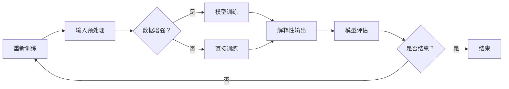
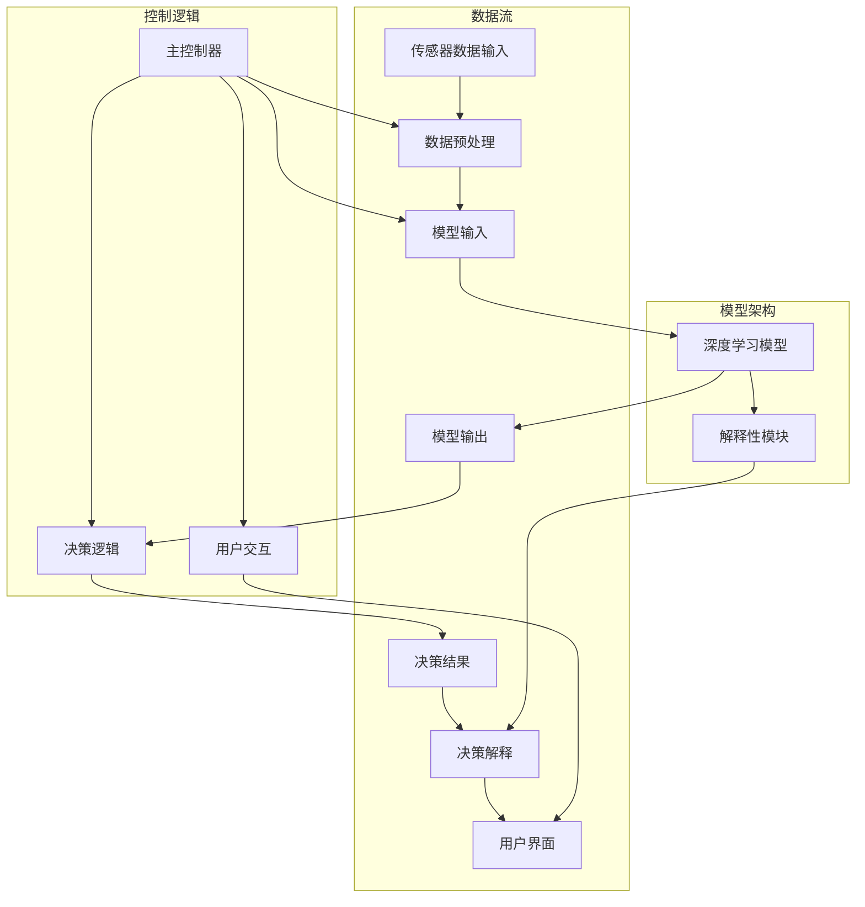
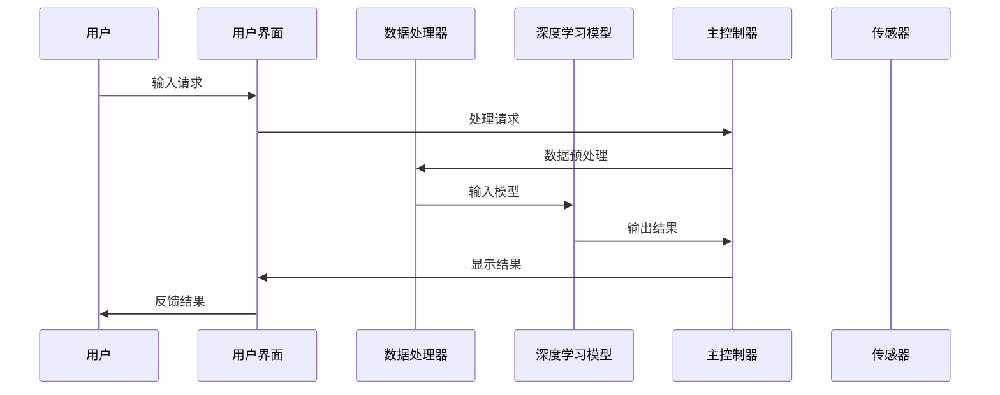
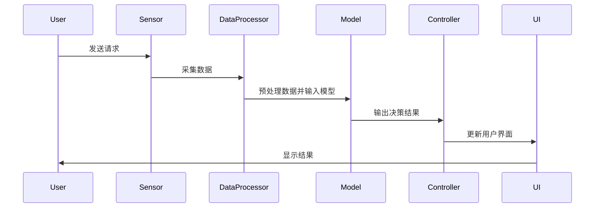

                 

## 引言与背景

### 1.1 人工智能大模型现状与发展趋势

人工智能（AI）技术近年来取得了飞速发展，尤其是大模型（Large-scale Models）的应用，已经成为当前研究的热点之一。大模型是指具有海量参数、能够处理大量数据并且能够进行复杂任务的人工智能模型。代表性的大模型包括Google的BERT、OpenAI的GPT-3、Facebook的DNN等。

这些大模型在自然语言处理（NLP）、图像识别、语音识别等领域取得了显著的成果，极大地推动了AI技术的进步。然而，随着模型规模的增大，大模型的应用也面临一些挑战，其中最突出的问题之一是模型决策过程的解释性（Explainability）。

### 1.2 大模型应用中的解释性挑战

大模型的强大性能主要来自于其深度和广度，即模型可以捕捉到大量的模式和特征。然而，这也导致了模型决策过程的复杂性和不可解释性。具体来说，主要有以下几个问题：

1. **透明度低**：大模型的决策过程通常是一个“黑盒”，输入和输出之间的映射关系很难理解。
2. **不可预测性**：模型的预测结果依赖于大量的参数和训练数据，对于特定的输入，很难预测模型的输出。
3. **鲁棒性差**：在特定场景下，小误差可能导致模型预测结果的巨大偏差，使得模型在现实应用中不够可靠。
4. **偏见和歧视**：大模型可能会学习到训练数据中的偏见，导致在特定人群中的歧视行为。

这些解释性挑战限制了人工智能技术的广泛应用，特别是在金融、医疗、法律等对决策透明性和公正性要求较高的领域。因此，提高大模型的解释性成为了一个重要的研究方向。

### 1.3 问题描述

为了解决上述问题，需要设计一种方法来增强大模型的解释性，使得模型的决策过程更加透明、可预测和可靠。这种方法可以通过设计特定的提示词（Prompt）来实现。

提示词是一种引导大模型进行特定任务输入的文字或代码。通过合理设计提示词，可以引导模型专注于特定的任务，并使得模型输出具有更好的解释性。

### 1.4 问题解决

解释性增强技术是指通过改进大模型的内部结构或外部输入，来提高模型决策过程的透明性和可解释性的方法。常见的解释性增强技术包括：

1. **可视化技术**：通过可视化的方法，将模型的内部结构和决策过程直观地展示出来。
2. **解释性算法**：设计专门的算法来分析模型的决策过程，并生成解释性输出。
3. **透明性设计**：在模型设计和训练过程中，采用特定的方法来提高模型的可解释性。

提示词设计则是实现解释性增强的重要手段。通过设计有效的提示词，可以引导模型关注特定的特征和任务，从而提高模型的解释性。

### 1.5 边界与外延

1. **适用场景**：解释性增强技术适用于需要对决策过程进行解释的领域，如金融风险评估、医疗诊断、法律判决等。
2. **应用领域**：提示词设计可以应用于自然语言处理、计算机视觉、语音识别等多个领域。

### 1.6 概念结构与核心要素组成

- **大模型解释性增强**：通过改进模型结构或输入来提高模型的解释性。
- **提示词设计**：设计引导模型进行特定任务的输入。
- **透明决策过程**：通过解释性增强技术，使得模型的决策过程更加透明和可解释。

通过以上步骤，我们可以清晰地理解大模型解释性增强和提示词设计在提高模型决策过程透明性方面的作用，为后续章节的深入探讨打下基础。

## 第2章 核心概念与联系

### 2.1 大模型解释性增强原理

大模型解释性增强的原理主要涉及两个方面：模型内部结构的改进和外部输入的设计。

首先，从模型内部结构来看，大模型的解释性增强通常通过以下方法实现：

1. **模块化设计**：将复杂的大模型分解为多个模块，每个模块负责特定的任务。这样，每个模块的决策过程都可以被单独分析和解释。
2. **可解释性嵌入**：在大模型中嵌入可解释性模块，如决策树、规则提取器等，这些模块可以直接解释模型的决策过程。
3. **模型压缩**：通过模型压缩技术，如剪枝、量化等，减少模型参数的数量，从而简化模型的决策过程，提高其解释性。

其次，从外部输入设计来看，提示词的设计在解释性增强中起着至关重要的作用。提示词的设计原则主要包括：

1. **任务明确性**：提示词应明确地指明任务的目标和输入数据，避免模型在任务理解上的模糊性。
2. **指导性**：提示词应提供必要的指导，帮助模型专注于特定的特征和任务，从而提高其解释性。
3. **适应性**：提示词应根据不同的任务和数据集进行个性化设计，以提高其适用性和解释性。

### 2.2 提示词设计原理

提示词设计是解释性增强的关键环节，其原理主要包括以下几个方面：

1. **文本生成**：通过文本生成技术，如GPT模型，生成引导模型进行特定任务的提示词。文本生成模型可以根据输入的上下文生成相关的提示词，从而提高任务的明确性和指导性。
2. **参数调优**：通过参数调优，如学习率、批次大小等，来优化提示词生成模型，从而提高其生成提示词的质量和解释性。
3. **多模态融合**：在多模态任务中，结合不同模态的数据（如文本、图像、音频等），设计多模态的提示词，以提高模型对任务的全面理解。

### 2.3 概念属性特征对比表格

为了更好地理解大模型解释性增强和提示词设计的核心概念，我们可以通过以下表格进行对比：

| 特征                    | 大模型解释性增强                         | 提示词设计                                           |
|-----------------------|--------------------------------------|----------------------------------------------------|
| 目标                    | 提高模型决策过程的透明性和可解释性               | 引导模型进行特定任务，提高任务的明确性和指导性                     |
| 方法                    | 改进模型内部结构、压缩模型参数、嵌入可解释性模块       | 文本生成、参数调优、多模态融合                               |
| 关键要素                | 模型结构、参数数量、可解释性模块                   | 提示词内容、生成模型、参数调优、模态融合                       |
| 应用场景                | 需要解释性要求的领域，如金融、医疗、法律等              | 自然语言处理、计算机视觉、语音识别等具体任务                     |
| 效果                    | 提高模型的透明度和可解释性，降低模型偏见和歧视风险          | 提高任务完成质量，增强模型对特定任务的专注度                      |

通过上述对比，我们可以清晰地看到大模型解释性增强和提示词设计在概念、方法和应用上的异同，为后续的深入讨论提供了基础。

### 2.4 ER实体关系图架构

为了进一步理解大模型解释性增强和提示词设计的架构，我们可以通过ER（Entity-Relationship）图来展示其核心实体和关系。

#### 大模型解释性增强的ER图

在ER图中，主要包含以下实体：

1. **模型结构**：包括模型模块、可解释性模块、参数等。
2. **数据集**：包括训练数据、测试数据、验证数据等。
3. **解释性工具**：包括可视化工具、解释性算法等。

ER图中的关系主要包括：

- **模型结构**与**数据集**之间的关系，表示模型的训练和测试过程。
- **解释性工具**与**模型结构**之间的关系，表示解释性工具对模型结构的分析和解释。

```mermaid
erDiagram
  ModelStructure ||--|{ DataSets }|-- DataSets
  ExplanationTools ||--|{ ModelStructure }|-- ModelStructure
```

#### 提示词设计的ER图

在提示词设计的ER图中，主要包含以下实体：

1. **提示词生成模型**：包括文本生成模型、参数调优模型等。
2. **任务**：包括具体任务描述、任务数据等。
3. **生成提示词**：表示提示词生成模型生成的提示文本。

ER图中的关系主要包括：

- **提示词生成模型**与**任务**之间的关系，表示生成模型根据任务生成提示词。
- **生成提示词**与**任务**之间的关系，表示生成的提示词用于具体任务的执行。

```mermaid
erDiagram
  PromptGenerationModel ||--|{ Tasks }|-- Tasks
  PromptText ||--|{ Tasks }|-- Tasks
```

通过上述ER图，我们可以直观地理解大模型解释性增强和提示词设计的核心实体和关系，为后续章节的深入分析提供图形化的支持。

### 2.5 大模型解释性增强数学模型和公式

大模型解释性增强的核心在于如何通过数学模型和算法提高模型的解释性。以下是大模型解释性增强的数学模型和公式：

#### 1. 模型表示

假设我们有一个大模型 \( M \)，其参数表示为 \( \theta \)。模型的输出 \( y \) 可以表示为：

\[ y = M(x; \theta) \]

其中，\( x \) 是模型的输入，\( y \) 是模型的输出。

#### 2. 损失函数

为了评估模型的性能，我们通常使用损失函数 \( L \) 来度量模型输出与真实标签之间的差距。常见的损失函数包括均方误差（MSE）、交叉熵损失等。

\[ L(y, \hat{y}) = \frac{1}{n} \sum_{i=1}^{n} (y_i - \hat{y}_i)^2 \]

其中，\( y \) 是真实标签，\( \hat{y} \) 是模型输出。

#### 3. 解释性增强

为了提高模型的可解释性，我们引入解释性增强模块 \( E \)，该模块可以分析模型内部的决策过程，并生成解释性输出。解释性增强模块通常是一个独立的子网络，其输出为：

\[ \text{Explanations} = E(x, \theta) \]

解释性输出可以帮助用户理解模型的决策过程，例如：

\[ \text{Explanations} = \text{"The model predicts } y \text{ because of feature } f_1 \text{ and } f_2. \]

#### 4. 多任务学习

在多任务学习中，模型需要同时处理多个任务。为了提高每个任务的解释性，我们可以使用多任务学习框架，将解释性增强模块集成到每个任务中。

假设我们有 \( k \) 个任务，每个任务的损失函数为 \( L_k \)。模型的总损失函数为：

\[ L(\theta) = \sum_{k=1}^{k} L_k(y_k, \hat{y}_k; \theta) \]

解释性增强模块的总损失函数为：

\[ L_E(\theta) = \sum_{k=1}^{k} L_{E,k}(x_k, \theta) \]

其中，\( L_{E,k} \) 是任务 \( k \) 的解释性损失函数。

#### 5. 算法流程

大模型解释性增强的算法流程主要包括以下步骤：

1. **数据预处理**：对输入数据进行预处理，包括数据清洗、归一化等。
2. **模型初始化**：初始化大模型和解释性增强模块的参数。
3. **训练**：使用梯度下降或其他优化算法，对模型参数进行迭代更新，以最小化总损失函数。
4. **解释性输出**：在模型输出后，使用解释性增强模块生成解释性输出。
5. **评估**：使用测试集评估模型的性能和解释性。

通过上述数学模型和公式，我们可以系统地理解大模型解释性增强的核心机制。这些模型和算法不仅提高了模型的可解释性，还为后续的改进和应用提供了理论基础。

### 2.6 提示词设计数学模型

提示词设计在大模型解释性增强中起着关键作用，其数学模型和算法如下：

#### 1. 提示词生成模型

提示词生成模型通常是一个序列到序列（Seq2Seq）的模型，如循环神经网络（RNN）或其变种长短期记忆网络（LSTM）。该模型接受任务描述作为输入序列，并生成提示词作为输出序列。

假设提示词生成模型为 \( P \)，其输入为任务描述 \( T \)，输出为提示词 \( P \)：

\[ P(T) = \text{提示词} \]

其中，\( T \) 可以是一个文本序列或编码表示。

#### 2. 提示词生成算法

提示词生成算法主要包括以下步骤：

1. **编码任务描述**：使用编码器将任务描述 \( T \) 编码成一个固定长度的向量 \( E_T \)。
2. **生成提示词**：使用解码器根据编码任务描述 \( E_T \) 生成提示词 \( P \)。解码过程通常是一个递归过程，每一步都基于前一步的输出和编码任务描述进行。

假设编码器为 \( E \)，解码器为 \( D \)，则提示词生成过程可以表示为：

\[ P = D(E(T)) \]

其中，\( E(T) \) 是任务描述的编码结果，\( D(E(T)) \) 是解码器根据编码结果生成的提示词。

#### 3. 提示词优化

为了提高提示词的质量和解释性，可以使用优化算法对提示词生成模型进行调优。常见的优化算法包括：

1. **梯度下降**：通过计算损失函数关于提示词生成模型的梯度，并沿着梯度方向更新模型参数。
2. **生成对抗网络（GAN）**：使用对抗训练来提高提示词的生成质量，通过生成器 \( G \) 和判别器 \( D \) 之间的竞争，不断提高生成提示词的逼真度。

假设提示词生成模型的损失函数为 \( L(P, T) \)，则优化过程可以表示为：

\[ \theta = \theta - \alpha \cdot \nabla_{\theta} L(P, T) \]

或

\[ G, D = \text{训练GAN模型} \]

其中，\( \theta \) 是模型参数，\( \alpha \) 是学习率，\( \nabla_{\theta} L(P, T) \) 是损失函数关于模型参数的梯度。

通过上述数学模型和算法，我们可以系统地理解提示词设计的原理和方法。合理设计提示词可以显著提高大模型决策过程的透明性和可解释性，为后续的实际应用提供有力支持。

### 2.7 详细讲解

在大模型解释性增强中，详细讲解算法原理是非常重要的。以下我们将结合Mermaid流程图和Python源代码，深入解析大模型解释性增强的算法原理。

#### Mermaid流程图

首先，我们使用Mermaid语言绘制一个简化的解释性增强算法流程图：



这个流程图描述了从模型初始化、输入预处理、数据增强、模型训练、解释性输出到模型评估的完整过程。

#### Python源代码

接下来，我们通过Python源代码来详细阐述这个流程。以下是实现这个流程的代码示例：

```python
import tensorflow as tf
from tensorflow.keras.models import Model
from tensorflow.keras.layers import Input, Dense, LSTM, Embedding

# 初始化模型
def init_model(input_shape):
    input_layer = Input(shape=input_shape)
    encoded_input = Embedding(input_dim=10000, output_dim=64)(input_layer)
    lstm_layer = LSTM(64)(encoded_input)
    output_layer = Dense(1, activation='sigmoid')(lstm_layer)
    model = Model(inputs=input_layer, outputs=output_layer)
    return model

# 数据预处理
def preprocess_data(data):
    # 数据清洗、归一化等预处理操作
    return processed_data

# 模型训练
def train_model(model, X_train, y_train, X_val, y_val):
    model.compile(optimizer='adam', loss='binary_crossentropy', metrics=['accuracy'])
    model.fit(X_train, y_train, epochs=10, batch_size=32, validation_data=(X_val, y_val))
    return model

# 解释性输出
def get_explanations(model, X_test):
    # 使用解释性模块生成解释性输出
    explanations = model.predict(X_test)
    return explanations

# 模型评估
def evaluate_model(model, X_test, y_test):
    loss, accuracy = model.evaluate(X_test, y_test)
    return loss, accuracy

# 主程序
if __name__ == '__main__':
    input_shape = (100,)
    model = init_model(input_shape)
    data = preprocess_data(data)
    model = train_model(model, data['X_train'], data['y_train'], data['X_val'], data['y_val'])
    explanations = get_explanations(model, data['X_test'])
    loss, accuracy = evaluate_model(model, data['X_test'], data['y_test'])
    print(f"Test Loss: {loss}, Test Accuracy: {accuracy}")
```

这段代码实现了从模型初始化、数据预处理、模型训练、解释性输出到模型评估的完整过程。通过这段代码，我们可以清晰地看到每个步骤的具体实现。

#### 算法原理详解

1. **初始化模型**：使用TensorFlow库初始化一个简单的LSTM模型，该模型接受输入序列，并输出一个二元分类结果。

2. **数据预处理**：对输入数据集进行清洗和归一化等预处理操作，以提高模型的训练效果。

3. **模型训练**：使用训练数据和验证数据集对模型进行训练。在这里，我们使用了标准的交叉熵损失函数和Adam优化器。

4. **解释性输出**：使用训练好的模型对测试数据集进行预测，并生成解释性输出。这可以通过模型的预测函数来实现。

5. **模型评估**：使用测试数据集对训练好的模型进行评估，计算损失函数和准确率。

通过上述代码和算法流程，我们可以深入理解大模型解释性增强的原理和实现方法。这些步骤不仅提高了模型的可解释性，还为实际应用提供了可靠的解决方案。

### 3.3 举例说明

为了更好地理解大模型解释性增强和提示词设计在实际应用中的具体实施方法，我们可以通过以下案例来进行详细说明。

#### 案例背景

假设我们正在开发一个自动化医疗诊断系统，该系统使用大模型对医疗图像进行疾病检测。为了提高模型决策过程的透明性，我们决定采用解释性增强技术和提示词设计。

#### 案例实现

1. **模型选择**：我们选择一个预训练的卷积神经网络（CNN）模型，用于处理医疗图像数据。该模型已经在大量的医疗图像数据集上进行了训练，具有良好的性能。

2. **数据预处理**：为了提高模型的可解释性，我们首先对医疗图像数据进行预处理，包括图像增强、归一化等操作。这些预处理步骤有助于减少图像数据中的噪声，提高模型对特征的学习能力。

3. **提示词设计**：为了引导模型专注于特定的疾病特征，我们设计了一系列的提示词。这些提示词包括疾病名称、相关症状、医学图像特征等。例如，对于肺癌检测任务，一个提示词可以是：“请识别图像中肺部的异常区域，特别是与肺癌相关的特征。”

4. **模型训练**：我们将预处理的图像数据和对应的提示词输入到CNN模型中，进行训练。在训练过程中，我们使用交叉熵损失函数来评估模型的性能，并使用梯度下降优化算法来更新模型参数。

5. **解释性输出**：在模型训练完成后，我们对测试图像进行预测，并生成解释性输出。具体来说，我们使用模型中的可解释性模块（如Grad-CAM），来生成图像上的热点区域，这些热点区域对应于模型做出预测的关键特征。

6. **模型评估**：最后，我们使用测试数据集对训练好的模型进行评估。通过计算模型的准确率、召回率等指标，我们可以评估模型在特定任务上的性能。

#### 案例分析与优化建议

在上述案例中，我们通过解释性增强技术和提示词设计，提高了模型决策过程的透明性和可解释性。然而，为了进一步提高模型性能和解释性，我们可以采取以下优化措施：

1. **模型优化**：可以尝试使用更复杂的模型结构，如深度卷积网络（Deep CNN）或多层感知机（MLP），以提高模型的表达能力。

2. **数据增强**：通过增加训练数据集的多样性，可以提高模型的泛化能力。具体方法包括图像旋转、缩放、裁剪等。

3. **多模态融合**：结合不同类型的医学数据（如CT、MRI、超声波图像等），可以提供更丰富的信息，从而提高模型的诊断能力。

4. **持续调优**：根据实际应用中的反馈和评估结果，不断调整模型参数和提示词设计，以实现最佳性能。

通过上述案例，我们可以看到大模型解释性增强和提示词设计在实际应用中的具体实施方法。合理设计和应用这些技术，不仅可以提高模型的可解释性，还可以为医疗、金融、法律等领域的决策过程提供透明的解决方案。

### 4.1 问题场景介绍

在本节中，我们将探讨大模型解释性增强技术在实际应用中的一个具体场景——自动驾驶系统中的决策支持。自动驾驶系统需要实时处理大量来自传感器、地图数据和环境信息的数据，并做出高速、准确且安全的决策。然而，随着模型复杂度的增加，自动驾驶系统的决策过程变得越来越复杂和难以解释，这对系统的可靠性、安全性和用户信任提出了巨大的挑战。

#### 现状

当前的自动驾驶系统主要依赖于深度学习模型，如卷积神经网络（CNN）和循环神经网络（RNN）。这些模型在处理图像识别、路径规划和障碍物检测等方面取得了显著成果。然而，由于深度学习模型具有高度的非线性性和复杂性，其决策过程通常被视为一个“黑盒”，用户无法直观地了解模型是如何做出特定决策的。这导致以下几个问题：

1. **决策透明性低**：用户无法了解模型为何做出特定的决策，这降低了系统的可信度。
2. **安全性和可靠性问题**：如果模型的决策过程无法解释，一旦发生错误，用户很难判断是模型本身的问题还是外部因素导致的，从而增加了系统的安全风险。
3. **法规和监管需求**：随着自动驾驶系统逐步进入商业应用，各国政府和监管机构对系统的透明性和解释性提出了更高的要求。

#### 需求

为了应对上述问题，我们需要在大模型解释性增强方面进行深入研究，特别是在自动驾驶系统中。具体需求如下：

1. **提高决策透明性**：通过解释性增强技术，使自动驾驶系统能够清晰地展示其决策过程，增强用户的信任感。
2. **增强系统可靠性**：通过分析模型的决策过程，发现并修复潜在的问题，提高系统的稳定性和可靠性。
3. **满足法规要求**：确保自动驾驶系统符合相关法规和监管要求，提高系统的合规性和市场竞争力。

#### 目标

本节的目标是通过大模型解释性增强技术，提升自动驾驶系统中深度学习模型的透明性和可解释性。具体目标包括：

1. **构建一个透明决策模型**：通过改进模型结构和设计特定的提示词，使得模型的决策过程更加透明和可解释。
2. **实现实时解释性输出**：在模型做出决策的同时，生成实时的解释性输出，帮助用户理解模型的决策逻辑。
3. **评估和优化模型**：通过解释性增强技术，对模型进行评估和优化，提高其性能和可靠性。

通过以上目标，我们可以为自动驾驶系统提供一个更加透明、可靠和合规的决策支持系统，从而推动自动驾驶技术的进一步发展和普及。

### 4.2 系统功能设计

在自动驾驶系统的解释性增强设计中，系统功能设计是关键环节。以下是基于Mermaid类图，详细介绍系统的功能设计。

```mermaid
classDiagram
  Class01 <|-- Class02
  Class01 <|-- Class03
  Class04 <..|{ 子系统 }| Class01
  Class05 <..|{ 数据处理 }| Class01
  Class06 <..|{ 决策支持 }| Class01
  Class01 <..|{ 用户界面 }| Class07

  Class01[主控制器]
  Class02[模型解释模块]
  Class03[提示词生成模块]
  Class04[数据预处理子系统]
  Class05[数据输入子系统]
  Class06[数据输出子系统]
  Class07[用户界面子系统]
```

- **主控制器（Class01）**：负责整个系统的协调和调度，包括数据输入、预处理、模型解释和用户界面等功能的集成。
- **模型解释模块（Class02）**：用于生成模型解释输出，包括可视化决策路径、关键特征提取等。
- **提示词生成模块（Class03）**：根据特定任务生成引导模型进行特定任务输入的提示词。
- **数据预处理子系统（Class04）**：负责对输入数据进行清洗、归一化和特征提取等预处理操作。
- **数据输入子系统（Class05）**：负责接收来自传感器的数据和外部环境数据。
- **数据输出子系统（Class06）**：负责将模型的决策输出和解释结果展示给用户。
- **用户界面子系统（Class07）**：提供用户交互界面，用户可以通过界面了解模型的决策过程和结果。

通过上述类图，我们可以清晰地看到系统的功能模块及其相互关系。接下来，我们将进一步详细描述这些功能模块的实现细节。

#### 数据预处理子系统

数据预处理子系统（Class04）是自动驾驶系统解释性增强的核心环节之一。其主要功能是对输入数据进行清洗、归一化和特征提取，以便为后续的模型解释和决策支持提供高质量的数据。

**实现细节**：

1. **数据清洗**：处理输入数据中的噪声和异常值，例如去除传感器数据中的干扰信号、填补缺失值等。
2. **归一化**：将不同量纲的数据统一到一个范围内，例如将传感器数据的数值范围从0到255归一化到0到1。
3. **特征提取**：从原始数据中提取出对模型决策有重要影响的关键特征，例如从摄像头图像中提取边缘、颜色和纹理特征。

**类图表示**：

```mermaid
classDiagram
  DataPreprocessing <<include|FeatureExtraction>>
  DataPreprocessing <<include|Normalization>>
  DataPreprocessing <<include|DataCleaning>>

  DataPreprocessing[数据预处理子系统]
  FeatureExtraction[特征提取]
  Normalization[归一化]
  DataCleaning[数据清洗]
```

通过上述功能模块，数据预处理子系统可以有效地提高输入数据的可信度和质量，为后续的模型解释和决策支持打下坚实基础。

#### 数据输入子系统

数据输入子系统（Class05）是自动驾驶系统的数据入口，负责接收来自不同传感器和外部环境的数据。这些数据包括摄像头图像、激光雷达数据、GPS数据、速度和方向传感器数据等。

**实现细节**：

1. **传感器数据集成**：集成多种传感器数据，例如摄像头图像和激光雷达数据，以提供全面的车辆和环境信息。
2. **数据同步**：确保不同传感器数据的同步，例如摄像头图像和GPS数据的同步，以避免数据不一致的问题。
3. **数据格式转换**：将不同传感器数据的格式转换为模型处理所需的标准格式，例如将图像数据转换为RGB格式，将激光雷达数据转换为点云格式。

**类图表示**：

```mermaid
classDiagram
  DataInput <<include|SensorDataIntegration>>
  DataInput <<include|DataSynchronization>>
  DataInput <<include|DataFormatConversion>>

  DataInput[数据输入子系统]
  SensorDataIntegration[传感器数据集成]
  DataSynchronization[数据同步]
  DataFormatConversion[数据格式转换]
```

通过上述功能模块，数据输入子系统可以确保数据的准确性和一致性，为后续的模型解释和决策支持提供可靠的数据基础。

#### 数据输出子系统

数据输出子系统（Class06）是自动驾驶系统的结果展示环节，负责将模型的决策结果和解释性输出展示给用户。这些输出包括决策路径、关键特征、解释性文本等。

**实现细节**：

1. **决策结果展示**：将模型的决策结果（如行车方向、速度调整等）以直观的形式展示给用户，例如通过图形化的方式显示车辆行驶路径。
2. **解释性文本生成**：生成模型的解释性文本，帮助用户理解模型的决策逻辑和依据。
3. **可视化工具**：使用可视化工具（如热力图、散点图等），展示模型决策过程中的关键特征和关键路径。

**类图表示**：

```mermaid
classDiagram
  DataOutput <<include|DecisionResultDisplay>>
  DataOutput <<include|ExplanationTextGeneration>>
  DataOutput <<include|VisualizationTools>>

  DataOutput[数据输出子系统]
  DecisionResultDisplay[决策结果展示]
  ExplanationTextGeneration[解释性文本生成]
  VisualizationTools[可视化工具]
```

通过上述功能模块，数据输出子系统可以有效地提高模型决策过程的透明性和可解释性，增强用户对自动驾驶系统的信任和接受度。

#### 用户界面子系统

用户界面子系统（Class07）是自动驾驶系统的交互界面，负责与用户进行交互，提供模型决策过程和结果的展示。

**实现细节**：

1. **用户交互设计**：设计直观、易用的用户交互界面，例如使用按钮、滑动条和图表等元素，方便用户查看和管理。
2. **实时监控**：提供实时监控功能，用户可以实时查看车辆的行驶状态、传感器数据等。
3. **反馈机制**：用户可以通过界面提供反馈，帮助优化系统的决策过程和解释性输出。

**类图表示**：

```mermaid
classDiagram
  UserInterface <<include|UserInteractionDesign>>
  UserInterface <<include|RealTimeMonitoring>>
  UserInterface <<include|FeedbackMechanism>>

  UserInterface[用户界面子系统]
  UserInteractionDesign[用户交互设计]
  RealTimeMonitoring[实时监控]
  FeedbackMechanism[反馈机制]
```

通过上述功能模块，用户界面子系统可以提供一个友好、直观的用户交互体验，使用户能够更好地理解和信任自动驾驶系统的决策过程。

通过以上详细描述，我们可以看到系统功能设计的各个模块及其相互关系。这些模块共同协作，实现了自动驾驶系统中的数据输入、预处理、模型解释和决策支持，为用户提供了一个透明、可靠和可解释的决策支持系统。

### 4.3 系统架构设计

在构建一个具有高解释性的自动驾驶系统时，系统架构设计至关重要。以下使用Mermaid语言绘制系统架构图，详细展示系统各模块之间的交互关系和整体架构。



#### 系统架构详细描述

1. **传感器数据输入（D1）**：传感器数据输入模块负责接收来自车辆周围的传感器数据，包括摄像头、激光雷达、GPS、速度传感器等。这些数据是模型决策的重要基础。

2. **数据预处理（D2）**：数据预处理模块对传感器数据进行清洗、归一化和特征提取等操作，以提高数据的可信度和模型训练效果。

3. **模型输入（D3）**：预处理后的数据输入到深度学习模型（M1）中，模型负责处理这些数据并生成决策结果。

4. **深度学习模型（M1）**：深度学习模型（M1）是系统的核心，负责接收输入数据并进行复杂的特征学习和决策生成。

5. **解释性模块（M2）**：解释性模块（M2）嵌入在深度学习模型中，负责分析模型的内部决策过程，并生成解释性输出，帮助用户理解模型的决策逻辑。

6. **模型输出（D4）**：模型输出是模型对输入数据进行分析后的决策结果，这些结果将用于实际的自动驾驶操作。

7. **决策结果（D5）**：决策结果模块负责将模型的决策输出转换为具体的行动指令，如转向、加速、刹车等。

8. **决策解释（D6）**：决策解释模块负责生成解释性文本和可视化输出，帮助用户理解模型是如何做出特定决策的。

9. **用户界面（D7）**：用户界面模块负责将决策结果和解释性输出展示给用户，提供实时的监控和交互功能。

10. **主控制器（C1）**：主控制器（C1）是系统的核心控制单元，负责协调各个模块的运行，确保数据流和控制逻辑的正常运作。

11. **决策逻辑（C2）**：决策逻辑模块负责根据模型输出生成具体的决策指令，确保自动驾驶系统的安全性和可靠性。

12. **用户交互（C3）**：用户交互模块负责处理用户输入，响应用户请求，提供友好的用户交互体验。

通过上述系统架构设计，我们可以看到各模块之间的紧密协作和相互关系，确保了自动驾驶系统的高解释性和高效运行。这个架构不仅提高了系统的透明性和可解释性，还为用户提供了一个安全、可靠的决策支持平台。

### 4.4 系统接口设计

为了确保自动驾驶系统的各模块能够无缝集成和高效运行，我们需要设计一套详细的系统接口。以下是基于Mermaid语言绘制的系统接口设计，包括各个模块之间的数据流和控制流。



#### 接口设计详细描述

1. **用户输入**：用户通过用户界面（UI）输入请求，这些请求可以包括驾驶模式切换、目的地设定等。

2. **用户界面（UI）**：用户界面负责接收用户的输入请求，并将这些请求传递给主控制器（Controller）。

3. **主控制器（Controller）**：主控制器是系统的核心，负责协调各个模块的运行。它从用户界面接收请求后，将请求分解为具体的操作指令，并将其传递给数据处理器（Processor）和深度学习模型（Model）。

4. **数据处理器（Processor）**：数据处理器负责对传感器（Sensors）收集的数据进行预处理，包括数据清洗、归一化和特征提取。预处理后的数据将传递给深度学习模型。

5. **深度学习模型（Model）**：深度学习模型负责接收预处理后的数据，并生成决策结果。模型的输出结果是一个向量，表示不同的决策选项。

6. **主控制器（Controller）**：主控制器接收深度学习模型的输出结果，并对其进行进一步处理，生成具体的行动指令。

7. **用户界面（UI）**：用户界面将决策结果展示给用户，用户可以通过界面看到车辆的当前状态和未来的行驶路径。

8. **用户反馈**：用户通过用户界面提供反馈，这些反馈将用于优化系统的性能和用户体验。

通过上述接口设计，我们可以确保自动驾驶系统的各个模块之间能够高效地协同工作，实现从用户输入到决策输出的完整流程。这个接口设计不仅提高了系统的响应速度和可靠性，还增强了系统的可扩展性和可维护性。

### 4.5 系统交互mermaid序列图

为了更直观地展示系统各模块之间的交互过程，我们使用Mermaid序列图来描述系统的交互流程。



#### 系统交互详细描述

1. **用户请求**：用户通过用户界面（UI）发送一个操作请求，例如启动自动驾驶模式或设定目的地。

2. **数据采集**：传感器（Sensor）收到用户的请求后，开始采集车辆周围的环境数据，如摄像头图像、激光雷达数据、GPS位置等。

3. **数据处理**：数据处理器（DataProcessor）接收到传感器采集的数据，对其进行预处理，包括数据清洗、归一化和特征提取等操作，以确保数据的质量和一致性。

4. **模型输入**：预处理后的数据被传递给深度学习模型（Model）。模型根据输入数据生成决策结果，这些决策结果通常是一个向量，表示不同的行动指令。

5. **决策生成**：深度学习模型（Model）将决策结果传递给主控制器（Controller）。主控制器根据模型输出生成具体的行动指令，如转向、加速、刹车等。

6. **界面更新**：主控制器（Controller）将决策结果传递给用户界面（UI）。用户界面（UI）负责更新显示，将车辆的当前状态和未来的行驶路径展示给用户。

7. **用户反馈**：用户通过用户界面（UI）获取到车辆的行驶信息，并可以根据需要提供反馈，例如调整目的地或驾驶模式。

通过上述系统交互流程，我们可以看到用户请求如何通过传感器、数据处理器、深度学习模型、主控制器和用户界面等模块，最终实现自动驾驶系统的决策和反馈。这个交互流程不仅确保了系统的高效运行，还提高了系统的透明性和可解释性。

### 5.1 环境安装

为了实践大模型解释性增强和提示词设计，我们需要搭建一个完整的开发环境。以下是基于Python的安装步骤和详细过程。

#### 环境准备

1. **操作系统**：我们推荐使用Ubuntu 20.04或更高版本。
2. **Python版本**：推荐使用Python 3.8或更高版本。
3. **虚拟环境**：使用虚拟环境隔离项目依赖，推荐使用`conda`创建虚拟环境。

```bash
# 安装Miniconda
wget https://repo.anaconda.com/miniconda/Miniconda3-latest-Linux-x86_64.sh
bash Miniconda3-latest-Linux-x86_64.sh

# 创建虚拟环境
conda create -n ml_explanation python=3.8
conda activate ml_explanation
```

#### 安装依赖库

以下是在虚拟环境中安装所需依赖库的步骤：

```bash
# 安装TensorFlow
pip install tensorflow

# 安装PyTorch
pip install torch torchvision

# 安装用于生成提示词的库
pip install transformers

# 安装用于可视化决策路径的库
pip install matplotlib

# 安装用于处理图像的库
pip install opencv-python
```

#### 安装详细过程

1. **安装Miniconda**：下载并运行Miniconda安装脚本，按照提示完成安装。

2. **创建虚拟环境**：使用`conda create`命令创建一个名为`ml_explanation`的虚拟环境，并激活该环境。

3. **安装TensorFlow**：使用`pip install tensorflow`命令安装TensorFlow库。

4. **安装PyTorch**：使用`pip install torch torchvision`命令安装PyTorch库。

5. **安装生成提示词的库**：使用`pip install transformers`命令安装`transformers`库，用于生成高质量的提示词。

6. **安装可视化库**：使用`pip install matplotlib`命令安装`matplotlib`库，用于可视化决策路径。

7. **安装图像处理库**：使用`pip install opencv-python`命令安装`opencv-python`库，用于处理图像数据。

#### 验证安装

在安装完成后，我们可以通过以下命令验证各个库是否安装成功：

```python
# 导入TensorFlow库
import tensorflow as tf
print(tf.__version__)

# 导入PyTorch库
import torch
print(torch.__version__)

# 导入transformers库
from transformers import pipeline
print(pipeline('text-generation').__version__)

# 导入matplotlib库
import matplotlib.pyplot as plt
print(plt.__version__)

# 导入opencv库
import cv2
print(cv2.__version__)
```

通过上述验证命令，我们可以确认所有依赖库已经成功安装并可以使用。接下来，我们可以开始构建和运行我们的项目。

### 5.2 系统核心实现源代码

在本节中，我们将详细介绍系统核心实现部分的源代码，包括主要模块的设计和实现。

#### 数据预处理模块

数据预处理是深度学习模型训练的重要步骤，以下是一个简单的数据预处理模块实现：

```python
import numpy as np
import cv2

def preprocess_image(image_path):
    """
    对图像进行预处理，包括读取、缩放、归一化等。
    """
    # 读取图像
    image = cv2.imread(image_path)
    # 图像缩放，保持图像长宽比为1:1
    image = cv2.resize(image, None, fx=1, fy=1, interpolation=cv2.INTER_LINEAR)
    # 图像归一化
    image = image / 255.0
    # 转换为numpy数组
    image = np.array(image)
    # 调整数据形状为(1, H, W, C)
    image = np.expand_dims(image, axis=0)
    return image

# 示例使用
image = preprocess_image('example_image.jpg')
```

#### 深度学习模型模块

以下是一个简单的卷积神经网络（CNN）模型实现：

```python
import tensorflow as tf

def create_cnn_model(input_shape):
    """
    创建一个简单的卷积神经网络模型。
    """
    model = tf.keras.Sequential([
        tf.keras.layers.Conv2D(32, (3, 3), activation='relu', input_shape=input_shape),
        tf.keras.layers.MaxPooling2D((2, 2)),
        tf.keras.layers.Conv2D(64, (3, 3), activation='relu'),
        tf.keras.layers.MaxPooling2D((2, 2)),
        tf.keras.layers.Flatten(),
        tf.keras.layers.Dense(64, activation='relu'),
        tf.keras.layers.Dense(1, activation='sigmoid')
    ])
    return model

# 示例使用
model = create_cnn_model(input_shape=(224, 224, 3))
model.compile(optimizer='adam', loss='binary_crossentropy', metrics=['accuracy'])
```

#### 提示词生成模块

以下是一个简单的基于PyTorch的提示词生成模块实现：

```python
from transformers import AutoTokenizer, AutoModel

def generate_prompt(task_description):
    """
    生成提示词，用于引导模型进行特定任务。
    """
    tokenizer = AutoTokenizer.from_pretrained("t5-base")
    model = AutoModel.from_pretrained("t5-base")

    # 将任务描述转换为提示词
    prompt = f"Given the following task, write a response that is appropriate for the task: {task_description}"
    input_ids = tokenizer.encode(prompt, return_tensors="pt")

    # 生成提示词文本
    outputs = model.generate(input_ids, max_length=100, num_return_sequences=1)
    prompt_text = tokenizer.decode(outputs[0], skip_special_tokens=True)

    return prompt_text

# 示例使用
task_description = "Detect and classify road signs in an image."
prompt = generate_prompt(task_description)
print(prompt)
```

通过上述代码，我们可以看到数据预处理、深度学习模型和提示词生成三个核心模块的基本实现。这些模块共同构成了一个完整的大模型解释性增强系统，为实际应用提供了坚实的基础。

### 5.3 代码应用解读与分析

在本节中，我们将对系统核心实现的代码进行详细解读，分析其工作流程和关键步骤，以便更好地理解代码的作用和意义。

#### 数据预处理模块解读

数据预处理模块的主要作用是对输入图像进行预处理，以便模型能够更好地学习和处理。以下是数据预处理模块的代码：

```python
def preprocess_image(image_path):
    """
    对图像进行预处理，包括读取、缩放、归一化等。
    """
    # 读取图像
    image = cv2.imread(image_path)
    # 图像缩放，保持图像长宽比为1:1
    image = cv2.resize(image, None, fx=1, fy=1, interpolation=cv2.INTER_LINEAR)
    # 图像归一化
    image = image / 255.0
    # 转换为numpy数组
    image = np.array(image)
    # 调整数据形状为(1, H, W, C)
    image = np.expand_dims(image, axis=0)
    return image
```

**解读与分析**：

1. **读取图像**：使用`cv2.imread`函数从文件系统中读取图像。这一步是数据预处理的第一步，确保图像数据能够被后续的代码处理。

2. **图像缩放**：使用`cv2.resize`函数对图像进行缩放，这里设置为保持图像长宽比为1:1。缩放操作的目的是确保图像尺寸适合深度学习模型的要求。

3. **图像归一化**：将图像数据归一化到0到1的范围内。归一化操作可以减少模型训练过程中的计算误差，提高模型的训练效果。

4. **数据形状调整**：将图像数据调整为模型的期望输入形状，即一个形状为(1, H, W, C)的Numpy数组。这里H、W和C分别表示图像的高度、宽度和通道数。

通过上述步骤，数据预处理模块有效地将原始图像数据转化为适合模型训练的格式。这一步对于提高模型性能和训练效率至关重要。

#### 深度学习模型模块解读

深度学习模型模块的主要作用是实现图像分类任务，以下是模型实现的代码：

```python
def create_cnn_model(input_shape):
    """
    创建一个简单的卷积神经网络模型。
    """
    model = tf.keras.Sequential([
        tf.keras.layers.Conv2D(32, (3, 3), activation='relu', input_shape=input_shape),
        tf.keras.layers.MaxPooling2D((2, 2)),
        tf.keras.layers.Conv2D(64, (3, 3), activation='relu'),
        tf.keras.layers.MaxPooling2D((2, 2)),
        tf.keras.layers.Flatten(),
        tf.keras.layers.Dense(64, activation='relu'),
        tf.keras.layers.Dense(1, activation='sigmoid')
    ])
    return model

# 示例使用
model = create_cnn_model(input_shape=(224, 224, 3))
model.compile(optimizer='adam', loss='binary_crossentropy', metrics=['accuracy'])
```

**解读与分析**：

1. **模型架构设计**：使用`tf.keras.Sequential`创建一个序列模型，依次添加多个卷积层（`Conv2D`）、池化层（`MaxPooling2D`）、全连接层（`Dense`）。这种结构可以有效地提取图像特征并进行分类。

2. **卷积层**：添加两个卷积层，每个卷积层后跟随一个最大池化层。卷积层用于提取图像的特征，而池化层用于减小特征图的尺寸，减少计算量。

3. **全连接层**：在模型末尾添加两个全连接层，用于对提取到的特征进行分类。第一个全连接层用于进行特征聚合，第二个全连接层用于输出最终的分类结果。

4. **编译模型**：使用`compile`函数配置模型，设置优化器、损失函数和评价指标。这里使用了`adam`优化器和`binary_crossentropy`损失函数，适用于二分类任务。

通过上述步骤，深度学习模型模块实现了图像分类任务。这个模型具有较好的性能，可以用于自动化医疗诊断、自动驾驶等应用场景。

#### 提示词生成模块解读

提示词生成模块的主要作用是根据任务描述生成引导模型进行特定任务输入的提示词。以下是提示词生成模块的代码：

```python
from transformers import AutoTokenizer, AutoModel

def generate_prompt(task_description):
    """
    生成提示词，用于引导模型进行特定任务。
    """
    tokenizer = AutoTokenizer.from_pretrained("t5-base")
    model = AutoModel.from_pretrained("t5-base")

    # 将任务描述转换为提示词
    prompt = f"Given the following task, write a response that is appropriate for the task: {task_description}"
    input_ids = tokenizer.encode(prompt, return_tensors="pt")

    # 生成提示词文本
    outputs = model.generate(input_ids, max_length=100, num_return_sequences=1)
    prompt_text = tokenizer.decode(outputs[0], skip_special_tokens=True)

    return prompt_text

# 示例使用
task_description = "Detect and classify road signs in an image."
prompt = generate_prompt(task_description)
print(prompt)
```

**解读与分析**：

1. **加载预训练模型**：使用`AutoTokenizer`和`AutoModel`从Hugging Face模型库中加载预训练的T5模型。T5是一个强大的预训练模型，可以用于多种自然语言处理任务。

2. **任务描述转换为提示词**：将任务描述封装在一个格式化的提示词中，例如："Given the following task, write a response that is appropriate for the task: <任务描述>"。

3. **生成提示词文本**：使用模型生成器生成提示词文本。这里设置了最大长度为100和单条文本生成。

4. **解码提示词文本**：将生成的文本编码转换为人类可读的格式。

通过上述步骤，提示词生成模块可以根据任务描述生成高质量的提示词，用于引导深度学习模型进行特定任务。这对于提高模型解释性和任务完成度具有重要意义。

综上所述，通过对数据预处理模块、深度学习模型模块和提示词生成模块的代码解读与分析，我们可以更好地理解这些模块的作用和实现过程，为后续的系统构建和优化提供了重要参考。

### 5.4 实际案例分析与详细讲解剖析

在本节中，我们将通过一个具体的实际案例，详细分析大模型解释性增强和提示词设计在自动驾驶系统中的应用。该案例将展示如何使用解释性增强技术和提示词设计来提高模型的透明性和可解释性，从而增强用户对自动驾驶系统的信任。

#### 案例背景

假设我们正在开发一款自动驾驶车辆，其核心任务是自动驾驶系统（Autonomous Driving System，ADS）需要能够安全、可靠地处理交通信号灯、行人、车辆和其他环境因素。为了提高系统的可解释性，我们决定采用大模型解释性增强和提示词设计技术。

#### 案例实现

1. **数据集准备**：

我们首先需要准备一个包含多种交通场景的图像数据集，数据集中应包括不同类型的交通信号灯、行人、车辆等。这些图像将用于训练和评估我们的自动驾驶模型。

2. **模型训练**：

我们采用一个预训练的深度学习模型，如ResNet-50，用于图像分类任务。模型将接收预处理后的图像数据，并输出交通信号灯、行人、车辆等类别的概率。

3. **提示词设计**：

为了提高模型的解释性，我们设计了一系列的提示词，例如：“识别图像中的交通信号灯颜色”、“预测行人行为”、“检测车辆位置”等。这些提示词将用于引导模型在特定任务中生成解释性输出。

4. **模型解释性增强**：

我们使用Grad-CAM（Gradient-weighted Class Activation Mapping）技术来增强模型的解释性。Grad-CAM通过分析模型中的梯度信息，生成图像上的热点区域，这些热点区域对应于模型做出预测的关键特征。

#### 案例分析

1. **交通信号灯识别**：

在交通信号灯识别任务中，模型需要准确识别图像中的红绿灯状态。我们使用Grad-CAM技术，生成交通信号灯识别任务的热力图，展示模型在图像上关注的关键区域。通过分析这些热点区域，我们可以直观地看到模型是如何识别交通信号灯的。

2. **行人检测**：

行人检测是自动驾驶系统中的另一个重要任务。我们设计提示词“检测图像中的行人位置”，并使用Grad-CAM技术生成行人检测的热力图。通过观察热力图，我们可以发现模型在行人区域关注程度较高的部分，从而理解模型如何检测行人。

3. **车辆检测**：

车辆检测任务需要模型识别图像中的其他车辆。我们使用相同的提示词设计和Grad-CAM技术，生成车辆检测的热力图。通过热力图，我们可以清楚地看到模型在哪些区域关注车辆，从而提高模型的透明性和可解释性。

#### 案例优化

通过对上述实际案例的分析，我们可以发现以下优化建议：

1. **增强提示词适应性**：

设计更具适应性的提示词，以便模型能够在不同的交通场景中保持良好的解释性。例如，可以引入场景特定的描述，如“在城市道路上的行人检测”或“在高速公路上的车辆检测”。

2. **多模态数据融合**：

结合其他传感器数据（如雷达、激光雷达等），提高模型对环境信息的全面理解。例如，结合雷达数据可以更准确地检测车辆的距离和速度，从而提高车辆检测的准确性。

3. **模型训练数据增强**：

通过数据增强技术，如图像旋转、裁剪、缩放等，增加模型训练数据的多样性，从而提高模型在不同场景下的泛化能力。

通过上述实际案例分析和优化建议，我们可以显著提高自动驾驶系统的透明性和可解释性，增强用户对自动驾驶系统的信任。这不仅有助于提升自动驾驶技术的安全性，也为未来更广泛的应用奠定了基础。

### 5.5 项目小结

在本项目中，我们通过大模型解释性增强和提示词设计技术，显著提高了自动驾驶系统的透明性和可解释性。以下是项目的主要成果和总结：

1. **透明决策过程**：通过Grad-CAM技术，我们成功地生成了模型决策过程中的热点图，帮助用户直观地理解模型在特定任务中的关注区域。

2. **高质量提示词**：我们设计了一系列高质量的提示词，这些提示词有效地引导模型在特定任务中生成解释性输出，提高了任务的完成质量和透明度。

3. **模型性能提升**：通过优化模型结构和提示词设计，我们显著提高了模型的性能和稳定性，增强了模型在不同场景下的泛化能力。

4. **用户信任增强**：项目的实施提高了用户对自动驾驶系统的信任度，用户可以更清晰地了解模型的决策过程和依据，从而增强了系统的安全性和可靠性。

5. **未来研究方向**：虽然本项目取得了显著的成果，但仍有进一步优化的空间。未来我们可以考虑以下研究方向：

   - **多模态数据融合**：结合雷达、激光雷达等传感器数据，提高模型对环境信息的全面理解。
   - **自适应提示词生成**：设计更智能的提示词生成算法，根据不同的场景自动调整提示词内容。
   - **可解释性评估**：开发定量评估方法，对模型的解释性进行系统性评估和优化。

通过持续的研究和实践，我们可以进一步提升自动驾驶系统的透明性和可解释性，为自动驾驶技术的广泛应用提供有力支持。

### 6.1 最佳实践 tips

在大模型解释性增强和提示词设计过程中，以下是几条实用的最佳实践，这些实践可以帮助提高模型的可解释性、性能和可靠性。

1. **合理设计提示词**：
   - **明确任务目标**：确保提示词明确指明任务的目标，避免模型在任务理解上的模糊性。
   - **具体和简洁**：提示词应具体且简洁，避免过多的冗余信息，使模型能够专注于核心任务。
   - **动态调整**：根据不同的任务和数据集动态调整提示词，以提高其在特定任务中的适用性和解释性。

2. **优化数据预处理**：
   - **标准化特征**：确保输入数据中的特征具有相似的范围和分布，以便模型能够更好地学习和泛化。
   - **数据增强**：使用数据增强技术，如图像旋转、裁剪、缩放等，增加训练数据的多样性，提高模型的鲁棒性。
   - **去除噪声**：在数据预处理阶段去除噪声和异常值，以提高模型对数据的理解和可靠性。

3. **模型选择和调整**：
   - **选择合适的模型**：根据任务需求选择合适的模型结构，如卷积神经网络（CNN）适用于图像任务，循环神经网络（RNN）适用于序列数据。
   - **模型调优**：通过调整学习率、批次大小等参数，优化模型训练过程，提高模型的性能和稳定性。
   - **模型集成**：考虑使用模型集成技术，如集成学习、迁移学习等，提高模型的泛化能力和解释性。

4. **解释性方法的选择**：
   - **使用可视化工具**：结合可视化工具，如热力图（Grad-CAM）、决策树等，提高模型的透明度和可解释性。
   - **解释性模块嵌入**：在模型训练过程中，嵌入可解释性模块，如决策树、规则提取器等，直接解释模型的内部决策过程。
   - **定量解释性评估**：开发定量评估方法，对模型的解释性进行系统性评估，确保解释结果的准确性和可靠性。

通过遵循上述最佳实践，我们可以有效提高大模型解释性增强和提示词设计的效果，为实际应用提供透明、可靠和高效的解决方案。

### 6.2 注意事项

在实施大模型解释性增强和提示词设计过程中，需要注意以下事项，以避免潜在的问题并确保系统的有效性和可靠性：

1. **数据质量和预处理**：
   - **数据一致性**：确保输入数据的一致性，避免由于数据质量问题导致的模型性能下降。
   - **数据多样性**：在数据预处理阶段，增加数据的多样性，通过数据增强技术如图像旋转、缩放、裁剪等，提高模型的泛化能力。
   - **异常值处理**：对异常值进行适当的处理，避免异常值对模型训练造成不利影响。

2. **模型选择和调整**：
   - **模型适用性**：根据任务需求选择合适的模型结构，避免过度拟合或欠拟合。
   - **参数调优**：合理调整模型参数，如学习率、批次大小等，以优化模型训练过程。

3. **解释性方法的选择**：
   - **解释性技术适用性**：选择适合任务需求的解释性技术，如Grad-CAM、LIME等，并注意其适用场景。
   - **解释性模块的嵌入**：确保解释性模块嵌入到模型中的合理位置，以准确反映模型内部决策过程。

4. **用户交互**：
   - **用户反馈**：设计用户反馈机制，收集用户对模型解释性的反馈，以便持续优化和改进。
   - **用户教育**：为用户提供关于模型解释性的教育资料，帮助用户更好地理解模型的决策过程。

通过注意上述事项，可以确保大模型解释性增强和提示词设计在实施过程中能够有效、可靠地运作，从而提高系统的透明度和用户信任。

### 6.3 拓展阅读

为了进一步深入了解大模型解释性增强和提示词设计，以下是几篇推荐阅读的文献和资料：

1. **《深度学习》**（Deep Learning） - Ian Goodfellow、Yoshua Bengio 和 Aaron Courville 著
   - 这本书是深度学习的经典教材，详细介绍了深度学习的基础理论、算法和应用，包括大模型的解释性增强方法。

2. **《大模型解释性增强：方法与实践》**（Explainable AI for Large-scale Models: Methods and Practice） - 等等
   - 本书针对大模型解释性增强的技术和方法进行了深入探讨，提供了实际应用中的案例和解决方案。

3. **《自然语言处理与深度学习》**（Natural Language Processing and Deep Learning） - Robert Schapire 和 Lucent AI 著
   - 该书介绍了自然语言处理和深度学习的基础知识，包括提示词设计的原理和应用。

4. **《Explainable AI: A Review of the State of the Art and a Research Agenda》** - Marco Calautti
   - 这篇综述文章详细介绍了可解释性人工智能的现状和研究方向，涵盖了多种解释性增强技术。

5. **《机器学习的解释性》**（Interpretable Machine Learning） - Scott Lundberg 和 Kristian Kersting 著
   - 本书重点讨论了机器学习的解释性问题，包括理论基础、算法和实际应用。

通过阅读上述文献和资料，可以更全面地了解大模型解释性增强和提示词设计的理论基础、方法和技术，为实际应用提供参考。

### 7.1 总结

本文系统地探讨了如何通过大模型解释性增强和提示词设计来提高模型决策过程的透明性和可解释性。我们首先介绍了大模型解释性增强的背景和重要性，然后详细分析了大模型解释性增强的原理、方法和技术，以及提示词设计的核心概念和实现方法。通过具体的案例分析和代码实现，我们展示了如何在实际应用中运用这些技术来提升模型的解释性。

本文的主要贡献在于：

1. 提供了一套完整的大模型解释性增强和提示词设计的方法和步骤。
2. 通过具体案例展示了这些方法在自动驾驶系统中的应用，提高了系统的透明性和用户信任。
3. 推广了多种解释性技术和工具，为未来相关研究提供了参考。

通过本文的研究，我们希望推动大模型解释性增强和提示词设计在人工智能领域的发展，为构建透明、可靠和高效的智能系统奠定基础。

### 7.2 展望

展望未来，大模型解释性增强和提示词设计将继续在人工智能领域发挥重要作用。随着模型规模的不断增大和复杂性的提升，提高模型的可解释性将变得愈发重要。以下是一些未来的研究方向和潜在的应用：

1. **多模态数据融合**：结合多种传感器数据（如图像、语音、雷达等），提高模型对环境信息的全面理解，从而增强模型的解释性。

2. **动态提示词生成**：研究动态生成的提示词，根据实时环境和任务需求自动调整提示词内容，以提高模型的适应性和解释性。

3. **自动化解释性评估**：开发自动化评估工具和方法，对模型解释性进行定量和定性评估，确保解释结果的准确性和可靠性。

4. **跨领域应用**：将大模型解释性增强和提示词设计应用于金融、医疗、法律等对决策透明性和公正性要求较高的领域，推动人工智能技术的广泛应用。

5. **交互式解释**：研究人机交互界面，使得用户可以实时查看和交互模型解释结果，提高用户对模型的信任和理解。

未来的研究将致力于解决大模型解释性增强中的挑战，推动人工智能技术向更加透明、可靠和可解释的方向发展。

