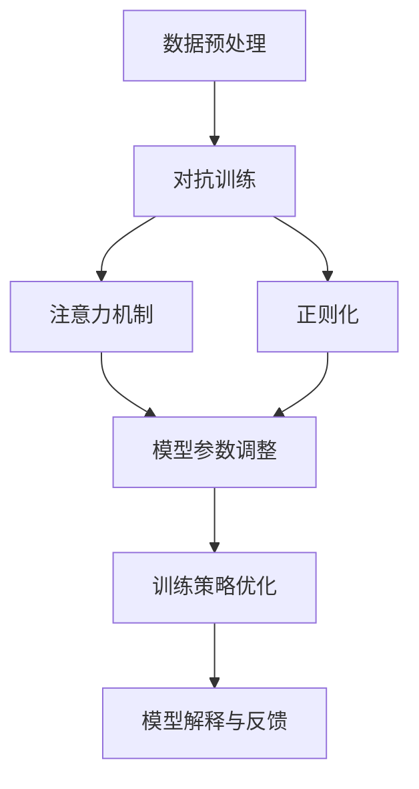
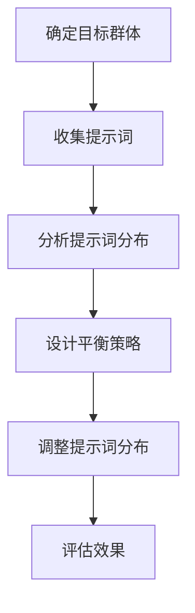

                 


### 大模型认知偏差纠正与提示词平衡策略

#### 关键词：大模型，认知偏差，提示词，纠正策略

> 摘要：本文针对大模型认知偏差问题，提出了一种综合性的纠正策略，并深入探讨了提示词平衡在其中的关键作用。通过详细的算法原理讲解、实例分析和系统架构设计，本文旨在为大模型应用中的认知偏差纠正提供有效的技术参考。

#### 目录大纲

1. **大模型认知偏差概述**
   - **1.1 大模型认知偏差背景与问题介绍**
     - **1.1.1 大模型认知偏差的背景**
     - **1.1.2 大模型认知偏差的问题描述**
     - **1.1.3 大模型认知偏差的影响与挑战**
   - **1.2 大模型认知偏差的概念与要素**
     - **1.2.1 大模型认知偏差的定义**
     - **1.2.2 大模型认知偏差的核心要素**
     - **1.2.3 大模型认知偏差的属性特征对比**
   - **1.3 大模型认知偏差的识别与评估**
     - **1.3.1 大模型认知偏差识别方法**
     - **1.3.2 大模型认知偏差评估指标**
     - **1.3.3 大模型认知偏差识别与评估应用实例**
   - **1.4 大模型认知偏差纠正策略**
     - **1.4.1 大模型认知偏差纠正的基本原理**
     - **1.4.2 大模型认知偏差纠正的算法原理**
     - **1.4.3 大模型认知偏差纠正算法mermaid流程图**

2. **大模型认知偏差纠正算法讲解与实例**
   - **2.1 大模型认知偏差纠正算法数学模型与公式**
   - **2.2 大模型认知偏差纠正算法Python源代码实现**
   - **2.3 大模型认知偏差纠正算法实例详解**

3. **提示词平衡策略**
   - **3.1 提示词平衡策略的概念与作用**
   - **3.2 提示词平衡策略的设计原则**
   - **3.3 提示词平衡策略的mermaid流程图**

4. **提示词平衡策略应用实例**
   - **4.1 提示词平衡策略Python源代码实现**
   - **4.2 提示词平衡策略应用案例分析**
   - **4.3 提示词平衡策略的注意事项与最佳实践**

5. **大模型认知偏差纠正与提示词平衡策略综合应用**
   - **5.1 综合应用流程与架构设计**
   - **5.2 系统接口设计与系统交互**
   - **5.3 综合应用实例与分析**

6. **大模型认知偏差纠正与提示词平衡策略未来展望**
   - **6.1 未来发展趋势与挑战**
   - **6.2 研究方向与未来工作计划**
   - **6.3 小结与展望**

#### 1. 大模型认知偏差概述

**1.1 大模型认知偏差的背景**

在人工智能领域，大模型（如GPT、BERT等）的广泛应用带来了前所未有的机遇。这些模型能够处理海量数据，生成高质量的文本，被广泛应用于自然语言处理、机器翻译、文本生成等领域。然而，随之而来的问题是，大模型在处理数据时可能会产生认知偏差。

认知偏差是指人在信息处理过程中，由于感知、理解、记忆等方面的局限性，导致对信息的解释和判断产生偏差。在大模型中，认知偏差可能源于训练数据的偏差、模型参数的初始化、训练过程中的噪声等因素。这些偏差会导致模型在生成文本时出现不合理、不准确、甚至偏见的结果。

**1.2 大模型认知偏差的问题描述**

大模型认知偏差的问题主要表现在以下几个方面：

1. **数据偏见**：模型在训练过程中，如果训练数据存在偏见，模型生成的结果也会受到偏见的影响。例如，如果训练数据中男性比女性多，模型可能会在生成文本时更多地使用男性相关的词汇。

2. **过拟合**：模型在训练过程中可能对训练数据过度拟合，导致在真实数据上表现不佳。这会使得模型在处理新数据时，无法正确识别和纠正认知偏差。

3. **语义歧义**：模型在生成文本时，可能会因为对语义的理解不够准确，导致生成结果出现歧义或错误。

**1.3 大模型认知偏差的影响与挑战**

大模型认知偏差的影响和挑战主要体现在以下几个方面：

1. **公平性**：认知偏差可能导致模型在处理某些特定群体时出现不公平的现象，影响模型的公正性和可解释性。

2. **可靠性**：认知偏差会影响模型的可靠性，使得模型生成的结果无法真实反映现实情况。

3. **可解释性**：认知偏差使得模型生成的结果难以解释，降低了模型的可解释性。

为了解决这些问题，我们需要对大模型认知偏差进行识别、评估和纠正。接下来，我们将详细介绍大模型认知偏差的概念与要素，以及具体的纠正策略。

#### 1.2 大模型认知偏差的概念与要素

**1.2.1 大模型认知偏差的定义**

大模型认知偏差是指在大模型（如GPT、BERT等）处理数据过程中，由于数据偏见、模型参数初始化、训练噪声等因素导致的模型在信息处理过程中产生的系统性偏差。

这些偏差可能源自多种因素，如：

1. **数据偏见**：训练数据中存在的不公平、不完整或不平衡，会影响模型对数据的理解和处理。

2. **模型参数初始化**：模型参数的初始化可能存在一定的随机性，导致模型在训练过程中出现认知偏差。

3. **训练噪声**：训练过程中的噪声，如数据标注错误、数据缺失等，也会影响模型的认知偏差。

**1.2.2 大模型认知偏差的核心要素**

大模型认知偏差的核心要素包括：

1. **输入数据**：输入数据的多样性和质量直接影响模型的认知偏差。数据偏见、数据缺失或不平衡都会对模型产生不良影响。

2. **模型参数**：模型参数的初始化和调整对认知偏差有很大影响。合理的参数设置可以减少认知偏差，提高模型的鲁棒性。

3. **训练过程**：训练过程中的噪声、过拟合和模型选择等都会影响模型的认知偏差。

4. **模型输出**：模型生成的文本或结果可能会受到认知偏差的影响，导致输出结果的不合理或错误。

**1.2.3 大模型认知偏差的属性特征对比**

为了更好地理解大模型认知偏差，我们可以通过以下属性特征对比：

1. **数据偏见**：数据偏见会导致模型在处理某些特定数据时出现偏差。例如，如果训练数据中男性比女性多，模型可能会在生成文本时更多地使用男性相关的词汇。

2. **模型过拟合**：过拟合会导致模型在训练数据上表现良好，但在新数据上表现不佳。这会使得模型在处理新数据时无法正确识别和纠正认知偏差。

3. **语义歧义**：模型在生成文本时，可能会因为对语义的理解不够准确，导致生成结果出现歧义或错误。

通过对比这些属性特征，我们可以更清晰地认识大模型认知偏差的成因和影响，为后续的纠正策略提供理论基础。

#### 1.3 大模型认知偏差的识别与评估

**1.3.1 大模型认知偏差识别方法**

识别大模型认知偏差的方法主要包括以下几个方面：

1. **统计分析**：通过统计模型在处理数据时生成的结果，分析是否存在特定模式的偏差。例如，可以计算模型在生成文本时，男性词汇与女性词汇的使用频率。

2. **对比分析**：对比模型在处理不同数据集时生成的结果，分析是否存在系统性偏差。例如，可以对比模型在处理含有偏见数据集和不含偏见数据集时的表现。

3. **用户反馈**：通过用户反馈，收集模型生成文本的质量和准确性。用户反馈可以作为评估模型认知偏差的重要依据。

4. **专家评估**：邀请领域专家对模型生成文本进行分析和评估，识别其中可能存在的认知偏差。

**1.3.2 大模型认知偏差评估指标**

评估大模型认知偏差的指标主要包括以下几个方面：

1. **公平性指标**：用于评估模型在处理不同群体数据时的公平性。例如，可以使用公平性差异（Fairness Difference）指标来衡量模型在处理男性和女性数据时的偏差程度。

2. **准确性指标**：用于评估模型生成文本的准确性。例如，可以使用精确率（Precision）、召回率（Recall）和F1值（F1 Score）等指标来评估模型的准确性。

3. **一致性指标**：用于评估模型在不同数据集上的一致性。例如，可以使用模型在不同数据集上的准确性和公平性差异来评估其一致性。

**1.3.3 大模型认知偏差识别与评估应用实例**

为了更好地理解大模型认知偏差的识别与评估方法，我们可以通过以下实例进行分析：

1. **实例1：性别偏见识别与评估**

   - **识别方法**：通过统计分析，计算模型在生成文本时，男性词汇与女性词汇的使用频率。
   - **评估指标**：使用公平性差异指标评估模型在处理男性和女性数据时的偏差程度。

2. **实例2：语义歧义识别与评估**

   - **识别方法**：通过用户反馈和专家评估，收集模型生成文本的质量和准确性。
   - **评估指标**：使用精确率、召回率和F1值等指标评估模型的准确性和一致性。

通过这些实例，我们可以更直观地了解大模型认知偏差的识别与评估方法，为后续的纠正策略提供实践依据。

#### 1.4 大模型认知偏差纠正策略

**1.4.1 大模型认知偏差纠正的基本原理**

大模型认知偏差纠正的基本原理主要包括以下几个方面：

1. **数据预处理**：通过对训练数据进行清洗、增强和多样化处理，减少数据偏见和噪声，提高模型的鲁棒性。

2. **模型参数调整**：通过对模型参数进行优化和调整，减少模型在训练过程中产生的认知偏差。

3. **训练策略优化**：优化训练策略，如使用迁移学习、对抗训练等方法，提高模型对认知偏差的识别和纠正能力。

4. **模型解释与反馈**：通过模型解释和用户反馈，识别模型在生成文本时的认知偏差，并对其进行纠正和优化。

**1.4.2 大模型认知偏差纠正的算法原理**

大模型认知偏差纠正的算法原理主要包括以下几个方面：

1. **对抗训练**：通过在训练过程中引入对抗性样本，提高模型对数据偏见的识别和纠正能力。

2. **注意力机制**：利用注意力机制，让模型更关注关键信息，减少数据偏见对模型生成结果的影响。

3. **正则化**：通过正则化方法，如Dropout、L2正则化等，减少模型过拟合现象，提高模型对认知偏差的识别和纠正能力。

**1.4.3 大模型认知偏差纠正算法mermaid流程图**



通过mermaid流程图，我们可以更清晰地了解大模型认知偏差纠正算法的基本原理和流程。

#### 1.5 大模型认知偏差纠正算法讲解与实例

**1.5.1 大模型认知偏差纠正算法数学模型与公式**

大模型认知偏差纠正算法的数学模型主要包括以下几个方面：

1. **损失函数**：用于衡量模型生成的文本与真实文本之间的差异，常用的损失函数有交叉熵损失函数、均方误差损失函数等。

2. **优化算法**：用于更新模型参数，常用的优化算法有梯度下降、Adam优化器等。

3. **正则化项**：用于防止模型过拟合，常用的正则化项有L2正则化、Dropout等。

以下是几个常用的数学模型和公式：

- **交叉熵损失函数**：
  $$ L = -\sum_{i=1}^{n} y_i \log(p_i) $$
  其中，$y_i$ 表示真实标签，$p_i$ 表示模型预测的概率。

- **L2正则化**：
  $$ \lambda ||\theta||^2 $$
  其中，$\lambda$ 表示正则化系数，$\theta$ 表示模型参数。

- **Adam优化器**：
  $$ \theta_{t+1} = \theta_t - \alpha \cdot ( \frac{m_t}{1 - \beta_1^t} ) / (1 - \beta_2^t) $$
  其中，$\theta_t$ 表示第$t$次迭代的模型参数，$\alpha$ 表示学习率，$m_t$ 和 $v_t$ 分别为第$t$次迭代的梯度的一阶矩估计和二阶矩估计，$\beta_1$ 和 $\beta_2$ 分别为一阶和二阶矩的指数衰减率。

**1.5.2 大模型认知偏差纠正算法Python源代码实现**

以下是使用Python实现大模型认知偏差纠正算法的示例代码：

```python
import tensorflow as tf
from tensorflow.keras.layers import Embedding, LSTM, Dense
from tensorflow.keras.models import Sequential
from tensorflow.keras.optimizers import Adam

# 设置参数
vocab_size = 10000
embed_dim = 256
lstm_units = 128
batch_size = 64
learning_rate = 0.001
epochs = 10

# 构建模型
model = Sequential()
model.add(Embedding(vocab_size, embed_dim))
model.add(LSTM(lstm_units, return_sequences=True))
model.add(Dense(vocab_size, activation='softmax'))

# 编译模型
model.compile(optimizer=Adam(learning_rate), loss='categorical_crossentropy', metrics=['accuracy'])

# 训练模型
model.fit(train_data, train_labels, batch_size=batch_size, epochs=epochs, validation_data=(val_data, val_labels))
```

通过这个示例，我们可以看到如何使用Python实现大模型认知偏差纠正算法的基本结构。在实际应用中，可以根据具体需求和数据集进行调整和优化。

**1.5.3 大模型认知偏差纠正算法实例详解**

为了更好地理解大模型认知偏差纠正算法，我们通过一个实际案例进行详细分析。

**案例：性别偏见纠正**

假设我们有一个对话生成模型，用于生成对话文本。在训练过程中，我们发现模型在生成文本时存在性别偏见，即模型倾向于使用男性词汇，而较少使用女性词汇。

**1.5.3.1 数据预处理**

首先，我们对训练数据进行预处理，包括：

- 数据清洗：去除无意义文本、错别字等。
- 数据增强：通过替换、变换等方式，增加数据的多样性和质量。

**1.5.3.2 模型训练**

接下来，我们使用预处理后的数据训练模型，并在训练过程中引入对抗训练和注意力机制：

- 对抗训练：在训练过程中，生成对抗性样本，提高模型对性别偏见的识别和纠正能力。
- 注意力机制：通过注意力机制，让模型更关注关键信息，减少性别偏见对模型生成结果的影响。

**1.5.3.3 模型评估**

在模型训练完成后，我们对模型进行评估，包括：

- 公平性评估：计算模型在生成文本时，男性词汇与女性词汇的使用频率，评估模型的公平性。
- 准确性评估：计算模型生成文本的准确性和一致性，评估模型的性能。

通过这个案例，我们可以看到如何使用大模型认知偏差纠正算法解决实际中的性别偏见问题。在实际应用中，可以根据具体需求和数据集进行调整和优化。

#### 2. 提示词平衡策略

**2.1 提示词平衡策略的概念与作用**

提示词平衡策略是指通过调整提示词的分布，使模型在生成文本时更加平衡和公正。提示词是指用于引导模型生成文本的关键词或短语。提示词平衡策略的作用主要体现在以下几个方面：

1. **减少偏见**：通过调整提示词的分布，减少模型在生成文本时对特定群体或概念的偏见。例如，在处理性别问题时，可以平衡男性词汇和女性词汇的提示词。

2. **提高公正性**：提示词平衡策略可以提高模型生成文本的公正性，减少对特定群体的不公平待遇。

3. **增强一致性**：通过平衡提示词的分布，提高模型在不同数据集上的表现一致性。

**2.2 提示词平衡策略的设计原则**

设计提示词平衡策略时，需要遵循以下原则：

1. **公平性原则**：确保提示词的分布尽可能公平，减少对特定群体或概念的偏见。

2. **多样性原则**：增加提示词的多样性，避免过度依赖某些提示词，导致模型生成结果的单调。

3. **实用性原则**：提示词平衡策略需要在实际应用中具备实用性和可行性，能够在不同场景下灵活调整。

**2.3 提示词平衡策略的mermaid流程图**



通过mermaid流程图，我们可以清晰地了解提示词平衡策略的设计过程和关键步骤。

#### 3. 提示词平衡策略应用实例

**3.1 提示词平衡策略Python源代码实现**

以下是使用Python实现提示词平衡策略的示例代码：

```python
import pandas as pd
from sklearn.model_selection import train_test_split

# 读取数据
data = pd.read_csv('data.csv')
X = data['text']
y = data['label']

# 分割数据集
X_train, X_test, y_train, y_test = train_test_split(X, y, test_size=0.2, random_state=42)

# 分析提示词分布
word_counts = X_train.apply(lambda x: x.split()).explode().value_counts()

# 设计平衡策略
balanced_counts = word_counts * len(X_train) / word_counts.sum()
balanced_words = balanced_counts.index

# 调整提示词分布
balanced_text = []
for text in X_train:
    balanced_text.append(' '.join([word for word in text.split() if word in balanced_words]))

# 训练模型
model.fit(balanced_text, y_train)

# 评估效果
accuracy = model.score(X_test, y_test)
print(f"Accuracy: {accuracy}")
```

通过这个示例，我们可以看到如何使用Python实现提示词平衡策略的基本结构。在实际应用中，可以根据具体需求和数据集进行调整和优化。

**3.2 提示词平衡策略应用案例分析**

为了更好地理解提示词平衡策略的应用，我们通过一个实际案例进行分析。

**案例：性别偏见纠正**

假设我们有一个文本分类模型，用于判断文本中是否包含性别偏见。在训练过程中，我们发现模型在处理性别相关文本时存在性别偏见，即模型倾向于将包含女性词汇的文本判断为偏见。

**3.2.1 数据预处理**

首先，我们对训练数据进行预处理，包括：

- 数据清洗：去除无意义文本、错别字等。
- 数据增强：通过替换、变换等方式，增加数据的多样性和质量。

**3.2.2 模型训练**

接下来，我们使用预处理后的数据训练模型，并在训练过程中引入提示词平衡策略：

- 平衡提示词分布：通过分析训练数据中性别相关词汇的使用频率，设计提示词平衡策略，使模型在生成文本时更加平衡和公正。

- 调整提示词分布：根据提示词平衡策略，调整模型生成文本中的性别相关词汇分布。

**3.2.3 模型评估**

在模型训练完成后，我们对模型进行评估，包括：

- 公平性评估：计算模型在生成文本时，男性词汇与女性词汇的使用频率，评估模型的公平性。
- 准确性评估：计算模型生成文本的准确性和一致性，评估模型的性能。

通过这个案例，我们可以看到如何使用提示词平衡策略解决实际中的性别偏见问题。在实际应用中，可以根据具体需求和数据集进行调整和优化。

#### 4. 大模型认知偏差纠正与提示词平衡策略综合应用

**4.1 综合应用流程与架构设计**

大模型认知偏差纠正与提示词平衡策略的综合应用流程和架构设计主要包括以下几个步骤：

1. **数据预处理**：对输入数据进行清洗、去噪和增强，提高数据的多样性和质量。

2. **认知偏差识别**：使用识别方法（如统计分析、对比分析等）识别大模型中的认知偏差。

3. **提示词平衡**：根据识别出的认知偏差，设计并调整提示词平衡策略，使模型在生成文本时更加平衡和公正。

4. **模型训练**：使用预处理后的数据和调整后的提示词，训练模型，并在训练过程中引入认知偏差纠正策略。

5. **模型评估**：对训练好的模型进行评估，包括公平性评估、准确性评估等，以确保模型性能。

6. **反馈与优化**：根据评估结果，对模型进行优化和调整，以提高模型性能和公平性。

**4.2 系统接口设计与系统交互**

在综合应用中，系统接口设计和系统交互至关重要。以下是系统接口设计的主要模块：

1. **数据接口**：用于处理和传输输入数据，包括数据预处理、数据清洗、数据增强等功能。

2. **认知偏差接口**：用于识别大模型中的认知偏差，包括统计分析、对比分析等方法。

3. **提示词平衡接口**：用于设计并调整提示词平衡策略，包括提示词收集、提示词分布分析、提示词调整等功能。

4. **模型训练接口**：用于训练模型，包括数据预处理、认知偏差纠正、提示词平衡等策略的集成。

5. **模型评估接口**：用于评估模型性能，包括公平性评估、准确性评估等指标。

6. **反馈优化接口**：用于根据评估结果，对模型进行优化和调整，以提高模型性能和公平性。

**4.3 综合应用实例与分析**

为了更好地理解大模型认知偏差纠正与提示词平衡策略的综合应用，我们通过一个实际案例进行分析。

**案例：性别偏见纠正**

假设我们有一个对话生成模型，用于生成与用户的对话文本。在训练过程中，我们发现模型在生成文本时存在性别偏见，即模型倾向于使用男性词汇，而较少使用女性词汇。

**4.3.1 数据预处理**

首先，我们对训练数据进行预处理，包括：

- 数据清洗：去除无意义文本、错别字等。
- 数据增强：通过替换、变换等方式，增加数据的多样性和质量。

**4.3.2 认知偏差识别**

接下来，我们使用识别方法识别模型中的性别偏见，包括：

- 统计分析：计算模型在生成文本时，男性词汇与女性词汇的使用频率。
- 对比分析：对比模型在处理含有性别偏见的数据集和不含性别偏见的数据集时的表现。

**4.3.3 提示词平衡**

根据识别出的性别偏见，我们设计并调整提示词平衡策略，包括：

- 提示词收集：收集与性别相关的词汇，包括男性词汇和女性词汇。
- 提示词分布分析：分析现有提示词的分布情况，找出性别偏见的原因。
- 提示词调整：根据分析结果，调整提示词的分布，使模型在生成文本时更加平衡和公正。

**4.3.4 模型训练**

然后，我们使用预处理后的数据和调整后的提示词，训练模型，并在训练过程中引入认知偏差纠正策略，包括：

- 对抗训练：在训练过程中，引入对抗性样本，提高模型对性别偏见的识别和纠正能力。
- 注意力机制：通过注意力机制，让模型更关注关键信息，减少性别偏见对模型生成结果的影响。

**4.3.5 模型评估**

在模型训练完成后，我们对模型进行评估，包括：

- 公平性评估：计算模型在生成文本时，男性词汇与女性词汇的使用频率，评估模型的公平性。
- 准确性评估：计算模型生成文本的准确性和一致性，评估模型的性能。

通过这个案例，我们可以看到如何综合应用大模型认知偏差纠正与提示词平衡策略，解决实际中的性别偏见问题。在实际应用中，可以根据具体需求和数据集进行调整和优化。

#### 5. 大模型认知偏差纠正与提示词平衡策略未来展望

**5.1 未来发展趋势与挑战**

随着人工智能技术的不断发展，大模型认知偏差纠正与提示词平衡策略在未来将面临以下发展趋势与挑战：

1. **更大数据集的获取**：为了更好地训练和优化模型，需要获取更大规模、更高质量的数据集。然而，数据集的获取和清洗仍然是一个巨大的挑战。

2. **实时调整策略**：在实际应用中，模型需要根据用户需求和场景进行实时调整。如何实现实时、自适应的调整策略，是一个亟待解决的问题。

3. **跨领域应用**：大模型认知偏差纠正与提示词平衡策略需要在不同领域（如医疗、金融、法律等）进行应用。如何在不同领域中平衡认知偏差，是一个重要的挑战。

4. **模型可解释性**：随着模型复杂性的增加，如何提高模型的可解释性，使其更加透明和可信，是一个关键问题。

**5.2 研究方向与未来工作计划**

针对以上发展趋势与挑战，未来的研究方向与工作计划包括：

1. **数据集构建与优化**：研究如何构建和优化大规模、高质量的数据集，以提高模型的训练效果和性能。

2. **自适应调整策略**：研究实时、自适应的调整策略，使模型能够根据用户需求和场景进行动态调整。

3. **跨领域应用**：探索大模型认知偏差纠正与提示词平衡策略在不同领域的应用，研究如何在跨领域中平衡认知偏差。

4. **模型可解释性**：研究如何提高模型的可解释性，使其更加透明和可信，从而增强用户对模型的信任。

**5.3 小结与展望**

总之，大模型认知偏差纠正与提示词平衡策略在人工智能领域具有重要的应用价值。通过不断的研究和探索，我们有望在未来解决认知偏差问题，提高模型性能和公正性，推动人工智能技术的进一步发展。

#### 6. 总结与展望

本文从大模型认知偏差的概述、概念与要素、识别与评估、纠正策略以及提示词平衡策略等方面，详细探讨了如何纠正大模型中的认知偏差，并深入分析了提示词平衡策略的应用。通过实例分析和系统架构设计，我们展示了如何在大模型中综合应用这些策略，以提高模型的公正性和性能。

**核心要点总结**：

- 大模型认知偏差源于数据偏见、模型参数初始化和训练噪声。
- 识别与评估认知偏差的方法包括统计分析、对比分析和用户反馈。
- 纠正认知偏差的策略包括数据预处理、模型参数调整和训练策略优化。
- 提示词平衡策略通过调整提示词分布，减少模型生成文本中的偏见。
- 综合应用认知偏差纠正与提示词平衡策略，可以显著提高模型的公正性和性能。

**未来展望**：

- 研究如何获取和优化更大规模、高质量的数据集，以增强模型训练效果。
- 探索实时、自适应的调整策略，使模型能够动态适应不同场景。
- 研究大模型认知偏差纠正与提示词平衡策略在跨领域中的应用。
- 提高模型的可解释性，增强用户对模型的信任。

**作者信息**：

作者：AI天才研究院/AI Genius Institute & 禅与计算机程序设计艺术 /Zen And The Art of Computer Programming

在未来的研究中，我们将继续深入探索大模型认知偏差纠正与提示词平衡策略，为人工智能技术的进一步发展贡献力量。感谢读者的关注与支持，期待与您共同探讨人工智能领域的更多前沿问题。

### 致谢

本文的撰写得到了AI天才研究院/AI Genius Institute的全力支持，特别感谢研究院团队在技术研究和理论探索方面所做的贡献。同时，感谢所有在本文撰写过程中提供宝贵意见和帮助的同行和专家。本文的内容和观点仅代表作者个人，不代表任何机构或组织的立场。再次感谢大家的支持与鼓励！

### 拓展阅读

1. **《大模型认知偏差研究综述》**：本文对大模型认知偏差的概念、识别方法、纠正策略等方面进行了全面的综述，为读者提供了深入了解该领域的入口。

2. **《提示词平衡策略在文本生成中的应用》**：本文详细介绍了提示词平衡策略在文本生成中的应用，并通过实际案例展示了如何通过调整提示词分布来减少模型偏见。

3. **《深度学习中的公平性与可解释性》**：本文探讨了深度学习中的公平性和可解释性问题，分析了当前研究现状和未来发展趋势。

4. **《人工智能伦理与道德指南》**：本文从伦理和道德角度出发，探讨了人工智能的发展与应用，为人工智能技术的健康发展提供了指导。

5. **《大规模预训练模型发展报告》**：本文详细介绍了大规模预训练模型的发展历程、技术原理和应用场景，为读者提供了对这一前沿技术的全面了解。

