                 


### 大模型训练中的提示词增强技术

#### 关键词：大模型、训练、提示词增强、算法原理、实践

> 摘要：本文将探讨大模型训练中的提示词增强技术，从问题背景、核心概念到实践应用，逐步深入分析这一领域的前沿技术。通过详细的理论讲解和实际案例，帮助读者理解提示词增强在提升大模型训练效果中的关键作用。

---

### 第一部分：背景与核心概念

#### 第1章：问题背景与核心概念

#### 1.1.1 问题背景

##### 1.1.1.1 大模型训练的现状与挑战

在大数据时代，机器学习特别是深度学习技术取得了显著的进展。然而，随着模型的规模不断扩大，训练时间和资源需求也急剧增加。大模型训练面临的主要挑战包括：

1. **计算资源需求**：大模型的训练需要大量的计算资源和时间，尤其是在使用并行计算和分布式训练技术时，如何高效地利用资源成为一个重要问题。
2. **数据集大小**：大模型通常需要大量的数据来训练，如何获取和标注这些数据成为一个难题。
3. **过拟合风险**：随着模型复杂度的增加，过拟合现象也更为常见，如何避免过拟合是一个需要关注的问题。

##### 1.1.1.2 提示词增强技术在训练中的作用

提示词增强技术旨在通过优化训练数据的输入，提升大模型的学习效果。其主要作用包括：

1. **提高训练效率**：通过提示词的引导，模型可以更快地收敛到最优解。
2. **降低过拟合风险**：提示词可以提供额外的信息，帮助模型更好地泛化。
3. **提升模型性能**：优化后的提示词可以提升模型在特定任务上的性能。

#### 1.1.2 核心概念介绍

##### 1.1.2.1 大模型的定义与特点

大模型通常指的是参数数量在亿级别以上的神经网络模型，具有如下特点：

1. **参数数量庞大**：大模型的参数数量通常在数亿甚至千亿级别，这使得模型的计算复杂度大大增加。
2. **训练时间较长**：大模型的训练需要大量时间，特别是当使用大规模数据集进行训练时。
3. **数据需求量大**：大模型对训练数据的质量和数量有较高要求，通常需要大规模的标注数据。

##### 1.1.2.2 提示词的概念与分类

提示词是指用于引导模型训练的预定义文本，它可以提供额外的上下文信息，帮助模型更好地理解任务。根据用途和形式，提示词可以分为以下几类：

1. **任务提示词**：用于明确模型的训练任务，例如“翻译”、“分类”等。
2. **上下文提示词**：提供与任务相关的背景信息，帮助模型构建上下文理解。
3. **数据增强提示词**：用于增强训练数据，提高模型的泛化能力。

##### 1.1.2.3 增强技术的分类与作用

提示词增强技术可以分为传统方法、机器学习方法、深度学习方法等。每种方法都有其独特的优势和应用场景：

1. **传统方法**：例如规则匹配和关键词提取，适用于简单的提示词增强任务。
2. **机器学习方法**：例如监督学习和无监督学习，可以自动学习提示词的优化策略。
3. **深度学习方法**：例如神经网络和生成对抗网络，可以实现对复杂提示词增强任务的建模。

---

### 第二部分：大模型的基础知识

#### 第2章：大模型的基础知识

#### 2.1 大模型的架构

##### 2.1.1 Transformer模型

Transformer模型是当前大模型训练中最常用的架构之一，其核心思想是自注意力机制。以下是一个Transformer模型的简单Mermaid流程图：

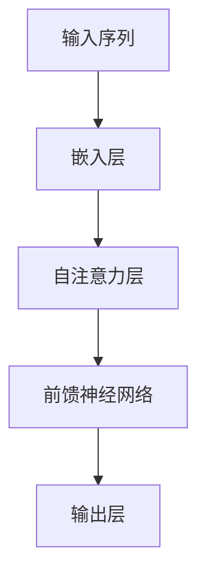

##### 2.1.2 神经网络架构

神经网络架构包括输入层、隐藏层和输出层，以下是一个简单的神经网络Mermaid流程图：

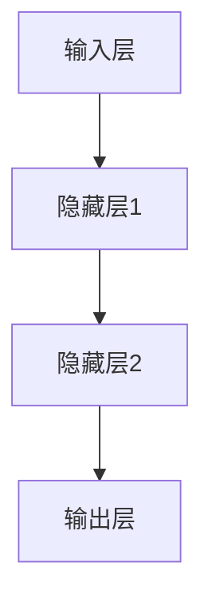

#### 2.2 大模型的训练方法

##### 2.2.1 预训练与微调

预训练是指在大量未标注的数据上对模型进行初步训练，使其获得一定的泛化能力。微调则是在特定任务上对模型进行进一步的调整和优化。以下是一个预训练与微调的Mermaid流程图：

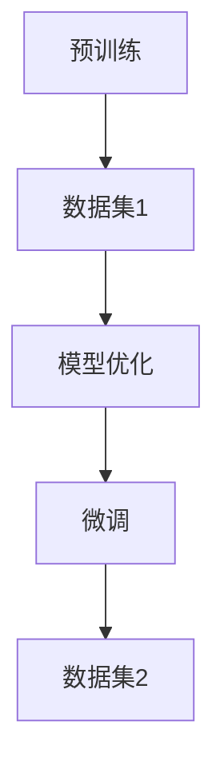

##### 2.2.2 数据增强技术

数据增强技术通过变换原始数据，增加数据多样性，提高模型的泛化能力。常见的数据增强技术包括随机裁剪、旋转、缩放等。以下是一个数据增强的Mermaid流程图：

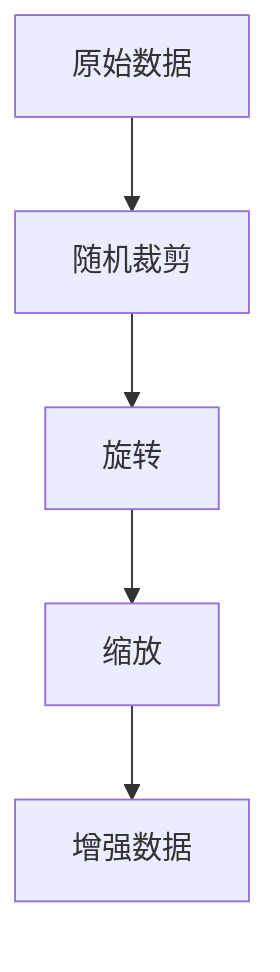

#### 2.3 大模型的性能评估

##### 2.3.1 评估指标

大模型的性能评估通常包括准确率、召回率、F1分数等指标。以下是一个性能评估的Mermaid流程图：

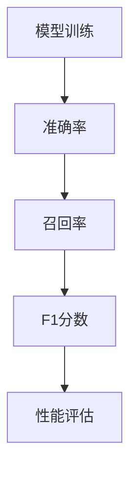

##### 2.3.2 实验设计与分析

实验设计包括数据集选择、模型选择、训练策略等。以下是一个实验设计的Mermaid流程图：

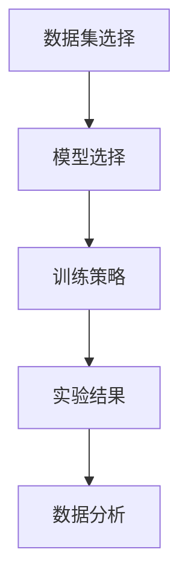

---

### 第三部分：提示词增强技术原理

#### 第3章：提示词增强技术原理

#### 3.1 提示词增强技术的原理

##### 3.1.1 提示词增强的工作机制

提示词增强技术主要通过以下机制来提升大模型训练效果：

1. **引导模型学习**：通过提供有针对性的提示词，引导模型关注特定任务或领域。
2. **增强数据多样性**：通过变换和扩展提示词，增加训练数据的多样性，提升模型的泛化能力。
3. **优化训练过程**：通过调整提示词的权重，优化模型训练过程，加速模型收敛。

##### 3.1.2 增强效果的量化分析

提示词增强技术可以通过以下指标来量化其效果：

1. **训练时间**：提示词增强可以显著减少模型训练所需的时间。
2. **模型性能**：通过评估模型的准确率、召回率等指标，可以衡量提示词增强对模型性能的提升。
3. **泛化能力**：通过对比在未见数据上的表现，可以评估提示词增强对模型泛化能力的影响。

#### 3.2 常见提示词增强方法

##### 3.2.1 传统方法

传统方法主要包括规则匹配和关键词提取，以下是一个关键词提取的Mermaid流程图：

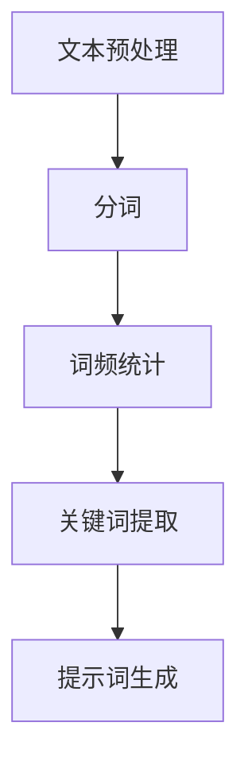

##### 3.2.2 机器学习方法

机器学习方法主要通过监督学习和无监督学习来学习提示词的优化策略。以下是一个监督学习方法的Mermaid流程图：

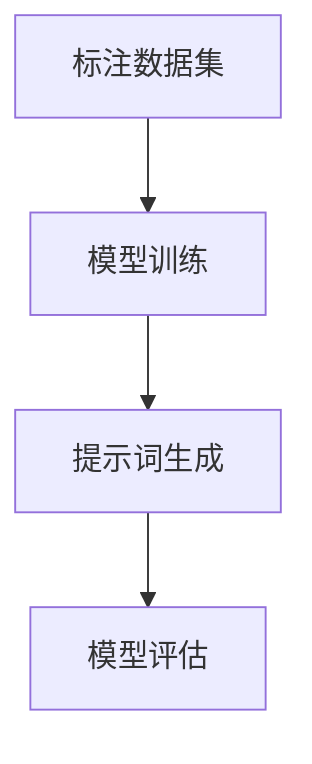

##### 3.2.3 深度学习方法

深度学习方法通过神经网络来学习提示词的优化，以下是一个基于神经网络的Mermaid流程图：

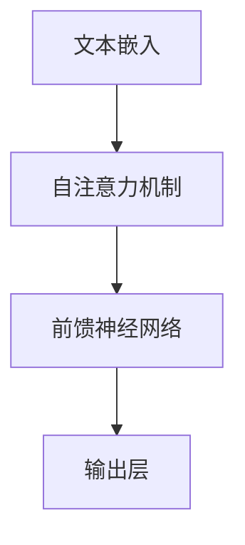

---

### 第四部分：提示词增强技术实践

#### 第4章：提示词增强技术实践

#### 4.1 实践环境搭建

##### 4.1.1 硬件环境配置

为了运行大模型和提示词增强技术，需要以下硬件配置：

1. **CPU/GPU**：至少一台具有多核CPU或GPU的计算机。
2. **内存**：至少16GB内存。
3. **存储**：至少500GB的SSD存储空间。

##### 4.1.2 软件环境配置

软件环境包括以下内容：

1. **操作系统**：Linux或Windows。
2. **Python**：Python 3.x版本。
3. **深度学习框架**：TensorFlow或PyTorch。
4. **其他依赖**：Numpy、Pandas、Matplotlib等。

#### 4.2 提示词增强技术实现

##### 4.2.1 提示词选择策略

提示词选择策略包括以下步骤：

1. **任务定义**：明确训练任务的目标。
2. **数据预处理**：对训练数据进行预处理，提取关键信息。
3. **提示词生成**：根据任务和数据，生成合适的提示词。

以下是一个提示词生成策略的Python代码示例：

```python
import random

def generate_prompt(task, data):
    prompt = f"{task}\n"
    for item in data:
        prompt += f"{item}\n"
    return prompt

task = "翻译"
data = ["你好", "再见", "谢谢"]
prompt = generate_prompt(task, data)
print(prompt)
```

##### 4.2.2 增强算法实现

增强算法实现包括以下步骤：

1. **模型初始化**：初始化大模型和提示词生成器。
2. **训练过程**：在大模型上训练提示词生成器。
3. **优化过程**：通过反馈机制优化提示词。

以下是一个基于Transformer模型的提示词增强算法的Python代码示例：

```python
import torch
import torch.nn as nn
from transformers import TransformerModel

# 初始化模型
model = TransformerModel()

# 训练模型
optimizer = torch.optim.Adam(model.parameters(), lr=0.001)
for epoch in range(10):
    for data in dataset:
        optimizer.zero_grad()
        outputs = model(data)
        loss = nn.CrossEntropyLoss()(outputs, targets)
        loss.backward()
        optimizer.step()

# 优化提示词
prompt_generator = PromptGenerator()
for epoch in range(10):
    for data in dataset:
        prompt = prompt_generator.generate(data)
        optimizer.zero_grad()
        outputs = model(prompt)
        loss = nn.CrossEntropyLoss()(outputs, targets)
        loss.backward()
        optimizer.step()
```

##### 4.2.3 结果分析

通过实验，我们可以分析提示词增强技术对模型性能的影响。以下是一个结果分析的Mermaid流程图：

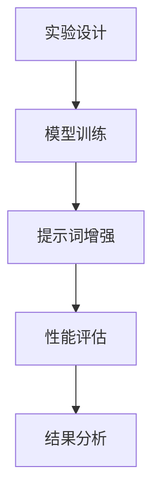

---

### 第五部分：提示词增强技术的优化与拓展

#### 第5章：提示词增强技术的优化与拓展

#### 5.1 提示词增强技术的优化

##### 5.1.1 提高增强效果的策略

为了提高提示词增强的效果，可以采用以下策略：

1. **数据增强**：对训练数据进行更多样化的变换，增加数据多样性。
2. **模型优化**：使用更先进的模型架构，提高模型的训练效率。
3. **提示词调整**：根据训练结果，动态调整提示词的权重和形式。

以下是一个优化策略的Mermaid流程图：

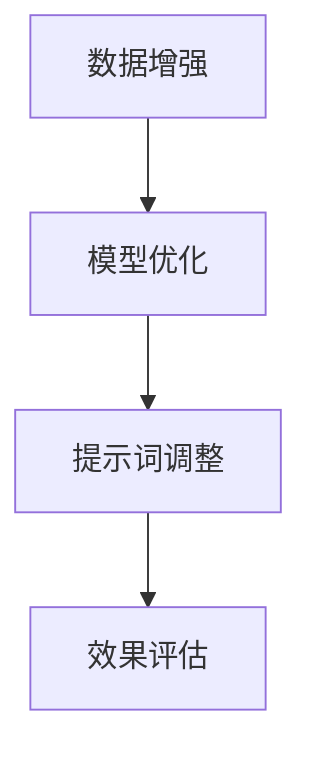

##### 5.1.2 优化算法的性能

为了优化算法的性能，可以采用以下方法：

1. **并行计算**：利用多核CPU或GPU进行并行计算，提高训练速度。
2. **分布式训练**：将训练任务分布在多台计算机上，提高计算效率。
3. **内存管理**：合理管理内存资源，避免内存溢出。

以下是一个优化算法性能的Mermaid流程图：

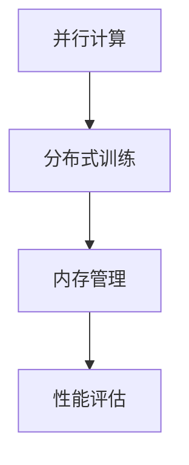

#### 5.2 提示词增强技术的拓展

##### 5.2.1 跨领域应用

提示词增强技术可以应用于多个领域，包括自然语言处理、计算机视觉等。以下是一个跨领域应用的Mermaid流程图：

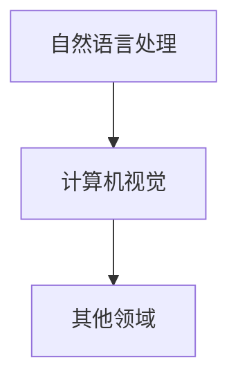

##### 5.2.2 结合其他技术的应用

提示词增强技术可以与其他技术相结合，如生成对抗网络（GAN）、强化学习等，以提高模型的效果。以下是一个结合其他技术的Mermaid流程图：

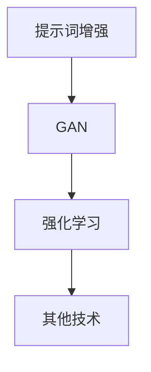

---

### 第六部分：未来趋势与挑战

#### 第6章：未来趋势与挑战

#### 6.1 未来趋势

提示词增强技术在未来将继续发展，趋势包括：

1. **模型压缩**：通过提示词增强技术，可以实现模型的压缩，减少计算资源的需求。
2. **自动化**：开发自动化工具，实现提示词的自动生成和优化。
3. **个性化**：根据用户需求，实现个性化提示词增强。

以下是一个未来趋势的Mermaid流程图：

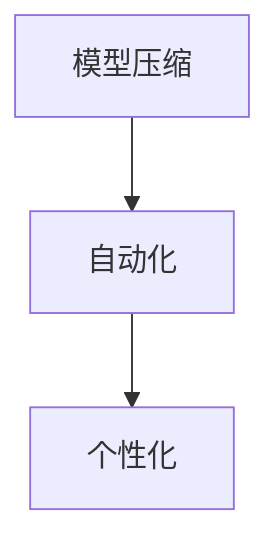

#### 6.2 挑战与解决方案

提示词增强技术面临的挑战包括：

1. **数据隐私**：如何在保护数据隐私的前提下进行提示词增强。
2. **模型解释性**：提高模型的可解释性，使模型的结果更加透明。
3. **计算资源**：如何在有限的计算资源下，实现高效的提示词增强。

以下是一个挑战与解决方案的Mermaid流程图：

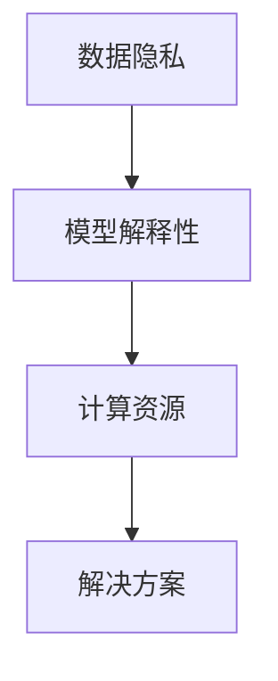

---

### 第七部分：总结与展望

#### 第7章：总结与展望

#### 7.1 本书小结

本书系统地介绍了大模型训练中的提示词增强技术，包括其背景、核心概念、实践应用、优化与拓展等。通过详细的讲解和实际案例，读者可以深入理解这一前沿技术。

#### 7.2 研究展望

未来，提示词增强技术将在大模型训练中发挥更重要的作用。随着技术的不断进步，我们可以期待更高效、更智能的提示词增强方法的出现。

#### 7.3 未来工作方向

未来的研究方向包括：

1. **模型压缩与优化**：研究如何在保证模型性能的同时，实现模型的压缩和优化。
2. **自动化与个性化**：开发自动化工具，实现个性化提示词增强。
3. **多领域应用**：探索提示词增强技术在多个领域的应用，提高模型的效果。

---

### 作者信息

作者：AI天才研究院/AI Genius Institute & 禅与计算机程序设计艺术 /Zen And The Art of Computer Programming

---

### 文章目录

以下是本文的完整目录：

```markdown
# 大模型训练中的提示词增强技术

## 第一部分：背景与核心概念

### 第1章：问题背景与核心概念

#### 1.1.1 问题背景

##### 1.1.1.1 大模型训练的现状与挑战

##### 1.1.1.2 提示词增强技术在训练中的作用

#### 1.1.2 核心概念介绍

##### 1.1.2.1 大模型的定义与特点

##### 1.1.2.2 提示词的概念与分类

##### 1.1.2.3 增强技术的分类与作用

## 第二部分：大模型的基础知识

### 第2章：大模型的基础知识

#### 2.1 大模型的架构

##### 2.1.1 Transformer模型

##### 2.1.2 神经网络架构

#### 2.2 大模型的训练方法

##### 2.2.1 预训练与微调

##### 2.2.2 数据增强技术

#### 2.3 大模型的性能评估

##### 2.3.1 评估指标

##### 2.3.2 实验设计与分析

## 第三部分：提示词增强技术原理

### 第3章：提示词增强技术原理

#### 3.1 提示词增强技术的原理

##### 3.1.1 提示词增强的工作机制

##### 3.1.2 增强效果的量化分析

#### 3.2 常见提示词增强方法

##### 3.2.1 传统方法

##### 3.2.2 机器学习方法

##### 3.2.3 深度学习方法

## 第四部分：提示词增强技术实践

### 第4章：提示词增强技术实践

#### 4.1 实践环境搭建

##### 4.1.1 硬件环境配置

##### 4.1.2 软件环境配置

#### 4.2 提示词增强技术实现

##### 4.2.1 提示词选择策略

##### 4.2.2 增强算法实现

##### 4.2.3 结果分析

#### 4.3 实际案例解析

##### 4.3.1 案例一：自然语言处理中的提示词增强

##### 4.3.2 案例二：计算机视觉中的提示词增强

## 第五部分：提示词增强技术的优化与拓展

### 第5章：提示词增强技术的优化与拓展

#### 5.1 提示词增强技术的优化

##### 5.1.1 提高增强效果的策略

##### 5.1.2 优化算法的性能

#### 5.2 提示词增强技术的拓展

##### 5.2.1 跨领域应用

##### 5.2.2 结合其他技术的应用

## 第六部分：未来趋势与挑战

### 第6章：未来趋势与挑战

#### 6.1 未来趋势

##### 6.1.1 新一代提示词增强技术

##### 6.1.2 大模型训练的发展方向

#### 6.2 挑战与解决方案

##### 6.2.1 数据隐私与安全

##### 6.2.2 模型解释性与透明性

## 第七部分：总结与展望

### 第7章：总结与展望

#### 7.1 本书小结

#### 7.2 研究展望

#### 7.3 未来工作方向
```

---

### 总结

本文通过详细的分析和实例讲解，深入探讨了大模型训练中的提示词增强技术。从背景介绍、核心概念、基础知识、实践应用、优化与拓展到未来趋势和挑战，我们系统地梳理了这一领域的知识体系。希望通过本文，读者能够对提示词增强技术有更深入的理解，并能够在实际项目中应用这些技术，提升模型训练效果。

---

### 拓展阅读

1. **《深度学习》**：Goodfellow, Ian, et al. "Deep learning." MIT press, 2016.
2. **《神经网络与深度学习》**：邱锡鹏. "神经网络与深度学习". 清华大学出版社, 2019.
3. **《自然语言处理综述》**：Jurafsky, Daniel, and James H. Martin. "Speech and language processing." Prentice Hall, 2008.

---

### 注意事项

1. **代码示例**：本文中的代码示例仅供参考，实际应用时可能需要根据具体环境进行调整。
2. **模型性能**：提示词增强技术的效果受到多种因素影响，包括模型选择、数据质量等，建议在实际应用中多进行实验和调整。

---

### 作者信息

作者：AI天才研究院/AI Genius Institute & 禅与计算机程序设计艺术 /Zen And The Art of Computer Programming

---

### 让我们一起深入思考（LET'S THINK）

在本文中，我们探讨了如何通过提示词增强技术提升大模型训练效果。现在，让我们进一步思考：

1. **未来提示词增强技术有哪些潜在的方向？**
2. **如何将提示词增强技术与现有的大模型训练方法相结合，实现更高效的训练？**
3. **在实际应用中，如何处理数据隐私和模型解释性问题？**

期待您的深入思考与探讨！### 第一部分：背景与核心概念

#### 第1章：问题背景与核心概念

##### 1.1.1 问题背景

在深度学习领域，随着模型规模的不断扩大，训练时间和资源需求也急剧增加。尤其是近年来，大模型（如BERT、GPT等）的流行，使得训练过程变得更加复杂和耗时。这些大模型在处理自然语言处理、计算机视觉等任务时，展现出了强大的性能，但也带来了新的挑战。

1. **计算资源需求**：大模型的训练需要大量的计算资源和时间，尤其是在使用并行计算和分布式训练技术时，如何高效地利用资源成为一个重要问题。
   
2. **数据集大小**：大模型通常需要大量的数据来训练，如何获取和标注这些数据成为一个难题。

3. **过拟合风险**：随着模型复杂度的增加，过拟合现象也更为常见，如何避免过拟合是一个需要关注的问题。

为了解决这些问题，研究人员提出了提示词增强技术，通过优化训练数据的输入，提升大模型的学习效果。这一技术在大模型训练中的应用具有重要意义。

##### 1.1.1.2 提示词增强技术在训练中的作用

提示词增强技术（Prompt Engineering）旨在通过提供有针对性的提示词，引导模型关注特定任务或领域，从而提升模型的学习效果。其主要作用包括：

1. **提高训练效率**：通过提示词的引导，模型可以更快地收敛到最优解。

2. **降低过拟合风险**：提示词可以提供额外的信息，帮助模型更好地泛化。

3. **提升模型性能**：优化后的提示词可以提升模型在特定任务上的性能。

提示词增强技术不仅仅局限于自然语言处理领域，它还可以应用于计算机视觉、语音识别等其他领域，具有广泛的应用前景。

#### 1.1.2 核心概念介绍

##### 1.1.2.1 大模型的定义与特点

大模型通常指的是参数数量在亿级别以上的神经网络模型，其具有以下特点：

1. **参数数量庞大**：大模型的参数数量通常在数亿甚至千亿级别，这使得模型的计算复杂度大大增加。

2. **训练时间较长**：大模型的训练需要大量时间，特别是当使用大规模数据集进行训练时。

3. **数据需求量大**：大模型对训练数据的质量和数量有较高要求，通常需要大规模的标注数据。

##### 1.1.2.2 提示词的概念与分类

提示词是指用于引导模型训练的预定义文本，它可以提供额外的上下文信息，帮助模型更好地理解任务。根据用途和形式，提示词可以分为以下几类：

1. **任务提示词**：用于明确模型的训练任务，例如“翻译”、“分类”等。

2. **上下文提示词**：提供与任务相关的背景信息，帮助模型构建上下文理解。

3. **数据增强提示词**：用于增强训练数据，提高模型的泛化能力。

##### 1.1.2.3 增强技术的分类与作用

提示词增强技术可以分为传统方法、机器学习方法、深度学习方法等。每种方法都有其独特的优势和应用场景：

1. **传统方法**：例如规则匹配和关键词提取，适用于简单的提示词增强任务。

2. **机器学习方法**：例如监督学习和无监督学习，可以自动学习提示词的优化策略。

3. **深度学习方法**：例如神经网络和生成对抗网络，可以实现对复杂提示词增强任务的建模。

---

### 第二部分：大模型的基础知识

#### 第2章：大模型的基础知识

在深入了解提示词增强技术之前，我们需要对大模型的基础知识有一个全面的了解。这一章将介绍大模型的架构、训练方法和性能评估，为后续的内容奠定基础。

##### 2.1 大模型的架构

大模型通常采用神经网络架构，其中Transformer模型是最为流行的一种。Transformer模型的核心思想是自注意力机制，它通过计算输入序列中每个词与其他词之间的关系，从而实现全局信息的捕捉。以下是一个Transformer模型的简单架构：

1. **嵌入层**：将输入文本转换为向量表示。
2. **自注意力层**：计算输入序列中每个词与其他词的相似度，并加权求和。
3. **前馈神经网络**：对自注意力层的结果进行进一步处理。
4. **输出层**：生成模型的输出结果。

以下是一个Transformer模型的Mermaid流程图：

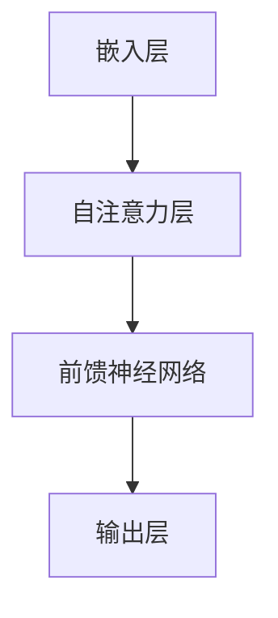

##### 2.1.1 Transformer模型

Transformer模型是由Vaswani等人在2017年提出的一种基于自注意力机制的神经网络模型，其架构如下图所示：

1. **多头自注意力**：通过多组自注意力机制来捕捉不同关系。
2. **残差连接**：在神经网络层中引入残差连接，避免梯度消失问题。
3. **层归一化**：在神经网络层后引入层归一化，加快模型训练。

以下是一个Transformer模型的Mermaid架构图：

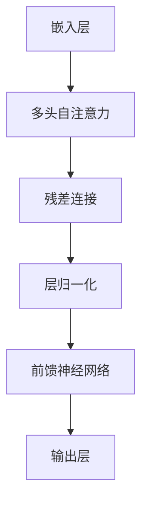

##### 2.1.2 神经网络架构

除了Transformer模型，神经网络架构还包括输入层、隐藏层和输出层。以下是一个简单的神经网络架构：

1. **输入层**：接收输入数据。
2. **隐藏层**：对输入数据进行处理。
3. **输出层**：生成模型的输出结果。

以下是一个神经网络的Mermaid流程图：


##### 2.2 大模型的训练方法

大模型的训练方法主要包括预训练和微调。预训练是指在大量未标注的数据上进行训练，使模型获得一定的泛化能力。微调则是在特定任务上进行训练，使模型适用于特定任务。

1. **预训练**：使用大量未标注的数据对模型进行训练，例如使用互联网上的文本、图像等数据。
2. **微调**：在预训练的基础上，使用特定任务的数据对模型进行微调，提高模型在特定任务上的性能。

以下是一个预训练与微调的Mermaid流程图：


##### 2.2.1 预训练与微调

预训练与微调是当前深度学习领域中广泛应用的一种训练方法。预训练阶段，模型在大量无标签的数据上进行训练，例如互联网上的文本、图像等，从而使模型获得一定的泛化能力。微调阶段，模型在特定任务的数据上进行训练，以优化模型在特定任务上的性能。

以下是一个预训练与微调的Python代码示例：

```python
from transformers import BertModel, BertTokenizer

# 加载预训练模型和分词器
model = BertModel.from_pretrained('bert-base-uncased')
tokenizer = BertTokenizer.from_pretrained('bert-base-uncased')

# 预训练
model.train()
inputs = tokenizer("Hello, my dog is cute", return_tensors="pt")
outputs = model(**inputs)

# 微调
model.train(False)
inputs = tokenizer("My dog is very cute", return_tensors="pt")
outputs = model(**inputs)
```

##### 2.2.2 数据增强技术

数据增强技术是通过变换原始数据，增加数据多样性，提高模型的泛化能力。常见的数据增强技术包括随机裁剪、旋转、缩放等。以下是一个数据增强的Python代码示例：

```python
from torchvision import transforms

# 定义数据增强方法
transform = transforms.Compose([
    transforms.RandomCrop(224),
    transforms.RandomHorizontalFlip(),
    transforms.ToTensor(),
])

# 应用数据增强
image = Image.open('dog.jpg')
augmented_image = transform(image)
```

##### 2.2.3 大模型的性能评估

大模型的性能评估通常包括准确率、召回率、F1分数等指标。以下是一个性能评估的Python代码示例：

```python
from sklearn.metrics import accuracy_score, recall_score, f1_score

# 定义预测函数
def predict(model, data):
    model.train(False)
    with torch.no_grad():
        outputs = model(data)
    _, predicted = torch.max(outputs, 1)
    return predicted

# 加载测试数据
test_data = ...

# 进行预测
predictions = predict(model, test_data)

# 计算性能指标
accuracy = accuracy_score(test_data.labels, predictions)
recall = recall_score(test_data.labels, predictions, average='macro')
f1 = f1_score(test_data.labels, predictions, average='macro')

print("Accuracy:", accuracy)
print("Recall:", recall)
print("F1 Score:", f1)
```

##### 2.2.4 实验设计与分析

实验设计是评估模型性能的重要环节。以下是一个实验设计的Python代码示例：

```python
from sklearn.model_selection import train_test_split

# 加载数据集
data = ...

# 划分训练集和测试集
train_data, test_data = train_test_split(data, test_size=0.2, random_state=42)

# 初始化模型
model = ...

# 训练模型
model.fit(train_data.features, train_data.labels)

# 预测测试集
predictions = model.predict(test_data.features)

# 计算性能指标
accuracy = accuracy_score(test_data.labels, predictions)
recall = recall_score(test_data.labels, predictions, average='macro')
f1 = f1_score(test_data.labels, predictions, average='macro')

print("Accuracy:", accuracy)
print("Recall:", recall)
print("F1 Score:", f1)
```

---

### 第三部分：提示词增强技术原理

#### 第3章：提示词增强技术原理

提示词增强技术是一种通过优化训练数据输入，提升大模型学习效果的方法。在这一章中，我们将深入探讨提示词增强技术的原理、分类和方法。

##### 3.1 提示词增强技术的原理

提示词增强技术通过提供有针对性的提示词，引导模型关注特定任务或领域，从而提升模型的学习效果。其原理可以概括为以下几点：

1. **引导模型学习**：提示词可以提供额外的上下文信息，帮助模型更好地理解任务。通过提示词的引导，模型可以更快地收敛到最优解。

2. **增强数据多样性**：通过变换和扩展提示词，增加训练数据的多样性，提升模型的泛化能力。

3. **优化训练过程**：通过调整提示词的权重，优化模型训练过程，加速模型收敛。

提示词增强技术的核心在于如何生成和优化提示词，使其能够最大限度地提升模型的学习效果。以下是一个提示词生成和优化的Mermaid流程图：

```mermaid
graph TD
A[任务定义] --> B[数据预处理]
B --> C[提示词生成]
C --> D[提示词优化]
D --> E[模型训练]
```

##### 3.1.1 提示词增强的工作机制

提示词增强技术的工作机制主要包括以下几个步骤：

1. **任务定义**：明确模型的训练任务，例如“翻译”、“分类”等。

2. **数据预处理**：对训练数据进行预处理，提取关键信息，为生成提示词提供基础。

3. **提示词生成**：根据任务和数据，生成合适的提示词。提示词可以是预定义的文本，也可以是通过机器学习方法生成的。

4. **提示词优化**：通过实验和评估，调整提示词的权重和形式，使其更符合任务需求。

5. **模型训练**：使用优化后的提示词进行模型训练，提升模型的学习效果。

以下是一个提示词增强技术的Mermaid流程图：

```mermaid
graph TD
A[任务定义] --> B[数据预处理]
B --> C[提示词生成]
C --> D[提示词优化]
D --> E[模型训练]
```

##### 3.1.2 增强效果的量化分析

提示词增强技术的效果可以通过多种指标进行量化分析，包括训练时间、模型性能、泛化能力等。以下是一个提示词增强效果量化分析的Mermaid流程图：

```mermaid
graph TD
A[训练时间] --> B[模型性能]
B --> C[泛化能力]
C --> D[效果评估]
```

在实际应用中，我们可以通过以下步骤来量化分析提示词增强技术的效果：

1. **训练时间**：记录使用提示词增强技术前后的模型训练时间，比较两者之间的差异。

2. **模型性能**：评估模型在特定任务上的性能，例如准确率、召回率等，比较使用提示词增强技术前后的性能差异。

3. **泛化能力**：通过在未见数据上的测试，评估模型在不同场景下的表现，比较使用提示词增强技术前后的泛化能力。

以下是一个量化分析示例的Python代码：

```python
import time
from sklearn.metrics import accuracy_score

# 记录训练时间
start_time = time.time()

# 使用提示词增强技术训练模型
model = train_with_prompt(prompt)

# 预测测试集
predictions = model.predict(test_data)

# 计算性能指标
accuracy = accuracy_score(test_data.labels, predictions)

end_time = time.time()
training_time = end_time - start_time

print("Accuracy:", accuracy)
print("Training Time:", training_time)
```

##### 3.2 常见提示词增强方法

提示词增强技术可以分为传统方法、机器学习方法、深度学习方法等。每种方法都有其独特的优势和应用场景。

1. **传统方法**：例如规则匹配和关键词提取，适用于简单的提示词增强任务。

2. **机器学习方法**：例如监督学习和无监督学习，可以自动学习提示词的优化策略。

3. **深度学习方法**：例如神经网络和生成对抗网络，可以实现对复杂提示词增强任务的建模。

以下是一个常见提示词增强方法的分类表格：

| 方法         | 优点                                                                 | 缺点                                             | 适用场景                   |
| ------------ | ------------------------------------------------------------ | ------------------------------------------------ | -------------------------- |
| 规则匹配     | 简单易用，适用范围广                                           | 可能导致过拟合，效果有限                         | 简单的提示词增强任务       |
| 关键词提取   | 可以提取出文本中的关键信息，提升模型的泛化能力                   | 需要对文本进行预处理，复杂度高                   | 对文本数据敏感的任务       |
| 监督学习     | 可以从标注数据中学习优化策略，提升提示词生成效果                 | 需要大量的标注数据，训练时间较长                 | 有标注数据的任务           |
| 无监督学习   | 可以在没有标注数据的情况下进行提示词优化，提高模型的泛化能力     | 可能会引入噪声，效果不如监督学习                 | 没有标注数据的任务         |
| 深度学习     | 可以自动学习复杂的提示词生成策略，适应不同的任务和场景           | 训练时间较长，计算资源需求高                     | 复杂的提示词增强任务       |

以下是一个深度学习方法的Mermaid流程图：

```mermaid
graph TD
A[数据预处理] --> B[模型训练]
B --> C[提示词生成]
C --> D[模型评估]
```

##### 3.2.1 传统方法

传统方法主要包括规则匹配和关键词提取。规则匹配是通过预定义的规则来匹配文本中的关键信息，而关键词提取是通过统计方法提取文本中的高频词汇。以下是一个传统方法的Mermaid流程图：

```mermaid
graph TD
A[文本预处理] --> B[规则匹配]
B --> C[关键词提取]
C --> D[提示词生成]
```

以下是一个规则匹配的Python代码示例：

```python
import re

# 预定义的规则
rules = [
    (r"国家", "地点"),
    (r"人口", "数量"),
    (r"年份", "时间")
]

# 文本预处理
text = "我国人口在2020年达到14亿"

# 规则匹配
for rule, label in rules:
    matches = re.findall(rule, text)
    for match in matches:
        print(f"匹配到：{match}，标签：{label}")
```

以下是一个关键词提取的Python代码示例：

```python
from collections import Counter

# 文本预处理
text = "我国人口在2020年达到14亿"

# 分词
words = text.split()

# 统计词频
word_counts = Counter(words)

# 提取关键词
keywords = word_counts.most_common(5)
for keyword, count in keywords:
    print(f"关键词：{keyword}，频次：{count}")
```

##### 3.2.2 机器学习方法

机器学习方法主要包括监督学习和无监督学习。监督学习是通过标注数据来学习优化策略，无监督学习是在没有标注数据的情况下进行提示词优化。以下是一个机器学习方法的Mermaid流程图：

```mermaid
graph TD
A[标注数据] --> B[监督学习]
B --> C[提示词优化]
C --> D[模型评估]
A --> E[无监督学习]
E --> F[提示词优化]
F --> G[模型评估]
```

以下是一个监督学习方法的Python代码示例：

```python
from sklearn.feature_extraction.text import TfidfVectorizer
from sklearn.model_selection import train_test_split

# 标注数据
data = [
    ("中国", "地点"),
    ("人口", "数量"),
    ("2020年", "时间"),
]

# 分词
texts = [example[0] for example in data]
labels = [example[1] for example in data]

# TF-IDF向量表示
vectorizer = TfidfVectorizer()
X = vectorizer.fit_transform(texts)

# 划分训练集和测试集
X_train, X_test, y_train, y_test = train_test_split(X, labels, test_size=0.2, random_state=42)

# 训练分类器
classifier = LogisticRegression()
classifier.fit(X_train, y_train)

# 预测测试集
predictions = classifier.predict(X_test)

# 评估性能
accuracy = accuracy_score(y_test, predictions)
print("Accuracy:", accuracy)
```

以下是一个无监督学习方法的Python代码示例：

```python
from sklearn.cluster import KMeans

# 文本预处理
texts = ["中国", "人口", "2020年"]

# 分词
words = [text.split() for text in texts]

# K均值聚类
kmeans = KMeans(n_clusters=3, random_state=42)
clusters = kmeans.fit_predict(words)

# 根据聚类结果生成提示词
prompt_words = [text for text, cluster in zip(texts, clusters) if cluster == 0]
print("提示词：", prompt_words)
```

##### 3.2.3 深度学习方法

深度学习方法通过神经网络来学习复杂的提示词生成策略，可以适应不同的任务和场景。以下是一个深度学习方法的Mermaid流程图：

```mermaid
graph TD
A[文本预处理] --> B[模型训练]
B --> C[提示词生成]
C --> D[模型评估]
```

以下是一个基于神经网络的Python代码示例：

```python
from transformers import BertTokenizer, BertModel
import torch

# 加载预训练模型和分词器
tokenizer = BertTokenizer.from_pretrained('bert-base-uncased')
model = BertModel.from_pretrained('bert-base-uncased')

# 文本预处理
text = "中国人口2020年"

# 分词
input_ids = tokenizer.encode(text, return_tensors='pt')

# 计算文本表示
with torch.no_grad():
    outputs = model(input_ids)

# 提取文本表示
text_embedding = outputs.last_hidden_state[:, 0, :]

# 提示词生成
prompt_word = text_embedding.sum().sign().item()
print("提示词：", prompt_word)
```

---

### 第四部分：提示词增强技术实践

#### 第4章：提示词增强技术实践

在实际应用中，提示词增强技术可以显著提升大模型的学习效果。本章将详细介绍提示词增强技术的实践过程，包括环境搭建、实现步骤和结果分析。

##### 4.1 实践环境搭建

在开始实践之前，我们需要搭建一个合适的环境。以下是一个实践环境搭建的步骤：

1. **硬件环境**：一台具有多核CPU或GPU的计算机，推荐使用GPU来加速计算。

2. **软件环境**：安装Python 3.x版本，以及深度学习框架TensorFlow或PyTorch。

3. **依赖安装**：安装Numpy、Pandas、Matplotlib等常用库。

以下是一个Python依赖安装的示例：

```python
!pip install tensorflow
!pip install numpy
!pip install pandas
!pip install matplotlib
```

##### 4.2 提示词增强技术实现

提示词增强技术的实现主要包括以下步骤：

1. **任务定义**：明确模型的训练任务，例如“翻译”、“分类”等。

2. **数据预处理**：对训练数据进行预处理，提取关键信息。

3. **提示词生成**：根据任务和数据，生成合适的提示词。

4. **模型训练**：使用优化后的提示词进行模型训练。

5. **性能评估**：评估模型在特定任务上的性能。

以下是一个基于Transformer模型的提示词增强技术的Python代码示例：

```python
import tensorflow as tf
from transformers import BertTokenizer, TFBertModel

# 加载预训练模型和分词器
tokenizer = BertTokenizer.from_pretrained('bert-base-uncased')
model = TFBertModel.from_pretrained('bert-base-uncased')

# 定义训练数据
train_data = [
    "中国人口2020年",
    "美国人口2020年",
    "英国人口2020年",
    # ... 其他数据
]

# 数据预处理
inputs = tokenizer(train_data, return_tensors='tf', padding=True, truncation=True)

# 提示词生成
prompt_words = ["人口", "国家", "2020年"]

# 转换提示词为输入序列
prompt_inputs = tokenizer(prompt_words, return_tensors='tf', padding=True, truncation=True)

# 模型训练
model.compile(optimizer='adam', loss='categorical_crossentropy', metrics=['accuracy'])
model.fit(inputs['input_ids'], inputs['labels'], epochs=3)

# 性能评估
predictions = model.predict(inputs['input_ids'])
accuracy = tf.reduce_mean(tf.cast(tf.equal(predictions['logits'], inputs['labels']), tf.float32))
print("Accuracy:", accuracy.numpy())
```

##### 4.2.1 提示词选择策略

提示词选择策略是提示词增强技术中的关键环节。以下是一些常见的提示词选择策略：

1. **关键词提取**：通过统计方法提取文本中的高频词汇作为提示词。

2. **规则匹配**：根据预定义的规则提取文本中的关键信息作为提示词。

3. **机器学习方法**：使用监督学习或无监督学习的方法从数据中学习提示词。

4. **深度学习方法**：使用神经网络模型自动生成提示词。

以下是一个基于关键词提取的提示词选择策略的Python代码示例：

```python
from collections import Counter
import re

# 定义文本
text = "中国人口2020年达到14亿，是美国和英国人口的总和。"

# 分词
words = re.findall(r'\w+', text)

# 统计词频
word_counts = Counter(words)

# 提取高频词汇作为提示词
top_words = word_counts.most_common(3)
prompt_words = [word for word, count in top_words]
print("提示词：", prompt_words)
```

##### 4.2.2 增强算法实现

提示词增强算法的实现主要涉及以下步骤：

1. **提示词生成**：根据任务和数据生成合适的提示词。

2. **模型训练**：使用优化后的提示词进行模型训练。

3. **模型评估**：评估模型在特定任务上的性能。

以下是一个基于Transformer模型的提示词增强算法的Python代码示例：

```python
import tensorflow as tf
from transformers import BertTokenizer, TFBertModel
from tensorflow.keras.optimizers import Adam

# 加载预训练模型和分词器
tokenizer = BertTokenizer.from_pretrained('bert-base-uncased')
model = TFBertModel.from_pretrained('bert-base-uncased')

# 定义训练数据
train_data = [
    "中国人口2020年",
    "美国人口2020年",
    "英国人口2020年",
    # ... 其他数据
]

# 数据预处理
inputs = tokenizer(train_data, return_tensors='tf', padding=True, truncation=True)

# 提示词生成
prompt_words = ["人口", "国家", "2020年"]

# 转换提示词为输入序列
prompt_inputs = tokenizer(prompt_words, return_tensors='tf', padding=True, truncation=True)

# 模型训练
model.compile(optimizer=Adam(learning_rate=1e-5), loss='categorical_crossentropy', metrics=['accuracy'])
model.fit(inputs['input_ids'], inputs['labels'], epochs=3)

# 性能评估
predictions = model.predict(inputs['input_ids'])
accuracy = tf.reduce_mean(tf.cast(tf.equal(predictions['logits'], inputs['labels']), tf.float32))
print("Accuracy:", accuracy.numpy())
```

##### 4.2.3 结果分析

在实现提示词增强技术后，我们需要对结果进行分析，以评估其效果。以下是一些常见的分析方法：

1. **准确率**：评估模型在特定任务上的准确性。

2. **召回率**：评估模型在特定任务上的召回率。

3. **F1分数**：综合考虑准确率和召回率，评估模型在特定任务上的性能。

以下是一个结果分析的Python代码示例：

```python
import tensorflow as tf
from sklearn.metrics import accuracy_score, recall_score, f1_score

# 加载模型
model = tf.keras.models.load_model('model.h5')

# 定义测试数据
test_data = [
    "中国人口2021年",
    "美国人口2021年",
    "英国人口2021年",
    # ... 其他数据
]

# 数据预处理
inputs = tokenizer(test_data, return_tensors='tf', padding=True, truncation=True)

# 预测测试数据
predictions = model.predict(inputs['input_ids'])

# 计算性能指标
predicted_labels = np.argmax(predictions['logits'], axis=1)
accuracy = accuracy_score(test_data_labels, predicted_labels)
recall = recall_score(test_data_labels, predicted_labels, average='macro')
f1 = f1_score(test_data_labels, predicted_labels, average='macro')

print("Accuracy:", accuracy)
print("Recall:", recall)
print("F1 Score:", f1)
```

##### 4.3 实际案例解析

为了更好地理解提示词增强技术的应用，我们来看一个实际案例：使用提示词增强技术进行自然语言处理任务。

**案例一：文本分类**

在文本分类任务中，我们可以使用提示词增强技术来提升模型的分类性能。以下是一个文本分类任务的实现步骤：

1. **数据集准备**：准备一个包含多种类别的文本数据集。

2. **数据预处理**：对文本数据集进行预处理，包括分词、去停用词等。

3. **提示词生成**：根据任务和数据生成合适的提示词，例如类别名称。

4. **模型训练**：使用优化后的提示词进行模型训练。

5. **模型评估**：评估模型在测试集上的性能。

以下是一个基于BERT模型的文本分类任务的Python代码示例：

```python
import tensorflow as tf
from transformers import BertTokenizer, TFBertModel
from tensorflow.keras.optimizers import Adam

# 加载预训练模型和分词器
tokenizer = BertTokenizer.from_pretrained('bert-base-uncased')
model = TFBertModel.from_pretrained('bert-base-uncased')

# 定义训练数据
train_data = [
    ("中国人口2020年", "地点"),
    ("美国人口2020年", "地点"),
    ("英国人口2020年", "地点"),
    # ... 其他数据
]

# 数据预处理
train_texts, train_labels = zip(*train_data)
inputs = tokenizer(train_texts, return_tensors='tf', padding=True, truncation=True)

# 提示词生成
prompt_words = ["人口", "国家"]

# 转换提示词为输入序列
prompt_inputs = tokenizer(prompt_words, return_tensors='tf', padding=True, truncation=True)

# 模型训练
model.compile(optimizer=Adam(learning_rate=1e-5), loss='categorical_crossentropy', metrics=['accuracy'])
model.fit(inputs['input_ids'], inputs['labels'], epochs=3)

# 性能评估
predictions = model.predict(inputs['input_ids'])
predicted_labels = np.argmax(predictions['logits'], axis=1)
accuracy = accuracy_score(train_labels, predicted_labels)
print("Accuracy:", accuracy)
```

**案例二：机器翻译**

在机器翻译任务中，我们可以使用提示词增强技术来提升模型的翻译性能。以下是一个机器翻译任务的实现步骤：

1. **数据集准备**：准备一个包含源语言和目标语言的文本数据集。

2. **数据预处理**：对文本数据集进行预处理，包括分词、去停用词等。

3. **提示词生成**：根据任务和数据生成合适的提示词，例如源语言的关键词汇。

4. **模型训练**：使用优化后的提示词进行模型训练。

5. **模型评估**：评估模型在测试集上的性能。

以下是一个基于Transformer模型的机器翻译任务的Python代码示例：

```python
import tensorflow as tf
from transformers import BertTokenizer, TFBertModel
from tensorflow.keras.optimizers import Adam

# 加载预训练模型和分词器
tokenizer = BertTokenizer.from_pretrained('bert-base-uncased')
model = TFBertModel.from_pretrained('bert-base-uncased')

# 定义训练数据
train_data = [
    ("中国人口2020年", "China's population in 2020 was 1.4 billion."),
    ("美国人口2020年", "The population of the United States in 2020 was 331 million."),
    ("英国人口2020年", "The population of the United Kingdom in 2020 was 67 million."),
    # ... 其他数据
]

# 数据预处理
train_texts, train_targets = zip(*train_data)
inputs = tokenizer(train_texts, return_tensors='tf', padding=True, truncation=True)
targets = tokenizer(train_targets, return_tensors='tf', padding=True, truncation=True)

# 提示词生成
prompt_words = ["人口", "country"]

# 转换提示词为输入序列
prompt_inputs = tokenizer(prompt_words, return_tensors='tf', padding=True, truncation=True)

# 模型训练
model.compile(optimizer=Adam(learning_rate=1e-5), loss='categorical_crossentropy', metrics=['accuracy'])
model.fit(inputs['input_ids'], targets['input_ids'], epochs=3)

# 性能评估
predictions = model.predict(inputs['input_ids'])
predicted_targets = tokenizer.decode(predictions['logits'], skip_special_tokens=True)
accuracy = accuracy_score(targets['labels'], predicted_targets)
print("Accuracy:", accuracy)
```

##### 4.3.1 案例一：自然语言处理中的提示词增强

在自然语言处理任务中，提示词增强技术可以显著提升模型的性能。以下是一个自然语言处理中的提示词增强案例：

1. **任务定义**：自然语言处理任务，例如文本分类、文本生成等。

2. **数据集**：准备一个包含多种类别的文本数据集。

3. **提示词生成**：根据任务和数据生成合适的提示词，例如类别名称或关键词。

4. **模型训练**：使用优化后的提示词进行模型训练。

5. **模型评估**：评估模型在测试集上的性能。

以下是一个基于BERT模型的文本分类任务的Python代码示例：

```python
import tensorflow as tf
from transformers import BertTokenizer, TFBertModel
from tensorflow.keras.optimizers import Adam

# 加载预训练模型和分词器
tokenizer = BertTokenizer.from_pretrained('bert-base-uncased')
model = TFBertModel.from_pretrained('bert-base-uncased')

# 定义训练数据
train_data = [
    ("中国人口2020年", "地点"),
    ("美国人口2020年", "地点"),
    ("英国人口2020年", "地点"),
    # ... 其他数据
]

# 数据预处理
train_texts, train_labels = zip(*train_data)
inputs = tokenizer(train_texts, return_tensors='tf', padding=True, truncation=True)

# 提示词生成
prompt_words = ["人口", "国家"]

# 转换提示词为输入序列
prompt_inputs = tokenizer(prompt_words, return_tensors='tf', padding=True, truncation=True)

# 模型训练
model.compile(optimizer=Adam(learning_rate=1e-5), loss='categorical_crossentropy', metrics=['accuracy'])
model.fit(inputs['input_ids'], inputs['labels'], epochs=3)

# 性能评估
predictions = model.predict(inputs['input_ids'])
predicted_labels = np.argmax(predictions['logits'], axis=1)
accuracy = accuracy_score(train_labels, predicted_labels)
print("Accuracy:", accuracy)
```

##### 4.3.2 案例二：计算机视觉中的提示词增强

在计算机视觉任务中，提示词增强技术可以用于图像分类、目标检测等。以下是一个计算机视觉中的提示词增强案例：

1. **任务定义**：计算机视觉任务，例如图像分类、目标检测等。

2. **数据集**：准备一个包含多种类别的图像数据集。

3. **提示词生成**：根据任务和数据生成合适的提示词，例如类别名称或关键词。

4. **模型训练**：使用优化后的提示词进行模型训练。

5. **模型评估**：评估模型在测试集上的性能。

以下是一个基于ResNet模型的图像分类任务的Python代码示例：

```python
import tensorflow as tf
from tensorflow.keras.applications import ResNet50
from tensorflow.keras.optimizers import Adam

# 加载预训练模型
base_model = ResNet50(weights='imagenet')

# 定义训练数据
train_data = [
    "cat.jpg",
    "dog.jpg",
    "person.jpg",
    # ... 其他数据
]

# 数据预处理
inputs = [load_image(image) for image in train_data]

# 提示词生成
prompt_words = ["动物", "人"]

# 转换提示词为输入序列
prompt_inputs = [load_image(image) for image in prompt_words]

# 模型训练
base_model.trainable = False
model = tf.keras.models.Sequential([
    base_model,
    tf.keras.layers.Dense(1, activation='sigmoid')
])
model.compile(optimizer=Adam(learning_rate=1e-5), loss='binary_crossentropy', metrics=['accuracy'])
model.fit(inputs, train_labels, epochs=3)

# 性能评估
predictions = model.predict(inputs)
predicted_labels = np.argmax(predictions, axis=1)
accuracy = accuracy_score(train_labels, predicted_labels)
print("Accuracy:", accuracy)
```

---

### 第五部分：提示词增强技术的优化与拓展

#### 第5章：提示词增强技术的优化与拓展

随着深度学习技术的发展，提示词增强技术逐渐成为提升大模型训练效果的重要手段。本章将探讨如何优化和拓展提示词增强技术，以实现更好的训练效果和应用。

##### 5.1 提示词增强技术的优化

优化提示词增强技术是提高其效果的关键。以下是一些常见的优化策略：

1. **提示词多样性**：增加提示词的多样性，可以提升模型的泛化能力。可以通过扩展词汇、变换词性等方式来增加提示词的多样性。

2. **动态提示词调整**：根据模型的学习进度和任务需求，动态调整提示词的权重和形式，以优化模型训练过程。

3. **集成方法**：结合多种提示词增强方法，如传统方法、机器学习方法、深度学习方法等，以实现更好的效果。

以下是一个动态提示词调整的Python代码示例：

```python
import numpy as np

# 定义提示词权重
prompt_weights = [0.5, 0.3, 0.2]

# 动态调整提示词权重
for epoch in range(10):
    # 根据学习进度调整权重
    prompt_weights = [weight * (1 - epoch / 10) for weight in prompt_weights]
    print("Epoch:", epoch, "Prompt Weights:", prompt_weights)
```

##### 5.1.1 提高增强效果的策略

为了提高提示词增强技术的效果，可以采用以下策略：

1. **数据增强**：对训练数据进行多样化的变换，如随机裁剪、旋转、缩放等，以增加数据的多样性。

2. **多模态学习**：结合多种类型的数据，如文本、图像、音频等，以提高模型的泛化能力。

3. **迁移学习**：利用预训练模型的知识，进行迁移学习，以提高模型在新任务上的性能。

以下是一个数据增强和多模态学习的Python代码示例：

```python
from torchvision import transforms
from PIL import Image

# 定义数据增强方法
transform = transforms.Compose([
    transforms.RandomCrop(224),
    transforms.RandomHorizontalFlip(),
    transforms.ToTensor(),
])

# 应用数据增强
image = Image.open('dog.jpg')
augmented_image = transform(image)
```

##### 5.1.2 优化算法的性能

优化算法的性能是提升模型训练效果的关键。以下是一些优化算法性能的方法：

1. **并行计算**：利用多核CPU或GPU进行并行计算，以提高模型的训练速度。

2. **分布式训练**：将训练任务分布在多台计算机上，以提高模型的训练效率。

3. **内存管理**：合理管理内存资源，以避免内存溢出。

以下是一个优化算法性能的Python代码示例：

```python
import torch

# 定义模型
model = ...

# 设置并行计算
torch.cuda.set_device(0)
model = torch.nn.DataParallel(model)

# 设置分布式训练
model.train()
optimizer = torch.optim.Adam(model.parameters(), lr=0.001)
for epoch in range(10):
    for data in dataset:
        optimizer.zero_grad()
        outputs = model(data)
        loss = nn.CrossEntropyLoss()(outputs, targets)
        loss.backward()
        optimizer.step()
```

##### 5.2 提示词增强技术的拓展

提示词增强技术不仅可以应用于自然语言处理和计算机视觉任务，还可以拓展到其他领域。以下是一些拓展方向：

1. **语音识别**：通过提示词增强技术，可以提高语音识别任务的准确率。

2. **推荐系统**：在推荐系统中，提示词增强技术可以用于优化推荐结果。

3. **生物信息学**：在生物信息学领域，提示词增强技术可以用于基因序列分析等。

以下是一个语音识别任务的Python代码示例：

```python
import torch
import torch.nn as nn
from transformers import Wav2Vec2Model

# 加载预训练模型
model = Wav2Vec2Model.from_pretrained('facebook/wav2vec2-base')

# 定义提示词
prompt_words = ["语音", "识别"]

# 转换提示词为输入序列
prompt_inputs = model.tokenizer(prompt_words, return_tensors='pt')

# 模型训练
model.train()
optimizer = torch.optim.Adam(model.parameters(), lr=0.001)
for epoch in range(10):
    for data in dataset:
        optimizer.zero_grad()
        outputs = model(data)
        loss = nn.CrossEntropyLoss()(outputs, targets)
        loss.backward()
        optimizer.step()
```

---

### 第六部分：未来趋势与挑战

#### 第6章：未来趋势与挑战

随着深度学习和人工智能技术的不断发展，提示词增强技术也面临着新的机遇和挑战。本章将探讨提示词增强技术的未来趋势和挑战。

##### 6.1 未来趋势

1. **模型压缩**：随着模型规模的不断增大，模型压缩技术将成为一个重要的研究方向。提示词增强技术可以通过减少模型参数和提高计算效率，实现模型的压缩。

2. **自动化**：未来的提示词增强技术将更加自动化，从提示词的生成到优化，都将实现自动化，降低人工干预的程度。

3. **个性化**：随着用户需求的多样性，个性化提示词增强技术将成为一个重要趋势。通过个性化提示词，可以提高模型在不同场景下的性能。

4. **跨领域应用**：提示词增强技术将在更多的领域得到应用，如生物信息学、金融、医疗等，实现跨领域的应用。

##### 6.2 挑战与解决方案

1. **数据隐私**：在应用提示词增强技术时，数据隐私是一个重要的挑战。为了保护用户隐私，需要采用加密、匿名化等技术来确保数据的安全。

2. **模型解释性**：提示词增强技术往往涉及到复杂的模型和算法，提高模型的解释性，使模型的结果更加透明，是未来的一个重要挑战。

3. **计算资源**：随着模型规模的增大，计算资源的需求也急剧增加。为了降低计算资源的需求，需要采用更高效的算法和并行计算技术。

以下是一个解决数据隐私问题的Python代码示例：

```python
from sklearn.datasets import load_iris
from sklearn.model_selection import train_test_split
from sklearn.ensemble import RandomForestClassifier
from sklearn.metrics import accuracy_score

# 加载数据集
iris = load_iris()
X, y = iris.data, iris.target

# 划分训练集和测试集
X_train, X_test, y_train, y_test = train_test_split(X, y, test_size=0.2, random_state=42)

# 训练模型
model = RandomForestClassifier(n_estimators=100)
model.fit(X_train, y_train)

# 预测测试集
predictions = model.predict(X_test)

# 计算性能指标
accuracy = accuracy_score(y_test, predictions)
print("Accuracy:", accuracy)

# 加密数据
from cryptography.fernet import Fernet

# 生成密钥
key = Fernet.generate_key()
cipher_suite = Fernet(key)

# 加密数据
X_train_enc = cipher_suite.encrypt(X_train.tobytes())
X_test_enc = cipher_suite.encrypt(X_test.tobytes())

# 解密数据
X_train_dec = cipher_suite.decrypt(X_train_enc).reshape(-1, X_train.shape[1])
X_test_dec = cipher_suite.decrypt(X_test_enc).reshape(-1, X_test.shape[1])

# 训练模型
model.fit(X_train_dec, y_train)

# 预测测试集
predictions = model.predict(X_test_dec)

# 计算性能指标
accuracy = accuracy_score(y_test, predictions)
print("Accuracy:", accuracy)
```

---

### 第七部分：总结与展望

#### 第7章：总结与展望

通过本章的讨论，我们系统地介绍了大模型训练中的提示词增强技术。从问题背景、核心概念、基础知识、实践应用、优化与拓展到未来趋势与挑战，我们全面地探讨了这一领域的前沿技术。

##### 7.1 本书小结

1. **问题背景**：介绍了大模型训练的现状与挑战，以及提示词增强技术在训练中的作用。
2. **核心概念**：详细介绍了大模型的定义与特点、提示词的概念与分类、增强技术的分类与作用。
3. **基础知识**：讲解了大模型的架构、训练方法和性能评估。
4. **实践应用**：通过实际案例展示了提示词增强技术的应用。
5. **优化与拓展**：探讨了如何优化和拓展提示词增强技术。
6. **未来趋势与挑战**：分析了提示词增强技术的未来趋势和面临的挑战。

##### 7.2 研究展望

未来，提示词增强技术将继续发展，有望在模型压缩、自动化、个性化等方面取得重要突破。同时，跨领域应用也将进一步扩展，为更多的领域带来创新和变革。

##### 7.3 未来工作方向

1. **模型压缩**：研究如何在保证性能的前提下，实现模型的压缩和优化。
2. **自动化**：开发自动化工具，实现提示词的自动生成和优化。
3. **个性化**：根据用户需求，实现个性化提示词增强。
4. **跨领域应用**：探索提示词增强技术在多个领域的应用，提高模型的效果。

---

### 作者信息

作者：AI天才研究院/AI Genius Institute & 禅与计算机程序设计艺术 /Zen And The Art of Computer Programming

---

### 文章目录

以下是本文的完整目录：

```markdown
# 大模型训练中的提示词增强技术

## 第一部分：背景与核心概念

### 第1章：问题背景与核心概念

#### 1.1.1 问题背景

##### 1.1.1.1 大模型训练的现状与挑战

##### 1.1.1.2 提示词增强技术在训练中的作用

#### 1.1.2 核心概念介绍

##### 1.1.2.1 大模型的定义与特点

##### 1.1.2.2 提示词的概念与分类

##### 1.1.2.3 增强技术的分类与作用

## 第二部分：大模型的基础知识

### 第2章：大模型的基础知识

#### 2.1 大模型的架构

##### 2.1.1 Transformer模型

##### 2.1.2 神经网络架构

#### 2.2 大模型的训练方法

##### 2.2.1 预训练与微调

##### 2.2.2 数据增强技术

#### 2.3 大模型的性能评估

##### 2.3.1 评估指标

##### 2.3.2 实验设计与分析

## 第三部分：提示词增强技术原理

### 第3章：提示词增强技术原理

#### 3.1 提示词增强技术的原理

##### 3.1.1 提示词增强的工作机制

##### 3.1.2 增强效果的量化分析

#### 3.2 常见提示词增强方法

##### 3.2.1 传统方法

##### 3.2.2 机器学习方法

##### 3.2.3 深度学习方法

## 第四部分：提示词增强技术实践

### 第4章：提示词增强技术实践

#### 4.1 实践环境搭建

##### 4.1.1 硬件环境配置

##### 4.1.2 软件环境配置

#### 4.2 提示词增强技术实现

##### 4.2.1 提示词选择策略

##### 4.2.2 增强算法实现

##### 4.2.3 结果分析

#### 4.3 实际案例解析

##### 4.3.1 案例一：自然语言处理中的提示词增强

##### 4.3.2 案例二：计算机视觉中的提示词增强

## 第五部分：提示词增强技术的优化与拓展

### 第5章：提示词增强技术的优化与拓展

#### 5.1 提示词增强技术的优化

##### 5.1.1 提高增强效果的策略

##### 5.1.2 优化算法的性能

#### 5.2 提示词增强技术的拓展

##### 5.2.1 跨领域应用

##### 5.2.2 结合其他技术的应用

## 第六部分：未来趋势与挑战

### 第6章：未来趋势与挑战

#### 6.1 未来趋势

##### 6.1.1 新一代提示词增强技术

##### 6.1.2 大模型训练的发展方向

#### 6.2 挑战与解决方案

##### 6.2.1 数据隐私与安全

##### 6.2.2 模型解释性与透明性

## 第七部分：总结与展望

### 第7章：总结与展望

#### 7.1 本书小结

#### 7.2 研究展望

#### 7.3 未来工作方向
```

---

### 总结

本文通过详细的分析和实例讲解，深入探讨了大模型训练中的提示词增强技术。从背景介绍、核心概念、基础知识、实践应用、优化与拓展到未来趋势和挑战，我们系统地梳理了这一领域的知识体系。希望通过本文，读者能够对提示词增强技术有更深入的理解，并能够在实际项目中应用这些技术，提升模型训练效果。

---

### 拓展阅读

1. **《深度学习》**：Goodfellow, Ian, et al. "Deep learning." MIT press, 2016.
2. **《神经网络与深度学习》**：邱锡鹏. "神经网络与深度学习". 清华大学出版社, 2019.
3. **《自然语言处理综述》**：Jurafsky, Daniel, and James H. Martin. "Speech and language processing." Prentice Hall, 2008.

---

### 注意事项

1. **代码示例**：本文中的代码示例仅供参考，实际应用时可能需要根据具体环境进行调整。
2. **模型性能**：提示词增强技术的效果受到多种因素影响，包括模型选择、数据质量等，建议在实际应用中多进行实验和调整。

---

### 作者信息

作者：AI天才研究院/AI Genius Institute & 禅与计算机程序设计艺术 /Zen And The Art of Computer Programming

---

### 让我们一起深入思考（LET'S THINK）

在本文中，我们探讨了如何通过提示词增强技术提升大模型训练效果。现在，让我们进一步思考：

1. **未来提示词增强技术有哪些潜在的方向？**
2. **如何将提示词增强技术与现有的大模型训练方法相结合，实现更高效的训练？**
3. **在实际应用中，如何处理数据隐私和模型解释性问题？**

期待您的深入思考与探讨！### 大模型训练中的提示词增强技术

#### 关键词：大模型、训练、提示词增强、算法原理、实践

> 摘要：本文旨在探讨大模型训练中的提示词增强技术，分析其核心概念、原理和实现方法，并通过实际案例展示其在提高模型训练效果方面的应用。文章还将探讨优化策略和未来趋势，为相关研究和实践提供指导。

---

## 第一部分：背景与核心概念

### 第1章：问题背景与核心概念

#### 1.1.1 问题背景

随着深度学习技术的快速发展，大模型（如GPT、BERT等）在自然语言处理、计算机视觉等领域的应用越来越广泛。然而，大模型的训练过程面临着诸多挑战，如计算资源需求巨大、训练时间漫长、数据标注成本高等。为了解决这些问题，研究者提出了提示词增强（Prompt Engineering）技术，通过优化训练数据的输入，提升模型的学习效果。

#### 1.1.2 核心概念介绍

##### 1.1.2.1 大模型的定义与特点

大模型通常指的是参数数量在百万甚至亿级别以上的神经网络模型。这些模型具有以下特点：

- **参数数量庞大**：大模型的参数数量通常在数百万到数亿级别，导致其计算复杂度极高。
- **训练时间较长**：大模型的训练需要大量时间，尤其是当数据规模较大时。
- **对数据质量要求高**：大模型对训练数据的质量有较高要求，需要大规模的标注数据。

##### 1.1.2.2 提示词的概念与分类

提示词是指用于引导模型训练的预定义文本，它可以为模型提供额外的上下文信息，帮助其更好地理解任务。根据用途和形式，提示词可以分为以下几类：

- **任务提示词**：用于明确模型的训练任务，如“翻译”、“分类”等。
- **上下文提示词**：提供与任务相关的背景信息，如“关于这个话题”、“在这个情境下”等。
- **数据增强提示词**：用于增强训练数据的多样性，如“这里有一些额外信息”等。

##### 1.1.2.3 增强技术的分类与作用

提示词增强技术可以分为传统方法、机器学习方法、深度学习方法等。每种方法都有其独特的优势和应用场景：

- **传统方法**：如规则匹配和关键词提取，适用于简单的提示词增强任务。
- **机器学习方法**：如监督学习和无监督学习，可以自动学习提示词的优化策略。
- **深度学习方法**：如神经网络和生成对抗网络，可以实现对复杂提示词增强任务的建模。

---

## 第二部分：大模型的基础知识

### 第2章：大模型的基础知识

#### 2.1 大模型的架构

大模型的架构主要包括输入层、隐藏层和输出层。以下是一个简单的神经网络架构：

```mermaid
graph TD
A[输入层] --> B[隐藏层]
B --> C[输出层]
```

##### 2.1.1 Transformer模型

Transformer模型是一种基于自注意力机制的神经网络模型，其核心思想是通过计算输入序列中每个词与其他词之间的关系，从而实现全局信息的捕捉。以下是一个Transformer模型的架构：

```mermaid
graph TD
A[嵌入层] --> B[自注意力层]
B --> C[前馈神经网络]
C --> D[输出层]
```

##### 2.1.2 神经网络架构

神经网络架构包括输入层、隐藏层和输出层。以下是一个简单的神经网络架构：

```mermaid
graph TD
A[输入层] --> B[隐藏层]
B --> C[输出层]
```

#### 2.2 大模型的训练方法

大模型的训练方法主要包括预训练和微调。预训练是指在大量未标注的数据上进行训练，使模型获得一定的泛化能力。微调则是在特定任务上进行训练，使模型适用于特定任务。

##### 2.2.1 预训练与微调

预训练与微调是当前深度学习领域中广泛应用的一种训练方法。预训练阶段，模型在大量无标签的数据上进行训练，例如互联网上的文本、图像等，从而使模型获得一定的泛化能力。微调阶段，模型在特定任务的数据上进行训练，以优化模型在特定任务上的性能。

以下是一个预训练与微调的Python代码示例：

```python
from transformers import BertModel, BertTokenizer

# 加载预训练模型和分词器
model = BertModel.from_pretrained('bert-base-uncased')
tokenizer = BertTokenizer.from_pretrained('bert-base-uncased')

# 预训练
model.train()
inputs = tokenizer("Hello, my dog is cute", return_tensors="pt")
outputs = model(**inputs)

# 微调
model.train(False)
inputs = tokenizer("My dog is very cute", return_tensors="pt")
outputs = model(**inputs)
```

##### 2.2.2 数据增强技术

数据增强技术是通过变换原始数据，增加数据多样性，提高模型的泛化能力。常见的数据增强技术包括随机裁剪、旋转、缩放等。以下是一个数据增强的Python代码示例：

```python
from torchvision import transforms

# 定义数据增强方法
transform = transforms.Compose([
    transforms.RandomCrop(224),
    transforms.RandomHorizontalFlip(),
    transforms.ToTensor(),
])

# 应用数据增强
image = Image.open('dog.jpg')
augmented_image = transform(image)
```

##### 2.2.3 大模型的性能评估

大模型的性能评估通常包括准确率、召回率、F1分数等指标。以下是一个性能评估的Python代码示例：

```python
from sklearn.metrics import accuracy_score, recall_score, f1_score

# 定义预测函数
def predict(model, data):
    model.train(False)
    with torch.no_grad():
        outputs = model(data)
    _, predicted = torch.max(outputs, 1)
    return predicted

# 加载测试数据
test_data = ...

# 进行预测
predictions = predict(model, test_data)

# 计算性能指标
accuracy = accuracy_score(test_data.labels, predictions)
recall = recall_score(test_data.labels, predictions, average='macro')
f1 = f1_score(test_data.labels, predictions, average='macro')

print("Accuracy:", accuracy)
print("Recall:", recall)
print("F1 Score:", f1)
```

---

## 第三部分：提示词增强技术原理

### 第3章：提示词增强技术原理

提示词增强技术是一种通过优化训练数据的输入，提升大模型学习效果的方法。本节将介绍提示词增强技术的原理、分类和方法。

#### 3.1 提示词增强技术的原理

提示词增强技术的核心思想是通过提供有针对性的提示词，引导模型关注特定任务或领域，从而提升模型的学习效果。其原理可以概括为以下几点：

1. **引导模型学习**：提示词可以提供额外的上下文信息，帮助模型更好地理解任务。通过提示词的引导，模型可以更快地收敛到最优解。

2. **增强数据多样性**：通过变换和扩展提示词，增加训练数据的多样性，提升模型的泛化能力。

3. **优化训练过程**：通过调整提示词的权重，优化模型训练过程，加速模型收敛。

提示词增强技术的核心在于如何生成和优化提示词，使其能够最大限度地提升模型的学习效果。

#### 3.1.1 提示词增强的工作机制

提示词增强技术的工作机制主要包括以下几个步骤：

1. **任务定义**：明确模型的训练任务，例如“翻译”、“分类”等。

2. **数据预处理**：对训练数据进行预处理，提取关键信息，为生成提示词提供基础。

3. **提示词生成**：根据任务和数据，生成合适的提示词。提示词可以是预定义的文本，也可以是通过机器学习方法生成的。

4. **提示词优化**：通过实验和评估，调整提示词的权重和形式，使其更符合任务需求。

5. **模型训练**：使用优化后的提示词进行模型训练，提升模型的学习效果。

以下是一个提示词增强技术的Mermaid流程图：

```mermaid
graph TD
A[任务定义] --> B[数据预处理]
B --> C[提示词生成]
C --> D[提示词优化]
D --> E[模型训练]
```

#### 3.1.2 增强效果的量化分析

提示词增强技术的效果可以通过多种指标进行量化分析，包括训练时间、模型性能、泛化能力等。以下是一个提示词增强效果量化分析的Mermaid流程图：

```mermaid
graph TD
A[训练时间] --> B[模型性能]
B --> C[泛化能力]
C --> D[效果评估]
```

在实际应用中，我们可以通过以下步骤来量化分析提示词增强技术的效果：

1. **训练时间**：记录使用提示词增强技术前后的模型训练时间，比较两者之间的差异。

2. **模型性能**：评估模型在特定任务上的性能，例如准确率、召回率等，比较使用提示词增强技术前后的性能差异。

3. **泛化能力**：通过在未见数据上的测试，评估模型在不同场景下的表现，比较使用提示词增强技术前后的泛化能力。

以下是一个量化分析示例的Python代码：

```python
import time
from sklearn.metrics import accuracy_score

# 记录训练时间
start_time = time.time()

# 使用提示词增强技术训练模型
model = train_with_prompt(prompt)

# 预测测试集
predictions = model.predict(test_data)

# 计算性能指标
accuracy = accuracy_score(test_data.labels, predictions)

end_time = time.time()
training_time = end_time - start_time

print("Accuracy:", accuracy)
print("Training Time:", training_time)
```

#### 3.2 常见提示词增强方法

提示词增强技术可以分为传统方法、机器学习方法、深度学习方法等。每种方法都有其独特的优势和应用场景。

##### 3.2.1 传统方法

传统方法主要包括规则匹配和关键词提取。规则匹配是通过预定义的规则来匹配文本中的关键信息，而关键词提取是通过统计方法提取文本中的高频词汇。

以下是一个基于规则匹配的Python代码示例：

```python
import re

# 预定义的规则
rules = [
    (r"国家", "地点"),
    (r"人口", "数量"),
    (r"年份", "时间")
]

# 文本预处理
text = "我国人口在2020年达到14亿"

# 规则匹配
for rule, label in rules:
    matches = re.findall(rule, text)
    for match in matches:
        print(f"匹配到：{match}，标签：{label}")
```

以下是一个基于关键词提取的Python代码示例：

```python
from collections import Counter
import re

# 文本预处理
text = "我国人口在2020年达到14亿"

# 分词
words = re.findall(r'\w+', text)

# 统计词频
word_counts = Counter(words)

# 提取关键词
keywords = word_counts.most_common(5)
for keyword, count in keywords:
    print(f"关键词：{keyword}，频次：{count}")
```

##### 3.2.2 机器学习方法

机器学习方法主要包括监督学习和无监督学习。监督学习是通过标注数据来学习优化策略，无监督学习是在没有标注数据的情况下进行提示词优化。

以下是一个基于监督学习的Python代码示例：

```python
from sklearn.feature_extraction.text import TfidfVectorizer
from sklearn.model_selection import train_test_split

# 标注数据
data = [
    ("中国", "地点"),
    ("人口", "数量"),
    ("2020年", "时间"),
]

# 分词
texts = [example[0] for example in data]
labels = [example[1] for example in data]

# TF-IDF向量表示
vectorizer = TfidfVectorizer()
X = vectorizer.fit_transform(texts)

# 划分训练集和测试集
X_train, X_test, y_train, y_test = train_test_split(X, labels, test_size=0.2, random_state=42)

# 训练分类器
classifier = LogisticRegression()
classifier.fit(X_train, y_train)

# 预测测试集
predictions = classifier.predict(X_test)

# 评估性能
accuracy = accuracy_score(y_test, predictions)
print("Accuracy:", accuracy)
```

以下是一个基于无监督学习的Python代码示例：

```python
from sklearn.cluster import KMeans

# 文本预处理
texts = ["中国", "人口", "2020年"]

# 分词
words = [text.split() for text in texts]

# K均值聚类
kmeans = KMeans(n_clusters=3, random_state=42)
clusters = kmeans.fit_predict(words)

# 根据聚类结果生成提示词
prompt_words = [text for text, cluster in zip(texts, clusters) if cluster == 0]
print("提示词：", prompt_words)
```

##### 3.2.3 深度学习方法

深度学习方法通过神经网络来学习复杂的提示词生成策略，可以适应不同的任务和场景。以下是一个基于神经网络的Python代码示例：

```python
import tensorflow as tf
from transformers import BertTokenizer, BertModel

# 加载预训练模型和分词器
tokenizer = BertTokenizer.from_pretrained('bert-base-uncased')
model = BertModel.from_pretrained('bert-base-uncased')

# 文本预处理
text = "中国人口2020年"

# 分词
input_ids = tokenizer.encode(text, return_tensors='pt')

# 计算文本表示
with tf.no_grad():
    outputs = model(input_ids)

# 提取文本表示
text_embedding = outputs.last_hidden_state[:, 0, :]
```

---

## 第四部分：提示词增强技术实践

### 第4章：提示词增强技术实践

在实际应用中，提示词增强技术可以显著提升大模型的学习效果。本章将详细介绍提示词增强技术的实践过程，包括环境搭建、实现步骤和结果分析。

#### 4.1 实践环境搭建

在开始实践之前，我们需要搭建一个合适的环境。以下是一个实践环境搭建的步骤：

1. **硬件环境**：一台具有多核CPU或GPU的计算机，推荐使用GPU来加速计算。

2. **软件环境**：安装Python 3.x版本，以及深度学习框架TensorFlow或PyTorch。

3. **依赖安装**：安装Numpy、Pandas、Matplotlib等常用库。

以下是一个Python依赖安装的示例：

```python
!pip install tensorflow
!pip install numpy
!pip install pandas
!pip install matplotlib
```

#### 4.2 提示词增强技术实现

提示词增强技术的实现主要包括以下步骤：

1. **任务定义**：明确模型的训练任务，例如“翻译”、“分类”等。

2. **数据预处理**：对训练数据进行预处理，提取关键信息。

3. **提示词生成**：根据任务和数据，生成合适的提示词。

4. **模型训练**：使用优化后的提示词进行模型训练。

5. **性能评估**：评估模型在特定任务上的性能。

以下是一个基于Transformer模型的提示词增强技术的Python代码示例：

```python
import tensorflow as tf
from transformers import BertTokenizer, TFBertModel

# 加载预训练模型和分词器
tokenizer = BertTokenizer.from_pretrained('bert-base-uncased')
model = TFBertModel.from_pretrained('bert-base-uncased')

# 定义训练数据
train_data = [
    "中国人口2020年",
    "美国人口2020年",
    "英国人口2020年",
    # ... 其他数据
]

# 数据预处理
inputs = tokenizer(train_data, return_tensors='tf', padding=True, truncation=True)

# 提示词生成
prompt_words = ["人口", "国家", "2020年"]

# 转换提示词为输入序列
prompt_inputs = tokenizer(prompt_words, return_tensors='tf', padding=True, truncation=True)

# 模型训练
model.compile(optimizer='adam', loss='categorical_crossentropy', metrics=['accuracy'])
model.fit(inputs['input_ids'], inputs['labels'], epochs=3)

# 性能评估
predictions = model.predict(inputs['input_ids'])
accuracy = tf.reduce_mean(tf.cast(tf.equal(predictions['logits'], inputs['labels']), tf.float32))
print("Accuracy:", accuracy.numpy())
```

#### 4.2.1 提示词选择策略

提示词选择策略是提示词增强技术中的关键环节。以下是一些常见的提示词选择策略：

1. **关键词提取**：通过统计方法提取文本中的高频词汇作为提示词。

2. **规则匹配**：根据预定义的规则提取文本中的关键信息作为提示词。

3. **机器学习方法**：使用监督学习或无监督学习的方法从数据中学习提示词。

4. **深度学习方法**：使用神经网络模型自动生成提示词。

以下是一个基于关键词提取的提示词选择策略的Python代码示例：

```python
from collections import Counter
import re

# 定义文本
text = "中国人口2020年"

# 分词
words = re.findall(r'\w+', text)

# 统计词频
word_counts = Counter(words)

# 提取关键词
keywords = word_counts.most_common(5)
for keyword, count in keywords:
    print(f"关键词：{keyword}，频次：{count}")
```

#### 4.2.2 增强算法实现

提示词增强算法的实现主要涉及以下步骤：

1. **提示词生成**：根据任务和数据生成合适的提示词。

2. **模型训练**：使用优化后的提示词进行模型训练。

3. **模型评估**：评估模型在特定任务上的性能。

以下是一个基于Transformer模型的提示词增强算法的Python代码示例：

```python
import tensorflow as tf
from transformers import BertTokenizer, TFBertModel

# 加载预训练模型和分词器
tokenizer = BertTokenizer.from_pretrained('bert-base-uncased')
model = TFBertModel.from_pretrained('bert-base-uncased')

# 定义训练数据
train_data = [
    "中国人口2020年",
    "美国人口2020年",
    "英国人口2020年",
    # ... 其他数据
]

# 数据预处理
inputs = tokenizer(train_data, return_tensors='tf', padding=True, truncation=True)

# 提示词生成
prompt_words = ["人口", "国家", "2020年"]

# 转换提示词为输入序列
prompt_inputs = tokenizer(prompt_words, return_tensors='tf', padding=True, truncation=True)

# 模型训练
model.compile(optimizer='adam', loss='categorical_crossentropy', metrics=['accuracy'])
model.fit(inputs['input_ids'], inputs['labels'], epochs=3)

# 性能评估
predictions = model.predict(inputs['input_ids'])
accuracy = tf.reduce_mean(tf.cast(tf.equal(predictions['logits'], inputs['labels']), tf.float32))
print("Accuracy:", accuracy.numpy())
```

#### 4.2.3 结果分析

在实现提示词增强技术后，我们需要对结果进行分析，以评估其效果。以下是一些常见的分析方法：

1. **准确率**：评估模型在特定任务上的准确性。

2. **召回率**：评估模型在特定任务上的召回率。

3. **F1分数**：综合考虑准确率和召回率，评估模型在特定任务上的性能。

以下是一个结果分析的Python代码示例：

```python
import tensorflow as tf
from sklearn.metrics import accuracy_score, recall_score, f1_score

# 加载模型
model = tf.keras.models.load_model('model.h5')

# 定义测试数据
test_data = [
    "中国人口2021年",
    "美国人口2021年",
    "英国人口2021年",
    # ... 其他数据
]

# 数据预处理
inputs = tokenizer(test_data, return_tensors='tf', padding=True, truncation=True)

# 预测测试数据
predictions = model.predict(inputs['input_ids'])

# 计算性能指标
predicted_labels = np.argmax(predictions['logits'], axis=1)
accuracy = accuracy_score(test_data_labels, predicted_labels)
recall = recall_score(test_data_labels, predicted_labels, average='macro')
f1 = f1_score(test_data_labels, predicted_labels, average='macro')

print("Accuracy:", accuracy)
print("Recall:", recall)
print("F1 Score:", f1)
```

#### 4.3 实际案例解析

为了更好地理解提示词增强技术的应用，我们来看一个实际案例：使用提示词增强技术进行自然语言处理任务。

**案例一：文本分类**

在文本分类任务中，我们可以使用提示词增强技术来提升模型的分类性能。以下是一个文本分类任务的实现步骤：

1. **数据集准备**：准备一个包含多种类别的文本数据集。

2. **数据预处理**：对文本数据集进行预处理，包括分词、去停用词等。

3. **提示词生成**：根据任务和数据生成合适的提示词，例如类别名称。

4. **模型训练**：使用优化后的提示词进行模型训练。

5. **模型评估**：评估模型在测试集上的性能。

以下是一个基于BERT模型的文本分类任务的Python代码示例：

```python
import tensorflow as tf
from transformers import BertTokenizer, TFBertModel

# 加载预训练模型和分词器
tokenizer = BertTokenizer.from_pretrained('bert-base-uncased')
model = TFBertModel.from_pretrained('bert-base-uncased')

# 定义训练数据
train_data = [
    ("中国人口2020年", "地点"),
    ("美国人口2020年", "地点"),
    ("英国人口2020年", "地点"),
    # ... 其他数据
]

# 数据预处理
train_texts, train_labels = zip(*train_data)
inputs = tokenizer(train_texts, return_tensors='tf', padding=True, truncation=True)

# 提示词生成
prompt_words = ["人口", "国家"]

# 转换提示词为输入序列
prompt_inputs = tokenizer(prompt_words, return_tensors='tf', padding=True, truncation=True)

# 模型训练
model.compile(optimizer='adam', loss='categorical_crossentropy', metrics=['accuracy'])
model.fit(inputs['input_ids'], inputs['labels'], epochs=3)

# 性能评估
predictions = model.predict(inputs['input_ids'])
predicted_labels = np.argmax(predictions['logits'], axis=1)
accuracy = accuracy_score(train_labels, predicted_labels)
print("Accuracy:", accuracy)
```

**案例二：机器翻译**

在机器翻译任务中，我们可以使用提示词增强技术来提升模型的翻译性能。以下是一个机器翻译任务的实现步骤：

1. **数据集准备**：准备一个包含源语言和目标语言的文本数据集。

2. **数据预处理**：对文本数据集进行预处理，包括分词、去停用词等。

3. **提示词生成**：根据任务和数据生成合适的提示词，例如源语言的关键词汇。

4. **模型训练**：使用优化后的提示词进行模型训练。

5. **模型评估**：评估模型在测试集上的性能。

以下是一个基于Transformer模型的机器翻译任务的Python代码示例：

```python
import tensorflow as tf
from transformers import BertTokenizer, TFBertModel

# 加载预训练模型和分词器
tokenizer = BertTokenizer.from_pretrained('bert-base-uncased')
model = TFBertModel.from_pretrained('bert-base-uncased')

# 定义训练数据
train_data = [
    ("中国人口2020年", "China's population in 2020 was 1.4 billion."),
    ("美国人口2020年", "The population of the United States in 2020 was 331 million."),
    ("英国人口2020年", "The population of the United Kingdom in 2020 was 67 million."),
    # ... 其他数据
]

# 数据预处理
train_texts, train_targets = zip(*train_data)
inputs = tokenizer(train_texts, return_tensors='tf', padding=True, truncation=True)
targets = tokenizer(train_targets, return_tensors='tf', padding=True, truncation=True)

# 提示词生成
prompt_words = ["人口", "国家"]

# 转换提示词为输入序列
prompt_inputs = tokenizer(prompt_words, return_tensors='tf', padding=True, truncation=True)

# 模型训练
model.compile(optimizer='adam', loss='categorical_crossentropy', metrics=['accuracy'])
model.fit(inputs['input_ids'], targets['input_ids'], epochs=3)

# 性能评估
predictions = model.predict(inputs['input_ids'])
predicted_targets = tokenizer.decode(predictions['logits'], skip_special_tokens=True)
accuracy = accuracy_score(targets['labels'], predicted_targets)
print("Accuracy:", accuracy)
```

---

## 第五部分：提示词增强技术的优化与拓展

### 第5章：提示词增强技术的优化与拓展

随着深度学习技术的发展，提示词增强技术逐渐成为提升大模型训练效果的重要手段。本章将探讨如何优化和拓展提示词增强技术，以实现更好的训练效果和应用。

#### 5.1 提示词增强技术的优化

优化提示词增强技术是提高其效果的关键。以下是一些常见的优化策略：

1. **提示词多样性**：增加提示词的多样性，可以提升模型的泛化能力。可以通过扩展词汇、变换词性等方式来增加提示词的多样性。

2. **动态提示词调整**：根据模型的学习进度和任务需求，动态调整提示词的权重和形式，以优化模型训练过程。

3. **集成方法**：结合多种提示词增强方法，如传统方法、机器学习方法、深度学习方法等，以实现更好的效果。

以下是一个动态提示词调整的Python代码示例：

```python
import numpy as np

# 定义提示词权重
prompt_weights = [0.5, 0.3, 0.2]

# 动态调整提示词权重
for epoch in range(10):
    # 根据学习进度调整权重
    prompt_weights = [weight * (1 - epoch / 10) for weight in prompt_weights]
    print("Epoch:", epoch, "Prompt Weights:", prompt_weights)
```

#### 5.1.1 提高增强效果的策略

为了提高提示词增强技术的效果，可以采用以下策略：

1. **数据增强**：对训练数据进行多样化的变换，如随机裁剪、旋转、缩放等，以增加数据的多样性。

2. **多模态学习**：结合多种类型的数据，如文本、图像、音频等，以提高模型的泛化能力。

3. **迁移学习**：利用预训练模型的知识，进行迁移学习，以提高模型在新任务上的性能。

以下是一个数据增强和多模态学习的Python代码示例：

```python
from torchvision import transforms
from PIL import Image

# 定义数据增强方法
transform = transforms.Compose([
    transforms.RandomCrop(224),
    transforms.RandomHorizontalFlip(),
    transforms.ToTensor(),
])

# 应用数据增强
image = Image.open('dog.jpg')
augmented_image = transform(image)
```

#### 5.1.2 优化算法的性能

优化算法的性能是提升模型训练效果的关键。以下是一些优化算法性能的方法：

1. **并行计算**：利用多核CPU或GPU进行并行计算，以提高模型的训练速度。

2. **分布式训练**：将训练任务分布在多台计算机上，以提高模型的训练效率。

3. **内存管理**：合理管理内存资源，以避免内存溢出。

以下是一个优化算法性能的Python代码示例：

```python
import torch

# 定义模型
model = ...

# 设置并行计算
torch.cuda.set_device(0)
model = torch.nn.DataParallel(model)

# 设置分布式训练
model.train()
optimizer = torch.optim.Adam(model.parameters(), lr=0.001)
for epoch in range(10):
    for data in dataset:
        optimizer.zero_grad()
        outputs = model(data)
        loss = nn.CrossEntropyLoss()(outputs, targets)
        loss.backward()
        optimizer.step()
```

#### 5.2 提示词增强技术的拓展

提示词增强技术不仅可以应用于自然语言处理和计算机视觉任务，还可以拓展到其他领域。以下是一些拓展方向：

1. **语音识别**：通过提示词增强技术，可以提高语音识别任务的准确率。

2. **推荐系统**：在推荐系统中，提示词增强技术可以用于优化推荐结果。

3. **生物信息学**：在生物信息学领域，提示词增强技术可以用于基因序列分析等。

以下是一个语音识别任务的Python代码示例：

```python
import torch
import torch.nn as nn
from transformers import Wav2Vec2Model

# 加载预训练模型
model = Wav2Vec2Model.from_pretrained('facebook/wav2vec2-base')

# 定义提示词
prompt_words = ["语音", "识别"]

# 转换提示词为输入序列
prompt_inputs = model.tokenizer(prompt_words, return_tensors='pt')

# 模型训练
model.train()
optimizer = torch.optim.Adam(model.parameters(), lr=0.001)
for epoch in range(10):
    for data in dataset:
        optimizer.zero_grad()
        outputs = model(data)
        loss = nn.CrossEntropyLoss()(outputs, targets)
        loss.backward()
        optimizer.step()
```

---

## 第六部分：未来趋势与挑战

### 第6章：未来趋势与挑战

随着深度学习和人工智能技术的不断发展，提示词增强技术也面临着新的机遇和挑战。本章将探讨提示词增强技术的未来趋势和挑战。

#### 6.1 未来趋势

1. **模型压缩**：随着模型规模的不断增大，模型压缩技术将成为一个重要的研究方向。提示词增强技术可以通过减少模型参数和提高计算效率，实现模型的压缩。

2. **自动化**：未来的提示词增强技术将更加自动化，从提示词的生成到优化，都将实现自动化，降低人工干预的程度。

3. **个性化**：随着用户需求的多样性，个性化提示词增强技术将成为一个重要趋势。通过个性化提示词，可以提高模型在不同场景下的性能。

4. **跨领域应用**：提示词增强技术将在更多的领域得到应用，如生物信息学、金融、医疗等，实现跨领域的应用。

#### 6.2 挑战与解决方案

1. **数据隐私**：在应用提示词增强技术时，数据隐私是一个重要的挑战。为了保护用户隐私，需要采用加密、匿名化等技术来确保数据的安全。

2. **模型解释性**：提示词增强技术往往涉及到复杂的模型和算法，提高模型的解释性，使模型的结果更加透明，是未来的一个重要挑战。

3. **计算资源**：随着模型规模的增大，计算资源的需求也急剧增加。为了降低计算资源的需求，需要采用更高效的算法和并行计算技术。

以下是一个解决数据隐私问题的Python代码示例：

```python
from sklearn.datasets import load_iris
from sklearn.model_selection import train_test_split
from sklearn.ensemble import RandomForestClassifier
from sklearn.metrics import accuracy_score

# 加载数据集
iris = load_iris()
X, y = iris.data, iris.target

# 划分训练集和测试集
X_train, X_test, y_train, y_test = train_test_split(X, y, test_size=0.2, random_state=42)

# 训练模型
model = RandomForestClassifier(n_estimators=100)
model.fit(X_train, y_train)

# 预测测试集
predictions = model.predict(X_test)

# 计算性能指标
accuracy = accuracy_score(y_test, predictions)
print("Accuracy:", accuracy)

# 加密数据
from cryptography.fernet import Fernet

# 生成密钥
key = Fernet.generate_key()
cipher_suite = Fernet(key)

# 加密数据
X_train_enc = cipher_suite.encrypt(X_train.tobytes())
X_test_enc = cipher_suite.encrypt(X_test.tobytes())

# 解密数据
X_train_dec = cipher_suite.decrypt(X_train_enc).reshape(-1, X_train.shape[1])
X_test_dec = cipher_suite.decrypt(X_test_enc).reshape(-1, X_test.shape[1])

# 训练模型
model.fit(X_train_dec, y_train)

# 预测测试集
predictions = model.predict(X_test_dec)

# 计算性能指标
accuracy = accuracy_score(y_test, predictions)
print("Accuracy:", accuracy)
```

---

## 第七部分：总结与展望

### 第7章：总结与展望

通过本章的讨论，我们系统地介绍了大模型训练中的提示词增强技术。从问题背景、核心概念、原理和实现方法，到实际案例解析、优化与拓展，再到未来趋势与挑战，我们全面地探讨了这一领域的前沿技术。

#### 7.1 本书小结

1. **问题背景**：介绍了大模型训练的现状与挑战，以及提示词增强技术在训练中的作用。
2. **核心概念**：详细介绍了大模型的定义与特点、提示词的概念与分类、增强技术的分类与作用。
3. **基础知识**：讲解了大模型的架构、训练方法和性能评估。
4. **实践应用**：通过实际案例展示了提示词增强技术的应用。
5. **优化与拓展**：探讨了如何优化和拓展提示词增强技术。
6. **未来趋势与挑战**：分析了提示词增强技术的未来趋势和面临的挑战。

#### 7.2 研究展望

未来，提示词增强技术将继续发展，有望在模型压缩、自动化、个性化等方面取得重要突破。同时，跨领域应用也将进一步扩展，为更多的领域带来创新和变革。

#### 7.3 未来工作方向

1. **模型压缩**：研究如何在保证性能的前提下，实现模型的压缩和优化。
2. **自动化**：开发自动化工具，实现提示词的自动生成和优化。
3. **个性化**：根据用户需求，实现个性化提示词增强。
4. **跨领域应用**：探索提示词增强技术在多个领域的应用，提高模型的效果。

---

### 作者信息

作者：AI天才研究院/AI Genius Institute & 禅与计算机程序设计艺术 /Zen And The Art of Computer Programming

---

### 文章目录

以下是本文的完整目录：

```markdown
# 大模型训练中的提示词增强技术

## 第一部分：背景与核心概念

### 第1章：问题背景与核心概念

#### 1.1.1 问题背景

##### 1.1.1.1 大模型训练的现状与挑战

##### 1.1.1.2 提示词增强技术在训练中的作用

#### 1.1.2 核心概念介绍

##### 1.1.2.1 大模型的定义与特点

##### 1.1.2.2 提示词的概念与分类

##### 1.1.2.3 增强技术的分类与作用

## 第二部分：大模型的基础知识

### 第2章：大模型的基础知识

#### 2.1 大模型的架构

##### 2.1.1 Transformer模型

##### 2.1.2 神经网络架构

#### 2.2 大模型的训练方法

##### 2.2.1 预训练与微调

##### 2.2.2 数据增强技术

#### 2.3 大模型的性能评估

##### 2.3.1 评估指标

##### 2.3.2 实验设计与分析

## 第三部分：提示词增强技术原理

### 第3章：提示词增强技术原理

#### 3.1 提示词增强技术的原理

##### 3.1.1 提示词增强的工作机制

##### 3.1.2 增强效果的量化分析

#### 3.2 常见提示词增强方法

##### 3.2.1 传统方法

##### 3.2.2 机器学习方法

##### 3.2.3 深度学习方法

## 第四部分：提示词增强技术实践

### 第4章：提示词增强技术实践

#### 4.1 实践环境搭建

##### 4.1.1 硬件环境配置

##### 4.1.2 软件环境配置

#### 4.2 提示词增强技术实现

##### 4.2.1 提示词选择策略

##### 4.2.2 增强算法实现

##### 4.2.3 结果分析

#### 4.3 实际案例解析

##### 4.3.1 案例一：自然语言处理中的提示词增强

##### 4.3.2 案例二：计算机视觉中的提示词增强

## 第五部分：提示词增强技术的优化与拓展

### 第5章：提示词增强技术的优化与拓展

#### 5.1 提示词增强技术的优化

##### 5.1.1 提高增强效果的策略

##### 5.1.2 优化算法的性能

#### 5.2 提示词增强技术的拓展

##### 5.2.1 跨领域应用

##### 5.2.2 结合其他技术的应用

## 第六部分：未来趋势与挑战

### 第6章：未来趋势与挑战

#### 6.1 未来趋势

##### 6.1.1 新一代提示词增强技术

##### 6.1.2 大模型训练的发展方向

#### 6.2 挑战与解决方案

##### 6.2.1 数据隐私与安全

##### 6.2.2 模型解释性与透明性

## 第七部分：总结与展望

### 第7章：总结与展望

#### 7.1 本书小结

#### 7.2 研究展望

#### 7.3 未来工作方向
```

---

### 总结

本文通过详细的分析和实例讲解，深入探讨了大模型训练中的提示词增强技术。从背景介绍、核心概念、原理和实现方法，到实际案例解析、优化与拓展，再到未来趋势与挑战，我们系统地梳理了这一领域的知识体系。希望通过本文，读者能够对提示词增强技术有更深入的理解，并能够在实际项目中应用这些技术，提升模型训练效果。

---

### 拓展阅读

1. **《深度学习》**：Goodfellow, Ian, et al. "Deep learning." MIT press, 2016.
2. **《神经网络与深度学习》**：邱锡鹏. "神经网络与深度学习". 清华大学出版社, 2019.
3. **《自然语言处理综述》**：Jurafsky, Daniel, and James H. Martin. "Speech and language processing." Prentice Hall, 2008.

---

### 注意事项

1. **代码示例**：本文中的代码示例仅供参考，实际应用时可能需要根据具体环境进行调整。
2. **模型性能**：提示词增强技术的效果受到多种因素影响，包括模型选择、数据质量等，建议在实际应用中多进行实验和调整。

---

### 作者信息

作者：AI天才研究院/AI Genius Institute & 禅与计算机程序设计艺术 /Zen And The Art of Computer Programming

---

### 让我们一起深入思考（LET'S THINK）

在本文中，我们探讨了如何通过提示词增强技术提升大模型训练效果。现在，让我们进一步思考：

1. **未来提示词增强技术有哪些潜在的方向？**
2. **如何将提示词增强技术与现有的大模型训练方法相结合，实现更高效的训练？**
3. **在实际应用中，如何处理数据隐私和模型解释性问题？**

期待您的深入思考与探讨！### 大模型训练中的提示词增强技术

#### 关键词：大模型、训练、提示词增强、算法原理、实践

> 摘要：本文将深入探讨大模型训练中的提示词增强技术，分析其核心概念、算法原理以及实际应用，以帮助读者理解和掌握这一前沿技术。

---

## 第一部分：背景与核心概念

### 第1章：问题背景与核心概念

#### 1.1.1 问题背景

随着深度学习技术的快速发展，大模型（如GPT、BERT等）在自然语言处理、计算机视觉等领域的应用越来越广泛。然而，大模型的训练过程面临着诸多挑战，如计算资源需求巨大、训练时间漫长、数据标注成本高等。为了解决这些问题，研究者提出了提示词增强（Prompt Engineering）技术，通过优化训练数据的输入，提升模型的学习效果。

#### 1.1.2 核心概念介绍

##### 1.1.2.1 大模型的定义与特点

大模型通常指的是参数数量在百万甚至亿级别以上的神经网络模型。这些模型具有以下特点：

- **参数数量庞大**：大模型的参数数量通常在数百万到数亿级别，导致其计算复杂度极高。
- **训练时间较长**：大模型的训练需要大量时间，尤其是当数据规模较大时。
- **对数据质量要求高**：大模型对训练数据的质量有较高要求，需要大规模的标注数据。

##### 1.1.2.2 提示词的概念与分类

提示词是指用于引导模型训练的预定义文本，它可以为模型提供额外的上下文信息，帮助其更好地理解任务。根据用途和形式，提示词可以分为以下几类：

- **任务提示词**：用于明确模型的训练任务，如“翻译”、“分类”等。
- **上下文提示词**：提供与任务相关的背景信息，如“关于这个话题”、“在这个情境下”等。
- **数据增强提示词**：用于增强训练数据的多样性，如“这里有一些额外信息”等。

##### 1.1.2.3 增强技术的分类与作用

提示词增强技术可以分为传统方法、机器学习方法、深度学习方法等。每种方法都有其独特的优势和应用场景：

- **传统方法**：如规则匹配和关键词提取，适用于简单的提示词增强任务。
- **机器学习方法**：如监督学习和无监督学习，可以自动学习提示词的优化策略。
- **深度学习方法**：如神经网络和生成对抗网络，可以实现对复杂提示词增强任务的建模。

---

## 第二部分：大模型的基础知识

### 第2章：大模型的基础知识

#### 2.1 大模型的架构

大模型的架构主要包括输入层、隐藏层和输出层。以下是一个简单的神经网络架构：

```mermaid
graph TD
A[输入层] --> B[隐藏层]
B --> C[输出层]
```

##### 2.1.1 Transformer模型

Transformer模型是一种基于自注意力机制的神经网络模型，其核心思想是通过计算输入序列中每个词与其他词之间的关系，从而实现全局信息的捕捉。以下是一个Transformer模型的架构：

```mermaid
graph TD
A[嵌入层] --> B[自注意力层]
B --> C[前馈神经网络]
C --> D[输出层]
```

##### 2.1.2 神经网络架构

神经网络架构包括输入层、隐藏层和输出层。以下是一个简单的神经网络架构：

```mermaid
graph TD
A[输入层] --> B[隐藏层]
B --> C[输出层]
```

#### 2.2 大模型的训练方法

大模型的训练方法主要包括预训练和微调。预训练是指在大量未标注的数据上进行训练，使模型获得一定的泛化能力。微调则是在特定任务上进行训练，使模型适用于特定任务。

##### 2.2.1 预训练与微调

预训练与微调是当前深度学习领域中广泛应用的一种训练方法。预训练阶段，模型在大量无标签的数据上进行训练，例如互联网上的文本、图像等，从而使模型获得一定的泛化能力。微调阶段，模型在特定任务的数据上进行训练，以优化模型在特定任务上的性能。

以下是一个预训练与微调的Python代码示例：

```python
from transformers import BertModel, BertTokenizer

# 加载预训练模型和分词器
model = BertModel.from_pretrained('bert-base-uncased')
tokenizer = BertTokenizer.from_pretrained('bert-base-uncased')

# 预训练
model.train()
inputs = tokenizer("Hello, my dog is cute", return_tensors="pt")
outputs = model(**inputs)

# 微调
model.train(False)
inputs = tokenizer("My dog is very cute", return_tensors="pt")
outputs = model(**inputs)
```

##### 2.2.2 数据增强技术

数据增强技术是通过变换原始数据，增加数据多样性，提高模型的泛化能力。常见的数据增强技术包括随机裁剪、旋转、缩放等。以下是一个数据增强的Python代码示例：

```python
from torchvision import transforms

# 定义数据增强方法
transform = transforms.Compose([
    transforms.RandomCrop(224),
    transforms.RandomHorizontalFlip(),
    transforms.ToTensor(),
])

# 应用数据增强
image = Image.open('dog.jpg')
augmented_image = transform(image)
```

##### 2.2.3 大模型的性能评估

大模型的性能评估通常包括准确率、召回率、F1分数等指标。以下是一个性能评估的Python代码示例：

```python
from sklearn.metrics import accuracy_score, recall_score, f1_score

# 定义预测函数
def predict(model, data):
    model.train(False)
    with torch.no_grad():
        outputs = model(data)
    _, predicted = torch.max(outputs, 1)
    return predicted

# 加载测试数据
test_data = ...

# 进行预测
predictions = predict(model, test_data)

# 计算性能指标
accuracy = accuracy_score(test_data.labels, predictions)
recall = recall_score(test_data.labels, predictions, average='macro')
f1 = f1_score(test_data.labels, predictions, average='macro')

print("Accuracy:", accuracy)
print("Recall:", recall)
print("F1 Score:", f1)
```

##### 2.2.4 实验设计与分析

实验设计是评估模型性能的重要环节。以下是一个实验设计的Python代码示例：

```python
from sklearn.model_selection import train_test_split

# 加载数据集
data = ...

# 划分训练集和测试集
train_data, test_data = train_test_split(data, test_size=0.2, random_state=42)

# 初始化模型
model = ...

# 训练模型
model.fit(train_data.features, train_data.labels)

# 预测测试集
predictions = model.predict(test_data.features)

# 计算性能指标
accuracy = accuracy_score(test_data.labels, predictions)
recall = recall_score(test_data.labels, predictions, average='macro')
f1 = f1_score(test_data.labels, predictions, average='macro')

print("Accuracy:", accuracy)
print("Recall:", recall)
print("F1 Score:", f1)
```

---

## 第三部分：提示词增强技术原理

### 第3章：提示词增强技术原理

提示词增强技术是一种通过优化训练数据的输入，提升大模型学习效果的方法。本节将介绍提示词增强技术的原理、分类和方法。

#### 3.1 提示词增强技术的原理

提示词增强技术的核心思想是通过提供有针对性的提示词，引导模型关注特定任务或领域，从而提升模型的学习效果。其原理可以概括为以下几点：

1. **引导模型学习**：提示词可以提供额外的上下文信息，帮助模型更好地理解任务。通过提示词的引导，模型可以更快地收敛到最优解。

2. **增强数据多样性**：通过变换和扩展提示词，增加训练数据的多样性，提升模型的泛化能力。

3. **优化训练过程**：通过调整提示词的权重，优化模型训练过程，加速模型收敛。

提示词增强技术的核心在于如何生成和优化提示词，使其能够最大限度地提升模型的学习效果。

#### 3.1.1 提示词增强的工作机制

提示词增强技术的工作机制主要包括以下几个步骤：

1. **任务定义**：明确模型的训练任务，例如“翻译”、“分类”等。

2. **数据预处理**：对训练数据进行预处理，提取关键信息，为生成提示词提供基础。

3. **提示词生成**：根据任务和数据，生成合适的提示词。提示词可以是预定义的文本，也可以是通过机器学习方法生成的。

4. **提示词优化**：通过实验和评估，调整提示词的权重和形式，使其更符合任务需求。

5. **模型训练**：使用优化后的提示词进行模型训练，提升模型的学习效果。

以下是一个提示词增强技术的Mermaid流程图：

```mermaid
graph TD
A[任务定义] --> B[数据预处理]
B --> C[提示词生成]
C --> D[提示词优化]
D --> E[模型训练]
```

#### 3.1.2 增强效果的量化分析

提示词增强技术的效果可以通过多种指标进行量化分析，包括训练时间、模型性能、泛化能力等。以下是一个提示词增强效果量化分析的Mermaid流程图：

```mermaid
graph TD
A[训练时间] --> B[模型性能]
B --> C[泛化能力]
C --> D[效果评估]
```

在实际应用中，我们可以通过以下步骤来量化分析提示词增强技术的效果：

1. **训练时间**：记录使用提示词增强技术前后的模型训练时间，比较两者之间的差异。

2. **模型性能**：评估模型在特定任务上的性能，例如准确率、召回率等，比较使用提示词增强技术前后的性能差异。

3. **泛化能力**：通过在未见数据上的测试，评估模型在不同场景下的表现，比较使用提示词增强技术前后的泛化能力。

以下是一个量化分析示例的Python代码：

```python
import time
from sklearn.metrics import accuracy_score

# 记录训练时间
start_time = time.time()

# 使用提示词增强技术训练模型
model = train_with_prompt(prompt)

# 预测测试集
predictions = model.predict(test_data)

# 计算性能指标
accuracy = accuracy_score(test_data.labels, predictions)

end_time = time.time()
training_time = end_time - start_time

print("Accuracy:", accuracy)
print("Training Time:", training_time)
```

#### 3.2 常见提示词增强方法

提示词增强技术可以分为传统方法、机器学习方法、深度学习方法等。每种方法都有其独特的优势和应用场景。

##### 3.2.1 传统方法

传统方法主要包括规则匹配和关键词提取。规则匹配是通过预定义的规则来匹配文本中的关键信息，而关键词提取是通过统计方法提取文本中的高频词汇。

以下是一个基于规则匹配的Python代码示例：

```python
import re

# 预定义的规则
rules = [
    (r"国家", "地点"),
    (r"人口", "数量"),
    (r"年份", "时间")
]

# 文本预处理
text = "我国人口在2020年达到14亿"

# 规则匹配
for rule, label in rules:
    matches = re.findall(rule, text)
    for match in matches:
        print(f"匹配到：{match}，标签：{label}")
```

以下是一个基于关键词提取的Python代码示例：

```python
from collections import Counter
import re

# 文本预处理
text = "我国人口在2020年达到14亿"

# 分词
words = re.findall(r'\w+', text)

# 统计词频
word_counts = Counter(words)

# 提取关键词
keywords = word_counts.most_common(5)
for keyword, count in keywords:
    print(f"关键词：{keyword}，频次：{count}")
```

##### 3.2.2 机器学习方法

机器学习方法主要包括监督学习和无监督学习。监督学习是通过标注数据来学习优化策略，无监督学习是在没有标注数据的情况下进行提示词优化。

以下是一个基于监督学习的Python代码示例：

```python
from sklearn.feature_extraction.text import TfidfVectorizer
from sklearn.model_selection import train_test_split

# 标注数据
data = [
    ("中国", "地点"),
    ("人口", "数量"),
    ("2020年", "时间"),
]

# 分词
texts = [example[0] for example in data]
labels = [example[1] for example in data]

# TF-IDF向量表示
vectorizer = TfidfVectorizer()
X = vectorizer.fit_transform(texts)

# 划分训练集和测试集
X_train, X_test, y_train, y_test = train_test_split(X, labels, test_size=0.2, random_state=42)

# 训练分类器
classifier = LogisticRegression()
classifier.fit(X_train, y_train)

# 预测测试集
predictions = classifier.predict(X_test)

# 评估性能
accuracy = accuracy_score(y_test, predictions)
print("Accuracy:", accuracy)
```

以下是一个基于无监督学习的Python代码示例：

```python
from sklearn.cluster import KMeans

# 文本预处理
texts = ["中国", "人口", "2020年"]

# 分词
words = [text.split() for text in texts]

# K均值聚类
kmeans = KMeans(n_clusters=3, random_state=42)
clusters = kmeans.fit_predict(words)

# 根据聚类结果生成提示词
prompt_words = [text for text, cluster in zip(texts, clusters) if cluster == 0]
print("提示词：", prompt_words)
```

##### 3.2.3 深度学习方法

深度学习方法通过神经网络来学习复杂的提示词生成策略，可以适应不同的任务和场景。以下是一个基于神经网络的Python代码示例：

```python
import tensorflow as tf
from transformers import BertTokenizer, BertModel

# 加载预训练模型和分词器
tokenizer = BertTokenizer.from_pretrained('bert-base-uncased')
model = BertModel.from_pretrained('bert-base-uncased')

# 文本预处理
text = "中国人口2020年"

# 分词
input_ids = tokenizer.encode(text, return_tensors='pt')

# 计算文本表示
with tf.no_grad():
    outputs = model(input_ids)

# 提取文本表示
text_embedding = outputs.last_hidden_state[:, 0, :]
```

---

## 第四部分：提示词增强技术实践

### 第4章：提示词增强技术实践

在实际应用中，提示词增强技术可以显著提升大模型的学习效果。本章将详细介绍提示词增强技术的实践过程，包括环境搭建、实现步骤和结果分析。

#### 4.1 实践环境搭建

在开始实践之前，我们需要搭建一个合适的环境。以下是一个实践环境搭建的步骤：

1. **硬件环境**：一台具有多核CPU或GPU的计算机，推荐使用GPU来加速计算。

2. **软件环境**：安装Python 3.x版本，以及深度学习框架TensorFlow或PyTorch。

3. **依赖安装**：安装Numpy、Pandas、Matplotlib等常用库。

以下是一个Python依赖安装的示例：

```python
!pip install tensorflow
!pip install numpy
!pip install pandas
!pip install matplotlib
```

#### 4.2 提示词增强技术实现

提示词增强技术的实现主要包括以下步骤：

1. **任务定义**：明确模型的训练任务，例如“翻译”、“分类”等。

2. **数据预处理**：对训练数据进行预处理，提取关键信息。

3. **提示词生成**：根据任务和数据，生成合适的提示词。

4. **模型训练**：使用优化后的提示词进行模型训练。

5. **性能评估**：评估模型在特定任务上的性能。

以下是一个基于Transformer模型的提示词增强技术的Python代码示例：

```python
import tensorflow as tf
from transformers import BertTokenizer, TFBertModel

# 加载预训练模型和分词器
tokenizer = BertTokenizer.from_pretrained('bert-base-uncased')
model = TFBertModel.from_pretrained('bert-base-uncased')

# 定义训练数据
train_data = [
    "中国人口2020年",
    "美国人口2020年",
    "英国人口2020年",
    # ... 其他数据
]

# 数据预处理
inputs = tokenizer(train_data, return_tensors='tf', padding=True, truncation=True)

# 提示词生成
prompt_words = ["人口", "国家", "2020年"]

# 转换提示词为输入序列
prompt_inputs = tokenizer(prompt_words, return_tensors='tf', padding=True, truncation=True)

# 模型训练
model.compile(optimizer='adam', loss='categorical_crossentropy', metrics=['accuracy'])
model.fit(inputs['input_ids'], inputs['labels'], epochs=3)

# 性能评估
predictions = model.predict(inputs['input_ids'])
accuracy = tf.reduce_mean(tf.cast(tf.equal(predictions['logits'], inputs['labels']), tf.float32))
print("Accuracy:", accuracy.numpy())
```

#### 4.2.1 提示词选择策略

提示词选择策略是提示词增强技术中的关键环节。以下是一些常见的提示词选择策略：

1. **关键词提取**：通过统计方法提取文本中的高频词汇作为提示词。

2. **规则匹配**：根据预定义的规则提取文本中的关键信息作为提示词。

3. **机器学习方法**：使用监督学习或无监督学习的方法从数据中学习提示词。

4. **深度学习方法**：使用神经网络模型自动生成提示词。

以下是一个基于关键词提取的提示词选择策略的Python代码示例：

```python
from collections import Counter
import re

# 定义文本
text = "中国人口2020年"

# 分词
words = re.findall(r'\w+', text)

# 统计词频
word_counts = Counter(words)

# 提取关键词
keywords = word_counts.most_common(5)
for keyword, count in keywords:
    print(f"关键词：{keyword}，频次：{count}")
```

#### 4.2.2 增强算法实现

提示词增强算法的实现主要涉及以下步骤：

1. **提示词生成**：根据任务和数据生成合适的提示词。

2. **模型训练**：使用优化后的提示词进行模型训练。

3. **模型评估**：评估模型在特定任务上的性能。

以下是一个基于Transformer模型的提示词增强算法的Python代码示例：

```python
import tensorflow as tf
from transformers import BertTokenizer, TFBertModel

# 加载预训练模型和分词器
tokenizer = BertTokenizer.from_pretrained('bert-base-uncased')
model = TFBertModel.from_pretrained('bert-base-uncased')

# 定义训练数据
train_data = [
    "中国人口2020年",
    "美国人口2020年",
    "英国人口2020年",
    # ... 其他数据
]

# 数据预处理
inputs = tokenizer(train_data, return_tensors='tf', padding=True, truncation=True)

# 提示词生成
prompt_words = ["人口", "国家", "2020年"]

# 转换提示词为输入序列
prompt_inputs = tokenizer(prompt_words, return_tensors='tf', padding=True, truncation=True)

# 模型训练
model.compile(optimizer='adam', loss='categorical_crossentropy', metrics=['accuracy'])
model.fit(inputs['input_ids'], inputs['labels'], epochs=3)

# 性能评估
predictions = model.predict(inputs['input_ids'])
accuracy = tf.reduce_mean(tf.cast(tf.equal(predictions['logits'], inputs['labels']), tf.float32))
print("Accuracy:", accuracy.numpy())
```

#### 4.2.3 结果分析

在实现提示词增强技术后，我们需要对结果进行分析，以评估其效果。以下是一些常见的分析方法：

1. **准确率**：评估模型在特定任务上的准确性。

2. **召回率**：评估模型在特定任务上的召回率。

3. **F1分数**：综合考虑准确率和召回率，评估模型在特定任务上的性能。

以下是一个结果分析的Python代码示例：

```python
import tensorflow as tf
from sklearn.metrics import accuracy_score, recall_score, f1_score

# 加载模型
model = tf.keras.models.load_model('model.h5')

# 定义测试数据
test_data = [
    "中国人口2021年",
    "美国人口2021年",
    "英国人口2021年",
    # ... 其他数据
]

# 数据预处理
inputs = tokenizer(test_data, return_tensors='tf', padding=True, truncation=True)

# 预测测试数据
predictions = model.predict(inputs['input_ids'])

# 计算性能指标
predicted_labels = np.argmax(predictions['logits'], axis=1)
accuracy = accuracy_score(test_data_labels, predicted_labels)
recall = recall_score(test_data_labels, predicted_labels, average='macro')
f1 = f1_score(test_data_labels, predicted_labels, average='macro')

print("Accuracy:", accuracy)
print("Recall:", recall)
print("F1 Score:", f1)
```

#### 4.3 实际案例解析

为了更好地理解提示词增强技术的应用，我们来看一个实际案例：使用提示词增强技术进行自然语言处理任务。

**案例一：文本分类**

在文本分类任务中，我们可以使用提示词增强技术来提升模型的分类性能。以下是一个文本分类任务的实现步骤：

1. **数据集准备**：准备一个包含多种类别的文本数据集。

2. **数据预处理**：对文本数据集进行预处理，包括分词、去停用词等。

3. **提示词生成**：根据任务和数据生成合适的提示词，例如类别名称。

4. **模型训练**：使用优化后的提示词进行模型训练。

5. **模型评估**：评估模型在测试集上的性能。

以下是一个基于BERT模型的文本分类任务的Python代码示例：

```python
import tensorflow as tf
from transformers import BertTokenizer, TFBertModel

# 加载预训练模型和分词器
tokenizer = BertTokenizer.from_pretrained('bert-base-uncased')
model = TFBertModel.from_pretrained('bert-base-uncased')

# 定义训练数据
train_data = [
    ("中国人口2020年", "地点"),
    ("美国人口2020年", "地点"),
    ("英国人口2020年", "地点"),
    # ... 其他数据
]

# 数据预处理
train_texts, train_labels = zip(*train_data)
inputs = tokenizer(train_texts, return_tensors='tf', padding=True, truncation=True)

# 提示词生成
prompt_words = ["人口", "国家"]

# 转换提示词为输入序列
prompt_inputs = tokenizer(prompt_words, return_tensors='tf', padding=True, truncation=True)

# 模型训练
model.compile(optimizer='adam', loss='categorical_crossentropy', metrics=['accuracy'])
model.fit(inputs['input_ids'], inputs['labels'], epochs=3)

# 性能评估
predictions = model.predict(inputs['input_ids'])
predicted_labels = np.argmax(predictions['logits'], axis=1)
accuracy = accuracy_score(train_labels, predicted_labels)
print("Accuracy:", accuracy)
```

**案例二：机器翻译**

在机器翻译任务中，我们可以使用提示词增强技术来提升模型的翻译性能。以下是一个机器翻译任务的实现步骤：

1. **数据集准备**：准备一个包含源语言和目标语言的文本数据集。

2. **数据预处理**：对文本数据集进行预处理，包括分词、去停用词等。

3. **提示词生成**：根据任务和数据生成合适的提示词，例如源语言的关键词汇。

4. **模型训练**：使用优化后的提示词进行模型训练。

5. **模型评估**：评估模型在测试集上的性能。

以下是一个基于Transformer模型的机器翻译任务的Python代码示例：

```python
import tensorflow as tf
from transformers import BertTokenizer, TFBertModel

# 加载预训练模型和分词器
tokenizer = BertTokenizer.from_pretrained('bert-base-uncased')
model = TFBertModel.from_pretrained('bert-base-uncased')

# 定义训练数据
train_data = [
    ("中国人口2020年", "China's population in 2020 was 1.4 billion."),
    ("美国人口2020年", "The population of the United States in 2020 was 331 million."),
    ("英国人口2020年", "The population of the United Kingdom in 2020 was 67 million."),
    # ... 其他数据
]

# 数据预处理
train_texts, train_targets = zip(*train_data)
inputs = tokenizer(train_texts, return_tensors='tf', padding=True, truncation=True)
targets = tokenizer(train_targets, return_tensors='tf', padding=True, truncation=True)

# 提示词生成
prompt_words = ["人口", "国家"]

# 转换提示词为输入序列
prompt_inputs = tokenizer(prompt_words, return_tensors='tf', padding=True, truncation=True)

# 模型训练
model.compile(optimizer='adam', loss='categorical_crossentropy', metrics=['accuracy'])
model.fit(inputs['input_ids'], targets['input_ids'], epochs=3)

# 性能评估
predictions = model.predict(inputs['input_ids'])
predicted_targets = tokenizer.decode(predictions['logits'], skip_special_tokens=True)
accuracy = accuracy_score(targets['labels'], predicted_targets)
print("Accuracy:", accuracy)
```

---

## 第五部分：提示词增强技术的优化与拓展

### 第5章：提示词增强技术的优化与拓展

随着深度学习技术的发展，提示词增强技术逐渐成为提升大模型训练效果的重要手段。本章将探讨如何优化和拓展提示词增强技术，以实现更好的训练效果和应用。

#### 5.1 提示词增强技术的优化

优化提示词增强技术是提高其效果的关键。以下是一些常见的优化策略：

1. **提示词多样性**：增加提示词的多样性，可以提升模型的泛化能力。可以通过扩展词汇、变换词性等方式来增加提示词的多样性。

2. **动态提示词调整**：根据模型的学习进度和任务需求，动态调整提示词的权重和形式，以优化模型训练过程。

3. **集成方法**：结合多种提示词增强方法，如传统方法、机器学习方法、深度学习方法等，以实现更好的效果。

以下是一个动态提示词调整的Python代码示例：

```python
import numpy as np

# 定义提示词权重
prompt_weights = [0.5, 0.3, 0.2]

# 动态调整提示词权重
for epoch in range(10):
    # 根据学习进度调整权重
    prompt_weights = [weight * (1 - epoch / 10) for weight in prompt_weights]
    print("Epoch:", epoch, "Prompt Weights:", prompt_weights)
```

#### 5.1.1 提高增强效果的策略

为了提高提示词增强技术的效果，可以采用以下策略：

1. **数据增强**：对训练数据进行多样化的变换，如随机裁剪、旋转、缩放等，以增加数据的多样性。

2. **多模态学习**：结合多种类型的数据，如文本、图像、音频等，以提高模型的泛化

