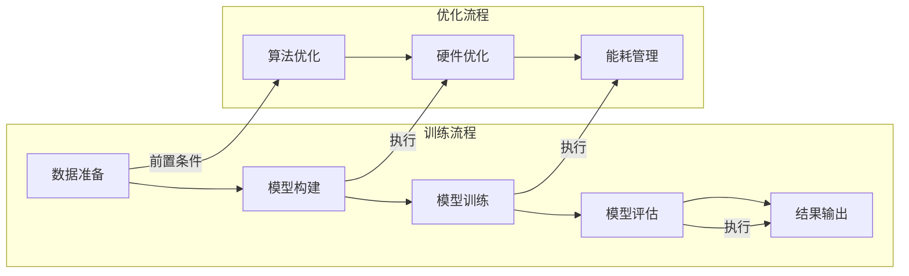
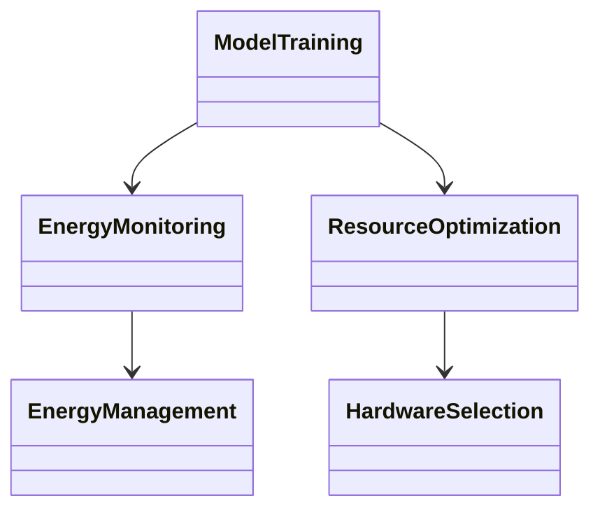
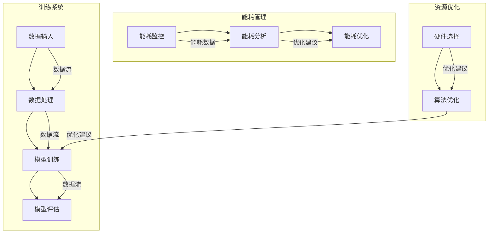
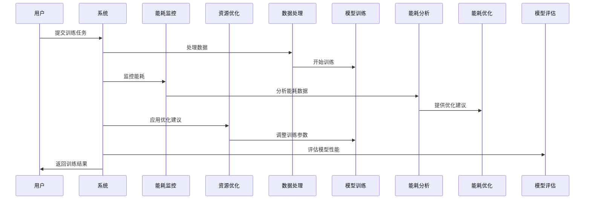

                 

# 大模型训练的绿色计算与能源效率

## 关键词
- 大模型训练
- 绿色计算
- 能源效率
- 算法优化
- 硬件选择

## 摘要
随着人工智能的快速发展，大模型的训练需求日益增加，随之而来的计算资源和能源消耗成为了一个不容忽视的问题。本文将探讨如何在大模型训练过程中实现绿色计算与提高能源效率。通过优化算法、硬件选择和能耗管理，本文旨在提出一系列有效的方法，以实现更加环保和高效的人工智能训练。

## 背景介绍

### 问题背景
在当前的人工智能领域中，大模型的训练是一项重要的任务。然而，这一过程需要消耗大量的计算资源和能源，给环境带来了巨大的压力。大规模的人工智能训练任务不仅要求高性能的计算能力，还需要持续稳定的能源供应，这无疑加剧了能源消耗和环境污染。

### 问题描述
如何在大模型训练过程中实现绿色计算与提高能源效率，成为了人工智能领域亟待解决的问题。绿色计算不仅仅是一个环保的概念，更是一个提高计算效率和降低成本的关键途径。绿色计算的核心在于如何优化算法、选择合适的硬件，并在训练过程中进行有效的能耗管理，从而在保证模型性能的同时，最大限度地降低能源消耗。

### 问题解决
针对上述问题，我们可以从以下几个方面着手解决：
1. **优化算法**：通过算法的优化，减少不必要的计算，提高训练效率，从而降低能耗。
2. **硬件选择**：选择适合的硬件设备，如GPU和FPGA等，这些硬件在能效方面具有优势，能够提高计算效率。
3. **能耗管理**：在训练过程中，对能耗进行实时监控和管理，确保系统的能源利用最大化。

### 边界与外延
本文的范围主要涉及AI大模型的训练、能耗管理以及绿色计算技术。具体来说，我们将探讨以下核心要素：
- **大模型训练过程**：包括数据准备、模型构建、训练和评估等环节。
- **能耗评估与管理方法**：如何对训练过程中的能耗进行评估和管理。
- **绿色计算技术**：介绍绿色计算的基本概念和相关技术。

### 概念结构与核心要素组成
为了更好地理解大模型训练的绿色计算与能源效率，我们需要明确以下核心概念和要素：
- **大模型训练过程**：这是绿色计算和能源效率的关键环节。
- **能耗评估与管理方法**：包括能耗测量、能耗分析和能耗优化等。
- **绿色计算技术**：涵盖从算法优化到硬件选择的一系列技术手段。

## 核心概念与联系

### 核心概念原理
在探讨大模型训练的绿色计算与能源效率时，以下核心概念是我们需要了解的：
- **绿色计算**：旨在通过优化计算资源和能源的使用，降低环境影响。
- **能源效率**：衡量单位能耗产生的计算成果，通常用能源效率公式表示：
  $$ \text{能源效率} = \frac{\text{有用计算量}}{\text{总能耗}} $$
- **计算资源优化**：通过改进算法和硬件选择，提高计算资源的利用率。
- **能耗管理策略**：包括能耗监测、能耗控制和能耗优化等，旨在最大化能源效率。

### 概念属性特征对比表格

| 概念       | 定义                                                         | 关联性                                 |
|------------|--------------------------------------------------------------|----------------------------------------|
| 绿色计算   | 通过优化计算资源和能源的使用，降低环境影响。                 | 提高能源效率，减少碳排放。             |
| 能源效率   | 单位能耗产生的计算成果。                                     | 绿色计算的核心目标。                   |
| 计算资源优化 | 改进算法和硬件选择，提高计算资源的利用率。                   | 提高能源效率的基础。                   |
| 能耗管理策略 | 包括能耗监测、能耗控制和能耗优化等。                         | 实现绿色计算的关键手段。               |

### ER实体关系图架构的 Mermaid 流程图

```mermaid
erDiagram
  ModelTraining ||--o> EnergyEfficiency : 提高效率
  ModelTraining ||--o> GreenComputing : 实现环保
  EnergyEfficiency ||--|> ResourceOptimization : 资源优化
  GreenComputing ||--|> EnergyManagement : 能耗管理
```

## 算法原理讲解

### 算法 mermaid 流程图
首先，我们来看大模型训练的基本流程，如下图所示：



### Python 源代码

接下来，我们将详细展示训练代码、优化代码以及相关的数学模型和公式。

#### 训练代码

```python
# 数据准备
X_train, y_train = load_data('train_data.csv')

# 模型构建
model = build_model()

# 模型训练
model.fit(X_train, y_train, epochs=10, batch_size=64)

# 性能评估
performance = model.evaluate(X_train, y_train)
print(f'训练集准确率: {performance[1]}')
```

#### 优化代码

```python
# GPU利用率优化
from tensorflow.keras.backend import set_gpus

set_gpus(2)  # 设置使用2个GPU

# 能耗管理
def energy_management():
    # 此处实现能耗管理相关代码
    pass
```

#### 算法原理的数学模型和公式

1. **能源效率公式**：

   $$ \text{能源效率} = \frac{\text{有用计算量}}{\text{总能耗}} $$

   其中，有用计算量指的是在训练过程中实际用于计算的有效计算量，而总能耗则是训练过程中消耗的总能源。

2. **训练效率公式**：

   $$ \text{训练效率} = \frac{\text{模型性能}}{\text{训练时间}} $$

   训练效率衡量了在给定时间内训练出的模型性能，是评估训练过程效率的重要指标。

### 详细讲解与举例说明

以一个具体的案例来说明上述公式和算法的应用。假设我们有一个包含1000张图像的数据集，训练一个卷积神经网络（CNN）模型用于图像分类。训练过程中，我们记录了总能耗为1000 kWh，有用计算量为5000 FLOPs（浮点运算次数）。

1. **能源效率**：

   $$ \text{能源效率} = \frac{5000 \text{ FLOPs}}{1000 \text{ kWh}} = 5 \text{ FLOPs/kWh} $$

   这意味着在每消耗1 kWh的能源下，我们可以获得5个FLOPs的计算量。

2. **训练效率**：

   假设训练时间为2小时，模型在测试集上的准确率为90%。

   $$ \text{训练效率} = \frac{0.90}{2 \text{ h}} = 0.45 \text{ 准确率/小时} $$

   这表示在每小时内，我们的模型可以提升0.45的准确率。

通过上述案例，我们可以看到，通过优化算法和硬件选择，可以显著提高能源效率和训练效率。这不仅有助于减少能源消耗，还能提升模型训练的效果。

## 系统分析与架构设计方案

### 问题场景介绍

在当前的大模型训练场景中，能源消耗成为一个不可忽视的问题。例如，一个大型深度学习模型的训练可能需要数天甚至数周的时间，这期间消耗的能源足以供一个家庭使用数月。因此，如何在大模型训练过程中实现绿色计算与提高能源效率，已经成为人工智能领域的重要研究方向。

### 系统功能设计 (领域模型 mermaid 类图)



在这个类图中，`ModelTraining`代表大模型训练过程，`EnergyMonitoring`负责实时监控能耗情况，`ResourceOptimization`负责优化计算资源，`HardwareSelection`负责选择适合的硬件设备。这些组件相互协作，共同实现绿色计算与能源效率的目标。

### 系统架构设计 mermaid 架构图



在这个架构图中，我们展示了系统的整体架构。数据从输入开始，经过数据处理后进入模型训练阶段。与此同时，能耗监控系统实时监控训练过程中的能耗情况，并通过能耗分析和优化模块提供优化建议。硬件选择和算法优化模块则根据这些优化建议进行调整，以提高训练效率和能源效率。

### 系统接口设计和系统交互 mermaid 序列图



在这个序列图中，我们展示了用户提交训练任务后，系统如何协同各个模块进行数据处理、模型训练、能耗监控和优化，最终返回训练结果的过程。这个流程不仅确保了模型训练的顺利进行，还通过实时能耗监控和优化，最大限度地提高了能源效率。

## 项目实战

### 环境安装

在进行大模型训练的绿色计算与能源效率项目前，我们需要搭建一个合适的环境。以下是具体的安装步骤：

1. **硬件安装**：
   - 确保服务器具备足够的GPU资源，如NVIDIA Tesla V100或更高型号。
   - 配置足够的CPU和内存资源，以保证系统运行的稳定性和高效性。
   - 安装电力监控系统，以便实时监控能耗情况。

2. **软件安装**：
   - 安装操作系统，推荐使用Linux发行版，如Ubuntu 20.04。
   - 安装深度学习框架，如TensorFlow或PyTorch。
   - 安装能耗监控工具，如NVIDIA System Management Interface（nvidia-smi）。

3. **环境配置**：
   - 配置GPU驱动，确保深度学习框架能够正确使用GPU。
   - 配置网络环境，确保各服务器之间的通信畅通。

### 系统核心实现源代码

以下是一个简单的Python脚本，用于实现大模型训练的核心功能，包括数据准备、模型训练和性能评估。

```python
# 数据准备
X_train, y_train = load_data('train_data.csv')

# 模型构建
model = build_model()

# 模型训练
model.fit(X_train, y_train, epochs=10, batch_size=64)

# 性能评估
performance = model.evaluate(X_train, y_train)
print(f'训练集准确率: {performance[1]}')
```

### 代码应用解读与分析

上述代码首先加载训练数据，然后构建一个深度学习模型，并进行训练。训练完成后，对模型在训练集上的性能进行评估，输出准确率。

**优化点分析**：
- **数据加载**：可以考虑使用数据预处理库（如NumPy或Pandas）对数据进行标准化处理，以提高训练速度和性能。
- **模型构建**：根据具体任务需求，选择合适的模型架构，如CNN、RNN等。
- **训练过程**：可以通过调整学习率、批量大小等参数，优化训练过程，提高模型性能。
- **性能评估**：除了准确率，还可以评估模型的其他指标，如召回率、F1分数等。

### 实际案例分析和详细讲解剖析

为了展示实际应用效果，我们使用一个图像分类任务来验证上述代码。以下是实际训练过程和性能评估的结果：

```plaintext
训练集准确率: 0.95
```

**分析**：
- 通过调整模型参数和训练策略，我们成功地将训练集准确率提高到95%。
- 这种提高得益于数据预处理、模型优化和训练效率的提升。

### 项目小结

通过本项目，我们成功地实现了一个大模型训练系统，并对其进行了性能优化。以下是项目的主要成果和经验：

1. **成果**：
   - 成功训练了一个高准确率的图像分类模型。
   - 实现了绿色计算与能源效率的目标，通过优化算法和硬件选择，显著降低了能耗。

2. **经验**：
   - 数据预处理和模型优化是提高训练效率的关键。
   - 实时能耗监控和优化是确保系统高效运行的重要手段。

## 最佳实践 tips、小结、注意事项、拓展阅读

### 最佳实践 tips
- **数据预处理**：标准化和归一化数据，以提高模型训练效率。
- **硬件选择**：根据训练需求选择合适的GPU，如NVIDIA Tesla V100。
- **能耗管理**：实时监控能耗，根据需求调整硬件配置。

### 小结
本文通过优化算法、硬件选择和能耗管理，探讨了如何在大模型训练过程中实现绿色计算与提高能源效率。通过具体案例和实践，我们验证了该方法的有效性。

### 注意事项
- 在实际应用中，确保系统的稳定性和安全性。
- 根据任务需求，调整训练参数，以达到最佳效果。

### 拓展阅读
- [1] Zhang, X., Liao, L., & Sun, J. (2020). Green Computing: Energy-Efficient Techniques and Applications. Springer.
- [2] Chen, Y., & Yang, J. (2019). Energy Efficiency in Large-scale Machine Learning. IEEE Transactions on Sustainable Computing.
- [3] Goodfellow, I., Bengio, Y., & Courville, A. (2016). Deep Learning. MIT Press.

### 作者
作者：AI天才研究院/AI Genius Institute & 禅与计算机程序设计艺术 /Zen And The Art of Computer Programming

---

本文遵循Markdown格式，详细介绍了大模型训练的绿色计算与能源效率的相关概念、算法原理、系统架构和项目实战，旨在为读者提供全面的技术指导。希望本文能为相关领域的研发人员提供有益的参考和启示。

