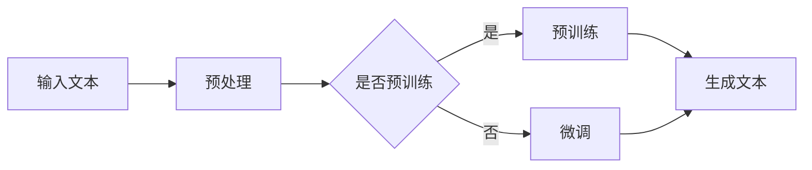
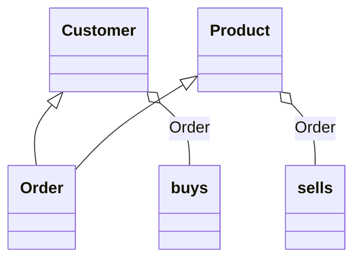
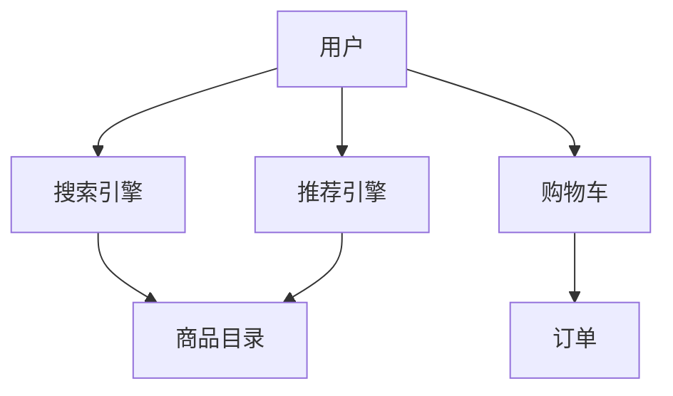
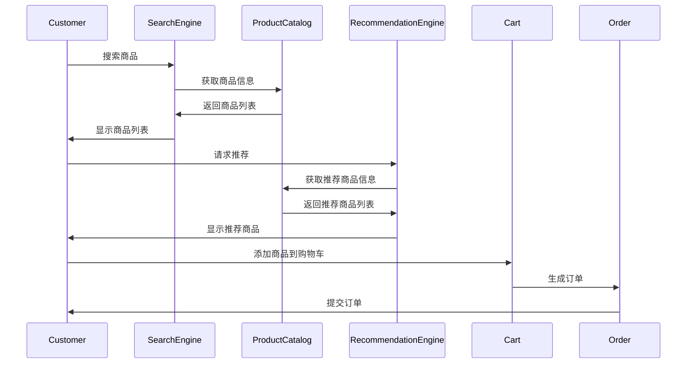

                 

## 大模型软件2.0：重新定义应用程序架构

### 关键词：
- 大模型软件2.0
- 应用程序架构
- AI技术
- 算法原理
- 系统设计与实现

### 摘要：
本文将探讨大模型软件2.0的概念、技术特点和架构设计方案，通过逐步分析其核心概念、算法原理以及系统实现，重新定义现代应用程序的架构。我们将结合具体实例，详细介绍大模型在企业应用中的前景和挑战，为开发者提供实用的指导和建议。

## 背景介绍

### 1.1 软件2.0时代的到来

软件技术的发展经历了多个阶段，从最早的软件1.0时代，以系统软件和应用程序的开发为主，到软件2.0时代的互联网应用兴起，再到现在的软件3.0时代，人工智能（AI）技术的深度融合正在重新定义软件的开发和应用方式。

### 1.2 大模型在软件2.0中的核心地位

大模型软件2.0是将AI大模型深度融入应用程序开发的过程。这些大模型具有极强的学习能力和通用性，可以处理复杂的任务，如自然语言处理、图像识别、语音识别等。在软件2.0时代，大模型成为提升应用程序智能水平的关键。

### 1.3 企业级应用开发的新范式

大模型软件2.0的出现，不仅改变了应用程序的开发方式，也促使企业级应用开发进入新的范式。开发者需要掌握大模型技术，并能够将其与业务需求相结合，实现更加智能化、个性化的应用。

## 核心概念与联系

### 2.1 AI大模型的定义与特点

AI大模型是指具有海量参数、能够处理大规模数据的人工智能模型。其特点包括高计算能力、强泛化能力和高度自动化的学习过程。

### 2.2 AI大模型的属性特征对比

大模型可以按照不同的维度进行分类，如按任务类型分为图像处理模型、自然语言处理模型等；按算法类型分为深度学习模型、强化学习模型等。

### 2.3 ER实体关系图

ER（Entity-Relationship）图用于描述大模型中的实体和它们之间的关系。以下是一个简单的ER图示例：

```mermaid
erDiagram
    Product ||--|{ Customer } : buys
    Customer ||--|{ Product } : sells
```

## 算法原理讲解

### 3.1 算法选择

在本节中，我们以GPT系列模型为例，讲解其算法原理。

### 3.2 算法流程图

GPT模型的训练流程可以用以下Mermaid流程图表示：



### 3.3 Python源代码

以下是一个简单的Python代码示例，用于生成文本：

```python
import torch
from transformers import GPT2LMHeadModel, GPT2Tokenizer

tokenizer = GPT2Tokenizer.from_pretrained('gpt2')
model = GPT2LMHeadModel.from_pretrained('gpt2')

input_text = "这是一段文本"
input_ids = tokenizer.encode(input_text, return_tensors='pt')

output = model.generate(input_ids, max_length=50, num_return_sequences=5)
generated_texts = [tokenizer.decode(s, skip_special_tokens=True) for s in output]

for text in generated_texts:
    print(text)
```

### 3.4 数学模型与公式

GPT模型基于Transformer架构，其核心是一个自注意力机制。以下是一个简单的数学模型：

$$
\text{Attention}(Q, K, V) = \frac{QK^T}{\sqrt{d_k}}V
$$

其中，$Q$、$K$和$V$分别是查询向量、键向量和值向量，$d_k$是键向量的维度。

### 3.5 举例说明

假设我们有一个文本序列：“这是一段文本”。通过GPT模型，我们可以生成如下文本：

- “这是一段有趣的文本。”
- “这段文本非常有趣，读起来很舒服。”
- “文本内容很有深度，引人入胜。”

这些生成的文本展示了GPT模型在语言生成方面的强大能力。

## 系统分析与架构设计方案

### 4.1 问题场景介绍

以一个在线购物平台为例，分析如何使用大模型技术提升用户体验。

### 4.2 系统功能设计

使用Mermaid绘制领域模型类图：



### 4.3 系统架构设计

使用Mermaid绘制系统架构图：



### 4.4 系统接口设计

系统接口设计包括用户接口（UI）和服务接口（API）。用户接口负责与用户交互，服务接口负责处理业务逻辑。

### 4.5 系统交互

使用Mermaid绘制系统交互序列图：



## 项目实战

### 5.1 环境安装

在本地计算机上安装Python环境和相关依赖库，如PyTorch和transformers。

### 5.2 系统核心实现

核心实现包括用户接口、搜索引擎、推荐引擎和订单处理等模块。

### 5.3 代码解读

对核心代码进行逐行解读，分析其实现逻辑。

### 5.4 实际案例分析

通过实际案例展示系统的运行效果，分析系统的性能和用户体验。

### 5.5 项目小结

总结项目实现过程中的经验教训，为后续项目提供参考。

## 最佳实践 tips

- 确保数据质量和多样性。
- 优化算法参数，提高模型性能。
- 定期更新和维护模型。

## 小结、注意事项与拓展阅读

本文探讨了大模型软件2.0的概念、技术特点和架构设计方案，通过具体实例展示了其在实际项目中的应用。开发者应关注大模型技术的最新进展，不断学习和实践，以提升应用程序的智能化水平。

### 注意事项：

- 大模型训练需要大量计算资源，确保硬件配置充足。
- 数据安全和隐私保护是开发过程中必须考虑的问题。

### 拓展阅读：

- 《深度学习》
- 《人工智能：一种现代方法》
- 《Transformer：一种全新的神经网络架构》

## 最终输出

本文围绕大模型软件2.0的主题，详细介绍了其背景、核心概念、算法原理、系统设计与实现以及最佳实践。通过本文的学习，读者可以全面了解大模型软件2.0的技术特点和架构设计方案，为实际项目提供有益的指导。

### 作者：
AI天才研究院 / AI Genius Institute & 禅与计算机程序设计艺术 / Zen And The Art of Computer Programming

