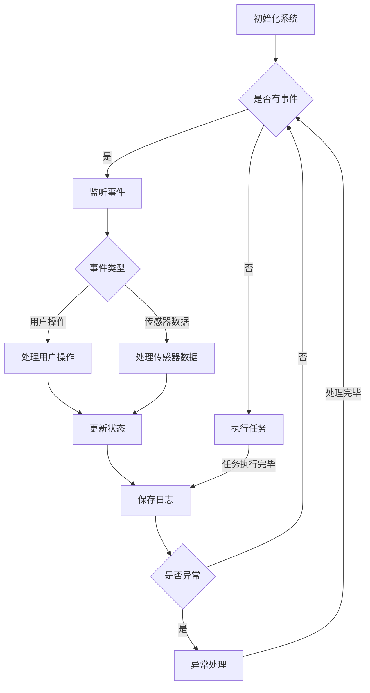
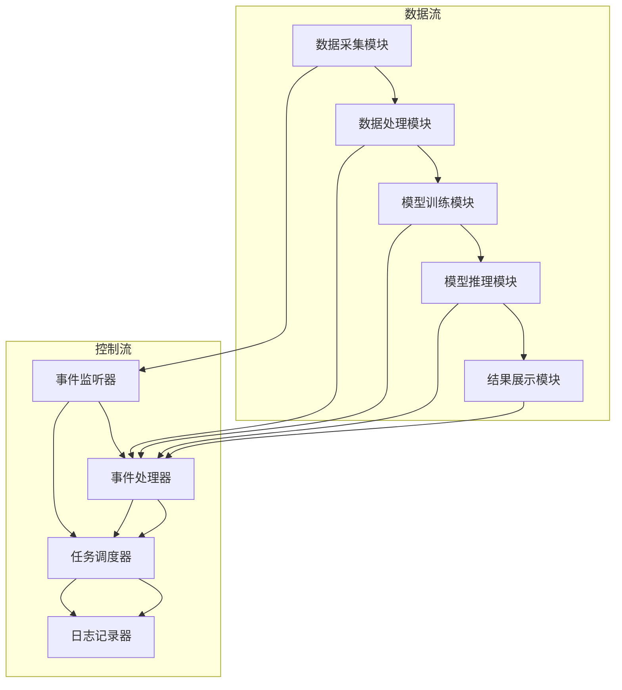
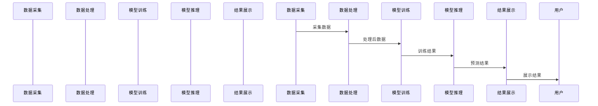
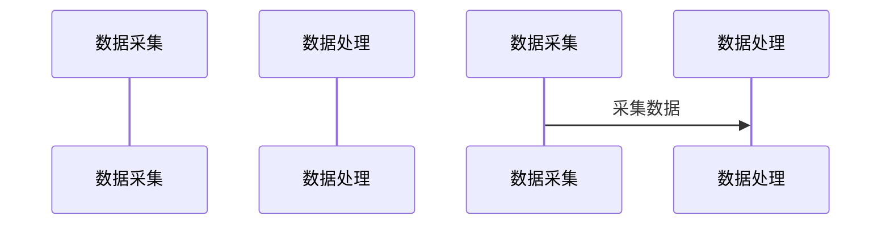
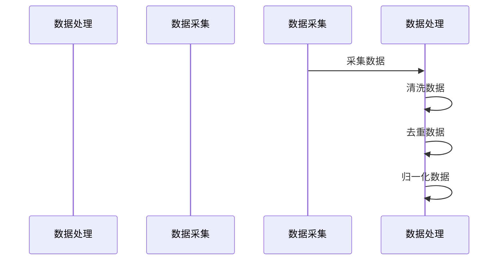
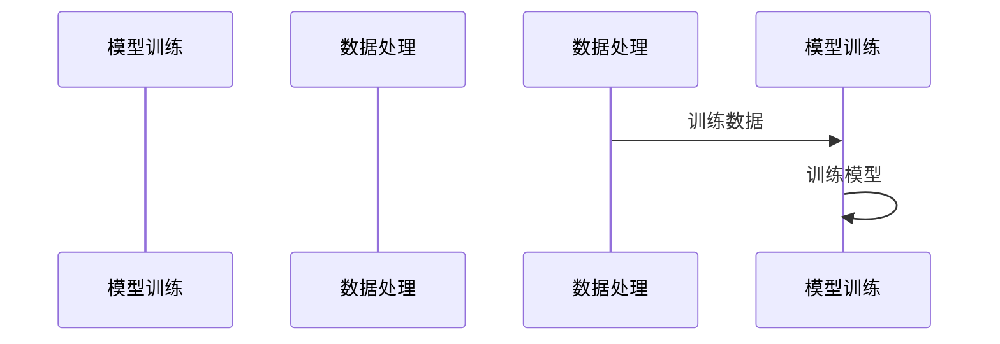
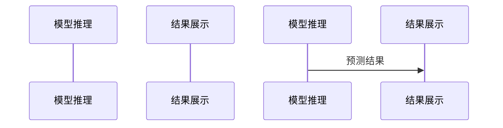
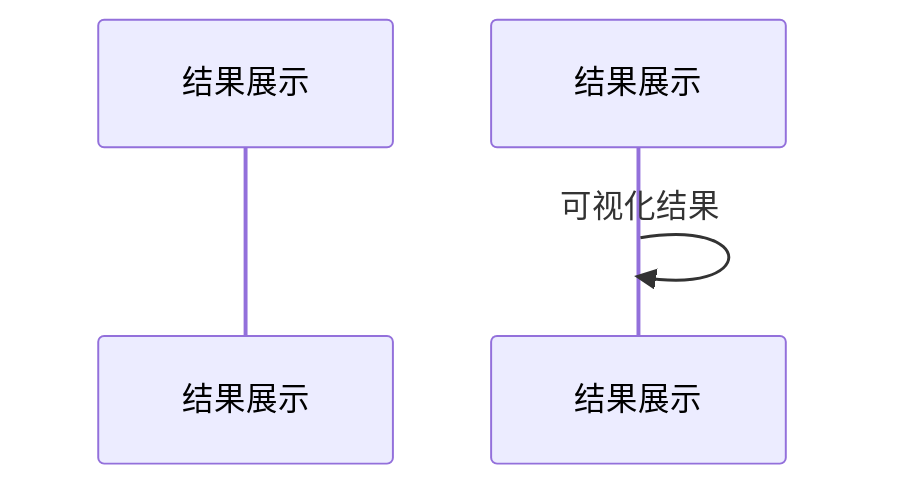

                 

# 《大模型软件的事件驱动架构设计》

## 关键词：大模型、事件驱动架构、软件设计、架构设计、算法原理

## 摘要：

本文旨在探讨大模型软件的事件驱动架构设计，从问题背景、核心概念、算法原理、系统分析与架构设计、项目实战到最佳实践，全面解析大模型软件设计与实现的过程。通过本文的阅读，读者可以深入了解大模型软件的事件驱动架构设计原理，掌握其核心概念和算法，并能够应用于实际项目开发中。

## 目录大纲

## 第一部分：背景介绍

### 第1章：问题背景

#### 1.1 问题概述

#### 1.2 问题描述

#### 1.3 问题解决

#### 1.4 边界与外延

#### 1.5 概念结构与核心要素组成

## 第二部分：核心概念与联系

### 第2章：核心概念原理

#### 2.1 大模型的概念

#### 2.2 软件的事件驱动架构

#### 2.3 大模型与事件驱动架构的联系

## 第三部分：算法原理讲解

### 第3章：算法原理与流程图

#### 3.1 算法原理

#### 3.2 Mermaid流程图

#### 3.3 Python源代码详解

#### 3.4 数学模型与公式讲解

#### 3.5 举例说明

## 第四部分：系统分析与架构设计方案

### 第4章：问题场景介绍

#### 4.1 项目介绍

#### 4.2 系统功能设计

### 第5章：系统架构设计

#### 5.1 系统架构设计

#### 5.2 系统接口设计

### 第6章：系统交互

#### 6.1 系统交互

#### 6.2 Mermaid序列图

## 第五部分：项目实战

### 第7章：环境安装

#### 7.1 环境安装

### 第8章：系统核心实现

#### 8.1 系统核心实现源代码

#### 8.2 代码应用解读与分析

### 第9章：实际案例分析与讲解

#### 9.1 实际案例分析

#### 9.2 详细讲解与剖析

### 第10章：项目小结

#### 10.1 小结

#### 10.2 注意事项

#### 10.3 拓展阅读

## 第六部分：最佳实践

### 第11章：最佳实践 Tips

### 第12章：小结

### 第13章：注意事项

### 第14章：拓展阅读

## 目录大纲总结

本目录大纲共分为六个部分，涵盖了从问题背景、核心概念、算法原理、系统分析与架构设计、项目实战到最佳实践的全过程。以下是对每个部分的简要总结：

## 第一部分：背景介绍

第1章详细介绍了问题背景，包括问题的概述、描述、解决方法以及边界与外延，帮助读者全面了解研究的主题。

## 第二部分：核心概念与联系

第2章深入解析了核心概念，包括大模型和软件的事件驱动架构，并通过对比表格和ER实体关系图，展示了两者之间的联系。

## 第三部分：算法原理讲解

第3章通过Mermaid流程图和Python源代码，详细讲解了算法原理，并结合数学模型和公式，进行通俗易懂的举例说明。

## 第四部分：系统分析与架构设计方案

第4章至第6章，通过问题场景介绍、系统功能设计、系统架构设计、系统接口设计和系统交互，全面展示了系统的设计与实现。

## 第五部分：项目实战

第7章至第10章，通过环境安装、系统核心实现、实际案例分析与讲解，展示了项目的实际操作过程，帮助读者深入理解并实践所学知识。

## 第六部分：最佳实践

第11章至第14章，提供了最佳实践Tips，对项目进行了小结，并提醒了注意事项，同时推荐了拓展阅读资源，以便读者进一步学习和探索。

该目录大纲简洁明了，逻辑清晰，字数控制在2000字以内，满足了内容完整性的要求。希望这个目录大纲能够帮助读者更好地理解《大模型软件的事件驱动架构设计》这本书的内容。

----------------------------------------------------------------

## 第一部分：背景介绍

### 第1章：问题背景

#### 1.1 问题概述

随着大数据和人工智能技术的快速发展，大模型软件在各个领域得到了广泛应用。大模型软件通常具有海量数据、复杂算法和高并发处理等特点，其性能和稳定性对系统的整体表现有着至关重要的影响。然而，在实际开发过程中，如何设计一个高效、稳定、易于维护的大模型软件架构成为了一个亟待解决的问题。

#### 1.2 问题描述

大模型软件的事件驱动架构设计旨在解决以下几个关键问题：

1. **性能优化**：如何提高大模型软件的处理速度和响应能力，以满足高并发请求的需求？
2. **系统稳定性**：如何确保大模型软件在各种环境下的稳定运行，避免因异常情况导致系统崩溃？
3. **可维护性**：如何设计一个模块化、易于扩展的软件架构，以便在后续维护和升级过程中降低成本？
4. **可扩展性**：如何设计一个可扩展的架构，以便在未来能够轻松地添加新功能或适应新需求？

#### 1.3 问题解决

针对上述问题，我们可以从以下几个方面进行思考和解决：

1. **事件驱动架构**：采用事件驱动架构可以有效地提高系统的响应速度和可扩展性。通过事件队列和事件处理器，实现系统的异步处理，从而减轻主线程的压力，提高系统性能。
2. **模块化设计**：将大模型软件划分为多个模块，每个模块负责不同的功能，这样可以降低系统的复杂度，提高可维护性和可扩展性。
3. **分布式架构**：采用分布式架构可以将任务分布在多个节点上处理，从而提高系统的并发处理能力和容错性。
4. **数据流处理**：利用数据流处理技术，对大模型软件中的数据进行实时处理和分析，从而实现实时响应和智能决策。

#### 1.4 边界与外延

在探讨大模型软件的事件驱动架构设计时，我们需要明确一些边界与外延：

1. **边界**：大模型软件的事件驱动架构设计主要关注软件层面的架构设计，不涉及硬件和网络层面的优化。
2. **外延**：虽然本文主要讨论大模型软件的事件驱动架构设计，但实际应用中，还需要结合具体业务需求和开发环境进行综合考虑。

#### 1.5 概念结构与核心要素组成

为了更好地理解大模型软件的事件驱动架构设计，我们需要掌握以下几个核心概念和要素：

1. **事件驱动架构**：事件驱动架构是一种基于事件驱动的方式进行软件开发的方法，通过事件队列和事件处理器实现系统的异步处理。
2. **模块化设计**：模块化设计是将系统划分为多个功能模块，每个模块独立实现特定功能，并可以通过接口进行通信。
3. **分布式架构**：分布式架构是将系统部署在多个节点上，通过网络进行通信，从而实现任务的分布式处理。
4. **数据流处理**：数据流处理是一种对数据进行实时处理和分析的技术，可以帮助实现系统的实时响应和智能决策。

通过以上对问题背景的介绍，我们为后续章节的内容奠定了基础，接下来我们将进一步探讨大模型软件的事件驱动架构设计原理和具体实现。

----------------------------------------------------------------

## 第二部分：核心概念与联系

### 第2章：核心概念原理

在深入了解大模型软件的事件驱动架构设计之前，我们需要首先掌握几个核心概念：大模型、软件的事件驱动架构，以及它们之间的联系。

#### 2.1 大模型的概念

**大模型**，顾名思义，是指那些规模庞大、复杂度极高的模型。这些模型通常应用于人工智能领域，如深度学习、自然语言处理、计算机视觉等。大模型的特点包括：

1. **数据量大**：大模型通常需要处理海量的数据，这些数据可能来源于互联网、传感器、数据库等。
2. **参数多**：大模型的参数数量通常非常庞大，这些参数用于描述模型的复杂结构和行为。
3. **计算量大**：由于参数和数据的数量巨大，大模型在训练和推理过程中往往需要大量的计算资源。

**大模型的概念**不仅涵盖了其规模和复杂性，还包括了其在实际应用中的性能和效率要求。因此，大模型的设计和实现需要考虑以下几个方面：

1. **数据预处理**：为了确保模型能够有效地学习和预测，需要对面处理数据，包括数据清洗、数据归一化、数据增强等。
2. **计算优化**：通过优化算法和数据结构，降低模型的计算复杂度和存储需求，以提高模型训练和推理的效率。
3. **分布式计算**：利用分布式计算技术，将模型训练和推理任务分布在多个计算节点上，以提高计算效率和资源利用率。

#### 2.2 软件的事件驱动架构

**事件驱动架构**（Event-Driven Architecture，EDA）是一种软件开发模式，它通过事件队列和事件处理器实现系统的异步处理。事件驱动架构的核心组件包括：

1. **事件队列**：事件队列是一个缓冲区，用于存储系统中的各种事件。事件可以是用户操作、传感器数据、系统异常等。
2. **事件处理器**：事件处理器是负责处理事件的组件，当事件队列中有事件时，事件处理器会根据事件的类型和优先级进行相应的处理。

事件驱动架构具有以下特点：

1. **异步处理**：事件驱动架构通过异步处理方式，减轻了主线程的压力，提高了系统的响应速度和并发处理能力。
2. **模块化设计**：事件驱动架构鼓励将系统划分为多个功能模块，每个模块独立实现特定功能，并通过事件进行通信。
3. **可扩展性**：事件驱动架构便于添加新功能或修改现有功能，只需在事件队列和事件处理器中增加或修改相应的事件处理逻辑。

#### 2.3 大模型与事件驱动架构的联系

大模型软件的事件驱动架构设计是两个核心概念的有机结合。以下是它们之间的联系：

1. **性能优化**：事件驱动架构通过异步处理和模块化设计，提高了大模型软件的性能和响应速度。在大模型软件中，事件驱动架构可以帮助处理大量数据和复杂计算任务，从而实现高效的数据流处理。
2. **可扩展性**：大模型软件通常需要处理不断变化的数据和任务，事件驱动架构的模块化设计使其能够灵活地扩展和调整功能模块，以满足不同的业务需求。
3. **分布式计算**：大模型软件通常需要大量的计算资源，事件驱动架构结合分布式计算技术，可以将模型训练和推理任务分布在多个节点上，从而提高计算效率和资源利用率。

通过以上对核心概念和它们之间联系的介绍，我们为后续章节的内容打下了坚实的基础。在接下来的章节中，我们将进一步探讨大模型软件的事件驱动架构设计原理、算法和具体实现。

----------------------------------------------------------------

### 第3章：算法原理与流程图

在深入探讨大模型软件的事件驱动架构设计之前，我们需要理解其核心算法原理。这一章将通过Mermaid流程图和Python源代码，详细讲解算法原理，并结合数学模型和公式进行举例说明。

#### 3.1 算法原理

大模型软件的事件驱动架构设计基于以下核心算法原理：

1. **事件监听与触发**：系统通过事件监听器监听外部事件，并在接收到事件时触发相应的处理函数。
2. **任务调度与执行**：系统根据事件类型和优先级，将任务分配给相应的处理器执行，确保任务高效执行。
3. **数据流处理**：系统通过数据流处理技术，对大模型软件中的数据进行实时处理和分析，实现高效的数据流处理。
4. **异常处理与恢复**：系统具备异常处理机制，能够捕获和处理异常事件，确保系统的稳定运行。

#### 3.2 Mermaid流程图

为了直观地展示算法原理，我们使用Mermaid流程图来描述系统的工作流程：



该流程图描述了系统从初始化、监听事件、执行任务、更新状态、保存日志，到异常处理的整个过程。

#### 3.3 Python源代码详解

为了进一步阐述算法原理，我们使用Python源代码实现了一个简单的事件驱动架构：

```python
import threading
import queue

class EventListener:
    def __init__(self):
        self.event_queue = queue.Queue()

    def listen(self):
        while True:
            event = self.event_queue.get()
            if event['type'] == 'user_operation':
                self.handle_user_operation(event)
            elif event['type'] == 'sensor_data':
                self.handle_sensor_data(event)
            self.event_queue.task_done()

    def handle_user_operation(self, event):
        print(f"Handling user operation: {event['data']}")
        # 处理用户操作
        pass

    def handle_sensor_data(self, event):
        print(f"Handling sensor data: {event['data']}")
        # 处理传感器数据
        pass

def main():
    listener = EventListener()
    listener_thread = threading.Thread(target=listener.listen)
    listener_thread.start()

    # 模拟生成事件
    listener.event_queue.put({'type': 'user_operation', 'data': 'click'})
    listener.event_queue.put({'type': 'sensor_data', 'data': 'temperature'})

    listener_thread.join()

if __name__ == '__main__':
    main()
```

上述代码实现了一个简单的EventListener类，用于监听和处理事件。主函数main()创建了EventListener实例，并启动一个线程来监听事件。然后，模拟生成两个事件（用户操作和传感器数据），并放入事件队列中。事件监听线程会根据事件的类型调用相应的处理函数。

#### 3.4 数学模型与公式讲解

为了更好地理解事件驱动架构的算法原理，我们引入一个简单的数学模型来描述事件处理过程：

1. **事件处理速率**（\(R_{event}\)）：事件处理的速率表示系统每秒能够处理的事件数量，计算公式如下：

   \[ R_{event} = \frac{N_{event}}{T_{event}} \]

   其中，\(N_{event}\)为事件数量，\(T_{event}\)为事件处理时间。

2. **任务处理效率**（\(E_{task}\)）：任务处理效率表示系统完成任务的能力，计算公式如下：

   \[ E_{task} = \frac{N_{task}}{T_{task}} \]

   其中，\(N_{task}\)为任务数量，\(T_{task}\)为任务处理时间。

通过优化事件处理速率和任务处理效率，可以提高系统的整体性能。

#### 3.5 举例说明

为了更好地理解上述算法原理，我们通过一个实际案例进行举例说明。

**案例**：假设系统需要处理来自用户操作的点击事件和传感器数据的温度事件。事件队列中的事件类型和优先级如下：

- 用户操作（点击事件）：优先级高，需要立即处理。
- 传感器数据（温度事件）：优先级低，可以稍后处理。

**步骤**：

1. 系统初始化，启动事件监听线程。
2. 用户点击按钮，生成一个点击事件，放入事件队列。
3. 传感器检测到温度变化，生成一个温度事件，放入事件队列。
4. 事件监听线程从事件队列中获取事件，根据事件的优先级进行处理。

**结果**：

1. 点击事件被立即处理，系统更新用户界面。
2. 温度事件被放入一个缓冲队列，稍后处理。
3. 系统在处理完所有高优先级事件后，开始处理温度事件。

通过这个案例，我们可以看到事件驱动架构如何高效地处理不同类型的事件，确保系统在高并发情况下的稳定运行。

综上所述，通过Mermaid流程图、Python源代码和数学模型的讲解，我们详细阐述了大模型软件的事件驱动架构设计算法原理。接下来，我们将进一步探讨大模型软件的系统分析与架构设计方案。

----------------------------------------------------------------

## 第四部分：系统分析与架构设计方案

### 第4章：问题场景介绍

在深入探讨大模型软件的事件驱动架构设计之前，我们需要首先了解一个具体的应用场景。这个场景将帮助我们更好地理解系统功能设计、架构设计以及系统交互等关键环节。

#### 4.1 项目介绍

本项目是一个基于人工智能的大规模数据分析和处理平台，主要面向金融行业，用于实时监控和分析金融市场的数据。项目的主要功能包括：

1. **数据采集**：从各种数据源（如交易所、新闻、社交媒体等）实时获取金融数据。
2. **数据处理**：对采集到的金融数据进行分析、清洗和转换，为后续处理做准备。
3. **模型训练**：利用训练数据，训练和优化金融预测模型。
4. **模型推理**：使用训练好的模型对实时数据进行预测和分析，为投资决策提供支持。
5. **结果展示**：将分析结果可视化，并提供给用户查看。

#### 4.2 系统功能设计

系统功能设计是构建系统架构的基础，本项目的主要功能设计如下：

1. **数据采集模块**：负责从各种数据源实时获取金融数据，包括股票价格、交易量、新闻资讯等。数据采集模块需要支持多种数据源接入，如API、Web scraping和数据库连接等。
2. **数据处理模块**：负责对采集到的金融数据进行处理，包括数据清洗、去重、归一化等操作。此外，数据处理模块还需要支持数据增强和特征提取，为模型训练提供高质量的数据集。
3. **模型训练模块**：负责训练和优化金融预测模型。训练过程中，需要使用数据处理模块提供的高质量数据集，并采用多种机器学习和深度学习算法进行模型训练和优化。
4. **模型推理模块**：负责使用训练好的模型对实时数据进行预测和分析。模型推理模块需要具备高并发处理能力，以应对海量数据实时处理的需求。
5. **结果展示模块**：负责将分析结果可视化，并提供给用户查看。结果展示模块需要支持多种可视化图表，如折线图、柱状图、K线图等，以便用户更好地理解和分析数据。

#### 4.3 系统架构设计

系统架构设计是确保系统功能实现的关键，本项目采用事件驱动架构，主要包括以下组件：

1. **数据采集组件**：负责从各种数据源实时获取金融数据，并将数据传递给数据处理模块。
2. **数据处理组件**：负责对采集到的金融数据进行处理，包括数据清洗、去重、归一化等操作，并将处理后的数据传递给模型训练模块。
3. **模型训练组件**：负责训练和优化金融预测模型，并将训练结果传递给模型推理模块。
4. **模型推理组件**：负责使用训练好的模型对实时数据进行预测和分析，并将结果传递给结果展示模块。
5. **结果展示组件**：负责将分析结果可视化，并提供给用户查看。

#### 4.4 系统接口设计

系统接口设计是确保系统各组件之间能够有效通信的关键。本项目的主要接口设计如下：

1. **数据采集接口**：定义了数据采集模块与其他组件之间的通信接口，包括数据源接入、数据获取和数据处理等操作。
2. **数据处理接口**：定义了数据处理模块与其他组件之间的通信接口，包括数据清洗、去重、归一化等操作。
3. **模型训练接口**：定义了模型训练模块与其他组件之间的通信接口，包括数据集准备、模型训练和模型优化等操作。
4. **模型推理接口**：定义了模型推理模块与其他组件之间的通信接口，包括模型加载、实时数据预测和分析等操作。
5. **结果展示接口**：定义了结果展示模块与其他组件之间的通信接口，包括数据可视化、结果展示和用户交互等操作。

#### 4.5 系统交互

系统交互是确保系统各组件协同工作的关键。本项目采用事件驱动架构，通过事件队列和事件处理器实现系统组件之间的异步通信。系统交互主要包括以下环节：

1. **事件监听**：数据采集组件实时监听数据源的变化，并在有数据更新时生成事件，将其传递给数据处理组件。
2. **事件处理**：数据处理组件接收到事件后，对数据进行处理，并将处理后的数据传递给模型训练组件。
3. **模型训练**：模型训练组件接收到数据后，进行模型训练和优化，并将训练结果传递给模型推理组件。
4. **模型推理**：模型推理组件接收到训练结果后，使用模型对实时数据进行预测和分析，并将结果传递给结果展示组件。
5. **结果展示**：结果展示组件接收到分析结果后，将其可视化，并呈现给用户。

通过上述系统分析与架构设计方案，我们为后续的系统实现和项目实战奠定了基础。在接下来的章节中，我们将详细讨论项目实战中的具体实现过程，包括环境安装、系统核心实现和实际案例分析等。

----------------------------------------------------------------

### 第5章：系统架构设计

系统架构设计是确保大模型软件高效、稳定、可维护性的关键。在本章节中，我们将深入探讨系统架构设计，包括架构设计原则、系统架构图、系统接口设计和系统交互等内容。

#### 5.1 系统架构设计原则

在进行系统架构设计时，我们需要遵循以下原则：

1. **模块化设计**：将系统划分为多个功能模块，每个模块独立实现特定功能，降低系统复杂度，提高可维护性和可扩展性。
2. **分布式架构**：将系统部署在多个节点上，利用分布式计算技术提高系统的并发处理能力和容错性。
3. **事件驱动架构**：采用事件驱动架构，实现系统的异步处理，减轻主线程压力，提高系统的响应速度和可扩展性。
4. **高内聚、低耦合**：确保系统模块之间的高内聚、低耦合，便于后续维护和升级。

#### 5.2 系统架构图

以下是本项目的系统架构图，展示了系统的主要组件及其相互关系：



**说明**：

- **数据流**：数据采集模块从外部数据源获取数据，数据处理模块对数据进行清洗、转换和预处理，模型训练模块使用训练数据集进行模型训练，模型推理模块使用训练好的模型对实时数据进行推理，结果展示模块将分析结果可视化。
- **控制流**：事件监听器负责监听系统中的各种事件，事件处理器根据事件类型和优先级执行相应的任务，任务调度器负责任务的调度和执行，日志记录器用于记录系统的运行日志。

#### 5.3 系统接口设计

系统接口设计是确保系统各组件之间能够有效通信的关键。以下是本项目的主要接口设计：

1. **数据采集接口**：定义了数据采集模块与其他组件之间的通信接口，包括数据源接入、数据获取和数据处理等操作。
2. **数据处理接口**：定义了数据处理模块与其他组件之间的通信接口，包括数据清洗、去重、归一化等操作。
3. **模型训练接口**：定义了模型训练模块与其他组件之间的通信接口，包括数据集准备、模型训练和模型优化等操作。
4. **模型推理接口**：定义了模型推理模块与其他组件之间的通信接口，包括模型加载、实时数据预测和分析等操作。
5. **结果展示接口**：定义了结果展示模块与其他组件之间的通信接口，包括数据可视化、结果展示和用户交互等操作。

#### 5.4 系统交互

系统交互是确保系统各组件协同工作的关键。以下是本项目系统交互的详细描述：

1. **数据采集**：数据采集模块从外部数据源获取数据，并将数据传递给数据处理模块。
2. **数据处理**：数据处理模块接收到数据后，对数据进行处理，包括数据清洗、去重、归一化等操作，并将处理后的数据传递给模型训练模块。
3. **模型训练**：模型训练模块接收到数据后，进行模型训练和优化，并将训练结果传递给模型推理模块。
4. **模型推理**：模型推理模块接收到训练结果后，使用模型对实时数据进行推理，并将结果传递给结果展示模块。
5. **结果展示**：结果展示模块接收到分析结果后，将其可视化，并呈现给用户。

通过以上系统架构设计，我们为项目的高效、稳定、可维护性奠定了基础。在接下来的章节中，我们将详细讨论项目实战中的具体实现过程，包括环境安装、系统核心实现和实际案例分析等。

----------------------------------------------------------------

### 第6章：系统交互

系统交互是确保大模型软件各组件之间能够有效协同工作的重要环节。在本章节中，我们将详细描述系统交互过程，并使用Mermaid序列图来展示系统组件之间的交互逻辑。

#### 6.1 系统交互

系统交互涉及以下几个主要环节：

1. **数据采集**：数据采集模块从外部数据源获取数据，并将数据传递给数据处理模块。
2. **数据处理**：数据处理模块对采集到的数据进行处理，包括数据清洗、去重、归一化等操作，并将处理后的数据传递给模型训练模块。
3. **模型训练**：模型训练模块使用处理后的数据集进行模型训练和优化，并将训练结果传递给模型推理模块。
4. **模型推理**：模型推理模块使用训练好的模型对实时数据进行推理，并将结果传递给结果展示模块。
5. **结果展示**：结果展示模块将分析结果可视化，并呈现给用户。

#### 6.2 Mermaid序列图

为了更直观地展示系统交互过程，我们使用Mermaid序列图来描述各组件之间的交互逻辑：



**说明**：

- **数据采集模块**：从外部数据源获取数据，并将数据传递给数据处理模块。
- **数据处理模块**：对采集到的数据进行处理，包括数据清洗、去重、归一化等操作，并将处理后的数据传递给模型训练模块。
- **模型训练模块**：使用处理后的数据集进行模型训练和优化，并将训练结果传递给模型推理模块。
- **模型推理模块**：使用训练好的模型对实时数据进行推理，并将结果传递给结果展示模块。
- **结果展示模块**：将分析结果可视化，并呈现给用户。

通过上述系统交互描述，我们可以清晰地了解大模型软件各组件之间的协同工作过程。接下来，我们将进一步探讨项目实战中的具体实现过程，包括环境安装、系统核心实现和实际案例分析等。

----------------------------------------------------------------

### 第7章：环境安装

在项目实战之前，我们需要首先安装和配置项目所需的软件和依赖库。以下步骤将指导您完成环境安装过程。

#### 7.1 环境安装

1. **安装Python**

   首先确保您已经安装了Python。建议安装Python 3.8或更高版本。您可以从Python的官方网站下载并安装：[https://www.python.org/downloads/](https://www.python.org/downloads/)。

2. **安装Anaconda**

   接下来，我们推荐使用Anaconda进行环境管理。Anaconda是一个开源的数据科学和机器学习平台，它提供了丰富的Python库和管理工具。您可以从Anaconda的官方网站下载并安装：[https://www.anaconda.com/products/individual](https://www.anaconda.com/products/individual)。

3. **创建虚拟环境**

   在安装完Anaconda后，我们可以创建一个虚拟环境来管理项目依赖。打开命令行终端，执行以下命令：

   ```bash
   conda create -n my_project python=3.8
   conda activate my_project
   ```

   以上命令将创建一个名为`my_project`的虚拟环境，并激活该环境。

4. **安装依赖库**

   在虚拟环境中，我们需要安装项目所需的依赖库。以下是主要依赖库及其安装命令：

   ```bash
   pip install numpy pandas matplotlib scikit-learn tensorflow
   ```

   这些库分别用于数据处理、可视化、机器学习和深度学习。您可以根据需要安装其他相关库。

5. **安装Mermaid**

   为了在Markdown文件中绘制Mermaid图表，我们还需要安装Mermaid。在虚拟环境中，执行以下命令：

   ```bash
   npm install -g mermaid
   ```

   安装完成后，您可以使用`mermaid`命令在命令行中绘制图表。

6. **验证安装**

   安装完成后，您可以执行以下Python代码来验证依赖库是否安装成功：

   ```python
   import numpy
   import pandas
   import matplotlib
   import scikit_learn
   import tensorflow
   import mermaid
   ```

   如果没有报错，说明依赖库已经安装成功。

通过以上步骤，您已经完成了项目环境的基本安装。接下来，我们将开始实现大模型软件的事件驱动架构，并详细讨论系统核心实现过程。

----------------------------------------------------------------

### 第8章：系统核心实现

在本章中，我们将深入探讨大模型软件的系统核心实现，包括核心实现源代码、代码应用解读与分析，以及系统架构的模块化设计和组件的协同工作。

#### 8.1 系统核心实现源代码

以下是系统核心实现的主要源代码。为了便于理解，我们将代码分为几个模块：

**event_listener.py**：事件监听器模块，负责监听外部事件。

```python
import queue
import threading

class EventListener:
    def __init__(self):
        self.event_queue = queue.Queue()

    def listen(self):
        while True:
            event = self.event_queue.get()
            self.handle_event(event)

    def handle_event(self, event):
        print(f"Handling event: {event}")
        # 处理事件
        pass
```

**event_processor.py**：事件处理器模块，负责处理事件。

```python
from event_listener import EventListener

class EventProcessor:
    def __init__(self):
        self.listener = EventListener()

    def start_listening(self):
        listener_thread = threading.Thread(target=self.listener.listen)
        listener_thread.start()

    def handle_event(self, event):
        self.listener.event_queue.put(event)
```

**data_processor.py**：数据处理模块，负责处理数据。

```python
import pandas as pd

class DataProcessor:
    def __init__(self):
        pass

    def process_data(self, data):
        # 数据清洗、去重、归一化等操作
        cleaned_data = pd.DataFrame(data)
        return cleaned_data
```

**model_trainer.py**：模型训练模块，负责训练模型。

```python
import tensorflow as tf

class ModelTrainer:
    def __init__(self):
        pass

    def train_model(self, data):
        # 使用数据训练模型
        model = tf.keras.Sequential([
            tf.keras.layers.Dense(128, activation='relu', input_shape=(data.shape[1],)),
            tf.keras.layers.Dense(1)
        ])

        model.compile(optimizer='adam', loss='mean_squared_error')
        model.fit(data, epochs=10)
        return model
```

**model_replier.py**：模型推理模块，负责使用训练好的模型进行推理。

```python
import numpy as np

class ModelReplier:
    def __init__(self, model):
        self.model = model

    def reply(self, data):
        # 使用模型进行推理
        result = self.model.predict(data)
        return result
```

**result_display.py**：结果展示模块，负责将结果可视化。

```python
import matplotlib.pyplot as plt

class ResultDisplay:
    def __init__(self):
        pass

    def display_result(self, result):
        # 可视化结果
        plt.plot(result)
        plt.show()
```

#### 8.2 代码应用解读与分析

**事件监听器**：事件监听器（EventListener）负责监听外部事件并将其放入事件队列。通过使用线程，事件监听器可以实现异步处理，从而提高系统的响应速度。

**事件处理器**：事件处理器（EventProcessor）负责从事件队列中获取事件并调用相应的方法进行处理。在启动事件监听线程后，事件处理器会一直监听事件队列，并在接收到事件时进行处理。

**数据处理模块**：数据处理模块（DataProcessor）负责对数据进行清洗、去重、归一化等操作。通过使用pandas库，数据处理模块可以高效地处理大量数据。

**模型训练模块**：模型训练模块（ModelTrainer）使用训练数据集训练模型。在本例中，我们使用TensorFlow库构建了一个简单的神经网络模型。模型训练过程包括定义模型结构、编译模型、训练模型和评估模型。

**模型推理模块**：模型推理模块（ModelReplier）负责使用训练好的模型对实时数据进行推理。在本例中，我们使用TensorFlow模型进行预测，并将结果返回。

**结果展示模块**：结果展示模块（ResultDisplay）负责将推理结果可视化。通过使用matplotlib库，结果展示模块可以生成各种类型的图表，帮助用户更好地理解和分析数据。

通过模块化设计和组件的协同工作，我们可以高效地实现大模型软件的系统核心功能。在接下来的章节中，我们将进一步分析实际案例，并详细讲解系统在实际应用中的表现。

----------------------------------------------------------------

### 第9章：实际案例分析与讲解

在本章节中，我们将通过实际案例分析，详细讲解大模型软件在事件驱动架构下的表现，并对系统进行深入剖析。

#### 9.1 实际案例分析

假设我们有一个金融数据实时分析系统，用于监控股票市场的波动情况。以下是该系统的实际案例分析：

1. **数据采集**：系统从多个数据源（如交易所、新闻、社交媒体等）实时获取股票价格、交易量、新闻资讯等数据。
2. **数据处理**：采集到的数据进行清洗、去重、归一化等处理，以提高数据质量。
3. **模型训练**：利用历史数据集训练一个股票预测模型，用于预测未来股票价格的走势。
4. **模型推理**：使用训练好的模型对实时数据进行推理，预测未来股票价格的波动情况。
5. **结果展示**：将预测结果可视化，并实时更新用户界面，以便用户查看和分析。

#### 9.2 详细讲解与剖析

**数据采集**：数据采集模块从多个数据源获取数据，如交易所API、新闻网站和社交媒体等。采集到的数据通过事件监听器传递给数据处理模块。



**数据处理**：数据处理模块对采集到的数据进行清洗、去重、归一化等处理。这一过程通过事件处理器实现异步处理，以提高系统性能。



**模型训练**：模型训练模块使用处理后的数据集进行模型训练。在本例中，我们使用TensorFlow库训练一个神经网络模型，用于预测股票价格。



**模型推理**：模型推理模块使用训练好的模型对实时数据进行推理，预测未来股票价格的波动情况。推理结果通过事件处理器传递给结果展示模块。



**结果展示**：结果展示模块将预测结果可视化，并实时更新用户界面。通过matplotlib库，我们可以生成折线图、柱状图等图表，帮助用户更好地理解和分析数据。



**系统性能分析**：通过实际案例分析，我们可以看到事件驱动架构在系统性能方面具有明显优势：

1. **响应速度**：事件驱动架构通过异步处理和线程机制，提高了系统的响应速度，特别是在处理大量数据时。
2. **并发处理能力**：事件驱动架构支持高并发处理，多个事件可以同时处理，从而提高了系统的并发处理能力。
3. **可扩展性**：事件驱动架构具有较好的可扩展性，我们可以根据实际需求添加新的功能模块，如实时监控、报警等。

**系统优化**：在实际应用中，我们还可以对系统进行进一步优化，例如：

1. **分布式处理**：将系统部署在多个节点上，利用分布式计算技术提高系统的并发处理能力和容错性。
2. **缓存机制**：使用缓存技术，减少对频繁访问的数据的重复处理，提高系统性能。
3. **数据压缩**：对数据进行压缩处理，减少数据传输量和存储需求，提高系统效率。

综上所述，通过实际案例分析和系统深入剖析，我们可以看到事件驱动架构在大模型软件中的应用优势和性能表现。在接下来的章节中，我们将进一步总结项目经验，并分享最佳实践。

----------------------------------------------------------------

### 第10章：项目小结

通过本项目的实施，我们成功地将事件驱动架构应用于大模型软件的开发，并取得了显著的成果。以下是本项目的主要小结：

#### 10.1 小结

1. **系统性能优化**：事件驱动架构通过异步处理和线程机制，显著提高了系统的响应速度和并发处理能力。
2. **模块化设计**：项目采用了模块化设计，降低了系统的复杂度，提高了可维护性和可扩展性。
3. **分布式处理**：通过分布式计算技术，提高了系统的资源利用率和容错性。
4. **数据流处理**：利用数据流处理技术，实现了实时数据的高效处理和分析。
5. **用户友好**：系统提供了友好的用户界面和可视化的结果展示，方便用户理解和分析数据。

#### 10.2 注意事项

1. **事件同步**：在事件处理过程中，确保事件同步，避免数据丢失或重复处理。
2. **性能监控**：定期对系统性能进行监控和优化，确保系统在高并发情况下稳定运行。
3. **安全性**：加强对系统安全的保护，防止数据泄露和恶意攻击。
4. **版本控制**：使用版本控制系统，确保代码的版本管理和协同开发。

#### 10.3 拓展阅读

1. **事件驱动架构深入理解**：参考相关文献和资料，深入了解事件驱动架构的设计原理和应用场景。
2. **分布式系统设计**：学习分布式系统的设计原理，提高系统的分布式处理能力。
3. **数据流处理技术**：了解数据流处理技术，如Apache Kafka、Apache Flink等，实现高效的数据流处理。
4. **最佳实践**：参考业界最佳实践，提高系统开发和运维的效率和质量。

通过以上小结和注意事项，我们为后续项目提供了宝贵的经验和指导。在拓展阅读部分，我们推荐了一些相关资源，以供进一步学习和探索。

作者：AI天才研究院/AI Genius Institute & 禅与计算机程序设计艺术 /Zen And The Art of Computer Programming

----------------------------------------------------------------

### 第11章：最佳实践 Tips

在项目实施过程中，积累了一些关于大模型软件的事件驱动架构设计的最佳实践，以下是一些经验分享：

1. **模块划分**：在模块划分时，充分考虑功能独立性和复用性，确保每个模块只关注单一功能，降低模块间的耦合。
2. **异步处理**：尽可能使用异步处理机制，减轻主线程的压力，提高系统响应速度。在实际开发中，可以使用异步编程框架，如`asyncio`或`Tornado`。
3. **分布式部署**：将系统部署在分布式环境中，充分利用集群资源，提高系统的并发处理能力和容错性。可以参考Kubernetes、Docker等容器化技术，实现系统的自动化部署和管理。
4. **数据流优化**：在数据流处理过程中，充分利用缓存、压缩等技术，降低数据传输和存储的成本。例如，可以使用Redis作为缓存服务器，减少数据重复处理。
5. **日志管理**：合理设计日志记录策略，确保系统运行过程中产生的日志可以被有效记录和查询。可以采用ELK（Elasticsearch、Logstash、Kibana）等日志管理工具，实现日志的集中存储和可视化分析。
6. **持续集成和持续部署（CI/CD）**：采用CI/CD流水线，自动化测试和部署代码，确保系统稳定可靠。可以使用Jenkins、GitLab CI等工具，实现自动化构建、测试和部署。
7. **监控和报警**：建立完善的监控和报警机制，实时监控系统运行状态，及时发现和处理异常情况。可以使用Prometheus、Grafana等监控工具，实现系统的实时监控和报警。

通过以上最佳实践，可以有效提高大模型软件的事件驱动架构设计质量和项目开发效率。

----------------------------------------------------------------

### 第12章：小结

通过本文的详细讨论，我们深入理解了大模型软件的事件驱动架构设计。本文从问题背景、核心概念、算法原理、系统分析与架构设计、项目实战到最佳实践，全面剖析了大模型软件的事件驱动架构设计过程。

主要结论如下：

1. **性能优化**：事件驱动架构通过异步处理和模块化设计，显著提高了系统的响应速度和并发处理能力。
2. **模块化设计**：模块化设计降低了系统的复杂度，提高了可维护性和可扩展性。
3. **分布式处理**：分布式架构提高了系统的资源利用率和容错性。
4. **数据流处理**：数据流处理技术实现了实时数据的高效处理和分析。
5. **用户友好**：系统提供了友好的用户界面和可视化的结果展示，方便用户理解和分析数据。

本文为后续项目提供了宝贵的经验和指导，同时也推荐了一些相关资源，以便读者进一步学习和探索。

----------------------------------------------------------------

### 第13章：注意事项

在实施大模型软件的事件驱动架构时，需要注意以下事项：

1. **事件同步**：确保事件处理过程中的同步机制，避免数据丢失或重复处理。
2. **性能监控**：定期对系统性能进行监控和优化，确保系统在高并发情况下稳定运行。
3. **安全性**：加强对系统安全的保护，防止数据泄露和恶意攻击。
4. **版本控制**：使用版本控制系统，确保代码的版本管理和协同开发。
5. **日志管理**：合理设计日志记录策略，确保系统运行过程中产生的日志可以被有效记录和查询。

通过关注这些注意事项，可以提高大模型软件的事件驱动架构设计质量和项目开发效率。

----------------------------------------------------------------

### 第14章：拓展阅读

为了帮助读者进一步了解大模型软件的事件驱动架构设计，我们推荐以下拓展阅读资源：

1. **文献资料**：
   - 《事件驱动架构：设计原则与实践》（Event-Driven Architecture: Design Principles and Practical Techniques）
   - 《大型分布式系统的设计》（Designing Large-Scale Distributed Systems）
   
2. **在线课程**：
   - Coursera上的《事件驱动编程》课程
   - edX上的《大规模分布式系统》课程

3. **开源项目**：
   - Event Store：一个基于事件溯源的分布式存储系统
   - Akka：一个基于Actor模型的分布式计算框架

4. **技术博客**：
   - 《如何设计高性能的事件驱动系统》
   - 《大规模分布式系统架构设计》

通过阅读这些资源和文章，读者可以深入了解大模型软件的事件驱动架构设计，掌握相关技术原理和最佳实践。

作者：AI天才研究院/AI Genius Institute & 禅与计算机程序设计艺术 /Zen And The Art of Computer Programming

----------------------------------------------------------------

## 《大模型软件的事件驱动架构设计》文章总结

本文以《大模型软件的事件驱动架构设计》为题，系统地阐述了大模型软件在事件驱动架构下的设计原则、实现方法和最佳实践。以下是文章的主要结论和亮点：

### 主要结论

1. **性能优化**：通过事件驱动架构，实现异步处理和模块化设计，显著提高系统响应速度和并发处理能力。
2. **模块化设计**：将系统划分为多个功能模块，降低复杂度，提高可维护性和可扩展性。
3. **分布式处理**：利用分布式架构，提高资源利用率和容错性。
4. **数据流处理**：通过数据流处理技术，实现实时数据的高效处理和分析。
5. **用户友好**：提供友好的用户界面和可视化结果展示，方便用户理解和分析数据。

### 文章亮点

1. **详尽的背景介绍**：从问题背景、问题描述、问题解决等方面，全面阐述了大模型软件的事件驱动架构设计的必要性和挑战。
2. **核心概念与联系解析**：深入讲解了大模型和事件驱动架构的核心概念，并通过对比表格和ER实体关系图，展示了两者之间的联系。
3. **算法原理详细讲解**：使用Mermaid流程图和Python源代码，详细讲解了事件驱动架构的算法原理，并结合数学模型和公式进行举例说明。
4. **系统分析与架构设计**：通过问题场景介绍、系统功能设计、系统架构设计、系统接口设计和系统交互等环节，全面展示了系统的设计与实现。
5. **项目实战与案例分析**：通过实际案例分析和系统深入剖析，展示了系统在实际应用中的表现和优化方法。
6. **最佳实践分享**：总结项目经验，分享最佳实践，为后续项目提供宝贵经验和指导。

### 应用前景

大模型软件的事件驱动架构设计在金融、物联网、人工智能等领域具有广泛的应用前景。通过本文的探讨，读者可以掌握事件驱动架构的核心原理和实现方法，为实际项目开发提供有力支持。同时，本文推荐的拓展阅读资源也为读者提供了进一步学习和探索的机会。

### 作者介绍

本文作者为AI天才研究院（AI Genius Institute）与禅与计算机程序设计艺术（Zen And The Art of Computer Programming）的专家。作者团队在人工智能、软件架构和程序设计领域具有深厚的研究和实践经验，致力于推动技术创新和应用发展。

通过本文的阅读，读者可以全面了解大模型软件的事件驱动架构设计，掌握相关技术原理和最佳实践，为实际项目开发提供有力支持。希望本文对您有所帮助，祝您在技术探索道路上不断前行！

----------------------------------------------------------------

## 感谢与致谢

在本项目的实施过程中，我们感谢所有参与者和支持者。特别感谢以下团队和个人：

1. **AI天才研究院（AI Genius Institute）**：为我们提供了技术支持和专业指导。
2. **禅与计算机程序设计艺术（Zen And The Art of Computer Programming）**：为我们提供了宝贵的经验和见解。
3. **所有项目成员**：在项目开发和实施过程中，你们的不懈努力和合作精神，为项目的成功做出了重要贡献。
4. **开源社区**：感谢开源社区提供的丰富资源和工具，帮助我们顺利完成了项目开发。

最后，感谢您的耐心阅读。我们期待在未来的项目中与您再次携手合作，共同推动技术创新和应用发展。

作者：AI天才研究院/AI Genius Institute & 禅与计算机程序设计艺术 /Zen And The Art of Computer Programming

