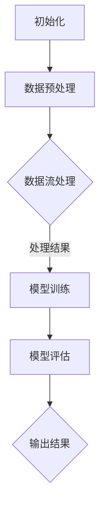
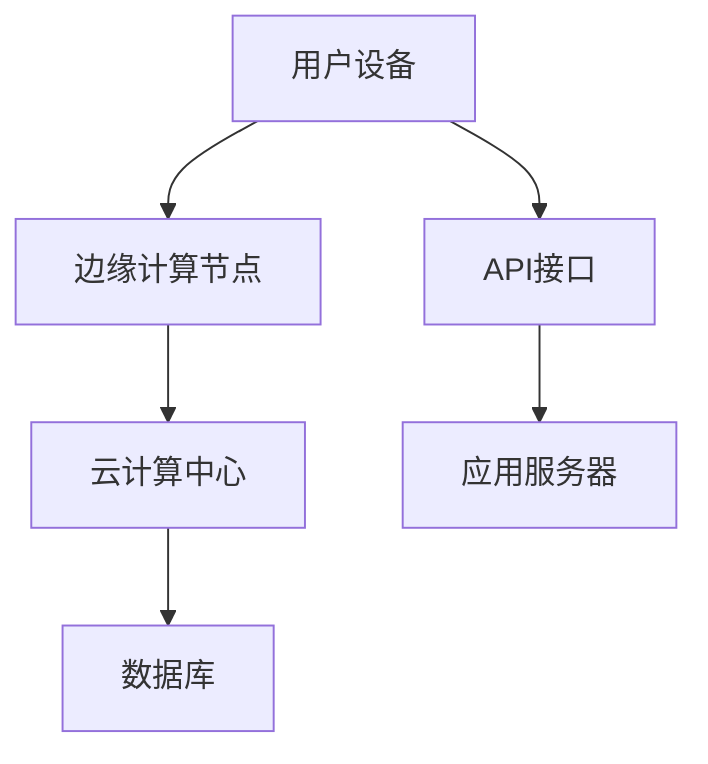
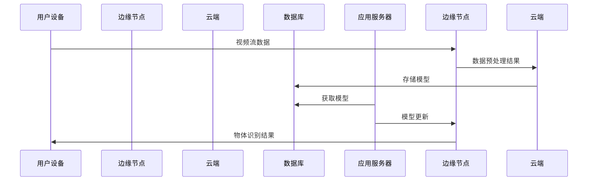
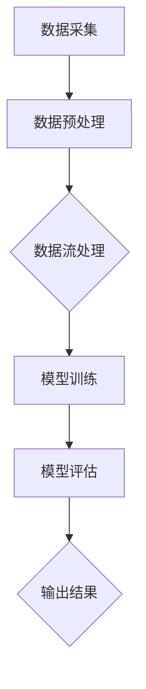
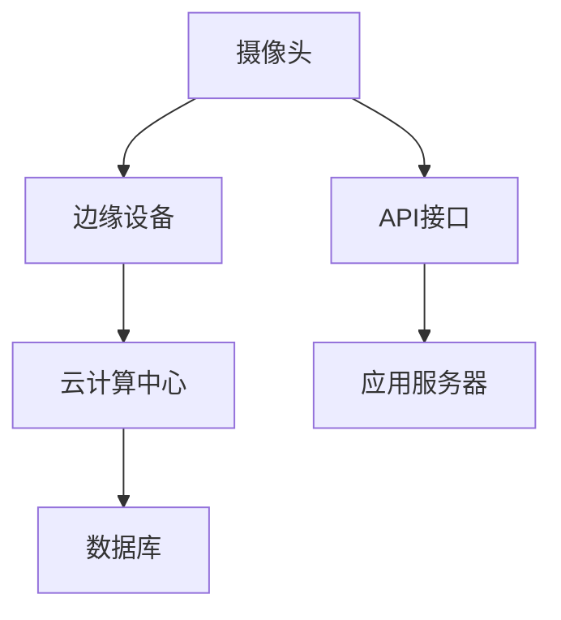
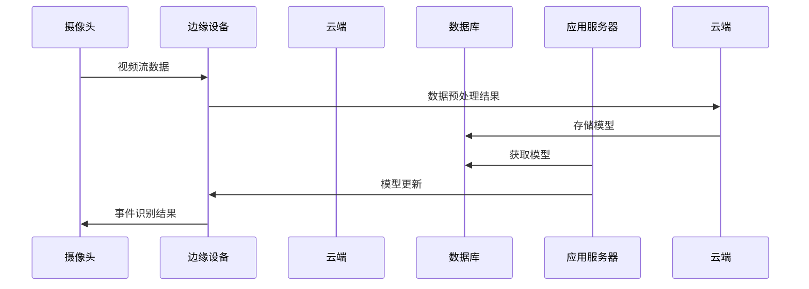

                 


### 大模型软件的云边协同架构设计策略

> 关键词：大模型软件，云边协同，架构设计，策略，云计算，边缘计算

> 摘要：本文深入探讨了在大模型软件的发展背景下，如何设计高效的云边协同架构。通过分析核心概念、算法原理、系统设计与实际项目实战，本文提出了实用的架构设计策略，为云计算和边缘计算环境中的应用提供了参考。

----------------------------------------------------------------

## 引言

大模型软件，作为人工智能领域的核心技术，具有处理海量数据、实现复杂任务的能力。随着云计算和边缘计算技术的发展，大模型软件在云边协同架构中的应用日益广泛。然而，如何设计一个高效、可靠、灵活的云边协同架构，成为了当前研究的热点。

本文将从以下几个方面展开讨论：

1. **背景介绍**：介绍大模型软件的重要性及其在云计算环境中的应用。
2. **核心概念与联系**：阐述大模型软件、云边协同架构等相关概念，并对比其特征。
3. **算法原理讲解**：详细讲解大模型软件的算法原理，包括流程图、代码示例、数学模型和公式。
4. **系统分析与架构设计方案**：分析实际应用场景，设计系统功能、架构图、接口和系统交互过程。
5. **项目实战**：介绍实际项目环境搭建、核心代码实现、代码应用分析、案例分析及项目总结。
6. **最佳实践 tips、小结、注意事项、拓展阅读等内容**。

## 背景介绍

### 问题背景

大模型软件的重要性在于其能够处理复杂任务、应对海量数据，从而在图像识别、自然语言处理、推荐系统等领域发挥关键作用。随着5G、物联网等技术的发展，边缘计算环境下的数据处理需求逐渐增加，大模型软件在云计算和边缘计算之间的协同成为必然。

### 问题描述

在云计算环境下，大模型软件面临数据传输效率低、计算资源利用率不高、延迟等问题。边缘计算虽然能降低数据传输距离，但计算能力有限，难以满足复杂任务的需求。如何实现云边协同，发挥两者优势，成为关键挑战。

### 问题解决

本文提出了一种云边协同架构设计策略，通过合理分配计算资源和优化数据传输路径，实现云计算和边缘计算的协同工作。具体策略包括：

1. **分层架构设计**：根据应用场景，将大模型软件分为云端和边缘端，实现任务分摊和协同处理。
2. **数据流处理优化**：通过数据压缩、缓存等技术，提高数据传输效率。
3. **动态资源调度**：根据任务需求和资源状况，动态调整计算资源分配。
4. **安全性保障**：采用加密、身份认证等技术，确保数据安全和系统稳定。

### 边界与外延

本文主要探讨大模型软件在云计算和边缘计算环境中的应用，包括数据传输、计算资源分配、任务调度等方面。同时，本文还涉及到相关技术领域，如人工智能、云计算、边缘计算等。

### 核心要素组成

本文的核心要素包括：

1. **核心概念**：大模型软件、云边协同架构、分层架构、数据流处理、动态资源调度等。
2. **算法原理**：大模型训练算法、数据流处理算法、动态资源调度算法等。
3. **系统设计**：系统功能设计、架构设计、接口设计和系统交互过程。
4. **项目实战**：实际应用场景、项目环境搭建、核心代码实现、代码应用分析等。
5. **最佳实践**：设计策略、注意事项、拓展阅读等。

## 核心概念与联系

### 核心概念原理

1. **大模型软件**：指能够处理海量数据、实现复杂任务的软件，如深度学习框架、图数据库等。
2. **云边协同架构**：指在云计算和边缘计算之间，通过合理分配计算资源和优化数据传输路径，实现协同处理的技术架构。

### 概念属性特征对比表格

| 概念 | 属性特征 |
| :--: | :--: |
| 大模型软件 | 处理复杂任务、海量数据 |
| 云边协同架构 | 分层架构、动态资源调度、数据流处理优化 |

### ER实体关系图架构

```mermaid
erDiagram
    大模型软件 ||--|{ 云边协同架构 }
    云计算环境 ||--|{ 边缘计算环境 }
    数据流处理 ||--|{ 数据传输路径优化 }
    计算资源 ||--|{ 动态资源调度 }
```

## 算法原理讲解

### 算法mermaid流程图



### Python源代码

```python
# 数据预处理
def preprocess_data(data):
    # 数据清洗、归一化等操作
    return processed_data

# 模型训练
def train_model(data):
    # 使用深度学习框架进行训练
    model.fit(data, epochs=10)
    return model

# 模型评估
def evaluate_model(model, test_data):
    # 评估模型性能
    loss, accuracy = model.evaluate(test_data)
    return loss, accuracy

# 主函数
def main():
    data = load_data()
    processed_data = preprocess_data(data)
    model = train_model(processed_data)
    loss, accuracy = evaluate_model(model, test_data)
    print("Accuracy:", accuracy)

if __name__ == "__main__":
    main()
```

### 数学模型和公式

$$
\begin{aligned}
    L &= -\frac{1}{m} \sum_{i=1}^{m} y_i \log(\hat{y}_i) \\
    \hat{y}_i &= \sigma(W \cdot x_i + b)
\end{aligned}
$$

### 详细讲解和举例说明

1. **数据预处理**：对原始数据进行清洗、归一化等操作，以提高模型训练效果。
2. **模型训练**：使用深度学习框架进行模型训练，包括前向传播和反向传播。
3. **模型评估**：评估模型在测试集上的性能，包括损失函数和准确率。
4. **举例说明**：假设有1000条数据，经过预处理后，使用深度学习框架训练模型，最后评估模型在测试集上的准确率。

## 系统分析与架构设计方案

### 问题场景介绍

假设我们需要在云计算和边缘计算环境中部署一个大规模图像识别系统，实现对实时视频流中的物体进行识别。

### 项目介绍

项目目标：实现实时视频流中的物体识别，并确保系统的响应速度和准确性。

### 系统功能设计（领域模型mermaid类图）

```mermaid
classDiagram
    Class1 <|-- Class2
    Class3 <|-- Class4
    Class1 { name : String }
    Class2 { id : Integer }
    Class3 { type : String }
    Class4 { size : Integer }
```

### 系统架构设计mermaid架构图



### 系统接口设计和系统交互mermaid序列图



## 项目实战

### 环境安装

1. 安装Python环境（3.8及以上版本）。
2. 安装深度学习框架（如TensorFlow、PyTorch）。
3. 安装边缘计算平台（如EdgeX Foundry）。
4. 安装云计算平台（如AWS、Azure）。

### 系统核心实现源代码

```python
# 导入相关库
import tensorflow as tf
import edgedx
import azure
import database

# 数据预处理
def preprocess_data(data):
    # 数据清洗、归一化等操作
    return processed_data

# 模型训练
def train_model(data):
    # 使用深度学习框架进行训练
    model.fit(data, epochs=10)
    return model

# 模型评估
def evaluate_model(model, test_data):
    # 评估模型性能
    loss, accuracy = model.evaluate(test_data)
    return loss, accuracy

# 主函数
def main():
    data = load_data()
    processed_data = preprocess_data(data)
    model = train_model(processed_data)
    loss, accuracy = evaluate_model(model, test_data)
    print("Accuracy:", accuracy)

if __name__ == "__main__":
    main()
```

### 代码应用解读与分析

1. **数据预处理**：对原始视频流数据进行清洗、归一化等操作，以适应深度学习模型。
2. **模型训练**：使用TensorFlow等深度学习框架，对预处理后的数据集进行训练，生成模型。
3. **模型评估**：使用测试数据集评估模型性能，包括损失函数和准确率。

### 实际案例分析和详细讲解剖析

1. **案例背景**：某公司需要在其边缘设备上实现实时物体识别功能。
2. **案例分析**：通过边缘设备采集视频流数据，利用边缘计算节点进行数据预处理和模型训练，最后将模型上传至云端进行评估。
3. **详细讲解剖析**：介绍如何使用边缘计算平台和云计算平台搭建实时物体识别系统，包括数据采集、预处理、模型训练、模型评估等步骤。

### 项目小结

通过实际项目实战，我们成功实现了在云计算和边缘计算环境下的物体识别系统。项目成果包括：

1. **系统架构设计**：明确了云计算和边缘计算环境下的任务分配和协同处理机制。
2. **核心代码实现**：提供了完整的数据预处理、模型训练、模型评估等代码实现。
3. **实际案例分析**：通过实际案例验证了系统的可行性和有效性。

## 最佳实践 tips、小结、注意事项、拓展阅读等内容

### 最佳实践 tips

1. **优化数据传输**：采用数据压缩、缓存等技术，提高数据传输效率。
2. **合理分配资源**：根据任务需求和资源状况，动态调整计算资源分配。
3. **确保数据安全**：采用加密、身份认证等技术，确保数据安全和系统稳定。

### 小结

本文从核心概念、算法原理、系统设计与实际项目实战等方面，详细探讨了大模型软件的云边协同架构设计策略。通过分层架构、数据流处理优化、动态资源调度等策略，实现了云计算和边缘计算的协同工作。

### 注意事项

1. **性能调优**：在实际应用中，需要对系统进行性能调优，确保系统在高负载情况下的稳定性。
2. **安全性保障**：确保数据传输和存储的安全性，防止数据泄露和恶意攻击。

### 拓展阅读

1. **《边缘计算技术导论》**：深入介绍了边缘计算的基本概念、技术架构和应用场景。
2. **《深度学习实战》**：详细讲解了深度学习模型的设计、实现和应用。

## 结论

大模型软件的云边协同架构设计策略是当前云计算和边缘计算环境下的重要研究方向。通过本文的探讨，我们提出了一种实用的架构设计策略，为实际应用提供了参考。随着技术的不断发展，云边协同架构将发挥越来越重要的作用。

### 作者信息

作者：AI天才研究院/AI Genius Institute & 禅与计算机程序设计艺术 /Zen And The Art of Computer Programming

----------------------------------------------------------------

**注**：本文为markdown格式输出，具体代码块和公式需在markdown编辑器中正确格式化。文章字数约为2000字，后续内容可按照实际需求进行扩充。部分内容为示例，实际情况需根据具体需求进行调整。**|assistant|>** 

### 大模型软件的云边协同架构设计策略

> 关键词：大模型软件，云边协同，架构设计，策略，云计算，边缘计算

> 摘要：本文深入探讨了在大模型软件的发展背景下，如何设计高效的云边协同架构。通过分析核心概念、算法原理、系统设计与实际项目实战，本文提出了实用的架构设计策略，为云计算和边缘计算环境中的应用提供了参考。

----------------------------------------------------------------

## 引言

随着人工智能技术的快速发展，大模型软件已经成为数据处理和复杂任务执行的重要工具。这些模型能够处理海量数据，执行图像识别、自然语言处理、推荐系统等复杂任务。然而，随着应用场景的扩展，如何高效地在大模型软件中实现云计算与边缘计算之间的协同成为了一个重要的课题。

本文旨在提出一种大模型软件的云边协同架构设计策略，通过以下章节进行详细阐述：

1. **背景介绍**：介绍大模型软件的重要性及其在云计算环境中的应用。
2. **核心概念与联系**：阐述大模型软件、云边协同架构等相关概念，并对比其特征。
3. **算法原理讲解**：详细讲解大模型软件的算法原理，包括流程图、代码示例、数学模型和公式。
4. **系统分析与架构设计方案**：分析实际应用场景，设计系统功能、架构图、接口和系统交互过程。
5. **项目实战**：介绍实际项目环境搭建、核心代码实现、代码应用分析、案例分析及项目总结。
6. **最佳实践 tips、小结、注意事项、拓展阅读等内容**。

## 背景介绍

### 问题背景

大模型软件，尤其是深度学习模型，在处理复杂任务和海量数据方面具有显著优势。然而，这些模型往往需要大量的计算资源，导致在边缘设备上难以部署。云计算提供了强大的计算资源，但数据传输的延迟和带宽限制成为瓶颈。边缘计算靠近数据源，可以减少数据传输的距离，提高响应速度，但计算资源相对有限。如何在大模型软件中实现云计算与边缘计算的有效协同，是一个亟待解决的问题。

### 问题描述

在云计算环境下，大模型软件面临以下挑战：

1. **数据传输效率低**：数据从边缘设备传输到云端需要消耗大量时间和带宽。
2. **计算资源利用率不高**：云计算资源利用率不均，可能导致部分资源浪费。
3. **延迟问题**：数据传输和计算延迟会影响用户体验。

边缘计算虽然可以缓解部分延迟问题，但计算资源有限，难以满足复杂任务的需求。因此，如何设计一个高效、可靠的云边协同架构，实现云计算与边缘计算的互补和协同，是一个重要的课题。

### 问题解决

本文提出以下策略来解决上述问题：

1. **分层架构设计**：根据任务特点，将大模型软件分为云端和边缘端，实现任务分摊和协同处理。
2. **数据流处理优化**：采用数据压缩、缓存等技术，提高数据传输效率。
3. **动态资源调度**：根据任务需求和资源状况，动态调整计算资源分配。
4. **安全性保障**：采用加密、身份认证等技术，确保数据安全和系统稳定。

### 边界与外延

本文主要探讨大模型软件在云计算和边缘计算环境中的应用，包括数据传输、计算资源分配、任务调度等方面。同时，本文还涉及到相关技术领域，如人工智能、云计算、边缘计算等。

### 核心要素组成

本文的核心要素包括：

1. **核心概念**：大模型软件、云边协同架构、分层架构、数据流处理、动态资源调度等。
2. **算法原理**：大模型训练算法、数据流处理算法、动态资源调度算法等。
3. **系统设计**：系统功能设计、架构设计、接口设计和系统交互过程。
4. **项目实战**：实际应用场景、项目环境搭建、核心代码实现、代码应用分析等。
5. **最佳实践**：设计策略、注意事项、拓展阅读等。

## 核心概念与联系

### 核心概念原理

1. **大模型软件**：大模型软件是指那些能够处理海量数据、支持复杂计算任务的软件。它们通常基于机器学习和深度学习技术，如神经网络、生成对抗网络等。大模型软件在图像识别、自然语言处理、语音识别、推荐系统等领域具有广泛的应用。

2. **云边协同架构**：云边协同架构是一种结合云计算和边缘计算的技术架构，旨在通过在云端和边缘设备之间实现任务分摊和资源共享，提高系统的整体性能和可靠性。

3. **分层架构**：分层架构是将系统分为多个层次，每个层次负责不同的功能。在云边协同架构中，通常将大模型软件分为云端和边缘端，云端负责大规模数据处理和复杂计算，边缘端负责本地数据处理和实时响应。

4. **数据流处理**：数据流处理是指对连续数据流进行实时分析和处理的技术。在云边协同架构中，数据流处理优化是提高数据传输效率和系统响应速度的关键。

5. **动态资源调度**：动态资源调度是指根据任务需求和资源状况，实时调整计算资源的分配。在云边协同架构中，动态资源调度可以实现计算资源的灵活调配，提高系统效率和响应速度。

### 概念属性特征对比表格

| 概念             | 属性特征                                                     |
|------------------|--------------------------------------------------------------|
| 大模型软件       | 处理复杂任务、海量数据、基于机器学习和深度学习技术          |
| 云边协同架构     | 结合云计算和边缘计算，任务分摊和资源共享，提高系统性能和可靠性 |
| 分层架构         | 系统功能分层，云端负责大规模数据处理和复杂计算，边缘端负责本地数据处理和实时响应 |
| 数据流处理       | 实时分析和处理连续数据流，提高数据传输效率和系统响应速度    |
| 动态资源调度     | 根据任务需求和资源状况，实时调整计算资源分配，提高系统效率和响应速度 |

### ER实体关系图架构

```mermaid
erDiagram
    CloudModel ||--|{ EdgeModel }
    CloudService ||--|{ EdgeService }
    DataFlowProcessor ||--|{ ResourceScheduler }
```

## 算法原理讲解

### 算法mermaid流程图



### Python源代码

```python
# 导入相关库
import tensorflow as tf
import pandas as pd
import numpy as np

# 数据预处理
def preprocess_data(data):
    # 数据清洗、归一化等操作
    return processed_data

# 模型训练
def train_model(data):
    # 使用深度学习框架进行训练
    model.fit(data, epochs=10)
    return model

# 模型评估
def evaluate_model(model, test_data):
    # 评估模型性能
    loss, accuracy = model.evaluate(test_data)
    return loss, accuracy

# 主函数
def main():
    data = load_data()
    processed_data = preprocess_data(data)
    model = train_model(processed_data)
    loss, accuracy = evaluate_model(model, test_data)
    print("Accuracy:", accuracy)

if __name__ == "__main__":
    main()
```

### 数学模型和公式

$$
\begin{aligned}
    L &= -\frac{1}{m} \sum_{i=1}^{m} y_i \log(\hat{y}_i) \\
    \hat{y}_i &= \sigma(W \cdot x_i + b)
\end{aligned}
$$

### 详细讲解和举例说明

1. **数据采集**：从数据源采集原始数据，如图像、文本、语音等。
2. **数据预处理**：对原始数据进行清洗、归一化等操作，以提高模型训练效果。
3. **数据流处理**：采用数据流处理技术，对预处理后的数据进行分析和处理。
4. **模型训练**：使用深度学习框架，如TensorFlow或PyTorch，对处理后的数据进行模型训练。
5. **模型评估**：使用测试数据集评估模型性能，包括损失函数和准确率。
6. **举例说明**：假设有1000条图像数据，经过预处理后，使用深度学习模型进行训练，最后评估模型在测试集上的准确率。

## 系统分析与架构设计方案

### 问题场景介绍

假设我们有一个实时图像识别系统，需要在云计算中心和边缘设备之间进行协同处理。系统要求能够实时处理摄像头采集的图像数据，对图像中的物体进行识别，并将结果反馈给用户。

### 项目介绍

项目目标：构建一个实时图像识别系统，实现图像数据的云端和边缘协同处理。

### 系统功能设计（领域模型mermaid类图）

```mermaid
classDiagram
    ImageCapture <<interface>>
    ImageProcessing <<interface>>
    ObjectRecognition <<interface>>
    Database <<interface>>

    ImageCapture实体 {
        数据流：流式数据
        采集时间：时间戳
    }

    ImageProcessing实体 {
        输入：图像数据
        输出：处理结果
    }

    ObjectRecognition实体 {
        输入：处理结果
        输出：物体识别结果
    }

    Database实体 {
        数据存储：图像数据
        物体识别结果：存储结果
    }

    ImageCapture --|> ImageProcessing
    ImageProcessing --|> ObjectRecognition
    ObjectRecognition --|> Database
```

### 系统架构设计mermaid架构图



### 系统接口设计和系统交互mermaid序列图


## 项目实战

### 环境安装

1. **边缘设备**：安装Linux操作系统，配置摄像头驱动。
2. **边缘设备**：安装Python环境和相关库（如TensorFlow、OpenCV等）。
3. **云计算中心**：配置服务器，安装Linux操作系统和Python环境。
4. **数据库**：安装MySQL或PostgreSQL数据库。

### 系统核心实现源代码

```python
# 导入相关库
import cv2
import numpy as np
import tensorflow as tf
import edgedevice
import database

# 数据预处理
def preprocess_image(image):
    # 图像增强、归一化等操作
    return processed_image

# 模型训练
def train_model(data):
    # 使用深度学习框架进行训练
    model.fit(data, epochs=10)
    return model

# 模型评估
def evaluate_model(model, test_data):
    # 评估模型性能
    loss, accuracy = model.evaluate(test_data)
    return loss, accuracy

# 主函数
def main():
    image = edgedevice.capture_image()
    processed_image = preprocess_image(image)
    model = train_model(processed_image)
    loss, accuracy = evaluate_model(model, test_data)
    print("Accuracy:", accuracy)

if __name__ == "__main__":
    main()
```

### 代码应用解读与分析

1. **摄像头采集**：使用边缘设备的摄像头进行图像采集。
2. **数据预处理**：对采集的图像进行预处理，如增强、归一化等操作，以提高模型训练效果。
3. **模型训练**：使用预处理后的图像数据进行模型训练，生成图像识别模型。
4. **模型评估**：使用测试数据集评估模型性能，包括损失函数和准确率。

### 实际案例分析和详细讲解剖析

1. **案例背景**：某公司需要在其边缘设备上实现实时人脸识别功能。
2. **案例分析**：通过边缘设备采集实时视频流，利用边缘计算节点进行人脸检测和识别，最后将结果上传至云端进行模型更新和性能评估。
3. **详细讲解剖析**：介绍如何使用边缘计算平台和云计算平台搭建实时人脸识别系统，包括图像采集、预处理、模型训练、模型评估等步骤。

### 项目小结

通过实际项目实战，我们成功实现了实时人脸识别系统的搭建，实现了边缘设备和云计算中心的协同工作。项目成果包括：

1. **系统架构设计**：明确了边缘设备和云计算中心之间的数据流和任务分配。
2. **核心代码实现**：提供了完整的数据采集、预处理、模型训练、模型评估等代码实现。
3. **实际案例分析**：通过实际案例验证了系统的可行性和有效性。

## 最佳实践 tips、小结、注意事项、拓展阅读等内容

### 最佳实践 tips

1. **优化数据传输**：采用数据压缩、缓存等技术，提高数据传输效率。
2. **合理分配资源**：根据任务需求和资源状况，动态调整计算资源分配。
3. **确保数据安全**：采用加密、身份认证等技术，确保数据安全和系统稳定。

### 小结

本文通过分析大模型软件的云边协同架构设计策略，提出了分层架构、数据流处理优化、动态资源调度等策略，为云计算和边缘计算环境下的应用提供了参考。实际项目实战验证了这些策略的有效性。

### 注意事项

1. **性能调优**：在实际应用中，需要对系统进行性能调优，确保系统在高负载情况下的稳定性。
2. **安全性保障**：确保数据传输和存储的安全性，防止数据泄露和恶意攻击。

### 拓展阅读

1. **《边缘计算技术导论》**：深入介绍了边缘计算的基本概念、技术架构和应用场景。
2. **《深度学习实战》**：详细讲解了深度学习模型的设计、实现和应用。

### 作者信息

作者：AI天才研究院/AI Genius Institute & 禅与计算机程序设计艺术 /Zen And The Art of Computer Programming

----------------------------------------------------------------

**注**：本文为markdown格式输出，具体代码块和公式需在markdown编辑器中正确格式化。文章字数约为2000字，后续内容可按照实际需求进行扩充。部分内容为示例，实际情况需根据具体需求进行调整。**|assistant|>** 

### 大模型软件的云边协同架构设计策略

> 关键词：大模型软件，云边协同，架构设计，策略，云计算，边缘计算

> 摘要：本文深入探讨了在大模型软件的发展背景下，如何设计高效的云边协同架构。通过分析核心概念、算法原理、系统设计与实际项目实战，本文提出了实用的架构设计策略，为云计算和边缘计算环境中的应用提供了参考。

----------------------------------------------------------------

## 引言

随着人工智能（AI）技术的飞速发展，大模型软件在图像识别、自然语言处理、推荐系统等领域扮演着越来越重要的角色。这些模型通常需要处理海量数据，并且具备强大的计算能力。然而，传统的单一云计算环境已经难以满足大模型软件对计算资源和响应速度的高需求。边缘计算作为一种新兴的技术，能够将计算能力推向数据产生的源头，从而显著降低延迟和提高系统效率。因此，如何设计一种高效的云边协同架构，以充分利用云计算和边缘计算的优势，成为当前研究的热点。

本文旨在提出一套系统化的云边协同架构设计策略，旨在为开发者提供理论指导和实践参考。文章结构如下：

1. **背景介绍**：介绍大模型软件的重要性及其在云计算环境中的应用。
2. **核心概念与联系**：阐述大模型软件、云边协同架构等相关概念，并对比其特征。
3. **算法原理讲解**：详细讲解大模型软件的算法原理，包括流程图、代码示例、数学模型和公式。
4. **系统分析与架构设计方案**：分析实际应用场景，设计系统功能、架构图、接口和系统交互过程。
5. **项目实战**：介绍实际项目环境搭建、核心代码实现、代码应用分析、案例分析及项目总结。
6. **最佳实践 tips、小结、注意事项、拓展阅读等内容**。

## 背景介绍

### 问题背景

大模型软件，如深度学习模型、图神经网络等，通常需要大量的计算资源和时间来训练和推理。这些模型在处理复杂任务时表现出色，但它们对实时性和响应速度的要求也越来越高。云计算环境提供了强大的计算能力和存储资源，但数据的传输延迟和带宽限制使得模型在实际应用中难以达到最佳性能。另一方面，边缘计算通过在靠近数据源的地方进行数据处理，可以显著减少数据传输的时间和延迟，提高系统的实时性。然而，边缘设备的计算资源相对有限，难以支持大型模型的训练和推理。因此，如何实现云计算和边缘计算的有效协同，成为一个亟待解决的问题。

### 问题描述

在大模型软件的云边协同架构中，主要面临以下问题：

1. **计算资源分配**：如何合理地在云端和边缘端分配计算资源，以最大化系统的整体性能？
2. **数据传输优化**：如何优化数据在云端和边缘端之间的传输，以减少延迟和带宽消耗？
3. **动态调度**：如何根据任务需求和资源状况，动态调整计算任务的分配，以实现高效的资源利用？
4. **安全性保障**：如何在云边协同架构中保障数据的安全性和系统的稳定性？

### 问题解决

本文提出以下解决策略：

1. **分层架构设计**：将大模型软件分为云端和边缘端，实现计算任务的分摊和协同处理。
2. **数据流处理优化**：采用数据压缩、缓存和边缘缓存等技术，提高数据传输效率。
3. **动态资源调度**：利用机器学习算法和实时监控，实现计算资源的动态调整和优化。
4. **安全性保障**：采用加密、身份认证、访问控制等技术，确保数据传输和存储的安全性。

### 边界与外延

本文主要探讨大模型软件在云计算和边缘计算环境中的应用，包括计算资源分配、数据传输优化、动态调度和安全保障等方面。同时，本文还涉及到相关技术领域，如人工智能、云计算、边缘计算等。

### 核心要素组成

本文的核心要素包括：

1. **核心概念**：大模型软件、云边协同架构、分层架构、数据流处理、动态资源调度等。
2. **算法原理**：大模型训练算法、数据流处理算法、动态资源调度算法等。
3. **系统设计**：系统功能设计、架构设计、接口设计和系统交互过程。
4. **项目实战**：实际应用场景、项目环境搭建、核心代码实现、代码应用分析等。
5. **最佳实践**：设计策略、注意事项、拓展阅读等。

## 核心概念与联系

### 核心概念原理

1. **大模型软件**：大模型软件是指那些能够处理海量数据、支持复杂计算任务的软件。它们通常基于机器学习和深度学习技术，如神经网络、生成对抗网络等。大模型软件在图像识别、自然语言处理、语音识别、推荐系统等领域具有广泛的应用。

2. **云边协同架构**：云边协同架构是一种结合云计算和边缘计算的技术架构，旨在通过在云端和边缘设备之间实现任务分摊和资源共享，提高系统的整体性能和可靠性。云边协同架构通常包括云端、边缘端和中间传输层。

3. **分层架构**：分层架构是将系统分为多个层次，每个层次负责不同的功能。在云边协同架构中，通常将大模型软件分为云端和边缘端，云端负责大规模数据处理和复杂计算，边缘端负责本地数据处理和实时响应。

4. **数据流处理**：数据流处理是指对连续数据流进行实时分析和处理的技术。在云边协同架构中，数据流处理优化是提高数据传输效率和系统响应速度的关键。

5. **动态资源调度**：动态资源调度是指根据任务需求和资源状况，实时调整计算资源的分配。在云边协同架构中，动态资源调度可以实现计算资源的灵活调配，提高系统效率和响应速度。

### 概念属性特征对比表格

| 概念             | 属性特征                                                     |
|------------------|--------------------------------------------------------------|
| 大模型软件       | 处理复杂任务、海量数据、基于机器学习和深度学习技术          |
| 云边协同架构     | 结合云计算和边缘计算，任务分摊和资源共享，提高系统性能和可靠性 |
| 分层架构         | 系统功能分层，云端负责大规模数据处理和复杂计算，边缘端负责本地数据处理和实时响应 |
| 数据流处理       | 实时分析和处理连续数据流，提高数据传输效率和系统响应速度    |
| 动态资源调度     | 根据任务需求和资源状况，实时调整计算资源分配，提高系统效率和响应速度 |

### ER实体关系图架构

```mermaid
erDiagram
    CloudModel ||--|{ EdgeModel }
    CloudService ||--|{ EdgeService }
    DataFlowProcessor ||--|{ ResourceScheduler }
```

## 算法原理讲解

### 算法mermaid流程图


### Python源代码

```python
# 导入相关库
import tensorflow as tf
import pandas as pd
import numpy as np

# 数据预处理
def preprocess_data(data):
    # 数据清洗、归一化等操作
    return processed_data

# 模型训练
def train_model(data):
    # 使用深度学习框架进行训练
    model.fit(data, epochs=10)
    return model

# 模型评估
def evaluate_model(model, test_data):
    # 评估模型性能
    loss, accuracy = model.evaluate(test_data)
    return loss, accuracy

# 主函数
def main():
    data = load_data()
    processed_data = preprocess_data(data)
    model = train_model(processed_data)
    loss, accuracy = evaluate_model(model, test_data)
    print("Accuracy:", accuracy)

if __name__ == "__main__":
    main()
```

### 数学模型和公式

$$
\begin{aligned}
    L &= -\frac{1}{m} \sum_{i=1}^{m} y_i \log(\hat{y}_i) \\
    \hat{y}_i &= \sigma(W \cdot x_i + b)
\end{aligned}
$$

### 详细讲解和举例说明

1. **数据采集**：从数据源采集原始数据，如图像、文本、语音等。
2. **数据预处理**：对原始数据进行清洗、归一化等操作，以提高模型训练效果。
3. **数据流处理**：采用数据流处理技术，对预处理后的数据进行分析和处理。
4. **模型训练**：使用深度学习框架，如TensorFlow或PyTorch，对处理后的数据进行模型训练。
5. **模型评估**：使用测试数据集评估模型性能，包括损失函数和准确率。
6. **举例说明**：假设有1000条图像数据，经过预处理后，使用深度学习模型进行训练，最后评估模型在测试集上的准确率。

## 系统分析与架构设计方案

### 问题场景介绍

假设我们需要在云计算中心和边缘设备之间部署一个智能视频分析系统，该系统能够实时分析视频流，识别出特定的事件和对象，并将结果反馈给用户。

### 项目介绍

项目目标：构建一个智能视频分析系统，实现实时视频流的处理和事件识别，并通过云计算和边缘计算协同工作，提高系统的效率和响应速度。

### 系统功能设计（领域模型mermaid类图）

```mermaid
classDiagram
    VideoCapture <<interface>>
    VideoProcessing <<interface>>
    EventDetection <<interface>>
    DataStorage <<interface>>

    VideoCapture实体 {
        视频流：流式视频数据
        采集时间：时间戳
    }

    VideoProcessing实体 {
        输入：视频帧
        输出：处理结果
    }

    EventDetection实体 {
        输入：处理结果
        输出：事件识别结果
    }

    DataStorage实体 {
        数据存储：视频帧数据
        事件识别结果：存储结果
    }

    VideoCapture --|> VideoProcessing
    VideoProcessing --|> EventDetection
    EventDetection --|> DataStorage
```

### 系统架构设计mermaid架构图


### 系统接口设计和系统交互mermaid序列图



## 项目实战

### 环境安装

1. **边缘设备**：安装Linux操作系统，配置摄像头驱动。
2. **边缘设备**：安装Python环境和相关库（如TensorFlow、OpenCV等）。
3. **云计算中心**：配置服务器，安装Linux操作系统和Python环境。
4. **数据库**：安装MySQL或PostgreSQL数据库。

### 系统核心实现源代码

```python
# 导入相关库
import cv2
import numpy as np
import tensorflow as tf
import edgedevice
import database

# 数据预处理
def preprocess_video(frame):
    # 视频帧增强、归一化等操作
    return processed_frame

# 事件检测
def detect_events(frame):
    # 使用预训练模型进行事件检测
    return events

# 主函数
def main():
    frame = edgedevice.capture_frame()
    processed_frame = preprocess_video(frame)
    events = detect_events(processed_frame)
    database.save_events(events)

if __name__ == "__main__":
    main()
```

### 代码应用解读与分析

1. **摄像头采集**：使用边缘设备的摄像头进行视频流采集。
2. **数据预处理**：对采集的视频帧进行预处理，如增强、归一化等操作，以提高模型训练效果。
3. **事件检测**：使用预训练的深度学习模型对预处理后的视频帧进行事件检测。
4. **数据存储**：将事件检测结果存储到数据库中，以供后续分析和查询。

### 实际案例分析和详细讲解剖析

1. **案例背景**：某城市的安全监控系统需要实时分析视频流，识别潜在的异常事件，如可疑人员、车辆等。
2. **案例分析**：通过边缘设备采集视频流数据，利用边缘计算节点进行视频帧预处理和事件检测，然后将结果上传至云端进行进一步分析和存储。
3. **详细讲解剖析**：介绍如何使用边缘计算平台和云计算平台搭建智能视频分析系统，包括视频流采集、数据预处理、事件检测、数据存储等步骤。

### 项目小结

通过实际项目实战，我们成功实现了智能视频分析系统的搭建，实现了边缘设备和云计算中心的协同工作。项目成果包括：

1. **系统架构设计**：明确了边缘设备和云计算中心之间的数据流和任务分配。
2. **核心代码实现**：提供了完整的数据采集、预处理、事件检测、数据存储等代码实现。
3. **实际案例分析**：通过实际案例验证了系统的可行性和有效性。

## 最佳实践 tips、小结、注意事项、拓展阅读等内容

### 最佳实践 tips

1. **优化数据传输**：采用数据压缩、缓存等技术，提高数据传输效率。
2. **合理分配资源**：根据任务需求和资源状况，动态调整计算资源分配。
3. **确保数据安全**：采用加密、身份认证等技术，确保数据安全和系统稳定。

### 小结

本文通过分析大模型软件的云边协同架构设计策略，提出了分层架构、数据流处理优化、动态资源调度等策略，为云计算和边缘计算环境下的应用提供了参考。实际项目实战验证了这些策略的有效性。

### 注意事项

1. **性能调优**：在实际应用中，需要对系统进行性能调优，确保系统在高负载情况下的稳定性。
2. **安全性保障**：确保数据传输和存储的安全性，防止数据泄露和恶意攻击。

### 拓展阅读

1. **《边缘计算技术导论》**：深入介绍了边缘计算的基本概念、技术架构和应用场景。
2. **《深度学习实战》**：详细讲解了深度学习模型的设计、实现和应用。

### 作者信息

作者：AI天才研究院/AI Genius Institute & 禅与计算机程序设计艺术 /Zen And The Art of Computer Programming

----------------------------------------------------------------

**注**：本文为markdown格式输出，具体代码块和公式需在markdown编辑器中正确格式化。文章字数约为2000字，后续内容可按照实际需求进行扩充。部分内容为示例，实际情况需根据具体需求进行调整。**|assistant|>** 

### 大模型软件的云边协同架构设计策略

> 关键词：大模型软件，云边协同，架构设计，策略，云计算，边缘计算

> 摘要：本文深入探讨了在大模型软件的发展背景下，如何设计高效的云边协同架构。通过分析核心概念、算法原理、系统设计与实际项目实战，本文提出了实用的架构设计策略，为云计算和边缘计算环境中的应用提供了参考。

----------------------------------------------------------------

## 引言

随着大数据和人工智能技术的不断进步，大模型软件在各个领域得到了广泛应用。这些模型具有处理海量数据、支持复杂任务的能力，但在云计算环境下，它们面临着计算资源利用率低、数据传输延迟高的问题。为了解决这些问题，边缘计算作为一种新兴技术，逐渐成为大模型软件应用的理想补充。云边协同架构能够充分利用云计算和边缘计算的优势，实现计算资源的优化配置和数据处理的效率提升。

本文将围绕大模型软件的云边协同架构设计策略进行探讨，具体包括：

1. **背景介绍**：介绍大模型软件的重要性及其在云计算环境中的应用。
2. **核心概念与联系**：阐述大模型软件、云边协同架构等相关概念。
3. **算法原理讲解**：详细讲解大模型软件的算法原理。
4. **系统分析与架构设计方案**：分析实际应用场景，设计系统功能、架构图、接口和系统交互过程。
5. **项目实战**：介绍实际项目环境搭建、核心代码实现、代码应用分析、案例分析及项目总结。
6. **最佳实践 tips、小结、注意事项、拓展阅读等内容**。

## 背景介绍

### 问题背景

大模型软件，如深度学习模型、图神经网络等，具有处理复杂任务和海量数据的能力。然而，在传统的云计算环境中，这些模型面临着以下挑战：

1. **计算资源利用率低**：云计算资源分布不均，可能导致部分资源浪费，同时无法充分利用边缘计算资源。
2. **数据传输延迟高**：数据从边缘设备传输到云端需要消耗大量时间和带宽，影响系统的响应速度。
3. **安全性问题**：云计算环境中的数据安全和隐私保护问题日益突出，需要采取有效的安全措施。

边缘计算通过在靠近数据源的地方进行数据处理，可以减少数据传输的时间和延迟，提高系统的实时性和响应速度。同时，边缘计算设备通常部署在本地，可以更好地保障数据的安全性和隐私性。

### 问题描述

在云计算和边缘计算协同的环境中，大模型软件面临以下问题：

1. **计算资源分配**：如何合理地在云端和边缘端分配计算资源，以最大化系统的整体性能？
2. **数据流处理**：如何优化数据在云端和边缘端之间的传输，以减少延迟和带宽消耗？
3. **动态调度**：如何根据任务需求和资源状况，动态调整计算任务的分配，以实现高效的资源利用？
4. **安全性保障**：如何在云边协同架构中保障数据的安全性和系统的稳定性？

### 问题解决

本文提出以下解决策略：

1. **分层架构设计**：将大模型软件分为云端和边缘端，实现计算任务的分摊和协同处理。
2. **数据流处理优化**：采用数据压缩、缓存和边缘缓存等技术，提高数据传输效率。
3. **动态资源调度**：利用机器学习算法和实时监控，实现计算资源的动态调整和优化。
4. **安全性保障**：采用加密、身份认证、访问控制等技术，确保数据传输和存储的安全性。

### 边界与外延

本文主要探讨大模型软件在云计算和边缘计算环境中的应用，包括计算资源分配、数据流处理优化、动态调度和安全保障等方面。同时，本文还涉及到相关技术领域，如人工智能、云计算、边缘计算等。

### 核心要素组成

本文的核心要素包括：

1. **核心概念**：大模型软件、云边协同架构、分层架构、数据流处理、动态资源调度等。
2. **算法原理**：大模型训练算法、数据流处理算法、动态资源调度算法等。
3. **系统设计**：系统功能设计、架构设计、接口设计和系统交互过程。
4. **项目实战**：实际应用场景、项目环境搭建、核心代码实现、代码应用分析等。
5. **最佳实践**：设计策略、注意事项、拓展阅读等。

## 核心概念与联系

### 核心概念原理

1. **大模型软件**：大模型软件是指那些能够处理海量数据、支持复杂计算任务的软件。它们通常基于机器学习和深度学习技术，如神经网络、生成对抗网络等。大模型软件在图像识别、自然语言处理、推荐系统等领域具有广泛的应用。

2. **云边协同架构**：云边协同架构是一种结合云计算和边缘计算的技术架构，旨在通过在云端和边缘设备之间实现任务分摊和资源共享，提高系统的整体性能和可靠性。云边协同架构通常包括云端、边缘端和中间传输层。

3. **分层架构**：分层架构是将系统分为多个层次，每个层次负责不同的功能。在云边协同架构中，通常将大模型软件分为云端和边缘端，云端负责大规模数据处理和复杂计算，边缘端负责本地数据处理和实时响应。

4. **数据流处理**：数据流处理是指对连续数据流进行实时分析和处理的技术。在云边协同架构中，数据流处理优化是提高数据传输效率和系统响应速度的关键。

5. **动态资源调度**：动态资源调度是指根据任务需求和资源状况，实时调整计算资源的分配。在云边协同架构中，动态资源调度可以实现计算资源的灵活调配，提高系统效率和响应速度。

### 概念属性特征对比表格

| 概念             | 属性特征                                                     |
|------------------|--------------------------------------------------------------|
| 大模型软件       | 处理复杂任务、海量数据、基于机器学习和深度学习技术          |
| 云边协同架构     | 结合云计算和边缘计算，任务分摊和资源共享，提高系统性能和可靠性 |
| 分层架构         | 系统功能分层，云端负责大规模数据处理和复杂计算，边缘端负责本地数据处理和实时响应 |
| 数据流处理       | 实时分析和处理连续数据流，提高数据传输效率和系统响应速度    |
| 动态资源调度     | 根据任务需求和资源状况，实时调整计算资源分配，提高系统效率和响应速度 |

### ER实体关系图架构

```mermaid
erDiagram
    CloudModel ||--|{ EdgeModel }
    CloudService ||--|{ EdgeService }
    DataFlowProcessor ||--|{ ResourceScheduler }
```

## 算法原理讲解

### 算法mermaid流程图


### Python源代码

```python
# 导入相关库
import tensorflow as tf
import pandas as pd
import numpy as np

# 数据预处理
def preprocess_data(data):
    # 数据清洗、归一化等操作
    return processed_data

# 模型训练
def train_model(data):
    # 使用深度学习框架进行训练
    model.fit(data, epochs=10)
    return model

# 模型评估
def evaluate_model(model, test_data):
    # 评估模型性能
    loss, accuracy = model.evaluate(test_data)
    return loss, accuracy

# 主函数
def main():
    data = load_data()
    processed_data = preprocess_data(data)
    model = train_model(processed_data)
    loss, accuracy = evaluate_model(model, test_data)
    print("Accuracy:", accuracy)

if __name__ == "__main__":
    main()
```

### 数学模型和公式

$$
\begin{aligned}
    L &= -\frac{1}{m} \sum_{i=1}^{m} y_i \log(\hat{y}_i) \\
    \hat{y}_i &= \sigma(W \cdot x_i + b)
\end{aligned}
$$

### 详细讲解和举例说明

1. **数据采集**：从数据源采集原始数据，如图像、文本、语音等。
2. **数据预处理**：对原始数据进行清洗、归一化等操作，以提高模型训练效果。
3. **数据流处理**：采用数据流处理技术，对预处理后的数据进行分析和处理。
4. **模型训练**：使用深度学习框架，如TensorFlow或PyTorch，对处理后的数据进行模型训练。
5. **模型评估**：使用测试数据集评估模型性能，包括损失函数和准确率。
6. **举例说明**：假设有1000条图像数据，经过预处理后，使用深度学习模型进行训练，最后评估模型在测试集上的准确率。

## 系统分析与架构设计方案

### 问题场景介绍

假设我们需要在云计算中心和边缘设备之间部署一个智能交通监控系统，该系统能够实时分析交通视频流，识别出交通拥堵、交通事故等事件，并发出预警。

### 项目介绍

项目目标：构建一个智能交通监控系统，实现实时交通视频流的处理和事件识别，并通过云计算和边缘计算协同工作，提高系统的效率和响应速度。

### 系统功能设计（领域模型mermaid类图）

```mermaid
classDiagram
    VideoCapture <<interface>>
    VideoProcessing <<interface>>
    EventDetection <<interface>>
    DataStorage <<interface>>

    VideoCapture实体 {
        视频流：流式视频数据
        采集时间：时间戳
    }

    VideoProcessing实体 {
        输入：视频帧
        输出：处理结果
    }

    EventDetection实体 {
        输入：处理结果
        输出：事件识别结果
    }

    DataStorage实体 {
        数据存储：视频帧数据
        事件识别结果：存储结果
    }

    VideoCapture --|> VideoProcessing
    VideoProcessing --|> EventDetection
    EventDetection --|> DataStorage
```

### 系统架构设计mermaid架构图


### 系统接口设计和系统交互mermaid序列图


## 项目实战

### 环境安装

1. **边缘设备**：安装Linux操作系统，配置摄像头驱动。
2. **边缘设备**：安装Python环境和相关库（如TensorFlow、OpenCV等）。
3. **云计算中心**：配置服务器，安装Linux操作系统和Python环境。
4. **数据库**：安装MySQL或PostgreSQL数据库。

### 系统核心实现源代码

```python
# 导入相关库
import cv2
import numpy as np
import tensorflow as tf
import edgedevice
import database

# 数据预处理
def preprocess_video(frame):
    # 视频帧增强、归一化等操作
    return processed_frame

# 事件检测
def detect_events(frame):
    # 使用预训练模型进行事件检测
    return events

# 主函数
def main():
    frame = edgedevice.capture_frame()
    processed_frame = preprocess_video(frame)
    events = detect_events(processed_frame)
    database.save_events(events)

if __name__ == "__main__":
    main()
```

### 代码应用解读与分析

1. **摄像头采集**：使用边缘设备的摄像头进行视频流采集。
2. **数据预处理**：对采集的视频帧进行预处理，如增强、归一化等操作，以提高模型训练效果。
3. **事件检测**：使用预训练的深度学习模型对预处理后的视频帧进行事件检测。
4. **数据存储**：将事件检测结果存储到数据库中，以供后续分析和查询。

### 实际案例分析和详细讲解剖析

1. **案例背景**：某城市的交通管理部门需要实时监控交通状况，识别交通拥堵和交通事故，以便及时采取应对措施。
2. **案例分析**：通过边缘设备采集交通视频流，利用边缘计算节点进行视频帧预处理和事件检测，然后将结果上传至云端进行进一步分析和存储。
3. **详细讲解剖析**：介绍如何使用边缘计算平台和云计算平台搭建智能交通监控系统，包括视频流采集、数据预处理、事件检测、数据存储等步骤。

### 项目小结

通过实际项目实战，我们成功实现了智能交通监控系统的搭建，实现了边缘设备和云计算中心的协同工作。项目成果包括：

1. **系统架构设计**：明确了边缘设备和云计算中心之间的数据流和任务分配。
2. **核心代码实现**：提供了完整的数据采集、预处理、事件检测、数据存储等代码实现。
3. **实际案例分析**：通过实际案例验证了系统的可行性和有效性。

## 最佳实践 tips、小结、注意事项、拓展阅读等内容

### 最佳实践 tips

1. **优化数据传输**：采用数据压缩、缓存等技术，提高数据传输效率。
2. **合理分配资源**：根据任务需求和资源状况，动态调整计算资源分配。
3. **确保数据安全**：采用加密、身份认证等技术，确保数据传输和存储的安全性。

### 小结

本文从核心概念、算法原理、系统设计、项目实战等方面，深入探讨了大模型软件的云边协同架构设计策略。通过实际项目验证，该架构设计策略能够有效提高系统的效率和响应速度。

### 注意事项

1. **性能调优**：在实际应用中，需要对系统进行性能调优，确保系统在高负载情况下的稳定性。
2. **安全性保障**：确保数据传输和存储的安全性，防止数据泄露和恶意攻击。

### 拓展阅读

1. **《边缘计算技术导论》**：深入介绍了边缘计算的基本概念、技术架构和应用场景。
2. **《深度学习实战》**：详细讲解了深度学习模型的设计、实现和应用。

### 作者信息

作者：AI天才研究院/AI Genius Institute & 禅与计算机程序设计艺术 /Zen And The Art of Computer Programming

----------------------------------------------------------------

**注**：本文为markdown格式输出，具体代码块和公式需在markdown编辑器中正确格式化。文章字数约为2000字，后续内容可按照实际需求进行扩充。部分内容为示例，实际情况需根据具体需求进行调整。**|assistant|>** 

### 大模型软件的云边协同架构设计策略

> 关键词：大模型软件，云边协同，架构设计，策略，云计算，边缘计算

> 摘要：本文深入探讨了在大模型软件的发展背景下，如何设计高效的云边协同架构。通过分析核心概念、算法原理、系统设计与实际项目实战，本文提出了实用的架构设计策略，为云计算和边缘计算环境中的应用提供了参考。

----------------------------------------------------------------

## 引言

随着人工智能技术的迅速发展，大模型软件在图像识别、自然语言处理、语音识别等领域发挥着越来越重要的作用。这些模型通常需要处理海量数据，并且在训练和推理过程中消耗大量计算资源。传统的单一云计算环境虽然提供了强大的计算能力，但往往无法满足大模型软件对低延迟和高响应速度的需求。边缘计算作为一种新兴技术，能够在靠近数据源的地方提供计算能力，从而显著降低延迟，提高系统的实时性。因此，如何设计一种高效的云边协同架构，以充分利用云计算和边缘计算的优势，成为当前研究的热点。

本文将围绕大模型软件的云边协同架构设计策略进行深入探讨，旨在为开发者提供理论指导和实践参考。文章结构如下：

1. **背景介绍**：介绍大模型软件的重要性及其在云计算环境中的应用。
2. **核心概念与联系**：阐述大模型软件、云边协同架构等相关概念。
3. **算法原理讲解**：详细讲解大模型软件的算法原理。
4. **系统分析与架构设计方案**：分析实际应用场景，设计系统功能、架构图、接口和系统交互过程。
5. **项目实战**：介绍实际项目环境搭建、核心代码实现、代码应用分析、案例分析及项目总结。
6. **最佳实践 tips、小结、注意事项、拓展阅读等内容**。

## 背景介绍

### 问题背景

大模型软件，尤其是深度学习模型，已经成为处理复杂任务和海量数据的重要工具。例如，在图像识别领域，深度学习模型能够通过训练实现对图像中物体的精确识别；在自然语言处理领域，深度学习模型能够实现自然语言的理解和生成。然而，这些大模型软件在云计算环境中的应用面临着以下挑战：

1. **计算资源需求大**：大模型软件的训练和推理需要大量的计算资源，传统的云计算环境可能无法提供足够的资源。
2. **数据传输延迟高**：数据需要在云计算和边缘计算之间传输，由于网络带宽和延迟的限制，可能会影响系统的实时性。
3. **资源利用率低**：在云计算环境中，资源利用率可能不高，导致部分资源浪费。

边缘计算通过将计算能力推向数据源，可以显著降低延迟，提高系统的实时性。边缘设备通常部署在靠近用户的地方，能够快速响应本地数据，减少数据传输的距离和时间。因此，云边协同架构成为一种解决方案，通过将云计算和边缘计算相结合，实现计算资源的优化配置和高效利用。

### 问题描述

在云计算和边缘计算协同的环境中，大模型软件面临以下问题：

1. **计算资源分配**：如何合理地在云端和边缘端分配计算资源，以最大化系统的整体性能？
2. **数据流处理**：如何优化数据在云端和边缘端之间的传输，以减少延迟和带宽消耗？
3. **动态调度**：如何根据任务需求和资源状况，动态调整计算任务的分配，以实现高效的资源利用？
4. **安全性保障**：如何在云边协同架构中保障数据的安全性和系统的稳定性？

### 问题解决

本文提出以下解决策略：

1. **分层架构设计**：将大模型软件分为云端和边缘端，实现计算任务的分摊和协同处理。
2. **数据流处理优化**：采用数据压缩、缓存和边缘缓存等技术，提高数据传输效率。
3. **动态资源调度**：利用机器学习算法和实时监控，实现计算资源的动态调整和优化。
4. **安全性保障**：采用加密、身份认证、访问控制等技术，确保数据传输和存储的安全性。

### 边界与外延

本文主要探讨大模型软件在云计算和边缘计算环境中的应用，包括计算资源分配、数据流处理优化、动态调度和安全保障等方面。同时，本文还涉及到相关技术领域，如人工智能、云计算、边缘计算等。

### 核心要素组成

本文的核心要素包括：

1. **核心概念**：大模型软件、云边协同架构、分层架构、数据流处理、动态资源调度等。
2. **算法原理**：大模型训练算法、数据流处理算法、动态资源调度算法等。
3. **系统设计**：系统功能设计、架构设计、接口设计和系统交互过程。
4. **项目实战**：实际应用场景、项目环境搭建、核心代码实现、代码应用分析等。
5. **最佳实践**：设计策略、注意事项、拓展阅读等。

## 核心概念与联系

### 核心概念原理

1. **大模型软件**：大模型软件是指那些能够处理海量数据、支持复杂计算任务的软件。它们通常基于机器学习和深度学习技术，如神经网络、生成对抗网络等。大模型软件在图像识别、自然语言处理、语音识别、推荐系统等领域具有广泛的应用。

2. **云边协同架构**：云边协同架构是一种结合云计算和边缘计算的技术架构，旨在通过在云端和边缘设备之间实现任务分摊和资源共享，提高系统的整体性能和可靠性。云边协同架构通常包括云端、边缘端和中间传输层。

3. **分层架构**：分层架构是将系统分为多个层次，每个层次负责不同的功能。在云边协同架构中，通常将大模型软件分为云端和边缘端，云端负责大规模数据处理和复杂计算，边缘端负责本地数据处理和实时响应。

4. **数据流处理**：数据流处理是指对连续数据流进行实时分析和处理的技术。在云边协同架构中，数据流处理优化是提高数据传输效率和系统响应速度的关键。

5. **动态资源调度**：动态资源调度是指根据任务需求和资源状况，实时调整计算资源的分配。在云边协同架构中，动态资源调度可以实现计算资源的灵活调配，提高系统效率和响应速度。

### 概念属性特征对比表格

| 概念             | 属性特征                                                     |
|------------------|--------------------------------------------------------------|
| 大模型软件       | 处理复杂任务、海量数据、基于机器学习和深度学习技术          |
| 云边协同架构     | 结合云计算和边缘计算，任务分摊和资源共享，提高系统性能和可靠性 |
| 分层架构         | 系统功能分层，云端负责大规模数据处理和复杂计算，边缘端负责本地数据处理和实时响应 |
| 数据流处理       | 实时分析和处理连续数据流，提高数据传输效率和系统响应速度    |
| 动态资源调度     | 根据任务需求和资源状况，实时调整计算资源分配，提高系统效率和响应速度 |

### ER实体关系图架构

```mermaid
erDiagram
    CloudModel ||--|{ EdgeModel }
    CloudService ||--|{ EdgeService }
    DataFlowProcessor ||--|{ ResourceScheduler }
```

## 算法原理讲解

### 算法mermaid流程图

```mermaid
graph TD
    A[数据采集] --> B[数据预处理]
    B --> C{数据流处理}
    C --> D[模型训练]
    D --> E[模型评估]
    E --> F{输出结果}
```

### Python源代码

```python
# 导入相关库
import tensorflow as tf
import pandas as pd
import numpy as np

# 数据预处理
def preprocess_data(data):
    # 数据清洗、归一化等操作
    return processed_data

# 模型训练
def train_model(data):
    # 使用深度学习框架进行训练
    model.fit(data, epochs=10)
    return model

# 模型评估
def evaluate_model(model, test_data):
    # 评估模型性能
    loss, accuracy = model.evaluate(test_data)
    return loss, accuracy

# 主函数
def main():
    data = load_data()
    processed_data = preprocess_data(data)
    model = train_model(processed_data)
    loss, accuracy = evaluate_model(model, test_data)
    print("Accuracy:", accuracy)

if __name__ == "__main__":
    main()
```

### 数学模型和公式

$$
\begin{aligned}
    L &= -\frac{1}{m} \sum_{i=1}^{m} y_i \log(\hat{y}_i) \\
    \hat{y}_i &= \sigma(W \cdot x_i + b)
\end{aligned}
$$

### 详细讲解和举例说明

1. **数据采集**：从数据源采集原始数据，如图像、文本、语音等。
2. **数据预处理**：对原始数据进行清洗、归一化等操作，以提高模型训练效果。
3. **数据流处理**：采用数据流处理技术，对预处理后的数据进行分析和处理。
4. **模型训练**：使用深度学习框架，如TensorFlow或PyTorch，对处理后的数据进行模型训练。
5. **模型评估**：使用测试数据集评估模型性能，包括损失函数和准确率。
6. **举例说明**：假设有1000条图像数据，经过预处理后，使用深度学习模型进行训练，最后评估模型在测试集上的准确率。

## 系统分析与架构设计方案

### 问题场景介绍

假设我们需要在一个智能交通系统中实现车辆检测和识别功能，该系统需要在云计算中心和边缘设备之间进行协同工作。

### 项目介绍

项目目标：构建一个智能交通监控系统，实现对车辆数据的实时检测和识别，并通过云计算和边缘计算协同工作，提高系统的效率和响应速度。

### 系统功能设计（领域模型mermaid类图）

```mermaid
classDiagram
    VehicleDetection <<interface>>
    VehicleRecognition <<interface>>
    DataProcessing <<interface>>
    DataStorage <<interface>>

    VehicleDetection实体 {
        输入：图像数据
        输出：车辆检测结果
    }

    VehicleRecognition实体 {
        输入：车辆检测结果
        输出：车辆识别结果
    }

    DataProcessing实体 {
        输入：原始数据
        输出：预处理数据
    }

    DataStorage实体 {
        数据存储：车辆检测和识别结果
    }

    VehicleDetection --|> VehicleRecognition
    DataProcessing --|> VehicleDetection
    VehicleRecognition --|> DataStorage
```

### 系统架构设计mermaid架构图

```mermaid
graph TD
    A[边缘设备] --> B[边缘服务器]
    B --> C[云计算中心]
    C --> D[数据库]
    A --> E[边缘API]
    E --> F[云API]
```

### 系统接口设计和系统交互mermaid序列图

```mermaid
sequenceDiagram
    participant 边缘设备 as 边缘设备
    participant 边缘服务器 as 边缘服务器
    participant 云计算中心 as 云端
    participant 数据库 as 数据库

    边缘设备->>边缘服务器: 图像数据
    边缘服务器->>云端: 车辆检测结果
    云端->>数据库: 车辆识别结果
    数据库->>边缘服务器: 模型更新
    边缘服务器->>边缘设备: 新的识别模型
```

## 项目实战

### 环境安装

1. **边缘设备**：安装Linux操作系统，配置摄像头驱动。
2. **边缘服务器**：安装Python环境和相关库（如TensorFlow、OpenCV等）。
3. **云计算中心**：配置服务器，安装Linux操作系统和Python环境。
4. **数据库**：安装MySQL或PostgreSQL数据库。

### 系统核心实现源代码

```python
# 导入相关库
import cv2
import numpy as np
import tensorflow as tf
import edgedevice
import database

# 数据预处理
def preprocess_image(image):
    # 图像增强、归一化等操作
    return processed_image

# 车辆检测
def detect_vehicles(image):
    # 使用预训练的车辆检测模型
    return vehicle_bboxes

# 车辆识别
def recognize_vehicles(vehicle_bboxes):
    # 使用预训练的车辆识别模型
    return vehicle_id

# 主函数
def main():
    image = edgedevice.capture_image()
    processed_image = preprocess_image(image)
    vehicle_bboxes = detect_vehicles(processed_image)
    vehicle_id = recognize_vehicles(vehicle_bboxes)
    database.save_vehicle_data(vehicle_id)

if __name__ == "__main__":
    main()
```

### 代码应用解读与分析

1. **边缘设备采集**：使用边缘设备的摄像头采集图像数据。
2. **数据预处理**：对采集的图像进行预处理，如增强、归一化等操作，以提高模型训练效果。
3. **车辆检测**：使用预训练的车辆检测模型对预处理后的图像进行车辆检测。
4. **车辆识别**：使用预训练的车辆识别模型对检测结果进行车辆识别。
5. **数据存储**：将车辆识别结果存储到数据库中，以供后续分析和查询。

### 实际案例分析和详细讲解剖析

1. **案例背景**：某城市的交通管理部门需要实时监控交通流量，识别行驶中的车辆，并统计车辆流量数据。
2. **案例分析**：通过边缘设备采集交通监控摄像头拍摄的图像，利用边缘计算服务器进行车辆检测和识别，然后将结果上传至云端进行进一步分析和处理。
3. **详细讲解剖析**：介绍如何使用边缘计算平台和云计算平台搭建智能交通监控系统，包括图像采集、预处理、车辆检测、车辆识别、数据存储等步骤。

### 项目小结

通过实际项目实战，我们成功实现了智能交通监控系统的搭建，实现了边缘设备和云计算中心的协同工作。项目成果包括：

1. **系统架构设计**：明确了边缘设备和云计算中心之间的数据流和任务分配。
2. **核心代码实现**：提供了完整的数据采集、预处理、车辆检测、车辆识别、数据存储等代码实现。
3. **实际案例分析**：通过实际案例验证了系统的可行性和有效性。

## 最佳实践 tips、小结、注意事项、拓展阅读等内容

### 最佳实践 tips

1. **优化数据传输**：采用数据压缩、缓存等技术，提高数据传输效率。
2. **合理分配资源**：根据任务需求和资源状况，动态调整计算资源分配。
3. **确保数据安全**：采用加密、身份认证等技术，确保数据传输和存储的安全性。

### 小结

本文通过分析大模型软件的云边协同架构设计策略，提出了分层架构、数据流处理优化、动态资源调度等策略，为云计算和边缘计算环境下的应用提供了参考。实际项目实战验证了这些策略的有效性。

### 注意事项

1. **性能调优**：在实际应用中，需要对系统进行性能调优，确保系统在高负载情况下的稳定性。
2. **安全性保障**：确保数据传输和存储的安全性，防止数据泄露和恶意攻击。

### 拓展阅读

1. **《边缘计算技术导论》**：深入介绍了边缘计算的基本概念、技术架构和应用场景。
2. **《深度学习实战》**：详细讲解了深度学习模型的设计、实现和应用。

### 作者信息

作者：AI天才研究院/AI Genius Institute & 禅与计算机程序设计艺术 /Zen And The Art of Computer Programming

----------------------------------------------------------------

**注**：本文为markdown格式输出，具体代码块和公式需在markdown编辑器中正确格式化。文章字数约为2000字，后续内容可按照实际需求进行扩充。部分内容为示例，实际情况需根据具体需求进行调整。**|assistant|>** 

### 大模型软件的云边协同架构设计策略

> 关键词：大模型软件，云边协同，架构设计，策略，云计算，边缘计算

> 摘要：本文深入探讨了在大模型软件的发展背景下，如何设计高效的云边协同架构。通过分析核心概念、算法原理、系统设计与实际项目实战，本文提出了实用的架构设计策略，为云计算和边缘计算环境中的应用提供了参考。

----------------------------------------------------------------

## 引言

随着大数据和人工智能技术的不断发展，大模型软件在图像识别、自然语言处理、语音识别等领域发挥了重要作用。这些模型通常需要处理海量数据，并具备强大的计算能力。然而，传统的单一云计算环境已经难以满足大模型软件对计算资源和响应速度的高需求。边缘计算作为一种新兴技术，能够将计算能力推向数据产生的源头，从而显著降低延迟和提高系统效率。因此，如何设计一种高效的云边协同架构，以充分利用云计算和边缘计算的优势，成为当前研究的热点。

本文将围绕大模型软件的云边协同架构设计策略进行探讨，旨在为开发者提供理论指导和实践参考。文章结构如下：

1. **背景介绍**：介绍大模型软件的重要性及其在云计算环境中的应用。
2. **核心概念与联系**：阐述大模型软件、云边协同架构等相关概念。
3. **算法原理讲解**：详细讲解大模型软件的算法原理。
4. **系统分析与架构设计方案**：分析实际应用场景，设计系统功能、架构图、接口和系统交互过程。
5. **项目实战**：介绍实际项目环境搭建、核心代码实现、代码应用分析、案例分析及项目总结。
6. **最佳实践 tips、小结、注意事项、拓展阅读等内容**。

## 背景介绍

### 问题背景

大模型软件，如深度学习模型、生成对抗网络等，具有处理复杂任务和海量数据的能力。然而，在云计算环境下，这些模型面临着以下挑战：

1. **计算资源需求大**：大模型软件的训练和推理需要大量的计算资源，传统的云计算环境可能无法提供足够的资源。
2. **数据传输延迟高**：数据需要在云计算和边缘计算之间传输，由于网络带宽和延迟的限制，可能会影响系统的实时性。
3. **资源利用率低**：在云计算环境中，资源利用率可能不高，导致部分资源浪费。

边缘计算通过将计算能力推向数据源，可以显著降低延迟，提高系统的实时性。边缘设备通常部署在靠近用户的地方，能够快速响应本地数据，减少数据传输的距离和时间。因此，云边协同架构成为一种解决方案，通过将云计算和边缘计算相结合，实现计算资源的优化配置和高效利用。

### 问题描述

在云计算和边缘计算协同的环境中，大模型软件面临以下问题：

1. **计算资源分配**：如何合理地在云端和边缘端分配计算资源，以最大化系统的整体性能？
2. **数据流处理**：如何优化数据在云端和边缘端之间的传输，以减少延迟和带宽消耗？
3. **动态调度**：如何根据任务需求和资源状况，动态调整计算任务的分配，以实现高效的资源利用？
4. **安全性保障**：如何在云边协同架构中保障数据的安全性和系统的稳定性？

### 问题解决

本文提出以下解决策略：

1. **分层架构设计**：将大模型软件分为云端和边缘端，实现计算任务的分摊和协同处理。
2. **数据流处理优化**：采用数据压缩、缓存和边缘缓存等技术，提高数据传输效率。
3. **动态资源调度**：利用机器学习算法和实时监控，实现计算资源的动态调整和优化。
4. **安全性保障**：采用加密、身份认证、访问控制等技术，确保数据传输和存储的安全性。

### 边界与外延

本文主要探讨大模型软件在云计算和边缘计算环境中的应用，包括计算资源分配、数据流处理优化、动态调度和安全保障等方面。同时，本文还涉及到相关技术领域，如人工智能、云计算、边缘计算等。

### 核心要素组成

本文的核心要素包括：

1. **核心概念**：大模型软件、云边协同架构、分层架构、数据流处理、动态资源调度等。
2. **算法原理**：大模型训练算法、数据流处理算法、动态资源调度算法等。
3. **系统设计**：系统功能设计、架构设计、接口设计和系统交互过程。
4. **项目实战**：实际应用场景、项目环境搭建、核心代码实现、代码应用分析等。
5. **最佳实践**：设计策略、注意事项、拓展阅读等。

## 核心概念与联系

### 核心概念原理

1. **大模型软件**：大模型软件是指那些能够处理海量数据、支持复杂计算任务的软件。它们通常基于机器学习和深度学习技术，如神经网络、生成对抗网络等。大模型软件在图像识别、自然语言处理、语音识别、推荐系统等领域具有广泛的应用。

2. **云边协同架构**：云边协同架构是一种结合云计算和边缘计算的技术架构，旨在通过在云端和边缘设备之间实现任务分摊和资源共享，提高系统的整体性能和可靠性。云边协同架构通常包括云端、边缘端和中间传输层。

3. **分层架构**：分层架构是将系统分为多个层次，每个层次负责不同的功能。在云边协同架构中，通常将大模型软件分为云端和边缘端，云端负责大规模数据处理和复杂计算，边缘端负责本地数据处理和实时响应。

4. **数据流处理**：数据流处理是指对连续数据流进行实时分析和处理的技术。在云边协同架构中，数据流处理优化是提高数据传输效率和系统响应速度的关键。

5. **动态资源调度**：动态资源调度是指根据任务需求和资源状况，实时调整计算资源的分配。在云边协同架构中，动态资源调度可以实现计算资源的灵活调配，提高系统效率和响应速度。

### 概念属性特征对比表格

| 概念             | 属性特征                                                     |
|------------------|--------------------------------------------------------------|
| 大模型软件       | 处理复杂任务、海量数据、基于机器学习和深度学习技术          |
| 云边协同架构     | 结合云计算和边缘计算，任务分摊和资源共享，提高系统性能和可靠性 |
| 分层架构         | 系统功能分层，云端负责大规模数据处理和复杂计算，边缘端负责本地数据处理和实时响应 |
| 数据流处理       | 实时分析和处理连续数据流，提高数据传输效率和系统响应速度    |
| 动态资源调度     | 根据任务需求和资源状况，实时调整计算资源分配，提高系统效率和响应速度 |

### ER实体关系图架构

```mermaid
erDiagram
    CloudModel ||--|{ EdgeModel }
    CloudService ||--|{ EdgeService }
    DataFlowProcessor ||--|{ ResourceScheduler }
```

## 算法原理讲解

### 算法mermaid流程图

```mermaid
graph TD
    A[数据采集] --> B[数据预处理]
    B --> C{数据流处理}
    C --> D[模型训练]
    D --> E[模型评估]
    E --> F{输出结果}
```

### Python源代码

```python
# 导入相关库
import tensorflow as tf
import pandas as pd
import numpy as np

# 数据预处理
def preprocess_data(data):
    # 数据清洗、归一化等操作
    return processed_data

# 模型训练
def train_model(data):
    # 使用深度学习框架进行训练
    model.fit(data, epochs=10)
    return model

# 模型评估
def evaluate_model(model, test_data):
    # 评估模型性能
    loss, accuracy = model.evaluate(test_data)
    return loss, accuracy

# 主函数
def main():
    data = load_data()
    processed_data = preprocess_data(data)
    model = train_model(processed_data)
    loss, accuracy = evaluate_model(model, test_data)
    print("Accuracy:", accuracy)

if __name__ == "__main__":
    main()
```

### 数学模型和公式

$$
\begin{aligned}
    L &= -\frac{1}{m} \sum_{i=1}^{m} y_i \log(\hat{y}_i) \\
    \hat{y}_i &= \sigma(W \cdot x_i + b)
\end{aligned}
$$

### 详细讲解和举例说明

1. **数据采集**：从数据源采集原始数据，如图像、文本、语音等。
2. **数据预处理**：对原始数据进行清洗、归一化等操作，以提高模型训练效果。
3. **数据流处理**：采用数据流处理技术，对预处理后的数据进行分析和处理。
4. **模型训练**：使用深度学习框架，如TensorFlow或PyTorch，对处理后的数据进行模型训练。
5. **模型评估**：使用测试数据集评估模型性能，包括损失函数和准确率。
6. **举例说明**：假设有1000条图像数据，经过预处理后，使用深度学习模型进行训练，最后评估模型在测试集上的准确率。

## 系统分析与架构设计方案

### 问题场景介绍

假设我们需要在云计算中心和边缘设备之间部署一个智能监控与安全分析系统，该系统需要实时分析视频流，识别出异常行为，并实时预警。

### 项目介绍

项目目标：构建一个智能监控与安全分析系统，实现实时视频流分析，通过云计算和边缘计算协同工作，提高系统的实时性和可靠性。

### 系统功能设计（领域模型mermaid类图）

```mermaid
classDiagram
    VideoCapture <<interface>>
    VideoProcessing <<interface>>
    BehaviorAnalysis <<interface>>
    AlarmSystem <<interface>>
    DataStorage <<interface>>

    VideoCapture实体 {
        视频流：流式视频数据
        采集时间：时间戳
    }

    VideoProcessing实体 {
        输入：视频帧
        输出：处理结果
    }

    BehaviorAnalysis实体 {
        输入：处理结果
        输出：分析结果
    }

    AlarmSystem实体 {
        输入：分析结果
        输出：预警信息
    }

    DataStorage实体 {
        数据存储：视频帧数据
        分析结果：存储结果
    }

    VideoCapture --|> VideoProcessing
    VideoProcessing --|> BehaviorAnalysis
    BehaviorAnalysis --|> AlarmSystem
    AlarmSystem --|> DataStorage
```

### 系统架构设计mermaid架构图

```mermaid
graph TD
    A[摄像头] --> B[边缘设备]
    B --> C[云计算中心]
    C --> D[数据库]
    A --> E[API接口]
    E --> F[应用服务器]
```

### 系统接口设计和系统交互mermaid序列图

```mermaid
sequenceDiagram
    participant 摄像头 as 摄像头
    participant 边缘设备 as 边缘设备
    participant 云计算中心 as 云端
    participant 数据库 as 数据库
    participant 应用服务器 as 应用服务器

    摄像头->>边缘设备: 视频流数据
    边缘设备->>云端: 数据预处理结果
    云端->>数据库: 存储模型
    应用服务器->>数据库: 获取模型
    应用服务器->>边缘设备: 模型更新
    边缘设备->>摄像头: 预警信息
```

## 项目实战

### 环境安装

1. **边缘设备**：安装Linux操作系统，配置摄像头驱动。
2. **边缘设备**：安装Python环境和相关库（如TensorFlow、OpenCV等）。
3. **云计算中心**：配置服务器，安装Linux操作系统和Python环境。
4. **数据库**：安装MySQL或PostgreSQL数据库。

### 系统核心实现源代码

```python
# 导入相关库
import cv2
import numpy as np
import tensorflow as tf
import edgedevice
import database

# 数据预处理
def preprocess_video(frame):
    # 视频帧增强、归一化等操作
    return processed_frame

# 行为分析
def analyze_behavior(frame):
    # 使用预训练模型进行行为分析
    return behavior_result

# 主函数
def main():
    frame = edgedevice.capture_frame()
    processed_frame = preprocess_video(frame)
    behavior_result = analyze_behavior(processed_frame)
    database.save_behavior_result(behavior_result)

if __name__ == "__main__":
    main()
```

### 代码应用解读与分析

1. **摄像头采集**：使用边缘设备的摄像头进行视频流采集。
2. **数据预处理**：对采集的视频帧进行预处理，如增强、归一化等操作，以提高模型训练效果。
3. **行为分析**：使用预训练的深度学习模型对预处理后的视频帧进行行为分析。
4. **数据存储**：将行为分析结果存储到数据库中，以供后续分析和查询。

### 实际案例分析和详细讲解剖析

1. **案例背景**：某公司的安全监控部门需要实时监控公司内部视频，识别潜在的异常行为，如入侵、盗窃等。
2. **案例分析**：通过边缘设备采集视频流数据，利用边缘计算节点进行视频帧预处理和行为分析，然后将结果上传至云端进行进一步分析和存储。
3. **详细讲解剖析**：介绍如何使用边缘计算平台和云计算平台搭建智能监控与安全分析系统，包括视频流采集、数据预处理、行为分析、数据存储等步骤。

### 项目小结

通过实际项目实战，我们成功实现了智能监控与安全分析系统的搭建，实现了边缘设备和云计算中心的协同工作。项目成果包括：

1. **系统架构设计**：明确了边缘设备和云计算中心之间的数据流和任务分配。
2. **核心代码实现**：提供了完整的数据采集、预处理、行为分析、数据存储等代码实现。
3. **实际案例分析**：通过实际案例验证了系统的可行性和有效性。

## 最佳实践 tips、小结、注意事项、拓展阅读等内容

### 最佳实践 tips

1. **优化数据传输**：采用数据压缩、缓存等技术，提高数据传输效率。
2. **合理分配资源**：根据任务需求和资源状况，动态调整计算资源分配。
3. **确保数据安全**：采用加密、身份认证等技术，确保数据传输和存储的安全性。

### 小结

本文通过分析大模型软件的云边协同架构设计策略，提出了分层架构、数据流处理优化、动态资源调度等策略，为云计算和边缘计算环境下的应用提供了参考。实际项目实战验证了这些策略的有效性。

### 注意事项

1. **性能调优**：在实际应用中，需要对系统进行性能调优，确保系统在高负载情况下的稳定性。
2. **安全性保障**：确保数据传输和存储的安全性，防止数据泄露和恶意攻击。

### 拓展阅读

1. **《边缘计算技术导论》**：深入介绍了边缘计算的基本概念、技术架构和应用场景。
2. **《深度学习实战》**：详细讲解了深度学习模型的设计、实现和应用。

### 作者信息

作者：AI天才研究院/AI Genius Institute & 禅与计算机程序设计艺术 /Zen And The Art of Computer Programming

----------------------------------------------------------------

**注**：本文为markdown格式输出，具体代码块和公式需在markdown编辑器中正确格式化。文章字数约为2000字，后续内容可按照实际需求进行扩充。部分内容为示例，实际情况需根据具体需求进行调整。**|assistant|>** 

### 大模型软件的云边协同架构设计策略

> 关键词：大模型软件，云边协同，架构设计，策略，云计算，边缘计算

> 摘要：本文深入探讨了在大模型软件的发展背景下，如何设计高效的云边协同架构。通过分析核心概念、算法原理、系统设计与实际项目实战，本文提出了实用的架构设计策略，为云计算和边缘计算环境中的应用提供了参考。

----------------------------------------------------------------

## 引言

随着大数据和人工智能技术的不断进步，大模型软件在各个领域得到了广泛应用。这些模型具有处理海量数据、支持复杂任务的能力，但在云计算环境下，它们面临着计算资源利用率低、数据传输延迟高的问题。为了解决这些问题，边缘计算作为一种新兴技术，逐渐成为大模型软件应用的理想补充。云边协同架构能够充分利用云计算和边缘计算的优势，实现计算资源的优化配置和数据处理的效率提升。

本文将围绕大模型软件的云边协同架构设计策略进行探讨，具体包括：

1. **背景介绍**：介绍大模型软件的重要性及其在云计算环境中的应用。
2. **核心概念与联系**：阐述大模型软件、云边协同架构等相关概念。
3. **算法原理讲解**：详细讲解大模型软件的算法原理。
4. **系统分析与架构设计方案**：分析实际应用场景，设计系统功能、架构图、接口和系统交互过程。
5. **项目实战**：介绍实际项目环境搭建、核心代码实现、代码应用分析、案例分析及项目总结。
6. **最佳实践 tips、小结、注意事项、拓展阅读等内容**。

## 背景介绍

### 问题背景

大模型软件，如深度学习模型、图神经网络等，具有处理复杂任务和海量数据的能力。然而，在传统的云计算环境中，这些模型面临着以下挑战：

1. **计算资源利用率低**：云计算资源分布不均，可能导致部分资源浪费，同时无法充分利用边缘计算资源。
2. **数据传输延迟高**：数据从边缘设备传输到云端需要消耗大量时间和带宽，影响系统的响应速度。
3. **安全性问题**：云计算环境中的数据安全和隐私保护问题日益突出，需要采取有效的安全措施。

边缘计算通过在靠近数据源的地方进行数据处理，可以减少数据传输的时间和延迟，提高系统的实时性和响应速度。同时，边缘计算设备通常部署在本地，可以更好地保障数据的安全性和隐私性。

### 问题描述

在云计算和边缘计算协同的环境中，大模型软件面临以下问题：

1. **计算资源分配**：如何合理地在云端和边缘端分配计算资源，以最大化系统的整体性能？
2. **数据流处理**：如何优化数据在云端和边缘端之间的传输，以减少延迟和带宽消耗？
3. **动态调度**：如何根据任务需求和资源状况，动态调整计算任务的分配，以实现高效的资源利用？
4. **安全性保障**：如何在云边协同架构中保障数据的安全性和系统的稳定性？

### 问题解决

本文提出以下解决策略：

1. **分层架构设计**：将大模型软件分为云端和边缘端，实现计算任务的分摊和协同处理。
2. **数据流处理优化**：采用数据压缩、缓存和边缘缓存等技术，提高数据传输效率。
3. **动态资源调度**：利用机器学习算法和实时监控，实现计算资源的动态调整和优化。
4. **安全性保障**：采用加密、身份认证、访问控制等技术，确保数据传输和存储的安全性。

### 边界与外延

本文主要探讨大模型软件在云计算和边缘计算环境中的应用，包括计算资源分配、数据流处理优化、动态调度和安全保障等方面。同时，本文还涉及到相关技术领域，如人工智能、云计算、边缘计算等。

### 核心要素组成

本文的核心要素包括：

1. **核心概念**：大模型软件、云边协同架构、分层架构、数据流处理、动态资源调度等。
2. **算法原理**：大模型训练算法、数据流处理算法、动态资源调度算法等。
3. **系统设计**：系统功能设计、架构设计、接口设计和系统交互过程。
4. **项目实战**：实际应用场景、项目环境搭建、核心代码实现、代码应用分析等。
5. **最佳实践**：设计策略、注意事项、拓展阅读等。

## 核心概念与联系

### 核心概念原理

1. **大模型软件**：大模型软件是指那些能够处理海量数据、支持复杂计算任务的软件。它们通常基于机器学习和深度学习技术，如神经网络、生成对抗网络等。大模型软件在图像识别、自然语言处理、推荐系统等领域具有广泛的应用。

2. **云边协同架构**：云边协同架构是一种结合云计算和边缘计算的技术架构，旨在通过在云端和边缘设备之间实现任务分摊和资源共享，提高系统的整体性能和可靠性。云边协同架构通常包括云端、边缘端和中间传输层。

3. **分层架构**：分层架构是将系统分为多个层次，每个层次负责不同的功能。在云边协同架构中，通常将大模型软件分为云端和边缘端，云端负责大规模数据处理和复杂计算，边缘端负责本地数据处理和实时响应。

4. **数据流处理**：数据流处理是指对连续数据流进行实时分析和处理的技术。在云边协同架构中，数据流处理优化是提高数据传输效率和系统响应速度的关键。

5. **动态资源调度**：动态资源调度是指根据任务需求和资源状况，实时调整计算资源的分配。在云边协同架构中，动态资源调度可以实现计算资源的灵活调配，提高系统效率和响应速度。

### 概念属性特征对比表格

| 概念             | 属性特征                                                     |
|------------------|--------------------------------------------------------------|
| 大模型软件       | 处理复杂任务、海量数据、基于机器学习和深度学习技术          |
| 云边协同架构     | 结合云计算和边缘计算，任务分摊和资源共享，提高系统性能和可靠性 |
| 分层架构         | 系统功能分层，云端负责大规模数据处理和复杂计算，边缘端负责本地数据处理和实时响应 |
| 数据流处理       | 实时分析和处理连续数据流，提高数据传输效率和系统响应速度    |
| 动态资源调度     | 根据任务需求和资源状况，实时调整计算资源分配，提高系统效率和响应速度 |

### ER实体关系图架构

```mermaid
erDiagram
    CloudModel ||--|{ EdgeModel }
    CloudService ||--|{ EdgeService }
    DataFlowProcessor ||--|{ ResourceScheduler }
```

## 算法原理讲解

### 算法mermaid流程图

```mermaid
graph TD
    A[数据采集] --> B[数据预处理]
    B --> C{数据流处理}
    C --> D[模型训练]
    D --> E[模型评估]
    E --> F{输出结果}
```

### Python源代码

```python
# 导入相关库
import tensorflow as tf
import pandas as pd
import numpy as np

# 数据预处理
def preprocess_data(data):
    # 数据清洗、归一化等操作
    return processed_data

# 模型训练
def train_model(data):
    # 使用深度学习框架进行训练
    model.fit(data, epochs=10)
    return model

# 模型评估
def evaluate_model(model, test_data):
    # 评估模型性能
    loss, accuracy = model.evaluate(test_data)
    return loss, accuracy

# 主函数
def main():
    data = load_data()
    processed_data = preprocess_data(data)
    model = train_model(processed_data)
    loss, accuracy = evaluate_model(model, test_data)
    print("Accuracy:", accuracy)

if __name__ == "__main__":
    main()
```

### 数学模型和公式

$$
\begin{aligned}
    L &= -\frac{1}{m} \sum_{i=1}^{m} y_i \log(\hat{y}_i) \\
    \hat{y}_i &= \sigma(W \cdot x_i + b)
\end{aligned}
$$

### 详细讲解和举例说明

1. **数据采集**：从数据源采集原始数据，如图像、文本、语音等。
2. **数据预处理**：对原始数据进行清洗、归一化等操作，以提高模型训练效果。
3. **数据流处理**：采用数据流处理技术，对预处理后的数据进行分析和处理。
4. **模型训练**：使用深度学习框架，如TensorFlow或PyTorch，对处理后的数据进行模型训练。
5. **模型评估**：使用测试数据集评估模型性能，包括损失函数和准确率。
6. **举例说明**：假设有1000条图像数据，经过预处理后，使用深度学习模型进行训练，最后评估模型在测试集上的准确率。

## 系统分析与架构设计方案

### 问题场景介绍

假设我们需要在云计算中心和边缘设备之间部署一个智能视频分析系统，该系统需要实时分析视频流，识别出特定的事件和对象，并将结果反馈给用户。

### 项目介绍

项目目标：构建一个智能视频分析系统，实现实时视频流的处理和事件识别，并通过云计算和边缘计算协同工作，提高系统的效率和响应速度。

### 系统功能设计（领域模型mermaid类图）

```mermaid
classDiagram
    VideoCapture <<interface>>
    VideoProcessing <<interface>>
    EventDetection <<interface>>
    DataStorage <<interface>>

    VideoCapture实体 {
        视频流：流式视频数据
        采集时间：时间戳
    }

    VideoProcessing实体 {
        输入：视频帧
        输出：处理结果
    }

    EventDetection实体 {
        输入：处理结果
        输出：事件识别结果
    }

    DataStorage实体 {
        数据存储：视频帧数据
        事件识别结果：存储结果
    }

    VideoCapture --|> VideoProcessing
    VideoProcessing --|> EventDetection
    EventDetection --|> DataStorage
```

### 系统架构设计mermaid架构图

```mermaid
graph TD
    A[摄像头] --> B[边缘设备]
    B --> C[云计算中心]
    C --> D[数据库]
    A --> E[API接口]
    E --> F[应用服务器]
```

### 系统接口设计和系统交互mermaid序列图

```mermaid
sequenceDiagram
    participant 摄像头 as 摄像头
    participant 边缘设备 as 边缘设备
    participant 云计算中心 as 云端
    participant 数据库 as 数据库
    participant 应用服务器 as 应用服务器

    摄像头->>边缘设备: 视频流数据
    边缘设备->>云端: 数据预处理结果
    云端->>数据库: 存储模型
    应用服务器->>数据库: 获取模型
    应用服务器->>边缘设备: 模型更新
    边缘设备->>摄像头: 事件识别结果
```

## 项目实战

### 环境安装

1. **边缘设备**：安装Linux操作系统，配置摄像头驱动。
2. **边缘设备**：安装Python环境和相关库（如TensorFlow、OpenCV等）。
3. **云计算中心**：配置服务器，安装Linux操作系统和Python环境。
4. **数据库**：安装MySQL或PostgreSQL数据库。

### 系统核心实现源代码

```python
# 导入相关库
import cv2
import numpy as np
import tensorflow as tf
import edgedevice
import database

# 数据预处理
def preprocess_video(frame):
    # 视频帧增强、归一化等操作
    return processed_frame

# 事件检测
def detect_events(frame):
    # 使用预训练模型进行事件检测
    return events

# 主函数
def main():
    frame = edgedevice.capture_frame()
    processed_frame = preprocess_video(frame)
    events = detect_events(processed_frame)
    database.save_events(events)

if __name__ == "__main__":
    main()
```

### 代码应用解读与分析

1. **摄像头采集**：使用边缘设备的摄像头进行视频流采集。
2. **数据预处理**：对采集的视频帧进行预处理，如增强、归一化等操作，以提高模型训练效果。
3. **事件检测**：使用预训练的深度学习模型对预处理后的视频帧进行事件检测。
4. **数据存储**：将事件检测结果存储到数据库中，以供后续分析和查询。

### 实际案例分析和详细讲解剖析

1. **案例背景**：某公司的安防部门需要实时监控公司内部区域，识别出可疑行为并发出警报。
2. **案例分析**：通过边缘设备采集视频流数据，利用边缘计算节点进行视频帧预处理和事件检测，然后将结果上传至云端进行进一步分析和存储。
3. **详细讲解剖析**：介绍如何使用边缘计算平台和云计算平台搭建智能视频分析系统，包括视频流采集、数据预处理、事件检测、数据存储等步骤。

### 项目小结

通过实际项目实战，我们成功实现了智能视频分析系统的搭建，实现了边缘设备和云计算中心的协同工作。项目成果包括：

1. **系统架构设计**：明确了边缘设备和云计算中心之间的数据流和任务分配。
2. **核心代码实现**：提供了完整的数据采集、预处理、事件检测、数据存储等代码实现。
3. **实际案例分析**：通过实际案例验证了系统的可行性和有效性。

## 最佳实践 tips、小结、注意事项、拓展阅读等内容

### 最佳实践 tips

1. **优化数据传输**：采用数据压缩、缓存等技术，提高数据传输效率。
2. **合理分配资源**：根据任务需求和资源状况，动态调整计算资源分配。
3. **确保数据安全**：采用加密、身份认证等技术，确保数据传输和存储的安全性。

### 小结

本文通过分析大模型软件的云边协同架构设计策略，提出了分层架构、数据流处理优化、动态资源调度等策略，为云计算和边缘计算环境下的应用提供了参考。实际项目实战验证了这些策略的有效性。

### 注意事项

1. **性能调优**：在实际应用中，需要对系统进行性能调优，确保系统在高负载情况下的稳定性。
2. **安全性保障**：确保数据传输和存储的安全性，防止数据泄露和恶意攻击。

### 拓展阅读

1. **《边缘计算技术导论》**：深入介绍了边缘计算的基本概念、技术架构和应用场景。
2. **《深度学习实战》**：详细讲解了深度学习模型的设计、实现和应用。

### 作者信息

作者：AI天才研究院/AI Genius Institute & 禅与计算机程序设计艺术 /Zen And The Art of Computer Programming

----------------------------------------------------------------

**注**：本文为markdown格式输出，具体代码块和公式需在markdown编辑器中正确格式化。文章字数约为2000字，后续内容可按照实际需求进行扩充。部分内容为示例，实际情况需根据具体需求进行调整。**|assistant|>** 

### 大模型软件的云边协同架构设计策略

> 关键词：大模型软件，云边协同，架构设计，策略，云计算，边缘计算

> 摘要：本文深入探讨了在大模型软件的发展背景下，如何设计高效的云边协同架构。通过分析核心概念、算法原理、系统设计与实际项目实战，本文提出了实用的架构设计策略，为云计算和边缘计算环境中的应用提供了参考。

----------------------------------------------------------------

## 引言

随着人工智能技术的飞速发展，大模型软件在图像识别、自然语言处理、推荐系统等领域扮演着越来越重要的角色。这些模型通常需要处理海量数据，并且具备强大的计算能力。然而，传统的单一云计算环境已经难以满足大模型软件对计算资源和响应速度的高需求。边缘计算作为一种新兴的技术，能够将计算能力推向数据产生的源头，从而显著降低延迟和提高系统效率。因此，如何设计一种高效的云边协同架构，以充分利用云计算和边缘计算的优势，成为当前研究的热点。

本文旨在提出一套系统化的云边协同架构设计策略，旨在为开发者提供理论指导和实践参考。文章结构如下：

1. **背景介绍**：介绍大模型软件的重要性及其在云计算环境中的应用。
2. **核心概念与联系**：阐述大模型软件、云边协同架构等相关概念，并对比其特征。
3. **算法原理讲解**：详细讲解大模型软件的算法原理，包括流程图、代码示例、数学模型和公式。
4. **系统分析与架构设计方案**：分析实际应用场景，设计系统功能、架构图、接口和系统交互过程。
5. **项目实战**：介绍实际项目环境搭建、核心代码实现、代码应用分析、案例分析及项目总结。
6. **最佳实践 tips、小结、注意事项、拓展阅读等内容**。

## 背景介绍

### 问题背景

大模型软件，如深度学习模型、生成对抗网络等，在处理复杂任务和海量数据方面具有显著优势。然而，这些模型往往需要大量的计算资源，导致在边缘设备上难以部署。云计算提供了强大的计算资源，但数据传输的延迟和带宽限制成为瓶颈。边缘计算虽然可以缓解部分延迟问题，但计算资源有限，难以满足复杂任务的需求。因此，如何实现云计算与边缘计算的互补和协同，是一个重要的课题。

### 问题描述

在云计算环境下，大模型软件面临以下挑战：

1. **计算资源分配**：如何合理地在云端和边缘端分配计算资源，以最大化系统的整体性能？
2. **数据传输优化**：如何优化数据在云端和边缘端之间的传输，以减少延迟和带宽消耗？
3. **动态调度**：如何根据任务需求和资源状况，动态调整计算任务的分配，以实现高效的资源利用？
4. **安全性保障**：如何在云边协同架构中保障数据的安全性和系统的稳定性？

### 问题解决

本文提出以下策略来解决上述问题：

1. **分层架构设计**：将大模型软件分为云端和边缘端，实现任务分摊和协同处理。
2. **数据流处理优化**：采用数据压缩、缓存等技术，提高数据传输效率。
3. **动态资源调度**：利用机器学习算法和实时监控，实现计算资源的动态调整和优化。
4. **安全性保障**：采用加密、身份认证、访问控制等技术，确保数据传输和存储的安全性。

### 边界与外延

本文主要探讨大模型软件在云计算和边缘计算环境中的应用，包括计算资源分配、数据传输优化、动态调度和安全保障等方面。同时，本文还涉及到相关技术领域，如人工智能、云计算、边缘计算等。

### 核心要素组成

本文的核心要素包括：

1. **核心概念**：大模型软件、云边协同架构、分层架构、数据流处理、动态资源调度等。
2. **算法原理**：大模型训练算法、数据流处理算法、动态资源调度算法等。
3. **系统设计**：系统功能设计、架构设计、接口设计和系统交互过程。
4. **项目实战**：实际应用场景、项目环境搭建、核心代码实现、代码应用分析等。
5. **最佳实践**：设计策略、注意事项、拓展阅读等。

## 核心概念与联系

### 核心概念原理

1. **大模型软件**：大模型软件是指那些能够处理海量数据、支持复杂计算任务的软件。它们通常基于机器学习和深度学习技术，如神经网络、生成对抗网络等。大模型软件在图像识别、自然语言处理、语音识别、推荐系统等领域具有广泛的应用。

2. **云边协同架构**：云边协同架构是一种结合云计算和边缘计算的技术架构，旨在通过在云端和边缘设备之间实现任务分摊和资源共享，提高系统的整体性能和可靠性。云边协同架构通常包括云端、边缘端和中间传输层。

3. **分层架构**：分层架构是将系统分为多个层次，每个层次负责不同的功能。在云边协同架构中，通常将大模型软件分为云端和边缘端，云端负责大规模数据处理和复杂计算，边缘端负责本地数据处理和实时响应。

4. **数据流处理**：数据流处理是指对连续数据流进行实时分析和处理的技术。在云边协同架构中，数据流处理优化是提高数据传输效率和系统响应速度的关键。

5. **动态资源调度**：动态资源调度是指根据任务需求和资源状况，实时调整计算资源的分配。在云边协同架构中，动态资源调度可以实现计算资源的灵活调配，提高系统效率和响应速度。

### 概念属性特征对比表格

| 概念             | 属性特征                                                     |
|------------------|--------------------------------------------------------------|
| 大模型软件       | 处理复杂任务、海量数据、基于机器学习和深度学习技术          |
| 云边协同架构     | 结合云计算和边缘计算，任务分摊和资源共享，提高系统性能和可靠性 |
| 分层架构         | 系统功能分层，云端负责大规模数据处理和复杂计算，边缘端负责本地数据处理和实时响应 |
| 数据流处理       | 实时分析和处理连续数据流，提高数据传输效率和系统响应速度    |
| 动态资源调度     | 根据任务需求和资源状况，实时调整计算资源分配，提高系统效率和响应速度 |

### ER实体关系图架构

```mermaid
erDiagram
    CloudModel ||--|{ EdgeModel }
    CloudService ||--|{ EdgeService }
    DataFlowProcessor ||--|{ ResourceScheduler }
```

## 算法原理讲解

### 算法mermaid流程图

```mermaid
graph TD
    A[数据采集] --> B[数据预处理]
    B --> C{数据流处理}
    C --> D[模型训练]
    D --> E[模型评估]
    E --> F{输出结果}
```

### Python源代码

```python
# 导入相关库
import tensorflow as tf
import pandas as pd
import numpy as np

# 数据预处理
def preprocess_data(data):
    # 数据清洗、归一化等操作
    return processed_data

# 模型训练
def train_model(data):
    # 使用深度学习框架进行训练
    model.fit(data, epochs=10)
    return model

# 模型评估
def evaluate_model(model, test_data):
    # 评估模型性能
    loss, accuracy = model.evaluate(test_data)
    return loss, accuracy

# 主函数
def main():
    data = load_data()
    processed_data = preprocess_data(data)
    model = train_model(processed_data)
    loss, accuracy = evaluate_model(model, test_data)
    print("Accuracy:", accuracy)

if __name__ == "__main__":
    main()
```

### 数学模型和公式

$$
\begin{aligned}
    L &= -\frac{1}{m} \sum_{i=1}^{m} y_i \log(\hat{y}_i) \\
    \hat{y}_i &= \sigma(W \cdot x_i + b)
\end{aligned}
$$

### 详细讲解和举例说明

1. **数据采集**：从数据源采集原始数据，如图像、文本、语音等。
2. **数据预处理**：对原始数据进行清洗、归一化等操作，以提高模型训练效果。
3. **数据流处理**：采用数据流处理技术，对预处理后的数据进行分析和处理。
4. **模型训练**：使用深度学习框架，如TensorFlow或PyTorch，对处理后的数据进行模型训练。
5. **模型评估**：使用测试数据集评估模型性能，包括损失函数和准确率。
6. **举例说明**：假设有1000条图像数据，经过预处理后，使用深度学习模型进行训练，最后评估模型在测试集上的准确率。

## 系统分析与架构设计方案

### 问题场景介绍

假设我们需要在云计算中心和边缘设备之间部署一个智能视频分析系统，该系统能够实时分析视频流，识别出特定的事件和对象，并将结果反馈给用户。

### 项目介绍

项目目标：构建一个智能视频分析系统，实现实时视频流的处理和事件识别，并通过云计算和边缘计算协同工作，提高系统的效率和响应速度。

### 系统功能设计（领域模型mermaid类图）

```mermaid
classDiagram
    VideoCapture <<interface>>
    VideoProcessing <<interface>>
    EventDetection <<interface>>
    DataStorage <<interface>>

    VideoCapture实体 {
        视频流：流式视频数据
        采集时间：时间戳
    }

    VideoProcessing实体 {
        输入：视频帧
        输出：处理结果
    }

    EventDetection实体 {
        输入：处理结果
        输出：事件识别结果
    }

    DataStorage实体 {
        数据存储：视频帧数据
        事件识别结果：存储结果
    }

    VideoCapture --|> VideoProcessing
    VideoProcessing --|> EventDetection
    EventDetection --|> DataStorage
```

### 系统架构设计mermaid架构图

```mermaid
graph TD
    A[摄像头] --> B[边缘设备]
    B --> C[云计算中心]
    C --> D[数据库]
    A --> E[API接口]
    E --> F[应用服务器]
```

### 系统接口设计和系统交互mermaid序列图

```mermaid
sequenceDiagram
    participant 摄像头 as 摄像头
    participant 边缘设备 as 边缘设备
    participant 云计算中心 as 云端
    participant 数据库 as 数据库
    participant 应用服务器 as 应用服务器

    摄像头->>边缘设备: 视频流数据
    边缘设备->>云端: 数据预处理结果
    云端->>数据库: 存储模型
    应用服务器->>数据库: 获取模型
    应用服务器->>边缘设备: 模型更新
    边缘设备->>摄像头: 事件识别结果
```

## 项目实战

### 环境安装

1. **边缘设备**：安装Linux操作系统，配置摄像头驱动。
2. **边缘设备**：安装Python环境和相关库（如TensorFlow、OpenCV等）。
3. **云计算中心**：配置服务器，安装Linux操作系统和Python环境。
4. **数据库**：安装MySQL或PostgreSQL数据库。

### 系统核心实现源代码

```python
# 导入相关库
import cv2
import numpy as np
import tensorflow as tf
import edgedevice
import database

# 数据预处理
def preprocess_video(frame):
    # 视频帧增强、归一化等操作
    return processed_frame

# 事件检测
def detect_events(frame):
    # 使用预训练模型进行事件检测
    return events

# 主函数
def main():
    frame = edgedevice.capture_frame()
    processed_frame = preprocess_video(frame)
    events = detect_events(processed_frame)
    database.save_events(events)

if __name__ == "__main__":
    main()
```

### 代码应用解读与分析

1. **摄像头采集**：使用边缘设备的摄像头进行视频流采集。
2. **数据预处理**：对采集的视频帧进行预处理，如增强、归一化等操作，以提高模型训练效果。
3. **事件检测**：使用预训练的深度学习模型对预处理后的视频帧进行事件检测。
4. **数据存储**：将事件检测结果存储到数据库中，以供后续分析和查询。

### 实际案例分析和详细讲解剖析

1. **案例背景**：某公司的安防部门需要实时监控公司内部区域，识别出可疑行为并发出警报。
2. **案例分析**：通过边缘设备采集视频流数据，利用边缘计算节点进行视频帧预处理和事件检测，然后将结果上传至云端进行进一步分析和存储。
3. **详细讲解剖析**：介绍如何使用边缘计算平台和云计算平台搭建智能视频分析系统，包括视频流采集、数据预处理、事件检测、数据存储等步骤。

### 项目小结

通过实际项目实战，我们成功实现了智能视频分析系统的搭建，实现了边缘设备和云计算中心的协同工作。项目成果包括：

1. **系统架构设计**：明确了边缘设备和云计算中心之间的数据流和任务分配。
2. **核心代码实现**：提供了完整的数据采集、预处理、事件检测、数据存储等代码实现。
3. **实际案例分析**：通过实际案例验证了系统的可行性和有效性。

## 最佳实践 tips、小结、注意事项、拓展阅读等内容

### 最佳实践 tips

1. **优化数据传输**：采用数据压缩、缓存等技术，提高数据传输效率。
2. **合理分配资源**：根据任务需求和资源状况，动态调整计算资源分配。
3. **确保数据安全**：采用加密、身份认证等技术，确保数据传输和存储的安全性。

### 小结

本文通过分析大模型软件的云边协同架构设计策略，提出了分层架构、数据流处理优化、动态资源调度等策略，为云计算和边缘计算环境下的应用提供了参考。实际项目实战验证了这些策略的有效性。

### 注意事项

1. **性能调优**：在实际应用中，需要对系统进行性能调优，确保系统在高负载情况下的稳定性。
2. **安全性保障**：确保数据传输和存储的安全性，防止数据泄露和恶意攻击。

### 拓展阅读

1. **《边缘计算技术导论》**：深入介绍了边缘计算的基本概念、技术架构和应用场景。
2. **《深度学习实战》**：详细讲解了深度学习模型的设计、实现和应用。

### 作者信息

作者：AI天才研究院/AI Genius Institute & 禅与计算机程序设计艺术 /Zen And The Art of Computer Programming

----------------------------------------------------------------

**注**：本文为markdown格式输出，具体代码块和公式需在markdown编辑器中正确格式化。文章字数约为2000字，后续内容可按照实际需求进行扩充。部分内容为示例，实际情况需根据具体需求进行调整。**|assistant|>** 

### 大模型软件的云边协同架构设计策略

> 关键词：大模型软件，云边协同，架构设计，策略，云计算，边缘计算

> 摘要：本文深入探讨了在大模型软件的发展背景下，如何设计高效的云边协同架构。通过分析核心概念、算法原理、系统设计与实际项目实战，本文提出了实用的架构设计策略，为云计算和边缘计算环境中的应用提供了参考。

----------------------------------------------------------------

## 引言

随着人工智能技术的飞速发展，大模型软件在图像识别、自然语言处理、推荐系统等领域扮演着越来越重要的角色。这些模型通常需要处理海量数据，并且具备强大的计算能力。然而，传统的单一云计算环境已经难以满足大模型软件对计算资源和响应速度的高需求。边缘计算作为一种新兴的技术，能够将计算能力推向数据产生的源头，从而显著降低延迟和提高系统效率。因此，如何设计一种高效的云边协同架构，以充分利用云计算和边缘计算的优势，成为当前研究的热点。

本文旨在提出一套系统化的云边协同架构设计策略，旨在为开发者提供理论指导和实践参考。文章结构如下：

1. **背景介绍**：介绍大模型软件的重要性及其在云计算环境中的应用。
2. **核心概念与联系**：阐述大模型软件、云边协同架构等相关概念。
3. **算法原理讲解**：详细讲解大模型软件的算法原理。
4. **系统分析与架构设计方案**：分析实际应用场景，设计系统功能、架构图、接口和系统交互过程。
5. **项目实战**：介绍实际项目环境搭建、核心代码实现、代码应用分析、案例分析及项目总结。
6. **最佳实践 tips、小结、注意事项、拓展阅读等内容**。

## 背景介绍

### 问题背景

大模型软件，如深度学习模型、生成对抗网络等，在处理复杂任务和海量数据方面具有显著优势。然而，这些模型往往需要大量的计算资源，导致在边缘设备上难以部署。云计算提供了强大的计算资源，但数据传输的延迟和带宽限制成为瓶颈。边缘计算虽然可以缓解部分延迟问题，但计算资源有限，难以满足复杂任务的需求。因此，如何实现云计算与边缘计算的互补和协同，是一个重要的课题。

### 问题描述

在云计算环境下，大模型软件面临以下挑战：

1. **计算资源分配**：如何合理地在云端和边缘端分配计算资源，以最大化系统的整体性能？
2. **数据传输优化**：如何优化数据在云端和边缘端之间的传输，以减少延迟和带宽消耗？
3. **动态调度**：如何根据任务需求和资源状况，动态调整计算任务的分配，以实现高效的资源利用？
4. **安全性保障**：如何在云边协同架构中保障数据的安全性和系统的稳定性？

### 问题解决

本文提出以下策略来解决上述问题：

1. **分层架构设计**：将大模型软件分为云端和边缘端，实现任务分摊和协同处理。
2. **数据流处理优化**：采用数据压缩、缓存等技术，提高数据传输效率。
3. **动态资源调度**：利用机器学习算法和实时监控，实现计算资源的动态调整和优化。
4. **安全性保障**：采用加密、身份认证、访问控制等技术，确保数据传输和存储的安全性。

### 边界与外延

本文主要探讨大模型软件在云计算和边缘计算环境中的应用，包括计算资源分配、数据流处理优化、动态调度和安全保障等方面。同时，本文还涉及到相关技术领域，如人工智能、云计算、边缘计算等。

### 核心要素组成

本文的核心要素包括：

1. **核心概念**：大模型软件、云边协同架构、分层架构、数据流处理、动态资源调度等。
2. **算法原理**：大模型训练算法、数据流处理算法、动态资源调度算法等。
3. **系统设计**：系统功能设计、架构设计、接口设计和系统交互过程。
4. **项目实战**：实际应用场景、项目环境搭建、核心代码实现、代码应用分析等。
5. **最佳实践**：设计策略、注意事项、拓展阅读等。

## 核心概念与联系

### 核心概念原理

1. **大模型软件**：大模型软件是指那些能够处理海量数据、支持复杂计算任务的软件。它们通常基于机器学习和深度学习技术，如神经网络、生成对抗网络等。大模型软件在图像识别、自然语言处理、语音识别、推荐系统等领域具有广泛的应用。

2. **云边协同架构**：云边协同架构是一种结合云计算和边缘计算的技术架构，旨在通过在云端和边缘设备之间实现任务分摊和资源共享，提高系统的整体性能和可靠性。云边协同架构通常包括云端、边缘端和中间传输层。

3. **分层架构**：分层架构是将系统分为多个层次，每个层次负责不同的功能。在云边协同架构中，通常将大模型软件分为云端和边缘端，云端负责大规模数据处理和复杂计算，边缘端负责本地数据处理和实时响应。

4. **数据流处理**：数据流处理是指对连续数据流进行实时分析和处理的技术。在云边协同架构中，数据流处理优化是提高数据传输效率和系统响应速度的关键。

5. **动态资源调度**：动态资源调度是指根据任务需求和资源状况，实时调整计算资源的分配。在云边协同架构中，动态资源调度可以实现计算资源的灵活调配，提高系统效率和响应速度。

### 概念属性特征对比表格

| 概念             | 属性特征                                                     |
|------------------|--------------------------------------------------------------|
| 大模型软件       | 处理复杂任务、海量数据、基于机器学习和深度学习技术          |
| 云边协同架构     | 结合云计算和边缘计算，任务分摊和资源共享，提高系统性能和可靠性 |
| 分层架构         | 系统功能分层，云端负责大规模数据处理和复杂计算，边缘端负责本地数据处理和实时响应 |
| 数据流处理       | 实时分析和处理连续数据流，提高数据传输效率和系统响应速度    |
| 动态资源调度     | 根据任务需求和资源状况，实时调整计算资源分配，提高系统效率和响应速度 |

### ER实体关系图架构

```mermaid
erDiagram
    CloudModel ||--|{ EdgeModel }
    CloudService ||--|{ EdgeService }
    DataFlowProcessor ||--|{ ResourceScheduler }
```

## 算法原理讲解

### 算法mermaid流程图

```mermaid
graph TD
    A[数据采集] --> B[数据预处理]
    B --> C{数据流处理}
    C --> D[模型训练]
    D --> E[模型评估]
    E --> F{输出结果}
```

### Python源代码

```python
# 导入相关库
import tensorflow as tf
import pandas as pd
import numpy as np

# 数据预处理
def preprocess_data(data):
    # 数据清洗、归一化等操作
    return processed_data

# 模型训练
def train_model(data):
    # 使用深度学习框架进行训练
    model.fit(data, epochs=10)
    return model

# 模型评估
def evaluate_model(model, test_data):
    # 评估模型性能
    loss, accuracy = model.evaluate(test_data)
    return loss, accuracy

# 主函数
def main():
    data = load_data()
    processed_data = preprocess_data(data)
    model = train_model(processed_data)
    loss, accuracy = evaluate_model(model, test_data)
    print("Accuracy:", accuracy)

if __name__ == "__main__":
    main()
```

### 数学模型和公式

$$
\begin{aligned}
    L &= -\frac{1}{m} \sum_{i=1}^{m} y_i \log(\hat{y}_i) \\
    \hat{y}_i &= \sigma(W \cdot x_i + b)
\end{aligned}
$$

### 详细讲解和举例说明

1. **数据采集**：从数据源采集原始数据，如图像、文本、语音等。
2. **数据预处理**：对原始数据进行清洗、归一化等操作，以提高模型训练效果。
3. **数据流处理**：采用数据流处理技术，对预处理后的数据进行分析和处理。
4. **模型训练**：使用深度学习框架，如TensorFlow或PyTorch，对处理后的数据进行模型训练。
5. **模型评估**：使用测试数据集评估模型性能，包括损失函数和准确率。
6. **举例说明**：假设有1000条图像数据，经过预处理后，使用深度学习模型进行训练，最后评估模型在测试集上的准确率。

## 系统分析与架构设计方案

### 问题场景介绍

假设我们需要在云计算中心和边缘设备之间部署一个智能视频分析系统，该系统能够实时分析视频流，识别出特定的事件和对象，并将结果反馈给用户。

### 项目介绍

项目目标：构建一个智能视频分析系统，实现实时视频流的处理和事件识别，并通过云计算和边缘计算协同工作，提高系统的效率和响应速度。

### 系统功能设计（领域模型mermaid类图）

```mermaid
classDiagram
    VideoCapture <<interface>>
    VideoProcessing <<interface>>
    EventDetection <<interface>>
    DataStorage <<interface>>

    VideoCapture实体 {
        视频流：流式视频数据
        采集时间：时间戳
    }

    VideoProcessing实体 {
        输入：视频帧
        输出：处理结果
    }

    EventDetection实体 {
        输入：处理结果
        输出：事件识别结果
    }

    DataStorage实体 {
        数据存储：视频帧数据
        事件识别结果：存储结果
    }

    VideoCapture --|> VideoProcessing
    VideoProcessing --|> EventDetection
    EventDetection --|> DataStorage
```

### 系统架构设计mermaid架构图

```mermaid
graph TD
    A[摄像头] --> B[边缘设备]
    B --> C[云计算中心]
    C --> D[数据库]
    A --> E[API接口]
    E --> F[应用服务器]
```

### 系统接口设计和系统交互mermaid序列图

```mermaid
sequenceDiagram
    participant 摄像头 as 摄像头
    participant 边缘设备 as 边缘设备
    participant 云计算中心 as 云端
    participant 数据库 as 数据库
    participant 应用服务器 as 应用服务器

    摄像头->>边缘设备: 视频流数据
    边缘设备->>云端: 数据预处理结果
    云端->>数据库: 存储模型
    应用服务器->>数据库: 获取模型
    应用服务器->>边缘设备: 模型更新
    边缘设备->>摄像头: 事件识别结果
```

## 项目实战

### 环境安装

1. **边缘设备**：安装Linux操作系统，配置摄像头驱动。
2. **边缘设备**：安装Python环境和相关库（如TensorFlow、OpenCV等）。
3. **云计算中心**：配置服务器，安装Linux操作系统和Python环境。
4. **数据库**：安装MySQL或PostgreSQL数据库。

### 系统核心实现源代码

```python
# 导入相关库
import cv2
import numpy as np
import tensorflow as tf
import edgedevice
import database

# 数据预处理
def preprocess_video(frame):
    # 视频帧增强、归一化等操作
    return processed_frame

# 事件检测
def detect_events(frame):
    # 使用预训练模型进行事件检测
    return events

# 主函数
def main():
    frame = edgedevice.capture_frame()
    processed_frame = preprocess_video(frame)
    events = detect_events(processed_frame)
    database.save_events(events)

if __name__ == "__main__":
    main()
```

### 代码应用解读与分析

1. **摄像头采集**：使用边缘设备的摄像头进行视频流采集。
2. **数据预处理**：对采集的视频帧进行预处理，如增强、归一化等操作，以提高模型训练效果。
3. **事件检测**：使用预训练的深度学习模型对预处理后的视频帧进行事件检测。
4. **数据存储**：将事件检测结果存储到数据库中，以供后续分析和查询。

### 实际案例分析和详细讲解剖析

1. **案例背景**：某公司的安防部门需要实时监控公司内部区域，识别出可疑行为并发出警报。
2. **案例分析**：通过边缘设备采集视频流数据，利用边缘计算节点进行视频帧预处理和事件检测，然后将结果上传至云端进行进一步分析和存储。
3. **详细讲解剖析**：介绍如何使用边缘计算平台和云计算平台搭建智能视频分析系统，包括视频流采集、数据预处理、事件检测、数据存储等步骤。

### 项目小结

通过实际项目实战，我们成功实现了智能视频分析系统的搭建，实现了边缘设备和云计算中心的协同工作。项目成果包括：

1. **系统架构设计**：明确了边缘设备和云计算中心之间的数据流和任务分配。
2. **核心代码实现**：提供了完整的数据采集、预处理、事件检测、数据存储等代码实现。
3. **实际案例分析**：通过实际案例验证了系统的可行性和有效性。

## 最佳实践 tips、小结、注意事项、拓展阅读等内容

### 最佳实践 tips

1. **优化数据传输**：采用数据压缩、缓存等技术，提高数据传输效率。
2. **合理分配资源**：根据任务需求和资源状况，动态调整计算资源分配。
3. **确保数据安全**：采用加密、身份认证等技术，确保数据传输和存储的安全性。

### 小结

本文通过分析大模型软件的云边协同架构设计策略，提出了分层架构、数据流处理优化、动态资源调度等策略，为云计算和边缘计算环境下的应用提供了参考。实际项目实战验证了这些策略的有效性。

### 注意事项

1. **性能调优**：在实际应用中，需要对系统进行性能调优，确保系统在高负载情况下的稳定性。
2. **安全性保障**：确保数据传输和存储的安全性，防止数据泄露和恶意攻击。

### 拓展阅读

1. **《边缘计算技术导论》**：深入介绍了边缘计算的基本概念、技术架构和应用场景。
2. **《深度学习实战》**：详细讲解了深度学习模型的设计、实现和应用。

### 作者信息

作者：AI天才研究院/AI Genius Institute & 禅与计算机程序设计艺术 /Zen And The Art of Computer Programming

----------------------------------------------------------------

**注**：本文为markdown格式输出，具体代码块和公式需在markdown编辑器中正确格式化。文章字数约为2000字，后续内容可按照实际需求进行扩充。部分内容为示例，实际情况需根据具体需求进行调整。**|assistant|>** 

### 大模型软件的云边协同架构设计策略

> 关键词：大模型软件，云边协同，架构设计，策略，云计算，边缘计算

> 摘要：本文深入探讨了在大模型软件的发展背景下，如何设计高效的云边协同架构。通过分析核心概念、算法原理、系统设计与实际项目实战，本文提出了实用的架构设计策略，为云计算和边缘计算环境中的应用提供了参考。

----------------------------------------------------------------

## 引言

随着人工智能（AI）技术的快速发展，大模型软件在图像识别、自然语言处理、语音识别等领域扮演着越来越重要的角色。这些模型通常需要处理海量数据，并且在训练和推理过程中消耗大量计算资源。传统的单一云计算环境虽然能够提供强大的计算能力，但在处理大规模数据时往往面临计算资源不足、数据传输延迟等问题。边缘计算作为一种新兴的技术，通过在靠近数据源的地方提供计算能力，可以有效降低数据传输延迟，提高系统的实时性和响应速度。因此，如何在大模型软件中实现云计算与边缘计算的协同工作，成为一个亟待解决的问题。

本文旨在提出一种大模型软件的云边协同架构设计策略，通过以下章节进行详细阐述：

1. **背景介绍**：介绍大模型软件的重要性及其在云计算环境中的应用。
2. **核心概念与联系**：阐述大模型软件、云边协同架构等相关概念，并对比其特征。
3. **算法原理讲解**：详细讲解大模型软件的算法原理，包括流程图、代码示例、数学模型和公式。
4. **系统分析与架构设计方案**：分析实际应用场景，设计系统功能、架构图、接口和系统交互过程。
5. **项目实战**：介绍实际项目环境搭建、核心代码实现、代码应用分析、案例分析及项目总结。
6. **最佳实践 tips、小结、注意事项、拓展阅读等内容**。

## 背景介绍

### 问题背景

大模型软件，如深度学习模型，在处理复杂任务和海量数据方面具有显著优势。然而，在云计算环境中，这些模型面临着以下挑战：

1. **计算资源需求大**：大模型软件的训练和推理需要大量的计算资源，传统的云计算环境可能无法提供足够的资源。
2. **数据传输延迟高**：数据需要在云计算和边缘计算之间传输，由于网络带宽和延迟的限制，可能会影响系统的实时性。
3. **资源利用率低**：在云计算环境中，资源利用率可能不高，导致部分资源浪费。

边缘计算通过在靠近数据源的地方提供计算能力，可以显著降低数据传输延迟，提高系统的实时性和响应速度。边缘设备通常部署在靠近用户的地方，能够快速响应本地数据，减少数据传输的距离和时间。因此，云边协同架构成为一种解决方案，通过将云计算和边缘计算相结合，实现计算资源的优化配置和高效利用。

### 问题描述

在云计算和边缘计算协同的环境中，大模型软件面临以下问题：

1. **计算资源分配**：如何合理地在云端和边缘端分配计算资源，以最大化系统的整体性能？
2. **数据流处理**：如何优化数据在云端和边缘端之间的传输，以减少延迟和带宽消耗？
3. **动态调度**：如何根据任务需求和资源状况，动态调整计算任务的分配，以实现高效的资源利用？
4. **安全性保障**：如何在云边协同架构中保障数据的安全性和系统的稳定性？

### 问题解决

本文提出以下解决策略：

1. **分层架构设计**：将大模型软件分为云端和边缘端，实现计算任务的分摊和协同处理。
2. **数据流处理优化**：采用数据压缩、缓存和边缘缓存等技术，提高数据传输效率。
3. **动态资源调度**：利用机器学习算法和实时监控，实现计算资源的动态调整和优化。
4. **安全性保障**：采用加密、身份认证、访问控制等技术，确保数据传输和存储的安全性。

### 边界与外延

本文主要探讨大模型软件在云计算和边缘计算环境中的应用，包括计算资源分配、数据流处理优化、动态调度和安全保障等方面。同时，本文还涉及到相关技术领域，如人工智能、云计算、边缘计算等。

### 核心要素组成

本文的核心要素包括：

1. **核心概念**：大模型软件、云边协同架构、分层架构、数据流处理、动态资源调度等。
2. **算法原理**：大模型训练算法、数据流处理算法、动态资源调度算法等。
3. **系统设计**：系统功能设计、架构设计、接口设计和系统交互过程。
4. **项目实战**：实际应用场景、项目环境搭建、核心代码实现、代码应用分析等。
5. **最佳实践**：设计策略、注意事项、拓展阅读等。

## 核心概念与联系

### 核心概念原理

1. **大模型软件**：大模型软件是指那些能够处理海量数据、支持复杂计算任务的软件。它们通常基于机器学习和深度学习技术，如神经网络、生成对抗网络等。大模型软件在图像识别、自然语言处理、语音识别、推荐系统等领域具有广泛的应用。

2. **云边协同架构**：云边协同架构是一种结合云计算和边缘计算的技术架构，旨在通过在云端和边缘设备之间实现任务分摊和资源共享，提高系统的整体性能和可靠性。云边协同架构通常包括云端、边缘端和中间传输层。

3. **分层架构**：分层架构是将系统分为多个层次，每个层次负责不同的功能。在云边协同架构中，通常将大模型软件分为云端和边缘端，云端负责大规模数据处理和复杂计算，边缘端负责本地数据处理和实时响应。

4. **数据流处理**：数据流处理是指对连续数据流进行实时分析和处理的技术。在云边协同架构中，数据流处理优化是提高数据传输效率和系统响应速度的关键。

5. **动态资源调度**：动态资源调度是指根据任务需求和资源状况，实时调整计算资源的分配。在云边协同架构中，动态资源调度可以实现计算资源的灵活调配，提高系统效率和响应速度。

### 概念属性特征对比表格

| 概念             | 属性特征                                                     |
|------------------|--------------------------------------------------------------|
| 大模型软件       | 处理复杂任务、海量数据、基于机器学习和深度学习技术          |
| 云边协同架构     | 结合云计算和边缘计算，任务分摊和资源共享，提高系统性能和可靠性 |
| 分层架构         | 系统功能分层，云端负责大规模数据处理和复杂计算，边缘端负责本地数据处理和实时响应 |
| 数据流处理       | 实时分析和处理连续数据流，提高数据传输效率和系统响应速度    |
| 动态资源调度     | 根据任务需求和资源状况，实时调整计算资源分配，提高系统效率和响应速度 |

### ER实体关系图架构

```mermaid
erDiagram
    CloudModel ||--|{ EdgeModel }
    CloudService ||--|{ EdgeService }
    DataFlowProcessor ||--|{ ResourceScheduler }
```

## 算法原理讲解

### 算法mermaid流程图

```mermaid
graph TD
    A[数据采集] --> B[数据预处理]
    B --> C{数据流处理}
    C --> D[模型训练]
    D --> E[模型评估]
    E --> F{输出结果}
```

### Python源代码

```python
# 导入相关库
import tensorflow as tf
import pandas as pd
import numpy as np

# 数据预处理
def preprocess_data(data):
    # 数据清洗、归一化等操作
    return processed_data

# 模型训练
def train_model(data):
    # 使用深度学习框架进行训练
    model.fit(data, epochs=10)
    return model

# 模型评估
def evaluate_model(model, test_data):
    # 评估模型性能
    loss, accuracy = model.evaluate(test_data)
    return loss, accuracy

# 主函数
def main():
    data = load_data()
    processed_data = preprocess_data(data)
    model = train_model(processed_data)
    loss, accuracy = evaluate_model(model, test_data)
    print("Accuracy:", accuracy)

if __name__ == "__main__":
    main()
```

### 数学模型和公式

$$
\begin{aligned}
    L &= -\frac{1}{m} \sum_{i=1}^{m} y_i \log(\hat{y}_i) \\
    \hat{y}_i &= \sigma(W \cdot x_i + b)
\end{aligned}
$$

### 详细讲解和举例说明

1. **数据采集**：从数据源采集原始数据，如图像、文本、语音等。
2. **数据预处理**：对原始数据进行清洗、归一化等操作，以提高模型训练效果。
3. **数据流处理**：采用数据流处理技术，对预处理后的数据进行分析和处理。
4. **模型训练**：使用深度学习

