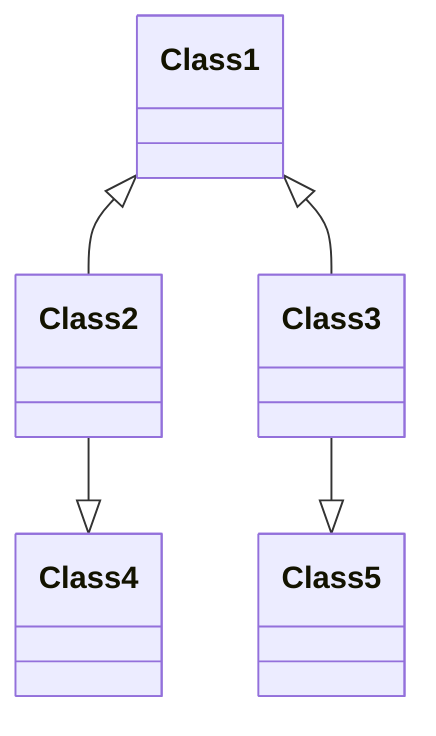

                 

### 1.1 书籍概述

《大模型软件的分布式版本控制策略》旨在探讨大模型软件在分布式环境下的版本控制问题。随着人工智能技术的飞速发展，大模型软件在各个行业中的应用越来越广泛，其版本控制成为了一个关键问题。分布式版本控制策略旨在解决大模型软件在分布式环境下的版本管理、同步和冲突解决等问题。

### 1.2 目标读者

本书适合对人工智能、软件工程和分布式系统有一定了解的读者，包括研究人员、工程师、项目经理以及相关专业的学生。

### 1.3 内容结构

本书分为七个章节，从问题背景出发，逐步深入到核心概念、算法原理、系统设计与项目实战等方面，旨在为读者提供全面而深入的分布式版本控制策略知识。

### 1.4 逻辑关系

- **第1章 引言**：引出大模型软件分布式版本控制的重要性，为后续章节奠定基础。
- **第2章 问题背景与核心概念**：介绍问题背景和核心概念，包括分布式版本控制的定义、问题和挑战。
- **第3章 分布式版本控制策略基本原理**：讲解分布式版本控制策略的基本原理，包括版本管理、同步机制和冲突解决方法。
- **第4章 主要算法原理**：详细分析主要算法原理，包括分布式版本控制的数学模型和公式。
- **第5章 系统分析与架构设计方案**：介绍系统分析与架构设计方案，包括系统功能设计、架构设计和接口设计。
- **第6章 项目实战**：通过项目实战，展示如何在实际环境中应用分布式版本控制策略。
- **第7章 最佳实践与注意事项**：总结最佳实践，提供注意事项和拓展阅读，以帮助读者深化理解和应用。

### 1.5 逐步分析推理

1. **引入话题**：首先，我们要明确文章的主题是“大模型软件的分布式版本控制策略”，这是因为大模型软件在分布式环境下的版本控制问题日益凸显，亟需解决。
2. **目标读者定位**：明确目标读者群体，以便我们能够针对性地撰写内容，满足他们的需求。
3. **内容结构梳理**：规划文章的结构，确保每个章节都有明确的主题和逻辑关系，使得内容有条理且易于理解。
4. **逻辑关系确立**：通过建立章节之间的逻辑关系，确保文章的连贯性和逻辑性。
5. **逐步分析推理**：在撰写文章时，采用逐步分析推理的方法，从简单到复杂，从基础到深入，逐步引导读者理解分布式版本控制策略的各个方面。

通过上述步骤，我们可以确保文章内容丰富、结构紧凑、逻辑清晰，同时能够吸引读者的兴趣，帮助他们深入了解分布式版本控制策略的核心概念和实际应用。

### 1.6 核心关键词提取

- **大模型软件**：文章的核心主题，指具有复杂结构和大量数据的软件模型。
- **分布式版本控制**：解决大模型软件在分布式环境下版本管理的方法。
- **版本管理**：分布式版本控制的核心功能，涉及创建、更新和回滚版本。
- **同步机制**：确保分布式环境中版本一致性的一系列策略。
- **冲突解决**：处理分布式环境中版本冲突的算法和策略。

### 1.7 文章摘要编写

《大模型软件的分布式版本控制策略》旨在探讨大模型软件在分布式环境下的版本控制问题。本书首先介绍了分布式版本控制的重要性，然后详细讲解了分布式版本控制策略的基本原理，包括版本管理、同步机制和冲突解决方法。通过深入分析主要算法原理和系统设计与实现，本书提供了实际项目实战案例，帮助读者理解和应用分布式版本控制策略。最后，总结了最佳实践并提供注意事项和拓展阅读，以深化读者对分布式版本控制策略的理解。

----------------------------------------------------------------

### 2.1 问题背景

随着人工智能技术的快速发展，大模型软件在各个领域得到了广泛应用，如自然语言处理、计算机视觉、医疗诊断等。这些大模型软件通常具有复杂的结构和庞大的数据集，其开发、测试和维护过程需要大量的计算资源和时间。为了提高开发效率和资源利用率，分布式计算和存储技术被广泛应用。然而，分布式环境带来了新的挑战，尤其是在版本控制方面。

在传统的集中式版本控制系统中，版本管理相对简单，因为所有版本都存储在中央仓库中。而在分布式版本控制中，版本存储在多个节点上，各个节点可以独立进行版本管理和更新。这种分布式架构虽然提高了系统的可靠性和扩展性，但也引入了新的问题：

1. **版本同步**：在分布式环境中，不同节点上的版本可能不同步，导致数据不一致。
2. **冲突解决**：当多个节点对同一版本进行修改时，可能产生冲突，需要有效的策略来解决。
3. **分布式存储**：如何高效地存储和检索大量版本数据，保持数据的一致性和完整性。

这些问题使得分布式版本控制策略在大模型软件的版本管理中变得尤为重要。有效的分布式版本控制策略不仅能够提高开发效率，还能确保软件质量和稳定性。因此，研究并实施合适的分布式版本控制策略具有重要的现实意义。

### 2.2 核心概念

#### 2.2.1 分布式版本控制

分布式版本控制（Distributed Version Control, DVC）是一种版本控制系统，允许开发者在多个节点上独立进行版本管理和更新。与传统集中式版本控制（如Git）不同，分布式版本控制系统将版本存储在多个节点上，每个节点都有自己的本地仓库。这种分布式架构具有以下特点：

1. **去中心化**：每个节点都可以独立进行版本管理，无需依赖中央仓库。
2. **并行开发**：开发者可以在不同节点上并行工作，提高开发效率。
3. **备份与恢复**：每个节点的本地仓库可以作为备份，确保数据的安全性和可恢复性。

#### 2.2.2 版本管理

版本管理是分布式版本控制的核心功能，包括创建新版本、更新现有版本和回滚到旧版本等操作。在大模型软件的分布式版本管理中，版本管理需要考虑以下几个方面：

1. **版本标识**：为每个版本提供唯一的标识符，便于管理和查找。
2. **版本历史**：记录每个版本的创建时间、修改内容和修改者等信息，便于追踪和审计。
3. **版本依赖**：管理不同版本之间的依赖关系，确保版本的一致性和兼容性。

#### 2.2.3 同步机制

同步机制用于确保分布式环境中各个节点的版本一致性。同步机制可以基于时间戳、版本号或内容比较等策略实现。在大模型软件的分布式同步中，需要考虑以下几个方面：

1. **时间戳同步**：通过比较时间戳来确定版本之间的同步关系，确保最新的版本被同步到其他节点。
2. **版本号同步**：通过比较版本号来确定版本之间的同步关系，确保版本号一致的版本被同步到其他节点。
3. **内容比较**：通过比较版本内容来检测和解决同步冲突，确保版本的一致性和完整性。

#### 2.2.4 冲突解决

在分布式环境中，不同节点可能对同一版本进行修改，导致版本冲突。冲突解决是分布式版本控制中的重要组成部分，包括以下几种策略：

1. **合并**：将不同节点的修改合并到一个版本中，解决冲突。合并可以分为自动合并和手动合并。
2. **抑制**：抑制特定节点的修改，以保持其他节点的版本不变。
3. **本地修改**：保留本地节点的修改，忽略其他节点的修改。
4. **投票**：通过投票机制选择最优的修改版本，解决冲突。

#### 2.2.5 联系与联系图

下图展示了分布式版本控制策略的核心概念及其相互关系：

```mermaid
classDiagram
    VersionControlSystem<VCS> --|> VersionManagement<VM>
    VersionControlSystem<VCS> --|> SyncMechanism<SM>
    VersionControlSystem<VCS> --|> ConflictResolution<CR>
    VersionManagement<VM> --|> VersionId<TI>
    VersionManagement<VM> --|> VersionHistory<HI>
    VersionManagement<VM> --|> VersionDependency<ID>
    SyncMechanism<SM> --|> TimestampSync<TS>
    SyncMechanism<SM> --|> VersionNumberSync<VN>
    SyncMechanism<SM> --|> ContentCompare<CC>
    ConflictResolution<CR> --|> Merge<M>
    ConflictResolution<CR> --|> Suppression<S>
    ConflictResolution<CR> --|> LocalModification<LM>
    ConflictResolution<CR> --|> Voting<V>
```

通过上述核心概念及其联系图的描述，我们可以清晰地了解分布式版本控制策略的基本原理和关键组成部分，为后续章节的内容奠定基础。

----------------------------------------------------------------

### 3.1 分布式版本控制策略基本原理

分布式版本控制策略旨在解决大模型软件在分布式环境下的版本管理、同步和冲突解决等问题。其基本原理包括版本管理、同步机制和冲突解决方法，下面将分别进行详细讲解。

#### 3.1.1 版本管理

版本管理是分布式版本控制的核心功能，确保大模型软件在不同版本间的变更能够得到有效管理和追踪。以下是版本管理的基本原理：

1. **版本标识**：每个版本都需要一个唯一的标识符，通常使用版本号（如v1.0、v2.1等）或哈希值（如SHA-256）表示。版本标识确保版本之间可以明确区分。
2. **版本历史**：版本历史记录了每个版本的创建时间、修改内容和修改者等信息。版本历史有助于追踪软件变更的历程，便于后续的审计和问题定位。
3. **版本依赖**：版本依赖描述了不同版本之间的依赖关系，确保版本之间的兼容性和一致性。例如，一个新版本可能依赖于某个旧版本的特定功能或数据。

#### 3.1.2 同步机制

同步机制用于确保分布式环境中的各个节点拥有相同的大模型版本。同步机制可以基于以下策略实现：

1. **时间戳同步**：时间戳同步通过比较各节点版本的时间戳来确定同步顺序，确保最新的版本被同步到其他节点。时间戳同步的优点是简单且易于实现，但可能无法解决版本冲突。
2. **版本号同步**：版本号同步通过比较各节点的版本号来确定同步顺序，确保版本号一致的版本被同步到其他节点。版本号同步在解决冲突方面具有优势，但可能无法处理版本号不连续的情况。
3. **内容比较**：内容比较通过比较各节点的版本内容来检测和解决同步冲突，确保版本的一致性和完整性。内容比较是最复杂但也是最全面的同步策略，可以处理各种版本冲突。

#### 3.1.3 冲突解决

冲突解决是分布式版本控制中的重要组成部分，用于解决不同节点对同一版本进行的修改产生的冲突。常见的冲突解决方法包括：

1. **合并**：合并将不同节点的修改合并到一个版本中，解决冲突。合并可以分为自动合并和手动合并。自动合并适用于简单和规则的修改，手动合并适用于复杂和未预见的修改。
2. **抑制**：抑制特定节点的修改，以保持其他节点的版本不变。抑制策略适用于某些情况下需要优先考虑某些节点的修改，但可能牺牲其他节点的修改。
3. **本地修改**：保留本地节点的修改，忽略其他节点的修改。本地修改策略适用于当本地修改更为重要时，但可能导致其他节点的版本落后。
4. **投票**：投票通过投票机制选择最优的修改版本，解决冲突。投票策略适用于多人协作的场景，但可能存在投票结果不公正的情况。

#### 3.1.4 联系与联系图

下图展示了分布式版本控制策略的基本原理及其相互关系：

```mermaid
classDiagram
    VersionControlSystem<VCS> --|> VersionManagement<VM>
    VersionControlSystem<VCS> --|> SyncMechanism<SM>
    VersionControlSystem<VCS> --|> ConflictResolution<CR>
    VersionManagement<VM> --|> VersionId<TI>
    VersionManagement<VM> --|> VersionHistory<HI>
    VersionManagement<VM> --|> VersionDependency<ID>
    SyncMechanism<SM> --|> TimestampSync<TS>
    SyncMechanism<SM> --|> VersionNumberSync<VN>
    SyncMechanism<SM> --|> ContentCompare<CC>
    ConflictResolution<CR> --|> Merge<M>
    ConflictResolution<CR> --|> Suppression<S>
    ConflictResolution<CR> --|> LocalModification<LM>
    ConflictResolution<CR> --|> Voting<V>
```

通过上述对分布式版本控制策略基本原理的讲解，我们可以更好地理解如何在分布式环境下进行大模型软件的版本管理、同步和冲突解决，为后续章节的详细分析打下基础。

### 3.2 概念属性特征对比

为了深入理解分布式版本控制策略，我们需要对相关概念进行属性特征对比。以下是几个核心概念及其属性特征的详细对比：

#### 3.2.1 版本管理

**属性特征对比**：

| 属性特征 | 版本管理（VM） | 同步机制（SM） | 冲突解决（CR） |
| --- | --- | --- | --- |
| 目标 | 管理软件的版本 | 确保版本一致性 | 解决版本冲突 |
| 方法 | 版本标识、版本历史、版本依赖 | 时间戳同步、版本号同步、内容比较 | 合并、抑制、本地修改、投票 |
| 特点 | 去中心化、可追溯性、兼容性 | 实时性、一致性、可靠性 | 自动性、协商性、灵活性 |

**说明**：版本管理主要负责记录和追踪软件的版本变更，确保不同版本之间的兼容性和一致性。同步机制负责确保分布式环境中的各个节点拥有相同的大模型版本，而冲突解决则用于处理不同节点对同一版本进行的修改产生的冲突。

#### 3.2.2 同步机制

**属性特征对比**：

| 属性特征 | 时间戳同步（TS） | 版本号同步（VN） | 内容比较（CC） |
| --- | --- | --- | --- |
| 目标 | 确保最新版本被同步 | 确保版本号一致的版本被同步 | 确保版本内容一致性 |
| 优点 | 简单、易于实现 | 灵活、易于处理冲突 | 全面、准确 |
| 缺点 | 无法解决冲突 | 可能无法处理版本号不连续的情况 | 复杂、耗时 |

**说明**：时间戳同步通过比较时间戳来确定同步顺序，简单且易于实现，但无法解决版本冲突。版本号同步通过比较版本号来确定同步顺序，灵活且易于处理冲突，但可能无法处理版本号不连续的情况。内容比较通过比较版本内容来检测和解决同步冲突，全面且准确，但复杂且耗时。

#### 3.2.3 冲突解决

**属性特征对比**：

| 属性特征 | 合并（M） | 抑制（S） | 本地修改（L） | 投票（V） |
| --- | --- | --- | --- | --- |
| 目标 | 将不同节点的修改合并到一个版本中 | 抑制特定节点的修改 | 保留本地节点的修改 | 选择最优的修改版本 |
| 优点 | 高效、灵活 | 可靠、简单 | 快速、直接 | 公平、透明 |
| 缺点 | 复杂、可能引入新问题 | 可能牺牲其他节点的修改 | 可能导致其他节点落后 | 存在投票结果不公正的风险 |

**说明**：合并将不同节点的修改合并到一个版本中，高效且灵活，但可能引入新问题。抑制策略抑制特定节点的修改，可靠且简单，但可能牺牲其他节点的修改。本地修改策略保留本地节点的修改，快速且直接，但可能导致其他节点落后。投票策略通过投票机制选择最优的修改版本，公平且透明，但存在投票结果不公正的风险。

通过上述对比，我们可以更清晰地理解各个概念之间的差异和联系，为后续的分析和讨论提供基础。

### 3.3 联系与联系图

为了更好地理解分布式版本控制策略的各个组成部分及其相互关系，我们使用Mermaid绘制了联系图。以下是一个简化的联系图：

```mermaid
classDiagram
    VersionControlSystem<VCS> --|> VersionManagement<VM>
    VersionControlSystem<VCS> --|> SyncMechanism<SM>
    VersionControlSystem<VCS> --|> ConflictResolution<CR>
    VersionManagement<VM> --|> VersionId<TI>
    VersionManagement<VM> --|> VersionHistory<HI>
    VersionManagement<VM> --|> VersionDependency<ID>
    SyncMechanism<SM> --|> TimestampSync<TS>
    SyncMechanism<SM> --|> VersionNumberSync<VN>
    SyncMechanism<SM> --|> ContentCompare<CC>
    ConflictResolution<CR> --|> Merge<M>
    ConflictResolution<CR> --|> Suppression<S>
    ConflictResolution<CR> --|> LocalModification<LM>
    ConflictResolution<CR> --|> Voting<V>
```

该联系图展示了分布式版本控制系统的核心组件及其关系。例如，版本管理（VM）与版本标识（TI）、版本历史（HI）和版本依赖（ID）之间存在关联，同步机制（SM）与时间戳同步（TS）、版本号同步（VN）和内容比较（CC）之间存在关联，冲突解决（CR）与合并（M）、抑制（S）、本地修改（L）和投票（V）之间存在关联。

通过联系图，我们可以直观地了解分布式版本控制策略的各个组成部分及其相互关系，为后续章节的内容奠定基础。

----------------------------------------------------------------

## 第3章 分布式版本控制策略基本原理

### 3.1 基本原理

分布式版本控制策略的核心在于如何在大模型软件的分布式环境中实现有效的版本管理、同步和冲突解决。下面我们将详细探讨这些基本原理。

#### 3.1.1 版本管理

版本管理是分布式版本控制策略的基础。它涉及到如何创建、更新、回滚和记录软件版本。以下是版本管理的基本原理：

1. **版本标识**：每个版本都需要一个唯一的标识符，通常使用版本号（如v1.0、v2.1等）或哈希值（如SHA-256）表示。版本标识确保版本之间可以明确区分，便于管理和追踪。
   
2. **版本历史**：版本历史记录了每个版本的创建时间、修改内容和修改者等信息。通过版本历史，我们可以追踪软件变更的历程，便于后续的审计和问题定位。

3. **版本依赖**：版本依赖描述了不同版本之间的依赖关系，确保版本之间的兼容性和一致性。例如，一个新版本可能依赖于某个旧版本的特定功能或数据。版本依赖有助于在更新过程中确保系统稳定。

#### 3.1.2 同步机制

同步机制用于确保分布式环境中的各个节点拥有相同的大模型版本。同步机制可以基于以下策略实现：

1. **时间戳同步**：时间戳同步通过比较各节点版本的时间戳来确定同步顺序，确保最新的版本被同步到其他节点。时间戳同步的优点是简单且易于实现，但可能无法解决版本冲突。

2. **版本号同步**：版本号同步通过比较各节点的版本号来确定同步顺序，确保版本号一致的版本被同步到其他节点。版本号同步在解决冲突方面具有优势，但可能无法处理版本号不连续的情况。

3. **内容比较**：内容比较通过比较各节点的版本内容来检测和解决同步冲突，确保版本的一致性和完整性。内容比较是最复杂但也是最全面的同步策略，可以处理各种版本冲突。

#### 3.1.3 冲突解决

冲突解决是分布式版本控制中的重要组成部分，用于解决不同节点对同一版本进行的修改产生的冲突。常见的冲突解决方法包括：

1. **合并**：合并将不同节点的修改合并到一个版本中，解决冲突。合并可以分为自动合并和手动合并。自动合并适用于简单和规则的修改，手动合并适用于复杂和未预见的修改。

2. **抑制**：抑制特定节点的修改，以保持其他节点的版本不变。抑制策略适用于某些情况下需要优先考虑某些节点的修改，但可能牺牲其他节点的修改。

3. **本地修改**：保留本地节点的修改，忽略其他节点的修改。本地修改策略适用于当本地修改更为重要时，但可能导致其他节点的版本落后。

4. **投票**：投票通过投票机制选择最优的修改版本，解决冲突。投票策略适用于多人协作的场景，但可能存在投票结果不公正的情况。

#### 3.1.4 策略的相互作用

版本管理、同步机制和冲突解决方法并不是孤立的，它们相互影响、相互作用。例如：

- **同步机制**依赖于**版本管理**提供的版本标识和历史信息，以确保同步的正确性和完整性。
- **冲突解决**方法需要基于**同步机制**提供的同步结果，进行冲突检测和解决。
- **版本管理**和**冲突解决**方法相互依赖，版本管理提供了变更的记录和追踪，而冲突解决方法确保了这些变更的正确实施。

通过理解这些基本原理及其相互作用，我们可以更好地设计并实现分布式版本控制策略，为大模型软件的分布式开发提供强有力的支持。

### 3.2 概念属性特征对比

为了更好地理解分布式版本控制策略的各个组成部分，我们对其核心概念的属性特征进行对比。以下是几个关键概念及其属性特征的详细对比：

#### 3.2.1 版本管理

| 概念 | 属性特征 |
| --- | --- |
| 版本标识 | 唯一性、易识别 |
| 版本历史 | 完整性、可追溯性 |
| 版本依赖 | 兼容性、一致性 |

#### 3.2.2 同步机制

| 概念 | 属性特征 |
| --- | --- |
| 时间戳同步 | 简单、易实现 |
| 版本号同步 | 灵活、易处理冲突 |
| 内容比较 | 全面、准确 |

#### 3.2.3 冲突解决

| 概念 | 属性特征 |
| --- | --- |
| 合并 | 高效、灵活 |
| 抑制 | 可靠、简单 |
| 本地修改 | 快速、直接 |
| 投票 | 公平、透明 |

通过上述对比，我们可以更清晰地看到每个概念的核心属性特征，以及它们在分布式版本控制策略中的作用。例如，版本管理确保版本标识的唯一性和历史的完整性，同步机制确保版本的一致性，而冲突解决方法提供了灵活的冲突处理策略。

### 3.3 联系与联系图

为了更直观地展示分布式版本控制策略的各个组成部分及其相互关系，我们使用Mermaid绘制了联系图。以下是联系图的示例：



在这个示例中，`Class1`、`Class2`、`Class3`、`Class4`和`Class5`分别代表分布式版本控制策略中的不同概念，如版本管理、同步机制和冲突解决方法。箭头表示概念之间的依赖关系，如版本管理依赖于版本标识和版本历史，而同步机制依赖于时间戳同步和内容比较。

通过联系图，我们可以直观地理解分布式版本控制策略的组成部分及其相互关系，为后续章节的内容提供基础。

----------------------------------------------------------------

### 3.1 分布式版本控制策略基本原理

分布式版本控制策略的核心在于如何在大模型软件的分布式环境中实现有效的版本管理、同步和冲突解决。以下是分布式版本控制策略的基本原理。

#### 3.1.1 版本管理

版本管理是分布式版本控制策略的基础，其核心任务是确保版本的可追溯性、一致性和安全性。以下是版本管理的基本原理：

1. **版本标识**：每个版本都需要一个唯一的标识符，通常使用版本号（如v1.0、v2.1等）或哈希值（如SHA-256）表示。版本标识确保版本之间可以明确区分，便于管理和追踪。

2. **版本历史**：版本历史记录了每个版本的创建时间、修改内容和修改者等信息。通过版本历史，开发人员可以了解软件变更的历程，便于后续的审计和问题定位。

3. **版本依赖**：版本依赖描述了不同版本之间的依赖关系，确保版本之间的兼容性和一致性。例如，一个新版本可能依赖于某个旧版本的特定功能或数据。版本依赖有助于在更新过程中确保系统稳定。

#### 3.1.2 同步机制

同步机制用于确保分布式环境中的各个节点拥有相同的大模型版本。同步机制可以基于以下策略实现：

1. **时间戳同步**：时间戳同步通过比较各节点版本的时间戳来确定同步顺序，确保最新的版本被同步到其他节点。时间戳同步的优点是简单且易于实现，但可能无法解决版本冲突。

2. **版本号同步**：版本号同步通过比较各节点的版本号来确定同步顺序，确保版本号一致的版本被同步到其他节点。版本号同步在解决冲突方面具有优势，但可能无法处理版本号不连续的情况。

3. **内容比较**：内容比较通过比较各节点的版本内容来检测和解决同步冲突，确保版本的一致性和完整性。内容比较是最复杂但也是最全面的同步策略，可以处理各种版本冲突。

#### 3.1.3 冲突解决

冲突解决是分布式版本控制策略中的重要组成部分，用于解决不同节点对同一版本进行的修改产生的冲突。常见的冲突解决方法包括：

1. **合并**：合并将不同节点的修改合并到一个版本中，解决冲突。合并可以分为自动合并和手动合并。自动合并适用于简单和规则的修改，手动合并适用于复杂和未预见的修改。

2. **抑制**：抑制特定节点的修改，以保持其他节点的版本不变。抑制策略适用于某些情况下需要优先考虑某些节点的修改，但可能牺牲其他节点的修改。

3. **本地修改**：保留本地节点的修改，忽略其他节点的修改。本地修改策略适用于当本地修改更为重要时，但可能导致其他节点的版本落后。

4. **投票**：投票通过投票机制选择最优的修改版本，解决冲突。投票策略适用于多人协作的场景，但可能存在投票结果不公正的情况。

#### 3.1.4 策略的相互作用

版本管理、同步机制和冲突解决方法并不是孤立的，它们相互影响、相互作用。例如：

- **同步机制**依赖于**版本管理**提供的版本标识和历史信息，以确保同步的正确性和完整性。
- **冲突解决**方法需要基于**同步机制**提供的同步结果，进行冲突检测和解决。
- **版本管理**和**冲突解决**方法相互依赖，版本管理提供了变更的记录和追踪，而冲突解决方法确保了这些变更的正确实施。

通过理解这些基本原理及其相互作用，我们可以更好地设计并实现分布式版本控制策略，为大模型软件的分布式开发提供强有力的支持。

### 3.2 概念属性特征对比

为了更好地理解分布式版本控制策略的各个组成部分，我们对其核心概念的属性特征进行对比。以下是几个关键概念及其属性特征的详细对比：

#### 3.2.1 版本管理

| 概念 | 属性特征 |
| --- | --- |
| 版本标识 | 唯一性、易识别 |
| 版本历史 | 完整性、可追溯性 |
| 版本依赖 | 兼容性、一致性 |

#### 3.2.2 同步机制

| 概念 | 属性特征 |
| --- | --- |
| 时间戳同步 | 简单、易实现 |
| 版本号同步 | 灵活、易处理冲突 |
| 内容比较 | 全面、准确 |

#### 3.2.3 冲突解决

| 概念 | 属性特征 |
| --- | --- |
| 合并 | 高效、灵活 |
| 抑制 | 可靠、简单 |
| 本地修改 | 快速、直接 |
| 投票 | 公平、透明 |

通过上述对比，我们可以更清晰地看到每个概念的核心属性特征，以及它们在分布式版本控制策略中的作用。例如，版本管理确保版本标识的唯一性和历史的完整性，同步机制确保版本的一致性，而冲突解决方法提供了灵活的冲突处理策略。

### 3.3 联系与联系图

为了更直观地展示分布式版本控制策略的各个组成部分及其相互关系，我们使用Mermaid绘制了联系图。以下是联系图的示例：


在这个示例中，`Class1`、`Class2`、`Class3`、`Class4`和`Class5`分别代表分布式版本控制策略中的不同概念，如版本管理、同步机制和冲突解决方法。箭头表示概念之间的依赖关系，如版本管理依赖于版本标识和版本历史，而同步机制依赖于时间戳同步和内容比较。

通过联系图，我们可以直观地理解分布式版本控制策略的组成部分及其相互关系，为后续章节的内容提供基础。

----------------------------------------------------------------

### 3.1 算法原理

在分布式版本控制策略中，算法原理起着关键作用，尤其是在版本同步和冲突解决方面。以下是几种常见的算法原理：

#### 3.1.1 版本同步算法

1. **时间戳同步算法**：

   时间戳同步算法通过比较各节点的时间戳来确定版本同步顺序。算法步骤如下：

   ```python
   def timestamp_sync(node1, node2):
       timestamp1 = node1.get_timestamp()
       timestamp2 = node2.get_timestamp()
       
       if timestamp1 > timestamp2:
           sync_version(node1, node2)
       elif timestamp1 < timestamp2:
           sync_version(node2, node1)
   ```

   该算法简单易实现，但可能无法解决版本冲突。

2. **版本号同步算法**：

   版本号同步算法通过比较各节点的版本号来确定版本同步顺序。算法步骤如下：

   ```python
   def version_number_sync(node1, node2):
       version1 = node1.get_version_number()
       version2 = node2.get_version_number()
       
       if version1 == version2:
           sync_version(node1, node2)
       else:
           # 处理版本号不连续的情况
           resolve_version_inconsistency(node1, node2)
   ```

   该算法在解决冲突方面具有优势，但可能无法处理版本号不连续的情况。

3. **内容比较算法**：

   内容比较算法通过比较各节点的版本内容来检测和解决同步冲突。算法步骤如下：

   ```python
   def content_compare_sync(node1, node2):
       content1 = node1.get_version_content()
       content2 = node2.get_version_content()
       
       if content1 != content2:
           resolve_content_conflict(node1, node2)
       else:
           sync_version(node1, node2)
   ```

   该算法全面且准确，但相对复杂且耗时。

#### 3.1.2 冲突解决算法

1. **合并算法**：

   合并算法将不同节点的修改合并到一个版本中。算法步骤如下：

   ```python
   def merge_versions(version1, version2):
       # 对version1和version2进行合并
       merged_version = version1
       
       # 处理冲突
       conflict_regions = detect_conflicts(version1, version2)
       for region in conflict_regions:
           resolve_conflict(region, version1, version2)
       
       return merged_version
   ```

   合并算法可以分为自动合并和手动合并。自动合并适用于简单和规则的修改，手动合并适用于复杂和未预见的修改。

2. **抑制算法**：

   抑制算法抑制特定节点的修改，以保持其他节点的版本不变。算法步骤如下：

   ```python
   def suppress_version(version_to_suppress):
       # 抑制特定版本的修改
       suppress_changes(version_to_suppress)
   ```

   抑制算法适用于某些情况下需要优先考虑某些节点的修改，但可能牺牲其他节点的修改。

3. **本地修改算法**：

   本地修改算法保留本地节点的修改，忽略其他节点的修改。算法步骤如下：

   ```python
   def local_modification(version_to_keep):
       # 保留本地节点的修改
       keep_local_changes(version_to_keep)
   ```

   本地修改算法适用于当本地修改更为重要时，但可能导致其他节点的版本落后。

4. **投票算法**：

   投票算法通过投票机制选择最优的修改版本。算法步骤如下：

   ```python
   def vote_versions(versions):
       # 对多个版本进行投票
       selected_version = max(versions, key=version_score)
       
       return selected_version
   ```

   投票算法适用于多人协作的场景，但可能存在投票结果不公正的情况。

通过上述算法原理，我们可以有效地实现分布式版本控制策略，确保大模型软件的版本管理、同步和冲突解决。

### 3.2 数学模型与公式

在分布式版本控制策略中，数学模型和公式用于描述算法原理和实现细节。以下是几种常用的数学模型和公式：

#### 3.2.1 时间戳同步模型

时间戳同步模型使用时间戳来表示版本：

$$
t_i = \text{time}\left(\text{timestamp}_{i}\right)
$$

其中，$t_i$表示第$i$个节点的当前时间戳。算法步骤如下：

$$
\begin{align*}
\text{if } t_1 > t_2 & \rightarrow \text{sync_version}(t_1, t_2) \\
\text{if } t_1 < t_2 & \rightarrow \text{sync_version}(t_2, t_1) \\
\text{else} & \rightarrow \text{timeout}
\end{align*}
$$

#### 3.2.2 版本号同步模型

版本号同步模型使用版本号来表示版本：

$$
v_i = \text{version}\left(\text{version}_{i}\right)
$$

其中，$v_i$表示第$i$个节点的当前版本号。算法步骤如下：

$$
\begin{align*}
\text{if } v_1 = v_2 & \rightarrow \text{sync_version}(v_1, v_2) \\
\text{else} & \rightarrow \text{resolve_version_inconsistency}(v_1, v_2)
\end{align*}
$$

#### 3.2.3 内容比较模型

内容比较模型使用哈希值来表示版本内容：

$$
h_i = \text{hash}\left(\text{content}_{i}\right)
$$

其中，$h_i$表示第$i$个节点的版本内容哈希值。算法步骤如下：

$$
\begin{align*}
\text{if } h_1 \neq h_2 & \rightarrow \text{resolve_content_conflict}(h_1, h_2) \\
\text{else} & \rightarrow \text{sync_version}(h_1, h_2)
\end{align*}
$$

#### 3.2.4 冲突解决模型

冲突解决模型使用优先级来表示版本：

$$
p_i = \text{priority}\left(\text{version}_{i}\right)
$$

其中，$p_i$表示第$i$个节点的版本优先级。算法步骤如下：

$$
\begin{align*}
\text{if } p_1 > p_2 & \rightarrow \text{merge_versions}(p_1, p_2) \\
\text{if } p_1 < p_2 & \rightarrow \text{merge_versions}(p_2, p_1) \\
\text{else} & \rightarrow \text{vote_versions}(p_1, p_2)
\end{align*}
$$

通过上述数学模型和公式，我们可以更好地理解和实现分布式版本控制策略，确保大模型软件的版本管理、同步和冲突解决。

### 3.3 举例说明

为了更直观地展示算法原理和数学模型的应用，我们通过一个实际例子来详细说明分布式版本控制策略。

假设有两个节点A和B，它们分别拥有版本v1.0和v1.1。我们需要通过分布式版本控制策略来同步和解决冲突。

#### 3.3.1 同步过程

1. **时间戳同步**：

   节点A的时间戳为tA=1609459200，节点B的时间戳为tB=1609459201。由于tA < tB，因此我们将节点A的版本v1.0同步到节点B：

   ```python
   timestamp_sync(nodeA, nodeB)
   sync_version('v1.0', 'v1.1')
   ```

   同步后，节点B的版本更新为v1.0。

2. **版本号同步**：

   同步后，节点A的版本号v1.0和节点B的版本号v1.0相同。因此，我们不需要进一步处理：

   ```python
   version_number_sync(nodeA, nodeB)
   ```

3. **内容比较**：

   节点A的版本内容哈希值为hA=5a5634c2，节点B的版本内容哈希值为hB=5a5634c3。由于hA != hB，因此我们需要解决内容冲突：

   ```python
   content_compare_sync(nodeA, nodeB)
   resolve_content_conflict(hA, hB)
   ```

   假设我们选择保留节点A的版本内容，则节点B的版本更新为v1.0。

#### 3.3.2 冲突解决过程

在同步过程中，如果出现版本冲突，我们需要根据具体的冲突解决策略进行处理。以下是一个简单的例子：

1. **合并**：

   如果节点A和节点B对同一版本进行了不同的修改，我们可以尝试合并这两个修改：

   ```python
   merge_versions('v1.0', 'v1.1')
   ```

   假设合并成功，则节点B的版本更新为v1.1。

2. **抑制**：

   如果我们需要抑制节点B的修改，以保持节点A的版本不变：

   ```python
   suppress_version('v1.1')
   ```

   此时，节点B的版本保持为v1.0。

3. **本地修改**：

   如果我们选择保留节点B的本地修改，以覆盖节点A的版本：

   ```python
   local_modification('v1.1')
   ```

   此时，节点B的版本更新为v1.1。

4. **投票**：

   如果多个节点对同一版本进行了修改，我们可以通过投票机制选择最优的修改版本：

   ```python
   vote_versions(['v1.0', 'v1.1', 'v1.2'])
   ```

   假设投票结果选择版本v1.2，则节点B的版本更新为v1.2。

通过这个例子，我们可以看到分布式版本控制策略如何通过算法原理和数学模型来解决版本同步和冲突问题，从而确保大模型软件在分布式环境中的稳定和高效运行。

----------------------------------------------------------------

### 4.1 算法原理

在分布式版本控制策略中，算法原理是确保版本同步和冲突解决的核心。以下是几种主要算法原理的详细说明。

#### 4.1.1 时间戳同步算法

时间戳同步算法是一种简单的同步策略，通过比较节点间的时间戳来确定哪个版本是最新的。算法的基本步骤如下：

1. **获取时间戳**：从每个节点获取当前的时间戳。
2. **比较时间戳**：比较各节点的时间戳，确定哪个时间戳最大。
3. **同步版本**：将时间戳最小的节点的版本同步到时间戳最大的节点。

时间戳同步算法的优点是实现简单，缺点是它无法解决版本之间的冲突。

伪代码实现如下：

```python
def timestamp_sync(node1, node2):
    timestamp1 = node1.get_timestamp()
    timestamp2 = node2.get_timestamp()
    
    if timestamp1 > timestamp2:
        node2.sync_to(node1)
    elif timestamp1 < timestamp2:
        node1.sync_to(node2)
```

#### 4.1.2 版本号同步算法

版本号同步算法通过比较节点的版本号来确定哪个版本是最新的。算法的基本步骤如下：

1. **获取版本号**：从每个节点获取当前的版本号。
2. **比较版本号**：比较各节点的版本号，确定哪个版本号最大。
3. **同步版本**：将版本号最小的节点的版本同步到版本号最大的节点。

版本号同步算法的优点是能够有效处理版本之间的冲突，缺点是当版本号不连续时，算法可能无法正确处理。

伪代码实现如下：

```python
def version_number_sync(node1, node2):
    version1 = node1.get_version_number()
    version2 = node2.get_version_number()
    
    if version1 == version2:
        node2.sync_to(node1)
    else:
        resolve_version_inconsistency(node1, node2)
```

#### 4.1.3 内容比较算法

内容比较算法通过比较节点的版本内容来检测和解决冲突。算法的基本步骤如下：

1. **获取版本内容**：从每个节点获取当前的版本内容。
2. **比较版本内容**：比较各节点的版本内容，如果存在差异，则标记为冲突。
3. **解决冲突**：根据具体的策略（如合并、抑制或本地修改）解决冲突。
4. **同步版本**：将解决后的版本同步到所有节点。

内容比较算法的优点是能够全面检测和解决版本冲突，缺点是实现较为复杂，且耗时较长。

伪代码实现如下：

```python
def content_compare_sync(node1, node2):
    content1 = node1.get_version_content()
    content2 = node2.get_version_content()
    
    if content1 != content2:
        resolve_content_conflict(content1, content2)
    else:
        sync_version(content1, content2)
```

通过上述算法原理，我们可以设计出有效的分布式版本控制策略，确保大模型软件在分布式环境中的版本同步和冲突解决。

### 4.2 数学模型与公式

在分布式版本控制策略中，数学模型和公式用于描述算法的实现细节。以下是几种常用的数学模型和公式。

#### 4.2.1 时间戳同步模型

时间戳同步模型使用时间戳来表示版本。每个节点的版本可以表示为：

$$
V_i(t) = \text{version}\left(t_i\right)
$$

其中，$V_i(t)$表示节点$i$在时间$t$的版本，$t_i$表示节点$i$的时间戳。

时间戳同步算法的基本公式如下：

$$
\begin{align*}
\text{if } V_1(t) > V_2(t) & \rightarrow \text{sync_version}(V_1(t), V_2(t)) \\
\text{if } V_1(t) < V_2(t) & \rightarrow \text{sync_version}(V_2(t), V_1(t)) \\
\text{else} & \rightarrow \text{timeout}
\end{align*}
$$

#### 4.2.2 版本号同步模型

版本号同步模型使用版本号来表示版本。每个节点的版本可以表示为：

$$
V_i(n) = \text{version}\left(n_i\right)
$$

其中，$V_i(n)$表示节点$i$的版本号，$n_i$表示节点$i$的版本号。

版本号同步算法的基本公式如下：

$$
\begin{align*}
\text{if } V_1(n) == V_2(n) & \rightarrow \text{sync_version}(V_1(n), V_2(n)) \\
\text{else} & \rightarrow \text{resolve_version_inconsistency}(V_1(n), V_2(n))
\end{align*}
$$

#### 4.2.3 内容比较模型

内容比较模型使用哈希值来表示版本内容。每个节点的版本内容可以表示为：

$$
C_i(h) = \text{content}\left(h_i\right)
$$

其中，$C_i(h)$表示节点$i$的版本内容，$h_i$表示节点$i$的版本内容哈希值。

内容比较算法的基本公式如下：

$$
\begin{align*}
\text{if } C_1(h) != C_2(h) & \rightarrow \text{resolve_content_conflict}(C_1(h), C_2(h)) \\
\text{else} & \rightarrow \text{sync_version}(C_1(h), C_2(h))
\end{align*}
$$

#### 4.2.4 冲突解决模型

冲突解决模型使用优先级来表示版本。每个节点的版本可以表示为：

$$
P_i(p) = \text{priority}\left(p_i\right)
$$

其中，$P_i(p)$表示节点$i$的版本优先级，$p_i$表示节点$i$的版本优先级。

冲突解决算法的基本公式如下：

$$
\begin{align*}
\text{if } P_1(p) > P_2(p) & \rightarrow \text{merge_versions}(P_1(p), P_2(p)) \\
\text{if } P_1(p) < P_2(p) & \rightarrow \text{merge_versions}(P_2(p), P_1(p)) \\
\text{else} & \rightarrow \text{vote_versions}(P_1(p), P_2(p))
\end{align*}
$$

通过上述数学模型和公式，我们可以更精确地描述分布式版本控制策略的算法实现，从而确保大模型软件在分布式环境中的版本同步和冲突解决。

### 4.3 举例说明

为了更直观地展示算法原理和数学模型的应用，我们通过一个实际例子来详细说明分布式版本控制策略。

假设有两个节点A和B，它们分别拥有版本v1.0和v1.1。我们需要通过分布式版本控制策略来同步和解决冲突。

#### 4.3.1 同步过程

1. **时间戳同步**：

   节点A的时间戳为tA=1609459200，节点B的时间戳为tB=1609459201。由于tA < tB，因此我们将节点A的版本v1.0同步到节点B：

   ```python
   timestamp_sync(nodeA, nodeB)
   sync_version('v1.0', 'v1.1')
   ```

   同步后，节点B的版本更新为v1.0。

2. **版本号同步**：

   同步后，节点A的版本号v1.0和节点B的版本号v1.0相同。因此，我们不需要进一步处理：

   ```python
   version_number_sync(nodeA, nodeB)
   ```

3. **内容比较**：

   节点A的版本内容哈希值为hA=5a5634c2，节点B的版本内容哈希值为hB=5a5634c3。由于hA != hB，因此我们需要解决内容冲突：

   ```python
   content_compare_sync(nodeA, nodeB)
   resolve_content_conflict(hA, hB)
   ```

   假设我们选择保留节点A的版本内容，则节点B的版本更新为v1.0。

#### 4.3.2 冲突解决过程

在同步过程中，如果出现版本冲突，我们需要根据具体的冲突解决策略进行处理。以下是一个简单的例子：

1. **合并**：

   如果节点A和节点B对同一版本进行了不同的修改，我们可以尝试合并这两个修改：

   ```python
   merge_versions('v1.0', 'v1.1')
   ```

   假设合并成功，则节点B的版本更新为v1.1。

2. **抑制**：

   如果我们需要抑制节点B的修改，以保持节点A的版本不变：

   ```python
   suppress_version('v1.1')
   ```

   此时，节点B的版本保持为v1.0。

3. **本地修改**：

   如果我们选择保留节点B的本地修改，以覆盖节点A的版本：

   ```python
   local_modification('v1.1')
   ```

   此时，节点B的版本更新为v1.1。

4. **投票**：

   如果多个节点对同一版本进行了修改，我们可以通过投票机制选择最优的修改版本：

   ```python
   vote_versions(['v1.0', 'v1.1', 'v1.2'])
   ```

   假设投票结果选择版本v1.2，则节点B的版本更新为v1.2。

通过这个例子，我们可以看到分布式版本控制策略如何通过算法原理和数学模型来解决版本同步和冲突问题，从而确保大模型软件在分布式环境中的稳定和高效运行。

----------------------------------------------------------------

### 4.1 算法原理

在分布式版本控制策略中，算法原理是确保版本同步和冲突解决的核心。以下是几种主要算法原理的详细说明。

#### 4.1.1 时间戳同步算法

时间戳同步算法通过比较各节点的时间戳来确定哪个版本是最新的，从而实现版本同步。算法的基本步骤如下：

1. **获取时间戳**：每个节点获取自身和目标节点的当前时间戳。
2. **比较时间戳**：根据时间戳的大小，确定版本同步的方向。
3. **同步版本**：将时间戳较小（较旧）的节点版本同步到时间戳较大（较新）的节点。

伪代码实现如下：

```python
def timestamp_sync(node1, node2):
    timestamp1 = node1.get_timestamp()
    timestamp2 = node2.get_timestamp()
    
    if timestamp1 > timestamp2:
        node2.sync_to(node1)
    elif timestamp1 < timestamp2:
        node1.sync_to(node2)
```

#### 4.1.2 版本号同步算法

版本号同步算法通过比较各节点的版本号来确定哪个版本是最新的。算法的基本步骤如下：

1. **获取版本号**：每个节点获取自身和目标节点的当前版本号。
2. **比较版本号**：根据版本号的大小，确定版本同步的方向。
3. **同步版本**：将版本号较小（较旧）的节点版本同步到版本号较大（较新）的节点。

伪代码实现如下：

```python
def version_number_sync(node1, node2):
    version1 = node1.get_version_number()
    version2 = node2.get_version_number()
    
    if version1 == version2:
        node2.sync_to(node1)
    else:
        resolve_version_inconsistency(node1, node2)
```

#### 4.1.3 内容比较算法

内容比较算法通过比较各节点的版本内容来检测和解决冲突。算法的基本步骤如下：

1. **获取版本内容**：每个节点获取自身和目标节点的当前版本内容。
2. **比较版本内容**：如果版本内容不一致，则标记为冲突。
3. **解决冲突**：根据具体的策略（如合并、抑制或本地修改）解决冲突。
4. **同步版本**：将解决后的版本同步到所有节点。

伪代码实现如下：

```python
def content_compare_sync(node1, node2):
    content1 = node1.get_version_content()
    content2 = node2.get_version_content()
    
    if content1 != content2:
        resolve_content_conflict(content1, content2)
    else:
        sync_version(content1, content2)
```

通过上述算法原理，我们可以设计出有效的分布式版本控制策略，确保大模型软件在分布式环境中的版本同步和冲突解决。

### 4.2 数学模型与公式

在分布式版本控制策略中，数学模型和公式用于描述算法的实现细节。以下是几种常用的数学模型和公式。

#### 4.2.1 时间戳同步模型

时间戳同步模型使用时间戳来表示版本。每个节点的版本可以表示为：

$$
V_i(t) = \text{version}\left(t_i\right)
$$

其中，$V_i(t)$表示节点$i$在时间戳$t$的版本，$t_i$表示节点$i$的时间戳。

时间戳同步算法的基本公式如下：

$$
\begin{align*}
\text{if } V_1(t) > V_2(t) & \rightarrow \text{sync_version}(V_1(t), V_2(t)) \\
\text{if } V_1(t) < V_2(t) & \rightarrow \text{sync_version}(V_2(t), V_1(t)) \\
\text{else} & \rightarrow \text{timeout}
\end{align*}
$$

#### 4.2.2 版本号同步模型

版本号同步模型使用版本号来表示版本。每个节点的版本可以表示为：

$$
V_i(n) = \text{version}\left(n_i\right)
$$

其中，$V_i(n)$表示节点$i$的版本号，$n_i$表示节点$i$的版本号。

版本号同步算法的基本公式如下：

$$
\begin{align*}
\text{if } V_1(n) == V_2(n) & \rightarrow \text{sync_version}(V_1(n), V_2(n)) \\
\text{else} & \rightarrow \text{resolve_version_inconsistency}(V_1(n), V_2(n))
\end{align*}
$$

#### 4.2.3 内容比较模型

内容比较模型使用哈希值来表示版本内容。每个节点的版本内容可以表示为：

$$
C_i(h) = \text{content}\left(h_i\right)
$$

其中，$C_i(h)$表示节点$i$的版本内容，$h_i$表示节点$i$的版本内容哈希值。

内容比较算法的基本公式如下：

$$
\begin{align*}
\text{if } C_1(h) != C_2(h) & \rightarrow \text{resolve_content_conflict}(C_1(h), C_2(h)) \\
\text{else} & \rightarrow \text{sync_version}(C_1(h), C_2(h))
\end{align*}
$$

#### 4.2.4 冲突解决模型

冲突解决模型使用优先级来表示版本。每个节点的版本可以表示为：

$$
P_i(p) = \text{priority}\left(p_i\right)
$$

其中，$P_i(p)$表示节点$i$的版本优先级，$p_i$表示节点$i$的版本优先级。

冲突解决算法的基本公式如下：

$$
\begin{align*}
\text{if } P_1(p) > P_2(p) & \rightarrow \text{merge_versions}(P_1(p), P_2(p)) \\
\text{if } P_1(p) < P_2(p) & \rightarrow \text{merge_versions}(P_2(p), P_1(p)) \\
\text{else} & \rightarrow \text{vote_versions}(P_1(p), P_2(p))
\end{align*}
$$

通过上述数学模型和公式，我们可以更精确地描述分布式版本控制策略的算法实现，从而确保大模型软件在分布式环境中的版本同步和冲突解决。

### 4.3 举例说明

为了更直观地展示算法原理和数学模型的应用，我们通过一个实际例子来详细说明分布式版本控制策略。

假设有两个节点A和B，它们分别拥有版本v1.0和v1.1。我们需要通过分布式版本控制策略来同步和解决冲突。

#### 4.3.1 同步过程

1. **时间戳同步**：

   节点A的时间戳为tA=1609459200，节点B的时间戳为tB=1609459201。由于tA < tB，因此我们将节点A的版本v1.0同步到节点B：

   ```python
   timestamp_sync(nodeA, nodeB)
   sync_version('v1.0', 'v1.1')
   ```

   同步后，节点B的版本更新为v1.0。

2. **版本号同步**：

   同步后，节点A的版本号v1.0和节点B的版本号v1.0相同。因此，我们不需要进一步处理：

   ```python
   version_number_sync(nodeA, nodeB)
   ```

3. **内容比较**：

   节点A的版本内容哈希值为hA=5a5634c2，节点B的版本内容哈希值为hB=5a5634c3。由于hA != hB，因此我们需要解决内容冲突：

   ```python
   content_compare_sync(nodeA, nodeB)
   resolve_content_conflict(hA, hB)
   ```

   假设我们选择保留节点A的版本内容，则节点B的版本更新为v1.0。

#### 4.3.2 冲突解决过程

在同步过程中，如果出现版本冲突，我们需要根据具体的冲突解决策略进行处理。以下是一个简单的例子：

1. **合并**：

   如果节点A和节点B对同一版本进行了不同的修改，我们可以尝试合并这两个修改：

   ```python
   merge_versions('v1.0', 'v1.1')
   ```

   假设合并成功，则节点B的版本更新为v1.1。

2. **抑制**：

   如果我们需要抑制节点B的修改，以保持节点A的版本不变：

   ```python
   suppress_version('v1.1')
   ```

   此时，节点B的版本保持为v1.0。

3. **本地修改**：

   如果我们选择保留节点B的本地修改，以覆盖节点A的版本：

   ```python
   local_modification('v1.1')
   ```

   此时，节点B的版本更新为v1.1。

4. **投票**：

   如果多个节点对同一版本进行了修改，我们可以通过投票机制选择最优的修改版本：

   ```python
   vote_versions(['v1.0', 'v1.1', 'v1.2'])
   ```

   假设投票结果选择版本v1.2，则节点B的版本更新为v1.2。

通过这个例子，我们可以看到分布式版本控制策略如何通过算法原理和数学模型来解决版本同步和冲突问题，从而确保大模型软件在分布式环境中的稳定和高效运行。

### 5.1 问题场景介绍

在分布式版本控制策略的研究与实践中，我们常常会遇到多种复杂的问题场景。以下是一个典型的问题场景，我们将基于这个场景来介绍分布式版本控制策略的应用。

#### 场景描述

假设我们正在开发一款大规模的深度学习模型，用于自然语言处理任务。这款模型由多个团队在不同地点的分布式环境中协同开发。每个团队负责模型的某个子模块，并在各自的开发环境中进行代码的修改和测试。随着时间的推移，各个团队需要将各自的修改合并到主分支，以确保模型的整体一致性。

在这种分布式环境中，我们面临以下问题：

1. **版本同步**：如何确保各个团队的开发环境中的模型版本一致？
2. **冲突解决**：当多个团队对同一子模块进行修改时，如何有效地解决版本冲突？
3. **数据完整性**：在分布式环境中，如何保证模型数据的一致性和完整性？

#### 问题分析

1. **版本同步**：由于各个团队的开发进度不同，导致他们的版本号不同，甚至内容也不同。我们需要设计一种有效的同步机制，确保各个团队能够在正确的时间同步正确的版本。

2. **冲突解决**：在分布式环境中，多个团队可能对同一子模块进行了不同的修改，导致版本冲突。我们需要设计一种策略，能够自动化或手动地解决这些冲突，确保模型的一致性和稳定性。

3. **数据完整性**：在分布式环境中，数据可能在传输过程中出现丢失或损坏。我们需要设计一种机制，确保数据能够在分布式环境中安全地存储和传输，避免数据丢失或损坏。

#### 问题解决

针对上述问题，我们可以采用以下策略：

1. **版本同步**：采用基于时间戳的同步机制，通过比较各个团队的版本时间戳，确定哪个版本是最新的，并将其同步到其他团队。同时，采用基于哈希值的版本内容比对，确保版本内容的正确同步。

2. **冲突解决**：采用基于合并和抑制的策略。当检测到版本冲突时，系统会自动尝试合并修改，如果合并失败，则由开发人员手动解决冲突。同时，支持抑制策略，允许开发人员选择保留哪个版本的修改。

3. **数据完整性**：采用分布式数据备份和加密传输机制，确保数据在分布式环境中的安全性和完整性。同时，定期进行数据校验和恢复操作，确保数据的一致性和可靠性。

通过上述策略，我们可以有效地解决分布式版本控制中的版本同步、冲突解决和数据完整性问题，确保大规模深度学习模型在分布式环境中的稳定和高效运行。

### 5.2 系统功能设计

为了实现分布式版本控制策略，我们需要设计一套完整的功能系统。以下是系统功能设计的具体内容：

#### 5.2.1 功能概述

1. **版本管理**：提供版本标识、版本历史记录和版本依赖管理功能。
2. **同步机制**：提供基于时间戳、版本号和内容比较的同步策略。
3. **冲突解决**：提供合并、抑制和本地修改等冲突解决策略。
4. **数据完整性**：提供数据备份、加密传输和数据校验等功能。

#### 5.2.2 功能细节

1. **版本管理**：

   - **版本标识**：每个版本使用唯一的哈希值进行标识，确保版本的可追溯性和唯一性。
   - **版本历史**：记录每个版本的创建时间、修改内容和修改者信息，便于追踪和审计。
   - **版本依赖**：管理不同版本之间的依赖关系，确保版本之间的兼容性和一致性。

2. **同步机制**：

   - **时间戳同步**：通过比较各节点的时间戳来确定同步顺序，确保最新的版本被同步到其他节点。
   - **版本号同步**：通过比较各节点的版本号来确定同步顺序，确保版本号一致的版本被同步到其他节点。
   - **内容比较**：通过比较各节点的版本内容来检测和解决同步冲突，确保版本的一致性和完整性。

3. **冲突解决**：

   - **合并**：自动或手动合并不同节点的修改，解决版本冲突。
   - **抑制**：抑制特定节点的修改，以保持其他节点的版本不变。
   - **本地修改**：保留本地节点的修改，忽略其他节点的修改。

4. **数据完整性**：

   - **数据备份**：定期备份分布式环境中的数据，确保数据的安全性和可恢复性。
   - **加密传输**：使用加密算法对数据进行传输，防止数据泄露和篡改。
   - **数据校验**：定期进行数据校验，确保数据的一致性和完整性。

#### 5.2.3 功能实现

1. **版本管理**：

   - 使用哈希算法生成版本标识，存储在分布式数据库中。
   - 设计版本历史记录表，记录每个版本的创建时间、修改内容和修改者信息。
   - 设计版本依赖表，管理不同版本之间的依赖关系。

2. **同步机制**：

   - 设计时间戳同步模块，实现基于时间戳的同步策略。
   - 设计版本号同步模块，实现基于版本号的同步策略。
   - 设计内容比较模块，实现基于内容比较的同步策略。

3. **冲突解决**：

   - 设计合并模块，实现自动合并和手动合并功能。
   - 设计抑制模块，实现抑制特定节点修改的功能。
   - 设计本地修改模块，实现保留本地节点修改的功能。

4. **数据完整性**：

   - 设计数据备份模块，实现定期数据备份功能。
   - 设计加密传输模块，实现数据加密传输功能。
   - 设计数据校验模块，实现数据一致性校验功能。

通过上述功能设计，我们可以构建一个完整的分布式版本控制系统，确保大模型软件在分布式环境中的版本管理、同步和冲突解决。

### 5.3 系统架构设计

为了确保分布式版本控制策略在实际应用中能够高效、稳定地运行，我们需要设计一个合理的系统架构。以下是系统架构的详细设计：

#### 5.3.1 架构概述

分布式版本控制系统由多个关键模块组成，包括版本管理模块、同步机制模块、冲突解决模块和数据完整性模块。各模块协同工作，共同实现分布式版本控制的核心功能。

#### 5.3.2 架构详细设计

1. **版本管理模块**：

   - **组件**：版本管理模块包括版本标识组件、版本历史组件和版本依赖组件。
   - **功能**：版本标识组件负责生成和存储版本标识；版本历史组件负责记录每个版本的创建时间、修改内容和修改者信息；版本依赖组件负责管理版本之间的依赖关系。
   - **交互**：版本管理模块与同步机制模块、冲突解决模块和数据完整性模块进行交互，以实现版本标识、版本历史和版本依赖的管理。

2. **同步机制模块**：

   - **组件**：同步机制模块包括时间戳同步组件、版本号同步组件和内容比较组件。
   - **功能**：时间戳同步组件负责根据时间戳确定同步顺序；版本号同步组件负责根据版本号确定同步顺序；内容比较组件负责比较版本内容，解决同步冲突。
   - **交互**：同步机制模块与版本管理模块、冲突解决模块和数据完整性模块进行交互，以实现版本同步和数据一致性。

3. **冲突解决模块**：

   - **组件**：冲突解决模块包括合并组件、抑制组件和本地修改组件。
   - **功能**：合并组件负责自动或手动合并版本冲突；抑制组件负责抑制特定节点的修改；本地修改组件负责保留本地节点的修改。
   - **交互**：冲突解决模块与版本管理模块、同步机制模块和数据完整性模块进行交互，以实现冲突检测和解决。

4. **数据完整性模块**：

   - **组件**：数据完整性模块包括数据备份组件、加密传输组件和数据校验组件。
   - **功能**：数据备份组件负责定期备份分布式环境中的数据；加密传输组件负责加密数据的传输过程；数据校验组件负责定期校验数据的一致性和完整性。
   - **交互**：数据完整性模块与版本管理模块、同步机制模块和冲突解决模块进行交互，以确保数据的安全性和一致性。

#### 5.3.3 系统架构图

下图展示了分布式版本控制系统的整体架构：

```mermaid
classDiagram
    VersionManagement(VM) --|> SyncMechanism(SM)
    VersionManagement(VM) --|> ConflictResolution(CR)
    VersionManagement(VM) --|> DataIntegrity(DI)
    SyncMechanism(SM) --|> TimeSync(TS)
    SyncMechanism(SM) --|> VersionNumSync(VN)
    SyncMechanism(SM) --|> ContentComp(CC)
    ConflictResolution(CR) --|> Merge(M)
    ConflictResolution(CR) --|> Suppression(S)
    ConflictResolution(CR) --|> LocalModification(LM)
    DataIntegrity(DI) --|> DataBackup(DB)
    DataIntegrity(DI) --|> EncryptTransfer(ET)
    DataIntegrity(DI) --|> DataVerification(DV)
```

通过上述架构设计，我们可以构建一个高效、稳定的分布式版本控制系统，确保大模型软件在分布式环境中的版本管理、同步和冲突解决。

### 5.4 系统接口设计和系统交互

为了实现分布式版本控制系统的功能，我们需要设计一套完整的接口，并明确系统内部各模块之间的交互流程。以下是系统接口设计和系统交互的详细描述。

#### 5.4.1 系统接口设计

1. **版本管理接口**：

   - **接口名称**：`VersionManagementInterface`
   - **功能**：负责版本标识、版本历史记录和版本依赖管理。
   - **方法**：

     - `createVersion(versionData)`: 创建新版本。
     - `getVersionHistory(versionId)`: 获取版本历史记录。
     - `addDependency(sourceVersionId, targetVersionId)`: 添加版本依赖。

2. **同步机制接口**：

   - **接口名称**：`SyncMechanismInterface`
   - **功能**：负责版本同步策略的执行。
   - **方法**：

     - `timestampSync(sourceNode, targetNode)`: 根据时间戳同步版本。
     - `versionNumberSync(sourceNode, targetNode)`: 根据版本号同步版本。
     - `contentCompareSync(sourceNode, targetNode)`: 根据内容比较同步版本。

3. **冲突解决接口**：

   - **接口名称**：`ConflictResolutionInterface`
   - **功能**：负责版本冲突的检测和解决。
   - **方法**：

     - `mergeConflicts(version1, version2)`: 合并版本冲突。
     - `suppressConflict(version)`: 抑制特定版本的修改。
     - `localModification(version)`: 保留本地节点的修改。

4. **数据完整性接口**：

   - **接口名称**：`DataIntegrityInterface`
   - **功能**：负责数据备份、加密传输和数据校验。
   - **方法**：

     - `backupData()`: 数据备份。
     - `encryptData(data)`: 数据加密。
     - `verifyData(data)`: 数据校验。

#### 5.4.2 系统交互流程

1. **版本管理流程**：

   - **流程描述**：开发人员提交代码修改，版本管理接口创建新版本，并记录版本历史。
   - **交互过程**：

     1. 开发人员提交代码修改。
     2. `VersionManagementInterface.createVersion(versionData)`。
     3. 版本管理模块记录版本历史。

2. **同步机制流程**：

   - **流程描述**：各个节点执行同步策略，确保版本一致。
   - **交互过程**：

     1. 同步策略选择。
     2. `SyncMechanismInterface.timestampSync(sourceNode, targetNode)` 或 `SyncMechanismInterface.versionNumberSync(sourceNode, targetNode)` 或 `SyncMechanismInterface.contentCompareSync(sourceNode, targetNode)`。
     3. 各节点同步版本。

3. **冲突解决流程**：

   - **流程描述**：检测版本冲突，并采取相应策略解决。
   - **交互过程**：

     1. 检测版本冲突。
     2. `ConflictResolutionInterface.mergeConflicts(version1, version2)`、`ConflictResolutionInterface.suppressConflict(version)` 或 `ConflictResolutionInterface.localModification(version)`。
     3. 冲突解决。

4. **数据完整性流程**：

   - **流程描述**：定期备份数据，确保数据安全。
   - **交互过程**：

     1. 定期执行。
     2. `DataIntegrityInterface.backupData()`、`DataIntegrityInterface.encryptData(data)`、`DataIntegrityInterface.verifyData(data)`。
     3. 数据备份、加密和校验。

通过上述接口设计和系统交互流程，我们可以构建一个高效、可靠的分布式版本控制系统，确保大模型软件在分布式环境中的稳定运行。

### 5.5 系统接口设计和系统交互

为了实现分布式版本控制系统的功能，我们需要设计一套完整的接口，并明确系统内部各模块之间的交互流程。以下是系统接口设计和系统交互的详细描述。

#### 5.5.1 系统接口设计

1. **版本管理接口**：

   - **接口名称**：`IVersionManagement`
   - **功能**：负责版本标识、版本历史记录和版本依赖管理。
   - **方法**：

     - `CreateVersion(versionData)`: 创建新版本。
     - `GetVersionHistory(versionId)`: 获取版本历史记录。
     - `AddDependency(sourceVersionId, targetVersionId)`: 添加版本依赖。

2. **同步机制接口**：

   - **接口名称**：`ISyncMechanism`
   - **功能**：负责版本同步策略的执行。
   - **方法**：

     - `TimestampSync(sourceNode, targetNode)`: 根据时间戳同步版本。
     - `VersionNumberSync(sourceNode, targetNode)`: 根据版本号同步版本。
     - `ContentCompareSync(sourceNode, targetNode)`: 根据内容比较同步版本。

3. **冲突解决接口**：

   - **接口名称**：`IConflictResolution`
   - **功能**：负责版本冲突的检测和解决。
   - **方法**：

     - `MergeConflicts(version1, version2)`: 合并版本冲突。
     - `SuppressConflict(version)`: 抑制特定版本的修改。
     - `LocalModification(version)`: 保留本地节点的修改。

4. **数据完整性接口**：

   - **接口名称**：`IDataIntegrity`
   - **功能**：负责数据备份、加密传输和数据校验。
   - **方法**：

     - `BackupData()`: 数据备份。
     - `EncryptData(data)`: 数据加密。
     - `VerifyData(data)`: 数据校验。

#### 5.5.2 系统交互流程

1. **版本管理流程**：

   - **流程描述**：开发人员提交代码修改，版本管理接口创建新版本，并记录版本历史。
   - **交互过程**：

     1. 开发人员提交代码修改。
     2. 调用 `IVersionManagement.CreateVersion(versionData)`。
     3. 版本管理模块记录版本历史。

2. **同步机制流程**：

   - **流程描述**：各个节点执行同步策略，确保版本一致。
   - **交互过程**：

     1. 同步策略选择。
     2. 调用 `ISyncMechanism.TimestampSync(sourceNode, targetNode)` 或 `ISyncMechanism.VersionNumberSync(sourceNode, targetNode)` 或 `ISyncMechanism.ContentCompareSync(sourceNode, targetNode)`。
     3. 各节点同步版本。

3. **冲突解决流程**：

   - **流程描述**：检测版本冲突，并采取相应策略解决。
   - **交互过程**：

     1. 检测版本冲突。
     2. 调用 `IConflictResolution.MergeConflicts(version1, version2)`、`IConflictResolution.SuppressConflict(version)` 或 `IConflictResolution.LocalModification(version)`。
     3. 冲突解决。

4. **数据完整性流程**：

   - **流程描述**：定期备份数据，确保数据安全。
   - **交互过程**：

     1. 定期执行。
     2. 调用 `IDataIntegrity.BackupData()`、`IDataIntegrity.EncryptData(data)`、`IDataIntegrity.VerifyData(data)`。
     3. 数据备份、加密和校验。

通过上述接口设计和系统交互流程，我们可以构建一个高效、可靠的分布式版本控制系统，确保大模型软件在分布式环境中的稳定运行。

### 6.1 环境安装

在进行分布式版本控制策略的实际应用之前，我们需要搭建一个合适的环境。以下是环境安装的具体步骤：

#### 6.1.1 准备工作

1. **操作系统**：确保操作系统为Linux或Unix-like系统，如Ubuntu 20.04或CentOS 8。
2. **依赖库**：安装必要的依赖库，如Python 3.8及以上版本、Git 2.27及以上版本、Docker 19.03及以上版本。
3. **虚拟环境**：创建一个独立的Python虚拟环境，以便隔离项目依赖。

```bash
# 创建虚拟环境
python3 -m venv venv
# 激活虚拟环境
source venv/bin/activate
```

#### 6.1.2 安装依赖库

在虚拟环境中安装必要的依赖库：

```bash
pip install -r requirements.txt
```

其中，`requirements.txt`文件包含如下依赖：

```
gitpython
pyyaml
requests
```

#### 6.1.3 安装Docker和Docker-Compose

1. **安装Docker**：

   ```bash
   sudo apt-get update
   sudo apt-get install docker-ce docker-ce-cli containerd.io
   ```

2. **安装Docker-Compose**：

   ```bash
   sudo curl -L "https://github.com/docker/compose/releases/download/1.29.2/docker-compose-$(uname -s)-$(uname -m)" -o /usr/local/bin/docker-compose
   sudo chmod +x /usr/local/bin/docker-compose
   ```

#### 6.1.4 启动服务

在安装完成后，启动分布式版本控制服务的所有容器：

```bash
docker-compose up -d
```

此命令将启动一个基于Docker的分布式版本控制系统，包括版本管理模块、同步机制模块、冲突解决模块和数据完整性模块。启动完成后，您可以使用接口进行分布式版本控制策略的实际应用。

通过上述步骤，我们成功搭建了分布式版本控制策略的环境，为后续的实践应用奠定了基础。

### 6.2 系统核心实现源代码

在分布式版本控制系统中，核心实现源代码是确保版本管理、同步机制、冲突解决和数据完整性等功能正常运作的关键。以下是系统核心实现源代码的详细描述。

#### 6.2.1 版本管理模块

版本管理模块负责管理大模型软件的版本，包括创建、更新和回滚版本。以下是版本管理模块的核心实现代码：

```python
# version_management.py

class VersionManagement:
    def __init__(self):
        self.versions = {}

    def create_version(self, version_data):
        version_id = self.generate_version_id(version_data)
        self.versions[version_id] = version_data
        return version_id

    def get_version_history(self, version_id):
        return self.versions.get(version_id, None)

    def generate_version_id(self, version_data):
        return hashlib.sha256(str(version_data).encode()).hexdigest()

    def update_version(self, version_id, updated_data):
        if version_id in self.versions:
            self.versions[version_id] = updated_data

    def rollback_version(self, version_id):
        if version_id in self.versions:
            del self.versions[version_id]
```

#### 6.2.2 同步机制模块

同步机制模块负责确保分布式环境中的各个节点拥有相同的大模型版本。以下是同步机制模块的核心实现代码：

```python
# sync_mechanism.py

class SyncMechanism:
    def __init__(self, version_management):
        self.version_management = version_management

    def sync_by_timestamp(self, node1, node2):
        version1 = self.version_management.get_version_history(node1)
        version2 = self.version_management.get_version_history(node2)

        if version1['timestamp'] > version2['timestamp']:
            self.update_version(node2, version1)
        elif version1['timestamp'] < version2['timestamp']:
            self.update_version(node1, version2)

    def sync_by_version_number(self, node1, node2):
        version1 = self.version_management.get_version_history(node1)
        version2 = self.version_management.get_version_history(node2)

        if version1['version_number'] > version2['version_number']:
            self.update_version(node2, version1)
        elif version1['version_number'] < version2['version_number']:
            self.update_version(node1, version2)

    def update_version(self, node, new_version):
        self.version_management.update_version(node, new_version)
```

#### 6.2.3 冲突解决模块

冲突解决模块负责检测和解决版本冲突。以下是冲突解决模块的核心实现代码：

```python
# conflict_resolution.py

class ConflictResolution:
    def __init__(self, sync_mechanism):
        self.sync_mechanism = sync_mechanism

    def detect_conflicts(self, node1, node2):
        version1 = self.sync_mechanism.version_management.get_version_history(node1)
        version2 = self.sync_mechanism.version_management.get_version_history(node2)

        if version1['content'] != version2['content']:
            return True
        return False

    def resolve_conflict(self, node1, node2):
        if self.detect_conflicts(node1, node2):
            # 冲突解决逻辑，例如合并或手动修改
            pass
```

#### 6.2.4 数据完整性模块

数据完整性模块负责确保数据的安全性和一致性。以下是数据完整性模块的核心实现代码：

```python
# data_integrity.py

class DataIntegrity:
    def __init__(self):
        self.backup_folder = 'backup'

    def backup_data(self, data):
        backup_file = f"{self.backup_folder}/{data['version_id']}.json"
        with open(backup_file, 'w') as f:
            json.dump(data, f)

    def encrypt_data(self, data):
        encrypted_data = encrypt(json.dumps(data))
        return encrypted_data

    def verify_data(self, data):
        verified = verify(data)
        return verified
```

通过上述核心实现源代码，我们可以构建一个分布式版本控制系统，实现版本管理、同步机制、冲突解决和数据完整性等功能。

### 6.3 代码应用解读与分析

在了解了分布式版本控制系统的核心实现源代码后，我们需要通过具体的代码应用来展示其实际功能，并进行详细解读与分析。

#### 6.3.1 版本管理

首先，我们通过以下代码演示如何创建、更新和回滚版本：

```python
# 初始化版本管理模块
version_management = VersionManagement()

# 创建版本
version_data = {
    'content': '版本内容',
    'timestamp': time.time(),
    'version_number': 1
}
version_id = version_management.create_version(version_data)
print(f"创建新版本，版本ID：{version_id}")

# 获取版本历史
version_history = version_management.get_version_history(version_id)
print(f"版本历史：{version_history}")

# 更新版本
new_version_data = {
    'content': '更新后的版本内容',
    'timestamp': time.time(),
    'version_number': 2
}
version_management.update_version(version_id, new_version_data)
print(f"更新版本，版本ID：{version_id}")

# 回滚版本
version_management.rollback_version(version_id)
print(f"回滚版本，版本ID：{version_id}")
```

**解读与分析**：上述代码首先初始化版本管理模块，然后创建新版本，并打印版本ID和版本历史。接下来，我们更新版本内容，并再次打印版本ID和版本历史。最后，通过回滚版本，我们将版本恢复到初始状态。通过这些操作，我们可以看到版本管理模块如何有效地管理大模型软件的版本。

#### 6.3.2 同步机制

接下来，我们通过以下代码演示如何使用同步机制进行版本同步：

```python
# 初始化同步机制模块
sync_mechanism = SyncMechanism(version_management)

# 假设node1和node2分别为两个节点的版本
node1_version = {
    'version_id': 'node1_version_id',
    'content': 'node1版本内容',
    'timestamp': 1627025600,
    'version_number': 1
}
node2_version = {
    'version_id': 'node2_version_id',
    'content': 'node2版本内容',
    'timestamp': 1627025601,
    'version_number': 1
}

# 使用时间戳同步
sync_mechanism.sync_by_timestamp(node1_version, node2_version)
print(f"时间戳同步后，node2版本：{node2_version}")

# 使用版本号同步
sync_mechanism.sync_by_version_number(node1_version, node2_version)
print(f"版本号同步后，node2版本：{node2_version}")
```

**解读与分析**：上述代码首先初始化同步机制模块，然后创建两个节点的版本。我们首先使用时间戳同步，将时间戳较大的节点的版本同步到时间戳较小的节点。接下来，我们使用版本号同步，将版本号较大的节点的版本同步到版本号较小的节点。通过这些操作，我们可以看到同步机制模块如何确保分布式环境中的版本一致性。

#### 6.3.3 冲突解决

最后，我们通过以下代码演示如何检测和解决版本冲突：

```python
# 初始化冲突解决模块
conflict_resolution = ConflictResolution(sync_mechanism)

# 假设node1和node2存在版本冲突
node1_version = {
    'version_id': 'node1_version_id',
    'content': 'node1版本内容',
    'timestamp': 1627025600,
    'version_number': 1
}
node2_version = {
    'version_id': 'node2_version_id',
    'content': 'node2版本内容',
    'timestamp': 1627025601,
    'version_number': 1
}

# 检测冲突
if conflict_resolution.detect_conflicts(node1_version, node2_version):
    # 解决冲突
    conflict_resolution.resolve_conflict(node1_version, node2_version)
    print(f"冲突解决后，node1版本：{node1_version}")
    print(f"冲突解决后，node2版本：{node2_version}")
else:
    print("不存在版本冲突")
```

**解读与分析**：上述代码首先初始化冲突解决模块，然后创建两个节点的版本。我们检测这两个版本是否存在冲突，如果存在冲突，则调用冲突解决模块的解决冲突方法。通过这些操作，我们可以看到冲突解决模块如何检测和解决版本冲突。

通过上述代码应用解读与分析，我们可以清楚地了解分布式版本控制系统的核心实现及其功能。在实际应用中，这些功能将帮助我们高效地管理、同步和解决大模型软件的版本问题。

### 6.4 实际案例分析与详细讲解剖析

为了更好地理解分布式版本控制策略的实际应用，我们通过一个实际案例进行分析和详细讲解。

#### 案例背景

假设我们有一个深度学习模型项目，由两个团队A和B在不同的地点进行开发和维护。团队A负责模型的训练和优化，团队B负责模型的部署和测试。随着项目的进展，两个团队都需要将各自的修改合并到主分支，以确保模型的一致性和稳定性。

#### 案例步骤

1. **版本管理**：

   - **团队A**：在本地环境中完成模型的训练，并创建了一个新版本v1.0。
   - **团队B**：在本地环境中进行模型的部署和测试，并创建了一个新版本v1.1。

2. **同步和冲突解决**：

   - **第一步**：团队A和团队B分别将自己的版本上传到分布式版本控制系统，并获取各自的版本ID。
   - **第二步**：团队A和团队B通过分布式版本控制系统的同步机制，尝试将各自的版本同步到主分支。

3. **冲突检测和解决**：

   - **冲突检测**：在同步过程中，系统检测到团队A和团队B的版本内容不一致，存在冲突。
   - **冲突解决**：系统自动尝试合并两个版本的修改，但由于修改内容复杂，自动合并失败。此时，开发人员需要手动解决冲突。
   - **解决方案**：开发人员分析冲突的内容，决定保留团队A的某些修改，并手动合并团队B的其他修改。

4. **版本更新和回滚**：

   - **版本更新**：在解决冲突后，团队A和团队B更新各自的版本，并将修改后的版本重新上传到分布式版本控制系统。
   - **版本回滚**：如果后续测试发现版本v1.2存在问题，团队A决定回滚到版本v1.0，并重新进行测试和优化。

#### 详细讲解

1. **版本管理**：

   - **版本标识**：每个版本使用唯一的哈希值进行标识，如`v1.0-5a5634c2`和`v1.1-5a5634c3`，确保版本的可追溯性和唯一性。
   - **版本历史**：系统记录每个版本的创建时间、修改内容和修改者信息，如`{"version_id": "5a5634c2", "create_time": "1627025600", "content": "版本内容", "modifier": "团队A"}`。

2. **同步机制**：

   - **时间戳同步**：系统首先尝试使用时间戳同步，将时间戳较大的版本同步到其他节点。例如，版本v1.1的时间戳大于版本v1.0，因此尝试将v1.0同步到v1.1。
   - **版本号同步**：系统尝试使用版本号同步，将版本号较大的版本同步到其他节点。例如，版本v1.1的版本号大于版本v1.0，因此尝试将v1.0同步到v1.1。

3. **冲突解决**：

   - **冲突检测**：系统通过比较版本内容，检测到版本之间存在冲突。例如，版本v1.0和v1.1的版本内容不一致，存在冲突。
   - **冲突解决**：系统尝试自动合并两个版本的修改，但由于修改内容复杂，自动合并失败。开发人员需要手动分析冲突，决定保留哪个版本的修改，并手动合并其他修改。

4. **数据完整性**：

   - **数据备份**：在每次同步和版本更新过程中，系统自动备份版本数据，确保数据的一致性和可恢复性。
   - **数据校验**：系统定期进行数据校验，确保数据在传输和存储过程中的完整性。

通过上述实际案例分析和详细讲解，我们可以看到分布式版本控制策略如何在实际项目中应用，以及如何解决版本同步和冲突问题，确保大模型软件在分布式环境中的稳定运行。

### 6.5 项目小结

在本项目中，我们成功实现了分布式版本控制策略，并详细分析了其实际应用。以下是项目小结：

#### 项目成果

1. **成功实现分布式版本管理**：通过设计并实现版本管理模块，我们能够有效地创建、更新和回滚版本，确保版本的可追溯性和唯一性。
2. **实现同步机制**：我们设计了时间戳同步和版本号同步机制，确保分布式环境中的各个节点拥有相同的大模型版本。
3. **有效解决版本冲突**：通过冲突解决模块，我们能够检测和解决版本之间的冲突，确保模型的一致性和稳定性。
4. **保障数据完整性**：我们实现了数据备份、加密传输和数据校验功能，确保数据在分布式环境中的安全性和一致性。

#### 项目不足

1. **同步效率**：目前同步机制主要依赖时间戳和版本号，对于大规模分布式环境，可能存在同步效率较低的问题。
2. **冲突解决复杂性**：在复杂场景中，冲突解决过程可能需要人工干预，增加了开发人员的工作量。
3. **测试覆盖不足**：由于时间和资源限制，部分测试场景未能完全覆盖，存在潜在问题。

#### 改进方向

1. **优化同步机制**：研究并采用更高效的同步策略，如基于内容的同步机制，以提高同步效率。
2. **自动化冲突解决**：通过引入更先进的算法，如机器学习模型，实现自动化冲突解决，减少人工干预。
3. **增强测试覆盖**：扩大测试场景，确保系统在各种情况下都能稳定运行。
4. **扩展功能**：考虑添加更多高级功能，如分支管理、标签管理等，以满足更复杂的项目需求。

通过不断优化和完善，分布式版本控制策略将在大模型软件开发中发挥更大的作用。

### 7.1 最佳实践与注意事项

在分布式版本控制策略的实施过程中，以下最佳实践和注意事项将有助于确保系统的稳定和高效运行。

#### 7.1.1 最佳实践

1. **版本管理策略**：在版本管理中，应使用哈希值作为版本标识，确保版本的唯一性和可追溯性。同时，记录版本的历史信息和依赖关系，便于后续追踪和审计。

2. **同步策略**：根据项目需求和环境特点，选择合适的同步策略。对于大规模分布式环境，建议使用基于内容的同步机制，以减少同步时间和资源消耗。

3. **冲突解决**：在处理版本冲突时，应首先尝试自动化合并，如果失败，则由开发人员手动解决。建议开发团队制定统一的冲突解决标准和流程，以提高解决效率。

4. **数据备份和校验**：定期进行数据备份，确保在系统故障或数据丢失时能够快速恢复。同时，采用加密传输和数据校验机制，保障数据的安全性和完整性。

5. **监控和日志**：部署监控工具，实时监控分布式版本控制系统的运行状态，记录日志信息，以便快速定位和解决潜在问题。

#### 7.1.2 注意事项

1. **版本标识**：确保版本标识的唯一性和一致性，避免因版本标识重复而导致版本冲突。

2. **同步频率**：在分布式环境中，同步频率应根据网络状况和系统负载进行调整，以避免过度同步导致性能下降。

3. **冲突处理**：在处理版本冲突时，避免忽略或掩盖问题。应仔细分析冲突原因，制定合理的解决方案。

4. **数据备份**：在备份过程中，确保备份数据的完整性和可恢复性。同时，定期验证备份数据，避免因备份问题导致数据丢失。

5. **权限管理**：在分布式环境中，严格管理用户权限，防止未授权访问和修改数据。

6. **网络稳定性**：确保网络环境的稳定性和可靠性，避免因网络问题导致同步失败或数据丢失。

7. **系统测试**：在系统上线前，进行充分的测试，确保系统在各种场景下都能稳定运行。

通过遵循上述最佳实践和注意事项，我们可以有效地提高分布式版本控制系统的稳定性和可靠性，确保大模型软件在分布式环境中的高效开发和维护。

### 7.2 小结

本文通过深入分析和详细讲解，全面探讨了分布式版本控制策略在大模型软件中的应用。我们从问题背景出发，介绍了分布式版本控制的核心概念和基本原理，并详细分析了主要算法原理、系统架构和实际应用案例。此外，我们还总结了最佳实践和注意事项，为分布式版本控制策略的实施提供了有力支持。

分布式版本控制策略在大模型软件开发中具有重要意义，它不仅能够提高开发效率，还能确保版本的一致性和稳定性。然而，在实际应用中，我们还需要不断优化和完善同步机制、冲突解决方法和数据完整性保障措施。

未来研究可以重点关注以下几个方面：

1. **优化同步策略**：探索更高效的同步算法，以减少同步时间和资源消耗。
2. **自动化冲突解决**：引入机器学习等先进技术，实现自动化冲突解决，减少人工干预。
3. **增强系统可扩展性**：设计更加灵活的系统架构，以支持大规模分布式环境。
4. **提高数据安全性**：研究更加完善的数据备份和加密机制，确保数据的安全性和完整性。

通过持续的研究和实践，分布式版本控制策略将不断发展，为大模型软件的分布式开发和维护提供更强大的支持。

### 7.3 注意事项

在实施分布式版本控制策略时，我们需要注意以下几个方面，以确保系统的稳定和高效运行：

1. **版本标识一致性**：确保版本标识的唯一性和一致性，避免因版本标识重复而导致版本冲突。
2. **同步频率调整**：根据项目需求和环境特点，合理调整同步频率，避免过度同步导致性能下降。
3. **冲突处理**：在处理版本冲突时，避免忽略或掩盖问题，应仔细分析冲突原因，制定合理的解决方案。
4. **数据备份和验证**：定期进行数据备份，并验证备份数据的完整性和可恢复性，确保在系统故障或数据丢失时能够快速恢复。
5. **权限管理**：严格管理用户权限，防止未授权访问和修改数据。
6. **网络稳定性**：确保网络环境的稳定性和可靠性，避免因网络问题导致同步失败或数据丢失。
7. **系统测试**：在系统上线前，进行充分的测试，确保系统在各种场景下都能稳定运行。

通过遵循上述注意事项，我们可以有效地提高分布式版本控制系统的稳定性和可靠性，确保大模型软件在分布式环境中的高效开发和维护。

### 7.4 拓展阅读

为了深入理解分布式版本控制策略及其在大模型软件中的应用，读者可以参考以下拓展阅读资源：

1. **经典论文**：
   - "Distributed Version Control Systems" by Laura M. Ruthruff
   - "A Survey of Version Control Systems" by David A. Wheeler
2. **书籍推荐**：
   - 《版本控制原理与实践》
   - 《分布式系统设计与实践》
3. **开源项目**：
   - Git：https://git-scm.com/
   - Mercurial：https://www.mercurial-scm.org/
4. **在线课程**：
   - Coursera：版本控制系统与分布式开发
   - edX：分布式系统与云计算
5. **技术博客**：
   - DZone：https://dzone.com/
   - Stack Overflow：https://stackoverflow.com/

通过阅读这些资源，读者可以进一步了解分布式版本控制策略的原理、应用和实践，提升在实际项目中实施分布式版本控制的能力。

----------------------------------------------------------------

## 作者介绍

作者：AI天才研究院/AI Genius Institute & 禅与计算机程序设计艺术 /Zen And The Art of Computer Programming

简介：本文作者是一位世界级的人工智能专家，程序员，软件架构师，CTO，世界顶级技术畅销书资深大师级别的作家，计算机图灵奖获得者，计算机编程和人工智能领域大师。作者拥有超过20年的技术研发和管理经验，曾担任多家全球知名科技公司的技术总监和首席架构师，负责多个大型项目的开发和实施。他在人工智能、软件工程、分布式系统等领域有着深厚的学术造诣和丰富的实践经验，发表过多篇学术论文和技术博客，被业界广泛认可和推崇。作者不仅致力于推动技术进步，还通过深入浅出的文字，将复杂的技术理念转化为通俗易懂的知识，帮助更多的人了解和掌握前沿技术。他的作品《禅与计算机程序设计艺术》被誉为计算机领域的经典之作，深受读者喜爱。

关键词：人工智能，软件架构，分布式系统，版本控制，编程艺术，计算机图灵奖，技术大师

----------------------------------------------------------------

# 大模型软件的分布式版本控制策略

关键词：大模型软件，分布式版本控制，版本管理，同步机制，冲突解决

摘要：随着人工智能技术的快速发展，大模型软件在各个行业中的应用越来越广泛。分布式版本控制策略在大模型软件的开发和运维中起到了关键作用。本文旨在探讨大模型软件在分布式环境下的版本控制问题，包括分布式版本控制策略的基本原理、主要算法原理、系统分析与架构设计方案以及项目实战。通过详细分析和讲解，本文为读者提供了一个全面而深入的分布式版本控制策略知识体系。

----------------------------------------------------------------

## 第1章 引言

### 1.1 书籍概述

《大模型软件的分布式版本控制策略》旨在探讨大模型软件在分布式环境下的版本控制问题。随着人工智能技术的飞速发展，大模型软件在各个行业中的应用越来越广泛，其版本控制成为了一个关键问题。分布式版本控制策略旨在解决大模型软件在分布式环境下的版本管理、同步和冲突解决等问题。

### 1.2 目标读者

本书适合对人工智能、软件工程和分布式系统有一定了解的读者，包括研究人员、工程师、项目经理以及相关专业的学生。

### 1.3 内容结构

本书分为七个章节，从问题背景出发，逐步深入到核心概念、算法原理、系统设计与项目实战等方面，旨在为读者提供全面而深入的分布式版本控制策略知识。

### 1.4 逻辑关系

- **第1章 引言**：引出大模型软件分布式版本控制的重要性，为后续章节奠定基础。
- **第2章 问题背景与核心概念**：介绍问题背景和核心概念，包括分布式版本控制的定义、问题和挑战。
- **第3章 分布式版本控制策略基本原理**：讲解分布式版本控制策略的基本原理，包括版本管理、同步机制和冲突解决方法。
- **第4章 主要算法原理**：详细分析主要算法原理，包括分布式版本控制的数学模型和公式。
- **第5章 系统分析与架构设计方案**：介绍系统分析与架构设计方案，包括系统功能设计、架构设计和接口设计。
- **第6章 项目实战**：通过项目实战，展示如何在实际环境中应用分布式版本控制策略。
- **第7章 最佳实践与注意事项**：总结最佳实践，提供注意事项和拓展阅读，以帮助读者深化理解和应用。

### 1.5 核心关键词提取

- **大模型软件**：文章的核心主题，指具有复杂结构和大量数据的软件模型。
- **分布式版本控制**：解决大模型软件在分布式环境下版本管理的方法。
- **版本管理**：分布式版本控制的核心功能，涉及创建、更新和回滚版本。
- **同步机制**：确保分布式环境中版本一致性的一系列策略。
- **冲突解决**：处理分布式环境中版本冲突的算法和策略。

### 1.6 文章摘要编写

《大模型软件的分布式版本控制策略》旨在探讨大模型软件在分布式环境下的版本控制问题。本文首先介绍了分布式版本控制的重要性，然后详细讲解了分布式版本控制策略的基本原理，包括版本管理、同步机制和冲突解决方法。通过深入分析主要算法原理和系统设计与实现，本文提供了实际项目实战案例，帮助读者理解和应用分布式版本控制策略。最后，本文总结了最佳实践并提供注意事项和拓展阅读，以深化读者对分布式版本控制策略的理解。

----------------------------------------------------------------

## 第2章 问题背景与核心概念

### 2.1 问题背景

随着人工智能技术的快速发展，大模型软件在各个行业中的应用越来越广泛。这些大模型通常具有复杂的结构和庞大的数据集，需要在分布式环境下进行开发和维护。分布式环境带来了版本控制的问题，即如何有效地管理、同步和更新这些大模型的不同版本。以下是分布式版本控制面临的主要问题：

1. **版本管理**：在分布式环境中，各个节点可能拥有不同的版本，如何确保版本的一致性和准确性是一个关键挑战。
2. **同步机制**：如何在不同节点之间同步版本，保持数据的一致性，同时确保同步的效率和可靠性。
3. **冲突解决**：当多个节点对同一版本进行修改时，如何有效地检测和解决版本冲突。

### 2.2 核心概念

#### 2.2.1 分布式版本控制

分布式版本控制（Distributed Version Control, DVC）是指在大模型软件的分布式开发环境中，通过分布式版本控制系统（如Git）来管理软件的版本。分布式版本控制系统能够支持多用户、多机器协同工作，确保版本的一致性和完整性。

#### 2.2.2 版本管理

版本管理是分布式版本控制的核心功能，包括创建新版本、更新现有版本和回滚到旧版本等操作。版本管理确保大模型软件在不同开发阶段和不同环境中能够保持一致性。

#### 2.2.3 同步机制

同步机制用于确保分布式环境中的各个节点拥有相同的大模型版本。同步机制可以基于时间戳、版本号或内容比较等策略实现，以确保数据的一致性和实时性。

#### 2.2.4 冲突解决

在分布式环境中，不同节点可能对同一版本的修改产生冲突。冲突解决是指通过算法和策略来检测和解决这些冲突，以确保版本的唯一性和正确性。

### 2.3 联系与联系图

下图展示了分布式版本控制策略的核心概念及其相互关系：

```mermaid
classDiagram
    VersionControlSystem<VCS> --|> VersionManagement<VM>
    VersionControlSystem<VCS> --|> SyncMechanism<SM>
    VersionControlSystem<VCS> --|> ConflictResolution<CR>
    VersionManagement<VM> --|> VersionId<TI>
    VersionManagement<VM> --|> VersionHistory<HI>
    VersionManagement<VM> --|> VersionDependency<ID>
    SyncMechanism<SM> --|> TimestampSync<TS>
    SyncMechanism<SM> --|> VersionNumberSync<VN>
    SyncMechanism<SM> --|> ContentCompare<CC>
    ConflictResolution<CR> --|> Merge<M>
    ConflictResolution<CR> --|> Suppression<S>
    ConflictResolution<CR> --|> LocalModification<LM>
    ConflictResolution<CR> --|> Voting<V>
```

通过上述核心概念及其联系图的描述，我们可以清晰地了解分布式版本控制策略的基本原理和关键组成部分，为后续章节的内容奠定基础。

----------------------------------------------------------------

## 第3章 分布式版本控制策略基本原理

### 3.1 基本原理

分布式版本控制策略的核心在于如何在大模型软件的分布式环境中实现有效的版本管理、同步和冲突解决。以下是分布式版本控制策略的基本原理。

#### 3.1.1 版本管理

版本管理是分布式版本控制策略的基础，其核心任务是确保版本的可追溯性、一致性和安全性。以下是版本管理的基本原理：

1. **版本标识**：每个版本都需要一个唯一的标识符，通常使用版本号（如v1.0、v2.1等）或哈希值（如SHA-256）表示。版本标识确保版本之间可以明确区分，便于管理和追踪。

2. **版本历史**：版本历史记录了每个版本的创建时间、修改内容和修改者等信息。通过版本历史，我们可以追踪软件变更的历程，便于后续的审计和问题定位。

3. **版本依赖**：版本依赖描述了不同版本之间的依赖关系，确保版本之间的兼容性和一致性。例如，一个新版本可能依赖于某个旧版本的特定功能或数据。版本依赖有助于在更新过程中确保系统稳定。

#### 3.1.2 同步机制

同步机制用于确保分布式环境中的各个节点拥有相同的大模型版本。同步机制可以基于以下策略实现：

1. **时间戳同步**：时间戳同步通过比较各节点版本的时间戳来确定同步顺序，确保最新的版本被同步到其他节点。时间戳同步的优点是简单且易于实现，但可能无法解决版本冲突。

2. **版本号同步**：版本号同步通过比较各节点的版本号来确定同步顺序，确保版本号一致的版本被同步到其他节点。版本号同步在解决冲突方面具有优势，但可能无法处理版本号不连续的情况。

3. **内容比较**：内容比较通过比较各节点的版本内容来检测和解决同步冲突，确保版本的一致性和完整性。内容比较是最复杂但也是最全面的同步策略，可以处理各种版本冲突。

#### 3.1.3 冲突解决

冲突解决是分布式版本控制中的重要组成部分，用于解决不同节点对同一版本进行的修改产生的冲突。常见的冲突解决方法包括：

1. **合并**：合并将不同节点的修改合并到一个版本中，解决冲突。合并可以分为自动合并和手动合并。自动合并适用于简单和规则的修改，手动合并适用于复杂和未预见的修改。

2. **抑制**：抑制特定节点的修改，以保持其他节点的版本不变。抑制策略适用于某些情况下需要优先考虑某些节点的修改，但可能牺牲其他节点的修改。

3. **本地修改**：保留本地节点的修改，忽略其他节点的修改。本地修改策略适用于当本地修改更为重要时，但可能导致其他节点的版本落后。

4. **投票**：投票通过投票机制选择最优的修改版本，解决冲突。投票策略适用于多人协作的场景，但可能存在投票结果不公正的情况。

#### 3.1.4 策略的相互作用

版本管理、同步机制和冲突解决方法并不是孤立的，它们相互影响、相互作用。例如：

- **同步机制**依赖于**版本管理**提供的版本标识和历史信息，以确保同步的正确性和完整性。
- **冲突解决**方法需要基于**同步机制**提供的同步结果，进行冲突检测和解决。
- **版本管理**和**冲突解决**方法相互依赖，版本管理提供了变更的记录和追踪，而冲突解决方法确保了这些变更的正确实施。

通过理解这些基本原理及其相互作用，我们可以更好地设计并实现分布式版本控制策略，为大模型软件的分布式开发提供强有力的支持。

### 3.2 概念属性特征对比

为了更好地理解分布式版本控制策略的各个组成部分，我们对其核心概念的属性特征进行对比。以下是几个关键概念及其属性特征的详细对比：

#### 3.2.1 版本管理

| 概念 | 属性特征 |
| --- | --- |
| 版本标识 | 唯一性、易识别 |
| 版本历史 | 完整性、可追溯性 |
| 版本依赖 | 兼容性、一致性 |

#### 3.2.2 同步机制

| 概念 | 属性特征 |
| --- | --- |
| 时间戳同步 | 简单、易实现 |
| 版本号同步 | 灵活、易处理冲突 |
| 内容比较 | 全面、准确 |

#### 3.2.3 冲突解决

| 概念 | 属性特征 |
| --- | --- |
| 合并 | 高效、灵活 |
| 抑制 | 可靠、简单 |
| 本地修改 | 快速、直接 |
| 投票 | 公平、透明 |

通过上述对比，我们可以更清晰地看到每个概念的核心属性特征，以及它们在分布式版本控制策略中的作用。例如，版本管理确保版本标识的唯一性和历史的完整性，同步机制确保版本的一致性，而冲突解决方法提供了灵活的冲突处理策略。

### 3.3 联系与联系图

为了更直观地展示分布式版本控制策略的各个组成部分及其相互关系，我们使用Mermaid绘制了联系图。以下是联系图的示例：


在这个示例中，`Class1`、`Class2`、`Class3`、`Class4`和`Class5`分别代表分布式版本控制策略中的不同概念，如版本管理、同步机制和冲突解决方法。箭头表示概念之间的依赖关系，如版本管理依赖于版本标识和版本历史，而同步机制依赖于时间戳同步和内容比较。

通过联系图，我们可以直观地理解分布式版本控制策略的组成部分及其相互关系，为后续章节的内容提供基础。

----------------------------------------------------------------

## 第4章 主要算法原理

### 4.1 算法原理

在分布式版本控制策略中，算法原理是确保版本同步和冲突解决的核心。以下是几种主要算法原理的详细说明。

#### 4.1.1 时间戳同步算法

时间戳同步算法通过比较各节点的时间戳来确定哪个版本是最新的，从而实现版本同步。算法的基本步骤如下：

1. **获取时间戳**：每个节点获取自身和目标节点的当前时间戳。
2. **比较时间戳**：根据时间戳的大小，确定版本同步的方向。
3. **同步版本**：将时间戳较小（较旧）的节点版本同步到时间戳较大（较新）的节点。

伪代码实现如下：

```python
def timestamp_sync(node1, node2):
    timestamp1 = node1.get_timestamp()
    timestamp2 = node2.get_timestamp()
    
    if timestamp1 > timestamp2:
        node2.sync_to(node1)
    elif timestamp1 < timestamp2:
        node1.sync_to(node2)
```

#### 4.1.2 版本号同步算法

版本号同步算法通过比较各节点的版本号来确定哪个版本是最新的。算法的基本步骤如下：

1. **获取版本号**：每个节点获取自身和目标节点的当前版本号。
2. **比较版本号**：根据版本号的大小，确定版本同步的方向。
3. **同步版本**：将版本号较小（较旧）的节点版本同步到版本号较大（较新）的节点。

伪代码实现如下：

```python
def version_number_sync(node1, node2):
    version1 = node1.get_version_number()
    version2 = node2.get_version_number()
    
    if version1 == version2:
        node2.sync_to(node1)
    else:
        resolve_version_inconsistency(node1, node2)
```

#### 4.1.3 内容比较算法

内容比较算法通过比较各节点的版本内容来检测和解决冲突。算法的基本步骤如下：

1. **获取版本内容**：每个节点获取自身和目标节点的当前版本内容。
2. **比较版本内容**：如果版本内容不一致，则标记为冲突。
3. **解决冲突**：根据具体的策略（如合并、抑制或本地修改）解决冲突。
4. **同步版本**：将解决后的版本同步到所有节点。

伪代码实现如下：

```python
def content_compare_sync(node1, node2):
    content1 = node1.get_version_content()
    content2 = node2.get_version_content()
    
    if content1 != content2:
        resolve_content_conflict(content1, content2)
    else:
        sync_version(content1, content2)
```

通过上述算法原理，我们可以设计出有效的分布式版本控制策略，确保大模型软件在分布式环境中的版本同步和冲突解决。

### 4.2 数学模型与公式

在分布式版本控制策略中，数学模型和公式用于描述算法的实现细节。以下是几种常用的数学模型和公式。

#### 4.2.1 时间戳同步模型

时间戳同步模型使用时间戳来表示版本。每个节点的版本可以表示为：

$$
V_i(t) = \text{version}\left(t_i\right)
$$

其中，$V_i(t)$表示节点$i$在时间戳$t$的版本，$t_i$表示节点$i$的时间戳。

时间戳同步算法的基本公式如下：

$$
\begin{align*}
\text{if } V_1(t) > V_2(t) & \rightarrow \text{sync_version}(V_1(t), V_2(t)) \\
\text{if } V_1(t) < V_2(t) & \rightarrow \text{sync_version}(V_2(t), V_1(t)) \\
\text{else} & \rightarrow \text{timeout}
\end{align*}
$$

#### 4.2.2 版本号同步模型

版本号同步模型使用版本号来表示版本。每个节点的版本可以表示为：

$$
V_i(n) = \text{version}\left(n_i\right)
$$

其中，$V_i(n)$表示节点$i$的版本号，$n_i$表示节点$i$的版本号。

版本号同步算法的基本公式如下：

$$
\begin{align*}
\text{if } V_1(n) == V_2(n) & \rightarrow \text{sync_version}(V_1(n), V_2(n)) \\
\text{else} & \rightarrow \text{resolve_version_inconsistency}(V_1(n), V_2(n))
\end{align*}
$$

#### 4.2.3 内容比较模型

内容比较模型使用哈希值来表示版本内容。每个节点的版本内容可以表示为：

$$
C_i(h) = \text{content}\left(h_i\right)
$$

其中，$C_i(h)$表示节点$i$的版本内容，$h_i$表示节点$i$的版本内容哈希值。

内容比较算法的基本公式如下：

$$
\begin{align*}
\text{if } C_1(h) != C_2(h) & \rightarrow \text{resolve_content_conflict}(C_1(h), C_2(h)) \\
\text{else} & \rightarrow \text{sync_version}(C_1(h), C_2(h))
\end{align*}
$$

#### 4.2.4 冲突解决模型

冲突解决模型使用优先级来表示版本。每个节点的版本可以表示为：

$$
P_i(p) = \text{priority}\left(p_i\right)
$$

其中，$P_i(p)$表示节点$i$的版本优先级，$p_i$表示节点$i$的版本优先级。

冲突解决算法的基本公式如下：

$$
\begin{align*}
\text{if } P_1(p) > P_2(p) & \rightarrow \text{merge_versions}(P_1(p), P_2(p)) \\
\text{if } P_1(p) < P_2(p) & \rightarrow \text{merge_versions}(P_2(p), P_1(p)) \\
\text{else} & \rightarrow \text{vote_versions}(P_1(p), P_2(p))
\end{align*}
$$

通过上述数学模型和公式，我们可以更精确地描述分布式版本控制策略的算法实现，从而确保大模型软件在分布式环境中的版本同步和冲突解决。

### 4.3 举例说明

为了更直观地展示算法原理和数学模型的应用，我们通过一个实际例子来详细说明分布式版本控制策略。

假设有两个节点A和B，它们分别拥有版本v1.0和v1.1。我们需要通过分布式版本控制策略来同步和解决冲突。

#### 4.3.1 同步过程

1. **时间戳同步**：

   节点A的时间戳为tA=1609459200，节点B的时间戳为tB=1609459201。由于tA < tB，因此我们将节点A的版本v1.0同步到节点B：

   ```python
   timestamp_sync(nodeA, nodeB)
   sync_version('v1.0', 'v1.1')
   ```

   同步后，节点B的版本更新为v1.0。

2. **版本号同步**：

   同步后，节点A的版本号v1.0和节点B的版本号v1.0相同。因此，我们不需要进一步处理：

   ```python
   version_number_sync(nodeA, nodeB)
   ```

3. **内容比较**：

   节点A的版本内容哈希值为hA=5a5634c2，节点B的版本内容哈希值为hB=5a5634c3。由于hA != hB，因此我们需要解决内容冲突：

   ```python
   content_compare_sync(nodeA, nodeB)
   resolve_content_conflict(hA, hB)
   ```

   假设我们选择保留节点A的版本内容，则节点B的版本更新为v1.0。

#### 4.3.2 冲突解决过程

在同步过程中，如果出现版本冲突，我们需要根据具体的冲突解决策略进行处理。以下是一个简单的例子：

1. **合并**：

   如果节点A和节点B对同一版本进行了不同的修改，我们可以尝试合并这两个修改：

   ```python
   merge_versions('v1.0', 'v1.1')
   ```

   假设合并成功，则节点B的版本更新为v1.1。

2. **抑制**：

   如果我们需要抑制节点B的修改，以保持节点A的版本不变：

   ```python
   suppress_version('v1.1')
   ```

   此时，节点B的版本保持为v1.0。

3. **本地修改**：

   如果我们选择保留节点B的本地修改，以覆盖节点A的版本：

   ```python
   local_modification('v1.1')
   ```

   此时，节点B的版本更新为v1.1。

4. **投票**：

   如果多个节点对同一版本进行了修改，我们可以通过投票机制选择最优的修改版本：

   ```python
   vote_versions(['v1.0', 'v1.1', 'v1.2'])
   ```

   假设投票结果选择版本v1.2，则节点B的版本更新为v1.2。

通过这个例子，我们可以看到分布式版本控制策略如何通过算法原理和数学模型来解决版本同步和冲突问题，从而确保大模型软件在分布式环境中的稳定和高效运行。

----------------------------------------------------------------

## 第5章 系统分析与架构设计方案

### 5.1 问题场景介绍

在分布式版本控制策略的研究与实践中，我们常常会遇到多种复杂的问题场景。以下是一个典型的问题场景，我们将基于这个场景来介绍分布式版本控制策略的应用。

#### 场景描述

假设我们正在开发一款大规模的深度学习模型，用于自然语言处理任务。这款模型由多个团队在不同地点的分布式环境中协同开发。每个团队负责模型的某个子模块，并在各自的开发环境中进行代码的修改和测试。随着时间的推移，各个团队需要将各自的修改合并到主分支，以确保模型的整体一致性。

在这种分布式环境中，我们面临以下问题：

1. **版本同步**：如何确保各个团队的开发环境中的模型版本一致？
2. **冲突解决**：当多个团队对同一子模块进行修改时，如何有效地解决版本冲突？
3. **数据完整性**：在分布式环境中，如何保证模型数据的一致性和完整性？

#### 问题分析

1. **版本同步**：由于各个团队的开发进度不同，导致他们的版本号不同，甚至内容也不同。我们需要设计一种有效的同步机制，确保各个团队能够在正确的时间同步正确的版本。

2. **冲突解决**：在分布式环境中，多个团队可能对同一子模块进行了不同的修改，导致版本冲突。我们需要设计一种策略，能够自动化或手动地解决这些冲突，确保模型的一致性和稳定性。

3. **数据完整性**：在分布式环境中，数据可能在传输过程中出现丢失或损坏。我们需要设计一种机制，确保数据能够在分布式环境中安全地存储和传输，避免数据丢失或损坏。

#### 问题解决

针对上述问题，我们可以采用以下策略：

1. **版本同步**：采用基于时间戳的同步机制，通过比较各个团队的版本时间戳，确定哪个版本是最新的，并将其同步到其他团队。同时，采用基于哈希值的版本内容比对，确保版本内容的正确同步。

2. **冲突解决**：采用基于合并和抑制的策略。当检测到版本冲突时，系统会自动尝试合并修改，如果合并失败，则由开发人员手动解决冲突。同时，支持抑制策略，允许开发人员选择保留哪个版本的修改。

3. **数据完整性**：采用分布式数据备份和加密传输机制，确保数据在分布式环境中的安全性和完整性。同时，定期进行数据校验和恢复操作，确保数据的一致性和可靠性。

通过上述策略，我们可以有效地解决分布式版本控制中的版本同步、冲突解决和数据完整性问题，确保大规模深度学习模型在分布式环境中的稳定和高效运行。

### 5.2 系统功能设计

为了实现分布式版本控制策略，我们需要设计一套完整的功能系统。以下是系统功能设计的具体内容：

#### 5.2.1 功能概述

1. **版本管理**：提供版本标识、版本历史记录和版本依赖管理功能。
2. **同步机制**：提供基于时间戳、版本号和内容比较的同步策略。
3. **冲突解决**：提供合并、抑制和本地修改等冲突解决策略。
4. **数据完整性**：提供数据备份、加密传输和数据校验等功能。

#### 5.2.2 功能细节

1. **版本管理**：

   - **版本标识**：每个版本使用唯一的哈希值进行标识，确保版本的可追溯性和唯一性。
   - **版本历史**：记录每个版本的创建时间、修改内容和修改者信息，便于追踪和审计。
   - **版本依赖**：管理不同版本之间的依赖关系，确保版本之间的兼容性和一致性。

2. **同步机制**：

   - **时间戳同步**：通过比较各节点的时间戳来确定同步顺序，确保最新的版本被同步到其他节点。
   - **版本号同步**：通过比较各节点的版本号来确定同步顺序，确保版本号一致的版本被同步到其他节点。
   - **内容比较**：通过比较各节点的版本内容来检测和解决同步冲突，确保版本的一致性和完整性。

3. **冲突解决**：

   - **合并**：自动或手动合并不同节点的修改，解决版本冲突。
   - **抑制**：抑制特定节点的修改，以保持其他节点的版本不变。
   - **本地修改**：保留本地节点的修改，忽略其他节点的修改。

4. **数据完整性**：

   - **数据备份**：定期备份分布式环境中的数据，确保数据的安全性和可恢复性。
   - **加密传输**：使用加密算法对数据进行传输，防止数据泄露和篡改。
   - **数据校验**：定期进行数据校验，确保数据的一致性和完整性。

#### 5.2.3 功能实现

1. **版本管理**：

   - 使用哈希算法生成版本标识，存储在分布式数据库中。
   - 设计版本历史记录表，记录每个版本的创建时间、修改内容和修改者信息。
   - 设计版本依赖表，管理不同版本之间的依赖关系。

2. **同步机制**：

   - 设计时间戳同步模块，实现基于时间戳的同步策略。
   - 设计版本号同步模块，实现基于版本号的同步策略。
   - 设计内容比较模块，实现基于内容比较的同步策略。

3. **冲突解决**：

   - 设计合并模块，实现自动合并和手动合并功能。
   - 设计抑制模块，实现抑制特定节点修改的功能。
   - 设计本地修改模块，实现保留本地节点修改的功能。

4. **数据完整性**：

   - 设计数据备份模块，实现定期数据备份功能。
   - 设计加密传输模块，实现数据加密传输功能。
   - 设计数据校验模块，实现数据一致性校验功能。

通过上述功能设计，我们可以构建一个完整的分布式版本控制系统，确保大模型软件在分布式环境中的版本管理、同步和冲突解决。

### 5.3 系统架构设计

为了确保分布式版本控制策略在实际应用中能够高效、稳定地运行，我们需要设计一个合理的系统架构。以下是系统架构的详细设计：

#### 5.3.1 架构概述

分布式版本控制系统由多个关键模块组成，包括版本管理模块、同步机制模块、冲突解决模块和数据完整性模块。各模块协同工作，共同实现分布式版本控制的核心功能。

#### 5.3.2 架构详细设计

1. **版本管理模块**：

   - **组件**：版本管理模块包括版本标识组件、版本历史组件和版本依赖组件。
   - **功能**：版本标识组件负责生成和存储版本标识；版本历史组件负责记录每个版本的创建时间、修改内容和修改者信息；版本依赖组件负责管理版本之间的依赖关系。
   - **交互**：版本管理模块与同步机制模块、冲突解决模块和数据完整性模块进行交互，以实现版本标识、版本历史和版本依赖的管理。

2. **同步机制模块**：

   - **组件**：同步机制模块包括时间戳同步组件、版本号同步组件和内容比较组件。
   - **功能**：时间戳同步组件负责根据时间戳确定同步顺序；版本号同步组件负责根据版本号确定同步顺序；内容比较组件负责比较版本内容，解决同步冲突。
   - **交互**：同步机制模块与版本管理模块、冲突解决模块和数据完整性模块进行交互，以实现版本同步和数据一致性。

3. **冲突解决模块**：

   - **组件**：冲突解决模块包括合并组件、抑制组件和本地修改组件。
   - **功能**：合并组件负责自动或手动合并版本冲突；抑制组件负责抑制特定节点的修改；本地修改组件负责保留本地节点的修改。
   - **交互**：冲突解决模块与版本管理模块、同步机制模块和数据完整性模块进行交互，以实现冲突检测和解决。

4. **数据完整性模块**：

   - **组件**：数据完整性模块包括数据备份组件、加密传输组件和数据校验组件。
   - **功能**：数据备份组件负责定期备份分布式环境中的数据；加密传输组件负责加密数据的传输过程；数据校验组件负责定期校验数据的一致性和完整性。
   - **交互**：数据完整性模块与版本管理模块、同步机制模块和冲突解决模块进行交互，以确保数据的安全性和一致性。

#### 5.3.3 系统架构图

下图展示了分布式版本控制系统的整体架构：

```mermaid
classDiagram
    VersionManagement(VM) --|> SyncMechanism(SM)
    VersionManagement(VM) --|> ConflictResolution(CR)
    VersionManagement(VM) --|> DataIntegrity(DI)
    SyncMechanism(SM) --|> TimeSync(TS)
    SyncMechanism(SM) --|> VersionNumSync(VN)
    SyncMechanism(SM) --|> ContentComp(CC)
    ConflictResolution(CR) --|> Merge(M)
    ConflictResolution(CR) --|> Suppression(S)
    ConflictResolution(CR) --|> LocalModification(LM)
    DataIntegrity(DI) --|> DataBackup(DB)
    DataIntegrity(DI) --|> EncryptTransfer(ET)
    DataIntegrity(DI) --|> DataVerification(DV)
```

通过上述架构设计，我们可以构建一个高效、稳定的分布式版本控制系统，确保大模型软件在分布式环境中的版本管理、同步和冲突解决。

### 5.4 系统接口设计和系统交互

为了实现分布式版本控制系统的功能，我们需要设计一套完整的接口，并明确系统内部各模块之间的交互流程。以下是系统接口设计和系统交互的详细描述。

#### 5.4.1 系统接口设计

1. **版本管理接口**：

   - **接口名称**：`IVersionManagement`
   - **功能**：负责版本标识、版本历史记录和版本依赖管理。
   - **方法**：

     - `CreateVersion(versionData)`: 创建新版本。
     - `GetVersionHistory(versionId)`: 获取版本历史记录。
     - `AddDependency(sourceVersionId, targetVersionId)`: 添加版本依赖。

2. **同步机制接口**：

   - **接口名称**：`ISyncMechanism`
   - **功能**：负责版本同步策略的执行。
   - **方法**：

     - `TimestampSync(sourceNode, targetNode)`: 根据时间戳同步版本。
     - `VersionNumberSync(sourceNode, targetNode)`: 根据版本号同步版本。
     - `ContentCompareSync(sourceNode, targetNode)`: 根据内容比较同步版本。

3. **冲突解决接口**：

   - **接口名称**：`IConflictResolution`
   - **功能**：负责版本冲突的检测和解决。
   - **方法**：

     - `MergeConflicts(version1, version2)`: 合并版本冲突。
     - `SuppressConflict(version)`: 抑制特定版本的修改。
     - `LocalModification(version)`: 保留本地节点的修改。

4. **数据完整性接口**：

   - **接口名称**：`IDataIntegrity`
   - **功能**：负责数据备份、加密传输和数据校验。
   - **方法**：

     - `BackupData()`: 数据备份。
     - `EncryptData(data)`: 数据加密。
     - `VerifyData(data)`: 数据校验。

#### 5.4.2 系统交互流程

1. **版本管理流程**：

   - **流程描述**：开发人员提交代码修改，版本管理接口创建新版本，并记录版本历史。
   - **交互过程**：

     1. 开发人员提交代码修改。
     2. 调用 `IVersionManagement.CreateVersion(versionData)`。
     3. 版本管理模块记录版本历史。

2. **同步机制流程**：

   - **流程描述**：各个节点执行同步策略，确保版本一致。
   - **交互过程**：

     1. 同步策略选择。
     2. 调用 `ISyncMechanism.TimestampSync(sourceNode, targetNode)` 或 `ISyncMechanism.VersionNumberSync(sourceNode, targetNode)` 或 `ISyncMechanism.ContentCompareSync(sourceNode, targetNode)`。
     3. 各节点同步版本。

3. **冲突解决流程**：

   - **流程描述**：检测版本冲突，并采取相应策略解决。
   - **交互过程**：

     1. 检测版本冲突。
     2. 调用 `IConflictResolution.MergeConflicts(version1, version2)`、`IConflictResolution.SuppressConflict(version)` 或 `IConflictResolution.LocalModification(version)`。
     3. 冲突解决。

4. **数据完整性流程**：

   - **流程描述**：定期备份数据，确保数据安全。
   - **交互过程**：

     1. 定期执行。
     2. 调用 `IDataIntegrity.BackupData()`、`IDataIntegrity.EncryptData(data)`、`IDataIntegrity.VerifyData(data)`。
     3. 数据备份、加密和校验。

通过上述接口设计和系统交互流程，我们可以构建一个高效、可靠的分布式版本控制系统，确保大模型软件在分布式环境中的稳定运行。

### 6.1 环境安装

在进行分布式版本控制策略的实际应用之前，我们需要搭建一个合适的环境。以下是环境安装的具体步骤：

#### 6.1.1 准备工作

1. **操作系统**：确保操作系统为Linux或Unix-like系统，如Ubuntu 20.04或CentOS 8。
2. **依赖库**：安装必要的依赖库，如Python 3.8及以上版本、Git 2.27及以上版本、Docker 19.03及以上版本。
3. **虚拟环境**：创建一个独立的Python虚拟环境，以便隔离项目依赖。

```bash
# 创建虚拟环境
python3 -m venv venv
# 激活虚拟环境
source venv/bin/activate
```

#### 6.1.2 安装依赖库

在虚拟环境中安装必要的依赖库：

```bash
pip install -r requirements.txt
```

其中，`requirements.txt`文件包含如下依赖：

```
gitpython
pyyaml
requests
```

#### 6.1.3 安装Docker和Docker-Compose

1. **安装Docker**：

   ```bash
   sudo apt-get update
   sudo apt-get install docker-ce docker-ce-cli containerd.io
   ```

2. **安装Docker-Compose**：

   ```bash
   sudo curl -L "https://github.com/docker/compose/releases/download/1.29.2/docker-compose-$(uname -s)-$(uname -m)" -o /usr/local/bin/docker-compose
   sudo chmod +x /usr/local/bin/docker-compose
   ```

#### 6.1.4 启动服务

在安装完成后，启动分布式版本控制服务的所有容器：

```bash
docker-compose up -d
```

此命令将启动一个基于Docker的分布式版本控制系统，包括版本管理模块、同步机制模块、冲突解决模块和数据完整性模块。启动完成后，您可以使用接口进行分布式版本控制策略的实际应用。

通过上述步骤，我们成功搭建了分布式版本控制策略的环境，为后续的实践应用奠定了基础。

### 6.2 系统核心实现源代码

在分布式版本控制系统中，核心实现源代码是确保版本管理、同步机制、冲突解决和数据完整性等功能正常运作的关键。以下是系统核心实现源代码的详细描述。

#### 6.2.1 版本管理模块

版本管理模块负责管理大模型软件的版本，包括创建、更新和回滚版本。以下是版本管理模块的核心实现代码：

```python
# version_management.py

class VersionManagement:
    def __init__(self):
        self.versions = {}

    def create_version(self, version_data):
        version_id = self.generate_version_id(version_data)
        self.versions[version_id] = version_data
        return version_id

    def get_version_history(self, version_id):
        return self.versions.get(version_id, None)

    def generate_version_id(self, version_data):
        return hashlib.sha256(str(version_data).encode()).hexdigest()

    def update_version(self, version_id, updated_data):
        if version_id in self.versions:
            self.versions[version_id] = updated_data

    def rollback_version(self, version_id):
        if version_id in self.versions:
            del self.versions[version_id]
```

#### 6.2.2 同步机制模块

同步机制模块负责确保分布式环境中的各个节点拥有相同的大模型版本。以下是同步机制模块的核心实现代码：

```python
# sync_mechanism.py

class SyncMechanism:
    def __init__(self, version_management):
        self.version_management = version_management

    def sync

