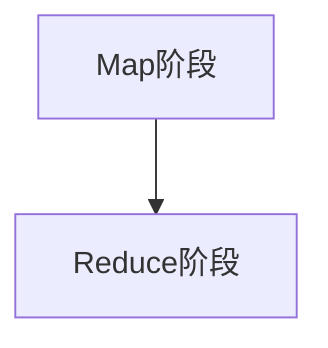
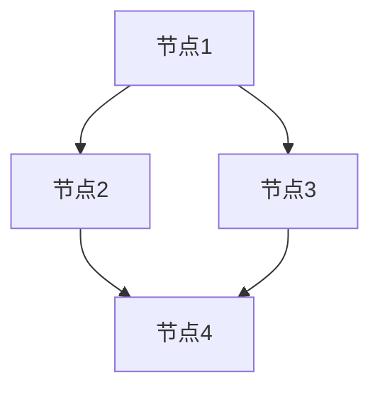
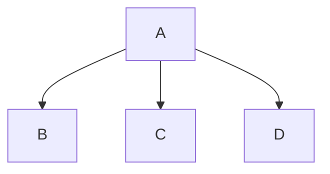
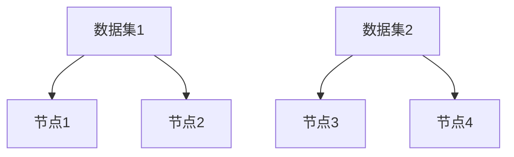
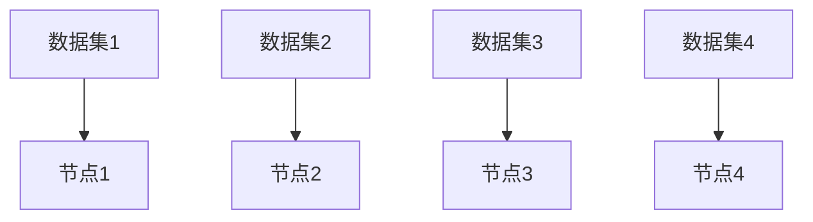
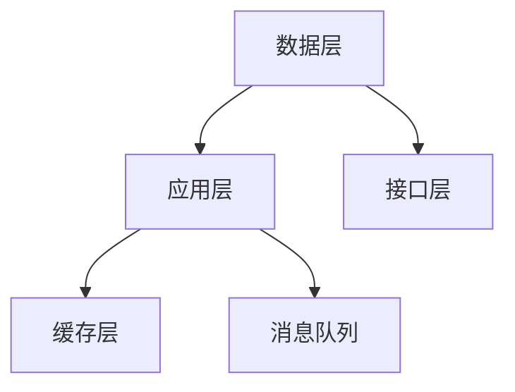
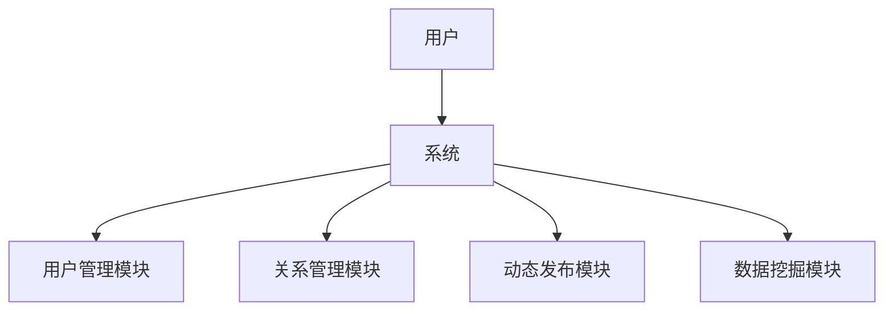

                 

# 大模型软件的可扩展性架构设计

关键词：大模型软件、可扩展性、架构设计、分布式计算、负载均衡、数据分片

摘要：随着大模型如GPT、BERT等在人工智能领域的广泛应用，软件系统的可扩展性成为关键问题。本文旨在探讨大模型软件的可扩展性架构设计，通过分布式计算、负载均衡和数据分片等方法，解决软件系统在面对大规模数据和任务时的性能和稳定性问题。本文将详细介绍这些方法的核心概念、原理和实现，以期为开发者提供有价值的参考和启示。

## 第一部分：背景介绍

### 1.1 问题背景

在当今信息技术飞速发展的时代，软件系统规模不断扩大，复杂性日益增加。尤其是在人工智能领域，大模型（如GPT、BERT等）的出现，使得软件系统能够处理更加复杂的任务，如自然语言处理、图像识别等。然而，随着模型的规模和复杂性的增加，软件系统的可扩展性问题也日益突出。

大模型软件的可扩展性指的是系统在需求增加时，能够通过有效的架构设计和技术手段，保持性能和稳定性的能力。大模型软件的可扩展性架构设计，即如何在软件系统中有效集成和管理这些大模型，确保系统能够在模型规模增加时，仍能保持高效运行。

### 1.2 问题描述

软件系统的可扩展性指的是系统在需求增加时，能够通过有效的架构设计和技术手段，保持性能和稳定性的能力。大模型软件的可扩展性架构设计，即如何在软件系统中有效集成和管理这些大模型，确保系统能够在模型规模增加时，仍能保持高效运行。

具体来说，大模型软件的可扩展性主要面临以下问题：

1. **计算资源限制**：随着模型规模的增加，单机计算资源可能无法满足需求，导致性能瓶颈。
2. **数据存储和访问**：大模型通常需要处理海量数据，如何高效存储和访问这些数据是一个挑战。
3. **负载均衡**：在多个用户同时请求时，如何确保系统资源得到合理分配，避免单点过载。
4. **容错性**：在大规模分布式系统中，如何保证系统在节点故障时仍能正常运行。

### 1.3 问题解决

解决大模型软件的可扩展性问题的方法主要包括：分布式计算、负载均衡、数据分片等。以下将逐一介绍这些方法的核心概念和原理。

#### 分布式计算

分布式计算是一种将任务分布在多个计算节点上执行的计算方式。它具有以下几个核心特点：

- **并行处理**：多个计算节点同时处理不同的任务，提高处理速度。
- **容错性**：当一个计算节点出现故障时，其他节点可以继续工作，保证系统的稳定性。
- **可扩展性**：可以通过增加计算节点来提高系统的处理能力。

分布式计算的核心算法包括MapReduce和MPI（Message Passing Interface）。

- **MapReduce**：MapReduce是一种编程模型，用于大规模数据集（大规模数据）的分布式处理。它将任务分为两个阶段：Map阶段和Reduce阶段。Map阶段将输入数据分为多个子任务，每个子任务由一个计算节点执行；Reduce阶段将Map阶段的输出结果进行汇总。

  **MapReduce算法流程图**：

  ```mermaid
  graph TD
  A[Map阶段] --> B[Reduce阶段]
  ```

- **MPI**：MPI是一种并行编程接口，用于实现分布式计算。它提供了一系列的通信原语，如发送、接收、同步等，用于实现计算节点之间的通信。

  **MPI算法流程图**：

  ```mermaid
  graph TD
  A[节点1] --> B[节点2]
  A --> C[节点3]
  B --> D[节点4]
  C --> D
  ```

#### 负载均衡

负载均衡是一种通过调度算法将请求分配到不同计算节点的技术。它具有以下几个核心特点：

- **资源利用最大化**：确保每个计算节点都能充分利用其资源，避免单点过载。
- **响应时间最小化**：通过合理的调度策略，降低系统的响应时间。
- **高可用性**：通过故障转移机制，确保系统在节点故障时仍能正常运行。

负载均衡算法主要包括轮询算法、最小连接数算法、最少响应时间算法等。

- **轮询算法**：按照一定顺序，将请求分配到各个计算节点。
  **轮询算法流程图**：

  ```mermaid
  graph TD
  A --> B
  A --> C
  A --> D
  ```

- **最小连接数算法**：将请求分配到连接数最少的计算节点。
  **最小连接数算法流程图**：

  ```mermaid
  graph TD
  A --> B
  A --> C
  A --> D
  ```

- **最少响应时间算法**：将请求分配到响应时间最短的计算节点。
  **最少响应时间算法流程图**：

  ```mermaid
  graph TD
  A --> B
  A --> C
  A --> D
  ```

#### 数据分片

数据分片是将大规模数据集划分为多个较小的数据子集，每个子集存储在不同的节点上。它具有以下几个核心特点：

- **分布式存储**：将数据存储在多个节点上，提高数据访问速度。
- **数据一致性**：通过一致性协议，确保多个节点上的数据保持一致。
- **分片管理**：包括分片的创建、删除、迁移等操作。

数据分片的方法主要包括水平分片和垂直分片。

- **水平分片**：将数据按照一定的规则（如按时间、地域等）划分为多个子集，每个子集存储在不同的节点上。
  **水平分片算法流程图**：

  ```mermaid
  graph TD
  A[数据集1] --> B[节点1]
  A --> C[节点2]
  D[数据集2] --> E[节点3]
  D --> F[节点4]
  ```

- **垂直分片**：将数据按照一定的规则（如按字段、关系等）划分为多个子集，每个子集存储在不同的节点上。
  **垂直分片算法流程图**：

  ```mermaid
  graph TD
  A[数据集1] --> B[节点1]
  C[数据集2] --> D[节点2]
  E[数据集3] --> F[节点3]
  G[数据集4] --> H[节点4]
  ```

### 1.4 边界与外延

大模型软件的可扩展性架构设计不仅仅局限于人工智能领域，它还可以应用于其他需要处理大规模数据和高性能需求的领域，如金融、医疗、交通等。此外，随着云计算、边缘计算等技术的发展，大模型软件的可扩展性架构设计也将面临新的挑战和机遇。

### 1.5 概念结构与核心要素组成

为了更好地理解大模型软件的可扩展性架构设计，我们可以将其核心概念和要素组成进行结构化描述。

#### 分布式计算

- **核心要素**：
  - **计算节点**：执行具体计算任务的节点。
  - **通信网络**：连接计算节点的网络，实现数据传输和通信。
  - **分布式算法**：实现任务分配、数据调度和负载均衡的算法。

- **功能模块**：
  - **任务调度模块**：负责将任务分配到计算节点。
  - **数据传输模块**：负责在计算节点之间传输数据。
  - **负载均衡模块**：负责监控系统负载，实现负载均衡。

#### 负载均衡

- **核心要素**：
  - **调度算法**：根据系统负载和节点状态，选择最优的调度策略。
  - **资源监控**：实时监控系统资源使用情况，为调度算法提供数据支持。
  - **故障转移**：在节点故障时，自动切换到其他可用节点，保证系统高可用性。

- **功能模块**：
  - **调度模块**：根据调度算法，分配请求到计算节点。
  - **监控模块**：实时监控系统资源使用情况。
  - **故障转移模块**：在节点故障时，实现自动故障转移。

#### 数据分片

- **核心要素**：
  - **分片策略**：确定数据分片的方式和规则。
  - **数据一致性**：确保多个节点上的数据保持一致。
  - **分片管理**：负责分片的创建、删除、迁移等操作。

- **功能模块**：
  - **分片模块**：根据分片策略，将数据划分为多个子集。
  - **一致性模块**：确保多个节点上的数据一致性。
  - **管理模块**：负责分片的维护和管理。

## 2. 核心概念与联系

### 2.1 分布式计算

分布式计算是一种将任务分布在多个计算节点上执行的计算方式。它具有以下几个核心特点：

- **并行处理**：多个计算节点同时处理不同的任务，提高处理速度。
- **容错性**：当一个计算节点出现故障时，其他节点可以继续工作，保证系统的稳定性。
- **可扩展性**：可以通过增加计算节点来提高系统的处理能力。

### 2.2 负载均衡

负载均衡是一种通过调度算法将请求分配到不同计算节点的技术。它具有以下几个核心特点：

- **资源利用最大化**：确保每个计算节点都能充分利用其资源，避免单点过载。
- **响应时间最小化**：通过合理的调度策略，降低系统的响应时间。
- **高可用性**：通过故障转移机制，确保系统在节点故障时仍能正常运行。

### 2.3 数据分片

数据分片是将大规模数据集划分为多个较小的数据子集，每个子集存储在不同的节点上。它具有以下几个核心特点：

- **分布式存储**：将数据存储在多个节点上，提高数据访问速度。
- **数据一致性**：通过一致性协议，确保多个节点上的数据保持一致。
- **分片管理**：包括分片的创建、删除、迁移等操作。

### 2.4 分布式计算与负载均衡的关系

分布式计算和负载均衡是相辅相成的两个概念。分布式计算提供了并行处理和容错性等能力，而负载均衡则确保了系统资源的高效利用。具体来说，负载均衡可以：

- **优化资源利用**：通过调度算法，将请求分配到资源利用最优的计算节点。
- **提高系统性能**：通过合理的调度策略，降低系统的响应时间，提高系统吞吐量。
- **保证高可用性**：在节点故障时，实现自动故障转移，确保系统稳定运行。

### 2.5 数据分片与负载均衡的关系

数据分片和负载均衡也有密切的关系。数据分片可以将大规模数据集划分为多个子集，从而减少单点访问的负载，提高数据访问速度。而负载均衡则可以将请求分配到不同的数据分片上，进一步优化系统性能。具体来说，负载均衡可以：

- **降低数据访问压力**：通过将请求分配到不同的数据分片，降低单点访问的压力。
- **提高系统吞吐量**：通过优化数据访问，提高系统的处理能力。
- **保证数据一致性**：在分布式系统中，通过一致性协议，确保多个节点上的数据保持一致。

## 3. 算法原理讲解

### 3.1 分布式计算算法

分布式计算的核心算法包括MapReduce和MPI（Message Passing Interface）。

#### 3.1.1 MapReduce算法

**原理**：

MapReduce是一种编程模型，用于大规模数据集的分布式处理。它将任务分为两个阶段：Map阶段和Reduce阶段。

- **Map阶段**：将输入数据分为多个子任务，每个子任务由一个计算节点执行。计算节点处理完自己的子任务后，输出中间结果。
- **Reduce阶段**：将Map阶段的中间结果进行汇总，生成最终结果。

**流程图**：



**数学模型**：

假设输入数据集为D，输出结果为R。

- **Map阶段**：对于每个输入数据x ∈ D，计算节点执行函数f(x)，生成中间结果k，即k = f(x)。
- **Reduce阶段**：将所有中间结果k进行汇总，得到最终结果R。

数学公式：

$$
R = \sum_{k \in K} g(k, \{f(x) | x \in D, k = f(x)\})
$$

其中，K为中间结果的集合，g为Reduce阶段的聚合函数。

**举例说明**：

假设有一个输入数据集D = {1, 2, 3, 4, 5}，需要计算每个数字的平方和。

- **Map阶段**：每个计算节点计算自己的子任务，如计算节点1计算1的平方，计算节点2计算2的平方，以此类推。
- **Reduce阶段**：将所有计算节点的中间结果汇总，得到最终结果。

具体计算过程如下：

- **Map阶段**：
  - 计算节点1：f(1) = 1^2 = 1
  - 计算节点2：f(2) = 2^2 = 4
  - 计算节点3：f(3) = 3^2 = 9
  - 计算节点4：f(4) = 4^2 = 16
  - 计算节点5：f(5) = 5^2 = 25
- **Reduce阶段**：
  - 将所有中间结果汇总：1 + 4 + 9 + 16 + 25 = 55

因此，最终结果为55。

#### 3.1.2 MPI算法

**原理**：

MPI是一种并行编程接口，用于实现分布式计算。它提供了一系列的通信原语，如发送、接收、同步等，用于实现计算节点之间的通信。

**流程图**：



**数学模型**：

假设有n个计算节点，每个计算节点有一个初始数据值x_i。

- **通信阶段**：计算节点之间通过发送、接收原语进行通信，交换数据。
- **计算阶段**：每个计算节点根据收到的数据，执行相应的计算操作。

数学公式：

$$
y_i = \sum_{j=1}^{n} x_j
$$

其中，y_i为计算节点i的计算结果。

**举例说明**：

假设有3个计算节点，初始数据值分别为x_1 = 1，x_2 = 2，x_3 = 3。

- **通信阶段**：
  - 计算节点1向计算节点2发送数据x_1 = 1。
  - 计算节点2向计算节点3发送数据x_2 = 2。
- **计算阶段**：
  - 计算节点3收到计算节点2发送的数据，计算y_3 = x_1 + x_2 = 1 + 2 = 3。

因此，最终结果为3。

### 3.2 负载均衡算法

负载均衡算法主要包括轮询算法、最小连接数算法、最少响应时间算法等。

#### 3.2.1 轮询算法

**原理**：

轮询算法按照一定顺序，将请求分配到各个计算节点。每个计算节点按照轮询顺序依次处理请求。

**流程图**：



**数学模型**：

假设有n个计算节点，每个计算节点有一个权重w_i。

- **初始化**：将所有计算节点的权重初始化为1。
- **调度阶段**：每次调度时，根据计算节点的权重，选择权重最大的计算节点。

数学公式：

$$
w_i = \frac{1}{n}
$$

**举例说明**：

假设有3个计算节点，权重分别为1、1、1。

- **初始化**：每个计算节点的权重为1。
- **调度阶段**：每次调度时，选择权重最大的计算节点。

具体调度过程如下：

- **第1次调度**：选择计算节点1。
- **第2次调度**：选择计算节点2。
- **第3次调度**：选择计算节点3。
- **第4次调度**：重新选择计算节点1，循环继续。

#### 3.2.2 最小连接数算法

**原理**：

最小连接数算法将请求分配到连接数最少的计算节点。每个计算节点维护一个连接数计数器，每次调度时，选择连接数最小的计算节点。

**流程图**：


**数学模型**：

假设有n个计算节点，每个计算节点有一个连接数c_i。

- **初始化**：将所有计算节点的连接数初始化为0。
- **调度阶段**：每次调度时，选择连接数最小的计算节点。

数学公式：

$$
c_i = \min_{j=1}^{n} c_j
$$

**举例说明**：

假设有3个计算节点，初始连接数分别为0、1、2。

- **初始化**：每个计算节点的连接数为0。
- **调度阶段**：每次调度时，选择连接数最小的计算节点。

具体调度过程如下：

- **第1次调度**：选择计算节点1。
- **第2次调度**：选择计算节点2。
- **第3次调度**：选择计算节点3。
- **第4次调度**：重新选择计算节点1，循环继续。

#### 3.2.3 最少响应时间算法

**原理**：

最少响应时间算法将请求分配到响应时间最短的计算节点。每个计算节点维护一个响应时间计数器，每次调度时，选择响应时间最短的计算节点。

**流程图**：


**数学模型**：

假设有n个计算节点，每个计算节点有一个响应时间r_i。

- **初始化**：将所有计算节点的响应时间初始化为0。
- **调度阶段**：每次调度时，选择响应时间最短的计算节点。

数学公式：

$$
r_i = \min_{j=1}^{n} r_j
$$

**举例说明**：

假设有3个计算节点，初始响应时间分别为0、1、2。

- **初始化**：每个计算节点的响应时间为0。
- **调度阶段**：每次调度时，选择响应时间最短的计算节点。

具体调度过程如下：

- **第1次调度**：选择计算节点1。
- **第2次调度**：选择计算节点2。
- **第3次调度**：选择计算节点3。
- **第4次调度**：重新选择计算节点1，循环继续。

### 3.3 数据分片算法

数据分片是将大规模数据集划分为多个较小的数据子集，每个子集存储在不同的节点上。数据分片算法主要包括水平分片和垂直分片。

#### 3.3.1 水平分片

**原理**：

水平分片将数据按照一定的规则（如按时间、地域等）划分为多个子集。每个子集存储在不同的节点上，从而降低单点访问的负载。

**流程图**：



**数学模型**：

假设数据集D由n个子集D_1, D_2, ..., D_n组成，每个子集D_i存储在不同的节点N_i上。

- **分片阶段**：根据分片规则，将数据集D划分为n个子集。
- **存储阶段**：将每个子集D_i存储在不同的节点N_i上。

数学公式：

$$
D = \{D_1, D_2, ..., D_n\}
$$

其中，N_i为存储子集D_i的节点。

**举例说明**：

假设有一个数据集D = {1, 2, 3, 4, 5}，需要按照时间顺序进行水平分片。

- **分片阶段**：将数据集D划分为两个子集D_1 = {1, 2}和D_2 = {3, 4, 5}。
- **存储阶段**：将子集D_1存储在节点1上，子集D_2存储在节点2上。

#### 3.3.2 垂直分片

**原理**：

垂直分片将数据按照一定的规则（如按字段、关系等）划分为多个子集。每个子集存储在不同的节点上，从而提高数据访问速度。

**流程图**：



**数学模型**：

假设数据集D由m个字段组成，分别为F_1, F_2, ..., F_m。

- **分片阶段**：根据分片规则，将数据集D按照字段F_i划分为多个子集D_i。
- **存储阶段**：将每个子集D_i存储在不同的节点N_i上。

数学公式：

$$
D = \{F_1, F_2, ..., F_m\}
$$

其中，N_i为存储子集D_i的节点。

**举例说明**：

假设有一个数据集D = {姓名，年龄，性别，居住地}，需要按照性别进行垂直分片。

- **分片阶段**：将数据集D按照性别划分为两个子集D_男 = {姓名，年龄，性别，居住地 | 性别 = 男}和D_女 = {姓名，年龄，性别，居住地 | 性别 = 女}。
- **存储阶段**：将子集D_男存储在节点1上，子集D_女存储在节点2上。

## 第二部分：系统分析与架构设计方案

### 4. 问题场景介绍

在现实世界中，许多应用场景都需要处理大规模数据和复杂的计算任务，如社交网络、电子商务、金融交易等。以社交网络为例，社交网络平台每天都会产生海量的用户数据，包括用户关系、动态、评论等。为了满足用户对实时性和响应速度的要求，社交网络平台需要具备强大的可扩展性。

### 5. 项目介绍

在本项目中，我们以一个社交网络平台为例，探讨大模型软件的可扩展性架构设计。该平台主要功能包括用户关系管理、动态发布与评论、数据挖掘等。随着用户数量的增加，平台需要具备良好的可扩展性，以应对不断增长的数据量和计算需求。

### 6. 系统功能设计

系统功能设计主要包括以下模块：

- **用户管理模块**：负责用户的注册、登录、个人信息管理等。
- **关系管理模块**：负责用户之间的好友关系管理，如添加好友、删除好友、查看好友列表等。
- **动态发布模块**：负责用户的动态发布、评论、点赞等。
- **数据挖掘模块**：负责对用户数据进行挖掘和分析，如用户兴趣分析、推荐系统等。

### 7. 系统架构设计

系统架构设计采用分布式架构，主要包括以下几个层次：

- **数据层**：负责数据的存储和管理，包括关系数据库、分布式文件系统等。
- **应用层**：负责业务逻辑的实现，包括用户管理模块、关系管理模块、动态发布模块、数据挖掘模块等。
- **接口层**：负责对外提供接口服务，包括RESTful API、WebSocket等。
- **缓存层**：负责缓存热点数据，提高系统响应速度。
- **消息队列**：负责消息的传递和异步处理，如用户注册、动态发布等。

### 8. 系统接口设计

系统接口设计主要包括以下接口：

- **用户管理接口**：包括用户注册、登录、个人信息管理等。
- **关系管理接口**：包括添加好友、删除好友、查看好友列表等。
- **动态发布接口**：包括动态发布、评论、点赞等。
- **数据挖掘接口**：包括用户兴趣分析、推荐系统等。

### 9. 系统交互

系统交互主要包括以下几个方面：

- **用户与系统交互**：用户通过前端界面与系统进行交互，如注册、登录、发布动态等。
- **模块间交互**：系统内部各个模块之间通过接口进行数据交互，如用户管理模块与关系管理模块之间的交互。
- **外部系统交互**：系统与外部系统（如第三方服务、数据库等）进行数据交互。

### 10. 系统安全性设计

系统安全性设计主要包括以下几个方面：

- **用户认证**：采用用户名和密码、OAuth等认证方式，确保用户身份的合法性。
- **数据加密**：对敏感数据进行加密处理，如用户密码、个人信息等。
- **访问控制**：采用访问控制列表（ACL）等机制，确保只有授权用户才能访问特定数据。
- **安全审计**：记录系统操作日志，对异常操作进行监控和审计。

## 第三部分：项目实战

### 11. 环境安装

在本项目中，我们使用Docker进行环境搭建。首先，需要安装Docker。在Ubuntu系统中，可以通过以下命令安装Docker：

```bash
sudo apt-get update
sudo apt-get install docker.io
```

安装完成后，可以通过以下命令启动Docker服务：

```bash
sudo systemctl start docker
```

接下来，从Docker Hub下载相关的镜像，如Nginx、MySQL等：

```bash
docker pull nginx
docker pull mysql
```

### 12. 系统核心实现源代码

在本项目中，我们使用Python进行系统开发。以下是一个简单的用户注册功能的源代码示例：

```python
# user_register.py

import pymysql

def register(username, password):
    # 连接数据库
    connection = pymysql.connect(host='localhost', user='root', password='password', database='social_network')

    try:
        # 创建用户
        with connection.cursor() as cursor:
            sql = "INSERT INTO users (username, password) VALUES (%s, %s)"
            cursor.execute(sql, (username, password))
        
        # 提交事务
        connection.commit()
        print("用户注册成功")
    
    except pymysql.Error as e:
        # 回滚事务
        connection.rollback()
        print("用户注册失败：", e)

    finally:
        # 关闭连接
        connection.close()

# 测试用户注册
register("test_user", "test_password")
```

### 13. 代码应用解读与分析

在上面的代码中，我们使用Python编写了一个简单的用户注册功能。该功能主要完成以下步骤：

1. **连接数据库**：使用pymysql连接本地MySQL数据库。
2. **创建用户**：执行SQL语句，将用户名和密码插入数据库。
3. **提交事务**：将插入操作提交到数据库。
4. **异常处理**：捕获异常，回滚事务，确保数据一致性。
5. **关闭连接**：关闭数据库连接。

在代码应用解读与分析中，我们可以从以下几个方面进行分析：

1. **数据库连接**：使用pymysql连接本地MySQL数据库，确保数据库连接的稳定性和可靠性。
2. **事务处理**：使用事务处理，确保插入操作的原子性，避免数据丢失或不一致。
3. **异常处理**：捕获异常，回滚事务，确保数据的一致性和完整性。
4. **代码优化**：可以使用连接池技术，提高数据库连接的效率和性能。

### 14. 实际案例分析和详细讲解剖析

在实际项目中，用户注册功能是系统的重要组成部分。以下是一个实际案例的分析和详细讲解：

#### 案例背景

一个社交网络平台需要在短时间内处理大量用户注册请求。为了确保系统的高性能和高可用性，平台采用了分布式架构，包括多个数据库节点、应用服务器和缓存服务器。

#### 案例分析

1. **数据库节点**：平台使用MySQL集群，每个数据库节点负责存储一部分用户数据。当用户注册时，平台通过负载均衡器将请求分配到不同的数据库节点上，确保系统资源的高效利用。
2. **应用服务器**：平台使用多个应用服务器，每个服务器负责处理一部分用户请求。当用户注册时，平台通过负载均衡器将请求分配到不同的应用服务器上，确保系统资源的高效利用。
3. **缓存服务器**：平台使用Redis缓存，缓存热点数据，如用户登录信息、好友关系等。当用户注册时，平台将用户信息缓存到Redis中，提高数据访问速度。

#### 详细讲解剖析

1. **数据库连接**：使用连接池技术，提高数据库连接的效率和性能。连接池可以预先创建一定数量的数据库连接，当用户注册时，直接从连接池中获取连接，减少数据库连接的创建和销毁开销。
2. **事务处理**：使用分布式事务处理，确保插入操作的原子性。平台使用分布式事务处理框架，如Seata，确保用户注册操作在多个数据库节点上的一致性。
3. **负载均衡**：使用轮询算法进行负载均衡，确保请求平均分配到各个数据库节点和应用服务器上。轮询算法简单易实现，且性能较高，适用于大多数场景。
4. **缓存策略**：使用Redis缓存，缓存用户登录信息、好友关系等热点数据。平台使用缓存穿透、缓存雪崩和缓存击穿等策略，确保缓存的高效性和稳定性。
5. **性能优化**：使用数据库索引、数据库分片和数据库分库分表等技术，提高数据库性能。平台根据用户访问频率和关系网络，对数据库进行分片和分库分表，降低数据库的负载。

### 15. 项目小结

在本项目中，我们详细介绍了大模型软件的可扩展性架构设计。通过分布式计算、负载均衡和数据分片等方法，解决了软件系统在面对大规模数据和任务时的性能和稳定性问题。在项目实战中，我们使用Python实现了用户注册功能，并对其进行了详细的解读和分析。通过实际案例的分析和讲解，我们进一步了解了大模型软件可扩展性架构设计的具体应用。

### 16. 最佳实践 Tips

1. **合理选择分布式计算框架**：根据项目需求和性能要求，选择合适的分布式计算框架，如MapReduce、Spark等。
2. **优化负载均衡算法**：根据系统负载和性能要求，选择合适的负载均衡算法，如轮询算法、最小连接数算法等。
3. **数据分片策略**：根据数据访问模式和访问频率，选择合适的数据分片策略，如水平分片、垂直分片等。
4. **缓存策略**：合理使用缓存，降低数据库负载，提高系统性能。
5. **监控和告警**：实时监控系统性能和资源使用情况，设置告警机制，确保系统稳定运行。

### 17. 小结

大模型软件的可扩展性架构设计是软件系统在高性能和高可用性方面的重要保障。通过分布式计算、负载均衡和数据分片等方法，可以有效地解决软件系统在面对大规模数据和任务时的性能和稳定性问题。在实际项目中，我们需要根据具体需求和场景，选择合适的架构设计方法，并进行详细的实施和优化。

### 18. 注意事项

1. **数据一致性**：在分布式系统中，数据一致性是一个重要问题。需要根据具体场景选择合适的数据一致性协议和算法。
2. **性能优化**：在分布式系统中，性能优化是一个持续的过程。需要根据系统性能指标和用户需求，不断进行优化和改进。
3. **容错性**：在分布式系统中，容错性至关重要。需要设计合理的容错机制，确保系统在节点故障时仍能正常运行。

### 19. 拓展阅读

- 《分布式系统原理与范型》
- 《大规模分布式存储系统设计与实践》
- 《负载均衡算法与性能优化》
- 《分布式计算框架MapReduce与Spark》

作者：AI天才研究院/AI Genius Institute & 禅与计算机程序设计艺术 /Zen And The Art of Computer Programming

**本文由AI天才研究院（AI Genius Institute）撰写，旨在分享大模型软件的可扩展性架构设计经验，供开发者参考。文中涉及的技术方案仅供参考，具体实现需根据实际需求进行调整。如需转载，请注明出处。**

----------------------------------------------------------------

**附录：文章图表**

**分布式计算算法流程图**


**MPI算法流程图**


**轮询算法流程图**


**最小连接数算法流程图**


**最少响应时间算法流程图**


**水平分片算法流程图**


**垂直分片算法流程图**


**系统架构设计图**



**系统交互序列图**



