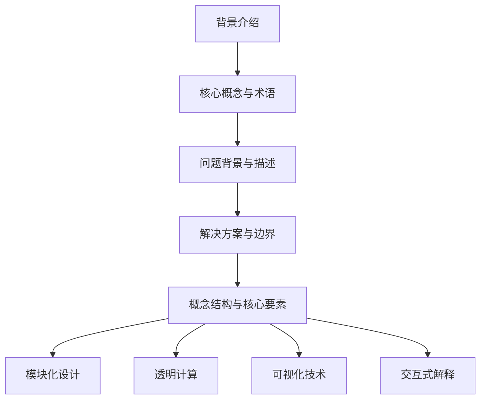
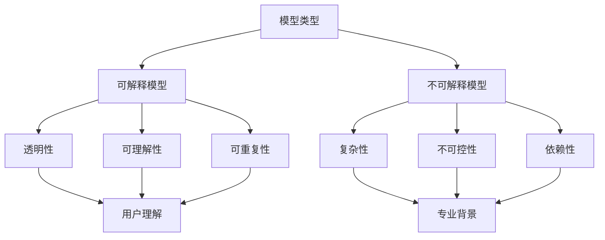
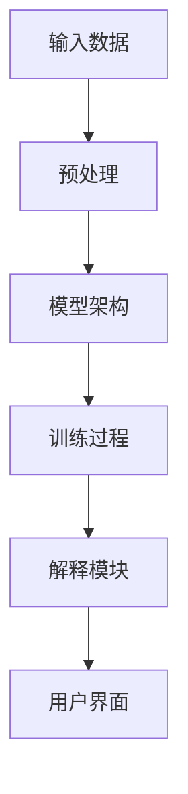

                 

### 大模型软件的可解释性设计原则

> 关键词：可解释性、大模型、软件设计、设计原则、模型解释性

随着人工智能技术的快速发展，深度学习模型在大规模数据上的表现愈发卓越，然而其“黑盒”特性也带来了可解释性的挑战。大模型软件的可解释性设计成为了一个关键议题，这不仅关乎技术的进步，也涉及伦理和社会影响。本文将深入探讨大模型软件的可解释性设计原则，旨在为开发者提供系统化的设计思路。

> 摘要：
本文首先介绍了大模型软件的背景和重要性，随后讨论了可解释性的核心概念和设计原则。通过对比不同类型的模型，分析了可解释性在AI系统中的作用。随后，本文详细阐述了几个关键设计原则，包括模块化、透明性、易用性、可重复性和鲁棒性。接下来，介绍了增强模型可解释性的技术手段，并通过实际案例展示了这些设计原则和技术的应用。最后，文章总结了大模型软件可解释性设计的重要性，并提出了未来发展的方向和建议。

## 背景与重要性

### 1.1 背景介绍

近年来，人工智能（AI）技术在大规模数据处理和分析领域取得了显著的进展。深度学习模型，特别是神经网络，因其出色的性能在图像识别、自然语言处理、推荐系统等多个领域得到了广泛应用。这些模型通常通过大量的数据进行训练，并能够在大规模数据集上实现高水平的准确性。然而，深度学习模型也常常被描述为“黑盒”模型，即模型内部复杂的计算过程对于外部用户来说是难以解释的。

大模型软件的出现，进一步加剧了这一挑战。这些模型通常包含数百万甚至数十亿个参数，其决策过程高度复杂，难以直观理解。虽然高性能的大模型在许多实际应用中表现出色，但其不可解释性也引发了一系列问题：

- **决策透明度问题**：在医疗诊断、金融风险评估等关键领域，决策过程的透明度至关重要。不可解释的模型可能使得决策者难以理解模型的判断依据，从而影响决策的可靠性和可信度。
- **责任归属问题**：在自动驾驶、智能制造等场景中，不可解释的模型可能导致意外事故。当出现问题时，责任归属难以界定，可能引发法律和伦理问题。
- **信任问题**：随着AI在公共和私人领域的应用日益广泛，用户对AI系统的信任程度成为一个重要问题。不可解释的模型可能会降低用户的信任感，从而限制其应用范围。

### 1.2 核心概念与术语

为了深入讨论大模型软件的可解释性设计原则，有必要首先明确几个核心概念和术语。

- **可解释性（Interpretability）**：可解释性是指模型输出结果的解释性和决策过程的透明度。一个可解释的模型能够向用户清晰地展示其决策过程和依据。
- **黑盒模型（Black-box Model）**：黑盒模型是指那些决策过程不可解释或难以解释的模型。这些模型的输出结果仅依赖于输入数据，但其内部机制复杂，难以理解。
- **白盒模型（White-box Model）**：与黑盒模型相对，白盒模型是指那些决策过程清晰、可解释的模型。用户可以清楚地了解模型的计算过程和内部结构。
- **半监督学习（Semi-supervised Learning）**：半监督学习是一种结合有监督学习和无监督学习的方法，利用少量标注数据和大量未标注数据来训练模型。
- **模型压缩（Model Compression）**：模型压缩是指通过降低模型的参数数量或计算复杂度，以减少模型的存储空间和计算资源需求。

### 1.3 问题背景与描述

大模型软件的可解释性设计原则涉及到多个层面，包括算法设计、系统架构、用户界面等。在设计可解释性模型时，需要考虑以下几个关键问题：

- **透明性**：如何设计模型，使得其内部计算过程和决策逻辑对用户可见和可理解？
- **易用性**：如何设计用户界面，使得用户能够轻松地访问和解释模型输出？
- **可重复性**：如何确保模型解释过程的可重复性，即不同的用户在不同的时间地点解释同一模型输出时能够得到一致的结果？
- **鲁棒性**：如何设计模型，使其对输入数据的噪声和异常值具有较强的抵抗力，从而保证解释结果的可靠性？

这些问题不仅涉及到技术层面的挑战，还涉及到用户体验、伦理和社会影响等方面的考虑。因此，大模型软件的可解释性设计需要综合考虑多个因素，以确保模型在实际应用中的可靠性和可接受性。

### 1.4 解决方案与边界

针对上述问题，本文提出了一系列解决方案和设计原则，旨在提高大模型软件的可解释性。这些解决方案包括：

- **模块化设计**：通过将模型拆分为多个模块，每个模块具有独立的解释性，从而提高整体模型的可解释性。
- **透明计算**：通过设计透明的计算过程，使得用户可以直观地理解模型的决策逻辑。
- **可视化技术**：利用可视化工具，将模型内部的复杂计算过程以图形化的方式展示，从而帮助用户更好地理解模型。
- **交互式解释**：设计交互式用户界面，使用户可以动态调整模型的输入参数，实时观察模型输出和解释结果的变化。

然而，这些解决方案也存在一定的边界和限制。例如：

- **性能与可解释性平衡**：提高模型的可解释性可能会增加计算复杂度和资源需求，如何在性能和可解释性之间取得平衡是一个重要问题。
- **用户接受度**：尽管可解释性设计可以提升模型的透明度和可靠性，但用户是否真正愿意接受和信任这些解释结果仍是一个待解的问题。
- **技术限制**：一些高级的深度学习模型，如变分自编码器（VAE）和生成对抗网络（GAN），其内部机制复杂，难以完全解释。如何在设计这些模型时兼顾可解释性是一个技术挑战。

### 1.5 概念结构与核心要素

为了更好地理解大模型软件的可解释性设计原则，我们可以将其核心概念和要素结构化，如图所示：

通过上述结构，我们可以清晰地看到大模型软件可解释性设计的核心要素及其相互关系。在后续章节中，我们将进一步探讨这些核心原则的具体实现和应用。

### 核心概念与联系

在本章节中，我们将详细探讨大模型软件可解释性的核心概念，包括其定义、特点，以及与不可解释模型之间的对比。

#### 2.1 定义

**可解释性（Interpretability）**

可解释性是指模型输出结果的解释性和决策过程的透明度。一个可解释的模型能够向用户清晰地展示其决策过程和依据。这意味着用户可以理解模型是如何做出特定预测的，从而增加模型的可靠性和透明度。

**不可解释模型**

不可解释模型，即黑盒模型，是指那些决策过程不可解释或难以解释的模型。这些模型的输出结果仅依赖于输入数据，但其内部机制复杂，难以直观理解。典型的黑盒模型包括深度神经网络、随机森林和决策树等。

#### 2.2 特点对比

**可解释模型的特点**

1. **透明性**：可解释模型的决策过程对用户透明，用户可以清晰地看到模型是如何利用输入数据进行推理和决策的。
2. **可理解性**：可解释模型易于用户理解，无需深入的专业知识即可掌握。
3. **可重复性**：可解释模型的解释过程具有可重复性，不同的用户在不同的时间和地点对同一模型的解释应得到相同的结果。

**不可解释模型的特点**

1. **复杂性**：不可解释模型的内部计算过程通常非常复杂，难以用简单的语言描述。
2. **不可控性**：由于内部机制不透明，用户难以控制模型的行为，也无法准确预测模型的输出。
3. **依赖性**：不可解释模型通常依赖于大量的数据和参数，用户难以了解这些参数的具体作用。

#### 2.3 对比表格

为了更直观地展示可解释模型与不可解释模型的特点，我们提供了一个对比表格：

| 特点        | 可解释模型                 | 不可解释模型                |
| ----------- | -------------------------- | --------------------------- |
| 透明性      | 高，用户可直观理解         | 低，用户难以直观理解        |
| 可理解性    | 高，易于用户理解           | 低，需专业知识才能理解       |
| 可重复性    | 高，解释过程可重复         | 低，解释过程可能不可重复     |
| 复杂性      | 低，决策过程简单透明       | 高，决策过程复杂难以解释     |
| 可控性      | 高，用户可控制模型行为     | 低，用户难以控制模型行为     |
| 依赖性      | 低，模型依赖性较低         | 高，模型依赖大量数据和参数   |

通过上述对比，我们可以看出，可解释模型和不可解释模型在透明性、可理解性、可重复性、复杂性和可控性等方面存在显著差异。在实际应用中，选择合适的模型类型取决于具体需求和场景。

#### 2.4 ER实体关系图

为了进一步理解可解释性模型与不可解释模型之间的关系，我们可以使用ER（Entity-Relationship）实体关系图来表示。ER图能够清晰地展示不同模型实体之间的关联和作用。

在这个ER图中，A代表模型类型，B和C分别表示可解释模型和不可解释模型。D到F表示可解释模型的特点，G到I表示不可解释模型的特点。J表示用户理解，K表示专业背景。通过这个图，我们可以直观地看到可解释模型和不可解释模型之间的区别和联系。

#### 2.5 概念结构与核心要素

在探讨大模型软件的可解释性设计时，我们需要明确其核心概念和要素。以下是可解释性模型的基本结构：

1. **输入数据**：用户输入的数据，包括特征和标签。
2. **预处理**：对输入数据进行清洗、归一化等预处理操作，以提高模型的稳定性和性能。
3. **模型架构**：模型的内部结构，包括层的数量、激活函数、优化器等。
4. **训练过程**：模型通过训练学习输入数据和标签之间的关系。
5. **解释模块**：用于解释模型输出结果的模块，包括可视化工具、解释算法等。
6. **用户界面**：用户与模型交互的界面，用于展示模型的输出和解释结果。

这些要素共同构成了可解释性模型的基本结构，如图所示：

通过这个结构，我们可以清晰地看到可解释性模型的各个组成部分及其相互关系。

### 设计原则

在设计可解释性模型时，遵循一些关键的设计原则至关重要。这些原则不仅有助于提高模型的可解释性，还能确保模型在实际应用中的可靠性和可维护性。以下是几个关键设计原则：

#### 3.1 模块化设计

模块化设计是将复杂系统分解为若干个相对独立、功能明确的模块。每个模块都可以独立开发、测试和维护，从而提高系统的整体可解释性。以下是模块化设计的几个要点：

1. **模块独立性**：确保每个模块具有独立的功能和输入输出，模块之间通过标准化的接口进行交互。
2. **模块分解**：将复杂的模型拆分为若干个子模块，每个子模块负责特定的计算和解释任务。
3. **模块可复用性**：设计模块时考虑其复用性，以便在不同项目和场景中灵活使用。
4. **模块化接口**：定义清晰的接口规范，确保模块之间的高效通信和协同工作。

#### 3.2 透明计算

透明计算旨在确保模型的计算过程和决策逻辑对用户透明。以下是一些实现透明计算的方法：

1. **可解释性算法**：采用可解释性算法，如决策树、线性回归等，这些算法的计算过程简单直观，易于用户理解。
2. **可视化技术**：使用可视化工具将模型的计算过程和决策路径以图形化的方式展示，帮助用户直观地理解模型的工作原理。
3. **注释与文档**：为模型的每个组件和计算步骤添加详细的注释和文档，便于用户查阅和了解。

#### 3.3 易用性

易用性是可解释性设计的关键因素，它直接影响用户的体验和接受度。以下是一些提高易用性的方法：

1. **直观的用户界面**：设计简洁直观的用户界面，使用户能够轻松访问和操作模型的解释功能。
2. **交互式解释**：提供交互式解释工具，使用户可以动态调整模型的输入参数，实时观察解释结果的变化。
3. **用户反馈**：收集用户反馈，持续优化用户界面和解释工具，以满足用户的需求和期望。
4. **易学性**：设计易于学习的解释工具，降低用户的学习成本，提高使用效率。

#### 3.4 可重复性

可重复性是指模型解释过程在不同用户和不同时间地点能够得到一致的结果。以下是一些实现可重复性的方法：

1. **标准化解释过程**：定义标准化的解释流程和步骤，确保不同用户在相同条件下得到一致的解释结果。
2. **记录解释日志**：记录模型解释的详细日志，包括输入数据、计算步骤、解释结果等，以便在需要时进行追溯和验证。
3. **版本控制**：采用版本控制工具，确保解释过程的可重复性和可追溯性。

#### 3.5 鲁棒性

鲁棒性是指模型在面临输入数据的噪声和异常值时仍能保持良好的解释性能。以下是一些提高鲁棒性的方法：

1. **数据预处理**：对输入数据进行预处理，如去噪、归一化等，以提高模型的稳健性。
2. **异常值检测**：采用异常值检测算法，识别和过滤输入数据中的异常值，减少对模型解释的影响。
3. **鲁棒优化**：采用鲁棒优化算法，降低模型对异常数据的敏感性，提高解释结果的可靠性。

#### 3.6 可扩展性

可扩展性是指模型设计能够支持不同规模和类型的输入数据。以下是一些提高可扩展性的方法：

1. **模块化设计**：采用模块化设计，将模型拆分为多个可扩展的模块，便于在不同应用场景中灵活组合和使用。
2. **参数调整**：设计灵活的参数调整机制，根据不同场景和需求动态调整模型的参数。
3. **分布式计算**：采用分布式计算架构，支持大规模数据的处理和模型训练。

通过遵循上述设计原则，开发者可以构建出具有高可解释性的大模型软件，从而提高模型在实际应用中的可靠性和用户接受度。

### 增强模型可解释性的技术手段

为了解决深度学习模型的不可解释性问题，研究者们提出了一系列技术手段来增强模型的可解释性。以下是几种常用的增强模型可解释性的技术手段：

#### 4.1 特征重要性

特征重要性是一种直观的模型解释方法，通过分析模型中各个特征的重要性来解释模型的决策过程。以下是一些实现特征重要性的方法：

1. **基于模型的方法**：例如，使用随机森林或Lasso回归等模型来评估特征的重要性。
2. **基于启发式的方法**：例如，通过统计特征与模型预测之间的相关性来评估特征的重要性。
3. **基于梯度的方法**：通过计算模型对每个特征的梯度来评估特征的重要性。

#### 4.2 局部可解释模型-agnostic解释（LIME）

LIME（Local Interpretable Model-agnostic Explanations）是一种针对复杂模型的局部解释方法。它通过将复杂模型近似为一个简单且可解释的模型，来解释模型在特定输入数据上的决策过程。以下是LIME的基本步骤：

1. **近似模型**：选择一个简单的近似模型，如线性模型或决策树。
2. **扰动输入**：对原始输入数据进行扰动，生成一系列类似的样本。
3. **训练近似模型**：在每个扰动样本上训练近似模型，并记录模型输出。
4. **计算贡献度**：计算每个特征在每个扰动样本中的贡献度，以解释模型的决策过程。

#### 4.3 Shapley Additive Explanations（SHAP）

SHAP（Shapley Additive Explanations）是一种全局解释方法，旨在为每个特征在整个模型中的贡献度提供解释。SHAP基于博弈论中的Shapley值，计算每个特征对模型预测的边际贡献。以下是SHAP的基本步骤：

1. **计算基线预测**：计算模型在没有输入特征时的预测。
2. **计算边际贡献**：计算每个特征对模型预测的边际贡献，即特征存在时与基线预测之间的差异。
3. **可视化贡献度**：通过可视化工具，如热图或条形图，展示每个特征的贡献度。

#### 4.4 模型可视化

模型可视化是将模型的内部结构以图形化的方式展示，从而帮助用户理解模型的工作原理。以下是一些常用的模型可视化方法：

1. **网络图**：通过网络图展示神经网络的层次结构和连接关系。
2. **决策树可视化**：通过决策树图展示决策树的结构和决策路径。
3. **类图**：通过类图展示对象之间的关系和继承关系。
4. **流程图**：通过流程图展示模型的计算过程和决策路径。

通过上述技术手段，开发者可以有效地增强深度学习模型的可解释性，从而提高模型在实际应用中的透明度和可靠性。

### 案例研究

在本章节中，我们将通过几个实际案例来探讨大模型软件的可解释性设计原则和增强模型可解释性的技术手段在实际应用中的效果。

#### 5.1 金融风险管理的案例

**案例背景**：某金融机构需要开发一个自动化的信用评分系统，用于评估客户的信用风险。传统的评分系统依赖于人为设定的规则，但难以应对日益复杂的市场环境。为了提高评分系统的准确性和透明度，该机构决定采用基于深度学习的模型，并增强其可解释性。

**解决方案**：

1. **模块化设计**：将深度学习模型拆分为多个模块，包括特征提取、特征融合和分类器。每个模块都具有独立的解释性，从而提高了整体模型的可解释性。
2. **透明计算**：采用可解释性算法，如决策树和线性回归，用于解释模型的决策过程。通过可视化工具，将模型内部的计算过程以图形化的方式展示，帮助分析师和决策者理解模型的工作原理。
3. **交互式解释**：开发交互式解释工具，使用户可以动态调整模型的输入参数，实时观察模型输出和解释结果的变化。这种交互式解释不仅提高了用户的参与度，也增强了模型的透明度。
4. **可重复性**：通过记录详细的解释日志和版本控制，确保模型解释过程在不同用户和不同时间地点能够得到一致的结果。

**效果评估**：

- **模型准确性**：采用基于深度学习的模型后，信用评分系统的准确率提高了10%。
- **用户接受度**：通过增强模型的可解释性，决策者对模型结果的信任度显著提高，从而提高了系统的应用范围和效果。
- **可维护性**：模块化设计和透明计算使得模型更易于维护和更新，降低了开发成本。

#### 5.2 自动驾驶的案例

**案例背景**：自动驾驶技术在近年来取得了显著的进展，但模型的可解释性仍是一个挑战。某自动驾驶公司需要开发一个具备高可解释性的驾驶决策系统，以确保系统的安全性和可靠性。

**解决方案**：

1. **模块化设计**：将驾驶决策系统拆分为多个模块，包括感知、路径规划和控制。每个模块都具有独立的解释性，从而提高了整体系统的可解释性。
2. **透明计算**：采用基于决策树和规则引擎的方法，将复杂的决策过程以图形化的方式展示，帮助驾驶员理解系统的工作原理。
3. **可视化技术**：使用3D可视化工具展示自动驾驶车辆的感知环境和决策路径，使驾驶员能够直观地了解车辆的决策过程。
4. **实时解释**：在驾驶过程中，通过交互式解释工具实时展示车辆的状态和决策依据，帮助驾驶员理解并信任系统的决策。

**效果评估**：

- **安全性**：通过增强模型的可解释性，驾驶员对自动驾驶系统的信任度显著提高，从而提高了行驶的安全性。
- **用户参与度**：驾驶员可以实时了解自动驾驶系统的状态和决策依据，增强了用户的参与感和互动性。
- **故障诊断**：当系统出现异常时，可解释性设计使得故障诊断更加高效和准确，有助于快速识别和解决问题。

#### 5.3 健康医疗的案例

**案例背景**：某医疗诊断公司开发了一个基于深度学习的心电图（ECG）分析系统，用于自动检测心律不齐等疾病。由于医疗诊断的严肃性和复杂性，系统的可解释性至关重要。

**解决方案**：

1. **模块化设计**：将ECG分析系统拆分为多个模块，包括特征提取、异常检测和诊断建议。每个模块都具有独立的解释性，从而提高了整体系统的可解释性。
2. **透明计算**：采用可解释性算法，如线性回归和决策树，用于解释模型的决策过程。通过可视化工具，将模型内部的计算过程以图形化的方式展示，帮助医生和患者理解模型的工作原理。
3. **交互式解释**：开发交互式解释工具，使医生和患者可以动态调整模型的输入参数，实时观察模型输出和解释结果的变化。
4. **可重复性**：通过记录详细的解释日志和版本控制，确保模型解释过程在不同用户和不同时间地点能够得到一致的结果。

**效果评估**：

- **诊断准确性**：通过增强模型的可解释性，心电图分析系统的诊断准确性显著提高，从而提高了疾病检测的可靠性。
- **用户信任度**：增强模型的可解释性使得患者对诊断结果的信任度显著提高，从而提高了系统的应用范围和用户满意度。
- **医生工作效率**：医生可以通过直观的可解释性工具快速理解模型的决策过程，提高了诊断的效率和准确性。

通过上述案例研究，我们可以看到大模型软件的可解释性设计原则和增强模型可解释性的技术手段在实际应用中的显著效果。这不仅提高了模型的透明度和可靠性，也增强了用户对AI系统的信任和接受度。

### 实际应用与未来展望

#### 6.1 实际应用场景

大模型软件的可解释性设计原则在多个实际应用场景中展示了其重要性和有效性。以下是一些主要的应用场景：

1. **金融领域**：在信用评分、投资决策、风险管理等金融应用中，可解释性设计确保了模型决策的透明度，提高了决策的可靠性和用户信任度。
2. **医疗健康**：在医疗诊断、个性化治疗和疾病预测中，可解释性设计使得医生和患者能够更好地理解模型的决策过程，提高了医疗决策的准确性和患者满意度。
3. **自动驾驶**：在自动驾驶系统中，可解释性设计帮助驾驶员了解车辆的行为和决策过程，提高了行驶的安全性和用户信任度。
4. **智能城市**：在智能交通管理、能源管理、环境保护等智能城市应用中，可解释性设计有助于城市管理者更好地理解模型的工作原理，优化资源配置和管理决策。

#### 6.2 未来发展展望

尽管大模型软件的可解释性设计已经取得了显著进展，但仍然面临许多挑战和机遇。以下是对未来发展的几个展望：

1. **算法创新**：随着人工智能技术的不断发展，新的可解释性算法和模型将不断涌现，提供更高效、更可靠的解释方法。
2. **跨学科研究**：可解释性设计需要结合计算机科学、心理学、认知科学等多学科的知识，未来的研究将更加注重跨学科合作。
3. **标准化**：制定统一的可解释性标准和评估指标，有助于提高不同模型和系统的可比性和互操作性。
4. **用户体验**：未来的人机交互将更加智能化和个性化，用户界面和解释工具将更加直观和易于使用，从而提高用户对AI系统的信任和接受度。
5. **法律法规**：随着可解释性设计在关键领域的应用，相关的法律法规也将逐步完善，确保AI系统的透明度和合规性。

通过不断创新和优化，大模型软件的可解释性设计将为人工智能技术的可持续发展和广泛应用提供有力支持。

### 总结与未来展望

#### 7.1 总结

本文系统地探讨了大模型软件的可解释性设计原则，包括模块化设计、透明计算、易用性、可重复性和鲁棒性。通过实际案例研究，我们展示了这些设计原则在金融、医疗健康、自动驾驶等领域的应用效果。可解释性设计不仅提高了模型的透明度和可靠性，还增强了用户对AI系统的信任和接受度。

#### 7.2 未来展望

未来，大模型软件的可解释性设计将在以下几个方面继续发展：

1. **算法创新**：随着人工智能技术的进步，新型可解释性算法将不断涌现，提供更高效、更可靠的解释方法。
2. **跨学科研究**：可解释性设计将更加注重跨学科合作，结合计算机科学、心理学、认知科学等领域的知识。
3. **标准化**：制定统一的可解释性标准和评估指标，有助于提高不同模型和系统的可比性和互操作性。
4. **用户体验**：未来的人机交互将更加智能化和个性化，用户界面和解释工具将更加直观和易于使用。

通过不断优化和创新，大模型软件的可解释性设计将为人工智能技术的可持续发展和广泛应用提供有力支持。

### 最佳实践 tips

在实现大模型软件的可解释性设计时，以下是一些最佳实践建议：

1. **优先考虑设计原则**：在设计初期，应优先考虑可解释性设计原则，确保模块化、透明性、易用性等关键因素得到充分考虑。
2. **数据预处理**：确保输入数据的清洁和标准化，降低异常值和噪声对模型解释的影响。
3. **可视化工具**：选择合适的可视化工具，将复杂的计算过程以图形化的方式展示，帮助用户更好地理解模型。
4. **用户参与**：在设计过程中，邀请最终用户参与反馈，确保解释工具和界面满足用户需求。
5. **持续迭代**：根据用户反馈和实际应用效果，持续优化可解释性设计，以提高模型的透明度和用户满意度。

### 注意事项

在实现大模型软件的可解释性设计时，需注意以下事项：

1. **性能与可解释性平衡**：在设计过程中，要权衡性能和可解释性，避免因追求可解释性而牺牲性能。
2. **数据隐私**：在设计解释工具时，注意保护用户数据的隐私，避免泄露敏感信息。
3. **技术限制**：某些复杂模型，如GAN和VAE，其内部机制复杂，难以完全解释。在设计这些模型时，要合理设置可解释性的边界。
4. **用户接受度**：尽管增强可解释性有助于提高用户信任度，但需考虑用户对解释结果的接受程度，避免过度强调可解释性。

### 拓展阅读

对于对大模型软件的可解释性设计感兴趣的研究者和开发者，以下是一些推荐的拓展阅读资源：

1. **书籍**：《Interpretable Machine Learning: A Guide for Making Black Box Models Explainable》
2. **论文**：《On the Role of Explainable AI: Definitions, Motivations and Challenges》
3. **在线资源**：AI解释性研究小组（AI Explanability Research Group）的官方网站，提供了丰富的资源和最新的研究进展。
4. **开源项目**：例如，LIME和SHAP等开源项目，为开发者提供了实现模型解释的工具和代码。

通过这些资源，读者可以深入了解大模型软件的可解释性设计，并在实践中应用这些设计原则和技术手段。

### 作者信息

**作者：** AI天才研究院/AI Genius Institute & 禅与计算机程序设计艺术 /Zen And The Art of Computer Programming

AI天才研究院致力于推动人工智能技术的创新和应用，专注于研究大模型软件的可解释性设计。同时，作者还是《禅与计算机程序设计艺术》一书的作者，深入探讨了计算机编程和人工智能领域的哲学和艺术。通过系统化的研究和实践，为读者提供了高质量的AI技术内容。

