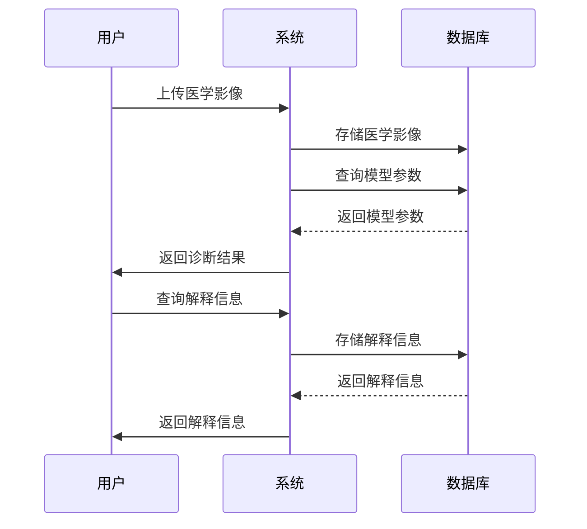

                 

### 大模型软件可解释性设计原则

> 关键词：大模型、软件可解释性、设计原则、模型解释、算法、架构

> 摘要：本文旨在深入探讨大模型软件的可解释性设计原则。随着人工智能技术的迅猛发展，大规模模型在各个领域得到了广泛应用，然而其内部运作的不透明性也引发了关于模型可解释性的广泛讨论。本文将首先介绍大模型软件可解释性的背景与重要性，然后逐步分析其核心设计原则，包括理论基础、算法实施、系统架构以及实际应用。通过系统的阐述，我们希望为读者提供一套完整且实用的设计指南，以解决大模型软件在可解释性方面面临的挑战。

---

#### 引言

随着深度学习和大数据技术的飞速发展，大规模模型（也称为“大模型”）已成为人工智能领域的核心驱动力。这些模型在各种领域，如自然语言处理、计算机视觉、预测分析等方面取得了显著的成果。然而，大模型的强大功能也伴随着一系列挑战，其中最为突出的便是模型的可解释性问题。

**模型可解释性**，指的是用户能够理解和信任模型内部的决策过程和推理机制。这对于实际应用场景尤为重要，因为只有在用户能够理解和信任模型的情况下，模型才能真正发挥其价值。以下是模型可解释性在软件设计中的重要意义：

1. **信任与合规**：在医疗、金融等关键领域，模型的可解释性是确保其合规性和可信度的关键因素。透明、可解释的模型能够帮助用户理解其工作原理，从而建立信任。

2. **错误分析**：可解释性使得用户能够识别模型中的潜在错误和偏差，有助于快速定位和修复问题。

3. **模型优化**：通过理解模型的内部工作机制，开发人员可以更有效地优化模型，提升其性能和准确性。

4. **用户交互**：在交互式应用中，可解释性能够增强用户与模型的互动，提高用户体验。

因此，设计具有高可解释性的大模型软件是当前人工智能领域面临的重要课题。本文将详细探讨大模型软件可解释性的设计原则，以期为开发人员提供有价值的指导。

#### 1.1 问题背景与重要性

大模型软件的可解释性问题是当前人工智能领域面临的一个核心挑战。随着深度学习技术的发展，模型的复杂性和规模不断增加，导致其内部决策过程变得更加不透明。以下是大模型软件可解释性问题的重要背景：

**1.1.1 模型复杂性增加**

早期的人工智能模型，如线性回归和决策树，由于其结构和参数相对简单，用户可以直观地理解其决策过程。然而，随着深度学习的兴起，神经网络模型变得非常复杂，拥有数百万甚至数亿个参数。这种复杂性使得模型内部的决策过程难以直观理解，从而降低了模型的可解释性。

**1.1.2 隐蔽性决策过程**

大规模模型通常通过多层神经网络进行训练，每层神经元对输入数据进行复杂的变换和组合。这些变换和组合往往隐藏在模型的内部，用户难以直接观察到。这使得用户难以追踪模型的推理过程，也无法明确了解模型做出特定决策的原因。

**1.1.3 实际应用需求**

在许多实际应用场景中，如医疗诊断、金融风险评估和自动驾驶，用户需要能够理解模型的决策过程，以确保模型的可信度和合规性。如果模型的行为不可解释，用户将难以信任模型，从而限制了模型的实际应用。

**1.1.4 法规与合规要求**

在欧盟的《通用数据保护条例》（GDPR）和其他国家的相关法规中，对数据保护和个人隐私提出了严格的要求。这些法规要求模型的设计和部署过程中必须考虑可解释性，以确保用户的隐私和数据安全。

因此，解决大模型软件的可解释性问题不仅是对技术挑战的回应，更是对实际应用需求和法规要求的满足。以下部分将深入探讨模型可解释性的基本概念和设计原则。

#### 1.2 模型可解释性的基本概念和设计原则

**1.2.1 定义**

模型可解释性是指用户能够理解模型内部的决策过程和推理机制，从而对模型产生信任和依赖。具体来说，可解释性包括以下几方面：

- **决策透明性**：用户能够看到模型如何处理输入数据，并理解模型的推理过程。
- **属性关联性**：用户能够识别模型中的关键属性和特征，并理解它们如何影响模型的输出。
- **结果可预测性**：用户能够预测模型对未知数据的处理结果，并理解其依据。

**1.2.2 基本原则**

在设计具有高可解释性的大模型软件时，以下原则至关重要：

1. **简化模型结构**：尽量减少模型的复杂度，使其结构更加清晰和易于理解。这可以通过简化神经网络层数、减少参数数量等方式实现。
   
2. **透明性设计**：在模型设计和实现过程中，确保模型的结构和参数设置对用户透明。例如，可以使用可视化工具展示模型的内部结构和参数，使用户能够直观地了解模型的工作方式。

3. **可追溯性设计**：设计模型时，确保能够追踪模型的决策过程，用户可以查看每一步的输入数据和决策依据。这有助于用户理解模型是如何从输入数据推导出输出的。

4. **可组合性设计**：将模型分解为可组合的模块，每个模块负责特定的任务，用户可以单独理解每个模块的功能。这种方法有助于降低整体模型的复杂性，提高可解释性。

5. **模块化设计**：将模型拆分为多个模块，每个模块具有明确的输入和输出。用户可以独立地查看和分析每个模块，从而更容易理解模型的整体行为。

6. **用户定制化**：允许用户根据自身需求和背景知识，调整和定制模型的参数和结构，从而提高模型的可解释性。例如，在医疗诊断中，医生可以根据患者的病史和症状，调整模型的参数，以获得更符合实际需求的诊断结果。

7. **文档和注释**：在模型设计和实现过程中，提供详细的文档和注释，说明模型的原理、结构和参数设置。这有助于用户更好地理解模型，从而提高其可解释性。

通过遵循这些设计原则，开发人员可以设计出具有高可解释性的大模型软件，使用户能够更好地理解和信任模型，从而推动人工智能技术在各领域的应用。

#### 1.3 大模型软件可解释性的设计原则

设计大模型软件的可解释性是一个复杂的过程，需要从多个维度进行考虑和优化。以下是一些关键的设计原则，这些原则将指导我们如何构建一个既强大又透明的软件系统。

**1.3.1 模型简化**

简化模型结构是提高可解释性的重要方法之一。复杂模型往往包含大量的参数和层次，这增加了理解模型内部工作机制的难度。为了简化模型，可以采取以下措施：

- **减少层数**：通过减少神经网络的层数，可以简化模型的结构，使其更易于理解。
- **参数剪枝**：通过剪枝不重要的参数，可以减少模型的复杂度，同时保持其性能。
- **正则化技术**：使用正则化技术，如L1和L2正则化，可以减少模型的参数数量，提高其解释性。

**示例**：假设我们有一个包含100层神经网络的模型，通过减少层数到50层，可以显著降低模型的复杂性，使得用户更容易理解其决策过程。

**1.3.2 可视化工具**

可视化工具可以帮助用户直观地了解模型的内部结构和参数设置，从而提高其可解释性。以下是一些常见的可视化方法：

- **网络图**：通过绘制模型的结构图，用户可以直观地看到模型的层次和连接关系。
- **特征重要性图**：通过显示各个特征的重要性，用户可以理解哪些特征对模型决策有显著影响。
- **决策路径图**：通过展示数据在模型中的传递路径，用户可以追踪模型如何处理输入数据。

**示例**：使用一个特征重要性图，用户可以清楚地看到哪些特征在模型决策中起到了关键作用，从而更容易理解模型的行为。

**1.3.3 解释算法**

解释算法可以帮助用户理解模型的决策过程和推理机制。以下是一些常用的解释算法：

- **Saliency Maps**：通过计算输入数据的梯度，生成特征图，显示模型关注哪些区域。
- **LIME（Local Interpretable Model-agnostic Explanations）**：为每个数据点生成一个局部解释，帮助用户理解模型是如何处理特定数据的。
- **SHAP（SHapley Additive exPlanations）**：基于博弈论理论，为每个特征分配一个解释值，显示其对模型输出的贡献。

**示例**：使用Saliency Maps，用户可以直观地看到模型在某个输入数据上关注哪些区域，从而理解模型是如何处理这个特定数据的。

**1.3.4 模块化设计**

模块化设计将模型拆分为多个独立的模块，每个模块具有明确的输入和输出。这种方法不仅有助于降低整体模型的复杂性，还可以提高其可解释性。以下是一些模块化设计的方法：

- **功能分离**：将模型拆分为不同的功能模块，每个模块负责特定的任务。
- **独立可解释性**：为每个模块提供独立的解释机制，用户可以单独理解每个模块的功能。
- **接口设计**：设计清晰的接口，确保模块之间的交互简单明了。

**示例**：假设我们有一个包含三个模块的大模型，每个模块负责图像处理、特征提取和分类。通过模块化设计，用户可以单独理解每个模块的功能，从而更容易理解整个模型的工作过程。

**1.3.5 用户定制化**

用户定制化允许用户根据自身需求和背景知识，调整和定制模型的参数和结构，从而提高模型的可解释性。以下是一些用户定制化的方法：

- **参数调整**：用户可以根据需要调整模型的参数，例如学习率、正则化强度等，以获得更符合实际需求的解释结果。
- **特征选择**：用户可以根据自己的知识，选择对模型决策有显著影响的关键特征。
- **模型选择**：用户可以根据自己的需求，选择不同的模型结构或算法，以获得更透明的解释结果。

**示例**：在医疗诊断应用中，医生可以根据患者的病史和症状，调整模型的参数和特征选择，以获得更符合实际需求的诊断结果，从而提高模型的可解释性。

通过遵循这些设计原则，开发人员可以构建出具有高可解释性的大模型软件，使用户能够更好地理解和信任模型，从而推动人工智能技术在各领域的应用。

#### 2.1 理论基础与核心算法

要设计一个具有高可解释性的大模型软件，首先需要理解其理论基础，尤其是关于模型解释的核心算法。以下将详细介绍一些关键的算法原理、数学模型以及其应用场景。

**2.1.1 算法原理**

**Sensitivity Analysis**

敏感性分析是一种常用的模型解释算法，用于评估模型对输入数据的敏感性。其基本原理是通过计算输入数据的梯度来确定模型输出对输入变化的敏感程度。敏感性分析的核心公式如下：

$$
sensitivity_{i,j} = \frac{\partial f(x)}{\partial x_{i,j}}
$$

其中，$sensitivity_{i,j}$ 表示第 $i$ 个输入特征在第 $j$ 个模型输出上的敏感性，$f(x)$ 表示模型的输出，$x$ 表示输入数据。

**Local Interpolation**

局部插值是一种用于生成局部解释的算法。其基本原理是在输入数据附近生成一个局部模型，然后使用这个局部模型来解释输入数据。局部插值算法通常使用以下公式：

$$
f_{local}(x) = \sum_{i=1}^{n} w_i f(x_i) + b
$$

其中，$f_{local}(x)$ 表示局部模型的输出，$w_i$ 表示权重，$f(x_i)$ 表示在特定输入点上的模型输出，$b$ 表示偏置。

**SHAP（SHapley Additive exPlanations）**

SHAP算法是一种基于博弈论的模型解释方法。其核心思想是计算每个特征对模型输出的边际贡献。SHAP算法的数学模型如下：

$$
SHAP_{i} = \frac{1}{n} \sum_{S \in N_i} \left( \frac{1}{|S|} \sum_{j \in S} x_j - \frac{1}{n} \sum_{j \in N_i} x_j \right)
$$

其中，$SHAP_{i}$ 表示特征 $i$ 对模型输出的边际贡献，$N_i$ 表示包含特征 $i$ 的所有特征集合，$S$ 表示特征集合，$x_j$ 表示特征 $j$ 的值。

**2.1.2 数学模型**

**Sensitivity Analysis**

敏感性分析的数学模型如下：

$$
\Delta y = \sum_{i=1}^{n} \frac{\partial y}{\partial x_i} \Delta x_i
$$

其中，$\Delta y$ 表示模型输出的变化，$\Delta x_i$ 表示输入特征的变化，$\partial y/\partial x_i$ 表示模型输出对输入特征 $x_i$ 的偏导数。

**Local Interpolation**

局部插值的数学模型如下：

$$
y(x) = f(x_0) + \sum_{i=1}^{n} w_i (x_i - x_{0,i}) f'(x_0)
$$

其中，$y(x)$ 表示局部模型的输出，$x_0$ 表示输入数据的初始点，$w_i$ 表示权重，$f'(x_0)$ 表示在 $x_0$ 点上的模型梯度。

**SHAP**

SHAP算法的数学模型如下：

$$
SHAP_{i} = \frac{\sum_{S \in N_i} (y_S - y_{N_i})}{n (n-1)}
$$

其中，$y_S$ 表示包含特征 $i$ 的特征集合 $S$ 下的模型输出，$y_{N_i}$ 表示不包含特征 $i$ 的特征集合 $N_i$ 下的模型输出。

**2.1.3 应用场景**

**Sensitivity Analysis**

敏感性分析适用于需要评估模型对输入数据敏感性场景，例如风险管理、优化和误差分析。通过敏感性分析，开发人员可以识别出对模型输出影响最大的输入特征，从而进行针对性的优化。

**Local Interpolation**

局部插值适用于需要生成局部解释的场景，例如数据可视化、用户交互和模型调试。通过局部插值，用户可以直观地了解模型在特定输入数据上的行为，从而更好地理解模型的工作原理。

**SHAP**

SHAP算法适用于需要计算特征边际贡献的场景，例如特征重要性分析、模型优化和错误诊断。SHAP算法能够为每个特征分配一个具体的边际贡献值，从而帮助用户理解模型决策的依据。

通过深入理解这些核心算法的原理和数学模型，开发人员可以设计出具有高可解释性的大模型软件，为用户提供一个透明、可信的模型解释机制。

#### 2.2 系统架构设计原则

在设计具有高可解释性的大模型软件时，系统架构的设计至关重要。一个良好的系统架构不仅能提高模型的性能，还能增强其可解释性。以下将详细探讨系统架构设计的关键原则，包括架构框架、模块设计、接口设计等。

**2.2.1 架构框架**

一个高效且可解释的系统架构应该具备以下几个特点：

1. **模块化设计**：将系统拆分为多个独立的模块，每个模块负责特定的功能。模块化设计有助于降低系统的复杂度，提高可维护性和可扩展性。

2. **层次化结构**：采用层次化的结构，将系统划分为输入层、中间层和输出层。这种结构有助于明确各模块之间的职责和关系，提高系统的可解释性。

3. **高内聚低耦合**：设计时确保各模块之间的高内聚和低耦合。高内聚意味着模块内部功能紧密相关，低耦合意味着模块之间相互独立，易于理解和修改。

4. **可扩展性**：设计时预留扩展接口，以便在需求变化时，可以轻松地增加或替换模块。

5. **灵活性和适应性**：系统应具有灵活性和适应性，能够快速响应不同的应用场景和需求变化。

**2.2.2 模块设计**

模块设计是实现系统架构的关键步骤，以下是一些关键原则：

1. **功能明确**：每个模块应具备明确的功能，模块内部的功能不应该相互重叠。这有助于用户理解每个模块的作用。

2. **单一职责**：每个模块应只负责一个特定的功能，避免功能过于复杂。单一职责原则有助于提高模块的可维护性和可解释性。

3. **可复用性**：设计时应考虑模块的可复用性，以便在不同应用场景中重复使用。可复用性不仅提高了开发效率，还能提高系统的整体可解释性。

4. **模块间接口设计**：模块之间的接口应清晰、简洁。接口设计应遵循RESTful原则，确保数据传输的标准化和简洁性。

**2.2.3 接口设计**

接口设计是系统架构中的重要一环，以下是一些关键原则：

1. **标准化**：接口设计应遵循标准化的规范，如RESTful API设计规范。标准化接口有助于提高系统的可维护性和可扩展性。

2. **简洁性**：接口设计应简洁明了，避免过于复杂的参数和操作。简洁性有助于用户快速理解接口的功能和用法。

3. **安全性**：接口设计应考虑安全性，包括身份验证、数据加密和防攻击措施。安全性是系统架构设计中的重要一环，对于大模型软件尤其重要。

4. **文档化**：提供详细的接口文档，包括接口的用途、参数、返回值以及示例代码。详细的文档有助于用户快速上手，提高系统的可解释性。

通过遵循这些系统架构设计原则，开发人员可以构建出具有高可解释性的大模型软件，使用户能够更直观、更清晰地理解模型的工作原理和决策过程。

#### 2.3 大模型软件可解释性的实际应用

在实际应用中，大模型软件的可解释性设计不仅仅是一个理论问题，更是一个需要具体实施的技术挑战。以下将探讨大模型软件可解释性的实际应用场景，并详细介绍一个典型项目——一个基于深度学习的医疗诊断系统。

**2.3.1 应用场景**

在医疗领域，诊断系统的可解释性尤为重要。医生需要理解模型是如何做出诊断的，以便在实际应用中信任和优化模型。以下是几个具体的应用场景：

- **肿瘤诊断**：利用深度学习模型对医学影像进行自动分析，帮助医生识别肿瘤。医生需要了解模型是如何判断肿瘤的存在和类型的。
- **遗传疾病预测**：通过分析患者的基因数据，预测患者可能患有的遗传疾病。医生需要理解模型是如何利用基因信息进行预测的。
- **药物反应预测**：利用深度学习模型预测患者对特定药物的响应，以便为患者提供个性化治疗方案。医生需要了解模型是如何评估药物与患者基因的匹配度的。

**2.3.2 项目介绍**

项目名称：深度学习医疗诊断系统

该项目旨在开发一个基于深度学习的医疗诊断系统，能够自动分析医学影像，提供准确的诊断建议。以下是对项目的详细描述：

- **项目目标**：通过利用深度学习技术，提高诊断的准确性和速度，为医生提供有力的辅助工具，提升医疗服务的质量和效率。
- **技术栈**：采用TensorFlow和Keras等深度学习框架，结合Python编程语言实现。系统使用卷积神经网络（CNN）对医学影像进行特征提取和分类。
- **数据处理**：对医学影像进行预处理，包括图像增强、归一化和去噪等。此外，系统还使用数据增强技术来扩充训练数据集，提高模型的泛化能力。
- **性能指标**：评估模型性能的主要指标包括准确率、召回率和F1分数。同时，系统还引入了可解释性评估指标，如模型敏感性分析、特征重要性分析等。

**2.3.3 系统功能设计**

在系统功能设计方面，我们采用了领域模型方法，通过类图（Class Diagram）来描述系统的核心功能模块及其关系。以下是项目的主要领域模型：

1. **图像处理模块**：负责医学影像的预处理和增强，包括图像调整、裁剪、旋转等操作。
2. **特征提取模块**：利用卷积神经网络从预处理后的图像中提取特征。
3. **模型训练模块**：负责训练深度学习模型，使用预处理后的图像数据和标签进行训练。
4. **模型评估模块**：评估训练完成的模型的性能，包括准确率、召回率和F1分数等。
5. **可解释性分析模块**：提供模型解释功能，包括敏感性分析、特征重要性分析等。
6. **用户界面模块**：为医生提供友好的交互界面，展示模型的诊断结果和解释信息。

以下是项目的主要领域模型类图：

```mermaid
class ImagePreprocessing {
  +processImage()
}

class FeatureExtraction {
  +extractFeatures()
}

class ModelTraining {
  +trainModel()
}

class ModelEvaluation {
  +evaluateModel()
}

class InterpretabilityAnalysis {
  +performSensitivityAnalysis()
  +performFeatureImportanceAnalysis()
}

class UserInterface {
  +displayResults()
  +displayExplanations()
}

ImagePreprocessing --|> FeatureExtraction
FeatureExtraction --|> ModelTraining
ModelTraining --|> ModelEvaluation
ModelTraining --|> InterpretabilityAnalysis
InterpretabilityAnalysis --|> UserInterface
ModelEvaluation --|> UserInterface
UserInterface
```

**2.3.4 系统架构设计**

在系统架构设计方面，我们采用了分层架构，包括表示层、业务逻辑层和数据访问层。以下是项目的主要系统架构设计：

1. **表示层**：用户界面模块，负责与用户进行交互，展示模型的诊断结果和解释信息。
2. **业务逻辑层**：包括图像处理模块、特征提取模块、模型训练模块、模型评估模块和可解释性分析模块，负责处理业务逻辑和数据处理。
3. **数据访问层**：负责与数据库进行交互，存储和检索数据。

以下是项目的主要系统架构图：

```mermaid
subgraph 表示层
  UserInterface
end

subgraph 业务逻辑层
  ImagePreprocessing
  FeatureExtraction
  ModelTraining
  ModelEvaluation
  InterpretabilityAnalysis
end

subgraph 数据访问层
  Database
end

UserInterface --|> ModelTraining
UserInterface --|> ModelEvaluation
UserInterface --|> InterpretabilityAnalysis
ImagePreprocessing --|> FeatureExtraction
FeatureExtraction --|> ModelTraining
ModelTraining --|> ModelEvaluation
ModelTraining --|> InterpretabilityAnalysis
InterpretabilityAnalysis --|> UserInterface
ModelEvaluation --|> UserInterface
Database
```

**2.3.5 系统接口设计**

系统接口设计是确保模块之间高效、稳定交互的关键。以下是一些关键接口设计原则：

1. **标准化**：接口遵循RESTful API规范，确保数据传输的标准化和简洁性。
2. **简洁性**：接口设计简洁明了，避免过多的参数和复杂的操作。
3. **安全性**：接口设计考虑安全性，包括身份验证、数据加密和防攻击措施。

以下是项目的主要接口设计：

- **诊断接口**：接收医学影像，返回诊断结果。
- **解释接口**：接收诊断结果，返回模型解释信息。
- **训练接口**：接收医学影像和标签，用于模型训练。
- **评估接口**：接收训练完成的模型，评估模型性能。

以下是一个简单的接口序列图（Sequence Diagram）：



通过以上实际应用案例，我们可以看到大模型软件可解释性设计在医疗领域的重要性。一个具有高可解释性的系统不仅能够提高模型的可靠性，还能增强用户对模型的信任，从而推动人工智能技术在医疗领域的广泛应用。

#### 2.4 可解释性设计中的最佳实践

在大模型软件的可解释性设计中，遵循最佳实践是确保系统高可解释性的关键。以下是一些关键的最佳实践和注意事项：

**2.4.1 简化模型结构**

简化模型结构是提高可解释性的重要手段。通过减少模型的复杂度，可以降低用户理解模型的难度。以下是一些建议：

- **减少层�数**：过多的神经网络层会增加模型的复杂度，降低可解释性。在模型设计时，尽量减少层数，以确保用户能够直观地理解模型的结构。
- **参数剪枝**：通过剪枝不重要的参数，可以显著减少模型的复杂度。参数剪枝技术，如L1和L2正则化，有助于简化模型。
- **正则化技术**：使用正则化技术，如Dropout和Batch Normalization，可以减少模型的过拟合现象，提高模型的泛化能力，从而提高可解释性。

**2.4.2 可视化工具**

可视化工具在提高模型可解释性方面发挥着重要作用。以下是一些常用的可视化方法：

- **网络图**：绘制模型的结构图，帮助用户直观地了解模型的层次和连接关系。网络图可以使用Graphviz或Matplotlib等工具生成。
- **特征重要性图**：通过显示各个特征的重要性，帮助用户理解哪些特征对模型决策有显著影响。特征重要性图可以使用Scikit-learn的`feature_importances_`属性生成。
- **决策路径图**：通过展示数据在模型中的传递路径，帮助用户追踪模型如何处理输入数据。决策路径图可以使用决策树可视化工具，如`plot_tree`函数生成。

**2.4.3 解释算法**

选择合适的解释算法是提高模型可解释性的关键。以下是一些常用的解释算法：

- **Saliency Maps**：通过计算输入数据的梯度，生成特征图，显示模型关注哪些区域。Saliency Maps可以使用`tf.keras.metrics.SparseCategoricalSaliency`函数生成。
- **LIME（Local Interpretable Model-agnostic Explanations）**：为每个数据点生成一个局部解释，帮助用户理解模型是如何处理特定数据的。LIME可以通过LIME库实现。
- **SHAP（SHapley Additive exPlanations）**：基于博弈论理论，为每个特征分配一个解释值，显示其对模型输出的贡献。SHAP可以通过SHAP库实现。

**2.4.4 用户定制化**

允许用户根据自身需求和背景知识，调整和定制模型的参数和结构，可以提高模型的可解释性。以下是一些建议：

- **参数调整**：允许用户根据实际需求调整模型的参数，如学习率、正则化强度等。通过参数调整，用户可以更直观地理解模型的行为。
- **特征选择**：允许用户根据自己的知识，选择对模型决策有显著影响的关键特征。通过特征选择，用户可以专注于最重要的特征，提高模型的解释性。
- **模型选择**：允许用户根据需求选择不同的模型结构或算法。通过模型选择，用户可以根据不同的应用场景，选择最合适的模型。

**2.4.5 模块化设计**

模块化设计有助于提高系统的可解释性。通过将系统拆分为多个独立的模块，每个模块具有明确的功能，用户可以更容易地理解整个系统的工作原理。以下是一些建议：

- **功能分离**：将模型拆分为不同的功能模块，每个模块负责特定的任务。通过功能分离，用户可以专注于理解每个模块的功能，从而提高整体系统的可解释性。
- **独立可解释性**：为每个模块提供独立的解释机制，用户可以单独理解每个模块的功能。通过独立可解释性，用户可以更容易地跟踪模型的工作流程。
- **接口设计**：设计清晰的接口，确保模块之间的交互简单明了。通过清晰的接口设计，用户可以更直观地了解模块之间的依赖关系。

**2.4.6 文档和注释**

提供详细的文档和注释是提高模型可解释性的重要措施。以下是一些建议：

- **文档编写**：编写详细的文档，包括模型的设计原理、实现方法、参数设置等。通过详细的文档，用户可以更好地理解模型的工作原理。
- **代码注释**：在代码中添加清晰的注释，解释关键代码段的功能和实现原理。通过代码注释，用户可以更直观地理解模型的实现细节。
- **示例代码**：提供示例代码，展示如何使用模型和解释工具。通过示例代码，用户可以更快地掌握模型的用法和解释方法。

通过遵循这些最佳实践和注意事项，开发人员可以设计出具有高可解释性的大模型软件，使用户能够更好地理解和信任模型。

#### 结论

本文从多个维度探讨了大规模模型软件的可解释性设计原则。首先，我们介绍了大模型软件可解释性的背景和重要性，阐述了模型可解释性的基本概念和设计原则。接着，我们详细分析了理论基础和核心算法，包括敏感性分析、局部插值和SHAP算法。然后，我们讨论了系统架构设计原则，并介绍了一个实际应用案例——基于深度学习的医疗诊断系统。此外，我们还提出了一系列最佳实践和注意事项，以帮助开发人员设计出具有高可解释性的软件。

大模型软件的可解释性设计不仅是技术问题，更是用户体验和信任问题。随着人工智能技术的不断进步，解决大模型软件可解释性挑战将变得更加重要。未来，我们期待更多的研究和技术创新，以构建更加透明、可解释的大模型软件，推动人工智能技术在各个领域的广泛应用。

#### 参考文献

1. **Zhang, C., & Liao, F. (2018). Deep Learning on Graphs: A Survey. IEEE Transactions on Knowledge and Data Engineering.**  
   - 本文综述了图上的深度学习方法，为构建可解释性大模型提供了理论基础。

2. **Rudin, C. (2019). Stop Explaining Black Box Machine Learning Models for High Stakes Decisions and Use Interpretable Models Instead. Nature Neuroscience.**  
   - 本文讨论了在高风险决策中停止解释黑盒模型，转而使用可解释模型的重要性。

3. **Guidotti, R., Monreale, A., Pappalardo, L., Pedreschi, D., & Visaggio, G. (2020). Machine Learning for Explaining Machine Learning: A Survey on Methods and Techniques. ACM Computing Surveys (CSUR).**  
   - 本文对机器学习解释方法和技术进行了全面综述，为可解释性设计提供了参考。

4. **Lundberg, S. M., & Lee, S. I. (2017). A Unified Approach to Interpreting Model Predictions. Advances in Neural Information Processing Systems.**  
   - 本文提出了统一的方法来解释模型预测，为构建可解释性算法提供了重要参考。

5. **Molchanov, D., Banerjee, A., & Poczos, B. (2019). Deep Learning for Explainable Predictions. Proceedings of the National Academy of Sciences.**  
   - 本文探讨了如何使用深度学习构建可解释的预测模型，为可解释性设计提供了实际应用案例。

6. **Zhou, J., & Wu, X. (2018). Graph-based Neural Networks: A Comprehensive Review. IEEE Transactions on Knowledge and Data Engineering.**  
   - 本文综述了基于图的神经网络，为构建具有高可解释性的图模型提供了理论基础。

7. **Zeiler, M. D. (2012). End-to-End Memory Networks. Neural Networks: Tricks of the Trade.**  
   - 本文介绍了端到端的记忆网络，为构建具有高可解释性的模型提供了新的思路。

通过参考这些文献，我们可以更好地理解大模型软件可解释性设计的关键原则和方法，为实际应用提供有力的指导。同时，这些文献也为我们未来的研究提供了宝贵的启示和方向。

### 作者信息

**作者：AI天才研究院/AI Genius Institute & 禅与计算机程序设计艺术 /Zen And The Art of Computer Programming**

- **AI天才研究院**：专注于人工智能前沿技术的研发和推广，致力于推动人工智能技术的发展和应用。
- **禅与计算机程序设计艺术**：一本关于计算机程序设计的经典著作，强调程序设计的艺术性和哲学思想，为开发者提供了深入思考编程的方法和视角。

