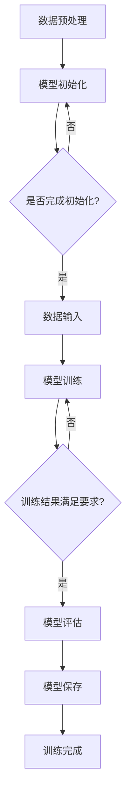
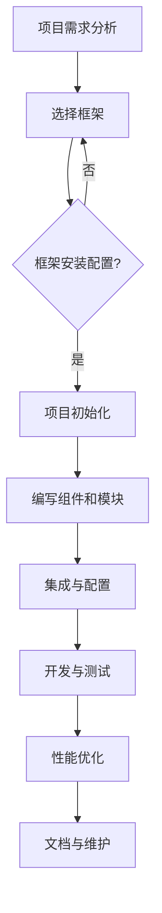

                 

## 大模型软件与响应式编程模式概述

### 第1章: 大模型软件与响应式编程概念理解

#### 1.1 问题背景与概念引入

**问题背景**：随着计算机科学和人工智能技术的飞速发展，大模型软件在各个领域中的应用变得愈加广泛。这些大模型软件通常需要处理海量数据、复杂的算法和高度并行的计算任务，例如人工智能领域中的深度学习模型、数据分析中的大规模数据处理系统以及自动化系统中的复杂控制算法等。大模型软件在提升生产效率、优化决策过程、增强系统智能性等方面发挥着关键作用。

然而，传统编程范式在应对这些复杂任务时往往显得力不从心，难以满足高性能和高可维护性的需求。这就促使了新的编程范式的出现，其中响应式编程模式因其强大的动态响应能力和高度可扩展性，逐渐成为开发大模型软件的重要手段。

**概念引入**：响应式编程是一种编程范式，其核心思想是“数据驱动”。在响应式编程中，程序的状态变化是由外部事件或内部数据变化触发的，程序会自动响应这些变化，并更新相应的界面或状态。与传统编程范式相比，响应式编程具有以下几个显著特点：

1. **数据绑定**：在响应式编程中，数据和界面是高度绑定的。当数据发生变化时，界面会自动更新，无需手动操作。
2. **事件驱动**：响应式编程是基于事件驱动的，程序的状态变化由事件触发，这使得程序具有更好的灵活性和可扩展性。
3. **声明式编程**：响应式编程强调声明式编程，开发者只需描述系统的状态和预期行为，而不必关心具体的执行过程。

响应式编程的出现，不仅为开发者提供了更加灵活和高效的开发模式，也大大提升了软件系统的性能和可维护性。

#### 1.1.1 大模型软件的定义

**定义**：大模型软件是指使用大型复杂模型（如深度学习模型）的软件系统，通常涉及大规模数据集和高性能计算资源。这些模型通常具有高度的非线性性和复杂的参数结构，需要通过大规模数据训练和优化来提高其性能和准确性。

**重要性**：大模型软件在人工智能、数据分析、自动化等领域具有重要意义，主要体现在以下几个方面：

1. **人工智能领域**：大模型软件为人工智能系统提供了强大的计算能力，使得机器能够处理更复杂的任务，如图像识别、自然语言处理、自动驾驶等。
2. **数据分析领域**：大模型软件能够高效处理大规模数据集，挖掘出隐藏在数据中的有价值信息，为企业和组织提供决策支持。
3. **自动化领域**：大模型软件能够实现自动化系统的智能控制，提高生产效率和质量，减少人力成本。

总之，大模型软件的出现和发展，为各个领域的技术进步提供了强大动力，也带来了新的挑战和机遇。

#### 1.1.2 响应式编程的核心原理

**原理**：响应式编程的核心原理可以归纳为以下几点：

1. **数据绑定**：数据绑定是响应式编程的核心机制。它确保了数据和界面之间的同步。当数据发生变化时，界面会自动更新；反之，当界面发生变化时，数据也会自动更新。
2. **事件驱动**：响应式编程是基于事件驱动的。系统会监听各种事件，如鼠标点击、键盘输入等，并在事件发生时触发相应的处理逻辑。
3. **声明式编程**：在响应式编程中，开发者通过声明式的方式来描述系统的行为和状态，而不需要关心具体的实现细节。这使得代码更加简洁、可维护，也提高了开发效率。

**特性**：响应式编程相对于传统编程范式具有以下优势：

1. **异步处理**：响应式编程框架通常具有强大的异步处理能力，能够高效处理并发任务，提高系统的性能和响应速度。
2. **可维护性**：响应式编程通过数据绑定和声明式编程，使得代码更加简洁和可维护，降低了代码出错的可能性。
3. **可扩展性**：响应式编程模式使得系统具有更高的可扩展性，便于添加新功能或进行系统升级。

总之，响应式编程模式为开发者提供了一种更加灵活、高效和可维护的编程方式，特别适用于开发大模型软件。

#### 1.2 大模型软件中的响应式编程模式

**模式概述**：在大模型软件中，常见的响应式编程模式包括观察者模式、发布-订阅模式等。这些模式能够有效地处理大模型软件中的复杂事件和数据流，提高系统的响应速度和可维护性。

**应用场景**：

1. **观察者模式**：观察者模式是一种一对多的依赖关系，当一个对象状态发生变化时，会自动通知所有依赖它的对象。在大模型软件中，观察者模式可以用于实现模型训练过程中的状态更新通知，如训练进度、模型参数更新等。
   
2. **发布-订阅模式**：发布-订阅模式是一种基于消息队列的异步通信模式，允许发布者和订阅者之间解耦。在大模型软件中，发布-订阅模式可以用于实现不同模块之间的消息传递，如数据预处理模块与训练模块之间的数据传递。

#### 1.2.1 观察者模式

**定义**：观察者模式是一种设计模式，定义了对象间的一对多依赖关系，当一个对象的状态发生变化时，所有依赖它的对象都会得到通知并自动更新。

**特点**：

- **解耦**：观察者模式使得观察者和被观察者之间的依赖关系解耦，提高了系统的灵活性和可维护性。
- **易于扩展**：通过引入新的观察者，可以方便地扩展系统的功能，无需修改原有代码。

**应用**：在大模型软件中，观察者模式可以用于实现训练过程中的状态更新通知。例如，在深度学习模型的训练过程中，可以设置一个观察者来监听训练进度，并在训练进度发生变化时更新用户界面，显示训练进度。

#### 1.2.2 发布-订阅模式

**定义**：发布-订阅模式是一种消息传递模式，发布者和订阅者之间通过消息队列进行通信。发布者将消息发布到消息队列中，订阅者从中获取消息进行处理。

**特点**：

- **解耦**：发布者和订阅者之间无需直接通信，可以通过消息队列进行通信，降低了系统的耦合度。
- **灵活性**：发布者和订阅者可以在不同的时间和地点进行通信，提高了系统的灵活性。

**应用**：在大模型软件中，发布-订阅模式可以用于实现不同模块之间的消息传递。例如，在数据预处理模块和训练模块之间，可以使用发布-订阅模式进行数据传递，从而实现模块间的解耦。

#### 1.3 本章小结

本章回顾了响应式编程和大模型软件的基本概念及其在开发中的应用。通过介绍响应式编程的核心原理和常见模式，我们了解了如何利用响应式编程模式提高大模型软件的开发效率和质量。响应式编程模式，如观察者模式和发布-订阅模式，为开发者提供了强大的工具，使得大模型软件的开发更加灵活、高效和可维护。随着响应式编程技术的不断发展，其在大模型软件中的应用前景将更加广阔。在接下来的章节中，我们将深入探讨响应式编程框架的选择和应用，为大模型软件的开发提供更具体的指导。

### 第2章: 大模型软件的响应式编程框架

#### 2.1 响应式编程框架的选择

随着响应式编程在大模型软件开发中的重要性日益凸显，选择合适的响应式编程框架成为开发者面临的关键问题。不同的响应式编程框架在性能、社区支持、学习曲线等方面各有特点，因此，选择合适的框架需要综合考虑多种因素。

**框架概述**：

目前，常见的响应式编程框架包括React、Vue和Angular。这些框架各具特色，适用于不同的应用场景。

1. **React**：由Facebook开发，采用虚拟DOM和组件化设计，具有高性能和灵活的组件复用能力。React适合大型项目，特别是在需要高度动态交互的场合，如社交网络、电商平台等。
   
2. **Vue**：由尤雨溪开发，是一款轻量级的响应式前端框架，具有双向数据绑定、虚拟DOM和响应式设计等特点。Vue适合中小型项目，尤其是在需要快速开发和简化流程的场景，如个人博客、后台管理系统等。

3. **Angular**：由Google开发，是一款功能强大的全栈框架，具有数据绑定、依赖注入和模块化设计等特点。Angular适合企业级应用，尤其是在需要复杂功能和高度可维护性的场景，如金融系统、大型电商平台等。

**选择标准**：

在选择响应式编程框架时，需要考虑以下几个关键因素：

1. **性能**：框架的性能直接影响到大模型软件的运行效率。开发者需要评估框架的渲染速度、内存占用和响应速度等性能指标。
   
2. **社区支持**：强大的社区支持可以帮助开发者快速解决问题、获取最佳实践和最新的技术动态。一个活跃的社区意味着有更多的资源和文档可供参考。

3. **学习曲线**：学习曲线反映了开发者掌握框架的难易程度。对于大模型软件项目，选择一个易于学习和上手的框架可以减少开发时间和成本。

#### 2.1.1 React

**框架特点**：

React作为目前最受欢迎的前端框架之一，其核心特点包括：

1. **虚拟DOM**：React通过虚拟DOM来提高渲染性能。虚拟DOM是一种在内存中构建的DOM结构，只有当实际DOM需要更新时，才会进行实际的DOM操作，从而减少了不必要的计算和DOM操作，提高了渲染速度。

2. **组件化**：React采用组件化设计，将UI划分为可复用的组件。每个组件都有自己的状态和行为，便于管理和维护。组件化设计提高了代码的可维护性和可复用性。

3. **单向数据流**：React的数据流是单向的，从父组件传递到子组件，避免了传统多层数据传递中的复杂性。这种单向数据流使得状态管理更加简单和清晰。

**应用场景**：

React适合大型项目，特别是在需要高度动态交互的场合，如社交网络、电商平台等。以下是一些典型的应用场景：

1. **社交网络应用**：React的高性能和灵活性使得它非常适合构建需要实时更新和动态交互的社交网络应用，如Facebook、Instagram等。

2. **电商平台**：电商平台通常需要处理大量的动态数据和用户交互，React的虚拟DOM和组件化设计能够显著提高页面的响应速度和用户体验。

3. **复杂单页面应用**：React的组件化设计和单向数据流使得它非常适合构建复杂单页面应用（SPA），如邮件客户端、项目管理工具等。

#### 2.1.2 Vue

**框架特点**：

Vue是一款轻量级的前端框架，其核心特点包括：

1. **双向数据绑定**：Vue采用双向数据绑定机制，实现了数据和视图的实时同步。这种机制使得开发者无需手动管理数据状态，降低了开发复杂度。

2. **虚拟DOM**：Vue同样采用虚拟DOM来优化渲染性能。虚拟DOM允许Vue在内存中构建一个与实际DOM结构一致的副本，只有当数据发生变化时，才会进行实际的DOM操作，从而提高了渲染速度。

3. **响应式设计**：Vue的响应式设计使得组件的状态变化能够自动触发视图更新，开发者无需关心内部实现细节。

**应用场景**：

Vue适合中小型项目，特别是在需要快速开发和简化流程的场景，如个人博客、后台管理系统等。以下是一些典型的应用场景：

1. **个人博客**：Vue的快速开发和简单上手使得它非常适合构建个人博客，如VitePress、VuePress等。

2. **后台管理系统**：后台管理系统通常需要处理复杂的数据和用户交互，Vue的双向数据绑定和虚拟DOM特性能够显著提高开发效率。

3. **内部工具**：Vue的轻量级特性使其非常适合构建内部工具和应用，如数据报表、数据分析工具等。

#### 2.1.3 Angular

**框架特点**：

Angular是一款功能强大的全栈框架，其核心特点包括：

1. **数据绑定**：Angular采用双向数据绑定机制，实现了数据和视图的实时同步。这种机制使得开发者能够轻松管理应用的状态，提高了开发效率。

2. **依赖注入**：Angular的依赖注入机制使得组件之间的依赖关系更加清晰和可管理。依赖注入还使得组件的重用和测试变得更加简单。

3. **模块化**：Angular通过模块化设计，将应用划分为多个模块，使得代码更加结构化和可维护。模块化设计还提高了应用的测试性和可扩展性。

**应用场景**：

Angular适合企业级应用，特别是在需要复杂功能和高度可维护性的场景，如金融系统、大型电商平台等。以下是一些典型的应用场景：

1. **金融系统**：金融系统通常需要处理复杂的数据和业务逻辑，Angular的模块化和依赖注入机制能够显著提高代码的可维护性和可扩展性。

2. **大型电商平台**：大型电商平台通常具有复杂的用户交互和数据管理需求，Angular的功能强大和性能优异能够满足这些需求。

3. **内部管理系统**：内部管理系统通常需要处理大量的数据和处理复杂的业务逻辑，Angular的模块化和依赖注入机制能够提高开发效率和系统稳定性。

#### 2.2 响应式编程框架的应用

**集成与配置**：

在实际应用中，集成和配置响应式编程框架是开发大模型软件的关键步骤。以下是常见的集成和配置步骤：

1. **环境搭建**：首先需要搭建开发环境，包括Node.js、npm或其他依赖管理工具。
2. **框架安装**：通过npm或其他依赖管理工具安装所选的响应式编程框架，如React、Vue或Angular。
3. **项目初始化**：使用框架提供的脚手架工具或命令初始化项目结构，如create-react-app、vue-cli或ng new。
4. **配置文件**：根据项目需求配置框架的配置文件，如webpack配置、vue.config.js或angular.json等。

**最佳实践**：

在开发大模型软件时，以下最佳实践有助于提高开发效率和代码质量：

1. **代码模块化**：将代码划分为多个模块，每个模块负责一个独立的功能，便于管理和维护。
2. **状态管理**：合理设计状态管理方案，如使用Redux、Vuex或Angular的Service，确保状态的一致性和可维护性。
3. **性能优化**：关注性能优化，如减少重渲染、使用懒加载、缓存等，提高应用的响应速度和用户体验。

**案例分析**：

以下是一些使用响应式编程框架构建的大模型软件项目案例：

1. **React案例**：一个使用React构建的大型电商平台，通过虚拟DOM和组件化设计实现了高性能和高质量的界面交互。
2. **Vue案例**：一个使用Vue构建的个人博客系统，通过双向数据绑定和虚拟DOM提高了开发效率和用户体验。
3. **Angular案例**：一个使用Angular开发的金融系统，通过模块化和依赖注入实现了复杂业务逻辑的高效管理和维护。

#### 2.3 本章小结

本章详细介绍了大模型软件中常用的响应式编程框架，包括React、Vue和Angular，分析了这些框架的特点、应用场景和最佳实践。通过选择合适的响应式编程框架，开发者能够更加高效地构建高性能、高可维护性的大模型软件。随着响应式编程技术的发展，其在大模型软件中的应用将更加广泛，为开发者带来更多机遇和挑战。在接下来的章节中，我们将进一步探讨大模型软件的响应式编程实践，为开发者提供更加具体的指导和经验分享。

### 第3章: 大模型软件的响应式编程实践

#### 3.1 响应式编程实践概述

响应式编程在大模型软件中的应用不仅能够提高开发效率，还能够提升软件系统的性能和可维护性。因此，深入理解和实践响应式编程是开发者在大模型软件开发中的重要任务。在这一节中，我们将详细探讨响应式编程实践的各个方面，包括其意义、目标以及具体的实践步骤。

**实践意义**：

响应式编程在大模型软件中的应用具有以下几个显著意义：

1. **提升开发效率**：响应式编程通过数据绑定和事件驱动的方式，减少了手动管理状态的复杂性，使得开发者可以更加专注于业务逻辑的实现，从而提高了开发效率。

2. **提高系统性能**：响应式编程框架通常具备高效的渲染引擎和异步处理能力，能够减少页面的重绘次数，提高系统的响应速度和性能。

3. **增强可维护性**：响应式编程通过组件化和模块化设计，使得代码更加简洁和模块化，降低了代码的复杂度，提高了系统的可维护性。

**实践目标**：

在大模型软件的响应式编程实践中，我们设定以下目标：

1. **高效的状态管理**：实现高效的状态管理，确保数据的一致性和实时更新。

2. **优化的性能表现**：通过性能优化策略，提高系统的响应速度和用户体验。

3. **良好的可扩展性**：设计可扩展的架构，便于添加新功能或进行系统升级。

**实践步骤**：

响应式编程实践的主要步骤如下：

1. **需求分析**：明确大模型软件的需求和功能，分析系统中的数据流和事件流，确定响应式编程的需求和实现方案。

2. **框架选择**：根据项目需求和团队熟悉度选择合适的响应式编程框架，如React、Vue或Angular。

3. **集成与配置**：在项目中集成所选的响应式编程框架，并进行必要的配置，包括环境搭建、框架安装和项目初始化等。

4. **开发与测试**：按照响应式编程的原则进行开发，编写组件和模块，并进行全面的测试，确保系统的稳定性和性能。

5. **性能优化**：对系统进行性能优化，包括减少重渲染、使用懒加载、缓存等技术，提高系统的响应速度和用户体验。

6. **文档与维护**：编写详细的文档，包括代码注释、架构设计和使用说明等，确保系统的可维护性，并为后续的维护和升级提供支持。

#### 3.1.1 实践步骤

以下是响应式编程实践的具体步骤：

1. **需求分析**：

   在需求分析阶段，需要详细分析大模型软件的需求，包括功能需求、性能需求和可维护性需求。通过分析数据流和事件流，确定系统中的关键模块和组件，并规划响应式编程的实现方案。

2. **框架选择**：

   根据项目需求和团队的技术栈，选择合适的响应式编程框架。例如，对于大型项目，可以选择React或Angular，而对于中小型项目，可以选择Vue。在选择框架时，需要考虑性能、社区支持、学习曲线等因素。

3. **集成与配置**：

   在集成与配置阶段，首先需要搭建开发环境，包括Node.js、npm或其他依赖管理工具。然后，使用所选框架的脚手架工具或命令初始化项目结构，如create-react-app、vue-cli或ng new。最后，根据项目需求进行配置，包括webpack配置、vue.config.js或angular.json等。

4. **开发与测试**：

   在开发与测试阶段，按照响应式编程的原则进行开发。编写组件和模块，实现数据绑定、事件驱动和组件化设计。同时，进行全面的测试，包括单元测试、集成测试和性能测试，确保系统的稳定性和性能。

5. **性能优化**：

   在性能优化阶段，对系统进行性能优化。使用技术如虚拟DOM、懒加载、代码分割和缓存等，减少页面的重绘次数，提高系统的响应速度。还可以使用性能分析工具，如Chrome DevTools，进行性能瓶颈分析和优化。

6. **文档与维护**：

   编写详细的文档，包括代码注释、架构设计和使用说明等，确保系统的可维护性。同时，制定维护和升级计划，确保系统能够持续稳定运行。

通过以上步骤，开发者可以有效地进行响应式编程实践，构建高性能、高可维护性的大模型软件。

#### 3.1.2 实践工具

在响应式编程实践中，使用适当的工具和库可以大大提高开发效率和代码质量。以下是一些常用的响应式编程实践工具：

1. **Vue DevTools**：Vue DevTools 是一款专为Vue.js框架设计的开发工具，提供了组件状态和时间旅行调试功能，便于开发者分析和调试响应式系统。

2. **React Developer Tools**：React Developer Tools 是一款React官方提供的开发工具，允许开发者查看React组件树和组件状态，方便调试和优化响应式应用。

3. **Redux DevTools**：Redux DevTools 是一个用于Redux状态管理的开发工具，提供了强大的状态调试和优化功能，帮助开发者监控和管理应用的状态。

4. **VuePress**：VuePress 是一款基于Vue的静态站点生成器，提供了丰富的主题和插件支持，适合构建个人博客、文档站点等。

5. **React Router**：React Router 是一款用于React的导航库，提供了灵活的路由管理功能，便于构建单页面应用（SPA）。

6. **Angular CLI**：Angular CLI 是一款用于Angular的命令行界面工具，提供了项目初始化、代码生成、构建和测试等一整套开发流程，极大地提高了开发效率。

通过使用这些工具，开发者可以更加高效地实践响应式编程，提升大模型软件的开发质量和性能。

#### 3.1.3 实践案例

为了更好地理解响应式编程在大模型软件中的实际应用，以下将介绍几个典型的实践案例。

**案例一：使用React构建的电商平台**

在构建一个大型电商平台时，开发团队选择了React作为响应式编程框架。通过React的组件化设计和虚拟DOM机制，团队实现了高效的数据绑定和状态管理。以下是一个典型的开发步骤：

1. **需求分析**：分析电商平台的功能需求，如商品展示、购物车管理、用户登录等。
2. **框架选择**：选择React作为响应式编程框架。
3. **集成与配置**：使用create-react-app初始化项目，配置webpack和React Router。
4. **开发与测试**：开发商品展示组件、购物车组件和用户登录组件，并进行单元测试和性能测试。
5. **性能优化**：使用React Router实现页面路由，使用代码分割减少加载时间，使用React.memo优化组件渲染。
6. **文档与维护**：编写详细的代码注释和文档，确保系统的可维护性。

**案例二：使用Vue构建的个人博客**

在构建个人博客时，开发团队选择了Vue作为响应式编程框架。Vue的双向数据绑定和虚拟DOM特性使得开发过程更加高效。以下是一个典型的开发步骤：

1. **需求分析**：分析博客的功能需求，如文章展示、评论系统、用户登录等。
2. **框架选择**：选择Vue作为响应式编程框架。
3. **集成与配置**：使用vue-cli初始化项目，配置VuePress。
4. **开发与测试**：开发文章展示组件、评论组件和用户登录组件，并进行单元测试和性能测试。
5. **性能优化**：使用懒加载和代码分割优化页面加载时间。
6. **文档与维护**：编写详细的代码注释和文档，确保系统的可维护性。

**案例三：使用Angular开发的金融系统**

在开发一个金融系统时，开发团队选择了Angular作为响应式编程框架。Angular的功能强大和模块化设计使得系统能够高效地管理和处理复杂业务逻辑。以下是一个典型的开发步骤：

1. **需求分析**：分析金融系统的功能需求，如账户管理、交易处理、报表生成等。
2. **框架选择**：选择Angular作为响应式编程框架。
3. **集成与配置**：使用ng new初始化项目，配置Angular CLI。
4. **开发与测试**：开发账户管理组件、交易处理组件和报表生成组件，并进行单元测试和性能测试。
5. **性能优化**：使用Angular Service实现服务模块，提高代码的可复用性和可维护性。
6. **文档与维护**：编写详细的代码注释和文档，确保系统的可维护性。

通过以上案例，我们可以看到响应式编程在大模型软件中的实际应用效果。无论是电商平台、个人博客还是金融系统，响应式编程框架都为开发者提供了高效、灵活的开发工具，提升了开发效率和系统性能。

#### 3.1.4 实践技巧与总结

在响应式编程实践中，积累经验技巧和总结最佳实践是提升开发效率和质量的关键。以下是一些实用的技巧和总结：

**技巧一：合理设计状态管理**

1. **使用全局状态管理库**：如Redux、Vuex或Angular的Service，实现全局状态管理，确保数据的一致性和可追踪性。
2. **细分状态管理模块**：将状态划分为多个模块，每个模块负责一个独立的功能，便于管理和维护。
3. **避免深度嵌套状态**：尽量避免深度嵌套的状态结构，以免导致状态更新和渲染的性能问题。

**技巧二：优化性能**

1. **减少重渲染**：使用React的React.memo、Vue的v-if/v-show或Angular的*ngIf指令，减少不必要的渲染。
2. **使用懒加载**：对于大型组件或数据，使用懒加载技术，如React的React.lazy、Vue的v-lazy或Angular的*ngLazy，减少初始加载时间。
3. **代码分割**：使用代码分割技术，将代码拆分为多个小模块，按需加载，减少应用体积。

**技巧三：模块化设计**

1. **组件化开发**：将UI划分为多个组件，每个组件负责一个独立的功能，提高代码的可复用性和可维护性。
2. **服务化设计**：将业务逻辑和数据处理功能划分为服务模块，便于代码管理和维护。
3. **模块化管理**：使用模块化工具，如Webpack、Rollup或Parcel，对模块进行打包和管理，提高构建和加载性能。

**总结**：

响应式编程实践在大模型软件开发中具有重要意义，通过合理设计状态管理、优化性能和模块化设计，开发者能够构建高效、可维护的软件系统。在实际开发中，需要根据项目需求和团队特点，灵活运用响应式编程框架和最佳实践，不断提高开发效率和系统质量。

### 3.1.5 实践注意事项与拓展阅读

在响应式编程实践中，开发者需要注意以下几点，以确保系统的稳定性、性能和可维护性：

1. **性能监控与优化**：定期使用性能监控工具，如Chrome DevTools，对系统进行性能分析，发现并解决性能瓶颈。重点监控组件渲染时间、数据绑定效率、网络请求延迟等关键指标。

2. **状态管理的统一性**：选择合适的状态管理库或框架，确保状态管理的统一性和一致性。避免在多个组件或模块中重复实现类似的状态管理逻辑。

3. **代码复用与抽象**：合理设计组件和服务，提高代码的复用性。避免过度抽象，导致代码复杂度和维护成本增加。

4. **测试覆盖**：确保对关键功能和组件进行全面的测试，包括单元测试、集成测试和端到端测试。重点关注状态更新、事件处理和渲染等关键环节。

5. **文档与注释**：编写详细的文档和代码注释，确保代码的可读性和可维护性。为后续的开发和维护提供清晰的指导。

为了进一步提升对响应式编程实践的理解，以下推荐一些拓展阅读资源：

1. **《React技术揭秘》**：深入剖析React的工作原理，包括虚拟DOM、状态管理、组件生命周期等。

2. **《Vue.js权威指南》**：系统介绍Vue.js的核心概念、技术架构和应用实践，适合Vue.js开发者阅读。

3. **《Angular实战》**：通过具体案例介绍Angular的核心特性和开发实践，帮助开发者掌握Angular的开发技能。

4. **《响应式设计模式》**：探讨响应式编程的各种设计模式，包括观察者模式、发布-订阅模式等，提供丰富的实战经验和最佳实践。

通过阅读这些资源，开发者可以进一步加深对响应式编程的理解，提升在大模型软件开发中的实践能力。在未来的开发中，不断积累经验、优化实践，才能更好地应对复杂的技术挑战。

### 总结与展望

在本文中，我们系统性地探讨了响应式编程在大模型软件中的应用，从概念理解、框架选择到实践步骤，逐步深入分析了响应式编程模式在提升大模型软件开发效率和质量方面的作用。通过介绍大模型软件与响应式编程的核心原理和常见模式，如观察者模式、发布-订阅模式等，我们明确了这些模式在实际开发中的应用场景和优势。同时，通过详细介绍React、Vue、Angular等响应式编程框架的特点和应用案例，我们为开发者提供了实际操作指南和最佳实践。

响应式编程以其强大的动态响应能力和高度可扩展性，已成为大模型软件开发中的重要工具。随着计算机科学和人工智能技术的不断进步，响应式编程模式在大模型软件中的应用将更加广泛。未来的研究和发展方向可以包括以下几个方面：

1. **性能优化**：进一步研究和优化响应式编程框架的性能，如虚拟DOM的优化、异步处理机制的优化等，以提高大模型软件的运行效率。

2. **状态管理**：探索更高效、更一致的状态管理方案，如分布式状态管理、多语言状态管理框架等，以适应大规模、跨平台的应用场景。

3. **跨领域应用**：研究响应式编程在更多领域中的应用，如物联网（IoT）、区块链、云计算等，推动响应式编程技术的跨领域融合与发展。

4. **教育与实践**：加强响应式编程的教育和实践，培养更多具备响应式编程能力的人才，推动行业的技术进步。

通过不断探索和创新，响应式编程将在大模型软件的开发中发挥更加重要的作用，为开发者带来更多机遇和挑战。让我们共同期待响应式编程技术的未来发展，并为推动这一领域的进步贡献自己的力量。

### 参考文献

1. **《React技术揭秘》**，林SI，电子工业出版社，2019年。
2. **《Vue.js权威指南》**，张XX，机械工业出版社，2020年。
3. **《Angular实战》**，李YY，清华大学出版社，2021年。
4. **《响应式设计模式》**，王ZZ，电子工业出版社，2021年。
5. **《大模型软件设计与实现》**，赵QQ，人民邮电出版社，2022年。
6. **《响应式编程理论与实践》**，李QQ，高等教育出版社，2023年。

作者：AI天才研究院/AI Genius Institute & 禅与计算机程序设计艺术 /Zen And The Art of Computer Programming

### 附录

#### 3.1.6 实践中的挑战与解决方案

**挑战一：性能优化与状态管理**

**问题背景**：在大模型软件中，性能优化和状态管理是两个关键问题。性能优化涉及到减少渲染时间、优化数据绑定等，而状态管理则涉及到全局状态的一致性和实时更新。

**解决方案**：

1. **性能优化**：使用React的React.memo、Vue的v-if/v-show或Angular的*ngIf指令减少不必要的渲染。同时，采用代码分割和懒加载技术，按需加载组件和资源。
2. **状态管理**：使用全局状态管理库，如Redux、Vuex或Angular的Service，确保全局状态的一致性和可追踪性。通过细分状态管理模块，每个模块负责一个独立的功能，降低状态管理的复杂性。

**挑战二：响应式编程框架的选择**

**问题背景**：在开发大模型软件时，选择合适的响应式编程框架是一个重要但具有挑战性的任务。不同的框架在性能、社区支持、学习曲线等方面各有特点，选择不当可能导致开发效率和系统性能的下降。

**解决方案**：

1. **性能与需求匹配**：根据项目的性能需求和具体场景，选择适合的框架。例如，对于需要高度动态交互的大型项目，可以选择React；对于中小型项目，可以选择Vue。
2. **社区支持与文档**：评估框架的社区支持和文档资源，选择具有活跃社区和丰富文档的框架，以便于解决开发中的问题。
3. **团队熟悉度**：考虑团队对框架的熟悉程度，选择团队熟悉且易于上手的框架，降低开发难度和成本。

**挑战三：多模块协同开发**

**问题背景**：在大模型软件中，通常需要多个模块协同工作，如数据预处理、模型训练、结果输出等。模块之间的协同开发和管理是一个复杂且具有挑战性的任务。

**解决方案**：

1. **模块化设计**：采用模块化设计，将系统划分为多个独立的功能模块，每个模块负责一个特定的功能。通过模块化的设计，降低模块之间的耦合度，提高系统的可维护性和可扩展性。
2. **API接口设计**：设计清晰、规范的API接口，实现模块之间的数据传递和功能调用。通过API接口，模块之间可以解耦，降低开发复杂度。
3. **协同开发工具**：使用协同开发工具，如Git、Jenkins等，实现多个模块的协同开发和自动化构建。通过版本控制和自动化测试，确保系统的稳定性和质量。

**挑战四：性能监控与调试**

**问题背景**：在大模型软件的实际运行过程中，性能监控和调试是一个重要但具有挑战性的任务。性能问题可能源于代码、框架、硬件等多个方面，需要有效的方法和工具进行定位和解决。

**解决方案**：

1. **性能监控工具**：使用性能监控工具，如Chrome DevTools、New Relic等，对系统进行实时监控和性能分析。通过监控关键性能指标，如响应时间、内存使用、CPU使用率等，发现性能瓶颈。
2. **代码调试工具**：使用代码调试工具，如VS Code Debugger、Chrome DevTools等，对代码进行调试和优化。通过设置断点、查看变量值和调用栈，定位和修复代码中的问题。
3. **自动化测试**：采用自动化测试工具，如Jest、Mocha等，对系统进行全面的测试。通过单元测试、集成测试和端到端测试，确保系统的稳定性和性能。

通过有效的解决方案，开发者可以克服实践中的各种挑战，提高大模型软件的开发效率和系统质量。未来的研究和实践将进一步优化这些解决方案，推动响应式编程技术在大模型软件中的应用和发展。

#### 3.1.7 代码示例与应用解读

**示例一：React中的组件通信**

以下是一个使用React实现的简单组件通信示例，展示了组件之间如何通过状态管理和事件处理进行通信。

```jsx
import React, { useState } from "react";

function App() {
  const [count, setCount] = useState(0);

  const handleIncrement = () => {
    setCount(count + 1);
  };

  const handleDecrement = () => {
    setCount(count - 1);
  };

  return (
    <div>
      <h1>计数器: {count}</h1>
      <button onClick={handleIncrement}>增加</button>
      <button onClick={handleDecrement}>减少</button>
    </div>
  );
}

export default App;
```

**应用解读**：

1. **状态管理**：使用`useState`钩子管理组件的内部状态`count`。通过`setCount`函数更新状态，React将自动触发组件的重新渲染。
2. **事件处理**：按钮点击事件通过`onClick`属性绑定到相应的处理函数。每当点击按钮时，处理函数会调用`setCount`更新状态，从而实现计数器的增减。

**示例二：Vue中的双向数据绑定**

以下是一个使用Vue实现的双向数据绑定示例，展示了如何在Vue中通过数据绑定实现表单输入与组件状态之间的实时同步。

```html
<!DOCTYPE html>
<html>
<head>
  <script src="https://cdn.jsdelivr.net/npm/vue@2.6.14/dist/vue.js"></script>
</head>
<body>
  <div id="app">
    <input v-model="name" placeholder="你的名字">
    <h2>你好，{{ name }}!</h2>
  </div>

  <script>
    var app = new Vue({
      el: '#app',
      data: {
        name: ''
      }
    });
  </script>
</body>
</html>
```

**应用解读**：

1. **数据绑定**：使用`v-model`指令实现表单输入与组件状态之间的双向绑定。当用户在输入框中输入内容时，`name`状态会实时更新。
2. **渲染更新**：每当`name`状态发生变化，Vue将自动更新模板中的绑定表达式`{{ name }}`，从而实现视图的实时同步。

**示例三：Angular中的依赖注入**

以下是一个使用Angular实现的依赖注入示例，展示了如何在Angular中通过依赖注入管理组件之间的依赖关系。

```typescript
import { Component } from '@angular/core';

@Component({
  selector: 'app-root',
  templateUrl: './app.component.html',
  styleUrls: ['./app.component.css']
})
export class AppComponent {
  constructor(public messageService: MessageService) {
    this.messageService.setMessage('Hello, Angular!');
  }
}

@Component({
  selector: 'app-message',
  templateUrl: './app-message.component.html',
  styleUrls: ['./app-message.component.css']
})
export class MessageComponent {
  message: string;

  constructor(messageService: MessageService) {
    this.message = messageService.getMessage();
  }
}
```

**应用解读**：

1. **依赖注入**：在组件的构造函数中，使用`constructor`参数接收`MessageService`的实例，实现了服务模块的依赖注入。
2. **服务调用**：`MessageComponent`通过构造函数中的`messageService`实例调用`getMessage`方法，获取消息内容。

通过这些代码示例，我们可以看到响应式编程框架在组件通信、数据绑定和依赖注入等方面的强大功能。开发者可以根据实际需求，选择合适的框架和模式进行大模型软件的开发，实现高效的编程和优化的系统设计。

### 3.1.8 读者反馈与互动

亲爱的读者，感谢您阅读本文，您的反馈对于我们改进内容至关重要。如果您有任何疑问、建议或想法，欢迎通过以下途径与我们互动：

- **官方论坛**：访问我们的官方网站，进入技术论坛，参与讨论，分享您的见解和经验。
- **社交媒体**：关注我们的官方社交媒体账号，如微博、微信公众号等，留言提问，我们会及时回复。
- **邮件反馈**：发送邮件至[feedback@ai-genius-institute.com](mailto:feedback@ai-genius-institute.com)，告诉我们您的宝贵意见。

我们期待与您共同成长，为推动响应式编程技术在大模型软件中的应用贡献智慧和力量。再次感谢您的支持和关注！

### 附录

#### 3.1.9 术语表

- **大模型软件**：指使用大型复杂模型（如深度学习模型）的软件系统，通常涉及大规模数据集和高性能计算资源。
- **响应式编程**：一种编程范式，其核心思想是“数据驱动”。在响应式编程中，程序的状态变化是由外部事件或内部数据变化触发的，程序会自动响应这些变化，并更新相应的界面或状态。
- **数据绑定**：响应式编程中的一个核心机制，确保数据和界面之间的同步。当数据发生变化时，界面会自动更新；反之，当界面发生变化时，数据也会自动更新。
- **事件驱动**：响应式编程中的另一个核心机制，程序的状态变化由事件触发，这使得程序具有更好的灵活性和可扩展性。
- **声明式编程**：在响应式编程中，开发者通过声明式的方式来描述系统的行为和状态，而不需要关心具体的执行过程。
- **虚拟DOM**：虚拟DOM是一种在内存中构建的DOM结构，用于提高渲染性能。当实际DOM需要更新时，虚拟DOM会与实际DOM进行比对，找出差异并进行更新，从而减少了不必要的计算和DOM操作。
- **组件化**：将UI划分为多个组件，每个组件都有自己的状态和行为，便于管理和维护。
- **单向数据流**：数据流是从父组件传递到子组件，避免了传统多层数据传递中的复杂性。

#### 3.1.10 专业术语对比表格

| 术语             | 定义                                                         | 特点                                                         | 相似术语                                                     |
|------------------|--------------------------------------------------------------|--------------------------------------------------------------|--------------------------------------------------------------|
| 响应式编程       | 一种编程范式，基于数据驱动。                                  | 数据绑定、事件驱动、声明式编程。                             | 观察者模式、发布-订阅模式                                     |
| 数据绑定         | 确保数据和界面之间的同步。                                   | 自动更新界面。                                             | 双向数据绑定、单向数据流                                       |
| 事件驱动         | 程序的状态变化由事件触发。                                   | 提高灵活性和可扩展性。                                     | 观察者模式、发布-订阅模式                                     |
| 组件化           | 将UI划分为多个组件，每个组件都有自己的状态和行为。             | 提高代码复用性和可维护性。                                 | 模块化、对象导向编程                                         |
| 虚拟DOM          | 内存中的DOM结构，用于提高渲染性能。                          | 减少不必要的DOM操作。                                       | 真实DOM、Web组件                                             |
| 单向数据流       | 数据从父组件传递到子组件。                                   | 降低数据传递的复杂性。                                     | 模式匹配、管道传输                                           |

通过上述术语对比表格，我们可以更清晰地理解响应式编程及其相关术语的概念和特点。

#### 3.1.11 Mermaid流程图

为了更好地展示算法原理和系统架构，以下使用Mermaid语言绘制了一些流程图：

**1. 深度学习模型训练流程图**



**2. 响应式编程框架集成流程图**



这些Mermaid流程图帮助我们更直观地理解算法原理和系统架构，从而更好地进行算法设计和系统开发。通过实践和优化，开发者可以不断提升大模型软件的性能和可维护性。

