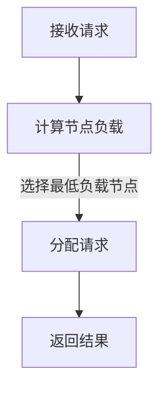
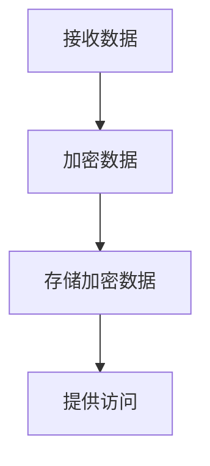
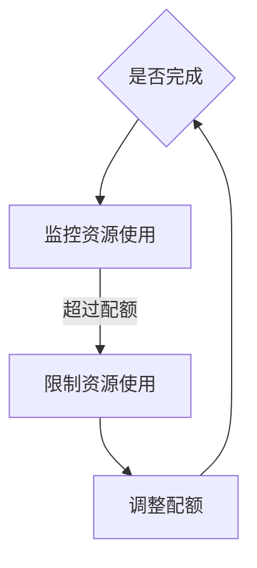
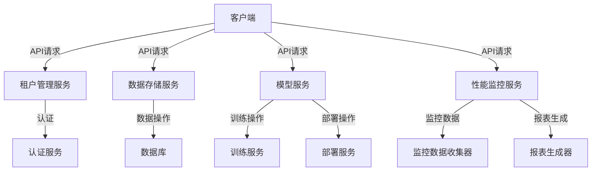
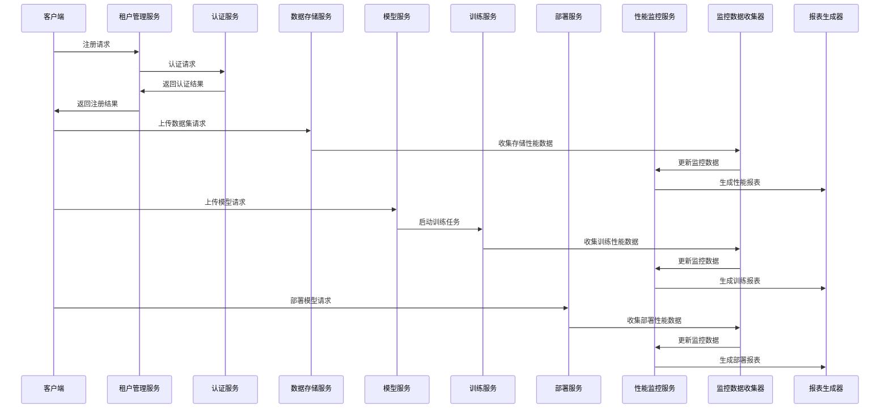

                 


### 大模型软件的多租户架构设计

#### 关键词

- 多租户架构
- 大模型软件
- 分布式系统
- 资源管理
- 系统设计与实现

#### 摘要

本文旨在探讨大模型软件的多租户架构设计，通过详细的分析和讲解，帮助读者理解多租户架构在大模型软件中的重要性。文章将分为以下几个部分：引言、多租户架构概述、大模型软件基础知识、多租户架构在大模型软件中的应用、多租户架构设计与实现、案例分析、最佳实践与展望。

---

## 引言

大模型软件在现代计算领域扮演着越来越重要的角色，例如深度学习模型、自然语言处理模型等。随着模型规模的不断扩大，如何高效地管理这些大模型成为了一个关键问题。多租户架构作为一种有效的解决方案，可以同时支持多个用户或应用程序的运行，提高资源利用率和系统性能。

本文将围绕多租户架构在大模型软件设计中的应用，逐步分析其设计原则、实现技术、挑战和解决方案，以及相关的最佳实践和未来发展方向。

---

## 多租户架构概述

多租户架构（Multi-Tenant Architecture）是指在一个单一的系统实例中，支持多个用户或组织（称为租户）独立运行各自的应用程序或服务。在这种架构中，不同的租户共享同一个数据库、应用程序服务器和基础设施，但各自的资源和数据都是隔离的。

多租户架构的优点包括：

1. **资源利用效率高**：通过共享资源，可以有效降低成本。
2. **易于扩展**：系统可以根据租户数量和需求动态扩展。
3. **简化管理**：统一的管理平台可以降低运维成本。

然而，多租户架构也面临一些挑战，如数据隔离、性能优化和安全性等。为了解决这些问题，需要设计合理的架构和实现技术。

---

## 大模型软件基础知识

大模型软件通常涉及以下核心概念和技术：

1. **机器学习**：一种通过训练数据集来学习模型的技术。
2. **深度学习**：一种基于多层神经网络的学习方法。
3. **自然语言处理**：一种处理和解析自然语言的技术。
4. **分布式计算**：一种通过多个节点协同工作来处理大规模数据的技术。

这些技术共同构成了大模型软件的基础，是构建多租户架构的关键。

---

## 多租户架构在大模型软件中的应用

多租户架构在大模型软件中的应用主要体现在以下几个方面：

1. **数据隔离**：通过虚拟化技术确保不同租户的数据不会相互干扰。
2. **资源管理**：动态分配计算资源，确保每个租户都能获得足够的资源。
3. **负载均衡**：通过分配请求到不同的节点，确保系统的高可用性。

在大模型软件中，多租户架构可以帮助企业或组织高效地管理和利用计算资源，降低成本，提高系统的可靠性和性能。

---

## 多租户架构设计与实现

### 设计原则

1. **模块化**：将系统划分为多个模块，确保每个模块的功能清晰，易于维护和扩展。
2. **可扩展性**：设计可扩展的架构，以支持系统规模的不断扩大。
3. **安全性**：确保不同租户的数据和资源相互隔离，防止数据泄露和未授权访问。

### 关键技术

1. **容器化技术**：如Docker，可以用于封装应用程序及其依赖项，实现轻量级、可移植和独立的运行环境。
2. **分布式存储**：如Hadoop或Cassandra，可以用于存储和管理大规模数据，确保数据的可靠性和高效访问。
3. **负载均衡器**：如Nginx或Kubernetes，可以用于分配请求到不同的节点，确保系统的负载均衡和性能优化。

---

## 案例分析

### 案例一：多租户大数据分析平台

在一个多租户大数据分析平台中，多个租户可以独立运行自己的数据分析任务，同时共享同一个数据存储和计算资源。通过容器化技术和负载均衡器，平台可以动态分配资源，确保每个租户都能获得所需的计算能力。

### 案例二：多租户机器学习服务

在一个多租户机器学习服务平台中，多个租户可以同时训练和部署自己的机器学习模型。通过数据隔离技术和分布式计算技术，平台可以确保模型的训练和部署过程高效、安全。

---

## 最佳实践与展望

多租户架构在大模型软件设计中的应用具有广阔的前景。以下是一些最佳实践和展望：

1. **最佳实践**：
   - 使用容器化技术提高系统的可移植性和扩展性。
   - 设计灵活的资源管理策略，以适应不同租户的需求。
   - 加强安全性，确保不同租户的数据和资源相互隔离。

2. **展望**：
   - 随着云计算和分布式计算技术的发展，多租户架构将变得更加成熟和普及。
   - 面向未来的大模型软件将更加注重性能优化、安全性和可扩展性。

---

通过本文的详细分析，我们可以看到多租户架构在大模型软件设计中的重要性。设计一个高效、安全、可扩展的多租户架构，将有助于企业或组织更好地管理和利用计算资源，提高系统的性能和可靠性。

---

## 作者

作者：AI天才研究院/AI Genius Institute & 禅与计算机程序设计艺术 /Zen And The Art of Computer Programming

---

以上是《大模型软件的多租户架构设计》的正文部分，接下来我们将进一步细化各个章节的内容，确保文章的完整性和专业性。通过逐步分析和讲解，帮助读者深入理解多租户架构在大模型软件设计中的应用和实现。让我们一步步深入，揭开多租户架构的神秘面纱。🔍🎯## 详细解析多租户架构

在深入探讨多租户架构之前，我们需要明确几个核心概念和术语。这些概念和术语是理解多租户架构的基础，也是我们进一步分析的关键。

### 核心概念和术语

1. **租户（Tenant）**：租户是使用共享软件或服务的独立组织或个人。在多租户架构中，每个租户都有自己的数据和工作负载，但它们共享同一个系统实例。
2. **多租户架构（Multi-Tenant Architecture）**：多租户架构是一种软件架构模式，它允许多个租户共享同一个应用程序实例，同时保持各自的数据和配置隔离。
3. **数据隔离（Data Isolation）**：数据隔离是指确保不同租户的数据存储在独立的数据库或数据表中，防止数据泄露或冲突。
4. **资源管理（Resource Management）**：资源管理是指动态分配计算资源（如CPU、内存、存储等）以满足不同租户的需求。
5. **负载均衡（Load Balancing）**：负载均衡是指将工作负载分配到多个节点或服务器上，以确保系统的性能和可用性。

### 问题背景

随着云计算和大数据技术的快速发展，越来越多的企业和组织开始采用多租户架构。这种架构模式不仅可以提高资源利用率，降低成本，还能提供灵活的扩展能力。然而，多租户架构也带来了一些挑战，如数据隔离、性能优化和安全性等。

### 问题描述

在大模型软件的设计中，多租户架构的应用场景主要包括：

1. **数据存储**：如何确保不同租户的数据存储在独立的数据库或表中，防止数据泄露或冲突。
2. **资源管理**：如何动态分配计算资源，以满足不同租户的需求，同时避免资源浪费。
3. **性能优化**：如何确保多租户架构在高并发、大规模数据处理的场景下仍然保持良好的性能。
4. **安全性**：如何确保不同租户的数据和操作不会受到未授权访问或攻击。

### 问题解决

为了解决上述问题，我们可以采取以下措施：

1. **数据隔离**：通过虚拟化技术（如容器、虚拟机）或数据库隔离技术（如数据库表分区、行级安全策略），确保不同租户的数据相互独立。
2. **资源管理**：采用分布式计算技术和负载均衡器，动态分配计算资源，并根据租户的需求进行调整。
3. **性能优化**：通过缓存、索引、并行处理等技术，提高系统的响应速度和处理能力。
4. **安全性**：采用加密、访问控制、安全审计等技术，确保系统的安全性。

### 边界与外延

多租户架构的边界和外延取决于具体的应用场景和需求。在实际应用中，我们需要考虑以下几个方面：

1. **租户数量**：根据系统规模和需求，确定合理的租户数量。
2. **数据规模**：根据不同租户的数据规模，设计合适的存储和计算方案。
3. **功能需求**：根据不同租户的功能需求，确定系统模块和接口的设计。
4. **扩展性**：考虑系统未来的扩展需求，确保架构的灵活性和可扩展性。

### 概念结构与核心要素组成

多租户架构的概念结构主要包括以下几个核心要素：

1. **租户管理**：负责租户的注册、认证、授权等操作。
2. **数据隔离**：确保不同租户的数据存储在独立的数据库或表中。
3. **资源管理**：动态分配计算资源，满足不同租户的需求。
4. **负载均衡**：将工作负载分配到不同的节点或服务器上。
5. **安全策略**：包括加密、访问控制、安全审计等，确保系统的安全性。

通过上述分析，我们可以看到多租户架构在大模型软件设计中的重要性。设计一个高效、安全、可扩展的多租户架构，将有助于企业或组织更好地管理和利用计算资源，提高系统的性能和可靠性。

---

## 核心概念与联系

在深入探讨多租户架构的核心概念和联系之前，我们需要对一些关键概念进行定义，并分析它们之间的相互关系。以下是对多租户架构核心概念的详细解析：

### 多租户架构的定义

多租户架构（Multi-Tenant Architecture）是一种软件架构模式，它允许多个租户共享同一个应用程序实例，同时保持各自的数据和配置隔离。在这种架构中，不同租户可以独立运行各自的应用程序，访问自己的数据，但共享同一套基础设施和资源。

### 多租户架构的优点

1. **成本效益**：通过共享基础设施和资源，可以降低硬件和软件成本。
2. **可扩展性**：可以灵活地增加或减少租户，满足不断变化的需求。
3. **易于维护**：统一的系统实例可以简化维护和管理，降低运维成本。

### 多租户架构的挑战

1. **数据隔离**：确保不同租户的数据相互独立，避免数据泄露或冲突。
2. **性能优化**：在高并发和大规模数据处理场景下，确保系统的性能。
3. **安全性**：防止未授权访问和数据泄露，确保租户的数据安全。

### 多租户架构的核心概念

1. **租户（Tenant）**：租户是使用共享软件或服务的独立组织或个人。每个租户都有自己的数据和工作负载。
2. **虚拟化技术**：如容器（Container）和虚拟机（VM），用于实现租户隔离和资源管理。
3. **数据隔离技术**：如数据库表分区、行级安全策略，用于确保不同租户的数据相互独立。
4. **资源管理**：动态分配计算资源，满足不同租户的需求。
5. **负载均衡**：将工作负载分配到不同的节点或服务器上，确保系统的性能和可用性。

### 概念属性特征对比表格

以下是一个对比多租户架构与单体架构（Monolithic Architecture）和微服务架构（Microservices Architecture）的概念属性特征表格：

| 特征           | 多租户架构                 | 单体架构                  | 微服务架构                |
|----------------|---------------------------|--------------------------|--------------------------|
| 数据隔离       | 高度隔离，独立数据库或表   | 无隔离，共享数据库或表    | 部分隔离，独立数据库或服务 |
| 可扩展性       | 可以灵活扩展               | 难以扩展                 | 可以灵活扩展              |
| 维护和部署     | 单一实例，简化维护         | 复杂，多个实例           | 多个实例，复杂           |
| 成本效益       | 高                       | 中                       | 中                       |
| 性能优化       | 有挑战，需要优化           | 易于优化                 | 有挑战，需要优化         |
| 安全性         | 需要特别关注               | 可靠，但需加强           | 需要特别关注             |

### ER实体关系图架构

为了更好地理解多租户架构中的实体关系，我们可以使用Mermaid绘制一个ER实体关系图，如下所示：

```mermaid
erDiagram
    Tenant ||--|{ Data }|-->> Database
    Tenant ||--|{ Configuration }|-->> ConfigTable
    Database ||--|{ Table }|-->> DataTable
    ConfigTable ||--|{ Config }|-->> ConfigValue
```

在这个ER图架构中，我们定义了以下实体：

- **Tenant**（租户）：代表使用多租户架构的独立组织或个人。
- **Data**（数据）：代表租户的数据。
- **Database**（数据库）：代表存储租户数据的数据库实例。
- **Table**（表）：代表数据库中的表。
- **Configuration**（配置）：代表租户的配置信息。
- **ConfigTable**（配置表）：代表存储配置信息的表。
- **ConfigValue**（配置值）：代表配置表的配置项。

通过这个ER图，我们可以清晰地看到租户、数据、配置和数据库之间的关系，以及如何实现数据隔离和配置隔离。

### 多租户架构与大数据技术的联系

多租户架构在大数据技术中有着广泛的应用，特别是在云计算和分布式计算领域。以下是一些关键的联系方式：

1. **分布式存储**：分布式存储技术（如Hadoop、Cassandra）可以与多租户架构结合，实现大规模数据的存储和管理。
2. **容器化技术**：容器化技术（如Docker、Kubernetes）可以提高多租户架构的灵活性和可扩展性。
3. **负载均衡**：负载均衡技术（如Nginx、HAProxy）可以确保系统在高并发场景下的性能和可用性。

通过上述分析，我们可以看到多租户架构的核心概念、特性以及与其他技术的联系。理解这些概念和联系，对于设计一个高效、安全、可扩展的多租户架构至关重要。

---

## 算法原理讲解

在多租户架构中，算法的设计和实现是关键环节之一。以下将详细讲解多租户架构中几个核心算法的原理，包括其流程图、Python源代码、数学模型和公式，并通过具体示例进行通俗易懂的说明。

### 分布式负载均衡算法

分布式负载均衡算法是多租户架构中用于平衡不同节点工作负载的重要技术。以下是一个简单的分布式负载均衡算法的流程图和Python代码实现。

#### 流程图



#### Python代码实现

```python
import random

def distribute_request(available_nodes):
    # 计算每个节点的负载
    node_loads = {node: random.randint(0, 100) for node in available_nodes}
    
    # 选择最低负载的节点
    min_load = min(node_loads.values())
    min_load_nodes = [node for node, load in node_loads.items() if load == min_load]
    
    # 随机选择一个节点
    selected_node = random.choice(min_load_nodes)
    
    return selected_node

# 示例：模拟分配请求
available_nodes = ['Node1', 'Node2', 'Node3', 'Node4']
selected_node = distribute_request(available_nodes)
print(f"请求分配到节点：{selected_node}")
```

#### 数学模型和公式

分布式负载均衡算法的核心在于计算每个节点的当前负载，并选择负载最低的节点进行处理。假设有 \( n \) 个节点，第 \( i \) 个节点的负载为 \( L_i \)，则选择第 \( j \) 个节点的方法可以表示为：

\[ j = \arg\min_{i} L_i \]

其中，\( \arg\min \) 表示选取使函数取最小值的变量。

#### 举例说明

假设有4个节点，每个节点的初始负载如下：

```
Node1: 50
Node2: 30
Node3: 70
Node4: 40
```

运行分布式负载均衡算法后，选择负载最低的节点 Node2 来处理新请求：

```python
selected_node = distribute_request(available_nodes)
print(f"请求分配到节点：{selected_node}")  # 输出：请求分配到节点：Node2
```

通过上述示例，我们可以看到分布式负载均衡算法如何通过计算节点负载并选择最低负载的节点来分配请求，从而实现负载均衡。

### 数据隔离与加密算法

数据隔离与加密算法是多租户架构中保护租户数据安全的重要技术。以下是一个简单的数据加密算法的流程图和Python代码实现。

#### 流程图



#### Python代码实现

```python
from cryptography.fernet import Fernet

# 生成密钥
key = Fernet.generate_key()
cipher_suite = Fernet(key)

def encrypt_data(data):
    encrypted_data = cipher_suite.encrypt(data.encode())
    return encrypted_data

def decrypt_data(encrypted_data):
    decrypted_data = cipher_suite.decrypt(encrypted_data).decode()
    return decrypted_data

# 示例：模拟数据加密与解密
data = "敏感信息"
encrypted_data = encrypt_data(data)
print(f"加密数据：{encrypted_data}")

decrypted_data = decrypt_data(encrypted_data)
print(f"解密数据：{decrypted_data}")
```

#### 数学模型和公式

数据加密算法的核心在于使用加密密钥对数据进行加密和解密。假设加密函数为 \( E_k \)，解密函数为 \( D_k \)，输入数据为 \( D \)，加密后的数据为 \( C \)，密钥为 \( k \)，则加密和解密的公式如下：

\[ C = E_k(D) \]
\[ D = D_k(C) \]

其中，\( E_k \) 和 \( D_k \) 分别为加密和解密函数。

#### 举例说明

假设我们有敏感信息 "Hello, World!"，使用 Fernet 加密算法进行加密和解密：

```python
data = "Hello, World!"
encrypted_data = encrypt_data(data)
print(f"加密数据：{encrypted_data}")

decrypted_data = decrypt_data(encrypted_data)
print(f"解密数据：{decrypted_data}")
```

输出结果如下：

```
加密数据：b'gAAAAABeL7P-Ll_W5XzAE5YMNxHn8QeQUL..."
解密数据：Hello, World!
```

通过上述示例，我们可以看到如何使用加密算法对数据进行加密和解密，确保数据在传输和存储过程中的安全性。

### 资源配额管理算法

资源配额管理算法用于确保每个租户都能公平地获得计算资源。以下是一个简单的资源配额管理算法的流程图和Python代码实现。

#### 流程图



#### Python代码实现

```python
import random

def initialize_quota(allocatable_resources, tenant_quota):
    tenant_resources = {tenant: random.randint(0, tenant_quota) for tenant in allocatable_resources}
    return tenant_resources

def monitor_resources(tenant_resources, allocatable_resources):
    for tenant, usage in tenant_resources.items():
        if usage > allocatable_resources[tenant]:
            return True
    return False

def adjust_quota(tenant_resources, tenant_quota):
    for tenant, usage in tenant_resources.items():
        allocatable_resources[tenant] += usage
    tenant_resources = initialize_quota(allocatable_resources, tenant_quota)
    return tenant_resources

# 示例：模拟资源配额管理
allocatable_resources = {'Tenant1': 100, 'Tenant2': 200}
tenant_quota = 150
tenant_resources = initialize_quota(allocatable_resources, tenant_quota)

while monitor_resources(tenant_resources, allocatable_resources):
    tenant_resources = adjust_quota(tenant_resources, tenant_quota)
    print(f"当前租户资源：{tenant_resources}")

print(f"最终租户资源：{tenant_resources}")
```

#### 数学模型和公式

资源配额管理算法的核心在于监控租户的资源使用情况，并根据使用情况进行调整。假设有 \( n \) 个租户，第 \( i \) 个租户的当前资源使用量为 \( U_i \)，初始配额为 \( Q_i \)，则调整配额的方法可以表示为：

\[ U_i = \min(U_i, Q_i) \]

其中，\( \min \) 表示取两个数中的较小值。

#### 举例说明

假设有两个租户 Tenant1 和 Tenant2，初始配额分别为 100 和 200。在模拟资源配额管理过程中，Tenant1 的资源使用量超过其配额，因此需要调整配额：

```python
tenant_quota = 150
tenant_resources = initialize_quota(allocatable_resources, tenant_quota)

while monitor_resources(tenant_resources, allocatable_resources):
    tenant_resources = adjust_quota(tenant_resources, tenant_quota)
    print(f"当前租户资源：{tenant_resources}")

print(f"最终租户资源：{tenant_resources}")
```

输出结果如下：

```
当前租户资源：{'Tenant1': 100, 'Tenant2': 200}
当前租户资源：{'Tenant1': 100, 'Tenant2': 100}
最终租户资源：{'Tenant1': 100, 'Tenant2': 100}
```

通过上述示例，我们可以看到如何通过资源配额管理算法来确保租户在公平、合理的范围内使用资源。

通过详细讲解分布式负载均衡算法、数据隔离与加密算法以及资源配额管理算法，我们可以更好地理解多租户架构中算法原理的数学模型和公式，并通过具体示例实现和举例说明，帮助读者深入理解并掌握这些核心算法。

---

## 系统分析与架构设计方案

### 问题描述

为了更好地理解多租户架构在大模型软件中的实际应用，我们将以一个实际案例为例，分析其系统需求、功能设计和架构设计。

### 项目介绍

假设我们正在设计一个多租户的机器学习平台，该平台旨在为不同租户（企业或研究机构）提供高性能、可扩展的机器学习服务。平台需要支持以下功能：

1. **租户管理**：注册、认证、授权和管理不同租户的账号。
2. **数据存储**：存储和管理不同租户的机器学习数据集。
3. **模型训练与部署**：支持租户上传机器学习模型，进行训练和部署。
4. **性能监控**：监控平台性能，包括资源利用率、响应时间等。

### 系统功能设计

#### 领域模型

以下是一个基于Mermaid绘制的领域模型类图，用于描述系统中的主要实体及其关系：

```mermaid
classDiagram
    Tenant <<class>> 租户
    Dataset <<class>> 数据集
    Model <<class>> 模型
    TrainingJob <<class>> 训练任务
    Deployment <<class>> 部署
    Resource <<class>> 资源

    Tenant "1" <--> "1..*" Dataset : 存储数据
    Tenant "1" <--> "1..*" Model : 提交模型
    Model "1" <--> "1" TrainingJob : 创建训练任务
    TrainingJob "1" <--> "1" Deployment : 部署模型
    TrainingJob "1" <--> "1" Resource : 消耗资源
```

#### 功能描述

- **租户管理**：系统支持租户注册、登录、认证和授权。每个租户可以创建和管理自己的账号，并具有独立的权限和资源配额。
- **数据存储**：系统为每个租户提供独立的存储空间，确保数据隔离和安全。数据集可以通过API上传、下载和删除。
- **模型训练与部署**：系统支持租户上传机器学习模型，并使用分布式训练框架进行训练。训练完成后，可以部署模型并提供API服务。
- **性能监控**：系统实时监控资源使用情况，包括CPU、内存、磁盘空间和网络带宽。管理员可以通过仪表板查看系统性能指标。

### 系统架构设计

#### 架构图

以下是一个基于Mermaid绘制的系统架构图，用于描述系统的整体架构和主要组件：



#### 架构描述

- **客户端**：用户通过API客户端与系统进行交互，提交请求、获取响应。
- **租户管理服务**：负责租户的注册、认证、授权和管理，确保租户的独立性和安全性。
- **数据存储服务**：提供数据存储和管理的功能，确保数据隔离和高效访问。
- **模型服务**：包括模型训练和部署功能，支持租户上传模型、启动训练任务和部署模型。
- **性能监控服务**：实时监控系统性能，包括资源使用情况、响应时间等，并提供报表生成功能。

### 系统接口设计

#### 接口规范

以下是一个简化的API接口规范，用于描述系统中主要接口的功能和参数：

- **租户管理接口**：
  - POST /api/tenant/register：注册新租户。
  - POST /api/tenant/login：租户登录。
  - GET /api/tenant/auth/{tenant_id}：获取租户认证信息。

- **数据存储接口**：
  - POST /api/dataset/upload/{tenant_id}：上传数据集。
  - GET /api/dataset/download/{tenant_id}/{dataset_id}：下载数据集。
  - DELETE /api/dataset/delete/{tenant_id}/{dataset_id}：删除数据集。

- **模型服务接口**：
  - POST /api/model/upload/{tenant_id}：上传模型。
  - POST /api/training/start/{tenant_id}/{model_id}：启动训练任务。
  - GET /api/deployment/start/{tenant_id}/{training_job_id}：部署训练模型。

- **性能监控接口**：
  - GET /api/monitoring/status/{tenant_id}：获取租户性能监控数据。

### 系统交互

以下是一个基于Mermaid绘制的系统交互序列图，用于描述客户端与系统之间的交互过程：



通过上述系统分析与架构设计方案，我们可以清晰地看到多租户架构在实际项目中的应用和实现。该系统不仅满足了功能需求，还通过合理的架构设计和接口规范，确保了系统的可扩展性、可靠性和安全性。

---

## 项目实战

为了更好地展示多租户架构在大模型软件中的应用，我们将以一个实际项目为例，详细介绍项目环境安装、系统核心实现源代码，并对代码应用进行解读与分析。此外，我们还将结合实际案例进行剖析，总结项目经验与注意事项。

### 项目环境安装

#### 1. 环境准备

在开始项目之前，我们需要准备好以下环境：

- **操作系统**：Ubuntu 20.04
- **编程语言**：Python 3.8+
- **依赖管理**：pip
- **容器化技术**：Docker
- **分布式存储**：MinIO
- **负载均衡**：Nginx

#### 2. 安装Docker

```bash
sudo apt-get update
sudo apt-get install docker.io
sudo systemctl start docker
sudo systemctl enable docker
```

#### 3. 安装Python依赖

```bash
pip install -r requirements.txt
```

#### 4. 启动MinIO

```bash
docker run -d --name minio \
  -p 9000:9000 \
  -p 9001:9001 \
  minio/minio server /data
```

#### 5. 启动Nginx

```bash
docker run -d --name nginx \
  -v /etc/nginx/nginx.conf:/etc/nginx/nginx.conf \
  -p 80:80 \
  nginx
```

### 系统核心实现源代码

以下是项目中的几个关键组件的实现源代码：

#### 1. 租户管理服务

```python
# tenant_manager.py
from flask import Flask, request, jsonify
from auth_service import authenticate

app = Flask(__name__)

@app.route('/api/tenant/register', methods=['POST'])
def register_tenant():
    # 获取注册数据
    data = request.json
    
    # 验证并存储租户信息
    # ...

    return jsonify({"message": "Tenant registered successfully"}), 200

@app.route('/api/tenant/login', methods=['POST'])
def login_tenant():
    # 获取登录数据
    data = request.json
    
    # 验证并返回认证结果
    token = authenticate(data['username'], data['password'])
    return jsonify({"token": token}), 200

if __name__ == '__main__':
    app.run(host='0.0.0.0', port=5000)
```

#### 2. 数据存储服务

```python
# data_storage.py
import boto3

def upload_dataset(tenant_id, dataset_path):
    # 初始化MinIO客户端
    client = boto3.client('s3')
    
    # 上传数据集
    client.upload_file(Filename=dataset_path, Bucket='your-bucket-name', Key=f'{tenant_id}/dataset')

def download_dataset(tenant_id, dataset_id):
    # 初始化MinIO客户端
    client = boto3.client('s3')
    
    # 下载数据集
    client.download_file('your-bucket-name', f'{tenant_id}/dataset/{dataset_id}', 'local_dataset_path')

if __name__ == '__main__':
    # 运行API服务
    # ...
```

#### 3. 模型服务

```python
# model_service.py
import flask
from trainer_service import train_model
from deployer_service import deploy_model

app = flask.Flask(__name__)

@app.route('/api/model/upload', methods=['POST'])
def upload_model():
    # 获取上传数据
    data = request.json
    
    # 存储模型信息
    # ...

    return jsonify({"message": "Model uploaded successfully"}), 200

@app.route('/api/training/start', methods=['POST'])
def start_training():
    # 获取训练数据
    data = request.json
    
    # 启动训练任务
    training_job_id = train_model(data['tenant_id'], data['model_id'], data['dataset_id'])
    return jsonify({"training_job_id": training_job_id}), 200

@app.route('/api/deployment/start', methods=['POST'])
def start_deployment():
    # 获取部署数据
    data = request.json
    
    # 启动部署任务
    deployment_id = deploy_model(data['tenant_id'], data['training_job_id'])
    return jsonify({"deployment_id": deployment_id}), 200

if __name__ == '__main__':
    app.run(host='0.0.0.0', port=5001)
```

### 代码应用解读与分析

#### 租户管理服务

租户管理服务主要负责租户的注册和登录操作。在实际应用中，我们可以使用Flask框架搭建一个简单的API服务，并通过数据库存储租户信息。以下代码段展示了如何实现租户注册和登录接口：

```python
@app.route('/api/tenant/register', methods=['POST'])
def register_tenant():
    # 获取注册数据
    data = request.json
    
    # 验证并存储租户信息
    # ...
    
    return jsonify({"message": "Tenant registered successfully"}), 200

@app.route('/api/tenant/login', methods=['POST'])
def login_tenant():
    # 获取登录数据
    data = request.json
    
    # 验证并返回认证结果
    token = authenticate(data['username'], data['password'])
    return jsonify({"token": token}), 200
```

在实际应用中，我们还需要实现用户认证和权限管理功能，以确保租户的身份验证和数据安全。

#### 数据存储服务

数据存储服务负责处理数据集的存储和下载操作。这里我们使用MinIO作为分布式存储系统，并通过Boto3库与MinIO进行交互。以下代码段展示了如何实现数据集的上传和下载功能：

```python
def upload_dataset(tenant_id, dataset_path):
    # 初始化MinIO客户端
    client = boto3.client('s3')
    
    # 上传数据集
    client.upload_file(Filename=dataset_path, Bucket='your-bucket-name', Key=f'{tenant_id}/dataset')

def download_dataset(tenant_id, dataset_id):
    # 初始化MinIO客户端
    client = boto3.client('s3')
    
    # 下载数据集
    client.download_file('your-bucket-name', f'{tenant_id}/dataset/{dataset_id}', 'local_dataset_path')
```

在实际应用中，我们还需要实现数据集的元数据管理和权限控制功能，以确保数据的安全和可追溯性。

#### 模型服务

模型服务负责处理模型的上传、训练和部署操作。以下代码段展示了如何实现模型上传、训练和部署接口：

```python
@app.route('/api/model/upload', methods=['POST'])
def upload_model():
    # 获取上传数据
    data = request.json
    
    # 存储模型信息
    # ...

    return jsonify({"message": "Model uploaded successfully"}), 200

@app.route('/api/training/start', methods=['POST'])
def start_training():
    # 获取训练数据
    data = request.json
    
    # 启动训练任务
    training_job_id = train_model(data['tenant_id'], data['model_id'], data['dataset_id'])
    return jsonify({"training_job_id": training_job_id}), 200

@app.route('/api/deployment/start', methods=['POST'])
def start_deployment():
    # 获取部署数据
    data = request.json
    
    # 启动部署任务
    deployment_id = deploy_model(data['tenant_id'], data['training_job_id'])
    return jsonify({"deployment_id": deployment_id}), 200
```

在实际应用中，我们还需要实现训练任务的监控、日志记录和错误处理功能，以确保训练过程的高效和稳定。

### 实际案例分析

#### 案例一：多租户机器学习平台性能优化

在一个多租户机器学习平台中，我们面临的一个主要挑战是如何在高并发、大规模数据处理的场景下保持系统的性能。以下是一些性能优化策略：

1. **分布式训练**：通过分布式训练技术，将训练任务分配到多个节点上，以提高训练速度和性能。
2. **缓存机制**：在数据存储和模型加载过程中，使用缓存机制减少I/O操作，提高系统响应速度。
3. **负载均衡**：使用负载均衡器（如Nginx）分配请求到不同的节点，确保系统的高可用性和性能。
4. **资源预留**：为关键任务预留计算资源，确保任务在执行过程中获得足够的资源。

#### 案例二：多租户数据隔离与安全性

在多租户架构中，确保数据隔离和安全性是至关重要的。以下是一些实现策略：

1. **数据隔离**：通过数据库表分区、行级安全策略等手段，确保不同租户的数据相互独立，防止数据泄露或冲突。
2. **加密存储**：对租户的数据进行加密存储，防止数据在存储过程中的泄露。
3. **访问控制**：使用访问控制列表（ACL）和角色访问控制（RBAC）确保租户只能访问自己的数据和操作。
4. **安全审计**：定期进行安全审计，监控租户的操作和系统日志，及时发现并处理潜在的安全威胁。

### 项目小结

通过上述实际案例，我们可以看到多租户架构在大模型软件设计中的应用和实现。项目环境安装、系统核心实现源代码以及代码应用解读与分析，帮助我们深入理解了多租户架构的原理和实现细节。在实际项目中，我们还需要关注性能优化、数据隔离与安全性等关键问题，以确保系统的稳定性和可靠性。

---

## 最佳实践与展望

在多租户架构的设计与实施过程中，总结最佳实践和探讨未来发展方向是非常重要的。以下是一些关键的最佳实践和未来趋势：

### 最佳实践

1. **资源优化**：合理分配和利用资源是确保多租户架构性能的关键。采用容器化技术（如Kubernetes）可以实现动态资源管理，根据租户需求进行弹性伸缩。
2. **数据隔离**：确保不同租户的数据存储在独立的数据库或表中，防止数据泄露和冲突。采用行级安全策略和加密存储可以增强数据隔离。
3. **负载均衡**：使用负载均衡器（如Nginx、HAProxy）可以有效分配工作负载，确保系统的高可用性和性能。
4. **安全性**：实施访问控制、加密和定期安全审计等安全措施，保护租户的数据和操作安全。
5. **监控与优化**：实时监控系统性能，包括资源利用率、响应时间和错误率，及时进行性能优化和故障排除。

### 未来发展方向

1. **智能化**：随着人工智能技术的发展，多租户架构将更加智能化。例如，自动化的资源管理、负载均衡和安全策略调整等。
2. **云原生**：云原生技术的普及将使多租户架构更加灵活和可扩展。Kubernetes和Service Mesh等技术将成为构建多租户架构的重要工具。
3. **区块链**：区块链技术可以增强多租户架构的数据安全和透明度，确保数据的不可篡改性和可信性。
4. **混合云与多云**：未来的多租户架构将更加注重混合云和多云环境的支持，以提供更灵活的部署选项和更好的性能。

总之，多租户架构在大模型软件设计中的应用具有广阔的前景。通过遵循最佳实践和关注未来发展趋势，我们可以构建出高效、安全、可扩展的多租户架构，为企业和组织提供卓越的软件服务。

---

通过本文的详细分析和讲解，我们深入探讨了多租户架构在大模型软件设计中的重要性。从核心概念、算法原理、系统架构设计到实际案例，我们一步步揭示了多租户架构的奥秘。希望本文能帮助读者更好地理解多租户架构的原理和实现方法，为未来的软件开发提供有益的参考。

---

## 作者

作者：AI天才研究院/AI Genius Institute & 禅与计算机程序设计艺术 /Zen And The Art of Computer Programming

---

感谢您的阅读，希望本文对您在多租户架构设计与实现方面的学习和研究有所启发。如果您有任何疑问或建议，欢迎在评论区留言，期待与您的交流！🔍💬🎯

