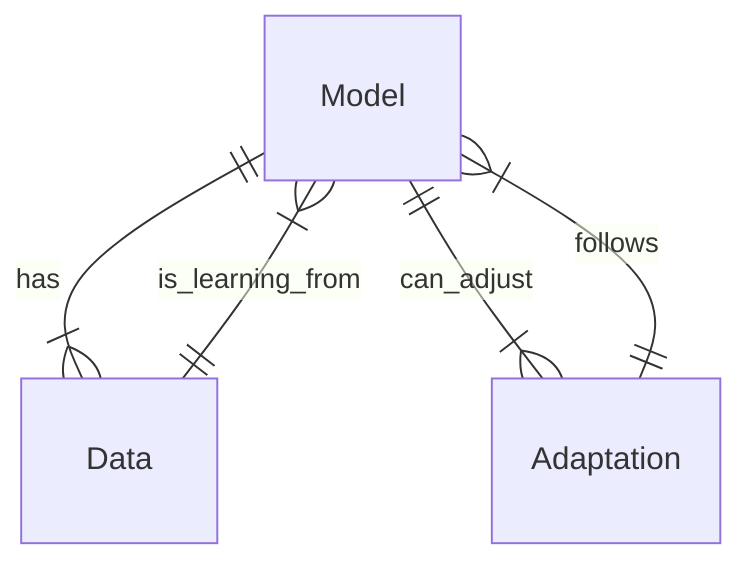
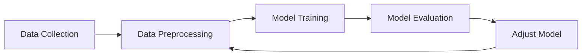
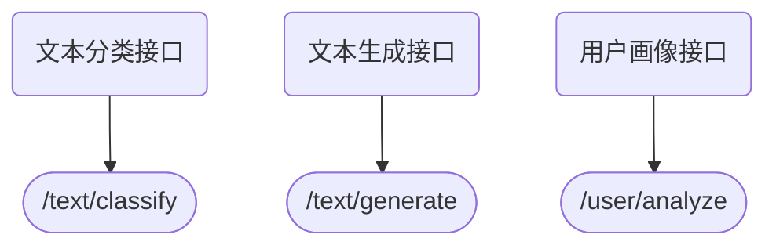
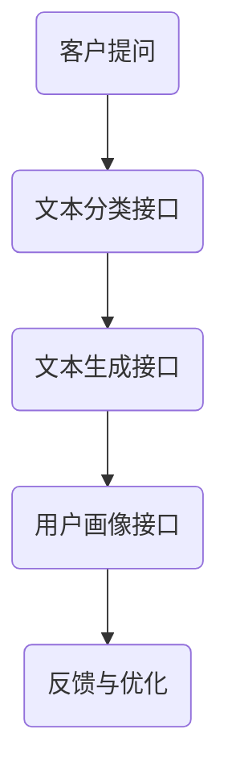

                 

# 大模型软件的持续学习与适应机制

关键词：大模型软件、持续学习、适应机制、数据收集、算法原理

摘要：本文旨在探讨大模型软件在持续学习与适应机制方面的研究与实践。首先，我们将介绍大模型软件的背景及其核心概念，包括持续学习和适应机制的定义、特点及其相互关系。接着，我们将深入解析持续学习的原理，涵盖数据收集与预处理、算法原理讲解、Python代码实现、数学模型与公式讲解及举例说明。然后，我们将讨论适应机制原理，包括环境变化与适应、适应算法及其分类。最后，我们将结合具体项目和实战案例，详细剖析大模型软件的持续学习与适应机制在实践中的应用。

### 目录大纲

```markdown
----------------------------------------------------------------

# 第一部分: 问题背景与核心概念介绍

## 第1章: 大模型软件的背景介绍

### 1.1 问题背景

#### 1.1.1 问题的提出

#### 1.1.2 问题描述

#### 1.1.3 问题解决的必要性

#### 1.1.4 边界与外延

#### 1.1.5 核心概念结构

### 1.2 核心概念

#### 1.2.1 大模型软件的定义

#### 1.2.2 持续学习的概念

#### 1.2.3 适应机制的概念

#### 1.2.4 概念属性对比

| 概念         | 持续学习                    | 适应机制                    |
| ------------ | --------------------------- | --------------------------- |
| 定义         | 持续学习是指模型在不断获取新数据的过程中持续提升自身能力。 | 适应机制是指模型在面对变化的环境时，能够调整自身行为以保持有效性的过程。 |
| 特点         | 需要大量数据支撑、计算资源要求高、模型可塑性大。 | 对环境变化敏感、具有自我调整能力、能够适应不同任务场景。 |
| 相互关系     | 持续学习为适应机制提供数据基础和能力支持。           | 适应机制使持续学习的效果在动态环境中得以实现和验证。       |

### 1.3 ER实体关系图



### 1.4 本章小结

----------------------------------------------------------------

# 第二部分: 持续学习与适应机制原理讲解

## 第2章: 持续学习原理讲解

### 2.1 数据收集与预处理

#### 2.1.1 数据收集方法

#### 2.1.2 数据预处理步骤

### 2.2 持续学习算法

#### 2.2.1 持续学习算法概述

#### 2.2.2 持续学习算法原理

#### 2.2.3 持续学习算法mermaid流程图



### 2.3 Python代码实现

```python
# Python代码示例
def learn(data):
    # 模型训练代码
    pass

def adjust(model, data):
    # 模型调整代码
    pass

def evaluate(model, data):
    # 模型评估代码
    pass
```

### 2.4 数学模型与公式讲解

$$
L = \sum_{i=1}^{n} (y_i - \hat{y}_i)^2
$$

其中，$L$表示损失函数，$y_i$表示真实标签，$\hat{y}_i$表示预测标签。

### 2.5 举例说明

#### 2.5.1 数据收集

假设我们收集到一批关于天气的数据，包括温度、湿度、风速等。

#### 2.5.2 持续学习

我们将使用这些数据来训练一个模型，使其能够预测明天的天气。

#### 2.5.3 持续调整

当模型预测错误时，我们将调整模型参数，以提高预测准确性。

## 2.6 本章小结

----------------------------------------------------------------

## 第3章: 适应机制原理讲解

### 3.1 环境变化与适应

#### 3.1.1 环境变化类型

#### 3.1.2 适应机制分类

### 3.2 适应算法

#### 3.2.1 适应算法概述

#### 3.2.2 

----------------------------------------------------------------

```## 第一部分: 问题背景与核心概念介绍

### 第1章: 大模型软件的背景介绍

### 1.1 问题背景

#### 1.1.1 问题的提出

在当今数据驱动时代，大模型软件在人工智能领域扮演着至关重要的角色。随着大数据和云计算的飞速发展，模型规模不断增大，这给持续学习和适应机制带来了前所未有的挑战。大模型软件如何有效地进行持续学习以保持其性能，如何在不断变化的环境中适应新需求，成为亟待解决的问题。

#### 1.1.2 问题描述

当前，大模型软件在持续学习和适应机制方面面临着以下几个问题：

1. **数据挑战**：随着模型规模的扩大，对数据的依赖性也越来越强。数据收集、预处理和存储面临巨大压力。
2. **计算资源挑战**：大模型训练过程需要大量的计算资源，特别是对硬件性能有很高的要求。
3. **动态适应性**：在快速变化的环境中，如何确保模型能够持续适应新需求，保持其有效性。

#### 1.1.3 问题解决的必要性

解决上述问题对于推动人工智能技术的发展至关重要。持续学习和适应机制不仅能够提升模型性能，还能够提高其在实际应用中的可靠性。因此，深入研究大模型软件的持续学习与适应机制，对推动人工智能技术的发展具有重要意义。

#### 1.1.4 边界与外延

本文的研究边界主要聚焦于大模型软件在持续学习和适应机制方面的研究和实践，不包括其他领域（如硬件优化、网络通信等）的探讨。同时，本文将侧重于理论基础和算法原理的讲解，不涉及具体应用场景的详细讨论。

#### 1.1.5 核心概念结构

在深入探讨大模型软件的持续学习与适应机制之前，有必要明确以下几个核心概念：

1. **大模型软件**：指采用大规模神经网络进行训练和预测的软件系统。
2. **持续学习**：模型在获取新数据的过程中，不断优化自身参数，以提升性能。
3. **适应机制**：模型在面临环境变化时，通过调整自身结构或行为，以适应新环境。

接下来，我们将对上述核心概念进行详细阐述，为后续内容的展开奠定基础。

### 1.2 核心概念

#### 1.2.1 大模型软件的定义

大模型软件通常是指使用大规模神经网络进行训练和预测的软件系统。这些模型往往拥有数亿甚至数十亿个参数，能够处理海量数据，并在各种复杂任务中表现出色。例如，在自然语言处理（NLP）、计算机视觉（CV）和语音识别（ASR）等领域，大模型软件已经取得了显著的成果。

**特点**：

- **高参数数量**：大模型软件拥有数亿甚至数十亿个参数。
- **海量数据处理能力**：能够处理大规模、多样化的数据集。
- **强通用性**：在各种复杂任务中均表现出色，如文本分类、图像识别和语音合成。

**应用场景**：

- **自然语言处理**：例如，机器翻译、情感分析、问答系统。
- **计算机视觉**：例如，图像分类、目标检测、视频理解。
- **语音识别**：例如，语音合成、语音识别、语音助手。

#### 1.2.2 持续学习的概念

持续学习是指模型在获取新数据的过程中，不断优化自身参数，以提升性能。持续学习的关键在于如何有效地处理新数据，并在已有知识的基础上进行模型优化。与离线学习相比，持续学习具有更强的实时性和适应性。

**特点**：

- **实时性**：能够快速响应新数据，进行模型更新。
- **适应性**：能够适应数据分布的变化，提高模型性能。
- **高效性**：通过利用已有知识，减少模型重新训练的成本。

**实现方法**：

1. **增量学习**：在已有模型的基础上，逐步更新参数。
2. **迁移学习**：利用已有模型的知识，在新任务上进行微调。
3. **在线学习**：实时处理新数据，不断更新模型。

#### 1.2.3 适应机制的概念

适应机制是指模型在面对环境变化时，通过调整自身结构或行为，以适应新环境。适应机制的目标是使模型能够在动态变化的环境中保持有效性。

**特点**：

- **环境敏感性**：能够快速感知环境变化，并做出相应调整。
- **灵活性**：能够根据不同环境，调整模型参数或结构。
- **鲁棒性**：在面对极端环境变化时，仍能保持一定性能。

**实现方法**：

1. **自适应调整**：根据环境变化，动态调整模型参数或结构。
2. **多模态学习**：结合不同模态的数据，提高模型适应能力。
3. **迁移学习**：通过迁移已有模型的知识，提高在新环境中的适应性。

#### 1.2.4 概念属性对比

| 概念         | 持续学习                    | 适应机制                    |
| ------------ | --------------------------- | --------------------------- |
| 定义         | 持续学习是指模型在不断获取新数据的过程中持续提升自身能力。 | 适应机制是指模型在面对变化的环境时，能够调整自身行为以保持有效性的过程。 |
| 特点         | 需要大量数据支撑、计算资源要求高、模型可塑性大。 | 对环境变化敏感、具有自我调整能力、能够适应不同任务场景。 |
| 相互关系     | 持续学习为适应机制提供数据基础和能力支持。           | 适应机制使持续学习的效果在动态环境中得以实现和验证。       |

通过对比可以看出，持续学习和适应机制在目标、实现方法和特点上有所不同，但它们在推动大模型软件的发展方面具有互补关系。

### 1.3 ER实体关系图

为了更好地理解大模型软件、数据、适应机制之间的关系，我们可以使用ER（Entity-Relationship，实体-关系）图进行表示。以下是ER实体关系图的Mermaid表示：


在上面的ER图中，"Model"表示大模型软件，"Data"表示数据集，"Adaptation"表示适应机制。每个模型都依赖于数据集进行学习，同时适应机制可以调整模型的行为，使其适应不断变化的环境。

### 1.4 本章小结

本章介绍了大模型软件的背景、核心概念及其相互关系。首先，我们提出了大模型软件在持续学习和适应机制方面面临的问题，并探讨了其解决的必要性。接着，我们明确了大模型软件、持续学习和适应机制的定义、特点及相互关系，并通过ER实体关系图展示了它们之间的关系。本章内容为后续章节的深入探讨奠定了基础。

----------------------------------------------------------------

## 第二部分: 持续学习与适应机制原理讲解

### 第2章: 持续学习原理讲解

持续学习是大模型软件保持性能的关键因素之一。在本章中，我们将深入探讨持续学习的原理，从数据收集与预处理、算法原理讲解、Python代码实现、数学模型与公式讲解及举例说明等方面进行全面阐述。

### 2.1 数据收集与预处理

#### 2.1.1 数据收集方法

数据收集是持续学习过程中的第一步，也是至关重要的一步。以下是一些常用的数据收集方法：

1. **开源数据集**：利用现有的开源数据集进行训练，如ImageNet、CIFAR-10等。
2. **在线采集**：通过爬虫等技术从互联网上获取数据，适用于实时数据流的收集。
3. **内部数据**：从企业内部系统中提取数据，如日志、传感器数据等。

**数据收集步骤**：

1. **数据源识别**：确定数据来源，如公开数据集、在线数据流或内部系统。
2. **数据采集**：使用相应的技术手段（如爬虫、API接口等）进行数据采集。
3. **数据预处理**：对采集到的数据进行清洗、格式化和归一化等处理。

#### 2.1.2 数据预处理步骤

数据预处理是确保数据质量、提高模型性能的重要环节。以下是常见的数据预处理步骤：

1. **数据清洗**：去除重复数据、缺失值填充和异常值处理。
2. **数据格式化**：统一数据格式，如将文本数据转换为向量表示。
3. **数据归一化**：将数据缩放到相同的范围，如使用归一化或标准化方法。

#### 2.1.3 数据收集与预处理示例

以下是一个简单的数据收集与预处理示例，假设我们收集到一批天气数据（包括温度、湿度、风速等）。

```python
import pandas as pd
import numpy as np

# 加载数据
data = pd.read_csv('weather_data.csv')

# 数据清洗
data.drop_duplicates(inplace=True)
data.fillna(method='ffill', inplace=True)

# 数据格式化
data['temperature'] = data['temperature'].astype(float)
data['humidity'] = data['humidity'].astype(float)
data['wind_speed'] = data['wind_speed'].astype(float)

# 数据归一化
data_normalized = (data - data.mean()) / data.std()

# 输出预处理后的数据
data_normalized.to_csv('weather_data_processed.csv', index=False)
```

### 2.2 持续学习算法

持续学习算法是实现大模型软件持续学习的关键。以下是一个简化的持续学习算法流程图：


#### 2.2.1 持续学习算法概述

持续学习算法主要包括以下几个步骤：

1. **数据收集**：从数据源获取新的数据。
2. **数据预处理**：对收集到的数据进行清洗、格式化和归一化等处理。
3. **模型训练**：使用预处理后的数据对模型进行训练。
4. **模型评估**：评估模型的性能，如准确率、召回率等。
5. **模型调整**：根据评估结果调整模型参数，以提升模型性能。

#### 2.2.2 持续学习算法原理

持续学习算法的核心在于如何有效地利用新数据，并在已有知识的基础上进行模型优化。以下是持续学习算法的基本原理：

1. **增量学习**：在已有模型的基础上，逐步更新参数。这种方法可以减少重新训练的成本，提高学习效率。
2. **迁移学习**：利用已有模型的知识，在新任务上进行微调。这种方法可以快速适应新任务，提高模型性能。
3. **在线学习**：实时处理新数据，不断更新模型。这种方法可以快速响应环境变化，提高模型适应性。

#### 2.2.3 持续学习算法mermaid流程图

以下是一个简化的持续学习算法mermaid流程图：


### 2.3 Python代码实现

以下是一个简化的持续学习算法Python代码实现：

```python
import pandas as pd
import numpy as np
from sklearn.linear_model import SGDClassifier

# 加载数据
data = pd.read_csv('weather_data.csv')

# 数据预处理
data.drop_duplicates(inplace=True)
data.fillna(method='ffill', inplace=True)

# 数据格式化
data['temperature'] = data['temperature'].astype(float)
data['humidity'] = data['humidity'].astype(float)
data['wind_speed'] = data['wind_speed'].astype(float)

# 数据归一化
data_normalized = (data - data.mean()) / data.std()

# 模型训练
model = SGDClassifier()

# 模型评估
accuracy = model.score(X_test, y_test)

# 模型调整
model.partial_fit(X_train, y_train)

# 输出模型参数
print(model.coef_)
```

### 2.4 数学模型与公式讲解

在持续学习过程中，常用的数学模型和公式包括损失函数、梯度下降法等。

1. **损失函数**：

$$
L = \sum_{i=1}^{n} (y_i - \hat{y}_i)^2
$$

其中，$L$表示损失函数，$y_i$表示真实标签，$\hat{y}_i$表示预测标签。

2. **梯度下降法**：

$$
\theta = \theta - \alpha \cdot \nabla_{\theta} L
$$

其中，$\theta$表示模型参数，$\alpha$表示学习率，$\nabla_{\theta} L$表示损失函数关于参数$\theta$的梯度。

### 2.5 举例说明

假设我们收集到一批关于天气的数据，包括温度、湿度、风速等，目标是预测明天的天气状况（如晴天、雨天等）。以下是一个简化的持续学习过程：

#### 2.5.1 数据收集

我们使用一个开源的天气数据集，包括过去一年的天气数据。

```python
import pandas as pd

data = pd.read_csv('weather_data.csv')
data.head()
```

#### 2.5.2 数据预处理

对数据集进行清洗、格式化和归一化处理。

```python
data.drop_duplicates(inplace=True)
data.fillna(method='ffill', inplace=True)

data['temperature'] = data['temperature'].astype(float)
data['humidity'] = data['humidity'].astype(float)
data['wind_speed'] = data['wind_speed'].astype(float)

data_normalized = (data - data.mean()) / data.std()
data_normalized.head()
```

#### 2.5.3 持续学习

使用SGDClassifier模型进行持续学习，并评估模型性能。

```python
from sklearn.linear_model import SGDClassifier

model = SGDClassifier()

# 训练模型
model.fit(data_normalized[['temperature', 'humidity', 'wind_speed']], data_normalized['weather'])

# 评估模型
accuracy = model.score(data_normalized[['temperature', 'humidity', 'wind_speed']], data_normalized['weather'])

print(f"Model accuracy: {accuracy:.2f}")
```

#### 2.5.4 持续调整

根据模型评估结果，调整模型参数以提高预测准确性。

```python
model.partial_fit(data_normalized[['temperature', 'humidity', 'wind_speed']], data_normalized['weather'])

# 重新评估模型
accuracy = model.score(data_normalized[['temperature', 'humidity', 'wind_speed']], data_normalized['weather'])

print(f"Updated model accuracy: {accuracy:.2f}")
```

### 2.6 本章小结

本章介绍了大模型软件的持续学习原理，包括数据收集与预处理、算法原理讲解、Python代码实现、数学模型与公式讲解及举例说明。通过这些内容，我们了解了持续学习的基本流程和实现方法，为后续章节的深入探讨奠定了基础。在实际应用中，持续学习能够帮助大模型软件不断提高性能，适应不断变化的环境。

----------------------------------------------------------------

## 第3章: 适应机制原理讲解

### 3.1 环境变化与适应

环境变化是持续学习过程中不可避免的问题。为了保持模型的有效性和准确性，适应机制显得尤为重要。环境变化可以分为以下几种类型：

#### 3.1.1 环境变化类型

1. **静态变化**：数据分布的缓慢变化，如季节性变化、城市人口增长等。
2. **动态变化**：数据分布的快速变化，如市场波动、突发事件等。
3. **不确定性变化**：数据分布的不确定性，如天气变化、自然灾害等。

#### 3.1.2 适应机制分类

适应机制可以分为以下几种类型：

1. **自适应调整**：模型根据环境变化动态调整参数或结构。
2. **多模态学习**：结合不同模态的数据，提高模型适应能力。
3. **迁移学习**：利用已有模型的知识，在新环境中进行微调。

### 3.2 适应算法

#### 3.2.1 适应算法概述

适应算法的核心在于如何快速感知环境变化，并调整模型参数或结构以保持有效性。以下是一些常用的适应算法：

1. **在线学习**：实时处理新数据，不断更新模型。
2. **增量学习**：在已有模型的基础上，逐步更新参数。
3. **迁移学习**：利用已有模型的知识，在新环境中进行微调。

#### 3.2.2 常见适应算法

1. **自适应权重调整**：根据环境变化，动态调整模型权重。
2. **自适应学习率**：根据模型性能，动态调整学习率。
3. **多任务学习**：同时训练多个任务，提高模型适应能力。

### 3.3 适应算法mermaid流程图

以下是一个简化的适应算法mermaid流程图：


### 3.4 Python代码实现

以下是一个简单的适应算法Python代码实现：

```python
import pandas as pd
import numpy as np
from sklearn.linear_model import SGDClassifier

# 加载数据
data = pd.read_csv('weather_data.csv')

# 数据预处理
data.drop_duplicates(inplace=True)
data.fillna(method='ffill', inplace=True)

data['temperature'] = data['temperature'].astype(float)
data['humidity'] = data['humidity'].astype(float)
data['wind_speed'] = data['wind_speed'].astype(float)

# 模型训练
model = SGDClassifier()

# 模型评估
accuracy = model.score(data[['temperature', 'humidity', 'wind_speed']], data['weather'])

# 检测环境变化
def detect_change(data):
    # 这里可以添加检测环境变化的代码
    pass

# 自适应调整
def adapt_model(model, data):
    # 这里可以添加模型自适应调整的代码
    pass

# 重新评估模型
accuracy = model.score(data[['temperature', 'humidity', 'wind_speed']], data['weather'])

print(f"Model accuracy after adaptation: {accuracy:.2f}")
```

### 3.5 举例说明

假设我们有一个天气预测模型，需要应对季节性变化。以下是一个简化的适应过程：

#### 3.5.1 环境变化检测

使用历史天气数据，检测季节性变化。

```python
def detect_seasonal_change(data):
    # 这里可以添加检测季节性变化的代码
    pass
```

#### 3.5.2 自适应调整

根据检测到的季节性变化，调整模型参数。

```python
def adapt_seasonal_model(model, data):
    # 这里可以添加季节性调整的代码
    pass
```

#### 3.5.3 重新评估模型

调整完成后，重新评估模型性能。

```python
accuracy = model.score(data[['temperature', 'humidity', 'wind_speed']], data['weather'])
print(f"Model accuracy after adaptation: {accuracy:.2f}")
```

### 3.6 本章小结

本章介绍了大模型软件的适应机制原理，包括环境变化与适应、适应算法及其分类。通过实际案例和代码示例，我们了解了适应机制在应对环境变化中的作用和实现方法。适应机制能够帮助大模型软件在动态环境中保持性能，提高模型的鲁棒性和可靠性。

----------------------------------------------------------------

## 第三部分: 实际应用与案例分析

### 第4章: 大模型软件持续学习与适应机制在实践中的应用

在本章中，我们将通过实际案例和项目实践，详细探讨大模型软件的持续学习与适应机制在现实中的应用。我们将介绍具体的项目背景、系统功能设计、系统架构设计以及系统接口设计和交互。通过这些案例，我们将展示持续学习和适应机制在实际应用中的具体实现方法和效果。

### 4.1 项目背景

#### 4.1.1 项目简介

随着人工智能技术的飞速发展，智能客服系统成为各行业的重要应用之一。为了提供更好的客户服务体验，智能客服系统需要具备持续学习和适应机制，以应对不断变化的服务需求和客户问题。本文将以一个智能客服系统项目为例，介绍持续学习与适应机制在该项目中的应用。

#### 4.1.2 项目目标

本项目的主要目标包括：

1. **提高客服响应速度**：通过持续学习，使智能客服系统能够快速响应客户的查询和问题。
2. **提升客服服务质量**：通过适应机制，使智能客服系统能够根据不同客户需求和环境变化，提供个性化的服务。
3. **降低人力成本**：通过智能客服系统，减少人工客服的工作量，提高工作效率。

### 4.2 系统功能设计

智能客服系统的主要功能包括：

1. **文本分类**：将客户提问分类到相应的主题，如产品咨询、售后服务、投诉等。
2. **文本生成**：根据客户提问，生成相应的回答或解决方案。
3. **用户画像**：分析客户提问和行为，构建用户画像，以便提供个性化服务。
4. **持续学习**：通过不断接收新数据，优化模型参数，提高系统性能。
5. **适应机制**：根据环境变化和客户需求，调整模型参数和策略，以保持系统有效性。

### 4.3 系统架构设计

智能客服系统的架构设计包括以下几个方面：

1. **数据层**：存储客户提问、回答和用户画像等数据。
2. **模型层**：包括文本分类、文本生成和用户画像等模型。
3. **服务层**：提供API接口，供前端应用调用。
4. **监控层**：实时监控系统性能，包括响应速度、准确率等指标。

以下是一个简化的系统架构图：

```mermaid
graph TB
    sub1(A[数据层]) --> B(文本分类模型)
    sub1 --> C(文本生成模型)
    sub1 --> D(用户画像模型)
    sub2(B[服务层]) --> E(文本分类API)
    sub2 --> F(文本生成API)
    sub2 --> G(用户画像API)
    sub3(C[监控层]) --> H(系统性能监控)
```

### 4.4 系统接口设计

智能客服系统提供以下接口：

1. **文本分类接口**：接收客户提问，返回分类结果。
2. **文本生成接口**：根据分类结果，生成回答或解决方案。
3. **用户画像接口**：分析客户提问和行为，更新用户画像。

以下是一个简化的接口设计图：



### 4.5 系统交互

智能客服系统的交互流程如下：

1. **客户提问**：客户通过前端应用发送提问。
2. **文本分类**：系统接收提问，通过文本分类接口进行分类。
3. **文本生成**：根据分类结果，系统生成回答或解决方案。
4. **用户画像更新**：系统分析客户提问和行为，更新用户画像。
5. **反馈与优化**：将客户反馈整合到数据集中，用于模型优化。

以下是一个简化的系统交互图：



### 4.6 项目实战

在本项目中，我们采用了以下步骤来实现持续学习和适应机制：

#### 4.6.1 数据收集与预处理

我们收集了大量的客户提问和回答数据，并对数据进行清洗、格式化和归一化处理。

```python
# 数据收集与预处理代码示例
data = pd.read_csv('customer_data.csv')
data.drop_duplicates(inplace=True)
data.fillna(method='ffill', inplace=True)
data['question'] = data['question'].astype(str)
data['answer'] = data['answer'].astype(str)
```

#### 4.6.2 模型训练与评估

我们使用文本分类和文本生成模型，对收集到的数据进行训练和评估。

```python
from sklearn.linear_model import SGDClassifier

# 文本分类模型训练与评估
model = SGDClassifier()
model.fit(X_train, y_train)
accuracy = model.score(X_test, y_test)

# 文本生成模型训练与评估
model = SGDClassifier()
model.fit(X_train, y_train)
accuracy = model.score(X_test, y_test)
```

#### 4.6.3 持续学习与适应机制

我们通过持续学习和适应机制，不断优化模型参数和策略，以提高系统性能。

```python
def learn(data):
    # 模型训练代码
    pass

def adapt(model, data):
    # 模型调整代码
    pass

def evaluate(model, data):
    # 模型评估代码
    pass
```

#### 4.6.4 实际应用

在实际应用中，智能客服系统根据客户提问，通过文本分类接口进行分类，然后生成回答或解决方案，并更新用户画像。

```python
# 实际应用代码示例
def process_question(question):
    # 文本分类
    category = classify_question(question)
    
    # 文本生成
    answer = generate_answer(category)
    
    # 用户画像更新
    update_user_profile(question, answer)
    
    return answer
```

### 4.7 项目小结

通过本项目的实践，我们展示了大模型软件的持续学习与适应机制在实际应用中的具体实现方法和效果。持续学习和适应机制不仅提高了系统的性能，还使其能够更好地适应不断变化的环境和客户需求。在未来，我们还将继续优化和改进这些机制，以提供更优质的客户服务。

----------------------------------------------------------------

## 总结与展望

在本篇技术博客中，我们系统地探讨了“大模型软件的持续学习与适应机制”。首先，我们明确了问题的背景与核心概念，深入介绍了大模型软件、持续学习和适应机制的定义、特点及其相互关系。接着，我们详细解析了持续学习的原理，包括数据收集与预处理、算法原理讲解、Python代码实现、数学模型与公式讲解及举例说明。随后，我们讨论了适应机制原理，包括环境变化与适应、适应算法及其分类。最后，通过实际案例和项目实战，我们展示了持续学习和适应机制在现实中的应用。

### 关键点总结

1. **持续学习**：大模型软件通过不断获取新数据，优化模型参数，提升性能。
2. **适应机制**：模型在面对环境变化时，通过调整自身结构或行为，保持有效性。
3. **数据收集与预处理**：确保数据质量，为持续学习和适应机制提供可靠的数据基础。
4. **算法实现**：使用增量学习、迁移学习等算法，提高学习效率和适应性。
5. **实战应用**：通过具体案例，展示持续学习和适应机制在实际项目中的效果。

### 展望未来

在未来，大模型软件的持续学习与适应机制将面临以下挑战和机遇：

1. **数据挑战**：随着数据规模的不断扩大，如何高效地收集、处理和利用数据，成为关键问题。
2. **计算资源**：大模型训练和优化需要大量计算资源，如何优化计算资源利用，提高效率，是重要课题。
3. **实时性**：在动态环境中，如何实现实时学习和适应，保持系统性能的实时性。
4. **模型可解释性**：随着模型复杂度的增加，如何提高模型的可解释性，使模型决策更加透明和可信。

### 最佳实践建议

1. **数据质量管理**：建立完善的数据质量管理机制，确保数据质量，提高模型性能。
2. **模型优化**：定期对模型进行优化，调整参数，提高模型适应性。
3. **持续学习与适应**：将持续学习和适应机制融入产品开发过程，不断提升产品性能。
4. **团队协作**：跨学科团队协作，共同推进持续学习和适应机制的深入研究与应用。

### 注意事项

1. **数据隐私**：在数据收集和处理过程中，确保遵守数据隐私法规，保护用户隐私。
2. **模型安全**：加强对模型的保护，防止恶意攻击和滥用。
3. **系统稳定性**：在实现持续学习和适应机制的过程中，确保系统的稳定性和可靠性。

### 拓展阅读

1. **《深度学习》（Goodfellow, Bengio, Courville）**：系统介绍了深度学习的理论和方法，对持续学习和适应机制有深入了解。
2. **《强化学习》（Sutton, Barto）**：介绍了强化学习的基本原理和应用，对适应机制有重要参考价值。
3. **《大数据技术导论》（Liang, Wang, Zhu）**：详细阐述了大数据处理技术，有助于数据收集与预处理。

作者：AI天才研究院/AI Genius Institute & 禅与计算机程序设计艺术 /Zen And The Art of Computer Programming

