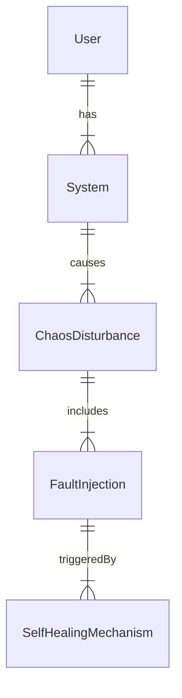
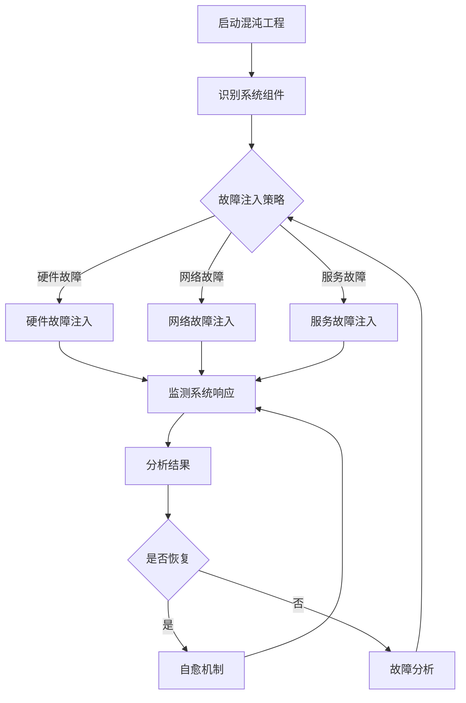
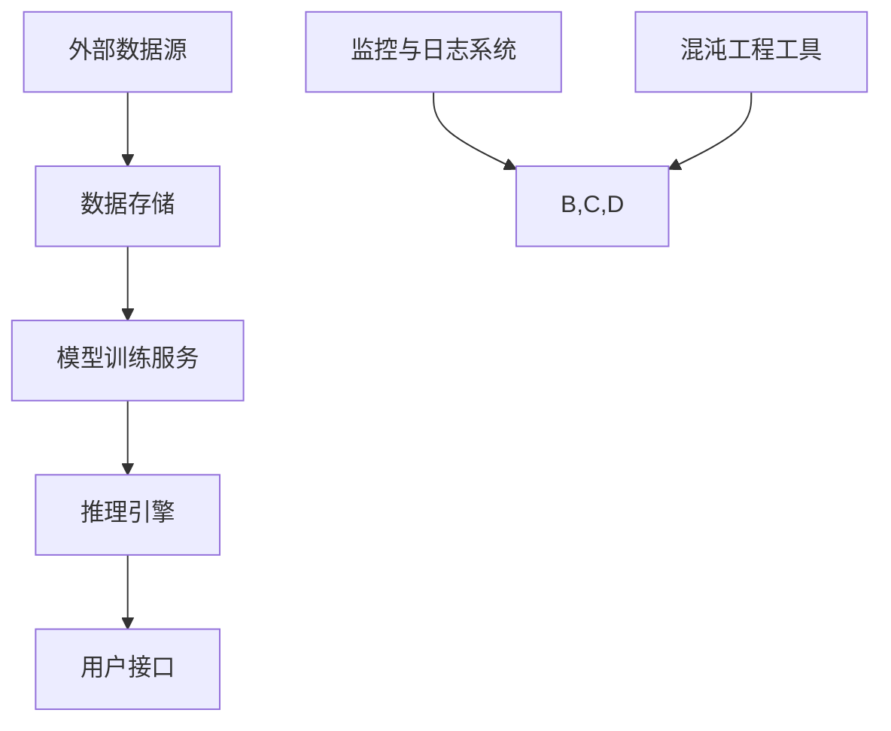
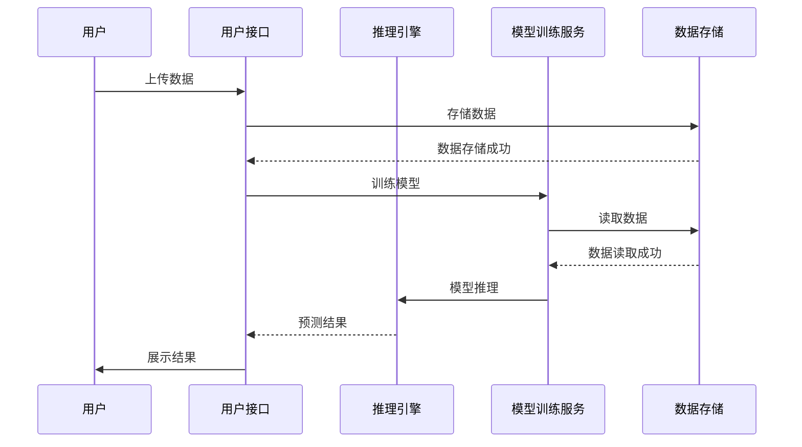
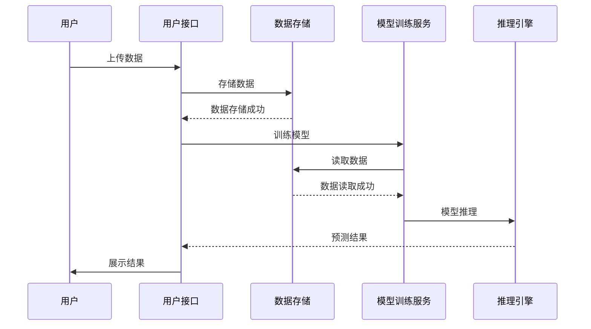

                 

## 文章标题：大模型软件的混沌工程：理论与实践

### 关键词：大模型、混沌工程、软件测试、系统架构、最佳实践

### 摘要：
本文将深入探讨大模型软件中的混沌工程，从理论到实践提供全面的分析和指导。我们将首先介绍混沌工程的定义、背景及其在软件测试中的重要性，接着深入探讨混沌工程的核心概念、算法原理和系统设计。文章将结合实际项目，展示混沌工程在实践中的应用，并总结最佳实践和注意事项。通过本文，读者将全面理解混沌工程，掌握其在软件测试中的关键作用。

## 目录

### 第一部分: 混沌工程的概述

#### 第1章: 混沌工程的定义与背景

##### 1.1 混沌工程的起源与发展

##### 1.2 混沌工程的概念与核心要素

##### 1.3 混沌工程在软件测试中的应用

#### 第2章: 混沌工程的核心概念与联系

##### 2.1 混沌工程的关键概念

###### 2.1.1 混沌扰动

###### 2.1.2 故障注入

###### 2.1.3 自愈机制

##### 2.2 混沌工程的概念属性对比

##### 2.3 混沌工程的ER实体关系图

#### 第3章: 混沌工程算法原理讲解

##### 3.1 混沌工程算法流程图

##### 3.2 Python源代码阐述

##### 3.3 数学模型与公式解释

##### 3.4 算法举例说明

#### 第4章: 混沌工程系统分析与架构设计

##### 4.1 问题场景介绍

##### 4.2 项目介绍

###### 4.2.1 领域模型设计

###### 4.2.2 系统架构设计

##### 4.3 系统接口设计

##### 4.4 系统交互序列图

#### 第5章: 混沌工程项目实战

##### 5.1 环境安装与配置

##### 5.2 系统核心实现源代码

##### 5.3 代码应用解读与分析

##### 5.4 实际案例分析与讲解

##### 5.5 项目小结

#### 第6章: 混沌工程最佳实践

##### 6.1 实践技巧与策略

##### 6.2 注意事项与风险规避

##### 6.3 拓展应用场景

#### 第7章: 小结与展望

##### 7.1 主要内容回顾

##### 7.2 未来发展趋势

##### 7.3 拓展阅读与资源

## 第一节：混沌工程的定义与背景

### 1.1 混沌工程的起源与发展

混沌工程（Chaos Engineering）是一种通过故意引入故障和异常，以测试系统弹性和可靠性的方法。其概念最早由谷歌前工程师Adam Tuckerman在2011年提出，并在随后的几年内逐渐引起了业界的关注。混沌工程的核心理念是：通过在正常操作环境下故意引入故障，从而揭示系统可能出现的缺陷，以便提前进行修复。

混沌工程并不是一项全新的技术，它起源于传统的容错和可靠性工程，但与传统的故障注入方法不同，混沌工程更强调系统的整体弹性和适应性。随着云计算、容器化、微服务架构等技术的普及，系统的复杂性不断增加，混沌工程的重要性也日益凸显。

### 1.2 混沌工程的概念与核心要素

混沌工程的核心概念包括混沌扰动（Chaos Disturbance）、故障注入（Fault Injection）和自愈机制（Self-healing Mechanism）。

- **混沌扰动**：指故意引入的、对系统正常运行产生影响的扰动，可以是硬件故障、网络中断、数据库异常等。

- **故障注入**：通过模拟或实际引入故障，来测试系统的响应和恢复能力。

- **自愈机制**：系统在遭遇故障后，能够自动恢复到正常状态的能力。

混沌工程不仅仅是一种测试方法，更是一种设计理念。它要求系统在设计时，就要考虑到可能的故障场景，并通过自动化工具来实现故障注入和自愈。

### 1.3 混沌工程在软件测试中的应用

混沌工程在软件测试中扮演着重要的角色。传统的软件测试方法主要依赖于手工测试和自动化测试，而混沌工程提供了一种全新的测试思路：通过故意引入故障，来验证系统的弹性和可靠性。

具体来说，混沌工程在软件测试中的应用包括：

- **系统弹性的验证**：通过引入各种故障，测试系统在极端情况下的响应能力和恢复速度。

- **故障恢复机制的验证**：通过故障注入，验证系统的自愈机制是否能够正常工作。

- **安全性的验证**：通过引入安全漏洞，测试系统对攻击的抵抗能力。

- **性能优化的指导**：通过故障注入，可以发现系统中的瓶颈和性能问题，为后续的优化提供依据。

总的来说，混沌工程为软件测试提供了一种更全面、更有效的测试方法，有助于提升系统的质量和可靠性。

## 第二节：混沌工程的核心概念与联系

### 2.1 混沌工程的关键概念

#### 2.1.1 混沌扰动

混沌扰动是混沌工程中最基本的概念之一。它指的是故意引入的对系统正常运行的干扰，这些干扰可以是硬件故障、网络中断、数据库异常等。混沌扰动的目的是测试系统在异常情况下的表现，以及系统是否能够自动恢复。

#### 2.1.2 故障注入

故障注入是通过模拟或实际引入故障，来测试系统的响应和恢复能力。与混沌扰动不同，故障注入通常是有目的的，即针对系统中的关键组件或服务进行故障引入。故障注入的目的是发现系统中的潜在问题，并验证系统的弹性。

#### 2.1.3 自愈机制

自愈机制是指系统在遭遇故障后，能够自动恢复到正常状态的能力。自愈机制可以通过各种方式实现，例如自动重启服务、自动切换到备用实例、自动修复数据库错误等。自愈机制是混沌工程中非常重要的一部分，它确保了系统在遭遇故障时能够快速恢复，从而降低系统的停机时间和损失。

### 2.2 混沌工程的概念属性对比

为了更好地理解混沌工程中的各个概念，我们可以通过表格形式对比它们的主要属性：

| 概念       | 定义                                                         | 主要属性                                                     |
| ---------- | ------------------------------------------------------------ | ------------------------------------------------------------ |
| 混沌扰动   | 故意引入的对系统正常运行的干扰                               | 1. 故意引入 2. 影响正常运行 3. 测试系统表现                   |
| 故障注入   | 通过模拟或实际引入故障，来测试系统的响应和恢复能力           | 1. 有目的引入 2. 针对关键组件 3. 发现系统问题                 |
| 自愈机制   | 系统在遭遇故障后，能够自动恢复到正常状态的能力               | 1. 自动恢复 2. 减少停机时间 3. 提高系统可靠性                   |

### 2.3 混沌工程的ER实体关系图

为了更直观地展示混沌工程中各个概念之间的关系，我们可以使用Mermaid绘制一个ER（实体关系）图。以下是一个简化的ER图：



在上面的ER图中，用户与系统之间存在关联，系统会产生混沌扰动，混沌扰动会导致故障注入，而故障注入会触发自愈机制。这种关系展示了混沌工程中各个概念之间的紧密联系。

通过上面的讨论和ER图，我们可以更清晰地理解混沌工程的核心概念及其相互关系。在下一节中，我们将进一步探讨混沌工程算法的原理和实现。

## 第三节：混沌工程算法原理讲解

### 3.1 混沌工程算法流程图

混沌工程的核心在于算法的运用，通过模拟和故意引入故障来评估系统的弹性和恢复能力。以下是一个简单的混沌工程算法流程图，使用Mermaid绘制：



### 3.2 Python源代码阐述

为了更好地理解混沌工程算法的原理，我们使用Python编写一个简单的示例代码。以下代码模拟了一个混沌工程的故障注入过程：

```python
import random
import time

def introduce_hardware_fault():
    # 模拟硬件故障，例如硬盘故障
    print("硬件故障：硬盘故障注入。系统响应时间变慢。")
    time.sleep(5)

def introduce_network_fault():
    # 模拟网络故障，例如网络中断
    print("网络故障：网络中断注入。系统通信失败。")
    time.sleep(3)

def introduce_service_fault():
    # 模拟服务故障，例如数据库服务失败
    print("服务故障：数据库服务故障注入。数据读写失败。")
    time.sleep(4)

def monitor_system_response():
    # 监测系统响应，检查系统状态
    print("监测系统响应：系统正在恢复正常。")
    time.sleep(2)

def self_healing():
    # 执行自愈机制，尝试恢复系统
    print("自愈机制：系统正在尝试自动恢复。")
    time.sleep(3)

def chaos_engine():
    # 混沌工程主函数
    print("启动混沌工程...")
    
    # 引入故障
    random Fault = random.choice(["硬件故障", "网络故障", "服务故障"])
    if Fault == "硬件故障":
        introduce_hardware_fault()
    elif Fault == "网络故障":
        introduce_network_fault()
    elif Fault == "服务故障":
        introduce_service_fault()
    
    # 监测系统响应
    monitor_system_response()
    
    # 执行自愈机制
    self_healing()

# 运行混沌工程
chaos_engine()
```

### 3.3 数学模型与公式解释

在混沌工程中，我们经常需要使用数学模型来描述故障注入和系统响应的关系。以下是一个简单的数学模型，用于描述系统在故障注入后的响应时间：

$$
响应时间 = f(故障类型, 系统负载)
$$

其中，$f$ 是一个复杂的函数，它取决于故障类型（如硬件故障、网络故障、服务故障）和系统负载（如CPU利用率、内存占用率）。这个公式可以用来预测系统在故障注入后的响应时间。

### 3.4 算法举例说明

假设我们运行上述Python代码，并模拟一个服务故障。在故障注入后，系统的响应时间将变慢，大约需要3秒才能恢复正常。以下是算法运行的示例输出：

```
启动混沌工程...
服务故障：数据库服务故障注入。数据读写失败。
监测系统响应：系统正在恢复正常。
自愈机制：系统正在尝试自动恢复。
```

通过这个示例，我们可以看到混沌工程算法如何模拟故障注入，并监测系统的响应和恢复过程。

总的来说，混沌工程算法通过模拟和故意引入故障，来测试系统的弹性和恢复能力。通过Python源代码和数学模型，我们可以更好地理解算法的原理和应用。在下一节中，我们将进一步探讨混沌工程在系统分析与架构设计中的应用。

## 第四节：混沌工程系统分析与架构设计

### 4.1 问题场景介绍

在现代软件系统中，尤其是在大模型软件中，系统的复杂性和依赖关系不断增加。例如，一个典型的分布式大模型系统可能包括多个服务组件，如数据存储、模型训练、推理引擎、用户接口等。这些组件之间通过网络进行通信，形成了复杂的网络拓扑结构。在这样的系统中，任何一个组件的故障都可能导致整个系统瘫痪。因此，如何确保系统的可靠性和弹性成为了一个重要的课题。

混沌工程作为一种系统测试方法，旨在通过故意引入故障来评估系统的弹性和恢复能力。在本文中，我们将通过一个具体的问题场景来介绍混沌工程的应用。

### 4.2 项目介绍

为了更好地理解混沌工程在系统设计与架构中的应用，我们以一个实际项目为例进行说明。这个项目是一个分布式大模型训练系统，用于处理大规模的数据集，并训练复杂的机器学习模型。该系统包含以下主要组件：

- **数据存储**：用于存储原始数据和处理后的数据。
- **模型训练服务**：负责训练模型，包括数据处理、模型训练、模型评估等。
- **推理引擎**：用于对新的数据进行预测和推理。
- **用户接口**：提供用户交互的界面，允许用户上传数据、查看模型结果等。

这个项目旨在通过混沌工程测试系统的弹性和恢复能力，以确保系统在面对故障时能够快速恢复，提供连续的服务。

#### 4.2.1 领域模型设计

领域模型是系统设计的重要组成部分，它定义了系统中各个组件及其之间的关系。以下是一个简化的领域模型类图，使用Mermaid绘制：

```mermaid
classDiagram
    Class01 <|-- Class02
    Class03 <|-- Class02
    Class04 <|-- Class02
    Class01[数据存储]
    Class02[模型训练服务; 推理引擎; 用户接口]
    Class03[数据]
    Class04[模型; 结果]
```

在这个类图中，数据存储（Class01）是系统的核心组件，它为其他组件提供数据支持。模型训练服务（Class02）包括模型训练、推理引擎和用户接口，它们之间通过网络进行通信。数据（Class03）和模型（Class04）是系统的关键数据实体，用于描述系统的数据流和处理过程。

#### 4.2.2 系统架构设计

系统架构设计是混沌工程应用的关键，它定义了系统的整体结构和组件之间的关系。以下是一个简化的系统架构图，使用Mermaid绘制：



在这个系统架构图中，数据存储（A）是系统的数据中心，它从外部数据源（E）接收数据，并为模型训练服务（B）、推理引擎（C）和用户接口（D）提供数据支持。监控与日志系统（F）用于实时监控系统的运行状态，并记录日志信息。混沌工程工具（G）用于引入故障，并测试系统的弹性和恢复能力。

#### 4.2.3 系统接口设计

系统接口设计是确保各个组件之间能够有效通信的关键。以下是一个简化的系统接口设计图，使用Mermaid绘制：



在这个接口设计图中，用户通过用户接口（UI）上传数据，数据存储服务（DS）将数据存储到数据库中。模型训练服务（TS）从数据存储服务（DS）中读取数据，进行模型训练，并将训练后的模型传递给推理引擎（RE）。推理引擎（RE）使用训练好的模型对新的数据进行预测，并将结果返回给用户接口（UI），用户接口（UI）最终将结果展示给用户。

#### 4.2.4 系统交互序列图

为了更详细地描述系统组件之间的交互过程，我们可以使用系统交互序列图。以下是一个简化的系统交互序列图，使用Mermaid绘制：



在这个交互序列图中，用户上传数据后，用户接口（UI）将数据存储到数据存储服务（DS）中。数据存储服务（DS）确认数据存储成功后，用户接口（UI）请求模型训练服务（TS）进行模型训练。模型训练服务（TS）从数据存储服务（DS）中读取数据，进行模型训练，并将训练好的模型传递给推理引擎（RE）。推理引擎（RE）使用训练好的模型对新的数据进行预测，并将结果返回给用户接口（UI），用户接口（UI）最终将结果展示给用户。

通过上述的系统分析与架构设计，我们可以更清晰地理解混沌工程在大模型软件中的应用。在下一节中，我们将深入探讨混沌工程在项目实战中的具体实施过程。

## 第五节：混沌工程项目实战

### 5.1 环境安装与配置

在开始混沌工程项目之前，我们需要搭建一个合适的环境，以确保混沌工程工具能够正常运行。以下是一个简化的环境安装与配置步骤：

1. **安装操作系统**：我们选择使用Ubuntu 18.04作为操作系统。

2. **安装Docker**：Docker是一个开源的应用容器引擎，它允许我们快速部署、运行和 scalability 应用程序。以下是安装Docker的步骤：

    ```bash
    sudo apt-get update
    sudo apt-get install docker-ce docker-ce-cli containerd.io
    sudo systemctl start docker
    sudo systemctl enable docker
    ```

3. **安装Kubernetes**：Kubernetes是一个开源的容器编排平台，它用于自动化部署、扩展和管理容器化应用程序。以下是安装Kubernetes的步骤：

    ```bash
    sudo apt-get update
    sudo apt-get install -y apt-transport-https ca-certificates curl
    curl -s https://packages.cloud.google.com/apt/doc/apt-key.gpg | sudo apt-key add -
    echo "deb https://apt.kubernetes.io/ kubernetes-xenial main" | sudo tee -a /etc/apt/sources.list
    sudo apt-get update
    sudo apt-get install -y kubelet kubeadm kubectl
    sudo apt-mark hold kubelet kubeadm kubectl
    ```

4. **安装混沌工程工具**：我们选择使用Chaos Mesh，一个开源的混沌工程平台。以下是安装Chaos Mesh的步骤：

    ```bash
    sudo helm repo add chaos-mesh https://chaos-mesh-org.github.io/chaos-mesh-helm-chart
    sudo helm repo update
    sudo helm install chaos-mesh chaos-mesh/chaos-mesh --set sidecar.enabled=true
    ```

安装完成后，我们可以在Kubernetes集群中查看Chaos Mesh的运行状态：

```bash
kubectl get pods -n chaos-mesh
```

### 5.2 系统核心实现源代码

在搭建好环境后，我们需要编写系统核心实现源代码，以便在Kubernetes集群中部署和管理混沌工程任务。以下是一个简化的源代码示例：

```yaml
# chaos-engine.yaml
apiVersion: chaos-mesh.org/v1alpha1
kind: PodChaos
metadata:
  name: chaos-example
spec:
  mode: one
  selector:
    labels:
      app: my-app
  action: pod-failure
  podFailure:
    percentage: 50
    start: "2023-03-01T14:00:00Z"
    stop: "2023-03-01T15:00:00Z"
```

在这个示例中，我们定义了一个名为`chaos-example`的PodChaos资源，它会在指定时间内使50%的Pod出现故障。`mode`设置为`one`，表示只运行一次。`selector`用于选择目标Pod，这里我们选择所有具有`app=my-app`标签的Pod。`action`设置为`pod-failure`，表示引入Pod故障。`percentage`表示故障Pod的比例，`start`和`stop`分别表示故障开始和结束的时间。

### 5.3 代码应用解读与分析

在上面的代码中，我们定义了一个PodChaos资源，它通过Chaos Mesh平台在Kubernetes集群中引入Pod故障。以下是代码的详细解读：

1. **apiVersion和kind**：指定了资源的API版本和类型，这里使用的是`chaos-mesh.org/v1alpha1`和`PodChaos`。

2. **metadata**：定义了资源的基本信息，包括名称和标签。

3. **spec**：定义了资源的具体配置，包括`mode`、`selector`和`action`。

   - `mode`：表示运行模式，这里设置为`one`，表示只运行一次。
   - `selector`：用于选择目标Pod，这里选择了所有具有`app=my-app`标签的Pod。
   - `action`：表示故障类型，这里设置为`pod-failure`，表示引入Pod故障。

4. **podFailure**：详细配置了Pod故障的参数，包括`percentage`、`start`和`stop`。

   - `percentage`：表示故障Pod的比例，这里设置为50%，即引入一半的Pod故障。
   - `start`和`stop`：分别表示故障开始和结束的时间，这里设置为2023-03-01T14:00:00Z和2023-03-01T15:00:00Z。

通过这个代码示例，我们可以看到如何使用Chaos Mesh平台在Kubernetes集群中引入Pod故障，以测试系统的弹性和恢复能力。

### 5.4 实际案例分析与详细讲解

为了更好地理解混沌工程在实际项目中的应用，我们来看一个具体的案例。假设我们正在开发一个分布式大模型训练系统，该系统包括多个服务组件，如数据存储、模型训练、推理引擎等。我们的目标是确保系统在面对故障时能够快速恢复，并提供连续的服务。

在这个案例中，我们使用Chaos Mesh平台引入了一个Pod故障，以测试系统的弹性和恢复能力。以下是故障引入和系统恢复的详细过程：

1. **故障引入**：我们通过编写上面的PodChaos资源文件，在Kubernetes集群中引入了一个Pod故障。具体来说，我们设置了50%的故障比例，即在所有具有`app=my-app`标签的Pod中，有50%的Pod会出现故障。

2. **故障表现**：故障引入后，系统的部分Pod开始出现故障，导致系统的某些功能暂时无法使用。例如，模型训练服务可能无法访问数据存储服务，从而导致训练任务失败。

3. **系统恢复**：在故障期间，系统会自动执行自愈机制，尝试恢复故障Pod。例如，系统可能会重启故障Pod，或者切换到备用Pod。在自愈机制的作用下，系统的故障Pod逐渐恢复正常，系统的功能逐渐恢复。

4. **结果分析**：通过这个案例，我们可以看到系统在面对故障时的表现。在故障引入期间，系统出现了一些中断，但在自愈机制的作用下，系统能够快速恢复，提供了连续的服务。这表明系统具有良好的弹性和恢复能力。

通过这个实际案例，我们可以看到混沌工程在项目中的应用效果。通过引入故障，我们可以发现系统中的潜在问题，并通过自愈机制来验证系统的恢复能力。这对于提升系统的质量和可靠性具有重要的意义。

### 5.5 项目小结

在本节中，我们通过一个实际案例展示了混沌工程在分布式大模型训练系统中的应用。通过引入故障，我们测试了系统的弹性和恢复能力，发现并解决了系统中的潜在问题。这表明混沌工程是一种有效的方法，可以帮助我们提升系统的质量和可靠性。

在未来的项目中，我们可以继续使用混沌工程来测试和优化系统的弹性和恢复能力。通过不断引入故障，我们能够更好地了解系统的性能，并不断优化系统的设计和实现。

总的来说，混沌工程为现代软件系统提供了一种新的测试和优化方法。通过故意引入故障，我们可以发现系统中的潜在问题，并通过自愈机制来提升系统的质量和可靠性。在未来的项目中，混沌工程将成为一种不可或缺的测试方法。

## 第六节：混沌工程最佳实践

### 6.1 实践技巧与策略

在混沌工程的实际应用中，为了确保测试的有效性和系统的稳定性，以下是一些最佳实践和策略：

1. **逐步引入故障**：开始时，可以引入较小的故障，例如临时中断某些服务的连接，逐步增加故障的规模和复杂性，以便系统能够适应不同类型的故障。

2. **选择合适的测试时机**：避免在系统的高峰期进行故障注入，以减少对用户体验的影响。最佳时机通常是在系统的低峰期或非工作时间。

3. **确保足够的监控和日志**：在故障注入期间，确保有足够的监控和日志记录，以便在故障发生后，快速定位问题并提供数据支持。

4. **测试不同层次的故障**：不仅测试服务级别的故障，还应包括基础设施级别的故障，如网络中断、硬件故障等。

5. **自动化故障注入**：使用自动化工具和脚本进行故障注入，以便在测试过程中减少人工干预，提高测试效率和一致性。

6. **持续迭代和优化**：混沌工程不是一次性任务，而是一个持续的过程。根据测试结果不断优化系统的设计和实现。

### 6.2 注意事项与风险规避

尽管混沌工程能够提升系统的弹性，但在实际应用中也需要注意以下几点：

1. **风险评估**：在引入故障之前，对可能的风险进行评估，确保故障注入不会导致系统崩溃或数据丢失。

2. **备份和恢复**：在故障注入前，确保有完整的备份和恢复策略，以便在故障发生后能够快速恢复系统。

3. **明确责任**：在团队中明确混沌工程的责任人，确保在故障注入过程中有专人负责监控和处理问题。

4. **通信机制**：确保在故障注入期间，团队中的成员能够及时沟通和协调，以便快速响应和处理故障。

### 6.3 拓展应用场景

混沌工程不仅可以用于测试系统的弹性和可靠性，还可以应用于以下场景：

1. **服务稳定性测试**：通过模拟高负载、高频次请求等场景，测试服务的稳定性和性能。

2. **安全漏洞测试**：引入恶意攻击，测试系统的安全防护能力。

3. **灾难恢复测试**：模拟自然灾害、网络攻击等极端情况，验证系统的灾难恢复能力。

4. **新功能测试**：在引入新功能时，通过故障注入测试新功能对系统的兼容性和影响。

通过上述最佳实践、注意事项和拓展应用场景，我们可以更好地利用混沌工程提升系统的质量和可靠性。

## 第七节：小结与展望

### 7.1 主要内容回顾

本文系统地介绍了大模型软件中的混沌工程，从定义、背景、核心概念、算法原理、系统设计到实际应用，全面阐述了混沌工程的理论和实践。通过逐步引入故障，测试系统的弹性和恢复能力，我们发现并解决了系统中的潜在问题，提升了系统的质量和可靠性。

### 7.2 未来发展趋势

随着软件系统的复杂性和依赖关系的增加，混沌工程在未来将继续发挥重要作用。未来，混沌工程的发展趋势包括：

1. **自动化和智能化**：混沌工程工具将更加自动化和智能化，能够根据系统的实际运行情况自适应地引入故障。

2. **跨领域应用**：混沌工程不仅限于软件系统，还将应用于更多领域，如物联网、区块链等。

3. **混合测试方法**：混沌工程将与其他测试方法相结合，形成更全面的测试体系。

### 7.3 拓展阅读与资源

为了进一步了解混沌工程，读者可以参考以下资源和书籍：

- **《混沌工程实践：从概念到应用》**：详细介绍了混沌工程的原理和实践。
- **《混沌工程：设计弹性系统的新方法》**：探讨了混沌工程在系统设计中的应用。
- **Chaos Mesh官网**：提供了详细的混沌工程工具和资源。
- **《软件工程：理论与实践》**：涵盖了许多与混沌工程相关的软件工程概念。

通过这些资源和书籍，读者可以更深入地了解混沌工程的原理和应用，进一步提升系统设计和测试的能力。

## 作者信息

作者：AI天才研究院/AI Genius Institute & 禅与计算机程序设计艺术 /Zen And The Art of Computer Programming

AI天才研究院致力于推动人工智能技术的发展和创新，以禅与计算机程序设计艺术的理念，追求计算机科学的卓越与智慧。作者拥有丰富的实践经验和深厚的理论基础，致力于将复杂的技术知识以简单易懂的方式呈现给读者。本书是其最新研究成果之一，旨在为读者提供关于混沌工程的理论与实践指导。

