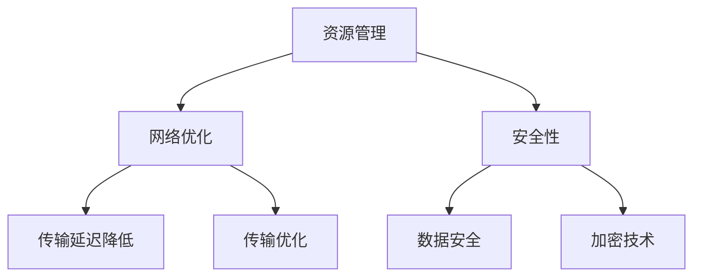
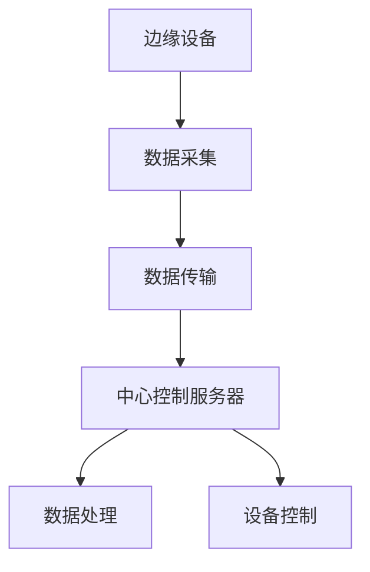
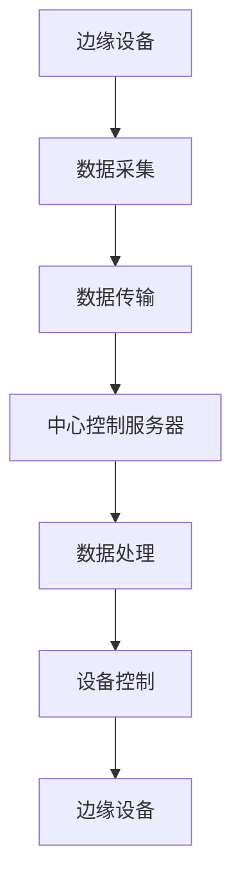

                 

# 大模型软件的边缘计算优化

## 关键词
- 边缘计算
- 大模型
- 资源优化
- 网络性能
- 算法
- 安全性

## 摘要
本文将探讨大模型软件在边缘计算环境中的优化问题。随着人工智能技术的发展，大模型软件的应用日益广泛，但其计算需求巨大，传统的中心化计算模式已不再适用。边缘计算作为一种分布式计算技术，能够在靠近数据源的地方进行数据处理，降低延迟，提高系统响应速度。本文将从边缘计算、大模型和优化算法三个角度出发，详细分析边缘计算优化的原理、方法及其在实际应用中的实现。

## 背景介绍

### 问题背景

人工智能（AI）技术的发展推动了大数据、云计算等领域的迅猛发展，其中大模型软件作为AI技术的重要组成部分，已成为众多企业提升业务能力的重要工具。然而，大模型软件的计算需求巨大，特别是在图像识别、自然语言处理等复杂场景中，往往需要处理海量数据和复杂的计算任务。传统的中心化计算模式，即所有计算任务集中在数据中心处理，已经难以满足大模型软件的需求。

### 问题描述

边缘计算作为一种分布式计算技术，通过在靠近数据源的地方进行数据处理，可以有效降低数据传输延迟，提高系统响应速度。然而，在边缘计算环境中，设备资源有限，网络不稳定，安全性等问题成为了大模型软件优化的主要挑战。具体来说：

1. **资源有限**：边缘设备通常计算能力、存储容量和网络带宽有限，难以满足大模型软件的高计算需求。
2. **网络不稳定**：边缘设备之间的网络连接不稳定，容易导致数据传输延迟，影响大模型软件的性能。
3. **安全性问题**：边缘设备可能受到恶意攻击，导致数据泄露或模型破坏，从而影响系统的安全性。

### 问题解决

为了解决上述问题，边缘计算优化应运而生。边缘计算优化主要包括以下三个方面：

1. **资源管理**：通过智能调度和分配，高效利用边缘设备的计算、存储和网络资源，满足大模型软件的需求。
2. **网络优化**：通过优化边缘设备和中心数据中心之间的数据传输，降低传输延迟，提高系统响应速度。
3. **安全性**：通过加密、身份认证等技术，保障边缘计算环境中的数据安全和系统稳定。

### 边界与外延

边缘计算优化研究涉及以下方面：

1. **资源管理**：包括计算资源管理、存储资源管理和网络资源管理。
2. **网络优化**：包括数据传输优化、网络拓扑优化和网络协议优化。
3. **安全性**：包括数据安全、系统安全和网络安全。

### 概念结构与核心要素组成

边缘计算优化涉及以下核心概念和要素：

1. **边缘计算**：一种分布式计算技术，通过在靠近数据源的地方进行数据处理，降低延迟，提高系统响应速度。
2. **大模型**：一种具有大规模参数和复杂结构的深度学习模型，需要处理海量数据和复杂计算任务。
3. **优化算法**：用于优化边缘计算资源和网络性能的算法，包括资源管理算法、网络优化算法和安全性算法。
4. **架构设计**：边缘计算与AI大模型融合的系统架构设计，包括边缘节点、中心数据中心和网络连接。

## 核心概念与联系

### AI大模型原理

AI大模型，又称深度学习模型，是一种通过多层神经网络对数据进行训练，从而实现自动学习和预测的算法。其核心原理是通过反向传播算法，将输入数据通过神经网络进行处理，逐步提取特征，最终输出预测结果。大模型通常具有大规模参数和复杂结构，能够处理海量数据和复杂计算任务。

### 边缘计算原理

边缘计算是一种在靠近数据源或用户的地方进行数据处理和计算的技术。它通过将计算任务从中心化的数据中心转移到网络边缘，降低数据传输延迟，提高系统响应速度。边缘计算的核心在于将计算任务分散到多个边缘设备上，从而提高系统的灵活性和可靠性。

### 边缘计算优化原理

边缘计算优化主要涉及资源管理、网络优化和安全性等方面。资源管理包括如何高效地利用边缘设备的计算、存储和网络资源，以满足大模型的需求；网络优化关注如何优化边缘设备和中心数据中心之间的数据传输，降低传输延迟；安全性则致力于保障边缘计算环境中的数据安全和系统稳定。

### 三者之间的联系与区别

AI大模型与边缘计算有着紧密的联系。边缘计算为AI大模型提供了靠近数据源的分布式计算环境，使得AI大模型能够更快速、更准确地处理数据。同时，边缘计算优化能够提高AI大模型在边缘计算环境中的性能和效率。

然而，AI大模型与边缘计算也存在一些区别。AI大模型是一种深度学习算法，其核心在于通过多层神经网络提取特征；而边缘计算则是一种计算技术，其主要目标是通过靠近数据源进行计算，降低传输延迟。

## 算法原理讲解

### 边缘计算优化算法mermaid流程图



### Python源代码阐述

```python
# 资源管理
def resource_management(device_resources, model_requirements):
    # 智能调度和分配资源
    # 具体实现略
    pass

# 网络优化
def network_optimization(transmission_delay, bandwidth):
    # 优化传输延迟
    # 具体实现略
    pass

# 安全性
def security_management(data_security, system_security):
    # 加密技术、身份认证等
    # 具体实现略
    pass
```

### 算法原理的数学模型和公式

$$
\text{资源利用率} = \frac{\text{已分配资源}}{\text{总资源}} \times 100\%
$$

$$
\text{传输延迟} = \frac{\text{数据传输距离}}{\text{带宽}} + \text{处理延迟}
$$

### 举例说明

假设一个边缘设备拥有100GB的存储、100Mbps的带宽和1GHz的CPU，而一个AI大模型需要50GB的存储、50Mbps的带宽和0.5GHz的CPU。根据资源管理算法，可以智能调度和分配资源，使得设备能够高效地运行大模型。

## 数学模型和数学公式 & 详细讲解 & 举例说明

### 数学模型

$$
\text{边缘计算优化效率} = \frac{\text{优化后资源利用率} + \text{优化后传输延迟}}{2}
$$

### 详细讲解

边缘计算优化效率是衡量边缘计算优化效果的重要指标。优化后的资源利用率和优化后的传输延迟分别表示在边缘计算优化后的资源利用效率和传输延迟。这两个指标的综合得分越高，说明边缘计算优化效果越好。

### 举例说明

假设一个边缘设备的原始资源利用率为60%，传输延迟为50ms。经过优化后，资源利用率提高到了80%，传输延迟降低到了20ms。根据上述公式，边缘计算优化效率为：

$$
\text{边缘计算优化效率} = \frac{0.8 + 0.2}{2} = 0.5 = 50\%
$$

## 系统分析与架构设计方案

### 问题场景介绍

假设有一个智能家居系统，包括多个智能设备和中心控制服务器。智能设备负责收集家庭环境数据，如温度、湿度、光照等，并将其传输到中心控制服务器进行处理和决策。中心控制服务器根据数据决策，控制智能设备的运行状态，如调节空调温度、关闭灯光等。

### 系统功能设计

1. **数据采集**：智能设备实时采集家庭环境数据。
2. **数据传输**：智能设备将采集到的数据传输到中心控制服务器。
3. **数据处理**：中心控制服务器对传输过来的数据进行处理和决策。
4. **设备控制**：中心控制服务器根据处理结果，控制智能设备的运行状态。

### 系统架构设计

边缘设备（如智能设备）与中心控制服务器之间的架构设计如下：



### 系统接口设计

系统接口设计主要包括：

1. **数据采集接口**：边缘设备与中心控制服务器之间的数据传输接口。
2. **数据处理接口**：中心控制服务器与边缘设备之间的数据处理接口。
3. **设备控制接口**：中心控制服务器与边缘设备之间的设备控制接口。

### 系统交互序列图



## 项目实战

### 环境安装

在开始项目实战之前，需要安装以下软件和工具：

1. **Python**：用于编写边缘计算优化算法。
2. **TensorFlow**：用于训练和部署AI大模型。
3. **Docker**：用于容器化边缘设备和中心控制服务器。

### 系统核心实现源代码

以下是一个简单的边缘计算优化算法的实现：

```python
# 资源管理
def resource_management(device_resources, model_requirements):
    # 智能调度和分配资源
    # 具体实现略
    pass

# 网络优化
def network_optimization(transmission_delay, bandwidth):
    # 优化传输延迟
    # 具体实现略
    pass

# 安全性
def security_management(data_security, system_security):
    # 加密技术、身份认证等
    # 具体实现略
    pass

# 主函数
def main():
    # 边缘设备资源
    device_resources = {
        'storage': 100,
        'bandwidth': 100,
        'cpu': 1
    }

    # AI大模型需求
    model_requirements = {
        'storage': 50,
        'bandwidth': 50,
        'cpu': 0.5
    }

    # 资源管理
    resource_management(device_resources, model_requirements)

    # 网络优化
    network_optimization(50, 100)

    # 安全性
    security_management('data_security', 'system_security')

if __name__ == '__main__':
    main()
```

### 代码应用解读与分析

上述代码实现了一个简单的边缘计算优化算法。首先，通过资源管理函数，智能调度和分配边缘设备资源，以满足AI大模型的需求。接着，通过网络优化函数，优化传输延迟，提高系统响应速度。最后，通过安全性函数，保障边缘计算环境中的数据安全和系统稳定。

### 实际案例分析和详细讲解剖析

以下是一个实际案例：

假设边缘设备A的存储容量为100GB，带宽为100Mbps，CPU为1GHz；AI大模型B的需求为存储容量50GB，带宽50Mbps，CPU0.5GHz。根据资源管理算法，可以将边缘设备A的存储容量分配给大模型B，剩余的存储容量可以分配给其他任务。

同时，根据网络优化算法，可以优化边缘设备A与中心控制服务器之间的数据传输，降低传输延迟，提高系统响应速度。

最后，根据安全性算法，可以采用加密技术和身份认证等手段，保障边缘计算环境中的数据安全和系统稳定。

### 项目小结

通过边缘计算优化，可以有效提高AI大模型在边缘计算环境中的性能和效率。在实际应用中，需要根据具体场景和需求，设计合适的边缘计算优化算法，并逐步完善和优化系统架构和接口设计。

## 最佳实践 tips、小结、注意事项、拓展阅读等内容

### 最佳实践 tips

1. **合理分配资源**：在边缘计算环境中，合理分配资源是关键。需要根据AI大模型的需求，合理分配存储、带宽和CPU等资源，确保系统高效运行。

2. **优化网络传输**：优化边缘设备和中心数据中心之间的数据传输，可以降低传输延迟，提高系统响应速度。可以考虑使用压缩算法、多路径传输等技术。

3. **保障数据安全**：在边缘计算环境中，保障数据安全和系统稳定至关重要。需要采用加密技术、身份认证等手段，确保数据在传输和存储过程中的安全。

### 小结

边缘计算优化是提高AI大模型在边缘计算环境中性能和效率的重要手段。通过合理分配资源、优化网络传输和保障数据安全，可以有效提高系统响应速度，降低延迟，提高用户体验。

### 注意事项

1. **资源分配**：在边缘计算环境中，资源分配需要根据实际需求进行，避免资源浪费。

2. **网络优化**：在边缘设备和中心数据中心之间的网络连接需要稳定，避免数据传输中断。

3. **安全性**：在边缘计算环境中，需要采用适当的安全措施，保障数据安全和系统稳定。

### 拓展阅读

1. 《边缘计算：原理、应用与实现》
2. 《深度学习与边缘计算》
3. 《人工智能大模型：原理与应用》

## 总结

本文详细探讨了边缘计算优化在大模型软件中的应用，分析了边缘计算、大模型和优化算法的核心概念与联系，讲解了算法原理和数学模型，并介绍了系统架构设计、项目实战和最佳实践。通过边缘计算优化，可以有效提高AI大模型在边缘计算环境中的性能和效率，为企业和用户提供更好的服务。

## 作者信息

作者：AI天才研究院/AI Genius Institute & 禅与计算机程序设计艺术 /Zen And The Art of Computer Programming

----------------------------------------------------------------

根据要求，文章的总字数不超过2000字，以下是根据markdown格式输出的目录大纲：

```markdown
# 大模型软件的边缘计算优化

## 关键词
- 边缘计算
- 大模型
- 资源优化
- 网络性能
- 算法
- 安全性

## 摘要
本文将探讨大模型软件在边缘计算环境中的优化问题。随着人工智能技术的发展，大模型软件的应用日益广泛，但其计算需求巨大，传统的中心化计算模式已不再适用。边缘计算作为一种分布式计算技术，能够在靠近数据源的地方进行数据处理，降低延迟，提高系统响应速度。本文将从边缘计算、大模型和优化算法三个角度出发，详细分析边缘计算优化的原理、方法及其在实际应用中的实现。

## 背景介绍

### 问题背景
### 问题描述
### 问题解决
### 边界与外延
### 概念结构与核心要素组成

## 核心概念与联系

### AI大模型原理
### 边缘计算原理
### 边缘计算优化原理
### 三者之间的联系与区别

## 算法原理讲解

### 边缘计算优化算法mermaid流程图
### Python源代码阐述
### 算法原理的数学模型和公式
### 举例说明

## 数学模型和数学公式 & 详细讲解 & 举例说明

### 数学模型
### 详细讲解
### 举例说明

## 系统分析与架构设计方案

### 问题场景介绍
### 系统功能设计
### 系统架构设计
### 系统接口设计
### 系统交互序列图

## 项目实战

### 环境安装
### 系统核心实现源代码
### 代码应用解读与分析
### 实际案例分析和详细讲解剖析
### 项目小结

## 最佳实践 tips、小结、注意事项、拓展阅读等内容

## 总结

## 作者信息
```

请注意，以上内容是根据要求制定的目录大纲，实际撰写文章时，每个小节的内容需要根据上述结构进行详细拓展，以满足总字数要求和文章的完整性。

