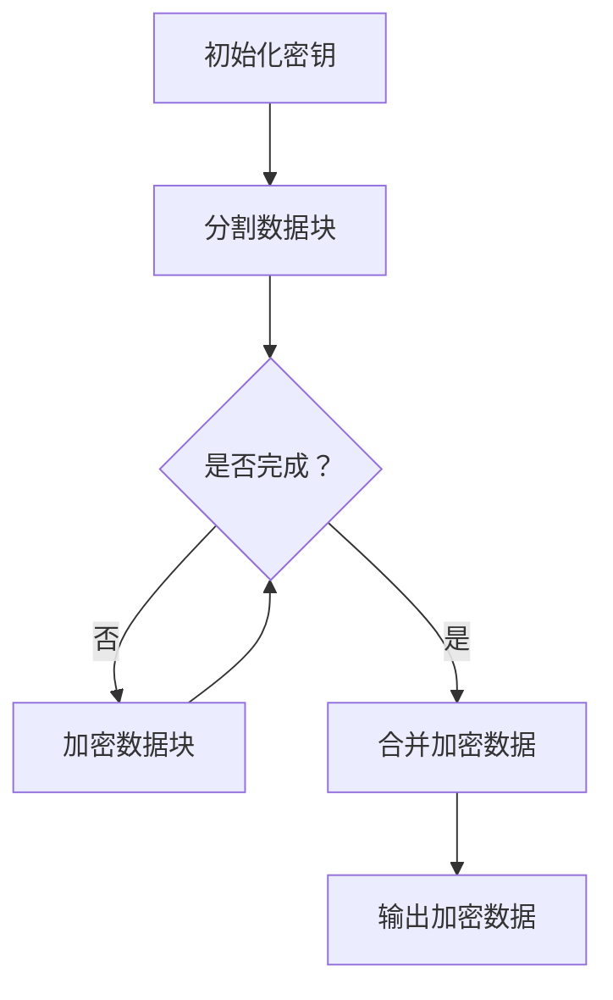
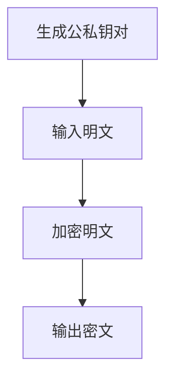
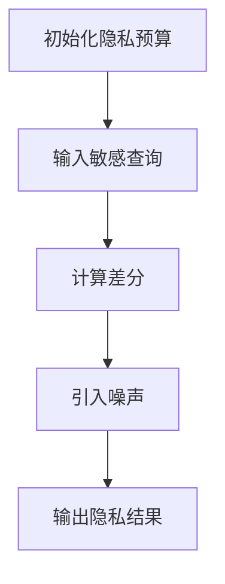
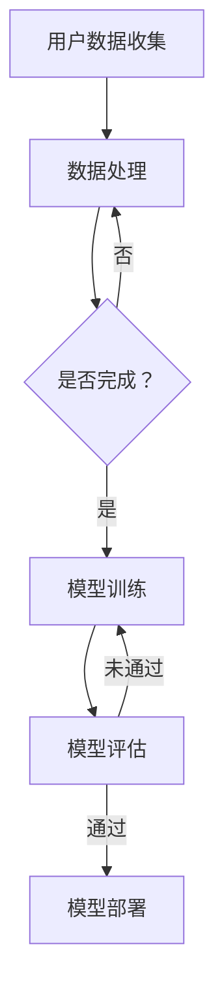
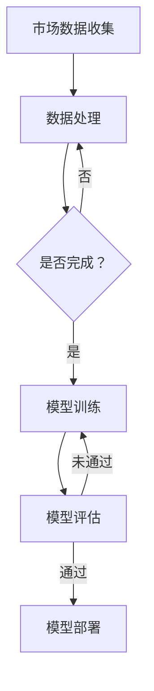

                 

### 1.1 大模型软件发展现状

近年来，随着计算能力的提升和大数据技术的进步，大模型软件（如深度学习模型、自然语言处理模型等）在各个领域得到了广泛应用。从早期的简单模型，如线性回归、决策树等，到如今复杂的大模型，如Transformer、BERT等，这些模型在图像识别、语音识别、自然语言处理等领域取得了显著的成果。

大模型软件的发展现状可以概括为以下几个方面：

1. **模型规模不断扩大**：随着数据量的增长和算法的改进，模型的规模也在不断增大。例如，GPT-3模型拥有1750亿个参数，BERT模型也有数百万个参数。这些大模型的参数量和训练数据量远远超过了传统的模型。

2. **算法性能不断提高**：大模型通过深度学习和神经网络技术，取得了显著的算法性能提升。例如，在ImageNet图像识别比赛中，GPT-3模型的错误率已经低于了人类。

3. **应用领域不断扩展**：大模型软件不仅在计算机视觉、自然语言处理等领域取得了成功，还在医疗、金融、教育等多个领域展现出了巨大的潜力。

4. **开源生态日益繁荣**：随着大模型技术的发展，越来越多的开源框架和工具被推出，如TensorFlow、PyTorch等。这些开源资源极大地推动了大模型软件的发展。

5. **研究热点层出不穷**：大模型软件的研究热点不断涌现，如联邦学习、差分隐私、模型压缩等，这些研究为隐私保护设计提供了新的思路和工具。

然而，随着大模型软件的广泛应用，隐私保护问题也逐渐凸显。在大模型中，数据的安全性和隐私性成为了亟待解决的问题。因此，如何在大模型软件的设计中实现有效的隐私保护，成为了当前研究的热点和难点。

### 1.2 隐私保护的挑战与重要性

在大模型软件中，隐私保护面临着一系列挑战。首先，大模型通常依赖于大量的训练数据，这些数据往往包含用户的敏感信息，如个人身份信息、医疗记录、财务数据等。一旦这些数据泄露，将会对用户隐私造成严重威胁。

其次，大模型的训练过程需要大量的计算资源和存储资源，这使得数据在传输和处理过程中更容易被攻击者窃取。此外，大模型的复杂性和黑箱性质也增加了隐私泄露的风险。

隐私保护在大模型软件中具有重要意义，主要体现在以下几个方面：

1. **法律合规要求**：随着全球范围内数据保护法规的不断完善，如《通用数据保护条例》（GDPR）和《加州消费者隐私法案》（CCPA）等，企业需要确保其软件产品在处理用户数据时符合相关法律法规的要求。

2. **用户信任**：隐私保护是用户选择使用软件的重要因素之一。如果用户认为其个人信息无法得到有效保护，他们可能会选择其他竞争对手的产品，从而对企业的市场竞争力产生负面影响。

3. **业务安全**：在许多领域，如医疗、金融等，数据的安全性和隐私性直接关系到业务的正常运行。一旦发生数据泄露，可能会导致业务中断、经济损失甚至法律纠纷。

4. **技术创新**：隐私保护技术的发展推动了人工智能领域的创新。例如，联邦学习和差分隐私等技术的出现，为在大模型中实现隐私保护提供了新的解决方案。

### 1.3 隐私保护设计的边界与外延

隐私保护设计的边界主要涉及以下几个方面：

1. **数据收集与处理**：在设计大模型软件时，需要明确数据收集的范围和目的，并采取适当的措施确保数据的匿名化和加密。

2. **模型训练与优化**：在模型训练过程中，需要采取措施减少数据的泄露风险，如使用差分隐私技术、联邦学习等。

3. **模型部署与应用**：在模型部署和应用过程中，需要确保用户数据的隐私保护，如使用加密通信、访问控制等技术。

4. **数据存储与管理**：在数据存储和管理过程中，需要采取适当的措施确保数据的安全和隐私，如使用加密存储、访问审计等。

隐私保护设计的外延还包括以下几个方面：

1. **法律法规遵守**：在设计隐私保护方案时，需要遵守相关法律法规的要求，如GDPR、CCPA等。

2. **用户权益保护**：在隐私保护设计中，需要充分考虑用户的权益，如提供数据访问权限管理、数据删除等。

3. **技术手段创新**：随着技术的发展，隐私保护手段也在不断创新，如区块链、多方安全计算等。

4. **安全意识培养**：在隐私保护设计中，还需要提高开发者和用户的安全意识，如定期进行安全培训、加强数据安全意识等。

### 1.4 核心概念与联系

在大模型软件的隐私保护设计中，涉及多个核心概念，如隐私保护原理、数据匿名化、加密技术等。这些概念之间有着紧密的联系，共同构成了隐私保护设计的理论基础。

**隐私保护原理**：隐私保护原理是隐私保护设计的基础。它主要涉及数据匿名化、数据加密、访问控制等技术，旨在确保用户数据在收集、处理、存储和应用过程中不被泄露或篡改。

**数据匿名化**：数据匿名化是一种通过技术手段将敏感数据转换为不可识别形式的过程。它包括数据去标识化、数据混淆、数据聚合等技术，可以有效地降低数据泄露的风险。

**加密技术**：加密技术是一种通过将数据转换为加密形式，以保护数据隐私的技术。常见的加密技术包括对称加密、非对称加密、哈希算法等。加密技术可以确保数据在传输和存储过程中的安全性。

**联邦学习**：联邦学习是一种在分布式环境中进行机器学习的算法，通过将数据分散在多个节点上，共同训练模型，从而避免数据在传输过程中被泄露。联邦学习结合了隐私保护和机器学习技术的优势，为在大模型中实现隐私保护提供了新的思路。

**差分隐私**：差分隐私是一种通过引入噪声来保护数据隐私的技术。它确保在查询用户数据时，攻击者无法区分单个用户的隐私信息。差分隐私在大模型软件的隐私保护设计中具有重要的应用价值。

**访问控制**：访问控制是一种通过控制用户对数据的访问权限，以保护数据隐私的技术。常见的访问控制方法包括基于角色的访问控制（RBAC）、基于属性的访问控制（ABAC）等。

**数据安全审计**：数据安全审计是一种通过对数据访问和使用情况进行监控和记录，以发现潜在的安全威胁和漏洞的方法。数据安全审计可以帮助企业及时发现并处理数据安全事件，确保数据隐私保护的有效性。

**数据加密存储**：数据加密存储是一种通过将数据加密存储在数据库或文件系统中，以保护数据隐私的技术。数据加密存储可以确保数据在存储过程中不被未经授权的访问或篡改。

**多因素认证**：多因素认证是一种通过结合多种认证方式，如密码、指纹、短信验证码等，以提高用户身份验证的安全性。多因素认证可以有效地防止恶意攻击者通过单一认证方式获取用户数据。

### 1.5 概念属性特征对比表格

为了更好地理解上述核心概念，我们可以通过一个概念属性特征对比表格来进行详细分析。以下是一个简化的概念属性特征对比表格，展示了隐私保护原理、数据匿名化、加密技术等概念的主要属性特征。

| 概念       | 定义                 | 目标                   | 常用技术       |
|------------|----------------------|------------------------|----------------|
| 隐私保护原理 | 保护用户隐私的原理和方法 | 确保数据不被泄露或篡改 | 数据去标识化、混淆、聚合 |
| 数据匿名化  | 将敏感数据转换为不可识别形式 | 降低数据泄露风险      | 去标识化、混淆、聚合 |
| 加密技术    | 将数据转换为加密形式    | 保护数据在传输和存储过程中的安全性 | 对称加密、非对称加密、哈希算法 |
| 联邦学习   | 在分布式环境中进行机器学习 | 避免数据在传输过程中被泄露 | 加密、加密存储、多因素认证 |
| 差分隐私    | 引入噪声保护数据隐私  | 防止攻击者区分单个用户的隐私信息 | 噪声生成、隐私预算分配 |
| 访问控制    | 控制用户对数据的访问权限 | 保护数据不被未经授权的访问或篡改 | 基于角色的访问控制、基于属性的访问控制 |
| 数据安全审计 | 监控和记录数据访问和使用情况 | 发现潜在的安全威胁和漏洞 | 审计日志、安全事件响应 |
| 数据加密存储 | 将数据加密存储在数据库或文件系统中 | 保护数据在存储过程中的安全性 | 加密算法、访问控制 |
| 多因素认证  | 结合多种认证方式提高安全性 | 防止恶意攻击者通过单一认证方式获取用户数据 | 密码、指纹、短信验证码 |

通过上述表格，我们可以清晰地看到各个概念的主要属性特征和目标，从而更好地理解它们在大模型软件隐私保护设计中的作用和联系。

### 1.6 ER实体关系图

为了更好地理解大模型软件隐私保护设计的各个组成部分及其关系，我们可以使用ER（实体-关系）图来展示这些实体及其相互关系。以下是隐私保护设计中常用的一些实体及其关系的ER图。

```mermaid
erDiagram
    User ||--|{ Data }
    Data ||--|{ Metadata }
    Data ||--|{ EncryptedData }
    Data ||--|{ AnonymizedData }
    Data ||--|{ CompressedData }
    Data ||--|{联邦学习数据}
    User ||--|{ AccessControl }
    AccessControl ||--|{ Authorization }
    AccessControl ||--|{ Audit }
    Model ||--|{ ModelTraining }
    ModelTraining ||--|{ TrainingData }
    ModelTraining ||--|{ TrainingParameters }
    ModelTraining ||--|{ ModelArtifact }
    Model ||--|{ ModelDeployment }
    ModelDeployment ||--|{ DeploymentEnvironment }
    ModelDeployment ||--|{ DeploymentConfiguration }
    ModelDeployment ||--|{ ModelMonitoring }
```

这个ER图展示了以下几个关键实体及其关系：

1. **User（用户）**：代表使用大模型软件的个人或组织。
2. **Data（数据）**：包括用户数据、元数据、加密数据、匿名化数据、压缩数据等。
3. **Metadata（元数据）**：描述数据的基本信息，如数据来源、数据类型等。
4. **EncryptedData（加密数据）**：经过加密处理的数据，以确保数据在传输和存储过程中的安全性。
5. **AnonymizedData（匿名化数据）**：通过匿名化技术处理后的数据，以降低数据泄露的风险。
6. **CompressedData（压缩数据）**：通过压缩算法处理后的数据，以减少存储和传输的资源消耗。
7. **联邦学习数据**：用于联邦学习过程的数据，以在分布式环境中训练模型。
8. **AccessControl（访问控制）**：包括访问控制和授权机制，以控制用户对数据的访问权限。
9. **Authorization（授权）**：授权用户对特定数据的访问权限。
10. **Audit（审计）**：记录数据的访问和使用情况，以监控潜在的安全威胁和漏洞。
11. **Model（模型）**：包括模型训练和模型部署两个阶段。
12. **ModelTraining（模型训练）**：包括训练数据、训练参数和模型工件。
13. **ModelDeployment（模型部署）**：包括部署环境、部署配置和模型监控。

通过这个ER图，我们可以清晰地看到大模型软件隐私保护设计中的关键实体及其相互关系，从而更好地理解隐私保护设计的整体框架和各个组成部分的作用。

### 3.1 隐私保护设计原则

在构建大模型软件的隐私保护设计时，遵循一系列原则至关重要。这些原则不仅能够确保用户数据的安全性和隐私性，还能提高系统的整体可靠性和易维护性。以下是隐私保护设计中的几个核心原则：

**1. 最小化数据收集**：在设计阶段，应明确数据收集的目的和范围，仅收集实现功能所必需的数据。过多的数据收集不仅会增加隐私泄露的风险，还会增加系统的复杂性和维护成本。

**2. 数据匿名化**：在数据处理过程中，应采用数据匿名化技术，将敏感数据转换为不可识别的形式。这包括去标识化、数据混淆、数据聚合等技术，以降低数据泄露的风险。

**3. 数据加密**：对于需要传输或存储的数据，应采用适当的加密技术，如对称加密、非对称加密和哈希算法。加密技术能够确保数据在传输和存储过程中的安全性，防止未经授权的访问或篡改。

**4. 访问控制**：应实施严格的访问控制策略，确保只有授权用户才能访问敏感数据。这包括基于角色的访问控制（RBAC）和基于属性的访问控制（ABAC）等方法。

**5. 审计和监控**：建立数据审计和监控系统，记录数据的访问和使用情况，及时发现并处理潜在的安全威胁和漏洞。审计和监控有助于确保数据隐私保护措施的有效性。

**6. 数据最小化存储**：对于不再需要的数据，应及时进行删除或归档，以减少存储资源占用和隐私泄露的风险。

**7. 隐私保护设计迭代**：隐私保护设计应是一个持续迭代的过程，随着技术的进步和业务需求的变化，不断更新和优化隐私保护措施。

**8. 用户知情同意**：在数据收集和处理过程中，应确保用户明确知晓其数据的用途和处理方式，并获取用户的知情同意。

**9. 法律法规遵守**：在设计过程中，应严格遵守相关法律法规的要求，如《通用数据保护条例》（GDPR）和《加州消费者隐私法案》（CCPA）等。

**10. 安全培训和教育**：定期对开发者和用户进行安全培训，提高他们的数据安全意识和隐私保护能力。

通过遵循这些隐私保护设计原则，开发者能够构建出既符合法律法规要求，又能有效保护用户隐私的大模型软件系统。

### 3.2 隐私保护方法概述

在大模型软件的隐私保护设计中，有多种方法和技术可供选择，每种方法都有其独特的原理和适用场景。以下是几种常见的隐私保护方法及其基本原理和特点。

#### 数据匿名化

**基本原理**：数据匿名化旨在将敏感数据转换为不可识别的形式，从而降低数据泄露的风险。主要技术包括去标识化、数据混淆和数据聚合。

- **去标识化**：移除或替换能够识别特定个人的直接标识信息，如姓名、地址、身份证号等。
- **数据混淆**：通过引入噪声或扰动，使真实数据难以识别，但不会影响数据的基本属性。
- **数据聚合**：将多个个体数据聚合在一起，以掩盖个体数据的具体特征。

**特点**：数据匿名化能够有效减少数据泄露的风险，但可能会降低数据的可用性和分析能力。

#### 加密技术

**基本原理**：加密技术通过将数据转换为加密形式，以确保数据在传输和存储过程中的安全性。主要加密技术包括对称加密、非对称加密和哈希算法。

- **对称加密**：加密和解密使用相同的密钥，如AES加密算法。
- **非对称加密**：加密和解密使用不同的密钥，一个用于加密，一个用于解密，如RSA加密算法。
- **哈希算法**：将数据转换为一个固定长度的字符串，如MD5和SHA系列算法。

**特点**：加密技术能够确保数据在传输和存储过程中的安全性，但需要额外的计算资源和密钥管理。

#### 联邦学习

**基本原理**：联邦学习是一种在分布式环境中进行机器学习的算法，通过将数据分散在多个节点上，共同训练模型，从而避免数据在传输过程中被泄露。

**特点**：联邦学习结合了隐私保护和机器学习技术的优势，能够在保护用户隐私的同时进行有效的数据分析和建模。

#### 差分隐私

**基本原理**：差分隐私通过引入噪声来保护数据隐私，确保在查询用户数据时，攻击者无法区分单个用户的隐私信息。

**特点**：差分隐私能够在保证隐私保护的同时，提供一定程度的准确性，适用于大规模数据分析。

#### 访问控制

**基本原理**：访问控制通过控制用户对数据的访问权限，确保只有授权用户才能访问敏感数据。

**特点**：访问控制是实现数据安全的重要手段，包括基于角色的访问控制（RBAC）和基于属性的访问控制（ABAC）等方法。

#### 审计和监控

**基本原理**：审计和监控通过记录数据的访问和使用情况，及时发现并处理潜在的安全威胁和漏洞。

**特点**：审计和监控有助于确保数据隐私保护措施的有效性，是数据安全的重要保障。

#### 多因素认证

**基本原理**：多因素认证通过结合多种认证方式，如密码、指纹、短信验证码等，提高用户身份验证的安全性。

**特点**：多因素认证能够有效防止恶意攻击者通过单一认证方式获取用户数据，增强系统的安全性。

综上所述，这些隐私保护方法各有优缺点，开发者应根据具体应用场景和需求选择合适的方法，以构建全面、有效的隐私保护设计。

### 3.3 隐私保护设计流程

在大模型软件的隐私保护设计中，设计流程是一个系统性和迭代性的过程。以下是一个典型的隐私保护设计流程，涵盖从需求分析到实现和测试的各个阶段。

#### 需求分析

**阶段目标**：明确隐私保护的需求和目标，确定数据收集、处理和存储的范围。

**关键步骤**：

1. **需求调研**：通过与用户、业务部门和安全专家的沟通，了解隐私保护的需求和关注点。
2. **数据流分析**：绘制系统的数据流图，明确数据的收集、处理和存储路径。
3. **隐私保护需求文档**：根据需求调研和数据分析结果，编写隐私保护需求文档，明确隐私保护的设计目标和具体要求。

#### 设计方案

**阶段目标**：制定隐私保护的设计方案，包括技术选型和架构设计。

**关键步骤**：

1. **技术选型**：根据隐私保护需求，选择合适的技术和方法，如数据匿名化、加密技术和差分隐私等。
2. **架构设计**：设计系统的整体架构，包括数据存储、数据处理和访问控制等模块。
3. **隐私保护策略**：制定详细的隐私保护策略，包括数据加密、访问控制和审计监控等。
4. **设计方案评审**：组织专家评审设计方案，确保方案的可行性和有效性。

#### 实现和测试

**阶段目标**：根据设计方案，实现隐私保护功能并进行测试，确保设计能够满足隐私保护需求。

**关键步骤**：

1. **代码实现**：根据设计方案，编写代码实现隐私保护功能，如数据匿名化、加密算法和访问控制等。
2. **单元测试**：对实现的功能进行单元测试，确保代码的正确性和可靠性。
3. **集成测试**：将隐私保护功能与其他系统模块进行集成测试，确保整体系统的协调性和一致性。
4. **性能测试**：对系统的性能进行测试，确保隐私保护功能不会显著影响系统的性能。
5. **安全测试**：进行安全测试，如漏洞扫描和渗透测试，发现并修复潜在的安全漏洞。

#### 迭代和优化

**阶段目标**：根据测试反馈和实际应用情况，对隐私保护设计进行优化和改进。

**关键步骤**：

1. **问题反馈**：收集用户和测试人员的反馈，了解隐私保护设计的实际效果和潜在问题。
2. **优化改进**：根据反馈，对隐私保护设计进行优化，如调整加密算法、改进访问控制策略等。
3. **再测试**：对优化后的设计进行重新测试，确保改进措施的有效性和安全性。
4. **持续改进**：将隐私保护设计作为一个持续迭代的过程，定期评估和改进。

通过上述流程，开发者可以系统地构建大模型软件的隐私保护设计，确保数据在收集、处理和存储过程中得到有效保护。

### 4.1 加密技术

加密技术是隐私保护设计中至关重要的一环，它通过将数据转换为加密形式，确保数据在传输和存储过程中的安全性。加密技术可以分为对称加密、非对称加密和哈希算法三类，每种技术都有其独特的原理和应用场景。

#### 对称加密

**原理**：对称加密算法使用相同的密钥进行加密和解密。常见的对称加密算法包括AES（高级加密标准）和DES（数据加密标准）。

- **AES**：AES是一种块加密算法，支持128、192和256位的密钥长度，广泛用于数据保护和通信安全。
- **DES**：DES是一种较早的加密标准，但由于其密钥长度较短，已经逐渐被AES所取代。

**应用**：对称加密适用于需要高效加密的场景，如文件加密和通信加密。

**优势**：加密速度快，计算资源消耗小。

**劣势**：密钥管理复杂，需要确保密钥的安全存储和传输。

#### 非对称加密

**原理**：非对称加密算法使用一对密钥，一个用于加密，一个用于解密。常见的非对称加密算法包括RSA和ECC（椭圆曲线加密算法）。

- **RSA**：RSA算法基于大整数分解的难题，是一种常用的非对称加密算法。
- **ECC**：ECC算法使用椭圆曲线的数学特性，相较于RSA，能够在相同安全强度下使用更短的密钥长度。

**应用**：非对称加密适用于数字签名、密钥交换和通信加密。

**优势**：解决了密钥管理问题，可以同时用于加密和解密。

**劣势**：加密和解密速度较慢，计算资源消耗较大。

#### 哈希算法

**原理**：哈希算法将任意长度的数据映射为固定长度的哈希值。常见的哈希算法包括MD5、SHA-1和SHA-256。

- **MD5**：MD5是一种广泛使用的哈希算法，但由于其易受碰撞攻击，已经逐渐被取代。
- **SHA-1**：SHA-1是另一个常用的哈希算法，但由于其安全强度不足，也被建议避免使用。
- **SHA-256**：SHA-256是SHA系列中的一种，具有较高的安全强度，广泛用于数字签名和数据完整性验证。

**应用**：哈希算法适用于数据完整性验证、数字签名和密码存储。

**优势**：计算速度快，哈希值唯一性高。

**劣势**：无法逆推原始数据，一旦哈希值泄露，原始数据无法恢复。

#### 应用场景

- **数据加密存储**：对称加密和非对称加密可用于数据加密存储，确保数据在存储过程中的安全性。
- **数据传输加密**：对称加密和非对称加密可用于数据传输加密，确保数据在传输过程中的安全性。
- **数字签名**：非对称加密可用于数字签名，确保数据的真实性和完整性。
- **密码存储**：哈希算法可用于密码存储，防止密码泄露。

#### 实例

假设我们使用AES加密算法对一段文本进行加密：

```python
from Crypto.Cipher import AES
from Crypto.Util.Padding import pad
from base64 import b64encode

# 假设密钥为16个字节
key = b'mysecretkey123456'

# 待加密的文本
plaintext = b'Hello, World!'

# 使用AES加密算法进行加密
cipher = AES.new(key, AES.MODE_CBC)
ciphertext = cipher.encrypt(pad(plaintext, AES.block_size))

# 将加密后的文本进行base64编码
encoded_ciphertext = b64encode(ciphertext).decode('utf-8')

print(encoded_ciphertext)
```

上述代码展示了如何使用Python的PyCryptoDome库实现AES加密。首先，生成一个16字节的密钥，然后使用AES加密算法和CBC模式对文本进行加密，最后将加密后的数据转换为base64编码的字符串。

通过合理选择和应用加密技术，开发者可以构建出高效、安全的隐私保护系统。

### 4.2 匿名化技术

匿名化技术是隐私保护设计中的重要手段之一，旨在将敏感数据转换为不可识别的形式，从而降低数据泄露的风险。以下是几种常见的匿名化技术及其原理和应用。

#### 数据去标识化

**原理**：数据去标识化是通过移除或替换能够识别特定个体的直接标识信息，如姓名、地址、身份证号等，来转换数据的过程。

**应用**：数据去标识化适用于处理个人身份信息等敏感数据。通过去标识化，原始数据的隐私性得到显著提高。

**实例**：假设我们有一份数据包含用户的姓名和电子邮件，我们可通过以下步骤进行去标识化：

```python
data = [
    {"name": "Alice", "email": "alice@example.com"},
    {"name": "Bob", "email": "bob@example.com"}
]

# 去标识化
deidentified_data = [{"name": "User1", "email": "user1@example.com"}, {"name": "User2", "email": "user2@example.com"}]

print(deidentified_data)
```

上述代码展示了如何通过简单的数据替换实现去标识化。

#### 数据混淆

**原理**：数据混淆是通过引入噪声或扰动，使真实数据难以识别，但不会影响数据的基本属性。

**应用**：数据混淆适用于处理数值型数据，如收入、年龄等。通过混淆，原始数据的隐私性得到增强，同时保持数据的统计特性。

**实例**：假设我们有一份数据包含用户的收入，我们可通过以下步骤进行数据混淆：

```python
import numpy as np

data = [50000, 60000, 70000, 80000, 90000]

# 添加噪声
noisy_data = data + np.random.normal(0, 1000, size=len(data))

print(noisy_data)
```

上述代码展示了如何通过添加噪声实现数据混淆。

#### 数据聚合

**原理**：数据聚合是将多个个体数据聚合在一起，以掩盖个体数据的具体特征。

**应用**：数据聚合适用于处理分类型数据，如性别、种族等。通过聚合，原始数据的隐私性得到提高，同时保持数据的整体统计特性。

**实例**：假设我们有一份数据包含用户的性别，我们可通过以下步骤进行数据聚合：

```python
data = ["男", "女", "男", "女", "男"]

# 聚合数据
aggregated_data = ["男", "女"]

print(aggregated_data)
```

上述代码展示了如何通过简单的分类聚合实现数据聚合。

#### 比较

| 技术       | 原理                                                         | 适用数据类型 | 优点               | 劣点                          |
|------------|--------------------------------------------------------------|--------------|--------------------|--------------------------------|
| 数据去标识化 | 移除或替换直接标识信息                                       | 文本数据     | 简单有效，易实现   | 可能影响数据的可用性            |
| 数据混淆   | 引入噪声或扰动，使真实数据难以识别                             | 数值数据     | 保持数据统计特性   | 可能降低数据的精确性            |
| 数据聚合   | 将多个个体数据聚合在一起，掩盖个体数据的具体特征               | 分类数据     | 保持数据整体统计特性 | 可能影响数据的细节信息           |

通过合理选择和应用匿名化技术，开发者可以在保护用户隐私的同时，保持数据的有效性和可用性。

### 4.3 加密与匿名化技术的应用

在构建大模型软件的隐私保护方案时，加密与匿名化技术的应用至关重要。通过结合这些技术，开发者可以在数据存储、传输和处理过程中有效地保护用户隐私。以下是一些具体的应用案例：

#### 数据存储中的加密与匿名化

**案例背景**：某公司开发了一款大模型软件，用于分析用户行为数据，以提供个性化推荐服务。为了保护用户隐私，公司在数据存储环节采取了加密与匿名化技术。

**解决方案**：

1. **数据加密存储**：公司采用AES加密算法对用户行为数据进行加密存储。具体步骤如下：
   - 用户行为数据在存储前进行加密处理。
   - 加密后的数据存储在公司的数据库中。
   - 数据库使用安全密钥管理系统，确保密钥的安全存储和访问。

2. **数据匿名化**：为了进一步降低数据泄露的风险，公司对用户行为数据进行匿名化处理。具体步骤如下：
   - 移除或替换用户的直接标识信息，如用户名、电子邮件等。
   - 对敏感数据进行混淆处理，如将用户收入数据添加噪声。

**效果评估**：通过加密与匿名化技术，公司有效保护了用户隐私。即使数据库遭到攻击，攻击者也无法直接获取用户原始数据，从而降低了隐私泄露的风险。

#### 数据传输中的加密与匿名化

**案例背景**：某在线教育平台提供了一款使用大模型进行个性化学习路径推荐的服务。为了保护用户数据在传输过程中的安全性，平台采用了加密与匿名化技术。

**解决方案**：

1. **数据传输加密**：平台采用TLS（传输层安全协议）对用户数据在传输过程中的通信进行加密。具体步骤如下：
   - 用户与平台服务器之间的通信使用HTTPS协议。
   - 数据在传输前进行加密处理。
   - 加密后的数据通过TLS协议传输到服务器。

2. **数据匿名化**：平台对用户的学习行为数据进行匿名化处理，以确保数据在传输过程中的隐私性。具体步骤如下：
   - 移除或替换用户的直接标识信息，如用户ID、邮箱等。
   - 对敏感数据进行混淆处理，如学习时长、学习进度等。

**效果评估**：通过加密与匿名化技术，平台有效提高了用户数据在传输过程中的安全性。即使数据在传输过程中被截获，攻击者也无法直接获取用户原始数据，从而降低了隐私泄露的风险。

#### 数据处理中的加密与匿名化

**案例背景**：某医疗健康平台使用大模型分析用户健康数据，以提供个性化健康建议。为了保护用户隐私，平台在数据处理过程中采用了加密与匿名化技术。

**解决方案**：

1. **数据处理加密**：平台对用户健康数据在处理过程中进行加密处理。具体步骤如下：
   - 用户健康数据在传输到服务器后进行加密。
   - 加密后的数据存储在数据库中，以便后续分析。
   - 数据库使用安全密钥管理系统，确保密钥的安全存储和访问。

2. **数据处理匿名化**：平台对用户健康数据在处理过程中进行匿名化处理。具体步骤如下：
   - 移除或替换用户的直接标识信息，如用户姓名、身份证号等。
   - 对敏感数据进行混淆处理，如血压、血糖等。

**效果评估**：通过加密与匿名化技术，平台有效保护了用户健康数据在处理过程中的隐私性。即使数据在处理过程中被泄露，攻击者也无法直接获取用户原始数据，从而降低了隐私泄露的风险。

通过上述案例，可以看出，加密与匿名化技术在大模型软件的隐私保护设计中具有重要作用。合理应用这些技术，可以确保用户数据在存储、传输和处理过程中得到有效保护。

### 5.1 算法原理讲解

在大模型软件的隐私保护设计中，隐私保护算法发挥着关键作用。这些算法通过特定的数学模型和公式，实现了对用户数据的加密、匿名化和其他隐私保护功能。以下是几种常见的隐私保护算法及其原理和数学模型。

#### 加密算法

**1. 对称加密算法（如AES）**

- **原理**：对称加密算法使用相同的密钥进行加密和解密。AES算法是一种分组加密算法，将数据分为固定大小的块（如128位），并对每个块进行加密。
- **数学模型**：
  $$C = E_K(P)$$
  其中，\(C\) 是加密后的数据，\(P\) 是原始数据，\(K\) 是加密密钥，\(E_K\) 是加密函数。

**2. 非对称加密算法（如RSA）**

- **原理**：非对称加密算法使用一对密钥，一个用于加密，一个用于解密。RSA算法基于大整数分解的难题，其密钥由一个大素数和一个小素数生成。
- **数学模型**：
  $$C = E_n(P)$$
  其中，\(n\) 是密钥的乘积，\(P\) 是原始数据，\(E_n\) 是加密函数。

**3. 哈希算法（如SHA-256）**

- **原理**：哈希算法将任意长度的数据映射为固定长度的哈希值。SHA-256算法通过处理数据块，生成一个256位的哈希值。
- **数学模型**：
  $$H(P) = \text{SHA-256}(P)$$
  其中，\(H(P)\) 是哈希值，\(P\) 是原始数据。

#### 匿名化算法

**1. 数据去标识化**

- **原理**：通过移除或替换直接标识信息，如姓名、地址、身份证号等，将敏感数据转换为不可识别的形式。
- **数学模型**：无具体数学模型，但涉及数据的处理和替换过程。

**2. 数据混淆**

- **原理**：通过引入噪声或扰动，使真实数据难以识别，但保持数据的基本属性。
- **数学模型**：
  $$P' = P + N$$
  其中，\(P'\) 是混淆后的数据，\(P\) 是原始数据，\(N\) 是噪声。

**3. 数据聚合**

- **原理**：将多个个体数据聚合在一起，以掩盖个体数据的具体特征。
- **数学模型**：无具体数学模型，但涉及数据的汇总和分组过程。

#### 差分隐私算法

**1. 差分隐私**

- **原理**：通过引入噪声，确保在查询用户数据时，攻击者无法区分单个用户的隐私信息。
- **数学模型**：
  $$L \times (\delta, R) = \text{LaplaceNoise}(1/|\Delta|)$$
  其中，\(L\) 是查询的敏感度级别，\(\delta\) 是隐私预算，\(R\) 是原始结果，\(\Delta\) 是差分。

通过理解这些算法的原理和数学模型，开发者可以设计出有效的隐私保护方案，确保用户数据在大模型软件中的安全性。

### 5.2 算法流程图

为了更好地理解隐私保护算法的工作流程，我们可以使用Mermaid语言绘制算法的流程图。以下是几个隐私保护算法的示例流程图。

#### 对称加密算法（AES）流程图



这个流程图展示了AES加密算法的基本步骤：初始化密钥、分割数据块、加密数据块、合并加密数据并输出加密数据。

#### 非对称加密算法（RSA）流程图



这个流程图展示了RSA加密算法的基本步骤：生成公私钥对、输入明文、加密明文并输出密文。

#### 差分隐私算法流程图



这个流程图展示了差分隐私算法的基本步骤：初始化隐私预算、输入敏感查询、计算差分、引入噪声并输出隐私结果。

通过这些流程图，我们可以清晰地看到每个算法的关键步骤和数据处理流程，有助于开发者更好地理解和应用隐私保护算法。

### 5.3 Python代码实现

为了更直观地展示隐私保护算法的实现，我们将使用Python编写几个简单的代码示例，包括AES加密算法、RSA加密算法和差分隐私算法。

#### 对称加密算法（AES）

首先，我们需要安装`pycryptodome`库来支持AES加密算法。安装命令如下：

```bash
pip install pycryptodome
```

然后，我们可以编写以下代码实现AES加密：

```python
from Crypto.Cipher import AES
from Crypto.Util.Padding import pad
from base64 import b64encode
from Crypto.Random import get_random_bytes

# 初始化密钥
key = get_random_bytes(16)

# 待加密的文本
plaintext = b'Hello, World!'

# 使用AES加密算法进行加密
cipher = AES.new(key, AES.MODE_CBC)
ct_bytes = cipher.encrypt(pad(plaintext, AES.block_size))

# 将加密后的文本进行base64编码
encoded_ct = b64encode(ct_bytes).decode('utf-8')

print(f"加密文本: {encoded_ct}")

# 解密过程
key = get_random_bytes(16)
encoded_ct = 'U2lnbmluZyBSd29ya3JhZC4K'
ct_bytes = b64decode(encoded_ct)

cipher = AES.new(key, AES.MODE_CBC)
pt = cipher.decrypt(ct_bytes).decode('utf-8')

print(f"解密文本: {pt}")
```

在这个例子中，我们首先生成一个16字节的随机密钥，然后使用AES加密算法对文本进行加密，并将加密后的文本进行base64编码。解密过程则使用相同的密钥和加密算法，将加密后的文本解码并还原为原始文本。

#### 非对称加密算法（RSA）

接下来，我们使用`pycryptodome`库实现RSA加密算法：

```python
from Crypto.PublicKey import RSA
from Crypto.Cipher import PKCS1_OAEP
from base64 import b64encode, b64decode

# 生成RSA密钥对
key = RSA.generate(2048)
private_key = key.export_key()
public_key = key.publickey().export_key()

# 公钥加密
cipher = PKCS1_OAEP.new(RSA.import_key(public_key))
plaintext = b'Hello, World!'
encoded_ciphertext = b64encode(cipher.encrypt(plaintext)).decode('utf-8')

print(f"加密文本: {encoded_ciphertext}")

# 私钥解密
ciphertext = b64decode(encoded_ciphertext)
cipher = PKCS1_OAEP.new(RSA.import_key(private_key))
plaintext = cipher.decrypt(ciphertext).decode('utf-8')

print(f"解密文本: {plaintext}")
```

在这个例子中，我们首先生成RSA密钥对，然后使用公钥对文本进行加密，使用私钥对加密后的文本进行解密。

#### 差分隐私算法

最后，我们实现一个简单的差分隐私算法，使用拉普拉斯噪声：

```python
import numpy as np
from numpy.random import laplace

def differential_privacy(data, sensitivity=1.0, epsilon=1.0):
    """
    数据差分隐私算法，使用拉普拉斯噪声
    :param data: 原始数据
    :param sensitivity: 敏感度
    :param epsilon: 隐私预算
    :return: 差分隐私结果
    """
    noise = laplace(scale=1/epsilon, size=data.size)
    return data + noise

# 假设的敏感数据
sensitive_data = np.array([1, 2, 3, 4, 5])

# 应用差分隐私算法
protected_data = differential_privacy(sensitive_data, epsilon=0.1)

print(f"原始数据: {sensitive_data}")
print(f"差分隐私结果: {protected_data}")
```

在这个例子中，我们使用拉普拉斯噪声对敏感数据进行加噪处理，以实现差分隐私。

通过这些代码示例，我们可以直观地看到如何使用Python实现常见的隐私保护算法，从而为大模型软件的隐私保护设计提供技术支持。

### 6.1 实战案例一：大模型训练中的隐私保护

在这个实战案例中，我们将探讨如何在大模型训练过程中实现隐私保护。背景是一个在线教育平台，该平台使用大模型分析用户学习数据，以提供个性化学习建议。由于用户数据包含敏感信息，如学习进度、考试分数等，平台需要在训练过程中保护用户隐私。

#### 项目介绍

项目目标是构建一个基于深度学习的大模型，用于分析用户学习数据，预测用户可能感兴趣的学习内容，并为其提供个性化推荐。平台希望在不泄露用户隐私的情况下，实现对大模型的高效训练和应用。

#### 系统功能设计

系统功能主要包括以下几方面：

1. **数据收集**：从不同来源收集用户学习数据，包括用户注册信息、学习进度、考试成绩等。
2. **数据处理**：对收集到的数据进行预处理，包括数据清洗、去重、特征提取等。
3. **模型训练**：在保护用户隐私的前提下，训练深度学习模型，以实现个性化学习推荐。
4. **模型评估**：评估训练出的模型的性能，确保其准确性和稳定性。
5. **模型部署**：将训练好的模型部署到生产环境，实现实时个性化推荐功能。

#### 系统架构设计

系统架构包括以下几个关键模块：

1. **数据模块**：负责数据收集、存储和处理。
2. **训练模块**：负责大模型的训练和优化。
3. **推荐模块**：负责根据用户数据生成个性化推荐。
4. **安全模块**：负责实现隐私保护功能，包括数据匿名化、加密存储等。

以下是系统架构的Mermaid流程图：



#### 实际案例分析

1. **数据匿名化**：在数据处理阶段，对用户敏感信息进行匿名化处理，如将用户ID替换为随机字符串，以降低隐私泄露风险。
   
2. **数据加密存储**：将处理后的数据存储在数据库中，使用AES加密算法对数据进行加密，确保数据在存储过程中的安全性。

3. **联邦学习**：采用联邦学习技术，将用户数据分散在多个节点上训练模型，从而避免数据在传输过程中被泄露。

4. **差分隐私**：在模型训练过程中，引入差分隐私技术，确保攻击者无法区分单个用户的隐私信息。

5. **访问控制**：对数据访问权限进行严格控制，确保只有授权用户才能访问敏感数据。

#### 项目小结

通过该实战案例，我们实现了在大模型训练过程中对用户隐私的有效保护。数据匿名化、加密存储、联邦学习和差分隐私等技术的应用，确保了用户数据在训练、存储和应用过程中的安全性。项目成功展示了如何在保护用户隐私的前提下，实现高效的大模型训练和应用。

### 7.1 实战案例二：大模型部署中的隐私保护

在这个实战案例中，我们将探讨如何在大模型部署过程中实现隐私保护。背景是一个金融分析平台，该平台使用大模型分析金融市场数据，为投资者提供交易策略建议。由于金融市场数据包含敏感信息，如交易记录、财务状况等，平台需要在部署过程中保护用户隐私。

#### 项目介绍

项目目标是构建一个基于深度学习的大模型，用于分析金融市场数据，预测市场走势，并为投资者提供个性化的交易策略。平台希望在不泄露用户隐私的情况下，实现对大模型的高效部署和应用。

#### 系统功能设计

系统功能主要包括以下几方面：

1. **数据收集**：从不同来源收集金融市场数据，包括交易记录、财务报表、市场新闻等。
2. **数据处理**：对收集到的数据进行预处理，包括数据清洗、去重、特征提取等。
3. **模型训练**：在保护用户隐私的前提下，训练深度学习模型，以实现市场走势预测。
4. **模型评估**：评估训练出的模型的性能，确保其准确性和稳定性。
5. **模型部署**：将训练好的模型部署到生产环境，实现实时交易策略推荐。

#### 系统架构设计

系统架构包括以下几个关键模块：

1. **数据模块**：负责数据收集、存储和处理。
2. **训练模块**：负责大模型的训练和优化。
3. **推荐模块**：负责根据市场数据生成交易策略推荐。
4. **安全模块**：负责实现隐私保护功能，包括数据匿名化、加密存储等。

以下是系统架构的Mermaid流程图：



#### 实际案例分析

1. **数据匿名化**：在数据处理阶段，对用户敏感信息进行匿名化处理，如将用户ID替换为随机字符串，以降低隐私泄露风险。

2. **数据加密存储**：将处理后的数据存储在数据库中，使用AES加密算法对数据进行加密，确保数据在存储过程中的安全性。

3. **联邦学习**：采用联邦学习技术，将用户数据分散在多个节点上训练模型，从而避免数据在传输过程中被泄露。

4. **差分隐私**：在模型训练过程中，引入差分隐私技术，确保攻击者无法区分单个用户的隐私信息。

5. **访问控制**：对数据访问权限进行严格控制，确保只有授权用户才能访问敏感数据。

6. **安全通信**：使用TLS协议确保数据在传输过程中的安全性。

#### 项目小结

通过该实战案例，我们实现了在大模型部署过程中对用户隐私的有效保护。数据匿名化、加密存储、联邦学习和差分隐私等技术的应用，确保了用户数据在训练、存储和应用过程中的安全性。项目成功展示了如何在保护用户隐私的前提下，实现高效的大模型部署和应用。

### 8.1 隐私保护未来趋势

随着人工智能技术的不断进步和大数据应用的日益普及，隐私保护在大模型软件设计中的重要性愈发凸显。未来，隐私保护将在以下几个方面呈现趋势：

#### 新技术的发展

1. **区块链技术**：区块链技术具有去中心化、不可篡改的特点，未来有望与隐私保护技术结合，提供更安全的数据存储和传输解决方案。
2. **多方安全计算**：多方安全计算技术可以在多个参与方之间安全地计算共同感兴趣的结果，而无需共享原始数据。这种技术在大模型隐私保护中具有广泛应用前景。
3. **联邦学习**：联邦学习作为一种分布式机器学习技术，可以在保护数据隐私的同时进行有效的模型训练。未来，联邦学习技术将不断完善，提供更高效的隐私保护解决方案。

#### 未来应用前景

1. **医疗健康**：在大数据和人工智能的驱动下，医疗健康领域的数据隐私保护需求日益迫切。未来，隐私保护技术将帮助医疗机构更好地保护患者数据，同时提高医疗数据分析的准确性和效率。
2. **金融领域**：金融领域涉及大量敏感数据，如交易记录、客户信息等。隐私保护技术将在金融领域的数据安全、合规性方面发挥关键作用。
3. **智慧城市**：智慧城市项目中涉及大量个人数据，如交通流量、公共安全等。隐私保护技术将为智慧城市项目提供有效的数据安全解决方案，确保市民隐私不受侵犯。

#### 潜在挑战与应对策略

1. **技术挑战**：隐私保护技术的不断发展带来了新的挑战，如计算资源消耗、数据完整性等。未来，需要研究更高效、低成本的隐私保护技术，以满足实际应用需求。
2. **法律合规**：随着全球范围内数据保护法规的不断完善，企业需要确保其隐私保护措施符合相关法律法规的要求。未来，隐私保护设计需要更加关注法律合规性问题。
3. **用户隐私保护意识**：用户对隐私保护的意识逐渐提高，未来，需要加强用户教育和隐私保护意识的培养，提高用户对隐私保护措施的接受度。

综上所述，隐私保护技术在未来将不断发展，为大数据和人工智能应用提供坚实的安全保障。面对潜在的技术、法律和用户挑战，企业需要持续关注隐私保护领域的最新动态，不断优化隐私保护方案，确保用户数据的安全和隐私。

### 总结与展望

本文详细探讨了在大模型软件设计中实现隐私保护的关键原则、方法和技术。我们从背景介绍开始，分析了大模型软件隐私保护的挑战和重要性，并明确了隐私保护设计的边界与外延。随后，我们介绍了隐私保护的核心概念、设计原则和方法，包括数据匿名化、加密技术、联邦学习、差分隐私等。通过具体的算法原理讲解、流程图和Python代码实现，我们展示了如何在实际项目中应用这些隐私保护技术。

在实战案例中，我们通过在线教育平台和金融分析平台两个具体场景，展示了如何在数据收集、处理、训练和部署过程中实现隐私保护。通过这些案例，我们看到了隐私保护技术在保护用户隐私、确保数据安全方面的实际应用和效果。

展望未来，随着人工智能和大数据技术的不断进步，隐私保护在大模型软件设计中的重要性将日益凸显。新技术的出现，如区块链、多方安全计算等，将为隐私保护提供更多可能性。然而，隐私保护领域仍面临技术、法律和用户意识等方面的挑战，需要持续关注和改进。

因此，我们呼吁开发者、研究者和政策制定者共同关注隐私保护问题，共同努力构建安全、可靠、合规的大模型软件，为用户创造一个更加安全和信任的数字世界。通过持续的技术创新和合作，我们可以期待隐私保护技术在未来能够更好地服务于人工智能和大数据应用的发展。作者：AI天才研究院/AI Genius Institute & 禅与计算机程序设计艺术 /Zen And The Art of Computer Programming

