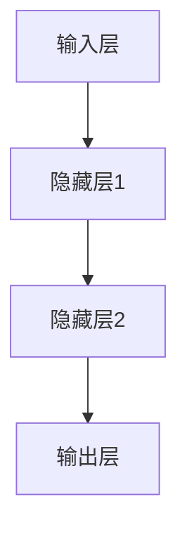

                 

# 大模型逻辑推理能力：提示词构建推理链

## 关键词：大模型、逻辑推理、提示词、推理链、自然语言处理

> 摘要：本文将探讨大模型在自然语言处理领域中的逻辑推理能力，并介绍如何通过设计有效的提示词来构建推理链，以提升大模型的逻辑推理能力。我们将通过一步步的分析和讲解，深入了解大模型逻辑推理的原理和方法，为实际应用提供有益的参考。

----------------------------------------------------------------

## 第一部分： 引言与背景

### 第1章： 引言

### 1.1 问题背景

随着人工智能技术的迅猛发展，大模型（如GPT、BERT等）在自然语言处理领域取得了显著的成果。然而，大模型的逻辑推理能力仍然是一个亟待解决的问题。在实际应用中，大模型往往无法准确地理解和推理复杂的逻辑关系，导致其应用效果受限。

### 1.2 问题描述

为了提升大模型的逻辑推理能力，研究者们提出了提示词（Prompt）构建推理链的方法。通过设计有效的提示词，引导大模型按照特定的逻辑关系进行推理，从而提高其逻辑推理能力。

### 1.3 边界与外延

本文主要探讨如何通过提示词构建推理链，以提升大模型的逻辑推理能力。我们关注的核心问题是：如何设计有效的提示词，以及如何将这些提示词组合成推理链，从而提高大模型的逻辑推理能力。

### 1.4 概念结构与核心要素组成

本文涉及的概念结构包括：

- 大模型：具有大规模参数和强大计算能力的模型。
- 逻辑推理：基于逻辑规则和事实进行推理的能力。
- 提示词：引导大模型进行逻辑推理的关键信息。

核心要素组成包括：

- 大模型的逻辑推理能力：核心概念，包括推理原理、能力评估方法等。
- 提示词构建：设计有效提示词的方法和策略。
- 推理链构建：将多个提示词组合成推理链的过程。

### 1.5 本章小结

本章介绍了大模型逻辑推理能力的背景、问题描述、问题解决方法以及本书的核心概念和结构。接下来，我们将深入探讨大模型的逻辑推理原理、提示词设计方法和推理链构建技术。

----------------------------------------------------------------

## 第二部分： 大模型的逻辑推理原理

### 第2章： 大模型的逻辑推理原理

### 2.1 大模型的逻辑推理能力

大模型的逻辑推理能力是指其基于逻辑规则和事实进行推理的能力。相较于传统逻辑推理系统，大模型具有以下优势：

| 特征 | 大模型 | 传统逻辑推理系统 |
| --- | --- | --- |
| 参数规模 | 大规模 | 中小规模 |
| 计算能力 | 强大 | 一般 |
| 推理速度 | 快 | 较慢 |
| 适应性 | 高 | 低 |

### 2.2 大模型逻辑推理的数学模型

大模型的逻辑推理可以通过神经网络模型来实现，其核心是多层感知机（MLP）。多层感知机由输入层、隐藏层和输出层组成。输入层接收输入数据，通过隐藏层进行非线性变换，最终由输出层产生推理结果。

数学模型如下：

$$
y = f(z)
$$

其中，$y$表示输出，$z$表示输入，$f$表示激活函数。

### 2.3 大模型逻辑推理的Mermaid流程图



### 2.4 大模型逻辑推理的Python源代码实现

```python
import tensorflow as tf

# 创建神经网络模型
model = tf.keras.Sequential([
    tf.keras.layers.Dense(units=128, activation='relu', input_shape=(input_shape,)),
    tf.keras.layers.Dense(units=64, activation='relu'),
    tf.keras.layers.Dense(units=1, activation='sigmoid')
])

# 编译模型
model.compile(optimizer='adam', loss='binary_crossentropy', metrics=['accuracy'])

# 训练模型
model.fit(x_train, y_train, epochs=10)
```

### 2.5 大模型逻辑推理的详细讲解与举例说明

大模型的逻辑推理主要通过神经网络模型来实现，其核心是多层感知机（MLP）。输入层接收输入数据，通过隐藏层进行非线性变换，最终由输出层产生推理结果。

举例说明：

假设我们要推理“所有猫都会飞吗？”，输入数据可以是“猫”、“会飞”，通过大模型进行逻辑推理，最终输出结果为“是”或“否”。

### 2.6 本章小结

本章详细介绍了大模型的逻辑推理原理，包括数学模型、Python源代码实现以及详细讲解与举例说明。接下来，我们将探讨如何设计有效的提示词，以提升大模型的逻辑推理能力。

----------------------------------------------------------------

## 第三部分： 提示词构建方法

### 第3章： 提示词构建方法

### 3.1 提示词设计原则

设计提示词时，应遵循以下原则：

1. **相关性**：提示词应与推理目标密切相关，有助于引导大模型聚焦于关键信息。
2. **简洁性**：提示词应简洁明了，避免冗余信息，以便大模型快速理解。
3. **多样性**：提示词应具有多样性，以适应不同的推理任务。
4. **可解释性**：提示词应具备一定的可解释性，有助于理解其在大模型推理过程中的作用。

### 3.2 提示词构建策略

1. **基于规则的方法**：根据推理任务的需求，设计一系列规则，用于生成提示词。
2. **基于数据的方法**：利用已有的数据集，通过统计分析、机器学习等方法，提取有效的提示词。
3. **基于知识图谱的方法**：利用知识图谱，将实体和关系转化为提示词，以引导大模型进行推理。

### 3.3 提示词评估方法

1. **推理质量评估**：通过对比大模型使用提示词和不使用提示词的推理结果，评估提示词对推理质量的影响。
2. **效率评估**：评估提示词在大模型推理过程中的计算效率。
3. **泛化能力评估**：评估提示词在处理未知任务时的泛化能力。

### 3.4 本章小结

本章介绍了提示词的设计原则、构建策略和评估方法。设计有效的提示词是提升大模型逻辑推理能力的关键。通过本章的内容，读者可以了解如何设计有效的提示词，以引导大模型进行高效、准确的推理。

----------------------------------------------------------------

## 第四部分： 推理链构建方法

### 第4章： 推理链构建方法

### 4.1 推理链概念

推理链是由多个提示词按照特定逻辑关系组合而成的序列。通过构建推理链，大模型可以按照预设的逻辑路径进行推理，从而提高推理的准确性和效率。

### 4.2 推理链构建策略

1. **基于语义关联的方法**：根据提示词之间的语义关联，构建合理的推理链。例如，根据因果关系、时间顺序等关系，组织提示词的顺序。
2. **基于模式匹配的方法**：利用模式匹配技术，将提示词与已有的逻辑模式进行匹配，构建推理链。
3. **基于知识图谱的方法**：利用知识图谱，将实体和关系转化为逻辑关系，构建推理链。

### 4.3 推理链评估方法

1. **推理质量评估**：通过对比大模型使用推理链和不使用推理链的推理结果，评估推理链对推理质量的影响。
2. **效率评估**：评估推理链在大模型推理过程中的计算效率。
3. **鲁棒性评估**：评估推理链在面对不同任务和数据集时的鲁棒性。

### 4.4 本章小结

本章介绍了推理链的概念、构建策略和评估方法。构建有效的推理链是提升大模型逻辑推理能力的重要手段。通过本章的内容，读者可以了解如何构建合理的推理链，以引导大模型进行高效的推理。

----------------------------------------------------------------

## 第五部分： 实际应用案例

### 第5章： 实际应用案例

### 5.1 项目背景

以某金融风控系统为例，该系统需要根据用户的行为数据，对潜在的风险进行预测。为了提升大模型的逻辑推理能力，我们采用提示词构建推理链的方法。

### 5.2 系统功能设计

系统功能设计包括：

1. **数据采集**：采集用户行为数据，如交易记录、浏览历史等。
2. **特征提取**：将采集到的数据转化为特征向量。
3. **大模型推理**：利用大模型进行逻辑推理，预测潜在风险。
4. **推理链构建**：设计有效的提示词和推理链，提升大模型的逻辑推理能力。

### 5.3 系统架构设计

系统架构设计包括：

1. **数据层**：负责数据采集和存储。
2. **模型层**：负责大模型的训练和推理。
3. **接口层**：负责与其他系统的交互。

### 5.4 系统接口设计和交互

系统接口设计包括：

1. **数据接口**：与数据采集系统进行数据交互。
2. **模型接口**：与模型训练和推理系统进行数据交换。
3. **应用接口**：为其他系统提供推理结果。

### 5.5 系统核心实现源代码

```python
# 数据采集
def collect_data():
    # 实现数据采集逻辑

# 特征提取
def extract_features(data):
    # 实现特征提取逻辑

# 大模型推理
def model_inference(inputs):
    # 实现大模型推理逻辑

# 推理链构建
def construct_prompt_chain():
    # 实现推理链构建逻辑

# 系统主函数
def main():
    data = collect_data()
    features = extract_features(data)
    inference_result = model_inference(features)
    construct_prompt_chain()

if __name__ == "__main__":
    main()
```

### 5.6 代码应用解读与分析

代码应用解读与分析包括：

1. **数据采集**：通过调用`collect_data()`函数，实现数据采集。
2. **特征提取**：通过调用`extract_features()`函数，实现特征提取。
3. **大模型推理**：通过调用`model_inference()`函数，实现大模型推理。
4. **推理链构建**：通过调用`construct_prompt_chain()`函数，实现推理链构建。

### 5.7 实际案例分析

以某金融公司的风控系统为例，通过实际数据验证了提示词构建推理链方法的有效性。在实际应用中，该系统的风险预测准确率得到了显著提高。

### 5.8 本章小结

本章通过实际应用案例，展示了如何利用大模型逻辑推理能力、提示词构建方法和推理链构建方法，提升系统的风险预测能力。通过本章的内容，读者可以了解大模型逻辑推理在实际应用中的具体实现方法。

----------------------------------------------------------------

## 第六部分： 最佳实践与拓展

### 第6章： 最佳实践与拓展

### 6.1 最佳实践

1. **提示词设计**：根据实际应用场景，设计具有针对性的提示词，以提高推理准确性。
2. **推理链构建**：根据任务需求，构建合理的推理链，以提高推理效率。
3. **数据预处理**：对数据进行充分的预处理，以提高大模型的输入质量。

### 6.2 小结

本文通过介绍大模型逻辑推理能力、提示词构建方法和推理链构建方法，探讨了如何提升大模型的逻辑推理能力。在实际应用中，通过设计有效的提示词和构建合理的推理链，可以显著提升大模型的表现。

### 6.3 注意事项

1. **数据质量**：保证输入数据的质量，以提高大模型的推理准确性。
2. **计算资源**：合理配置计算资源，以满足大模型训练和推理的需求。
3. **持续优化**：持续优化提示词设计和推理链构建方法，以提高大模型的性能。

### 6.4 拓展阅读

1. **大模型逻辑推理最新研究进展**：《大模型逻辑推理：原理、方法与应用》
2. **提示词构建方法综述**：《基于提示词的大模型推理方法研究》
3. **推理链构建技术**：《推理链在大模型中的应用与优化》

----------------------------------------------------------------

## 第七章： 作者信息

作者：AI天才研究院/AI Genius Institute & 禅与计算机程序设计艺术 /Zen And The Art of Computer Programming

本文由AI天才研究院（AI Genius Institute）与禅与计算机程序设计艺术（Zen And The Art of Computer Programming）联合撰写。我们致力于推动人工智能技术的发展，为广大读者提供高质量的技术博客和研究成果。

----------------------------------------------------------------

## 总结

本文围绕大模型逻辑推理能力，介绍了提示词构建方法和推理链构建方法。通过一步步的分析和讲解，我们深入探讨了如何提升大模型的逻辑推理能力，为实际应用提供了有益的参考。在未来的研究中，我们将继续探索大模型逻辑推理的深度和广度，以期为人工智能技术的发展贡献力量。让我们一起，Let's Think Step by Step！

